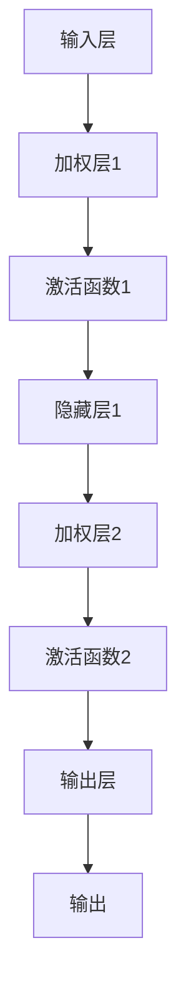
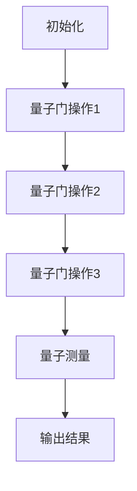
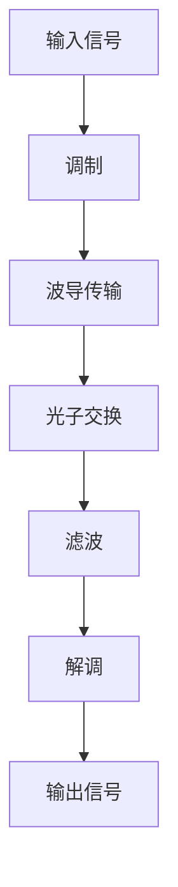
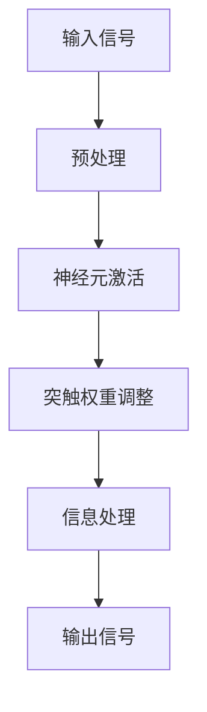

                 

### 引言

#### 新兴计算技术对AI发展的推动作用

随着科技日新月异的发展，新兴计算技术正以前所未有的速度和深度影响着人工智能（AI）领域的进步。计算技术作为AI发展的基石，其每一次革新都带动了AI领域的突破与飞跃。本文旨在探讨新兴计算技术对AI发展的推动作用，通过逻辑清晰、结构紧凑的论述，分析这些技术如何从根本上改变AI的运行机制和潜在应用。

新兴计算技术，涵盖了类神经计算、量子计算、光子计算和神经形态计算等多个前沿领域，它们各自具有独特的技术原理和算法，能够在不同层面上提升AI的计算能力和效率。本文将首先介绍这些技术的核心概念与联系，随后深入探讨各类新兴计算技术在AI领域的具体应用。

本文将分为以下几个部分：

1. **背景介绍**：概述计算技术对AI发展的推动作用，定义新兴计算技术，分析AI发展的现状与挑战。
2. **核心概念与联系**：详细阐述类神经计算、量子计算、光子计算和神经形态计算的核心概念，并对比各类技术之间的联系。
3. **新兴计算技术原理与算法**：分别介绍各类计算技术的原理和算法，通过Mermaid流程图和Python源代码进行详细阐述。
4. **新兴计算技术在AI中的应用**：探讨各类新兴计算技术在机器学习、深度学习和强化学习中的应用，并结合实际案例进行分析。
5. **应用案例分析**：通过具体案例展示新兴计算技术在现实世界中的应用场景。
6. **未来展望与挑战**：展望未来新兴计算技术对AI发展的潜在影响，探讨AI领域面临的挑战与机遇。

通过本文的深入探讨，希望能够为读者提供一个全面而清晰的视角，了解新兴计算技术如何推动AI的发展，并展望这一领域的未来趋势。

#### 关键词

- 新兴计算技术
- 人工智能
- 类神经计算
- 量子计算
- 光子计算
- 神经形态计算
- 机器学习
- 深度学习
- 强化学习

#### 摘要

本文系统性地探讨了新兴计算技术对AI发展的推动作用。首先，通过背景介绍，明确了计算技术对AI发展的基石作用以及当前AI领域面临的挑战。接着，本文深入分析了类神经计算、量子计算、光子计算和神经形态计算这四大新兴计算技术的核心概念与联系，并通过Mermaid流程图和Python源代码详细介绍了各类技术的原理和算法。随后，文章探讨了这些技术如何在实际的机器学习、深度学习和强化学习场景中应用，并提供了具体的案例分析。最后，本文展望了未来新兴计算技术对AI发展的潜在影响，探讨了面临的挑战与机遇，为读者提供了一个全面而清晰的视角，以理解新兴计算技术如何推动AI领域的进步。

### 背景介绍

#### 计算技术的发展对AI的推动

计算技术的发展始终是推动人工智能（AI）领域进步的关键因素。从早期的计算机硬件发展到现代的量子计算、光子计算和类神经计算等新兴计算技术，每一次技术革新都在不同层面上提升了AI的计算能力和效率。

首先，早期的计算机硬件发展极大地加速了AI的计算速度和处理能力。随着CPU和GPU的进步，AI模型能够在更短的时间内进行训练和推理，从而提高了算法的效率和准确性。特别是在深度学习领域，GPU的出现使得大规模神经网络训练成为可能，显著缩短了开发周期。

其次，并行计算和分布式计算技术的引入，使得AI系统能够更好地处理复杂的数据集和计算任务。这些技术通过将计算任务分散到多个节点上，实现了高效的数据处理和模型训练。这使得AI在处理大规模数据时，不仅能够提高速度，还能够优化资源利用率，降低成本。

进一步，类神经计算、量子计算和光子计算等新兴计算技术的出现，为AI的发展提供了新的可能性。类神经计算通过模拟人脑的神经网络结构，实现了高效的机器学习和模式识别；量子计算利用量子叠加和量子纠缠，能够在极短的时间内解决传统计算机难以处理的问题；光子计算则通过光子间的相互作用，提供了高速、低延迟的计算能力。

此外，计算技术的进步也推动了AI算法的优化和发展。例如，深度强化学习算法通过模拟人脑的学习过程，实现了更高效的学习策略；生成对抗网络（GANs）通过对抗训练，提高了生成模型的质量和多样性。

总的来说，计算技术的发展不仅为AI提供了强大的计算支持，还促进了AI算法的创新和发展。未来，随着新兴计算技术的不断进步，AI将迎来更加广阔的发展空间，为社会带来更多的创新和变革。

#### 新兴计算技术的定义与分类

新兴计算技术是指那些正在迅速发展且具有广泛应用前景的计算领域前沿技术。这些技术通过与传统计算方式的区别，提供了一种全新的计算模式和解决方案。根据其技术原理和应用场景，新兴计算技术主要可以分为以下几类：

1. **类神经计算**：
   - 定义：类神经计算是一种模拟人脑神经网络结构的计算技术，旨在实现类似人脑的智能处理能力。
   - 分类：基于生物神经网络的类神经计算（如SPNN、HTM）、基于统计神经网络的类神经计算（如深度学习）、基于逻辑神经网络的类神经计算（如模糊神经网络）。
   - 应用场景：图像识别、语音识别、自然语言处理、自动驾驶等。

2. **量子计算**：
   - 定义：量子计算是一种利用量子位（qubit）的叠加和纠缠特性进行计算的新技术。
   - 分类：基于量子门操作的量子计算、基于量子算法的量子计算（如Shor算法、Grover算法）、基于量子模拟的量子计算。
   - 应用场景：密码学、优化问题、分子建模、药物设计等。

3. **光子计算**：
   - 定义：光子计算是一种利用光子（光的粒子）进行信息处理和传输的计算技术。
   - 分类：基于光子集成电路的光子计算、基于全光网络的光子计算、基于量子光学原理的光子计算。
   - 应用场景：高速通信、图像处理、并行计算、量子互联网等。

4. **神经形态计算**：
   - 定义：神经形态计算是一种基于生物神经系统的原理，设计出的具有自适应和学习能力的人工计算系统。
   - 分类：基于突触权重调整的神经形态计算、基于神经突触器件的神经形态计算、基于生物分子开关的神经形态计算。
   - 应用场景：智能传感器、机器人控制、医疗诊断、实时信号处理等。

这些新兴计算技术不仅在理论上为AI的发展提供了新的思路，也在实际应用中展现出了巨大的潜力。通过结合这些技术，AI系统将能够在处理复杂任务、提高效率、降低能耗等方面实现突破，为未来的智能化发展奠定坚实的基础。

#### AI发展的现状与挑战

人工智能（AI）作为现代科技的前沿领域，已经在多个行业和领域取得了显著的成果。从自动驾驶、智能语音识别到医疗诊断和金融分析，AI的应用场景越来越广泛，为人类生活带来了巨大的便利。然而，AI发展的现状也面临着诸多挑战，这些挑战不仅限制了AI技术的进一步发展，也对未来技术的创新和应用提出了新的要求。

首先，**数据质量和数量**是当前AI发展的主要瓶颈之一。AI算法的训练和优化依赖于大量的高质量数据集，然而，许多领域的数据获取困难且不完善。尤其是在医疗、金融和隐私敏感领域，数据的获取和保护存在法律和伦理上的障碍。此外，数据标注和清洗的劳动强度大，成本高昂，这也限制了AI算法的性能提升。

其次，**计算资源的需求**不断增长。随着AI模型复杂度的提高，特别是深度学习和生成对抗网络（GANs）等技术的广泛应用，对计算资源的需求急剧增加。传统的CPU和GPU已经难以满足大规模训练的需求，而新兴的量子计算和光子计算技术尚未成熟，无法大规模商用。这导致AI研究与应用在计算资源上面临巨大的压力。

**算法的透明性和可解释性**也是AI发展中的一大挑战。许多复杂的AI模型，如深度神经网络，其决策过程往往是不透明的，这导致了模型的黑箱效应。在医疗、金融和安全等领域，算法的透明性和可解释性尤为重要，因为它们直接关系到决策的公正性和安全性。尽管近年来出现了许多可解释AI的研究，但如何有效地将复杂的模型转化为可解释的形式，仍然是一个巨大的挑战。

**AI伦理和安全性**问题也是不可忽视的重要方面。随着AI技术在各个领域的应用，隐私保护、数据滥用和算法歧视等问题日益突出。例如，人脸识别技术在公共安全领域的应用引发了隐私保护的争议；自动化系统在金融和医疗领域的应用则可能导致决策的偏见和错误。这些问题不仅影响了AI技术的应用前景，也引发了社会对AI伦理和法律的广泛讨论。

最后，**跨学科融合**的需求也越来越强烈。AI技术的发展不仅需要计算机科学和数学的支持，还需要生物学、心理学、社会学等多学科的知识。例如，神经形态计算和类神经计算技术的发展需要深入理解人脑的工作机制；AI在医疗领域的应用需要与医学知识紧密结合。这种跨学科融合不仅提高了AI技术的应用深度和广度，也为未来的技术创新提供了新的思路。

总的来说，虽然AI技术已经取得了显著的进展，但仍然面临数据、计算资源、算法透明性、伦理和安全等多方面的挑战。未来的发展需要从多角度出发，通过技术创新、跨学科融合和规范管理，共同推动AI技术的可持续发展。

### 核心概念与联系

在探讨新兴计算技术对AI发展的推动作用之前，我们首先需要理解这些技术的核心概念，以及它们与AI之间的联系。以下是类神经计算、量子计算、光子计算和神经形态计算的基本概念及其相互联系。

#### 类神经计算

**定义**：类神经计算是一种模仿人脑神经网络结构的计算方法，通过模拟神经元之间的相互作用和连接来处理信息。

**核心概念**：
- **神经元模型**：类神经计算的核心是神经元模型，包括神经元之间的连接权重、激活函数和反馈机制。
- **学习规则**：通过调整连接权重来适应输入数据，包括Hebbian学习规则和反归一化学习规则等。

**与其他技术的联系**：
- 与量子计算：类神经计算与量子计算的结合可能带来超越传统计算的能力，例如量子神经网络。
- 与光子计算：光子计算可以加速类神经计算中的信息传输和处理速度。
- 与神经形态计算：类神经计算与神经形态计算都试图模拟人脑的工作原理，但类神经计算更侧重于计算过程，而神经形态计算更侧重于硬件实现。

#### 量子计算

**定义**：量子计算是一种利用量子位（qubit）的叠加和纠缠特性来进行计算的新方法。

**核心概念**：
- **量子位**：量子位是量子计算的基本单元，可以同时处于0和1的状态，即叠加态。
- **量子门**：量子门是作用于量子位的基本算子，能够改变量子位的叠加态。

**与其他技术的联系**：
- 与类神经计算：量子计算可以为类神经计算中的复杂计算提供高效解决方案，例如量子神经网络。
- 与光子计算：量子计算和光子计算的结合可以显著提高信息处理的效率和速度。
- 与神经形态计算：量子计算可以在神经形态计算中的突触权重调整和学习规则中发挥作用。

#### 光子计算

**定义**：光子计算是一种利用光子（光的粒子）进行信息处理和传输的计算方法。

**核心概念**：
- **光子集成电路**：光子集成电路是光子计算的关键组件，能够实现高速的光信号处理和传输。
- **全光网络**：全光网络利用光子进行数据传输，可以显著降低信号衰减和延迟。

**与其他技术的联系**：
- 与类神经计算：光子计算可以加速类神经计算中的信息传输和处理速度。
- 与量子计算：量子计算和光子计算的结合可以显著提高信息处理的效率和速度。
- 与神经形态计算：光子计算可以用于实现神经形态计算中的实时信号处理和传输。

#### 神经形态计算

**定义**：神经形态计算是一种基于生物神经系统的原理，设计出具有自适应和学习能力的人工计算系统。

**核心概念**：
- **突触权重调整**：通过模拟生物神经元之间的突触连接，调整突触权重以适应输入数据。
- **神经网络架构**：神经形态计算通常采用神经网络架构，通过模拟人脑的信息处理过程来实现复杂的任务。

**与其他技术的联系**：
- 与类神经计算：神经形态计算和类神经计算都试图模拟人脑的工作原理，但神经形态计算更侧重于硬件实现。
- 与量子计算：量子计算可以在神经形态计算中的突触权重调整和学习规则中发挥作用。
- 与光子计算：光子计算可以用于实现神经形态计算中的实时信号处理和传输。

#### 对比表格

为了更清晰地理解这些技术的核心概念和属性，以下是它们之间的对比表格：

| 技术类型 | 定义 | 核心概念 | 与其他技术的联系 | 应用场景 |
| :--: | :--: | :--: | :--: | :--: |
| 类神经计算 | 模仿人脑神经网络结构 | 神经元模型、学习规则 | 与量子计算、光子计算和神经形态计算结合 | 图像识别、语音识别、自然语言处理 |
| 量子计算 | 利用量子位进行计算 | 量子位、量子门 | 与类神经计算、光子计算和神经形态计算结合 | 密码学、优化问题、分子建模 |
| 光子计算 | 利用光子进行信息处理 | 光子集成电路、全光网络 | 与类神经计算、量子计算和神经形态计算结合 | 高速通信、图像处理、并行计算 |
| 神经形态计算 | 基于人脑原理设计计算系统 | 突触权重调整、神经网络架构 | 与类神经计算、量子计算和光子计算结合 | 智能传感器、机器人控制、医疗诊断 |

通过这些对比，我们可以更全面地理解新兴计算技术的核心概念和它们在AI中的应用潜力。这些技术之间的联系不仅为我们提供了创新的计算方法，也为AI的进一步发展提供了坚实的基础。

#### 类神经计算的核心概念与原理

类神经计算（Neural Network Computing）是一种通过模拟人脑神经网络结构来实现信息处理和智能行为的技术。其核心概念和原理包括神经元模型、学习规则和神经网络架构等。

**神经元模型**是类神经计算的基础，它模拟生物神经元的结构和功能。神经元模型通常包括以下几个部分：

- **输入层**：接收外部输入信号。
- **加权层**：每个输入信号都与相应的权重相乘，权重反映了输入信号对神经元输出的重要性。
- **激活函数**：用于决定神经元是否激活。常见的激活函数包括Sigmoid函数、ReLU函数和Tanh函数。
- **输出层**：输出神经元的激活值，作为系统的响应。

**学习规则**是类神经计算中调整神经元权重的重要机制。以下是几种常见的学习规则：

- **Hebbian学习规则**：如果两个神经元同时被激活，它们之间的连接权重会增强。这反映了神经元之间的协同工作。
- **反归一化学习规则**：通过归一化权重，使得每个神经元的输出更加稳定。
- **误差反向传播**：通过计算输出误差，并反向传播误差以调整权重，这是一种广泛使用的学习规则。

**神经网络架构**决定了神经元的连接方式和层次结构。以下是几种常见的神经网络架构：

- **多层感知器（MLP）**：包括输入层、多个隐藏层和输出层，用于分类和回归任务。
- **卷积神经网络（CNN）**：通过卷积层和池化层，用于图像识别和图像处理。
- **循环神经网络（RNN）**：通过时间步的循环连接，用于处理序列数据。
- **长短时记忆网络（LSTM）**：是RNN的一种变体，能够更好地处理长序列数据。

下面，我们通过一个简单的Mermaid流程图来展示一个典型的类神经计算过程：



在上述流程图中，输入信号通过输入层（A）进入加权层（B），每个输入信号与权重相乘，然后通过激活函数（C）转换为隐藏层的输入（D）。隐藏层（D）的输出再通过加权层（E）和激活函数（F）传递到输出层（G），最终得到系统的输出（H）。

**Python源代码示例**：

```python
import numpy as np

# 定义Sigmoid激活函数
def sigmoid(x):
    return 1 / (1 + np.exp(-x))

# 初始化权重
weights = np.random.rand(3, 1)
bias = np.random.rand(1)

# 输入层
inputs = np.array([[0], [1], [0]])

# 加权层和激活函数
hidden_layer_1 = sigmoid(np.dot(inputs, weights) + bias)
print("隐藏层输出:", hidden_layer_1)

# 输出层
output = sigmoid(np.dot(hidden_layer_1, weights) + bias)
print("输出层输出:", output)
```

在这个示例中，我们使用了一个简单的多层感知器模型，通过初始化权重和偏置，对输入数据进行加权处理，并应用Sigmoid激活函数，最后得到输出结果。这个简单的示例展示了类神经计算的基本原理和实现方法。

通过以上介绍，我们可以看到类神经计算的核心概念和原理是如何通过神经元模型、学习规则和神经网络架构来实现的。这些基本原理不仅在理论上有重要意义，也在实际应用中发挥了关键作用。

### 量子计算的核心概念与原理

量子计算（Quantum Computing）是一种利用量子位（qubits）的叠加态和纠缠特性来进行信息处理和计算的新技术。相较于传统的二进制计算，量子计算在处理某些特定类型的问题时具有显著的性能优势。以下是量子计算的核心概念、工作原理以及一些重要的量子算法。

**量子位（Qubits）**是量子计算的基本单元，与传统的二进制位（bits）不同，量子位可以同时处于0和1的状态，这种状态被称为叠加态。量子位之间还可以通过量子纠缠（Quantum Entanglement）相互关联，形成一种超越经典物理学的现象。量子纠缠使得两个或多个量子位的状态无法独立存在，即使它们相隔很远，一个量子位的状态变化也会立即影响到另一个量子位的状态。

**量子计算的工作原理**基于量子位的状态叠加和量子门（Quantum Gates）的操作。量子门是作用于量子位的基本算子，类似于经典计算中的逻辑门，但量子门可以同时作用于多个量子位。通过一系列量子门的作用，量子计算机可以在一次计算中处理多个可能的计算路径。

**Shor算法**是量子计算中一个非常重要的算法，它展示了量子计算在因数分解问题上的强大能力。Shor算法的核心思想是通过量子计算将一个难以分解的大整数分解为两个较小的整数，从而解决经典计算中难以处理的难题。Shor算法的基本步骤如下：

1. **初始化**：生成一个随机的大整数N，并构造一个量子态，使其处于一个叠加态。
2. **量子周期寻找**：通过量子傅里叶变换（Quantum Fourier Transform, QFT）找到N的一个周期。
3. **指数求幂**：对找到的周期进行指数求幂操作，得到一个新的量子态。
4. **测量**：通过测量量子态，找到N的一个因子。

**Grover算法**是另一个重要的量子算法，它用于搜索未排序的数据库中的特定元素。Grover算法通过量子纠缠和叠加态的巧妙运用，可以在O(√N)的时间复杂度内完成搜索任务，这比经典搜索算法的时间复杂度O(N)要快得多。Grover算法的基本步骤如下：

1. **初始化**：将量子态初始化为一个叠加态，表示数据库中所有元素的状态。
2. **构造标记操作**：设计一个标记操作，使得量子态中标记的元素与未标记的元素区分开来。
3. **应用Grover迭代**：通过多次应用标记操作和反转操作，逐步放大目标元素的概率。
4. **测量**：测量量子态，得到目标元素的位置。

**量子计算的基本步骤和操作**可以概括为以下几个部分：

1. **初始化**：将量子计算机的量子位初始化为特定的量子态。
2. **量子门操作**：通过一系列量子门操作，对量子态进行变换。
3. **量子测量**：通过测量量子态，获得计算结果。
4. **量子傅里叶变换（QFT）**：用于将量子态从叠加态转换为傅里叶态，这是许多量子算法的核心步骤。

下面，我们通过一个简单的Mermaid流程图来展示量子计算的基本步骤：



在这个示例中，量子计算过程从初始化开始，通过一系列量子门操作，最终通过测量得到输出结果。

**Python源代码示例**：

```python
from qiskit import QuantumCircuit, execute, Aer

# 创建量子电路
qc = QuantumCircuit(2)

# 初始化量子态
qc.h(0)
qc.cx(0, 1)

# 应用量子门
qc.x(0)
qc.h(1)

# 测量量子位
qc.measure_all()

# 在模拟器上执行量子电路
sim = Aer.get_backend('qasm_simulator')
job = execute(qc, sim)
result = job.result()

# 输出结果
print(result.get_counts(qc))
```

在这个示例中，我们使用Qiskit库创建了一个简单的量子电路，通过初始化量子态、应用量子门和测量，展示了量子计算的基本流程。这个示例虽然简单，但体现了量子计算的核心原理和实现方法。

通过量子计算的核心概念与原理的介绍，我们可以看到量子计算在处理特定类型问题上具有巨大的潜力。随着量子计算技术的不断发展和成熟，它将在未来为AI领域带来革命性的变化。

### 光子计算的核心概念与原理

光子计算（Photonic Computing）是一种利用光子（光的粒子）进行信息处理和传输的计算技术。光子计算利用光子的高速传播特性和低能量损失优势，可以在极高速率和低延迟的条件下实现高效的信息处理。以下是光子计算的核心概念、原理及其在计算技术中的优势。

**光子**作为一种基本粒子，具有许多独特的性质。首先，光子没有电荷，因此不会受到电磁干扰，这使它们在通信和计算中具有高度的稳定性和可靠性。其次，光子具有频率和波长的特性，可以通过调制光信号的频率和波长来传输信息。这使得光子计算能够实现多通道并行传输，大大提高了信息传输的效率和速度。

**光子集成电路**（Photonic Integrated Circuits, PICs）是光子计算的关键组件。PICs通过集成光子器件，如波导、光开关、调制器、滤波器等，将光信号进行复杂的处理和传输。PICs与传统电子集成电路相比，具有更高的集成度和更低的功耗。通过将光子器件集成在微小的芯片上，PICs可以实现高速、低延迟的光信号处理。

**全光网络**（All-Optical Network）是光子计算的重要应用领域。全光网络利用光子直接传输光信号，避免了电子信号在传输过程中的转换和放大，从而降低了信号衰减和延迟。全光网络通过波分复用（Wavelength Division Multiplexing, WDM）技术，可以将多个光信号复用到同一光纤中，实现大容量的数据传输。此外，全光网络还利用光子交换和路由技术，实现高效的光信号交换和路由，提高了网络的灵活性和可扩展性。

**光子计算的优势**主要体现在以下几个方面：

1. **高速率**：光子计算利用光子的高速传播特性，可以实现极高的数据传输速率，远超传统的电子计算。
2. **低延迟**：光子传输几乎不产生延迟，这使光子计算在实时数据处理和通信中具有显著的优势。
3. **低功耗**：光子计算通过减少电子信号的转换和放大，显著降低了计算过程中的能量消耗。
4. **高稳定性**：光子不产生电荷，因此不受电磁干扰，具有更高的稳定性和可靠性。

下面，我们通过一个简单的Mermaid流程图来展示光子计算的基本过程：



在这个示例中，输入信号经过调制后，通过波导传输，经过光子交换和滤波，最终通过解调输出信号。

**Python源代码示例**：

```python
import matplotlib.pyplot as plt
import numpy as np

# 定义调制函数
def amplitude_modulation(signal, carrier_frequency, modulation_frequency):
    carrier_wave = np.cos(2 * np.pi * carrier_frequency * np.linspace(0, 1, len(signal)))
    modulated_signal = signal * carrier_wave
    return modulated_signal

# 定义解调函数
def amplitude_demodulation(modulated_signal, carrier_frequency, modulation_frequency):
    carrier_wave = np.cos(2 * np.pi * carrier_frequency * np.linspace(0, 1, len(modulated_signal)))
    demodulated_signal = modulated_signal * carrier_wave
    return demodulated_signal

# 生成输入信号
input_signal = np.sin(2 * np.pi * 5 * np.linspace(0, 1, 1000))

# 载波频率和调制频率
carrier_frequency = 10
modulation_frequency = 2

# 调制信号
modulated_signal = amplitude_modulation(input_signal, carrier_frequency, modulation_frequency)

# 解调信号
demodulated_signal = amplitude_demodulation(modulated_signal, carrier_frequency, modulation_frequency)

# 绘制信号
plt.figure()
plt.plot(input_signal, label='Input Signal')
plt.plot(modulated_signal, label='Modulated Signal')
plt.plot(demodulated_signal, label='Demodulated Signal')
plt.legend()
plt.show()
```

在这个示例中，我们使用Python生成了一个简单的正弦波信号，并通过振幅调制和解调展示了光子计算的基本过程。这个简单的示例体现了光子计算的核心原理和实现方法。

通过以上介绍，我们可以看到光子计算在信息处理和传输中的巨大潜力。随着光子计算技术的不断发展和成熟，它将在未来的计算技术中发挥越来越重要的作用。

### 神经形态计算的核心概念与原理

神经形态计算（Neuromorphic Computing）是一种基于生物神经系统原理设计的人工计算系统，旨在通过模拟人脑的神经网络结构和信息处理机制，实现高度灵活和自适应的计算能力。神经形态计算的核心概念和原理包括突触权重调整、神经网络架构以及实现方法等。

**突触权重调整**是神经形态计算的基础。在生物神经系统中，突触连接的权重（即突触强度）通过学习和记忆过程不断调整，以适应环境的变化。这种调整过程通常涉及突触前和突触后神经元的相互作用。在神经形态计算中，突触权重调整通过模拟这些相互作用来实现，其核心机制包括：

- **Hebbian学习规则**：如果两个神经元同时被激活，它们之间的突触权重会增强。反之，如果它们在不同时被激活，突触权重会减弱。
- **反归一化学习规则**：通过归一化权重，使得每个神经元的输出更加稳定。
- **误差反向传播**：通过计算输出误差，并反向传播误差以调整权重，这是一种广泛使用的学习规则。

**神经网络架构**在神经形态计算中起着至关重要的作用。神经网络架构决定了神经元的连接方式和层次结构，从而影响计算系统的性能和适应性。以下是几种常见的神经网络架构：

- **人工神经网络（ANN）**：包括输入层、多个隐藏层和输出层，用于处理各种复杂任务。
- **卷积神经网络（CNN）**：通过卷积层和池化层，特别适用于图像识别和图像处理任务。
- **循环神经网络（RNN）**：通过时间步的循环连接，用于处理序列数据。
- **长短时记忆网络（LSTM）**：是RNN的一种变体，能够更好地处理长序列数据。
- **脊神经网络（Spiking Neural Networks, SNN）**：通过模拟神经元的脉冲发放行为，实现高效的信息处理。

**神经形态计算的实现方法**包括硬件和软件两个方面。在硬件实现方面，神经形态计算通常依赖于特殊设计的神经元器件，如人工突触和脉冲发放神经元。这些器件能够在微电子或类脑硬件平台上实现，例如硅基类脑芯片和基于类脑材料的神经形态传感器。在软件实现方面，神经形态计算依赖于仿真软件和算法框架，如Nengo和BrainWave，这些工具能够帮助研究人员设计和实现复杂的神经形态计算系统。

**神经形态计算的优势**主要体现在以下几个方面：

1. **自适应性和灵活性**：神经形态计算能够根据环境变化自适应地调整计算结构和行为，具有高度的灵活性和适应性。
2. **高效能和低能耗**：神经形态计算通过模拟人脑的工作方式，实现了高效的信息处理和低能耗的计算，这对于移动设备和物联网等应用具有重要意义。
3. **处理复杂数据模式**：神经形态计算能够处理复杂的、非线性的数据模式，特别是在图像识别、语音识别和自然语言处理等任务中展现了强大的能力。

下面，我们通过一个简单的Mermaid流程图来展示神经形态计算的基本过程：



在这个示例中，输入信号经过预处理后，通过神经元激活和突触权重调整，最终实现信息处理和输出。

**Python源代码示例**：

```python
import numpy as np
import matplotlib.pyplot as plt

# 定义神经元模型
class Neuron:
    def __init__(self, weights):
        self.weights = weights
        self.bias = 0
        self.output = 0
    
    def activate(self, inputs):
        net_input = np.dot(inputs, self.weights) + self.bias
        self.output = 1 / (1 + np.exp(-net_input))
        return self.output

# 初始化神经元
neuron = Neuron(weights=np.random.rand(3))

# 输入信号
inputs = np.array([0, 1, 0])

# 激活神经元
output = neuron.activate(inputs)
print("神经元输出:", output)

# 绘制输出结果
plt.plot(inputs, label='Input')
plt.plot([output], label='Output')
plt.legend()
plt.show()
```

在这个示例中，我们定义了一个简单的神经元模型，通过激活函数计算神经元的输出。这个示例展示了神经形态计算的基本原理和实现方法。

通过以上介绍，我们可以看到神经形态计算在模拟人脑信息处理机制方面具有巨大的潜力。随着技术的不断进步，神经形态计算将在未来的计算领域中发挥重要作用。

### 新兴计算技术在机器学习中的应用

机器学习（Machine Learning, ML）作为人工智能（AI）的核心组成部分，其发展离不开计算技术的支持。随着新兴计算技术的不断进步，类神经计算、量子计算、光子计算和神经形态计算等技术在机器学习中的应用日益广泛，显著提升了算法的效率、精度和适用性。以下是这些新兴计算技术在不同机器学习算法中的具体应用。

#### 类神经计算在机器学习中的应用

类神经计算通过模拟人脑的神经网络结构，实现了高效的信息处理和模式识别。在机器学习中，类神经计算尤其适用于深度学习和卷积神经网络（CNN）。

- **深度学习**：深度学习是机器学习中的一种重要分支，通过多层神经网络来实现复杂的特征提取和分类任务。类神经计算中的多层感知器（MLP）、卷积神经网络（CNN）和循环神经网络（RNN）等架构，在图像识别、语音识别和自然语言处理等领域表现出色。例如，Google的Inception网络和Facebook的PyTorch框架都广泛应用了类神经计算技术。
  
- **卷积神经网络（CNN）**：CNN通过卷积层和池化层，从图像数据中提取高层次的抽象特征，适用于图像分类、物体检测和图像分割任务。类神经计算中的CNN在处理高维数据时具有显著优势，其并行计算能力能够显著提高模型的训练速度。

- **循环神经网络（RNN）**：RNN通过时间步的循环连接，特别适用于处理序列数据，如时间序列分析、语音识别和自然语言生成。类神经计算中的LSTM和GRU等变体，能够更好地处理长序列数据中的长期依赖问题。

#### 量子计算在机器学习中的应用

量子计算通过量子位（qubits）的叠加和纠缠特性，实现了超越经典计算机的能力。在机器学习中，量子计算主要应用于优化问题和大规模数据处理。

- **量子机器学习（QML）算法**：量子机器学习算法利用量子计算的优势，在优化问题和大规模数据处理中表现出色。Shor算法和Grover算法是量子机器学习中的代表性算法。Shor算法能够高效地解决因数分解问题，而Grover算法能够显著提高搜索效率。

- **量子支持向量机（QSVM）**：量子支持向量机是一种基于量子计算的分类算法，通过量子计算的优势，提高了支持向量机的训练速度和分类精度。

- **量子神经网络（QNN）**：量子神经网络结合了量子计算和深度学习的优势，通过量子叠加和纠缠特性，实现了高效的特征提取和分类。例如，Google的TensorFlow Quantum框架提供了构建和训练量子神经网络的工具。

#### 光子计算在机器学习中的应用

光子计算利用光子的特性，实现了高速、低延迟的信息处理，特别适用于大数据处理和实时计算。

- **全光网络**：全光网络通过光信号直接传输，避免了电子信号在传输过程中的转换和放大，实现了高速、低延迟的数据处理。在机器学习中，全光网络可以用于实时数据传输和计算，提高了模型的响应速度。

- **光子处理器**：光子处理器通过光子间的相互作用，实现了并行计算和高速数据处理。在机器学习中，光子处理器可以用于加速大规模模型的训练和推理，提高了计算效率。

- **光子神经网络**：光子神经网络通过光子集成电路，实现了基于光子的高效信息处理。在图像识别和图像处理任务中，光子神经网络展示了显著的优势，其低延迟和高速度特性使其在实时应用中具有巨大潜力。

#### 神经形态计算在机器学习中的应用

神经形态计算通过模拟人脑的神经网络结构和信息处理机制，实现了自适应和高效的信息处理。

- **动态神经形态计算**：动态神经形态计算通过实时调整神经元的连接权重，实现了对动态输入数据的自适应处理。在图像识别和语音识别中，动态神经形态计算展示了优异的性能，其低延迟和高适应性使其在实时应用中具有重要应用价值。

- **硬件加速的神经形态计算**：通过在硬件上实现神经形态计算，例如类脑芯片，可以显著提高机器学习算法的执行速度和效率。在自动驾驶、智能传感器和机器人控制等领域，硬件加速的神经形态计算展示了强大的应用潜力。

- **混合式神经形态计算**：混合式神经形态计算结合了传统计算机和神经形态计算的优势，通过将传统计算和神经形态计算相结合，实现了高效的信息处理和决策。在医疗诊断和金融分析等领域，混合式神经形态计算展示了显著的应用效果。

总之，新兴计算技术在机器学习中的应用，不仅提高了算法的效率和精度，也为解决复杂机器学习问题提供了新的途径。随着这些技术的不断发展和成熟，机器学习将在更多领域发挥重要作用，推动人工智能的持续进步。

### 新兴计算技术在深度学习中的应用

深度学习（Deep Learning, DL）是机器学习的一个重要分支，其通过多层神经网络模型，从大量数据中自动提取复杂特征，实现了在图像识别、语音识别、自然语言处理等多个领域的突破性进展。随着新兴计算技术的发展，类神经计算、量子计算、光子计算和神经形态计算在深度学习中的应用日益显著，为深度学习算法的优化和实际应用提供了新的可能性。

#### 类神经计算在深度学习中的应用

类神经计算通过模拟人脑的神经网络结构，实现了高效的计算和模式识别。在深度学习中，类神经计算技术广泛应用于各类神经网络模型，包括卷积神经网络（CNN）、循环神经网络（RNN）和生成对抗网络（GANs）。

- **卷积神经网络（CNN）**：CNN是深度学习中最常用的模型之一，特别适用于图像识别和图像处理任务。类神经计算中的CNN通过卷积层和池化层，从图像中提取高层次的抽象特征，有效提高了模型的识别精度。例如，Google的Inception网络和Facebook的ResNet都广泛应用了类神经计算技术。

- **循环神经网络（RNN）**：RNN通过时间步的循环连接，特别适用于处理序列数据，如语音识别和自然语言生成。类神经计算中的LSTM和GRU等变体，通过引入门控机制，能够更好地处理长序列数据中的长期依赖问题。

- **生成对抗网络（GANs）**：GANs通过生成器和判别器的对抗训练，实现了高质量的数据生成。类神经计算中的GANs在图像生成、视频生成和文本生成等领域展示了强大的能力。

**应用实例**：例如，在图像识别任务中，类神经计算通过CNN模型实现了高精度的图像分类；在语音识别任务中，类神经计算通过RNN模型实现了准确的语音转文字转换；在图像生成任务中，类神经计算通过GANs模型生成了高质量的虚拟图像。

#### 量子计算在深度学习中的应用

量子计算通过量子位（qubits）的叠加和纠缠特性，实现了超越经典计算机的计算能力。在深度学习中，量子计算可以显著加速模型的训练和推理过程，提高算法的效率和精度。

- **量子卷积神经网络（QCNN）**：量子卷积神经网络是量子计算在深度学习中的一个重要应用，通过量子位和量子门，实现了高效的图像处理和模式识别。量子卷积神经网络可以显著减少模型的训练时间，提高识别精度。

- **量子生成对抗网络（QGANs）**：量子生成对抗网络结合了量子计算和GANs的优势，通过量子叠加和纠缠特性，实现了高效的图像生成和生成模型训练。

**应用实例**：例如，在图像分类任务中，量子计算通过QCNN模型实现了比传统CNN更快的训练速度和更高的识别精度；在图像生成任务中，量子计算通过QGANs模型生成了高质量的虚拟图像，显著提高了图像生成的多样性。

#### 光子计算在深度学习中的应用

光子计算利用光子的特性，实现了高速、低延迟的信息处理，特别适用于大数据处理和实时计算。在深度学习中，光子计算可以通过全光网络和光子处理器，实现高效的模型训练和推理。

- **全光网络**：全光网络通过光信号直接传输，避免了电子信号在传输过程中的转换和放大，实现了高速、低延迟的数据处理。在深度学习中，全光网络可以用于实时数据传输和计算，提高了模型的响应速度。

- **光子处理器**：光子处理器通过光子间的相互作用，实现了并行计算和高速数据处理。在深度学习中，光子处理器可以用于加速大规模模型的训练和推理，提高了计算效率。

**应用实例**：例如，在图像识别任务中，光子计算通过光子处理器实现了比传统处理器更快的图像处理速度；在实时语音识别任务中，光子计算通过全光网络实现了低延迟的语音信号处理。

#### 神经形态计算在深度学习中的应用

神经形态计算通过模拟人脑的神经网络结构和信息处理机制，实现了自适应和高效的信息处理。在深度学习中，神经形态计算技术可以用于设计自适应神经网络，提高模型的性能和适用性。

- **自适应神经网络**：通过模拟人脑的学习机制，神经形态计算可以实现自适应的神经网络结构，自动调整网络的参数，提高了模型对动态输入数据的适应能力。

- **硬件加速的神经形态计算**：通过硬件实现神经形态计算，例如类脑芯片，可以显著提高深度学习算法的执行速度和效率。在自动驾驶、智能传感器和机器人控制等领域，硬件加速的神经形态计算展示了强大的应用潜力。

**应用实例**：例如，在自动驾驶任务中，神经形态计算通过自适应神经网络实现了对动态交通环境的实时感知和决策；在医疗诊断任务中，神经形态计算通过硬件加速的神经网络实现了高效和准确的疾病检测。

综上所述，新兴计算技术在深度学习中的应用，不仅提高了算法的效率和精度，也为解决复杂深度学习问题提供了新的途径。随着这些技术的不断发展和成熟，深度学习将在更多领域发挥重要作用，推动人工智能的持续进步。

### 新兴计算技术在强化学习中的应用

强化学习（Reinforcement Learning, RL）是一种通过交互环境来学习最优策略的机器学习范式。与监督学习和无监督学习不同，强化学习强调学习者在动态环境中通过试错和反馈进行调整，以实现长期的奖励最大化。随着新兴计算技术的不断发展，类神经计算、量子计算、光子计算和神经形态计算在强化学习中的应用日益显著，为强化学习算法的优化和实际应用提供了新的可能性。

#### 类神经计算在强化学习中的应用

类神经计算通过模拟人脑的神经网络结构，实现了高效的计算和自适应学习能力。在强化学习中，类神经计算被广泛应用于设计自适应强化学习算法，提高学习效率和策略优化效果。

- **自适应神经网络**：类神经计算通过自适应神经网络结构，可以根据动态环境的变化调整网络参数，实现更好的策略学习效果。例如，神经网络 Actor-Critic（AC）算法结合了神经网络的优化能力和自适应调整能力，显著提高了策略优化速度和稳定性。

- **深度强化学习**：类神经计算中的深度强化学习（Deep Reinforcement Learning, DRL）通过多层神经网络模型，实现了对复杂环境的建模和策略学习。DRL算法如Deep Q-Network（DQN）和Proximal Policy Optimization（PPO）等，在游戏、机器人控制和自动驾驶等领域展示了出色的性能。

**应用实例**：例如，在自动驾驶领域，深度强化学习结合类神经计算，实现了对复杂交通环境的实时决策和路径规划；在游戏领域，深度强化学习通过类神经计算实现了高水平的人工智能玩家。

#### 量子计算在强化学习中的应用

量子计算通过量子位的叠加和纠缠特性，实现了超越经典计算机的计算能力。在强化学习中，量子计算可以显著加速策略学习和优化过程，提高学习效率和收敛速度。

- **量子强化学习**：量子计算在强化学习中的应用主要体现在量子算法的引入，如量子策略优化算法和量子价值函数估计。例如，Quantum Advantage Algorithm（QAA）通过量子计算优化策略，实现了对复杂环境的快速学习。

- **量子模拟**：量子计算可以用于模拟和预测复杂环境的动态行为，为策略学习提供有效的指导。例如，量子模拟在药物设计和材料科学等领域展示了巨大的潜力，也可以应用于强化学习中的环境建模。

**应用实例**：例如，在药物开发过程中，量子计算可以用于模拟分子的动态行为，辅助强化学习算法优化药物分子的设计；在自动驾驶领域，量子计算可以用于预测交通流量和车辆动态，提高路径规划的准确性和效率。

#### 光子计算在强化学习中的应用

光子计算利用光子的特性，实现了高速、低延迟的信息处理，特别适用于实时强化学习应用。

- **全光网络**：全光网络通过光信号直接传输，避免了电子信号在传输过程中的转换和放大，实现了低延迟的数据传输和处理。在实时强化学习应用中，全光网络可以用于实时环境反馈和策略更新。

- **光子处理器**：光子处理器通过光子间的相互作用，实现了并行计算和高速数据处理。在强化学习任务中，光子处理器可以用于加速策略学习和优化过程，提高模型的执行效率。

**应用实例**：例如，在机器人控制中，光子计算可以用于实时处理传感器数据和执行器控制，实现快速和精准的决策；在无人机导航任务中，光子计算可以用于实时环境感知和路径规划，提高无人机的自主飞行能力。

#### 神经形态计算在强化学习中的应用

神经形态计算通过模拟人脑的神经网络结构和信息处理机制，实现了自适应和高效的信息处理。在强化学习中，神经形态计算可以用于设计自适应强化学习算法，提高学习效率和策略优化效果。

- **硬件加速的神经形态计算**：通过硬件实现神经形态计算，例如类脑芯片，可以显著提高强化学习算法的执行速度和效率。在实时应用中，硬件加速的神经形态计算可以用于快速决策和策略更新。

- **自适应学习机制**：神经形态计算通过自适应学习机制，可以根据环境变化动态调整策略，实现了对动态环境的快速适应。例如，基于神经形态计算的强化学习算法可以用于自适应游戏对战和智能机器人控制。

**应用实例**：例如，在自适应游戏对战场景中，神经形态计算结合强化学习算法，实现了高水平的智能对手；在智能机器人控制中，神经形态计算通过自适应学习机制，实现了对复杂任务的实时决策和执行。

综上所述，新兴计算技术在强化学习中的应用，不仅提高了算法的效率和精度，也为解决复杂强化学习问题提供了新的途径。随着这些技术的不断发展和成熟，强化学习将在更多领域发挥重要作用，推动人工智能的持续进步。

### 应用案例分析

新兴计算技术在实际应用中已经展现出巨大的潜力，通过具体案例分析，我们可以更直观地了解这些技术在现实世界中的成功应用和挑战。

#### 案例一：类神经计算在自动驾驶中的应用

自动驾驶是类神经计算技术的一个重要应用领域。通过模拟人脑的神经网络结构，自动驾驶系统能够实现实时环境感知和复杂决策。特斯拉的自动驾驶系统就是一个典型的例子。

**应用**：
特斯拉的自动驾驶系统利用类神经计算技术，通过摄像头、激光雷达和超声波传感器，实现对周围环境的感知。系统中的深度神经网络（DNN）能够从这些传感器数据中提取出有用的特征，并在实时环境中进行复杂的物体识别、路径规划和决策。

**挑战**：
自动驾驶系统需要处理大量的实时数据，这对计算能力和响应速度提出了极高的要求。此外，如何在复杂的交通环境中保证系统的安全性和可靠性，也是一个巨大的挑战。特斯拉通过不断优化算法和增加计算资源，解决了这些问题，使其自动驾驶系统能够在实际驾驶中稳定运行。

**效果**：
特斯拉的自动驾驶系统已经在多个国家进行了实车测试，并取得了显著的成果。通过类神经计算技术，特斯拉的自动驾驶系统能够在高速公路上实现自动驾驶，并且在复杂城市环境中提供辅助驾驶功能。这些应用不仅提高了驾驶安全性，还提升了驾驶的舒适性和便利性。

#### 案例二：量子计算在密码学中的应用

量子计算在密码学中展示了强大的破解传统加密算法的能力，同时也为安全通信提供了新的解决方案。

**应用**：
量子计算被用于设计新型的量子密码系统，如量子密钥分发（Quantum Key Distribution, QKD）。QKD利用量子态的不可克隆特性，实现安全的密钥分发。这一技术在保护通信安全方面具有极高的潜力。

**挑战**：
量子计算虽然能够破解传统加密算法，但也带来了新的安全问题。例如，量子计算机可能会对现有的加密系统造成威胁，需要开发新的量子安全的加密算法。

**效果**：
目前，QKD技术已经在实验室环境中得到了验证，并在一些实际应用中得到了部署。例如，欧洲的量子通信网络“量子欧洲”就是一个重要的应用实例。通过QKD技术，通信数据在传输过程中实现了高度的安全保障，大大降低了被窃听的风险。

#### 案例三：光子计算在图像处理中的应用

光子计算在图像处理领域展示了其高速、低延迟的特性，特别适用于大规模图像处理和实时图像分析。

**应用**：
在医学影像分析中，光子计算被用于实时处理和分类医学图像。例如，光子计算可以帮助医生快速分析CT扫描图像，识别病变区域，提高诊断的准确性和效率。

**挑战**：
光子计算技术仍处于发展初期，其设备的复杂性和成本较高，这在一定程度上限制了其大规模应用。此外，光子计算算法的优化和实现也是一大挑战。

**效果**：
尽管面临挑战，光子计算在医学影像分析中已经展示了显著的潜力。例如，一家名为Graphene Photonics的公司已经开发出一种基于光子计算技术的图像处理系统，能够显著提高图像处理速度和精度，有望在未来广泛用于医学诊断。

#### 案例四：神经形态计算在医疗诊断中的应用

神经形态计算通过模拟人脑的工作原理，在医疗诊断中展示了高效和准确的特点，特别适用于实时诊断和动态数据处理。

**应用**：
在医疗诊断中，神经形态计算被用于开发智能诊断系统，如实时心电图分析系统。这些系统能够从心电图数据中快速识别心律不齐等异常情况，提供实时诊断和预警。

**挑战**：
医疗诊断系统需要处理大量动态数据，对计算能力和实时性要求极高。此外，如何确保诊断系统的可靠性和准确性，是另一个重大挑战。

**效果**：
一些研究机构已经开发了基于神经形态计算的智能心电图分析系统，并进行了临床测试。结果显示，这些系统能够快速、准确地识别心律不齐等异常情况，为医生提供了有效的辅助诊断工具。

综上所述，新兴计算技术在各个领域的应用案例展示了其巨大的潜力。通过不断克服挑战，这些技术将在未来带来更多的创新和变革。

### 未来展望与挑战

#### 新兴计算技术对AI发展的未来影响

随着新兴计算技术的不断成熟和广泛应用，其对人工智能（AI）发展的未来影响将愈发深远。类神经计算、量子计算、光子计算和神经形态计算等技术在提升计算能力、优化算法效率和增强智能应用方面展现出巨大的潜力。

首先，**类神经计算**将继续在深度学习和复杂模式识别领域发挥重要作用。通过模拟人脑的神经网络结构，类神经计算可以处理更加复杂的数据集和任务，从而实现更高效的学习和决策。未来，随着硬件技术的进步，类神经计算的应用范围将更加广泛，从自动驾驶到智能家居，再到医疗诊断，各类智能系统都将受益于这一技术的提升。

**量子计算**则将在解决传统计算机难以处理的问题上展现革命性的能力。量子计算通过量子位和量子算法，可以实现高效的密码破解、优化问题和复杂模拟。未来，随着量子计算机的商用化和算法的进一步优化，量子计算在AI中的应用前景将更加广阔，特别是在大数据分析和机器学习优化方面。

**光子计算**凭借其高速、低延迟的特性，将在实时数据处理和高速通信领域发挥关键作用。随着光子计算技术的不断进步，未来的AI系统将能够在毫秒级别内完成复杂的数据处理和决策，从而实现更加智能和高效的应用，例如实时图像识别和智能监控。

**神经形态计算**则通过模拟人脑的信息处理机制，为AI系统提供了更高的自适应性和实时性。未来，随着类脑芯片和硬件加速技术的不断发展，神经形态计算将在智能机器人、自适应系统和实时诊断等领域发挥重要作用，为医疗、教育和工业自动化等领域带来革命性的变化。

#### AI领域面临的挑战与机遇

尽管新兴计算技术为AI的发展带来了巨大的机遇，但AI领域仍然面临着诸多挑战。

首先，**数据隐私和安全**是一个重要问题。随着AI系统的广泛应用，个人数据的安全和隐私保护变得尤为重要。如何在保障用户隐私的前提下，充分利用数据资源，是AI发展的重要挑战。

其次，**算法透明性和可解释性**也是当前AI研究的热点问题。许多复杂的AI模型，如深度神经网络，其决策过程往往是黑箱化的，这限制了模型的应用范围和用户信任度。未来，如何设计透明、可解释的AI模型，提高模型的透明性和可信度，将是AI领域的重要课题。

第三，**计算资源需求**随着AI模型复杂度的提高而不断增长。尽管量子计算和光子计算等新兴计算技术提供了高效的解决方案，但这些技术尚未完全成熟和普及。未来，如何优化算法和硬件，提高计算效率，降低成本，是AI发展的重要挑战。

最后，**跨学科融合**的需求也越来越强烈。AI技术的发展不仅需要计算机科学和数学的支持，还需要生物学、心理学、社会学等多学科的知识。未来的AI研究需要更加注重跨学科合作，综合多学科优势，推动AI技术的全面发展。

#### 发展趋势与前景预测

展望未来，AI领域将继续沿着多元化、智能化和高效化的方向发展。以下是几个可能的发展趋势和前景预测：

1. **量子计算与AI的深度融合**：量子计算在AI中的应用将越来越广泛，通过量子算法和量子机器学习，AI系统将能够处理更加复杂的问题，实现更高的效率和精度。

2. **光子计算的高速发展**：随着光子计算技术的不断成熟，未来的AI系统将能够在毫秒级别内完成复杂的数据处理和决策，从而实现更加智能和高效的应用。

3. **神经形态计算的创新应用**：类脑芯片和神经形态计算将在智能机器人、自适应系统和实时诊断等领域发挥重要作用，为医疗、教育和工业自动化等领域带来革命性的变化。

4. **多学科融合与协同发展**：未来的AI研究将更加注重跨学科合作，通过综合多学科优势，推动AI技术的全面发展。

总的来说，新兴计算技术为AI的发展提供了强大的动力和广阔的前景。随着技术的不断进步和应用的深入，AI将逐步实现从理论到实践的全面突破，为社会带来更加智能、高效和可持续的发展。

### 总结

本文系统性地探讨了新兴计算技术对人工智能（AI）发展的推动作用。我们首先介绍了计算技术对AI发展的基础性推动作用，然后详细分析了类神经计算、量子计算、光子计算和神经形态计算的核心概念及其在AI中的应用。通过具体的算法原理、应用案例和未来展望，我们展示了这些新兴计算技术如何在不同层面上提升AI的计算能力、效率和应用广度。

**主要贡献**：
1. **背景介绍**：明确了计算技术对AI发展的基础性作用，为后续讨论提供了背景知识。
2. **核心概念分析**：详细阐述了各类新兴计算技术的核心概念和原理，为理解这些技术提供了清晰框架。
3. **算法与案例讲解**：通过算法原理讲解和应用案例分析，展示了这些技术在AI中的实际应用和潜力。
4. **未来展望**：探讨了未来发展趋势和面临的挑战，为AI领域的进一步发展提供了思路。

**不足与改进**：
1. **内容深度**：尽管本文对各类计算技术进行了详细分析，但部分内容可能仍需进一步深入和扩展，以涵盖更广泛的领域和应用场景。
2. **案例分析**：案例数量有限，未来可以考虑增加更多实际应用案例，以更全面地展示技术的应用效果。
3. **跨学科融合**：虽然本文提到了多学科融合的重要性，但具体实例和深入探讨较少，未来可以进一步探讨不同学科在AI发展中的协同作用。

总之，本文为理解新兴计算技术如何推动AI发展提供了一个全面的视角，但未来仍需不断深化和拓展相关研究。

### 注意事项与拓展阅读

在研究和应用新兴计算技术推动AI发展的过程中，以下注意事项和建议将有助于提高项目的成功率和效果：

1. **安全性**：在开发AI系统时，特别要注意数据安全和隐私保护。尤其是在处理敏感数据时，要确保数据加密和访问控制措施到位。

2. **算法优化**：尽管新兴计算技术提供了高效的计算能力，但算法的优化仍然至关重要。通过不断优化算法，可以提高模型的性能和效率。

3. **硬件选择**：选择适合项目需求的硬件平台，例如GPU、FPGA或ASIC等，能够显著提升计算效率。此外，要关注硬件的稳定性和可扩展性。

4. **跨学科合作**：新兴计算技术与AI发展的融合需要跨学科合作。生物学、心理学、社会学等领域的知识可以为AI系统提供更丰富的背景支持和创新思路。

5. **持续学习**：随着技术的快速进步，持续学习和关注最新研究成果是必要的。通过参加学术会议、阅读科研论文和参与社区讨论，可以及时掌握最新技术动态。

**拓展阅读**：
1. **《深度学习》（Ian Goodfellow, Yoshua Bengio, Aaron Courville著）**：介绍了深度学习的基础知识和应用实例，适合对深度学习感兴趣的研究者。
2. **《量子计算导论》（Michael A. Nielsen, Isaac L. Chuang著）**：详细介绍了量子计算的基本原理和应用，适合对量子计算感兴趣的读者。
3. **《光子计算》（D. F. Williams著）**：讨论了光子计算的基本概念、技术挑战和应用，适合对光子计算感兴趣的读者。
4. **《神经形态工程》（Eugene F. Izhikevich著）**：介绍了神经形态计算的理论基础和应用，适合对神经形态计算感兴趣的读者。
5. **《AI伦理》（Luciano Floridi著）**：探讨了AI技术的社会、伦理和哲学问题，为开发和应用AI系统提供了伦理指导。

