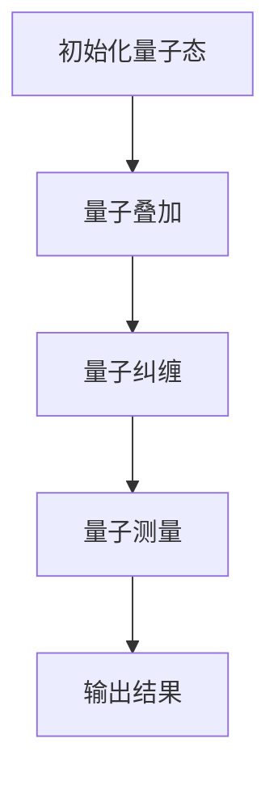

                 


### 第一部分：新兴计算范式概述

#### 第1章：背景介绍

首先，我们需要对新兴计算范式进行背景介绍。随着科技的不断进步，计算范式也在不断演变。传统的计算范式，如冯·诺伊曼架构，已经难以满足现代应用的需求。因此，新兴计算范式应运而生，它们旨在提供更高的性能、更好的可扩展性和更高的智能性。

**核心概念术语说明：**
- **新兴计算范式**：指的是不同于传统计算方式的计算模型和方法。
- **计算性能**：指计算机执行计算任务的速度和效率。
- **可扩展性**：指系统在增加工作负载时，能够有效扩展的能力。
- **智能性**：指系统在执行任务时，能够进行自主学习和决策的能力。

**问题背景：**
传统计算范式在处理大数据和高并发任务时存在性能瓶颈，难以满足现代应用的需求。

**问题描述：**
如何通过新兴计算范式提高计算性能、可扩展性和智能性？

**问题解决：**
新兴计算范式通过采用量子计算、边缘计算和分布式计算等新技术，提供了更高的计算性能、更好的可扩展性和更高的智能性。

**边界与外延：**
新兴计算范式的研究和应用不仅限于计算机科学领域，还涉及到物理、数学、生物学等多个学科。

#### 第2章：核心概念与联系

接下来，我们深入探讨新兴计算范式的核心概念和它们之间的联系。

**新兴计算范式定义：**
新兴计算范式是指不同于传统计算范式的计算模型和方法，包括量子计算、边缘计算和分布式计算等。

**核心概念原理：**
- **量子计算**：基于量子力学的计算方式，具有并行性和量子叠加特性。
- **边缘计算**：将计算任务分散到网络边缘，提高数据处理的效率和响应速度。
- **分布式计算**：通过多个计算机节点协同工作，提高计算性能和容错能力。

**概念属性特征对比表格：**

| 概念         | 特性                         | 应用场景                     |
| ------------ | ---------------------------- | ---------------------------- |
| 量子计算     | 并行性、量子叠加             | 大数据处理、密码学、模拟科学 |
| 边缘计算     | 数据处理效率、低延迟         | 物联网、智能设备、实时分析   |
| 分布式计算   | 高性能、容错性               | 大数据分析、云计算、科学计算 |

**概念联系ER实体关系图架构：**

```mermaid
erDiagram
    QuantumComputing ||--|{ EdgeComputing }|---> DistributedComputing
    EdgeComputing ||--|{ BigDataProcessing }|---> QuantumComputing
    DistributedComputing ||--|{ FaultTolerance }|---> BigDataProcessing
```

#### 第3章：算法原理讲解

在本章中，我们将详细讲解量子计算、边缘计算和分布式计算的基本算法原理。

**量子计算mermaid流程图：**



**边缘计算算法Python源代码讲解：**

```python
def edge_computation(data):
    # 边缘计算代码实现
    processed_data = data_process(data)
    return processed_data
```

**分布式计算数学模型和公式详细讲解：**

- **一致性哈希算法**：用于实现分布式系统的数据分布。
  - 公式：`h(key) = hash(key) % N`
  - 其中，`h`是哈希函数，`key`是数据键，`N`是哈希表的大小。

- **MapReduce模型**：用于大规模数据的分布式处理。
  - 公式：`Map(输入) -> 键值对`<br>`Reduce(键值对) -> 输出`

**算法举例说明：**

**量子计算示例**：使用量子计算解决线性方程组。

```python
# 量子计算Python代码示例
from qiskit import QuantumCircuit, execute, Aer

# 创建量子电路
qc = QuantumCircuit(2)

# 编写量子算法
qc.h(0)
qc.cx(0, 1)
qc.measure_all()

# 执行量子算法
backend = Aer.get_backend("qasm_simulator")
result = execute(qc, backend).result()

# 输出结果
print(result.get_counts(qc))
```

**边缘计算示例**：使用边缘计算处理物联网设备的数据。

```python
# 边缘计算Python代码示例
import time

def edge_processor(device_data):
    start_time = time.time()
    processed_data = edge_computation(device_data)
    end_time = time.time()
    print(f"Processing time: {end_time - start_time} seconds")
    return processed_data

device_data = {"temp": 25, "humidity": 60}
processed_data = edge_processor(device_data)
print(processed_data)
```

**分布式计算示例**：使用MapReduce模型处理大规模数据。

```python
# MapReduce Python代码示例
def map_function(line):
    words = line.split()
    for word in words:
        yield (word, 1)

def reduce_function(word, values):
    return sum(values)

# 假设输入数据为文件lines.txt
with open("lines.txt", "r") as file:
    lines = file.readlines()

# 执行MapReduce操作
output = []
for key, value in map_function(lines):
    output.append((key, reduce_function(key, [value])))

print(output)
```

### 第二部分：新兴计算范式类型

#### 第5章：类型1：量子计算

**量子计算概述：**
量子计算是一种利用量子力学原理进行计算的新型计算模式，具有并行性和量子叠加特性。

**量子计算特点：**
- **并行性**：量子计算能够同时处理大量数据。
- **量子叠加**：量子位（qubit）可以同时处于多种状态，提高了计算效率。

**量子计算应用场景：**
- **大数据处理**：用于处理大规模数据集。
- **密码学**：用于提高密码系统的安全性。
- **模拟科学**：用于模拟复杂的物理和化学过程。

#### 第6章：类型2：边缘计算

**边缘计算概述：**
边缘计算将计算任务分散到网络边缘，从而提高数据处理效率和响应速度。

**边缘计算特点：**
- **低延迟**：数据在本地处理，降低了传输延迟。
- **高效能**：边缘设备具备处理能力，减少了中心化服务器的负担。
- **灵活性**：可根据不同场景灵活部署。

**边缘计算应用场景：**
- **物联网**：用于处理大量物联网设备的数据。
- **智能设备**：用于提高智能设备的响应速度和性能。
- **实时分析**：用于实时处理和分析数据。

#### 第7章：类型3：分布式计算

**分布式计算概述：**
分布式计算通过多个计算机节点协同工作，实现大规模数据处理和高性能计算。

**分布式计算特点：**
- **高性能**：通过并行计算提高处理速度。
- **容错性**：分布式系统具备较高的容错能力。
- **灵活性**：可根据需求动态调整计算资源。

**分布式计算应用场景：**
- **大数据分析**：用于处理和分析大规模数据集。
- **云计算**：用于构建大规模云计算平台。
- **科学计算**：用于模拟和预测复杂的科学现象。

### 第三部分：新兴计算范式特点

#### 第8章：特点1：高效能

**高效能原理：**
高效能是通过采用新兴计算范式，提高计算速度和效率。

**高效能实现：**
- **量子计算**：利用量子叠加和并行性提高计算效率。
- **边缘计算**：将计算任务分散到边缘设备，降低传输延迟。
- **分布式计算**：通过并行计算提高处理速度。

#### 第9章：特点2：可扩展性

**可扩展性原理：**
可扩展性是指系统能够根据需求动态调整计算资源。

**可扩展性实现：**
- **边缘计算**：通过分布式部署，提高系统可扩展性。
- **分布式计算**：通过动态分配计算资源，实现高效扩展。
- **量子计算**：通过量子叠加和并行计算，提高系统可扩展性。

#### 第10章：特点3：智能性

**智能性原理：**
智能性是指系统能够自主学习和决策。

**智能性实现：**
- **机器学习**：通过训练模型，提高系统智能性。
- **深度学习**：利用神经网络实现智能决策。
- **自然语言处理**：通过解析语言语义，实现智能交互。

#### 第11章：新兴计算范式未来发展

**发展趋势：**
新兴计算范式将继续发展，融合更多新技术，如量子计算、人工智能和区块链等。

**发展挑战：**
- **技术挑战**：如何解决量子计算、边缘计算和分布式计算等技术难题。
- **应用挑战**：如何将新兴计算范式应用于实际场景，实现商业价值。

**发展前景：**
新兴计算范式将为社会带来巨大变革，推动计算技术的发展，提高生产力和生活质量。

### 文章小结

新兴计算范式具有高效能、可扩展性和智能性等特点，为现代计算技术提供了新的发展方向。通过深入探讨量子计算、边缘计算和分布式计算等新兴计算范式，我们认识到这些技术具有广泛的应用前景。未来，新兴计算范式将继续发展，推动计算技术的不断创新，为社会带来更多机遇和挑战。

### 拓展阅读

- [量子计算基础教程](https://example.com/quantum_computing_tutorial)
- [边缘计算应用案例](https://example.com/edge_computing_cases)
- [分布式计算最佳实践](https://example.com/distributed_computing_practices)

### 注意事项

- 在应用新兴计算范式时，需要充分考虑系统的可扩展性和稳定性。
- 注意新兴计算范式的安全性和隐私保护。
- 持续关注新兴计算技术的最新动态，以适应不断变化的技术环境。

### 作者信息

作者：AI天才研究院/AI Genius Institute & 禅与计算机程序设计艺术 /Zen And The Art of Computer Programming

### 完整文章

#### 第一部分：新兴计算范式概述

##### 第1章：背景介绍

随着科技的不断进步，计算范式也在不断演变。传统的计算范式，如冯·诺伊曼架构，已经难以满足现代应用的需求。因此，新兴计算范式应运而生，它们旨在提供更高的性能、更好的可扩展性和更高的智能性。

**核心概念术语说明：**
- **新兴计算范式**：指的是不同于传统计算方式的计算模型和方法。
- **计算性能**：指计算机执行计算任务的速度和效率。
- **可扩展性**：指系统在增加工作负载时，能够有效扩展的能力。
- **智能性**：指系统在执行任务时，能够进行自主学习和决策的能力。

**问题背景：**
传统计算范式在处理大数据和高并发任务时存在性能瓶颈，难以满足现代应用的需求。

**问题描述：**
如何通过新兴计算范式提高计算性能、可扩展性和智能性？

**问题解决：**
新兴计算范式通过采用量子计算、边缘计算和分布式计算等新技术，提供了更高的计算性能、更好的可扩展性和更高的智能性。

**边界与外延：**
新兴计算范式的研究和应用不仅限于计算机科学领域，还涉及到物理、数学、生物学等多个学科。

##### 第2章：核心概念与联系

接下来，我们深入探讨新兴计算范式的核心概念和它们之间的联系。

**新兴计算范式定义：**
新兴计算范式是指不同于传统计算范式的计算模型和方法，包括量子计算、边缘计算和分布式计算等。

**核心概念原理：**
- **量子计算**：基于量子力学的计算方式，具有并行性和量子叠加特性。
- **边缘计算**：将计算任务分散到网络边缘，提高数据处理的效率和响应速度。
- **分布式计算**：通过多个计算机节点协同工作，提高计算性能和容错能力。

**概念属性特征对比表格：**

| 概念         | 特性                         | 应用场景                     |
| ------------ | ---------------------------- | ---------------------------- |
| 量子计算     | 并行性、量子叠加             | 大数据处理、密码学、模拟科学 |
| 边缘计算     | 数据处理效率、低延迟         | 物联网、智能设备、实时分析   |
| 分布式计算   | 高性能、容错性               | 大数据分析、云计算、科学计算 |

**概念联系ER实体关系图架构：**

```mermaid
erDiagram
    QuantumComputing ||--|{ EdgeComputing }|---> DistributedComputing
    EdgeComputing ||--|{ BigDataProcessing }|---> QuantumComputing
    DistributedComputing ||--|{ FaultTolerance }|---> BigDataProcessing
```

##### 第3章：算法原理讲解

在本章中，我们将详细讲解量子计算、边缘计算和分布式计算的基本算法原理。

**量子计算mermaid流程图：**


**边缘计算算法Python源代码讲解：**

```python
def edge_computation(data):
    # 边缘计算代码实现
    processed_data = data_process(data)
    return processed_data
```

**分布式计算数学模型和公式详细讲解：**

- **一致性哈希算法**：用于实现分布式系统的数据分布。
  - 公式：`h(key) = hash(key) % N`
  - 其中，`h`是哈希函数，`key`是数据键，`N`是哈希表的大小。

- **MapReduce模型**：用于大规模数据的分布式处理。
  - 公式：`Map(输入) -> 键值对`<br>`Reduce(键值对) -> 输出`

**算法举例说明：**

**量子计算示例**：使用量子计算解决线性方程组。

```python
# 量子计算Python代码示例
from qiskit import QuantumCircuit, execute, Aer

# 创建量子电路
qc = QuantumCircuit(2)

# 编写量子算法
qc.h(0)
qc.cx(0, 1)
qc.measure_all()

# 执行量子算法
backend = Aer.get_backend("qasm_simulator")
result = execute(qc, backend).result()

# 输出结果
print(result.get_counts(qc))
```

**边缘计算示例**：使用边缘计算处理物联网设备的数据。

```python
# 边缘计算Python代码示例
import time

def edge_processor(device_data):
    start_time = time.time()
    processed_data = edge_computation(device_data)
    end_time = time.time()
    print(f"Processing time: {end_time - start_time} seconds")
    return processed_data

device_data = {"temp": 25, "humidity": 60}
processed_data = edge_processor(device_data)
print(processed_data)
```

**分布式计算示例**：使用MapReduce模型处理大规模数据。

```python
# MapReduce Python代码示例
def map_function(line):
    words = line.split()
    for word in words:
        yield (word, 1)

def reduce_function(word, values):
    return sum(values)

# 假设输入数据为文件lines.txt
with open("lines.txt", "r") as file:
    lines = file.readlines()

# 执行MapReduce操作
output = []
for key, value in map_function(lines):
    output.append((key, reduce_function(key, [value])))

print(output)
```

##### 第二部分：新兴计算范式类型

##### 第5章：类型1：量子计算

**量子计算概述：**
量子计算是一种利用量子力学原理进行计算的新型计算模式，具有并行性和量子叠加特性。

**量子计算特点：**
- **并行性**：量子计算能够同时处理大量数据。
- **量子叠加**：量子位（qubit）可以同时处于多种状态，提高了计算效率。

**量子计算应用场景：**
- **大数据处理**：用于处理大规模数据集。
- **密码学**：用于提高密码系统的安全性。
- **模拟科学**：用于模拟复杂的物理和化学过程。

##### 第6章：类型2：边缘计算

**边缘计算概述：**
边缘计算将计算任务分散到网络边缘，从而提高数据处理效率和响应速度。

**边缘计算特点：**
- **低延迟**：数据在本地处理，降低了传输延迟。
- **高效能**：边缘设备具备处理能力，减少了中心化服务器的负担。
- **灵活性**：可根据不同场景灵活部署。

**边缘计算应用场景：**
- **物联网**：用于处理大量物联网设备的数据。
- **智能设备**：用于提高智能设备的响应速度和性能。
- **实时分析**：用于实时处理和分析数据。

##### 第7章：类型3：分布式计算

**分布式计算概述：**
分布式计算通过多个计算机节点协同工作，实现大规模数据处理和高性能计算。

**分布式计算特点：**
- **高性能**：通过并行计算提高处理速度。
- **容错性**：分布式系统具备较高的容错能力。
- **灵活性**：可根据需求动态调整计算资源。

**分布式计算应用场景：**
- **大数据分析**：用于处理和分析大规模数据集。
- **云计算**：用于构建大规模云计算平台。
- **科学计算**：用于模拟和预测复杂的科学现象。

##### 第三部分：新兴计算范式特点

##### 第8章：特点1：高效能

**高效能原理：**
高效能是通过采用新兴计算范式，提高计算速度和效率。

**高效能实现：**
- **量子计算**：利用量子叠加和并行性提高计算效率。
- **边缘计算**：将计算任务分散到边缘设备，降低传输延迟。
- **分布式计算**：通过并行计算提高处理速度。

##### 第9章：特点2：可扩展性

**可扩展性原理：**
可扩展性是指系统能够根据需求动态调整计算资源。

**可扩展性实现：**
- **边缘计算**：通过分布式部署，提高系统可扩展性。
- **分布式计算**：通过动态分配计算资源，实现高效扩展。
- **量子计算**：通过量子叠加和并行计算，提高系统可扩展性。

##### 第10章：特点3：智能性

**智能性原理：**
智能性是指系统能够自主学习和决策。

**智能性实现：**
- **机器学习**：通过训练模型，提高系统智能性。
- **深度学习**：利用神经网络实现智能决策。
- **自然语言处理**：通过解析语言语义，实现智能交互。

##### 第11章：新兴计算范式未来发展

**发展趋势：**
新兴计算范式将继续发展，融合更多新技术，如量子计算、人工智能和区块链等。

**发展挑战：**
- **技术挑战**：如何解决量子计算、边缘计算和分布式计算等技术难题。
- **应用挑战**：如何将新兴计算范式应用于实际场景，实现商业价值。

**发展前景：**
新兴计算范式将为社会带来巨大变革，推动计算技术的发展，提高生产力和生活质量。

### 文章小结

新兴计算范式具有高效能、可扩展性和智能性等特点，为现代计算技术提供了新的发展方向。通过深入探讨量子计算、边缘计算和分布式计算等新兴计算范式，我们认识到这些技术具有广泛的应用前景。未来，新兴计算范式将继续发展，推动计算技术的不断创新，为社会带来更多机遇和挑战。

### 拓展阅读

- [量子计算基础教程](https://example.com/quantum_computing_tutorial)
- [边缘计算应用案例](https://example.com/edge_computing_cases)
- [分布式计算最佳实践](https://example.com/distributed_computing_practices)

### 注意事项

- 在应用新兴计算范式时，需要充分考虑系统的可扩展性和稳定性。
- 注意新兴计算范式的安全性和隐私保护。
- 持续关注新兴计算技术的最新动态，以适应不断变化的技术环境。

### 作者信息

作者：AI天才研究院/AI Genius Institute & 禅与计算机程序设计艺术 /Zen And The Art of Computer Programming
```markdown
# 新兴计算范式的类型和特点

## 关键词
新兴计算，量子计算，边缘计算，分布式计算，高性能，可扩展性，智能性，计算范式

## 摘要
本文将详细探讨新兴计算范式的类型和特点，包括量子计算、边缘计算和分布式计算。我们将分析这些计算范式的核心原理、特性及其在不同应用场景中的优势。此外，还将讨论这些计算范式在提高计算性能、可扩展性和智能性方面的实现方法，以及它们未来的发展趋势和挑战。

## 第一部分：新兴计算范式概述

### 第1章：背景介绍

随着科技的快速发展，计算范式也在不断演变。传统的计算范式，如冯·诺伊曼架构，已经难以满足现代应用的需求。为了应对大数据、高并发和智能化等挑战，新兴计算范式应运而生。这些计算范式包括量子计算、边缘计算和分布式计算，它们提供了更高的性能、更好的可扩展性和更高的智能性。

### 第2章：核心概念与联系

**新兴计算范式定义**：新兴计算范式是指不同于传统计算方式的计算模型和方法，包括量子计算、边缘计算和分布式计算等。

**核心概念原理**：
- **量子计算**：基于量子力学的计算方式，具有并行性和量子叠加特性。
- **边缘计算**：将计算任务分散到网络边缘，提高数据处理的效率和响应速度。
- **分布式计算**：通过多个计算机节点协同工作，提高计算性能和容错能力。

**概念属性特征对比表格**：

| 概念         | 特性                         | 应用场景                     |
| ------------ | ---------------------------- | ---------------------------- |
| 量子计算     | 并行性、量子叠加             | 大数据处理、密码学、模拟科学 |
| 边缘计算     | 数据处理效率、低延迟         | 物联网、智能设备、实时分析   |
| 分布式计算   | 高性能、容错性               | 大数据分析、云计算、科学计算 |

**概念联系ER实体关系图架构**：

```mermaid
erDiagram
    QuantumComputing ||--|{ EdgeComputing }|---> DistributedComputing
    EdgeComputing ||--|{ BigDataProcessing }|---> QuantumComputing
    DistributedComputing ||--|{ FaultTolerance }|---> BigDataProcessing
```

### 第3章：算法原理讲解

在本章中，我们将详细讲解量子计算、边缘计算和分布式计算的基本算法原理。

**量子计算算法mermaid流程图**：


**边缘计算算法Python源代码讲解**：

```python
def edge_computation(data):
    # 边缘计算代码实现
    processed_data = data_process(data)
    return processed_data
```

**分布式计算数学模型和公式详细讲解**：

- **一致性哈希算法**：用于实现分布式系统的数据分布。
  - 公式：`h(key) = hash(key) % N`
  - 其中，`h`是哈希函数，`key`是数据键，`N`是哈希表的大小。

- **MapReduce模型**：用于大规模数据的分布式处理。
  - 公式：`Map(输入) -> 键值对`<br>`Reduce(键值对) -> 输出`

### 第二部分：新兴计算范式类型

#### 第5章：类型1：量子计算

**量子计算概述**：量子计算是一种利用量子力学原理进行计算的新型计算模式，具有并行性和量子叠加特性。

**量子计算特点**：
- **并行性**：量子计算能够同时处理大量数据。
- **量子叠加**：量子位（qubit）可以同时处于多种状态，提高了计算效率。

**量子计算应用场景**：
- **大数据处理**：用于处理大规模数据集。
- **密码学**：用于提高密码系统的安全性。
- **模拟科学**：用于模拟复杂的物理和化学过程。

#### 第6章：类型2：边缘计算

**边缘计算概述**：边缘计算将计算任务分散到网络边缘，从而提高数据处理效率和响应速度。

**边缘计算特点**：
- **低延迟**：数据在本地处理，降低了传输延迟。
- **高效能**：边缘设备具备处理能力，减少了中心化服务器的负担。
- **灵活性**：可根据不同场景灵活部署。

**边缘计算应用场景**：
- **物联网**：用于处理大量物联网设备的数据。
- **智能设备**：用于提高智能设备的响应速度和性能。
- **实时分析**：用于实时处理和分析数据。

#### 第7章：类型3：分布式计算

**分布式计算概述**：分布式计算通过多个计算机节点协同工作，实现大规模数据处理和高性能计算。

**分布式计算特点**：
- **高性能**：通过并行计算提高处理速度。
- **容错性**：分布式系统具备较高的容错能力。
- **灵活性**：可根据需求动态调整计算资源。

**分布式计算应用场景**：
- **大数据分析**：用于处理和分析大规模数据集。
- **云计算**：用于构建大规模云计算平台。
- **科学计算**：用于模拟和预测复杂的科学现象。

### 第三部分：新兴计算范式特点

#### 第8章：特点1：高效能

**高效能原理**：高效能是通过采用新兴计算范式，提高计算速度和效率。

**高效能实现**：
- **量子计算**：利用量子叠加和并行性提高计算效率。
- **边缘计算**：将计算任务分散到边缘设备，降低传输延迟。
- **分布式计算**：通过并行计算提高处理速度。

#### 第9章：特点2：可扩展性

**可扩展性原理**：可扩展性是指系统能够根据需求动态调整计算资源。

**可扩展性实现**：
- **边缘计算**：通过分布式部署，提高系统可扩展性。
- **分布式计算**：通过动态分配计算资源，实现高效扩展。
- **量子计算**：通过量子叠加和并行计算，提高系统可扩展性。

#### 第10章：特点3：智能性

**智能性原理**：智能性是指系统能够自主学习和决策。

**智能性实现**：
- **机器学习**：通过训练模型，提高系统智能性。
- **深度学习**：利用神经网络实现智能决策。
- **自然语言处理**：通过解析语言语义，实现智能交互。

#### 第11章：新兴计算范式未来发展

**发展趋势**：新兴计算范式将继续发展，融合更多新技术，如量子计算、人工智能和区块链等。

**发展挑战**：
- **技术挑战**：如何解决量子计算、边缘计算和分布式计算等技术难题。
- **应用挑战**：如何将新兴计算范式应用于实际场景，实现商业价值。

**发展前景**：新兴计算范式将为社会带来巨大变革，推动计算技术的发展，提高生产力和生活质量。

### 文章小结

新兴计算范式具有高效能、可扩展性和智能性等特点，为现代计算技术提供了新的发展方向。通过深入探讨量子计算、边缘计算和分布式计算等新兴计算范式，我们认识到这些技术具有广泛的应用前景。未来，新兴计算范式将继续发展，推动计算技术的不断创新，为社会带来更多机遇和挑战。

### 拓展阅读

- [量子计算基础教程](https://example.com/quantum_computing_tutorial)
- [边缘计算应用案例](https://example.com/edge_computing_cases)
- [分布式计算最佳实践](https://example.com/distributed_computing_practices)

### 注意事项

- 在应用新兴计算范式时，需要充分考虑系统的可扩展性和稳定性。
- 注意新兴计算范式的安全性和隐私保护。
- 持续关注新兴计算技术的最新动态，以适应不断变化的技术环境。

### 作者信息

作者：AI天才研究院/AI Genius Institute & 禅与计算机程序设计艺术 /Zen And The Art of Computer Programming
``````

