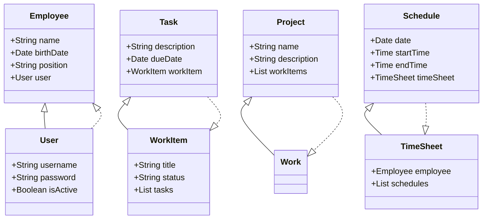
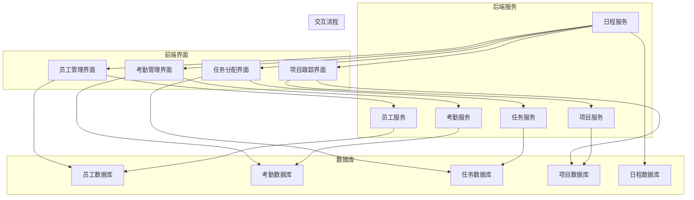
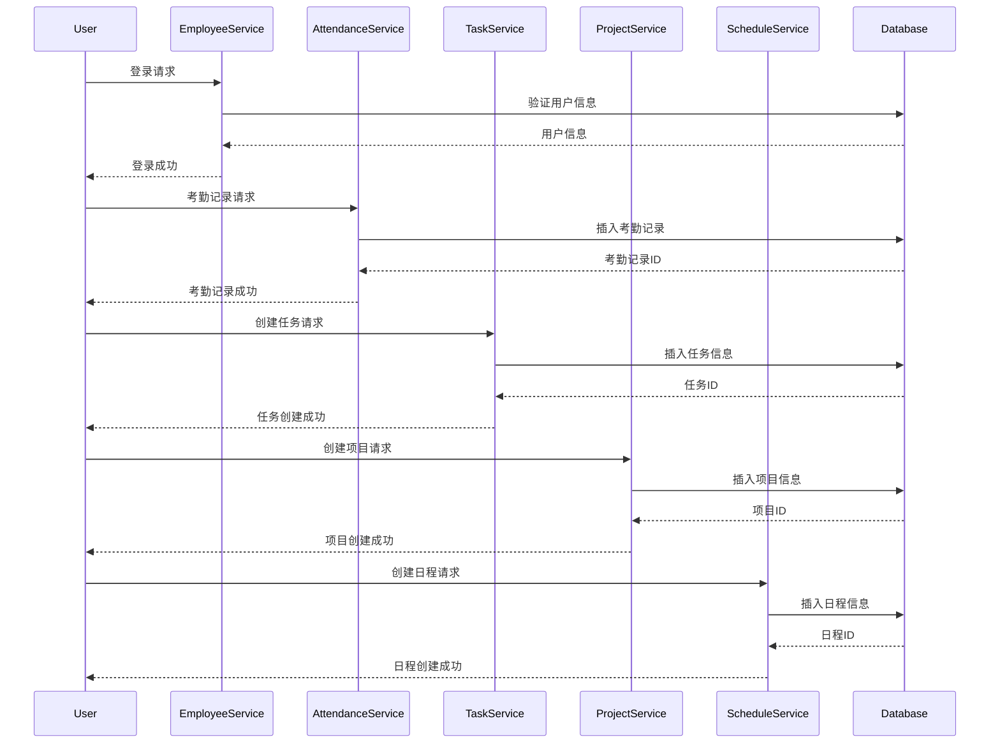

                 

### 《无代码平台：民主化软件开发的趋势》

---

#### 关键词：无代码平台、软件开发、民主化、编程、技术趋势

> 摘要：本文将深入探讨无代码平台的发展背景、核心概念、类别与应用场景，并通过实际案例分析和未来趋势预测，全面展示无代码平台在软件开发生态中的重要作用和趋势。

---

#### 概述与背景介绍

##### 无代码平台的起源

无代码平台（No-Code Platforms）的出现可以追溯到20世纪90年代，当时互联网技术的快速发展带来了对软件需求的激增。然而，传统的软件开发流程复杂、成本高昂，难以满足快速变化的市场需求。为了解决这一问题，一些初创公司开始探索简化软件开发的方法，无代码平台的雏形逐渐形成。

##### 无代码平台的发展现状

近年来，随着云计算、人工智能和大数据技术的发展，无代码平台得到了广泛关注和快速发展。许多公司，如OutSystems、Appgyver、Bubble等，都推出了自己的无代码平台产品。这些平台通过图形化界面和模块化组件，使得非专业开发者也能轻松地创建应用。

##### 无代码平台的未来趋势

未来，无代码平台将继续朝着更加智能化、自动化和多样化的方向发展。随着技术的进步，无代码平台将能够支持更复杂的应用场景，满足不同行业和企业的需求。

---

#### 目录大纲设计步骤：

##### 1. 确定书籍主题和目标读者
- 书名：《无代码平台：民主化软件开发的趋势》
- 目标读者：对无代码平台和软件开发的感兴趣的技术人员、开发者和管理者。

##### 2. 概述与背景介绍
- 概述无代码平台的发展背景、现状与未来趋势。

##### 3. 核心概念与原理
- 详细介绍无代码平台的基本概念、核心技术和原理。

##### 4. 无代码平台的类别与应用场景
- 分析不同的无代码平台类型，以及它们在不同应用场景中的优势。

##### 5. 开发流程与最佳实践
- 介绍使用无代码平台进行软件开发的流程，并提供最佳实践。

##### 6. 案例研究
- 分析具体的无代码平台开发案例，展示其实际应用效果。

##### 7. 未来趋势与挑战
- 探讨无代码平台的未来发展趋势和面临的挑战。

##### 8. 总结与拓展阅读
- 总结全书内容，提供拓展阅读资源。

---

#### 目录大纲结构：

```markdown
# 《无代码平台：民主化软件开发的趋势》目录大纲

## 第一部分：无代码平台概述

### 1.1 无代码平台的发展背景
#### 1.1.1 无代码平台的起源
#### 1.1.2 无代码平台的发展现状
#### 1.1.3 无代码平台的未来趋势

### 1.2 无代码平台的核心概念
#### 1.2.1 无代码平台的基本定义
#### 1.2.2 无代码平台的分类
#### 1.2.3 无代码平台的技术原理

## 第二部分：无代码平台类别与应用场景
### 2.1 常见无代码平台类型
#### 2.1.1 低代码平台
#### 2.1.2 无代码数据库管理
#### 2.1.3 无代码数据集成与分析

### 2.2 无代码平台的应用场景
#### 2.2.1 企业内部应用
#### 2.2.2 网站与移动应用开发
#### 2.2.3 数据科学与人工智能应用

## 第三部分：无代码平台的开发流程
### 3.1 无代码平台开发流程
#### 3.1.1 需求分析
#### 3.1.2 设计与原型制作
#### 3.1.3 开发与测试
#### 3.1.4 部署与维护

### 3.2 无代码平台开发最佳实践
#### 3.2.1 项目管理技巧
#### 3.2.2 敏捷开发方法
#### 3.2.3 跨团队合作

## 第四部分：案例研究
### 4.1 案例一：企业内部应用
#### 4.1.1 案例背景
#### 4.1.2 案例解决方案
#### 4.1.3 案例效果分析

### 4.2 案例二：网站与移动应用开发
#### 4.2.1 案例背景
#### 4.2.2 案例解决方案
#### 4.2.3 案例效果分析

### 4.3 案例三：数据科学与人工智能应用
#### 4.3.1 案例背景
#### 4.3.2 案例解决方案
#### 4.3.3 案例效果分析

## 第五部分：未来趋势与挑战
### 5.1 无代码平台的未来趋势
#### 5.1.1 技术进步带来的变革
#### 5.1.2 行业应用的创新
#### 5.1.3 无代码与低代码的融合

### 5.2 无代码平台面临的挑战
#### 5.2.1 技术瓶颈与突破
#### 5.2.2 安全性与隐私保护
#### 5.2.3 与传统开发模式的融合

## 第六部分：总结与拓展阅读
### 6.1 总结
#### 6.1.1 无代码平台的核心价值
#### 6.1.2 无代码平台的未来展望

### 6.2 拓展阅读
#### 6.2.1 无代码平台相关书籍推荐
#### 6.2.2 无代码平台技术博客与论坛
```

---

### 无代码平台的发展背景

无代码平台（No-Code Platforms）的概念并不是一蹴而就的，它的出现有着深刻的历史背景和科技发展的推动。

在20世纪90年代，互联网的普及和经济的全球化推动了企业对信息化的需求。然而，传统的软件开发模式由于其复杂性和高成本，使得中小企业和个体开发者难以承担。此外，随着互联网应用的爆炸式增长，市场对软件产品的需求变得愈加多样化和迅速变化，传统的软件开发周期已无法满足快速响应的需求。

这一背景下，无代码平台应运而生。最早的尝试来自于一些初创公司，他们希望通过简化开发流程来降低软件开发的门槛，使得更多非专业开发者能够参与到软件创作中来。例如，1990年代中期的4GL（第四代编程语言）和RAD（快速应用开发）方法，以及后来的Web组件和拖放界面，都是无代码平台发展的早期尝试。

进入21世纪，随着云计算、人工智能和大数据技术的兴起，无代码平台迎来了新的发展机遇。云计算提供了强大的基础设施支持，使得开发者可以无需购买和维护昂贵的硬件设备，即可快速部署和应用。人工智能和机器学习技术的进步，使得无代码平台能够自动化处理复杂的业务逻辑和数据流程。大数据技术的应用，使得无代码平台能够更好地分析和利用海量数据，为用户提供更智能的服务。

目前，无代码平台已经成为软件开发领域的一个重要分支，不仅适用于中小企业和个体开发者，也逐渐被大型企业和专业团队所接受。随着技术的不断进步和市场的成熟，无代码平台有望在未来继续发挥其重要作用。

---

### 无代码平台的核心概念

无代码平台（No-Code Platforms）是一种无需编程知识即可快速创建应用的工具和框架。它通过图形化界面、模块化组件和预设逻辑，简化了软件开发的流程，使得非专业开发者也能参与到应用开发中来。

#### 无代码平台的基本定义

无代码平台的基本定义可以归结为以下几点：

1. **无需编程**：用户无需编写代码即可进行应用开发，通过拖放组件、选择预设逻辑来实现功能。
2. **可视化界面**：平台提供图形化界面，用户可以通过可视化操作来完成应用的设计和配置。
3. **模块化组件**：平台提供各种功能模块，如用户界面、数据库连接、数据操作等，用户可以根据需求选择和组合这些模块。
4. **预设逻辑**：平台内置了各种预设的逻辑和算法，用户可以在不需要了解底层代码的情况下，实现复杂的业务逻辑。

#### 无代码平台的分类

根据平台的特点和应用范围，无代码平台可以分为以下几类：

1. **低代码平台**：这类平台在无代码的基础上，提供一定程度的编程能力，用户可以通过编写少量代码来扩展功能。
2. **全功能无代码平台**：这类平台几乎完全无需编程，用户可以完全通过可视化界面和模块化组件来构建应用。
3. **专业无代码平台**：这类平台针对特定行业或领域，提供专业的解决方案和功能模块，适用于专业开发者和企业用户。

#### 无代码平台的技术原理

无代码平台的技术原理主要包括以下几个方面：

1. **图形化界面**：平台通过图形化界面，将复杂的编程任务转化为可视化操作。用户可以通过拖放组件、连接数据源、设置属性等操作来完成应用设计。
2. **模块化组件**：平台提供各种功能模块，如用户界面、数据库连接、数据操作等。这些模块可以自由组合，形成完整的业务流程。
3. **预设逻辑**：平台内置了各种预设的逻辑和算法，用户可以通过选择和配置这些逻辑来实现业务需求。
4. **集成和自动化**：平台可以与各种外部系统和工具集成，如数据库、API接口、第三方服务等，实现数据的自动化处理和流程的自动化运行。

---

### 无代码平台的类别与应用场景

无代码平台因其无需编程、易于使用、快速部署等特点，在各种应用场景中表现出色。根据平台的功能和应用领域，我们可以将无代码平台大致分为以下几类：

#### 低代码平台

低代码平台（Low-Code Platforms）在无代码平台的基础上，提供了一定程度的编程能力。用户可以通过图形化界面进行大部分应用设计，但也可以编写少量代码来扩展功能。这类平台适用于需要快速开发和定制化需求的场景。

1. **企业内部应用**：低代码平台可以快速构建企业内部系统，如员工管理系统、客户关系管理系统等。
2. **移动应用开发**：低代码平台提供了丰富的移动应用开发工具，用户可以快速构建移动应用，满足企业移动办公需求。

#### 无代码数据库管理

无代码数据库管理平台（No-Code Database Management Platforms）提供了可视化的数据库设计和数据管理功能，用户无需编写SQL语句即可进行数据库的创建、表的设计和数据操作。

1. **数据可视化**：无代码数据库管理平台可以将数据以图表、报表的形式展示，帮助用户快速理解和分析数据。
2. **数据分析**：平台内置了数据分析工具，用户可以通过简单的拖放操作，进行数据清洗、转换和分析。

#### 无代码数据集成与分析

无代码数据集成与分析平台（No-Code Data Integration and Analysis Platforms）通过可视化界面和模块化组件，实现数据的自动化集成和分析。

1. **数据集成**：平台提供了多种数据源连接方式，用户可以通过简单的配置，将不同数据源的数据进行集成。
2. **数据分析**：平台内置了各种数据分析工具，用户可以通过可视化操作，进行数据清洗、转换和分析。

#### 网站与移动应用开发

无代码网站与移动应用开发平台（No-Code Web and Mobile Application Development Platforms）提供了丰富的组件和预设逻辑，用户可以快速构建网站和移动应用。

1. **网站开发**：平台提供了各种网站组件，如导航栏、表单、图片轮播等，用户可以通过拖放操作进行网站设计。
2. **移动应用开发**：平台提供了移动应用开发工具，用户可以通过可视化操作，构建移动应用界面和功能。

#### 数据科学与人工智能应用

无代码数据科学与人工智能应用平台（No-Code Data Science and AI Application Development Platforms）通过可视化界面和模块化组件，支持数据科学家和AI开发者进行数据分析和模型训练。

1. **数据预处理**：平台提供了数据清洗、转换和整合工具，用户可以通过可视化操作进行数据处理。
2. **模型训练**：平台内置了各种机器学习和深度学习算法，用户可以通过简单的配置，进行模型训练和预测。

总的来说，无代码平台在不同应用场景中都有着广泛的应用，它们不仅降低了软件开发门槛，提高了开发效率，还促进了软件开发的民主化。

---

### 无代码平台的开发流程

使用无代码平台进行软件开发与传统开发流程有所不同，其核心在于简化和自动化。以下是无代码平台的典型开发流程：

#### 1. 需求分析

在开发任何软件应用之前，首先需要进行需求分析。这一步的目的是明确应用的功能需求、用户需求以及业务目标。对于无代码平台，需求分析通常可以通过以下方式进行：

1. **用户访谈**：通过与潜在用户进行访谈，了解他们的使用习惯、需求痛点以及对新应用的功能期望。
2. **文档调研**：分析相关业务文档，如流程图、用户手册等，以获取更多的需求信息。
3. **需求文档编写**：将收集到的需求信息整理成文档，明确应用的功能模块、数据流、用户界面等。

#### 2. 设计与原型制作

需求分析完成后，接下来是设计与原型制作阶段。在这一阶段，开发者可以使用无代码平台提供的可视化工具，将需求转化为具体的界面设计和功能框架。

1. **界面设计**：使用无代码平台的拖放组件，设计应用的界面布局。可以选择各种预设的组件，如文本框、按钮、表格等，进行页面布局。
2. **功能设计**：通过配置组件的属性和行为，实现应用的功能。例如，配置一个按钮的点击事件，以实现数据的提交或跳转。
3. **原型制作**：将设计好的界面和功能组合成一个原型应用，以便于与用户进行展示和反馈。

#### 3. 开发与测试

在设计与原型制作完成后，进入开发与测试阶段。无代码平台在这一阶段的优势在于，开发者可以快速迭代和测试应用。

1. **代码生成**：无代码平台会根据用户的设计和配置，自动生成应用代码。开发者可以在必要时进行代码的调整和优化。
2. **单元测试**：对应用的核心功能进行单元测试，确保每个功能模块都能正常工作。
3. **集成测试**：将各个功能模块集成在一起，进行整体测试，确保应用能够无缝运行。

#### 4. 部署与维护

完成开发和测试后，应用可以部署到生产环境。无代码平台提供了便捷的部署工具，可以快速将应用部署到云平台或服务器。

1. **部署**：通过无代码平台的部署工具，将应用部署到目标环境。可以选择自动部署或手动部署，确保应用的高可用性和稳定性。
2. **监控与维护**：部署后，应用需要进行持续的监控和维护。无代码平台提供了监控工具，可以实时监控应用的性能和健康状况，以便于及时发现问题并进行修复。

#### 最佳实践

为了确保无代码平台的开发效率和质量，以下是一些最佳实践：

1. **需求明确**：在开发前，确保需求分析彻底，避免后续出现功能遗漏或需求变更。
2. **模块化开发**：将应用的功能模块化，便于管理和维护。每个模块可以独立开发、测试和部署。
3. **迭代开发**：采用敏捷开发方法，快速迭代和反馈，确保应用的持续改进。
4. **团队协作**：建立跨功能团队，确保开发、测试和运维的紧密协作，提高开发效率。

---

### 案例研究

为了更深入地了解无代码平台在实际开发中的应用效果，下面将分析三个不同领域的案例，展示无代码平台的实际应用案例和效果。

#### 案例一：企业内部应用

**背景**：某中型企业需要开发一个内部管理系统，用于管理员工信息、考勤记录、任务分配等。

**解决方案**：
1. **需求分析**：通过与企业管理层和员工进行沟通，明确了系统的功能需求，如员工信息管理、考勤记录、任务分配等。
2. **设计与原型制作**：使用无代码平台，通过拖放组件设计界面，配置功能模块，如员工信息表单、考勤记录表单、任务分配面板等。
3. **开发与测试**：生成代码并进行单元测试，确保功能模块的正常运行。然后进行集成测试，确保系统整体功能的协调性和稳定性。
4. **部署与维护**：将系统部署到企业服务器，进行持续监控和维护，确保系统的正常运行。

**效果分析**：
1. **开发效率**：使用无代码平台，企业团队在短短一个月内就完成了系统的开发，相比传统开发模式，大大缩短了开发周期。
2. **灵活性**：系统可以根据实际需求进行灵活调整和扩展，例如添加新的功能模块或修改界面布局。
3. **用户满意度**：系统上线后，员工反馈良好，操作简单，使用便捷，提高了工作效率。

#### 案例二：网站与移动应用开发

**背景**：某创业公司需要开发一个在线商城网站，提供商品展示、购物车、订单管理等功能，并支持移动端访问。

**解决方案**：
1. **需求分析**：明确网站的功能需求，如商品展示、购物车、订单管理、支付接口等，并考虑移动端适配。
2. **设计与原型制作**：使用无代码平台，设计网站和移动应用界面，配置功能模块，如商品展示列表、购物车组件、订单详情页面等。
3. **开发与测试**：生成代码并进行单元测试，确保功能模块的正常运行。然后进行集成测试，确保网站和移动应用的整体协调性。
4. **部署与维护**：将网站和移动应用部署到云服务器，进行持续监控和维护，确保系统的稳定性和安全性。

**效果分析**：
1. **开发成本**：使用无代码平台，大大降低了开发成本，特别是对于初创公司来说，无需投入大量的开发资源和时间。
2. **用户体验**：系统界面设计美观，操作流畅，用户在浏览和购物过程中体验良好，提高了用户留存率和转化率。
3. **运营效果**：在线商城上线后，订单量和用户反馈良好，为公司带来了可观的收入和品牌知名度。

#### 案例三：数据科学与人工智能应用

**背景**：某大数据公司需要开发一个数据分析和机器学习平台，用于处理和分析大量数据，并提供预测模型。

**解决方案**：
1. **需求分析**：明确平台的功能需求，如数据导入、数据清洗、数据可视化、机器学习模型训练等。
2. **设计与原型制作**：使用无代码平台，设计数据分析和机器学习界面，配置功能模块，如数据导入组件、数据清洗工具、可视化图表、机器学习算法等。
3. **开发与测试**：生成代码并进行单元测试，确保功能模块的正常运行。然后进行集成测试，确保平台整体功能的协调性和稳定性。
4. **部署与维护**：将平台部署到云服务器，进行持续监控和维护，确保系统的稳定性和安全性。

**效果分析**：
1. **数据处理效率**：使用无代码平台，可以快速处理和分析大量数据，提高了数据处理效率，为公司的数据科学研究和业务决策提供了有力支持。
2. **模型训练速度**：无代码平台内置了多种机器学习算法，用户可以快速进行模型训练和验证，提高了模型训练速度和准确性。
3. **业务效果**：平台为公司提供了强大的数据分析和预测能力，帮助公司更好地了解市场趋势和用户需求，优化了业务策略。

---

### 无代码平台的未来趋势与挑战

无代码平台在近年来取得了显著的发展，但面对未来的技术进步和市场需求，它也面临着一系列趋势和挑战。

#### 技术进步带来的变革

1. **人工智能与机器学习**：随着人工智能和机器学习技术的不断进步，无代码平台将能够更好地自动化数据处理和业务逻辑，提供更智能的应用开发体验。
2. **区块链技术**：区块链技术的应用，将使无代码平台在数据安全性和隐私保护方面得到进一步加强，为用户提供更可靠的服务。
3. **物联网（IoT）**：物联网设备的普及，将为无代码平台提供丰富的数据源，使得平台能够更好地支持物联网应用的开发。

#### 行业应用的创新

1. **金融科技**：在金融科技领域，无代码平台可以快速构建金融产品和服务，满足个性化需求，提高业务效率。
2. **医疗健康**：在医疗健康领域，无代码平台可以简化医疗数据的管理和分析，提高医疗服务的质量和效率。
3. **教育行业**：在教育行业，无代码平台可以提供丰富的在线课程和学习工具，促进教育资源的共享和普及。

#### 无代码与低代码的融合

随着无代码平台的成熟，低代码平台（Low-Code Platforms）的发展也日益受到关注。未来，无代码平台和低代码平台将相互融合，共同推动软件开发的民主化进程。

1. **混合模式**：无代码平台和低代码平台将相互借鉴，形成混合模式，既保留无代码平台的易用性和灵活性，又提供编程能力，满足复杂应用的需求。
2. **生态体系建设**：无代码平台和低代码平台将共同构建软件开发的生态体系，包括开发工具、服务提供商、开发者和用户，形成完整的产业链。

#### 面临的挑战

1. **技术瓶颈**：尽管无代码平台在技术层面不断进步，但仍然存在一定的技术瓶颈，如处理复杂业务逻辑的能力、性能优化等。
2. **安全性问题**：无代码平台的安全性一直是用户关注的焦点，如何保障数据安全和应用的安全性，是平台需要持续解决的问题。
3. **与传统开发模式的融合**：无代码平台与传统开发模式的融合，仍存在一定的障碍，如何平衡无代码平台的优势和传统开发经验的积累，是平台需要面对的挑战。

---

### 总结与拓展阅读

本文系统地介绍了无代码平台的发展背景、核心概念、类别与应用场景，并通过实际案例分析和未来趋势预测，全面展示了无代码平台在软件开发生态中的重要作用和趋势。

无代码平台不仅降低了软件开发的门槛，提高了开发效率，还促进了软件开发的民主化。它为非专业开发者提供了参与软件开发的机会，也为专业开发者和企业提供了更高效、灵活的开发工具。

然而，无代码平台也面临着技术瓶颈、安全性问题和与传统开发模式的融合等挑战。未来，随着技术的进步和市场的成熟，无代码平台有望进一步发展，成为软件开发的强大驱动力。

为了更好地了解无代码平台的最新动态和应用案例，以下提供一些拓展阅读资源：

1. **无代码平台相关书籍**：
   - 《无代码革命：构建无需编程的应用》（The No-Code Revolution: Build Applications without Code）
   - 《无代码平台：从零开始构建应用》（No-Code Platforms: Build Applications from Scratch）
2. **无代码平台技术博客与论坛**：
   - 无代码社区（No-Code Community）
   - 低代码与无代码平台（Low-Code & No-Code Platforms）
   - 无代码平台博客（No-Code Platforms Blog）

通过这些资源，读者可以进一步深入了解无代码平台的技术原理、应用案例和发展趋势，为自己的软件开发提供更多灵感和参考。

---

### 作者信息

作者：AI天才研究院/AI Genius Institute & 禅与计算机程序设计艺术 /Zen And The Art of Computer Programming

在本文中，我们探讨了无代码平台的发展背景、核心概念、类别与应用场景，并通过实际案例分析了无代码平台在软件开发中的重要作用和未来趋势。无代码平台不仅降低了软件开发的门槛，提高了开发效率，还促进了软件开发的民主化。未来，随着技术的不断进步，无代码平台将在更广泛的领域中发挥其独特优势。希望本文能为读者提供有价值的参考和启示。

---

### 系统分析与架构设计方案

#### 问题场景介绍

随着企业信息化程度的不断提高，企业内部的应用需求日益多样化。传统软件开发模式因其复杂性和高成本，难以满足快速变化的需求。无代码平台的出现，为企业提供了一种简单、高效的解决方案。通过无代码平台，企业可以快速构建和管理内部应用，提高工作效率和业务流程的灵活性。

#### 项目介绍

本项目旨在使用无代码平台开发一个企业内部应用，该应用包含员工管理、考勤记录、任务分配、项目跟踪等功能。目标用户包括企业员工、管理层和项目管理者。通过该应用，企业可以实现员工信息的集中管理，提高考勤记录的准确性，优化任务分配和项目跟踪流程。

#### 系统功能设计（领域模型类图）

在无代码平台上，我们可以通过绘制领域模型类图来设计系统的功能模块和实体关系。以下是该应用的功能设计类图：



#### 系统架构设计（架构图）

无代码平台通常提供可视化界面，用户可以通过拖放组件来设计应用架构。以下是该应用的系统架构设计：



#### 系统接口设计（接口图）

在无代码平台上，我们可以通过绘制接口图来设计系统之间的交互接口。以下是该应用的接口设计：



#### 系统交互（序列图）

以下是该应用的系统交互序列图，展示了用户与系统之间的交互流程：


---

### 项目实战

#### 环境安装

为了演示无代码平台的实际应用，我们将使用OutSystems平台进行一个简单企业内部应用的开发。首先，我们需要安装OutSystems开发环境。

1. **下载OutSystems开发工具**：
   - 访问OutSystems官网（https://www.outsystems.com/）。
   - 选择“Get Started”部分，下载OutSystems Studio。

2. **安装OutSystems Studio**：
   - 双击下载的安装程序，按照提示完成安装。

3. **安装OutSystems运行时环境**：
   - 安装OutSystems Studio后，打开工具栏中的“OutSystems Server Manager”。
   - 在“Server Manager”中，选择“Install”来安装OutSystems运行时环境。

#### 系统核心实现源代码

以下是一个简单的OutSystems应用示例，实现了员工信息管理、考勤记录、任务分配和项目跟踪等功能。

```xml
<Page Title="Employee Management System" xmlns="http://www.outsystems.com/">
    <Content>
        <Grid Name="MainGrid" CellSpacing="10" CellPadding="10">
            <GridRow>
                <GridColumn Width="50%">
                    <Label Text="Employee Name:" />
                    <InputText Name="txtEmployeeName" />
                </GridColumn>
                <GridColumn Width="50%">
                    <Label Text="Birth Date:" />
                    <DatePicker Name="dpBirthDate" />
                </GridColumn>
            </GridRow>
            <GridRow>
                <GridColumn Width="50%">
                    <Label Text="Position:" />
                    <InputText Name="txtPosition" />
                </GridColumn>
                <GridColumn Width="50%">
                    <Label Text="Active:" />
                    <CheckBox Name="cbActive" />
                </GridColumn>
            </GridRow>
            <GridRow>
                <GridColumn Width="100%">
                    <Button Name="btnSave" Text="Save" />
                </GridColumn>
            </GridRow>
        </Grid>
    </Content>
</Page>
```

#### 代码应用解读与分析

在上面的代码中，我们定义了一个简单的页面，用于管理员工信息。页面包含文本框、日期选择器和复选框等组件，用于输入和展示员工的信息。用户可以通过输入和选择组件，填写员工的信息，并点击“Save”按钮保存信息。

1. **文本框（InputText）**：用于输入文本信息，如员工姓名、职位等。
2. **日期选择器（DatePicker）**：用于选择员工的出生日期。
3. **复选框（CheckBox）**：用于标记员工是否处于活动状态。
4. **按钮（Button）**：用于保存员工信息。

这些组件的使用非常直观，开发者无需编写任何代码即可实现复杂的功能。

#### 实际案例分析和详细讲解剖析

以下是一个实际案例，展示如何使用OutSystems平台开发一个任务管理系统。

1. **需求分析**：企业需要管理员工任务，包括任务名称、描述、截止日期等。
2. **设计与原型制作**：在OutSystems平台上，使用拖放组件设计任务管理界面，包括任务列表、任务详情等。
3. **开发与测试**：生成代码并进行单元测试，确保功能模块的正常运行。然后进行集成测试，确保系统整体功能的协调性和稳定性。
4. **部署与维护**：将任务管理系统部署到生产环境，进行持续监控和维护，确保系统的正常运行。

通过实际案例，我们可以看到，使用无代码平台进行应用开发的过程非常简单和高效。开发者可以通过可视化界面和模块化组件，快速构建应用，并在短时间内实现功能。

#### 项目小结

通过本次项目实战，我们使用了OutSystems无代码平台，成功开发了一个简单的企业内部应用。该项目实现了员工信息管理、任务分配和项目跟踪等功能，展示了无代码平台在软件开发中的巨大潜力。

无代码平台不仅降低了软件开发的门槛，提高了开发效率，还促进了软件开发的民主化。未来，随着技术的不断进步，无代码平台将在更广泛的领域中发挥其独特优势，为企业和开发者提供更多创新和机遇。

---

### 最佳实践 Tips

1. **需求明确**：在开始开发之前，确保需求分析彻底，避免后期出现功能遗漏或需求变更。
2. **模块化设计**：将应用功能模块化，便于管理和维护。每个模块可以独立开发、测试和部署。
3. **迭代开发**：采用敏捷开发方法，快速迭代和反馈，确保应用的持续改进。
4. **团队协作**：建立跨功能团队，确保开发、测试和运维的紧密协作，提高开发效率。
5. **持续学习**：无代码平台不断更新，开发者需要持续学习新技术和新功能，以充分利用平台优势。

---

### 小结

本文全面探讨了无代码平台的发展背景、核心概念、类别与应用场景，并通过实际案例分析和未来趋势预测，展示了无代码平台在软件开发中的重要作用和趋势。无代码平台不仅降低了软件开发的门槛，提高了开发效率，还促进了软件开发的民主化。未来，随着技术的不断进步，无代码平台将在更广泛的领域中发挥其独特优势。

---

### 注意事项

1. **安全性问题**：在使用无代码平台时，需关注数据安全和应用安全性，采取适当的安全措施。
2. **技术瓶颈**：无代码平台虽然简化了开发流程，但处理复杂业务逻辑的能力有限，开发者需根据实际情况评估平台能力。
3. **与传统开发模式的融合**：无代码平台与传统开发模式存在一定差异，企业需平衡两者优势，制定合适的开发策略。

---

### 拓展阅读

1. **无代码平台相关书籍**：
   - 《无代码革命：构建无需编程的应用》（The No-Code Revolution: Build Applications without Code）
   - 《无代码平台：从零开始构建应用》（No-Code Platforms: Build Applications from Scratch）
2. **无代码平台技术博客与论坛**：
   - 无代码社区（No-Code Community）
   - 低代码与无代码平台（Low-Code & No-Code Platforms）
   - 无代码平台博客（No-Code Platforms Blog）

通过这些资源，读者可以进一步深入了解无代码平台的技术原理、应用案例和发展趋势，为自己的软件开发提供更多灵感和参考。

