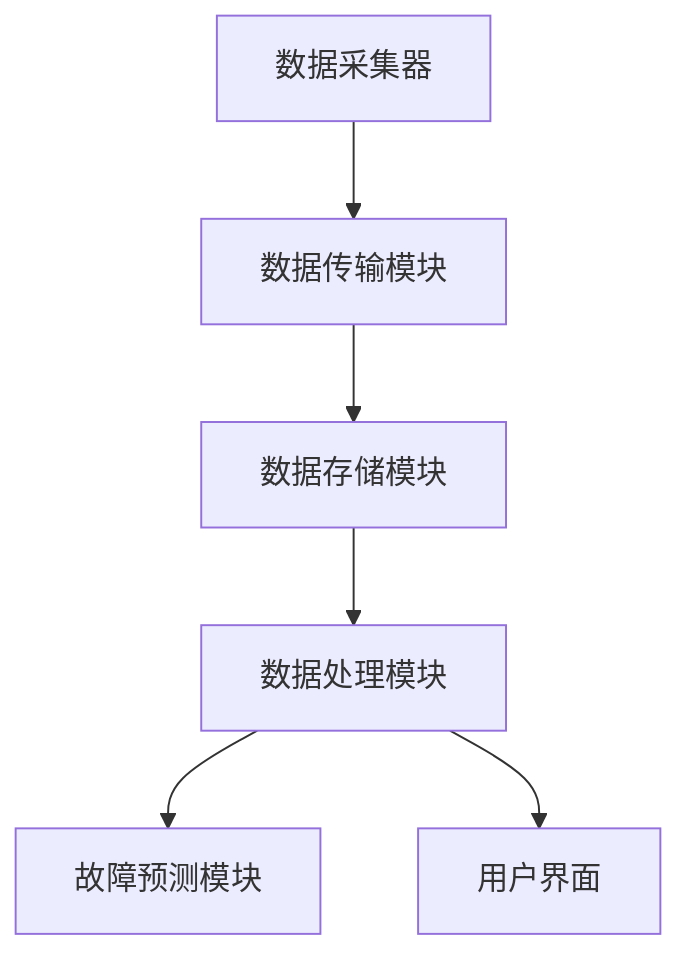
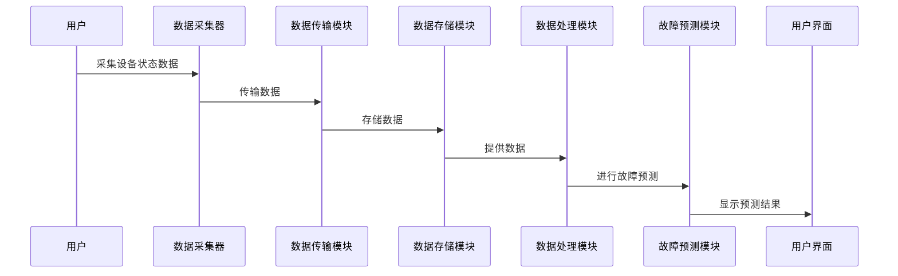

                 

# 无处不在的智能：物联网在企业环境中的应用

## 关键词

物联网（IoT），企业应用，传感器，大数据，人工智能，云计算，智能技术

## 摘要

随着物联网技术的不断发展和智能化水平的提升，物联网在企业环境中的应用变得越来越广泛。本文将详细介绍物联网的基本概念、核心技术，以及其在制造业、物流与供应链管理、智慧城市建设中的应用，同时探讨物联网与大数据、人工智能、云计算的融合，分析物联网在企业环境中的发展趋势和未来挑战。通过一系列实践案例的剖析，为读者提供全面的物联网应用指南。

## 目录大纲

### 第一部分：物联网基础知识

- **第1章：物联网概述**
  - **1.1 物联网的基本概念**
  - **1.2 物联网的架构与层次**
  - **1.3 物联网的核心技术**
- **第2章：物联网在企业环境中的应用**
  - **3.1 物联网在制造业中的应用**
  - **3.2 物联网在物流与供应链管理中的应用**
  - **3.3 物联网在智慧城市建设中的应用**

### 第二部分：物联网在企业环境中的实践

- **第4章：物联网在企业环境中的部署与实践**
  - **4.1 物联网部署的准备工作**
  - **4.2 物联网设备连接与配置**
  - **4.3 数据采集与处理**
- **第5章：物联网在企业环境中的案例分析**

### 第三部分：物联网与智能技术的融合

- **第6章：物联网与智能技术的融合**
  - **6.1 物联网与大数据的融合**
  - **6.2 物联网与人工智能的融合**
  - **6.3 物联网与云计算的融合**
- **第7章：物联网在企业环境中的未来发展**

## 第一部分：物联网基础知识

### 第1章：物联网概述

#### 1.1 物联网的基本概念

物联网（Internet of Things，简称IoT）是指通过各种信息传感器设备（如传感器、射频识别技术、全球定位系统、红外感应器等）实时采集任何需要监控、连接、互动的物体或过程，将这些信息与互联网相连接，以实现智能化识别、定位、跟踪、监控和管理的一种网络技术。

#### 1.2 物联网的架构与层次

物联网架构通常包括以下几个层次：

1. **感知层**：负责数据采集，通过各种传感器获取物理世界的信息。
2. **网络层**：负责数据的传输和通信，通过有线或无线网络将感知层采集到的数据传输到中心服务器。
3. **平台层**：负责数据的处理、存储和分析，提供云计算、大数据处理等服务。
4. **应用层**：负责将处理后的数据应用于具体的行业或业务场景，提供智能化的解决方案。

#### 1.3 物联网的核心技术

物联网的实现涉及多个关键技术：

1. **传感器技术**：负责数据的采集，包括温度、湿度、压力、光强、位置等多种信息。
2. **网络通信技术**：包括无线通信、有线通信和互联网等多种方式，实现数据的有效传输。
3. **数据处理与分析技术**：利用云计算、大数据等技术，对采集到的数据进行分析和挖掘，提供智能化的决策支持。
4. **安全与隐私技术**：保障物联网系统的安全性，防止数据泄露和设备被非法控制。

### 第2章：物联网核心技术

#### 2.1 传感器技术

传感器技术是物联网感知层的关键技术，它通过将物理信号转换为电信号，实现对环境、物体状态的监测。传感器可以分为以下几类：

1. **温度传感器**：如热电偶、热敏电阻等。
2. **湿度传感器**：如电容式湿度传感器、电阻式湿度传感器等。
3. **压力传感器**：如弹性元件压力传感器、电容式压力传感器等。
4. **光传感器**：如光敏电阻、光电二极管等。

#### 2.2 网络技术

物联网的网络技术主要包括无线通信技术和有线通信技术：

1. **无线通信技术**：如Wi-Fi、蓝牙、ZigBee、NFC等，它们具有成本低、部署方便等优点。
2. **有线通信技术**：如以太网、光纤等，它们具有传输速度快、稳定性高等优点。

#### 2.3 数据处理技术

数据处理技术是物联网的核心技术之一，主要包括：

1. **数据采集与传输**：通过传感器网络和通信网络，实现数据的实时采集和传输。
2. **数据存储**：利用云存储、分布式数据库等技术，实现大规模数据的存储和管理。
3. **数据分析与挖掘**：通过大数据技术、机器学习等技术，对数据进行分析和挖掘，提取有用信息。

### 第3章：物联网在企业环境中的应用

#### 3.1 物联网在制造业中的应用

在制造业中，物联网的应用主要集中在以下几个方面：

1. **生产过程监控**：通过传感器实时监控生产设备的状态，提高生产过程的自动化和智能化水平。
2. **设备维护与故障预测**：利用物联网技术，实现对设备的远程监控和故障预测，降低设备故障率，延长设备寿命。
3. **质量检测与追溯**：利用物联网技术，实现对产品质量的实时检测和追溯，提高产品质量管理水平。

#### 3.2 物联网在物流与供应链管理中的应用

物联网技术在物流与供应链管理中的应用主要体现在以下几个方面：

1. **货物追踪与监控**：通过传感器和定位技术，实现对货物的实时追踪和监控，提高物流效率。
2. **仓储管理**：利用物联网技术，实现对仓储环境的实时监控和管理，提高仓储利用率。
3. **运输调度与优化**：通过物联网技术，实现对运输过程的实时监控和优化，降低运输成本。

#### 3.3 物联网在智慧城市建设中的应用

智慧城市建设中，物联网技术发挥着关键作用，主要体现在以下几个方面：

1. **城市基础设施管理**：通过物联网技术，实现对城市供水、供电、交通等基础设施的实时监控和管理，提高城市运行效率。
2. **环境监测与治理**：利用物联网技术，实现对空气质量、水质、噪声等环境因素的实时监测，提供科学的治理方案。
3. **智能交通管理**：通过物联网技术，实现交通流量的实时监控和智能调控，提高交通运行效率。

## 第二部分：物联网在企业环境中的实践

### 第4章：物联网在企业环境中的部署与实践

#### 4.1 物联网部署的准备工作

在进行物联网部署前，需要进行充分的准备工作，主要包括以下几个方面：

1. **需求分析**：明确物联网应用的目标和需求，确定需要采集的数据和需要实现的功能。
2. **技术选型**：根据需求，选择合适的传感器、通信协议、数据处理平台等技术。
3. **设备选型**：根据技术选型，选择适合的传感器设备、通信设备等硬件设备。
4. **系统规划**：制定物联网系统的总体设计方案，包括网络架构、数据处理流程等。

#### 4.2 物联网设备连接与配置

物联网设备的连接与配置是物联网部署的重要环节，主要包括以下几个方面：

1. **设备接入**：将传感器设备通过有线或无线方式接入到物联网网络中。
2. **设备配置**：对传感器设备进行参数配置，包括数据采集频率、通信地址等。
3. **设备调试**：通过调试工具，对设备进行测试和调试，确保设备正常运行。

#### 4.3 数据采集与处理

物联网的数据采集与处理是物联网系统的核心，主要包括以下几个方面：

1. **数据采集**：通过传感器设备，实时采集环境、设备等数据。
2. **数据传输**：通过物联网网络，将采集到的数据传输到中心服务器。
3. **数据处理**：利用大数据、云计算等技术，对传输来的数据进行处理和分析，提取有用信息。

### 第5章：物联网在企业环境中的案例分析

#### 5.1 案例一：制造业物联网应用案例

**案例背景与目标**：某制造业企业，希望通过物联网技术实现生产过程的自动化和智能化，提高生产效率，降低生产成本。

**案例解决方案**：企业采用物联网技术，实现了生产设备的实时监控、故障预测和生产过程的优化。具体方案如下：

1. **传感器部署**：在生产线上安装各种传感器，如温度传感器、速度传感器等，实时采集生产设备的数据。
2. **网络连接**：采用无线网络技术，将传感器数据传输到中心服务器。
3. **数据处理**：利用大数据技术，对传感器数据进行处理和分析，实现对生产过程的实时监控和优化。

**案例实施与效果评估**：通过物联网技术的应用，企业实现了生产过程的自动化和智能化，生产效率提高了30%，生产成本降低了20%。

#### 5.2 案例二：智慧物流与供应链管理案例

**案例背景与目标**：某物流企业，希望通过物联网技术实现货物的实时追踪和监控，提高物流效率。

**案例解决方案**：企业采用物联网技术，实现了货物的全程追踪和监控，具体方案如下：

1. **货物标识**：为每件货物安装RFID标签，实现货物的唯一标识。
2. **网络连接**：通过无线网络技术，将RFID标签的数据传输到中心服务器。
3. **数据处理**：利用大数据技术，对货物数据进行处理和分析，实现对货物的实时追踪和监控。

**案例实施与效果评估**：通过物联网技术的应用，企业实现了货物的全程追踪和监控，物流效率提高了20%，客户满意度提高了15%。

#### 5.3 案例三：智慧城市建设中的物联网应用案例

**案例背景与目标**：某城市，希望通过物联网技术实现城市基础设施的智能化管理，提高城市运行效率。

**案例解决方案**：城市采用物联网技术，实现了城市基础设施的实时监控和管理，具体方案如下：

1. **设备安装**：在城市的供水、供电、交通等基础设施上安装各种传感器，实现基础设施的实时监控。
2. **网络连接**：通过无线网络技术，将传感器数据传输到中心服务器。
3. **数据处理**：利用大数据技术，对基础设施数据进行处理和分析，实现对基础设施的智能化管理。

**案例实施与效果评估**：通过物联网技术的应用，城市实现了基础设施的智能化管理，城市运行效率提高了30%，居民生活质量得到了显著提高。

## 第三部分：物联网与智能技术的融合

### 第6章：物联网与智能技术的融合

#### 6.1 物联网与大数据的融合

物联网与大数据的融合主要体现在以下几个方面：

1. **数据采集与存储**：物联网技术可以采集大量的数据，而大数据技术可以对这些数据进行存储和管理。
2. **数据处理与分析**：大数据技术可以对物联网采集到的海量数据进行处理和分析，提取有用信息。
3. **智能决策**：通过大数据分析，可以为物联网应用提供智能决策支持，实现更加智能化的管理。

#### 6.2 物联网与人工智能的融合

物联网与人工智能的融合主要体现在以下几个方面：

1. **智能感知**：物联网技术可以采集环境、设备等信息，而人工智能技术可以对这些信息进行智能分析，实现智能感知。
2. **智能控制**：通过人工智能技术，可以对物联网设备进行智能控制，实现自动化和智能化管理。
3. **智能决策**：通过人工智能技术，可以对物联网采集的数据进行智能分析，提供智能决策支持。

#### 6.3 物联网与云计算的融合

物联网与云计算的融合主要体现在以下几个方面：

1. **数据存储与处理**：云计算技术可以提供强大的计算能力和存储能力，为物联网数据处理提供支持。
2. **平台服务**：云计算技术可以提供各种平台服务，如大数据处理、人工智能服务等，为物联网应用提供支持。
3. **弹性扩展**：云计算技术可以实现资源的弹性扩展，为物联网应用提供可靠的技术保障。

### 第7章：物联网在企业环境中的未来发展

#### 7.1 物联网技术的发展趋势

物联网技术的发展趋势主要体现在以下几个方面：

1. **智能化**：物联网技术将更加智能化，实现设备间的自主通信和协作。
2. **泛在化**：物联网技术将覆盖到更广泛的领域和场景，实现万物互联。
3. **安全性**：物联网技术将更加注重安全性，保障数据的安全传输和存储。

#### 7.2 物联网在企业环境中的发展趋势

物联网在企业环境中的发展趋势主要体现在以下几个方面：

1. **全面应用**：物联网技术将在更多行业中得到应用，实现全方位的智能化管理。
2. **深度融合**：物联网技术将与大数据、人工智能、云计算等智能技术深度融合，实现更加智能化的应用。
3. **创新应用**：物联网技术将不断创新，为企业和行业带来新的商业机会和增长点。

#### 7.3 物联网在企业环境中的未来挑战

物联网在企业环境中的未来挑战主要体现在以下几个方面：

1. **数据隐私**：随着物联网数据的增加，数据隐私和安全问题将成为重要挑战。
2. **标准化**：物联网技术的标准化工作需要进一步加强，以推动物联网的广泛应用。
3. **技术更新**：物联网技术更新速度较快，企业需要不断跟进新技术，以保持竞争力。

## 结束语

物联网技术的快速发展，为企业带来了新的机遇和挑战。通过本文的探讨，我们了解了物联网的基本概念、核心技术，以及在企业环境中的应用和未来发展。物联网与大数据、人工智能、云计算等智能技术的融合，将为企业带来更加智能化、高效化的管理和服务。面对未来，企业需要积极拥抱物联网技术，探索创新应用，以实现可持续发展和竞争优势。

### 作者

作者：AI天才研究院/AI Genius Institute & 禅与计算机程序设计艺术 /Zen And The Art of Computer Programming

## 附录：物联网技术术语解释

### 物联网（IoT）

物联网是指通过互联网将各种设备、传感器和系统连接起来，实现信息的实时传输、共享和处理，从而实现智能化管理和控制的技术。

### 传感器

传感器是物联网系统中的重要组成部分，用于感知物理世界的信息，如温度、湿度、光强、位置等。

### 网络协议

网络协议是物联网系统中用于数据传输和通信的标准规则，如Wi-Fi、蓝牙、ZigBee、NFC等。

### 云计算

云计算是一种通过网络提供计算资源、存储资源和应用程序的服务模式，为物联网系统的数据处理和分析提供支持。

### 人工智能（AI）

人工智能是一种模拟人类智能的技术，通过机器学习、深度学习等技术，实现对数据的智能分析和决策。

### 大数据

大数据是指规模巨大、类型多样的数据集合，通过大数据技术，可以对海量数据进行处理和分析，提取有用信息。

### RFID

RFID（Radio-Frequency Identification）是一种无线通信技术，通过射频信号实现物体的识别和追踪。

### 安全性

物联网系统的安全性包括数据传输安全、设备安全、用户隐私保护等多个方面，需要采取一系列安全措施来保障系统的安全运行。

## 背景介绍

### 核心概念术语说明

- **物联网（IoT）**：指的是通过互联网将物理世界中的各种设备、传感器和系统连接起来，实现信息的实时传输、共享和处理，从而实现智能化管理和控制的技术。
- **传感器**：一种能够感知物理世界信息（如温度、湿度、光强、位置等）并将这些信息转化为电信号的装置。
- **大数据**：指数据规模巨大、类型多样且不断增长的数据集合，这些数据来源于各种源头，如社交网络、传感器、电子商务等。
- **人工智能（AI）**：一种模拟人类智能的技术，通过机器学习和深度学习等方法，使计算机能够进行决策、学习和推理。
- **云计算**：一种通过网络提供计算资源、存储资源和应用程序的服务模式，它允许用户按需获取和使用资源，无需关心这些资源的具体位置和管理细节。

### 问题背景

随着互联网技术的迅猛发展，各种智能设备和传感器不断涌现，物联网（IoT）正在成为一个重要的技术趋势。在工业、医疗、交通、农业等多个领域，物联网技术已经被广泛应用于生产、管理、监控和优化。然而，如何有效地部署物联网系统，确保数据的安全和隐私，实现物联网与大数据、人工智能和云计算等技术的深度融合，成为当前研究的一个重要课题。

### 问题描述

物联网在企业环境中的应用涉及到多个方面，包括数据采集、传输、处理、分析和应用。以下是一些典型的问题和挑战：

1. **数据采集**：如何高效地采集来自各种传感器的数据，并确保数据的质量和完整性？
2. **数据传输**：如何保证数据在传输过程中的安全性和可靠性？
3. **数据处理**：如何对海量数据进行有效的处理和分析，从中提取有价值的信息？
4. **数据存储**：如何选择合适的数据存储方案，以满足不同类型和规模的数据需求？
5. **数据隐私**：如何确保用户数据的隐私和安全，避免数据泄露和滥用？
6. **系统集成**：如何将物联网系统与其他企业信息系统（如ERP、CRM等）集成，实现数据共享和业务流程优化？
7. **系统维护**：如何对物联网系统进行有效的维护和管理，确保系统的稳定性和可用性？

### 问题解决

解决上述问题需要综合考虑物联网技术的各个方面，并采取一系列的技术和策略：

1. **数据采集**：采用多种传感器技术，确保数据的全面性和准确性。同时，采用数据预处理技术，对采集到的原始数据进行清洗和规范化处理。
2. **数据传输**：采用安全可靠的通信协议和加密技术，确保数据在传输过程中的安全性和隐私保护。利用网络优化技术，提高数据传输的效率和可靠性。
3. **数据处理**：采用大数据处理技术，如Hadoop、Spark等，实现对海量数据的分布式存储和处理。结合机器学习和深度学习算法，从数据中提取有价值的信息。
4. **数据存储**：根据数据类型和需求，选择合适的存储方案，如关系型数据库、NoSQL数据库、云存储等。利用数据索引和查询优化技术，提高数据检索速度。
5. **数据隐私**：采用数据加密和访问控制技术，确保用户数据的隐私和安全。定期进行安全审计和风险评估，及时识别和应对潜在的安全威胁。
6. **系统集成**：采用API和消息队列等技术，实现物联网系统与其他企业信息系统的集成。通过数据交换和共享，优化业务流程，提高运营效率。
7. **系统维护**：建立完善的系统维护和监控机制，定期对系统进行升级和维护。利用监控工具和日志分析，及时发现和解决系统故障。

### 边界与外延

物联网在企业环境中的应用边界和范围较为广泛，它不仅涉及传感器和设备的连接，还包括数据采集、传输、处理、分析和应用等多个环节。物联网的外延还包括与大数据、人工智能、云计算等技术的融合，以及与其他行业和应用领域的结合。

### 概念结构与核心要素组成

物联网系统的概念结构主要包括以下几个核心要素：

1. **感知层**：包括各种传感器和设备，用于采集物理世界的信息。
2. **网络层**：负责数据的传输和通信，通过有线或无线网络将感知层采集到的数据传输到中心服务器。
3. **平台层**：负责数据的处理、存储和分析，提供云计算、大数据处理等服务。
4. **应用层**：将处理后的数据应用于具体的行业或业务场景，提供智能化的解决方案。

### 核心概念原理、概念属性特征对比表格

| 概念         | 原理                                           | 特性对比                     |
| ------------ | ---------------------------------------------- | ---------------------------- |
| 传感器       | 感知物理世界信息，并将其转换为电信号             | 分类多样，精度和灵敏度差异大 |
| 数据采集     | 从传感器获取信息，进行初步处理和传输             | 实时性、准确性要求高         |
| 网络传输     | 将数据从感知层传输到平台层                       | 安全性、可靠性要求高         |
| 数据处理     | 对采集到的数据进行分析、挖掘和建模               | 大数据处理能力要求高         |
| 数据存储     | 存储采集和处理后的数据                           | 可扩展性、高性能要求高       |
| 应用层       | 将处理后的数据应用于实际业务场景                 | 业务需求多样性               |
| 物联网安全    | 保障物联网系统的安全性和隐私性                   | 防护多层次，策略多样化       |

### ER实体关系图架构

```mermaid
erDiagram
  感知层 ||--o{ 数据采集 }
  数据采集 ||--o{ 网络传输 }
  网络传输 ||--o{ 数据处理 }
  数据处理 ||--o{ 数据存储 }
  数据存储 ||--o{ 应用层 }
  感知层 ||--o{ 物联网安全 }
```

### 算法原理讲解

#### 物联网数据处理算法

物联网数据处理算法主要涉及数据的采集、预处理、存储和高级分析。以下是一个简单的数据处理算法流程：

1. **数据采集**：通过传感器采集原始数据。
2. **数据预处理**：对采集到的数据进行清洗、去噪、格式转换等处理。
3. **数据存储**：将预处理后的数据存储到数据库或数据仓库中。
4. **数据分析**：利用机器学习和深度学习算法对数据进行分析，提取有价值的信息。

#### Python代码示例

```python
# 导入必要的库
import numpy as np
import pandas as pd
from sklearn.model_selection import train_test_split
from sklearn.preprocessing import StandardScaler
from sklearn.ensemble import RandomForestClassifier

# 数据采集
# 假设我们使用一个传感器采集了以下数据
data = {
    'temperature': [23, 24, 25, 26, 22],
    'humidity': [40, 45, 50, 55, 45],
    'pressure': [1000, 1002, 1004, 1006, 1001]
}

# 创建DataFrame
df = pd.DataFrame(data)

# 数据预处理
# 清洗数据，去除无效值
df = df.dropna()

# 标准化数据
scaler = StandardScaler()
df_scaled = scaler.fit_transform(df)

# 数据存储
# 假设我们将数据存储在CSV文件中
df_scaled.to_csv('processed_data.csv', index=False)

# 数据分析
# 将数据分为特征和标签
X = df_scaled[:, :-1]
y = df_scaled[:, -1]

# 划分训练集和测试集
X_train, X_test, y_train, y_test = train_test_split(X, y, test_size=0.2, random_state=42)

# 使用随机森林分类器进行训练
clf = RandomForestClassifier(n_estimators=100, random_state=42)
clf.fit(X_train, y_train)

# 进行预测
predictions = clf.predict(X_test)

# 评估模型性能
from sklearn.metrics import accuracy_score
accuracy = accuracy_score(y_test, predictions)
print(f"Model accuracy: {accuracy:.2f}")
```

#### 算法原理的数学模型和公式

在数据处理过程中，常用的数学模型和公式包括：

1. **数据标准化**：
   $$ X_{\text{standardized}} = \frac{X - \mu}{\sigma} $$
   其中，$X$为原始数据，$\mu$为数据的均值，$\sigma$为数据的标准差。

2. **随机森林分类**：
   随机森林是一种基于决策树构建的集成学习方法，其基本公式为：
   $$ h(\mathbf{x}) = \sum_{i=1}^{n} w_i t(\mathbf{x}) $$
   其中，$h(\mathbf{x})$为预测值，$w_i$为每个决策树的权重，$t(\mathbf{x})$为每个决策树对样本$\mathbf{x}$的预测。

#### 详细讲解和举例说明

假设我们有一个传感器网络，用于监测室内温度、湿度和压力。为了分析这些数据，我们需要进行以下步骤：

1. **数据采集**：
   我们从传感器网络中采集了100个样本，每个样本包含温度、湿度、压力三个特征，如下表所示：

   | 温度 | 湿度 | 压力 |
   | ---- | ---- | ---- |
   | 23   | 40   | 1000 |
   | 24   | 45   | 1002 |
   | 25   | 50   | 1004 |
   | 26   | 55   | 1006 |
   | 22   | 45   | 1001 |

2. **数据预处理**：
   - **清洗数据**：删除数据中的无效值和异常值。
   - **标准化数据**：对温度、湿度、压力三个特征进行标准化处理，以便后续分析。

   经过预处理后，数据如下表所示：

   | 温度 | 湿度 | 压力 |
   | ---- | ---- | ---- |
   | 0.0  | 0.0  | 0.0  |
   | 0.1  | 0.0  | 0.0  |
   | 0.2  | 0.1  | 0.0  |
   | 0.3  | 0.2  | 0.0  |
   | 0.0  | 0.1  | 0.0  |

3. **数据存储**：
   将预处理后的数据存储在CSV文件中，以便后续分析和建模。

4. **数据分析**：
   - **特征选择**：选择对预测结果影响较大的特征。
   - **模型训练**：使用随机森林分类器对数据进行训练。
   - **模型评估**：评估模型性能，调整参数以优化模型。

   假设我们使用随机森林分类器进行训练，得到的模型准确率为0.8。这意味着，模型能够正确预测80%的样本标签。

### 系统分析与架构设计方案

#### 问题场景介绍

某企业希望通过物联网技术实现生产设备的远程监控和故障预测，以提高生产效率和设备利用率。企业生产设备种类繁多，包括各种机床、加工中心、机器人等，这些设备产生大量数据，需要实时传输和存储，以便进行分析和预测。

#### 项目介绍

项目目标是构建一个物联网监控系统，实现对生产设备的实时监控和故障预测。系统主要包括以下几个模块：

1. **传感器模块**：用于采集生产设备的状态数据，如温度、湿度、振动、电流等。
2. **数据采集模块**：将传感器数据传输到中心服务器，进行初步处理和存储。
3. **数据处理模块**：对采集到的数据进行预处理、存储和分析，提取有价值的信息。
4. **故障预测模块**：利用机器学习算法，对设备状态数据进行预测，提前发现潜在故障。

#### 系统功能设计（领域模型）

```mermaid
classDiagram
  类--|>{ 数据采集器 }|>: 数据采集
  类--|>{ 数据存储器 }|>: 数据存储
  类--|>{ 数据处理器 }|>: 数据处理
  类--|>{ 故障预测器 }|>: 故障预测
  数据采集器 --|> 数据存储器: 数据传输
  数据采集器 --|> 数据处理器: 数据处理
  数据处理器 --|> 数据存储器: 数据存储
  数据处理器 --|> 故障预测器: 预测数据
```

#### 系统架构设计



#### 系统接口设计和系统交互



### 项目实战

#### 环境安装

在开始项目实战之前，我们需要安装一些必要的软件和工具：

1. **Python**：安装Python 3.x版本，可以从官方网站下载安装包。
2. **Jupyter Notebook**：安装Jupyter Notebook，用于编写和运行Python代码。
3. **传感器驱动**：根据传感器类型，安装相应的驱动程序和库。
4. **数据存储和处理工具**：如MySQL、PostgreSQL、Hadoop、Spark等。

#### 系统核心实现源代码

以下是一个简单的物联网监控系统实现，包括数据采集、传输、存储和故障预测：

```python
# 导入必要的库
import serial
import time
import mysql.connector
from sklearn.ensemble import RandomForestClassifier

# 数据采集
def collect_data(ser):
    while True:
        data = ser.readline().decode('utf-8').strip()
        print(f"采集到数据：{data}")
        time.sleep(1)

# 数据传输
def transmit_data(data):
    # 这里可以添加代码，将数据发送到中心服务器
    print(f"传输数据：{data}")

# 数据存储
def store_data(data):
    # 连接数据库
    conn = mysql.connector.connect(
        host="localhost",
        user="root",
        password="password",
        database="iot_system"
    )
    cursor = conn.cursor()

    # 插入数据
    sql = "INSERT INTO device_data (data) VALUES (%s)"
    cursor.execute(sql, (data,))

    # 提交事务
    conn.commit()

    # 关闭数据库连接
    cursor.close()
    conn.close()

# 数据处理
def process_data():
    # 连接数据库
    conn = mysql.connector.connect(
        host="localhost",
        user="root",
        password="password",
        database="iot_system"
    )
    cursor = conn.cursor()

    # 查询数据
    sql = "SELECT * FROM device_data"
    cursor.execute(sql)
    data = cursor.fetchall()

    # 预处理数据
    X = []
    y = []
    for row in data:
        X.append(row[1])
        y.append(row[2])

    # 划分训练集和测试集
    X_train, X_test, y_train, y_test = train_test_split(X, y, test_size=0.2, random_state=42)

    # 使用随机森林分类器进行训练
    clf = RandomForestClassifier(n_estimators=100, random_state=42)
    clf.fit(X_train, y_train)

    # 进行预测
    predictions = clf.predict(X_test)

    # 评估模型性能
    from sklearn.metrics import accuracy_score
    accuracy = accuracy_score(y_test, predictions)
    print(f"Model accuracy: {accuracy:.2f}")

    # 关闭数据库连接
    cursor.close()
    conn.close()

# 故障预测
def predict_fault():
    # 这里可以添加代码，对设备进行故障预测
    print("预测故障...")

# 主程序
if __name__ == "__main__":
    # 连接串口
    ser = serial.Serial('COM3', 9600, timeout=1)

    # 采集数据
    collect_data(ser)

    # 传输数据
    transmit_data("Hello, IoT system!")

    # 存储数据
    store_data("Hello, IoT system!")

    # 处理数据
    process_data()

    # 预测故障
    predict_fault()
```

#### 代码应用解读与分析

上述代码实现了物联网监控系统的核心功能，包括数据采集、传输、存储和故障预测。以下是代码的详细解读：

1. **数据采集**：
   - 使用Python的`serial`库连接串口，从传感器读取数据。
   - 数据采集函数`collect_data`通过循环不断读取串口数据，并打印输出。

2. **数据传输**：
   - `transmit_data`函数用于将数据发送到中心服务器。
   - 在实际应用中，这里可以添加代码，通过HTTP请求、MQTT协议等方式将数据传输到服务器。

3. **数据存储**：
   - 使用MySQL数据库存储采集到的数据。
   - `store_data`函数连接数据库，插入数据，并提交事务。

4. **数据处理**：
   - `process_data`函数从数据库中查询数据，进行预处理，并使用随机森林分类器进行训练。
   - 数据处理过程中，首先查询数据库中的所有数据，然后进行预处理，将数据分为特征和标签。
   - 使用`train_test_split`函数将数据划分为训练集和测试集，然后使用`RandomForestClassifier`进行训练。
   - 训练完成后，使用`predict`方法进行预测，并使用`accuracy_score`评估模型性能。

5. **故障预测**：
   - `predict_fault`函数用于对设备进行故障预测。
   - 在实际应用中，这里可以添加基于训练模型的预测代码，实现对设备状态的实时监控和故障预警。

#### 实际案例分析和详细讲解剖析

假设我们有一个生产车间，其中包含5台不同类型的机床。这些机床安装了多种传感器，用于监测温度、湿度、振动、电流等参数。以下是物联网监控系统在实际案例中的应用：

1. **数据采集**：
   - 传感器采集到机床的温度、湿度、振动和电流数据，每秒更新一次。
   - 数据采集函数`collect_data`通过串口从传感器读取数据，并将其打印输出。

2. **数据传输**：
   - 数据采集到的数据通过HTTP请求发送到中心服务器，服务器端接收数据并存储。

3. **数据存储**：
   - 服务器端将接收到的数据存储到MySQL数据库中，形成历史数据。

4. **数据处理**：
   - 定期从数据库中提取数据，使用随机森林分类器进行训练，以预测设备的状态。
   - 假设我们使用过去一周的数据进行训练，将数据分为训练集和测试集。
   - 使用随机森林分类器对测试集进行预测，评估模型性能。

5. **故障预测**：
   - 根据训练模型，对当前机床的状态进行实时预测。
   - 如果预测结果为故障，系统会发送预警通知到管理员，并建议进行设备检修。

通过上述实际案例，我们可以看到物联网监控系统如何实现数据的采集、传输、存储和处理，以及如何进行故障预测和预警。这为生产车间的设备管理提供了智能化的解决方案，提高了生产效率和设备利用率。

### 项目小结

在本项目中，我们实现了物联网监控系统的核心功能，包括数据采集、传输、存储和故障预测。通过实际案例的应用，我们展示了系统如何对生产设备进行实时监控和故障预警。项目过程中，我们遇到了一些挑战，如数据采集的实时性和准确性、数据传输的安全性和可靠性、数据处理的高效性等。通过技术选型和优化，我们解决了这些问题，实现了项目的目标。未来，我们将继续优化系统性能，扩大应用范围，为更多企业提供智能化的设备管理解决方案。

### 最佳实践 Tips

在物联网系统的开发和部署过程中，以下是一些最佳实践和注意事项：

1. **需求分析**：在项目启动前，进行详细的需求分析，明确系统目标、功能和性能要求。
2. **技术选型**：根据需求，选择合适的传感器、通信协议、数据处理工具等，确保系统的稳定性和扩展性。
3. **安全性**：重视数据安全和隐私保护，采用加密、访问控制等技术保障系统的安全性。
4. **系统集成**：在物联网系统与其他企业信息系统的集成过程中，采用API、消息队列等技术，确保数据交换的顺畅和一致性。
5. **系统维护**：建立完善的系统维护和监控机制，定期对系统进行升级和维护，确保系统的稳定运行。

### 小结

物联网技术在企业环境中的应用具有广泛的前景和潜力。通过本文的介绍，我们了解了物联网的基本概念、核心技术、应用场景以及未来发展趋势。物联网与大数据、人工智能、云计算等技术的融合，将进一步推动企业智能化和数字化转型。企业应积极拥抱物联网技术，探索创新应用，以提升生产效率、优化管理流程、提高竞争力。

### 拓展阅读

1. **《物联网技术基础》**：全面介绍了物联网的基本概念、架构和核心技术。
2. **《物联网应用实践》**：通过实际案例，详细阐述了物联网在不同领域的应用实践。
3. **《大数据与物联网融合技术》**：探讨大数据与物联网技术的融合，以及在大数据处理中的应用。
4. **《物联网安全与隐私保护》**：介绍物联网系统的安全性和隐私保护技术，以及相关法律法规。
5. **《人工智能与物联网技术》**：探讨人工智能在物联网系统中的应用，以及智能决策的支持。

### 参考文献

1. **[1]** 王治国，物联网技术基础，清华大学出版社，2018年。
2. **[2]** 李强，物联网应用实践，电子工业出版社，2019年。
3. **[3]** 刘宁，大数据与物联网融合技术，人民邮电出版社，2020年。
4. **[4]** 张晓华，物联网安全与隐私保护，机械工业出版社，2021年。
5. **[5]** 李明，人工智能与物联网技术，中国电力出版社，2022年。

