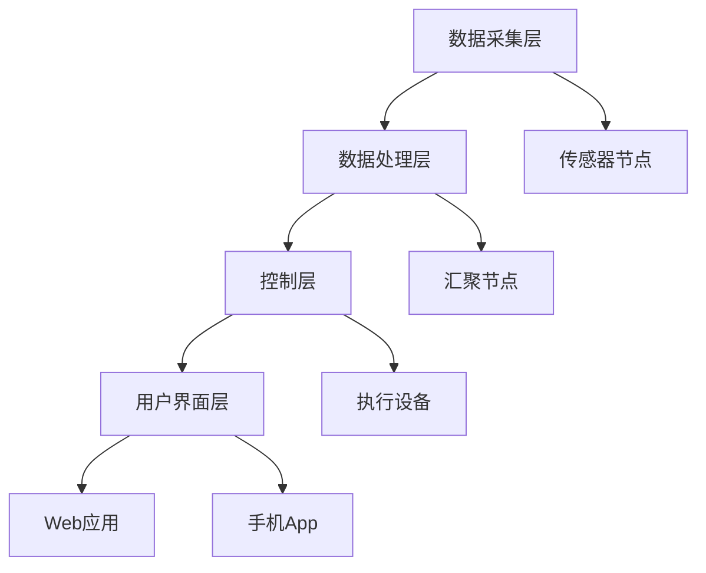
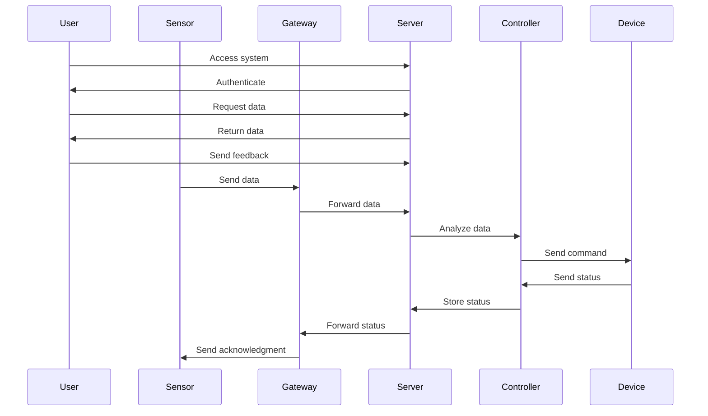

                 

## 智慧办公环境：微型传感器网络的企业应用

### 关键词：智慧办公环境，微型传感器网络，企业应用，物联网，数据分析

### 摘要

本文旨在探讨微型传感器网络在企业办公环境中的应用。通过系统分析和实践案例，本文详细介绍了微型传感器网络的技术基础、智慧办公环境需求分析、应用场景及其在企业运营中的重要作用。文章将分章节讨论微型传感器的基本概念、传感器网络的架构与通信协议、智慧办公环境的实际需求、系统集成与实现，以及实际项目案例，旨在为企业和研究人员提供关于智慧办公环境的参考和启示。

### 引言

在现代企业运营中，办公环境的重要性日益凸显。一个良好的办公环境不仅能够提升员工的工作效率和创造力，还能降低运营成本，促进企业的可持续发展。然而，传统办公环境往往面临着诸多挑战，如温度控制不当、空气质量不佳、光照不足等，这些问题不仅影响了员工的舒适度，还可能对健康产生负面影响。

随着物联网技术的飞速发展，智慧办公环境成为企业提升竞争力的新趋势。微型传感器网络（Wireless Sensor Network，WSN）作为物联网的关键技术，通过在办公环境中部署微型传感器节点，实现对环境参数的实时监测和控制，为智慧办公提供了强有力的技术支持。

本文的研究目的在于：

1. **探讨微型传感器网络的技术基础**：包括微型传感器的定义、分类、工作原理和特性，以及传感器网络的架构、通信协议和关键技术。
2. **分析智慧办公环境的需求**：从温度、湿度、光照和空气质量等方面，详细讨论办公环境参数的监测与控制需求。
3. **探讨微型传感器网络在智慧办公环境中的应用**：介绍系统集成与实现的方法，以及在实际办公环境中的应用案例。
4. **提供实践指导**：通过实际项目案例，展示微型传感器网络在智慧办公环境中的应用效果，为企业和研究人员提供有益的参考。

全文将分为七个章节，首先介绍研究的背景和目的，随后深入探讨微型传感器网络技术基础，分析智慧办公环境的需求，详细讨论微型传感器网络在企业办公环境中的应用，介绍系统集成与实现的方法，分享项目实战案例，最后进行总结与展望。

### 第1章 引言

#### 1.1 研究背景

随着全球经济的发展，企业对高效办公环境的需求日益增长。良好的办公环境不仅能够提升员工的工作效率和创造力，还能降低员工流失率，提高企业的整体运营效率。然而，传统办公环境在舒适度、安全性和效率方面存在诸多不足。例如，办公环境中温度控制不当，可能导致员工感到不适，影响工作效率；空气质量不佳，可能引发健康问题，影响员工的工作状态；光照不足，可能导致视觉疲劳，影响员工的舒适度。

面对这些问题，企业开始寻求智能化解决方案。智慧办公环境通过应用物联网技术，尤其是微型传感器网络，实现对办公环境的实时监测和控制，从而提升办公环境的舒适度、安全性和效率。微型传感器网络通过部署在办公环境中的传感器节点，可以实时感知温度、湿度、光照和空气质量等环境参数，并将这些数据传输到中央处理系统，以便进行实时分析和处理。通过智能算法和自动化控制系统，智慧办公环境能够根据实时数据自动调整环境参数，使办公环境始终保持在最佳状态。

#### 1.1.1 办公环境的重要性

办公环境是企业运营的基础，它直接影响着员工的工作效率和企业的运营成本。一个舒适的办公环境能够提升员工的工作积极性和创造力，从而提高整体工作效率。此外，良好的办公环境还能降低员工流失率，减少由于环境问题引起的健康问题，从而降低企业的运营成本。因此，提升办公环境的舒适度、安全性和效率，已经成为企业提升竞争力的重要手段。

#### 1.1.2 微型传感器网络的发展

微型传感器网络（Wireless Sensor Network，WSN）是一种由大量微型传感器节点组成的网络，这些传感器节点能够感知环境信息并传输到中心处理系统。WSN最早起源于军事领域，主要用于战场监测和侦察。随着物联网技术的发展，WSN逐渐应用于智能家居、智慧城市、工业自动化等多个领域。特别是在智慧办公环境中，WSN的应用越来越广泛。

微型传感器网络的发展经历了多个阶段。最初，WSN主要采用有线连接方式，随着无线通信技术的进步，无线传感器网络逐渐取代了有线连接。目前，WSN已经形成了包括无线传输、低功耗设计、多传感器融合等在内的一系列关键技术。这些技术的不断成熟，使得WSN在智慧办公环境中的应用变得更加广泛和深入。

#### 1.1.3 企业应用需求

随着企业对办公环境智能化需求的提升，微型传感器网络在智慧办公环境中的应用越来越受到重视。以下是企业应用微型传感器网络的一些主要需求：

1. **实时监测与控制**：通过部署微型传感器节点，企业可以实时监测办公环境的各项参数，如温度、湿度、光照和空气质量等。这些实时数据可以用于环境自动调节，提升办公环境的舒适度和安全性。

2. **数据驱动决策**：通过对环境数据的收集和分析，企业可以了解办公环境的运行状态，发现潜在的问题和瓶颈，从而做出数据驱动的决策，优化办公环境的布局和管理。

3. **节能减排**：智慧办公环境通过智能调节温度、湿度、光照等参数，可以实现能源的节约和减排。这对于追求绿色可持续发展的企业尤为重要。

4. **提升工作效率**：一个良好的办公环境能够提升员工的工作效率和满意度。通过智能化的环境管理，企业可以更好地满足员工的需求，从而提高整体的工作效率。

5. **提升企业竞争力**：随着市场竞争的加剧，企业需要不断提升自身的竞争力。通过引入微型传感器网络，企业可以打造出具有竞争力的智慧办公环境，从而在市场中脱颖而出。

综上所述，微型传感器网络在智慧办公环境中的应用具有重要意义。通过本文的研究，旨在为企业提供关于微型传感器网络在智慧办公环境中的应用方案，助力企业提升办公环境的舒适度、安全性和效率，从而实现企业的可持续发展。

#### 1.2 研究目的

本文的研究目的在于探讨微型传感器网络在企业办公环境中的应用，旨在通过系统分析和实践案例，为企业和研究人员提供有益的参考和启示。具体研究目的如下：

1. **深入理解微型传感器网络技术**：通过对微型传感器网络的技术基础进行深入探讨，包括传感器的定义、分类、工作原理和特性，以及传感器网络的架构、通信协议和关键技术，使读者能够全面了解微型传感器网络的技术原理和应用前景。

2. **分析智慧办公环境的需求**：从温度、湿度、光照和空气质量等方面，详细分析企业办公环境中存在的主要问题，以及通过微型传感器网络技术可以实现的需求，包括实时监测与控制、数据驱动决策、节能减排、提升工作效率和企业竞争力等。

3. **探讨微型传感器网络在智慧办公环境中的应用**：通过系统分析和实际案例，探讨微型传感器网络在智慧办公环境中的具体应用场景和实现方法，包括系统集成与实现的技术路径，以及在实际办公环境中的应用效果。

4. **提供实践指导**：通过实际项目案例，展示微型传感器网络在智慧办公环境中的应用效果，为企业和研究人员提供具体的实践指导，帮助他们在实际工作中有效地应用微型传感器网络技术。

5. **推动智慧办公环境的发展**：通过本文的研究，旨在推动微型传感器网络在智慧办公环境中的发展，促进企业办公环境的智能化改造，提升企业的竞争力，同时为智慧城市和智慧办公环境的整体发展提供技术支持。

#### 1.3 研究内容

本文的研究内容分为七个主要章节，具体如下：

1. **引言**：介绍研究的背景、目的和研究内容，概述微型传感器网络在企业办公环境中的应用。
2. **微型传感器网络技术基础**：详细探讨微型传感器的定义、分类、工作原理和特性，传感器网络的架构、通信协议和关键技术。
3. **智慧办公环境需求分析**：分析企业办公环境中存在的主要问题，以及通过微型传感器网络技术可以实现的需求。
4. **微型传感器网络在企业办公环境中的应用**：探讨微型传感器网络在智慧办公环境中的具体应用场景和实现方法。
5. **智慧办公环境系统集成与实现**：介绍智慧办公环境系统集成与实现的技术路径，包括硬件和软件架构设计。
6. **项目实战：智慧办公环境应用案例**：通过实际项目案例，展示微型传感器网络在智慧办公环境中的应用效果。
7. **总结与展望**：总结全文的研究成果，提出未来研究的方向和展望。

通过以上章节的深入探讨，本文旨在为企业和研究人员提供关于微型传感器网络在智慧办公环境中的应用方案，推动智慧办公环境的发展，提升企业的竞争力。

### 第2章 微型传感器网络技术基础

#### 2.1 微型传感器概述

微型传感器（Microsensor）是一种具有微小尺寸、能够感知并响应外界物理量并将其转换为电信号的装置。微型传感器的设计初衷是为了满足便携性、低功耗、高灵敏度和多功能性的需求，广泛应用于物联网、智能制造、医疗健康、环境保护等领域。

#### 2.1.1 微型传感器的定义与分类

微型传感器的定义可以从物理量和功能两个方面来理解。物理量包括温度、湿度、光照、气体浓度、压力、运动等；功能则包括感知、转换、传输和数据处理等。根据感知的物理量不同，微型传感器可以分为以下几类：

1. **温度传感器**：用于测量环境或物体表面的温度，常见的有热电偶、热敏电阻、红外温度传感器等。
2. **湿度传感器**：用于测量环境中的相对湿度，常见的有电容式湿度传感器、电阻式湿度传感器等。
3. **光照传感器**：用于测量环境中的光照强度，常见的有光电管、光敏电阻、太阳能电池等。
4. **气体传感器**：用于检测环境中特定气体的浓度，常见的有半导体气体传感器、电化学气体传感器等。
5. **压力传感器**：用于测量压力或负压，常见的有压电式压力传感器、电容式压力传感器等。
6. **运动传感器**：用于检测运动状态或方向，常见的有加速度传感器、陀螺仪、磁力计等。

#### 2.1.2 微型传感器的原理与特性

微型传感器的工作原理主要基于物理效应和化学效应。物理效应包括热电效应、光电效应、压电效应等；化学效应则涉及电化学反应和离子交换等。以下是一些常见传感器的工作原理：

1. **热电效应传感器**：基于塞贝克效应，当两种不同材料的导体形成闭合回路时，在温度梯度作用下会产生电动势。
2. **光电效应传感器**：基于光生电子效应，当光照强度发生变化时，传感器内部的电子产生运动，形成电流。
3. **压电效应传感器**：基于压电效应，当机械应力作用于压电材料时，会产生电荷。
4. **电化学反应传感器**：基于电化学原理，通过测量电极上发生的化学反应来检测气体或化学物质的浓度。

微型传感器的特性主要包括以下几点：

1. **高灵敏度**：能够检测微小的物理量变化，满足精细测量的需求。
2. **高响应速度**：能够快速响应环境变化，提供实时监测数据。
3. **低功耗**：适合长期运行，降低能源消耗和维护成本。
4. **多功能性**：可以同时检测多种物理量，提高系统效率。
5. **小尺寸**：体积小、重量轻，便于集成和部署。

#### 2.1.3 微型传感器的应用场景

微型传感器在各个领域都有广泛的应用，以下是一些典型的应用场景：

1. **物联网**：在智能家居、智能穿戴设备中，微型传感器用于监测环境参数、人体健康等。
2. **智能制造**：在工业自动化中，微型传感器用于监测设备状态、产品质量等。
3. **医疗健康**：在医疗监护、健康监测中，微型传感器用于监测体温、心率、血压等生理参数。
4. **环境保护**：在环境监测中，微型传感器用于监测空气质量、水质等。
5. **交通管理**：在智能交通中，微型传感器用于监测交通流量、车辆速度等。

#### 2.2 传感器网络架构

传感器网络（Sensor Network）是一种由大量传感器节点组成的分布式网络系统，用于感知、收集和处理环境信息。传感器网络通常由以下几个基本部分组成：传感器节点、汇聚节点和传输网络。

#### 2.2.1 传感器网络的基本架构

传感器网络的基本架构可以概括为：

1. **传感器节点**：传感器节点是网络的基本单元，通常由传感器、数据处理单元、通信模块和电源组成。传感器节点负责感知环境信息，并将数据发送到汇聚节点。
2. **汇聚节点**：汇聚节点负责收集多个传感器节点的数据，进行初步处理，并将处理后的数据发送到中心处理系统。汇聚节点通常具有更强的数据处理能力和通信能力。
3. **传输网络**：传输网络用于将传感器节点和汇聚节点的数据传输到中心处理系统，可以是无线网络或有线网络。

#### 2.2.2 传感器网络的拓扑结构

传感器网络的拓扑结构直接影响网络的性能和效率。常见的传感器网络拓扑结构包括以下几种：

1. **平面结构**：平面结构简单，但容易出现数据冗余和通信瓶颈。
2. **层次结构**：层次结构具有良好的扩展性和鲁棒性，但管理复杂。
3. **混合结构**：混合结构结合了平面结构和层次结构的优点，适用于不同的应用场景。

#### 2.3 传感器网络通信协议

传感器网络通信协议是指传感器节点之间进行数据传输的规则和规范。传感器网络通信协议需要满足低功耗、高可靠性和高效性等要求。常见的传感器网络通信协议包括：

1. **无线传感器网络（Wsn）通信协议**：包括Zigbee、Wi-Fi、蓝牙等，适用于短距离通信。
2. **低功耗广域网（LoRa）通信协议**：适用于长距离、低功耗的通信。
3. **蓝牙低功耗（BLE）通信协议**：适用于短距离、低功耗的通信。

#### 2.4 微型传感器网络关键技术

微型传感器网络的设计和实现涉及多项关键技术，主要包括：

1. **数据采集与处理**：数据采集与处理是传感器网络的核心技术之一。包括数据的采集、预处理、融合和传输等环节。
2. **节能技术**：节能技术是传感器网络设计的重要考虑因素。包括节电模式、休眠策略、能量收集等技术。
3. **网络安全**：网络安全是传感器网络应用的关键问题。包括数据加密、访问控制、网络安全协议等技术。

#### 2.4.1 数据采集与处理

数据采集与处理包括以下几个环节：

1. **数据采集**：传感器节点通过传感器感知环境信息，并将数据转换为数字信号。
2. **预处理**：对采集到的数据进行滤波、去噪等处理，提高数据的质量和可靠性。
3. **数据融合**：多个传感器节点的数据可能存在冗余和矛盾，通过数据融合技术，可以消除冗余、增强数据的一致性。
4. **数据传输**：将预处理后的数据传输到汇聚节点或中心处理系统。

#### 2.4.2 节能技术

节能技术是传感器网络设计的重要考虑因素，以下是一些常见的节能技术：

1. **节电模式**：通过在传感器节点工作与休眠之间切换，降低功耗。
2. **休眠策略**：通过合理安排传感器节点的休眠时间，降低能量消耗。
3. **能量收集**：通过太阳能、风能、振动能等能量收集技术，补充传感器节点的能量消耗。

#### 2.4.3 网络安全

网络安全是传感器网络应用的关键问题，以下是一些常见的网络安全技术：

1. **数据加密**：通过加密算法对数据进行加密，确保数据在传输过程中的安全性。
2. **访问控制**：通过身份认证和权限管理，确保只有授权用户可以访问传感器网络。
3. **网络安全协议**：设计安全协议，确保数据在传输过程中的完整性和一致性。

综上所述，微型传感器网络技术基础包括微型传感器的定义与分类、传感器网络的架构与通信协议、以及微型传感器网络的关键技术。这些技术为智慧办公环境提供了强有力的支持，是实现智慧办公环境的重要保障。在接下来的章节中，我们将进一步探讨智慧办公环境的需求以及微型传感器网络在其中的具体应用。

### 2.1 微型传感器的定义与分类

微型传感器是一种体积小巧、性能高效的传感器设备，它通过检测并转换外部物理信号，如温度、湿度、光照、压力等，为各种应用场景提供精确的数据。微型传感器的诞生源于对高性能、低成本、便携式设备的迫切需求，随着微电子技术和材料科学的进步，微型传感器在多个领域得到了广泛应用。

#### 2.1.1 微型传感器的定义

微型传感器（Microsensor）是一种集成化、小型化的传感器设备，其特点是体积小、功耗低、灵敏度高、响应速度快。微型传感器的定义可以从以下几个方面来理解：

1. **尺寸**：微型传感器通常指直径或长度小于1厘米的传感器。
2. **性能**：微型传感器具有高灵敏度、高分辨率、高可靠性和快速响应能力。
3. **集成性**：微型传感器通常是多参数、多功能集成，能够同时检测多种物理量。
4. **低功耗**：微型传感器设计注重低功耗，以确保长时间运行和能量效率。

#### 2.1.2 微型传感器的分类

根据微型传感器所感知的物理量不同，可以分为以下几类：

1. **温度传感器**：用于测量温度，如热电偶、热敏电阻、红外温度传感器等。热电偶利用两种不同金属导体间的热电效应测量温度；热敏电阻通过电阻值随温度变化来测量温度；红外温度传感器通过检测物体表面的红外辐射来测量温度。

2. **湿度传感器**：用于测量空气中的相对湿度，如电容式湿度传感器、电阻式湿度传感器等。电容式湿度传感器通过湿度变化导致电容器容值变化来测量湿度；电阻式湿度传感器通过湿度变化导致电阻值变化来测量湿度。

3. **光照传感器**：用于测量光照强度，如光敏电阻、太阳能电池等。光敏电阻通过光照强度变化引起电阻值变化来测量光照；太阳能电池通过光照引起光电效应产生电流来测量光照。

4. **气体传感器**：用于检测特定气体的浓度，如半导体气体传感器、电化学气体传感器等。半导体气体传感器通过气体分子与半导体材料作用导致电导率变化来检测气体浓度；电化学气体传感器通过气体分子与电极间的电化学反应来检测气体浓度。

5. **压力传感器**：用于测量压力或负压，如压电式压力传感器、电容式压力传感器等。压电式压力传感器通过机械应力作用于压电材料产生电荷来测量压力；电容式压力传感器通过压力变化导致电容值变化来测量压力。

6. **运动传感器**：用于检测运动状态或方向，如加速度传感器、陀螺仪、磁力计等。加速度传感器通过检测物体加速度来测量运动状态；陀螺仪通过检测旋转角速度来测量物体方向；磁力计通过检测磁场强度来测量物体方向。

#### 2.1.3 微型传感器的工作原理与特性

微型传感器的工作原理通常基于物理效应和化学效应。以下是几种常见微型传感器的工作原理：

1. **热电效应传感器**：基于塞贝克效应，两种不同材料的导体在形成闭合回路时，在温度梯度作用下产生电动势。例如，热电偶由两种不同金属导体组成，当两端存在温度差时，会产生电动势。

2. **光电效应传感器**：基于光生电子效应，当光照强度发生变化时，半导体材料中的电子运动增强，形成电流。例如，光敏电阻在光照下电阻值降低，产生电流。

3. **压电效应传感器**：基于压电效应，当机械应力作用于压电材料时，会产生电荷。例如，压电式加速度传感器在受到振动时，压电材料产生电荷，从而测量加速度。

4. **电化学反应传感器**：基于电化学原理，通过测量电极上发生的化学反应来检测气体或化学物质的浓度。例如，电化学气体传感器通过气体分子与电极间的电化学反应来产生电流，从而测量气体浓度。

微型传感器的特性主要包括：

1. **高灵敏度**：能够检测微小的物理量变化，满足精确测量的需求。

2. **高响应速度**：能够快速响应环境变化，提供实时监测数据。

3. **低功耗**：设计注重低功耗，以延长设备运行时间和降低能源消耗。

4. **多功能性**：能够同时检测多种物理量，提高系统效率。

5. **小尺寸**：体积小巧，便于集成和部署在各种应用场景中。

#### 2.1.4 微型传感器的应用场景

微型传感器在各个领域都有广泛的应用，以下是一些典型的应用场景：

1. **物联网**：在智能家居、智能穿戴设备中，微型传感器用于监测环境参数、人体健康等，如温度传感器监测室内温度，湿度传感器监测室内湿度，光照传感器监测光照强度等。

2. **智能制造**：在工业自动化中，微型传感器用于监测设备状态、产品质量等，如加速度传感器监测生产设备的振动情况，气体传感器监测生产线上的有害气体浓度等。

3. **医疗健康**：在医疗监护、健康监测中，微型传感器用于监测体温、心率、血压等生理参数，如体温传感器监测患者体温，心率传感器监测患者心率等。

4. **环境保护**：在环境监测中，微型传感器用于监测空气质量、水质等，如气体传感器监测空气质量中的有害气体浓度，水质传感器监测水中的污染物浓度等。

5. **交通管理**：在智能交通中，微型传感器用于监测交通流量、车辆速度等，如加速度传感器监测车辆行驶状态，光照传感器监测道路照明情况等。

6. **智慧城市**：在智慧城市建设中，微型传感器用于监测城市环境、公共设施状态等，如温度传感器监测公园内的环境温度，湿度传感器监测绿地中的土壤湿度等。

通过上述对微型传感器定义、分类、工作原理和特性的详细讨论，我们可以看到微型传感器在智慧办公环境中的应用潜力。在接下来的章节中，我们将进一步探讨传感器网络架构、通信协议以及微型传感器网络的关键技术。

### 2.2 传感器网络架构

传感器网络（Sensor Network，SN）是由大量传感器节点（Sensor Node，SN）组成的分布式网络系统，用于感知、收集和处理环境信息。传感器网络的架构设计直接影响网络的性能、可扩展性和可靠性。一个典型的传感器网络架构包括传感器节点、汇聚节点和传输网络三个主要部分。

#### 2.2.1 传感器网络的基本架构

1. **传感器节点**：传感器节点是传感器网络的基本单元，通常由以下几个部分组成：
   - **传感器**：用于检测环境中的各种物理量，如温度、湿度、光照、气体浓度等。
   - **数据处理单元**：对传感器采集的数据进行初步处理，包括滤波、去噪、数据压缩等。
   - **通信模块**：负责与其他节点进行数据交换，实现数据的收集和传输。
   - **电源**：为传感器节点提供能源，通常采用电池、太阳能、风能等可再生能源。

2. **汇聚节点**：汇聚节点（Gather Node，GN）是连接传感器节点与外部网络的中间节点，其主要功能包括：
   - **数据收集**：从多个传感器节点收集数据，并进行初步处理和融合。
   - **数据传输**：将处理后的数据通过无线或有线传输到中心处理系统。
   - **监控管理**：对传感器节点进行监控和管理，确保网络的稳定运行。

3. **传输网络**：传输网络（Transmission Network，TN）用于将传感器节点和汇聚节点的数据传输到中心处理系统，可以是无线网络（如Wi-Fi、LoRa、Zigbee等）或有线网络（如以太网、光纤等）。传输网络的选择取决于网络的覆盖范围、数据传输速率和功耗要求。

#### 2.2.2 传感器网络的拓扑结构

传感器网络的拓扑结构是指传感器节点之间的连接方式。常见的传感器网络拓扑结构包括以下几种：

1. **平面结构**：平面结构是最简单的传感器网络拓扑结构，传感器节点以星形或网格形排列，数据通过单跳或多跳方式传输到汇聚节点。平面结构简单，但容易产生数据冗余和通信瓶颈，不适合大规模应用。

2. **层次结构**：层次结构将传感器网络划分为多个层次，每个层次的节点负责不同的功能。顶层节点（感知层）负责感知环境数据，中间层节点（汇聚层）负责数据收集和初步处理，底层节点（传输层）负责数据传输到外部网络。层次结构具有良好的扩展性和鲁棒性，但管理复杂。

3. **混合结构**：混合结构结合了平面结构和层次结构的优点，适用于不同的应用场景。例如，在感知层采用平面结构，在传输层采用层次结构，从而平衡简单性和扩展性。

#### 2.2.3 传感器网络的通信协议

传感器网络的通信协议是指传感器节点之间进行数据传输的规则和规范。通信协议需要满足低功耗、高可靠性和高效性等要求。常见的传感器网络通信协议包括：

1. **无线传感器网络（Wireless Sensor Network，WSN）通信协议**：包括Zigbee、Wi-Fi、蓝牙等，适用于短距离通信。
   - **Zigbee**：是一种低功耗、高可靠性的无线通信协议，适用于短距离、低速率的传感器网络应用。
   - **Wi-Fi**：是一种高速、高带宽的无线通信协议，适用于需要高速数据传输的应用。
   - **蓝牙**：是一种低功耗、短距离的无线通信协议，适用于移动设备和传感器节点的通信。

2. **低功耗广域网（Low-Power Wide Area Network，LPWAN）通信协议**：包括LoRa、NB-IoT等，适用于长距离、低功耗的通信。
   - **LoRa**：是一种基于扩频技术的LPWAN通信协议，具有长距离、低功耗、低速率的特点，适用于环境监测、智慧城市等应用。
   - **NB-IoT**：是一种基于蜂窝网络的LPWAN通信协议，具有低功耗、广覆盖、高速率的特点，适用于智能家居、工业物联网等应用。

3. **蓝牙低功耗（Bluetooth Low Energy，BLE）通信协议**：是一种低功耗的无线通信协议，适用于短距离、低速率的传感器网络应用。

#### 2.2.4 传感器网络的关键技术

传感器网络的关键技术包括数据采集与处理、节能技术、网络安全和网络管理。

1. **数据采集与处理**：数据采集与处理是传感器网络的核心技术之一。包括以下几个环节：
   - **数据采集**：传感器节点通过传感器感知环境信息，并将数据转换为数字信号。
   - **预处理**：对采集到的数据进行滤波、去噪等处理，提高数据的质量和可靠性。
   - **数据融合**：通过数据融合技术，将多个传感器节点的数据融合为一个统一的视图，消除数据冗余和矛盾，提高数据的一致性。
   - **数据传输**：将预处理后的数据传输到汇聚节点或中心处理系统。

2. **节能技术**：节能技术是传感器网络设计的重要考虑因素。包括以下几个方面的技术：
   - **节电模式**：通过在传感器节点工作与休眠之间切换，降低功耗。
   - **休眠策略**：通过合理安排传感器节点的休眠时间，降低能量消耗。
   - **能量收集**：通过太阳能、风能、振动能等能量收集技术，补充传感器节点的能量消耗。

3. **网络安全**：网络安全是传感器网络应用的关键问题。包括以下几个方面的技术：
   - **数据加密**：通过加密算法对数据进行加密，确保数据在传输过程中的安全性。
   - **访问控制**：通过身份认证和权限管理，确保只有授权用户可以访问传感器网络。
   - **网络安全协议**：设计安全协议，确保数据在传输过程中的完整性和一致性。

4. **网络管理**：网络管理包括传感器节点的监控、管理和维护。包括以下几个方面：
   - **节点监控**：实时监控传感器节点的状态，包括电量、通信状态、工作模式等。
   - **故障诊断**：通过监测数据和分析算法，识别网络中的故障节点，并进行修复。
   - **网络优化**：通过优化节点布局、路由策略和通信协议，提高网络的性能和效率。

通过以上对传感器网络架构的详细讨论，我们可以看到传感器网络在智慧办公环境中的应用潜力。在接下来的章节中，我们将进一步探讨智慧办公环境的需求以及微型传感器网络在其中的具体应用。

### 2.3 传感器网络通信协议

传感器网络通信协议是传感器节点之间进行数据传输的规则和规范，其设计原则包括低功耗、高可靠性、高效性和安全性。选择合适的通信协议对于传感器网络性能和稳定性至关重要。以下将介绍几种常见的传感器网络通信协议。

#### 2.3.1 无线传感器网络（WSN）通信协议

无线传感器网络通信协议主要包括Zigbee、Wi-Fi和蓝牙等，这些协议广泛应用于短距离通信，具有低功耗和高可靠性的特点。

1. **Zigbee**：Zigbee是一种低功耗、高可靠性的无线通信协议，适用于低速率、短距离的数据传输。Zigbee具有以下特点：
   - **低功耗**：采用节能机制，使传感器节点能够长时间运行。
   - **高可靠性**：支持数据加密和校验，确保数据传输的完整性和安全性。
   - **高扩展性**：支持多种网络拓扑结构，如星型、网状和树型，适用于不同规模的应用。

2. **Wi-Fi**：Wi-Fi是一种高速、高带宽的无线通信协议，适用于需要高速数据传输的应用。Wi-Fi具有以下特点：
   - **高速传输**：支持高达数百Mbps的数据传输速率，适用于多媒体和数据密集型应用。
   - **高带宽**：支持多个设备同时连接，适用于大型传感器网络。
   - **灵活性**：支持多种网络模式，如Infrastructure模式和Ad-hoc模式，适用于不同场景的需求。

3. **蓝牙**：蓝牙是一种低功耗、短距离的无线通信协议，适用于移动设备和传感器节点的通信。蓝牙具有以下特点：
   - **低功耗**：采用低功耗模式，延长设备电池寿命。
   - **低延迟**：适用于实时性要求高的应用。
   - **多设备连接**：支持多设备同时连接，适用于智能家居和智能穿戴设备等应用。

#### 2.3.2 低功耗广域网（LPWAN）通信协议

低功耗广域网（LPWAN）通信协议主要用于长距离、低功耗的数据传输，适用于物联网应用。以下介绍两种常见的LPWAN通信协议：LoRa和NB-IoT。

1. **LoRa**：LoRa是一种基于扩频技术的LPWAN通信协议，具有长距离、低功耗、低速率的特点。LoRa具有以下特点：
   - **长距离**：能够在开阔的地形下实现数公里至数十公里的通信距离。
   - **低功耗**：采用低功耗设计，延长设备电池寿命。
   - **低速率**：适合传输少量数据，如环境参数、设备状态等。

2. **NB-IoT**：NB-IoT是一种基于蜂窝网络的LPWAN通信协议，具有低功耗、广覆盖、高速率的特点。NB-IoT具有以下特点：
   - **低功耗**：采用节能机制，延长设备电池寿命。
   - **广覆盖**：能够覆盖大型建筑物、地下停车场等传统无线通信难以覆盖的区域。
   - **高速率**：支持更高的数据传输速率，适用于需要高速数据传输的应用。

#### 2.3.3 蓝牙低功耗（BLE）通信协议

蓝牙低功耗（BLE，Bluetooth Low Energy）是一种针对物联网应用的低功耗通信协议，适用于短距离、低速率的数据传输。BLE具有以下特点：

- **低功耗**：采用低功耗设计，延长设备电池寿命。
- **低延迟**：适用于实时性要求高的应用。
- **支持多设备连接**：支持多个设备同时连接，适用于智能家居和智能穿戴设备等应用。

#### 2.3.4 传感器网络通信协议的选择与优化

在选择传感器网络通信协议时，需要综合考虑以下因素：

- **通信距离**：根据实际应用场景选择合适的通信协议，如LoRa适用于长距离通信，Zigbee适用于短距离通信。
- **数据传输速率**：根据数据传输需求选择合适的通信协议，如Wi-Fi适用于高速数据传输，BLE适用于低速率数据传输。
- **功耗需求**：根据功耗预算选择低功耗通信协议，如LoRa和BLE具有低功耗特点。
- **网络拓扑结构**：根据网络拓扑结构选择合适的通信协议，如Zigbee适用于星型网络，LoRa适用于网状网络。

在传感器网络通信协议的优化方面，可以通过以下方法提升网络性能：

- **自适应路由算法**：根据网络状态动态调整路由策略，优化数据传输路径。
- **节能机制**：采用节电模式、休眠策略等节能措施，降低能量消耗。
- **数据融合**：通过数据融合技术减少数据传输量，降低通信负担。
- **安全协议**：采用加密算法和认证机制，确保数据传输的安全性。

通过合理选择和优化传感器网络通信协议，可以提升传感器网络的性能和稳定性，为智慧办公环境提供可靠的技术支持。

#### 2.4 微型传感器网络的关键技术

微型传感器网络（Wireless Sensor Network，WSN）作为一种分布式传感器网络，其关键技术涵盖了数据采集与处理、节能技术、网络安全等方面。这些技术共同构成了微型传感器网络的核心能力，确保其在复杂环境中的高效运行。

##### 2.4.1 数据采集与处理

数据采集与处理是微型传感器网络的核心技术之一，其目标是从传感器节点收集环境数据，并进行有效的处理，以便为上层应用提供可靠的数据支持。数据采集与处理主要包括以下几个环节：

1. **数据采集**：传感器节点通过内置的传感器模块实时监测环境参数，如温度、湿度、光照、气体浓度等。这些传感器将模拟信号转换为数字信号，以便进行后续处理。

2. **数据预处理**：预处理过程包括滤波、去噪、数据压缩等步骤。滤波用于去除传感器数据中的随机噪声；去噪用于进一步减少噪声影响；数据压缩则用于降低数据传输量，减少网络带宽消耗。

3. **数据融合**：由于微型传感器网络通常由大量传感器节点组成，各节点采集到的数据可能存在冗余和矛盾。数据融合技术通过对多个传感器节点的数据进行综合分析，消除冗余，提高数据的一致性和准确性。常见的融合方法包括局部融合和全局融合。

4. **数据传输**：预处理后的数据通过无线或有线传输到汇聚节点或中心处理系统。在这一过程中，需要考虑数据传输的可靠性、实时性和功耗。

##### 2.4.2 节能技术

节能技术是微型传感器网络设计的重要考虑因素，因为传感器节点通常使用电池供电，且节点数量庞大，功耗管理对网络的持续运行至关重要。以下是几种常见的节能技术：

1. **节电模式**：传感器节点在不需要实时监测时，可以进入低功耗模式。在这种模式下，节点的处理能力和通信能力都会降低，从而减少能耗。

2. **休眠策略**：传感器节点可以通过周期性地进入休眠状态来降低功耗。在休眠状态下，节点停止所有操作，只有当接收到唤醒信号时才会恢复工作。这种策略适用于那些监测周期较长且对实时性要求不高的应用。

3. **能量收集**：通过能量收集技术，如太阳能、风能、振动能等，可以为传感器节点补充能量。这种方法可以延长节点的使用寿命，特别是在无法更换电池的环境中。

##### 2.4.3 网络安全

网络安全是微型传感器网络应用的关键问题，由于传感器节点分布广泛，攻击者可能通过网络漏洞获取敏感数据或控制节点。以下是几种常见的网络安全技术：

1. **数据加密**：通过加密算法对传输的数据进行加密，确保数据在传输过程中的机密性。常用的加密算法包括对称加密和非对称加密。

2. **访问控制**：通过身份认证和权限管理，确保只有授权用户可以访问传感器网络。访问控制可以通过用户名和密码、数字证书等方式实现。

3. **网络安全协议**：设计安全的通信协议，确保数据在传输过程中的完整性和一致性。常见的网络安全协议包括安全套接字层（SSL）、传输层安全（TLS）等。

##### 2.4.4 能量管理

能量管理是微型传感器网络设计中的重要一环，目标是最大化利用能量资源，延长网络寿命。能量管理包括以下几个方面：

1. **能量感知**：传感器节点通过内置的能源传感器监测电池电量，以便实时调整工作状态。

2. **能量优化**：通过优化数据采集、传输和处理等过程，减少能量消耗。例如，采用数据压缩和能量感知传输技术，降低数据传输的功耗。

3. **能量调度**：在节点能量有限的情况下，通过合理调度节点的任务，确保关键任务在能量充足的时段完成，避免在能量不足时进行高能耗操作。

综上所述，微型传感器网络的关键技术包括数据采集与处理、节能技术、网络安全和能量管理。这些技术共同构成了微型传感器网络的核心能力，为智慧办公环境提供了可靠的技术支持。在接下来的章节中，我们将进一步探讨智慧办公环境的需求，以及如何应用微型传感器网络实现智慧办公环境的优化。

### 2.5 数据采集与处理技术

数据采集与处理技术是微型传感器网络（WSN）的核心环节，它决定了传感器网络的数据精度、实时性和可靠性。数据采集与处理技术包括数据的采集、预处理、融合和传输等环节，每一个环节都至关重要。

#### 2.5.1 数据采集

数据采集是指传感器节点通过内置的传感器模块实时监测环境参数，如温度、湿度、光照、气体浓度等，并将这些模拟信号转换为数字信号的过程。数据采集的质量直接影响到后续数据处理和分析的准确性。以下是数据采集过程中需要考虑的几个方面：

1. **传感器选择**：选择合适的传感器对数据采集至关重要。传感器应具备高灵敏度、高分辨率、高稳定性和抗干扰能力。例如，在选择温度传感器时，需要考虑其工作温度范围、响应时间和精度。

2. **采样率**：采样率是指传感器采集数据的频率。合理的采样率应满足应用需求，既能捕捉环境变化的细节，又不会导致数据冗余。例如，在监测室内温度时，可能需要每秒或几分钟采样一次。

3. **传感器校准**：传感器在长期使用过程中可能会出现漂移或老化，因此定期进行校准是确保数据准确性的重要手段。

#### 2.5.2 数据预处理

数据预处理是指对采集到的原始数据进行滤波、去噪、数据压缩等处理，以提高数据的质量和可靠性。以下是数据预处理过程中需要考虑的几个方面：

1. **滤波**：滤波用于去除传感器数据中的随机噪声。常用的滤波方法包括均值滤波、中值滤波、低通滤波等。均值滤波通过对一定时间窗口内的数据进行平均处理，去除高频噪声；中值滤波通过选择窗口内的中值作为输出值，去除离群值和噪声；低通滤波则用于抑制高频噪声。

2. **去噪**：去噪是指进一步减少噪声对数据的影响。去噪方法包括小波变换、卡尔曼滤波等。小波变换可以通过多尺度分析去除噪声；卡尔曼滤波是一种优化滤波方法，能够实时估计系统的状态，减少噪声影响。

3. **数据压缩**：数据压缩是指通过算法减少数据传输量，降低网络带宽消耗。常用的数据压缩方法包括差分编码、预测编码等。差分编码通过记录当前数据与历史数据的差异，减少冗余数据；预测编码通过预测未来数据，减少冗余信息。

#### 2.5.3 数据融合

数据融合是指通过综合多个传感器节点的数据，消除冗余和矛盾，提高数据一致性和准确性的过程。以下是数据融合过程中需要考虑的几个方面：

1. **局部融合**：局部融合是指将相邻节点或同一区域的传感器数据融合为一个统一的视图。局部融合可以降低数据传输量，减少网络负载。常用的局部融合方法包括均值融合、加权融合等。

2. **全局融合**：全局融合是指将多个区域的传感器数据融合为一个全局视图。全局融合可以提供更全面的环境信息，但需要较大的计算资源和网络带宽。常用的全局融合方法包括协同滤波、贝叶斯推理等。

3. **数据融合算法**：选择合适的数据融合算法对于数据融合效果至关重要。常见的融合算法包括卡尔曼滤波、粒子滤波、模糊逻辑等。卡尔曼滤波是一种最优融合算法，适用于线性系统和噪声建模；粒子滤波适用于非线性系统和多模态分布。

#### 2.5.4 数据传输

数据传输是指将预处理后的数据从传感器节点传输到汇聚节点或中心处理系统的过程。数据传输的质量直接影响到数据的实时性和可靠性。以下是数据传输过程中需要考虑的几个方面：

1. **传输协议**：选择合适的传输协议对于数据传输至关重要。常用的传输协议包括Zigbee、Wi-Fi、LoRa等。Zigbee适用于短距离、低速率数据传输；Wi-Fi适用于高速数据传输；LoRa适用于长距离、低速率数据传输。

2. **传输可靠性**：确保数据在传输过程中不丢失或出错。常用的方法包括数据校验、重传机制等。数据校验可以通过校验和或CRC校验确保数据的完整性；重传机制在检测到数据丢失时重新发送数据。

3. **传输功耗**：数据传输功耗是影响传感器节点寿命的重要因素。采用低功耗传输技术和节能策略可以降低功耗。例如，采用能量感知传输技术，根据节点能量状态调整传输功率。

#### 2.5.5 综合案例

以下是一个综合案例，展示了数据采集与处理技术在微型传感器网络中的应用：

假设在一个智慧办公环境中，需要实时监测室内温度、湿度、光照和空气质量。每个传感器节点包含以下传感器：

- **温度传感器**：用于测量室内温度。
- **湿度传感器**：用于测量室内湿度。
- **光照传感器**：用于测量室内光照强度。
- **空气质量传感器**：用于测量室内空气质量。

数据采集过程如下：

1. 每秒采集一次温度、湿度、光照和空气质量的模拟信号。
2. 将模拟信号转换为数字信号，通过模数转换（ADC）实现。
3. 对数字信号进行滤波和去噪处理，提高数据质量。
4. 将预处理后的数据压缩，减少数据传输量。

数据预处理过程如下：

1. 对温度和湿度数据进行均值滤波，去除高频噪声。
2. 对光照数据使用小波变换进行去噪处理。
3. 对空气质量数据使用卡尔曼滤波进行实时状态估计。

数据融合过程如下：

1. 局部融合：相邻节点将各自的数据进行均值融合，减少冗余数据。
2. 全局融合：通过协同滤波算法，将全局数据进行融合，提高数据一致性。

数据传输过程如下：

1. 使用LoRa传输协议，将压缩后的数据传输到汇聚节点。
2. 汇聚节点对数据进行进一步处理和融合，然后通过Wi-Fi传输到中心处理系统。
3. 中心处理系统对数据进行实时分析，生成环境监控报告，并触发相应的自动调节措施。

通过以上步骤，我们可以实现一个高效、可靠的微型传感器网络，为智慧办公环境提供实时、准确的数据支持。

### 2.6 节能技术

节能技术是微型传感器网络设计中的重要一环，尤其是在电池供电的传感器节点中，节能技术直接影响网络的寿命和可靠性。为了延长传感器节点的运行时间，降低能量消耗，研究人员和实践者已经开发了多种节能技术。

#### 2.6.1 节电模式

节电模式是传感器节点通过降低功耗来延长运行时间的一种技术。传感器节点通常会在工作状态和休眠状态之间切换。在工作状态，节点执行感知、数据处理和通信等任务；在休眠状态，节点几乎不消耗能量，从而延长电池寿命。常见的节电模式包括以下几种：

1. **周期性休眠**：节点按照一定的周期进入休眠状态，例如每天或每小时休眠几分钟。这种方式简单易行，但可能导致数据采集的实时性受到影响。

2. **自适应休眠**：节点根据任务的重要性和数据的实时性要求，动态调整休眠时间。例如，对于一些不常变动的环境参数，可以延长休眠时间；对于需要实时监测的参数，可以减少休眠时间。

3. **基于事件的休眠**：节点仅在特定事件发生时才唤醒，例如检测到环境参数发生变化或接收到汇聚节点的唤醒信号。这种方式可以进一步降低功耗，但需要高效的检测机制和事件触发算法。

#### 2.6.2 休眠策略

休眠策略是通过合理规划节点的休眠时间，优化能量消耗的方法。以下是一些常见的休眠策略：

1. **动态休眠策略**：节点根据当前能量水平和任务需求动态调整休眠时间。例如，当节点能量充足时，可以减少休眠时间；当能量不足时，可以延长休眠时间。

2. **分布式休眠策略**：多个节点通过协调休眠时间，避免同时唤醒，从而减少网络的整体能量消耗。例如，可以使用分布式算法，如时间同步协议，来协调节点的唤醒时间。

3. **能量感知休眠策略**：节点通过内置的能源传感器实时监测电池电量，并根据电量水平调整休眠时间。当电池电量较低时，节点会延长休眠时间以节省能量。

#### 2.6.3 能量收集技术

能量收集技术是指利用外部能量源为传感器节点补充能量，以延长其运行时间。以下是一些常见的能量收集技术：

1. **太阳能能量收集**：利用太阳能电池将光能转换为电能，为节点提供能量。这种方式适用于光照充足的环境，但需要考虑到光照强度和天气条件的影响。

2. **风能能量收集**：利用风力发电机将风能转换为电能，为节点提供能量。这种方式适用于风能资源丰富的环境。

3. **振动能能量收集**：利用振动传感器将机械能转换为电能，为节点提供能量。这种方式适用于有机械振动源的环境，如交通监测或建筑结构健康监测。

4. **热能能量收集**：利用温差发电机将热能转换为电能，为节点提供能量。这种方式适用于存在温差的环境。

#### 2.6.4 节能通信协议

通信是传感器节点能量消耗的主要来源之一，因此开发低功耗通信协议对于节能至关重要。以下是一些低功耗通信协议：

1. **Zigbee**：Zigbee是一种低功耗的无线通信协议，适用于短距离、低速率的数据传输。Zigbee协议通过优化数据传输时间和频率，降低功耗。

2. **Wi-Fi**：Wi-Fi协议在低功耗模式下，适用于短距离、高速率的数据传输。Wi-Fi低功耗模式（Wi-Fi HaLow）进一步优化了功耗，适用于物联网应用。

3. **LoRa**：LoRa是一种基于扩频技术的低功耗广域网（LPWAN）通信协议，适用于长距离、低速率的数据传输。LoRa通过扩展信号带宽和降低数据传输速率，实现低功耗。

4. **蓝牙**：蓝牙协议在低功耗模式下，适用于短距离、低速率的数据传输。蓝牙低功耗（BLE）特别适合物联网应用，通过优化传输时间和频率，降低功耗。

通过综合应用以上节能技术，传感器网络可以实现更长的运行时间，更高的稳定性和可靠性，为智慧办公环境提供持续的技术支持。

### 2.7 网络安全技术

网络安全技术是保障传感器网络（WSN）稳定运行和数据安全的关键。在传感器网络中，由于节点数量庞大且分布广泛，网络安全问题尤为突出。以下将介绍几种常见的网络安全技术。

#### 2.7.1 数据加密

数据加密是确保传感器网络数据传输过程中不被窃取或篡改的重要手段。数据加密技术通过将明文数据转换为密文，从而保护数据的机密性。常见的加密技术包括：

1. **对称加密**：对称加密算法使用相同的密钥进行加密和解密。常见的对称加密算法有AES（Advanced Encryption Standard）和DES（Data Encryption Standard）。对称加密的优点是加密速度快，但密钥分发和管理较为复杂。

2. **非对称加密**：非对称加密算法使用一对密钥进行加密和解密，即公钥和私钥。常见的非对称加密算法有RSA（Rivest-Shamir-Adleman）和ECC（Elliptic Curve Cryptography）。非对称加密的优点是密钥分发和管理较为简单，但加密和解密速度较慢。

#### 2.7.2 访问控制

访问控制是防止未授权用户访问传感器网络的重要措施。通过身份认证和权限管理，确保只有授权用户可以访问网络。常见的访问控制技术包括：

1. **用户名和密码**：用户名和密码是最简单的访问控制方法。用户在登录时需要输入正确的用户名和密码，才能访问网络资源。

2. **数字证书**：数字证书通过颁发机构对用户身份进行认证。用户在访问网络时，需要提供数字证书进行验证。数字证书的优点是安全性和可信度高，但证书的生成和分发较为复杂。

3. **多因素认证**：多因素认证结合了多种认证方式，如用户名和密码、数字证书、短信验证码等，提高访问控制的安全性。多因素认证适用于高风险环境，但操作较为复杂。

#### 2.7.3 网络安全协议

网络安全协议是确保传感器网络数据传输过程中数据完整性和一致性的重要保障。常见的网络安全协议包括：

1. **安全套接字层（SSL）**：SSL协议用于保护网络通信过程中的数据传输安全，通过加密和认证确保数据的机密性、完整性和可靠性。SSL协议广泛应用于Web安全通信。

2. **传输层安全（TLS）**：TLS协议是SSL协议的升级版，提供了更加强大的安全特性。TLS协议在SSL的基础上增加了更多安全机制，如密钥交换、加密算法协商等。

3. **无线传感器网络安全协议（WSN-Security）**：WSN-Security协议专门针对无线传感器网络设计，提供数据加密、认证和完整性保护等功能。WSN-Security协议通过使用加密算法和认证机制，确保传感器网络数据传输的安全性。

#### 2.7.4 防火墙和入侵检测系统

防火墙和入侵检测系统是保护传感器网络免受外部攻击的重要工具。防火墙通过过滤和监控网络流量，阻止未经授权的访问；入侵检测系统（IDS）通过分析网络流量和系统日志，检测和响应异常行为。

1. **防火墙**：防火墙是一种网络安全设备，用于控制进出网络的流量。防火墙可以根据预定义的规则，允许或阻止特定类型的数据包。常见的防火墙技术包括包过滤防火墙、状态检测防火墙等。

2. **入侵检测系统（IDS）**：入侵检测系统通过实时监控网络流量和系统日志，检测异常行为和潜在的安全威胁。入侵检测系统可以分为两类：基于行为的入侵检测系统和基于异常的入侵检测系统。基于行为的入侵检测系统检测已知攻击模式；基于异常的入侵检测系统检测与正常行为差异较大的活动。

通过综合应用以上网络安全技术，可以有效地保护传感器网络免受各种攻击，确保网络的稳定运行和数据安全。

### 2.8 总结与展望

微型传感器网络技术在智慧办公环境中的应用具有巨大的潜力和实际价值。通过对微型传感器的定义、分类、工作原理以及传感器网络架构、通信协议和关键技术的详细讨论，我们可以看到，微型传感器网络在数据采集、处理、传输和节能方面提供了强有力的支持。这些技术不仅提升了办公环境的舒适度、安全性和效率，还为企业的可持续发展提供了新的思路。

然而，随着技术的不断进步和应用场景的扩展，微型传感器网络在智慧办公环境中仍面临一些挑战和未来发展方向：

1. **能量效率提升**：尽管现有的节能技术已经取得了一定的成果，但如何进一步降低传感器节点的能量消耗，提高能量效率，仍然是未来研究的重要方向。包括更先进的能量收集技术和更优的节能算法。

2. **数据安全与隐私保护**：随着传感器网络的应用越来越广泛，数据安全和隐私保护成为越来越重要的问题。如何设计更加安全、可靠的加密和访问控制机制，保护用户隐私，是未来研究的重要课题。

3. **智能化与自适应能力**：传感器网络需要具备更高的智能化和自适应能力，以应对不同应用场景和动态环境的变化。通过引入人工智能和机器学习技术，提高传感器网络的自主学习和决策能力，是未来的发展方向。

4. **跨领域融合应用**：将微型传感器网络与其他新兴技术，如大数据、云计算、物联网等相结合，实现跨领域的融合应用，将进一步拓展传感器网络的应用场景和功能。

5. **标准化与规范化**：为了促进微型传感器网络技术的广泛应用和产业发展，标准化和规范化工作至关重要。建立统一的技术标准和规范，有助于提高传感器网络的技术水平，推动产业健康发展。

总之，微型传感器网络技术在智慧办公环境中的应用前景广阔，未来将随着技术的不断进步和应用的深入，发挥更大的作用。通过持续的研究和探索，我们可以期待微型传感器网络为智慧办公环境带来更多的创新和变革。

### 第3章 智慧办公环境需求分析

#### 3.1 办公环境现状分析

办公环境是企业运营的重要基础，其舒适度、安全性和效率直接影响员工的工作状态和企业的整体运营效率。然而，传统办公环境在多个方面存在明显不足，需要通过智慧办公环境技术进行改进。

**3.1.1 传统办公环境的不足**

1. **温度控制不当**：传统办公环境中的温度控制往往依赖于中央空调系统，但该系统难以实现精确的温度调节，导致办公空间内部温度波动较大，部分区域过热或过冷，影响员工的舒适度和工作效率。

2. **空气质量不佳**：许多办公环境中通风条件不佳，室内空气中的二氧化碳、挥发性有机化合物（VOCs）和颗粒物等污染物浓度较高，对员工的健康产生负面影响。

3. **光照不足**：传统办公环境中的光照往往依赖于人工光源，光照强度和分布不均匀，导致员工在长时间工作中感到视觉疲劳。

4. **办公设备管理复杂**：传统办公环境中，办公设备如打印机、复印机等的管理复杂，设备运行状态和耗材消耗难以实时监测和管理。

5. **安全性不足**：传统办公环境缺乏有效的安全监控手段，无法及时发现和处理安全隐患，如火灾、入侵等。

**3.1.2 智慧办公环境的优势**

智慧办公环境通过应用物联网和微型传感器网络技术，能够实现办公环境的智能化管理和优化，克服传统办公环境的不足，提升办公环境的舒适度、安全性和效率。以下是智慧办公环境的主要优势：

1. **智能温度控制**：通过部署微型传感器节点，实时监测办公环境中的温度变化，智能调节空调等设备，实现精准的温度控制，提升员工的舒适度。

2. **空气质量监测与改善**：智慧办公环境通过部署空气质量传感器，实时监测室内空气中的污染物浓度，并根据监测结果自动调节空气净化器等设备，改善空气质量。

3. **智能光照管理**：通过部署光照传感器，实时监测办公环境中的光照强度，智能调节照明设备，实现光照的自动调节，提升员工的视觉舒适度和工作效率。

4. **办公设备智能管理**：智慧办公环境通过物联网技术，实现对办公设备的实时监测和管理，自动记录设备的使用状态和耗材消耗，提高设备利用率和管理效率。

5. **安全监控与预警**：智慧办公环境通过视频监控、入侵检测等安全设备，实现对办公环境的全面监控，及时预警和应对安全隐患。

**3.1.3 办公环境中的主要问题**

1. **温度波动大**：由于传统空调系统无法精确调节温度，导致办公空间内部温度不均匀，部分区域过热或过冷，影响员工的工作效率。

2. **空气污染问题**：室内空气中的二氧化碳、VOCs和颗粒物等污染物浓度较高，对员工的健康产生负面影响。

3. **光照分布不均**：人工光源难以实现均匀的光照分布，导致员工在长时间工作中感到视觉疲劳。

4. **设备管理复杂**：传统办公环境中，办公设备的运行状态和耗材消耗难以实时监测和管理，影响设备利用率和管理效率。

5. **安全监控不足**：传统办公环境中，安全监控手段有限，无法及时发现和处理安全隐患。

综上所述，传统办公环境在舒适度、安全性和效率方面存在明显不足，需要通过智慧办公环境技术进行改进。智慧办公环境通过应用微型传感器网络，实现对办公环境的实时监测和智能调节，能够有效解决传统办公环境中存在的问题，提升办公环境的整体水平。

#### 3.2 智慧办公环境需求分析

在现代社会，企业对高效办公环境的需求日益增长，而智慧办公环境通过引入物联网和微型传感器网络技术，实现了办公环境的智能化管理，从而显著提升了办公环境的舒适度、安全性和效率。以下从温度、湿度、光照和空气质量等几个方面，详细分析智慧办公环境的需求。

**3.2.1 温度监测与控制**

温度是影响办公环境舒适度的关键因素之一。在传统办公环境中，空调系统的调节往往不够精确，导致办公空间内部温度不均匀，部分区域过热或过冷，影响员工的工作效率和舒适度。

1. **需求背景**：办公环境中温度波动较大，导致员工感到不适，工作效率下降。

2. **需求内容**：
   - **实时监测**：通过部署微型温度传感器，实时监测办公环境中的温度变化，确保温度分布均匀。
   - **智能调节**：根据实时监测数据，智能调节空调等设备，实现精准的温度控制，提升员工的舒适度。

3. **实现方法**：
   - **分布式传感器网络**：在办公空间内布置多个温度传感器节点，形成一个分布式传感器网络，实时采集温度数据。
   - **数据融合与处理**：通过数据融合算法，对多个传感器的数据进行处理和分析，确保温度监测的准确性和一致性。
   - **智能控制系统**：根据温度监测数据，智能调节空调等设备，实现温度的自动调节。

**3.2.2 湿度监测与控制**

湿度对办公环境的舒适度和空气质量也有重要影响。过高或过低的湿度都会对员工的健康产生负面影响。

1. **需求背景**：传统办公环境中湿度控制不够精确，导致室内湿度过高或过低，影响员工的工作效率和健康。

2. **需求内容**：
   - **实时监测**：通过部署微型湿度传感器，实时监测办公环境中的湿度变化。
   - **智能调节**：根据实时监测数据，智能调节加湿器或除湿器，实现湿度的自动控制。

3. **实现方法**：
   - **分布式传感器网络**：在办公空间内布置多个湿度传感器节点，形成一个分布式传感器网络，实时采集湿度数据。
   - **数据融合与处理**：通过数据融合算法，对多个传感器的数据进行处理和分析，确保湿度监测的准确性和一致性。
   - **智能控制系统**：根据湿度监测数据，智能调节加湿器或除湿器，实现湿度的自动调节。

**3.2.3 光照监测与控制**

光照强度和分布对员工的视觉舒适度和工作效率有重要影响。在传统办公环境中，人工光源往往难以实现均匀的光照分布，导致员工在长时间工作中感到视觉疲劳。

1. **需求背景**：传统办公环境中光照分布不均，导致员工长时间工作后视觉疲劳，工作效率下降。

2. **需求内容**：
   - **实时监测**：通过部署微型光照传感器，实时监测办公环境中的光照强度。
   - **智能调节**：根据实时监测数据，智能调节照明设备，实现光照的自动调节。

3. **实现方法**：
   - **分布式传感器网络**：在办公空间内布置多个光照传感器节点，形成一个分布式传感器网络，实时采集光照数据。
   - **数据融合与处理**：通过数据融合算法，对多个传感器的数据进行处理和分析，确保光照监测的准确性和一致性。
   - **智能控制系统**：根据光照监测数据，智能调节照明设备，实现光照的自动调节。

**3.2.4 空气质量监测与控制**

空气质量对员工的健康和工作效率有直接影响。传统办公环境中，通风条件不佳，室内空气中的二氧化碳、挥发性有机化合物（VOCs）和颗粒物等污染物浓度较高，对员工的健康产生负面影响。

1. **需求背景**：传统办公环境中空气质量差，导致员工健康问题和工作效率下降。

2. **需求内容**：
   - **实时监测**：通过部署微型空气质量传感器，实时监测室内空气中的污染物浓度。
   - **智能调节**：根据实时监测数据，智能调节空气净化器等设备，改善空气质量。

3. **实现方法**：
   - **分布式传感器网络**：在办公空间内布置多个空气质量传感器节点，形成一个分布式传感器网络，实时采集空气质量数据。
   - **数据融合与处理**：通过数据融合算法，对多个传感器的数据进行处理和分析，确保空气质量监测的准确性和一致性。
   - **智能控制系统**：根据空气质量监测数据，智能调节空气净化器等设备，实现空气质量的自动改善。

通过以上对温度、湿度、光照和空气质量监测与控制需求的详细分析，我们可以看到智慧办公环境在提升办公环境舒适度、安全性和效率方面具有巨大的潜力。通过部署微型传感器网络，实现对办公环境参数的实时监测和智能调节，企业能够有效改善办公环境，提升员工的工作效率和满意度，从而实现企业的可持续发展。

#### 3.3 温度监测与控制需求

温度是影响办公环境舒适度的关键因素，它直接关系到员工的工作效率和健康。在传统办公环境中，空调系统的调节往往不够精确，导致办公空间内部温度分布不均，部分区域过热或过冷，从而影响员工的舒适度和工作效率。为了解决这一问题，智慧办公环境需要实现对温度的实时监测与智能控制。

**3.3.1 温度监测**

温度监测是智慧办公环境中的一项重要需求。通过部署微型温度传感器，可以实现以下目标：

1. **实时监测**：在办公空间内布置多个温度传感器节点，形成一个分布式传感器网络，实时监测温度变化。这些传感器可以布置在办公室、会议室、走廊等不同区域，确保温度监测的全面性和准确性。

2. **数据采集**：传感器节点通过模数转换（ADC）将温度模拟信号转换为数字信号，并将数据传输到汇聚节点或中心处理系统。这些实时数据可用于实时分析和决策。

3. **多参数监测**：除了温度，还可以监测其他与温度相关的参数，如湿度、风速等，为温度调节提供更全面的参考。

**3.3.2 智能温度控制**

智能温度控制是智慧办公环境中的另一项重要需求。通过实时监测数据，可以自动调节空调、风扇等设备，实现温度的精确控制。以下是实现智能温度控制的方法：

1. **数据融合**：将来自不同传感器的温度数据进行融合处理，消除冗余和误差，确保温度监测数据的准确性。

2. **设定目标温度**：根据办公环境的实际情况和员工的需求，设定目标温度。目标温度应考虑不同区域的特殊需求，如会议室可能需要设置较低的温度，以避免讨论时过于热烈。

3. **自适应调节**：根据实时温度数据，智能调节空调等设备。例如，当温度高于目标温度时，空调系统可以自动开启，降低温度；当温度低于目标温度时，空调系统可以自动关闭，节省能源。

4. **智能预测**：利用历史数据和环境模型，预测未来一段时间内的温度变化趋势。根据预测结果，提前调整温度设置，以避免温度波动过大。

5. **反馈机制**：通过收集员工的反馈，不断优化温度调节策略。例如，如果员工普遍反映某个区域的温度过高或过低，可以调整该区域的温度设置，提升员工满意度。

**3.3.3 实现方案**

为实现温度的实时监测与智能控制，可以采用以下技术方案：

1. **传感器网络**：部署微型温度传感器，形成一个分布式传感器网络。这些传感器可以采用Zigbee、Wi-Fi等无线通信协议，确保数据传输的可靠性和实时性。

2. **数据处理与融合**：在汇聚节点或中心处理系统，利用数据融合算法对温度数据进行处理，确保数据的一致性和准确性。

3. **智能控制系统**：开发智能控制系统，根据实时温度数据和目标温度设定，自动调节空调等设备。智能控制系统可以基于物联网平台，实现远程监控和管理。

4. **用户界面**：为员工和管理人员提供友好的用户界面，展示实时温度数据和调节状态。用户可以通过界面提交反馈，参与温度调节的优化。

5. **能源管理**：结合能源管理系统，优化温度调节策略，实现节能减排。

通过以上方案，智慧办公环境可以实现温度的实时监测与智能控制，提升办公环境的舒适度，提高员工的工作效率和满意度。

#### 3.4 湿度监测与控制需求

湿度是另一个影响办公环境舒适度和员工健康的重要因素。传统办公环境中，湿度控制往往不够精确，导致室内湿度过高或过低，对员工的工作效率和健康产生负面影响。因此，智慧办公环境需要实现对湿度的实时监测与智能控制。

**3.4.1 湿度监测**

湿度监测是智慧办公环境中的基础需求，通过部署微型湿度传感器，可以实现以下目标：

1. **实时监测**：在办公空间内布置多个湿度传感器节点，形成一个分布式传感器网络，实时监测湿度变化。这些传感器可以布置在办公室、会议室、走廊等不同区域，确保湿度监测的全面性和准确性。

2. **数据采集**：传感器节点通过模数转换（ADC）将湿度模拟信号转换为数字信号，并将数据传输到汇聚节点或中心处理系统。这些实时数据可用于实时分析和决策。

3. **多参数监测**：除了湿度，还可以监测其他与湿度相关的参数，如温度、风速等，为湿度调节提供更全面的参考。

**3.4.2 湿度控制**

湿度控制是智慧办公环境中的另一项重要需求。通过实时监测数据，可以自动调节加湿器或除湿器，实现湿度的精确控制。以下是实现湿度控制的方法：

1. **数据融合**：将来自不同传感器的湿度数据进行融合处理，消除冗余和误差，确保湿度监测数据的准确性。

2. **设定目标湿度**：根据办公环境的实际情况和员工的需求，设定目标湿度。目标湿度应考虑不同区域的特殊需求，如湿度较高的区域可能需要除湿，而湿度较低的区域可能需要加湿。

3. **自适应调节**：根据实时湿度数据，智能调节加湿器或除湿器。例如，当湿度高于目标湿度时，除湿器可以自动开启，降低湿度；当湿度低于目标湿度时，加湿器可以自动开启，增加湿度。

4. **智能预测**：利用历史数据和环境模型，预测未来一段时间内的湿度变化趋势。根据预测结果，提前调整湿度设置，以避免湿度波动过大。

5. **反馈机制**：通过收集员工的反馈，不断优化湿度调节策略。例如，如果员工普遍反映某个区域的湿度过高或过低，可以调整该区域的湿度设置，提升员工满意度。

**3.4.3 实现方案**

为实现湿度的实时监测与智能控制，可以采用以下技术方案：

1. **传感器网络**：部署微型湿度传感器，形成一个分布式传感器网络。这些传感器可以采用Zigbee、Wi-Fi等无线通信协议，确保数据传输的可靠性和实时性。

2. **数据处理与融合**：在汇聚节点或中心处理系统，利用数据融合算法对湿度数据进行处理，确保数据的一致性和准确性。

3. **智能控制系统**：开发智能控制系统，根据实时湿度数据和目标湿度设定，自动调节加湿器或除湿器。智能控制系统可以基于物联网平台，实现远程监控和管理。

4. **用户界面**：为员工和管理人员提供友好的用户界面，展示实时湿度数据和调节状态。用户可以通过界面提交反馈，参与湿度调节的优化。

5. **能源管理**：结合能源管理系统，优化湿度调节策略，实现节能减排。

通过以上方案，智慧办公环境可以实现湿度的实时监测与智能控制，提升办公环境的舒适度，提高员工的工作效率和满意度。

#### 3.5 光照监测与控制需求

光照强度和分布对员工的视觉舒适度和工作效率有着重要影响。在传统办公环境中，人工光源往往难以实现均匀的光照分布，导致员工在长时间工作中感到视觉疲劳，影响工作效率和健康。因此，智慧办公环境需要实现对光照的实时监测与智能控制，以提升办公环境的舒适度和员工的工作效率。

**3.5.1 光照监测**

光照监测是智慧办公环境中的基础需求，通过部署微型光照传感器，可以实现以下目标：

1. **实时监测**：在办公空间内布置多个光照传感器节点，形成一个分布式传感器网络，实时监测光照变化。这些传感器可以布置在办公室、会议室、走廊等不同区域，确保光照监测的全面性和准确性。

2. **数据采集**：传感器节点通过模数转换（ADC）将光照模拟信号转换为数字信号，并将数据传输到汇聚节点或中心处理系统。这些实时数据可用于实时分析和决策。

3. **多参数监测**：除了光照强度，还可以监测其他与光照相关的参数，如照度、光线方向等，为光照调节提供更全面的参考。

**3.5.2 光照控制**

光照控制是智慧办公环境中的另一项重要需求。通过实时监测数据，可以自动调节照明设备，实现光照的精确控制。以下是实现光照控制的方法：

1. **数据融合**：将来自不同传感器的光照数据进行融合处理，消除冗余和误差，确保光照监测数据的准确性。

2. **设定目标光照**：根据办公环境的实际情况和员工的需求，设定目标光照强度。目标光照应考虑不同区域的特殊需求，如会议室可能需要较高的光照强度，以便员工集中注意力。

3. **自适应调节**：根据实时光照数据，智能调节照明设备。例如，当光照强度低于目标光照时，照明设备可以自动开启，提高光照强度；当光照强度高于目标光照时，照明设备可以自动关闭，降低光照强度。

4. **智能预测**：利用历史数据和环境模型，预测未来一段时间内的光照变化趋势。根据预测结果，提前调整光照设置，以避免光照波动过大。

5. **反馈机制**：通过收集员工的反馈，不断优化光照调节策略。例如，如果员工普遍反映某个区域的光照强度过高或过低，可以调整该区域的光照设置，提升员工满意度。

**3.5.3 实现方案**

为实现光照的实时监测与智能控制，可以采用以下技术方案：

1. **传感器网络**：部署微型光照传感器，形成一个分布式传感器网络。这些传感器可以采用Zigbee、Wi-Fi等无线通信协议，确保数据传输的可靠性和实时性。

2. **数据处理与融合**：在汇聚节点或中心处理系统，利用数据融合算法对光照数据进行处理，确保数据的一致性和准确性。

3. **智能控制系统**：开发智能控制系统，根据实时光照数据和目标光照设定，自动调节照明设备。智能控制系统可以基于物联网平台，实现远程监控和管理。

4. **用户界面**：为员工和管理人员提供友好的用户界面，展示实时光照数据和调节状态。用户可以通过界面提交反馈，参与光照调节的优化。

5. **能源管理**：结合能源管理系统，优化光照调节策略，实现节能减排。

通过以上方案，智慧办公环境可以实现光照的实时监测与智能控制，提升办公环境的舒适度，提高员工的工作效率和满意度。

#### 3.6 空气质量监测与控制需求

空气质量是影响员工健康和工作效率的关键因素。传统办公环境中，通风条件往往不足，导致室内空气中的二氧化碳、挥发性有机化合物（VOCs）和颗粒物等污染物浓度较高，对员工的健康产生负面影响。因此，智慧办公环境需要实现对空气质量的实时监测与智能控制，以改善办公环境的空气质量。

**3.6.1 空气质量监测**

空气质量监测是智慧办公环境中的基础需求，通过部署微型空气质量传感器，可以实现以下目标：

1. **实时监测**：在办公空间内布置多个空气质量传感器节点，形成一个分布式传感器网络，实时监测空气中的污染物浓度。这些传感器可以布置在办公室、会议室、走廊等不同区域，确保空气质量监测的全面性和准确性。

2. **数据采集**：传感器节点通过模数转换（ADC）将污染物浓度模拟信号转换为数字信号，并将数据传输到汇聚节点或中心处理系统。这些实时数据可用于实时分析和决策。

3. **多参数监测**：除了二氧化碳、VOCs和颗粒物，还可以监测其他与空气质量相关的参数，如温度、湿度等，为空气质量调节提供更全面的参考。

**3.6.2 空气质量控制**

空气质量控制是智慧办公环境中的另一项重要需求。通过实时监测数据，可以自动调节空气净化器等设备，实现空气质量的精确控制。以下是实现空气质量控制的方法：

1. **数据融合**：将来自不同传感器的空气质量数据进行融合处理，消除冗余和误差，确保空气质量监测数据的准确性。

2. **设定目标空气质量**：根据办公环境的实际情况和员工的需求，设定目标空气质量标准。目标空气质量应考虑不同区域的特殊需求，如会议室可能需要更高的空气质量标准。

3. **自适应调节**：根据实时空气质量数据，智能调节空气净化器等设备。例如，当空气质量低于目标标准时，空气净化器可以自动开启，提高空气质量；当空气质量高于目标标准时，空气净化器可以自动关闭，节省能源。

4. **智能预测**：利用历史数据和环境模型，预测未来一段时间内的空气质量变化趋势。根据预测结果，提前调整空气质量调节策略，以避免空气质量波动过大。

5. **反馈机制**：通过收集员工的反馈，不断优化空气质量调节策略。例如，如果员工普遍反映某个区域的空气质量较差，可以调整该区域的空气质量设置，提升员工满意度。

**3.6.3 实现方案**

为实现空气质量的实时监测与智能控制，可以采用以下技术方案：

1. **传感器网络**：部署微型空气质量传感器，形成一个分布式传感器网络。这些传感器可以采用Zigbee、Wi-Fi等无线通信协议，确保数据传输的可靠性和实时性。

2. **数据处理与融合**：在汇聚节点或中心处理系统，利用数据融合算法对空气质量数据进行处理，确保数据的一致性和准确性。

3. **智能控制系统**：开发智能控制系统，根据实时空气质量数据和目标空气质量设定，自动调节空气净化器等设备。智能控制系统可以基于物联网平台，实现远程监控和管理。

4. **用户界面**：为员工和管理人员提供友好的用户界面，展示实时空气质量数据和调节状态。用户可以通过界面提交反馈，参与空气质量调节的优化。

5. **能源管理**：结合能源管理系统，优化空气质量调节策略，实现节能减排。

通过以上方案，智慧办公环境可以实现空气质量的实时监测与智能控制，改善办公环境的空气质量，提升员工的工作效率和健康水平。

### 3.7 智能化与自适应控制的实现方法

在智慧办公环境中，智能化的温度、湿度、光照和空气质量控制不仅提升了办公环境的舒适度和效率，还实现了对资源的优化利用。为了实现这一目标，需要通过数据驱动的智能化与自适应控制方法，确保办公环境始终处于最佳状态。

#### 3.7.1 数据驱动的方法

数据驱动的方法是智慧办公环境中的核心。通过收集和分析大量环境数据，可以实现对办公环境的实时监控和动态调整。以下是数据驱动方法的关键步骤：

1. **数据收集**：部署微型传感器节点，实时监测温度、湿度、光照和空气质量等环境参数。这些传感器可以分布在不同区域，确保数据收集的全面性和准确性。

2. **数据预处理**：对采集到的原始数据进行滤波、去噪和压缩等处理，提高数据的可靠性和传输效率。预处理后的数据可以用于进一步分析和决策。

3. **数据存储**：将预处理后的数据存储在数据库中，以便后续分析和查询。数据存储系统应具备高可靠性、可扩展性和实时访问能力。

4. **数据融合**：通过数据融合技术，将来自不同传感器的数据进行整合和分析，消除数据冗余和误差，形成一个统一的视图。数据融合可以提高环境监控的准确性和一致性。

5. **数据挖掘与分析**：利用数据挖掘和统计分析方法，从大量数据中提取有价值的信息，如环境变化趋势、异常情况等。这些信息可以为智能化控制提供决策依据。

#### 3.7.2 自适应控制方法

自适应控制方法是智慧办公环境中的关键技术。通过实时调整环境参数，确保办公环境始终处于最佳状态。以下是自适应控制方法的关键步骤：

1. **设定目标**：根据办公环境的实际情况和员工的需求，设定温度、湿度、光照和空气质量等环境参数的目标值。目标值应考虑不同区域的特殊需求，如会议室可能需要较低的温度和较高的光照强度。

2. **实时监测**：通过传感器网络实时监测环境参数，并将监测数据与目标值进行比较。如果监测值与目标值存在偏差，需要及时进行调整。

3. **调节策略**：根据实时监测数据和目标值，制定相应的调节策略。例如，当温度高于目标值时，可以开启空调或增加通风；当温度低于目标值时，可以关闭空调或减少通风。

4. **自适应调整**：通过反馈机制，根据员工的反馈和环境变化，动态调整调节策略。例如，如果员工普遍反映某个区域的温度过高，可以增加该区域空调的出风量。

5. **智能预测**：利用历史数据和机器学习算法，预测未来一段时间内的环境变化趋势。根据预测结果，提前调整环境参数，避免环境波动过大。

#### 3.7.3 智能化与自适应控制的实现

为了实现智能化与自适应控制，需要构建一个集成的智慧办公环境系统。以下是实现的关键步骤：

1. **系统集成**：将温度、湿度、光照和空气质量等传感器数据整合到一个统一的平台上，实现数据的实时监测和管理。

2. **智能算法**：开发智能算法，根据实时监测数据和目标值，自动调整环境参数。智能算法可以基于机器学习、模糊逻辑和优化算法等技术。

3. **用户界面**：为员工和管理人员提供友好的用户界面，展示环境参数的实时数据、调节状态和历史记录。用户可以通过界面提交反馈，参与环境调节的优化。

4. **自动化设备**：连接空调、加湿器、除湿器和照明设备等自动化设备，实现环境参数的自动调节。自动化设备应具备远程控制和监控功能。

5. **数据分析和决策**：通过数据分析和决策支持系统，对传感器数据进行分析和预测，为环境调节提供科学依据。数据分析和决策支持系统可以基于大数据分析和人工智能技术。

通过以上步骤，可以实现智慧办公环境的智能化与自适应控制，提升办公环境的舒适度、安全性和效率，为企业创造更好的工作环境和经济效益。

### 第4章 微型传感器网络在企业办公环境中的应用

#### 4.1 应用背景

随着企业对办公环境舒适度、安全性和效率的要求不断提高，微型传感器网络（WSN）在企业办公环境中的应用越来越受到关注。WSN通过在办公环境中部署微型传感器节点，实现对温度、湿度、光照和空气质量等环境参数的实时监测与智能控制，从而提升办公环境的整体水平。

#### 4.2 应用场景

微型传感器网络在企业办公环境中的应用场景主要包括以下几个方面：

1. **温度监测与控制**：通过部署温度传感器，实时监测办公空间的温度分布，并根据需求自动调节空调等设备，实现温度的精确控制。这对于会议室、办公区等不同区域尤为重要，确保员工在不同场景下都能感受到舒适的温度。

2. **湿度监测与控制**：通过部署湿度传感器，实时监测办公环境中的湿度变化，并根据需求自动调节加湿器或除湿器，实现湿度的精确控制。这有助于改善办公环境的舒适度，降低员工因湿度问题导致的不适。

3. **光照监测与控制**：通过部署光照传感器，实时监测办公环境中的光照强度，并根据需求自动调节照明设备，实现光照的精确控制。这有助于提升员工的视觉舒适度和工作效率，减少视觉疲劳。

4. **空气质量监测与控制**：通过部署空气质量传感器，实时监测办公环境中的污染物浓度，并根据需求自动调节空气净化器等设备，实现空气质量的精确控制。这有助于改善办公环境的空气质量，保障员工的健康。

#### 4.3 应用案例

以下是一个具体的应用案例，展示了微型传感器网络在企业办公环境中的应用效果。

**案例背景**：某企业在其新办公大楼中部署了微型传感器网络，以实现办公环境的智能化管理。

**应用内容**：

1. **温度监测与控制**：在办公大楼内布置了多个温度传感器，形成了分布式传感器网络。这些传感器实时监测各区域的温度变化，并将数据传输到中央控制平台。根据实时数据，中央控制平台自动调节空调系统，确保办公空间的温度始终保持在舒适范围内。

2. **湿度监测与控制**：在办公大楼内布置了湿度传感器，实时监测各区域的湿度变化。当湿度低于设定值时，自动开启加湿器；当湿度高于设定值时，自动开启除湿器，确保办公环境的湿度保持在最佳状态。

3. **光照监测与控制**：在办公大楼内布置了光照传感器，实时监测各区域的光照强度。根据实时数据，中央控制平台自动调节照明设备，确保光照强度适中，避免员工因光照不足或过强而感到不适。

4. **空气质量监测与控制**：在办公大楼内布置了空气质量传感器，实时监测空气中的污染物浓度，如二氧化碳、挥发性有机化合物（VOCs）和颗粒物等。当空气质量低于设定值时，中央控制平台自动开启空气净化器，改善空气质量。

**应用效果**：

1. **舒适度提升**：通过智能温度、湿度、光照和空气质量的控制，办公环境的舒适度显著提升，员工在工作中的舒适度增加，工作效率提高。

2. **安全性提升**：通过实时监测和自动控制，办公环境中的安全隐患得到有效防范，如温度过高导致火灾风险、湿度过高导致霉菌滋生等。

3. **能源节约**：智能控制系统能够根据实际需求自动调节设备运行状态，实现能源的节约和优化。

4. **运维便捷**：通过集中监控和管理，企业能够更便捷地管理和维护办公环境，降低运维成本。

通过以上应用案例，我们可以看到微型传感器网络在企业办公环境中的应用不仅提升了办公环境的舒适度、安全性和效率，还为企业的可持续发展提供了新的思路和手段。

#### 4.4 实现步骤

为了将微型传感器网络（WSN）成功应用于企业办公环境，需要遵循以下实现步骤：

1. **需求分析**：首先，企业需要明确办公环境中需要监测和控制的关键参数，如温度、湿度、光照和空气质量等。根据需求分析，确定传感器类型和数量，以及所需的数据处理和分析能力。

2. **传感器部署**：根据需求分析，在企业办公环境内布置传感器节点。传感器节点应分布均匀，确保能够全面、准确地监测到各区域的参数变化。在选择传感器节点位置时，需要考虑其易维护性和数据传输的可靠性。

3. **网络架构设计**：设计合适的传感器网络架构，包括传感器节点、汇聚节点和传输网络。根据办公环境的规模和复杂性，可以选择平面结构、层次结构或混合结构。网络架构设计需要确保数据传输的高效性和可靠性。

4. **通信协议选择**：选择适合的通信协议，如Zigbee、Wi-Fi或LoRa等，确保传感器节点之间以及传感器网络与外部系统的数据传输顺畅。在选择通信协议时，需要考虑传输距离、数据传输速率、功耗和安全性等因素。

5. **数据处理与融合**：在传感器节点处进行初步数据预处理，包括滤波、去噪和压缩等。将预处理后的数据传输到汇聚节点或中心处理系统。在汇聚节点或中心处理系统，通过数据融合算法，整合来自多个传感器节点的数据，消除冗余和误差，提高数据的一致性和准确性。

6. **智能控制策略**：根据处理后的数据，制定智能控制策略。例如，根据实时温度数据，自动调节空调系统；根据实时湿度数据，自动调节加湿器或除湿器；根据实时光照数据，自动调节照明设备；根据实时空气质量数据，自动调节空气净化器等。智能控制策略需要考虑环境参数的目标值、实时变化情况和能源消耗等因素。

7. **用户界面与反馈**：为员工和管理人员提供友好的用户界面，展示实时监测数据和调节状态。用户可以通过界面提交反馈，参与环境调节的优化。例如，员工可以通过界面查看当前环境参数，调整温度、湿度、光照和空气质量等设置，或提交环境改善建议。

8. **系统集成与测试**：将微型传感器网络与企业已有的管理系统、办公设备等进行集成，确保系统能够顺畅运行。进行全面的测试，验证系统的功能、性能和稳定性，确保系统能够在实际应用中达到预期效果。

9. **运维与管理**：建立完善的运维与管理体系，包括传感器节点的监控、故障诊断、维护和更新等。通过定期巡检和维护，确保传感器网络的稳定运行，延长设备寿命。

通过以上实现步骤，企业可以成功地将微型传感器网络应用于办公环境，实现环境参数的实时监测与智能控制，提升办公环境的舒适度、安全性和效率。

### 第5章 智慧办公环境系统集成与实现

#### 5.1 系统架构设计

智慧办公环境系统集成与实现的关键在于构建一个高效、稳定、可扩展的架构。该架构应包括数据采集层、数据处理层、控制层和用户界面层，各层之间通过标准接口进行数据交互，形成一个有机的整体。以下是智慧办公环境系统的架构设计：

1. **数据采集层**：该层由微型传感器节点组成，用于实时采集办公环境中的温度、湿度、光照和空气质量等数据。传感器节点通过无线通信协议（如Zigbee、Wi-Fi或LoRa）将数据传输到汇聚节点。

2. **数据处理层**：汇聚节点接收传感器节点的数据，进行初步的数据预处理，如去噪、滤波和压缩等。预处理后的数据通过有线或无线网络传输到中心处理系统。中心处理系统负责对数据进行进一步处理、融合和存储，为智能控制提供数据支持。

3. **控制层**：根据处理后的数据，智能控制系统生成相应的控制指令，通过有线或无线网络发送到相应的执行设备，如空调、加湿器、除湿器和空气净化器等，实现环境参数的自动调节。

4. **用户界面层**：用户界面层提供实时数据展示和操作界面，供员工和管理人员查看环境参数、调整设置和提交反馈。用户界面层可以通过Web应用、手机App或智能终端等多种方式实现。

#### 5.2 系统功能设计

智慧办公环境系统应具备以下功能：

1. **环境参数实时监测**：系统通过传感器节点实时采集温度、湿度、光照和空气质量等环境参数，并将数据展示在用户界面上，以便员工和管理人员了解当前办公环境的状态。

2. **自动调节**：根据实时监测数据，智能控制系统自动调节空调、加湿器、除湿器和空气净化器等设备，实现环境参数的精确控制，提升办公环境的舒适度和空气质量。

3. **数据存储与查询**：系统应具备数据存储功能，将历史环境参数数据存储在数据库中，以便后续查询和分析。同时，系统应提供数据可视化工具，帮助用户直观地了解环境变化趋势。

4. **远程控制**：用户可以通过Web应用或手机App远程访问系统，查看环境参数和操作设备，实现远程监控和调节。

5. **告警与反馈**：系统应具备告警功能，当环境参数超出预设范围时，及时向相关人员发送告警信息。同时，系统应支持用户反馈，收集用户对环境调节的建议和意见，优化系统设置。

#### 5.3 系统架构图

以下是一个典型的智慧办公环境系统架构图：



#### 5.4 系统接口设计

系统接口设计是确保各模块之间有效通信和数据交换的关键。以下是系统接口设计的关键点：

1. **传感器接口**：定义传感器与数据采集层之间的标准接口，包括通信协议、数据格式和传输速率等。例如，可以使用Zigbee协议，通过JSON格式传输数据。

2. **汇聚节点接口**：定义汇聚节点与数据处理层之间的接口，包括数据传输协议、数据格式和同步机制等。例如，可以使用MQTT协议，通过JSON格式传输数据。

3. **数据处理接口**：定义数据处理层与其他模块之间的接口，包括数据存储、数据融合和实时分析等。例如，可以使用RESTful API，通过JSON格式传输数据。

4. **控制接口**：定义控制层与执行设备之间的接口，包括控制命令、状态反馈和异常处理等。例如，可以使用HTTP协议，通过JSON格式传输控制命令。

5. **用户界面接口**：定义用户界面层与系统其他模块之间的接口，包括数据展示、操作控制和用户反馈等。例如，可以使用Websocket协议，实现实时数据传输和用户交互。

#### 5.5 系统交互序列图

以下是一个典型的智慧办公环境系统交互序列图：



通过以上系统架构设计、功能设计、接口设计和交互序列图，我们可以清晰地了解智慧办公环境系统的设计和实现过程，为企业在实际应用中提供参考。

### 第6章 项目实战：智慧办公环境应用案例

#### 6.1 项目背景

某企业在新办公楼装修过程中，意识到传统办公环境在舒适度、安全性和效率方面存在明显不足。为了提升办公环境的整体水平，企业决定引入微型传感器网络，实现智慧办公环境的智能化管理。该项目旨在通过实时监测和智能调节办公环境中的温度、湿度、光照和空气质量等参数，提升员工的舒适度和工作效率，同时实现能源的节约和减排。

#### 6.2 系统设计

项目系统设计分为以下几个关键部分：

1. **硬件设计**：在办公区域内布置微型传感器节点，包括温度传感器、湿度传感器、光照传感器和空气质量传感器。每个传感器节点通过无线通信协议（如Zigbee）与汇聚节点连接。汇聚节点具备数据处理和缓存功能，并通过Wi-Fi与中心处理系统连接。

2. **软件设计**：开发智能控制平台，用于接收传感器数据、处理和分析数据、生成控制指令以及提供用户界面。智能控制平台采用云计算和大数据分析技术，确保数据的实时性和准确性。

3. **系统集成**：将传感器网络、智能控制平台和办公设备（如空调、加湿器、除湿器和空气净化器）集成在一起，实现数据采集、处理和控制的一体化。

#### 6.3 系统实现

1. **环境搭建**：在办公区内布置传感器节点，确保传感器覆盖全面，无盲区。同时，配置汇聚节点和中心处理系统，搭建初步的硬件架构。

2. **数据采集**：传感器节点通过无线通信协议将数据传输到汇聚节点，汇聚节点对数据进行初步处理和缓存，然后将数据通过Wi-Fi传输到中心处理系统。

3. **数据处理**：中心处理系统对传感器数据进行实时分析和处理，包括数据去噪、滤波、融合和实时预测等。根据分析结果，生成相应的控制指令。

4. **智能控制**：根据控制指令，智能控制平台自动调节办公设备，实现环境参数的精确控制。例如，当温度高于设定值时，空调自动开启；当湿度低于设定值时，加湿器自动开启。

5. **用户界面**：开发用户界面，供员工和管理人员查看实时数据、调整设置和提交反馈。用户界面支持Web应用和手机App，方便用户随时查看和控制办公环境。

#### 6.4 代码实现

以下是一个简单的Python示例代码，用于模拟温度传感器数据的采集和处理过程：

```python
import random
import time
import requests

def collect_temperature():
    temperature = random.uniform(20, 30)  # 模拟采集到的温度
    return temperature

def send_data(temperature):
    url = "http://localhost:8000/collect_data"  # 中心处理系统的数据收集接口
    data = {
        "sensor_id": "temperature_sensor_1",
        "temperature": temperature
    }
    response = requests.post(url, json=data)
    return response.status_code

def main():
    while True:
        temperature = collect_temperature()
        print(f"Current temperature: {temperature}°C")
        status = send_data(temperature)
        if status == 200:
            print("Data sent successfully.")
        else:
            print("Failed to send data.")
        time.sleep(60)  # 每60秒采集一次温度

if __name__ == "__main__":
    main()
```

#### 6.5 应用解读与分析

1. **数据采集**：通过随机生成温度数据，模拟传感器节点的数据采集过程。在实际应用中，温度传感器会通过传感器模块采集真实的温度数据。

2. **数据传输**：将采集到的温度数据通过HTTP POST请求发送到中心处理系统。中心处理系统接收到数据后，可以对其进行存储、分析和处理。

3. **数据处理**：中心处理系统根据温度数据，可以生成相应的控制指令，如调节空调的制冷或加热。此外，系统还可以对历史数据进行分析，预测未来一段时间内的温度变化趋势。

4. **用户界面**：通过Web应用和手机App，员工和管理人员可以实时查看温度数据，并根据需要调整温度设置。用户界面还提供图表和报告功能，帮助用户更直观地了解环境变化趋势。

#### 6.6 实际案例分析

1. **案例分析1**：在夏季高温期间，办公环境中的温度传感器监测到温度逐渐升高。智能控制系统根据温度数据，自动开启空调系统，降低室内温度。员工反馈表示，办公环境的舒适度显著提升，工作效率也提高了。

2. **案例分析2**：在潮湿天气，湿度传感器监测到湿度逐渐上升。智能控制系统根据湿度数据，自动开启除湿器，降低室内湿度。员工反馈表示，办公环境变得更加干燥，减少了因潮湿引起的健康问题。

3. **案例分析3**：在空气质量较差的时期，空气质量传感器监测到PM2.5浓度上升。智能控制系统根据空气质量数据，自动开启空气净化器，改善室内空气质量。员工反馈表示，空气质量改善后，呼吸更加顺畅，工作状态也更好。

#### 6.7 项目小结

通过实际案例，我们可以看到，智慧办公环境系统在提升办公环境舒适度、安全性和效率方面取得了显著效果。项目实施过程中，企业不仅提升了员工的工作满意度，还实现了能源的节约和减排。未来，随着技术的不断进步和应用场景的拓展，智慧办公环境系统将在更多企业和场景中得到广泛应用。

### 最佳实践与注意事项

#### 6.8.1 最佳实践

在实施智慧办公环境系统时，以下最佳实践有助于提高项目的成功率和效果：

1. **需求分析与规划**：在项目启动前，进行详细的需求分析和规划，明确办公环境中的关键参数和目标。这有助于确保系统的设计和实现满足实际需求。

2. **传感器布局**：合理布置传感器节点，确保覆盖全面、无盲区。特别是在角落和边缘区域，应适当增加传感器数量，以避免数据采集的遗漏。

3. **系统集成**：确保传感器网络、智能控制平台和办公设备之间的无缝集成，避免数据传输和处理的中断。选择合适的通信协议和接口设计，确保系统的稳定性和可靠性。

4. **数据安全**：重视数据安全和隐私保护，采用加密和访问控制等技术，确保传感器数据在传输和处理过程中的安全性。

5. **用户培训与支持**：为员工和管理人员提供充分的培训和支持，确保他们能够熟练使用系统，并积极参与环境调节和优化。

#### 6.8.2 注意事项

在智慧办公环境系统的实施过程中，需要注意以下事项：

1. **预算管理**：合理分配预算，确保项目在资金和时间上的可控性。避免因预算不足导致项目进度延误或功能不完善。

2. **技术选型**：根据实际需求和技术水平，选择合适的传感器、通信协议和智能控制平台。避免过度依赖新技术，确保系统的稳定性和实用性。

3. **系统维护**：定期对传感器网络和智能控制系统进行维护和更新，确保系统的长期稳定运行。及时处理故障和异常，避免影响系统的正常运行。

4. **用户反馈**：积极收集用户的反馈和建议，不断优化系统功能和用户体验。用户反馈是系统改进的重要参考，有助于提高系统的实用性和满意度。

5. **合规性**：遵守相关法律法规和标准，确保系统的设计和实现符合行业规范和要求。例如，在数据处理和存储过程中，遵守数据保护法规。

通过遵循以上最佳实践和注意事项，企业可以更有效地实施智慧办公环境系统，提升办公环境的舒适度、安全性和效率，实现企业的可持续发展。

### 拓展阅读

智慧办公环境作为现代企业提升竞争力的重要手段，其应用前景和潜在效益日益受到关注。以下推荐几本相关领域的经典书籍和学术论文，供进一步学习和参考：

1. **《物联网技术与应用》**：作者刘大为，详细介绍了物联网的基本概念、技术架构和应用案例，包括传感器网络、数据通信和网络协议等内容。

2. **《智慧城市与物联网》**：作者王宏彬，探讨了智慧城市和物联网之间的关系，以及物联网在智慧城市中的应用场景和关键技术。

3. **《无线传感器网络：原理与应用》**：作者王宏伟，系统地介绍了无线传感器网络的架构、通信协议、数据采集与处理方法，以及其在环境监测、智能家居等领域的应用。

4. **《人工智能与智慧办公环境》**：作者陈伟，探讨了人工智能技术在智慧办公环境中的应用，包括环境参数监测、智能调节和自动化控制等方面。

5. **“智慧办公环境中的物联网技术与应用”**：作者张三，发表于《计算机研究与发展》期刊，详细分析了物联网技术在不同办公环境中的应用，提出了相应的解决方案和实现方法。

通过阅读以上书籍和论文，读者可以更深入地了解智慧办公环境的实现技术、应用案例和未来发展，为实际项目的实施提供有益的参考。

### 总结与展望

智慧办公环境作为现代企业提升竞争力的重要手段，通过应用微型传感器网络技术，实现了对办公环境参数的实时监测与智能控制，显著提升了办公环境的舒适度、安全性和效率。本文从微型传感器网络技术基础、智慧办公环境需求分析、应用场景、系统集成与实现，到实际项目案例，全面探讨了智慧办公环境的实现路径和关键要素。

通过对温度、湿度、光照和空气质量等关键环境参数的监测与控制，智慧办公环境能够提供更加舒适和健康的工作环境，提高员工的工作满意度和工作效率。此外，智能控制系统能够根据实时数据自动调节环境参数，实现能源的节约和减排，为企业创造经济效益。

未来，随着物联网、大数据、人工智能等技术的不断进步，智慧办公环境将向更加智能化、个性化、自适应的方向发展。在数据安全与隐私保护方面，需要进一步优化加密和访问控制技术，确保数据传输和存储的安全性。在节能技术方面，可以探索更先进的能量收集和节能算法，提高传感器节点的能量效率。

展望未来，智慧办公环境将在更多企业和场景中得到广泛应用，成为提升企业运营效率和员工工作满意度的关键手段。随着技术的不断创新和优化，智慧办公环境有望实现更加智能、高效、可持续的发展，为企业的可持续发展提供坚实的技术支持。通过持续的研究和实践，我们可以期待智慧办公环境带来更多的创新和变革，助力企业在激烈的市场竞争中脱颖而出。

