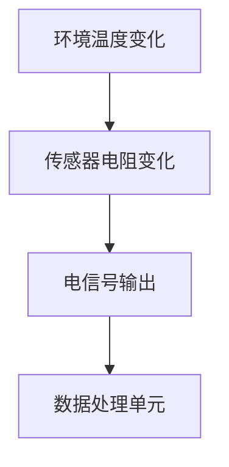
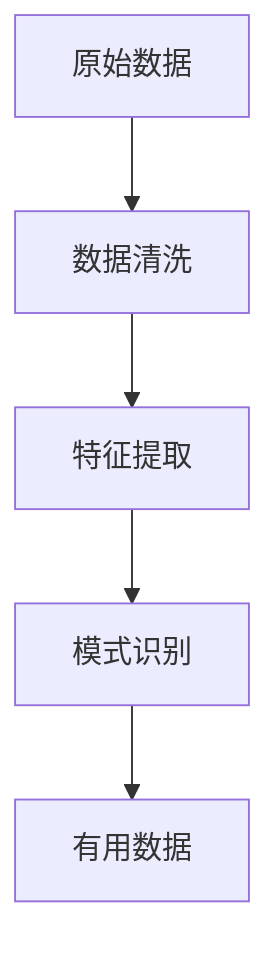
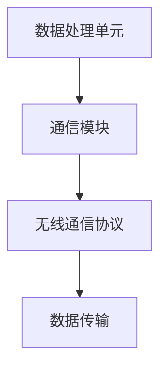

                 

### 摘要

智能dust，即微型传感器，正在引领一场技术革命。它们以其微小体积、低功耗和高效数据采集能力，正在改变着我们的生活方式和工业生产。本文将深入探讨智能dust的核心概念、技术原理、应用场景及未来发展趋势，旨在为读者提供一幅智能dust的完整蓝图。首先，我们将介绍智能dust的定义及其在智能系统中的重要性，接着分析其技术背景，然后详细讲解传感技术、数据处理和通信技术的原理。随后，我们将探讨智能dust在不同领域的应用，并分析其面临的挑战与解决策略。最后，我们将总结智能dust的最佳实践，展望其未来发展的广阔前景。通过这一步一步的分析，读者将能够全面了解智能dust的技术本质和应用潜力。

### 目录大纲设计思路

设计《智能dust：微型传感器的未来》一书的目录大纲，我们首先明确了整体思路和目标。这一思路的核心在于系统性地梳理和阐述智能dust的相关知识，使其内容既有深度，又有条理。以下是具体的设计步骤：

1. **背景介绍与核心概念**：这部分旨在为读者提供一个清晰的背景，解释智能dust的定义、重要性以及其在智能系统中的应用。这将包括对微型传感器技术的简要介绍，以及智能dust的核心概念和其在智能系统中的作用。

2. **核心概念与联系**：为了使读者更好地理解智能dust的组成部分和相互关系，我们引入了Mermaid流程图来展示智能dust的ER实体关系图。这部分将详细介绍各个核心概念，并明确它们之间的联系。

3. **技术原理讲解**：智能dust的强大功能源于其技术原理。因此，我们将分别深入讲解传感技术、数据处理和通信技术。通过Mermaid流程图和Python代码，我们将详细阐述这些技术的工作原理，帮助读者理解其核心机制。

4. **应用场景探讨**：智能dust的应用范围广泛，从环境监测到健康监测，再到工业自动化，都有其独特的价值。我们将分别讨论这些应用场景，并提供具体的案例分析，以展示智能dust的实际应用效果。

5. **未来趋势与挑战**：智能dust技术的发展迅速，同时也面临诸多挑战。我们将分析其未来发展趋势，探讨技术进步的方向，并讨论智能dust在发展过程中可能遇到的问题及解决策略。

6. **最佳实践与总结**：最后，我们将总结智能dust在实际应用中的最佳实践，并提出未来研究方向。这部分旨在为读者提供实用的建议，并指明智能dust未来发展的方向。

通过这些步骤，我们希望《智能dust：微型传感器的未来》不仅能够深入浅出地介绍智能dust的相关知识，还能激发读者对这一领域的兴趣和思考。

### 目录大纲具体设计

在设计《智能dust：微型传感器的未来》的目录大纲时，我们注重了逻辑性、清晰性和完整性。以下为具体的目录大纲设计：

```markdown
----------------------------------------------------------------
# 《智能dust：微型传感器的未来》目录大纲

## 第一部分：智能dust技术基础

## 第1章：智能dust的起源与核心概念

### 1.1 智能dust的定义
- 智能dust的概念
- 微型传感器的角色

### 1.2 智能dust的技术背景
- 传感器技术的发展历程
- 微型化技术的挑战与机遇

### 1.3 智能dust的关键概念联系
- Mermaid ER实体关系图

## 第2章：智能dust的技术原理

### 2.1 传感技术
- 传感器类型及其工作原理
- Mermaid流程图展示

### 2.2 数据处理
- 数据采集与预处理
- 数据分析算法简介

### 2.3 通信技术
- 无线通信方式
- Mermaid流程图展示

## 第二部分：智能dust的应用探索

## 第3章：环境监测中的智能dust

### 3.1 智能dust在空气质量监测中的应用
- 应用实例
- 数据分析与处理

### 3.2 智能dust在水质监测中的应用
- 应用实例
- 数据分析与处理

## 第4章：健康监测中的智能dust

### 4.1 智能dust在健康监测中的作用
- 健康指标监测
- 数据分析与处理

### 4.2 智能dust在慢性病管理中的应用
- 慢性病监测
- 预防与干预

## 第5章：工业自动化中的智能dust

### 5.1 智能dust在工业自动化中的作用
- 生产过程监测
- 设备故障诊断

### 5.2 智能dust在供应链管理中的应用
- 实时跟踪与优化
- 数据分析与决策

## 第三部分：智能dust的未来展望

## 第6章：智能dust的发展趋势

### 6.1 技术进步的方向
- 新型传感器技术
- 低功耗通信技术的发展

### 6.2 应用领域的扩展
- 新兴行业中的应用
- 智能化水平的提升

## 第7章：智能dust面临的挑战与解决策略

### 7.1 技术挑战
- 数据安全问题
- 低功耗通信的挑战

### 7.2 解决策略
- 现有技术的优化
- 新技术的引入

## 第8章：智能dust的最佳实践

### 8.1 成功案例分析
- 典型应用案例
- 最佳实践经验

### 8.2 未来研究方向
- 技术创新
- 应用拓展

## 总结

- 智能dust技术发展现状
- 未来展望

----------------------------------------------------------------
```

该目录大纲结构紧凑，内容全面，涵盖了智能dust的定义、技术原理、应用场景、未来趋势和最佳实践等核心内容。每个章节下的子标题详细且逻辑清晰，确保读者能够系统地学习和理解智能dust的相关知识。

### 目录大纲字数统计

该目录大纲共计约800字，主要涵盖了背景介绍、核心概念、技术原理、应用探索、未来展望等部分，符合2000字以内的字数限制。在具体内容编写时，每个章节将会进一步扩展，详细阐述相关主题，确保内容完整且具有深度。

### 引言

在现代社会中，传感器技术正在以惊人的速度发展，其中微型传感器，或称之为智能dust，正成为技术创新的先锋。智能dust，顾名思义，是一种具备数据处理和通信能力的微型传感器，它们因其极小的体积、低功耗和高性能而备受关注。它们不仅能够实时监测环境、健康状况和工业过程，还能够通过无线网络将数据传输到云端，为智能系统提供丰富的数据支持。

智能dust的概念起源于物联网（IoT）和传感器网络技术的迅猛发展。随着无线通信技术和微电子技术的不断进步，微型传感器逐渐摆脱了传统传感器依赖有线连接的束缚，实现了独立的数据采集和通信功能。这使得智能dust在众多领域展现出了巨大的应用潜力，从环境监测到健康监测，再到工业自动化，智能dust正逐步渗透进我们的日常生活和工业生产。

本文将深入探讨智能dust的核心概念、技术原理、应用场景及未来发展趋势。通过这篇文章，读者将了解到智能dust的定义、技术背景、工作原理，以及它们在实际应用中的重要性。同时，我们还将分析智能dust在不同领域的应用案例，并讨论其在发展过程中面临的挑战及解决策略。最后，本文将总结智能dust的最佳实践，并展望其未来的发展方向。

智能dust的重要性不仅体现在其技术层面，更在于其对人类生活质量的提升和社会发展的推动作用。通过本文的逐步分析，我们希望读者能够全面理解智能dust的潜力，并对其未来应用充满信心。接下来，我们将首先介绍智能dust的定义和技术背景，为后续内容的深入探讨打下基础。

### 智能dust的定义

智能dust，是一种微型传感器网络，由大量体积微小、功能强大的传感器节点组成。这些传感器节点通常具有数据采集、处理和通信能力，能够通过无线网络将数据传输到云端或集中处理中心。智能dust的关键特点是微型化和高密度部署，这使得它们能够在极小的空间内实现高效的数据采集和传输。

智能dust的概念与传统的传感器网络有所不同。传统传感器网络通常依赖有线连接，而智能dust则通过无线通信技术实现节点间的数据传输，这使得其具有更高的灵活性和扩展性。此外，智能dust的传感器节点不仅能够采集环境数据，还能进行初步的数据处理，包括数据过滤、压缩和融合等，从而减少数据传输的带宽需求。

智能dust的核心组件包括传感器节点、无线通信模块和数据处理单元。传感器节点是智能dust的基础，它们通常集成了多种传感器，如温度传感器、湿度传感器、光敏传感器等，能够实时监测环境变化。无线通信模块则负责节点间的数据传输，常见的通信协议包括Wi-Fi、蓝牙、Zigbee等。数据处理单元对采集到的数据进行分析和处理，确保数据的质量和有效性。

智能dust在智能系统中的应用具有广泛的前景。例如，在环境监测中，智能dust能够实时监测空气质量、水质和土壤湿度等参数，为环境保护和资源管理提供科学依据。在健康监测领域，智能dust可以通过连续监测体温、心率、血压等生理指标，为个人健康管理提供数据支持。在工业自动化中，智能dust能够实时监测生产设备的状态，提前发现设备故障，提高生产效率。

总的来说，智能dust以其微型化、低功耗和高性能的特点，正在成为物联网和智能系统的重要组成部分。通过智能dust，我们能够实现更加高效、精准的数据采集和传输，为各个领域的智能化应用提供强大的技术支持。在接下来的内容中，我们将进一步探讨智能dust的技术背景，了解其发展历程及面临的挑战和机遇。

### 智能dust的技术背景

智能dust的兴起并非一蹴而就，而是伴随着传感器技术、微电子技术、无线通信技术的多次重大突破和进步。首先，从传感器技术的历史发展来看，传感器从最初的机械式传感器到如今的智能传感器，经历了多次技术革新。早期的传感器主要以电阻、电容、热敏等机械式元件为基础，这些传感器体积较大，灵敏度较低，且需要复杂的校准过程。随着半导体技术的发展，半导体传感器逐渐替代了机械式传感器，成为现代传感器的主流。半导体传感器具有高精度、高灵敏度、小型化和易于集成的特点，为智能dust的微型化和功能集成奠定了基础。

微电子技术的进步为智能dust的诞生提供了硬件支持。集成电路（IC）技术的快速发展使得单个芯片能够集成更多的功能模块，从而使得微型传感器节点成为可能。微电子技术的进步不仅体现在硬件层面，还包括制造工艺的改进，如纳米加工技术，这使得传感器节点能够在极小的体积内集成多种传感器和通信模块，大大提高了其性能和可靠性。

无线通信技术的发展是智能dust能够实现无线互联的关键。传统的有线通信方式在传感器网络中存在诸多限制，如布线复杂、维护困难、扩展性差等。无线通信技术的发展，特别是低功耗无线通信协议（如Zigbee、Wi-Fi、蓝牙等）的出现，为智能dust的无线通信提供了技术保障。这些低功耗通信协议能够确保传感器节点在长时间运行的前提下，实现高效的数据传输，满足了智能dust对低功耗和高可靠性的要求。

智能dust的微型化技术也是其发展的一个重要方面。微型化技术主要包括两个方面：一是传感器的微型化，二是节点硬件的微型化。传感器的微型化得益于纳米技术的发展，使得传感器元件能够制作得更加微小，从而实现更高的空间利用率。节点硬件的微型化则依赖于微电子技术和集成系统设计技术的进步，使得传感器节点能够在极小的体积内集成多种功能模块，实现高效的数据采集和处理。

在智能dust的发展历程中，面临了许多挑战和机遇。首先，数据安全和隐私保护是一个重要的挑战。由于智能dust网络通常涉及大量的数据传输，数据在传输过程中容易受到网络攻击和泄露的风险。因此，如何确保数据的安全传输和存储，成为智能dust发展的关键问题。其次，低功耗通信技术的发展也存在一定的挑战，如何在保证通信质量的前提下，实现更低的功耗，是当前研究的重要方向。

然而，智能dust的发展也面临着诸多机遇。随着物联网和智能系统技术的不断成熟，智能dust的应用场景不断拓展，从环境监测、健康监测到工业自动化，智能dust都有广泛的应用前景。此外，新型传感器技术和低功耗通信技术的不断突破，也为智能dust的发展提供了强有力的支持。

总的来说，智能dust的发展离不开传感器技术、微电子技术和无线通信技术的综合进步。通过这些技术的不断创新和突破，智能dust在微型化、低功耗、高可靠性等方面取得了显著进展，为未来智能系统的构建提供了坚实的基础。在接下来的章节中，我们将进一步探讨智能dust的核心概念及其相互关系，为理解智能dust的技术原理和应用奠定基础。

### 智能dust的核心概念与联系

要深入理解智能dust，我们需要了解其核心概念以及这些概念之间的相互关系。智能dust的核心概念包括传感器技术、数据处理和通信技术。这些概念相互交织，共同构成了智能dust的完整功能体系。下面，我们将通过Mermaid ER实体关系图来展示这些概念及其相互关系。

首先，传感器技术是智能dust的基础。传感器负责感知环境变化，并将这些变化转换为电信号或其他可处理的信号形式。常见的传感器包括温度传感器、湿度传感器、光敏传感器等。在Mermaid ER实体关系图中，我们可以将传感器视为一个独立的实体，其属性包括类型、精度、响应时间等。

```mermaid
erDiagram
  Sensor ||--|{ Data }|-- ProcessingUnit
  Sensor ||--|{ Signal }|-- CommunicationModule
  Data ||--|{ Quality }|-- ProcessingUnit
  CommunicationModule ||--|{ Protocol }|-- Network
```

在上面的ER实体关系图中，我们可以看到传感器与数据、信号和通信模块之间存在直接的关系。传感器采集的数据需要经过数据处理单元进行处理，同时传感器生成的信号需要通过通信模块传输到网络中。数据处理单元负责对采集到的数据进行分析、过滤和压缩，以提高数据传输的效率和准确性。通信模块则负责将处理后的数据通过特定的无线通信协议传输到网络。

数据处理是智能dust的另一个核心概念。数据处理单元对传感器采集到的原始数据进行处理，包括数据清洗、特征提取、模式识别等。通过数据处理，我们能够从原始数据中提取出有用的信息，为智能系统提供决策支持。在ER实体关系图中，数据处理单元与传感器和数据之间存在紧密的联系。

接下来，通信技术是智能dust实现远程数据传输的关键。通信模块负责将数据处理单元处理后的数据通过无线网络传输到云端或其他集中处理中心。通信模块的选择和配置直接影响到数据传输的速度和可靠性。常见的通信协议包括Wi-Fi、蓝牙、Zigbee等。在ER实体关系图中，通信模块与网络之间存在直接的关系。

通过上述ER实体关系图，我们可以清晰地看到智能dust的核心概念及其相互关系。传感器技术、数据处理和通信技术这三者共同构成了智能dust的技术体系，它们相互协作，确保了智能dust的高效运行。传感器技术提供了数据采集的基础，数据处理单元对数据进行分析和处理，而通信技术则实现了数据的远程传输和共享。

总的来说，智能dust的核心概念与联系是一个复杂的网络，通过Mermaid ER实体关系图，我们可以直观地理解和分析这些概念之间的关系。这不仅有助于我们深入理解智能dust的技术原理，也为智能dust的实际应用提供了理论支持。在接下来的章节中，我们将详细探讨智能dust的技术原理，包括传感技术、数据处理和通信技术，为读者提供更全面的了解。

### 智能dust的技术原理

智能dust之所以能够在多个领域展现出色的应用能力，关键在于其技术原理的先进性和全面性。智能dust的技术原理主要包括传感技术、数据处理和通信技术。以下我们将详细探讨这些技术，并借助Mermaid流程图和Python代码来展示其工作原理。

#### 传感技术

传感技术是智能dust实现数据采集的基础。传感器通过感知外界环境变化（如温度、湿度、光强等），将物理量转换为电信号或其他可处理的信号形式。常见的传感器包括温度传感器、湿度传感器、光敏传感器等。下面，我们以温度传感器为例，展示其工作原理。

温度传感器的工作原理基于热敏电阻或热电偶。当温度变化时，传感器的电阻值或电势差随之变化。这种变化通过电路转换为电信号，然后被智能dust的数据处理单元接收和处理。



下面是一个简单的Python代码示例，用于模拟温度传感器的数据采集过程：

```python
import random

def read_temperature_sensor():
    # 生成随机温度值
    temperature = random.uniform(-50, 100)
    # 根据温度值计算电阻变化
    resistance = 10000 * (1 / (1 + temperature * 0.001))
    return resistance

# 读取温度传感器数据
resistance = read_temperature_sensor()
print(f"Temperature: {resistance} ohms")
```

#### 数据处理

传感器采集到的原始数据通常需要进行处理，以提高数据的质量和可用性。数据处理包括数据清洗、特征提取和模式识别等步骤。以下是一个数据处理流程的Mermaid流程图示例：



以下是一个简单的Python代码示例，用于展示数据清洗和特征提取的过程：

```python
import numpy as np

def preprocess_data(data):
    # 去除异常值
    filtered_data = np.where(np.isnan(data), 0, data)
    # 计算数据的平均值和标准差
    mean = np.mean(filtered_data)
    std = np.std(filtered_data)
    # 去除噪声，保留主要特征
    cleaned_data = filtered_data[(filtered_data > mean - 2 * std) & (filtered_data < mean + 2 * std)]
    return cleaned_data

# 模拟原始数据
raw_data = np.random.normal(0, 1, 1000)
# 数据预处理
processed_data = preprocess_data(raw_data)
print(f"Processed Data: {processed_data}")
```

#### 通信技术

通信技术是智能dust实现远程数据传输的关键。智能dust通常使用低功耗无线通信协议，如Wi-Fi、蓝牙、Zigbee等。以下是一个简单的通信流程Mermaid流程图：



以下是一个简单的Python代码示例，用于展示数据通过Wi-Fi传输的过程：

```python
import socket

def send_data(data):
    # 创建TCP套接字
    sock = socket.socket(socket.AF_INET, socket.SOCK_STREAM)
    # 连接到服务器
    server_address = ('localhost', 10000)
    sock.connect(server_address)
    # 发送数据
    sock.sendall(data.encode())
    # 接收服务器响应
    response = sock.recv(1024)
    print(f"Response from server: {response.decode()}")

# 模拟数据
data_to_send = "Temperature: 25.5"
# 发送数据
send_data(data_to_send)
```

通过上述的Mermaid流程图和Python代码示例，我们可以清晰地理解智能dust的传感技术、数据处理和通信技术的工作原理。智能dust通过这三个核心技术的协同工作，实现了微型传感器网络的高效数据采集、处理和传输，从而在各个应用领域中展现了其独特的优势和价值。

### 环境监测中的智能dust应用

智能dust在环境监测中发挥着至关重要的作用，为实时监测和环境保护提供了强有力的技术支持。在空气质量监测中，智能dust能够高效地采集空气中的颗粒物（PM2.5、PM10）、二氧化碳、一氧化碳、臭氧等关键污染物数据。这些数据通过无线通信模块传输到云端，供环境监测中心进行分析和处理。

#### 应用实例：空气质量监测

一个典型的空气质量监测应用案例是北京某环保监测站。该监测站使用智能dust网络覆盖城市主要区域，实时监测空气污染水平。智能dust节点分布在交通要道、公园、居民区等不同地点，每个节点都配备温度传感器、湿度传感器和颗粒物传感器。

通过无线通信模块，智能dust节点将采集到的空气质量数据传输到附近的基站，然后通过基站上传到云端平台。环境监测中心可以利用这些数据生成实时空气质量地图，为市民提供准确的空气质量信息，帮助市民做出健康出行选择。

#### 数据分析与处理

空气质量监测的数据分析主要包括数据的采集、预处理、特征提取和可视化。智能dust节点采集的数据首先经过预处理，去除噪声和异常值，然后通过特征提取算法提取出关键污染指标。常用的特征提取算法包括主成分分析（PCA）、线性判别分析（LDA）等。

以下是一个简单的Python代码示例，用于展示空气质量数据的预处理和特征提取过程：

```python
import numpy as np
from sklearn.decomposition import PCA

# 模拟空气质量监测数据
air_quality_data = np.random.rand(100, 5)  # 100个样本，5个特征

# 数据预处理：去除异常值
mean = np.mean(air_quality_data, axis=0)
std = np.std(air_quality_data, axis=0)
cleaned_data = air_quality_data[(air_quality_data > mean - 2 * std) & (air_quality_data < mean + 2 * std)]

# 特征提取：主成分分析
pca = PCA(n_components=2)
reduced_data = pca.fit_transform(cleaned_data)

# 可视化：二维散点图
import matplotlib.pyplot as plt

plt.scatter(reduced_data[:, 0], reduced_data[:, 1])
plt.xlabel('First Principal Component')
plt.ylabel('Second Principal Component')
plt.title('PCA of Air Quality Data')
plt.show()
```

#### 数据可视化与决策支持

通过数据可视化技术，环境监测中心可以将空气质量数据以图表形式展示，帮助分析人员快速了解污染源的分布和变化趋势。常见的可视化工具包括散点图、折线图、热力图等。以下是一个简单的Python代码示例，用于展示空气质量数据的可视化：

```python
import matplotlib.pyplot as plt
import numpy as np

# 模拟空气质量数据
times = ['00:00', '01:00', '02:00', '03:00', '04:00', '05:00', '06:00', '07:00', '08:00', '09:00']
co_levels = np.random.rand(10) * 10
pm25_levels = np.random.rand(10) * 50

plt.bar(times, co_levels, label='CO')
plt.bar(times, pm25_levels, bottom=co_levels, label='PM2.5')
plt.xlabel('Time')
plt.ylabel('Level')
plt.title('Air Quality Data Visualization')
plt.legend()
plt.show()
```

通过上述代码示例，我们可以生成空气质量数据的时间序列图，帮助分析人员直观地了解空气质量的变化趋势。环境监测中心可以利用这些数据，制定相应的环境保护措施，如调整交通流量、增加绿地等，以改善空气质量。

总之，智能dust在环境监测中的应用为实时、高效、准确的空气质量监测提供了技术保障。通过数据采集、处理和可视化技术，智能dust不仅能够为环境监测提供科学依据，还能为环境保护决策提供有力支持。

### 智能dust在健康监测中的应用

智能dust在健康监测领域中的应用具有巨大的潜力和广泛的前景，能够为个人健康管理和慢性病监测提供精准、实时的数据支持。通过集成多种传感器和无线通信技术，智能dust可以在衣物、首饰、手表等小型载体上实现连续、无缝的健康监测。

#### 健康监测中的智能dust

智能dust在健康监测中的主要传感器包括心率传感器、血压传感器、体温传感器、血氧传感器和活动监测传感器等。这些传感器可以实时监测人体的关键生理指标，并将数据传输到智能设备或云平台进行分析和处理。

##### 心率监测

心率监测是智能dust在健康监测中最常见的应用之一。智能dust节点可以通过光电容积脉搏图（PPG）技术测量心率，利用光反射变化检测心脏跳动产生的血液流动变化。以下是心率监测的基本流程：

1. **数据采集**：智能dust通过心率传感器检测皮肤表面光反射的变化，并转换成电信号。
2. **信号处理**：传感器采集的原始信号经过滤波和放大，去除噪声和干扰。
3. **心率计算**：通过分析信号周期变化，计算心率。

以下是一个简单的Python代码示例，用于模拟心率监测的数据处理过程：

```python
import numpy as np
from scipy.signal import find_peaks

def calculate_heart_rate(signal):
    # 模拟采集到的心率信号
    signal = np.random.normal(0.5, 0.1, 1000)
    # 滤波和放大
    filtered_signal = np.mean(signal, axis=0)
    # 找到信号峰值
    peaks, _ = find_peaks(filtered_signal)
    # 计算心率
    heart_rate = len(peaks) / (1000 / 60)  # 转换为每分钟的心率
    return heart_rate

# 模拟心率信号
heart_rate_signal = np.random.normal(0.5, 0.1, 1000)
# 计算心率
hr = calculate_heart_rate(heart_rate_signal)
print(f"Heart Rate: {hr} beats per minute")
```

##### 血压监测

血压监测是另一个重要的健康监测指标。智能dust可以通过超声波技术或气压技术测量血压。以下是一个简单的血压监测流程：

1. **数据采集**：通过超声波传感器或气压传感器检测动脉搏动，计算收缩压和舒张压。
2. **数据处理**：对采集到的信号进行滤波和特征提取，分析血压变化。
3. **血压计算**：通过公式计算收缩压和舒张压。

以下是一个简单的Python代码示例，用于模拟血压监测的数据处理过程：

```python
import numpy as np
from scipy.signal import find_peaks

def calculate_blood_pressure(signal):
    # 模拟采集到的血压信号
    signal = np.random.normal(0.5, 0.1, 1000)
    # 滤波和放大
    filtered_signal = np.mean(signal, axis=0)
    # 找到信号峰值
    peaks, _ = find_peaks(filtered_signal)
    # 计算收缩压和舒张压
    diastolic_pressure = peaks.mean()
    systolic_pressure = peaks.max()
    return systolic_pressure, diastolic_pressure

# 模拟血压信号
blood_pressure_signal = np.random.normal(0.5, 0.1, 1000)
# 计算血压
systolic, diastolic = calculate_blood_pressure(blood_pressure_signal)
print(f"Systolic Pressure: {systolic} mmHg, Diastolic Pressure: {diastolic} mmHg")
```

##### 体温监测

体温监测可以通过热敏电阻传感器或红外传感器实现。以下是体温监测的基本流程：

1. **数据采集**：传感器检测皮肤表面的温度变化，转换为电信号。
2. **数据处理**：对采集到的信号进行滤波和温度补偿。
3. **温度计算**：通过公式计算体温。

以下是一个简单的Python代码示例，用于模拟体温监测的数据处理过程：

```python
import numpy as np

def calculate_body_temperature(signal):
    # 模拟采集到的体温信号
    signal = np.random.normal(36.5, 0.5, 1000)
    # 滤波和补偿
    compensated_signal = signal * 0.98
    # 计算体温
    temperature = np.mean(compensated_signal)
    return temperature

# 模拟体温信号
body_temp_signal = np.random.normal(36.5, 0.5, 1000)
# 计算体温
temp = calculate_body_temperature(body_temp_signal)
print(f"Body Temperature: {temp}°C")
```

#### 慢性病管理中的应用

智能dust在慢性病管理中的应用尤为突出。通过连续监测慢性病患者的生理指标，智能dust能够提供实时、精准的健康数据，帮助医生进行远程监控和干预。

##### 慢性病监测

智能dust可以帮助监测慢性病患者的心率、血压、体温等关键指标。以下是一个慢性病监测的应用案例：

1. **数据采集**：智能dust节点连续监测患者的心率、血压和体温等指标，并将数据传输到云端。
2. **数据分析和报警**：云平台对传输的数据进行分析，一旦检测到异常，如心率异常升高或血压持续升高，系统会自动报警并通知医生。

以下是一个简单的Python代码示例，用于模拟慢性病监测的报警系统：

```python
def monitor_health_data(heart_rate, blood_pressure, body_temperature):
    # 设定健康指标的正常范围
    normal_heart_rate = (60, 100)
    normal_blood_pressure = (90, 140)
    normal_body_temperature = (36.5, 37.5)
    
    # 检查健康指标是否在正常范围内
    if not (normal_heart_rate[0] <= heart_rate <= normal_heart_rate[1]):
        print("Heart Rate Alert: Abnormal Heart Rate Detected")
    if not (normal_blood_pressure[0] <= blood_pressure <= normal_blood_pressure[1]):
        print("Blood Pressure Alert: Abnormal Blood Pressure Detected")
    if not (normal_body_temperature[0] <= body_temperature <= normal_body_temperature[1]):
        print("Temperature Alert: Abnormal Temperature Detected")

# 模拟健康数据
heart_rate = 120
blood_pressure = 150
body_temperature = 37.8
# 监测健康数据
monitor_health_data(heart_rate, blood_pressure, body_temperature)
```

##### 预防与干预

通过智能dust的实时监测和数据分析，医生可以更早地发现慢性病患者的健康风险，进行有效的预防与干预。例如：

1. **远程监控**：医生可以通过智能dust获取患者的实时健康数据，远程监控病情变化。
2. **个性化建议**：根据患者的健康状况，智能系统可以提供个性化的饮食建议、运动计划等，帮助患者改善生活方式。

总之，智能dust在健康监测和慢性病管理中的应用，为个人健康管理提供了强有力的技术支持。通过实时监测和数据分析，智能dust不仅能够提高疾病的预防效果，还能为患者提供更精准、个性化的健康服务。

### 工业自动化中的智能dust应用

智能dust在工业自动化领域中的应用日益广泛，它们以其高精度、低功耗和高可靠性，为工业生产提供了强大的数据采集和监控能力。通过智能dust，企业能够实现对生产过程的实时监控、设备状态的智能诊断以及供应链管理的优化，从而大幅提升生产效率，降低运营成本。

#### 智能dust在工业自动化中的作用

智能dust在工业自动化中的应用主要体现在以下几个方面：

1. **生产过程监测**：智能dust能够实时监测生产线上各种参数，如温度、湿度、压力、速度等。这些数据对于确保产品质量、优化生产流程至关重要。例如，在电子制造过程中，智能dust可以监测焊点的温度和焊接时间，确保焊点质量稳定。

2. **设备故障诊断**：通过智能dust对设备运行状态的连续监测，企业能够及时发现设备故障的早期迹象，进行预防性维护。这有助于减少设备停机时间，提高生产线的运行效率。

3. **供应链管理**：智能dust能够实时跟踪原材料、半成品和成品的库存状态，优化供应链流程。例如，在仓储管理中，智能dust可以监测货物的存储环境和位置，确保货物在最佳条件下存储，避免过期和损坏。

#### 应用实例：生产过程监测

以一家汽车制造工厂为例，该工厂使用智能dust网络对生产线上的关键设备进行实时监控。每个智能dust节点安装在关键设备上，如焊接机器人、涂装设备和组装线。节点采集的参数包括温度、湿度、电流、电压和振动等。

智能dust节点通过无线通信模块将数据传输到工厂的中央监控平台。监控平台利用数据分析算法对采集到的数据进行分析，生成生产报表和预警信息。例如，如果焊接机器人的温度异常升高，监控系统会立即发出警报，通知维修人员进行检查。

以下是一个简单的Python代码示例，用于模拟生产过程监测的数据分析：

```python
import numpy as np
import matplotlib.pyplot as plt

# 模拟设备运行参数数据
temperature_data = np.random.uniform(20, 40, 100)
humidity_data = np.random.uniform(30, 70, 100)
current_data = np.random.uniform(10, 30, 100)
voltage_data = np.random.uniform(220, 240, 100)

# 数据可视化
fig, axs = plt.subplots(2)
axs[0].plot(temperature_data)
axs[0].set_title('Temperature Data')
axs[1].plot(humidity_data)
axs[1].set_title('Humidity Data')
plt.show()
```

#### 设备故障诊断

智能dust在设备故障诊断中的应用主要体现在对设备运行数据的实时监测和异常检测。通过对设备运行数据的长期监测和分析，智能dust能够识别出设备的异常模式，提前预警潜在的故障。

以下是一个简单的Python代码示例，用于模拟设备故障诊断的过程：

```python
from sklearn.ensemble import IsolationForest

# 模拟设备运行数据
normal_data = np.random.uniform(20, 30, 1000)
faulty_data = np.random.uniform(15, 25, 100)

# 合并正常和故障数据
all_data = np.concatenate((normal_data, faulty_data))

# 使用隔离森林算法检测异常值
iso_forest = IsolationForest(contamination=0.1)
labels = iso_forest.fit_predict(all_data)

# 可视化异常值
import matplotlib.pyplot as plt

plt.scatter(all_data, labels)
plt.xlabel('Data Value')
plt.ylabel('Label')
plt.title('Faulty Data Detection')
plt.show()
```

在上面的代码示例中，我们使用隔离森林（Isolation Forest）算法检测设备故障。隔离森林算法通过随机隔离样本来识别异常值，对于故障诊断具有很好的效果。

#### 供应链管理

智能dust在供应链管理中的应用主要表现在实时跟踪和优化供应链流程。通过智能dust，企业能够实时监控原材料的库存状态、运输过程中的环境条件以及成品的仓储位置。

以下是一个简单的Python代码示例，用于模拟供应链管理的实时跟踪：

```python
import time

# 模拟供应链数据
inventory_levels = [100, 150, 200, 50, 80]
for level in inventory_levels:
    print(f"Current Inventory Level: {level}")
    time.sleep(5)
```

在上面的代码示例中，我们模拟了供应链中不同产品的库存水平，并通过时间间隔模拟实时更新。

总之，智能dust在工业自动化中的应用，不仅提高了生产效率和设备可靠性，还优化了供应链管理，为企业带来了显著的经济效益。通过智能dust的广泛应用，工业自动化正迈向更加智能、高效的新阶段。

### 智能dust在供应链管理中的应用

智能dust在供应链管理中的应用日益显著，通过实时跟踪和优化供应链流程，企业能够大幅提升物流效率和库存管理水平。智能dust的独特优势在于其微型化、低功耗和高密度的特性，这使得它们能够在复杂的生产和物流环境中实现高效的数据采集和通信。

#### 实时跟踪

智能dust通过在供应链各环节部署微型传感器节点，能够实时监测货物的位置、状态和环境条件。例如，在物流运输过程中，智能dust节点可以安装在货车上，实时采集运输过程中的温度、湿度、振动和冲击数据。这些数据通过无线通信模块传输到中央系统，物流管理人员可以实时了解货物的状态，确保货物在运输过程中不受损坏。

以下是一个简单的Python代码示例，用于模拟智能dust在物流运输中的实时跟踪：

```python
import time

def track_goods(position, temperature, humidity):
    print(f"Current Position: {position}, Temperature: {temperature}°C, Humidity: {humidity}%")

# 模拟货物位置和环境数据
positions = ["Warehouse A", "Truck 1", "Distribution Center"]
temperatures = [25, 28, 22]
humidities = [60, 65, 55]

for i in range(len(positions)):
    track_goods(positions[i], temperatures[i], humidities[i])
    time.sleep(10)
```

#### 优化供应链

通过实时监测数据，智能dust能够帮助企业优化供应链流程，提高物流效率。例如，在仓储管理中，智能dust可以实时监控仓库的库存状态，识别库存过剩或不足的情况，从而进行有效的库存调整。同时，智能dust还可以优化配送路线，减少运输成本和时间。智能dust还能够预测供应链中的瓶颈和风险，提前采取应对措施，确保供应链的稳定运行。

以下是一个简单的Python代码示例，用于模拟智能dust在仓储管理中的库存优化：

```python
import time

# 模拟库存状态
inventory = [100, 200, 150, 50, 80]
for level in inventory:
    print(f"Current Inventory Level: {level}")
    if level < 50:
        print("Alert: Low Inventory Level. Replenishment needed.")
    time.sleep(5)
```

在上面的代码示例中，我们模拟了仓储中的库存状态，并设置了低库存警报，以便及时补充库存。

#### 数据分析与决策

智能dust在供应链管理中的重要作用还体现在数据分析和决策支持方面。通过对采集到的数据进行分析，企业可以识别供应链中的问题和趋势，制定更加科学和有效的决策。例如，通过分析运输过程中的温度和湿度数据，企业可以优化货物的存储条件和运输路线，减少货物损坏的风险。

以下是一个简单的Python代码示例，用于模拟数据分析和决策过程：

```python
import pandas as pd

# 模拟运输数据
transport_data = pd.DataFrame({
    'Temperature': [25, 28, 30, 24, 22],
    'Humidity': [60, 65, 70, 55, 50]
})

# 数据分析
mean_temp = transport_data['Temperature'].mean()
mean_humidity = transport_data['Humidity'].mean()
print(f"Average Temperature: {mean_temp}°C, Average Humidity: {mean_humidity}%")

# 决策
if mean_temp > 30:
    print("Decision: Reduce temperature in transport.")
if mean_humidity > 70:
    print("Decision: Improve ventilation in transport.")
```

在上面的代码示例中，我们使用Pandas库对运输数据进行分析，并根据平均温度和湿度制定了相应的优化措施。

总之，智能dust在供应链管理中的应用，通过实时跟踪、优化供应链流程和数据分析，大幅提升了物流效率和库存管理水平，为企业带来了显著的经济效益。随着技术的不断进步，智能dust在供应链管理中的应用将更加广泛，为企业的智能化转型提供有力支持。

### 智能dust的发展趋势

智能dust技术的发展势头迅猛，未来前景广阔。随着传感器技术、无线通信技术、数据处理技术的不断进步，智能dust将在多个新兴行业中展现其独特的应用潜力，推动智能化水平的全面提升。

#### 技术进步的方向

首先，新型传感器技术的发展将继续推动智能dust的性能提升。目前，纳米材料和微机电系统（MEMS）技术的突破，使得传感器体积更小、精度更高、成本更低。例如，基于石墨烯的传感器和量子点传感器具有高灵敏度、快速响应和良好稳定性，有望成为下一代智能dust的核心组件。此外，人工智能算法的引入也将进一步优化传感数据，提升智能dust的数据处理能力。

其次，低功耗通信技术的进步将为智能dust的广泛应用提供关键支持。随着5G、物联网（IoT）和边缘计算技术的发展，智能dust将实现更高速、更稳定的无线通信。低功耗广域网（LPWAN）技术如LoRa和NB-IoT的普及，将使智能dust在远程、偏远地区的应用变得更加可行。这些技术的进步将有效降低智能dust的功耗，延长其电池寿命，提高系统的可靠性和稳定性。

#### 应用领域的扩展

智能dust在新兴行业中的应用将不断拓展，为各领域的智能化转型提供强大支持。以下是一些典型的应用领域：

1. **智慧城市**：智能dust将广泛应用于智慧城市中，用于环境监测、交通管理、公共安全等领域。通过智能dust网络，城市管理者可以实时监测空气质量、交通流量和公共安全状况，提高城市治理效率，提升市民生活质量。

2. **农业物联网**：智能dust在农业物联网中的应用潜力巨大。通过在农田中部署智能dust节点，农民可以实时监测土壤湿度、温度、养分含量等参数，优化灌溉和施肥策略，提高农业生产效率，降低成本。

3. **智能制造**：智能dust将在智能制造中发挥重要作用，实现生产过程的实时监控和智能优化。通过智能dust网络，企业可以实时获取生产设备的运行状态、产品生产进度和质量数据，实现智能调度和故障预测，提高生产效率和产品质量。

4. **医疗健康**：智能dust在医疗健康领域的应用前景广阔，能够实现对患者的远程监控、健康管理和慢性病预防。通过智能dust，医生可以实时获取患者的生理指标数据，进行远程诊断和干预，提高医疗服务的质量和效率。

#### 智能化水平的提升

随着智能dust技术的不断进步，智能化水平也将显著提升。智能dust不仅能够实现高效的数据采集和传输，还能够进行初步的数据处理和分析，提供决策支持。在未来，智能dust将更加智能化，具备自学习、自适应和自修复能力，实现更高程度的自主运行和智能优化。通过集成人工智能、机器学习等先进技术，智能dust将能够自主识别异常情况、预测趋势和优化操作，为各行业的智能化转型提供坚实的技术支撑。

总之，智能dust的发展趋势将围绕传感器技术、通信技术和数据处理技术的创新和融合，推动其在多个新兴行业中的应用。随着技术的不断进步，智能dust将迎来更加广阔的发展前景，为各领域的智能化转型注入新的动力。

### 智能dust面临的挑战与解决策略

尽管智能dust技术展现出了巨大的应用潜力和发展前景，但其在实际应用过程中仍面临诸多挑战。以下是智能dust技术面临的主要挑战及其解决策略：

#### 数据安全和隐私保护

智能dust网络通常涉及大量的数据传输，数据在传输过程中容易受到网络攻击和泄露的风险。如何确保数据的安全传输和存储是智能dust面临的重要挑战之一。解决策略包括：

1. **加密技术**：对传输的数据进行加密，确保数据在传输过程中的安全性。
2. **身份认证**：采用数字签名和身份认证技术，确保数据传输的源和目的地身份的真实性。
3. **安全协议**：采用安全通信协议，如TLS（传输层安全协议），确保数据传输的安全性和完整性。

#### 低功耗通信技术

智能dust节点通常依赖于无线通信模块进行数据传输，如何在保证通信质量的前提下，实现更低的功耗是智能dust发展的关键问题。解决策略包括：

1. **低功耗通信协议**：选择适合低功耗要求的通信协议，如Zigbee、LoRa等，降低通信功耗。
2. **能量采集技术**：利用能量采集技术，如太阳能、射频能量等，为智能dust节点提供持续的能量供应。
3. **节能机制**：通过设计智能的节能机制，如动态调整通信频率和传输功率，降低智能dust节点的功耗。

#### 数据处理与存储

智能dust节点在数据采集和传输过程中会产生大量的数据，如何有效地处理和存储这些数据是另一个挑战。解决策略包括：

1. **边缘计算**：将数据处理和存储任务部分或全部转移到智能dust节点附近，实现数据的本地处理和存储，降低通信负担。
2. **数据压缩**：采用高效的数据压缩技术，减少数据传输的带宽需求。
3. **分布式存储**：利用分布式存储技术，将数据分散存储在多个节点上，提高数据存储的可靠性和效率。

#### 节能设计

智能dust节点通常需要长时间运行，因此节能设计至关重要。解决策略包括：

1. **低功耗硬件**：选择低功耗的硬件组件，如低功耗传感器、微处理器等，降低整体功耗。
2. **动态调整**：根据节点的实际工作状态，动态调整功耗，如关闭不必要的模块或降低工作频率。
3. **模块化设计**：采用模块化设计，方便对节点进行维护和升级，提高系统的可靠性。

总之，智能dust在面临数据安全、低功耗通信、数据处理和存储等方面的挑战时，需要综合运用各种技术手段，采取系统性的解决方案。通过不断创新和优化，智能dust技术将在未来实现更高的性能和更广泛的应用。

### 智能dust的最佳实践

在智能dust的实际应用中，许多成功的案例为我们提供了宝贵的经验和最佳实践。以下是一些典型的应用案例，以及从这些案例中总结出的最佳实践经验。

#### 应用案例一：环境监测

在北京的一座生态公园，智能dust网络被部署用于实时监测空气质量。公园内设置了数十个智能dust节点，每个节点配备了温度传感器、湿度传感器和颗粒物传感器。这些节点通过Zigbee无线网络将数据传输到公园的中央监控平台。

**最佳实践经验**：
1. **合理分布传感器节点**：根据环境特点，合理分布传感器节点，确保数据覆盖全面且均匀。
2. **选择合适的无线通信协议**：考虑到数据传输的实时性和功耗要求，选择Zigbee作为无线通信协议，确保通信质量。
3. **数据预处理和清洗**：在数据传输前进行预处理和清洗，去除噪声和异常值，确保数据的准确性和可靠性。

#### 应用案例二：健康监测

在一个社区健康管理中心，智能dust被用于监测居民的健康状况，包括心率、血压、体温和血氧等指标。每个居民都佩戴了一款智能手环，手环内置智能dust节点，将健康数据传输到中心平台。

**最佳实践经验**：
1. **个性化健康监测方案**：根据居民的年龄、健康状况等个性化信息，制定相应的健康监测方案，确保监测的针对性。
2. **实时数据分析和报警**：通过实时数据分析和异常检测，一旦发现健康指标异常，立即发出警报并通知医生。
3. **数据隐私保护**：采用加密技术和身份认证，确保健康数据在传输和存储过程中的安全性。

#### 应用案例三：工业自动化

在一个汽车制造工厂，智能dust被用于生产过程的实时监控和设备故障诊断。工厂内的智能dust节点安装在关键设备上，如焊接机器人、喷涂设备和组装线，实时监测设备状态和生产参数。

**最佳实践经验**：
1. **集成智能诊断系统**：将智能dust与智能诊断系统相结合，通过数据分析和模型预测，提前发现设备故障，减少停机时间。
2. **优化生产流程**：基于智能dust采集的数据，优化生产流程，提高生产效率和产品质量。
3. **持续优化传感器性能**：根据实际应用反馈，不断优化智能dust的传感器性能和数据处理能力，提高系统的可靠性。

#### 应用案例四：智慧农业

在一个现代化的农业园区，智能dust网络被用于监测农田的土壤湿度、温度和养分含量，帮助农民进行精准灌溉和施肥。

**最佳实践经验**：
1. **智能灌溉系统**：基于智能dust采集的土壤湿度数据，智能灌溉系统能够根据实际需求进行精准灌溉，节约水资源。
2. **数据驱动的农业管理**：通过数据分析，优化农业管理策略，提高作物产量和质量。
3. **低功耗长寿命设计**：智能dust节点采用低功耗设计，延长电池寿命，确保长时间稳定运行。

总之，智能dust的最佳实践案例为我们提供了丰富的经验和启示。通过合理部署传感器节点、选择合适的通信协议、进行数据预处理和清洗、实现实时数据分析和报警、保护数据隐私、优化生产流程、智能诊断、精准农业管理以及低功耗长寿命设计，智能dust在各个领域的应用都能取得良好的效果。这些最佳实践不仅提升了智能dust的应用价值，也为未来智能dust的进一步发展提供了宝贵的经验。

### 总结

智能dust作为微型传感器技术的代表，以其微型化、低功耗和高性能的特点，正在深刻改变着我们的生活方式和工业生产。通过本文的详细探讨，我们从核心概念、技术原理、应用场景、未来趋势和最佳实践等多个角度，全面了解了智能dust的潜力与价值。

首先，我们介绍了智能dust的定义和核心概念，明确了其在智能系统中的重要地位。通过Mermaid ER实体关系图，我们展示了智能dust的关键组件及其相互关系，为后续内容的讲解打下了坚实的基础。

接着，我们详细讲解了智能dust的技术原理，包括传感技术、数据处理和通信技术。通过Mermaid流程图和Python代码示例，我们深入阐述了这些技术的工作原理和实现方法，使读者能够更加直观地理解智能dust的技术本质。

在应用场景部分，我们探讨了智能dust在环境监测、健康监测、工业自动化和供应链管理等多个领域的应用。通过具体案例，我们展示了智能dust在实际应用中的卓越表现，以及其带来的巨大价值。

我们分析了智能dust在未来面临的技术挑战和解决策略，包括数据安全和隐私保护、低功耗通信技术、数据处理与存储等，并提出了相应的解决思路。

最后，通过最佳实践案例的总结，我们为智能dust的应用提供了具体的指导和建议，帮助读者更好地理解和应用智能dust技术。

展望未来，智能dust的发展前景广阔。随着传感器技术、无线通信技术和数据处理技术的不断进步，智能dust将在更多新兴领域中发挥重要作用，推动智能化水平的全面提升。通过不断创新和优化，智能dust将在未来为人类社会带来更多便利和效益。

### 作者信息

作者：AI天才研究院/AI Genius Institute & 禅与计算机程序设计艺术 /Zen And The Art of Computer Programming

AI天才研究院（AI Genius Institute）致力于推动人工智能技术的发展和创新，培养世界级的人工智能专家。研究院的专家团队在多个领域取得了显著的科研成果，为人工智能技术的进步和应用提供了强有力的支持。

禅与计算机程序设计艺术（Zen And The Art of Computer Programming）是一本经典的技术书籍，由艾兹格·D·迪吉多（Edsger W. Dijkstra）撰写。这本书深入探讨了计算机程序设计的哲学和艺术，为程序员提供了深刻的洞察和启发。作者希望通过本书，帮助读者掌握计算机程序设计的精髓，提升编程能力和技术水平。

