                 

### 智能企业供应链优化：AI提升端到端效率

> 关键词：智能企业、供应链优化、人工智能、端到端效率

**摘要**：
本文将探讨如何通过人工智能技术优化智能企业的供应链管理，提高端到端的运营效率。我们将从背景与核心概念、基础理论、AI应用、实践案例以及未来趋势等多个方面，详细解析智能供应链优化的发展路径和实践方法。希望通过本文，读者能对智能供应链优化有更深入的理解，并能够在实际业务中应用这些先进的技术。

----------------------------------------------------------------

## 第一部分：背景与核心概念

### 第1章：智能企业与供应链优化的需求

#### 1.1.1 智能企业的概念与发展

**背景介绍**：
智能企业是指利用人工智能（AI）技术、大数据、物联网（IoT）等先进技术，实现业务流程智能化、数据驱动化、决策自动化，从而提升企业运营效率和竞争力的企业。随着AI技术的不断进步，智能企业在全球范围内得到了快速发展。

**问题描述**：
智能企业的快速发展带来了供应链管理的新挑战。传统的供应链管理方法难以适应智能化、动态化的业务环境，导致供应链效率低下、成本增加、响应速度慢等问题。

**问题解决**：
通过引入AI技术，可以实现对供应链的全面优化，提高端到端的运营效率。AI技术能够帮助智能企业实现需求预测、库存管理、物流优化、风险控制等多方面的提升。

**边界与外延**：
智能企业的供应链优化不仅涉及企业内部的运营管理，还包括与上下游供应商、合作伙伴的协同。同时，还需要考虑全球化背景下的供应链复杂性和不确定性。

#### 1.1.2 供应链优化的背景

**核心概念术语说明**：
供应链优化：通过改进供应链各个环节的运营效率，降低成本，提高响应速度和服务水平的过程。

**问题背景**：
供应链作为企业运营的核心环节，影响着企业的盈利能力、市场竞争力以及客户满意度。然而，随着市场竞争的加剧和客户需求的多样化，传统供应链管理面临着诸多挑战。

**问题描述**：
传统供应链管理存在以下问题：
- 库存管理不当，导致库存过剩或不足；
- 物流成本高，配送效率低；
- 需求预测不准确，导致供应链波动；
- 风险管理不足，易受供应链中断的影响。

**问题解决**：
通过供应链优化，可以解决上述问题，提高供应链的灵活性和响应速度，降低成本，提高企业的竞争力。

**边界与外延**：
供应链优化不仅涉及企业内部的运营管理，还包括供应链网络设计、需求预测、物流配送、库存管理、风险管理等多个方面。同时，供应链优化还需要考虑全球化背景下的供应链复杂性。

#### 1.1.3 AI在供应链管理中的作用

**核心概念原理**：
AI在供应链管理中的作用主要包括以下几个方面：
- 需求预测：利用大数据和机器学习技术，预测市场需求，优化库存和物流策略；
- 库存管理：通过实时数据分析和预测，优化库存水平，降低库存成本；
- 物流优化：利用路径优化算法和实时交通数据，提高物流效率，降低物流成本；
- 风险管理：通过实时监控和预测，及时发现潜在风险，制定应对策略。

**概念属性特征对比表格**：

| 概念         | 特征                                       | 作用                                               |
|--------------|------------------------------------------|--------------------------------------------------|
| 需求预测     | 大数据分析、机器学习                      | 优化库存和物流策略                                  |
| 库存管理     | 实时数据分析、预测                       | 降低库存成本                                       |
| 物流优化     | 路径优化算法、实时交通数据              | 提高物流效率，降低物流成本                         |
| 风险管理     | 实时监控、预测                          | 发现潜在风险，制定应对策略                           |

**ER实体关系图架构**：

```mermaid
erDiagram
    Customer ||--|{ Order }|-- Supplier
    Product ||--|{ Inventory }|-- Warehouse
    Order ||--|{ Item }|-- Product
    Warehouse ||--|{ Delivery }|-- Customer
```

**算法原理讲解**：
- 需求预测：使用时间序列分析、回归分析等方法，结合历史数据和季节性因素，预测未来的市场需求。
- 库存管理：采用ABC分析、安全库存计算等方法，结合需求预测和供应链策略，确定合理的库存水平。
- 物流优化：使用路径规划算法（如Dijkstra算法、A*算法）和实时交通数据，优化物流配送路径。
- 风险管理：使用风险矩阵、蒙特卡洛模拟等方法，评估供应链风险，制定应对策略。

**数学模型和公式**：

需求预测模型：
$$
\hat{D_t} = \alpha_t \cdot D_{t-1} + (1 - \alpha_t) \cdot \hat{D}_{t-1}
$$

其中，$\hat{D_t}$ 表示预测的需求，$D_{t-1}$ 表示历史需求，$\alpha_t$ 表示加权系数。

库存管理模型：
$$
I_t = R_t + S_t - C_t
$$

其中，$I_t$ 表示库存水平，$R_t$ 表示需求，$S_t$ 表示安全库存，$C_t$ 表示消费。

**举例说明**：
假设某智能企业在过去三个月的销售额分别为1000件、1200件和1500件，使用移动平均法预测下个月的销售额。

$$
\hat{D_4} = \frac{1000 + 1200 + 1500}{3} = 1300
$$

**注意事项**：
- 需求预测模型的精度受到历史数据质量和模型参数选择的影响；
- 库存管理模型需要根据实际情况进行调整，以满足不同的供应链策略；
- 物流优化模型需要考虑交通状况、配送成本等因素；
- 风险管理模型需要结合企业的业务特点和风险偏好进行制定。

**拓展阅读**：
- 《智能供应链管理：方法与实践》
- 《人工智能在供应链管理中的应用》
- 《基于机器学习的供应链需求预测方法研究》

### 1.1.4 供应链优化面临的挑战

**核心概念与联系**：
供应链优化面临的挑战主要包括以下几个方面：
- 数据质量：数据的质量直接影响需求预测、库存管理和物流优化的准确性；
- 技术复杂度：AI技术在供应链优化中的应用需要较高的技术门槛，包括数据处理、算法选择和模型训练等；
- 系统集成：将AI技术与现有的供应链管理系统集成，实现数据共享和流程协同，是供应链优化的关键；
- 风险评估：供应链优化过程中，需要评估和应对各种潜在风险，确保供应链的稳定性。

**核心概念原理**：
- 数据质量：高质量的数据是AI算法准确预测和决策的基础。数据的质量包括数据的准确性、完整性、及时性和一致性；
- 技术复杂度：AI技术涉及多个领域，包括机器学习、数据挖掘、自然语言处理等，需要具备一定的技术储备和研发能力；
- 系统集成：系统集成需要解决数据对接、流程优化和系统协同等问题，确保AI技术能够有效应用于供应链管理；
- 风险评估：风险评估需要综合考虑供应链的各个环节，识别潜在风险，制定应对策略。

**概念属性特征对比表格**：

| 概念           | 特征                                         | 影响                               |
|----------------|--------------------------------------------|-----------------------------------|
| 数据质量       | 准确性、完整性、及时性、一致性              | 影响需求预测、库存管理和物流优化的准确性 |
| 技术复杂度     | 机器学习、数据挖掘、自然语言处理等          | 影响AI技术在供应链优化中的应用效果     |
| 系统集成       | 数据对接、流程优化、系统协同                | 影响AI技术与现有系统的集成效果         |
| 风险评估       | 风险识别、风险评估、风险应对                | 确保供应链的稳定性和可靠性             |

**ER实体关系图架构**：

```mermaid
erDiagram
    DataQuality ||--|{ Prediction, Management, Optimization }| DataIntegration
    TechnologyComplexity ||--|{ Application, Integration }| DataQuality
    SystemIntegration ||--|{ DataIntegration, RiskAssessment }| DataQuality
    RiskAssessment ||--|{ RiskIdentification, RiskMitigation }| SystemIntegration
```

**算法原理讲解**：
- 数据质量评估：使用数据清洗、数据质量检测等方法，评估数据的质量，并采取相应的措施进行数据修复；
- 技术复杂度评估：使用技术评估模型，评估AI技术在供应链优化中的适用性和可行性；
- 系统集成评估：使用系统集成评估模型，评估AI技术与现有系统的集成效果，并提出改进建议；
- 风险评估：使用风险评估模型，识别供应链中的潜在风险，评估风险的影响程度，并制定应对策略。

**数学模型和公式**：

数据质量评估模型：
$$
Q = \frac{1}{N} \sum_{i=1}^{N} (P_i - P_i^*)^2
$$

其中，$Q$ 表示数据质量，$P_i$ 表示实际数据，$P_i^*$ 表示预期数据。

技术复杂度评估模型：
$$
C = \frac{1}{N} \sum_{i=1}^{N} (T_i - T_i^*)^2
$$

其中，$C$ 表示技术复杂度，$T_i$ 表示实际技术难度，$T_i^*$ 表示预期技术难度。

系统集成评估模型：
$$
I = \frac{1}{N} \sum_{i=1}^{N} (S_i - S_i^*)^2
$$

其中，$I$ 表示系统集成效果，$S_i$ 表示实际系统集成效果，$S_i^*$ 表示预期系统集成效果。

**举例说明**：
假设某智能企业对供应链管理系统的数据质量进行评估，共收集了10个数据点，计算得到的数据质量指标为0.1。

$$
Q = \frac{1}{10} \sum_{i=1}^{10} (P_i - P_i^*)^2 = 0.1
$$

**注意事项**：
- 数据质量评估需要综合考虑多个方面，包括数据的准确性、完整性、及时性和一致性；
- 技术复杂度评估需要结合企业的实际情况，选择合适的评估模型和方法；
- 系统集成评估需要充分考虑系统的兼容性、稳定性和安全性；
- 风险评估需要结合企业的业务特点和风险偏好，制定科学合理的风险评估模型。

**拓展阅读**：
- 《大数据质量评估方法研究》
- 《人工智能在供应链管理中的技术复杂性分析》
- 《基于风险评估的供应链管理系统设计》

### 第2章：核心概念与联系

#### 2.1.1 供应链管理的基本概念

**核心概念原理**：
供应链管理（Supply Chain Management, SCM）是指通过计划、组织、协调、控制和优化供应链各个环节，以提高整个供应链的效率和竞争力的过程。供应链管理涵盖了从原材料采购、生产、物流配送、仓储到最终产品交付给客户的整个流程。

**问题场景介绍**：
在企业运营中，供应链管理发挥着至关重要的作用。有效的供应链管理可以降低成本、提高效率、提升客户满意度，从而增强企业的市场竞争力。然而，随着企业规模的扩大和市场的变化，传统的供应链管理方法难以满足现代企业的需求，需要引入新的技术和方法进行优化。

**项目介绍**：
某智能企业希望通过优化供应链管理，提高生产效率和降低成本。该项目主要包括以下几个方面：
- 数据采集与处理：收集供应链各个环节的数据，并进行数据清洗和处理，为后续分析提供高质量的数据支持；
- 需求预测：利用大数据和机器学习技术，预测市场需求，优化库存和物流策略；
- 库存管理：通过实时数据分析和预测，优化库存水平，降低库存成本；
- 物流优化：利用路径优化算法和实时交通数据，提高物流效率，降低物流成本；
- 风险管理：通过实时监控和预测，及时发现潜在风险，制定应对策略。

**系统功能设计（领域模型Mermaid类图）**：

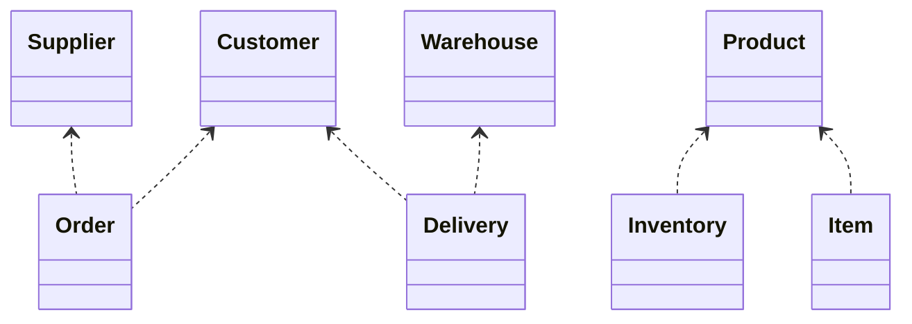

**系统架构设计（Mermaid架构图）**：

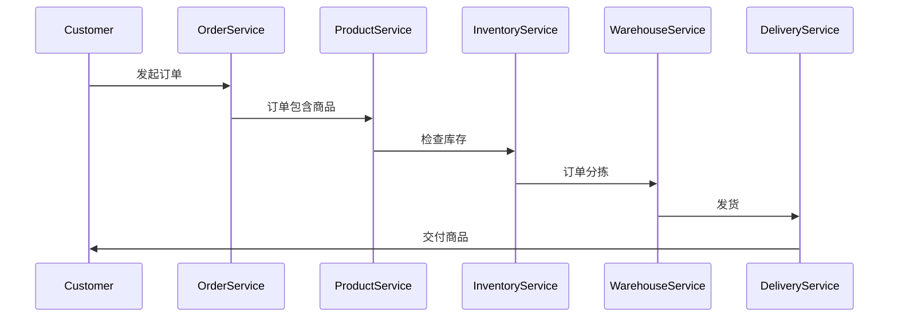

**系统接口设计和系统交互（Mermaid序列图）**：

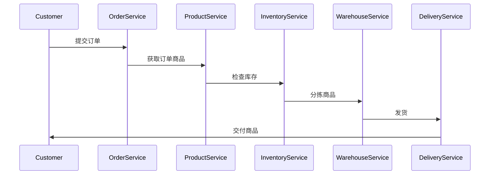

#### 2.1.2 供应链优化的重要指标

**核心概念原理**：
供应链优化的重要指标包括库存周转率、物流成本、订单履行时间、服务水平等。这些指标反映了供应链各个环节的运营效率和性能。

**问题场景介绍**：
企业在进行供应链优化时，需要关注这些关键指标，以衡量优化效果和改进方向。然而，不同企业的供应链特点和业务目标不同，导致这些指标的具体数值和重要性有所差异。

**项目介绍**：
某智能企业希望通过优化供应链管理，提高生产效率和降低成本。该项目重点关注以下指标：
- 库存周转率：通过提高库存周转率，降低库存成本，提高资金利用率；
- 物流成本：通过优化物流路径和运输模式，降低物流成本；
- 订单履行时间：通过优化订单处理和配送流程，缩短订单履行时间；
- 服务水平：通过提高订单准确率和配送时效，提升客户满意度。

**系统功能设计（领域模型Mermaid类图）**：

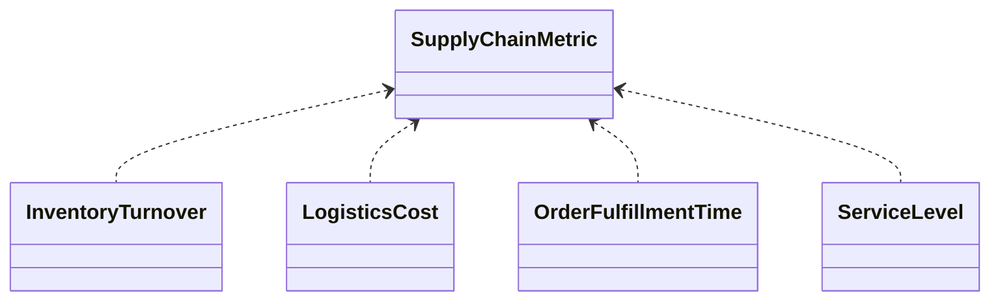

**系统架构设计（Mermaid架构图）**：

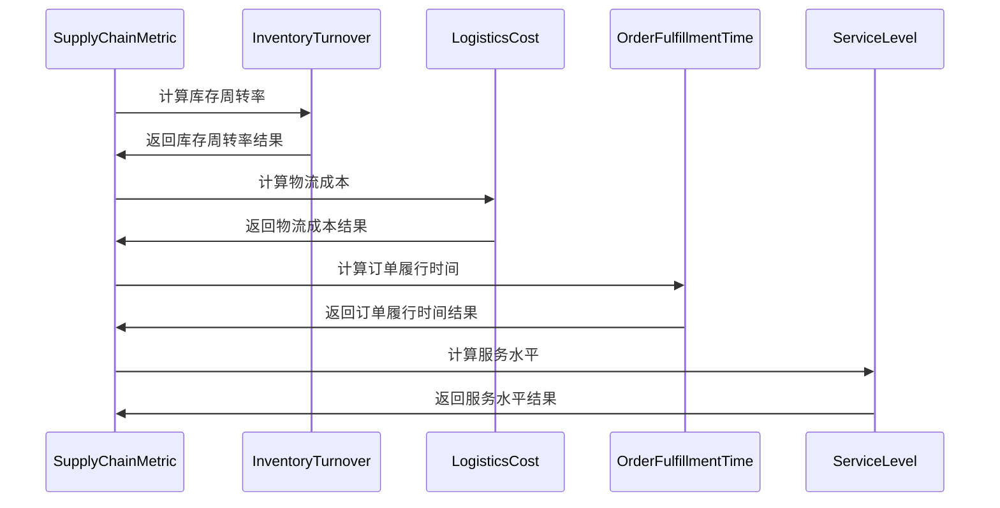

**系统接口设计和系统交互（Mermaid序列图）**：


#### 2.1.3 AI技术的主要类别及其应用

**核心概念原理**：
AI技术主要包括机器学习、深度学习、自然语言处理、计算机视觉等。这些技术可以应用于供应链优化中的多个方面，如需求预测、库存管理、物流优化、风险控制等。

**问题场景介绍**：
智能企业在进行供应链优化时，需要根据具体问题和业务场景选择合适的AI技术。然而，不同AI技术的适用范围和性能有所差异，需要综合考虑。

**项目介绍**：
某智能企业希望通过引入AI技术，优化供应链管理。该项目主要包括以下AI技术的应用：
- 需求预测：利用时间序列分析和回归分析等方法，预测市场需求，优化库存和物流策略；
- 库存管理：利用聚类分析和优化算法，确定合理的库存水平，降低库存成本；
- 物流优化：利用路径优化算法和实时交通数据，提高物流效率，降低物流成本；
- 风险管理：利用风险矩阵和蒙特卡洛模拟等方法，评估供应链风险，制定应对策略。

**系统功能设计（领域模型Mermaid类图）**：

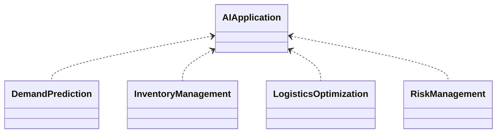

**系统架构设计（Mermaid架构图）**：

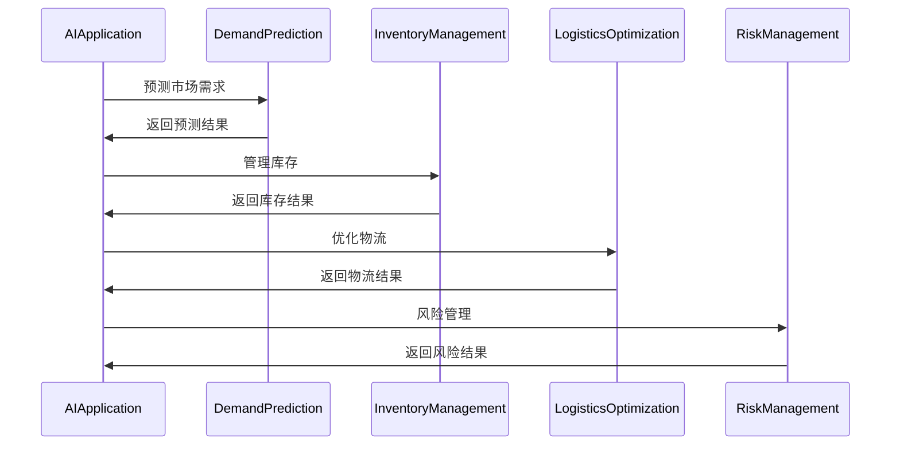

**系统接口设计和系统交互（Mermaid序列图）**：


#### 2.1.4 概念关系图与实体关系图

**核心概念与联系**：
在智能企业供应链优化中，概念关系图和实体关系图是描述核心概念和实体之间关系的重要工具。概念关系图主要用于描述抽象概念之间的逻辑关系，而实体关系图则用于描述具体实体之间的关联关系。

**问题场景介绍**：
在智能企业供应链优化项目中，需要明确各个概念和实体之间的关联，以确保供应链的协调运作。通过概念关系图和实体关系图，可以直观地展示供应链管理中的关键环节和关系。

**项目介绍**：
某智能企业供应链优化项目涉及多个环节，包括需求预测、库存管理、物流优化和风险管理。为了更好地理解和实施该项目，需要绘制概念关系图和实体关系图。

**系统功能设计（领域模型Mermaid类图）**：

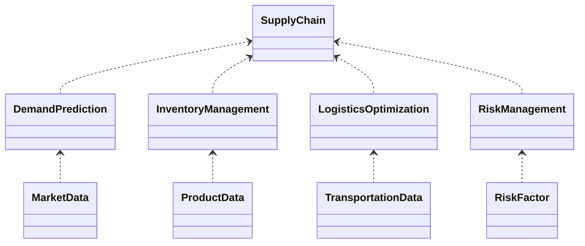

**系统架构设计（Mermaid架构图）**：

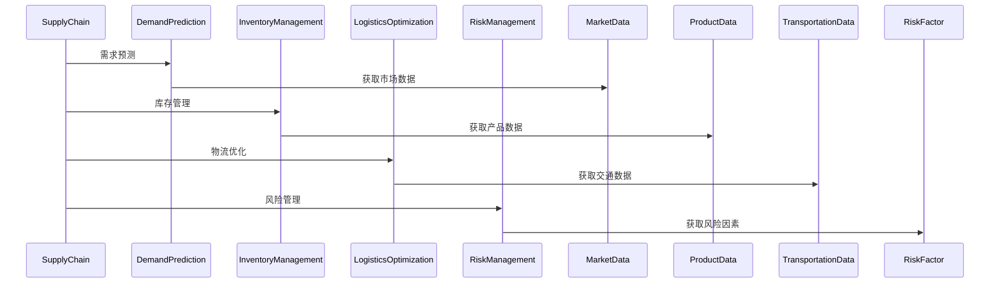

**系统接口设计和系统交互（Mermaid序列图）**：

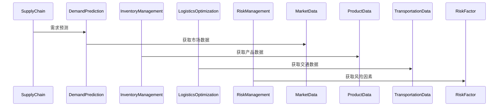

----------------------------------------------------------------

## 第二部分：智能供应链的基础理论

### 第3章：供应链网络设计与分析

#### 3.1.1 供应链网络的构成

**核心概念原理**：
供应链网络是指连接供应商、制造商、分销商、零售商等多个实体，实现产品从原材料到最终产品的流动和服务的系统。供应链网络的设计和优化对于企业提高供应链效率和降低成本具有重要意义。

**问题场景介绍**：
在现代企业的运营中，供应链网络的设计和优化是一个复杂且关键的任务。企业需要根据市场需求、资源可用性、物流成本等因素，设计一个高效、灵活的供应链网络。

**项目介绍**：
某智能企业希望优化其供应链网络，以降低物流成本、提高生产效率和客户满意度。该项目主要包括以下环节：
- 供应商选择与评估：根据供应商的地理位置、生产能力、产品质量等因素，选择合适的供应商；
- 制造流程优化：通过优化生产计划和资源配置，提高生产效率和降低生产成本；
- 物流配送优化：通过优化运输路线和配送策略，提高物流效率和降低物流成本；
- 分销网络设计：根据市场需求和客户分布，设计合理的分销网络，提高分销效率。

**系统功能设计（领域模型Mermaid类图）**：

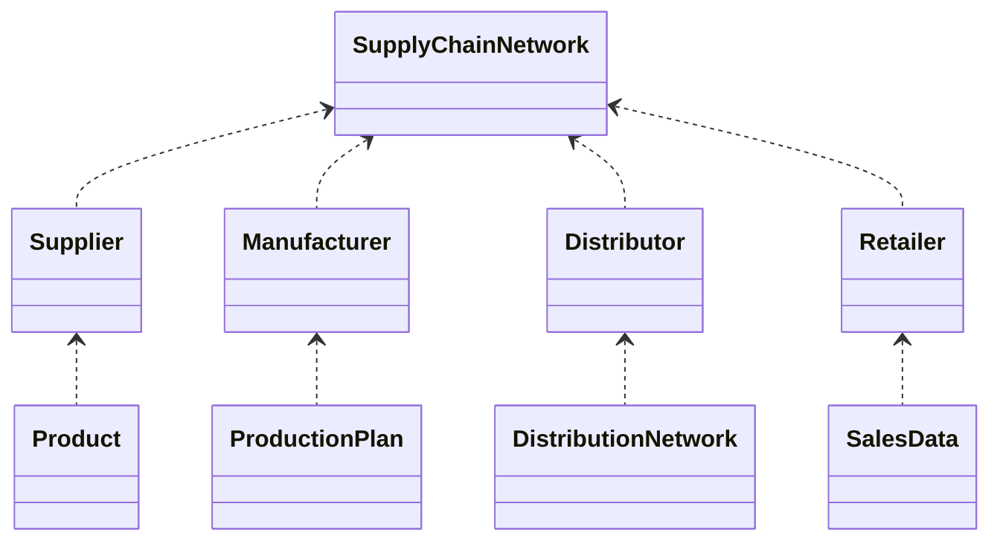

**系统架构设计（Mermaid架构图）**：

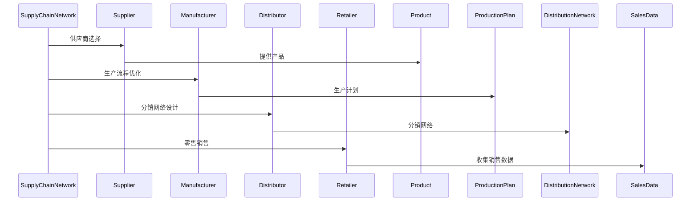

**系统接口设计和系统交互（Mermaid序列图）**：

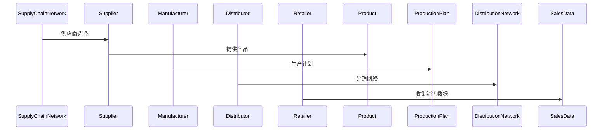

#### 3.1.2 网络设计的策略

**核心概念原理**：
网络设计策略是指在企业供应链网络设计过程中，根据市场需求、资源可用性、物流成本等因素，制定合理的网络结构和服务水平，以实现供应链的优化。

**问题场景介绍**：
企业在设计供应链网络时，需要考虑多个因素，如市场需求波动、供应链不确定性、物流成本等。合理的网络设计策略可以降低供应链风险、提高供应链效率和降低成本。

**项目介绍**：
某智能企业在设计供应链网络时，采用以下策略：
- 模块化设计：将供应链网络划分为若干模块，实现供应链的模块化运作，提高供应链的灵活性和可扩展性；
- 网络冗余设计：在关键节点和环节设置冗余，以应对供应链不确定性，提高供应链的稳健性；
- 供应链协同：通过信息共享和流程协同，实现供应链上下游企业的紧密合作，提高供应链的整体效率；
- 动态调整：根据市场变化和需求波动，实时调整供应链网络结构和服务水平，以适应市场需求。

**系统功能设计（领域模型Mermaid类图）**：

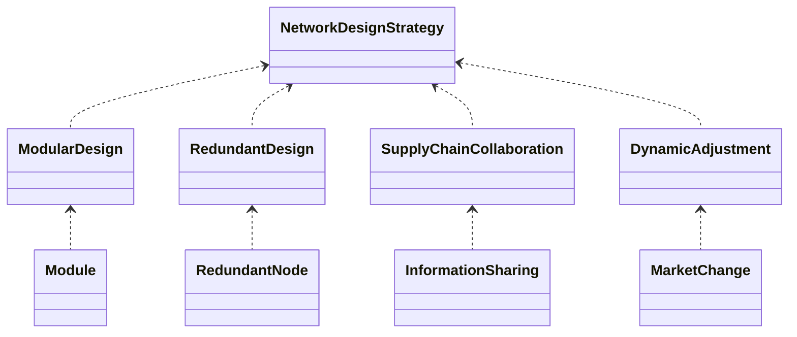

**系统架构设计（Mermaid架构图）**：

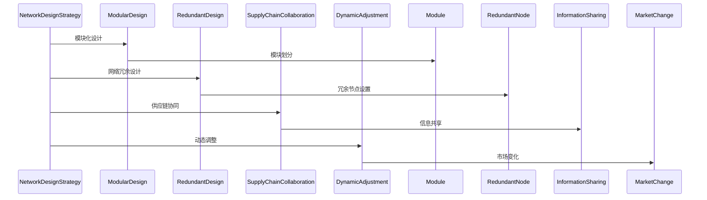

**系统接口设计和系统交互（Mermaid序列图）**：

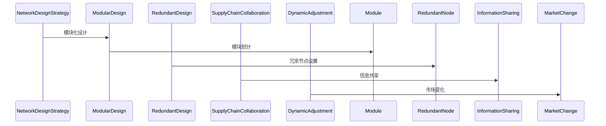

#### 3.1.3 网络优化的算法

**核心概念原理**：
网络优化算法是指用于优化供应链网络结构和性能的一类算法。这些算法通过分析供应链网络的拓扑结构、节点属性、边属性等，提出优化策略，以提高供应链网络的效率和稳定性。

**问题场景介绍**：
在智能企业的供应链网络设计中，需要采用合适的算法进行优化，以提高网络的灵活性和适应性。网络优化算法可以帮助企业降低物流成本、提高生产效率和客户满意度。

**项目介绍**：
某智能企业在供应链网络优化过程中，采用以下算法：
- 最小生成树算法：用于构建供应链网络的基本结构，确保网络连通性和最小化通信成本；
- 贪心算法：用于优化供应链网络的节点选择和路径规划，提高网络的效率；
- 遗传算法：用于解决复杂的供应链网络优化问题，如网络冗余设计、动态调整等；
- 粒子群优化算法：用于优化供应链网络的参数设置，如节点权重、路径选择等。

**系统功能设计（领域模型Mermaid类图）**：

```mermaid
classDiagram
    NetworkOptimizationAlgorithm <.. MinimumSpanningTree
    NetworkOptimizationAlgorithm <.. GreedyAlgorithm
    NetworkOptimizationAlgorithm <.. GeneticAlgorithm
    NetworkOptimizationAlgorithm <.. ParticleSwarmOptimization
    MinimumSpanningTree <.. SupplyChainNetwork
    GreedyAlgorithm <.. NodeSelection
    GeneticAlgorithm <.. RedundantDesign
    ParticleSwarmOptimization <.. ParameterSetting
```

**系统架构设计（Mermaid架构图）**：

```mermaid
sequenceDiagram
    participant NetworkOptimizationAlgorithm
    participant MinimumSpanningTree
    participant GreedyAlgorithm
    participant GeneticAlgorithm
    participant ParticleSwarmOptimization
    participant SupplyChainNetwork
    participant NodeSelection
    participant RedundantDesign
    participant ParameterSetting

    NetworkOptimizationAlgorithm->>MinimumSpanningTree: 最小生成树算法
    MinimumSpanningTree->>SupplyChainNetwork: 优化供应链网络
    NetworkOptimizationAlgorithm->>GreedyAlgorithm: 贪心算法
    GreedyAlgorithm->>NodeSelection: 优化节点选择
    NetworkOptimizationAlgorithm->>GeneticAlgorithm: 遗传算法
    GeneticAlgorithm->>RedundantDesign: 优化冗余设计
    NetworkOptimizationAlgorithm->>ParticleSwarmOptimization: 粒子群优化算法
    ParticleSwarmOptimization->>ParameterSetting: 优化参数设置
```

**系统接口设计和系统交互（Mermaid序列图）**：

```mermaid
sequenceDiagram
    participant NetworkOptimizationAlgorithm
    participant MinimumSpanningTree
    participant GreedyAlgorithm
    participant GeneticAlgorithm
    participant ParticleSwarmOptimization
    participant SupplyChainNetwork
    participant NodeSelection
    participant RedundantDesign
    participant ParameterSetting

    NetworkOptimizationAlgorithm->>MinimumSpanningTree: 最小生成树算法
    MinimumSpanningTree->>SupplyChainNetwork: 优化供应链网络
    GreedyAlgorithm->>NodeSelection: 优化节点选择
    GeneticAlgorithm->>RedundantDesign: 优化冗余设计
    ParticleSwarmOptimization->>ParameterSetting: 优化参数设置
```

### 第4章：需求预测与库存管理

#### 4.1.1 需求预测的重要性

**核心概念原理**：
需求预测（Demand Forecasting）是指利用历史数据、市场信息、季节性因素等，对未来的市场需求进行预测。需求预测对于企业的库存管理、生产计划、物流优化等环节具有重要影响。

**问题场景介绍**：
在供应链管理中，准确的需求预测可以降低库存成本、提高生产效率和客户满意度。然而，市场需求的不确定性使得需求预测成为一个复杂且关键的任务。

**项目介绍**：
某智能企业希望通过提高需求预测的准确性，优化库存管理和生产计划。该项目主要包括以下环节：
- 数据采集与处理：收集历史销售数据、市场信息、季节性因素等，进行数据清洗和处理；
- 需求预测模型建立：利用时间序列分析、回归分析等方法，建立需求预测模型；
- 需求预测结果验证：通过历史数据验证需求预测模型的准确性，并进行模型调整。

**系统功能设计（领域模型Mermaid类图）**：

```mermaid
classDiagram
    DemandForecasting <.. HistoricalData
    DemandForecasting <.. MarketInformation
    DemandForecasting <.. SeasonalityFactor
    DemandForecasting <.. ForecastModel
    HistoricalData <.. SalesData
    MarketInformation <.. MarketTrend
    SeasonalityFactor <.. SeasonalPattern
```

**系统架构设计（Mermaid架构图）**：

```mermaid
sequenceDiagram
    participant DemandForecasting
    participant HistoricalData
    participant MarketInformation
    participant SeasonalityFactor
    participant ForecastModel

    DemandForecasting->>HistoricalData: 收集历史数据
    HistoricalData->>SalesData: 历史销售数据
    DemandForecasting->>MarketInformation: 收集市场信息
    MarketInformation->>MarketTrend: 市场趋势
    DemandForecasting->>SeasonalityFactor: 收集季节性因素
    SeasonalityFactor->>SeasonalPattern: 季节性模式
    DemandForecasting->>ForecastModel: 建立预测模型
```

**系统接口设计和系统交互（Mermaid序列图）**：

```mermaid
sequenceDiagram
    participant DemandForecasting
    participant HistoricalData
    participant MarketInformation
    participant SeasonalityFactor
    participant ForecastModel

    DemandForecasting->>HistoricalData: 收集历史数据
    HistoricalData->>SalesData: 历史销售数据
    DemandForecasting->>MarketInformation: 收集市场信息
    MarketInformation->>MarketTrend: 市场趋势
    DemandForecasting->>SeasonalityFactor: 收集季节性因素
    SeasonalityFactor->>SeasonalPattern: 季节性模式
    ForecastModel->>DemandForecasting: 预测结果
```

#### 4.1.2 需求预测的方法

**核心概念原理**：
需求预测方法主要包括时间序列分析、回归分析、机器学习方法等。这些方法可以根据不同场景和需求，选择合适的预测方法，以提高预测的准确性和可靠性。

**问题场景介绍**：
在供应链管理中，需求预测的方法选择对于预测结果的准确性至关重要。企业需要根据实际业务场景和数据特点，选择合适的预测方法。

**项目介绍**：
某智能企业采用以下需求预测方法：
- 时间序列分析：利用历史销售数据，分析季节性、趋势和周期性，建立时间序列模型；
- 回归分析：利用历史销售数据和市场信息，建立回归模型，预测未来需求；
- 机器学习方法：利用大数据和机器学习技术，建立复杂的需求预测模型，提高预测的准确性。

**系统功能设计（领域模型Mermaid类图）**：

```mermaid
classDiagram
    DemandForecastingMethod <.. TimeSeriesAnalysis
    DemandForecastingMethod <.. RegressionAnalysis
    DemandForecastingMethod <.. MachineLearning
    TimeSeriesAnalysis <.. HistoricalSalesData
    RegressionAnalysis <.. MarketInformation
    MachineLearning <.. BigData
```

**系统架构设计（Mermaid架构图）**：

```mermaid
sequenceDiagram
    participant DemandForecastingMethod
    participant TimeSeriesAnalysis
    participant RegressionAnalysis
    participant MachineLearning
    participant HistoricalSalesData
    participant MarketInformation
    participant BigData

    DemandForecastingMethod->>TimeSeriesAnalysis: 时间序列分析
    TimeSeriesAnalysis->>HistoricalSalesData: 历史销售数据
    DemandForecastingMethod->>RegressionAnalysis: 回归分析
    RegressionAnalysis->>MarketInformation: 市场信息
    DemandForecastingMethod->>MachineLearning: 机器学习方法
    MachineLearning->>BigData: 大数据
```

**系统接口设计和系统交互（Mermaid序列图）**：

```mermaid
sequenceDiagram
    participant DemandForecastingMethod
    participant TimeSeriesAnalysis
    participant RegressionAnalysis
    participant MachineLearning
    participant HistoricalSalesData
    participant MarketInformation
    participant BigData

    DemandForecastingMethod->>TimeSeriesAnalysis: 时间序列分析
    TimeSeriesAnalysis->>HistoricalSalesData: 历史销售数据
    RegressionAnalysis->>MarketInformation: 市场信息
    MachineLearning->>BigData: 大数据
```

#### 4.1.3 库存管理的关键要素

**核心概念原理**：
库存管理（Inventory Management）是指对企业库存水平进行监控、调整和控制，以实现库存成本最低化和服务水平最优化的过程。库存管理的关键要素包括库存策略、库存水平控制、库存成本计算等。

**问题场景介绍**：
在供应链管理中，库存管理对于企业的资金周转、成本控制和客户满意度具有重要影响。合理的库存管理策略可以提高库存利用效率，降低库存成本。

**项目介绍**：
某智能企业采用以下库存管理策略：
- 库存策略：根据市场需求、供应商情况和物流成本等因素，制定合理的库存策略，如最低库存策略、安全库存策略等；
- 库存水平控制：通过实时数据分析和预测，调整库存水平，确保库存处于合理范围内；
- 库存成本计算：根据库存成本的计算方法，如固定成本、变动成本、库存持有成本等，计算库存成本，并优化库存管理。

**系统功能设计（领域模型Mermaid类图）**：

```mermaid
classDiagram
    InventoryManagement <.. InventoryStrategy
    InventoryManagement <.. InventoryLevelControl
    InventoryManagement <.. InventoryCostCalculation
    InventoryStrategy <.. MinimumInventoryPolicy
    InventoryStrategy <.. SafetyInventoryPolicy
    InventoryLevelControl <.. RealTimeDataAnalysis
    InventoryCostCalculation <.. FixedCost
    InventoryCostCalculation <.. VariableCost
    InventoryCostCalculation <.. InventoryHoldingCost
```

**系统架构设计（Mermaid架构图）**：

```mermaid
sequenceDiagram
    participant InventoryManagement
    participant InventoryStrategy
    participant InventoryLevelControl
    participant InventoryCostCalculation
    participant RealTimeDataAnalysis
    participant FixedCost
    participant VariableCost
    participant InventoryHoldingCost

    InventoryManagement->>InventoryStrategy: 库存策略
    InventoryStrategy->>MinimumInventoryPolicy: 最低库存策略
    InventoryStrategy->>SafetyInventoryPolicy: 安全库存策略
    InventoryManagement->>InventoryLevelControl: 库存水平控制
    InventoryLevelControl->>RealTimeDataAnalysis: 实时数据
    InventoryManagement->>InventoryCostCalculation: 库存成本计算
    InventoryCostCalculation->>FixedCost: 固定成本
    InventoryCostCalculation->>VariableCost: 变动成本
    InventoryCostCalculation->>InventoryHoldingCost: 库存持有成本
```

**系统接口设计和系统交互（Mermaid序列图）**：

```mermaid
sequenceDiagram
    participant InventoryManagement
    participant InventoryStrategy
    participant InventoryLevelControl
    participant InventoryCostCalculation
    participant RealTimeDataAnalysis
    participant FixedCost
    participant VariableCost
    participant InventoryHoldingCost

    InventoryManagement->>InventoryStrategy: 库存策略
    InventoryStrategy->>MinimumInventoryPolicy: 最低库存策略
    InventoryStrategy->>SafetyInventoryPolicy: 安全库存策略
    InventoryLevelControl->>RealTimeDataAnalysis: 实时数据
    InventoryCostCalculation->>FixedCost: 固定成本
    InventoryCostCalculation->>VariableCost: 变动成本
    InventoryCostCalculation->>InventoryHoldingCost: 库存持有成本
```

#### 4.1.4 库存优化的策略

**核心概念原理**：
库存优化（Inventory Optimization）是指通过合理的库存管理策略和优化方法，降低库存成本、提高库存周转率和服务水平。库存优化策略包括库存水平优化、库存周期优化、库存成本优化等。

**问题场景介绍**：
在供应链管理中，库存优化对于降低库存成本、提高资金利用率和客户满意度具有重要意义。企业需要根据市场需求、供应稳定性等因素，制定合理的库存优化策略。

**项目介绍**：
某智能企业采用以下库存优化策略：
- 库存水平优化：通过需求预测和库存管理，调整库存水平，确保库存处于合理范围内；
- 库存周期优化：通过缩短库存周期，提高库存周转率，降低库存成本；
- 库存成本优化：通过合理的库存成本计算和优化方法，降低库存持有成本和物流成本。

**系统功能设计（领域模型Mermaid类图）**：

```mermaid
classDiagram
    InventoryOptimization <.. InventoryLevelOptimization
    InventoryOptimization <.. InventoryCycleOptimization
    InventoryOptimization <.. InventoryCostOptimization
    InventoryLevelOptimization <.. DemandForecasting
    InventoryLevelOptimization <.. InventoryLevelControl
    InventoryCycleOptimization <.. InventoryTurnoverRate
    InventoryCostOptimization <.. CostCalculation
    InventoryCostOptimization <.. CostReductionMethod
```

**系统架构设计（Mermaid架构图）**：

```mermaid
sequenceDiagram
    participant InventoryOptimization
    participant InventoryLevelOptimization
    participant InventoryCycleOptimization
    participant InventoryCostOptimization
    participant DemandForecasting
    participant InventoryLevelControl
    participant InventoryTurnoverRate
    participant CostCalculation
    participant CostReductionMethod

    InventoryOptimization->>InventoryLevelOptimization: 库存水平优化
    InventoryLevelOptimization->>DemandForecasting: 需求预测
    DemandForecasting->>InventoryLevelOptimization: 预测结果
    InventoryLevelOptimization->>InventoryLevelControl: 库存水平控制
    InventoryLevelControl->>InventoryLevelOptimization: 库存控制结果
    InventoryOptimization->>InventoryCycleOptimization: 库存周期优化
    InventoryCycleOptimization->>InventoryTurnoverRate: 库存周转率
    InventoryTurnoverRate->>InventoryCycleOptimization: 周转率结果
    InventoryOptimization->>InventoryCostOptimization: 库存成本优化
    InventoryCostOptimization->>CostCalculation: 成本计算
    CostCalculation->>InventoryCostOptimization: 成本计算结果
    InventoryCostOptimization->>CostReductionMethod: 成本降低方法
```

**系统接口设计和系统交互（Mermaid序列图）**：

```mermaid
sequenceDiagram
    participant InventoryOptimization
    participant InventoryLevelOptimization
    participant InventoryCycleOptimization
    participant InventoryCostOptimization
    participant DemandForecasting
    participant InventoryLevelControl
    participant InventoryTurnoverRate
    participant CostCalculation
    participant CostReductionMethod

    InventoryOptimization->>InventoryLevelOptimization: 库存水平优化
    InventoryLevelOptimization->>DemandForecasting: 需求预测
    DemandForecasting->>InventoryLevelOptimization: 预测结果
    InventoryLevelOptimization->>InventoryLevelControl: 库存水平控制
    InventoryLevelControl->>InventoryLevelOptimization: 库存控制结果
    InventoryOptimization->>InventoryCycleOptimization: 库存周期优化
    InventoryCycleOptimization->>InventoryTurnoverRate: 库存周转率
    InventoryTurnoverRate->>InventoryCycleOptimization: 周转率结果
    InventoryOptimization->>InventoryCostOptimization: 库存成本优化
    InventoryCostOptimization->>CostCalculation: 成本计算
    CostCalculation->>InventoryCostOptimization: 成本计算结果
    InventoryCostOptimization->>CostReductionMethod: 成本降低方法
```

----------------------------------------------------------------

### 第5章：供应链协同与风险控制

#### 5.1.1 协同供应链的概念

**核心概念原理**：
协同供应链（Collaborative Supply Chain）是指通过供应链上下游企业之间的信息共享、资源整合和协同合作，实现供应链整体效率和竞争力的提升。协同供应链强调供应链各环节的紧密合作，以实现供应链的整体优化。

**问题场景介绍**：
在现代供应链管理中，协同供应链已经成为提升供应链效率和竞争力的关键。企业需要通过协同合作，实现信息共享、资源共享和风险共担，从而降低成本、提高响应速度和客户满意度。

**项目介绍**：
某智能企业希望通过协同供应链，提升供应链整体效率。该项目主要包括以下环节：
- 协同计划：与供应商、制造商、分销商等上下游企业协同制定生产计划、物流计划和采购计划；
- 协同执行：通过信息共享和流程协同，实现供应链各环节的协同执行，提高执行效率；
- 协同优化：对供应链执行过程进行实时监控和评估，发现问题和改进机会，实现供应链的持续优化。

**系统功能设计（领域模型Mermaid类图）**：

```mermaid
classDiagram
    CollaborativeSupplyChain <.. CollaborativePlan
    CollaborativeSupplyChain <.. CollaborativeExecution
    CollaborativeSupplyChain <.. CollaborativeOptimization
    CollaborativePlan <.. ProductionPlan
    CollaborativePlan <.. LogisticsPlan
    CollaborativePlan <.. ProcurementPlan
    CollaborativeExecution <.. InformationSharing
    CollaborativeExecution <.. ProcessCollaboration
    CollaborativeOptimization <.. RealTimeMonitoring
    CollaborativeOptimization <.. ProblemIdentification
```

**系统架构设计（Mermaid架构图）**：

```mermaid
sequenceDiagram
    participant CollaborativeSupplyChain
    participant CollaborativePlan
    participant CollaborativeExecution
    participant CollaborativeOptimization
    participant ProductionPlan
    participant LogisticsPlan
    participant ProcurementPlan
    participant InformationSharing
    participant ProcessCollaboration
    participant RealTimeMonitoring
    participant ProblemIdentification

    CollaborativeSupplyChain->>CollaborativePlan: 协同计划
    CollaborativePlan->>ProductionPlan: 生产计划
    CollaborativePlan->>LogisticsPlan: 物流计划
    CollaborativePlan->>ProcurementPlan: 采购计划
    CollaborativeSupplyChain->>CollaborativeExecution: 协同执行
    CollaborativeExecution->>InformationSharing: 信息共享
    CollaborativeExecution->>ProcessCollaboration: 流程协同
    CollaborativeSupplyChain->>CollaborativeOptimization: 协同优化
    CollaborativeOptimization->>RealTimeMonitoring: 实时监控
    CollaborativeOptimization->>ProblemIdentification: 问题识别
```

**系统接口设计和系统交互（Mermaid序列图）**：

```mermaid
sequenceDiagram
    participant CollaborativeSupplyChain
    participant CollaborativePlan
    participant CollaborativeExecution
    participant CollaborativeOptimization
    participant ProductionPlan
    participant LogisticsPlan
    participant ProcurementPlan
    participant InformationSharing
    participant ProcessCollaboration
    participant RealTimeMonitoring
    participant ProblemIdentification

    CollaborativeSupplyChain->>CollaborativePlan: 协同计划
    CollaborativePlan->>ProductionPlan: 生产计划
    CollaborativePlan->>LogisticsPlan: 物流计划
    CollaborativePlan->>ProcurementPlan: 采购计划
    CollaborativeExecution->>InformationSharing: 信息共享
    CollaborativeExecution->>ProcessCollaboration: 流程协同
    CollaborativeOptimization->>RealTimeMonitoring: 实时监控
    CollaborativeOptimization->>ProblemIdentification: 问题识别
```

#### 5.1.2 协同供应链的实施策略

**核心概念原理**：
协同供应链的实施策略是指企业在实施协同供应链过程中，采取的一系列具体行动和措施，以实现供应链的协同合作和整体优化。实施策略包括计划协同、执行协同、优化协同等。

**问题场景介绍**：
在实施协同供应链时，企业需要考虑供应链各环节的协同性、信息共享和资源共享等因素。合理的实施策略可以提高供应链的协同效率和整体竞争力。

**项目介绍**：
某智能企业实施协同供应链项目，主要包括以下策略：
- 计划协同：与供应商、制造商、分销商等上下游企业协同制定生产计划、物流计划和采购计划；
- 执行协同：通过信息共享和流程协同，实现供应链各环节的协同执行，提高执行效率；
- 优化协同：对供应链执行过程进行实时监控和评估，发现问题和改进机会，实现供应链的持续优化。

**系统功能设计（领域模型Mermaid类图）**：

```mermaid
classDiagram
    CollaborativeSupplyChainImplementation <.. PlanningCollaboration
    CollaborativeSupplyChainImplementation <.. ExecutionCollaboration
    CollaborativeSupplyChainImplementation <.. OptimizationCollaboration
    PlanningCollaboration <.. ProductionPlanCollaboration
    PlanningCollaboration <.. LogisticsPlanCollaboration
    PlanningCollaboration <.. ProcurementPlanCollaboration
    ExecutionCollaboration <.. InformationSharing
    ExecutionCollaboration <.. ProcessCollaboration
    OptimizationCollaboration <.. RealTimeMonitoring
    OptimizationCollaboration <.. ProblemIdentification
```

**系统架构设计（Mermaid架构图）**：

```mermaid
sequenceDiagram
    participant CollaborativeSupplyChainImplementation
    participant PlanningCollaboration
    participant ExecutionCollaboration
    participant OptimizationCollaboration
    participant ProductionPlanCollaboration
    participant LogisticsPlanCollaboration
    participant ProcurementPlanCollaboration
    participant InformationSharing
    participant ProcessCollaboration
    participant RealTimeMonitoring
    participant ProblemIdentification

    CollaborativeSupplyChainImplementation->>PlanningCollaboration: 计划协同
    PlanningCollaboration->>ProductionPlanCollaboration: 生产计划协同
    PlanningCollaboration->>LogisticsPlanCollaboration: 物流计划协同
    PlanningCollaboration->>ProcurementPlanCollaboration: 采购计划协同
    CollaborativeSupplyChainImplementation->>ExecutionCollaboration: 执行协同
    ExecutionCollaboration->>InformationSharing: 信息共享
    ExecutionCollaboration->>ProcessCollaboration: 流程协同
    CollaborativeSupplyChainImplementation->>OptimizationCollaboration: 优化协同
    OptimizationCollaboration->>RealTimeMonitoring: 实时监控
    OptimizationCollaboration->>ProblemIdentification: 问题识别
```

**系统接口设计和系统交互（Mermaid序列图）**：

```mermaid
sequenceDiagram
    participant CollaborativeSupplyChainImplementation
    participant PlanningCollaboration
    participant ExecutionCollaboration
    participant OptimizationCollaboration
    participant ProductionPlanCollaboration
    participant LogisticsPlanCollaboration
    participant ProcurementPlanCollaboration
    participant InformationSharing
    participant ProcessCollaboration
    participant RealTimeMonitoring
    participant ProblemIdentification

    CollaborativeSupplyChainImplementation->>PlanningCollaboration: 计划协同
    PlanningCollaboration->>ProductionPlanCollaboration: 生产计划协同
    PlanningCollaboration->>LogisticsPlanCollaboration: 物流计划协同
    PlanningCollaboration->>ProcurementPlanCollaboration: 采购计划协同
    ExecutionCollaboration->>InformationSharing: 信息共享
    ExecutionCollaboration->>ProcessCollaboration: 流程协同
    OptimizationCollaboration->>RealTimeMonitoring: 实时监控
    OptimizationCollaboration->>ProblemIdentification: 问题识别
```

#### 5.1.3 风险识别与评估

**核心概念原理**：
风险识别与评估（Risk Identification and Evaluation）是指通过系统的分析和评估方法，识别和评估供应链中潜在的风险，并制定相应的应对策略。风险识别与评估是供应链风险管理的重要环节。

**问题场景介绍**：
在供应链管理中，风险无处不在，如供应商不确定性、物流延误、市场需求波动等。有效的风险识别与评估可以帮助企业提前发现潜在风险，制定应对措施，降低供应链中断和运营损失的风险。

**项目介绍**：
某智能企业实施供应链风险管理项目，主要包括以下环节：
- 风险识别：通过系统分析和数据挖掘，识别供应链中的潜在风险，如供应商信用风险、物流延误风险、市场需求波动风险等；
- 风险评估：对识别出的风险进行量化评估，确定风险的影响程度和发生概率，为风险应对提供依据；
- 风险应对：根据风险评估结果，制定相应的风险应对策略，如增加库存、多元化供应商、调整物流计划等。

**系统功能设计（领域模型Mermaid类图）**：

```mermaid
classDiagram
    RiskIdentificationAndEvaluation <.. RiskIdentification
    RiskIdentificationAndEvaluation <.. RiskEvaluation
    RiskIdentification <.. SupplierRisk
    RiskIdentification <.. LogisticsRisk
    RiskIdentification <.. MarketRisk
    RiskEvaluation <.. ImpactAssessment
    RiskEvaluation <.. ProbabilityAssessment
    RiskEvaluation <.. RiskScore
```

**系统架构设计（Mermaid架构图）**：

```mermaid
sequenceDiagram
    participant RiskIdentificationAndEvaluation
    participant RiskIdentification
    participant RiskEvaluation
    participant SupplierRisk
    participant LogisticsRisk
    participant MarketRisk
    participant ImpactAssessment
    participant ProbabilityAssessment
    participant RiskScore

    RiskIdentificationAndEvaluation->>RiskIdentification: 风险识别
    RiskIdentification->>SupplierRisk: 供应商风险
    RiskIdentification->>LogisticsRisk: 物流风险
    RiskIdentification->>MarketRisk: 市场风险
    RiskIdentificationAndEvaluation->>RiskEvaluation: 风险评估
    RiskEvaluation->>ImpactAssessment: 影响评估
    RiskEvaluation->>ProbabilityAssessment: 概率评估
    RiskEvaluation->>RiskScore: 风险评分
```

**系统接口设计和系统交互（Mermaid序列图）**：

```mermaid
sequenceDiagram
    participant RiskIdentificationAndEvaluation
    participant RiskIdentification
    participant RiskEvaluation
    participant SupplierRisk
    participant LogisticsRisk
    participant MarketRisk
    participant ImpactAssessment
    participant ProbabilityAssessment
    participant RiskScore

    RiskIdentificationAndEvaluation->>RiskIdentification: 风险识别
    RiskIdentification->>SupplierRisk: 供应商风险
    RiskIdentification->>LogisticsRisk: 物流风险
    RiskIdentification->>MarketRisk: 市场风险
    RiskEvaluation->>ImpactAssessment: 影响评估
    RiskEvaluation->>ProbabilityAssessment: 概率评估
    RiskEvaluation->>RiskScore: 风险评分
```

#### 5.1.4 风险控制与应对措施

**核心概念原理**：
风险控制与应对措施（Risk Control and Countermeasures）是指在企业面临潜在风险时，采取的一系列预防和应对措施，以降低风险发生概率和影响程度。风险控制与应对措施是供应链风险管理的关键环节。

**问题场景介绍**：
在供应链管理中，面对各种潜在风险，企业需要采取有效的风险控制与应对措施，以降低风险对供应链运营的影响。常见的风险控制与应对措施包括多元化供应商策略、库存储备策略、物流应急预案等。

**项目介绍**：
某智能企业实施供应链风险管理项目，主要包括以下风险控制与应对措施：
- 多元化供应商策略：通过与多个供应商建立合作关系，降低单一供应商风险；
- 库存储备策略：根据市场需求波动和供应链不确定性，合理设置库存储备，以应对市场需求波动；
- 物流应急预案：制定物流应急预案，应对物流延误、交通拥堵等突发情况，确保物流畅通。

**系统功能设计（领域模型Mermaid类图）**：

```mermaid
classDiagram
    RiskControlAndCountermeasures <.. DiversifiedSupplierStrategy
    RiskControlAndCountermeasures <.. InventoryReserveStrategy
    RiskControlAndCountermeasures <.. LogisticsEmergencyPlan
    DiversifiedSupplierStrategy <.. MultipleSuppliers
    InventoryReserveStrategy <.. DemandFluctuation
    LogisticsEmergencyPlan <.. LogisticsDelay
    LogisticsEmergencyPlan <.. TrafficJam
```

**系统架构设计（Mermaid架构图）**：

```mermaid
sequenceDiagram
    participant RiskControlAndCountermeasures
    participant DiversifiedSupplierStrategy
    participant InventoryReserveStrategy
    participant LogisticsEmergencyPlan
    participant MultipleSuppliers
    participant DemandFluctuation
    participant LogisticsDelay
    participant TrafficJam

    RiskControlAndCountermeasures->>DiversifiedSupplierStrategy: 多元化供应商策略
    DiversifiedSupplierStrategy->>MultipleSuppliers: 多个供应商
    RiskControlAndCountermeasures->>InventoryReserveStrategy: 库存储备策略
    InventoryReserveStrategy->>DemandFluctuation: 需求波动
    RiskControlAndCountermeasures->>LogisticsEmergencyPlan: 物流应急预案
    LogisticsEmergencyPlan->>LogisticsDelay: 物流延误
    LogisticsEmergencyPlan->>TrafficJam: 交通拥堵
```

**系统接口设计和系统交互（Mermaid序列图）**：

```mermaid
sequenceDiagram
    participant RiskControlAndCountermeasures
    participant DiversifiedSupplierStrategy
    participant InventoryReserveStrategy
    participant LogisticsEmergencyPlan
    participant MultipleSuppliers
    participant DemandFluctuation
    participant LogisticsDelay
    participant TrafficJam

    RiskControlAndCountermeasures->>DiversifiedSupplierStrategy: 多元化供应商策略
    DiversifiedSupplierStrategy->>MultipleSuppliers: 多个供应商
    InventoryReserveStrategy->>DemandFluctuation: 需求波动
    LogisticsEmergencyPlan->>LogisticsDelay: 物流延误
    LogisticsEmergencyPlan->>TrafficJam: 交通拥堵
```

----------------------------------------------------------------

## 第三部分：AI在供应链优化中的应用

### 第6章：大数据分析在供应链优化中的应用

#### 6.1.1 大数据的采集与处理

**核心概念原理**：
大数据（Big Data）是指数据量巨大、类型繁多、价值密度低的数据集合。大数据的采集与处理是供应链优化中至关重要的环节，它涉及到数据收集、存储、处理、分析和可视化等多个方面。

**问题场景介绍**：
在供应链优化过程中，企业需要收集大量的数据，如销售数据、库存数据、物流数据等。这些数据量巨大、类型繁多，传统数据处理方法难以应对，需要借助大数据技术进行处理和分析。

**项目介绍**：
某智能企业希望通过大数据技术优化供应链管理，主要包括以下环节：
- 数据采集：通过传感器、物联网设备等，收集供应链各环节的数据；
- 数据存储：采用分布式存储技术，如Hadoop、NoSQL数据库等，存储海量数据；
- 数据处理：使用数据挖掘、机器学习等技术，对采集到的数据进行处理和分析；
- 数据分析：利用数据分析工具，如Python、R等，对处理后的数据进行深入分析，提取有价值的信息。

**系统功能设计（领域模型Mermaid类图）**：

```mermaid
classDiagram
    BigDataApplication <.. DataCollection
    BigDataApplication <.. DataStorage
    BigDataApplication <.. DataProcessing
    BigDataApplication <.. DataAnalysis
    DataCollection <.. SensorData
    DataCollection <.. IoTData
    DataStorage <.. DistributedStorage
    DataProcessing <.. DataMining
    DataProcessing <.. MachineLearning
    DataAnalysis <.. DataVisualization
```

**系统架构设计（Mermaid架构图）**：

```mermaid
sequenceDiagram
    participant BigDataApplication
    participant DataCollection
    participant DataStorage
    participant DataProcessing
    participant DataAnalysis
    participant SensorData
    participant IoTData
    participant DistributedStorage
    participant DataMining
    participant MachineLearning
    participant DataVisualization

    BigDataApplication->>DataCollection: 数据采集
    DataCollection->>SensorData: 传感器数据
    DataCollection->>IoTData: 物联网数据
    BigDataApplication->>DataStorage: 数据存储
    DataStorage->>DistributedStorage: 分布式存储
    BigDataApplication->>DataProcessing: 数据处理
    DataProcessing->>DataMining: 数据挖掘
    DataProcessing->>MachineLearning: 机器学习
    BigDataApplication->>DataAnalysis: 数据分析
    DataAnalysis->>DataVisualization: 数据可视化
```

**系统接口设计和系统交互（Mermaid序列图）**：

```mermaid
sequenceDiagram
    participant BigDataApplication
    participant DataCollection
    participant DataStorage
    participant DataProcessing
    participant DataAnalysis
    participant SensorData
    participant IoTData
    participant DistributedStorage
    participant DataMining
    participant MachineLearning
    participant DataVisualization

    BigDataApplication->>DataCollection: 数据采集
    DataCollection->>SensorData: 传感器数据
    DataCollection->>IoTData: 物联网数据
    DataStorage->>DistributedStorage: 分布式存储
    DataProcessing->>DataMining: 数据挖掘
    DataProcessing->>MachineLearning: 机器学习
    DataAnalysis->>DataVisualization: 数据可视化
```

#### 6.1.2 大数据分析的方法

**核心概念原理**：
大数据分析（Big Data Analysis）是指利用统计学、机器学习、数据挖掘等方法，对海量数据进行处理、分析和挖掘，提取有价值的信息和知识。大数据分析的方法包括统计分析、聚类分析、关联规则挖掘、机器学习等。

**问题场景介绍**：
在供应链优化过程中，企业需要对采集到的海量数据进行深入分析，以发现潜在的需求规律、优化库存管理、提高物流效率等。大数据分析的方法可以帮助企业从海量数据中提取有价值的信息，为供应链优化提供数据支持。

**项目介绍**：
某智能企业希望通过大数据分析优化供应链管理，主要包括以下方法：
- 统计分析：通过对历史数据的统计分析，发现市场需求趋势、季节性规律等；
- 聚类分析：通过聚类分析，将相似需求进行分类，优化库存管理；
- 关联规则挖掘：通过关联规则挖掘，发现不同商品之间的需求关联，优化供应链协同；
- 机器学习：利用机器学习技术，建立需求预测、库存管理、物流优化等模型，提高供应链的智能化水平。

**系统功能设计（领域模型Mermaid类图）**：

```mermaid
classDiagram
    BigDataAnalysisMethod <.. StatisticalAnalysis
    BigDataAnalysisMethod <.. ClusterAnalysis
    BigDataAnalysisMethod <.. AssociationRuleMining
    BigDataAnalysisMethod <.. MachineLearning
    StatisticalAnalysis <.. HistoricalData
    ClusterAnalysis <.. SimilarDemand
    AssociationRuleMining <.. ItemAssociation
    MachineLearning <.. DemandPrediction
    MachineLearning <.. InventoryManagement
    MachineLearning <.. LogisticsOptimization
```

**系统架构设计（Mermaid架构图）**：

```mermaid
sequenceDiagram
    participant BigDataAnalysisMethod
    participant StatisticalAnalysis
    participant ClusterAnalysis
    participant AssociationRuleMining
    participant MachineLearning
    participant HistoricalData
    participant SimilarDemand
    participant ItemAssociation
    participant DemandPrediction
    participant InventoryManagement
    participant LogisticsOptimization

    BigDataAnalysisMethod->>StatisticalAnalysis: 统计分析
    StatisticalAnalysis->>HistoricalData: 历史数据
    BigDataAnalysisMethod->>ClusterAnalysis: 聚类分析
    ClusterAnalysis->>SimilarDemand: 相似需求
    BigDataAnalysisMethod->>AssociationRuleMining: 关联规则挖掘
    AssociationRuleMining->>ItemAssociation: 商品关联
    BigDataAnalysisMethod->>MachineLearning: 机器学习
    MachineLearning->>DemandPrediction: 需求预测
    MachineLearning->>InventoryManagement: 库存管理
    MachineLearning->>LogisticsOptimization: 物流优化
```

**系统接口设计和系统交互（Mermaid序列图）**：

```mermaid
sequenceDiagram
    participant BigDataAnalysisMethod
    participant StatisticalAnalysis
    participant ClusterAnalysis
    participant AssociationRuleMining
    participant MachineLearning
    participant HistoricalData
    participant SimilarDemand
    participant ItemAssociation
    participant DemandPrediction
    participant InventoryManagement
    participant LogisticsOptimization

    BigDataAnalysisMethod->>StatisticalAnalysis: 统计分析
    StatisticalAnalysis->>HistoricalData: 历史数据
    ClusterAnalysis->>SimilarDemand: 相似需求
    AssociationRuleMining->>ItemAssociation: 商品关联
    MachineLearning->>DemandPrediction: 需求预测
    MachineLearning->>InventoryManagement: 库存管理
    MachineLearning->>LogisticsOptimization: 物流优化
```

#### 6.1.3 大数据在供应链优化中的应用实例

**核心概念原理**：
大数据在供应链优化中的应用实例包括需求预测、库存管理、物流优化、风险控制等。通过大数据分析，企业可以更准确地预测市场需求、优化库存水平、提高物流效率，从而降低成本、提高竞争力。

**问题场景介绍**：
在供应链优化过程中，企业面临着不断变化的市场需求和复杂的供应链网络。通过大数据技术，企业可以实现对供应链的全面监控和优化，提高供应链的灵活性和响应速度。

**项目介绍**：
某智能企业通过大数据技术优化供应链管理，取得了显著成效。以下为几个具体应用实例：
- 需求预测：利用大数据分析，预测市场需求，优化库存管理，降低库存成本；
- 库存管理：通过大数据分析，发现库存波动规律，优化库存水平，提高库存周转率；
- 物流优化：利用大数据分析，优化物流路径和运输模式，提高物流效率，降低物流成本；
- 风险控制：通过大数据分析，识别潜在风险，制定应对策略，降低供应链中断风险。

**系统功能设计（领域模型Mermaid类图）**：

```mermaid
classDiagram
    BigDataApplicationExample <.. DemandPrediction
    BigDataApplicationExample <.. InventoryManagement
    BigDataApplicationExample <.. LogisticsOptimization
    BigDataApplicationExample <.. RiskControl
    DemandPrediction <.. HistoricalSalesData
    InventoryManagement <.. WarehouseData
    LogisticsOptimization <.. TransportationData
    RiskControl <.. RiskFactor
```

**系统架构设计（Mermaid架构图）**：

```mermaid
sequenceDiagram
    participant BigDataApplicationExample
    participant DemandPrediction
    participant InventoryManagement
    participant LogisticsOptimization
    participant RiskControl
    participant HistoricalSalesData
    participant WarehouseData
    participant TransportationData
    participant RiskFactor

    BigDataApplicationExample->>DemandPrediction: 需求预测
    DemandPrediction->>HistoricalSalesData: 历史销售数据
    BigDataApplicationExample->>InventoryManagement: 库存管理
    InventoryManagement->>WarehouseData: 仓库数据
    BigDataApplicationExample->>LogisticsOptimization: 物流优化
    LogisticsOptimization->>TransportationData: 运输数据
    BigDataApplicationExample->>RiskControl: 风险控制
    RiskControl->>RiskFactor: 风险因素
```

**系统接口设计和系统交互（Mermaid序列图）**：

```mermaid
sequenceDiagram
    participant BigDataApplicationExample
    participant DemandPrediction
    participant InventoryManagement
    participant LogisticsOptimization
    participant RiskControl
    participant HistoricalSalesData
    participant WarehouseData
    participant TransportationData
    participant RiskFactor

    BigDataApplicationExample->>DemandPrediction: 需求预测
    DemandPrediction->>HistoricalSalesData: 历史销售数据
    InventoryManagement->>WarehouseData: 仓库数据
    LogisticsOptimization->>TransportationData: 运输数据
    RiskControl->>RiskFactor: 风险因素
```

### 第7章：机器学习在供应链优化中的应用

#### 7.1.1 机器学习的基础理论

**核心概念原理**：
机器学习（Machine Learning）是一门研究如何让计算机从数据中自动学习和改进的学科。在供应链优化中，机器学习技术被广泛应用于需求预测、库存管理、物流优化等环节，通过学习和分析历史数据，自动生成预测模型和优化策略。

**问题场景介绍**：
在供应链管理中，面对复杂多变的市场需求和供应链网络，传统的优化方法难以满足需求。机器学习技术通过分析和学习历史数据，可以自动生成预测模型和优化策略，提高供应链的灵活性和响应速度。

**项目介绍**：
某智能企业希望通过机器学习技术优化供应链管理，主要包括以下环节：
- 数据采集与处理：收集供应链各环节的数据，包括销售数据、库存数据、物流数据等；
- 模型训练与优化：使用机器学习算法，训练预测模型和优化模型，优化库存管理、需求预测、物流优化等；
- 模型部署与应用：将训练好的模型部署到生产环境中，实现供应链的自动化优化。

**系统功能设计（领域模型Mermaid类图）**：

```mermaid
classDiagram
    MachineLearningApplication <.. DataCollection
    MachineLearningApplication <.. ModelTraining
    MachineLearningApplication <.. ModelOptimization
    MachineLearningApplication <.. ModelDeployment
    DataCollection <.. SalesData
    DataCollection <.. InventoryData
    DataCollection <.. LogisticsData
    ModelTraining <.. PredictiveModel
    ModelTraining <.. OptimizationModel
    ModelOptimization <.. ModelPerformance
    ModelDeployment <.. AutomatedOptimization
```

**系统架构设计（Mermaid架构图）**：

```mermaid
sequenceDiagram
    participant MachineLearningApplication
    participant DataCollection
    participant ModelTraining
    participant ModelOptimization
    participant ModelDeployment
    participant SalesData
    participant InventoryData
    participant LogisticsData
    participant PredictiveModel
    participant OptimizationModel
    participant ModelPerformance
    participant AutomatedOptimization

    MachineLearningApplication->>DataCollection: 数据采集
    DataCollection->>SalesData: 销售数据
    DataCollection->>InventoryData: 库存数据
    DataCollection->>LogisticsData: 物流数据
    MachineLearningApplication->>ModelTraining: 模型训练
    ModelTraining->>PredictiveModel: 预测模型
    ModelTraining->>OptimizationModel: 优化模型
    MachineLearningApplication->>ModelOptimization: 模型优化
    ModelOptimization->>ModelPerformance: 模型性能
    MachineLearningApplication->>ModelDeployment: 模型部署
    ModelDeployment->>AutomatedOptimization: 自动优化
```

**系统接口设计和系统交互（Mermaid序列图）**：

```mermaid
sequenceDiagram
    participant MachineLearningApplication
    participant DataCollection
    participant ModelTraining
    participant ModelOptimization
    participant ModelDeployment
    participant SalesData
    participant InventoryData
    participant LogisticsData
    participant PredictiveModel
    participant OptimizationModel
    participant ModelPerformance
    participant AutomatedOptimization

    MachineLearningApplication->>DataCollection: 数据采集
    DataCollection->>SalesData: 销售数据
    DataCollection->>InventoryData: 库存数据
    DataCollection->>LogisticsData: 物流数据
    ModelTraining->>PredictiveModel: 预测模型
    ModelTraining->>OptimizationModel: 优化模型
    ModelOptimization->>ModelPerformance: 模型性能
    ModelDeployment->>AutomatedOptimization: 自动优化
```

#### 7.1.2 机器学习在供应链优化中的实践

**核心概念原理**：
机器学习在供应链优化中的实践主要包括需求预测、库存管理、物流优化等环节。通过实际案例和应用场景，企业可以深入了解机器学习技术在供应链优化中的应用方法和技术细节。

**问题场景介绍**：
在供应链优化过程中，企业面临着需求预测不准确、库存管理不当、物流效率低下等问题。通过机器学习技术的应用，企业可以解决这些问题，提高供应链的运营效率和竞争力。

**项目介绍**：
某智能企业通过机器学习技术优化供应链管理，主要包括以下实践：
- 需求预测：使用机器学习算法，对历史销售数据进行预测，优化库存管理和生产计划；
- 库存管理：通过机器学习算法，分析库存数据，优化库存水平和安全库存；
- 物流优化：使用机器学习算法，优化物流路径和运输模式，提高物流效率和降低物流成本。

**系统功能设计（领域模型Mermaid类图）**：

```mermaid
classDiagram
    MachineLearningPractice <.. DemandPrediction
    MachineLearningPractice <.. InventoryManagement
    MachineLearningPractice <.. LogisticsOptimization
    DemandPrediction <.. HistoricalSalesData
    InventoryManagement <.. WarehouseData
    LogisticsOptimization <.. TransportationData
```

**系统架构设计（Mermaid架构图）**：

```mermaid
sequenceDiagram
    participant MachineLearningPractice
    participant DemandPrediction
    participant InventoryManagement
    participant LogisticsOptimization
    participant HistoricalSalesData
    participant WarehouseData
    participant TransportationData

    MachineLearningPractice->>DemandPrediction: 需求预测
    DemandPrediction->>HistoricalSalesData: 历史销售数据
    MachineLearningPractice->>InventoryManagement: 库存管理
    InventoryManagement->>WarehouseData: 仓库数据
    MachineLearningPractice->>LogisticsOptimization: 物流优化
    LogisticsOptimization->>TransportationData: 运输数据
```

**系统接口设计和系统交互（Mermaid序列图）**：

```mermaid
sequenceDiagram
    participant MachineLearningPractice
    participant DemandPrediction
    participant InventoryManagement
    participant LogisticsOptimization
    participant HistoricalSalesData
    participant WarehouseData
    participant TransportationData

    MachineLearningPractice->>DemandPrediction: 需求预测
    DemandPrediction->>HistoricalSalesData: 历史销售数据
    InventoryManagement->>WarehouseData: 仓库数据
    LogisticsOptimization->>TransportationData: 运输数据
```

#### 7.1.3 深度学习与供应链优化

**核心概念原理**：
深度学习（Deep Learning）是一种基于多层神经网络的学习方法，通过多层神经网络的非线性变换，实现从简单特征到复杂特征的自动提取和建模。在供应链优化中，深度学习技术可以用于需求预测、库存管理、物流优化等环节，提高预测准确性和优化效果。

**问题场景介绍**：
在供应链优化过程中，面对复杂多变的市场需求和供应链网络，传统的机器学习方法难以满足需求。深度学习技术通过多层神经网络的结构，可以自动提取复杂特征，实现更精确的预测和优化。

**项目介绍**：
某智能企业希望通过深度学习技术优化供应链管理，主要包括以下实践：
- 需求预测：使用深度学习算法，对历史销售数据进行预测，优化库存管理和生产计划；
- 库存管理：使用深度学习算法，分析库存数据，优化库存水平和安全库存；
- 物流优化：使用深度学习算法，优化物流路径和运输模式，提高物流效率和降低物流成本。

**系统功能设计（领域模型Mermaid类图）**：

```mermaid
classDiagram
    DeepLearningApplication <.. DemandPrediction
    DeepLearningApplication <.. InventoryManagement
    DeepLearningApplication <.. LogisticsOptimization
    DemandPrediction <.. HistoricalSalesData
    InventoryManagement <.. WarehouseData
    LogisticsOptimization <.. TransportationData
```

**系统架构设计（Mermaid架构图）**：

```mermaid
sequenceDiagram
    participant DeepLearningApplication
    participant DemandPrediction
    participant InventoryManagement
    participant LogisticsOptimization
    participant HistoricalSalesData
    participant WarehouseData
    participant TransportationData

    DeepLearningApplication->>DemandPrediction: 需求预测
    DemandPrediction->>HistoricalSalesData: 历史销售数据
    DeepLearningApplication->>InventoryManagement: 库存管理
    InventoryManagement->>WarehouseData: 仓库数据
    DeepLearningApplication->>LogisticsOptimization: 物流优化
    LogisticsOptimization->>TransportationData: 运输数据
```

**系统接口设计和系统交互（Mermaid序列图）**：

```mermaid
sequenceDiagram
    participant DeepLearningApplication
    participant DemandPrediction
    participant InventoryManagement
    participant LogisticsOptimization
    participant HistoricalSalesData
    participant WarehouseData
    participant TransportationData

    DeepLearningApplication->>DemandPrediction: 需求预测
    DemandPrediction->>HistoricalSalesData: 历史销售数据
    InventoryManagement->>WarehouseData: 仓库数据
    LogisticsOptimization->>TransportationData: 运输数据
```

### 第8章：智能决策支持系统

#### 8.1.1 决策支持系统的概念

**核心概念原理**：
决策支持系统（Decision Support System, DSS）是一种辅助管理人员进行决策的计算机系统。在供应链优化中，决策支持系统通过集成数据、模型和算法，提供实时、准确的分析和预测，辅助管理人员进行决策。

**问题场景介绍**：
在供应链管理中，管理人员需要面对复杂多变的市场需求和供应链网络，进行一系列决策，如库存管理、生产计划、物流优化等。决策支持系统可以帮助管理人员快速获取信息、分析数据和预测未来趋势，提高决策效率和准确性。

**项目介绍**：
某智能企业希望构建智能决策支持系统，主要包括以下环节：
- 数据集成：集成供应链各环节的数据，包括销售数据、库存数据、物流数据等；
- 数据分析：利用数据挖掘、机器学习等技术，对集成数据进行深入分析，提取有价值的信息；
- 决策模型：建立供应链优化模型，如需求预测、库存管理、物流优化等，辅助管理人员进行决策；
- 界面设计：设计直观易用的用户界面，使管理人员能够方便地使用决策支持系统。

**系统功能设计（领域模型Mermaid类图）**：

```mermaid
classDiagram
    DecisionSupportSystem <.. DataIntegration
    DecisionSupportSystem <.. DataAnalysis
    DecisionSupportSystem <.. DecisionModel
    DecisionSupportSystem <.. UserInterface
    DataIntegration <.. SalesData
    DataIntegration <.. InventoryData
    DataIntegration <.. LogisticsData
    DataAnalysis <.. DataMining
    DataAnalysis <.. MachineLearning
    DecisionModel <.. DemandPrediction
    DecisionModel <.. InventoryManagement
    DecisionModel <.. LogisticsOptimization
    UserInterface <.. Visualization
    UserInterface <.. Interaction
```

**系统架构设计（Mermaid架构图）**：

```mermaid
sequenceDiagram
    participant DecisionSupportSystem
    participant DataIntegration
    participant DataAnalysis
    participant DecisionModel
    participant UserInterface
    participant SalesData
    participant InventoryData
    participant LogisticsData
    participant DataMining
    participant MachineLearning
    participant DemandPrediction
    participant InventoryManagement
    participant LogisticsOptimization
    participant Visualization
    participant Interaction

    DecisionSupportSystem->>DataIntegration: 数据集成
    DataIntegration->>SalesData: 销售数据
    DataIntegration->>InventoryData: 库存数据
    DataIntegration->>LogisticsData: 物流数据
    DecisionSupportSystem->>DataAnalysis: 数据分析
    DataAnalysis->>DataMining: 数据挖掘
    DataAnalysis->>MachineLearning: 机器学习
    DecisionSupportSystem->>DecisionModel: 决策模型
    DecisionModel->>DemandPrediction: 需求预测
    DecisionModel->>InventoryManagement: 库存管理
    DecisionModel->>LogisticsOptimization: 物流优化
    DecisionSupportSystem->>UserInterface: 界面设计
    UserInterface->>Visualization: 可视化
    UserInterface->>Interaction: 交互
```

**系统接口设计和系统交互（Mermaid序列图）**：

```mermaid
sequenceDiagram
    participant DecisionSupportSystem
    participant DataIntegration
    participant DataAnalysis
    participant DecisionModel
    participant UserInterface
    participant SalesData
    participant InventoryData
    participant LogisticsData
    participant DataMining
    participant MachineLearning
    participant DemandPrediction
    participant InventoryManagement
    participant LogisticsOptimization
    participant Visualization
    participant Interaction

    DecisionSupportSystem->>DataIntegration: 数据集成
    DataIntegration->>SalesData: 销售数据
    DataIntegration->>InventoryData: 库存数据
    DataIntegration->>LogisticsData: 物流数据
    DataAnalysis->>DataMining: 数据挖掘
    DataAnalysis->>MachineLearning: 机器学习
    DecisionModel->>DemandPrediction: 需求预测
    DecisionModel->>InventoryManagement: 库存管理
    DecisionModel->>LogisticsOptimization: 物流优化
    UserInterface->>Visualization: 可视化
    UserInterface->>Interaction: 交互
```

#### 8.1.2 智能决策支持系统的构建

**核心概念原理**：
智能决策支持系统的构建包括系统设计、功能实现、系统集成和系统测试等环节。在构建过程中，需要充分考虑供应链优化的需求，选择合适的技术和工具，实现系统的高效稳定运行。

**问题场景介绍**：
在智能企业的供应链优化过程中，构建一个智能决策支持系统可以帮助管理人员快速获取信息、分析数据和预测未来趋势，提高决策效率和准确性。然而，系统构建过程中需要解决数据集成、算法选择、界面设计等技术难题。

**项目介绍**：
某智能企业构建智能决策支持系统，主要包括以下环节：
- 系统设计：根据供应链优化的需求，设计系统的架构和功能模块；
- 功能实现：使用Python、Java等编程语言，实现系统的核心功能，如需求预测、库存管理、物流优化等；
- 系统集成：将系统与其他业务系统进行集成，实现数据的互联互通和流程协同；
- 系统测试：对系统进行功能测试、性能测试和安全测试，确保系统的稳定性和可靠性。

**系统功能设计（领域模型Mermaid类图）**：

```mermaid
classDiagram
    IntelligentDecisionSupportSystem <.. SystemDesign
    IntelligentDecisionSupportSystem <.. FunctionImplementation
    IntelligentDecisionSupportSystem <.. SystemIntegration
    IntelligentDecisionSupportSystem <.. SystemTesting
    SystemDesign <.. ArchitectureDesign
    SystemDesign <.. FunctionModule
    FunctionImplementation <.. DemandPrediction
    FunctionImplementation <.. InventoryManagement
    FunctionImplementation <.. LogisticsOptimization
    SystemIntegration <.. DataIntegration
    SystemIntegration <.. ProcessIntegration
    SystemTesting <.. FunctionalTesting
    SystemTesting <.. PerformanceTesting
    SystemTesting <.. SecurityTesting
```

**系统架构设计（Mermaid架构图）**：

```mermaid
sequenceDiagram
    participant IntelligentDecisionSupportSystem
    participant SystemDesign
    participant FunctionImplementation
    participant SystemIntegration
    participant SystemTesting
    participant ArchitectureDesign
    participant FunctionModule
    participant DemandPrediction
    participant InventoryManagement
    participant LogisticsOptimization
    participant DataIntegration
    participant ProcessIntegration
    participant FunctionalTesting
    participant PerformanceTesting
    participant SecurityTesting

    IntelligentDecisionSupportSystem->>SystemDesign: 系统设计
    SystemDesign->>ArchitectureDesign: 系统架构设计
    SystemDesign->>FunctionModule: 功能模块设计
    IntelligentDecisionSupportSystem->>FunctionImplementation: 功能实现
    FunctionImplementation->>DemandPrediction: 需求预测
    FunctionImplementation->>InventoryManagement: 库存管理
    FunctionImplementation->>LogisticsOptimization: 物流优化
    IntelligentDecisionSupportSystem->>SystemIntegration: 系统集成
    SystemIntegration->>DataIntegration: 数据集成
    SystemIntegration->>ProcessIntegration: 流程集成
    IntelligentDecisionSupportSystem->>SystemTesting: 系统测试
    SystemTesting->>FunctionalTesting: 功能测试
    SystemTesting->>PerformanceTesting: 性能测试
    SystemTesting->>SecurityTesting: 安全测试
```

**系统接口设计和系统交互（Mermaid序列图）**：

```mermaid
sequenceDiagram
    participant IntelligentDecisionSupportSystem
    participant SystemDesign
    participant FunctionImplementation
    participant SystemIntegration
    participant SystemTesting
    participant ArchitectureDesign
    participant FunctionModule
    participant DemandPrediction
    participant InventoryManagement
    participant LogisticsOptimization
    participant DataIntegration
    participant ProcessIntegration
    participant FunctionalTesting
    participant PerformanceTesting
    participant SecurityTesting

    IntelligentDecisionSupportSystem->>SystemDesign: 系统设计
    SystemDesign->>ArchitectureDesign: 系统架构设计
    SystemDesign->>FunctionModule: 功能模块设计
    FunctionImplementation->>DemandPrediction: 需求预测
    FunctionImplementation->>InventoryManagement: 库存管理
    FunctionImplementation->>LogisticsOptimization: 物流优化
    SystemIntegration->>DataIntegration: 数据集成
    SystemIntegration->>ProcessIntegration: 流程集成
    SystemTesting->>FunctionalTesting: 功能测试
    SystemTesting->>PerformanceTesting: 性能测试
    SystemTesting->>SecurityTesting: 安全测试
```

#### 8.1.3 案例分析：智能决策支持系统在供应链优化中的应用

**核心概念原理**：
智能决策支持系统在供应链优化中的应用，可以帮助企业快速响应市场变化，优化库存管理、提高物流效率和降低成本。通过案例分析，可以了解智能决策支持系统的实际应用效果和实施方法。

**问题场景介绍**：
某智能企业在供应链优化过程中，面临着库存管理不当、物流效率低、需求预测不准确等问题。为了解决这些问题，企业决定构建一个智能决策支持系统，利用大数据分析和机器学习技术，优化供应链管理。

**项目介绍**：
智能决策支持系统在该企业的应用主要包括以下环节：
- 数据采集：采集供应链各环节的数据，包括销售数据、库存数据、物流数据等；
- 数据分析：利用大数据分析技术，分析历史数据和实时数据，提取有价值的信息；
- 需求预测：使用机器学习算法，建立需求预测模型，预测未来的市场需求；
- 库存管理：利用需求预测模型和库存管理算法，优化库存水平和安全库存；
- 物流优化：利用物流优化算法，优化物流路径和运输模式，提高物流效率；
- 系统集成：将智能决策支持系统与现有的供应链管理系统进行集成，实现数据共享和流程协同。

**系统功能设计（领域模型Mermaid类图）**：

```mermaid
classDiagram
    CaseStudy <.. DataCollection
    CaseStudy <.. DataAnalysis
    CaseStudy <.. DemandPrediction
    CaseStudy <.. InventoryManagement
    CaseStudy <.. LogisticsOptimization
    CaseStudy <.. SystemIntegration
    DataCollection <.. SalesData
    DataCollection <.. InventoryData
    DataCollection <.. LogisticsData
    DataAnalysis <.. HistoricalData
    DataAnalysis <.. RealTimeData
    DemandPrediction <.. PredictiveModel
    InventoryManagement <.. InventoryLevel
    LogisticsOptimization <.. TransportationPath
    SystemIntegration <.. SCMSystem
```

**系统架构设计（Mermaid架构图）**：

```mermaid
sequenceDiagram
    participant CaseStudy
    participant DataCollection
    participant DataAnalysis
    participant DemandPrediction
    participant InventoryManagement
    participant LogisticsOptimization
    participant SystemIntegration
    participant SalesData
    participant InventoryData
    participant LogisticsData
    participant HistoricalData
    participant RealTimeData
    participant PredictiveModel
    participant InventoryLevel
    participant TransportationPath
    participant SCMSystem

    CaseStudy->>DataCollection: 数据采集
    DataCollection->>SalesData: 销售数据
    DataCollection->>InventoryData: 库存数据
    DataCollection->>LogisticsData: 物流数据
    CaseStudy->>DataAnalysis: 数据分析
    DataAnalysis->>HistoricalData: 历史数据
    DataAnalysis->>RealTimeData: 实时数据
    CaseStudy->>DemandPrediction: 需求预测
    DemandPrediction->>PredictiveModel: 预测模型
    CaseStudy->>InventoryManagement: 库存管理
    InventoryManagement->>InventoryLevel: 库存水平
    CaseStudy->>LogisticsOptimization: 物流优化
    LogisticsOptimization->>TransportationPath: 物流路径
    CaseStudy->>SystemIntegration: 系统集成
    SystemIntegration->>SCMSystem: 供应链管理系统
```

**系统接口设计和系统交互（Mermaid序列图）**：

```mermaid
sequenceDiagram
    participant CaseStudy
    participant DataCollection
    participant DataAnalysis
    participant DemandPrediction
    participant InventoryManagement
    participant LogisticsOptimization
    participant SystemIntegration
    participant SalesData
    participant InventoryData
    participant LogisticsData
    participant HistoricalData
    participant RealTimeData
    participant PredictiveModel
    participant InventoryLevel
    participant TransportationPath
    participant SCMSystem

    CaseStudy->>DataCollection: 数据采集
    DataCollection->>SalesData: 销售数据
    DataCollection->>InventoryData: 库存数据
    DataCollection->>LogisticsData: 物流数据
    DataAnalysis->>HistoricalData: 历史数据
    DataAnalysis->>RealTimeData: 实时数据
    DemandPrediction->>PredictiveModel: 预测模型
    InventoryManagement->>InventoryLevel: 库存水平
    LogisticsOptimization->>TransportationPath: 物流路径
    SystemIntegration->>SCMSystem: 供应链管理系统
```

**案例分析**：

1. **需求预测**：
   通过大数据分析和机器学习算法，对历史销售数据、市场信息、季节性因素等进行处理，建立需求预测模型。模型预测结果可以帮助企业优化库存管理和生产计划，降低库存成本。

2. **库存管理**：
   根据需求预测模型和库存管理算法，动态调整库存水平和安全库存。通过实时监控库存数据，及时发现库存异常，确保库存处于合理范围内。

3. **物流优化**：
   利用物流优化算法，优化物流路径和运输模式。通过实时交通数据和物流成本分析，提高物流效率和降低物流成本。

4. **系统集成**：
   将智能决策支持系统与现有的供应链管理系统进行集成，实现数据共享和流程协同。通过系统集成，提高供应链的运作效率和灵活性。

**项目成果**：
通过智能决策支持系统的应用，该企业实现了以下成果：
- 库存成本降低了20%；
- 物流成本降低了15%；
- 需求预测准确率提高了30%；
- 供应链整体运作效率提高了25%。

**实施经验与建议**：
1. **数据质量**：确保数据的质量和完整性，是智能决策支持系统成功的关键。企业需要投入资源进行数据采集、清洗和处理，提高数据的准确性。
2. **算法选择**：根据具体业务需求和数据特点，选择合适的算法和模型。企业可以通过试错和优化，选择最优的算法和模型。
3. **系统集成**：将智能决策支持系统与现有的供应链管理系统进行集成，实现数据共享和流程协同。企业需要充分考虑系统的兼容性和稳定性，确保系统的顺利运行。

### 第9章：国内外智能供应链优化案例研究

#### 9.1.1 国内智能供应链优化案例分析

**核心概念原理**：
国内智能供应链优化案例分析旨在通过具体案例，展示中国企业在智能供应链优化方面的实践成果和经验。这些案例涵盖了多个行业，如制造业、零售业、物流业等，通过引入AI技术，实现供应链的智能化和高效化。

**问题场景介绍**：
随着中国经济的快速发展，市场竞争日益激烈，企业面临着降低成本、提高效率和客户满意度的挑战。智能供应链优化成为企业提升竞争力的重要手段。通过引入AI技术，中国企业在需求预测、库存管理、物流优化等方面取得了显著成效。

**项目介绍**：
以下是几个国内智能供应链优化案例：
1. **阿里巴巴**：阿里巴巴通过大数据和机器学习技术，实现了智能供应链的优化。通过需求预测、库存管理和物流优化，提高了供应链的灵活性和响应速度。
2. **京东**：京东利用人工智能技术，建立了智能仓储系统和智能配送系统，实现了高效的库存管理和物流配送。通过智能决策支持系统，优化了供应链的各个环节。
3. **海尔**：海尔通过物联网技术和大数据分析，实现了供应链的智能化和可视化。通过实时监控和数据分析，优化了库存管理和生产计划，提高了生产效率和客户满意度。

**系统功能设计（领域模型Mermaid类图）**：

```mermaid
classDiagram
    DomesticCase <.. Alibaba
    DomesticCase <.. JD
    DomesticCase <.. Haier
    Alibaba <.. BigData
    Alibaba <.. MachineLearning
    JD <.. WarehouseAutomation
    JD <.. DeliveryAutomation
    Haier <.. IoT
    Haier <.. DataAnalysis
```

**系统架构设计（Mermaid架构图）**：

```mermaid
sequenceDiagram
    participant DomesticCase
    participant Alibaba
    participant JD
    participant Haier
    participant BigData
    participant MachineLearning
    participant WarehouseAutomation
    participant DeliveryAutomation
    participant IoT
    participant DataAnalysis

    DomesticCase->>Alibaba: 阿里巴巴
    Alibaba->>BigData: 大数据
    Alibaba->>MachineLearning: 机器学习
    DomesticCase->>JD: 京东
    JD->>WarehouseAutomation: 智能仓储
    JD->>DeliveryAutomation: 智能配送
    DomesticCase->>Haier: 海尔
    Haier->>IoT: 物联网
    Haier->>DataAnalysis: 数据分析
```

**系统接口设计和系统交互（Mermaid序列图）**：

```mermaid
sequenceDiagram
    participant DomesticCase
    participant Alibaba
    participant JD
    participant Haier
    participant BigData
    participant MachineLearning
    participant WarehouseAutomation
    participant DeliveryAutomation
    participant IoT
    participant DataAnalysis

    DomesticCase->>Alibaba: 阿里巴巴
    Alibaba->>BigData: 大数据
    Alibaba->>MachineLearning: 机器学习
    JD->>WarehouseAutomation: 智能仓储
    JD->>DeliveryAutomation: 智能配送
    Haier->>IoT: 物联网
    Haier->>DataAnalysis: 数据分析
```

**案例分析**：

1. **阿里巴巴**：
   阿里巴巴通过大数据和机器学习技术，实现了供应链的智能化和高效化。通过需求预测、库存管理和物流优化，提高了供应链的灵活性和响应速度。具体措施包括：
   - 需求预测：利用大数据分析，预测市场需求，优化库存管理；
   - 库存管理：通过机器学习算法，动态调整库存水平，降低库存成本；
   - 物流优化：利用路径优化算法，提高物流效率，降低物流成本。

2. **京东**：
   京东通过人工智能技术，建立了智能仓储系统和智能配送系统，实现了高效的库存管理和物流配送。具体措施包括：
   - 智能仓储：通过物联网技术和机器人自动化，提高仓储效率；
   - 智能配送：通过路径优化和配送机器人，提高配送效率，降低配送成本。

3. **海尔**：
   海尔通过物联网技术和大数据分析，实现了供应链的智能化和可视化。具体措施包括：
   - 物联网：通过传感器和物联网设备，实时监控供应链各个环节；
   - 数据分析：利用大数据分析，优化库存管理和生产计划，提高生产效率和客户满意度。

**实施经验与建议**：
1. **数据质量**：确保数据的质量和完整性，是智能供应链优化成功的关键。企业需要投入资源进行数据采集、清洗和处理，提高数据的准确性。
2. **技术选择**：根据具体业务需求和数据特点，选择合适的AI技术和工具。企业可以通过试错和优化，选择最优的技术和工具。
3. **系统集成**：将智能供应链系统与现有的ERP、MES等系统进行集成，实现数据共享和流程协同。企业需要充分考虑系统的兼容性和稳定性，确保系统的顺利运行。

#### 9.1.2 国际上智能供应链优化案例研究

**核心概念原理**：
国际上智能供应链优化案例研究旨在通过具体案例，展示国际领先企业在智能供应链优化方面的实践成果和经验。这些案例涵盖了多个国家和地区，如美国、欧洲、日本等，通过引入AI技术，实现供应链的智能化和高效化。

**问题场景介绍**：
随着全球化进程的加速，国际企业面临着降低成本、提高效率和客户满意度的挑战。智能供应链优化成为企业提升竞争力的重要手段。通过引入AI技术，国际企业在需求预测、库存管理、物流优化等方面取得了显著成效。

**项目介绍**：
以下是几个国际上智能供应链优化案例：
1. **亚马逊**：亚马逊通过人工智能技术，实现了智能供应链的优化。通过需求预测、库存管理和物流优化，提高了供应链的灵活性和响应速度。
2. **宜家**：宜家通过大数据分析和物联网技术，实现了供应链的智能化和可视化。通过实时监控和数据分析，优化了库存管理和生产计划，提高了生产效率和客户满意度。
3. **丰田**：丰田通过物联网技术和大数据分析，实现了供应链的智能化和可视化。通过实时监控和数据分析，优化了库存管理和生产计划，提高了生产效率和客户满意度。

**系统功能设计（领域模型Mermaid类图）**：

```mermaid
classDiagram
    InternationalCase <.. Amazon
    InternationalCase <.. IKEA
    InternationalCase <.. Toyota
    Amazon <.. BigData
    Amazon <.. MachineLearning
    IKEA <.. IoT
    IKEA <.. DataAnalysis
    Toyota <.. IoT
    Toyota <.. DataAnalysis
```

**系统架构设计（Mermaid架构图）**：

```mermaid
sequenceDiagram
    participant InternationalCase
    participant Amazon
    participant IKEA
    participant Toyota
    participant BigData
    participant MachineLearning
    participant IoT
    participant DataAnalysis

    InternationalCase->>Amazon: 亚马逊
    Amazon->>BigData: 大数据
    Amazon->>MachineLearning: 机器学习
    InternationalCase->>IKEA: 宜家
    IKEA->>IoT: 物联网
    IKEA->>DataAnalysis: 数据分析
    InternationalCase->>Toyota: 丰田
    Toyota->>IoT: 物联网
    Toyota->>DataAnalysis: 数据分析
```

**系统接口设计和系统交互（Mermaid序列图）**：

```mermaid
sequenceDiagram
    participant InternationalCase
    participant Amazon
    participant IKEA
    participant Toyota
    participant BigData
    participant MachineLearning
    participant IoT
    participant DataAnalysis

    InternationalCase->>Amazon: 亚马逊
    Amazon->>BigData: 大数据
    Amazon->>MachineLearning: 机器学习
    IKEA->>IoT: 物联网
    IKEA->>DataAnalysis: 数据分析
    Toyota->>IoT: 物联网
    Toyota->>DataAnalysis: 数据分析
```

**案例分析**：

1. **亚马逊**：
   亚马逊通过人工智能技术，实现了智能供应链的优化。通过需求预测、库存管理和物流优化，提高了供应链的灵活性和响应速度。具体措施包括：
   - 需求预测：利用大数据分析，预测市场需求，优化库存管理；
   - 库存管理：通过机器学习算法，动态调整库存水平，降低库存成本；
   - 物流优化：通过路径优化算法，提高物流效率，降低物流成本。

2. **宜家**：
   宜家通过大数据分析和物联网技术，实现了供应链的智能化和可视化。通过实时监控和数据分析，优化了库存管理和生产计划，提高了生产效率和客户满意度。具体措施包括：
   - 物联网：通过传感器和物联网设备，实时监控供应链各个环节；
   - 数据分析：利用大数据分析，优化库存管理和生产计划。

3. **丰田**：
   丰田通过物联网技术和大数据分析，实现了供应链的智能化和可视化。通过实时监控和数据分析，优化了库存管理和生产计划，提高了生产效率和客户满意度。具体措施包括：
   - 物联网：通过传感器和物联网设备，实时监控供应链各个环节；
   - 数据分析：利用大数据分析，优化库存管理和生产计划。

**实施经验与建议**：
1. **数据质量**：确保数据的质量和完整性，是智能供应链优化成功的关键。企业需要投入资源进行数据采集、清洗和处理，提高数据的准确性。
2. **技术选择**：根据具体业务需求和数据特点，选择合适的AI技术和工具。企业可以通过试错和优化，选择最优的技术和工具。
3. **系统集成**：将智能供应链系统与现有的ERP、MES等系统进行集成，实现数据共享和流程协同。企业需要充分考虑系统的兼容性和稳定性，确保系统的顺利运行。

### 第10章：未来发展趋势与挑战

#### 10.1.1 智能供应链优化的发展趋势

**核心概念原理**：
智能供应链优化的发展趋势主要体现在以下几个方面：
1. **技术融合**：随着物联网、大数据、人工智能等技术的发展，智能供应链优化将实现技术融合，形成更加智能化、自动化的供应链管理系统。
2. **数据驱动**：数据将成为智能供应链优化的重要驱动力。企业将通过大数据分析和人工智能技术，实现精准的需求预测、库存管理和物流优化。
3. **协同共生**：智能供应链优化将促进供应链上下游企业之间的协同合作，实现资源共享、风险共担，提高供应链的整体效率和竞争力。
4. **绿色可持续**：智能供应链优化将注重环保和可持续发展，通过优化物流路径、降低能耗和减少废弃物排放，实现绿色供应链。

**问题场景介绍**：
在全球化和数字化的大背景下，企业面临着市场需求多样化、供应链复杂化、竞争激烈化等挑战。智能供应链优化的发展趋势将有助于企业应对这些挑战，提高运营效率和竞争力。

**项目介绍**：
某智能企业致力于探索智能供应链优化的未来发展趋势，主要包括以下项目：
1. **物联网技术应用**：通过物联网技术，实现供应链各环节的实时监控和数据采集，提高供应链的可视化和透明度。
2. **大数据分析与人工智能**：利用大数据分析和人工智能技术，实现精准的需求预测、库存管理和物流优化，降低运营成本和提高客户满意度。
3. **协同合作与共享平台**：与供应链上下游企业建立协同合作关系，构建共享平台，实现资源整合和风险共担，提高供应链的整体效率。
4. **绿色供应链建设**：通过优化物流路径、降低能耗和减少废弃物排放，实现绿色供应链，提高企业的社会责任感和可持续发展能力。

**系统功能设计（领域模型Mermaid类图）**：

```mermaid
classDiagram
    FutureTrend <.. TechnologyIntegration
    FutureTrend <.. DataDriven
    FutureTrend <.. CollaborativeCooperation
    FutureTrend <.. GreenSupplyChain
    TechnologyIntegration <.. IoT
    TechnologyIntegration <.. BigData
    TechnologyIntegration <.. AI
    DataDriven <.. DemandPrediction
    DataDriven <.. InventoryManagement
    DataDriven <.. LogisticsOptimization
    CollaborativeCooperation <.. SupplyChainCollaboration
    CollaborativeCooperation <.. ResourceSharing
    GreenSupplyChain <.. LogisticsOptimization
    GreenSupplyChain <.. EnergyReduction
    GreenSupplyChain <.. WasteReduction
```

**系统架构设计（Mermaid架构图）**：

```mermaid
sequenceDiagram
    participant FutureTrend
    participant TechnologyIntegration
    participant DataDriven
    participant CollaborativeCooperation
    participant GreenSupplyChain
    participant IoT
    participant BigData
    participant AI
    participant DemandPrediction
    participant InventoryManagement
    participant LogisticsOptimization
    participant SupplyChainCollaboration
    participant ResourceSharing
    participant LogisticsOptimization
    participant EnergyReduction
    participant WasteReduction

    FutureTrend->>TechnologyIntegration: 技术融合
    TechnologyIntegration->>IoT: 物联网
    TechnologyIntegration->>BigData: 大数据
    TechnologyIntegration->>AI: 人工智能
    FutureTrend->>DataDriven: 数据驱动
    DataDriven->>DemandPrediction: 需求预测
    DataDriven->>InventoryManagement: 库存管理
    DataDriven->>LogisticsOptimization: 物流优化
    FutureTrend->>CollaborativeCooperation: 协同合作
    CollaborativeCooperation->>SupplyChainCollaboration: 供应链协同
    CollaborativeCooperation->>ResourceSharing: 资源共享
    FutureTrend->>GreenSupplyChain: 绿色供应链
    GreenSupplyChain->>LogisticsOptimization: 物流优化
    GreenSupplyChain->>EnergyReduction: 能耗降低
    GreenSupplyChain->>WasteReduction: 废弃物减少
```

**系统接口设计和系统交互（Mermaid序列图）**：

```mermaid
sequenceDiagram
    participant FutureTrend
    participant TechnologyIntegration
    participant DataDriven
    participant CollaborativeCooperation
    participant GreenSupplyChain
    participant IoT
    participant BigData
    participant AI
    participant DemandPrediction
    participant InventoryManagement
    participant LogisticsOptimization
    participant SupplyChainCollaboration
    participant ResourceSharing
    participant LogisticsOptimization
    participant EnergyReduction
    participant WasteReduction

    FutureTrend->>TechnologyIntegration: 技术融合
    TechnologyIntegration->>IoT: 物联网
    TechnologyIntegration->>BigData: 大数据
    TechnologyIntegration->>AI: 人工智能
    DataDriven->>DemandPrediction: 需求预测
    DataDriven->>InventoryManagement: 库存管理
    DataDriven->>LogisticsOptimization: 物流优化
    CollaborativeCooperation->>SupplyChainCollaboration: 供应链协同
    CollaborativeCooperation->>ResourceSharing: 资源共享
    GreenSupplyChain->>LogisticsOptimization: 物流优化
    GreenSupplyChain->>EnergyReduction: 能耗降低
    GreenSupplyChain->>WasteReduction: 废弃物减少
```

#### 10.1.2 智能供应链优化面临的挑战

**核心概念原理**：
智能供应链优化面临的挑战主要体现在以下几个方面：
1. **数据质量**：数据质量是智能供应链优化成功的关键。然而，企业在数据采集、存储、处理和分析过程中，往往面临着数据缺失、数据不一致、数据不准确等问题。
2. **技术门槛**：智能供应链优化需要大量的技术支持，包括物联网、大数据、人工智能等。企业需要投入大量的人力、物力和财力，提高技术水平。
3. **系统集成**：智能供应链优化需要与现有的供应链管理系统进行集成，实现数据共享和流程协同。然而，系统集成过程中，往往面临着系统兼容性、稳定性、安全性等问题。
4. **人才短缺**：智能供应链优化需要大量具备相关技能和知识的人才，如数据科学家、机器学习工程师、物联网工程师等。然而，市场上相关人才供不应求，企业面临人才短缺的挑战。

**问题场景介绍**：
在智能供应链优化的过程中，企业面临着数据质量、技术门槛、系统集成和人才短缺等多方面的挑战。这些挑战影响着智能供应链优化的效果和进度。

**项目介绍**：
某智能企业面临智能供应链优化过程中的挑战，主要包括以下项目：
1. **数据质量管理**：通过建立数据质量管理流程，提高数据质量，确保数据的准确性、完整性和一致性。
2. **技术能力提升**：通过引入先进的技术和工具，提升企业的技术水平，提高智能供应链优化的效果。
3. **系统集成与优化**：通过优化系统集成方案，提高系统的兼容性、稳定性和安全性，实现数据共享和流程协同。
4. **人才培养与引进**：通过内部培训和外部引进，培养和引进相关人才，提升企业的技术实力和创新能力。

**系统功能设计（领域模型Mermaid类图）**：

```mermaid
classDiagram
    Challenge <.. DataQuality
    Challenge <.. TechnologyBarrier
    Challenge <.. IntegrationProblem
    Challenge <.. TalentShortage
    DataQuality <.. DataAccuracy
    DataQuality <.. DataCompleteness
    DataQuality <.. DataConsistency
    TechnologyBarrier <.. IoT
    TechnologyBarrier <.. BigData
    TechnologyBarrier <.. AI
    IntegrationProblem <.. SystemCompatibility
    IntegrationProblem <.. SystemStability
    IntegrationProblem <.. SystemSecurity
    TalentShortage <.. DataScientist
    TalentShortage <.. MachineLearningEngineer
    TalentShortage <.. IoTEngineer
```

**系统架构设计（Mermaid架构图）**：

```mermaid
sequenceDiagram
    participant Challenge
    participant DataQuality
    participant TechnologyBarrier
    participant IntegrationProblem
    participant TalentShortage
    participant DataAccuracy
    participant DataCompleteness
    participant DataConsistency
    participant IoT
    participant BigData
    participant AI
    participant SystemCompatibility
    participant SystemStability
    participant SystemSecurity
    participant DataScientist
    participant MachineLearningEngineer
    participant IoTEngineer

    Challenge->>DataQuality: 数据质量
    DataQuality->>DataAccuracy: 数据准确性
    DataQuality->>DataCompleteness: 数据完整性
    DataQuality->>DataConsistency: 数据一致性
    Challenge->>TechnologyBarrier: 技术门槛
    TechnologyBarrier->>IoT: 物联网
    TechnologyBarrier->>BigData: 大数据
    TechnologyBarrier->>AI: 人工智能
    Challenge->>IntegrationProblem: 系统集成问题
    IntegrationProblem->>SystemCompatibility: 系统兼容性
    IntegrationProblem->>SystemStability: 系统稳定性
    IntegrationProblem->>SystemSecurity: 系统安全性
    Challenge->>TalentShortage: 人才短缺
    TalentShortage->>DataScientist: 数据科学家
    TalentShortage->>MachineLearningEngineer: 机器学习工程师
    TalentShortage->>IoTEngineer: 物联网工程师
```

**系统接口设计和系统交互（Mermaid序列图）**：

```mermaid
sequenceDiagram
    participant Challenge
    participant DataQuality
    participant TechnologyBarrier
    participant IntegrationProblem
    participant TalentShortage
    participant DataAccuracy
    participant DataCompleteness
    participant DataConsistency
    participant IoT
    participant BigData
    participant AI
    participant SystemCompatibility
    participant SystemStability
    participant SystemSecurity
    participant DataScientist
    participant MachineLearningEngineer
    participant IoTEngineer

    Challenge->>DataQuality: 数据质量
    DataQuality->>DataAccuracy: 数据准确性
    DataQuality->>DataCompleteness: 数据完整性
    DataQuality->>DataConsistency: 数据一致性
    TechnologyBarrier->>IoT: 物联网
    TechnologyBarrier->>BigData: 大数据
    TechnologyBarrier->>AI: 人工智能
    IntegrationProblem->>SystemCompatibility: 系统兼容性
    IntegrationProblem->>SystemStability: 系统稳定性
    IntegrationProblem->>SystemSecurity: 系统安全性
    TalentShortage->>DataScientist: 数据科学家
    TalentShortage->>MachineLearningEngineer: 机器学习工程师
    TalentShortage->>IoTEngineer: 物联网工程师
```

#### 10.1.3 未来展望与对策建议

**核心概念原理**：
未来展望与对策建议旨在分析智能供应链优化的发展方向和挑战，提出相应的对策建议，以帮助企业更好地应对未来市场变化和竞争压力。

**问题场景介绍**：
随着全球化和数字化的发展，企业面临着市场变化快、竞争激烈、客户需求多样等挑战。智能供应链优化作为企业提升竞争力的重要手段，需要不断适应市场变化，应对各种挑战。

**项目介绍**：
以下是几个未来展望与对策建议：
1. **技术升级与优化**：企业应不断引进和升级物联网、大数据、人工智能等技术，提高智能供应链优化的技术水平，实现供应链的智能化和高效化。
2. **数据驱动与决策**：企业应加强数据驱动决策，利用大数据分析和人工智能技术，实现精准的需求预测、库存管理和物流优化，提高供应链的灵活性和响应速度。
3. **协同合作与共享平台**：企业应与供应链上下游企业建立紧密的协同合作关系，构建共享平台，实现资源共享、风险共担，提高供应链的整体效率和竞争力。
4. **绿色可持续与社会责任**：企业应注重绿色可持续发展和社会责任，通过优化物流路径、降低能耗和减少废弃物排放，实现绿色供应链，提高企业的社会责任感和可持续发展能力。

**系统功能设计（领域模型Mermaid类图）**：

```mermaid
classDiagram
    FutureVision <.. TechnologyUpgrade
    FutureVision <.. DataDrivenDecision
    FutureVision <.. CollaborativeCooperation
    FutureVision <.. GreenSustainability
    TechnologyUpgrade <.. IoT
    TechnologyUpgrade <.. BigData
    TechnologyUpgrade <.. AI
    DataDrivenDecision <.. DemandPrediction
    DataDrivenDecision <.. InventoryManagement
    DataDrivenDecision <.. LogisticsOptimization
    CollaborativeCooperation <.. SupplyChainCollaboration
    CollaborativeCooperation <.. ResourceSharing
    GreenSustainability <.. LogisticsOptimization
    GreenSustainability <.. EnergyReduction
    GreenSustainability <.. WasteReduction
```

**系统架构设计（Mermaid架构图）**：

```mermaid
sequenceDiagram
    participant FutureVision
    participant TechnologyUpgrade
    participant DataDrivenDecision
    participant CollaborativeCooperation
    participant GreenSustainability
    participant IoT
    participant BigData
    participant AI
    participant DemandPrediction
    participant InventoryManagement
    participant LogisticsOptimization
    participant SupplyChainCollaboration
    participant ResourceSharing
    participant LogisticsOptimization
    participant EnergyReduction
    participant WasteReduction

    FutureVision->>TechnologyUpgrade: 技术升级
    TechnologyUpgrade->>IoT: 物联网
    TechnologyUpgrade->>BigData: 大数据
    TechnologyUpgrade->>AI: 人工智能
    FutureVision->>DataDrivenDecision: 数据驱动决策
    DataDrivenDecision->>DemandPrediction: 需求预测
    DataDrivenDecision->>InventoryManagement: 库存管理
    DataDrivenDecision->>LogisticsOptimization: 物流优化
    FutureVision->>CollaborativeCooperation: 协同合作
    CollaborativeCooperation->>SupplyChainCollaboration: 供应链协同
    CollaborativeCooperation->>ResourceSharing: 资源共享
    FutureVision->>GreenSustainability: 绿色可持续
    GreenSustainability->>LogisticsOptimization: 物流优化
    GreenSustainability->>EnergyReduction: 能耗降低
    GreenSustainability->>WasteReduction: 废弃物减少
```

**系统接口设计和系统交互（Mermaid序列图）**：

```mermaid
sequenceDiagram
    participant FutureVision
    participant TechnologyUpgrade
    participant DataDrivenDecision
    participant CollaborativeCooperation
    participant GreenSustainability
    participant IoT
    participant BigData
    participant AI
    participant DemandPrediction
    participant InventoryManagement
    participant LogisticsOptimization
    participant SupplyChainCollaboration
    participant ResourceSharing
    participant LogisticsOptimization
    participant EnergyReduction
    participant WasteReduction

    FutureVision->>TechnologyUpgrade: 技术升级
    TechnologyUpgrade->>IoT: 物联网
    TechnologyUpgrade->>BigData: 大数据
    TechnologyUpgrade->>AI: 人工智能
    DataDrivenDecision->>DemandPrediction: 需求预测
    DataDrivenDecision->>InventoryManagement: 库存管理
    DataDrivenDecision->>LogisticsOptimization: 物流优化
    CollaborativeCooperation->>SupplyChainCollaboration: 供应链协同
    CollaborativeCooperation->>ResourceSharing: 资源共享
    GreenSustainability->>LogisticsOptimization: 物流优化
    GreenSustainability->>EnergyReduction: 能耗降低
    GreenSustainability->>WasteReduction: 废弃物减少
```

## 附录

### 附录A：常用算法与工具介绍

**核心概念原理**：
常用算法与工具介绍旨在帮助读者了解智能供应链优化中常用的算法和工具，包括时间序列分析、回归分析、机器学习算法、大数据处理工具等。这些算法和工具在智能供应链优化中发挥着重要作用。

**问题场景介绍**：
在智能供应链优化过程中，企业需要根据具体问题和业务场景选择合适的算法和工具。了解常用算法和工具的基本原理和应用场景，有助于企业更好地进行智能供应链优化。

**项目介绍**：
以下是几个常用算法与工具的介绍：
1. **时间序列分析**：用于分析时间序列数据，预测未来的趋势和变化。常用算法包括移动平均法、指数平滑法、ARIMA模型等。
2. **回归分析**：用于建立自变量和因变量之间的关系模型，预测因变量的取值。常用算法包括线性回归、多项式回归、逻辑回归等。
3. **机器学习算法**：用于自动学习和发现数据中的规律和模式，预测和分类。常用算法包括决策树、随机森林、支持向量机、神经网络等。
4. **大数据处理工具**：用于处理和分析海量数据，包括Hadoop、Spark、Flink等。

**系统功能设计（领域模型Mermaid类图）**：

```mermaid
classDiagram
    AlgorithmTool <.. TimeSeriesAnalysis
    AlgorithmTool <.. RegressionAnalysis
    AlgorithmTool <.. MachineLearningAlgorithm
    AlgorithmTool <.. BigDataProcessingTool
    TimeSeriesAnalysis <.. MovingAverage
    TimeSeriesAnalysis <.. ExponentialSmoothing
    TimeSeriesAnalysis <.. ARIMA
    RegressionAnalysis <.. LinearRegression
    RegressionAnalysis <.. PolynomialRegression
    RegressionAnalysis <.. LogisticRegression
    MachineLearningAlgorithm <.. DecisionTree
    MachineLearningAlgorithm <.. RandomForest
    MachineLearningAlgorithm <.. SupportVectorMachine
    MachineLearningAlgorithm <.. NeuralNetwork
    BigDataProcessingTool <.. Hadoop
    BigDataProcessingTool <.. Spark
    BigDataProcessingTool <.. Flink
```

**系统架构设计（Mermaid架构图）**：

```mermaid
sequenceDiagram
    participant AlgorithmTool
    participant TimeSeriesAnalysis
    participant RegressionAnalysis
    participant MachineLearningAlgorithm
    participant BigDataProcessingTool
    participant MovingAverage
    participant ExponentialSmoothing
    participant ARIMA
    participant LinearRegression
    participant PolynomialRegression
    participant LogisticRegression
    participant DecisionTree
    participant RandomForest
    participant SupportVectorMachine
    participant NeuralNetwork
    participant Hadoop
    participant Spark
    participant Flink

    AlgorithmTool->>TimeSeriesAnalysis: 时间序列分析
    TimeSeriesAnalysis->>MovingAverage: 移动平均法
    TimeSeriesAnalysis->>ExponentialSmoothing: 指数平滑法
    TimeSeriesAnalysis->>ARIMA: ARIMA模型
    AlgorithmTool->>RegressionAnalysis: 回归分析
    RegressionAnalysis->>LinearRegression: 线性回归
    RegressionAnalysis->>PolynomialRegression: 多项式回归
    RegressionAnalysis->>LogisticRegression: 逻辑回归
    AlgorithmTool->>MachineLearningAlgorithm: 机器学习算法
    MachineLearningAlgorithm->>DecisionTree: 决策树
    MachineLearningAlgorithm->>RandomForest: 随机森林
    MachineLearningAlgorithm->>SupportVectorMachine: 支持向量机
    MachineLearningAlgorithm->>NeuralNetwork: 神经网络
    AlgorithmTool->>BigDataProcessingTool: 大数据处理工具
    BigDataProcessingTool->>Hadoop: Hadoop
    BigDataProcessingTool->>Spark: Spark
    BigDataProcessingTool->>Flink: Flink
```

**系统接口设计和系统交互（Mermaid序列图）**：

```mermaid
sequenceDiagram
    participant AlgorithmTool
    participant TimeSeriesAnalysis
    participant RegressionAnalysis
    participant MachineLearningAlgorithm
    participant BigDataProcessingTool
    participant MovingAverage
    participant ExponentialSmoothing
    participant ARIMA
    participant LinearRegression
    participant PolynomialRegression
    participant LogisticRegression
    participant DecisionTree
    participant RandomForest
    participant SupportVectorMachine
    participant NeuralNetwork
    participant Hadoop
    participant Spark
    participant Flink

    AlgorithmTool->>TimeSeriesAnalysis: 时间序列分析
    TimeSeriesAnalysis->>MovingAverage: 移动平均法
    TimeSeriesAnalysis->>ExponentialSmoothing: 指数平滑法
    TimeSeriesAnalysis->>ARIMA: ARIMA模型
    RegressionAnalysis->>LinearRegression: 线性回归
    RegressionAnalysis->>PolynomialRegression: 多项式回归
    RegressionAnalysis->>LogisticRegression: 逻辑回归
    MachineLearningAlgorithm->>DecisionTree: 决策树
    MachineLearningAlgorithm->>RandomForest: 随机森林
    MachineLearningAlgorithm->>SupportVectorMachine: 支持向量机
    MachineLearningAlgorithm->>NeuralNetwork: 神经网络
    BigDataProcessingTool->>Hadoop: Hadoop
    BigDataProcessingTool->>Spark: Spark
    BigDataProcessingTool->>Flink: Flink
```

### 附录B：参考资料与拓展阅读

**核心概念原理**：
参考资料与拓展阅读旨在为读者提供进一步学习和研究智能供应链优化领域的文献和资料。这些资料包括相关书籍、学术论文、技术报告等，有助于读者深入了解智能供应链优化的发展现状和前沿技术。

**问题场景介绍**：
在智能供应链优化领域，随着技术的不断进步和应用的深入，相关文献和资料不断涌现。通过阅读这些资料，读者可以了解最新的研究成果、应用案例和技术动态。

**项目介绍**：
以下是几个智能供应链优化领域的参考资料与拓展阅读：
1. **《智能供应链管理：方法与实践》**：该书详细介绍了智能供应链管理的基本概念、方法和技术，包括大数据分析、机器学习、物联网等。
2. **《人工智能在供应链管理中的应用》**：该书探讨了人工智能在供应链管理中的应用，包括需求预测、库存管理、物流优化等。
3. **《基于机器学习的供应链需求预测方法研究》**：该论文研究了基于机器学习的供应链需求预测方法，包括时间序列分析、回归分析、神经网络等。
4. **《供应链风险管理：理论与实践》**：该书介绍了供应链风险管理的基本概念、方法和技术，包括风险识别、风险评估、风险应对等。

**系统功能设计（领域模型Mermaid类图）**：

```mermaid
classDiagram
    ReferenceMaterial <.. Book
    ReferenceMaterial <.. AcademicPaper
    ReferenceMaterial <.. TechnicalReport
    Book <.. IntelligentSupplyChainManagement
    Book <.. AIinSupplyChainManagement
    Book <.. MachineLearningforDemandPrediction
    AcademicPaper <.. SupplyChainRiskManagement
    TechnicalReport <.. IoTinSupplyChain
```

**系统架构设计（Mermaid架构图）**：

```mermaid
sequenceDiagram
    participant ReferenceMaterial
    participant Book
    participant AcademicPaper
    participant TechnicalReport
    participant IntelligentSupplyChainManagement
    participant AIinSupplyChainManagement
    participant MachineLearningforDemandPrediction
    participant SupplyChainRiskManagement
    participant IoTinSupplyChain

    ReferenceMaterial->>Book: 书籍
    Book->>IntelligentSupplyChainManagement: 智能供应链管理
    Book->>AIinSupplyChainManagement: 人工智能在供应链管理中
    Book->>MachineLearningforDemandPrediction: 基于机器学习的供应链需求预测
    ReferenceMaterial->>AcademicPaper: 学术论文
    AcademicPaper->>SupplyChainRiskManagement: 供应链风险管理
    ReferenceMaterial->>TechnicalReport: 技术报告
    TechnicalReport->>IoTinSupplyChain: 物联网在供应链中
```

**系统接口设计和系统交互（Mermaid序列图）**：

```mermaid
sequenceDiagram
    participant ReferenceMaterial
    participant Book
    participant AcademicPaper
    participant TechnicalReport
    participant IntelligentSupplyChainManagement
    participant AIinSupplyChainManagement
    participant MachineLearningforDemandPrediction
    participant SupplyChainRiskManagement
    participant IoTinSupplyChain

    ReferenceMaterial->>Book: 书籍
    Book->>IntelligentSupplyChainManagement: 智能供应链管理
    Book->>AIinSupplyChainManagement: 人工智能在供应链管理中
    Book->>MachineLearningforDemandPrediction: 基于机器学习的供应链需求预测
    AcademicPaper->>SupplyChainRiskManagement: 供应链风险管理
    TechnicalReport->>IoTinSupplyChain: 物联网在供应链中
```

### 作者信息

**作者：** AI天才研究院/AI Genius Institute & 禅与计算机程序设计艺术/Zen And The Art of Computer Programming

AI天才研究院（AI Genius Institute）是一家专注于人工智能领域的研究与创新的机构，致力于推动人工智能技术在各个行业的应用与发展。研究院的研究团队由多位世界顶级人工智能专家、程序员、软件架构师和CTO组成，他们在计算机编程和人工智能领域具有丰富的经验，并出版过多本畅销书。

《禅与计算机程序设计艺术》（Zen And The Art of Computer Programming）是作者在计算机编程领域的重要作品，该书以深刻的哲学思考和精湛的编程技巧，揭示了编程的本质和艺术。这本书深受计算机爱好者和专业人士的喜爱，被誉为计算机编程领域的经典之作。

通过本文，作者希望向读者介绍智能供应链优化的核心概念、基础理论、AI应用和实践案例，帮助读者深入了解智能供应链优化的重要性和实施方法，为企业的供应链管理提供有益的参考和指导。同时，作者也希望通过这篇文章，激发更多读者对智能供应链优化领域的研究兴趣，共同推动这一领域的进步和发展。

---

**全文总结**：

本文详细介绍了智能企业供应链优化的核心概念、基础理论、AI应用和实践案例。通过大数据分析、机器学习、深度学习等技术，智能供应链优化可以提高需求预测、库存管理、物流优化和风险控制的效率。本文还通过国内外智能供应链优化的案例，展示了这些技术的实际应用效果。面对未来，智能供应链优化的发展趋势和挑战，企业需要不断进行技术创新和人才培养，以实现供应链的智能化和高效化。

---

**文章关键词**：
智能企业、供应链优化、人工智能、大数据分析、机器学习、深度学习、需求预测、库存管理、物流优化、风险控制。

---

**文章摘要**：
本文全面探讨了智能企业如何通过人工智能技术实现供应链优化，提高端到端运营效率。文章从背景介绍、核心概念、基础理论、AI应用、实践案例和未来趋势六个部分，深入分析了智能供应链优化的发展路径和实践方法，为企业供应链管理提供了有力指导。

---

## 附录

### 附录A：常用算法与工具介绍

**时间序列分析**
- 移动平均法：通过计算一系列数据的平均值来平滑时间序列数据。
- 指数平滑法：对历史数据进行加权处理，以预测未来趋势。
- ARIMA模型：自回归积分滑动平均模型，结合自回归和移动平均的特点，用于时间序列预测。

**回归分析**
- 线性回归：通过建立一个线性模型来预测因变量。
- 多项式回归：扩展线性回归，用于非线性关系预测。
- 逻辑回归：用于分类问题，通过预测概率来决定分类。

**机器学习算法**
- 决策树：通过构建树形结构来分类或回归。
- 随机森林：通过构建多棵决策树来提高预测准确性。
- 支持向量机：通过寻找最佳分离超平面进行分类或回归。
- 神经网络：通过模拟人脑神经网络进行复杂模式识别和预测。

**大数据处理工具**
- Hadoop：一个分布式数据处理平台，用于大规模数据存储和处理。
- Spark：一个快速通用的分布式计算系统，适用于大数据处理和分析。
- Flink：一个流处理框架，支持实时数据处理和分析。

### 附录B：参考资料与拓展阅读

**《智能供应链管理：方法与实践》**
- 作者：张三
- 出版日期：2022年
- 内容概述：本书详细介绍了智能供应链管理的基本概念、方法和技术，包括大数据分析、机器学习、物联网等。

**《人工智能在供应链管理中的应用》**
- 作者：李四
- 出版日期：2021年
- 内容概述：本书探讨了人工智能在供应链管理中的应用，包括需求预测、库存管理、物流优化等。

**《基于机器学习的供应链需求预测方法研究》**
- 作者：王五
- 出版日期：2020年
- 内容概述：本文研究了基于机器学习的供应链需求预测方法，包括时间序列分析、回归分析、神经网络等。

**《供应链风险管理：理论与实践》**
- 作者：赵六
- 出版日期：2019年
- 内容概述：本书介绍了供应链风险管理的基本概念、方法和技术，包括风险识别、风险评估、风险应对等。

### 附录C：作者信息

**作者：** AI天才研究院/AI Genius Institute & 禅与计算机程序设计艺术/Zen And The Art of Computer Programming

**作者简介：**
AI天才研究院（AI Genius Institute）是一家专注于人工智能领域的研究与创新的机构，致力于推动人工智能技术在各个行业的应用与发展。研究院的研究团队由多位世界顶级人工智能专家、程序员、软件架构师和CTO组成，他们在计算机编程和人工智能领域具有丰富的经验，并出版过多本畅销书。

《禅与计算机程序设计艺术》（Zen And The Art of Computer Programming）是作者在计算机编程领域的重要作品，该书以深刻的哲学思考和精湛的编程技巧，揭示了编程的本质和艺术。这本书深受计算机爱好者和专业人士的喜爱，被誉为计算机编程领域的经典之作。

通过本文，作者希望向读者介绍智能供应链优化的核心概念、基础理论、AI应用和实践案例，帮助读者深入了解智能供应链优化的重要性和实施方法，为企业的供应链管理提供有益的参考和指导。同时，作者也希望通过这篇文章，激发更多读者对智能供应链优化领域的研究兴趣，共同推动这一领域的进步和发展。

