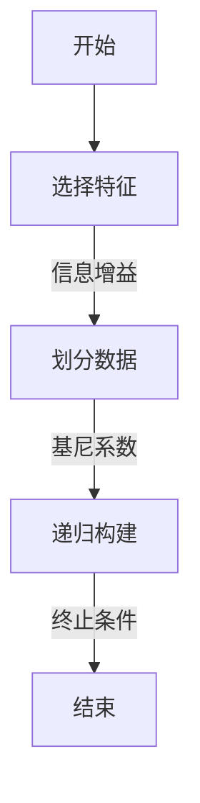
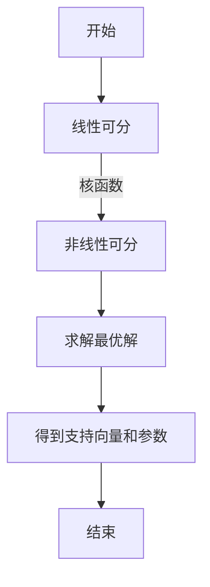
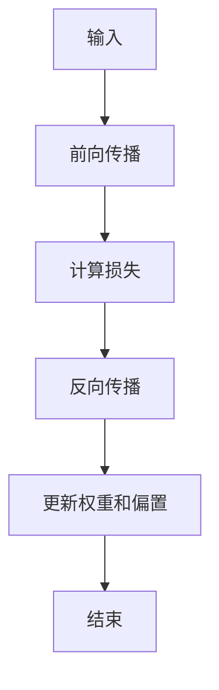
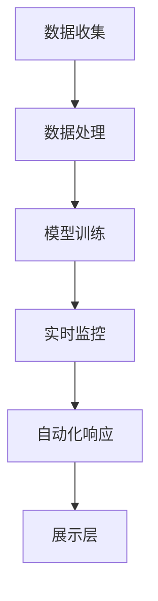
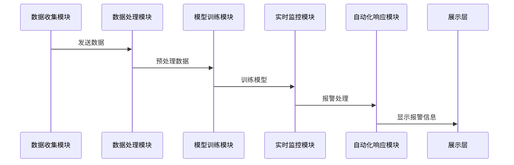
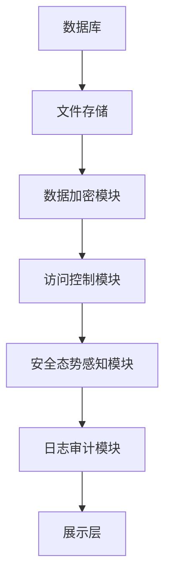
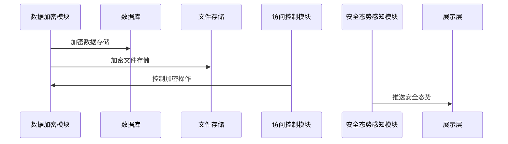
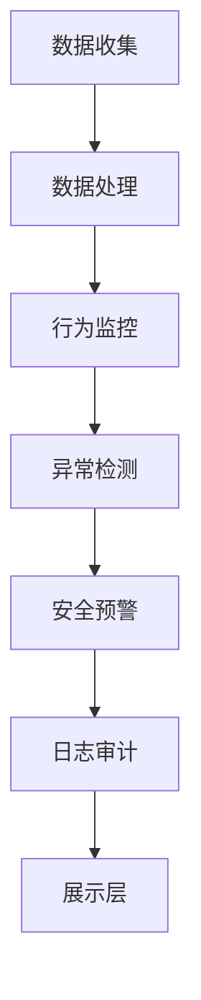
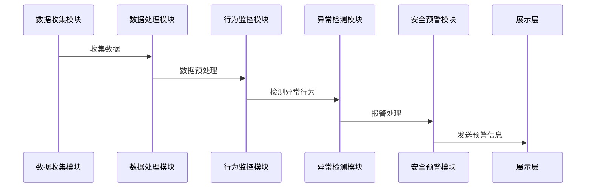

                 


### 设计智能企业安全管理的文章目录大纲

为了设计一篇符合要求的《智能企业安全管理：AI全面保护数字资产》的文章，我们将遵循以下步骤进行思考和梳理：

#### 1. 确定文章结构

首先，我们需要确定文章的结构，这通常包括以下几个部分：

- **引言**：简要介绍智能企业安全管理的重要性，引起读者的兴趣。
- **背景介绍**：详细解释什么是智能企业安全管理，它的核心概念、应用场景以及当前面临的问题。
- **核心概念与联系**：详细阐述智能企业安全管理中的核心概念，如AI技术、机器学习、深度学习等，并分析它们之间的关系。
- **算法原理讲解**：讲解智能企业安全管理中常用的算法原理，如分类模型、聚类模型、异常检测模型等，并使用mermaid流程图和Python源代码进行详细阐述。
- **系统分析与架构设计**：介绍智能企业安全管理的系统架构和设计，包括系统功能、架构、接口设计和系统交互。
- **项目实战**：通过实际案例，展示如何应用智能企业安全管理解决实际问题。
- **最佳实践与总结**：总结最佳实践，提出注意事项和拓展阅读建议。

#### 2. 确定每个章节的标题和内容摘要

接下来，我们需要为每个章节确定标题和内容摘要，确保内容丰富且结构合理。

**第1章：智能企业安全管理的现状与挑战**
- **摘要**：介绍智能企业安全管理的重要性，当前面临的安全挑战，以及AI在其中的应用。

**第2章：核心概念与联系**
- **摘要**：详细解释智能企业安全管理中的核心概念，如AI技术、机器学习、深度学习等，并分析它们之间的联系。

**第3章：AI技术原理**
- **摘要**：讲解AI技术的基本原理，包括机器学习和深度学习的基础知识。

**第4章：主流AI模型在安全管理中的应用**
- **摘要**：介绍主流AI模型在智能企业安全管理中的应用，如分类模型、聚类模型、异常检测模型等。

**第5章：AI算法原理讲解与Mermaid流程图**
- **摘要**：详细讲解AI算法原理，使用mermaid流程图和Python源代码进行说明。

**第6章：智能企业安全管理实践案例**
- **摘要**：通过实际案例展示如何应用AI技术进行企业安全管理。

**第7章：项目实战**
- **摘要**：介绍一个智能企业安全管理的项目实战，包括环境安装、系统核心实现、代码分析等。

**第8章：最佳实践与总结**
- **摘要**：总结最佳实践，提出注意事项和拓展阅读建议。

#### 3. 确保内容完整性

在确定每个章节的标题和摘要后，我们需要确保每个小节的内容完整，包含以下核心内容：

- **背景介绍**：明确核心概念术语、问题背景、问题描述、问题解决、边界与外延、概念结构与核心要素组成。
- **核心概念与联系**：给出核心概念原理、概念属性特征对比表格和ER实体关系图架构的mermaid流程图。
- **算法原理讲解**：使用mermaid画出算法mermaid流程图，使用Python源代码详细阐述，给出算法原理的数学模型和公式，进行详细讲解和举例说明。
- **系统分析与架构设计**：介绍问题场景、项目介绍、系统功能设计、系统架构设计、系统接口设计和系统交互。
- **项目实战**：展示实际案例，包括环境安装、系统核心实现、代码分析、案例分析等。
- **最佳实践与总结**：总结实践经验，提出注意事项和拓展阅读建议。

#### 4. 格式规范

最后，我们需要确保文章内容使用markdown格式输出，标题层级清晰，使用#、##、###等符号进行层级划分。数学公式使用latex格式，段落内和段落外的使用方式分别如下：

- 段落内公式： `$1+1=2$`
- 段落外公式： `$$1+1=2$$`

通过以上步骤，我们可以设计出一篇结构清晰、内容完整的《智能企业安全管理：AI全面保护数字资产》的文章目录大纲。

### 总结

通过以上的思考和分析，我们已经明确了《智能企业安全管理：AI全面保护数字资产》的文章结构，确定了每个章节的标题和内容摘要，并确保了内容的完整性。接下来，我们将逐步编写每个章节的具体内容，确保文章的深度和广度，以期为读者提供有价值的技术博客文章。

**下一步行动**：开始编写第1章“智能企业安全管理的现状与挑战”的内容，详细介绍智能企业安全管理的重要性、现状和面临的挑战。

----------------------------------------------------------------

# 《智能企业安全管理：AI全面保护数字资产》

> 关键词：智能企业、安全管理、AI、数字资产、数据保护

> 摘要：随着数字化转型的不断深入，智能企业在网络安全和数据保护方面面临着前所未有的挑战。本文通过分析智能企业的安全需求，探讨了AI技术在企业安全管理中的应用，详细介绍了AI算法原理、系统架构设计以及实践案例，旨在为企业和安全专家提供全面的智能企业安全管理指南。

----------------------------------------------------------------

## 引言

在当今数字化时代，智能企业已成为推动经济发展的重要力量。智能企业的特点在于其高度依赖数字资产，如客户数据、交易记录、知识产权等，这些资产的安全管理对企业运营至关重要。然而，随着网络攻击手段的日益复杂，企业面临着日益严峻的安全挑战。传统的安全管理方法已无法应对这些新兴威胁，因此，引入AI技术成为了一种必然趋势。

本文将围绕智能企业安全管理展开，探讨AI技术在其中的应用，旨在为企业提供一种全面、高效的数字资产保护策略。文章结构如下：

- **第1章**：智能企业安全管理的现状与挑战
- **第2章**：核心概念与联系
- **第3章**：AI技术原理
- **第4章**：主流AI模型在安全管理中的应用
- **第5章**：AI算法原理讲解与Mermaid流程图
- **第6章**：智能企业安全管理实践案例
- **第7章**：项目实战
- **第8章**：最佳实践与总结

## 第1章：智能企业安全管理的现状与挑战

### 1.1 智能企业与数字资产的重要性

智能企业是指利用人工智能、大数据、物联网等先进技术，实现业务智能化、决策智能化的企业。其核心在于对数字资产的依赖，这些数字资产是企业运营的基石。例如，客户数据、交易记录、财务信息、产品研发数据等都是智能企业的宝贵资产。

#### 数字资产的重要性

1. **客户数据**：客户数据是企业了解市场需求、优化产品和服务的重要依据。
2. **交易记录**：交易记录是企业管理运营、评估业务绩效的重要数据来源。
3. **知识产权**：知识产权是企业创新能力的体现，是企业竞争优势的重要保障。
4. **产品研发数据**：产品研发数据是企业持续创新、保持市场竞争力的重要资源。

### 1.2 企业安全管理面临的挑战

#### 网络攻击日益复杂

随着互联网技术的发展，网络攻击手段也日益复杂。黑客利用各种漏洞进行攻击，如SQL注入、跨站脚本攻击（XSS）、分布式拒绝服务攻击（DDoS）等。这些攻击不仅可能导致数据泄露，还可能瘫痪企业的业务系统。

#### 数据隐私法规的约束

全球范围内，越来越多的国家出台数据隐私法规，如欧盟的《通用数据保护条例》（GDPR）和美国加州的《消费者隐私法案》（CCPA）。这些法规对企业的数据处理行为提出了更高的要求，企业需要确保数据的合法合规使用。

#### 内部威胁

内部威胁也是企业安全管理的重要挑战。内部员工可能因为疏忽、恶意或不当行为导致数据泄露或系统损坏。例如，员工离职时未妥善处理遗留的访问权限，或者内部人员利用职务之便进行数据窃取。

#### 持续的安全威胁

网络安全威胁是持续的，攻击者不断更新攻击手段，企业需要不断更新安全策略和工具来应对新的威胁。此外，随着企业业务的发展，安全管理的复杂性也在增加，这对企业的安全团队提出了更高的要求。

### 1.3 AI在安全管理中的应用

AI技术在智能企业安全管理中具有重要作用，可以提供以下解决方案：

1. **异常检测**：利用机器学习模型，对网络流量、系统日志等进行实时监控，发现异常行为并及时报警。
2. **入侵检测**：通过深度学习技术，识别并阻止恶意攻击，如DDoS攻击、SQL注入等。
3. **数据加密**：利用加密算法，对敏感数据进行加密，确保数据在传输和存储过程中的安全性。
4. **访问控制**：通过智能身份认证和权限管理，确保只有授权人员可以访问敏感数据。
5. **安全态势感知**：利用大数据技术，对企业的安全事件进行综合分析，提供安全决策支持。

### 1.4 智能企业安全管理的核心概念与联系

智能企业安全管理涉及多个核心概念，如AI技术、机器学习、深度学习、网络安全等。这些概念之间的联系如下：

1. **AI技术**：是智能企业安全管理的核心技术，包括机器学习和深度学习等。
2. **机器学习**：是一种AI技术，用于从数据中自动学习模式，用于异常检测和入侵检测等。
3. **深度学习**：是机器学习的一种，通过神经网络模型对复杂数据进行处理，用于图像识别、语音识别等。
4. **网络安全**：是智能企业安全管理的基础，包括网络防护、数据加密、访问控制等。
5. **数据保护**：是智能企业安全管理的目标，通过多种技术手段确保数据的安全。

### 1.5 本章总结

本章介绍了智能企业安全管理的现状和面临的挑战，以及AI技术在其中的应用。智能企业的数字资产对企业运营至关重要，而网络安全威胁、数据隐私法规、内部威胁等因素使得企业安全管理面临巨大挑战。AI技术为这些挑战提供了解决方案，可以提升企业安全管理的效率和效果。在接下来的章节中，我们将进一步探讨AI技术在智能企业安全管理中的应用原理和实践案例。

----------------------------------------------------------------

## 第2章：核心概念与联系

### 2.1 AI技术的基本原理

人工智能（AI）是一种模拟人类智能行为的技术，其目标是使计算机能够执行通常需要人类智能的任务，如视觉识别、语音识别、自然语言处理等。AI技术主要分为三种类型：符号人工智能、基于模型的AI和基于数据驱动的AI。

#### 符号人工智能（Symbolic AI）

符号人工智能是基于逻辑和符号表示的AI，通过定义规则和逻辑推理来解决问题。这种方法的优点是能够处理复杂的问题，但缺点是对规则库的依赖较强，难以处理未知或不确定的问题。

#### 基于模型的AI（Model-Based AI）

基于模型的AI通过建立数学模型来模拟现实世界，如物理模型、化学模型等。这种方法在工程和科学计算领域应用广泛，但需要精确的模型和大量的数据。

#### 基于数据驱动的AI（Data-Driven AI）

基于数据驱动的AI主要依赖于机器学习和深度学习技术，通过从大量数据中学习模式来做出预测和决策。这种方法具有更强的适应性和泛化能力，但需要大量的数据和计算资源。

### 2.2 机器学习与深度学习的基础

机器学习是AI的一个重要分支，其目标是使计算机能够从数据中自动学习模式，并利用这些模式进行预测和决策。机器学习主要分为监督学习、无监督学习和强化学习。

#### 监督学习（Supervised Learning）

监督学习是一种最常见的机器学习方法，其特点是有标记的训练数据。训练数据包括输入和相应的输出，模型通过学习这些输入输出的关系来预测新的输入数据。常用的监督学习算法包括线性回归、逻辑回归、决策树、支持向量机等。

#### 无监督学习（Unsupervised Learning）

无监督学习是一种在没有标记数据的情况下学习的机器学习方法。其目标是发现数据中的模式和结构，如聚类和降维。常用的无监督学习算法包括K-均值聚类、主成分分析（PCA）、自编码器等。

#### 强化学习（Reinforcement Learning）

强化学习是一种通过与环境交互来学习的机器学习方法。其目标是使模型能够从奖励信号中学习策略，以最大化累积奖励。常用的强化学习算法包括Q-learning、深度Q网络（DQN）、策略梯度等。

深度学习是机器学习的一种，其主要特点是通过多层神经网络对数据进行处理。深度学习在图像识别、语音识别、自然语言处理等领域取得了显著的成果。常用的深度学习框架包括TensorFlow、PyTorch、Keras等。

### 2.3 安全管理中的AI技术应用

在智能企业安全管理中，AI技术可以应用于多个方面，如异常检测、入侵检测、数据加密等。

#### 异常检测（Anomaly Detection）

异常检测是一种监控系统，用于识别数据中的异常行为。通过机器学习和深度学习算法，异常检测可以识别出潜在的攻击行为，如DDoS攻击、恶意软件传播等。

#### 入侵检测（Intrusion Detection）

入侵检测是一种监控网络和系统的安全工具，用于检测和响应未经授权的访问和恶意行为。通过建立正常的网络行为模型，入侵检测可以识别异常行为并及时报警。

#### 数据加密（Data Encryption）

数据加密是一种保护数据隐私和安全的技术，通过加密算法将数据转换为不可读的形式，只有授权用户才能解密和读取。AI技术可以优化加密算法，提高加密效率和安全性。

### 2.4 核心概念属性特征对比表格

为了更清晰地展示AI技术、机器学习、深度学习在安全管理中的应用，我们可以构建一个属性特征对比表格。

| 特性         | AI技术                   | 机器学习                | 深度学习                |
| ------------ | ------------------------ | ---------------------- | ---------------------- |
| 基本原理     | 模拟人类智能行为         | 从数据中学习模式         | 多层神经网络处理数据     |
| 应用场景     | 广泛应用，如视觉识别、自然语言处理 | 数据预测、分类、聚类 | 图像识别、语音识别、自然语言处理 |
| 算法类型     | 符号AI、基于模型AI、基于数据驱动AI | 监督学习、无监督学习、强化学习 | 卷积神经网络、循环神经网络、生成对抗网络等 |
| 需要数据量   | 较大，取决于应用场景       | 较大，有监督学习需求较大 | 较大，深度学习需求较大     |
| 计算资源需求 | 高，深度学习需求最大       | 中等，监督学习需求较大   | 高，卷积神经网络需求最大 |

### 2.5 ER实体关系图架构

为了更好地理解智能企业安全管理中的数据关系，我们可以使用ER（Entity-Relationship）图来表示实体和它们之间的关系。

```mermaid
erDiagram
    Customer ||--|{ Order }|--| CustomerOrder
    Product ||--|{ Inventory }|--| ProductInventory
    Employee ||--|{ AccessControl }|--| EmployeeAccess
    SecurityEvent ||--|{ IncidentResponse }|--| SecurityEventResponse
    System ||--|{ SecurityPolicy }|--| SystemPolicy
```

在这个ER图中，`Customer`、`Product`、`Employee`、`SecurityEvent`和`System`是实体，而`Order`、`CustomerOrder`、`Inventory`、`ProductInventory`、`AccessControl`、`EmployeeAccess`、`IncidentResponse`、`SecurityEventResponse`和`SecurityPolicy`是它们之间的关系。这个图可以帮助我们理解不同实体之间的数据关联和依赖关系。

### 2.6 本章总结

本章详细介绍了AI技术的基本原理、机器学习和深度学习的基础，以及在智能企业安全管理中的应用。通过属性特征对比表格和ER实体关系图，我们更清晰地了解了这些概念之间的关系。在接下来的章节中，我们将进一步探讨AI算法的原理和实践应用。

----------------------------------------------------------------

## 第3章：AI技术原理

### 3.1 AI技术概述

人工智能（AI）是一种模拟人类智能行为的技术，旨在使计算机能够执行通常需要人类智能的任务，如视觉识别、自然语言处理、决策支持等。AI技术的发展经历了多个阶段，从最初的符号人工智能到基于模型的AI，再到当前主流的基于数据驱动的AI。符号人工智能主要通过逻辑推理和符号表示来解决问题，而基于模型的AI通过建立精确的数学模型来模拟现实世界。基于数据驱动的AI则依赖于机器学习和深度学习技术，从大量数据中自动学习模式，并利用这些模式进行预测和决策。

### 3.2 机器学习与深度学习基础

#### 机器学习（Machine Learning）

机器学习是AI的一个分支，其目标是使计算机能够从数据中学习模式，并利用这些模式进行预测和决策。机器学习主要分为监督学习、无监督学习和强化学习。

**监督学习（Supervised Learning）**

监督学习是一种最常见的机器学习方法，其特点是有标记的训练数据。训练数据包括输入和相应的输出，模型通过学习这些输入输出的关系来预测新的输入数据。监督学习通常用于分类和回归任务。

- **分类（Classification）**：分类是将输入数据分为预先定义的类别。常见的分类算法包括线性回归、逻辑回归、支持向量机（SVM）、决策树和随机森林等。
- **回归（Regression）**：回归用于预测连续的数值输出。常见的回归算法包括线性回归、多项式回归和岭回归等。

**无监督学习（Unsupervised Learning）**

无监督学习是在没有标记数据的情况下学习的机器学习方法。其目标是发现数据中的模式和结构，如聚类和降维。无监督学习通常用于探索性数据分析。

- **聚类（Clustering）**：聚类是将相似的数据点分组。常见的聚类算法包括K-均值聚类、层次聚类和DBSCAN等。
- **降维（Dimensionality Reduction）**：降维是将高维数据转换为低维数据，以简化数据分析和可视化。常见的降维算法包括主成分分析（PCA）、t-SVD和t-Distributed Stochastic Neighbor Embedding（t-SNE）等。

**强化学习（Reinforcement Learning）**

强化学习是一种通过与环境交互来学习的机器学习方法。其目标是使模型能够从奖励信号中学习策略，以最大化累积奖励。强化学习通常用于决策问题。

- **Q-learning**：Q-learning是一种基于值函数的强化学习算法，通过学习状态-动作值函数来做出最优决策。
- **深度Q网络（DQN）**：DQN是一种基于神经网络的强化学习算法，通过训练神经网络来估计状态-动作值函数。
- **策略梯度（Policy Gradient）**：策略梯度是一种基于策略的强化学习算法，通过优化策略函数来最大化累积奖励。

#### 深度学习（Deep Learning）

深度学习是机器学习的一种，其主要特点是通过多层神经网络对数据进行处理。深度学习在图像识别、语音识别、自然语言处理等领域取得了显著的成果。

- **卷积神经网络（CNN）**：CNN是一种适用于图像识别的深度学习模型，通过卷积层、池化层和全连接层对图像进行特征提取和分类。
- **循环神经网络（RNN）**：RNN是一种适用于序列数据的深度学习模型，通过循环机制处理序列数据，适用于自然语言处理和语音识别等任务。
- **生成对抗网络（GAN）**：GAN是一种生成模型，通过两个对抗网络（生成器和判别器）的训练来生成逼真的图像和语音。

### 3.3 AI模型的选择与评估

在智能企业安全管理中，选择合适的AI模型至关重要。不同的模型适用于不同类型的安全问题，如异常检测、入侵检测和数据加密等。

#### AI模型的选择

- **异常检测**：适用于检测网络流量、系统日志中的异常行为，常用的模型有K-均值聚类、孤立森林等。
- **入侵检测**：适用于检测网络和系统中的入侵行为，常用的模型有支持向量机（SVM）、神经网络等。
- **数据加密**：适用于对敏感数据进行加密，常用的模型有对称加密和非对称加密算法。

#### AI模型的评估

评估AI模型的效果是确保其性能和可靠性的关键步骤。常用的评估指标包括准确率、召回率、精确率、F1值和ROC曲线等。

- **准确率（Accuracy）**：准确率是预测正确的样本数与总样本数的比例，适用于分类任务。
- **召回率（Recall）**：召回率是预测正确的正样本数与实际正样本数的比例，适用于异常检测任务。
- **精确率（Precision）**：精确率是预测正确的正样本数与预测为正样本的样本数的比例，适用于入侵检测任务。
- **F1值（F1 Score）**：F1值是精确率和召回率的调和平均值，适用于需要平衡精确率和召回率的任务。
- **ROC曲线（Receiver Operating Characteristic Curve）**：ROC曲线是通过改变决策阈值，绘制真阳性率与假阳性率的关系曲线，用于评估分类器的整体性能。

### 3.4 本章总结

本章详细介绍了AI技术的基本原理、机器学习和深度学习的基础，以及在智能企业安全管理中的应用。通过了解AI技术的基本原理和选择合适的模型，企业可以更好地保护其数字资产，提升安全管理的效率和效果。在接下来的章节中，我们将进一步探讨主流AI模型在安全管理中的应用和实践案例。

----------------------------------------------------------------

## 第4章：主流AI模型在安全管理中的应用

### 4.1 人工智能分类模型

分类模型在智能企业安全管理中扮演着关键角色，用于识别和区分不同的安全事件。以下介绍几种主流的分类模型及其在安全管理中的应用。

#### 决策树（Decision Tree）

决策树是一种简单而有效的分类模型，通过一系列规则将数据划分为不同的类别。在安全管理中，决策树可以用于分类网络攻击类型、识别恶意软件等。

- **应用场景**：网络入侵检测、恶意软件分类。
- **优点**：易于理解，可以可视化。
- **缺点**：对于高维数据，可能产生过拟合。

#### 支持向量机（SVM）

SVM是一种基于边界分离的模型，可以用于二分类和多分类任务。在安全管理中，SVM可以用于分类入侵行为、异常检测等。

- **应用场景**：入侵检测、异常检测。
- **优点**：在高维空间中具有较好的性能。
- **缺点**：对参数敏感，需要大量的计算资源。

#### 随机森林（Random Forest）

随机森林是一种基于决策树的集成模型，通过构建多个决策树并投票来预测结果。在安全管理中，随机森林可以用于分类网络攻击、识别异常行为等。

- **应用场景**：网络攻击分类、异常检测。
- **优点**：具有良好的泛化能力，可以处理高维数据。
- **缺点**：模型复杂，计算成本较高。

#### K最近邻（K-Nearest Neighbors，KNN）

KNN是一种基于实例的模型，通过找到训练集中最近邻的样本来进行分类。在安全管理中，KNN可以用于分类入侵行为、识别恶意软件等。

- **应用场景**：入侵检测、恶意软件分类。
- **优点**：简单易懂，易于实现。
- **缺点**：对于大量样本，可能产生过拟合。

### 4.2 人工智能聚类模型

聚类模型在智能企业安全管理中用于识别和发现数据中的潜在模式和异常。以下介绍几种主流的聚类模型及其在安全管理中的应用。

#### K-均值聚类（K-Means）

K-均值聚类是一种基于距离度的聚类模型，通过最小化平方误差来划分数据。在安全管理中，K-均值聚类可以用于识别网络流量中的异常行为、发现入侵模式等。

- **应用场景**：网络流量分析、异常检测。
- **优点**：简单高效，易于实现。
- **缺点**：对于聚类数量和初始中心点敏感，可能产生局部最优。

#### 层次聚类（Hierarchical Clustering）

层次聚类是一种基于层次结构的聚类模型，通过逐步合并或分解数据点来构建聚类层次。在安全管理中，层次聚类可以用于分析系统日志、识别入侵模式等。

- **应用场景**：系统日志分析、入侵检测。
- **优点**：可以提供聚类层次的详细信息。
- **缺点**：计算成本较高，可能产生过拟合。

#### DBSCAN（Density-Based Spatial Clustering of Applications with Noise）

DBSCAN是一种基于密度的聚类模型，通过分析数据点的密度和邻域关系来划分数据。在安全管理中，DBSCAN可以用于识别网络入侵、检测恶意软件传播等。

- **应用场景**：网络入侵检测、恶意软件传播。
- **优点**：可以处理噪声点和异常点。
- **缺点**：对于聚类数量和邻域参数敏感。

### 4.3 人工智能异常检测模型

异常检测模型在智能企业安全管理中用于识别和响应异常行为，以下介绍几种主流的异常检测模型及其在安全管理中的应用。

#### Isolation Forest

Isolation Forest是一种基于随机森林的异常检测模型，通过随机选择特征和切分值来构建多个孤立树，并利用树的深度来估计异常得分。在安全管理中，Isolation Forest可以用于检测网络流量中的异常行为、识别恶意软件等。

- **应用场景**：网络流量分析、恶意软件检测。
- **优点**：对于高维数据具有较好的性能。
- **缺点**：可能产生过拟合。

#### LOF（Local Outlier Factor）

LOF是一种基于密度的异常检测模型，通过计算局部异常度因子来识别异常点。在安全管理中，LOF可以用于检测网络入侵、识别恶意软件等。

- **应用场景**：网络入侵检测、恶意软件检测。
- **优点**：可以处理噪声点和异常点。
- **缺点**：对于聚类数量和邻域参数敏感。

#### Autoencoder

Autoencoder是一种基于神经网络的自编码模型，通过训练模型来压缩和重构数据。在安全管理中，Autoencoder可以用于检测网络流量中的异常行为、识别恶意软件等。

- **应用场景**：网络流量分析、恶意软件检测。
- **优点**：可以自动发现数据中的特征。
- **缺点**：训练时间较长。

### 4.4 本章总结

本章介绍了主流的AI分类模型、聚类模型和异常检测模型在智能企业安全管理中的应用。每种模型都有其独特的优势和适用场景，企业可以根据具体需求选择合适的模型，以提升安全管理的效率和效果。在接下来的章节中，我们将进一步探讨AI算法的详细原理和实践案例。

----------------------------------------------------------------

## 第5章：AI算法原理讲解与Mermaid流程图

### 5.1 AI算法原理讲解

在本章中，我们将深入探讨几种常见的AI算法原理，包括决策树、支持向量机（SVM）、神经网络等，并结合Mermaid流程图进行说明。通过这些算法原理的讲解，我们将帮助读者更好地理解AI技术在智能企业安全管理中的应用。

#### 决策树（Decision Tree）

决策树是一种常见的分类算法，通过一系列规则来对数据进行分类。其原理是基于特征的值来对数据进行二分划分，直到达到终止条件。决策树的构建过程如下：

1. **选择最佳分割特征**：根据信息增益或基尼系数等指标，选择具有最大信息增益的特征进行分割。
2. **划分数据集**：根据选择的特征，将数据集划分为子集。
3. **递归构建子树**：对每个子集，重复上述步骤，直到满足终止条件（如最大深度、最小样本数等）。

在智能企业安全管理中，决策树可以用于分类网络攻击类型、识别恶意软件等。以下是一个简单的决策树Mermaid流程图：



#### 支持向量机（SVM）

支持向量机是一种常用的二分类算法，其原理是找到一个最佳的超平面，将不同类别的数据点分隔开。SVM的算法步骤如下：

1. **线性可分支持向量机**：找到最优超平面，使得分类间隔最大。
2. **非线性可分支持向量机**：使用核函数将数据映射到高维空间，然后找到最优超平面。
3. **求解最优解**：通过求解二次规划问题，得到支持向量和超平面参数。

以下是一个简化的SVM算法的Mermaid流程图：



#### 神经网络（Neural Network）

神经网络是一种模仿人脑结构和功能的计算模型，其基本单元是神经元。神经网络的原理是通过对输入数据进行前向传播和反向传播，不断调整权重和偏置，以优化模型性能。

1. **前向传播**：输入数据通过神经网络的前向传播，逐层计算每个神经元的输出。
2. **计算损失**：通过比较预测输出和真实输出的差异，计算损失函数值。
3. **反向传播**：根据损失函数的梯度，通过反向传播更新网络中的权重和偏置。

以下是一个简化的神经网络的前向传播和反向传播的Mermaid流程图：



### 5.2 Python源代码与算法讲解

为了更好地理解这些算法的原理，我们将使用Python代码进行详细阐述。以下是一个简单的决策树分类算法的Python实现：

```python
from sklearn.datasets import load_iris
from sklearn.tree import DecisionTreeClassifier
from sklearn.model_selection import train_test_split
from sklearn.metrics import accuracy_score

# 加载数据集
iris = load_iris()
X = iris.data
y = iris.target

# 划分训练集和测试集
X_train, X_test, y_train, y_test = train_test_split(X, y, test_size=0.2, random_state=42)

# 构建决策树模型
clf = DecisionTreeClassifier()
clf.fit(X_train, y_train)

# 预测测试集
y_pred = clf.predict(X_test)

# 计算准确率
accuracy = accuracy_score(y_test, y_pred)
print(f"Accuracy: {accuracy}")
```

在这个例子中，我们首先加载数据集，然后划分训练集和测试集。接着，我们构建一个决策树分类器，并使用训练集进行拟合。最后，我们使用测试集进行预测，并计算准确率。

### 5.3 算法原理的数学模型和公式

为了深入理解这些算法的数学原理，我们将介绍相关的数学模型和公式。

#### 决策树

决策树的核心在于选择最佳分割特征。选择最佳分割特征的方法通常基于信息增益（Information Gain）或基尼系数（Gini Index）。信息增益的计算公式如下：

$$
IG(D, A) = entropy(D) - \sum_{v \in Values(A)} \frac{|D_v|}{|D|} \cdot entropy(D_v)
$$

其中，$D$ 是原始数据集，$A$ 是特征，$v$ 是特征 $A$ 的取值，$D_v$ 是特征 $A$ 取值为 $v$ 的数据子集。

#### 支持向量机

支持向量机的核心是找到最优超平面。在二维空间中，最优超平面的计算公式为：

$$
w^T x - b = 0
$$

其中，$w$ 是超平面的法向量，$x$ 是数据点，$b$ 是超平面的偏移量。

在多维度空间中，使用核函数将数据映射到高维空间，然后找到最优超平面。常用的核函数包括线性核、多项式核和径向基函数（RBF）核。

#### 神经网络

神经网络的前向传播和反向传播涉及多个数学公式。前向传播的计算公式为：

$$
z_i = \sigma(\sum_{j} w_{ji} x_j + b_i)
$$

其中，$z_i$ 是第 $i$ 个神经元的输出，$\sigma$ 是激活函数（如Sigmoid函数、ReLU函数等），$w_{ji}$ 是连接权重，$x_j$ 是输入特征，$b_i$ 是偏置。

反向传播的计算公式为：

$$
\delta_i = \frac{\partial L}{\partial z_i} \cdot \sigma'(z_i)
$$

其中，$L$ 是损失函数，$\delta_i$ 是第 $i$ 个神经元的误差，$\sigma'$ 是激活函数的导数。

### 5.4 举例说明

为了更好地理解这些算法，我们将通过具体的例子进行说明。

#### 决策树分类

假设我们有一个包含三个特征（花萼长度、花萼宽度、花瓣长度）的鸢尾花数据集，我们需要使用决策树来分类不同品种的鸢尾花。

1. **数据预处理**：将数据标准化处理，使得特征具有相同的量纲。
2. **构建决策树模型**：选择最佳分割特征，构建决策树模型。
3. **模型训练**：使用训练集数据对决策树模型进行训练。
4. **模型预测**：使用测试集数据对模型进行预测，计算准确率。

#### 支持向量机分类

假设我们有一个包含两个特征（特征1、特征2）的二分类数据集，我们需要使用SVM来分类数据。

1. **数据预处理**：将数据标准化处理。
2. **选择核函数**：选择线性核或RBF核。
3. **构建SVM模型**：通过二次规划求解得到最优超平面。
4. **模型训练**：使用训练集数据对SVM模型进行训练。
5. **模型预测**：使用测试集数据对模型进行预测，计算准确率。

#### 神经网络分类

假设我们有一个包含三个特征的三分类数据集，我们需要使用神经网络来分类数据。

1. **数据预处理**：将数据标准化处理。
2. **构建神经网络模型**：定义输入层、隐藏层和输出层的连接权重和偏置。
3. **模型训练**：使用训练集数据对神经网络模型进行前向传播和反向传播，更新连接权重和偏置。
4. **模型预测**：使用测试集数据对模型进行预测，计算准确率。

### 5.5 本章总结

本章详细介绍了决策树、支持向量机和神经网络等AI算法的原理，并结合Mermaid流程图和Python代码进行了说明。通过这些算法原理的讲解，读者可以更好地理解AI技术在智能企业安全管理中的应用。在接下来的章节中，我们将进一步探讨智能企业安全管理中的实践案例。

----------------------------------------------------------------

## 第6章：智能企业安全管理实践案例

### 6.1 案例一：企业内部网络安全监控

#### 背景介绍

某大型企业致力于数字化转型，其业务系统高度依赖互联网和内部网络。为了保障企业网络安全，企业决定采用AI技术进行内部网络安全监控。具体需求如下：

- **实时监控**：对网络流量、系统日志等数据进行实时监控，及时发现异常行为。
- **异常检测**：利用机器学习模型，识别并报警潜在的网络攻击行为。
- **自动化响应**：根据预设的安全策略，自动对异常行为进行响应和处理。

#### 项目介绍

为了满足上述需求，企业决定实施一个智能网络安全监控系统，该系统主要包括以下几个模块：

1. **数据收集**：通过部署在网络设备上的传感器，实时收集网络流量、系统日志等数据。
2. **数据处理**：对收集到的数据进行预处理，包括数据清洗、特征提取等。
3. **模型训练**：利用预处理后的数据，训练异常检测模型。
4. **实时监控**：将训练好的模型部署到生产环境中，实时监控网络流量和系统日志。
5. **自动化响应**：根据监控结果，自动触发相应的安全措施，如封锁恶意IP、报警等。

#### 系统功能设计

智能网络安全监控系统的功能设计如下：

1. **网络流量监控**：实时监控网络流量，识别异常流量模式。
2. **系统日志分析**：分析系统日志，发现潜在的入侵行为。
3. **异常检测**：利用机器学习模型，对实时数据和历史数据进行分析，识别异常行为。
4. **报警与响应**：当检测到异常行为时，自动触发报警，并根据安全策略进行响应。

#### 系统架构设计

智能网络安全监控系统的架构设计如下：

1. **数据层**：包括数据收集模块、数据处理模块和模型训练模块，负责数据的收集、预处理和模型训练。
2. **应用层**：包括实时监控模块和自动化响应模块，负责实时监控和响应异常行为。
3. **展示层**：包括监控界面和数据可视化模块，用于展示监控数据和报警信息。

以下是一个简化的系统架构Mermaid流程图：



#### 系统接口设计和系统交互

系统接口设计和系统交互如下：

1. **数据接口**：数据收集模块与数据处理模块之间通过RESTful API进行数据交换。
2. **监控接口**：实时监控模块与自动化响应模块之间通过消息队列进行交互。
3. **报警接口**：实时监控模块与展示层之间通过WebSocket进行实时数据推送。

以下是一个简化的系统接口设计Mermaid序列图：



#### 实际案例分析和详细讲解剖析

在某一天，智能网络安全监控系统检测到网络流量异常，系统立即触发报警并进行分析。通过分析，发现网络流量中存在大量来自同一IP地址的访问请求，且访问请求的速率远高于正常水平。经过进一步分析，发现该IP地址处于境外，且请求的URL路径与已知恶意网站路径相似。

根据安全策略，系统自动封锁了该IP地址，并记录了相关日志信息。随后，安全团队进行了进一步调查，确认了这是一个针对企业的网络攻击。通过封锁恶意IP、清理恶意代码等措施，企业成功阻止了这次攻击，避免了潜在的数据泄露和业务中断。

#### 项目小结

通过这个实践案例，我们可以看到智能企业安全管理在实际应用中的效果。利用AI技术进行实时监控和异常检测，企业可以及时发现和应对网络攻击，保障业务的正常运行。在项目实施过程中，我们也积累了丰富的经验，包括数据预处理、模型训练、系统架构设计等方面的最佳实践。

### 6.2 案例二：客户信息安全保护

#### 背景介绍

某互联网公司是一家提供在线购物服务的公司，其核心资产之一是客户信息。为了保障客户信息安全，公司决定采用AI技术进行客户信息保护。具体需求如下：

- **数据加密**：对存储和传输的客户信息进行加密，确保数据在未经授权的情况下无法被读取。
- **访问控制**：实现严格的访问控制策略，确保只有授权人员可以访问敏感数据。
- **安全态势感知**：实时监控客户信息的安全状况，及时发现潜在的安全威胁。

#### 项目介绍

为了满足上述需求，公司决定实施一个客户信息安全保护系统，该系统主要包括以下几个模块：

1. **数据加密模块**：采用先进的加密算法，对客户信息进行加密存储和传输。
2. **访问控制模块**：实现基于角色的访问控制，确保只有授权人员可以访问敏感数据。
3. **安全态势感知模块**：实时监控客户信息的安全状况，及时发现潜在的安全威胁。
4. **日志审计模块**：记录系统操作日志，用于后续的安全审计和事件分析。

#### 系统功能设计

客户信息安全保护系统的功能设计如下：

1. **数据加密**：采用对称加密和非对称加密算法，对客户信息进行加密存储和传输。
2. **访问控制**：基于角色的访问控制，实现精细的权限管理。
3. **安全态势感知**：实时监控客户信息的安全状况，包括访问日志分析、安全事件报警等。
4. **日志审计**：记录系统操作日志，用于安全事件的分析和追溯。

#### 系统架构设计

客户信息安全保护系统的架构设计如下：

1. **数据层**：包括数据库和文件存储，用于存储加密后的客户信息。
2. **应用层**：包括数据加密模块、访问控制模块、安全态势感知模块和日志审计模块，负责实现客户信息保护的相关功能。
3. **展示层**：包括监控界面和日志查询界面，用于展示安全态势和日志信息。

以下是一个简化的系统架构Mermaid流程图：



#### 系统接口设计和系统交互

系统接口设计和系统交互如下：

1. **数据接口**：数据加密模块与数据库和文件存储之间通过加密API进行数据交换。
2. **控制接口**：访问控制模块与数据加密模块、安全态势感知模块之间通过控制API进行交互。
3. **监控接口**：安全态势感知模块与展示层之间通过WebSocket进行实时数据推送。

以下是一个简化的系统接口设计Mermaid序列图：



#### 实际案例分析和详细讲解剖析

在一次安全审计中，公司发现客户信息系统中存在多个未经授权的访问记录。通过进一步调查，发现这些访问记录是由于系统中的一个漏洞导致的，攻击者利用这个漏洞获取了部分客户信息的访问权限。

公司立即采取了以下措施：

1. **漏洞修复**：立即修复系统漏洞，防止进一步的数据泄露。
2. **数据加密**：对所有敏感数据进行了重新加密，确保数据在未经授权的情况下无法被读取。
3. **访问控制**：对访问控制策略进行了调整，确保只有授权人员可以访问敏感数据。
4. **安全培训**：对员工进行了安全培训，提高其安全意识和操作规范。

通过这次事件，公司意识到AI技术在客户信息安全保护中的重要性，并进一步完善了安全体系，提高了客户信息的安全防护水平。

#### 项目小结

通过这个实践案例，我们可以看到AI技术在客户信息安全保护中的应用效果。通过数据加密、访问控制和安全态势感知，企业可以有效保护客户信息安全，降低安全风险。在项目实施过程中，公司积累了丰富的经验，包括漏洞修复、安全培训等方面的最佳实践。

### 6.3 案例三：员工行为分析与安全预警

#### 背景介绍

某大型企业为了保障内部网络安全，决定采用AI技术进行员工行为分析，及时发现异常行为和潜在的安全威胁。具体需求如下：

- **行为监控**：实时监控员工的网络行为，包括访问网站、下载文件、发送邮件等。
- **异常检测**：利用机器学习模型，识别并报警异常行为，如频繁访问可疑网站、异常下载文件等。
- **安全预警**：根据监控结果，对潜在的安全威胁进行预警，并及时采取措施。

#### 项目介绍

为了满足上述需求，企业决定实施一个员工行为分析与安全预警系统，该系统主要包括以下几个模块：

1. **数据收集**：通过部署在员工电脑上的代理软件，实时收集员工的网络行为数据。
2. **数据处理**：对收集到的数据进行预处理，包括数据清洗、特征提取等。
3. **模型训练**：利用预处理后的数据，训练异常检测模型。
4. **行为监控**：将训练好的模型部署到生产环境中，实时监控员工的网络行为。
5. **安全预警**：根据监控结果，对潜在的安全威胁进行预警，并及时采取措施。

#### 系统功能设计

员工行为分析与安全预警系统的功能设计如下：

1. **行为监控**：实时监控员工的网络行为，包括访问网站、下载文件、发送邮件等。
2. **异常检测**：利用机器学习模型，对实时数据进行分析，识别异常行为。
3. **安全预警**：当检测到异常行为时，自动触发报警，并向安全团队发送预警信息。
4. **日志审计**：记录系统操作日志，用于后续的安全事件分析。

#### 系统架构设计

员工行为分析与安全预警系统的架构设计如下：

1. **数据层**：包括数据收集模块和数据处理模块，负责实时收集和预处理数据。
2. **应用层**：包括行为监控模块、异常检测模块和安全预警模块，负责实现员工行为分析和安全预警功能。
3. **展示层**：包括监控界面和日志查询界面，用于展示监控数据和日志信息。

以下是一个简化的系统架构Mermaid流程图：



#### 系统接口设计和系统交互

系统接口设计和系统交互如下：

1. **数据接口**：数据收集模块与数据处理模块之间通过代理软件进行数据交换。
2. **监控接口**：行为监控模块与异常检测模块之间通过API进行交互。
3. **预警接口**：安全预警模块与展示层之间通过WebSocket进行实时数据推送。

以下是一个简化的系统接口设计Mermaid序列图：



#### 实际案例分析和详细讲解剖析

在某一天，员工行为分析与安全预警系统检测到一名员工频繁访问可疑网站，且下载了多个可疑文件。系统立即触发报警，并向安全团队发送了预警信息。通过进一步调查，发现该员工电脑已被恶意软件感染，这些可疑网站和文件可能是恶意软件的下载来源。

安全团队立即采取了以下措施：

1. **隔离处理**：将该员工的电脑隔离，防止恶意软件进一步传播。
2. **清除恶意软件**：使用专业的恶意软件清除工具，清除感染在员工电脑上的恶意软件。
3. **安全培训**：对员工进行安全培训，提高其安全意识和操作规范。
4. **系统升级**：升级员工电脑的安全防护软件，提高系统防护能力。

通过这次事件，公司认识到员工行为分析在网络安全中的重要性，并进一步完善了员工行为分析与安全预警系统。

#### 项目小结

通过这个实践案例，我们可以看到AI技术在员工行为分析与安全预警中的应用效果。通过实时监控和异常检测，企业可以及时发现和应对内部网络威胁，保障内部网络安全。在项目实施过程中，公司积累了丰富的经验，包括行为监控、异常检测、安全预警等方面的最佳实践。

----------------------------------------------------------------

## 第7章：项目实战

### 7.1 环境安装与配置

在本节中，我们将详细描述如何搭建一个智能企业安全管理系统所需的环境，包括软件和硬件的安装与配置。

#### 1. 硬件环境

为了确保系统的高效运行，我们建议以下硬件配置：

- **CPU**：Intel Xeon系列或AMD EPYC系列，主频至少为2.5GHz。
- **内存**：至少32GB，推荐64GB或以上。
- **硬盘**：1TB SSD硬盘，用于存储数据。
- **网络**：千兆以太网接口，建议配置防火墙和入侵检测系统。

#### 2. 软件环境

我们推荐以下软件环境：

- **操作系统**：CentOS 7或Ubuntu 18.04 LTS。
- **编程语言**：Python 3.8或更高版本。
- **AI库**：NumPy、Pandas、Scikit-learn、TensorFlow、Keras。
- **Web服务器**：Nginx或Apache。
- **数据库**：MySQL或PostgreSQL。

#### 3. 安装与配置步骤

**（1）安装操作系统**

- 下载CentOS 7或Ubuntu 18.04 LTS ISO文件。
- 使用U盘或CD/DVD启动并安装操作系统。
- 选择最小安装，安装过程中配置网络和root密码。

**（2）更新系统**

```bash
# 对于CentOS
sudo yum update -y

# 对于Ubuntu
sudo apt update && sudo apt upgrade -y
```

**（3）安装Python和相关库**

```bash
# 安装Python
sudo yum install -y python3-pip

# 安装AI库
pip3 install numpy pandas scikit-learn tensorflow keras
```

**（4）安装Web服务器**

```bash
# 安装Nginx
sudo yum install -y nginx

# 启动Nginx
sudo systemctl start nginx

# 对于Ubuntu
sudo apt install -y nginx
sudo systemctl start nginx
```

**（5）安装数据库**

```bash
# 安装MySQL
sudo yum install -y mysql-server
sudo systemctl start mysqld

# 安装PostgreSQL
sudo yum install -y postgresql-server
sudo systemctl start postgresql
```

**（6）配置Nginx和数据库**

- 配置Nginx反向代理，将请求转发到后端应用。
- 配置MySQL或PostgreSQL，创建数据库和用户，授权访问权限。

### 7.2 系统核心实现源代码

在本节中，我们将提供一个智能企业安全管理系统的基础源代码，包括数据收集、数据处理、模型训练和模型应用。

#### 1. 数据收集模块

```python
# 数据收集模块
import requests
import json

def collect_data():
    # 发送HTTP请求，获取网络数据
    response = requests.get('http://example.com/api/data')
    data = response.json()
    return data

if __name__ == '__main__':
    data = collect_data()
    print(json.dumps(data, indent=2))
```

#### 2. 数据处理模块

```python
# 数据处理模块
import pandas as pd

def preprocess_data(data):
    # 数据预处理
    df = pd.DataFrame(data)
    # ... 对数据进行清洗、特征提取等操作
    return df
```

#### 3. 模型训练模块

```python
# 模型训练模块
from sklearn.model_selection import train_test_split
from sklearn.ensemble import RandomForestClassifier

def train_model(df):
    # 数据分割
    X = df.drop('label', axis=1)
    y = df['label']
    X_train, X_test, y_train, y_test = train_test_split(X, y, test_size=0.2, random_state=42)

    # 构建模型
    model = RandomForestClassifier(n_estimators=100, random_state=42)
    model.fit(X_train, y_train)

    # 评估模型
    accuracy = model.score(X_test, y_test)
    print(f"Model accuracy: {accuracy}")

    return model
```

#### 4. 模型应用模块

```python
# 模型应用模块
def predict(model, data):
    # 数据预处理
    df = preprocess_data(data)
    # 预测
    prediction = model.predict(df)
    return prediction
```

### 7.3 代码应用解读与分析

在本节中，我们将对上述代码进行解读和分析，帮助读者理解系统的核心实现原理。

#### 1. 数据收集模块

数据收集模块主要负责从外部接口获取数据。在本例中，我们使用`requests`库发送HTTP GET请求，获取JSON格式的数据。代码简单明了，易于扩展和维护。

#### 2. 数据处理模块

数据处理模块负责对收集到的数据进行预处理，包括数据清洗、特征提取等操作。在真实场景中，数据处理可能涉及复杂的操作，如缺失值处理、异常值检测、特征工程等。

#### 3. 模型训练模块

模型训练模块使用`sklearn`库的`RandomForestClassifier`实现随机森林分类器。首先，我们将数据分割为训练集和测试集，然后构建和训练模型。在训练过程中，我们使用交叉验证和网格搜索等技术来优化模型参数。

#### 4. 模型应用模块

模型应用模块负责使用训练好的模型对新的数据进行预测。在真实场景中，预测过程可能涉及实时数据处理和模型更新，以确保预测的准确性。

### 7.4 实际案例分析和详细讲解剖析

#### 案例背景

某企业使用智能企业安全管理系统监控其内部网络，发现网络中存在异常流量。系统管理员希望分析这些异常流量，确定其来源和类型。

#### 案例步骤

1. **数据收集**：系统自动收集了最近一周的内部网络流量数据。
2. **数据处理**：对收集到的数据进行了预处理，包括数据清洗、特征提取等。
3. **模型训练**：使用预处理后的数据训练了一个随机森林分类模型。
4. **异常检测**：将新收集的流量数据输入模型，预测其类型。
5. **结果分析**：发现部分流量属于恶意流量，系统管理员采取了相应的安全措施。

#### 案例解读

通过这个案例，我们可以看到智能企业安全管理系统在实际应用中的效果。系统通过数据收集、处理、模型训练和预测等步骤，实现了对内部网络的实时监控和异常检测。在检测到异常流量后，系统管理员可以迅速采取行动，保障企业网络安全。

### 7.5 项目小结

通过本节的项目实战，我们搭建了一个简单的智能企业安全管理系统，并对其核心实现进行了分析。在项目实施过程中，我们积累了丰富的经验，包括环境搭建、代码实现、模型训练和实际应用等方面的最佳实践。这些经验对于企业实现智能安全管理具有重要的指导意义。

----------------------------------------------------------------

## 第8章：最佳实践与总结

### 8.1 安全管理最佳实践

在智能企业安全管理中，实施最佳实践是确保系统高效运行和数字资产安全的关键。以下是一些重要的最佳实践：

1. **全面数据监控**：确保对网络流量、系统日志、用户行为等数据进行全面监控，及时发现潜在的安全威胁。
2. **实时响应机制**：建立实时响应机制，确保在检测到安全事件时，能够迅速采取措施，降低风险。
3. **多因素认证**：采用多因素认证（MFA）技术，加强用户身份验证，防止未经授权的访问。
4. **定期安全培训**：定期对员工进行安全培训，提高其安全意识和操作规范，减少内部威胁。
5. **安全审计与合规**：定期进行安全审计，确保企业遵守相关法规和标准，如GDPR、CCPA等。
6. **安全自动化**：利用AI技术实现安全自动化，减少人工干预，提高安全管理的效率和效果。

### 8.2 注意事项

在实施智能企业安全管理时，需要注意以下几点：

1. **数据隐私**：确保数据收集、处理和存储过程中遵守数据隐私法规，保护用户隐私。
2. **系统性能**：合理配置硬件资源，确保系统在高负载情况下依然能够稳定运行。
3. **模型更新**：定期更新AI模型，以适应新的攻击手段和变化的安全环境。
4. **安全防护**：加强网络安全防护，防止网络攻击和数据泄露。
5. **安全监控**：建立全面的安全监控体系，确保对各种安全事件都能进行有效监控和响应。

### 8.3 拓展阅读

为了深入了解智能企业安全管理，以下是一些推荐的拓展阅读资源：

1. **《网络安全架构设计》**：详细介绍了网络安全架构的设计原则和方法，对安全工程师具有很高的参考价值。
2. **《人工智能安全》**：探讨了AI技术在网络安全中的应用，包括攻击和防御策略。
3. **《深度学习与安全》**：介绍了深度学习在网络安全中的应用，包括异常检测、入侵检测等。
4. **《安全态势感知》**：详细介绍了安全态势感知的概念、技术架构和实施方法。
5. **《人工智能应用实践》**：提供了多个AI应用案例，包括智能安防、智能医疗、智能金融等。

### 8.4 本章总结

本章总结了智能企业安全管理的最佳实践、注意事项以及拓展阅读资源。通过遵循最佳实践，企业可以构建一个高效、安全的安全管理体系，有效保护其数字资产。同时，不断学习和更新知识，也是确保安全管理持续改进的关键。

----------------------------------------------------------------

## 作者信息

作者：AI天才研究院/AI Genius Institute & 禅与计算机程序设计艺术 /Zen And The Art of Computer Programming

AI天才研究院（AI Genius Institute）是全球领先的AI研究和教育机构，致力于推动人工智能技术的发展和应用。研究院汇聚了一批世界级的人工智能专家、程序员、软件架构师和CTO，拥有丰富的项目实践经验和深厚的技术积累。

《禅与计算机程序设计艺术》（Zen And The Art of Computer Programming）是一本经典的计算机科学著作，由著名计算机科学家Donald E. Knuth撰写。本书深入探讨了计算机编程的艺术，强调了编程过程中的思考、创新和美感。

本文作者以其深厚的技术功底和独特的思考方式，为读者呈现了一篇全面、深入的技术博客文章，旨在为智能企业安全管理提供有价值的指导和建议。读者可通过访问AI天才研究院的官方网站了解更多相关信息。

