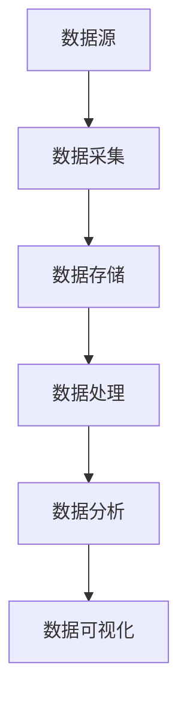

                 

# 智能企业数据湖：构建AI友好的数据基础

> 关键词：智能企业、数据湖、人工智能、数据治理、数据安全

> 摘要：本文将深入探讨智能企业数据湖的构建，分析其重要性，并详细阐述数据湖的构建流程、实践应用以及安全性、合规性与可持续性。通过本文的阅读，读者将了解到如何利用数据湖为智能企业提供强大的数据支持，从而实现业务决策的智能化和优化。

## 第一部分：智能企业数据湖概述

### 1.1 智能企业的兴起

#### 1.1.1 问题背景

随着大数据、云计算、物联网等技术的不断发展，企业面临着前所未有的数据挑战。如何有效地管理和利用这些数据，已经成为企业成功的关键因素。传统的数据处理方式已经难以满足智能企业的需求，因此，智能企业逐渐兴起。

#### 1.1.2 智能企业的定义

智能企业是指通过利用人工智能、大数据、云计算等先进技术，实现企业全业务流程的智能化和自动化，从而提高企业效率和竞争力的企业。

#### 1.1.3 智能企业的发展趋势

- **数字化转型**：越来越多的企业开始将业务流程数字化，实现数据驱动的决策。
- **智能决策**：通过数据分析和机器学习，帮助企业实现智能化的业务决策。
- **自动化运营**：利用自动化技术，减少人力成本，提高运营效率。

### 1.2 数据湖的概念

#### 1.2.1 数据湖的定义

数据湖是一种数据存储和管理架构，用于存储大量结构化和非结构化数据。与传统的数据仓库不同，数据湖保留了原始数据的完整性和灵活性，可以随时进行数据处理和分析。

#### 1.2.2 数据湖与传统数据仓库的区别

- **数据类型**：数据仓库主要存储结构化数据，而数据湖可以存储结构化、半结构化和非结构化数据。
- **数据处理**：数据仓库在数据加载前需要进行预处理，而数据湖则保留了数据的原始形式，便于后续处理。
- **数据灵活性**：数据湖提供了更高的灵活性，支持实时数据处理和分析。

#### 1.2.3 数据湖的优势与挑战

- **优势**：
  - **数据多样性**：可以存储各种类型的数据，包括结构化、半结构化和非结构化数据。
  - **灵活性**：支持实时数据处理和分析。
  - **低成本**：利用分布式存储技术，降低存储成本。
- **挑战**：
  - **数据治理**：需要确保数据的准确性和一致性。
  - **数据安全性**：保护数据不被未授权访问。

### 1.3 智能企业数据湖的重要性

#### 1.3.1 数据湖在智能企业中的应用

数据湖在智能企业中发挥着重要作用，可以用于数据存储、数据处理、数据分析和数据可视化等。

#### 1.3.2 数据湖对人工智能的支撑作用

数据湖提供了丰富的数据资源，为人工智能算法提供了大量的训练数据，从而提高了人工智能的准确性和效率。

#### 1.3.3 数据湖对业务决策的影响

数据湖可以帮助企业实现数据驱动的决策，通过数据分析，为企业提供有价值的信息，从而优化业务流程和提高竞争力。

### 1.4 数据湖的核心概念与架构

#### 1.4.1 数据湖的核心概念

- **数据源**：数据湖的数据来源，包括内部数据源和外部数据源。
- **数据存储**：用于存储数据的分布式存储系统，如Hadoop HDFS、Amazon S3等。
- **数据处理**：包括数据清洗、转换、集成等过程，如Apache Spark、Apache Flink等。
- **数据分析**：包括数据探索、数据挖掘、机器学习等，如Apache Hive、Apache Impala等。

#### 1.4.2 数据湖的架构设计

数据湖的架构设计包括数据采集、数据存储、数据处理、数据分析和数据可视化等模块，如下图所示：

#### 1.4.3 数据湖的技术组件

数据湖的技术组件包括：

- **分布式存储系统**：如Hadoop HDFS、Amazon S3等。
- **数据处理引擎**：如Apache Spark、Apache Flink等。
- **数据分析工具**：如Apache Hive、Apache Impala等。
- **数据可视化工具**：如Tableau、Power BI等。

### 1.5 数据湖的发展趋势与未来展望

#### 1.5.1 数据湖的当前发展状况

数据湖技术已经得到了广泛的应用，许多企业已经开始构建自己的数据湖。

#### 1.5.2 数据湖面临的挑战与机遇

- **挑战**：
  - **数据治理**：如何确保数据的准确性和一致性。
  - **数据安全性**：如何保护数据不被未授权访问。
- **机遇**：
  - **数据多样性**：可以存储各种类型的数据，包括结构化、半结构化和非结构化数据。
  - **灵活性**：支持实时数据处理和分析。

#### 1.5.3 数据湖的未来发展方向

- **数据治理**：提高数据治理能力，确保数据的准确性和一致性。
- **数据安全性**：加强数据安全保护，防止数据泄露。
- **智能化**：利用人工智能技术，实现智能化的数据处理和分析。

### 1.6 本章小结

本文对智能企业数据湖进行了概述，分析了其重要性，并介绍了数据湖的核心概念与架构。在下一部分，我们将深入探讨数据湖的构建与实践，包括数据采集、预处理、存储、治理和架构设计等方面。

----------------------------------------------------------------

## 第二部分：数据湖的构建与实践

### 2.1 数据湖的构建流程

#### 2.1.1 数据湖的规划与设计

构建数据湖的第一步是进行规划与设计。在这个过程中，我们需要确定数据湖的目标、范围、数据类型和数据质量要求等。

- **目标**：明确数据湖的用途，如数据存储、数据处理、数据分析等。
- **范围**：确定数据湖涵盖的数据范围，包括内部数据源和外部数据源。
- **数据类型**：识别数据类型，如结构化、半结构化和非结构化数据。
- **数据质量**：制定数据质量标准，确保数据的准确性、一致性和完整性。

#### 2.1.2 数据采集与预处理

数据采集是数据湖构建的核心环节。我们需要从各种数据源采集数据，包括内部数据源（如数据库、文件系统等）和外部数据源（如API、传感器等）。

- **数据采集策略**：制定数据采集策略，包括数据源选择、数据采集频率和数据采集方式等。
- **数据预处理**：对采集到的数据进行清洗、转换和集成等处理，确保数据的质量和一致性。

#### 2.1.3 数据存储与组织

数据存储与组织是数据湖构建的关键步骤。我们需要选择合适的存储方案，并将数据进行分类、标签化等组织。

- **存储方案**：选择适合数据湖的存储方案，如分布式文件系统、云存储等。
- **数据分类与标签化**：对数据进行分类和标签化，便于后续的数据处理和分析。

#### 2.1.4 数据治理与安全

数据治理与安全是数据湖构建中不可忽视的部分。我们需要制定数据治理策略，确保数据的安全、合规性和可追溯性。

- **数据治理**：制定数据质量、数据安全和数据生命周期管理策略。
- **数据安全**：采用数据加密、访问控制等技术，确保数据的安全。
- **合规性**：遵循相关法规和标准，确保数据的合规性。

### 2.2 数据采集

#### 2.2.1 数据源概述

数据源是数据湖构建的基础。我们需要识别各种数据源，包括内部数据源和外部数据源。

- **内部数据源**：如企业内部数据库、文件系统、传感器等。
- **外部数据源**：如社交媒体、API、第三方数据提供者等。

#### 2.2.2 数据采集策略

数据采集策略是数据湖构建中非常重要的一环。我们需要制定合理的数据采集策略，包括数据源选择、数据采集频率和数据采集方式等。

- **数据源选择**：根据业务需求和数据特性，选择合适的数据源。
- **数据采集频率**：根据业务需求和数据更新速度，确定数据采集频率。
- **数据采集方式**：根据数据源的特性，选择合适的数据采集方式，如实时采集、批量采集等。

#### 2.2.3 数据采集工具

数据采集工具是数据湖构建的重要工具。我们需要选择合适的数据采集工具，如数据采集代理、API网关、ETL工具等。

- **数据采集代理**：用于实时采集网络数据，如HTTP代理、HTTPS代理等。
- **API网关**：用于统一管理和分发API，如Kong、Apache APISIX等。
- **ETL工具**：用于批量采集和转换数据，如Apache NiFi、Apache Kafka等。

### 2.3 数据预处理

#### 2.3.1 数据清洗

数据清洗是数据预处理的重要环节。我们需要识别和处理数据中的错误、异常和缺失值等。

- **错误处理**：识别和处理数据中的错误，如数据格式错误、逻辑错误等。
- **异常处理**：识别和处理数据中的异常值，如异常分布、异常模式等。
- **缺失值处理**：识别和处理数据中的缺失值，如插补、删除等。

#### 2.3.2 数据转换

数据转换是数据预处理的关键步骤。我们需要将数据转换为统一格式，便于后续的数据处理和分析。

- **数据格式转换**：将不同格式的数据转换为统一格式，如CSV、JSON、XML等。
- **数据类型转换**：将不同类型的数据转换为同一类型，如将字符串转换为数值型、日期型等。
- **数据规范化**：对数据进行规范化处理，如去重、归一化等。

#### 2.3.3 数据集成

数据集成是将来自不同数据源的数据进行整合，形成一个统一的数据视图。

- **数据源整合**：将来自不同数据源的数据进行整合，形成一个统一的数据视图。
- **数据质量检查**：对整合后的数据进行质量检查，确保数据的准确性、一致性和完整性。
- **数据清洗与转换**：对整合后的数据进行清洗和转换，确保数据的质量和一致性。

### 2.4 数据存储

#### 2.4.1 数据存储方案

数据存储方案是数据湖构建的核心。我们需要选择合适的存储方案，以满足数据存储的需求。

- **分布式文件系统**：如Hadoop HDFS、Amazon S3等，适用于大规模数据存储。
- **云存储**：如阿里云OSS、腾讯云COS等，适用于数据备份和共享。
- **关系型数据库**：如MySQL、PostgreSQL等，适用于结构化数据存储。
- **NoSQL数据库**：如MongoDB、Cassandra等，适用于半结构化和非结构化数据存储。

#### 2.4.2 分布式文件系统

分布式文件系统是数据湖存储的核心技术。它具有高可用性、高性能、高扩展性等特点。

- **Hadoop HDFS**：Hadoop分布式文件系统，适用于大规模数据存储和处理。
- **Amazon S3**：Amazon S3是一种对象存储服务，适用于数据备份和共享。

#### 2.4.3 数据存储引擎

数据存储引擎是数据湖存储的核心。我们需要选择合适的数据存储引擎，以满足不同类型数据的需求。

- **关系型数据库存储引擎**：如InnoDB、MyISAM等，适用于结构化数据存储。
- **NoSQL数据库存储引擎**：如MongoDB的BSON、Cassandra的CassandraDB等，适用于半结构化和非结构化数据存储。

### 2.5 数据治理

#### 2.5.1 数据质量管理

数据质量管理是数据湖构建中不可或缺的部分。我们需要制定数据质量管理策略，确保数据的质量和一致性。

- **数据质量检查**：对数据进行质量检查，如数据完整性、一致性、准确性等。
- **数据清洗**：对数据进行清洗，如错误处理、异常处理、缺失值处理等。
- **数据监控**：对数据进行监控，及时发现和处理数据质量问题。

#### 2.5.2 数据安全与隐私

数据安全与隐私是数据湖构建中需要高度重视的部分。我们需要制定数据安全与隐私策略，确保数据的安全和隐私。

- **数据加密**：对数据进行加密，确保数据在传输和存储过程中的安全性。
- **访问控制**：对数据的访问进行控制，确保数据只能被授权用户访问。
- **隐私保护**：对个人敏感信息进行保护，如匿名化、去标识化等。

#### 2.5.3 数据合规性与法规遵循

数据合规性与法规遵循是数据湖构建中需要严格遵守的部分。我们需要遵循相关法规和标准，确保数据的合规性。

- **法规遵循**：遵循相关法规，如《数据安全法》、《个人信息保护法》等。
- **标准遵循**：遵循相关标准，如ISO/IEC 27001、GDPR等。

### 2.6 数据湖架构设计与实现

#### 2.6.1 数据湖架构设计原则

数据湖架构设计需要遵循以下原则：

- **模块化**：将数据湖的功能模块化，便于维护和扩展。
- **可扩展性**：支持数据量的增长，适应业务需求的变化。
- **灵活性**：支持多种数据类型和数据处理方式。
- **安全性**：确保数据的安全性和隐私性。

#### 2.6.2 数据湖架构实施步骤

数据湖架构实施可以分为以下步骤：

1. **需求分析**：明确业务需求和数据需求。
2. **架构设计**：设计数据湖的架构，包括数据采集、数据存储、数据处理、数据分析和数据可视化等模块。
3. **组件选择**：选择合适的技术组件，如分布式文件系统、数据处理引擎、数据分析工具等。
4. **实施部署**：实施数据湖的部署，包括硬件配置、软件安装、系统配置等。
5. **测试与优化**：对数据湖进行测试和优化，确保其稳定性和性能。

#### 2.6.3 数据湖架构案例分析

以下是一个数据湖架构的案例分析：

- **业务场景**：一家电子商务公司需要构建一个数据湖，用于存储和

