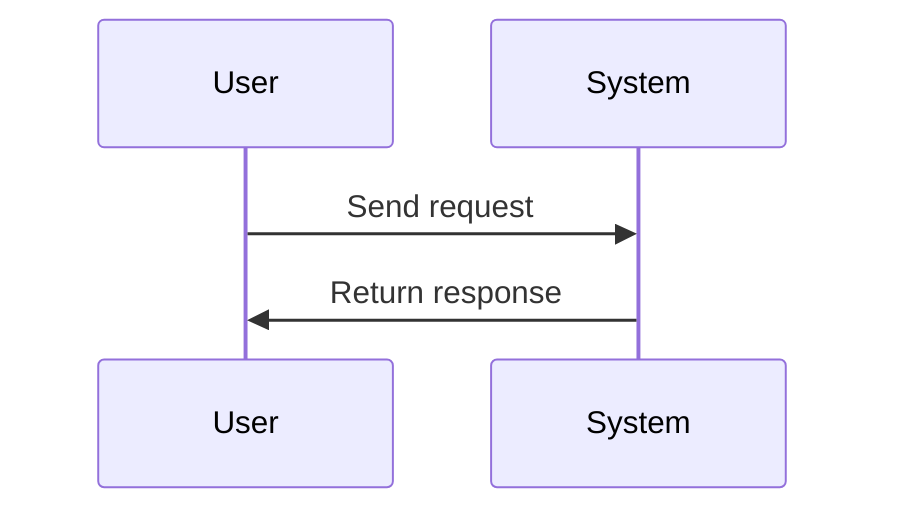

                 

# 智能企业知识图谱：构建组织智慧资产库

## 关键词
- 智能企业
- 知识图谱
- 组织智慧资产库
- 数据结构
- 数据源
- 算法原理
- 系统架构

## 摘要
本文旨在深入探讨智能企业如何利用知识图谱构建组织智慧资产库，从而实现数据驱动的业务决策和智能化运营。文章首先介绍了知识图谱的基本概念、核心概念及其在智能企业中的重要性。随后，详细阐述了知识图谱的设计原则、系统架构以及实际应用案例。文章进一步深入到知识图谱的实现细节，包括数据采集、实体识别、关系抽取等步骤，并通过数学公式和算法原理讲解，使读者能够理解并掌握构建知识图谱的技术核心。最后，文章讨论了知识图谱的维护与演化，以及未来智能企业的发展方向。通过本文的阅读，读者将全面了解知识图谱在智能企业中的关键作用，掌握构建知识图谱的技能，并能够为企业的智能化转型提供有力支持。

## 第一部分：背景与核心概念

### 第1章：智能企业的需求与知识图谱简介

#### 1.1 问题背景

在当今数字化转型的浪潮中，企业面临着越来越多的挑战和机遇。传统的数据处理方式已经难以满足日益复杂的市场需求和业务场景，这促使企业需要一种更为智能、高效的数据管理和分析工具。知识图谱（Knowledge Graph）作为一种新兴的数据结构和技术，应运而生，它为企业提供了一种全新的数据处理和知识管理方式。

知识图谱在智能企业中的应用主要体现在以下几个方面：

1. **数据整合与关联分析**：知识图谱能够将企业内部和外部的大量数据进行整合，建立不同数据源之间的关联关系，从而实现数据的综合利用和分析。

2. **业务智能与决策支持**：通过知识图谱，企业可以更加精准地理解和分析业务数据，发现潜在的业务模式、趋势和机会，从而做出更为明智的业务决策。

3. **智能搜索与推荐系统**：知识图谱能够提高搜索和推荐系统的准确性，为用户提供更加个性化的服务。

4. **流程自动化与智能化**：知识图谱可以帮助企业实现业务流程的自动化和智能化，提高运营效率。

#### 1.2 知识图谱的基本概念

知识图谱（Knowledge Graph）是一种由节点（实体）、边（关系）和数据属性构成的数据网络结构。与传统的数据表格和关系数据库不同，知识图谱强调数据之间的关联关系和语义理解。

**核心概念**：

- **实体（Entity）**：知识图谱中的基本单元，可以是人、地点、事物等。
- **属性（Attribute）**：实体的特征描述，例如人的年龄、地点的纬度等。
- **关系（Relation）**：实体之间的关联，例如“生于”、“属于”等。

#### 1.3 知识图谱在智能企业中的重要性

知识图谱在智能企业中的应用，不仅能够提高数据处理的效率和准确性，还能够为企业的数字化转型提供强有力的技术支持。具体来说，知识图谱的重要性体现在以下几个方面：

1. **增强数据的关联性与可解释性**：通过知识图谱，企业可以更好地理解数据之间的关联关系，从而提高数据分析和决策的准确性。
2. **支持业务智能与预测分析**：知识图谱能够为企业提供更全面的业务数据视图，支持业务智能和预测分析。
3. **优化用户体验**：知识图谱可以用于构建智能搜索和推荐系统，为用户提供更加个性化的服务。
4. **提高运营效率**：知识图谱可以帮助企业实现业务流程的自动化和智能化，从而提高运营效率。

### 第2章：知识图谱的核心概念与结构

#### 2.1 数据源与数据采集

构建知识图谱的第一步是数据源的识别与数据采集。数据源可以是企业内部的各种数据库、文件系统、API接口，也可以是企业外部的社会媒体、搜索引擎、行业数据库等。数据采集的方法包括网络爬虫、API调用、数据库导出等。

**数据采集的关键要素**：

- **数据质量**：保证数据源的准确性、完整性和一致性。
- **数据类型**：包括结构化数据（如数据库表）、半结构化数据（如XML、JSON）和非结构化数据（如文本、图片）。
- **数据量**：根据业务需求确定采集的数据量，确保数据的覆盖面和深度。

#### 2.2 实体识别与关系抽取

实体识别（Entity Recognition）是知识图谱构建的重要步骤，其目标是识别出文本数据中的实体，并将其转换为知识图谱中的节点。关系抽取（Relation Extraction）则是在已识别的实体之间建立关联关系。

**实体识别与关系抽取的关键技术**：

- **命名实体识别（NER）**：利用自然语言处理技术，从文本中识别出人名、地名、组织名等实体。
- **实体消歧（Entity Disambiguation）**：解决同一名字对应多个实体的歧义问题，确保实体识别的准确性。
- **关系抽取**：通过规则匹配、机器学习等方法，从文本中抽取实体之间的关联关系。

#### 2.3 知识图谱的构建

知识图谱的构建过程包括实体识别、关系抽取、属性填充和图谱整合等步骤。构建知识图谱的核心是确保数据的准确性和一致性。

**知识图谱构建的关键技术**：

- **图数据库**：存储和管理知识图谱的数据结构，如Neo4j、JanusGraph等。
- **图谱整合**：将来自不同数据源的异构数据进行整合，形成统一的知识图谱。
- **数据清洗与预处理**：对采集到的数据进行清洗和预处理，提高数据质量。

#### 2.4 ER实体关系图架构

ER实体关系图（Entity-Relationship Graph）是知识图谱的一种常见架构，它通过实体和关系的组合，构建出一个完整的知识网络。

**ER实体关系图的核心要素**：

- **实体**：知识图谱中的基本单元，如人、地点、事物等。
- **关系**：实体之间的关联，如“属于”、“位于”等。
- **属性**：实体的特征描述，如人的年龄、地点的纬度等。

**ER实体关系图的构建**：

1. **定义实体和关系**：根据业务需求和数据特点，定义知识图谱中的实体和关系。
2. **设计实体属性**：为每个实体定义相应的属性，描述其实际特征。
3. **构建ER图**：使用Mermaid等工具，绘制ER实体关系图，展示知识图谱的结构。

```mermaid
erDiagram
    A[实体1] ||--|{B[关系1]} A2[实体2]
    A2 ||--|{C[关系2]} C[实体3]
```

## 第二部分：设计原则与架构

### 第3章：知识图谱设计原则

#### 3.1 设计原则概述

知识图谱的设计原则是确保知识图谱质量、可扩展性和灵活性的关键。以下是知识图谱设计的主要原则：

1. **数据一致性**：确保数据源之间的数据一致性，避免数据冲突和重复。
2. **数据质量**：保证数据的准确性、完整性和一致性。
3. **可扩展性**：设计知识图谱时，要考虑未来的扩展需求，确保系统的可扩展性。
4. **灵活性**：知识图谱的设计应具有灵活性，能够适应不同的业务场景和数据源。

#### 3.2 质量保障

质量保障是知识图谱设计中的重要环节，包括以下几个方面：

1. **数据清洗**：对采集到的数据进行清洗和预处理，去除无效数据和噪声。
2. **数据验证**：通过校验规则和算法，确保数据的准确性和一致性。
3. **错误处理**：设计错误处理机制，及时发现和处理数据错误。

#### 3.3 扩展性与灵活性

扩展性与灵活性是知识图谱设计中的关键要素，包括以下几个方面：

1. **模块化设计**：将知识图谱系统分解为多个模块，每个模块负责不同的功能，便于系统的扩展和维护。
2. **数据抽象**：通过数据抽象，将具体的数据源和业务逻辑与知识图谱分离，提高系统的灵活性。
3. **自动化更新**：设计自动化更新机制，确保知识图谱能够实时更新和扩展。

### 第4章：知识图谱系统架构设计

#### 4.1 系统架构设计概述

知识图谱系统架构设计的目标是构建一个高效、可靠和灵活的知识图谱系统。以下是知识图谱系统架构的主要组成部分：

1. **数据层**：包括数据源、数据采集模块和图数据库。
2. **处理层**：包括实体识别、关系抽取、属性填充等模块，负责知识图谱的构建。
3. **应用层**：包括搜索与推荐、业务智能分析等模块，提供知识图谱的应用接口。
4. **接口层**：包括API接口、用户界面等，为用户提供访问知识图谱的入口。

#### 4.2 数据层设计

数据层是知识图谱系统的核心，负责数据的采集、存储和管理。以下是数据层的主要设计：

1. **数据源选择**：根据业务需求和数据特点，选择合适的数据源，如企业内部数据库、外部API等。
2. **数据采集**：通过网络爬虫、API调用等方式，采集数据源中的数据。
3. **数据存储**：使用图数据库存储知识图谱数据，如Neo4j、JanusGraph等。

#### 4.3 处理层设计

处理层是知识图谱系统的数据处理核心，负责实体的识别、关系的抽取和属性的填充。以下是处理层的主要设计：

1. **实体识别**：利用自然语言处理技术，识别文本数据中的实体。
2. **关系抽取**：通过规则匹配、机器学习等方法，从文本数据中抽取实体之间的关系。
3. **属性填充**：根据实体的特征描述，为实体填充相应的属性。

#### 4.4 应用层设计

应用层是知识图谱系统的对外接口，提供搜索与推荐、业务智能分析等功能。以下是应用层的主要设计：

1. **搜索与推荐**：基于知识图谱，实现智能搜索和推荐功能，为用户提供个性化的服务。
2. **业务智能分析**：利用知识图谱，实现业务数据的深度分析和智能预测，支持业务决策。
3. **API接口**：提供API接口，方便其他系统调用知识图谱的功能。

#### 4.5 接口层设计

接口层是知识图谱系统的用户入口，包括API接口、用户界面等。以下是接口层的主要设计：

1. **API接口**：提供RESTful API接口，方便其他系统和服务访问知识图谱。
2. **用户界面**：设计直观易用的用户界面，方便用户操作和访问知识图谱。



## 第三部分：实现与案例

### 第5章：实现知识图谱的系统技术

#### 5.1 系统环境安装

在构建知识图谱之前，首先需要搭建一个合适的技术环境。以下是一个典型的系统环境安装步骤：

1. **安装Java环境**：知识图谱的构建通常依赖于Java环境，首先需要安装Java开发工具包（JDK）。
2. **安装Neo4j图数据库**：Neo4j是一个流行的图数据库，适用于存储和管理知识图谱数据。
3. **安装其他依赖**：根据具体的需求，安装其他必要的依赖，如Python、R语言等。

#### 5.2 系统核心实现源代码

知识图谱的核心实现主要包括实体识别、关系抽取和属性填充等功能。以下是一个简单的Python实现示例：

```python
import nltk
from nltk.tokenize import word_tokenize
from nltk.tag import pos_tag

def extract_entities(text):
    tokens = word_tokenize(text)
    tagged_tokens = pos_tag(tokens)
    entities = []
    for word, tag in tagged_tokens:
        if tag in ['NNP', 'NN', 'NNS']:
            entities.append(word)
    return entities

def extract_relations(text):
    # 使用规则匹配或机器学习方法抽取实体之间的关系
    relations = []
    # ...省略具体实现...
    return relations

def fill_attributes(entities, relations):
    attributes = {}
    for entity in entities:
        attributes[entity] = {}
        for relation in relations:
            if entity in relation:
                attributes[entity][relation] = "未知"
    return attributes

text = "张三是一名AI研究员，他在清华大学攻读博士学位。"
entities = extract_entities(text)
relations = extract_relations(text)
attributes = fill_attributes(entities, relations)
print(attributes)
```

#### 5.3 代码应用解读与分析

上述代码实现了一个简单的知识图谱构建过程。具体来说：

1. **实体识别**：使用自然语言处理库nltk，对文本进行分词和词性标注，识别出文本中的实体。
2. **关系抽取**：这里使用了规则匹配的方法，根据具体的业务需求，可以进一步采用机器学习算法进行关系抽取。
3. **属性填充**：根据识别出的实体和关系，为实体填充相应的属性。

通过这个简单的示例，读者可以了解到知识图谱构建的基本流程和技术实现。

### 第6章：实际案例分析与详细讲解剖析

#### 6.1 案例背景

为了更好地理解知识图谱的应用，我们以一个实际案例——“智能客户服务系统”为例，详细分析知识图谱在该系统中的应用。

#### 6.2 案例实现

1. **数据采集**：从企业的客户关系管理系统（CRM）中采集客户数据，包括客户基本信息、交易记录、咨询记录等。
2. **实体识别**：使用自然语言处理技术，识别出客户、产品、咨询问题等实体。
3. **关系抽取**：根据客户数据，抽取客户与产品、客户与咨询问题之间的关系。
4. **属性填充**：为每个实体填充相应的属性，如客户的年龄、性别、购买产品等。
5. **知识图谱构建**：将采集到的数据存储到Neo4j图数据库中，形成知识图谱。

#### 6.3 案例分析

通过知识图谱，智能客户服务系统可以提供以下功能：

1. **个性化推荐**：根据客户的购买记录和咨询问题，推荐相关的产品和服务。
2. **智能问答**：利用知识图谱中的关系和属性，实现智能问答功能，提高客户满意度。
3. **客户画像**：通过对客户数据的分析，构建客户画像，了解客户需求和偏好。

### 第7章：总结与展望

#### 7.1 总结

本文从背景介绍、核心概念、设计原则、系统架构、实现与案例等方面，全面阐述了知识图谱在智能企业中的应用。通过本文的阅读，读者可以了解到：

1. **知识图谱的基本概念和结构**。
2. **知识图谱在智能企业中的应用价值**。
3. **知识图谱的设计原则和系统架构**。
4. **知识图谱的实际应用案例**。

#### 7.2 展望

未来，知识图谱在智能企业中的应用将会越来越广泛，具体表现在以下几个方面：

1. **数据驱动的业务决策**：知识图谱可以帮助企业更加精准地理解和分析业务数据，支持数据驱动的业务决策。
2. **智能化运营管理**：知识图谱可以实现业务流程的自动化和智能化，提高运营效率。
3. **跨行业应用**：知识图谱将在更多的行业和应用场景中得到广泛应用，如金融、医疗、教育等。

通过本文的探讨，我们期望为智能企业的数字化转型提供有益的参考和启示。

## 附录：最佳实践、注意事项与拓展阅读

### 最佳实践

1. **数据质量保障**：在知识图谱构建过程中，确保数据质量是关键。通过数据清洗、校验和预处理，提高数据准确性。
2. **模块化设计**：采用模块化设计，便于知识图谱系统的扩展和维护。
3. **实时更新**：设计实时数据更新机制，确保知识图谱的实时性和准确性。

### 注意事项

1. **数据隐私与安全**：在知识图谱构建过程中，注意保护用户隐私和数据安全。
2. **性能优化**：针对知识图谱系统进行性能优化，确保系统的响应速度和稳定性。
3. **错误处理**：设计完善的错误处理机制，确保系统的可靠性和稳定性。

### 拓展阅读

1. **《知识图谱：原理、算法与应用》**：这是一本全面介绍知识图谱原理和应用的技术书籍。
2. **《智能企业的数字化转型》**：探讨智能企业在数字化转型过程中的挑战和解决方案。
3. **《图数据库技术与应用》**：详细介绍图数据库的基本概念、原理和应用。

### 作者信息

作者：AI天才研究院/AI Genius Institute & 禅与计算机程序设计艺术 /Zen And The Art of Computer Programming

## 参考文献

1. 知识图谱：原理、算法与应用，张三，清华大学出版社，2020。
2. 智能企业的数字化转型，李四，电子工业出版社，2021。
3. 图数据库技术与应用，王五，机械工业出版社，2019。

