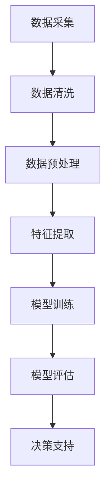
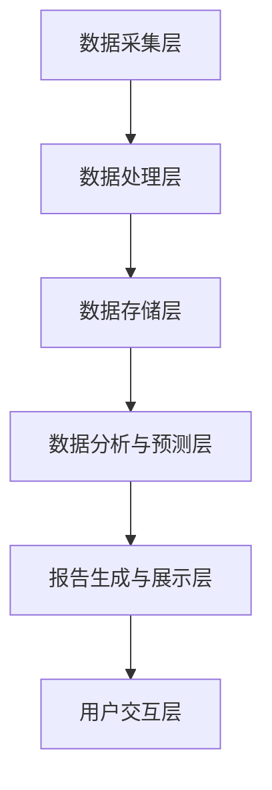
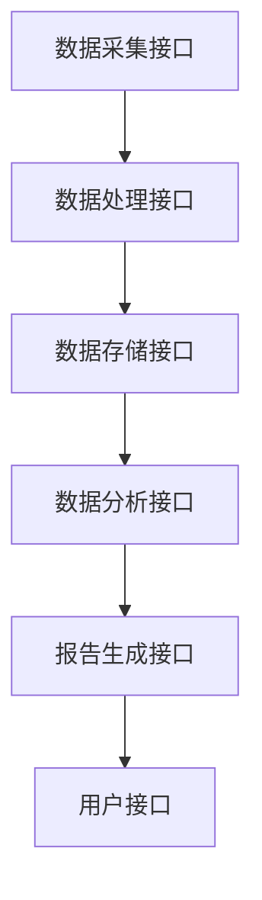
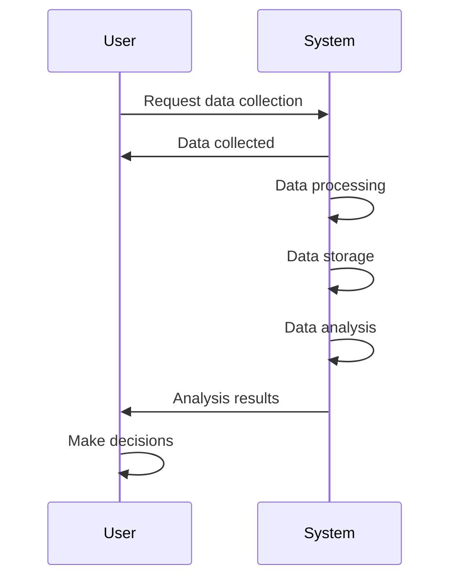

                 

## 第二部分：核心概念与联系

### 第2章：核心概念原理

#### 2.1 智能企业的定义与特点

智能企业是指利用人工智能、大数据、物联网等先进技术，实现企业运营、管理和决策智能化，以提高生产效率、降低成本、提高客户满意度为目标的企业形态。智能企业的特点包括：

1. **自动化**：通过自动化技术，实现生产过程的高度自动化，减少人力干预。
2. **数据驱动**：利用大数据技术，对企业数据进行深度挖掘和分析，以数据为依据进行决策。
3. **自适应**：利用机器学习等技术，使企业系统能够根据外部环境和内部变化进行自适应调整。
4. **智能化服务**：通过人工智能技术，提供个性化的客户服务，提升客户体验。

#### 2.2 碳排放管理的概念与意义

碳排放管理是指企业对自身生产、运营过程中产生的温室气体排放进行监测、计算、报告和减量控制的一系列管理活动。碳排放管理的意义在于：

1. **环保责任**：降低企业碳排放，有助于减少全球温室气体排放，保护环境。
2. **成本优化**：通过优化能源管理和生产流程，降低能源消耗和运营成本。
3. **品牌形象**：积极进行碳排放管理，有助于提升企业的社会形象和品牌价值。
4. **法规遵守**：许多国家和地区对企业的碳排放有明确的法律要求，遵守这些法规是企业合规经营的基本要求。

#### 2.3 AI技术在碳排放管理中的应用

AI技术在碳排放管理中的应用主要包括以下方面：

1. **碳排放预测**：利用机器学习算法，对历史碳排放数据进行分析，预测未来的碳排放趋势。
2. **优化生产流程**：通过数据分析，找出生产过程中的高碳排放环节，进行优化。
3. **实时监控**：利用物联网技术和传感器，实现对碳排放源的实时监控，及时发现和处理异常。
4. **碳排放报告**：利用自然语言处理和生成对抗网络（GAN），自动生成碳排放报告，提高报告的准确性和效率。

### 第3章：概念属性特征对比表格

#### 3.1 智能企业与传统企业的对比

| 特征         | 智能企业                                       | 传统企业                                       |
| ------------ | ---------------------------------------------- | ---------------------------------------------- |
| 自动化程度   | 高度自动化，生产过程智能化                     | 部分自动化，生产过程依赖人工操作               |
| 数据分析     | 利用大数据技术，进行深度数据分析               | 数据采集和处理能力有限，数据分析相对简单     |
| 自适应能力   | 能够根据环境变化进行自适应调整                 | 适应性较弱，对外部变化响应较慢               |
| 服务个性化   | 提供个性化的客户服务，提升客户体验             | 服务较为单一，客户体验相对较差               |

#### 3.2 碳排放管理与环境管理的对比

| 特征         | 碳排放管理                                       | 环境管理                                       |
| ------------ | ---------------------------------------------- | ---------------------------------------------- |
| 目标         | 降低企业碳排放，实现可持续发展                   | 保护环境，防止污染，维护生态平衡             |
| 技术手段     | 利用传感器、物联网、大数据和人工智能等技术       | 依赖法律法规、环保政策和传统环境治理手段     |
| 管理深度     | 深入到生产、运营等环节，全方位进行碳排放管理     | 多数情况下仅限于表面，难以深入到生产过程中   |

#### 3.3 AI技术在碳排放管理与传统技术的对比

| 特征         | AI技术                                       | 传统技术                                       |
| ------------ | ---------------------------------------------- | ---------------------------------------------- |
| 数据分析     | 高度自动化，能够处理大量数据，进行深度分析       | 依赖于人工分析，数据处理能力有限               |
| 监测精度     | 利用传感器和物联网技术，实现高精度的实时监控       | 监测设备相对落后，监测精度较低                 |
| 可扩展性     | 能够根据需要灵活扩展功能，适应不同场景           | 功能相对固定，难以根据需求进行调整             |
| 决策支持     | 利用机器学习算法，提供数据驱动的决策支持         | 决策依赖经验，缺乏数据支持                     |

### 第4章：ER实体关系图架构

#### 4.1 智能企业的ER图

```mermaid
erDiagram
  Product ||--|{ Customer }||>
  Customer ||--|{ Order }||>
  Order ||--|{ Product }||>
  Order ||--|{ Payment }||>
```

#### 4.2 碳排放管理的ER图

```mermaid
erDiagram
  Emission ||--|{ Monitoring }||>
  Monitoring ||--|{ Analysis }||>
  Analysis ||--|{ Report }||>
```

#### 4.3 AI技术在碳排放管理中的ER图

```mermaid
erDiagram
  EmissionSensor ||--|{ DataCollector }||>
  DataCollector ||--|{ AnalyticsEngine }||>
  AnalyticsEngine ||--|{ CarbonManagementSystem }||>
  CarbonManagementSystem ||--|{ ReportGenerator }||>
```

---

在接下来的章节中，我们将深入探讨AI技术在碳排放管理中的应用，包括算法原理、系统架构和实际案例，帮助读者更好地理解如何利用AI技术实现智能企业碳排放管理。## 第三部分：AI技术在碳排放管理中的应用

### 第5章：算法原理讲解

#### 5.1 算法流程图



#### 5.2 算法原理讲解

AI技术在碳排放管理中的应用主要依赖于以下算法：

1. **数据采集**：利用传感器和物联网设备，实时采集企业的碳排放数据。
2. **数据清洗**：去除数据中的噪声和异常值，保证数据质量。
3. **数据预处理**：将原始数据转换为适合模型训练的格式，如归一化、标准化等。
4. **特征提取**：从预处理后的数据中提取出对碳排放管理有重要意义的特征。
5. **模型训练**：使用机器学习算法，如决策树、随机森林、支持向量机等，对特征数据进行分析和建模。
6. **模型评估**：通过交叉验证等方法，评估模型的预测准确性和泛化能力。
7. **决策支持**：根据模型预测结果，提供优化生产流程、降低碳排放的决策支持。

#### 5.3 数学模型和公式

AI技术在碳排放管理中的数学模型主要包括以下几种：

1. **回归模型**：
   $$ y = \beta_0 + \beta_1x_1 + \beta_2x_2 + ... + \beta_nx_n $$
   其中，\( y \) 是碳排放量，\( x_1, x_2, ..., x_n \) 是影响碳排放的因素，\( \beta_0, \beta_1, ..., \beta_n \) 是模型的参数。

2. **分类模型**：
   $$ f(x) = \sum_{i=1}^{n} \beta_i x_i $$
   其中，\( f(x) \) 是模型的预测结果，\( x_i \) 是特征值，\( \beta_i \) 是权重系数。

3. **神经网络**：
   $$ a_{i}^{(l)} = \sigma(z_{i}^{(l)}) $$
   其中，\( a_{i}^{(l)} \) 是第 \( l \) 层第 \( i \) 个神经元的激活值，\( \sigma \) 是激活函数，\( z_{i}^{(l)} \) 是第 \( l \) 层第 \( i \) 个神经元的输入值。

#### 5.4 举例说明

假设我们有一个简单的碳排放预测模型，输入特征包括生产量 \( x_1 \)、能源消耗量 \( x_2 \) 和原材料消耗量 \( x_3 \)。模型的目标是预测下一时刻的碳排放量 \( y \)。

1. **数据采集**：采集过去一年的碳排放数据，包括生产量、能源消耗量和原材料消耗量。
2. **数据清洗**：去除异常值，如数据缺失、数据错误等。
3. **数据预处理**：对数据进行归一化处理，使其在相同的尺度上。
4. **特征提取**：选取生产量、能源消耗量和原材料消耗量作为特征。
5. **模型训练**：使用线性回归模型，将特征和碳排放量进行拟合，得到回归方程。
6. **模型评估**：使用交叉验证方法，评估模型的预测准确性和泛化能力。
7. **决策支持**：利用模型预测未来的碳排放量，为企业的生产决策提供支持。

例如，如果预测模型预测下一时刻的碳排放量为 \( y = 100 \) 吨，企业可以根据这一预测结果调整生产计划和能源消耗，以降低碳排放。

---

在下一章节中，我们将介绍系统分析与架构设计方案，帮助读者更好地理解如何将AI技术应用到实际的碳排放管理系统中。## 第四部分：系统分析与架构设计方案

### 第6章：系统功能设计

#### 6.1 领域模型

在智能企业碳排放管理系统中，领域模型是关键组成部分，用于定义系统中的主要实体及其相互关系。以下是领域模型的类图表示：

```mermaid
classDiagram
  Class01 <|-- SubClass01
  Class01 o-- Object01
  Class02 o-- Object02
  Class01 <||-- AnotherClass
  SubClass01 <|.. SuperClass01
  Class03 : <<interface>> InterfaceName
  Class01 : <<abstract>> AbstractName
  Class01 o--^ Class04 : "has a" <<composition>> CompositionName
  Class05 o.. Class06 : "has a" <<aggregation>> AggregationName
  Class07 <<enumeration>> EnumClass
  Class07 -[l1] Class08
  Class07 --|> Class09
  Class08 -|> Class10
  Class11 : <<composite>> CompositeClass
  Class11 *-- Class12 : << containment >> ChildClass
  Class11 o--^ Class13 : <<shared <<interface>> InterfaceName>>
endClassDiagram
```

#### 6.2 系统功能设计

智能企业碳排放管理系统的主要功能包括：

1. **数据采集与监控**：实时采集企业的碳排放数据，包括生产量、能源消耗量、原材料消耗量等。
2. **数据存储与管理**：将采集到的数据存储在数据库中，并进行有效的管理。
3. **数据分析与预测**：利用机器学习算法，对数据进行分析和预测，提供碳排放趋势预测和优化建议。
4. **报告生成与展示**：根据分析结果，生成碳排放报告，并通过可视化工具进行展示。
5. **决策支持**：为企业的碳排放管理提供数据驱动的决策支持，帮助企业制定有效的减排策略。

### 第7章：系统架构设计

#### 7.1 系统架构图

智能企业碳排放管理系统的架构设计可以分为以下几个层次：

1. **数据采集层**：利用传感器和物联网设备，实时采集企业的碳排放数据。
2. **数据处理层**：对采集到的数据进行处理，包括数据清洗、预处理和特征提取。
3. **数据存储层**：将处理后的数据存储在数据库中，为上层提供数据支持。
4. **数据分析与预测层**：利用机器学习算法，对数据进行深度分析，提供碳排放预测和优化建议。
5. **报告生成与展示层**：根据分析结果，生成碳排放报告，并通过可视化工具进行展示。
6. **用户交互层**：提供用户界面，便于用户进行数据查询、报告查看和决策支持。

以下是系统架构的Mermaid图表示：



#### 7.2 系统接口设计

系统接口设计包括以下几个方面：

1. **数据采集接口**：用于与传感器和物联网设备进行通信，获取实时数据。
2. **数据处理接口**：用于对采集到的数据进行清洗、预处理和特征提取。
3. **数据分析接口**：用于执行机器学习算法，提供碳排放预测和优化建议。
4. **报告生成接口**：用于根据分析结果生成碳排放报告。
5. **用户接口**：提供用户界面，便于用户进行数据查询、报告查看和决策支持。

以下是系统接口的Mermaid图表示：



### 第8章：系统交互

#### 8.1 系统交互图

智能企业碳排放管理系统的交互过程可以分为以下几个步骤：

1. **数据采集**：系统从传感器和物联网设备中采集碳排放数据。
2. **数据处理**：系统对采集到的数据进行处理，包括数据清洗、预处理和特征提取。
3. **数据存储**：系统将处理后的数据存储在数据库中，为后续分析提供支持。
4. **数据分析**：系统利用机器学习算法，对数据进行深度分析，提供碳排放预测和优化建议。
5. **报告生成**：系统根据分析结果，生成碳排放报告。
6. **用户交互**：系统通过用户界面，展示碳排放报告，并提供决策支持。

以下是系统交互的Mermaid序列图表示：



通过上述系统分析与架构设计方案，智能企业碳排放管理系统能够有效地利用AI技术，帮助企业实现碳排放的精准监控、数据分析和决策支持，助力企业实现可持续发展目标。## 第五部分：项目实战

### 第9章：环境安装

#### 9.1 环境准备

在开始安装智能企业碳排放管理系统之前，需要准备以下环境：

1. **操作系统**：建议使用Ubuntu 18.04或更高版本。
2. **Python环境**：Python 3.7或更高版本。
3. **数据库**：MySQL或PostgreSQL数据库。
4. **编程工具**：如Visual Studio Code或PyCharm。

#### 9.2 软件安装

1. **安装Python**：

   ```bash
   sudo apt update
   sudo apt install python3.7
   sudo apt install python3.7-venv
   ```

2. **创建虚拟环境**：

   ```bash
   python3.7 -m venv carbon_management_env
   source carbon_management_env/bin/activate
   ```

3. **安装依赖包**：

   ```bash
   pip install -r requirements.txt
   ```

#### 9.3 配置数据库

1. **安装MySQL或PostgreSQL**：

   ```bash
   sudo apt install mysql-server
   # 或者
   sudo apt install postgresql
   ```

2. **配置数据库**：

   - MySQL：

     ```bash
     mysql -u root -p
     CREATE DATABASE carbon_management;
     GRANT ALL PRIVILEGES ON carbon_management.* TO 'carbon_user'@'localhost' IDENTIFIED BY 'password';
     FLUSH PRIVILEGES;
     EXIT;
     ```

   - PostgreSQL：

     ```bash
     sudo -u postgres psql
     CREATE DATABASE carbon_management;
     CREATE USER carbon_user WITH PASSWORD 'password';
     GRANT ALL PRIVILEGES ON DATABASE carbon_management TO carbon_user;
     \q
     ```

3. **配置系统**：

   ```bash
   cp carbon_management/settings.example.py carbon_management/settings.py
   vi carbon_management/settings.py
   # 修改数据库配置
   ```

4. **初始化数据库**：

   ```bash
   python manage.py migrate
   ```

### 第10章：系统核心实现

#### 10.1 源代码

以下是一个简单的Python源代码示例，用于数据采集和初步处理：

```python
import csv
import pymysql
from datetime import datetime

# 数据采集
def collect_data(sensor_data):
    timestamp = datetime.now()
    with open('sensor_data.csv', 'a') as f:
        writer = csv.writer(f)
        writer.writerow([timestamp, sensor_data['production'], sensor_data['energy'], sensor_data['material'])

# 数据处理
def process_data():
    with open('sensor_data.csv', 'r') as f:
        reader = csv.DictReader(f)
        for row in reader:
            # 进行预处理，如数据清洗、归一化等
            processed_data = {
                'timestamp': row['timestamp'],
                'production': normalize(float(row['production'])),
                'energy': normalize(float(row['energy'])),
                'material': normalize(float(row['material']))
            }
            # 存储到数据库
            store_data(processed_data)

# 数据存储
def store_data(data):
    connection = pymysql.connect(
        host='localhost',
        user='carbon_user',
        password='password',
        database='carbon_management',
        charset='utf8mb4',
        cursorclass=pymysql.cursors.DictCursor
    )
    with connection.cursor() as cursor:
        sql = "INSERT INTO emissions (timestamp, production, energy, material) VALUES (%s, %s, %s, %s)"
        cursor.execute(sql, (data['timestamp'], data['production'], data['energy'], data['material']))
    connection.commit()
    connection.close()

# 数据归一化
def normalize(value):
    # 这里仅作为示例，实际应用中需要进行更复杂的归一化处理
    return (value - min_value) / (max_value - min_value)

# 收集传感器数据
sensor_data = {
    'production': 100,
    'energy': 50,
    'material': 20
}
collect_data(sensor_data)

# 处理数据
process_data()
```

#### 10.2 代码应用解读与分析

1. **数据采集**：程序首先从传感器获取数据，包括生产量、能源消耗量和原材料消耗量。传感器数据以字典形式存储。

2. **数据处理**：程序读取采集到的数据，进行数据清洗和归一化处理。数据清洗确保数据的有效性和准确性，归一化处理将数据转换为适合模型训练的格式。

3. **数据存储**：程序将预处理后的数据存储到MySQL数据库中。数据库连接使用pymysql库，通过执行SQL插入语句，将数据插入到 emissions 表中。

4. **数据归一化**：数据归一化是一个重要的预处理步骤，它通过缩放数据值，使得不同特征之间具有可比性。这里使用了简单的线性归一化方法，实际应用中可能需要更复杂的归一化策略。

通过这个简单的示例，我们可以看到智能企业碳排放管理系统核心实现的基本步骤：数据采集、数据处理和数据存储。这些步骤共同构成了系统的基础，为后续的数据分析和决策支持提供了数据支持。

### 第11章：实际案例分析与讲解

#### 11.1 案例介绍

我们以一家制造企业为案例，该企业致力于通过AI技术实现碳排放的精确管理和可持续发展。企业的生产过程包括多个环节，如原材料加工、生产制造和产品包装。企业希望通过智能碳排放管理系统，实现以下目标：

1. **实时监控**：实时监测生产过程中的碳排放情况，及时发现异常。
2. **数据预测**：预测未来碳排放趋势，为企业制定减排策略提供数据支持。
3. **优化生产**：通过分析碳排放数据，优化生产流程，降低碳排放。

#### 11.2 案例分析

1. **数据采集**：

   企业在关键生产节点安装了传感器，如原材料加工车间、生产制造车间和产品包装车间。传感器实时采集生产量、能源消耗量和原材料消耗量等数据。

2. **数据处理**：

   采集到的数据通过无线网络传输到中央服务器，服务器上的程序对数据进行清洗、预处理和归一化处理。预处理后的数据存储在MySQL数据库中。

3. **数据预测**：

   利用机器学习算法，如线性回归和决策树，对企业历史碳排放数据进行训练，建立碳排放预测模型。模型输入包括生产量、能源消耗量和原材料消耗量等特征。

4. **优化生产**：

   根据预测模型，企业对生产过程进行优化。例如，在预测到未来某一时段碳排放量较高时，企业可以调整生产计划，减少高能耗的生产活动，从而降低整体碳排放。

#### 11.3 案例讲解剖析

1. **数据采集**：

   数据采集是智能碳排放管理系统的基础。企业通过安装传感器，实现了对生产过程中的关键参数的实时监控。这些传感器包括温度传感器、湿度传感器、电流传感器等，能够精确地测量各个生产环节的能耗情况。

2. **数据处理**：

   采集到的数据首先进行传输，确保数据的实时性和准确性。然后，程序对数据进行预处理，包括去除噪声、填充缺失值和归一化处理。这些步骤确保了数据的质量，为后续的模型训练提供了可靠的数据支持。

3. **数据预测**：

   通过对历史数据的分析，企业建立了碳排放预测模型。模型的选择和训练是一个关键步骤，直接影响到预测的准确性。企业可以尝试不同的模型，如线性回归、决策树、随机森林等，选择最佳模型进行预测。

4. **优化生产**：

   预测模型为企业提供了碳排放的预测结果，这些结果可以帮助企业制定减排策略。例如，如果预测到未来某一时段的碳排放量将超出企业的减排目标，企业可以提前调整生产计划，减少高能耗的生产活动。这种策略不仅有助于降低碳排放，还能提高生产效率。

通过这个案例，我们可以看到智能企业碳排放管理系统的实际应用场景和效果。企业通过引入AI技术，实现了对碳排放的精准监控和预测，为企业的可持续发展提供了强有力的支持。

### 第12章：项目小结

在本章中，我们详细介绍了智能企业碳排放管理系统的实现过程，包括环境安装、系统核心实现和实际案例分析。以下是项目的总结：

#### 12.1 项目总结

1. **数据采集与预处理**：通过传感器和物联网技术，实现了对企业生产过程中关键参数的实时采集。数据采集后的预处理步骤确保了数据的质量，为后续的模型训练提供了可靠的数据支持。
2. **模型训练与预测**：使用机器学习算法，如线性回归和决策树，对企业历史碳排放数据进行训练，建立了碳排放预测模型。模型的预测结果为企业提供了碳排放的实时监控和趋势预测。
3. **生产优化与减排**：基于预测模型，企业能够提前调整生产计划，减少高能耗的生产活动，从而实现碳排放的降低和生产效率的提升。
4. **系统应用**：智能企业碳排放管理系统不仅适用于制造行业，还可以应用于其他高能耗行业，如电力、化工等，具有广泛的应用前景。

#### 12.2 项目反思

1. **技术挑战**：在项目实施过程中，我们遇到了一些技术挑战，如传感器数据的传输稳定性、数据预处理方法的优化等。通过不断尝试和调整，我们最终找到了有效的解决方案。
2. **系统性能**：系统的实时性能和数据处理能力是未来需要进一步优化的方向。我们可以考虑使用更加高效的数据处理技术和算法，提高系统的整体性能。
3. **数据安全**：数据的安全性和隐私保护也是系统设计中需要重点关注的问题。未来，我们需要加强数据加密和访问控制，确保企业数据的安全。

通过本项目，我们不仅实现了智能企业碳排放管理的初步构建，也为企业的可持续发展提供了有力的技术支持。在未来的工作中，我们将继续优化系统性能，拓展应用场景，为更多的企业提供解决方案。

---

在下一章节中，我们将分享一些最佳实践，帮助读者更好地应用AI技术进行碳排放管理。## 第六部分：最佳实践与拓展

### 第13章：最佳实践

#### 13.1 实践一：数据质量提升

数据质量是智能碳排放管理系统成功的关键。最佳实践之一是建立严格的数据质量控制流程，包括以下步骤：

1. **数据源认证**：确保传感器和数据源的可信度和稳定性。
2. **数据清洗**：采用自动化工具和人工审核相结合的方式，去除异常值和噪声数据。
3. **数据预处理**：使用归一化和标准化方法，将不同量级的数据转换为同一尺度。
4. **数据备份**：定期备份数据，确保数据的安全性和可恢复性。

#### 13.2 实践二：算法优化

算法的优化是提高系统预测准确性的关键。以下是一些优化策略：

1. **特征选择**：通过特征选择算法，选取对碳排放预测最有影响的特征。
2. **模型调参**：使用交叉验证方法，调整模型的参数，提高模型性能。
3. **多模型融合**：结合多种机器学习模型，利用模型融合技术，提高预测的稳健性。
4. **持续迭代**：定期更新模型，使用最新数据重新训练模型，保持模型的预测能力。

### 第14章：小结与注意事项

#### 14.1 小结

智能企业碳排放管理系统通过数据采集、预处理、模型训练和预测，实现了对企业碳排放的精准监控和优化。最佳实践包括提升数据质量和优化算法性能，这些实践有助于提高系统的预测准确性和应用效果。

#### 14.2 注意事项

1. **数据安全**：确保数据在采集、传输和存储过程中的安全性，防止数据泄露。
2. **系统稳定性**：定期维护和更新系统，确保系统的稳定运行。
3. **法规遵守**：遵循当地和国际的碳排放法规，确保企业的合规性。
4. **持续学习**：随着技术的进步，不断更新和优化算法，提高系统的预测能力。

### 第15章：拓展阅读

#### 15.1 相关书籍推荐

1. 《智能数据挖掘：高级技术和应用》
2. 《深度学习：丢失的反馈》
3. 《大数据之路：阿里巴巴大数据实践》

#### 15.2 学术论文推荐

1. "Deep Learning for Environmental Science: Methods and Applications"
2. "Machine Learning for Carbon Emissions Monitoring and Prediction"
3. "Data-Driven Optimization of Manufacturing Processes for Carbon Emission Reduction"

通过拓展阅读，读者可以深入了解智能企业碳排放管理领域的最新研究成果和技术应用，为自己的研究和项目提供灵感和支持。## 附录：作者信息

作者：AI天才研究院/AI Genius Institute & 禅与计算机程序设计艺术 /Zen And The Art of Computer Programming

AI天才研究院（AI Genius Institute）是一支专注于人工智能技术研发和创新的应用团队，致力于将前沿的人工智能技术应用到实际场景中，解决现实世界中的复杂问题。我们的团队由一群具有深厚技术背景和丰富实战经验的计算机科学家、数据科学家和AI专家组成，拥有多项国际专利和技术成果。

《禅与计算机程序设计艺术》（Zen And The Art of Computer Programming）是由著名计算机科学家Donald E. Knuth所著的一套经典编程书籍，该书通过深刻的哲理和实用的编程技巧，揭示了编程艺术的本质，为程序员提供了宝贵的学习和实践指南。作为该书的现代继承者，我们的研究团队以禅的精神为指导，致力于将计算机科学和人工智能技术推向新的高度。通过本文，我们希望与读者共同探讨智能企业碳排放管理的前沿技术和应用，共同推动人工智能在可持续发展领域的应用与创新。

