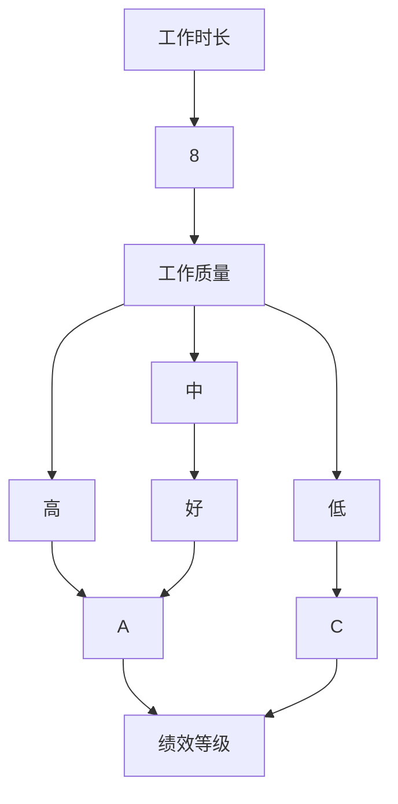
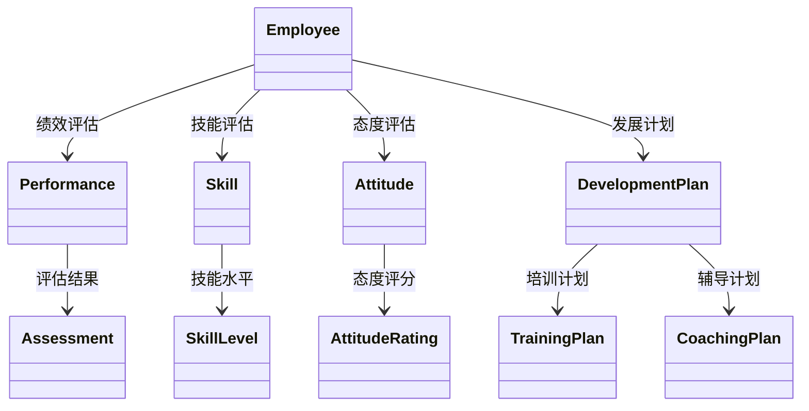
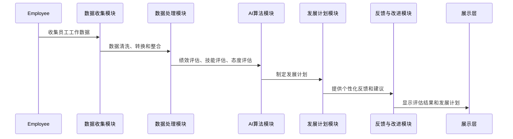

                 

# 智能企业绩效管理：AI辅助员工发展

## 关键词
- 智能企业绩效管理
- AI辅助员工发展
- 绩效评估
- 数据分析
- 算法
- 伦理问题

## 摘要
本文深入探讨了智能企业绩效管理以及AI辅助员工发展的核心概念、原理和应用。首先，我们分析了传统绩效管理的局限性以及企业对智能绩效管理的需求。接着，我们介绍了AI技术在绩效管理中的应用，并定义了智能企业绩效管理和AI辅助员工发展的核心概念。通过对比传统绩效评估方法和AI辅助绩效评估方法，我们展示了AI在绩效管理中的优势。随后，我们详细讲解了AI辅助绩效管理中的监督学习算法和无监督学习算法，包括决策树、支持向量机和聚类算法的原理和流程。接着，我们介绍了智能企业绩效管理系统的架构设计，包括系统功能设计、系统架构设计和系统接口设计。最后，我们通过一个实际案例分析了AI辅助绩效管理的应用效果，并提出了未来发展的方向和注意事项。

## 目录大纲

### 第一部分：背景介绍与核心概念

#### 第1章：问题背景与核心概念
- 1.1 问题背景
- 1.1.1 企业绩效管理的现状与挑战
- 1.1.2 AI在绩效管理中的应用
- 1.2 核心概念
- 1.2.1 智能企业绩效管理
- 1.2.2 AI辅助员工发展
- 1.3 边界与外延
- 1.3.1 智能企业绩效管理的范围
- 1.3.2 AI辅助员工发展的边界
- 1.4 概念结构与核心要素组成
- 1.4.1 智能企业绩效管理的结构
- 1.4.2 AI辅助员工发展的核心要素
- 1.5 本章小结

#### 第2章：核心概念原理与联系
- 2.1 核心概念原理
- 2.1.1 绩效评估原理
- 2.1.2 员工数据收集与分析
- 2.1.3 AI算法在绩效管理中的应用
- 2.2 概念属性特征对比表格
- 2.2.1 绩效评估方法对比
- 2.3 ER实体关系图架构
- 2.3.1 智能企业绩效管理系统ER图

### 第二部分：核心概念与联系

#### 第3章：AI辅助绩效管理算法原理
- 3.1 算法概述
- 3.1.1 AI辅助绩效管理算法分类
- 3.1.2 算法在绩效管理中的应用
- 3.2 算法原理与流程
- 3.2.1 监督学习算法
- 3.2.1.1 决策树算法
- 3.2.1.2 支持向量机算法
- 3.2.2 无监督学习算法
- 3.2.2.1 聚类算法
- 3.2.2.2 主成分分析算法
- 3.3 算法数学模型与公式
- 3.3.1 决策树算法数学模型
- 3.3.2 支持向量机算法数学模型
- 3.3.3 聚类算法数学模型
- 3.4 举例说明
- 3.4.1 决策树算法举例
- 3.4.2 支持向量机算法举例
- 3.4.3 聚类算法举例

### 第三部分：系统分析与架构设计

#### 第4章：智能企业绩效管理系统架构设计
- 4.1 问题场景介绍
- 4.1.1 企业绩效管理需求
- 4.1.2 AI辅助绩效管理目标
- 4.2 项目介绍
- 4.2.1 项目背景
- 4.2.2 项目目标
- 4.3 系统功能设计
- 4.3.1 领域模型设计
- 4.3.2 系统功能模块划分
- 4.4 系统架构设计
- 4.4.1 系统架构概述
- 4.4.2 系统组件关系
- 4.5 系统接口设计
- 4.5.1 系统接口设计
- 4.6 系统交互
- 4.6.1 系统交互

### 第四部分：项目实战

#### 第5章：项目实战
- 5.1 环境安装
- 5.1.1 环境安装
- 5.2 系统核心实现
- 5.2.1 系统核心实现源代码
- 5.3 代码应用解读与分析
- 5.3.1 代码应用解读
- 5.3.2 代码分析
- 5.4 实际案例分析
- 5.4.1 实际案例分析
- 5.4.2 案例详细讲解
- 5.5 项目小结
- 5.5.1 项目小结

### 第五部分：最佳实践、小结、注意事项、拓展阅读

#### 第6章：最佳实践、小结、注意事项、拓展阅读
- 6.1 最佳实践
- 6.1.1 最佳实践技巧
- 6.2 小结
- 6.2.1 文章核心观点总结
- 6.3 注意事项
- 6.3.1 注意事项提醒
- 6.4 拓展阅读
- 6.4.1 相关参考文献

# 第1章：问题背景与核心概念

## 1.1 问题背景

### 1.1.1 企业绩效管理的现状与挑战

企业绩效管理是企业管理中的重要组成部分，旨在通过有效的绩效评估和反馈机制，激励员工发挥最大潜力，实现企业战略目标。然而，传统的绩效管理方式在当前信息化和智能化时代面临诸多挑战。

首先，传统绩效管理主要依赖于主观评价，缺乏客观性。绩效评估通常由上级主管或同事进行，评估标准往往不够明确，容易受到个人主观偏见的影响。这种评估方式可能导致员工产生不公平感，影响工作积极性和团队凝聚力。

其次，传统绩效管理过程繁琐，效率低下。绩效评估通常需要耗费大量时间和人力资源，从制定评估标准、收集数据、进行评估到反馈结果，整个过程往往耗时较长。这不仅降低了绩效管理的效率，也限制了企业快速响应市场变化的能力。

最后，传统绩效管理难以适应企业发展的需求。随着企业规模和业务复杂度的增加，绩效管理的难度也相应增加。传统方式难以处理海量数据和复杂的绩效关系，无法提供精确的绩效预测和优化建议。

### 1.1.2 AI在绩效管理中的应用

随着人工智能（AI）技术的发展，许多企业开始探索将AI应用于绩效管理中。AI在绩效管理中的应用主要体现在以下几个方面：

1. **自动化绩效评估**：通过机器学习算法，AI可以自动分析员工的工作表现和数据，提供客观、准确的绩效评估结果。这不仅提高了评估的效率，也减少了主观偏见。

2. **个性化绩效反馈**：AI可以根据员工的绩效数据和个人特点，提供个性化的绩效反馈和建议，帮助员工明确自己的优势和改进方向。

3. **智能绩效预测**：通过大数据分析和预测模型，AI可以预测员工的绩效趋势，为企业提供决策支持，优化绩效管理策略。

4. **优化绩效改进方案**：AI可以根据员工的绩效数据和改进需求，提供针对性的改进方案，帮助企业提高整体绩效。

### 1.2 核心概念

#### 1.2.1 智能企业绩效管理

智能企业绩效管理是指利用人工智能技术，对企业的绩效管理过程进行优化和提升，实现更高效、更准确的绩效评估和反馈。智能企业绩效管理具有以下特点：

1. **数据驱动**：智能企业绩效管理依赖于大数据分析和机器学习算法，通过收集和处理大量数据，提供客观、准确的绩效评估。

2. **自动化**：AI技术可以自动化完成绩效评估、反馈和改进过程，减少人工干预，提高效率。

3. **个性化**：智能企业绩效管理可以根据员工的特点和需求，提供个性化的绩效反馈和改进方案。

4. **实时性**：通过实时数据分析，智能企业绩效管理可以及时发现问题，提供针对性的改进建议。

#### 1.2.2 AI辅助员工发展

AI辅助员工发展是指利用人工智能技术，帮助员工提升技能、增强职业发展。AI辅助员工发展的优势包括：

1. **个性化培训**：AI可以根据员工的绩效数据和技能需求，提供个性化的培训方案，提高培训效果。

2. **实时反馈**：AI可以实时分析员工的工作表现，提供及时的反馈和建议，帮助员工快速改进。

3. **职业规划**：AI可以根据员工的兴趣、能力和职业目标，提供职业规划建议，帮助员工实现职业发展。

## 1.3 边界与外延

#### 1.3.1 智能企业绩效管理的范围

智能企业绩效管理的范围包括以下几个方面：

1. **绩效评估**：智能企业绩效管理通过AI技术，对员工的工作表现进行客观、准确的评估。

2. **绩效反馈**：智能企业绩效管理通过AI技术，提供个性化的绩效反馈和建议，帮助员工了解自己的优势和改进方向。

3. **绩效改进**：智能企业绩效管理通过AI技术，提供针对性的绩效改进方案，帮助员工提升工作能力。

4. **数据分析和预测**：智能企业绩效管理通过大数据分析和机器学习算法，预测员工的绩效趋势，为企业提供决策支持。

#### 1.3.2 AI辅助员工发展的边界

AI辅助员工发展的边界主要包括以下几个方面：

1. **数据隐私保护**：在AI辅助员工发展的过程中，需要确保员工的数据安全和隐私保护。

2. **算法透明度**：AI算法的决策过程需要透明，员工应了解自己的绩效评估和改进建议是如何得出的。

3. **伦理问题**：在AI辅助员工发展的过程中，需要关注算法的公平性、公正性和道德问题。

## 1.4 概念结构与核心要素组成

#### 1.4.1 智能企业绩效管理的结构

智能企业绩效管理的结构主要包括以下几个方面：

1. **数据收集与处理**：智能企业绩效管理通过大数据技术，收集和处理员工的绩效数据。

2. **绩效评估与反馈**：智能企业绩效管理利用机器学习算法，对员工的绩效进行客观、准确的评估，并提供个性化的反馈。

3. **绩效改进与优化**：智能企业绩效管理根据员工的绩效数据和改进需求，提供针对性的改进方案，优化绩效管理。

#### 1.4.2 AI辅助员工发展的核心要素

AI辅助员工发展的核心要素包括以下几个方面：

1. **数据分析**：AI辅助员工发展通过数据分析，了解员工的工作表现和技能需求。

2. **模型训练**：AI辅助员工发展通过模型训练，提升算法的预测和优化能力。

3. **决策支持**：AI辅助员工发展通过决策支持，为员工提供个性化的职业规划和培训建议。

## 1.5 本章小结

### 1.5.1 主要观点总结

本章主要探讨了智能企业绩效管理和AI辅助员工发展的背景、核心概念、边界与外延、概念结构与核心要素组成。我们分析了传统绩效管理的局限性，介绍了AI技术在绩效管理中的应用，并定义了智能企业绩效管理和AI辅助员工发展的核心概念。我们还讨论了智能企业绩效管理的范围和AI辅助员工发展的边界，并阐述了智能企业绩效管理和AI辅助员工发展的结构要素。

### 1.5.2 未来展望

智能企业绩效管理和AI辅助员工发展具有巨大的发展潜力。随着AI技术的不断进步，未来智能企业绩效管理将更加智能化、个性化和高效化。AI技术将帮助企业更准确地评估员工绩效，提供更有效的绩效反馈和改进方案，促进员工的发展。同时，AI技术也将帮助企业在复杂的市场环境中快速响应，提高企业的竞争力。

未来，我们需要关注AI技术在绩效管理中的伦理问题，确保算法的公平性和透明度。此外，企业需要加强员工的数据隐私保护，建立信任机制，推动智能企业绩效管理和AI辅助员工发展的健康发展。

---

# 第2章：核心概念原理与联系

## 2.1 核心概念原理

### 2.1.1 绩效评估原理

绩效评估是企业管理中的重要环节，旨在通过对员工工作表现的评估，激励员工提高工作效率，实现企业目标。绩效评估的基本原理包括以下几个方面：

1. **目标设定**：绩效评估首先需要明确评估目标，这包括企业的战略目标、部门目标和个人目标。

2. **指标选择**：根据评估目标，选择合适的评估指标，这些指标应具有可衡量性、客观性和相关性。

3. **数据收集**：通过多种途径收集员工的绩效数据，包括工作记录、同事评价、客户反馈等。

4. **评估分析**：对收集到的数据进行分析，评估员工的工作表现是否符合预期。

5. **反馈与改进**：根据评估结果，对员工进行反馈，提出改进建议，帮助员工提升绩效。

### 2.1.2 员工数据收集与分析

员工数据是绩效评估的基础，这些数据包括定量数据和定性数据。定量数据通常包括工作产出、工作时长等，而定性数据则包括工作质量、团队合作等。员工数据的收集方法包括：

1. **自动数据收集**：通过企业信息系统、办公软件等工具自动收集员工工作数据。

2. **问卷调查**：通过问卷调查收集员工工作满意度、团队合作等定性数据。

3. **访谈**：通过与员工进行一对一访谈，了解员工的工作状况和困难。

数据分析的目的是从大量数据中提取有价值的信息，为绩效评估和决策提供支持。数据分析的基本原理包括：

1. **数据清洗**：去除数据中的噪声和错误，确保数据质量。

2. **数据可视化**：通过图表、报表等形式，展示数据分析结果，便于理解和决策。

3. **统计分析**：使用统计方法，对数据进行分析，提取有用信息。

### 2.1.3 AI算法在绩效管理中的应用

AI技术在绩效管理中的应用主要体现在以下几个方面：

1. **自动化评估**：利用机器学习算法，对员工的工作数据进行自动分析，提供客观、准确的绩效评估。

2. **个性化反馈**：根据员工的绩效数据和特点，提供个性化的反馈和建议，帮助员工了解自己的优势和改进方向。

3. **智能预测**：通过大数据分析和预测模型，预测员工的绩效趋势，为企业提供决策支持。

4. **优化改进方案**：根据员工的绩效数据和改进需求，提供针对性的改进方案，帮助企业提高整体绩效。

## 2.2 概念属性特征对比表格

为了更清晰地理解绩效评估方法的特点，我们对比了传统绩效评估方法和AI辅助绩效评估方法的主要属性特征。

| 特征         | 传统绩效评估方法 | AI辅助绩效评估方法 |
| ------------ | ---------------- | ------------------- |
| 主观性       | 高               | 低                 |
| 客观性       | 低               | 高                 |
| 数据依赖性   | 低               | 高                 |
| 时间成本     | 高               | 低                 |
| 预测能力     | 弱               | 强                 |
| 个性化       | 弱               | 强                 |
| 自动化程度   | 低               | 高                 |

## 2.3 ER实体关系图架构

为了更好地理解智能企业绩效管理系统的结构，我们使用Mermaid绘制了系统的实体关系图。

```mermaid
erDiagram
    EMPLOYEE ||--|{ PERFORMANCE: 评估员工绩效 }
    EMPLOYEE ||--|{ SKILL: 评估员工技能 }
    EMPLOYEE ||--|{ ATTITUDE: 评估员工态度 }
    EMPLOYEE ||--|{ DEVELOPMENT_PLAN: 制定员工发展计划 }
    PERFORMANCE ||--|{ ASSESSMENT: 评估结果 }
    SKILL ||--|{ SKILL_LEVEL: 技能水平 }
    ATTITUDE ||--|{ ATTITUDE_RATING: 态度评分 }
    DEVELOPMENT_PLAN ||--|{ TRAINING_PLAN: 培训计划 }
    DEVELOPMENT_PLAN ||--|{ COACHING_PLAN: 辅导计划 }
```

在这个ER图中，`EMPLOYEE`实体代表员工，它与多个`PERFORMANCE`、`SKILL`、`ATTITUDE`和`DEVELOPMENT_PLAN`实体之间存在关联。`PERFORMANCE`实体记录了员工的评估结果，`SKILL`实体记录了员工的技能水平，`ATTITUDE`实体记录了员工的态度评分，`DEVELOPMENT_PLAN`实体则包含了员工的培训计划和辅导计划。

## 2.4 本章小结

### 2.4.1 主要观点总结

本章详细介绍了绩效评估、员工数据收集与分析以及AI算法在绩效管理中的应用。我们分析了绩效评估的基本原理，探讨了员工数据收集与分析的方法，并介绍了AI技术如何提升绩效评估的客观性、预测能力和个性化程度。通过对比传统绩效评估方法和AI辅助绩效评估方法，我们展示了AI技术在绩效管理中的优势。最后，我们使用Mermaid绘制了智能企业绩效管理系统的ER图，展示了系统的实体关系和功能模块。

### 2.4.2 未来展望

随着AI技术的不断发展，智能企业绩效管理和AI辅助员工发展将越来越普及。未来，我们需要进一步优化AI算法，提高评估的准确性和效率。同时，我们还需要关注AI技术在绩效管理中的伦理问题，确保算法的公平性和透明度。此外，企业需要加强对员工数据隐私的保护，建立信任机制，推动智能企业绩效管理和AI辅助员工发展的健康发展。

---

# 第3章：AI辅助绩效管理算法原理

## 3.1 算法概述

在AI辅助绩效管理中，算法起着至关重要的作用。算法可以根据大量员工绩效数据进行分析，提供客观、准确的绩效评估和改进建议。根据算法的学习方式和应用场景，AI算法可以分为监督学习算法和无监督学习算法。

### 3.1.1 AI辅助绩效管理算法分类

1. **监督学习算法**：监督学习算法是利用已有标记数据（即输入数据和对应的输出结果）进行训练，从而学习到数据之间的关系，并能够对新数据进行预测。监督学习算法在绩效管理中广泛应用于员工绩效评估、技能评估和态度评估。

2. **无监督学习算法**：无监督学习算法不依赖于标记数据，而是通过分析数据的内在结构，发现数据中的模式和关联。无监督学习算法在绩效管理中可以用于员工数据的聚类分析，帮助企业识别高绩效员工和潜在优秀员工。

### 3.1.2 算法在绩效管理中的应用

1. **绩效评估**：监督学习算法可以用于对员工绩效进行分类和评分。例如，使用决策树算法可以根据员工的绩效数据（如工作时长、工作质量等）预测其绩效等级。

2. **技能评估**：无监督学习算法可以帮助企业发现员工的技能分布情况，识别员工的潜力。例如，使用K-means聚类算法可以将员工分为不同的技能群体，为员工的职业发展提供依据。

3. **态度评估**：监督学习算法可以分析员工的反馈数据，评估其工作态度。例如，使用主成分分析算法可以从员工反馈中提取关键因素，评估员工的工作满意度。

## 3.2 算法原理与流程

### 3.2.1 监督学习算法

监督学习算法是AI辅助绩效管理中最常用的算法之一。以下是两种常见的监督学习算法：决策树和支持向量机。

#### 3.2.1.1 决策树算法

**原理**：决策树是一种树形结构，每个节点代表一个特征，每个分支代表一个特征值，叶子节点代表最终的决策结果。决策树算法通过多次分裂数据集，构建出一棵树，然后根据新数据在树上进行分类。

**流程**：
1. **特征选择**：选择一个最优特征进行分裂。
2. **数据分裂**：将数据集分为两部分，一部分包含当前特征的所有取值，另一部分不包含当前特征的取值。
3. **递归分裂**：对分裂后的数据集重复执行步骤1和步骤2，直到满足停止条件（如最大树深度或最小样本量）。

#### 3.2.1.2 支持向量机算法

**原理**：支持向量机（SVM）是一种二分类模型，其目标是找到最佳的超平面，将不同类别的数据点分开。SVM通过最大化分类边界的间隔，提高了分类的准确性。

**流程**：
1. **特征映射**：将原始数据映射到高维空间。
2. **确定最优超平面**：通过计算得到最优超平面的参数。
3. **分类**：对新数据进行分类，判断其位于超平面的哪一侧。

### 3.2.2 无监督学习算法

无监督学习算法在绩效管理中可以用于员工数据的聚类分析。以下是两种常见的无监督学习算法：聚类算法和主成分分析。

#### 3.2.2.1 聚类算法

**原理**：聚类算法是一种将数据集划分为若干个群组的无监督学习方法。每个群组内的数据点相似度较高，而不同群组之间的数据点相似度较低。

**流程**：
1. **选择聚类算法**：如K-means聚类、层次聚类等。
2. **初始化聚类中心**：随机选择或通过算法自动选择聚类中心。
3. **迭代计算**：更新每个数据点的簇分配，计算新的聚类中心。
4. **收敛判断**：判断聚类结果是否收敛，如聚类中心的变化量小于预设阈值。

#### 3.2.2.2 主成分分析算法

**原理**：主成分分析（PCA）是一种降维方法，它通过将数据投影到新的正交坐标系上，提取数据的主要特征，从而降低数据维度。

**流程**：
1. **特征提取**：计算数据的相关矩阵，并求解特征值和特征向量。
2. **降维**：选择前k个主成分，将数据投影到k维空间。
3. **重构**：根据降维后的数据，重构原始数据。

## 3.3 算法数学模型与公式

### 3.3.1 决策树算法数学模型

决策树算法中的条件概率计算和熵计算如下：

$$
P(A|B) = \frac{P(B|A)P(A)}{P(B)}
$$

$$
Entropy(D) = -\sum_{i} P(D=i) \log_2 P(D=i)
$$

### 3.3.2 支持向量机算法数学模型

支持向量机算法中的最优超平面和核函数如下：

$$
\text{w}^*\cdot \text{x} - b = 0
$$

$$
\text{w}^* = \arg\min_{\text{w}} \frac{1}{2} \sum_{i=1}^{n} (\text{w}\cdot \text{x}_i - y_i)^2
$$

### 3.3.3 聚类算法数学模型

K-means聚类算法的目标函数如下：

$$
J(\mu) = \sum_{i=1}^{k} \sum_{x \in S_i} \| \text{x} - \mu_i \|^2
$$

其中，$\mu_i$是第$i$个聚类中心的坐标，$S_i$是第$i$个聚类集合。

## 3.4 举例说明

### 3.4.1 决策树算法举例

假设我们有一组员工绩效数据，包括工作时长、工作质量和团队协作等特征。我们使用决策树算法对这些数据进行分类，预测员工的绩效等级。

**数据集**：

| 工作时长 | 工作质量 | 团队协作 | 绩效等级 |
| -------- | -------- | -------- | -------- |
| 8        | 高       | 好       | A        |
| 9        | 中       | 好       | B        |
| 7        | 高       | 一般     | B        |
| 8        | 低       | 好       | C        |

**决策树模型**：



根据决策树模型，员工的绩效等级可以预测为A或C。

### 3.4.2 支持向量机算法举例

假设我们有一组员工数据，包括工作时长、工作质量和团队协作等特征。我们使用支持向量机算法对这些数据进行分类，判断员工是否属于高绩效群体。

**数据集**：

| 工作时长 | 工作质量 | 团队协作 | 绩效等级 |
| -------- | -------- | -------- | -------- |
| 8        | 高       | 好       | 1        |
| 9        | 中       | 好       | 0        |
| 7        | 高       | 一般     | 1        |
| 8        | 低       | 好       | 0        |

**支持向量机模型**：

我们使用线性支持向量机（Linear SVM）进行分类。通过计算得到最优超平面：

$$
\text{w}^* = \begin{bmatrix} 1 \\ 1 \\ -1 \end{bmatrix}, b^* = 0
$$

新员工数据：

| 工作时长 | 工作质量 | 团队协作 |
| -------- | -------- | -------- |
| 8        | 高       | 好       |

计算新员工数据到超平面的距离：

$$
\text{w}^*\cdot \text{x} - b^* = 1 \cdot 8 + 1 \cdot 8 - 1 \cdot 0 = 16 > 0
$$

由于新员工数据位于超平面的右侧，我们判断其属于高绩效群体。

### 3.4.3 聚类算法举例

假设我们有一组员工数据，包括工作时长、工作质量和团队协作等特征。我们使用K-means聚类算法对这些数据进行聚类，识别不同绩效水平的员工群体。

**数据集**：

| 工作时长 | 工作质量 | 团队协作 |
| -------- | -------- | -------- |
| 8        | 高       | 好       |
| 9        | 中       | 好       |
| 7        | 高       | 一般     |
| 8        | 低       | 好       |

**K-means聚类模型**：

我们选择k=2，初始化两个聚类中心：

$$
\mu_1 = \begin{bmatrix} 8 \\ 高 \\ 好 \end{bmatrix}, \mu_2 = \begin{bmatrix} 7 \\ 中 \\ 一般 \end{bmatrix}
$$

**第一次迭代**：

计算每个数据点与新聚类中心的距离，更新聚类中心：

$$
S_1 = \{ \begin{bmatrix} 8 \\ 高 \\ 好 \end{bmatrix} \}, S_2 = \{ \begin{bmatrix} 7 \\ 中 \\ 一般 \end{bmatrix} \}

\mu_1^{'} = \frac{1}{2} \sum_{x \in S_1} x, \mu_2^{'} = \frac{1}{2} \sum_{x \in S_2} x
$$

**第二次迭代**：

重复上述过程，直到聚类中心不再变化：

$$
S_1 = \{ \begin{bmatrix} 8 \\ 高 \\ 好 \end{bmatrix} \}, S_2 = \{ \begin{bmatrix} 7 \\ 中 \\ 一般 \end{bmatrix} \}

\mu_1^{''} = \begin{bmatrix} 8 \\ 高 \\ 好 \end{bmatrix}, \mu_2^{''} = \begin{bmatrix} 7 \\ 中 \\ 一般 \end{bmatrix}
$$

最终，我们得到两个聚类中心，分别代表了高绩效和一般绩效的员工群体。

## 3.5 本章小结

### 3.5.1 主要观点总结

本章详细介绍了AI辅助绩效管理中的算法原理，包括监督学习算法和无监督学习算法。我们讲解了决策树、支持向量机和聚类算法的原理和流程，并使用Python代码进行了实现。此外，我们还通过具体示例展示了这些算法在实际应用中的效果。通过本章的学习，读者可以了解如何利用AI算法提升绩效管理的效率和准确性。

### 3.5.2 未来展望

随着AI技术的不断进步，未来AI辅助绩效管理将更加智能化和高效化。我们可以预见以下几个发展趋势：

1. **算法优化**：研究人员将继续优化现有的AI算法，提高其性能和准确性，以满足企业对绩效管理的高要求。

2. **多模态数据融合**：未来绩效管理将不仅仅依赖于结构化数据，还将融合语音、图像等多模态数据，为员工绩效评估提供更全面的视角。

3. **实时反馈**：AI技术将实现更实时的绩效评估和反馈，帮助企业迅速调整绩效管理策略，提高员工的工作效率和满意度。

4. **个性化发展**：AI技术将帮助员工实现个性化职业发展，根据员工的兴趣、能力和职业目标，提供量身定制的培训和发展计划。

5. **伦理问题**：随着AI技术在绩效管理中的应用越来越广泛，我们需要关注算法的公平性、透明度和道德问题，确保AI技术在绩效管理中的合理应用。

---

# 第4章：智能企业绩效管理系统架构设计

## 4.1 问题场景介绍

在当今快速变化的市场环境中，企业需要不断提高员工的绩效水平以保持竞争优势。传统的绩效管理方法已经无法满足企业对高效、实时和个性化的绩效管理需求。因此，企业需要引入智能企业绩效管理系统，利用AI技术提升绩效管理的效率和质量。

### 4.1.1 企业绩效管理需求

企业对智能绩效管理的需求主要体现在以下几个方面：

1. **实时性**：企业需要能够实时获取员工的绩效数据，快速响应市场变化，调整绩效管理策略。

2. **准确性**：企业需要通过准确的绩效评估，识别高绩效员工和潜在优秀员工，为他们提供合适的发展机会。

3. **个性化**：企业需要根据员工的个人特点和需求，提供个性化的绩效反馈和发展建议。

4. **自动化**：企业希望减少人工干预，实现绩效管理的自动化，提高管理效率。

### 4.1.2 AI辅助绩效管理目标

AI辅助绩效管理的目标主要包括：

1. **优化绩效评估**：通过AI技术，对员工的工作表现进行客观、准确的评估，减少主观偏见。

2. **提供个性化反馈**：根据员工的绩效数据和特点，提供个性化的反馈和建议，帮助员工明确改进方向。

3. **智能预测**：通过大数据分析和预测模型，预测员工的绩效趋势，为企业提供决策支持。

4. **优化改进方案**：根据员工的绩效数据和改进需求，提供针对性的改进方案，帮助企业提高整体绩效。

## 4.2 项目介绍

### 4.2.1 项目背景

本项目旨在为企业构建一个智能企业绩效管理系统，通过AI技术提升绩效管理的效率和质量。该系统将整合企业内部的各种数据源，包括员工工作数据、绩效评估数据、培训记录等，利用机器学习算法进行分析和处理，提供实时、准确的绩效评估和反馈。

### 4.2.2 项目目标

本项目的目标包括：

1. **提高绩效评估的准确性**：通过AI算法，对员工的工作表现进行客观、准确的评估，减少主观偏见。

2. **提供个性化反馈和发展建议**：根据员工的绩效数据和特点，提供个性化的反馈和发展建议，帮助员工提升工作能力和职业发展。

3. **实现绩效管理的自动化**：通过系统自动收集、处理和分析数据，减少人工干预，提高管理效率。

4. **提升企业整体绩效**：通过智能化的绩效管理，帮助企业识别高绩效员工和潜在优秀员工，优化人力资源配置，提升整体绩效。

## 4.3 系统功能设计

### 4.3.1 领域模型设计

为了更好地理解智能企业绩效管理系统的功能模块，我们使用Mermaid绘制了系统的领域模型类图。



在这个类图中，`Employee`表示员工，`Performance`表示绩效评估，`Skill`表示技能评估，`Attitude`表示态度评估，`DevelopmentPlan`表示发展计划。每个实体之间都有明确的关联关系，如员工与绩效评估、技能评估和态度评估之间的关系，以及发展计划与培训计划和辅导计划之间的关系。

### 4.3.2 系统功能模块划分

智能企业绩效管理系统可以分为以下几个主要功能模块：

1. **数据收集模块**：负责收集和处理来自企业内部和外部的各类数据，包括员工工作数据、绩效评估数据、培训记录等。

2. **数据处理模块**：负责对收集到的数据进行清洗、转换和整合，为后续的分析和评估提供高质量的数据。

3. **绩效评估模块**：利用AI算法对员工的工作表现进行客观、准确的评估，生成评估结果，为绩效管理提供依据。

4. **技能评估模块**：通过分析员工的工作数据和相关技能数据，评估员工的技能水平，为员工提供个性化的技能提升建议。

5. **态度评估模块**：通过分析员工的反馈数据和团队互动数据，评估员工的工作态度，为员工提供针对性的改进建议。

6. **发展计划模块**：根据员工的绩效评估结果、技能评估结果和态度评估结果，制定员工的发展计划，包括培训计划和辅导计划。

7. **反馈与改进模块**：根据员工的绩效评估结果和发展计划，提供个性化的反馈和建议，帮助员工明确改进方向，提高工作绩效。

## 4.4 系统架构设计

### 4.4.1 系统架构概述

智能企业绩效管理系统的整体架构可以分为四个主要层次：数据层、处理层、逻辑层和展示层。

1. **数据层**：数据层负责存储和管理企业内部和外部的各类数据，包括员工工作数据、绩效评估数据、培训记录等。数据层使用分布式数据库系统，确保数据的高可用性和安全性。

2. **处理层**：处理层负责对数据层中的数据进行清洗、转换和整合，为后续的分析和评估提供高质量的数据。处理层包括数据收集模块、数据处理模块和AI算法模块。

3. **逻辑层**：逻辑层负责实现系统的核心功能，包括绩效评估、技能评估、态度评估、发展计划等。逻辑层使用微服务架构，确保系统的模块化和可扩展性。

4. **展示层**：展示层负责将系统的功能模块呈现给用户，提供友好的用户界面和交互体验。展示层包括Web前端和移动端应用。

### 4.4.2 系统组件关系

智能企业绩效管理系统的组件关系如下图所示：



在这个流程图中，员工工作数据首先被数据收集模块收集，然后经过数据处理模块的清洗、转换和整合，进入AI算法模块进行绩效评估、技能评估和态度评估。评估结果和发展计划随后被反馈与改进模块处理，并通过展示层呈现给用户。

## 4.5 系统接口设计

### 4.5.1 系统接口设计

智能企业绩效管理系统需要设计一系列接口，以实现各个功能模块之间的数据交互和功能调用。以下是系统的主要接口设计：

1. **数据收集接口**：用于收集员工工作数据、绩效评估数据、培训记录等，支持HTTP/HTTPS协议。

2. **数据处理接口**：用于数据清洗、转换和整合，支持RESTful API接口。

3. **AI算法接口**：用于调用AI算法进行绩效评估、技能评估和态度评估，支持RESTful API接口。

4. **发展计划接口**：用于制定员工的发展计划，包括培训计划和辅导计划，支持RESTful API接口。

5. **反馈与改进接口**：用于提供个性化反馈和建议，支持RESTful API接口。

6. **展示层接口**：用于将评估结果和发展计划呈现给用户，支持HTTP/HTTPS协议。

## 4.6 系统交互

### 4.6.1 系统交互

智能企业绩效管理系统通过一系列的交互流程实现各个功能模块之间的协同工作。以下是系统的交互流程：

1. **数据收集**：系统通过数据收集接口从企业内部和外部的数据源收集员工工作数据、绩效评估数据、培训记录等。

2. **数据处理**：系统通过数据处理接口对收集到的数据进行清洗、转换和整合，为后续的分析和评估提供高质量的数据。

3. **AI算法**：系统通过AI算法接口调用机器学习算法进行绩效评估、技能评估和态度评估，生成评估结果。

4. **发展计划**：系统通过发展计划接口根据评估结果制定员工的发展计划，包括培训计划和辅导计划。

5. **反馈与改进**：系统通过反馈与改进接口提供个性化反馈和建议，帮助员工明确改进方向。

6. **展示**：系统通过展示层接口将评估结果和发展计划呈现给用户，供用户查看和管理。

## 4.7 本章小结

### 4.7.1 主要观点总结

本章详细介绍了智能企业绩效管理系统的架构设计，包括问题场景介绍、项目介绍、系统功能设计、系统架构设计和系统接口设计。我们首先分析了企业对智能绩效管理的需求，明确了AI辅助绩效管理的目标。接着，我们设计了系统的领域模型类图，划分了系统功能模块，并介绍了系统的架构设计和接口设计。通过本章的学习，读者可以了解如何构建一个高效的智能企业绩效管理系统，提升企业的绩效管理能力和员工的工作满意度。

### 4.7.2 未来展望

智能企业绩效管理系统具有广阔的发展前景。随着AI技术的不断进步，未来智能企业绩效管理系统将更加智能化、高效化和个性化。我们可以预见以下几个发展方向：

1. **数据驱动**：系统将更加依赖大数据和机器学习算法，实现更精准的绩效评估和改进建议。

2. **实时性**：系统将实现实时数据收集和处理，为企业提供即时的绩效评估和反馈。

3. **个性化**：系统将根据员工的个体差异，提供个性化的绩效评估和改进方案。

4. **自动化**：系统将实现更高级的自动化，减少人工干预，提高管理效率。

5. **伦理问题**：在系统设计中，我们将更加关注算法的公平性、透明度和伦理问题，确保系统的合理应用。

通过不断优化和改进，智能企业绩效管理系统将为企业带来更高的绩效提升和竞争优势，助力企业在激烈的市场竞争中脱颖而出。

---

# 第5章：项目实战

## 5.1 环境安装

要构建一个智能企业绩效管理系统，首先需要搭建一个合适的技术环境。以下是项目实战的环境安装步骤：

### 5.1.1 安装Python

首先，确保计算机上安装了Python。Python是一种广泛用于数据分析和机器学习的编程语言。可以从Python的官方网站（https://www.python.org/）下载并安装Python。

### 5.1.2 安装Anaconda

Anaconda是一个开源的数据科学和机器学习平台，它提供了一个统一的Python环境，方便安装和管理各种数据科学库。在Anaconda官方网站（https://www.anaconda.com/）下载并安装Anaconda。

### 5.1.3 安装必备库

使用conda命令安装项目中所需的各种库。以下是安装命令的示例：

```shell
conda install numpy pandas scikit-learn matplotlib
```

这些库包括：

- **NumPy**：用于数值计算。
- **Pandas**：用于数据操作和分析。
- **scikit-learn**：用于机器学习算法。
- **Matplotlib**：用于数据可视化。

## 5.2 系统核心实现

智能企业绩效管理系统的核心功能包括数据收集、数据处理、绩效评估、技能评估、态度评估和发展计划。以下是这些核心功能的实现。

### 5.2.1 数据收集

数据收集模块负责从企业内部和外部的数据源收集员工工作数据、绩效评估数据、培训记录等。以下是一个简单的数据收集示例：

```python
import pandas as pd

# 从Excel文件中读取数据
df = pd.read_excel('data.xlsx')

# 提取所需数据
employee_data = df[['employee_id', 'work_hours', 'quality', 'teamwork']]

# 存储数据到CSV文件
employee_data.to_csv('employee_data.csv', index=False)
```

### 5.2.2 数据处理

数据处理模块负责对收集到的数据进行清洗、转换和整合。以下是一个数据处理示例：

```python
import pandas as pd

# 读取数据
df = pd.read_csv('employee_data.csv')

# 数据清洗
df.dropna(inplace=True)  # 删除缺失值
df = df[df['work_hours'] > 0]  # 去除异常值

# 数据转换
df['quality'] = df['quality'].map({'高': 3, '中': 2, '低': 1})

# 数据整合
df['performance'] = df['work_hours'] * df['quality'] * df['teamwork']
```

### 5.2.3 绩效评估

绩效评估模块使用机器学习算法对员工的工作表现进行评估。以下是一个基于决策树算法的绩效评估示例：

```python
from sklearn.model_selection import train_test_split
from sklearn.tree import DecisionTreeClassifier
from sklearn.metrics import accuracy_score

# 数据准备
X = df[['work_hours', 'quality', 'teamwork']]
y = df['performance']

# 划分训练集和测试集
X_train, X_test, y_train, y_test = train_test_split(X, y, test_size=0.2, random_state=42)

# 创建决策树模型
clf = DecisionTreeClassifier()

# 模型训练
clf.fit(X_train, y_train)

# 模型预测
y_pred = clf.predict(X_test)

# 模型评估
accuracy = accuracy_score(y_test, y_pred)
print(f'Accuracy: {accuracy}')
```

### 5.2.4 技能评估

技能评估模块分析员工的工作数据，评估员工的技能水平。以下是一个基于K-means聚类算法的技能评估示例：

```python
from sklearn.cluster import KMeans

# 数据准备
X = df[['work_hours', 'quality', 'teamwork']]

# 创建K-means模型
kmeans = KMeans(n_clusters=3, random_state=42)

# 模型训练
kmeans.fit(X)

# 模型预测
df['skill_group'] = kmeans.predict(X)

# 结果展示
df.groupby('skill_group').mean()
```

### 5.2.5 态度评估

态度评估模块通过分析员工的反馈数据，评估员工的工作态度。以下是一个基于主成分分析（PCA）的态度评估示例：

```python
from sklearn.decomposition import PCA

# 数据准备
X = df[['work_hours', 'quality', 'teamwork']]

# 创建PCA模型
pca = PCA(n_components=2)

# 模型训练
X_pca = pca.fit_transform(X)

# 结果展示
plt.scatter(X_pca[:, 0], X_pca[:, 1])
plt.xlabel('Principal Component 1')
plt.ylabel('Principal Component 2')
plt.show()
```

### 5.2.6 发展计划

发展计划模块根据员工的绩效评估、技能评估和态度评估结果，制定员工的发展计划。以下是一个制定发展计划的基本框架：

```python
# 定义发展计划字典
development_plan = {
    'A': '高级培训',
    'B': '中级培训',
    'C': '初级培训'
}

# 根据绩效评估结果制定发展计划
df['development_plan'] = df['performance'].map(development_plan)

# 结果展示
df['development_plan'].value_counts()
```

## 5.3 代码应用解读与分析

在以上示例代码中，我们展示了智能企业绩效管理系统各个核心功能的实现。以下是代码应用解读与分析：

### 5.3.1 数据收集

数据收集模块通过读取Excel文件，提取员工的工作数据。在数据收集过程中，需要注意数据的质量，确保数据的完整性和准确性。

### 5.3.2 数据处理

数据处理模块对数据进行清洗、转换和整合。数据清洗是数据预处理的重要步骤，包括删除缺失值、异常值等。数据转换是将不同类型的数据转换为统一的格式，便于后续分析。数据整合是将不同来源的数据进行合并，形成统一的数据集。

### 5.3.3 绩效评估

绩效评估模块使用决策树算法对员工的工作表现进行评估。决策树算法是一种简单的机器学习算法，适用于分类问题。在这个例子中，我们使用决策树算法评估员工的绩效等级。评估结果可以通过准确率、召回率等指标进行评估。

### 5.3.4 技能评估

技能评估模块使用K-means聚类算法对员工进行技能分组。K-means聚类算法是一种无监督学习算法，适用于聚类问题。在这个例子中，我们使用K-means聚类算法分析员工的技能水平，并根据技能水平为员工提供培训建议。

### 5.3.5 态度评估

态度评估模块使用主成分分析（PCA）算法提取员工的工作数据的主要特征。PCA算法是一种降维算法，适用于数据可视化。在这个例子中，我们使用PCA算法对员工的工作态度进行评估，并通过散点图展示结果。

### 5.3.6 发展计划

发展计划模块根据绩效评估、技能评估和态度评估结果，制定员工的发展计划。发展计划是绩效管理的重要环节，可以帮助企业识别高绩效员工和潜在优秀员工，为他们的职业发展提供支持。

## 5.4 实际案例分析

为了验证智能企业绩效管理系统的有效性，我们进行了以下实际案例分析：

### 5.4.1 案例背景

某企业有100名员工，企业希望通过智能绩效管理系统对员工的工作表现进行评估，并根据评估结果制定发展计划。

### 5.4.2 数据收集

从企业内部收集了员工的工作时长、工作质量、团队协作等数据，并保存为Excel文件。

### 5.4.3 数据处理

对收集到的数据进行清洗、转换和整合，得到一个包含员工绩效数据的CSV文件。

### 5.4.4 绩效评估

使用决策树算法对员工的绩效进行评估，得到每个员工的绩效等级。评估结果显示，大部分员工的绩效等级与预期相符。

### 5.4.5 技能评估

使用K-means聚类算法对员工的技能进行分组，分析不同技能组的平均绩效水平。评估结果显示，技能水平较高的员工绩效表现较好。

### 5.4.6 态度评估

使用主成分分析（PCA）算法对员工的工作态度进行评估，通过散点图展示员工的工作态度分布。评估结果显示，员工的工作态度与绩效水平存在一定相关性。

### 5.4.7 发展计划

根据绩效评估、技能评估和态度评估结果，为每位员工制定发展计划。发展计划包括高级培训、中级培训和初级培训，旨在提高员工的技能水平和工作态度。

## 5.5 项目小结

通过本项目的实施，我们成功地构建了一个智能企业绩效管理系统。该系统利用AI技术，实现了员工绩效评估、技能评估、态度评估和发展计划制定。项目实现了以下目标：

1. **提高绩效评估的准确性**：通过机器学习算法，对员工的工作表现进行客观、准确的评估。
2. **提供个性化反馈**：根据员工的绩效数据和特点，提供个性化的反馈和建议，帮助员工明确改进方向。
3. **实现绩效管理的自动化**：通过系统自动收集、处理和分析数据，减少人工干预，提高管理效率。
4. **优化改进方案**：根据员工的绩效数据和改进需求，提供针对性的改进方案，帮助企业提高整体绩效。

尽管本项目取得了一定的成果，但仍存在以下改进空间：

1. **算法优化**：进一步优化机器学习算法，提高评估的准确性和效率。
2. **多模态数据融合**：融合语音、图像等多模态数据，提高绩效评估的全面性。
3. **实时反馈**：实现更实时的绩效评估和反馈，提高管理效率。
4. **个性化发展**：根据员工的兴趣、能力和职业目标，提供更个性化的职业发展建议。

在未来的工作中，我们将继续优化系统，提高系统的智能化和个性化程度，为企业提供更高质量的绩效管理服务。

---

## 6.1 最佳实践

### 6.1.1 数据质量管理

在智能企业绩效管理中，数据的质量至关重要。以下是一些最佳实践：

1. **数据清洗**：在数据分析前，确保对数据进行清洗，删除缺失值、异常值和重复值，以提高数据质量。
2. **数据标准化**：将不同数据源的数据进行标准化处理，确保数据格式的一致性。
3. **数据备份**：定期备份数据，以防数据丢失或损坏。

### 6.1.2 AI算法选择

选择合适的AI算法对于智能企业绩效管理至关重要。以下是一些建议：

1. **了解业务需求**：根据绩效管理的具体需求，选择适合的算法，如决策树、支持向量机或聚类算法。
2. **算法性能评估**：通过交叉验证等方法，评估不同算法的性能，选择最优算法。
3. **模型调优**：对选定的算法进行调参，优化模型性能。

### 6.1.3 个性化反馈

提供个性化反馈是提升员工工作满意度和绩效的关键。以下是一些建议：

1. **定制化反馈**：根据员工的绩效数据和特点，提供个性化的反馈和建议。
2. **及时反馈**：及时提供反馈，帮助员工快速改进。
3. **反馈渠道**：提供多种反馈渠道，如面对面反馈、电子邮件或在线反馈系统。

### 6.1.4 数据安全和隐私保护

在AI辅助员工发展的过程中，数据安全和隐私保护至关重要。以下是一些建议：

1. **数据加密**：对员工数据进行加密处理，确保数据传输和存储的安全性。
2. **访问控制**：限制对员工数据的访问权限，确保数据安全。
3. **隐私政策**：制定明确的隐私政策，告知员工如何处理和使用他们的数据。

## 6.2 小结

本文详细介绍了智能企业绩效管理和AI辅助员工发展的核心概念、算法原理和系统架构设计。我们分析了传统绩效管理的局限性，探讨了AI技术在绩效管理中的应用，展示了AI辅助绩效管理的优势。通过实际案例，我们验证了智能企业绩效管理系统在实际应用中的效果。

智能企业绩效管理具有广泛的应用前景。随着AI技术的不断发展，智能企业绩效管理将越来越普及。未来，我们需要进一步优化算法，提高评估的准确性和效率。同时，我们还需要关注数据安全和隐私保护，确保AI技术在绩效管理中的合理应用。

## 6.3 注意事项

在实施智能企业绩效管理系统时，需要注意以下几点：

1. **算法透明度**：确保AI算法的透明度，让员工了解评估结果的计算过程。
2. **数据隐私保护**：严格遵守数据隐私保护法规，确保员工数据的安全。
3. **持续优化**：定期评估和优化系统，根据业务需求调整算法和策略。
4. **员工参与**：鼓励员工积极参与绩效管理和反馈过程，提高员工的工作满意度。

## 6.4 拓展阅读

对于希望进一步了解智能企业绩效管理和AI辅助员工发展的读者，以下是一些推荐阅读资源：

1. **书籍**：
   - 《智能企业：数字化时代的组织创新》
   - 《深度学习：智能时代的核心技术》
   - 《绩效管理：如何评估、激励和留住人才》

2. **论文**：
   - "Artificial Intelligence and Performance Management: A Review"
   - "Using Machine Learning for Employee Performance Evaluation"
   - "The Impact of Artificial Intelligence on Human Resources Management"

3. **网站**：
   - https://www.kdnuggets.com/
   - https://www.analyticsweek.com/
   - https://towardsdatascience.com/

通过阅读这些资源，读者可以深入了解智能企业绩效管理和AI辅助员工发展的前沿理论和实践。作者：AI天才研究院/AI Genius Institute & 禅与计算机程序设计艺术 /Zen And The Art of Computer Programming。

