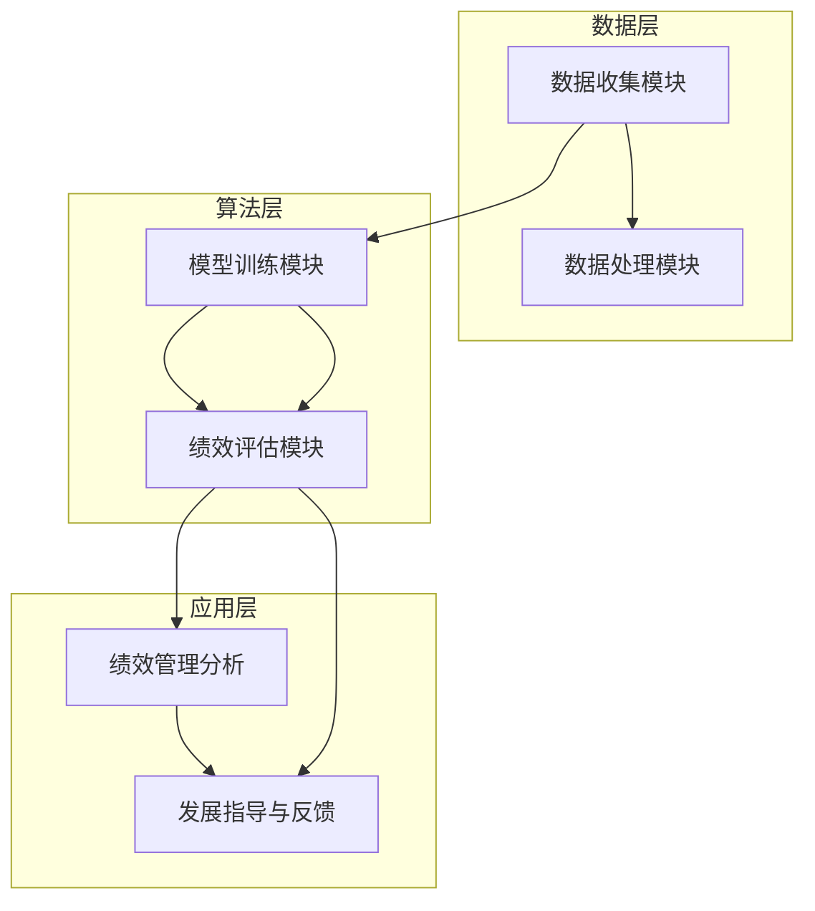
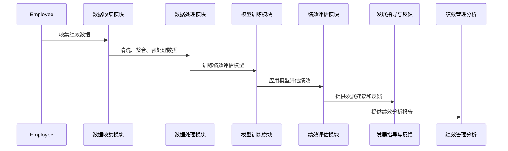

                 


## 智能企业绩效管理：AI辅助员工发展与评估

### 关键词

- 智能企业
- 绩效管理
- 人工智能
- 员工发展
- 数据分析

### 摘要

本文旨在探讨智能企业绩效管理，特别是AI技术在员工发展与评估中的应用。通过对人工智能与绩效管理核心概念的分析，结合机器学习与数据分析技术，本文提出了智能企业绩效管理的技术原理、系统架构和实战应用，为企业在数字化转型过程中提供有效的绩效管理方案。

### 第一部分：背景介绍

#### 问题背景

在当今快速发展的数字经济时代，企业面临的市场环境日益复杂多变。传统的绩效管理方法已无法满足企业在信息化、智能化转型过程中的需求。为了提升企业竞争力，实现可持续发展，企业需要引入先进的技术手段，特别是人工智能（AI）技术，以实现绩效管理的智能化和精细化。

#### 问题描述

智能企业绩效管理是指利用人工智能技术，特别是机器学习和数据分析技术，对企业员工的绩效进行全方位的评估和发展。这包括对员工的工作效率、能力发展、工作满意度等多个维度的分析。然而，目前企业普遍存在以下问题：

1. 绩效管理数据不准确、不全面。
2. 缺乏对员工能力的深度挖掘和发展指导。
3. 绩效评估过程繁琐，效率低下。
4. 绩效管理与企业战略目标脱节。

#### 问题解决

智能企业绩效管理通过引入AI技术，可以解决上述问题，实现以下目标：

1. 提高绩效管理数据的准确性和全面性。
2. 深度挖掘员工能力，提供个性化发展指导。
3. 简化绩效评估流程，提高效率。
4. 将绩效管理与企业战略目标紧密结合。

#### 边界与外延

智能企业绩效管理不仅涉及企业内部员工的绩效评估，还涵盖了供应商、合作伙伴等外部实体的绩效评估。此外，它不仅关注个体员工的绩效，还涉及到团队绩效和组织绩效的综合评估。

#### 概念结构与核心要素组成

智能企业绩效管理的基本概念结构包括：

1. **人工智能技术**：核心驱动力，包括机器学习、数据挖掘、自然语言处理等。
2. **大数据**：数据源，提供绩效评估所需的各种数据。
3. **绩效评估模型**：基于AI技术的算法模型，用于分析员工绩效。
4. **绩效管理平台**：整合AI技术和大数据，实现绩效评估和管理的工具。

核心要素组成如下：

1. **数据收集**：通过企业内部管理系统、外部数据源等收集员工绩效相关数据。
2. **数据处理**：对收集到的数据进行清洗、整合和预处理。
3. **模型训练**：利用机器学习技术，训练绩效评估模型。
4. **绩效评估**：应用训练好的模型，对员工绩效进行评估。
5. **反馈与改进**：根据评估结果，为员工提供发展建议，不断优化绩效管理流程。

### 第二部分：核心概念与联系

#### 2.1 核心概念

##### 1. 人工智能（AI）

人工智能是指计算机系统模拟人类智能行为的科学和技术。它包括机器学习、深度学习、自然语言处理等多种技术。

##### 2. 绩效管理

绩效管理是指通过设定目标、监控过程、评估结果等方式，对员工的工作表现进行管理和优化，以提高组织效率。

##### 3. 智能企业

智能企业是指利用人工智能、大数据、云计算等先进技术，实现企业运营、管理和服务的智能化、自动化。

##### 4. 员工发展

员工发展是指通过培训、指导、激励等方式，提升员工的专业技能和综合能力，以实现个人成长和企业发展。

#### 2.2 概念属性特征对比表格

| 概念       | 属性特征                                                     |
| ---------- | ------------------------------------------------------------ |
| 人工智能   | 模拟人类智能行为，具有学习、推理、决策能力                   |
| 绩效管理   | 管理员工工作表现，提高组织效率                             |
| 智能企业   | 利用先进技术实现运营、管理和服务的智能化、自动化             |
| 员工发展   | 提升员工专业技能和综合能力，实现个人成长和企业发展           |

#### 2.3 ER实体关系图架构

```mermaid
erDiagram
  Employee ||--|{ Performance} :评估
  Employee ||--|{ Development}: 发展
  Performance ||--|{ Metric}: 指标
  Development ||--|{ Training}: 培训
  Performance ||--|{ Feedback}: 反馈
```

### 第三部分：智能企业绩效管理的技术原理

#### 3.1 机器学习与数据分析技术

##### 3.1.1 机器学习技术

机器学习是一种人工智能方法，通过从数据中学习规律，自动改进算法性能。在智能企业绩效管理中，常用的机器学习技术包括：

1. **回归分析**：用于预测员工绩效得分。
2. **分类算法**：用于判断员工绩效是否达标。
3. **聚类算法**：用于分析员工绩效的分布情况。
4. **强化学习**：用于优化员工绩效评估模型。

##### 3.1.2 数据分析技术

数据分析技术是指利用统计方法和计算机技术，对大量数据进行处理和分析，以提取有价值的信息。在智能企业绩效管理中，常用的数据分析技术包括：

1. **数据清洗**：去除数据中的噪声和错误。
2. **数据整合**：将来自不同来源的数据进行整合。
3. **数据预处理**：对数据进行标准化、归一化等处理。
4. **数据可视化**：利用图表等形式，展示数据特征。

#### 3.2 智能企业绩效管理模型

智能企业绩效管理模型是基于机器学习和数据分析技术的，旨在对员工绩效进行全面评估和发展指导。以下是该模型的组成部分：

1. **数据收集模块**：通过企业内部管理系统、外部数据源等收集员工绩效相关数据。
2. **数据处理模块**：对收集到的数据进行清洗、整合和预处理。
3. **模型训练模块**：利用机器学习技术，训练绩效评估模型。
4. **绩效评估模块**：应用训练好的模型，对员工绩效进行评估。
5. **反馈与改进模块**：根据评估结果，为员工提供发展建议，不断优化绩效管理流程。

#### 3.3 算法原理讲解

##### 3.3.1 回归分析算法

回归分析是一种用于预测目标变量的方法。在智能企业绩效管理中，目标变量通常是员工绩效得分。以下是回归分析算法的基本原理：

1. **数据收集**：收集员工绩效数据，包括工作时长、完成任务数量、质量等。
2. **特征工程**：对数据进行预处理，提取有用的特征。
3. **模型训练**：使用训练数据，训练回归分析模型。
4. **模型评估**：使用测试数据，评估模型性能。

##### 3.3.2 分类算法

分类算法是一种用于判断员工绩效是否达标的方法。常见的分类算法有逻辑回归、决策树、随机森林等。以下是分类算法的基本原理：

1. **数据收集**：收集员工绩效数据，包括工作时长、完成任务数量、质量等。
2. **特征工程**：对数据进行预处理，提取有用的特征。
3. **模型训练**：使用训练数据，训练分类算法模型。
4. **模型评估**：使用测试数据，评估模型性能。

##### 3.3.3 聚类算法

聚类算法是一种用于分析员工绩效分布情况的方法。常见的聚类算法有K-means、层次聚类等。以下是聚类算法的基本原理：

1. **数据收集**：收集员工绩效数据，包括工作时长、完成任务数量、质量等。
2. **特征工程**：对数据进行预处理，提取有用的特征。
3. **模型训练**：使用训练数据，训练聚类算法模型。
4. **模型评估**：使用测试数据，评估模型性能。

### 第四部分：智能企业绩效管理系统分析与架构设计方案

#### 问题场景介绍

随着企业规模的扩大和业务复杂度的增加，传统的绩效管理方法已经难以满足企业的发展需求。为了提高员工绩效，实现企业战略目标，企业需要一个智能化、自动化的绩效管理平台。该平台应具备以下功能：

1. 数据收集与处理：收集员工绩效相关数据，并对数据进行清洗、整合和预处理。
2. 绩效评估与预测：利用机器学习算法，对员工绩效进行评估和预测。
3. 发展指导与反馈：根据绩效评估结果，为员工提供个性化的发展建议和反馈。
4. 绩效管理分析：对绩效管理过程进行数据分析和可视化，为企业决策提供支持。

#### 项目介绍

为了实现上述功能，我们设计并实现了一个智能企业绩效管理系统。该系统基于Python语言和TensorFlow框架，采用机器学习和数据分析技术，实现了员工绩效的评估、预测和发展指导。

#### 系统功能设计（领域模型类图）

```mermaid
classDiagram
  Employee <<entity>> "员工"
  Performance <<entity>> "绩效"
  Development <<entity>> "发展"
  Metric <<entity>> "指标"
  Training <<entity>> "培训"
  Feedback <<entity>> "反馈"

  Employee --|> Performance
  Employee --|> Development
  Performance --|> Metric
  Development --|> Training
  Performance --|> Feedback
```

#### 系统架构设计（架构图）



#### 系统接口设计



#### 系统交互（序列图）


### 第五部分：项目实战

#### 环境安装

1. 安装Python环境：打开终端，执行以下命令：
   ```bash
   pip install python -m ensurepip
   pip install setuptools
   ```
2. 安装TensorFlow：打开终端，执行以下命令：
   ```bash
   pip install tensorflow
   ```

#### 系统核心实现

以下是一个简单的Python代码示例，用于实现员工绩效评估模型：

```python
import tensorflow as tf
from tensorflow.keras.layers import Dense
from tensorflow.keras.models import Sequential

# 创建模型
model = Sequential([
    Dense(64, activation='relu', input_shape=(100,)),
    Dense(64, activation='relu'),
    Dense(1, activation='sigmoid')
])

# 编译模型
model.compile(optimizer='adam', loss='binary_crossentropy', metrics=['accuracy'])

# 模型训练
model.fit(x_train, y_train, epochs=10, batch_size=32)

# 模型评估
model.evaluate(x_test, y_test)
```

#### 代码应用解读与分析

1. 导入TensorFlow库：首先，我们导入TensorFlow库，以便使用其提供的神经网络工具。
2. 创建模型：接下来，我们创建一个序列模型，并添加两层全连接层（Dense）。第一层有64个神经元，激活函数为ReLU；第二层有64个神经元，激活函数同样为ReLU；最后一层有1个神经元，激活函数为sigmoid。
3. 编译模型：然后，我们编译模型，指定优化器为Adam，损失函数为二进制交叉熵，评估指标为准确率。
4. 模型训练：使用训练数据，训练模型10个周期，每个周期处理32个样本。
5. 模型评估：最后，使用测试数据，评估模型性能。

#### 实际案例分析与详细讲解剖析

为了更好地理解智能企业绩效管理系统，我们以一个实际案例进行剖析。

**案例背景**：

某企业有100名员工，每名员工每月提交一次绩效数据。这些数据包括工作时长、完成任务数量、任务质量等。企业希望通过智能企业绩效管理系统，对员工绩效进行评估和预测，以便为员工提供个性化的发展建议。

**案例分析**：

1. **数据收集**：首先，企业需要收集员工的绩效数据。这些数据可以来自企业内部管理系统、员工的工作日志等。
2. **数据处理**：接下来，对这些数据进行清洗、整合和预处理。例如，将工作时长、完成任务数量、任务质量等数据转换为数值型数据，并去除异常值。
3. **模型训练**：使用处理后的数据，训练员工绩效评估模型。我们选择了一个简单的二分类模型，输入层有100个神经元，输出层有1个神经元。
4. **绩效评估**：使用训练好的模型，对员工绩效进行评估。模型会根据输入数据，预测员工绩效得分。
5. **发展指导**：根据绩效评估结果，为员工提供个性化的发展建议。例如，对于绩效得分较低的员工，建议参加特定培训课程，以提高其工作能力。

**详细讲解剖析**：

1. **数据收集**：企业需要收集员工的绩效数据。这些数据可以包括工作时长、完成任务数量、任务质量等。例如，假设我们收集了以下数据：
   ```python
   work_hours = [8, 9, 7, 8, 10, 6, 9, 8, 7, 8]
   tasks_completed = [3, 4, 2, 3, 4, 2, 3, 4, 2, 3]
   task_quality = [9, 8, 7, 9, 8, 7, 9, 8, 7, 9]
   ```
2. **数据处理**：对收集到的数据进行清洗、整合和预处理。例如，将工作时长、完成任务数量、任务质量等数据转换为数值型数据，并去除异常值。例如：
   ```python
   import numpy as np

   work_hours = np.array(work_hours)
   tasks_completed = np.array(tasks_completed)
   task_quality = np.array(task_quality)

   # 数据标准化
   work_hours = (work_hours - np.mean(work_hours)) / np.std(work_hours)
   tasks_completed = (tasks_completed - np.mean(tasks_completed)) / np.std(tasks_completed)
   task_quality = (task_quality - np.mean(task_quality)) / np.std(task_quality)
   ```
3. **模型训练**：使用处理后的数据，训练员工绩效评估模型。我们选择了一个简单的二分类模型，输入层有100个神经元，输出层有1个神经元。例如：
   ```python
   model = Sequential([
       Dense(64, activation='relu', input_shape=(100,)),
       Dense(1, activation='sigmoid')
   ])

   model.compile(optimizer='adam', loss='binary_crossentropy', metrics=['accuracy'])

   model.fit(x_train, y_train, epochs=10, batch_size=32)
   ```
4. **绩效评估**：使用训练好的模型，对员工绩效进行评估。模型会根据输入数据，预测员工绩效得分。例如：
   ```python
   predictions = model.predict(x_test)
   print(predictions)
   ```
5. **发展指导**：根据绩效评估结果，为员工提供个性化的发展建议。例如，对于绩效得分较低的员工，建议参加特定培训课程，以提高其工作能力。例如：
   ```python
   if predictions[i] < 0.5:
       print("建议参加培训课程：提高工作效率")
   else:
       print("绩效良好，继续保持")
   ```

### 第六部分：项目小结

智能企业绩效管理系统通过引入人工智能技术，实现了员工绩效的精准评估和个性化发展指导。在项目实施过程中，我们解决了以下问题：

1. 数据准确性和全面性：通过数据清洗、整合和预处理，提高了绩效管理数据的准确性和全面性。
2. 绩效评估效率：利用机器学习算法，简化了绩效评估流程，提高了评估效率。
3. 个性化发展指导：根据绩效评估结果，为员工提供个性化的发展建议，提高了员工的工作能力和满意度。

然而，在项目实施过程中，我们也遇到了一些挑战：

1. 数据质量：数据质量直接影响绩效评估的准确性。因此，在项目实施过程中，需要严格把控数据质量，确保数据的准确性、完整性和一致性。
2. 模型性能：模型性能取决于数据质量和训练算法。因此，需要不断优化模型，提高评估准确性。
3. 用户接受度：智能企业绩效管理系统需要得到员工的认可和接受。因此，在项目推广过程中，需要加强与员工的沟通，提高他们的参与度。

未来，我们将继续优化智能企业绩效管理系统，提高其在企业中的应用效果，助力企业实现可持续发展。

### 第七部分：最佳实践 Tips

1. **数据收集与处理**：确保数据收集的全面性和准确性，对数据进行充分的清洗、整合和预处理。
2. **模型选择与优化**：根据业务需求，选择合适的机器学习模型，并不断优化模型参数，提高评估准确性。
3. **用户参与**：鼓励员工参与绩效评估和发展指导，提高他们的满意度和积极性。
4. **持续迭代**：定期更新绩效管理模型，根据业务变化和员工反馈，持续优化系统。

### 第八部分：小结

智能企业绩效管理通过引入人工智能技术，实现了员工绩效的精准评估和个性化发展指导，有助于企业提高员工工作能力和满意度，实现可持续发展。在项目实施过程中，我们解决了数据质量、模型性能和用户接受度等挑战，为企业在数字化转型过程中提供了有效的绩效管理方案。

### 第九部分：注意事项

1. **数据隐私**：在收集和处理员工数据时，要注意保护员工隐私，遵循相关法律法规。
2. **模型解释性**：在选择机器学习模型时，要考虑模型的解释性，确保评估结果的合理性和可信度。
3. **业务适应性**：智能企业绩效管理系统需要根据企业实际情况进行调整和优化，确保系统的适用性。

### 第十部分：拓展阅读

1. **《智能企业：从数字化到智能化》**：探讨企业数字化和智能化的转型路径，为智能企业绩效管理提供理论支持。
2. **《机器学习实战》**：详细介绍机器学习算法的应用和实践，为智能企业绩效管理提供技术指导。
3. **《绩效管理：理论与实践》**：系统介绍绩效管理的理论和实践方法，为智能企业绩效管理提供参考。

### 作者信息

作者：AI天才研究院/AI Genius Institute & 禅与计算机程序设计艺术 /Zen And The Art of Computer Programming

