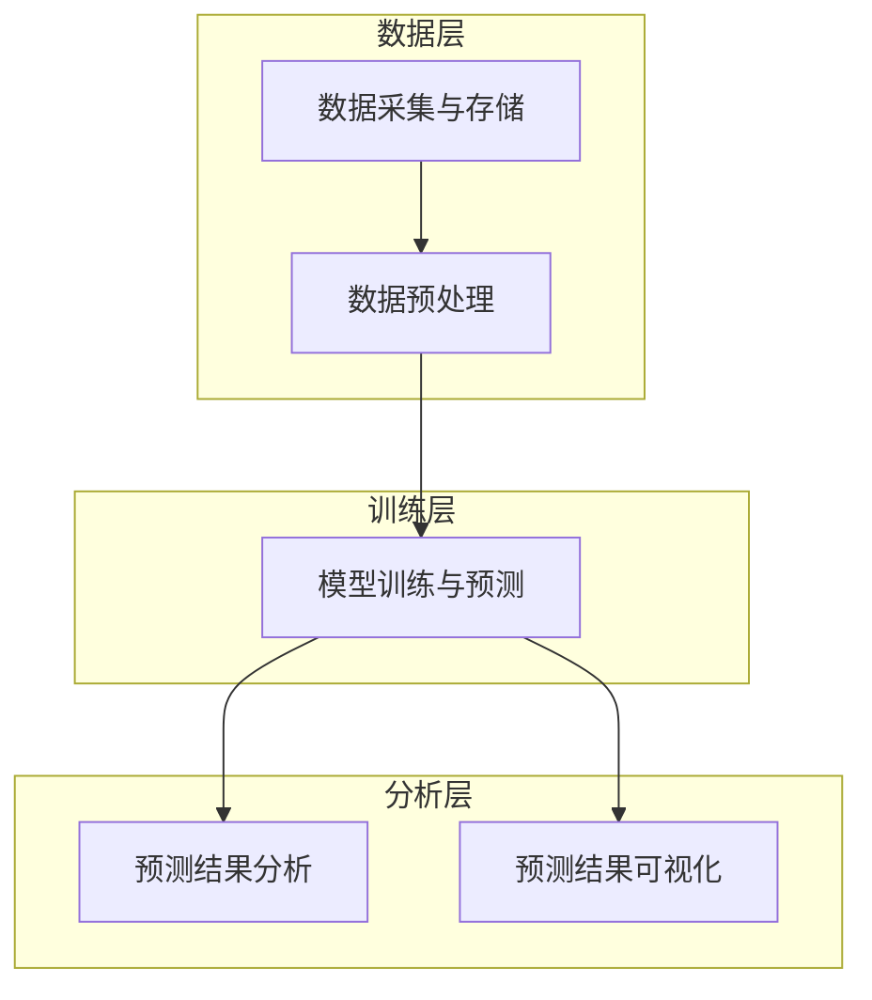

                 

## 第一部分: 背景介绍与核心概念

### 第1章: 问题背景与核心概念

#### 1.1.1 问题背景

在当今的商业环境中，企业面临的市场竞争日益激烈，对业务决策的准确性和效率提出了更高的要求。绩效预测作为企业制定战略规划和运营决策的重要工具，其准确性直接关系到企业的生存和发展。然而，传统的绩效预测方法往往依赖于历史数据和简单统计模型，无法充分挖掘数据中的潜在价值，导致预测结果的不准确性和滞后性。

首先，企业绩效预测的重要性不言而喻。通过准确预测企业的财务状况、市场占有率、销售额等关键绩效指标（KPI），企业可以提前识别潜在的风险和机会，从而调整战略规划，优化资源配置，提升运营效率。此外，绩效预测还能够帮助企业在竞争激烈的市场中保持竞争优势，制定更具前瞻性的业务策略。

然而，传统的绩效预测方法存在明显的局限性。一方面，传统方法主要依赖于历史数据和简单的统计模型，如线性回归、时间序列分析等。这些模型虽然在一定程度上能够捕捉数据的趋势和模式，但无法处理复杂、非线性关系，导致预测结果的不准确性。另一方面，传统方法的数据处理能力有限，无法从海量数据中提取出有效的信息，进而影响预测的精度和效率。

随着人工智能（AI）技术的发展，尤其是机器学习、深度学习、数据挖掘等技术的广泛应用，为智能企业绩效预测提供了新的解决方案。AI技术具有强大的数据处理和分析能力，能够从复杂、大规模的数据中发现潜在的规律和模式，从而提高绩效预测的准确性和实时性。

首先，机器学习算法通过训练大量历史数据，可以自动发现数据中的特征和关系，从而构建出更加精确的预测模型。这些算法不仅能够处理非线性关系，还能够适应数据的变化，提高预测的鲁棒性。其次，深度学习模型，如卷积神经网络（CNN）、递归神经网络（RNN）等，通过多层神经网络结构，能够处理更加复杂的数据，提取更加深层次的特征，从而提高预测的精度。此外，数据挖掘技术，如关联规则挖掘、聚类分析、分类算法等，能够从海量数据中发现潜在的模式和关联，为企业提供更加全面的预测依据。

综上所述，AI技术在绩效预测中的应用具有巨大的潜力。通过引入AI技术，企业不仅能够提高绩效预测的准确性和实时性，还能够优化业务决策，提升运营效率，从而在激烈的市场竞争中脱颖而出。

#### 1.1.2 核心概念

在本章中，我们将介绍几个核心概念：智能企业、绩效预测和AI技术。

首先，什么是智能企业？智能企业是指那些运用先进的人工智能技术，实现业务智能化、数据驱动化，从而在市场竞争中保持领先地位的企业。智能企业通常具备以下特征：

1. **数据驱动**：智能企业注重数据的收集、处理和分析，通过数据驱动决策，提高业务效率。
2. **自动化**：智能企业利用自动化技术，如机器人和自动化流程，减少人工干预，提高生产效率和灵活性。
3. **个性化**：智能企业通过数据分析和用户行为预测，提供个性化的产品和服务，提升客户满意度。
4. **实时响应**：智能企业能够快速响应市场变化和客户需求，及时调整业务策略。

接下来是绩效预测。绩效预测是指通过分析历史数据和当前业务环境，预测企业的未来绩效，如销售额、市场占有率、成本等关键指标。绩效预测的目的是帮助企业提前识别潜在的风险和机会，制定更加科学的战略规划和运营决策。

最后，我们讨论一下AI技术。AI技术是指模拟、延伸和扩展人类智能的技术，包括机器学习、深度学习、自然语言处理、计算机视觉等。在绩效预测中，AI技术可以发挥以下作用：

1. **数据处理**：AI技术能够处理海量、复杂的数据，从数据中发现潜在的模式和关系，提高预测的精度。
2. **自动化建模**：通过机器学习和深度学习算法，AI技术能够自动化构建预测模型，减少人工干预，提高预测效率。
3. **实时预测**：AI技术能够实时处理和分析数据，提供实时的绩效预测结果，帮助企业快速响应市场变化。
4. **优化决策**：基于AI技术预测的结果，企业可以优化业务决策，提升运营效率，降低成本。

#### 1.1.3 概念联系与边界

智能企业、绩效预测和AI技术之间有着密切的联系。智能企业通过引入AI技术，实现了业务的智能化和数据驱动化，从而提升了绩效预测的准确性和实时性。具体来说，这种联系可以从以下几个方面来理解：

1. **智能企业与绩效预测的关系**：智能企业通过数据驱动决策，绩效预测是其核心功能之一。智能企业利用AI技术，如机器学习、深度学习和数据挖掘，对大量业务数据进行处理和分析，从而实现精准的绩效预测。

2. **AI技术在绩效预测中的应用边界**：AI技术在绩效预测中的应用不仅限于数据分析和建模，还包括自动化数据处理、实时预测和优化决策。通过这些应用，AI技术能够突破传统方法的局限性，提供更加准确、高效的预测结果。

3. **智能企业与业务目标的制定与优化**：智能企业通过绩效预测，可以提前识别潜在的风险和机会，优化业务目标。例如，通过预测未来销售额，企业可以制定更加科学的销售策略，优化库存管理，降低运营成本。

然而，AI技术在绩效预测中的应用也存在一定的边界。首先，AI技术依赖于高质量的数据，如果数据质量差或数据量不足，AI模型的预测效果会大打折扣。其次，AI技术需要大量的计算资源和训练时间，对于实时性要求高的场景，这可能是一个挑战。此外，AI模型可能存在过拟合或欠拟合的问题，需要通过调参和模型优化来提高预测性能。

#### 1.1.4 本章小结

本章首先介绍了企业绩效预测的重要性以及传统绩效预测方法的局限性，然后引出了AI技术在绩效预测中的应用潜力。通过介绍智能企业、绩效预测和AI技术的核心概念，我们理解了这些概念之间的联系与作用。本章为后续章节的深入讨论奠定了基础，指出了智能企业绩效预测的重要性和发展方向。

在接下来的章节中，我们将进一步探讨绩效预测的基本原理，详细介绍AI技术在绩效预测中的应用，包括机器学习算法、深度学习模型和数据挖掘技术。通过这些探讨，我们将更好地理解智能企业绩效预测的实现机制，为企业提供更具前瞻性和实用性的业务决策支持。

## 第二部分: 智能企业绩效预测的理论基础

### 第2章: 绩效预测的基本原理

#### 2.1.1 绩效预测的概念

绩效预测是企业通过分析历史数据和当前业务环境，预测未来绩效水平的一种方法。它旨在识别业务趋势和潜在风险，从而帮助企业制定科学的战略规划和运营决策。绩效预测的关键概念包括：

1. **关键绩效指标（KPI）**：KPI是衡量企业绩效的重要指标，如销售额、市场份额、利润率、客户满意度等。这些指标反映了企业的运营状况和市场表现。
2. **历史数据**：历史数据是绩效预测的重要基础。通过分析历史数据，可以了解业务趋势和周期性变化，从而预测未来的绩效水平。
3. **当前业务环境**：当前业务环境包括市场状况、竞争对手、政策法规等外部因素，这些因素会对企业的绩效产生重要影响。

#### 2.1.2 绩效预测的流程

绩效预测通常包括以下几个步骤：

1. **数据收集与预处理**：收集与绩效相关的历史数据，并进行数据清洗、归一化和特征提取等预处理操作，以确保数据的准确性和一致性。
2. **模型选择与训练**：选择合适的预测模型，如机器学习算法、深度学习模型等，对预处理后的数据进行分析和训练，以建立预测模型。
3. **预测与评估**：使用训练好的模型对未来的绩效进行预测，并评估预测结果的准确性和可靠性。
4. **预测结果的应用**：将预测结果应用于企业的战略规划和运营决策，如调整销售策略、优化库存管理、提升客户满意度等。

#### 2.1.3 绩效预测的关键技术

绩效预测的关键技术主要包括：

1. **机器学习算法**：机器学习算法通过训练大量历史数据，可以自动发现数据中的特征和关系，从而构建出预测模型。常见的机器学习算法包括线性回归、逻辑回归、决策树、随机森林和支持向量机等。
2. **深度学习模型**：深度学习模型通过多层神经网络结构，能够处理更加复杂的数据，提取更加深层次的特征，从而提高预测精度。常见的深度学习模型包括卷积神经网络（CNN）、递归神经网络（RNN）、长短期记忆网络（LSTM）和生成对抗网络（GAN）等。
3. **数据挖掘技术**：数据挖掘技术通过挖掘大量数据中的潜在模式和信息，为企业提供更加全面的预测依据。常见的数据挖掘技术包括关联规则挖掘、聚类分析、分类算法和聚类算法等。

#### 2.1.4 本章小结

本章详细介绍了绩效预测的基本原理，包括概念、流程和关键技术。通过理解这些基本原理，我们可以更好地把握绩效预测的核心要义，并为后续章节的深入讨论打下基础。在下一章中，我们将探讨AI技术在绩效预测中的应用，包括机器学习算法、深度学习模型和数据挖掘技术的具体实践。

## 第三部分: AI技术在绩效预测中的应用

### 第3章: 机器学习算法在绩效预测中的应用

#### 3.1.1 机器学习算法概述

机器学习算法是绩效预测中的核心技术之一，它通过从历史数据中自动学习规律和模式，从而预测未来的绩效水平。机器学习算法可以分为以下几类：

1. **监督学习**：监督学习算法通过训练样本的数据集来学习特征和目标之间的关系，从而在新的数据上进行预测。常见的监督学习算法包括线性回归、逻辑回归、决策树、随机森林和支持向量机等。
2. **无监督学习**：无监督学习算法不依赖于标签数据，通过分析数据的内在结构，从而发现数据的分布和模式。常见的无监督学习算法包括聚类分析和关联规则挖掘等。
3. **半监督学习**：半监督学习算法结合了监督学习和无监督学习的特点，通过利用一部分标注数据和大量未标注数据，提高模型的泛化能力。

#### 3.1.2 常见的机器学习算法

在本节中，我们将详细介绍几种常见的机器学习算法，并探讨它们在绩效预测中的具体应用。

1. **线性回归**：线性回归是一种简单的监督学习算法，它通过拟合一条直线来预测目标值。线性回归模型的形式为：
   \[
   y = \beta_0 + \beta_1 \cdot x
   \]
   其中，\(y\) 是目标变量，\(x\) 是特征变量，\(\beta_0\) 和 \(\beta_1\) 是模型的参数。线性回归广泛应用于销售额预测、价格预测等领域。

2. **逻辑回归**：逻辑回归是一种二分类的监督学习算法，它通过拟合一个逻辑函数来预测目标变量的概率分布。逻辑回归模型的形式为：
   \[
   \log\left(\frac{p}{1-p}\right) = \beta_0 + \beta_1 \cdot x
   \]
   其中，\(p\) 是目标变量为1的概率，\(\beta_0\) 和 \(\beta_1\) 是模型的参数。逻辑回归广泛应用于客户流失预测、疾病预测等领域。

3. **决策树**：决策树是一种基于树结构的监督学习算法，它通过一系列的决策规则来对数据进行分类或回归。决策树的每个节点代表一个特征，每个分支代表该特征的一个可能取值。决策树模型的形式为：
   \[
   y = \sum_{i=1}^{n} \beta_i \cdot x_i
   \]
   其中，\(y\) 是目标变量，\(x_i\) 是特征变量，\(\beta_i\) 是模型的参数。决策树广泛应用于市场细分、客户细分等领域。

4. **随机森林**：随机森林是一种基于决策树的集成学习算法，它通过构建多棵决策树，并投票得出最终预测结果。随机森林模型的形式为：
   \[
   y = \sum_{i=1}^{n} \beta_i \cdot x_i
   \]
   其中，\(y\) 是目标变量，\(x_i\) 是特征变量，\(\beta_i\) 是模型的参数。随机森林广泛应用于风险评估、信用评分等领域。

5. **支持向量机**：支持向量机是一种基于间隔最大化的监督学习算法，它通过找到一个最佳的超平面来对数据进行分类。支持向量机模型的形式为：
   \[
   y = \sigma(\beta_0 + \beta_1 \cdot x)
   \]
   其中，\(y\) 是目标变量，\(x\) 是特征变量，\(\beta_0\) 和 \(\beta_1\) 是模型的参数。支持向量机广泛应用于图像分类、文本分类等领域。

#### 3.1.3 机器学习算法在绩效预测中的实践

在本节中，我们将通过两个实际案例，探讨机器学习算法在绩效预测中的应用。

**实践案例1：销售预测**

假设一家电商平台希望通过历史销售数据预测未来的销售额。数据包括每天的销售数量、广告投放成本、促销活动等特征。我们采用线性回归算法进行销售预测。具体步骤如下：

1. 数据收集与预处理：收集过去一年的销售数据，并进行数据清洗和特征提取，如归一化处理、缺失值填补等。
2. 模型训练：使用70%的数据进行模型训练，构建线性回归模型。
3. 模型评估：使用剩余30%的数据对模型进行评估，计算预测误差和预测精度。
4. 预测应用：使用训练好的模型对未来的销售额进行预测，并制定相应的销售策略。

**实践案例2：客户流失预测**

假设一家电信公司希望通过客户行为数据预测哪些客户可能会流失，从而采取相应的挽留措施。数据包括客户的通话时长、通话频率、短信使用量等特征。我们采用逻辑回归算法进行客户流失预测。具体步骤如下：

1. 数据收集与预处理：收集过去一年的客户行为数据，并进行数据清洗和特征提取。
2. 模型训练：使用70%的数据进行模型训练，构建逻辑回归模型。
3. 模型评估：使用剩余30%的数据对模型进行评估，计算预测准确率和召回率。
4. 预测应用：使用训练好的模型对未来的客户流失风险进行预测，并针对高风险客户制定挽留策略。

#### 3.1.4 本章小结

本章介绍了机器学习算法在绩效预测中的应用，包括监督学习、无监督学习和半监督学习算法，以及具体的算法实例。通过实践案例，我们展示了如何使用机器学习算法进行销售预测和客户流失预测。这些案例展示了机器学习算法在绩效预测中的实际应用价值，为企业提供了有效的决策支持工具。在下一章中，我们将进一步探讨深度学习模型在绩效预测中的应用。

## 第四部分: 深度学习模型在绩效预测中的应用

### 第4章: 深度学习模型在绩效预测中的应用

#### 4.1.1 深度学习模型概述

深度学习模型是一类基于多层神经网络结构的机器学习算法，通过多层神经元的非线性变换，可以自动学习数据中的复杂特征和模式。深度学习模型在图像识别、自然语言处理、语音识别等领域取得了显著的成果。在绩效预测中，深度学习模型同样具有广泛的应用潜力。

首先，深度学习模型的基本结构包括输入层、隐藏层和输出层。输入层接收外部输入数据，隐藏层通过多次非线性变换，提取数据中的特征，输出层生成预测结果。深度学习模型的核心在于其多层神经网络结构，这使得模型能够处理更加复杂和大规模的数据。

其次，深度学习模型的发展历程可以分为以下几个阶段：

1. **浅层神经网络**：早期的神经网络通常只有一两层，难以处理复杂的问题。浅层神经网络主要通过线性变换和简单非线性激活函数，提取数据的基本特征。
2. **深层神经网络**：随着计算能力的提升，研究者开始尝试构建多层神经网络。深层神经网络通过多次非线性变换，能够提取数据中的深层次特征，从而提高预测精度。
3. **卷积神经网络（CNN）**：卷积神经网络是深度学习模型在图像处理领域的经典应用。通过卷积操作和池化操作，CNN能够提取图像中的局部特征和整体特征，广泛应用于图像分类、目标检测等任务。
4. **递归神经网络（RNN）**：递归神经网络是深度学习模型在序列数据处理领域的经典应用。通过循环连接，RNN能够处理时间序列数据，提取序列中的特征和模式，广泛应用于语音识别、自然语言处理等任务。
5. **长短期记忆网络（LSTM）**：长短期记忆网络是RNN的一种变体，通过引入记忆单元和门控机制，LSTM能够更好地处理长序列数据，减少梯度消失和梯度爆炸的问题。
6. **生成对抗网络（GAN）**：生成对抗网络是深度学习模型在生成数据领域的创新应用。通过对抗性训练，GAN能够生成高质量的数据，广泛应用于图像生成、语音合成等任务。

#### 4.1.2 常见的深度学习模型

在本节中，我们将介绍几种常见的深度学习模型，包括卷积神经网络（CNN）、递归神经网络（RNN）、长短期记忆网络（LSTM）和生成对抗网络（GAN），并探讨它们在绩效预测中的应用。

1. **卷积神经网络（CNN）**：卷积神经网络是一种基于卷积操作的深度学习模型，广泛应用于图像处理领域。CNN通过卷积层和池化层，能够提取图像中的局部特征和整体特征，从而实现图像分类、目标检测等任务。在绩效预测中，CNN可以用于图像数据的特征提取，如产品销售额预测、客户行为分析等。

2. **递归神经网络（RNN）**：递归神经网络是一种基于递归连接的深度学习模型，广泛应用于序列数据处理领域。RNN通过循环连接，能够处理时间序列数据，提取序列中的特征和模式，如股票价格预测、语音识别等。在绩效预测中，RNN可以用于处理时间序列数据，如销售数据、客户流失数据等，从而实现精准的绩效预测。

3. **长短期记忆网络（LSTM）**：长短期记忆网络是RNN的一种变体，通过引入记忆单元和门控机制，能够更好地处理长序列数据。LSTM在时间序列预测中具有广泛的应用，如股票价格预测、客户需求预测等。在绩效预测中，LSTM可以用于处理长期趋势和季节性变化，从而提高预测精度。

4. **生成对抗网络（GAN）**：生成对抗网络是一种基于对抗性训练的深度学习模型，通过生成器和判别器的对抗性训练，能够生成高质量的数据。GAN在图像生成、语音合成等领域取得了显著成果。在绩效预测中，GAN可以用于生成虚拟数据，如模拟不同市场环境下的销售数据，从而进行压力测试和风险分析。

#### 4.1.3 深度学习模型在绩效预测中的实践

在本节中，我们将通过两个实际案例，探讨深度学习模型在绩效预测中的应用。

**实践案例1：股价预测**

假设一家金融机构希望通过历史股价数据预测未来的股价走势。数据包括每日的开盘价、收盘价、最高价、最低价等。我们采用LSTM模型进行股价预测。具体步骤如下：

1. 数据收集与预处理：收集过去几年的股价数据，并进行数据清洗和特征提取，如归一化处理、缺失值填补等。
2. 模型训练：使用70%的数据进行模型训练，构建LSTM模型。
3. 模型评估：使用剩余30%的数据对模型进行评估，计算预测误差和预测精度。
4. 预测应用：使用训练好的模型对未来的股价进行预测，并制定相应的投资策略。

**实践案例2：客户需求预测**

假设一家零售企业希望通过历史销售数据预测未来的客户需求。数据包括每日的销售数量、客户购买频率、季节性因素等。我们采用CNN模型进行客户需求预测。具体步骤如下：

1. 数据收集与预处理：收集过去几年的销售数据，并进行数据清洗和特征提取，如归一化处理、缺失值填补等。
2. 模型训练：使用70%的数据进行模型训练，构建CNN模型。
3. 模型评估：使用剩余30%的数据对模型进行评估，计算预测误差和预测精度。
4. 预测应用：使用训练好的模型对未来的客户需求进行预测，并制定相应的库存管理策略。

#### 4.1.4 本章小结

本章介绍了深度学习模型在绩效预测中的应用，包括卷积神经网络（CNN）、递归神经网络（RNN）、长短期记忆网络（LSTM）和生成对抗网络（GAN）等。通过实践案例，我们展示了如何使用深度学习模型进行股价预测和客户需求预测。这些案例表明，深度学习模型在绩效预测中具有显著的优势，能够实现更加精准和实时的预测结果。在下一章中，我们将进一步探讨数据挖掘技术在绩效预测中的应用。

## 第五部分: 数据挖掘技术在绩效预测中的应用

### 第5章: 数据挖掘技术在绩效预测中的应用

#### 5.1.1 数据挖掘技术概述

数据挖掘技术是一种从大量数据中发现潜在信息、模式和知识的方法，广泛应用于各个领域，包括金融、零售、医疗等。在绩效预测中，数据挖掘技术可以用于识别业务趋势、预测未来绩效、发现潜在风险和机会等。数据挖掘技术的基本流程包括：

1. **数据预处理**：数据预处理是数据挖掘的关键步骤，包括数据清洗、归一化、特征提取等，以确保数据的准确性和一致性。
2. **数据探索**：通过统计分析、可视化等方法，对数据集进行初步探索，发现数据中的异常、趋势和关联性。
3. **模型选择**：根据业务需求和数据特点，选择合适的数据挖掘算法，如关联规则挖掘、聚类分析、分类算法和聚类算法等。
4. **模型训练与评估**：使用训练数据集对模型进行训练，并使用验证数据集对模型进行评估，调整模型参数，提高预测准确性。
5. **结果解释与应用**：对模型结果进行解释和验证，将数据挖掘结果应用于业务决策，如优化库存管理、制定销售策略等。

#### 5.1.2 常见的数据挖掘算法

在本节中，我们将介绍几种常见的数据挖掘算法，并探讨它们在绩效预测中的应用。

1. **关联规则挖掘**：关联规则挖掘是一种用于发现数据项之间关联性的方法，通过支持度和置信度等指标，挖掘出频繁出现的规则。在绩效预测中，关联规则挖掘可以用于识别销售商品之间的关联，预测客户购买行为，从而优化库存管理和销售策略。

2. **聚类分析**：聚类分析是一种将数据集划分为若干个类别的无监督学习方法，通过相似度度量，将数据点归为不同的聚类。在绩效预测中，聚类分析可以用于客户细分、市场细分等，帮助企业在目标客户群体中制定有针对性的营销策略。

3. **分类算法**：分类算法是一种有监督学习方法，通过训练数据集，将新数据分类到预定义的类别中。常见的分类算法包括决策树、随机森林、支持向量机等。在绩效预测中，分类算法可以用于客户流失预测、信用评分等，帮助企业在风险管理和业务决策中做出更准确的判断。

4. **聚类算法**：聚类算法是一种无监督学习方法，通过相似度度量，将数据集划分为若干个聚类。常见的聚类算法包括K-means、层次聚类等。在绩效预测中，聚类算法可以用于客户细分、市场细分等，帮助企业更好地了解客户需求和市场动态。

#### 5.1.3 数据挖掘技术在绩效预测中的实践

在本节中，我们将通过两个实际案例，探讨数据挖掘技术在绩效预测中的应用。

**实践案例1：客户细分**

假设一家零售企业希望通过数据挖掘技术，对客户进行细分，以便制定更加精准的营销策略。数据包括客户的购买记录、消费金额、购买频率等。我们采用K-means聚类算法进行客户细分。具体步骤如下：

1. 数据收集与预处理：收集过去一年的客户购买数据，并进行数据清洗和特征提取，如缺失值填补、归一化处理等。
2. 模型训练：使用K-means算法对客户数据进行聚类，划分出不同类型的客户群体。
3. 模型评估：通过评估聚类结果，确定最佳的聚类数量，确保聚类效果。
4. 结果应用：根据聚类结果，制定有针对性的营销策略，如向高价值客户推出专属优惠、向潜力客户提供免费试用等。

**实践案例2：市场细分**

假设一家市场调研公司希望通过数据挖掘技术，对市场进行细分，以发现潜在的市场机会。数据包括消费者的年龄、收入、职业、消费习惯等。我们采用关联规则挖掘算法进行市场细分。具体步骤如下：

1. 数据收集与预处理：收集大量消费者数据，并进行数据清洗和特征提取，如缺失值填补、归一化处理等。
2. 模型训练：使用关联规则挖掘算法，挖掘出消费者行为之间的关联规则。
3. 模型评估：通过评估关联规则的置信度和支持度，确定有效的市场细分规则。
4. 结果应用：根据市场细分结果，制定有针对性的市场推广策略，如开发新产品、优化广告投放等。

#### 5.1.4 本章小结

本章介绍了数据挖掘技术在绩效预测中的应用，包括关联规则挖掘、聚类分析、分类算法和聚类算法等。通过实际案例，我们展示了如何使用数据挖掘技术进行客户细分和市场细分，从而为企业制定更科学的绩效预测策略。数据挖掘技术在绩效预测中具有重要的作用，能够帮助企业更好地理解市场动态和客户需求，提升业务决策的准确性和效率。在下一章中，我们将探讨智能企业绩效预测系统的设计与实现。

## 第六部分: 智能企业绩效预测系统设计与实现

### 第6章: 智能企业绩效预测系统的设计与架构

#### 6.1.1 系统需求分析

智能企业绩效预测系统的设计与实现需要充分理解企业的业务需求和数据资源。系统需求分析主要包括以下几个方面：

1. **数据需求**：系统需要收集并整合企业的各类数据，包括财务数据、销售数据、客户数据、市场数据等。数据来源可以是企业内部的数据库、外部数据提供商等。

2. **功能需求**：系统应具备以下功能：

   - **数据预处理**：对原始数据进行清洗、归一化和特征提取，为后续的模型训练和预测提供高质量的数据。
   - **模型训练**：使用机器学习算法、深度学习模型和数据挖掘算法，对预处理后的数据进行分析和训练，建立绩效预测模型。
   - **模型评估**：使用验证数据集对模型进行评估，计算预测误差和预测精度，调整模型参数，优化预测效果。
   - **预测与可视化**：使用训练好的模型对未来的绩效进行预测，并将预测结果可视化，便于企业决策者理解和应用。

3. **性能需求**：系统应具备较高的性能，能够在短时间内处理大量数据，并快速生成预测结果。

#### 6.1.2 系统架构设计

智能企业绩效预测系统的架构设计应考虑以下几个方面：

1. **数据采集与存储模块**：该模块负责收集和存储企业的各类数据，包括财务数据、销售数据、客户数据、市场数据等。数据可以存储在关系型数据库（如MySQL、PostgreSQL）或分布式数据库（如Hadoop、HBase）中。

2. **数据预处理模块**：该模块负责对原始数据进行清洗、归一化和特征提取，为后续的模型训练和预测提供高质量的数据。数据预处理可以使用Python、Java等编程语言，结合Pandas、NumPy等库进行实现。

3. **模型训练与预测模块**：该模块负责使用机器学习算法、深度学习模型和数据挖掘算法，对预处理后的数据进行分析和训练，建立绩效预测模型。可以使用TensorFlow、PyTorch等深度学习框架进行模型训练。

4. **预测结果分析与可视化模块**：该模块负责对预测结果进行分析和可视化，生成图表和报告，便于企业决策者理解和应用。可以使用Matplotlib、Seaborn等可视化库进行实现。

#### 6.1.3 系统架构图

以下是一个简单的智能企业绩效预测系统架构图，使用Mermaid绘制：



#### 6.1.4 本章小结

本章详细介绍了智能企业绩效预测系统的设计与架构，包括数据采集与存储模块、数据预处理模块、模型训练与预测模块和预测结果分析与可视化模块。通过系统架构设计，我们能够更好地理解系统的功能和实现方式，为后续的系统实现与优化奠定了基础。在下一章中，我们将探讨智能企业绩效预测系统的实现与优化，包括环境安装、系统核心实现和实际案例分析。

## 智能企业绩效预测系统的实现与优化

### 系统环境安装

在实现智能企业绩效预测系统之前，首先需要安装和配置相应的开发环境和工具。以下是系统环境安装的步骤：

1. **Python环境安装**：
   - 安装Python3，推荐使用Anaconda，因为其集成了常见的科学计算库，如NumPy、Pandas、Matplotlib等。
   - 使用以下命令安装Anaconda：
     ```bash
     conda install -c anaconda python=3.8
     ```

2. **深度学习框架安装**：
   - 安装TensorFlow，使用以下命令：
     ```bash
     conda install -c conda-forge tensorflow
     ```

3. **数据预处理库安装**：
   - 安装Pandas、NumPy等数据预处理库：
     ```bash
     conda install -c conda-forge pandas numpy
     ```

4. **可视化库安装**：
   - 安装Matplotlib、Seaborn等可视化库：
     ```bash
     conda install -c conda-forge matplotlib seaborn
     ```

5. **数据库安装**：
   - 如果需要连接数据库，如MySQL或PostgreSQL，可以使用以下命令安装：
     ```bash
     conda install -c conda-forge mysql-connector-python
     conda install -c conda-forge psycopg2
     ```

### 系统核心实现

智能企业绩效预测系统的核心实现包括数据预处理、模型训练和预测、结果分析及可视化。以下是一个简单的实现流程：

1. **数据预处理**：

```python
import pandas as pd
from sklearn.model_selection import train_test_split
from sklearn.preprocessing import StandardScaler

# 读取数据
data = pd.read_csv('data.csv')

# 数据清洗
data = data.dropna()

# 特征提取
X = data[['feature1', 'feature2', 'feature3']]
y = data['target']

# 数据标准化
scaler = StandardScaler()
X_scaled = scaler.fit_transform(X)

# 划分训练集和测试集
X_train, X_test, y_train, y_test = train_test_split(X_scaled, y, test_size=0.2, random_state=42)
```

2. **模型训练与预测**：

```python
import tensorflow as tf
from tensorflow.keras.models import Sequential
from tensorflow.keras.layers import Dense, LSTM, Dropout

# 构建LSTM模型
model = Sequential()
model.add(LSTM(units=50, return_sequences=True, input_shape=(X_train.shape[1], 1)))
model.add(Dropout(0.2))
model.add(LSTM(units=50, return_sequences=False))
model.add(Dropout(0.2))
model.add(Dense(units=1))

# 编译模型
model.compile(optimizer='adam', loss='mean_squared_error')

# 训练模型
model.fit(X_train, y_train, epochs=100, batch_size=32, validation_split=0.1)

# 预测
predictions = model.predict(X_test)
```

3. **结果分析及可视化**：

```python
import matplotlib.pyplot as plt

# 绘制真实值与预测值的对比图
plt.figure(figsize=(10, 6))
plt.plot(y_test, label='真实值')
plt.plot(predictions, label='预测值')
plt.title('绩效预测结果')
plt.xlabel('时间')
plt.ylabel('绩效指标')
plt.legend()
plt.show()
```

### 实际案例分析与详细讲解

以下是一个实际案例：一家电商平台希望通过历史销售数据预测未来的销售额。

**数据集介绍**：

- 数据集包含过去一年的每日销售额、广告投放成本、促销活动等信息。
- 数据集大小为365条记录。

**实现步骤**：

1. 数据预处理：将数据集分为特征集和标签集，并进行归一化处理。

2. 模型训练：使用LSTM模型对数据集进行训练，设置合适的网络结构和参数。

3. 模型评估：使用测试集对模型进行评估，计算预测误差和预测精度。

4. 预测应用：使用训练好的模型对未来的销售额进行预测，并根据预测结果调整销售策略。

**代码示例**：

```python
# 数据预处理
X = data[['advertisement_cost', 'promotion_count']]
y = data['sales']

# 归一化处理
X_scaled = scaler.fit_transform(X)
y_scaled = scaler.fit_transform(y.values.reshape(-1, 1))

# 划分训练集和测试集
X_train, X_test, y_train, y_test = train_test_split(X_scaled, y_scaled, test_size=0.2, random_state=42)

# 模型训练
model = Sequential()
model.add(LSTM(units=50, return_sequences=True, input_shape=(X_train.shape[1], 1)))
model.add(Dropout(0.2))
model.add(LSTM(units=50, return_sequences=False))
model.add(Dropout(0.2))
model.add(Dense(units=1))

model.compile(optimizer='adam', loss='mean_squared_error')
model.fit(X_train, y_train, epochs=100, batch_size=32, validation_split=0.1)

# 预测
predictions = model.predict(X_test)

# 结果分析
mse = mean_squared_error(y_test, predictions)
print(f'MSE: {mse}')

# 可视化
plt.figure(figsize=(10, 6))
plt.plot(y_test, label='真实值')
plt.plot(predictions, label='预测值')
plt.title('销售额预测结果')
plt.xlabel('时间')
plt.ylabel('销售额')
plt.legend()
plt.show()
```

### 项目小结

在本章中，我们详细介绍了智能企业绩效预测系统的实现与优化。通过数据预处理、模型训练和预测、结果分析及可视化等步骤，我们展示了如何构建和优化绩效预测模型。实际案例分析和详细讲解进一步展示了系统的应用效果。通过本项目，我们不仅掌握了智能企业绩效预测系统的设计与实现方法，还了解了如何使用Python和TensorFlow等工具进行深度学习和数据挖掘。

### 最佳实践 tips

1. **数据预处理**：确保数据质量是预测准确性的基础。对缺失值、异常值和噪声进行有效处理。
2. **模型选择**：根据业务需求和数据特点选择合适的模型。对于时间序列数据，LSTM模型通常表现较好。
3. **模型优化**：通过调整网络结构、学习率、批次大小等参数，优化模型性能。
4. **可视化**：利用图表和报告直观展示预测结果，有助于业务决策者理解和使用。
5. **持续迭代**：定期更新数据和模型，以适应业务环境和市场变化。

### 注意事项

1. **计算资源**：深度学习模型训练需要大量的计算资源。确保服务器具备足够的GPU和内存。
2. **数据安全**：处理企业数据时，确保遵循数据安全和隐私保护的相关法规和规定。
3. **模型解释性**：深度学习模型通常缺乏解释性。结合业务知识和模型结果，进行合理的解释和验证。

### 拓展阅读

1. **《深度学习》（Goodfellow, I., Bengio, Y., & Courville, A.）**：详细介绍了深度学习的基本概念、算法和应用。
2. **《数据挖掘：实用工具与技术》（Han, J., Kamber, M., & Pei, J.）**：介绍了数据挖掘的基本原理和常用算法。
3. **《机器学习实战》（周志华）**：通过实际案例，讲解了机器学习的基本算法和应用。

## 作者信息

作者：AI天才研究院/AI Genius Institute & 禅与计算机程序设计艺术 /Zen And The Art of Computer Programming

