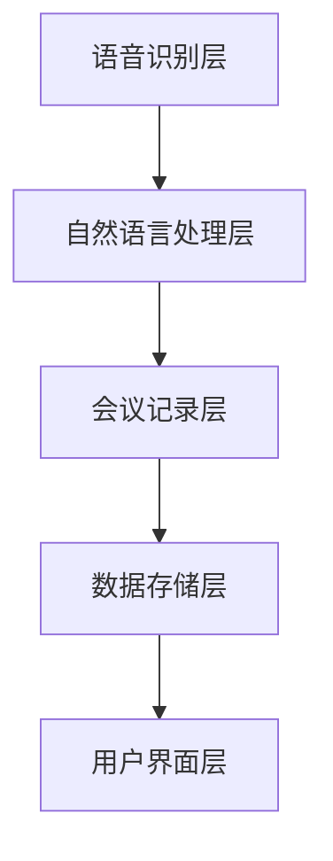
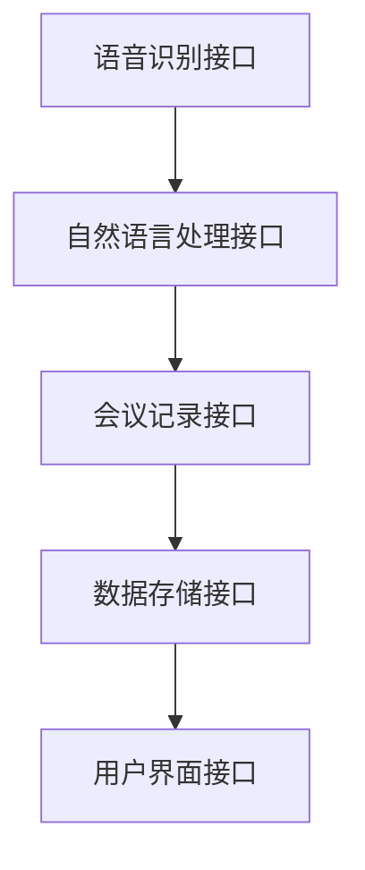

                 

### 智能会议助手：AI提升企业沟通效率

关键词：智能会议助手、AI技术、企业沟通效率、系统设计与实现

摘要：本文探讨了智能会议助手这一创新概念，以及如何利用AI技术提升企业沟通效率。通过深入分析智能会议助手的基本概念、AI技术在企业沟通中的应用、系统设计与实现等方面，本文旨在为读者提供全面的技术解读和实际案例，帮助企业在数字化时代实现高效的沟通管理。

---

### 引言

#### 问题背景

在当今快节奏的商业环境中，企业面临诸多沟通挑战，如信息传达不准确、会议效率低下等。这不仅影响了员工的工作效率，还可能导致业务流程的延误。因此，如何提升企业沟通效率成为一个亟待解决的问题。

#### 研究意义

智能会议助手作为一种新兴的技术工具，能够通过AI技术自动处理会议中的语音、文本等数据，提高会议的效率和质量。本文旨在深入探讨智能会议助手的原理与应用，为企业提供解决方案。

#### 书籍结构

本文将分为以下几个部分：

1. 引言：介绍研究背景与研究意义。
2. 智能会议助手的基本概念与原理：讲解智能会议助手的基本概念、AI技术原理及功能模块。
3. AI技术在企业沟通中的应用：分析语音识别、自然语言处理、情感分析等技术在企业沟通中的应用。
4. 智能会议助手的系统设计与实现：介绍智能会议助手的系统需求分析、架构设计、接口设计及实现与测试。
5. 实际案例分析与实践：通过实际案例展示智能会议助手的应用效果。
6. 智能会议助手的未来发展：探讨AI技术在企业沟通中的发展趋势和智能会议助手的未来发展方向。

---

## 第1章 智能会议助手的基本概念与原理

### 1.1 智能会议助手概述

智能会议助手是一种利用人工智能技术辅助企业会议的智能系统。它能够自动记录会议内容、处理语音信息、分析会议情感，从而提升会议的效率和质量。

#### 智能会议助手的组成

智能会议助手主要由以下几个部分组成：

1. **语音识别模块**：将会议中的语音转化为文本。
2. **自然语言处理模块**：对文本进行语义分析和情感分析。
3. **会议记录模块**：自动生成会议记录和总结。
4. **数据存储与检索模块**：存储会议数据并提供查询功能。
5. **用户界面模块**：提供友好的人机交互界面。

### 1.2 AI技术基本原理

智能会议助手的核心在于AI技术，以下是几种关键技术的简要介绍：

1. **语音识别**：通过将音频信号转换为文本，实现语音到文字的转换。
2. **自然语言处理（NLP）**：对文本进行分析，理解文本的含义和语义。
3. **情感分析**：分析文本中的情感倾向，了解发言者的情绪状态。
4. **机器学习**：通过大量数据训练模型，使系统具备自我学习和优化能力。

### 1.3 智能会议助手的功能模块

智能会议助手的主要功能模块包括：

1. **会议记录**：自动记录会议内容，包括发言者的姓名、发言时间和发言内容。
2. **会议总结**：根据会议记录生成总结报告，提炼关键信息和决策点。
3. **语音识别**：将会议中的语音实时转化为文本，方便后续查看和分析。
4. **情感分析**：分析发言者的情感倾向，帮助管理者了解会议氛围。
5. **数据存储与检索**：存储会议数据，并提供便捷的查询功能。

---

## 第2章 AI技术在企业沟通中的应用

### 2.1 语音识别与转换

语音识别与转换是智能会议助手的核心功能之一。它通过将会议中的语音转化为文本，实现了会议内容的高度自动化记录。

#### 原理

语音识别技术基于机器学习算法，通过大量语音数据的训练，使得计算机能够识别和理解语音内容。

#### 应用

1. **实时会议记录**：语音识别可以实时地将会议内容转化为文本，方便参会者随时查看。
2. **历史记录查询**：语音识别后的文本数据可以被存储，方便日后查询和分析。
3. **语音助手**：语音识别技术还可以用于创建智能语音助手，方便参会者通过语音进行操作。

### 2.2 自然语言处理

自然语言处理技术能够对会议中的文本进行语义分析和情感分析，从而更好地理解会议内容和参会者的情感状态。

#### 原理

自然语言处理技术包括分词、词性标注、句法分析、语义角色标注等多个层次，通过深度学习算法，实现对文本的全面理解。

#### 应用

1. **会议总结生成**：自然语言处理技术可以根据会议记录，自动生成会议总结，提炼关键信息。
2. **问题识别与解答**：自然语言处理技术可以用于自动识别会议中提出的问题，并提供相应的解答。
3. **情感分析**：分析会议文本中的情感倾向，帮助管理者了解会议氛围。

### 2.3 情感分析

情感分析是自然语言处理的一个分支，通过对文本的情感倾向进行分析，帮助理解发言者的情绪状态。

#### 原理

情感分析基于机器学习算法，通过对大量带有情感标签的文本进行训练，使得计算机能够自动判断文本的情感倾向。

#### 应用

1. **会议氛围监测**：情感分析可以帮助管理者实时了解会议氛围，及时发现和解决问题。
2. **决策支持**：根据发言者的情感状态，可以更好地进行决策和协调。
3. **员工心理辅导**：情感分析可以为员工提供心理辅导，帮助其缓解工作压力。

### 2.4 会议记录与总结

智能会议助手可以通过语音识别、自然语言处理和情感分析等技术，自动生成会议记录和总结，提高会议效率。

#### 原理

会议记录与总结生成基于AI技术，通过对会议内容的分析，自动提取关键信息，并生成详细的总结报告。

#### 应用

1. **会议效率提升**：自动生成的会议记录和总结可以大幅提升会议效率，减少手动记录的工作量。
2. **信息共享**：会议记录和总结可以作为信息共享的文档，方便参会者查看和参考。
3. **决策参考**：详细的会议记录和总结可以为决策提供重要的参考依据。

---

## 第3章 智能会议助手的系统设计与实现

### 3.1 系统需求分析

在设计和实现智能会议助手之前，我们需要明确系统的需求。以下是智能会议助手的主要需求：

1. **实时语音识别**：系统能够实时地将会议中的语音转化为文本。
2. **自然语言处理**：系统能够对文本进行语义分析和情感分析。
3. **会议记录与总结**：系统能够自动生成会议记录和总结。
4. **数据存储与检索**：系统能够存储会议数据并提供便捷的查询功能。
5. **用户界面**：系统提供友好的人机交互界面，方便用户操作。

### 3.2 系统架构设计

智能会议助手的系统架构可以分为以下几个层次：

1. **语音识别层**：负责语音到文本的转换。
2. **自然语言处理层**：负责文本的语义分析和情感分析。
3. **会议记录层**：负责会议记录的生成和存储。
4. **数据存储层**：负责数据的存储和检索。
5. **用户界面层**：负责与用户进行交互。

以下是一个简化的系统架构图：



### 3.3 系统接口设计

系统接口设计是确保智能会议助手与其他系统有效集成的重要部分。以下是主要的接口设计：

1. **语音识别接口**：提供语音识别功能，接受音频输入并返回文本输出。
2. **自然语言处理接口**：提供语义分析和情感分析功能，接受文本输入并返回分析结果。
3. **会议记录接口**：提供会议记录的生成和存储功能，接受文本输入并返回记录结果。
4. **数据存储接口**：提供数据的存储和检索功能，接受数据请求并返回数据结果。
5. **用户界面接口**：提供用户交互功能，接受用户操作并返回操作结果。

以下是一个简化的接口设计图：



### 3.4 系统实现与测试

智能会议助手的实现涉及多个模块的协同工作。以下是实现和测试的简要步骤：

1. **模块开发**：根据系统需求，开发语音识别、自然语言处理、会议记录等模块。
2. **系统集成**：将各个模块集成到一起，实现系统的整体功能。
3. **功能测试**：对系统的各个功能进行测试，确保其正常运行。
4. **性能测试**：对系统的性能进行测试，确保其能够满足实际应用的需求。
5. **用户测试**：邀请实际用户参与测试，收集反馈意见，进行系统优化。

### 3.5 系统实现示例

以下是智能会议助手的实现示例，使用Python编程语言：

```python
# 语音识别模块实现示例
import speech_recognition as sr

def recognize_speech_from_mic():
    # 使用麦克风录制音频
    r = sr.Recognizer()
    with sr.Microphone() as source:
        print("请开始说话...")
        audio = r.listen(source)

    # 使用Google语音识别API进行语音识别
    try:
        text = r.recognize_google(audio, language='zh-CN')
        return text
    except sr.UnknownValueError:
        return None

# 自然语言处理模块实现示例
from textblob import TextBlob

def analyze_sentiment(text):
    # 使用TextBlob进行情感分析
    blob = TextBlob(text)
    return blob.sentiment.polarity

# 会议记录模块实现示例
def generate_meeting_summary(text):
    # 使用自然语言处理技术生成会议总结
    # （此处仅为示例，实际应用中可能需要更复杂的处理）
    summary = text[:100]
    return summary

# 系统主函数实现示例
def main():
    # 记录会议内容
    speech_text = recognize_speech_from_mic()
    if speech_text:
        # 分析情感
        sentiment = analyze_sentiment(speech_text)
        print(f"会议内容：{speech_text}")
        print(f"情感分析结果：{sentiment}")
        
        # 生成会议总结
        summary = generate_meeting_summary(speech_text)
        print(f"会议总结：{summary}")
    else:
        print("无法识别语音内容")

if __name__ == "__main__":
    main()
```

---

## 第4章 实际案例分析与实践

### 4.1 案例一：某企业智能会议应用案例

#### 案例背景

某大型企业在其日常运营中，面临着会议频繁、记录繁琐、信息传递不畅等问题。为了提高会议效率和沟通效果，该企业决定引入智能会议助手。

#### 案例实施

1. **需求调研**：企业对智能会议助手的需求包括实时语音识别、会议记录、情感分析、数据存储和检索等功能。
2. **系统部署**：企业选择了现成的智能会议助手系统，并进行了适当的定制和部署，以满足其特殊需求。
3. **用户培训**：企业组织了用户培训，确保员工能够熟练使用智能会议助手。
4. **实际应用**：在多个会议场景中，智能会议助手得到了广泛应用，取得了良好的效果。

#### 案例效果

1. **会议效率提升**：智能会议助手能够自动记录会议内容，减少了手动记录的工作量，提高了会议效率。
2. **信息传递准确**：通过情感分析和会议总结，企业管理者能够更好地了解会议氛围和决策过程，确保信息传递准确。
3. **数据管理便捷**：智能会议助手提供了便捷的数据存储和检索功能，方便企业对会议数据进行管理和查询。

### 4.2 案例二：某会议系统功能扩展案例

#### 案例背景

某中小企业现有的会议系统功能较为单一，无法满足企业日益增长的沟通需求。为了提升会议系统的功能，企业决定对其进行扩展。

#### 案例实施

1. **需求分析**：企业对现有会议系统进行了全面的需求分析，确定了需要扩展的功能，如实时语音识别、自然语言处理、情感分析等。
2. **开发与集成**：企业邀请了专业开发团队，对会议系统进行了功能扩展，并将其与现有的业务系统进行了集成。
3. **测试与优化**：在扩展功能上线前，企业进行了全面的测试和优化，确保新功能能够稳定运行。
4. **用户反馈**：在扩展功能上线后，企业收集了用户反馈，并根据反馈进行了进一步优化。

#### 案例效果

1. **功能丰富**：通过功能扩展，会议系统的功能得到了大幅提升，能够更好地满足企业的沟通需求。
2. **用户体验提升**：新功能的出现提高了用户的体验，使得会议变得更加高效和有趣。
3. **系统稳定性增强**：通过测试和优化，会议系统的稳定性得到了显著提升，减少了系统故障和中断。

---

## 第5章 智能会议助手的未来发展

### 5.1 AI技术在企业沟通中的发展趋势

随着人工智能技术的不断发展，智能会议助手在AI技术中的应用前景十分广阔。以下是几个值得关注的发展趋势：

1. **深度学习**：深度学习技术将进一步提高智能会议助手的语音识别、自然语言处理和情感分析能力。
2. **多模态交互**：未来的智能会议助手将支持语音、文本、图像等多种交互方式，提高用户的沟通体验。
3. **个性化服务**：基于用户行为数据和偏好，智能会议助手将提供更加个性化的服务，满足不同企业的需求。

### 5.2 智能会议助手的未来发展方向

智能会议助手的未来发展方向主要包括：

1. **集成化**：智能会议助手将与其他企业应用系统集成，提供一站式服务。
2. **智能化**：通过不断优化算法和模型，智能会议助手将实现更高水平的自动化和智能化。
3. **定制化**：智能会议助手将支持定制化开发，满足不同企业的个性化需求。

### 5.3 智能会议助手的商业化前景

智能会议助手作为一种高效、智能的企业沟通工具，具有广阔的商业化前景。以下是几个方面的商业化机会：

1. **企业服务**：为企业提供智能会议助手服务，提高企业沟通效率。
2. **系统集成**：与现有会议系统集成，提供增值服务。
3. **个性化定制**：为有特殊需求的企业提供个性化定制服务。

---

## 结束语

智能会议助手作为一种创新的AI技术，在提升企业沟通效率方面具有显著的优势。本文通过对智能会议助手的基本概念、应用场景、系统设计与实现等方面的深入分析，旨在为读者提供全面的技术解读和实际案例。未来，智能会议助手将在企业沟通中发挥更加重要的作用，为企业带来更多的价值。

---

作者：AI天才研究院/AI Genius Institute & 禅与计算机程序设计艺术 /Zen And The Art of Computer Programming

---

本文通过对智能会议助手的全面分析，阐述了AI技术在企业沟通中的重要作用，以及智能会议助手的系统设计与实现方法。通过实际案例，展示了智能会议助手在实际应用中的效果。展望未来，智能会议助手将在AI技术的推动下，不断发展与创新，为企业带来更高的沟通效率和管理水平。

