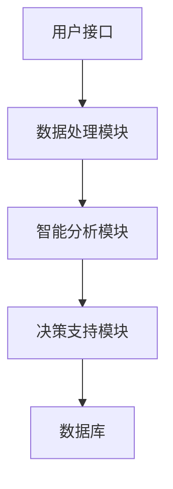

                 

# 智能会议管理系统：AI提升沟通与决策效率

## 摘要

智能会议管理系统通过集成人工智能（AI）技术，极大地提升了会议的沟通效率和决策效果。本文将系统地探讨智能会议管理系统的概念、核心技术、设计实现以及实际应用案例。通过深入分析，我们旨在展示AI技术在会议管理中的潜力和挑战，为未来智能会议管理系统的发展提供有益的启示。

## 第一部分：智能会议管理系统概述

### 1.1 问题背景与挑战

#### 1.1.1 传统会议管理中的痛点

传统会议管理中存在诸多痛点，如：

- **会议准备繁琐**：需要手动安排会议室、预定设备、发送邀请等。
- **沟通效率低下**：会议过程中，参会者可能因为信息传递不畅而导致讨论效率低下。
- **决策过程复杂**：会议纪要需要手动整理，决策结果难以实时跟踪。
- **资源浪费**：有时会议时间过长，且无法有效利用会议室等资源。

#### 1.1.2 AI技术为会议管理带来的机遇

AI技术能够有效解决上述问题，为会议管理带来以下机遇：

- **自动化准备**：AI可以帮助自动化会议室预定、设备安排和会议邀请。
- **提高沟通效率**：通过语音识别、自然语言处理等技术，实时捕捉和传递会议信息。
- **智能决策支持**：利用数据分析与挖掘，为决策提供实时、准确的依据。

### 1.2 核心概念与联系

#### 1.2.1 智能会议管理系统的定义

智能会议管理系统是一种基于人工智能技术，旨在提高会议准备、沟通和决策效率的综合性系统。

#### 1.2.2 关键技术概述

智能会议管理系统涉及的关键技术包括：

- **自然语言处理（NLP）**：用于会议纪要生成、语音识别与合成等。
- **计算机视觉**：用于会议室环境监测、参会者行为分析等。
- **语音识别与合成**：用于会议过程中的语音记录与播放。
- **数据分析与挖掘**：用于会议数据分析和决策支持。

#### 1.2.3 智能会议管理系统的架构

智能会议管理系统的架构一般包括以下几个部分：

- **用户接口**：与用户进行交互，接收用户请求和反馈。
- **数据处理模块**：接收并处理会议相关的数据。
- **智能分析模块**：利用AI技术对数据进行分析和挖掘。
- **决策支持模块**：为用户提供决策支持和会议纪要。

### 1.3 智能会议管理系统的优势与挑战

#### 1.3.1 优势分析

- **提高沟通效率**：通过自动化和智能化手段，减少会议准备时间，提高沟通效率。
- **优化决策过程**：利用数据分析与挖掘，为决策提供实时、准确的支持。
- **节约成本**：减少人力资源投入，降低会议成本。

#### 1.3.2 挑战与解决方案

- **技术挑战**：AI技术的应用需要大量的数据支持，且需处理多源异构数据。
- **隐私与安全**：会议内容涉及隐私，需要保障数据安全和用户隐私。

解决方案：

- **数据管理与保护**：采用数据加密和访问控制等技术，保障数据安全和隐私。
- **持续优化与迭代**：通过不断优化算法和模型，提高系统性能和稳定性。

### 1.4 智能会议管理系统的发展趋势

#### 1.4.1 行业现状

智能会议管理系统已经在企业、政府、教育等多个领域得到广泛应用。随着AI技术的不断进步，其应用场景也在不断扩展。

#### 1.4.2 未来发展方向

- **更深入的行业应用**：智能会议管理系统将更加深入地应用于各个行业，满足个性化需求。
- **跨平台集成**：实现跨平台、跨设备的无缝集成，提高用户体验。

### 1.5 本章小结

本部分对智能会议管理系统进行了概述，阐述了其背景、核心概念、优势与挑战以及发展趋势。接下来，我们将深入探讨智能会议管理系统所依赖的关键技术。

## 第二部分：关键技术详解

### 2.1 自然语言处理技术

#### 2.1.1 NLP基础

自然语言处理（NLP）是智能会议管理系统的核心组成部分之一。NLP涉及对人类语言进行理解和生成，旨在使计算机能够理解和处理自然语言。

- **文本分类**：根据文本内容将其归类到不同的类别。
- **实体识别**：识别文本中的关键实体，如人名、地点、组织等。
- **情感分析**：分析文本中表达的情感倾向。

#### 2.1.2 NLP应用实例

在智能会议管理系统中，NLP技术可以用于：

- **会议纪要生成**：自动记录会议内容，生成会议纪要。
- **语音识别**：将会议中的语音转化为文本。

### 2.2 计算机视觉技术

#### 2.2.1 计算机视觉基础

计算机视觉是使计算机能够从图像或视频中提取信息的一门科学。主要技术包括：

- **图像识别**：识别图像中的对象和场景。
- **目标检测**：定位图像中的对象位置。

#### 2.2.2 计算机视觉应用实例

在智能会议管理系统中，计算机视觉技术可以用于：

- **会议室环境监测**：监控会议室内的人流量、温度等。
- **参会者行为分析**：分析参会者的情绪和行为，如专注程度、参与度等。

### 2.3 语音识别与合成技术

#### 2.3.1 语音识别技术

语音识别技术用于将语音转化为文本。主要技术包括：

- **语音信号处理**：对语音信号进行预处理，如降噪、归一化等。
- **声学模型**：对语音信号进行建模。

#### 2.3.2 语音合成技术

语音合成技术用于生成自然的语音。主要技术包括：

- **语调生成**：根据文本内容生成合适的语调。
- **发音规则**：生成符合自然语言发音规则的语音。

### 2.4 数据分析与挖掘技术

#### 2.4.1 数据分析基础

数据分析是利用统计、机器学习等方法，从数据中提取有价值的信息。主要技术包括：

- **数据清洗**：去除数据中的噪声和错误。
- **数据可视化**：通过图表等形式展示数据分析结果。

#### 2.4.2 数据挖掘方法

数据挖掘方法包括：

- **聚类分析**：将相似的数据归为一类。
- **关联规则学习**：发现数据之间的关联关系。

### 2.5 机器学习与深度学习技术

#### 2.5.1 机器学习基础

机器学习是使计算机从数据中学习，以实现特定任务的一门科学。主要技术包括：

- **监督学习**：通过已知数据训练模型。
- **无监督学习**：在没有已知数据的情况下训练模型。

#### 2.5.2 深度学习基础

深度学习是机器学习的一种方法，通过多层神经网络进行学习。主要技术包括：

- **卷积神经网络（CNN）**：用于图像识别。
- **循环神经网络（RNN）**：用于序列数据处理。

### 2.6 知识图谱与语义网

#### 2.6.1 知识图谱基础

知识图谱是一种用于表示实体及其关系的图形结构。主要技术包括：

- **实体抽取**：识别文本中的实体。
- **关系抽取**：识别实体之间的关系。

#### 2.6.2 语义网应用

语义网用于表示和交换知识。主要技术包括：

- **本体论**：定义知识表示的标准。
- **语义查询**：在知识库中查询相关信息。

### 2.7 安全与隐私保护

#### 2.7.1 安全问题概述

在智能会议管理系统中，安全问题主要包括：

- **数据泄露**：会议内容可能被未经授权的人员访问。
- **恶意攻击**：系统可能受到恶意攻击。

#### 2.7.2 隐私保护方法

隐私保护方法包括：

- **数据加密**：对数据进行加密，防止泄露。
- **访问控制**：限制对数据的访问权限。

### 2.8 本章小结

本部分详细介绍了智能会议管理系统所依赖的关键技术，包括自然语言处理、计算机视觉、语音识别与合成、数据分析和挖掘、机器学习与深度学习、知识图谱与语义网以及安全与隐私保护。这些技术为智能会议管理系统提供了强大的支持，使其能够实现高效的会议管理和决策支持。

## 第三部分：智能会议管理系统设计与实现

### 3.1 系统需求分析

#### 3.1.1 功能需求

智能会议管理系统需要实现以下功能：

- **会议预约与安排**：自动安排会议室、预定设备等。
- **会议记录与纪要**：自动记录会议内容，生成会议纪要。
- **决策支持**：基于数据分析，为决策提供支持。
- **安全与隐私保护**：保障会议数据的安全与隐私。

#### 3.1.2 性能需求

智能会议管理系统需要满足以下性能需求：

- **高并发处理能力**：能够同时处理大量会议。
- **快速响应**：系统响应时间要短，确保会议顺利进行。
- **高稳定性**：系统要稳定可靠，确保数据不会丢失。

#### 3.1.3 可靠性需求

智能会议管理系统需要满足以下可靠性需求：

- **数据备份与恢复**：定期备份数据，确保数据不会丢失。
- **故障恢复**：在系统出现故障时，能够快速恢复，确保会议顺利进行。

### 3.2 系统架构设计

#### 3.2.1 系统架构图

智能会议管理系统的架构图如下：

#### 3.2.2 关键模块设计

1. **用户接口**：负责与用户进行交互，接收用户请求和反馈。
2. **数据处理模块**：接收并处理会议相关的数据，如会议记录、参会者信息等。
3. **智能分析模块**：利用AI技术对数据进行处理和分析，为决策提供支持。
4. **决策支持模块**：根据数据分析结果，为用户提供决策建议。
5. **数据库**：存储会议数据、用户数据等。

### 3.3 数据处理与分析

#### 3.3.1 数据来源

智能会议管理系统所需的数据来源包括：

- **会议记录**：包括会议内容、会议纪要等。
- **参会者信息**：包括参会者姓名、职位、联系方式等。
- **会议环境数据**：包括会议室环境、设备状态等。

#### 3.3.2 数据预处理

数据预处理步骤包括：

- **数据清洗**：去除数据中的噪声和错误。
- **数据转换**：将数据转换为适合分析的形式。
- **数据归一化**：对数据进行归一化处理，确保数据的一致性。

#### 3.3.3 数据分析

数据分析步骤包括：

- **数据可视化**：通过图表等形式展示数据分析结果。
- **聚类分析**：将相似的数据归为一类。
- **关联规则学习**：发现数据之间的关联关系。

### 3.4 通信与交互设计

#### 3.4.1 语音通信设计

语音通信设计包括：

- **语音识别**：将语音转化为文本。
- **语音合成**：将文本转化为语音。

#### 3.4.2 文本交互设计

文本交互设计包括：

- **文本输入**：用户可以通过键盘输入文本。
- **文本输出**：系统可以通过文本形式输出信息。

### 3.5 智能决策支持

#### 3.5.1 决策支持系统原理

决策支持系统（DSS）是基于数据分析和智能算法，为用户提供决策支持的系统。其原理包括：

- **数据分析**：从数据中提取有价值的信息。
- **智能算法**：利用算法为用户提供决策建议。

#### 3.5.2 决策支持实现

决策支持实现步骤包括：

- **数据收集**：收集与决策相关的数据。
- **数据预处理**：对数据进行清洗和转换。
- **数据分析**：利用算法进行数据分析。
- **决策建议**：根据数据分析结果，为用户提供决策建议。

### 3.6 系统优化与迭代

#### 3.6.1 系统性能优化

系统性能优化包括：

- **性能测试**：对系统进行性能测试，找出性能瓶颈。
- **优化算法**：针对性能瓶颈，优化算法和模型。

#### 3.6.2 用户反馈与迭代

用户反馈与迭代包括：

- **用户反馈**：收集用户使用系统的反馈。
- **系统迭代**：根据用户反馈，对系统进行迭代优化。

### 3.7 本章小结

本部分详细介绍了智能会议管理系统的设计与实现过程，包括系统需求分析、系统架构设计、数据处理与分析、通信与交互设计、智能决策支持以及系统优化与迭代。这些设计实现步骤为智能会议管理系统的成功应用提供了保障。

## 第四部分：案例研究

### 4.1 案例一：企业内部会议管理系统

#### 4.1.1 案例背景

某大型企业内部会议频繁，会议记录和纪要整理工作量大，且存在沟通效率低下、决策过程复杂等问题。为了提高会议效率和决策质量，该企业决定引入智能会议管理系统。

#### 4.1.2 系统设计与实现

系统设计与实现步骤如下：

1. **需求分析**：对企业内部会议需求进行详细分析，确定系统功能需求。
2. **系统架构设计**：设计系统架构，包括用户接口、数据处理模块、智能分析模块、决策支持模块等。
3. **数据收集与预处理**：收集会议记录、参会者信息等数据，并进行预处理。
4. **系统开发与测试**：根据设计文档，开发系统并进行测试。
5. **用户培训与上线**：对用户进行培训，确保系统能够顺利上线。

#### 4.1.3 案例效果评估

智能会议管理系统上线后，取得了显著效果：

- **沟通效率提高**：通过语音识别和自然语言处理技术，会议内容实时记录和传输，沟通效率显著提高。
- **决策过程优化**：通过数据分析与挖掘，为决策提供实时、准确的支持，决策过程更加科学和高效。
- **资源节约**：通过自动化和智能化手段，减少了会议准备时间和人力资源投入。

### 4.2 案例二：政府部门会议管理系统

#### 4.2.1 案例背景

某政府部门会议频繁，会议记录和纪要整理工作量大，且存在沟通效率低下、决策过程复杂等问题。为了提高会议效率和决策质量，该部门决定引入智能会议管理系统。

#### 4.2.2 系统设计与实现

系统设计与实现步骤如下：

1. **需求分析**：对政府部门会议需求进行详细分析，确定系统功能需求。
2. **系统架构设计**：设计系统架构，包括用户接口、数据处理模块、智能分析模块、决策支持模块等。
3. **数据收集与预处理**：收集会议记录、参会者信息等数据，并进行预处理。
4. **系统开发与测试**：根据设计文档，开发系统并进行测试。
5. **用户培训与上线**：对用户进行培训，确保系统能够顺利上线。

#### 4.2.3 案例效果评估

智能会议管理系统上线后，取得了显著效果：

- **沟通效率提高**：通过语音识别和自然语言处理技术，会议内容实时记录和传输，沟通效率显著提高。
- **决策过程优化**：通过数据分析与挖掘，为决策提供实时、准确的支持，决策过程更加科学和高效。
- **资源节约**：通过自动化和智能化手段，减少了会议准备时间和人力资源投入。

### 4.3 案例三：会议纪要自动化系统

#### 4.3.1 案例背景

某企业需要处理大量会议纪要，但人工整理工作量大且效率低下。为了提高会议纪要整理效率，该企业决定引入会议纪要自动化系统。

#### 4.3.2 系统设计与实现

系统设计与实现步骤如下：

1. **需求分析**：对会议纪要整理需求进行详细分析，确定系统功能需求。
2. **系统架构设计**：设计系统架构，包括用户接口、数据处理模块、智能分析模块等。
3. **数据收集与预处理**：收集会议记录、参会者信息等数据，并进行预处理。
4. **系统开发与测试**：根据设计文档，开发系统并进行测试。
5. **用户培训与上线**：对用户进行培训，确保系统能够顺利上线。

#### 4.3.3 案例效果评估

会议纪要自动化系统上线后，取得了显著效果：

- **工作效率提高**：通过语音识别和自然语言处理技术，自动生成会议纪要，工作效率显著提高。
- **准确性提升**：系统自动生成的会议纪要准确率高，减少了人工整理的工作量。
- **成本节约**：通过自动化手段，减少了人工整理成本。

### 4.4 本章小结

本部分通过三个案例，展示了智能会议管理系统在不同场景下的应用效果。智能会议管理系统通过提高沟通效率、优化决策过程和节约成本，为企业和政府部门带来了显著的价值。接下来，我们将进一步探讨智能会议管理系统的发展方向和挑战。

## 第五部分：未来展望与挑战

### 5.1 智能会议管理系统的发展方向

#### 5.1.1 技术发展趋势

随着人工智能技术的不断发展，智能会议管理系统将呈现以下发展趋势：

- **更高效的自然语言处理**：自然语言处理技术将更加成熟，能够更准确地理解和生成自然语言。
- **更智能的计算机视觉**：计算机视觉技术将更加精准，能够更好地识别和跟踪会议中的行为和情绪。
- **更智能的决策支持**：基于数据分析与挖掘的决策支持系统将更加智能化，为用户提供更准确的决策建议。

#### 5.1.2 应用领域扩展

智能会议管理系统将逐渐应用于更多领域，如：

- **远程会议**：随着远程办公的普及，智能会议管理系统将更好地支持远程会议的沟通和决策。
- **教育领域**：智能会议管理系统可以应用于教育机构的研讨会、课程讨论等，提高教学效果。
- **医疗领域**：智能会议管理系统可以应用于医疗机构的病例讨论、治疗方案制定等。

### 5.2 智能会议管理系统的挑战

#### 5.2.1 技术挑战

智能会议管理系统在技术方面面临以下挑战：

- **数据多样性和复杂性**：智能会议管理系统需要处理多种类型的数据，如文本、图像、语音等，且数据来源多样，数据质量参差不齐。
- **实时性与准确性**：在会议过程中，系统需要实时处理和分析数据，且保证结果的准确性。

#### 5.2.2 应用挑战

智能会议管理系统在应用方面面临以下挑战：

- **用户接受度**：用户可能对新技术存在顾虑，需要通过培训和使用体验提高用户接受度。
- **隐私保护**：会议内容涉及隐私，系统需要采取措施保护用户隐私。

### 5.3 未来展望

#### 5.3.1 潜在应用场景

未来，智能会议管理系统将在更多场景中得到应用，如：

- **跨国公司**：智能会议管理系统将帮助跨国公司实现全球范围内的高效沟通和协作。
- **在线教育**：智能会议管理系统将应用于在线教育平台，提高教育质量和互动性。
- **智能办公**：智能会议管理系统将作为智能办公平台的一部分，提高办公效率。

#### 5.3.2 技术革新趋势

随着技术的不断发展，智能会议管理系统将呈现以下技术革新趋势：

- **更加智能化的决策支持**：通过结合大数据和AI技术，智能会议管理系统将提供更加智能化的决策支持。
- **更加智能化的用户交互**：通过自然语言处理和计算机视觉技术，系统将更加智能地理解用户需求，提供个性化的服务。

### 5.4 本章小结

本部分探讨了智能会议管理系统的发展方向和挑战。未来，智能会议管理系统将借助人工智能技术的进步，在更多场景中得到广泛应用，同时面临数据多样性和复杂性、实时性与准确性、用户接受度、隐私保护等挑战。通过不断优化和革新，智能会议管理系统将为沟通与决策带来更多价值。

## 第六部分：总结与展望

### 6.1 全书总结

本文系统地探讨了智能会议管理系统的概念、核心技术、设计实现以及实际应用案例。主要内容包括：

- **背景与挑战**：分析了传统会议管理中的痛点以及AI技术为会议管理带来的机遇。
- **核心技术**：详细介绍了自然语言处理、计算机视觉、语音识别与合成、数据分析与挖掘、机器学习与深度学习、知识图谱与语义网以及安全与隐私保护等关键技术。
- **设计与实现**：阐述了智能会议管理系统的需求分析、系统架构设计、数据处理与分析、通信与交互设计、智能决策支持以及系统优化与迭代等设计实现步骤。
- **案例研究**：通过企业内部会议管理系统、政府部门会议管理系统、会议纪要自动化系统等案例，展示了智能会议管理系统的实际应用效果。
- **未来展望**：探讨了智能会议管理系统的发展方向和面临的挑战，展望了其在更多场景中的潜在应用和未来技术革新趋势。

### 6.2 学习与实践建议

为了更好地掌握智能会议管理系统，读者可以采取以下学习和实践建议：

- **理论学习**：深入学习人工智能、自然语言处理、计算机视觉等相关理论知识，为实践打下坚实基础。
- **实验操作**：通过实际操作，熟悉智能会议管理系统的设计实现过程，如数据收集、处理、分析等。
- **案例分析**：分析现有智能会议管理系统的案例，了解其设计思路和实现方法。
- **持续更新**：关注人工智能和会议管理系统领域的最新动态，不断学习和掌握新技术。

作者：AI天才研究院/AI Genius Institute & 禅与计算机程序设计艺术 /Zen And The Art of Computer Programming

