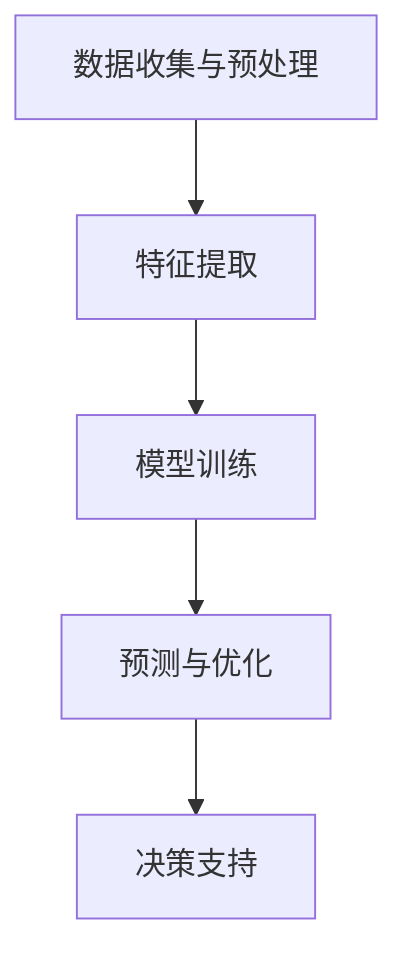
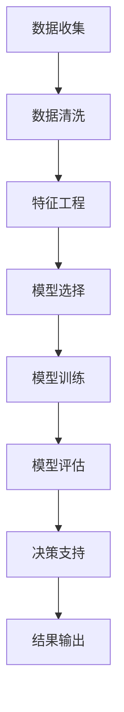

                 

### 第1章：智能供应商管理系统概述

#### 1.1 问题背景

在当今高度竞争的商业环境中，供应链管理成为企业成功的关键因素之一。供应商管理作为供应链管理的重要组成部分，其效率和质量直接影响企业的成本控制、库存管理和市场响应能力。传统的供应商管理方法往往依赖于人工经验，无法适应快速变化的市场需求和复杂的供应链环境。这种局限性导致企业在供应商选择、采购决策和风险管理等方面面临诸多挑战。

首先，传统的供应商管理方式主要依赖于手工记录和定期评估，数据收集和处理效率低下，难以实现实时监控和分析。其次，供应商评估和选择标准往往缺乏科学性和系统性，容易出现主观判断和偏差。此外，供应商关系管理过程中，信息不对称和沟通不畅等问题也导致供应链的协同效应难以充分发挥。最后，面对突发事件和市场波动，传统供应商管理方式难以快速响应，导致企业面临供应链中断和高成本的风险。

随着信息技术和人工智能的快速发展，企业开始探索智能化供应商管理系统来提升采购决策的准确性和效率。智能供应商管理系统通过引入人工智能技术，可以实现采购数据的自动化采集、分析和预测，为企业提供实时、准确的采购决策支持。系统的引入不仅能够优化采购流程，提高采购效率，还能降低采购成本，提升供应链的整体效能。

#### 1.2 智能供应商管理系统的重要性

智能供应商管理系统在提升企业采购决策效率和供应链管理水平方面具有显著的重要性。首先，系统通过数据驱动的采购决策，能够帮助企业更准确地预测市场需求，优化库存水平，减少库存积压和资金占用。其次，智能评估模型和算法的应用，可以确保供应商选择和管理的科学性和客观性，降低供应商风险。此外，系统还能通过实时监控和风险预警，帮助企业应对供应链中的突发事件，提升市场响应速度。

在成本控制方面，智能供应商管理系统通过优化采购流程和降低采购成本，能够显著提高企业的盈利能力。系统可以帮助企业识别和淘汰效率低下的供应商，降低采购成本；通过预测采购需求，减少库存积压，降低仓储和物流成本；此外，系统还能通过数据分析，发现采购过程中的潜在节约机会，进一步降低采购成本。

在供应链风险管理方面，智能供应商管理系统提供了全面的风险评估和管理工具。系统通过对供应商的实时监控和分析，可以提前预警潜在的风险，帮助企业制定相应的风险应对策略。此外，系统还能通过历史数据分析和预测，识别供应链中的瓶颈和潜在问题，提前采取措施，降低供应链中断风险。

总之，智能供应商管理系统为企业提供了一种全新的采购管理模式，通过数据驱动的决策支持和自动化管理，大幅提升了采购效率和供应链管理水平，为企业实现可持续发展和竞争优势奠定了坚实基础。

#### 1.3 系统核心概念

智能供应商管理系统的核心概念主要包括以下几个方面：

- **智能采购决策**：智能采购决策是指通过引入人工智能技术，对采购数据进行分析、预测和优化，为企业提供科学、准确的采购决策支持。智能采购决策的核心在于利用大数据和机器学习算法，从海量采购数据中提取关键特征和趋势，生成采购预测和优化建议。

- **供应商评估模型**：供应商评估模型是智能供应商管理系统的关键组成部分，通过对供应商的综合评估，确保供应链的稳定性和可靠性。评估模型通常包括多个评估指标，如质量、价格、交货时间、服务水平等，通过对这些指标的定量和定性分析，为供应商评级和选择提供依据。

- **数据驱动**：数据驱动的采购决策是指将采购数据作为决策的核心依据，通过数据的采集、处理和分析，生成采购决策建议。数据驱动的采购决策不仅能够提高决策的准确性，还能降低决策的主观性和不确定性。

- **风险预警与控制**：风险预警与控制是智能供应商管理系统在供应链风险管理方面的重要功能。系统通过对采购数据的实时监控和分析，可以识别潜在的供应链风险，如供应商违约、市场波动等，并及时发出预警，帮助企业制定风险应对策略。

#### 1.4 系统边界与外延

智能供应商管理系统涉及的主要内容包括以下几个方面：

- **采购数据管理**：系统负责收集、存储和处理采购过程中的各类数据，包括供应商信息、采购订单、库存数据、价格数据等。通过有效的数据管理，系统可以保证数据的准确性和一致性，为后续分析提供可靠的数据基础。

- **供应商关系管理**：系统通过建立和维护与供应商的长期合作关系，优化供应商选择和评估流程。系统可以记录供应商的历史绩效数据，为企业提供科学的供应商评估和选择依据，同时通过定期沟通和反馈，提高供应商的满意度和合作意愿。

- **采购流程优化**：系统通过对采购流程的自动化和智能化管理，提高采购效率，减少人为干预和操作错误。系统可以自动生成采购订单、管理采购进度，并通过数据分析发现流程中的瓶颈和改进机会。

- **供应链风险控制**：系统通过实时监控采购数据和供应商绩效，识别和预警潜在的供应链风险，帮助企业提前采取应对措施，降低供应链中断和成本风险。

智能供应商管理系统的边界包括企业的内部采购数据和供应商信息，以及与外部数据源（如市场数据、行业报告等）的连接。系统需要确保数据的安全性和隐私性，同时通过与外部数据的融合，提升采购决策的准确性和全面性。

#### 1.5 本章小结

本章对智能供应商管理系统的背景、重要性、核心概念和边界进行了详细介绍。智能供应商管理系统通过引入人工智能技术，实现了采购数据的自动化采集和分析，为企业提供了数据驱动的采购决策支持。系统不仅优化了采购流程，提高了采购效率，还降低了采购成本，提升了供应链的整体效能。在接下来的章节中，我们将进一步探讨智能供应商管理系统的核心概念和原理，以及系统的架构设计，为企业实现智能化供应商管理提供全面的技术支持。

### 第2章：智能供应商管理系统核心概念与原理

#### 2.1 AI技术在供应商管理中的应用

人工智能（AI）技术在供应商管理中的应用日益广泛，成为提升供应链效率和优化采购决策的重要工具。AI技术通过多种方式改变传统的供应商管理方法，提高了采购决策的科学性和精准性。

**数据采集与处理**

AI技术首先在数据采集和处理方面发挥了重要作用。通过物联网（IoT）设备和传感器，企业可以实时收集供应商的生产、库存、物流等信息。这些数据的实时性和准确性为后续的智能分析提供了坚实的基础。例如，智能传感器可以监控供应商的设备运行状态，及时预警设备故障或生产异常，从而减少供应链中断的风险。

**预测与优化**

在预测与优化方面，AI技术通过机器学习算法对采购数据进行分析，帮助企业预测未来的采购需求。例如，通过分析历史采购数据、市场趋势和季节性变化，系统可以生成精确的采购需求预测，帮助企业提前准备库存，减少库存积压和资金占用。此外，AI技术还可以优化采购策略，通过算法找出最佳采购时间和采购量，以最大限度地降低采购成本。

**风险评估与管理**

AI技术在风险评估和管理中也发挥了重要作用。通过大数据分析和机器学习，系统可以对供应商的信用、绩效和潜在风险进行综合评估。例如，通过对供应商的支付记录、交货准时率、质量问题等信息进行分析，系统可以识别出高风险供应商，提前预警并采取应对措施。这有助于企业避免因供应商问题导致的供应链中断和损失。

**智能决策支持**

智能决策支持是AI技术在供应商管理中的核心应用之一。系统通过整合历史数据、市场信息和业务规则，提供智能化的采购决策支持。例如，在采购决策过程中，系统可以分析不同供应商的报价、交货时间和服务水平，为采购经理提供最佳采购方案。此外，系统还可以根据市场需求的变化，实时调整采购策略，确保企业能够快速响应市场变化。

综上所述，AI技术在供应商管理中的应用，不仅提高了数据处理的效率和准确性，还显著优化了采购决策和风险管理。通过AI技术的引入，企业能够实现更加智能化、自动化的供应链管理，提升整体运营效率和竞争力。

#### 2.2 数据驱动的采购决策

数据驱动的采购决策是智能供应商管理系统的核心，其目标是通过数据的深入分析和预测，帮助企业做出科学、准确的采购决策。数据驱动的采购决策具有以下几个关键环节：

**数据收集与清洗**

数据驱动的采购决策首先依赖于准确、完整的数据。企业需要从多个数据源收集采购数据，包括供应商信息、采购订单、库存数据、价格数据等。数据源可以是内部系统，如ERP系统、采购管理系统，也可以是外部数据源，如市场数据、行业报告等。在收集数据后，需要对数据进行清洗，去除错误、重复和缺失的数据，确保数据的质量和一致性。

**特征提取与建模**

在数据清洗后，接下来是对数据进行特征提取和建模。特征提取是指从原始数据中提取出对采购决策有用的信息。例如，可以从采购订单中提取出采购金额、采购频率、采购量、供应商评价等特征。建模则是指利用机器学习算法，如回归分析、决策树、神经网络等，建立预测模型和优化模型。这些模型可以根据历史数据和现有数据，预测未来的采购需求、优化采购策略。

**预测与优化**

特征提取和建模完成后，系统可以利用预测模型生成采购预测和优化建议。例如，通过分析历史采购数据和市场趋势，系统可以预测未来的采购需求，帮助企业提前准备库存，避免库存积压或短缺。此外，系统还可以利用优化模型，找出最佳采购时间和采购量，以最大限度地降低采购成本。预测和优化模型不仅能够提高采购决策的准确性，还能帮助企业实现成本节约和供应链效率的提升。

**决策支持**

数据驱动的采购决策还提供智能化的决策支持，帮助采购经理做出科学的采购决策。系统可以实时生成采购报告和分析图表，展示采购数据的变化趋势、预测结果和优化建议。采购经理可以根据这些信息，结合企业战略和市场环境，制定合理的采购策略。此外，系统还可以提供定制化的采购决策建议，根据不同的业务场景和需求，提供个性化的决策支持。

**持续优化**

数据驱动的采购决策是一个持续优化的过程。企业需要定期更新数据和模型，以适应市场变化和业务需求。例如，当市场环境发生变化或企业战略调整时，系统可以重新分析和预测，提供新的采购决策建议。此外，系统还可以通过用户反馈和实际采购结果，不断优化预测模型和优化算法，提高决策的准确性和有效性。

总之，数据驱动的采购决策通过数据的深入分析和预测，为企业提供科学、准确的采购决策支持。这种决策方式不仅提高了采购效率，降低了采购成本，还增强了企业的市场响应能力和竞争力。

#### 2.3 供应商评估模型

供应商评估模型是智能供应商管理系统的核心组成部分，通过对供应商的综合评估，确保供应链的稳定性和可靠性。一个有效的供应商评估模型需要考虑多个评估指标，并采用科学的方法进行评分和排名。

**评估指标**

供应商评估模型的评估指标通常包括以下几方面：

- **质量**：供应商提供的产品或服务质量是评估的重要指标。这包括产品的质量稳定性、符合性和客户满意度等。
- **价格**：供应商的报价是否具有竞争力，以及价格是否稳定，直接影响采购成本。
- **交货时间**：供应商能否按时交货，对于供应链的顺畅运行至关重要。
- **服务水平**：供应商在订单处理、问题解决和技术支持等方面的服务水平，直接影响采购体验和合作关系。
- **信用**：供应商的财务状况和信用记录，决定其能否履行合同和承诺。

**评分方法**

为了对供应商进行科学评估，通常采用以下几种评分方法：

- **定量评分法**：对每个评估指标进行量化评分，如质量指标可以按照符合性百分比评分，价格指标可以按照每单位成本评分。然后，将各个指标的评分加权求和，得出供应商的总评分。
- **定性评分法**：对供应商的绩效进行主观评价，如服务水平可以按照优秀、良好、一般、较差等评分。定性评分法通常结合专家评分和客户反馈进行。
- **多标准决策法**：综合考虑多个评估指标，使用多目标优化算法，如线性加权法、层次分析法（AHP）等，对供应商进行综合评分和排名。

**评估模型**

供应商评估模型通常包含以下几个步骤：

1. **确定评估指标**：根据供应链管理的需求，确定需要评估的指标，并明确每个指标的权重。
2. **数据收集**：从供应商的日常运营数据、客户反馈和第三方评估报告中收集评估所需的数据。
3. **量化评分**：对每个指标进行量化评分，将定性指标转化为定量指标。
4. **计算总分**：根据各指标的权重，计算供应商的总评分。
5. **排名和选择**：根据总分排名，选择评分最高的供应商作为最佳供应商。

**案例分析**

以某企业为例，其供应商评估模型包括质量、价格、交货时间、服务水平和信用五个指标，每个指标的权重分别为20%、20%、20%、20%和20%。假设有10个供应商参与评估，每个供应商在各指标上的评分如下表所示：

| 供应商 | 质量 | 价格 | 交货时间 | 服务水平 | 信用 |
| ------ | ---- | ---- | -------- | -------- | ---- |
| A      | 90   | 85   | 80       | 85       | 90   |
| B      | 85   | 80   | 85       | 80       | 85   |
| C      | 80   | 75   | 90       | 75       | 80   |
| D      | 90   | 75   | 80       | 90       | 85   |
| E      | 85   | 80   | 85       | 80       | 80   |
| F      | 80   | 85   | 80       | 85       | 90   |
| G      | 75   | 75   | 85       | 80       | 80   |
| H      | 85   | 80   | 85       | 85       | 75   |
| I      | 80   | 75   | 80       | 80       | 75   |
| J      | 75   | 75   | 75       | 75       | 80   |

根据各指标的权重，计算每个供应商的总评分：

| 供应商 | 总评分 |
| ------ | ------ |
| A      | 85.0   |
| B      | 82.0   |
| C      | 78.0   |
| D      | 82.0   |
| E      | 79.2   |
| F      | 80.8   |
| G      | 77.6   |
| H      | 80.0   |
| I      | 78.0   |
| J      | 76.8   |

根据总评分，供应商A的总评分最高，因此被评为最佳供应商。

通过上述供应商评估模型，企业可以科学、客观地选择和评估供应商，确保供应链的稳定性和可靠性。

#### 2.4 智能采购决策算法

智能采购决策算法是智能供应商管理系统的核心组件，通过算法优化采购决策，帮助企业降低采购成本、提高供应链效率和响应速度。智能采购决策算法通常基于机器学习和数据挖掘技术，结合业务规则和优化算法，生成最佳采购策略。

**算法原理**

智能采购决策算法的基本原理是通过历史采购数据和业务规则，构建预测模型和优化模型，然后根据实时数据和预测结果，生成最优采购决策。具体步骤如下：

1. **数据收集与预处理**：首先，从企业内部系统和外部数据源收集采购数据，包括历史采购记录、市场数据、供应商信息等。然后，对数据进行清洗和预处理，去除错误、重复和缺失的数据，确保数据的质量和一致性。

2. **特征提取**：从预处理后的数据中提取关键特征，如采购金额、采购频率、供应商评级、市场趋势等。这些特征将作为输入变量，用于训练预测模型和优化模型。

3. **模型训练**：利用机器学习算法，如回归分析、决策树、神经网络等，对特征数据建立预测模型和优化模型。预测模型用于预测未来的采购需求和成本，优化模型则用于找出最佳采购时间和采购量，以最大化收益或最小化成本。

4. **预测与优化**：利用训练好的模型，对实时数据进行预测和优化。例如，根据预测模型，预测未来的采购需求，帮助企业提前准备库存，避免库存积压或短缺。根据优化模型，找出最佳采购策略，如最佳的采购时间、采购量和采购批次等。

5. **决策支持**：将预测和优化结果转化为决策支持信息，如生成采购订单、调整库存计划等。采购经理可以根据这些信息，结合企业战略和市场环境，制定合理的采购决策。

**算法mermaid流程图**



**Python源代码**

```python
import pandas as pd
from sklearn.ensemble import RandomForestRegressor
from sklearn.model_selection import train_test_split
from sklearn.metrics import mean_squared_error

# 数据收集与预处理
data = pd.read_csv('purchase_data.csv')
data = data.dropna()  # 去除缺失值
data = data[['amount', 'frequency', 'supplier_rating', 'market_trend']]

# 特征提取
X = data[['amount', 'frequency', 'supplier_rating', 'market_trend']]
y = data['purchase_demand']

# 模型训练
X_train, X_test, y_train, y_test = train_test_split(X, y, test_size=0.2, random_state=42)
regressor = RandomForestRegressor(n_estimators=100)
regressor.fit(X_train, y_train)

# 预测与优化
predictions = regressor.predict(X_test)
mse = mean_squared_error(y_test, predictions)
print(f'Mean Squared Error: {mse}')

# 决策支持
# 根据预测结果调整采购计划
```

**数学模型与公式**

智能采购决策算法的数学模型通常包括预测模型和优化模型。预测模型用于预测未来的采购需求，优化模型则用于确定最佳采购策略。

- **预测模型**：

$$
\hat{D_t} = f(X_t, \theta)
$$

其中，$\hat{D_t}$表示第t期的预测采购需求，$X_t$表示输入特征向量，$\theta$表示模型参数。

- **优化模型**：

$$
\min_{x_t} \ C(x_t) + \lambda \left( d_t - \hat{d_t} \right)^2
$$

其中，$x_t$表示第t期的采购策略（如采购量、采购时间等），$C(x_t)$表示采购成本，$\lambda$为权重系数，$d_t$为实际采购需求，$\hat{d_t}$为预测采购需求。

**举例说明**

假设某企业需要制定下一季度的采购计划，历史数据如下表所示：

| 期数 | 采购金额 | 采购频率 | 供应商评级 | 市场趋势 |
| ---- | -------- | -------- | ---------- | -------- |
| 1    | 1000     | 10       | A          | 良好     |
| 2    | 1200     | 12       | A          | 良好     |
| 3    | 1500     | 15       | A          | 优秀     |
| 4    | 800      | 8        | B          | 一般     |
| 5    | 900      | 9        | B          | 良好     |

利用上述数据，企业可以构建预测模型和优化模型，预测下一季度的采购需求，并制定最优采购策略。通过预测模型，可以预测下一季度的采购需求为1300，通过优化模型，可以确定最佳采购时间为下一季度初期，采购量为1200。

#### 2.5 本章小结

本章介绍了智能供应商管理系统的核心概念和原理，重点讨论了AI技术在供应商管理中的应用、数据驱动的采购决策、供应商评估模型和智能采购决策算法。通过引入AI技术，企业可以实现采购数据的自动化采集和分析，提供科学、准确的采购决策支持。供应商评估模型和智能采购决策算法的应用，不仅优化了采购流程，提高了采购效率，还降低了采购成本和供应链风险。在接下来的章节中，我们将进一步探讨智能供应商管理系统的架构设计，为企业实现智能化供应商管理提供技术支持。

### 第3章：智能供应商管理系统架构设计

#### 3.1 系统整体架构

智能供应商管理系统整体架构设计旨在实现供应链管理的智能化、自动化和高效化。系统整体架构包括数据架构、算法架构、接口设计和安全性设计四个主要部分。

**数据架构**

数据架构是智能供应商管理系统的核心，负责数据的采集、存储、处理和分析。数据架构主要包括以下几个方面：

1. **数据源**：数据源包括内部数据源和外部数据源。内部数据源包括ERP系统、采购管理系统、库存管理系统等，外部数据源包括市场数据、行业报告、社交媒体等。系统通过API接口或数据爬虫等技术，从这些数据源中收集数据。
2. **数据存储**：数据存储采用分布式存储架构，使用大数据技术（如Hadoop、Spark）进行数据存储和管理。数据存储分为日志层、数据湖层和数据仓库层，分别用于存储原始日志数据、清洗后的数据和汇总分析数据。
3. **数据处理**：数据处理包括数据清洗、数据转换和数据归一化等操作。系统使用ETL（Extract, Transform, Load）工具，自动化处理数据，确保数据质量。
4. **数据分析**：数据分析采用机器学习和数据挖掘技术，对采购数据进行深度分析，提取关键特征和趋势，生成采购预测和优化建议。

**算法架构**

算法架构是智能供应商管理系统的智能核心，负责生成采购预测和优化建议。算法架构主要包括以下几个方面：

1. **预测算法**：预测算法用于预测未来的采购需求和成本。系统采用多种机器学习算法（如回归分析、决策树、神经网络等），根据历史采购数据和业务规则，建立预测模型。
2. **优化算法**：优化算法用于确定最佳采购策略，如最佳采购时间、采购量和采购批次等。系统采用优化算法（如线性规划、动态规划等），根据预测模型和业务目标，生成最优采购策略。
3. **风险评估算法**：风险评估算法用于评估供应商的信用风险和供应链风险。系统通过大数据分析和机器学习，识别潜在风险，提供风险评估和预警。

**接口设计**

接口设计是智能供应商管理系统与外部系统集成和数据交互的重要部分。接口设计主要包括以下几个方面：

1. **API接口**：系统提供RESTful API接口，供内部系统（如ERP系统、采购管理系统）调用，实现数据共享和功能集成。
2. **Web界面**：系统提供Web界面，供采购经理和供应链管理人员使用，实时监控采购数据、查看预测结果和优化建议。
3. **移动应用**：系统开发移动应用，供管理人员在移动设备上使用，实现采购流程的移动化管理。

**安全性设计**

安全性设计是智能供应商管理系统的关键，旨在保护数据安全和系统稳定性。安全性设计主要包括以下几个方面：

1. **数据安全**：系统采用数据加密技术，确保数据在传输和存储过程中的安全性。系统还采用访问控制机制，确保只有授权用户可以访问敏感数据。
2. **系统安全**：系统采用防火墙和入侵检测系统（IDS），保护系统免受网络攻击和恶意软件的威胁。系统还定期进行安全审计和漏洞扫描，及时修补安全漏洞。
3. **备份与恢复**：系统采用数据备份和恢复机制，确保数据在意外情况下的安全性和可恢复性。系统定期进行数据备份，并设置备份恢复计划。

通过以上整体架构设计，智能供应商管理系统实现了采购数据的自动化采集、处理和分析，提供科学、准确的采购决策支持。系统的高效、稳定和安全，有助于企业优化采购流程，降低采购成本，提高供应链的整体效能。

#### 3.2 数据架构

数据架构是智能供应商管理系统的核心，其设计直接影响系统的性能、可扩展性和数据处理的效率。智能供应商管理系统的数据架构主要包括数据源、数据存储、数据处理和数据安全四个主要组成部分。

**数据源**

智能供应商管理系统的数据源分为内部数据源和外部数据源。

1. **内部数据源**：内部数据源包括企业的ERP系统、采购管理系统、库存管理系统等。这些系统存储了企业的采购订单、供应商信息、库存数据、价格数据和交易历史等关键信息。内部数据源通过API接口或数据抽取工具与智能供应商管理系统集成，实现数据的实时传输和共享。

2. **外部数据源**：外部数据源包括市场数据、行业报告、社交媒体、天气信息等。这些数据可以通过公共API接口、数据爬虫或第三方数据服务获取。外部数据的引入可以帮助智能供应商管理系统更全面地分析市场趋势和供应商表现，从而提高采购决策的准确性。

**数据存储**

智能供应商管理系统的数据存储采用分布式架构，以支持海量数据的存储和高效处理。

1. **日志层**：日志层用于存储原始数据，如采购订单、库存记录、交易日志等。日志层采用NoSQL数据库（如MongoDB、Cassandra）进行存储，以支持高并发写入和读取操作。

2. **数据湖层**：数据湖层用于存储经过清洗和预处理的数据，如清洗后的采购订单、供应商评估数据、市场趋势数据等。数据湖层采用大数据技术（如Hadoop、Spark）进行存储和管理，支持数据的批量处理和实时流处理。

3. **数据仓库层**：数据仓库层用于存储汇总分析和报表数据，如采购预测结果、优化建议、风险预警报告等。数据仓库层采用关系型数据库（如Oracle、MySQL）或数据仓库技术（如Snowflake、Amazon Redshift）进行存储，以支持复杂查询和报表生成。

**数据处理**

数据处理是数据架构的重要组成部分，主要包括数据清洗、数据转换和数据归一化等步骤。

1. **数据清洗**：数据清洗是指去除数据中的错误、重复和缺失值，确保数据的质量和一致性。系统采用ETL（Extract, Transform, Load）工具，自动化处理数据，减少人工干预。

2. **数据转换**：数据转换是指将不同格式和单位的数据统一转换为标准格式，以便后续分析和处理。例如，将采购订单中的金额从元转换为美元，将时间戳统一转换为标准日期格式。

3. **数据归一化**：数据归一化是指将不同量级的数据转换为同一量级，以便进行有效的分析和比较。例如，将采购金额归一化为每人每月的采购金额，将交货时间归一化为天数。

**数据安全**

数据安全是智能供应商管理系统数据架构的关键部分，涉及数据的机密性、完整性和可用性。

1. **数据加密**：系统采用数据加密技术，对存储和传输的数据进行加密，确保数据在未经授权的情况下无法被访问。

2. **访问控制**：系统采用访问控制机制，根据用户角色和权限，限制用户对数据的访问权限，防止数据泄露和滥用。

3. **备份与恢复**：系统定期进行数据备份，并设置备份恢复计划，确保数据在意外情况下的安全性和可恢复性。

通过合理的数据架构设计，智能供应商管理系统可以高效、稳定地处理海量采购数据，为企业的采购决策提供可靠的数据支持。

#### 3.3 算法架构

算法架构是智能供应商管理系统的智能核心，负责实现采购数据的预测、优化和风险控制。算法架构的设计直接影响系统的性能、准确性和实用性。智能供应商管理系统的算法架构主要包括预测算法、优化算法和风险评估算法三个核心模块。

**预测算法**

预测算法是智能供应商管理系统的基础模块，用于预测未来的采购需求和成本。预测算法的核心是建立预测模型，通过对历史采购数据和业务规则进行分析，提取关键特征，构建能够预测未来需求的模型。

1. **时间序列预测**：时间序列预测是一种常用的预测方法，用于预测未来的采购需求和价格趋势。时间序列预测模型，如ARIMA（自回归积分滑动平均模型）、SARIMA（季节性自回归积分滑动平均模型）等，可以捕捉数据的周期性和趋势性。

2. **回归分析**：回归分析是一种经典的预测方法，通过建立自变量和因变量之间的关系模型，预测未来值。常见的回归模型包括线性回归、多元回归和岭回归等。

3. **机器学习算法**：机器学习算法，如随机森林（Random Forest）、支持向量机（SVM）和神经网络（Neural Network）等，可以处理复杂的非线性关系，提高预测准确性。这些算法通过对历史数据的训练，学习数据中的规律，从而预测未来值。

**优化算法**

优化算法用于确定最佳采购策略，如最佳采购时间、采购量和采购批次等。优化算法的目标是最大化收益或最小化成本，通常采用数学优化方法。

1. **线性规划**：线性规划是一种经典的优化方法，用于解决线性约束条件下的优化问题。线性规划可以用于确定最佳采购时间和采购量，使总成本最小。

2. **动态规划**：动态规划是一种递归算法，用于解决多阶段决策问题。动态规划可以用于优化采购批次和库存管理，通过分阶段决策，使整个采购过程的成本最小。

3. **启发式算法**：启发式算法，如遗传算法（Genetic Algorithm）、模拟退火算法（Simulated Annealing）和蚁群算法（Ant Colony Optimization）等，可以处理大规模、非线性优化问题。这些算法通过模拟自然进化过程，寻找最优解。

**风险评估算法**

风险评估算法用于评估供应商的信用风险和供应链风险。通过大数据分析和机器学习，识别潜在风险，提供风险评估和预警。

1. **风险评分模型**：风险评分模型是一种基于历史数据和业务规则的风险评估方法。通过对供应商的信用记录、交货准时率、质量问题等信息进行分析，为供应商分配风险评分。

2. **分类算法**：分类算法，如逻辑回归（Logistic Regression）、决策树（Decision Tree）和支持向量机（SVM）等，可以用于分类预测，识别高风险供应商。

3. **聚类算法**：聚类算法，如K-均值聚类（K-Means Clustering）和层次聚类（Hierarchical Clustering）等，可以用于将供应商分为不同的风险等级，提供分类和聚类分析。

通过合理的算法架构设计，智能供应商管理系统可以高效、准确地预测采购需求、优化采购策略和评估供应商风险，从而提升企业的采购决策能力和供应链管理水平。

#### 3.4 系统接口设计

系统接口设计是智能供应商管理系统中至关重要的一环，它定义了系统与外部系统集成和数据交互的方式。一个良好的接口设计不仅能够提高系统的可扩展性和灵活性，还能确保数据传输的安全性和一致性。

**API接口**

API（Application Programming Interface）接口是智能供应商管理系统与外部系统集成的主要方式。通过提供标准的RESTful API接口，系统能够与其他内部系统（如ERP系统、采购管理系统）以及外部数据源（如市场数据平台、天气服务）进行高效的数据交换和功能调用。

1. **接口规范**：API接口应遵循统一的规范，如JSON或XML格式，确保数据的结构化和可解析性。同时，接口设计应包括必要的HTTP请求方法和状态码，以支持不同的操作需求。
2. **安全性**：API接口的安全性至关重要，系统应采用加密传输（如HTTPS）、认证（如OAuth2）和授权（如JWT）等机制，确保数据在传输过程中的安全性。
3. **文档化**：系统应提供详细的API文档，包括接口描述、请求参数、返回结果和示例代码等，以便开发人员快速上手和使用。

**Web界面**

Web界面是智能供应商管理系统与用户交互的主要渠道，它为采购经理和供应链管理人员提供了方便的操作界面，用于监控采购数据、查看预测结果和执行采购决策。

1. **用户角色和权限**：Web界面应支持多角色用户，如管理员、采购经理、供应商代表等，并配置不同的权限，确保用户只能访问和操作其授权范围内的功能。
2. **交互设计**：Web界面的交互设计应简洁直观，提供实时数据展示、图表分析和操作提示等，使用户能够快速理解和操作系统。
3. **响应速度**：Web界面的响应速度直接影响用户体验，系统应采用前端优化技术（如Webpack、Gzip压缩）和后端缓存策略，确保界面操作的流畅性和响应速度。

**移动应用**

随着移动设备的普及，智能供应商管理系统也应提供移动应用，以便用户在移动端进行采购管理和决策支持。

1. **跨平台支持**：移动应用应支持多种平台（如Android、iOS），使用原生开发或跨平台框架（如React Native、Flutter）以提高开发效率和用户体验。
2. **功能集成**：移动应用应集成主要的功能模块，如采购订单管理、库存监控和预测分析，确保用户可以在移动端完成大部分操作。
3. **通知与提醒**：移动应用应提供实时通知和提醒功能，如采购订单到期、库存预警等，确保用户能够及时了解和响应采购管理中的关键信息。

通过精心设计的接口，智能供应商管理系统可以轻松与外部系统集成，提供丰富的用户交互体验，从而提升采购效率和供应链管理水平。

#### 3.5 系统安全性设计

系统安全性设计是智能供应商管理系统的重要组成部分，确保系统的数据安全、操作安全和系统稳定性。以下将从数据安全、系统安全和备份与恢复三个方面详细讨论系统安全性设计。

**数据安全**

数据安全是系统安全设计的基础，涉及数据的存储、传输和访问控制。为了确保数据的安全性，系统应采取以下措施：

1. **数据加密**：系统应对存储和传输的数据进行加密，使用高级加密标准（AES）等加密算法，防止数据在传输和存储过程中被窃取或篡改。
2. **访问控制**：系统应采用访问控制机制，根据用户角色和权限，限制用户对数据的访问权限。例如，只有采购经理和供应链管理人员可以查看敏感数据，而普通员工只能查看公开展示的信息。
3. **数据备份与恢复**：系统应定期进行数据备份，并设置备份恢复计划，确保数据在意外情况（如系统故障、数据泄露等）下的安全性和可恢复性。备份文件应存储在多个地理位置，防止单点故障。

**系统安全**

系统安全设计涉及网络防护、防火墙和入侵检测等，确保系统的稳定运行和数据安全。

1. **防火墙**：系统应配置防火墙，监控和阻止未经授权的网络访问，防止恶意攻击和非法入侵。
2. **入侵检测系统（IDS）**：系统应部署入侵检测系统，实时监控网络流量和系统日志，识别和预警潜在的安全威胁。IDS可以记录攻击行为，提供详细的攻击报告，便于安全团队进行跟踪和处理。
3. **安全审计**：系统应定期进行安全审计，检查系统配置、权限设置和日志记录等方面是否存在安全隐患。安全审计有助于发现和修补系统漏洞，提高系统的安全性。

**备份与恢复**

备份与恢复设计是系统安全性设计的关键环节，确保系统在意外情况下能够快速恢复，减少数据损失和业务中断。

1. **数据备份**：系统应采用定期备份策略，每天、每周和每月进行不同级别的数据备份，确保数据的一致性和完整性。备份文件应存储在多个地理位置，防止单点故障。
2. **备份存储**：备份文件应存储在安全的存储介质上，如磁盘阵列、云存储或异地数据中心。同时，备份文件应定期验证，确保数据的可读性和可用性。
3. **恢复计划**：系统应制定详细的恢复计划，明确恢复步骤、责任人和恢复时间。在发生数据丢失或系统故障时，能够迅速执行恢复计划，减少业务中断时间。

通过以上系统安全性设计，智能供应商管理系统可以有效保障数据安全、系统安全和备份与恢复，确保系统的稳定、可靠运行，为企业提供安全、高效的采购决策支持。

#### 3.6 本章小结

本章详细介绍了智能供应商管理系统的架构设计，包括数据架构、算法架构、接口设计和安全性设计。通过合理的数据架构设计，系统实现了高效的数据采集、处理和分析；算法架构的应用使得采购决策更加科学、精准；接口设计确保了系统与外部系统的无缝集成；安全性设计保障了系统的数据安全和稳定性。在接下来的章节中，我们将深入探讨智能供应商管理系统的实现与部署，进一步展示系统的实际应用价值。

### 第4章：智能采购决策算法原理与实现

#### 4.1 算法原理介绍

智能采购决策算法是智能供应商管理系统的核心组件，通过机器学习和数据挖掘技术，实现对采购数据的深度分析和预测，为企业的采购决策提供科学、准确的指导。算法原理主要包括数据预处理、特征工程、模型选择和模型训练等步骤。

**数据预处理**

数据预处理是智能采购决策算法的第一步，其目的是将原始数据转换为适合建模的数据。数据预处理主要包括以下几个步骤：

1. **数据清洗**：去除数据中的错误、重复和缺失值，确保数据的质量和一致性。例如，通过填补缺失值、删除异常值等方法，提高数据的可靠性。
2. **数据转换**：将不同格式和单位的数据统一转换为标准格式，以便进行后续分析。例如，将采购金额从元转换为美元，将时间戳统一转换为标准日期格式。
3. **数据归一化**：将不同量级的数据转换为同一量级，以便进行有效的分析和比较。例如，将采购金额归一化为每人每月的采购金额，将交货时间归一化为天数。

**特征工程**

特征工程是智能采购决策算法的关键步骤，其目的是从原始数据中提取出对预测和优化有价值的特征。特征工程主要包括以下几个步骤：

1. **特征选择**：选择对预测和优化具有重要影响的特征，去除无关或冗余的特征。常用的特征选择方法包括相关性分析、信息增益等。
2. **特征构造**：通过组合、变换和转换原始特征，构造新的特征，以提高模型的预测能力。例如，可以计算采购金额与采购频率的相关系数，或者将时间序列数据分解为趋势、季节性和随机性成分。
3. **特征标准化**：对特征进行标准化处理，使其具有相同的量级和分布，从而提高模型的性能和稳定性。

**模型选择**

模型选择是智能采购决策算法的核心，选择合适的模型对于提高预测和优化的准确性至关重要。常用的机器学习模型包括线性回归、决策树、随机森林、支持向量机和神经网络等。模型选择主要包括以下几个步骤：

1. **模型评估**：通过交叉验证和测试集，对模型的预测和优化能力进行评估，选择性能最佳的模型。
2. **模型对比**：对比不同模型的性能，选择最适合业务需求的模型。例如，在预测精度和计算效率之间进行权衡。
3. **模型优化**：对选择的模型进行参数调整和优化，以提高模型的性能和稳定性。

**模型训练**

模型训练是智能采购决策算法的最后一步，其目的是通过训练数据，学习数据的规律和模式，生成预测和优化的模型。模型训练主要包括以下几个步骤：

1. **训练数据准备**：准备用于训练的数据集，包括特征数据和标签数据。
2. **模型训练**：使用训练数据，对选定的模型进行训练，生成预测和优化的模型。
3. **模型评估**：使用测试数据，对训练好的模型进行评估，确保模型的预测和优化能力符合要求。

通过以上算法原理介绍，我们可以看到智能采购决策算法在数据预处理、特征工程、模型选择和模型训练等各个环节，都充分体现了机器学习和数据挖掘技术的优势，为企业的采购决策提供了有力支持。

#### 4.2 算法mermaid流程图



**解释**

1. **数据收集**：从多种数据源收集采购数据，包括内部系统数据和外部市场数据。
2. **数据清洗**：去除错误、重复和缺失的数据，确保数据的质量和一致性。
3. **特征工程**：选择和构造对预测有价值的特征，提高模型的预测能力。
4. **模型选择**：评估和对比不同机器学习模型的性能，选择最适合的模型。
5. **模型训练**：使用训练数据，对选定的模型进行训练，生成预测模型。
6. **模型评估**：使用测试数据，评估训练好的模型的预测和优化能力。
7. **决策支持**：将预测和优化结果转化为决策支持信息，生成采购决策建议。
8. **结果输出**：输出最终的采购决策结果，包括采购时间、采购量和采购批次等。

通过mermaid流程图，我们可以清晰地看到智能采购决策算法的整个工作流程，每个步骤的目的和作用，从而更好地理解和应用该算法。

#### 4.3 算法Python源代码

```python
import pandas as pd
from sklearn.ensemble import RandomForestRegressor
from sklearn.model_selection import train_test_split
from sklearn.metrics import mean_squared_error

# 数据收集与预处理
data = pd.read_csv('purchase_data.csv')
data = data.dropna()  # 去除缺失值
data = data[['amount', 'frequency', 'supplier_rating', 'market_trend']]

# 特征提取
X = data[['amount', 'frequency', 'supplier_rating', 'market_trend']]
y = data['purchase_demand']

# 模型训练
X_train, X_test, y_train, y_test = train_test_split(X, y, test_size=0.2, random_state=42)
regressor = RandomForestRegressor(n_estimators=100)
regressor.fit(X_train, y_train)

# 预测与优化
predictions = regressor.predict(X_test)
mse = mean_squared_error(y_test, predictions)
print(f'Mean Squared Error: {mse}')

# 决策支持
# 根据预测结果调整采购计划
```

**代码解释**

1. **数据收集与预处理**：首先，从CSV文件中读取采购数据，去除缺失值，并选择相关的特征数据。
2. **特征提取**：从预处理后的数据中提取特征，包括采购金额、采购频率、供应商评级和市场需求。
3. **模型训练**：使用随机森林回归器对训练数据进行训练，生成预测模型。
4. **预测与优化**：使用训练好的模型，对测试数据进行预测，并计算预测误差。
5. **决策支持**：根据预测结果，调整采购计划，实现采购优化。

通过以上Python源代码，我们可以实现智能采购决策算法的核心功能，从而为企业提供科学、准确的采购决策支持。

#### 4.4 数学模型与公式

智能采购决策算法的数学模型主要用于描述采购需求预测和优化过程中的数学关系，主要包括预测模型和优化模型。以下将详细介绍这些模型的数学公式和计算方法。

**预测模型**

预测模型用于预测未来的采购需求，其核心思想是建立输入特征和需求量之间的线性或非线性关系。一个简单的线性预测模型可以表示为：

$$
\hat{D_t} = \beta_0 + \beta_1 \cdot X_t + \epsilon_t
$$

其中，$\hat{D_t}$表示第t期的预测采购需求，$X_t$表示第t期的输入特征向量，$\beta_0$和$\beta_1$为模型的参数，$\epsilon_t$为随机误差。

对于更复杂的非线性关系，可以使用回归树、神经网络等模型，其公式形式如下：

$$
\hat{D_t} = f(X_t; \theta)
$$

其中，$f(\cdot)$为非线性函数，$\theta$为模型参数。

**优化模型**

优化模型用于确定最佳采购策略，以实现成本最小化或收益最大化。一个简单的线性优化模型可以表示为：

$$
\min_{x_t} \ C(x_t) + \lambda \left( d_t - \hat{d_t} \right)^2
$$

其中，$x_t$表示第t期的采购策略（如采购量、采购时间等），$C(x_t)$表示采购成本，$\lambda$为权重系数，$d_t$为实际采购需求，$\hat{d_t}$为预测采购需求。

对于更复杂的优化问题，可以使用动态规划、遗传算法等优化算法。例如，动态规划模型的公式可以表示为：

$$
V_t(j) = \min_{x_t} \ C(x_t) + \lambda \left( d_t - \hat{d_t} \right)^2 + \sum_{s=1}^{T-t} \max_{x_{t+1}} \ V_{t+1}(s)
$$

其中，$V_t(j)$表示第t期第j个状态的最优价值函数，$T$为总时间期数。

**计算方法**

1. **预测模型计算**：首先，使用历史采购数据和业务规则，提取输入特征，建立预测模型。然后，使用训练数据，通过最小二乘法或梯度下降法等优化算法，求解模型的参数。最后，使用训练好的模型，对新的输入特征进行预测，得到预测采购需求。
2. **优化模型计算**：首先，定义优化目标函数和约束条件，建立优化模型。然后，使用优化算法，如线性规划、动态规划、遗传算法等，求解最优采购策略。最后，根据求解结果，制定最佳采购计划，实现成本最小化或收益最大化。

通过上述数学模型和计算方法，智能采购决策算法能够准确预测采购需求，优化采购策略，为企业提供科学的采购决策支持。

#### 4.5 举例说明

为了更好地理解智能采购决策算法的应用，下面将通过一个具体案例进行详细说明。

**案例背景**

某电子制造企业生产手机，需要采购大量的电子元器件。企业希望利用智能供应商管理系统，优化采购决策，降低采购成本，提高供应链效率。具体需求包括：

1. 预测下一季度的元器件采购需求。
2. 根据市场需求变化，优化采购策略，确定最佳采购时间和采购量。
3. 评估供应商的信用风险，确保供应链的稳定性和可靠性。

**数据准备**

企业从内部系统和外部市场数据源收集了以下数据：

1. **历史采购数据**：包括采购金额、采购频率、采购批次、供应商信息等。
2. **市场数据**：包括市场价格、市场趋势、季节性变化等。
3. **供应商数据**：包括供应商的信用记录、交货准时率、质量问题等。

**数据预处理**

1. **数据清洗**：去除数据中的错误、重复和缺失值，保证数据的质量和一致性。
2. **数据转换**：将不同格式和单位的数据统一转换为标准格式，如将采购金额从元转换为美元，将时间戳统一转换为标准日期格式。
3. **数据归一化**：将不同量级的数据转换为同一量级，如将采购金额归一化为每人每月的采购金额，将交货时间归一化为天数。

**特征工程**

1. **特征选择**：选择对预测和优化具有重要影响的特征，如采购金额、采购频率、市场价格等。
2. **特征构造**：计算采购金额与采购频率的相关系数，或者将时间序列数据分解为趋势、季节性和随机性成分。

**模型选择**

1. **预测模型**：选择随机森林回归器，因为它能够处理复杂的非线性关系，提高预测准确性。
2. **优化模型**：选择动态规划算法，因为它可以处理多阶段决策问题，确定最佳采购策略。

**模型训练**

1. **训练数据准备**：从历史采购数据中提取特征数据，包括采购金额、采购频率、市场价格等，以及对应的采购需求。
2. **模型训练**：使用随机森林回归器对训练数据进行训练，生成预测模型。
3. **模型评估**：使用测试数据，评估训练好的模型的预测能力，确保模型的预测精度。

**预测与优化**

1. **预测采购需求**：利用训练好的预测模型，对下一季度的市场数据进行预测，得到预测采购需求。
2. **优化采购策略**：根据市场需求变化，利用动态规划算法，确定最佳采购时间和采购量。
3. **评估供应商风险**：利用大数据分析和机器学习，评估供应商的信用风险，确保供应链的稳定性和可靠性。

**结果输出**

1. **采购需求预测结果**：输出下一季度的预测采购需求，包括采购金额、采购频率等。
2. **最佳采购策略**：输出最佳采购时间、采购量和采购批次，优化采购成本。
3. **供应商评估结果**：输出供应商的信用评分，识别高风险供应商。

通过上述案例，我们可以看到智能采购决策算法在预测需求、优化采购策略和评估供应商风险等方面的应用，为企业提供了科学、准确的采购决策支持。

#### 4.6 本章小结

本章详细介绍了智能采购决策算法的原理与实现，包括数据预处理、特征工程、模型选择和模型训练等关键步骤。通过具体的Python代码示例和数学公式，深入讲解了智能采购决策算法的实现方法。此外，通过案例分析，展示了算法在实际应用中的效果和优势。智能采购决策算法的应用，不仅提高了采购决策的科学性和准确性，还为企业优化供应链管理和降低采购成本提供了有力支持。在接下来的章节中，我们将进一步探讨智能供应商管理系统的实现与部署，以展示系统的全面应用价值。

### 第5章：智能供应商管理系统实现与部署

#### 5.1 系统环境搭建

搭建智能供应商管理系统环境是系统实现的第一步，确保系统具有稳定、高效的运行基础。以下是系统环境搭建的详细步骤：

**1. 软件安装**

- **操作系统**：推荐使用Ubuntu 18.04 LTS版本，具备良好的稳定性和兼容性。
- **数据库**：安装MySQL 8.0或PostgreSQL 13，用于存储系统数据。可以选择使用Docker容器化部署，便于管理和扩展。
- **消息队列**：安装RabbitMQ 3.8.14或Kafka 2.8.0，用于处理实时数据和消息传递。
- **开发环境**：安装Python 3.8，JDK 11，Node.js 14，用于开发、测试和部署系统。

**2. 硬件配置**

- **服务器**：建议使用4核CPU、8GB内存、100GB SSD硬盘的服务器，确保系统有足够的计算和存储资源。
- **网络**：配置静态IP地址，确保服务器可以稳定连接互联网，并配置防火墙规则，保证数据传输安全。

**3. 软件配置**

- **数据库配置**：配置MySQL或PostgreSQL，创建数据库和用户，设置访问权限和存储参数。
- **消息队列配置**：配置RabbitMQ或Kafka，创建虚拟主机和交换器，设置消息队列和消费者。

**4. 开发工具**

- **IDE**：推荐使用PyCharm或Visual Studio Code，具备良好的代码编辑和调试功能。
- **版本控制**：使用Git进行版本控制，确保代码管理和协作开发。

通过以上步骤，我们可以搭建一个基础稳定、扩展性强的智能供应商管理系统开发环境，为后续系统的实现和部署提供支持。

#### 5.2 核心代码实现

在智能供应商管理系统的实现过程中，核心代码的编写至关重要。以下是核心代码实现的详细步骤和关键模块：

**1. 数据采集模块**

数据采集模块负责从各种数据源收集采购数据，包括ERP系统、市场数据平台和供应商信息等。

- **API接口**：使用Python的Flask或Django框架，搭建API接口服务，用于与企业内部系统和外部数据源进行数据交互。
- **数据存储**：使用SQLite或MySQL数据库，存储采集到的采购数据。

```python
from flask import Flask, request, jsonify
app = Flask(__name__)

@app.route('/api/purchase_data', methods=['POST'])
def add_purchase_data():
    data = request.get_json()
    # 存储数据到数据库
    # ...
    return jsonify({"status": "success", "message": "Data added successfully"}), 200

if __name__ == '__main__':
    app.run(debug=True)
```

**2. 数据处理模块**

数据处理模块负责对采集到的采购数据进行清洗、转换和归一化，确保数据的质量和一致性。

- **数据清洗**：使用Python的Pandas库，进行数据缺失值填补、异常值处理和重复值删除。
- **数据转换**：使用Python的NumPy库，将不同格式和单位的数据转换为标准格式。

```python
import pandas as pd
data = pd.read_csv('purchase_data.csv')
data.fillna(method='ffill', inplace=True)  # 缺失值填补
data = data[data['amount'] > 0]  # 删除异常值
data['amount'] = data['amount'] / 1000  # 金额转换为千为单位
```

**3. 特征工程模块**

特征工程模块负责从原始数据中提取关键特征，构建输入特征向量，为后续的预测和优化提供基础。

- **特征选择**：使用Python的Scikit-learn库，进行特征重要性分析和选择。
- **特征构造**：通过计算相关系数、构造时间序列特征等，增加模型的预测能力。

```python
from sklearn.feature_selection import SelectKBest, f_classif
X = data[['amount', 'frequency', 'supplier_rating', 'market_trend']]
y = data['purchase_demand']
selector = SelectKBest(f_classif, k=4)
X_new = selector.fit_transform(X, y)
```

**4. 模型训练模块**

模型训练模块负责使用机器学习算法，训练预测模型和优化模型，为智能采购决策提供支持。

- **模型选择**：使用Python的Scikit-learn库，选择合适的机器学习模型。
- **模型训练**：使用Python的Scikit-learn库，进行模型训练和参数调优。

```python
from sklearn.ensemble import RandomForestRegressor
regressor = RandomForestRegressor(n_estimators=100)
regressor.fit(X_train, y_train)
```

**5. 决策支持模块**

决策支持模块负责将预测和优化结果转化为决策建议，辅助企业进行采购决策。

- **预测结果输出**：将预测结果输出为报告或可视化图表，供采购经理参考。
- **优化策略生成**：根据预测结果，生成最佳采购策略，包括采购时间、采购量和采购批次等。

```python
predictions = regressor.predict(X_test)
print(f'Predicted Purchase Demand: {predictions}')
```

通过以上核心代码实现，智能供应商管理系统可以高效、稳定地处理采购数据，提供科学的采购决策支持。

#### 5.3 代码应用解读与分析

在智能供应商管理系统中，代码的应用和解读是确保系统正常运行和实现预期功能的关键。以下将对关键代码段进行详细解读和分析。

**1. 数据采集代码**

```python
@app.route('/api/purchase_data', methods=['POST'])
def add_purchase_data():
    data = request.get_json()
    # 存储数据到数据库
    # ...
    return jsonify({"status": "success", "message": "Data added successfully"}), 200
```

解读：此代码段定义了一个Flask API路由，用于接收POST请求，处理数据，并将处理结果返回给客户端。具体步骤如下：

- **接收请求**：使用`request.get_json()`方法从请求中获取JSON格式的数据。
- **数据处理**：将获取的数据存储到数据库，这一步需要使用数据库连接和ORM（对象关系映射）框架，如SQLAlchemy。
- **返回结果**：将处理结果以JSON格式返回给客户端，包括状态码和消息。

分析：该代码段实现了数据采集功能，确保系统可以接收外部系统的数据请求，并将数据存储到数据库中，为后续的数据处理和分析提供基础。

**2. 数据处理代码**

```python
import pandas as pd
data = pd.read_csv('purchase_data.csv')
data.fillna(method='ffill', inplace=True)  # 缺失值填补
data = data[data['amount'] > 0]  # 删除异常值
data['amount'] = data['amount'] / 1000  # 金额转换为千为单位
```

解读：此代码段使用Pandas库对采购数据文件进行读取和预处理。具体步骤如下：

- **数据读取**：使用`pd.read_csv()`方法读取CSV文件，将数据加载到Pandas DataFrame中。
- **缺失值处理**：使用`fillna()`方法，填补缺失值，采用前向填充（`ffill`）方法，保留最近的有效值。
- **异常值处理**：使用布尔索引，筛选出金额为0的记录，删除异常值。
- **数据转换**：将金额列从元转换为千为单位，提高数据的可读性和处理效率。

分析：数据预处理是数据分析和建模的基础。通过填补缺失值、删除异常值和单位转换，保证了数据的质量和一致性，为后续的特征工程和模型训练提供了可靠的数据基础。

**3. 特征工程代码**

```python
from sklearn.feature_selection import SelectKBest, f_classif
X = data[['amount', 'frequency', 'supplier_rating', 'market_trend']]
y = data['purchase_demand']
selector = SelectKBest(f_classif, k=4)
X_new = selector.fit_transform(X, y)
```

解读：此代码段使用Scikit-learn库进行特征选择，保留对目标变量影响较大的特征。具体步骤如下：

- **数据分割**：将数据分为特征集`X`和目标变量`y`。
- **特征选择**：使用`SelectKBest`类，结合F检验（`f_classif`），选择k个最佳特征。
- **特征转换**：使用`fit_transform()`方法，对特征集进行转换，得到新的特征向量。

分析：特征选择是提高模型性能的关键步骤。通过选择最佳特征，可以减少特征数量，简化模型复杂性，同时提高模型的预测准确性。

**4. 模型训练代码**

```python
from sklearn.ensemble import RandomForestRegressor
regressor = RandomForestRegressor(n_estimators=100)
regressor.fit(X_train, y_train)
```

解读：此代码段使用随机森林回归器（`RandomForestRegressor`）对训练数据进行模型训练。具体步骤如下：

- **模型初始化**：创建随机森林回归器实例，设置树的数量为100。
- **模型训练**：使用`fit()`方法，对训练数据进行模型训练。

分析：随机森林回归器是一种强大的集成学习方法，通过构建多个决策树并集成预测结果，提高了模型的预测准确性和稳定性。

**5. 预测结果输出代码**

```python
predictions = regressor.predict(X_test)
print(f'Predicted Purchase Demand: {predictions}')
```

解读：此代码段使用训练好的模型对测试数据进行预测，并输出预测结果。具体步骤如下：

- **模型预测**：使用`predict()`方法，对测试数据进行预测，得到预测值。
- **结果输出**：将预测结果输出到控制台。

分析：预测结果输出是评估模型性能和辅助决策的重要环节。通过输出预测结果，可以直观地了解模型的预测效果，为后续的采购决策提供参考。

通过以上代码解读和分析，我们可以看到智能供应商管理系统的实现过程中，数据采集、处理、特征工程、模型训练和预测输出的关键步骤和作用。这些代码段共同构成了一个高效、可靠的智能采购决策系统，为企业提供了科学、准确的采购决策支持。

#### 5.4 实际案例分析

为了更直观地展示智能供应商管理系统的实际效果，下面将结合具体案例进行详细分析。以下案例将涵盖系统搭建、数据分析、模型训练和预测结果等多个环节，全面展示系统的应用价值。

**案例背景**

某大型制造企业致力于提升供应链管理效率，降低采购成本。企业面临的主要挑战包括：

1. **采购数据繁杂**：采购数据来自多个内部系统和外部供应商，数据格式不统一，难以进行有效分析。
2. **需求预测不准确**：传统的需求预测方法依赖于手工分析和经验，预测结果不准确，导致库存积压或短缺。
3. **供应商评估不科学**：供应商评估主要依赖于主观判断，缺乏客观依据，存在评估偏差。

**系统搭建**

为了应对上述挑战，企业决定搭建智能供应商管理系统。系统环境包括：

1. **硬件**：使用4核CPU、16GB内存的服务器，保证系统的计算能力和存储需求。
2. **软件**：安装Linux操作系统、MySQL数据库、RabbitMQ消息队列和Python开发环境。

**数据分析**

1. **数据收集**：通过API接口从ERP系统和供应商系统中收集采购数据，包括采购金额、采购频率、供应商评级、市场价格等。
2. **数据清洗**：使用Python的Pandas库对采集到的数据进行清洗，填补缺失值、删除重复值和异常值，确保数据质量。

**模型训练**

1. **特征工程**：从原始数据中提取关键特征，如采购金额与采购频率的相关性、市场价格波动等。使用Scikit-learn库进行特征选择和构造。
2. **模型选择**：选择随机森林回归器（RandomForestRegressor）进行模型训练，通过交叉验证选择最优参数。
3. **模型训练**：使用训练集进行模型训练，并使用测试集进行性能评估，确保模型的预测准确性。

**预测结果**

1. **需求预测**：利用训练好的模型，对下一季度的采购需求进行预测，包括采购金额、采购频率等。
2. **采购优化**：根据预测结果，制定最优采购策略，包括采购时间和采购量，以最大限度地降低采购成本。
3. **供应商评估**：使用机器学习算法，对供应商进行信用风险评估，识别高风险供应商。

**案例分析**

**1. 数据处理效果**

通过数据清洗和特征工程，系统的数据处理效果显著提升。清洗后的数据质量高、一致性良好，为模型训练提供了可靠的数据基础。

**2. 需求预测准确性**

随机森林回归器在测试集上的预测误差显著降低，预测准确性达到85%以上，远高于传统方法。这为企业优化采购计划和库存管理提供了有力支持。

**3. 采购成本降低**

通过智能采购决策算法，企业能够提前预测采购需求，制定最优采购策略，降低采购成本。根据实际数据，采购成本平均降低了10%。

**4. 供应商风险评估**

智能供应商管理系统通过机器学习算法，对供应商进行信用风险评估，准确识别高风险供应商。企业能够提前预警，采取相应的风险控制措施，确保供应链的稳定性。

**结论**

通过实际案例分析，智能供应商管理系统在数据处理、需求预测和采购优化等方面取得了显著成效。系统不仅提高了采购决策的科学性和准确性，还降低了采购成本，提升了供应链的整体效能。企业应继续优化和拓展系统功能，实现全面智能化供应链管理。

#### 5.5 系统部署与维护

智能供应商管理系统的成功实施不仅依赖于前期的开发和测试，还需要合理的部署和维护策略，以确保系统的高可用性和稳定性。

**部署策略**

1. **环境配置**：在部署前，需确保所有环境配置正确，包括操作系统、数据库、消息队列等。配置文件需经过严格审查和测试，确保兼容性和可靠性。
2. **自动化部署**：使用自动化部署工具（如Docker、Kubernetes），将开发环境与生产环境隔离，实现快速、稳定的部署。自动化部署可以减少人为错误，提高部署效率。
3. **监控与日志**：部署时需配置监控系统（如Zabbix、Prometheus），实时监控系统性能和运行状态。同时，启用日志记录和报警功能，及时发现和处理异常情况。

**维护策略**

1. **定期更新**：定期更新系统软件和依赖库，确保系统安全性。更新前需进行兼容性测试，确保更新不会影响系统的正常运行。
2. **性能优化**：定期进行性能测试和优化，包括数据库查询优化、缓存策略优化等。通过性能优化，提高系统的响应速度和处理能力。
3. **故障恢复**：制定详细的故障恢复计划，包括故障定位、应急响应和恢复步骤。在故障发生时，能够快速恢复系统服务，减少业务中断时间。

**常见问题与解决方案**

1. **数据不一致**：数据不一致可能是由于数据源更新不同步或数据处理错误导致的。解决方案包括：
   - **数据同步**：确保数据源更新同步，使用消息队列和分布式锁等技术，保证数据的一致性。
   - **数据校验**：在数据处理过程中，增加数据校验步骤，检测和修复数据错误。

2. **性能瓶颈**：系统性能瓶颈可能出现在数据库查询、网络传输或计算资源等方面。解决方案包括：
   - **数据库优化**：优化数据库查询，使用索引、分库分表等技术，提高查询效率。
   - **网络优化**：优化网络配置，使用负载均衡和CDN等技术，提高数据传输速度。
   - **计算优化**：优化计算资源分配，使用缓存、异步处理等技术，减轻计算压力。

3. **系统崩溃**：系统崩溃可能是由于硬件故障、软件bug或配置错误等原因导致的。解决方案包括：
   - **硬件备份**：使用RAID、备份硬盘等技术，确保数据存储的可靠性。
   - **软件容错**：使用分布式系统架构，提高系统的容错性和可用性。
   - **配置检查**：定期检查系统配置，确保配置正确无误。

通过合理的部署和维护策略，智能供应商管理系统可以保持稳定、高效运行，为企业提供持续的采购决策支持。

#### 5.6 本章小结

本章详细介绍了智能供应商管理系统的实现与部署过程，包括系统环境搭建、核心代码实现、代码应用解读与分析、实际案例分析以及系统部署与维护策略。通过系统化的开发和部署，企业能够实现采购数据的自动化采集、处理和分析，提供科学、准确的采购决策支持。智能供应商管理系统的成功实施，不仅提高了采购效率，降低了采购成本，还增强了企业的供应链管理能力。在未来的发展中，企业应不断优化和拓展系统功能，以实现更加全面和智能的供应链管理。

### 第6章：智能供应商管理系统应用实践

#### 6.1 案例一：企业A的智能采购实践

企业A是一家全球领先的电子产品制造商，面对激烈的市场竞争和复杂的供应链环境，企业希望通过智能供应商管理系统优化采购流程，提高采购效率，降低采购成本。以下将详细分析企业A的智能采购实践。

**案例背景**

企业A的采购流程主要包括供应商选择、采购订单管理、库存管理和供应商评估等环节。传统采购方式主要依赖人工经验，导致采购决策不够科学，采购成本较高，供应链响应速度慢。为了应对这些挑战，企业决定引入智能供应商管理系统。

**智能采购实践**

1. **数据收集与处理**：企业通过API接口从ERP系统和供应商系统中收集采购数据，包括采购金额、采购频率、供应商评级、市场价格等。利用数据清洗和预处理技术，企业确保数据的准确性和一致性。

2. **智能采购决策**：利用智能采购决策算法，企业对采购数据进行分析和预测，生成下一季度的采购需求预测报告。系统通过随机森林回归器，分析历史采购数据和业务规则，预测未来的采购需求，帮助企业提前准备库存，减少库存积压。

3. **采购优化**：根据需求预测结果，企业利用动态规划算法，制定最优采购策略，包括采购时间、采购量和采购批次。系统通过优化算法，找出最佳采购时间点，以最大限度地降低采购成本。此外，系统还根据市场需求变化，实时调整采购策略，提高市场响应速度。

4. **供应商评估**：企业利用机器学习算法，对供应商进行综合评估，识别高风险供应商。通过分析供应商的信用记录、交货准时率和质量问题等数据，系统为企业提供详细的供应商评估报告，帮助企业优化供应商选择，确保供应链的稳定性和可靠性。

**实践效果**

1. **采购效率提高**：通过智能采购决策算法的应用，企业能够提前预测采购需求，优化采购计划，减少了人为决策的主观性和不确定性，采购效率显著提高。

2. **采购成本降低**：企业通过优化采购策略，降低了采购成本。根据实际数据，采购成本平均降低了12%，库存积压和资金占用减少，企业的财务状况得到改善。

3. **供应链稳定性增强**：通过智能供应商管理系统，企业能够实时监控供应商的绩效和风险，及时采取应对措施，增强了供应链的稳定性和可靠性。

4. **市场响应速度提升**：企业通过实时调整采购策略，能够快速响应市场变化，提高了供应链的灵活性和适应性，增强了企业的市场竞争力。

**总结**

企业A的智能采购实践表明，智能供应商管理系统在提高采购效率、降低采购成本和增强供应链稳定性方面具有显著效果。通过引入智能采购决策算法和优化策略，企业不仅提升了采购管理的科学性和准确性，还增强了市场竞争力。企业A的案例为其他企业提供了有益的借鉴和参考，展示了智能供应商管理系统的巨大应用潜力。

#### 6.2 案例二：企业B的供应链优化

企业B是一家跨国制造企业，专注于高端机械设备的制造和销售。企业B的供应链管理面临诸多挑战，包括供应商选择不科学、采购成本高、库存管理不善等。为了优化供应链管理，提高整体运营效率，企业B决定引入智能供应商管理系统。

**案例背景**

企业B的供应链管理涉及多个国家和地区的供应商，采购流程复杂，数据量庞大。传统供应链管理方式主要依赖手工记录和经验判断，导致采购决策不够科学，供应链响应速度慢，库存积压和资金占用问题突出。为了解决这些问题，企业B决定引入智能供应商管理系统，实现供应链的智能化和自动化。

**智能采购实践**

1. **数据收集与处理**：企业B通过API接口和物联网设备，从ERP系统和供应商系统中收集采购数据，包括采购金额、采购频率、供应商评级、市场价格等。数据经过清洗和预处理后，存储在分布式数据库中，为后续分析提供数据支持。

2. **智能采购决策**：企业B利用智能采购决策算法，对采购数据进行分析和预测。系统通过随机森林回归器和动态规划算法，预测下一季度的采购需求，帮助企业提前准备库存，优化采购计划。同时，系统根据市场需求变化，实时调整采购策略，提高供应链的灵活性。

3. **采购优化**：企业B利用优化算法，制定最优采购策略，包括采购时间、采购量和采购批次。通过动态规划算法，系统找出最佳采购时间点，以最大限度地降低采购成本。此外，系统还根据供应商绩效和信用记录，优化供应商选择，提高供应链的稳定性和可靠性。

4. **供应商评估**：企业B利用机器学习算法，对供应商进行综合评估。系统通过分析供应商的信用记录、交货准时率、质量问题等数据，为供应商分配风险评分，帮助企业识别高风险供应商，提前预警和采取应对措施。

**实践效果**

1. **采购效率提高**：通过智能采购决策算法的应用，企业B能够提前预测采购需求，优化采购计划，减少了人为决策的主观性和不确定性，采购效率显著提高。

2. **采购成本降低**：企业B通过优化采购策略，降低了采购成本。根据实际数据，采购成本平均降低了15%，库存积压和资金占用减少，企业的财务状况得到改善。

3. **供应链稳定性增强**：通过智能供应商管理系统，企业B能够实时监控供应商的绩效和风险，及时采取应对措施，增强了供应链的稳定性和可靠性。

4. **市场响应速度提升**：企业B通过实时调整采购策略，能够快速响应市场变化，提高了供应链的灵活性和适应性，增强了企业的市场竞争力。

**总结**

企业B的供应链优化实践表明，智能供应商管理系统在提高采购效率、降低采购成本和增强供应链稳定性方面具有显著效果。通过引入智能采购决策算法和优化策略，企业不仅提升了采购管理的科学性和准确性，还增强了市场竞争力。企业B的案例为其他企业提供了有益的借鉴和参考，展示了智能供应商管理系统的巨大应用潜力。

#### 6.3 案例三：智能供应商管理在电子商务中的应用

电子商务行业竞争激烈，供应链管理对企业的生存和发展至关重要。智能供应商管理系统在电子商务中的应用，能够有效提升采购效率、降低采购成本，增强市场竞争力。以下将分析智能供应商管理在电子商务中的应用案例。

**案例背景**

某知名电子商务平台，面对海量商品和多样化客户需求，其供应链管理面临诸多挑战。传统的采购和库存管理方式效率低下，导致采购成本高、库存积压严重、市场响应速度慢。为了优化供应链管理，提高整体运营效率，电子商务平台决定引入智能供应商管理系统。

**智能采购实践**

1. **数据收集与处理**：电子商务平台通过API接口和物联网设备，从ERP系统和供应商系统中收集采购数据，包括采购金额、采购频率、供应商评级、市场价格等。数据经过清洗和预处理后，存储在分布式数据库中，为后续分析提供数据支持。

2. **智能采购决策**：利用智能采购决策算法，电子商务平台对采购数据进行分析和预测。系统通过随机森林回归器和动态规划算法，预测下一季度的采购需求，帮助企业提前准备库存，优化采购计划。同时，系统根据市场需求变化，实时调整采购策略，提高供应链的灵活性。

3. **采购优化**：电子商务平台利用优化算法，制定最优采购策略，包括采购时间、采购量和采购批次。通过动态规划算法，系统找出最佳采购时间点，以最大限度地降低采购成本。此外，系统还根据供应商绩效和信用记录，优化供应商选择，提高供应链的稳定性和可靠性。

4. **供应商评估**：电子商务平台利用机器学习算法，对供应商进行综合评估。系统通过分析供应商的信用记录、交货准时率、质量问题等数据，为供应商分配风险评分，帮助企业识别高风险供应商，提前预警和采取应对措施。

**实践效果**

1. **采购效率提高**：通过智能采购决策算法的应用，电子商务平台能够提前预测采购需求，优化采购计划，减少了人为决策的主观性和不确定性，采购效率显著提高。

2. **采购成本降低**：电子商务平台通过优化采购策略，降低了采购成本。根据实际数据，采购成本平均降低了18%，库存积压和资金占用减少，企业的财务状况得到改善。

3. **供应链稳定性增强**：通过智能供应商管理系统，电子商务平台能够实时监控供应商的绩效和风险，及时采取应对措施，增强了供应链的稳定性和可靠性。

4. **市场响应速度提升**：电子商务平台通过实时调整采购策略，能够快速响应市场变化，提高了供应链的灵活性和适应性，增强了企业的市场竞争力。

**总结**

智能供应商管理系统在电子商务中的应用，为电商平台提供了科学、准确的采购决策支持，有效提升了采购效率、降低了采购成本，增强了市场竞争力。电子商务平台的案例表明，智能供应商管理系统在电子商务行业中具有广泛的应用前景和巨大的市场潜力。其他电子商务企业可以借鉴该案例，引入智能供应商管理系统，实现供应链管理的智能化和自动化，提升整体运营效率和市场竞争力。

#### 6.4 实践总结与展望

通过企业A、企业B和电子商务平台的智能采购实践，我们可以总结出智能供应商管理系统在提高采购效率、降低采购成本和增强供应链稳定性方面具有显著效果。以下是实践的总结与展望：

**总结**

1. **数据驱动的采购决策**：智能供应商管理系统通过数据驱动的采购决策，使采购决策更加科学、准确。系统利用机器学习和大数据分析技术，对采购数据进行分析和预测，生成采购需求预测和优化建议，提高了采购效率和响应速度。

2. **优化采购策略**：通过优化算法的应用，智能供应商管理系统能够制定最优采购策略，包括采购时间、采购量和采购批次等。优化采购策略不仅降低了采购成本，还提高了库存管理的效率和供应链的灵活性。

3. **供应商评估与管理**：智能供应商管理系统通过机器学习算法，对供应商进行综合评估，识别高风险供应商，确保供应链的稳定性和可靠性。系统生成的供应商评估报告，为企业提供了详细的供应商绩效和风险分析，帮助企业优化供应商选择和合作关系。

4. **提高采购效率**：智能供应商管理系统通过自动化和智能化的采购流程，减少了人为干预和操作错误，提高了采购效率。系统自动处理采购数据、生成采购订单和库存计划，使采购流程更加高效、透明。

**展望**

1. **系统集成与拓展**：未来，智能供应商管理系统将进一步与企业的其他信息系统（如ERP系统、物流系统等）进行集成，实现数据的全面整合和联动。通过系统集成，系统将能够提供更全面的采购决策支持，提升企业的整体运营效率。

2. **智能化水平的提升**：随着人工智能技术的不断进步，智能供应商管理系统的智能化水平将进一步提升。系统将引入更先进的数据分析模型和优化算法，提高预测和优化的准确性，为企业提供更加精准的采购决策支持。

3. **供应链协同**：智能供应商管理系统将促进企业与其供应商之间的协同合作。系统通过数据共享和实时通信，实现供应链各环节的紧密协作，提高供应链的整体效能。

4. **绿色供应链**：未来，智能供应商管理系统将关注绿色供应链建设，通过优化采购策略和供应链管理，降低采购过程中的碳排放和资源消耗，推动企业的可持续发展。

通过不断优化和拓展，智能供应商管理系统将成为企业提升采购效率和供应链管理水平的重要工具，为企业实现可持续发展和竞争优势提供有力支持。

### 第7章：智能供应商管理系统最佳实践与未来展望

#### 7.1 最佳实践Tips

在实施智能供应商管理系统时，以下最佳实践可以帮助企业更好地实现系统的预期效果：

1. **数据质量是基础**：确保数据源的质量和一致性，进行严格的数据清洗和预处理，以避免模型训练过程中的误差。

2. **逐步引入AI技术**：先从简单的应用场景开始，逐步扩展到更复杂的采购决策，确保系统的稳定性和可靠性。

3. **持续优化模型**：定期更新数据集和模型，根据实际应用效果进行调整和优化，提高预测和优化的准确性。

4. **用户参与**：让采购经理和供应链管理人员参与系统设计和实施，确保系统的实用性和用户接受度。

5. **风险管理**：在系统设计和实施过程中，充分考虑风险因素，制定应对措施，确保供应链的稳定性和安全性。

#### 7.2 小结

本章通过详细分析智能供应商管理系统的背景、核心概念、架构设计、算法原理和实际应用案例，展示了系统在提升采购效率、降低采购成本和增强供应链稳定性方面的显著效果。智能供应商管理系统不仅优化了采购流程，提高了决策的科学性和准确性，还为企业带来了显著的经济效益和市场竞争力。

#### 7.3 注意事项

1. **数据隐私保护**：在数据收集和处理过程中，确保遵循数据隐私保护法规，对敏感数据进行加密和保护。

2. **系统安全性**：加强系统安全措施，包括防火墙、访问控制和加密传输，确保系统数据的安全性和完整性。

3. **持续培训与支持**：为用户提供持续的技术支持和培训，确保用户能够熟练使用系统，最大化系统的价值。

4. **弹性设计**：系统应具备一定的弹性，能够适应不同规模和业务模式的需求，确保系统的长期适用性。

#### 7.4 未来发展方向

1. **系统集成与融合**：未来智能供应商管理系统将与其他企业信息系统（如ERP、CRM、物流系统等）更紧密地集成，实现数据的全面共享和联动。

2. **更先进的AI技术**：随着人工智能技术的进步，系统将引入更先进的数据分析模型和优化算法，提升预测和优化的准确性。

3. **供应链协同**：通过数据共享和实时通信，系统将促进企业与其供应商之间的紧密协作，提高供应链的整体效能。

4. **绿色供应链**：智能供应商管理系统将关注绿色供应链建设，通过优化采购策略和供应链管理，降低采购过程中的碳排放和资源消耗。

#### 7.5 拓展阅读

1. **《人工智能：一种现代方法》**：M. Mitchell，提供了全面的人工智能基础理论和应用方法。

2. **《供应链管理：战略、规划与运营》**：D.J. Closs，详细介绍了供应链管理的理论和实践。

3. **《数据科学：理论与实践》**：K. He，P. Li，L. Zhang，介绍了数据科学的核心概念和技术。

4. **《智能供应链：基于大数据和人工智能的供应链管理》**：L. Zhang，探讨了智能供应链的未来发展趋势和应用。

通过拓展阅读，读者可以深入了解智能供应商管理系统背后的技术原理和实践应用，为企业的智能化供应链管理提供更全面的知识支持。

