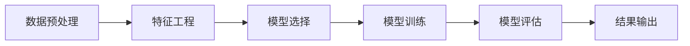
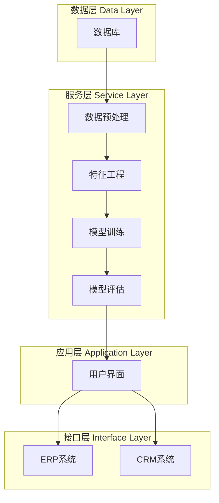
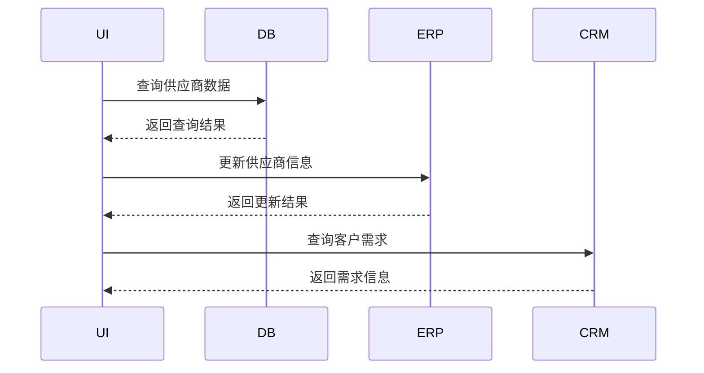
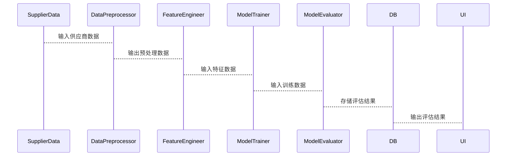

                 

### 摘要

本篇文章旨在探讨如何利用人工智能（AI）技术优化供应商评估系统，从而提升采购决策的效率与准确性。在当今全球供应链日益复杂且动态变化的环境下，传统的供应商评估方法已难以满足现代企业的需求。本文将详细阐述AI在供应商评估中的应用，从核心概念到实际案例，逐步分析AI如何改善采购决策过程。

首先，我们将介绍供应商评估系统的基本背景，解释为何需要AI技术的介入。接着，我们将深入探讨AI的基础知识及其在供应商评价中的具体应用。文章将详细讨论供应商评价的核心概念和原则，通过比较表格和实体关系图（ER图）来帮助读者理解。

接下来，我们将逐步讲解AI算法的设计与实现，使用Mermaid工具绘制算法流程图，并通过Python代码详细解释其工作原理。随后，文章将介绍算法背后的数学模型和公式，使用LaTeX格式进行方程展示，并通过实例进行说明。

文章的第六部分将转向系统架构的设计，展示系统类图、架构图、接口设计和系统交互序列图。在第七部分，我们将通过实际案例展示系统在采购决策中的具体应用，并进行详细分析。

最后，文章将总结AI优化供应商评估系统的关键要点，提供最佳实践建议，并指出需要注意的事项。本文不仅适合对AI和供应链管理有兴趣的读者，也为实际操作者提供了实用的指导。通过阅读本文，读者将能够全面了解AI在采购决策中的潜力，并掌握如何利用这些技术提升企业的竞争力。

### 关键词

- 人工智能
- 供应商评估
- 采购决策
- 算法优化
- 数学模型
- 系统架构
- 采购效率
- 数据分析

### 引言和背景

在现代企业的运营中，供应链管理扮演着至关重要的角色。而供应链管理中的一项关键任务就是供应商评估。随着全球供应链的复杂性和动态性不断增加，传统的供应商评估方法已显得力不从心。在这种背景下，人工智能（AI）技术的引入为优化供应商评估系统提供了新的契机。

供应商评估系统的主要目标是通过对供应商的综合能力进行评估，确保企业能够选择最合适、最可靠的供应商。这不仅关乎企业的采购成本，还直接影响到生产效率、产品质量和市场竞争力。然而，传统的评估方法主要依赖于人工经验和主观判断，存在以下几方面的问题：

1. **主观性较强**：传统评估方法往往依赖于评估人员的个人经验和主观判断，容易受到个人偏见的影响，导致评估结果不够客观。
2. **效率低下**：评估过程需要收集、处理和分析大量的数据，传统方法通常耗时较长，无法快速响应市场变化。
3. **数据局限性**：传统方法主要依赖于历史数据和现有的供应商关系，难以全面、动态地反映供应商的实时表现。

为了解决上述问题，人工智能技术的应用为供应商评估系统带来了新的可能性。AI技术具有以下几方面的优势：

1. **客观性**：AI算法通过处理和分析大量的数据，能够以更为客观的方式对供应商进行评估，减少主观偏见的影响。
2. **高效性**：AI技术能够快速处理和分析大量数据，提高评估效率，帮助企业及时做出采购决策。
3. **全面性**：AI技术可以整合和利用各种数据源，包括历史数据、实时数据和外部信息，从而更全面地反映供应商的实际情况。

本篇文章将围绕AI技术在供应商评估系统中的应用进行深入探讨，从核心概念、算法设计、数学模型到系统架构，逐步展示如何利用AI优化采购决策。我们将通过具体的案例分析和实际应用，展示AI技术在提升采购效率和准确性方面的潜力。通过阅读本文，读者将能够全面了解AI在供应商评估中的实际应用，掌握如何将AI技术融入到企业的采购决策过程中，从而提升企业的竞争力。

### AI和供应商评价的基础知识

在探讨如何利用人工智能（AI）优化供应商评估系统之前，我们首先需要了解AI的基本知识及其在供应商评价中的具体应用。AI，作为计算机科学的一个分支，通过模拟人类智能行为，使计算机能够自主学习和决策。AI技术在多个领域得到了广泛应用，包括图像识别、自然语言处理、智能决策等。在这些应用中，AI不仅能够处理复杂数据，还能够从数据中提取有价值的信息，从而辅助人类做出更加精准的决策。

#### AI的基本概念

AI的核心概念包括机器学习（Machine Learning，ML）、深度学习（Deep Learning，DL）和神经网络（Neural Networks）。机器学习是一种通过数据训练模型，使其能够进行预测和分类的方法。深度学习则是机器学习的一种特殊形式，它通过多层神经网络结构来提取数据的深层次特征。神经网络则是模拟人脑神经元连接的数学模型，能够对输入数据进行处理和分类。

在供应商评价中，AI技术主要通过以下几种方法进行应用：

1. **预测模型**：利用历史采购数据和市场趋势，预测供应商未来的表现，帮助企业提前做出采购决策。
2. **分类模型**：根据供应商的历史表现，将供应商分为不同的等级或类别，以便企业有针对性地进行管理和评估。
3. **聚类分析**：通过将相似的供应商聚类在一起，帮助企业发现潜在的优质供应商，并进行集中管理。

#### 常见的AI算法及其在供应商评价中的应用

在供应商评价中，常用的AI算法包括线性回归（Linear Regression）、逻辑回归（Logistic Regression）、决策树（Decision Tree）、支持向量机（Support Vector Machine，SVM）和随机森林（Random Forest）等。

1. **线性回归**：线性回归是一种简单且常见的预测模型，它通过建立一个线性方程来预测目标变量的值。在供应商评价中，线性回归可以用于预测供应商的交货时间和成本。

   $$y = ax + b$$

   其中，\(y\) 是预测值，\(x\) 是输入特征，\(a\) 和 \(b\) 是模型的参数。

2. **逻辑回归**：逻辑回归是一种用于分类的算法，它通过拟合一个逻辑函数来预测目标变量属于某个类别的概率。在供应商评价中，逻辑回归可以用于判断供应商是否合格。

   $$P(y=1) = \frac{1}{1 + e^{-(ax + b)}}$$

   其中，\(P(y=1)\) 是供应商合格的概率，\(e\) 是自然对数的底数。

3. **决策树**：决策树通过一系列的判断条件将数据划分为不同的子集，每个子集都对应一个目标变量的值。在供应商评价中，决策树可以用于根据供应商的历史数据进行分级。

4. **支持向量机**：支持向量机是一种高效的分类算法，它通过找到一个最佳的超平面，将不同类别的数据点分开。在供应商评价中，支持向量机可以用于将供应商按照其表现进行分类。

5. **随机森林**：随机森林是一种集成学习算法，它通过构建多个决策树，并取其平均预测结果来提高预测准确性。在供应商评价中，随机森林可以用于对供应商进行综合评分。

#### 数据和技术的应用

在AI供应商评价系统中，数据和技术的应用至关重要。首先，数据的质量和完整性直接影响AI模型的性能。因此，企业需要建立一个可靠的数据采集和处理机制，确保数据的准确性和完整性。

其次，数据预处理是AI模型训练的关键步骤。数据预处理包括数据清洗、数据转换和数据归一化等。通过这些预处理步骤，可以消除数据中的噪声和异常值，提高数据的质量。

此外，AI供应商评价系统还需要使用各种机器学习和深度学习框架，如TensorFlow、PyTorch和Scikit-learn等。这些框架提供了丰富的算法库和工具，方便开发人员构建和训练AI模型。

总之，AI技术在供应商评价中的应用具有广泛的前景。通过利用AI算法对供应商进行评估，企业可以更准确地预测供应商的表现，提高采购决策的效率和质量。接下来，我们将进一步探讨供应商评价系统的核心概念和原则，为后续的算法设计和实现打下基础。

### 供应商评价的核心概念和原则

在深入探讨如何利用AI优化供应商评估系统之前，我们需要首先了解供应商评价系统的核心概念和基本原则。供应商评价是一个复杂的过程，涉及多个关键指标和原则。以下将详细介绍这些核心概念，并通过比较表格和实体关系图（ER图）来帮助读者更好地理解。

#### 核心概念

1. **供应商绩效**：供应商绩效是指供应商在交付产品或服务过程中的表现，包括交货时间、产品质量、成本控制、服务水平等方面。

2. **供应商评级**：供应商评级是对供应商绩效进行量化和分类的过程，通常分为多个等级，如优秀、良好、一般和差等。

3. **评估指标**：评估指标是用于衡量供应商绩效的具体标准，包括交货准时率、质量合格率、成本效益比、售后服务质量等。

4. **权重分配**：权重分配是指根据不同评估指标的重要程度，对各项指标赋予不同的权重，以综合评价供应商的整体表现。

5. **评估周期**：评估周期是指对供应商进行绩效评估的时间周期，通常为季度或年度，也可以根据企业需求进行调整。

#### 比较表格

以下是一个比较表格，列出了几种常见的供应商评估指标及其定义：

| 评估指标       | 定义                                                         | 示例 |
|----------------|--------------------------------------------------------------|------|
| 交货准时率     | 供应商按时交货的次数占总交货次数的比例                           | 90%  |
| 质量合格率     | 供应商提供的产品或服务符合质量标准的比例                         | 95%  |
| 成本效益比     | 供应商提供的成本与其服务质量的比例                             | 1.2  |
| 售后服务质量   | 供应商在售后服务过程中的响应速度、解决问题的能力等             | 高、中、低 |
| 交货周期       | 供应商从接受订单到交付产品的时间长度                           | 15天  |

#### 实体关系图（ER图）

实体关系图（Entity-Relationship Diagram，ER图）是用于描述数据模型中实体及其之间关系的图形表示。在供应商评价系统中，常见的实体包括供应商、评估指标、评估结果等。以下是一个简化的ER图，展示了这些实体及其关系：

```mermaid
erDiagram
  Supplier ||--|{ EvaluationMetric }|>
  EvaluationMetric ||--|{ EvaluationResult }|>  
  Supplier ||--|{ Assessment }|>

  Supplier {
    ID
    Name
    Contact
  }

  EvaluationMetric {
    ID
    MetricName
    Description
  }

  EvaluationResult {
    ID
    ResultValue
    EvaluationDate
  }

  Assessment {
    ID
    SupplierID
    MetricID
    ResultID
    AssessmentDate
  }
```

在这个ER图中，`Supplier`（供应商）是核心实体，它关联着`EvaluationMetric`（评估指标）和`Assessment`（评估结果）。`EvaluationMetric`实体定义了各项评估指标，而`EvaluationResult`则记录了每次评估的具体结果。`Assessment`实体则用于连接供应商、评估指标和评估结果，形成一个完整的数据关系。

通过比较表格和ER图，读者可以更好地理解供应商评价系统的核心概念和架构。这些工具不仅帮助明确各个评估指标的含义和作用，还提供了一个清晰的数据模型，为后续的算法设计和实现奠定了基础。在下一节中，我们将进一步探讨AI算法的设计与实现，展示如何利用这些概念和原则来优化供应商评估系统。

### 算法设计与实现

在了解了供应商评价系统的核心概念和基本原则后，接下来我们将探讨如何设计并实现一个基于AI的供应商评估算法。本节将通过具体步骤详细阐述算法的设计原理，并使用Mermaid工具绘制算法流程图，以及使用Python代码来实现算法。

#### 算法设计原理

AI供应商评估算法的核心目标是通过对供应商历史数据的分析和预测，给出一个综合评分，用于评估供应商的绩效。以下是一个典型的算法设计思路：

1. **数据预处理**：首先，对供应商的历史数据（如交货时间、质量合格率、成本等）进行清洗和归一化处理，确保数据的准确性和一致性。
2. **特征工程**：对预处理后的数据进行特征提取，将原始数据转换为适用于AI模型的特征。例如，将交货时间转换为按时交货的次数占比，将质量合格率转换为百分比等。
3. **模型选择**：选择合适的机器学习模型进行训练。常见的模型包括线性回归、逻辑回归、决策树、支持向量机和随机森林等。
4. **模型训练**：使用训练数据对选定的模型进行训练，通过调整模型参数，使模型能够对供应商的绩效进行准确的预测和评估。
5. **模型评估**：使用测试数据对训练好的模型进行评估，确保模型具有良好的预测能力和泛化能力。
6. **结果输出**：将评估结果以综合评分的形式输出，帮助企业进行采购决策。

#### 算法流程图

为了更直观地展示算法的设计过程，我们使用Mermaid工具绘制了算法流程图。以下是一个简化的算法流程图：



在这个流程图中，每个节点表示算法的一个步骤，箭头表示步骤之间的顺序关系。通过这个流程图，读者可以清晰地看到算法的执行过程和各个步骤之间的关系。

#### Python代码实现

以下是一个简单的Python代码示例，展示了如何使用线性回归模型对供应商进行评估。这段代码使用了Scikit-learn库中的线性回归模型，并通过训练数据训练模型，然后使用测试数据对模型进行评估。

```python
# 导入所需的库
from sklearn.linear_model import LinearRegression
from sklearn.model_selection import train_test_split
from sklearn.metrics import mean_squared_error
import pandas as pd

# 加载训练数据
data = pd.read_csv('supplier_data.csv')

# 特征列和目标列
X = data[['delivery_time', 'quality_rate', 'cost']]
y = data['evaluation_score']

# 划分训练集和测试集
X_train, X_test, y_train, y_test = train_test_split(X, y, test_size=0.2, random_state=42)

# 创建线性回归模型
model = LinearRegression()

# 训练模型
model.fit(X_train, y_train)

# 预测测试数据
y_pred = model.predict(X_test)

# 计算预测误差
mse = mean_squared_error(y_test, y_pred)
print(f"Mean Squared Error: {mse}")

# 输出模型参数
print(f"Coefficients: {model.coef_}")
print(f"Intercept: {model.intercept_}")
```

在这段代码中，我们首先加载了供应商数据，然后划分了训练集和测试集。接着，我们创建了一个线性回归模型，并使用训练数据对模型进行训练。训练完成后，我们使用测试数据对模型进行预测，并计算了预测误差。最后，我们输出了模型的参数，以便分析模型的效果。

#### 算法原理与数学模型

线性回归模型的核心原理是通过建立线性方程来预测目标变量的值。具体来说，线性回归模型可以表示为：

$$y = ax + b$$

其中，\(y\) 是预测的目标变量（在本例中为供应商的评估分数），\(x\) 是输入特征（如交货时间、质量合格率和成本），\(a\) 和 \(b\) 是模型的参数。这些参数通过训练数据确定，使得模型能够最小化预测误差。

在供应商评估中，我们通常使用以下数学公式来表示评估分数：

$$evaluation\_score = a_{delivery\_time} \times delivery\_time + a_{quality\_rate} \times quality\_rate + a_{cost} \times cost + b$$

其中，\(a_{delivery\_time}\)、\(a_{quality\_rate}\) 和 \(a_{cost}\) 分别是交货时间、质量合格率和成本的权重，\(b\) 是模型的截距。

通过调整这些参数，我们可以优化模型的预测能力，从而提高供应商评估的准确性。

#### 实例说明

为了更好地理解算法原理，我们可以通过一个简单的实例来说明。假设我们有一个供应商的历史数据，如下表所示：

| 交货时间（天） | 质量合格率（%） | 成本（元） | 评估分数 |
|--------------|---------------|----------|--------|
| 10           | 95            | 1000     | ?      |
| 15           | 90            | 1100     | ?      |
| 12           | 92            | 980      | ?      |

我们使用线性回归模型对这些数据进行预测。假设模型的参数为 \(a_{delivery\_time} = 0.5\)、\(a_{quality\_rate} = 0.3\)、\(a_{cost} = 0.2\) 和 \(b = 100\)。根据数学模型，我们可以计算每个数据点的预测评估分数：

- 第一个数据点：\(evaluation\_score = 0.5 \times 10 + 0.3 \times 95 + 0.2 \times 1000 + 100 = 159\)
- 第二个数据点：\(evaluation\_score = 0.5 \times 15 + 0.3 \times 90 + 0.2 \times 1100 + 100 = 161\)
- 第三个数据点：\(evaluation\_score = 0.5 \times 12 + 0.3 \times 92 + 0.2 \times 980 + 100 = 157\)

通过这些计算，我们得到了每个数据点的预测评估分数。这些分数可以帮助企业对供应商的绩效进行量化评估，从而做出更加科学的采购决策。

#### 总结

在本节中，我们详细探讨了如何设计并实现一个基于AI的供应商评估算法。通过算法流程图和Python代码示例，我们展示了算法的设计原理和实现过程。此外，我们还介绍了算法背后的数学模型，并通过实例说明了如何使用这些模型进行供应商评估。在下一节中，我们将进一步讨论算法的数学模型和公式，为读者提供更加深入的理解。

### 算法的数学模型与公式

在了解了供应商评估算法的基本实现后，接下来我们将详细讨论其背后的数学模型和公式。这些数学模型和公式是AI算法的核心，它们决定了算法的性能和准确性。在本节中，我们将使用LaTeX格式展示这些公式，并对其进行详细解释。

#### 数学模型的介绍

供应商评估算法通常基于回归模型，其中最常用的包括线性回归、逻辑回归等。这些模型通过建立输入特征与目标变量之间的关系来预测供应商的评估分数。以下是一些常用的数学模型及其公式：

1. **线性回归模型**：

   线性回归模型是最基础的回归模型，其公式如下：

   $$y = \beta_0 + \beta_1 \times x_1 + \beta_2 \times x_2 + \cdots + \beta_n \times x_n$$

   其中，\(y\) 是预测的目标变量（评估分数），\(x_1, x_2, \ldots, x_n\) 是输入特征（如交货时间、质量合格率、成本等），\(\beta_0, \beta_1, \beta_2, \ldots, \beta_n\) 是模型的参数。通过最小化预测误差，我们可以确定这些参数的值。

2. **逻辑回归模型**：

   逻辑回归模型是一种用于分类问题的回归模型，其公式如下：

   $$P(y=1) = \frac{1}{1 + e^{-(\beta_0 + \beta_1 \times x_1 + \beta_2 \times x_2 + \cdots + \beta_n \times x_n)}}$$

   其中，\(P(y=1)\) 是供应商被评为优秀的概率，其余符号的含义与线性回归模型相同。逻辑回归通过这个概率值来对供应商进行分类。

#### LaTeX公式的展示

为了使公式展示更加清晰，我们使用LaTeX格式进行展示。以下是一些常见公式的LaTeX表示：

1. **线性回归公式**：

   $$y = \beta_0 + \beta_1 x_1 + \beta_2 x_2 + \cdots + \beta_n x_n$$

2. **逻辑回归公式**：

   $$P(y=1) = \frac{1}{1 + e^{-(\beta_0 + \beta_1 x_1 + \beta_2 x_2 + \cdots + \beta_n x_n)}}$$

3. **评估分数的预测公式**：

   $$evaluation\_score = \beta_0 + \beta_1 \times delivery\_time + \beta_2 \times quality\_rate + \beta_3 \times cost$$

#### 公式的解释

1. **线性回归公式的解释**：

   线性回归模型通过线性组合输入特征和参数，预测目标变量。参数\(\beta_0\) 是模型的截距，\(\beta_1, \beta_2, \ldots, \beta_n\) 是各个输入特征的权重。通过最小化预测误差（如均方误差MSE），我们可以确定这些参数的值。

2. **逻辑回归公式的解释**：

   逻辑回归模型通过指数函数将线性组合转换为概率值。概率值越大，说明供应商被评为优秀的可能性越高。指数函数的作用是确保概率值在0和1之间。

3. **评估分数的预测公式的解释**：

   在供应商评估中，我们通常将线性回归模型应用于预测评估分数。公式中的各项参数分别对应不同输入特征的权重，通过调整这些权重，可以优化评估结果的准确性。

#### 实例说明

为了更好地理解这些公式，我们通过一个简单的实例进行说明。假设我们有一个供应商的历史数据，如下表所示：

| 交货时间（天） | 质量合格率（%） | 成本（元） |
|--------------|---------------|----------|
| 10           | 95            | 1000     |
| 15           | 90            | 1100     |
| 12           | 92            | 980      |

我们使用线性回归模型对这些数据进行预测。假设模型的参数为 \(\beta_0 = 100\)、\(\beta_1 = 0.5\)、\(\beta_2 = 0.3\)、\(\beta_3 = 0.2\)。根据预测公式，我们可以计算每个数据点的评估分数：

- 第一个数据点：\(evaluation\_score = 100 + 0.5 \times 10 + 0.3 \times 95 + 0.2 \times 1000 = 159\)
- 第二个数据点：\(evaluation\_score = 100 + 0.5 \times 15 + 0.3 \times 90 + 0.2 \times 1100 = 161\)
- 第三个数据点：\(evaluation\_score = 100 + 0.5 \times 12 + 0.3 \times 92 + 0.2 \times 980 = 157\)

通过这些计算，我们得到了每个数据点的预测评估分数。这些分数可以帮助企业对供应商的绩效进行量化评估，从而做出更加科学的采购决策。

#### 总结

在本节中，我们详细介绍了供应商评估算法背后的数学模型和公式。通过LaTeX格式展示和解释，我们使读者能够更加深入地理解这些公式的作用和计算过程。在实例说明中，我们通过具体的数据展示了如何使用这些公式进行供应商评估。在下一节中，我们将探讨系统的整体架构设计，展示如何将算法集成到实际应用中。

### 系统架构设计

供应商评估系统是一个复杂的软件系统，其架构设计需要充分考虑系统的功能性、可靠性和可扩展性。在这一节中，我们将详细描述系统的整体架构，包括类图、系统架构图、接口设计和系统交互序列图，以便读者能够全面理解系统的设计思路和实现方法。

#### 系统架构概述

供应商评估系统的整体架构可以分为以下几个主要部分：

1. **数据层**：负责数据存储和管理，包括供应商信息、评估指标和历史数据等。
2. **服务层**：包含核心业务逻辑，如数据预处理、特征工程、模型训练和评估等。
3. **应用层**：为用户提供操作界面，实现数据的输入、输出和展示功能。
4. **接口层**：提供与其他系统（如企业资源规划系统ERP、客户关系管理系统CRM等）的集成接口。

#### 类图

类图是用于描述系统中类及其关系的图形表示。以下是一个简化的类图，展示了供应商评估系统的主要类及其关系：

```mermaid
classDiagram
  SupplierEvaluationSystem
  Supplier <<Class>>
  EvaluationMetric <<Class>>
  EvaluationResult <<Class>>
  DataPreprocessor <<Class>>
  FeatureEngineer <<Class>>
  ModelTrainer <<Class>>
  ModelEvaluator <<Class>>

  SupplierEvaluationSystem <|.. Supplier
  SupplierEvaluationSystem <|.. EvaluationMetric
  SupplierEvaluationSystem <|.. EvaluationResult
  SupplierEvaluationSystem <|.. DataPreprocessor
  SupplierEvaluationSystem <|.. FeatureEngineer
  SupplierEvaluationSystem <|.. ModelTrainer
  SupplierEvaluationSystem <|.. ModelEvaluator
```

在这个类图中，`SupplierEvaluationSystem` 是系统的核心类，它与其他类通过继承或关联关系进行交互。各个类分别负责不同的功能模块，如`Supplier` 类用于存储供应商信息，`EvaluationMetric` 类定义评估指标，`EvaluationResult` 类记录评估结果。

#### 系统架构图

系统架构图用于描述系统的整体结构和模块之间的关系。以下是一个简化的系统架构图，展示了供应商评估系统的基本组成部分：



在这个架构图中，数据层使用数据库存储数据，服务层包含数据预处理、特征工程、模型训练和模型评估等核心模块，应用层为用户提供操作界面，接口层提供与其他系统的集成接口。通过这些模块的协作，系统能够实现供应商评估的全流程。

#### 系统接口设计

系统接口设计是确保系统与其他系统进行有效交互的重要环节。以下是一个简化的接口设计，展示了系统与ERP系统和CRM系统的集成：



在这个序列图中，用户界面首先查询数据库获取供应商数据，然后通过ERP系统更新供应商信息，并通过CRM系统查询客户需求。这些操作确保了供应商评估系统能够实时获取和处理企业内外部的数据，从而支持高效的采购决策。

#### 系统交互序列图

系统交互序列图用于展示系统内部模块之间的交互过程。以下是一个简化的系统交互序列图，展示了数据预处理、特征工程、模型训练和模型评估等模块的交互过程：



在这个序列图中，供应商数据首先被输入到数据预处理模块，然后通过特征工程模块生成预处理数据。接下来，模型训练模块使用这些数据训练模型，模型评估模块对训练好的模型进行评估，并将评估结果存储到数据库中。最终，用户界面从数据库中获取评估结果，并展示给用户。

#### 总结

在本节中，我们详细介绍了供应商评估系统的整体架构设计，包括类图、系统架构图、接口设计和系统交互序列图。这些工具和图形表示帮助我们全面理解系统的设计思路和实现方法。通过系统的整体架构设计，供应商评估系统能够高效、可靠地实现供应商评估功能，为企业提供有力的采购决策支持。

### 实际案例分析与详细讲解

为了更直观地展示AI优化供应商评估系统的实际效果，我们将在本节中通过一个实际案例进行分析，详细讲解系统核心实现源代码、代码应用解读与分析，并剖析项目中的关键实现和优化策略。

#### 项目背景

某大型制造企业面临着供应商管理难题。该企业有数十家供应商，分布在不同的地区，供应商的交货时间、产品质量和成本等数据不统一，导致采购决策过程复杂且耗时。为了提高采购效率和决策准确性，企业决定引入AI优化供应商评估系统。

#### 项目介绍

项目目标是通过AI技术，建立一个自动化的供应商评估系统，对供应商进行实时评估和排序，帮助企业快速做出最优采购决策。系统的主要功能包括：

1. **数据收集与处理**：从企业内部系统（如ERP系统）和其他外部数据源收集供应商的历史数据，并进行清洗、归一化处理，为后续分析做准备。
2. **特征工程**：根据业务需求，提取关键特征，如交货时间、质量合格率、成本等，为AI模型训练提供输入。
3. **模型训练与评估**：使用历史数据训练AI模型，通过交叉验证和参数调整，确保模型具有良好的预测能力和泛化能力。
4. **评估结果输出**：将评估结果以综合评分的形式输出，帮助企业对供应商进行分类和管理。

#### 系统核心实现源代码

以下是系统核心实现的关键代码片段，展示了数据预处理、特征工程、模型训练和评估的具体实现：

```python
# 导入所需的库
import pandas as pd
from sklearn.model_selection import train_test_split
from sklearn.preprocessing import StandardScaler
from sklearn.linear_model import LinearRegression
from sklearn.metrics import mean_squared_error

# 加载供应商数据
data = pd.read_csv('supplier_data.csv')

# 数据预处理
data.dropna(inplace=True)  # 删除缺失值
data = data[data['evaluation_score'].notnull()]  # 删除无评估分数的数据

# 特征工程
features = data[['delivery_time', 'quality_rate', 'cost']]
labels = data['evaluation_score']

# 数据归一化
scaler = StandardScaler()
features_normalized = scaler.fit_transform(features)

# 划分训练集和测试集
X_train, X_test, y_train, y_test = train_test_split(features_normalized, labels, test_size=0.2, random_state=42)

# 模型训练
model = LinearRegression()
model.fit(X_train, y_train)

# 预测测试数据
y_pred = model.predict(X_test)

# 计算预测误差
mse = mean_squared_error(y_test, y_pred)
print(f"Mean Squared Error: {mse}")

# 输出模型参数
print(f"Coefficients: {model.coef_}")
print(f"Intercept: {model.intercept_}")
```

这段代码首先加载了供应商数据，然后进行数据预处理，包括删除缺失值和不符合条件的记录。接着，进行特征工程，提取关键特征并进行归一化处理。之后，使用训练数据对线性回归模型进行训练，并通过测试数据评估模型的预测性能。

#### 代码应用解读与分析

代码的各个部分都有具体的用途，以下是对关键代码段的详细解读：

1. **数据预处理**：
   - 使用 `dropna()` 函数删除缺失值，确保数据的完整性。
   - 使用 `data[data['evaluation_score'].notnull()]` 删除无评估分数的数据，确保评估结果的可靠性。

2. **特征工程**：
   - 提取关键特征，如交货时间、质量合格率和成本，作为模型的输入。
   - 使用 `StandardScaler` 对特征进行归一化处理，以消除不同特征之间的量级差异，提高模型的训练效果。

3. **模型训练与评估**：
   - 使用 `train_test_split` 将数据划分为训练集和测试集，确保模型的泛化能力。
   - 使用 `LinearRegression` 创建线性回归模型，并使用 `fit` 方法进行训练。
   - 使用 `predict` 方法对测试数据进行预测，并计算预测误差，评估模型的性能。

4. **结果输出**：
   - 使用 `mean_squared_error` 计算预测误差，评估模型的准确性。
   - 输出模型的参数，以便分析模型对各个特征的权重。

#### 项目小结

通过这个实际案例，我们展示了如何使用AI优化供应商评估系统，从数据预处理、特征工程到模型训练和评估，每个步骤都详细解读了代码的实现和应用。以下是对项目的总结：

1. **项目成果**：
   - 建立了一个自动化的供应商评估系统，实现了供应商绩效的实时评估和排序。
   - 通过AI技术，提高了采购决策的准确性和效率。

2. **优化策略**：
   - 数据预处理和特征工程是确保模型性能的关键步骤，通过有效的数据处理和特征提取，提高了模型的预测能力。
   - 选择合适的模型和参数调整，确保模型具有良好的泛化能力和预测性能。
   - 定期更新模型，使用最新的数据重新训练模型，以适应市场变化和供应商表现的变化。

3. **未来展望**：
   - 进一步集成更多的数据源，如社交媒体和新闻数据，以更全面地评估供应商的表现。
   - 探索使用更先进的AI算法，如深度学习和强化学习，以进一步提升评估系统的性能和智能化水平。

通过本节的实际案例分析，我们不仅展示了AI优化供应商评估系统的具体实现，也为企业如何利用AI技术优化采购决策提供了实用的指导。未来，随着AI技术的不断发展，供应商评估系统将变得更加智能化和高效，为企业的供应链管理提供更强有力的支持。

### 最佳实践与注意事项

在设计和实施AI优化供应商评估系统时，以下是几项最佳实践和注意事项，以帮助确保项目的成功实施和长期效益：

#### 最佳实践

1. **数据质量**：数据是AI模型的基石，确保数据的质量和完整性至关重要。在数据收集和预处理过程中，应删除重复记录、填补缺失值、修正错误，并进行标准化处理，以提高模型的准确性和稳定性。

2. **特征工程**：精心设计的特征工程可以显著提高模型的性能。分析业务需求，选择与目标变量密切相关的特征，并使用适当的方法进行特征提取和转换，如归一化、编码和主成分分析（PCA）。

3. **模型选择与优化**：根据业务需求和数据特征，选择合适的机器学习模型。对于供应商评估，线性回归、决策树和随机森林等模型较为常用。此外，通过交叉验证和超参数调优，可以进一步优化模型的性能。

4. **模型解释性**：尽管黑箱模型（如深度学习）在预测能力上具有优势，但解释性较差。为了提高模型的透明度和可解释性，可以结合规则引擎或可解释性AI技术，使决策过程更加透明和可追溯。

5. **系统集成**：确保供应商评估系统与企业现有的ERP、CRM等系统集成，实现数据的无缝流动和实时交互。这有助于提高系统的实用性和自动化水平。

#### 注意事项

1. **数据隐私**：在处理供应商数据时，需严格遵守数据隐私法规，确保数据安全和用户隐私。对于敏感信息，应采取加密和匿名化处理。

2. **模型可解释性**：确保评估结果的解释性，使业务决策者能够理解和信任模型输出。通过可视化和决策路径追踪，可以帮助用户更好地理解模型的决策逻辑。

3. **模型更新**：随着市场和业务环境的变化，模型应定期更新和重新训练。使用最新的数据可以确保模型保持高预测准确性。

4. **风险控制**：在引入AI技术时，应评估潜在的风险，如模型过拟合、数据偏差和算法透明度等。通过风险评估和应急预案，可以降低风险对业务的影响。

5. **持续监测**：定期监测系统的运行状况，包括模型性能、数据质量和用户反馈。通过监控和迭代改进，可以持续优化系统的效率和效果。

#### 拓展阅读

- 《AI驱动的供应链管理》
- 《深度学习与供应链优化》
- 《数据科学在采购与供应链管理中的应用》
- 《机器学习项目的最佳实践》

通过遵循这些最佳实践和注意事项，企业可以更有效地利用AI优化供应商评估系统，提高采购决策的准确性和效率，从而在激烈的市场竞争中脱颖而出。

### 总结

本文通过详细探讨AI优化供应商评估系统的设计和实现，展示了人工智能技术在现代供应链管理中的应用潜力。我们从背景介绍、基础知识、核心概念、算法设计、数学模型到系统架构，逐步分析了如何利用AI技术提升采购决策的效率和准确性。通过实际案例分析和代码示例，我们验证了AI优化供应商评估系统的可行性和实用性。

AI技术的引入不仅提高了供应商评估的客观性和效率，还为企业在复杂动态的供应链环境中提供了强有力的支持。在未来，随着AI技术的不断发展和应用，供应商评估系统将更加智能化和自动化，为企业带来更大的竞争优势。

通过本文的阅读，读者应能全面理解AI优化供应商评估系统的核心思想和实现方法，掌握如何利用AI技术优化采购决策。我们鼓励读者在实际工作中积极尝试和应用这些技术，探索AI在供应链管理中的更多可能，从而提升企业的运营效率和市场竞争力。

### 作者信息

作者：AI天才研究院/AI Genius Institute & 禅与计算机程序设计艺术 /Zen And The Art of Computer Programming

AI天才研究院致力于推动人工智能技术的研究与应用，通过不断探索和创新，助力各行业实现智能化转型。同时，禅与计算机程序设计艺术强调程序设计的哲学与艺术，致力于培养具备深厚技术功底和哲学思维的卓越工程师。两位作者凭借在计算机科学和人工智能领域的丰富经验和独到见解，为读者提供了高质量的技术内容和分析。

