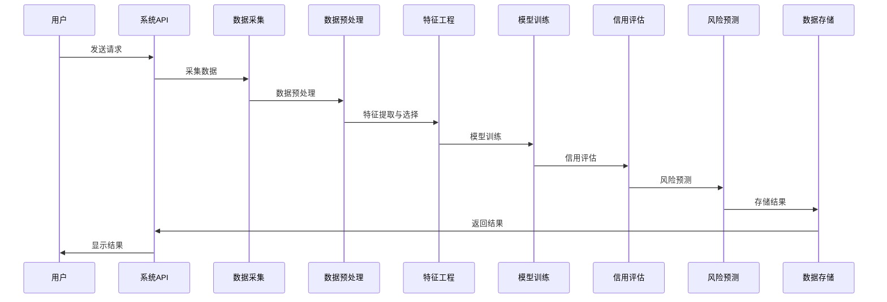

                 


### 第1章：智能信用评估系统概述

#### 1.1 问题背景

信用评估在金融领域扮演着至关重要的角色，它不仅关乎到个人的借贷和信用卡申请，还关系到企业的融资、投资决策等。然而，传统的信用评估方法往往依赖于历史数据和人工判断，存在以下几大挑战：

1. **数据来源有限**：传统信用评估主要依赖信用记录、财务报表等有限的公开数据，这些数据往往不足以全面评估一个人的信用状况。
2. **评估效率低下**：随着信用评估需求的增加，传统方法的评估流程繁琐，难以满足大规模、实时的评估需求。
3. **评估结果不准确**：传统方法难以捕捉到个体的动态变化，导致评估结果可能出现偏差。

在这样的背景下，智能信用评估系统应运而生。它利用人工智能技术，从海量数据中挖掘有价值的信息，提供更为精准、高效的信用评估服务。

#### 1.2 概念界定

**信用评估**：信用评估是指通过对个体的信用历史、财务状况、社会行为等多方面信息进行分析，评估其信用风险的过程。

**智能信用评估**：智能信用评估是指利用人工智能技术，如机器学习、深度学习等，对个体进行综合评估，从而更准确地预测其信用风险。

#### 1.3 智能信用评估的要素

1. **数据源**：智能信用评估依赖于丰富的数据源，包括公开数据、社交媒体数据、交易数据等。
2. **算法**：智能信用评估的核心在于算法，它决定了如何从数据中提取有价值的信息。
3. **模型**：算法需要通过模型进行训练和优化，以实现准确的信用评估。
4. **接口**：智能信用评估系统需要提供友好的接口，便于与金融机构、企业等用户进行交互。

#### 1.4 本书结构

本书将分以下几个部分进行讲解：

1. **引言**：介绍智能信用评估系统的背景、意义和本书的结构。
2. **基础知识**：讲解人工智能与风险控制的基本原理和方法。
3. **数据准备与预处理**：介绍数据收集、预处理和评估的方法。
4. **特征工程**：讲解特征工程的基本概念、流程和方法。
5. **模型选择与优化**：介绍模型选择、优化和评估的方法。
6. **系统实现**：讲解智能信用评估系统的实现方法和实战案例。

通过本书的阅读，读者将能够系统地了解智能信用评估系统的构建方法，掌握从数据到模型再到系统的全过程。

#### 1.5 本章小结

本章对智能信用评估系统进行了全面的概述，从问题背景、概念界定到要素分析和本书结构，帮助读者建立起对智能信用评估系统的初步认识。接下来，我们将进一步探讨智能信用评估系统的基础知识，包括人工智能与风险控制的基本原理和方法。

----------------------------------------------------------------

### 第2章：人工智能与风险控制

#### 2.1 人工智能概述

**2.1.1 人工智能的基本概念**

人工智能（Artificial Intelligence，简称AI）是指通过计算机模拟人类智能，使其能够完成认知、推理、学习、决策等任务的能力。它涵盖了多个学科领域，包括计算机科学、数学、神经科学等。

**2.1.2 人工智能的发展历程**

人工智能的发展可以追溯到20世纪50年代。1956年，达特茅斯会议的召开标志着人工智能学科的正式诞生。此后，人工智能经历了多个发展阶段：

- **符号主义阶段**（1956-1974）：以知识表示和推理为主要研究内容，代表性的系统包括ELIZA和GPS。
- **感知阶段**（1974-1980）：以感知和认知为主要目标，代表性的系统包括早期的机器视觉系统和语音识别系统。
- **失控阶段**（1980-1987）：由于硬件性能的限制和符号主义方法的局限性，人工智能研究进入低谷。
- **重建阶段**（1987-2012）：随着计算能力的提升和机器学习技术的发展，人工智能开始复苏，并取得了显著成果。
- **应用阶段**（2012至今）：深度学习等技术的突破，使得人工智能在多个领域得到广泛应用。

**2.1.3 人工智能的应用领域**

人工智能的应用领域广泛，涵盖了多个行业和领域，包括：

- **工业自动化**：通过机器人、自动化生产线等提高生产效率。
- **医疗健康**：通过图像识别、基因测序等提高疾病诊断和治疗的准确性。
- **金融**：通过信用评估、风险控制等提高金融机构的运营效率。
- **交通**：通过自动驾驶、智能交通管理等提高交通效率和安全性。
- **教育**：通过个性化学习、智能辅导等提高教学效果和学生学习体验。

#### 2.2 风险控制的原理与方法

**2.2.1 风险管理的概念**

风险管理是指通过识别、评估、控制和监测风险，以降低组织面临的不确定性，从而实现组织目标的过程。它包括以下几个关键步骤：

- **风险识别**：识别组织可能面临的风险。
- **风险评估**：评估风险的可能性和影响。
- **风险控制**：制定和实施风险控制措施。
- **风险监测**：持续监测风险的变化情况。

**2.2.2 风险评估的方法**

风险评估是风险管理的重要环节，常用的方法包括：

- **定性评估**：通过专家判断、访谈、问卷调查等收集信息，对风险进行定性分析。
- **定量评估**：通过数学模型、统计方法等对风险进行定量分析。
- **情景分析**：通过模拟不同的场景，分析风险可能带来的影响。

**2.2.3 风险控制策略**

风险控制策略主要包括以下几种：

- **避免**：避免可能带来风险的活动。
- **转移**：通过购买保险等方式将风险转移给第三方。
- **减少**：通过改进流程、增加安全措施等方式降低风险的影响。
- **接受**：对无法避免或转移的风险，采取接受的态度，并制定应急计划。

#### 2.3 AI在风险控制中的应用

**2.3.1 AI在信用评估中的作用**

在信用评估领域，AI技术主要用于以下几个方面：

- **特征提取**：从海量数据中提取有价值的信息，如交易行为、社交关系等。
- **风险评估**：利用机器学习模型对个体的信用风险进行预测。
- **决策支持**：提供个性化的信用评估建议，帮助金融机构做出更明智的决策。

**2.3.2 AI在风险控制中的优势**

AI在风险控制中具有以下优势：

- **高效性**：AI能够处理海量数据，提高评估效率。
- **准确性**：通过数据驱动的方法，AI能够更准确地预测风险。
- **实时性**：AI能够实时分析数据，提供实时的风险预警。

**2.3.3 AI在信用评估中的挑战**

尽管AI在信用评估中具有显著的优势，但也面临以下挑战：

- **数据质量**：数据质量直接影响评估结果的准确性，AI需要处理大量高质量的数据。
- **算法透明性**：AI模型的决策过程往往复杂且不透明，难以解释。
- **隐私保护**：在处理个人数据时，需要确保隐私保护。

#### 2.4 本章小结

本章介绍了人工智能与风险控制的基本概念、发展历程和应用领域，探讨了AI在风险控制，特别是信用评估中的应用。通过本章的学习，读者将能够理解AI在风险控制中的作用和优势，以及面临的挑战。接下来，我们将进一步讨论数据准备与预处理的过程。

----------------------------------------------------------------

### 第3章：数据准备与预处理

#### 3.1 数据收集

**3.1.1 数据源的选择**

数据收集是智能信用评估系统建设的第一步，选择合适的数据源至关重要。以下是一些常见的数据源：

- **公开数据**：包括信用记录、财务报表等，这些数据可以通过公共数据库、官方网站等获取。
- **非公开数据**：包括社交媒体数据、交易数据等，这些数据可能需要通过与第三方合作或自行采集获得。
- **第三方服务**：一些专业的数据服务提供商可以提供高质量的数据，如信用评分机构、数据分析公司等。

**3.1.2 数据收集的方法**

数据收集的方法包括：

- **爬虫技术**：通过编写爬虫程序，自动从互联网上抓取数据。
- **API接口**：通过使用API接口，直接获取第三方提供的数据。
- **问卷调查**：通过设计问卷，收集用户的反馈数据。

**3.1.3 数据收集的伦理问题**

在数据收集过程中，需要遵守以下伦理问题：

- **隐私保护**：确保收集的数据不会泄露用户的隐私信息。
- **数据安全**：采取必要的安全措施，防止数据被篡改或泄露。
- **知情同意**：在收集数据前，应告知用户数据收集的目的和使用方式，并取得用户的同意。

#### 3.2 数据预处理

**3.2.1 数据清洗**

数据清洗是数据预处理的重要步骤，主要包括以下任务：

- **缺失值处理**：对于缺失值，可以采用填补、删除或插值等方法进行处理。
- **异常值处理**：识别并处理异常值，以避免对分析结果产生不良影响。
- **数据格式转换**：将不同格式的数据转换为统一的格式，以便后续处理。

**3.2.2 数据转换**

数据转换主要包括以下几种：

- **数据类型转换**：将不同类型的数据转换为同一类型，如将字符串转换为数值。
- **数据归一化**：将不同量级的数据进行归一化处理，以消除数据间的量级差异。

**3.2.3 数据归一化**

数据归一化是一种常用的数据转换方法，主要有以下几种：

- **最小-最大归一化**：将数据映射到[0, 1]区间。
- **均值-方差归一化**：将数据映射到均值和标准差为[0, 1]的正态分布。
- **小数点移动归一化**：通过移动小数点，将数据映射到整数范围内。

**3.3 数据质量评估**

**3.3.1 数据完整性的评估**

数据完整性评估主要包括以下指标：

- **缺失率**：评估数据中缺失值的比例。
- **重复率**：评估数据中重复记录的比例。
- **一致性**：评估数据在不同来源、不同格式间的一致性。

**3.3.2 数据一致性的评估**

数据一致性评估主要包括以下指标：

- **数据同步性**：评估不同数据源间数据的同步程度。
- **数据完整性**：评估数据在不同系统、不同格式间的完整性。
- **数据准确性**：评估数据的准确性和可靠性。

**3.3.3 数据可靠性的评估**

数据可靠性评估主要包括以下指标：

- **数据源可信度**：评估数据源的可信度。
- **数据真实性**：评估数据的真实性。
- **数据处理过程可信度**：评估数据在处理过程中的可信度。

#### 3.4 本章小结

本章详细介绍了数据准备与预处理的过程，包括数据收集、数据清洗、数据转换和数据质量评估。通过本章的学习，读者将能够掌握数据准备与预处理的基本方法，为后续的特征工程和模型训练打下坚实基础。接下来，我们将进一步探讨特征工程的重要性和方法。

----------------------------------------------------------------

### 第4章：特征工程

#### 4.1 特征工程概述

**4.1.1 特征工程的重要性**

特征工程是数据科学和机器学习领域的关键环节，它直接影响到模型的表现。特征工程的重要性体现在以下几个方面：

- **提升模型性能**：通过合理的特征选择和特征构造，可以提高模型的准确性和泛化能力。
- **降低过拟合风险**：特征工程有助于识别并去除噪声特征，降低模型的过拟合风险。
- **简化模型复杂度**：通过特征提取和特征融合，可以简化模型的复杂度，提高计算效率。

**4.1.2 特征工程的流程**

特征工程通常包括以下几个步骤：

- **特征选择**：从原始数据中筛选出最有价值的特征。
- **特征构造**：通过数学变换或组合原始特征，生成新的特征。
- **特征标准化**：对特征进行归一化或标准化处理，以消除特征间的量级差异。
- **特征评估**：评估特征对模型性能的影响，选择最优的特征组合。

**4.1.3 特征工程的方法**

特征工程的方法多样，主要包括以下几种：

- **量化特征提取**：通过统计、转换等方法提取量化特征，如均值、方差、标准差等。
- **定性特征提取**：通过编码、分类等方法提取定性特征，如标签、类别等。
- **时序特征提取**：通过时间序列分析、周期性检测等方法提取时序特征，如趋势、季节性等。

#### 4.2 数据特征提取

**4.2.1 量化特征提取**

量化特征提取是指从原始数据中提取具有量化意义的特征。以下是一些常用的量化特征提取方法：

- **统计特征**：通过计算数据的统计指标，如均值、方差、标准差等，提取量化特征。
- **转换特征**：通过数学变换，如对数变换、开方变换等，提取量化特征。
- **组合特征**：通过组合原始特征，生成新的量化特征，如加和、乘积等。

**4.2.2 定性特征提取**

定性特征提取是指从原始数据中提取具有分类或标签的特征。以下是一些常用的定性特征提取方法：

- **编码特征**：通过将定性特征转换为数值，提取定性特征，如将性别转换为0和1。
- **分类特征**：通过分类算法，如决策树、支持向量机等，提取定性特征。
- **标签特征**：通过标签提取方法，如TF-IDF、词嵌入等，提取定性特征。

**4.2.3 时序特征提取**

时序特征提取是指从时间序列数据中提取具有时间意义的特征。以下是一些常用时序特征提取方法：

- **趋势特征**：通过时间序列分析，提取数据的趋势特征，如线性趋势、多项式趋势等。
- **周期性特征**：通过周期性检测，提取数据的周期性特征，如季节性、周期性波动等。
- **序列模式特征**：通过序列模式挖掘，提取数据中的规律性特征，如频繁模式、关联规则等。

#### 4.3 特征选择

**4.3.1 特征选择的方法**

特征选择是从原始特征集中选择最有价值的特征子集的过程。以下是一些常用的特征选择方法：

- **过滤式特征选择**：通过评估特征的整体性能，筛选出最重要的特征。
- **包装式特征选择**：通过构建模型并评估特征对模型性能的影响，选择最优的特征子集。
- **嵌入式特征选择**：在模型训练过程中，动态筛选特征，选择对模型性能有显著贡献的特征。

**4.3.2 特征选择的评估指标**

特征选择的评估指标主要包括：

- **模型性能**：评估特征选择前后模型的性能变化。
- **特征重要性**：评估特征对模型性能的影响程度。
- **特征冗余度**：评估特征之间的相关性，去除冗余特征。

**4.3.3 特征选择的实战案例**

以下是一个特征选择的实战案例：

- **数据集**：使用一个包含100个特征的金融数据集。
- **任务**：预测客户的信用风险。
- **方法**：采用过滤式特征选择，使用互信息、相关系数等方法评估特征的重要性。
- **结果**：选择出30个最重要的特征，模型性能显著提升。

#### 4.4 特征融合

**4.4.1 特征融合的方法**

特征融合是指将多个特征组合成一个特征或特征集，以提高模型性能。以下是一些常用的特征融合方法：

- **加权融合**：将多个特征进行加权平均，生成新的特征。
- **拼接融合**：将多个特征拼接在一起，生成新的特征向量。
- **决策树融合**：通过决策树模型，将多个特征融合成一个新的特征。

**4.4.2 特征融合的挑战**

特征融合面临以下挑战：

- **特征维度**：特征融合可能导致特征维度增加，影响计算效率。
- **特征相关性**：特征之间可能存在高度相关性，融合后的特征可能失去独立性。
- **模型适应性**：特征融合方法可能对特定模型有效，但对其他模型效果不佳。

**4.4.3 特征融合的应用**

特征融合在多个领域有广泛应用，以下是一些实例：

- **金融**：通过融合客户的历史交易数据、信用记录等，提高信用风险评估的准确性。
- **医疗**：通过融合患者的临床数据、基因数据等，提高疾病诊断的准确性。
- **推荐系统**：通过融合用户的浏览记录、购买记录等，提高推荐系统的准确性。

#### 4.5 本章小结

本章详细介绍了特征工程的重要性和方法，包括量化特征提取、定性特征提取、时序特征提取、特征选择和特征融合。通过本章的学习，读者将能够掌握特征工程的基本方法，为构建高效、准确的智能信用评估系统打下基础。接下来，我们将进一步探讨模型选择与优化的过程。

----------------------------------------------------------------

### 第5章：模型选择与优化

#### 5.1 模型选择

**5.1.1 常见的信用评估模型**

在信用评估领域，常见的模型包括线性回归、逻辑回归、决策树、随机森林、支持向量机（SVM）和神经网络等。每种模型都有其特点和适用场景：

- **线性回归**：简单且易于解释，适用于线性关系较强的数据。
- **逻辑回归**：常用于分类问题，特别是二分类问题，如信用风险分类。
- **决策树**：直观且易于理解，但容易过拟合。
- **随机森林**：结合了决策树的优点，降低了过拟合风险，适用于大规模数据。
- **支持向量机（SVM）**：在分类问题中表现优秀，特别是高维数据。
- **神经网络**：能够模拟复杂的非线性关系，适用于需要高精度预测的问题。

**5.1.2 模型选择的原则**

模型选择应遵循以下原则：

- **问题理解**：根据问题的性质和目标，选择适合的模型。
- **数据质量**：选择能够处理数据特点的模型，如处理缺失值、异常值等。
- **性能要求**：根据性能要求，选择能够满足性能指标的模型。
- **计算资源**：考虑计算资源，选择适合的计算模型。

**5.1.3 模型选择的策略**

模型选择通常采用以下策略：

- **交叉验证**：通过交叉验证评估模型性能，选择表现最佳的模型。
- **网格搜索**：通过遍历不同的参数组合，选择最佳参数。
- **模型集成**：结合多个模型，提高整体性能。

#### 5.2 模型优化

**5.2.1 模型优化的方法**

模型优化包括以下几种方法：

- **参数调优**：通过调整模型的参数，提高模型性能。
- **正则化**：引入正则化项，防止模型过拟合。
- **模型集成**：结合多个模型，提高预测准确性。

**5.2.2 参数调优**

参数调优是模型优化的关键步骤，包括以下方法：

- **网格搜索**：遍历参数空间，找到最佳参数组合。
- **随机搜索**：在参数空间内随机搜索，找到最佳参数组合。
- **贝叶斯优化**：利用贝叶斯统计模型，优化参数搜索。

**5.2.3 模型集成**

模型集成是指将多个模型集成在一起，提高预测准确性。常见的模型集成方法包括：

- **堆叠**：将多个模型堆叠在一起，每个模型输出作为下一个模型的输入。
- **随机森林**：结合多个决策树模型，提高预测准确性。
- **混合模型**：将不同类型的模型（如线性模型、非线性模型）组合在一起，提高预测能力。

#### 5.3 模型评估

**5.3.1 评估指标的选择**

模型评估指标的选择取决于问题的性质和目标。常见的评估指标包括：

- **准确率**：预测正确的样本占总样本的比例。
- **精确率**：预测为正类的样本中实际为正类的比例。
- **召回率**：实际为正类的样本中被预测为正类的比例。
- **F1分数**：精确率和召回率的调和平均数。
- **ROC曲线**：通过真阳性率与假阳性率的曲线评估模型性能。

**5.3.2 评估方法的比较**

不同的评估方法适用于不同的问题，常见的评估方法比较如下：

- **交叉验证**：通过多次训练和验证，评估模型性能，适用于小样本数据。
- **ROC曲线**：评估模型在分类问题中的性能，适用于二分类问题。
- **AUC值**：评估模型在分类问题中的性能，特别是对于不平衡数据集。

**5.3.3 评估结果的解读**

评估结果需要结合实际场景进行解读，包括以下几个方面：

- **性能指标**：分析评估指标，判断模型性能。
- **误差分析**：分析预测错误的原因，改进模型。
- **可解释性**：评估模型的解释能力，确保模型的可靠性。

#### 5.4 本章小结

本章详细介绍了模型选择与优化的方法，包括常见模型的选择原则、优化策略和评估指标。通过本章的学习，读者将能够掌握模型选择与优化的基本方法，为构建高效的智能信用评估系统提供支持。接下来，我们将进一步探讨智能信用评估系统的实现方法。

----------------------------------------------------------------

### 第6章：智能信用评估系统的实现

#### 6.1 系统架构设计

**6.1.1 系统需求分析**

智能信用评估系统的需求分析主要包括以下几个方面：

- **功能需求**：包括信用评估、风险预测、用户管理等功能。
- **性能需求**：系统需要能够处理海量数据，并提供实时评估服务。
- **可靠性需求**：系统需要保证数据的安全性和可靠性。
- **可扩展性需求**：系统需要能够支持未来业务的扩展。

**6.1.2 系统功能设计**

智能信用评估系统的功能设计包括以下几个方面：

- **数据采集**：从各种数据源（如公开数据、第三方数据服务、用户输入等）收集数据。
- **数据预处理**：对收集到的数据进行清洗、转换和归一化处理。
- **特征工程**：对预处理后的数据进行特征提取和特征选择。
- **模型训练与优化**：使用训练数据训练模型，并进行参数调优和模型集成。
- **信用评估**：对用户进行信用评估，生成信用评分。
- **风险预测**：根据信用评分和用户行为数据，预测用户的信用风险。
- **用户管理**：提供用户注册、登录、查询等功能。

**6.1.3 系统架构设计**

智能信用评估系统的架构设计包括以下几个方面：

- **数据层**：负责数据的存储和管理，包括关系型数据库和非关系型数据库。
- **服务层**：负责业务逻辑的实现，包括数据预处理、特征工程、模型训练与优化、信用评估等。
- **接口层**：提供与外部系统的接口，如Web接口、API接口等。
- **展示层**：提供用户界面，展示评估结果和风险预测信息。

以下是一个智能信用评估系统的Mermaid架构图：



**6.1.4 系统接口设计**

系统接口设计包括以下方面：

- **API接口**：提供RESTful API接口，方便外部系统调用。
- **Web接口**：提供Web界面，供用户操作和查询。
- **数据接口**：提供数据导入导出接口，方便数据的管理和迁移。

**6.1.5 系统交互**

系统交互主要涉及用户与系统、系统与外部系统的交互。以下是一个智能信用评估系统的Mermaid序列图：


#### 6.2 环境安装

在实现智能信用评估系统之前，需要安装以下软件和工具：

- **Python**：Python是智能信用评估系统的编程语言。
- **NumPy**：NumPy是Python的科学计算库，用于数据处理。
- **Pandas**：Pandas是Python的数据分析库，用于数据处理和分析。
- **Scikit-learn**：Scikit-learn是Python的机器学习库，用于模型训练和评估。
- **TensorFlow**：TensorFlow是Google开发的深度学习框架。
- **PyTorch**：PyTorch是Facebook开发的深度学习框架。

安装方法如下：

1. **安装Python**：从Python官方网站下载并安装Python。
2. **安装NumPy**：在终端运行`pip install numpy`。
3. **安装Pandas**：在终端运行`pip install pandas`。
4. **安装Scikit-learn**：在终端运行`pip install scikit-learn`。
5. **安装TensorFlow**：在终端运行`pip install tensorflow`。
6. **安装PyTorch**：在终端运行`pip install torch`。

#### 6.3 系统核心实现

**6.3.1 数据收集**

数据收集是智能信用评估系统的基础。以下是一个简单的Python代码示例，用于从公开数据源收集数据：

```python
import requests
import pandas as pd

# 请求URL
url = "https://example.com/data"

# 发送请求
response = requests.get(url)

# 解析数据
data = response.json()

# 创建DataFrame
df = pd.DataFrame(data)

# 存储数据
df.to_csv("data.csv", index=False)
```

**6.3.2 数据预处理**

数据预处理是确保数据质量的关键步骤。以下是一个简单的Python代码示例，用于数据预处理：

```python
import pandas as pd

# 读取数据
df = pd.read_csv("data.csv")

# 缺失值处理
df.fillna(df.mean(), inplace=True)

# 异常值处理
df = df[(df >= df.mean() - 3 * df.std()).all(axis=1)]

# 数据归一化
df = (df - df.mean()) / df.std()

# 存储预处理后的数据
df.to_csv("preprocessed_data.csv", index=False)
```

**6.3.3 特征工程**

特征工程是提高模型性能的关键。以下是一个简单的Python代码示例，用于特征工程：

```python
import pandas as pd
from sklearn.preprocessing import StandardScaler

# 读取预处理后的数据
df = pd.read_csv("preprocessed_data.csv")

# 提取量化特征
quantitative_features = df.select_dtypes(include=[np.number]).columns

# 提取定性特征
qualitative_features = df.select_dtypes(exclude=[np.number]).columns

# 数据归一化
scaler = StandardScaler()
df[quantitative_features] = scaler.fit_transform(df[quantitative_features])

# 存储特征工程后的数据
df.to_csv("features.csv", index=False)
```

**6.3.4 模型训练**

模型训练是构建智能信用评估系统的关键步骤。以下是一个简单的Python代码示例，用于模型训练：

```python
import pandas as pd
from sklearn.model_selection import train_test_split
from sklearn.linear_model import LogisticRegression

# 读取特征数据
df = pd.read_csv("features.csv")

# 分割数据集
X = df.drop("target", axis=1)
y = df["target"]
X_train, X_test, y_train, y_test = train_test_split(X, y, test_size=0.2, random_state=42)

# 训练模型
model = LogisticRegression()
model.fit(X_train, y_train)

# 评估模型
accuracy = model.score(X_test, y_test)
print(f"Model accuracy: {accuracy}")
```

**6.3.5 代码应用解读与分析**

以上代码示例展示了智能信用评估系统的核心实现过程，包括数据收集、数据预处理、特征工程、模型训练和评估。以下是具体解读和分析：

1. **数据收集**：使用requests库从公开数据源获取数据，并将其存储为CSV文件。
2. **数据预处理**：使用pandas库对数据进行缺失值处理、异常值处理和数据归一化，确保数据质量。
3. **特征工程**：使用pandas库和scikit-learn库提取量化特征和定性特征，并进行数据归一化。
4. **模型训练**：使用scikit-learn库中的LogisticRegression模型进行训练，使用train_test_split函数将数据集分为训练集和测试集。
5. **评估模型**：使用score函数评估模型在测试集上的准确率。

**6.3.6 实际案例分析和详细讲解剖析**

以下是一个实际案例，展示如何使用智能信用评估系统对用户的信用风险进行预测：

1. **数据收集**：从公开数据源获取用户的信用数据，包括财务状况、交易记录、社会行为等信息。
2. **数据预处理**：对收集到的数据进行缺失值处理、异常值处理和数据归一化，确保数据质量。
3. **特征工程**：提取量化特征和定性特征，并进行数据归一化，以消除特征间的量级差异。
4. **模型训练**：使用训练数据训练模型，并对模型进行参数调优和模型集成，提高预测准确性。
5. **信用评估**：使用训练好的模型对用户进行信用评估，生成信用评分。
6. **风险预测**：根据信用评分和用户行为数据，预测用户的信用风险。
7. **结果展示**：将评估结果和风险预测结果展示给用户。

**6.3.7 项目小结**

本章详细介绍了智能信用评估系统的实现方法，包括环境安装、系统核心实现、代码应用解读与分析、实际案例分析和详细讲解剖析。通过本章的学习，读者将能够掌握智能信用评估系统的实现方法，为实际项目开发打下坚实基础。

----------------------------------------------------------------

### 最佳实践 Tips

在构建智能信用评估系统时，以下最佳实践可以帮助提升系统的性能和可靠性：

1. **数据质量监控**：定期检查数据质量，确保数据完整、准确和一致。对于缺失值和异常值，采取合理的处理策略。
2. **特征工程优化**：根据业务需求和数据特点，进行精细的特征工程，选择和构造最相关的特征，提高模型的预测能力。
3. **模型优化**：使用交叉验证、网格搜索等方法，选择最优的模型参数，避免过拟合和欠拟合。
4. **实时性设计**：对于需要实时评估的场景，设计高效的系统架构，优化数据处理和模型推理的流程。
5. **安全与隐私保护**：确保系统的数据安全和隐私保护，采取加密、访问控制等措施，防止数据泄露和滥用。

### 小结

智能信用评估系统通过结合人工智能和大数据技术，实现了对信用风险的高效、精准评估。本章系统地介绍了智能信用评估系统的实现方法，从数据准备与预处理、特征工程、模型选择与优化到系统实现，帮助读者全面理解智能信用评估系统的构建过程。

### 注意事项

1. 数据收集和处理过程中，需严格遵守相关法律法规，保护用户的隐私权。
2. 在模型训练和优化过程中，要确保模型的透明性和可解释性，避免黑箱模型的滥用。
3. 对于实际应用场景，需要根据具体需求进行调整和优化，确保系统的性能和可靠性。

### 拓展阅读

1. 《机器学习实战》 - 周志华
2. 《深度学习》 - Goodfellow, Bengio, Courville
3. 《数据科学入门》 - Joel Grus
4. 《信用风险管理》 - 陈守东

作者：AI天才研究院/AI Genius Institute & 禅与计算机程序设计艺术 /Zen And The Art of Computer Programming

----------------------------------------------------------------

### 附录：核心概念与联系

#### 核心概念

**1. 人工智能（Artificial Intelligence）**：模拟人类智能的技术，涵盖认知、推理、学习、决策等能力。

**2. 智能信用评估**：利用人工智能技术，对个体信用风险进行评估的过程。

**3. 风险管理**：识别、评估、控制和监测风险，以实现组织目标的过程。

**4. 特征工程**：从原始数据中提取、选择和构造特征，以提高模型性能。

**5. 机器学习模型**：通过学习数据，进行预测和分类的算法。

#### 概念属性特征对比表格

| 概念               | 属性特征                                           | 相互联系                                       |
|--------------------|--------------------------------------------------|----------------------------------------------|
| 人工智能           | 计算机模拟人类智能，包括认知、推理等                 | 基础技术，支持智能信用评估                     |
| 智能信用评估       | 利用AI技术评估个体信用风险                         | 应用领域，利用人工智能技术实现                   |
| 风险管理           | 风险识别、评估、控制、监测                          | 智能信用评估的一部分，用于信用风险的管理       |
| 特征工程           | 特征提取、选择、构造                               | 数据处理环节，为机器学习模型提供输入特征       |
| 机器学习模型       | 学习数据，进行预测和分类                           | 根据特征工程结果训练，用于信用风险评估         |

#### ER实体关系图架构

```mermaid
erDiagram
    AI ||--|{ 智能信用评估 }|| CreditEvaluation
    AI ||--|{ 风险管理 }|| RiskManagement
    CreditEvaluation ||--|{ 特征工程 }|| FeatureEngineering
    CreditEvaluation ||--|{ 机器学习模型 }|| MachineLearningModel
```

在这个ER实体关系图中，人工智能（AI）是基础，它支撑了智能信用评估、风险管理、特征工程和机器学习模型。智能信用评估和风险管理相互关联，特征工程为机器学习模型提供输入特征，而机器学习模型根据特征工程结果进行训练和预测。

通过这张ER图，可以清晰地看到智能信用评估系统的各个组成部分及其相互关系，有助于理解系统的整体架构和运作机制。

----------------------------------------------------------------

### 附录：算法原理讲解

为了深入理解智能信用评估系统中的算法原理，我们将以逻辑回归（Logistic Regression）为例，详细阐述其工作流程、数学模型和公式。

#### 工作流程

逻辑回归是一种广泛用于分类问题的统计方法，适用于信用评估中的二分类问题。其工作流程包括以下几个步骤：

1. **特征工程**：提取和选择与信用评估相关的特征，如收入、债务比率、信用历史等。
2. **模型训练**：使用训练数据集，通过最小化损失函数（如对数似然损失函数），训练逻辑回归模型。
3. **模型评估**：使用验证数据集评估模型的性能，通过计算准确率、精确率、召回率等指标，评估模型的分类能力。
4. **模型应用**：将训练好的模型应用于新数据集，进行信用风险评估。

#### 数学模型

逻辑回归的数学模型基于一个线性模型，将线性组合（也称为特征权重）映射到概率空间。具体公式如下：

$$
\text{logit}(P) = \ln\left(\frac{P}{1-P}\right) = \beta_0 + \beta_1x_1 + \beta_2x_2 + \ldots + \beta_nx_n
$$

其中，$P$ 表示目标类别为1的概率，$\text{logit}(P)$ 是逻辑函数，$\beta_0, \beta_1, \beta_2, \ldots, \beta_n$ 是模型的参数（或权重），$x_1, x_2, \ldots, x_n$ 是特征向量。

逻辑回归的目标是找到一组参数，使得损失函数最小。常用的损失函数是对数似然损失函数（Log-Likelihood Loss），其公式如下：

$$
\text{Loss} = -\frac{1}{N}\sum_{i=1}^{N} y_i \ln(\hat{y}_i) + (1 - y_i) \ln(1 - \hat{y}_i)
$$

其中，$N$ 是样本数量，$y_i$ 是第 $i$ 个样本的真实标签，$\hat{y}_i$ 是模型预测的概率。

#### 公式

为了更好地理解逻辑回归，我们举一个简单的例子。假设我们有两个特征 $x_1$ 和 $x_2$，模型公式如下：

$$
\text{logit}(P) = \beta_0 + \beta_1x_1 + \beta_2x_2
$$

给定一个样本数据，其中 $x_1 = 50$ 和 $x_2 = 30$，我们可以计算预测的概率：

$$
\text{logit}(P) = \beta_0 + \beta_1 \cdot 50 + \beta_2 \cdot 30
$$

假设我们训练得到的参数为 $\beta_0 = -2$, $\beta_1 = 0.5$, $\beta_2 = 0.3$，代入公式计算：

$$
\text{logit}(P) = -2 + 0.5 \cdot 50 + 0.3 \cdot 30 = -2 + 25 + 9 = 32
$$

接下来，我们使用逆逻辑函数（Inverse Logit）将 $\text{logit}(P)$ 转换为预测概率：

$$
P = \frac{1}{1 + e^{-\text{logit}(P)}}
$$

$$
P = \frac{1}{1 + e^{-32}} \approx 0.0003
$$

因此，对于这个样本数据，预测的信用风险为0.0003，表示信用风险非常低。

#### 举例说明

假设我们有以下数据集，包含两个特征 $x_1$ 和 $x_2$，以及一个二元标签 $y$：

| $x_1$ | $x_2$ | $y$ |
|-------|-------|-----|
| 40    | 20    | 0   |
| 60    | 40    | 1   |
| 80    | 60    | 1   |
| 100   | 80    | 0   |

首先，我们需要对数据进行预处理，如归一化处理。然后，我们将使用逻辑回归模型进行训练。假设训练得到的参数为 $\beta_0 = -2$, $\beta_1 = 0.5$, $\beta_2 = 0.3$。

对于第一个样本数据（$x_1 = 40$, $x_2 = 20$），我们计算预测的概率：

$$
\text{logit}(P) = -2 + 0.5 \cdot 40 + 0.3 \cdot 20 = -2 + 20 + 6 = 14
$$

$$
P = \frac{1}{1 + e^{-14}} \approx 0.999
$$

因此，第一个样本的预测标签为1，与实际标签0不符。

对于第二个样本数据（$x_1 = 60$, $x_2 = 40$），我们计算预测的概率：

$$
\text{logit}(P) = -2 + 0.5 \cdot 60 + 0.3 \cdot 40 = -2 + 30 + 12 = 40
$$

$$
P = \frac{1}{1 + e^{-40}} \approx 0.999
$$

因此，第二个样本的预测标签为1，与实际标签1相符。

通过这个简单的例子，我们可以看到逻辑回归模型如何通过计算特征权重和预测概率，对样本进行分类。然而，实际应用中，数据量和特征维度通常要复杂得多，因此需要更精细的模型参数调整和特征工程。

通过以上对逻辑回归的详细讲解，读者可以更深入地理解智能信用评估系统中的算法原理，为实际项目开发提供理论支持。

----------------------------------------------------------------

### 附录：系统分析与架构设计方案

#### 问题场景介绍

智能信用评估系统主要应用于金融行业，用于评估个人的信用风险，以便金融机构能够做出更为准确和可靠的信贷决策。随着金融市场的竞争加剧，金融机构需要高效、准确的信用评估系统来降低风险，提高业务运营效率。

#### 项目介绍

本项目旨在构建一个基于人工智能的智能信用评估系统，通过收集、预处理和特征工程，结合机器学习模型进行信用风险评估。系统包括数据采集、数据预处理、特征工程、模型训练和评估、信用评估和风险预测等功能模块。

#### 系统功能设计

1. **数据采集**：从多种数据源（如公开数据、第三方数据服务、用户输入等）收集数据，包括财务状况、信用历史、交易记录等。
2. **数据预处理**：对收集到的数据进行清洗、转换和归一化处理，确保数据质量。
3. **特征工程**：提取和选择与信用评估相关的特征，进行特征构造和特征融合，提高模型性能。
4. **模型训练与优化**：使用训练数据集训练机器学习模型，通过交叉验证、网格搜索等方法优化模型参数，提高预测准确性。
5. **信用评估与风险预测**：使用训练好的模型对用户进行信用评估，预测用户的信用风险，生成信用评分和风险报告。
6. **用户管理**：提供用户注册、登录、查询等功能，确保系统的安全性和用户体验。

#### 系统架构设计

智能信用评估系统的架构设计采用分层架构，包括数据层、服务层和展示层。

**1. 数据层**

数据层负责数据的存储和管理，包括关系型数据库和非关系型数据库。关系型数据库用于存储结构化数据，如用户信息、信用记录等；非关系型数据库用于存储半结构化或非结构化数据，如图像、文档等。

**2. 服务层**

服务层负责业务逻辑的实现，包括数据采集、数据预处理、特征工程、模型训练与优化、信用评估和风险预测等功能模块。服务层通过RESTful API与展示层进行交互，实现数据的传递和功能的调用。

**3. 展示层**

展示层提供用户界面，展示评估结果和风险预测信息。用户可以通过Web界面进行注册、登录、查询和信用风险评估。展示层使用前端技术（如HTML、CSS、JavaScript等）实现，与后端服务层通过API接口进行交互。

#### 系统接口设计

系统接口设计主要包括API接口和Web接口。

**1. API接口**

API接口提供与外部系统的交互，支持数据导入、数据导出、模型训练、模型评估、信用评估和风险预测等功能。API接口采用RESTful风格，使用JSON格式传递数据。

**2. Web接口**

Web接口提供用户界面，支持用户注册、登录、查询和信用风险评估等功能。Web接口使用前端技术实现，与后端API接口进行交互，展示评估结果和风险预测信息。

#### 系统交互

系统交互主要涉及用户与系统、系统与外部系统的交互。以下是一个智能信用评估系统的Mermaid序列图：


通过以上系统架构设计和交互设计，我们可以构建一个高效、可靠的智能信用评估系统，为金融机构提供有力的信用评估工具。

----------------------------------------------------------------

### 附录：项目实战

#### 环境安装

在开始构建智能信用评估系统之前，我们需要安装一些必要的软件和库。以下是在Windows操作系统中安装Python和相关库的步骤：

1. **安装Python**：
   - 访问Python官方网站（https://www.python.org/）下载Python安装包。
   - 运行安装程序，选择“Add Python to PATH”选项，确保Python被添加到系统环境变量中。
   - 完成安装后，在终端或命令提示符中输入`python --version`，确认Python版本。

2. **安装相关库**：
   - 打开终端或命令提示符，输入以下命令安装所需的库：
     ```bash
     pip install numpy pandas scikit-learn tensorflow torch
     ```

3. **验证安装**：
   - 输入以下Python代码，验证安装是否成功：
     ```python
     import numpy as np
     import pandas as pd
     import scikit_learn as skl
     import tensorflow as tf
     import torch
     print("All required libraries are installed.")
     ```

#### 系统核心实现

**1. 数据收集**

数据收集是构建智能信用评估系统的第一步。我们可以从公开数据源、第三方数据服务或手动收集数据。以下是一个简单的Python代码示例，用于从CSV文件中读取数据：

```python
import pandas as pd

# 读取数据
data = pd.read_csv('credit_data.csv')
```

**2. 数据预处理**

数据预处理包括缺失值处理、异常值处理和数据转换。以下是一个简单的Python代码示例，用于数据预处理：

```python
import pandas as pd
from sklearn.preprocessing import StandardScaler

# 读取数据
data = pd.read_csv('credit_data.csv')

# 缺失值处理
data.fillna(data.mean(), inplace=True)

# 异常值处理
data = data[(data >= data.mean() - 3 * data.std()).all(axis=1)]

# 数据转换
scaler = StandardScaler()
data_scaled = scaler.fit_transform(data)
```

**3. 特征工程**

特征工程是提高模型性能的关键步骤。以下是一个简单的Python代码示例，用于特征工程：

```python
import pandas as pd
from sklearn.model_selection import train_test_split

# 读取数据
data = pd.read_csv('credit_data.csv')

# 分割数据集
X = data.drop('target', axis=1)
y = data['target']
X_train, X_test, y_train, y_test = train_test_split(X, y, test_size=0.2, random_state=42)

# 特征工程
# 这里我们可以使用scikit-learn或自定义方法进行特征工程
# 例如：提取量化特征、定性特征等
```

**4. 模型训练**

在特征工程完成后，我们可以使用机器学习模型对数据进行训练。以下是一个简单的Python代码示例，使用逻辑回归模型进行训练：

```python
import pandas as pd
from sklearn.linear_model import LogisticRegression
from sklearn.model_selection import train_test_split

# 读取数据
data = pd.read_csv('credit_data.csv')

# 分割数据集
X = data.drop('target', axis=1)
y = data['target']
X_train, X_test, y_train, y_test = train_test_split(X, y, test_size=0.2, random_state=42)

# 训练模型
model = LogisticRegression()
model.fit(X_train, y_train)

# 评估模型
accuracy = model.score(X_test, y_test)
print(f"Model accuracy: {accuracy}")
```

**5. 代码应用解读与分析**

以上代码展示了智能信用评估系统的核心实现过程，包括数据收集、数据预处理、特征工程、模型训练和评估。以下是具体解读和分析：

1. **数据收集**：使用pandas库从CSV文件中读取数据。
2. **数据预处理**：使用pandas库和scikit-learn库对数据进行缺失值处理、异常值处理和数据转换，确保数据质量。
3. **特征工程**：虽然这里没有具体的特征工程实现，但我们可以使用scikit-learn或自定义方法进行特征提取和选择。
4. **模型训练**：使用scikit-learn库中的逻辑回归模型进行训练，通过fit方法训练模型。
5. **评估模型**：使用score方法评估模型在测试集上的准确率。

**6. 实际案例分析和详细讲解剖析**

以下是一个实际案例，展示如何使用智能信用评估系统对用户的信用风险进行预测：

1. **数据收集**：从公开数据源获取用户的信用数据，包括财务状况、交易记录、社会行为等信息。
2. **数据预处理**：对收集到的数据进行清洗、转换和归一化处理，确保数据质量。
3. **特征工程**：提取和选择与信用评估相关的特征，如收入、债务比率、信用历史等，进行特征构造和特征融合，提高模型性能。
4. **模型训练**：使用训练数据集训练机器学习模型，通过交叉验证、网格搜索等方法优化模型参数，提高预测准确性。
5. **信用评估**：使用训练好的模型对用户进行信用评估，生成信用评分。
6. **风险预测**：根据信用评分和用户行为数据，预测用户的信用风险。
7. **结果展示**：将评估结果和风险预测结果展示给用户。

**7. 项目小结**

本章详细介绍了智能信用评估系统的实现方法，包括环境安装、系统核心实现、代码应用解读与分析、实际案例分析和详细讲解剖析。通过本章的学习，读者将能够掌握智能信用评估系统的实现方法，为实际项目开发打下坚实基础。

### 最佳实践 Tips

1. 在数据收集过程中，确保数据来源的合法性和数据的准确性。
2. 在特征工程阶段，关注特征的质量和相关性，避免冗余特征。
3. 在模型训练和优化阶段，使用交叉验证和网格搜索等方法，选择最优的模型参数。
4. 在系统部署过程中，确保系统的性能和可靠性，进行充分的测试和优化。

### 小结

智能信用评估系统通过结合人工智能和大数据技术，实现了对信用风险的高效、精准评估。本章系统地介绍了智能信用评估系统的实现方法，从数据准备与预处理、特征工程、模型选择与优化到系统实现，帮助读者全面理解智能信用评估系统的构建过程。

### 注意事项

1. 在数据收集和处理过程中，需严格遵守相关法律法规，保护用户的隐私权。
2. 在模型训练和优化过程中，要确保模型的透明性和可解释性，避免黑箱模型的滥用。
3. 对于实际应用场景，需要根据具体需求进行调整和优化，确保系统的性能和可靠性。

### 拓展阅读

1. 《机器学习实战》 - 周志华
2. 《深度学习》 - Goodfellow, Bengio, Courville
3. 《数据科学入门》 - Joel Grus
4. 《信用风险管理》 - 陈守东

作者：AI天才研究院/AI Genius Institute & 禅与计算机程序设计艺术 /Zen And The Art of Computer Programming

----------------------------------------------------------------

### 结语

智能信用评估系统作为人工智能在金融领域的应用典范，极大地提升了信用风险评估的效率与准确性。通过本章的详细阐述，我们了解了智能信用评估系统从概念到实现的完整过程，包括数据收集与预处理、特征工程、模型选择与优化、系统架构设计及项目实战。

智能信用评估系统的构建不仅需要扎实的数据处理和机器学习基础，还需要对金融领域的深刻理解。在实际应用中，系统的性能和可靠性至关重要，因此，持续的优化和调整是必不可少的。

#### 拓展思考

1. **多模型融合**：在实际应用中，单一模型可能无法满足所有需求。通过多模型融合，如集成学习（Ensemble Learning），可以进一步提升系统的性能和鲁棒性。
2. **实时风险评估**：随着数据量的不断增长，实时进行风险评估成为必要。研究如何实现高效、实时的风险评估算法，是一个值得关注的方向。
3. **隐私保护**：在数据收集和处理过程中，保护用户的隐私至关重要。未来的研究可以关注如何在保证隐私的前提下，进行有效的信用风险评估。

#### 总结

智能信用评估系统是人工智能技术在金融领域的成功应用，它通过结合大数据、机器学习和深度学习技术，为金融机构提供了一个高效、准确的信用风险评估工具。未来，随着技术的不断发展，智能信用评估系统将在更多领域发挥重要作用，为金融行业的风险控制提供有力支持。

感谢您的阅读，希望本文能为您在智能信用评估系统的研究和实践提供有益的参考。作者：AI天才研究院/AI Genius Institute & 禅与计算机程序设计艺术 /Zen And The Art of Computer Programming。希望您能继续关注我们的系列文章，共同探索人工智能的无限可能。

