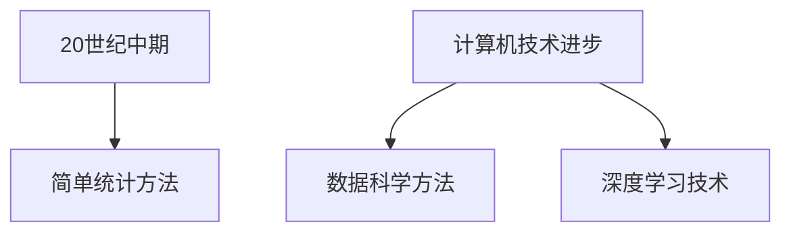
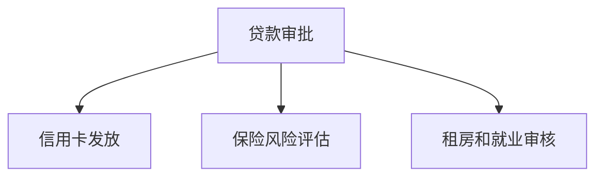

                 

### 第1章：信用评分模型的概述

**1.1 信用评分模型的定义和重要性**

信用评分模型是一种用于评估个人或企业信用风险的统计模型。它的核心目的是通过历史数据和统计方法，预测借款人在未来一定时期内的还款行为。在金融领域，信用评分模型被广泛应用于贷款审批、信用卡发放、风险管理等场景。

首先，信用评分模型通过对借款人的历史信用记录、收入状况、职业状况等数据进行收集和分析，建立一个数学模型。这个模型能够根据输入的数据，输出一个信用评分，用于评估借款人的信用风险。一个较高的信用评分意味着借款人具有较高的信用等级，反之则较低。

信用评分模型的重要性在于，它为金融机构提供了风险评估的工具，帮助它们在贷款审批、信用卡发放等环节做出更加明智的决策。通过信用评分模型，金融机构可以降低贷款违约的风险，提高贷款的还款率，从而保障自身的财务安全。

$$
\text{信用评分} = f(\text{历史数据}, \text{统计方法})
$$

**1.2 信用评分模型的历史发展**

信用评分模型的发展可以追溯到20世纪中期。早期的信用评分模型主要依赖于统计方法，如线性回归、逻辑回归等。这些模型基于历史数据的统计规律，建立评分模型，从而预测未来的信用风险。

随着计算机技术和数据科学的进步，信用评分模型逐渐从简单的统计方法演化为复杂的机器学习算法。现代信用评分模型能够利用大数据和深度学习技术，从海量数据中挖掘出更加准确的信用风险预测模型。

20世纪80年代，信用评分模型开始逐渐向自动化和智能化方向发展。金融机构开始使用基于规则的系统来评估信用风险，这些系统能够根据预设的规则，自动对借款人的信用评分进行计算。随着人工智能技术的发展，现代信用评分模型已经能够利用深度学习、强化学习等技术，实现更加精准的信用风险评估。



**1.3 信用评分模型的应用领域**

信用评分模型在多个领域有广泛应用，包括但不限于：

- **贷款审批**：信用评分模型可以帮助金融机构快速评估借款人的信用状况，从而决定是否批准贷款申请。
- **信用卡发放**：信用评分模型可以评估借款人申请信用卡的信用风险，从而决定是否发放信用卡。
- **保险风险评估**：信用评分模型可以帮助保险公司评估客户的信用风险，从而制定合理的保险费率。
- **租房和就业审核**：一些机构在租房和就业审核过程中，也会使用信用评分模型来评估申请人的信用风险。



**1.4 信用评分模型的目标和挑战**

**目标：**

信用评分模型的目标是准确预测借款人在未来一定时期内的还款行为，从而为金融机构提供决策依据。具体来说，信用评分模型的目标包括：

1. 准确评估信用风险：模型需要能够准确预测借款人的还款情况，从而降低金融机构的贷款违约风险。
2. 提高贷款审批效率：模型需要能够快速处理大量数据，从而提高贷款审批的效率。
3. 降低贷款成本：通过准确预测信用风险，金融机构可以降低贷款成本，提高利润。

**挑战：**

实现信用评分模型的目标面临以下挑战：

1. **数据质量问题**：信用评分模型依赖于大量历史数据，数据的质量直接影响模型的准确性。数据质量问题包括数据缺失、数据不一致、数据噪声等。
2. **特征选择问题**：模型需要从大量特征中筛选出对信用评分有显著影响的关键特征，这需要深入理解业务场景和特征之间的关系。
3. **模型可解释性问题**：信用评分模型通常采用复杂的算法和模型，如深度学习模型，这些模型往往难以解释其预测结果，这对金融机构的风险控制和监管带来挑战。
4. **法律法规限制**：信用评分模型在应用过程中需要遵守相关法律法规，如反歧视法、隐私保护法等，这限制了模型的自由度。

为了解决这些挑战，研究人员和从业者需要不断探索新的方法和技术，如利用大数据和深度学习技术提高数据质量，采用可解释性模型，以及制定相应的法律法规来规范信用评分模型的应用。

### 第2章：信用评分的核心概念与联系

**2.1 核心概念原理**

信用评分模型的核心概念包括信用评分指标、信用评分模型类型等。

**2.1.1 信用评分指标**

信用评分指标是信用评分模型评估信用风险的重要依据。常见的信用评分指标包括：

- **信用评分**：一个数值，表示借款人的信用风险水平。通常由信用评分模型计算得出。
- **违约概率**：借款人在未来一定时期内违约的概率。这是信用评分模型最重要的输出指标之一。
- **信用等级**：根据信用评分将借款人分为不同的信用等级，如AAA、AA、A等。

**2.1.2 信用评分模型类型**

信用评分模型可以分为传统模型和AI增强模型两大类。

- **传统模型**：基于统计方法和规则系统的模型，如线性回归、逻辑回归、决策树等。
- **AI增强模型**：基于机器学习和深度学习技术的模型，如神经网络、卷积神经网络、循环神经网络等。

**2.2 概念属性特征对比表格**

下面是一个信用评分指标、信用评分模型类型的概念属性特征对比表格：

| 概念        | 属性特征                      | 对比           |
| ----------- | ----------------------------- | -------------- |
| 信用评分    | 数值型，表示信用风险水平     | 预测准确性     |
| 违约概率    | 概率型，表示违约风险         | 风险控制       |
| 信用等级    | 分类型，表示信用等级         | 风险分级       |
| 传统模型    | 统计方法和规则系统           | 简单、易理解   |
| AI增强模型  | 机器学习和深度学习技术       | 准确性高、复杂 |

**2.3 ER实体关系图架构**

ER（实体-关系）图是描述信用评分模型核心概念和关系的一种图形化工具。下面是一个信用评分模型的ER图：

```mermaid
erDiagram
    Customer ||--|{ CreditScore : has }
    Customer ||--|{ Loan : has }
    CreditScore ||--|{ Score : contains }
    Loan ||--|{ Amount : contains }
    Loan ||--|{ Status : contains }
```

在这个ER图中：

- **Customer（客户）**：表示借款人，是信用评分模型的主要实体。
- **CreditScore（信用评分）**：表示客户信用评分，是客户的一个属性。
- **Loan（贷款）**：表示客户申请的贷款，也是客户的一个属性。
- **Score（评分）**：表示信用评分的具体数值。
- **Amount（金额）**：表示贷款的金额。
- **Status（状态）**：表示贷款的状态，如已批准、已还款等。

通过ER图，我们可以清晰地看到信用评分模型中各个实体之间的关系，以及它们之间的属性和关联。

### 第3章：数据收集方法

**3.1 数据源的选择**

数据收集是信用评分模型建设的基础，选择合适的数据源至关重要。以下是几种常见的数据源及其特点：

- **内部数据**：来自金融机构自身的数据，如客户信用记录、贷款还款情况等。内部数据具有真实性和可靠性，是构建信用评分模型的重要基础。
- **公共数据**：来自公共数据库或开放数据集的数据，如人口统计数据、经济指标等。公共数据可以补充内部数据的不足，提供更全面的信息。
- **第三方数据**：来自第三方数据提供商的数据，如社交网络数据、消费记录等。第三方数据可以提供更多的信息维度，但需要确保数据的合法性和准确性。

**3.2 数据收集流程**

数据收集流程通常包括以下步骤：

1. **需求分析**：明确信用评分模型的建设目标，确定需要收集的数据类型和范围。
2. **数据获取**：通过API接口、数据爬取、问卷调查等方式获取所需数据。
3. **数据清洗**：对获取到的数据进行预处理，包括缺失值处理、异常值处理、数据格式统一等。
4. **数据存储**：将清洗后的数据存储到数据库中，便于后续分析和处理。

**3.3 数据收集的挑战与解决方案**

数据收集过程中可能会面临以下挑战：

- **数据质量问题**：包括数据缺失、数据不一致、数据噪声等。解决方案包括数据清洗、数据验证、数据增强等。
- **数据隐私问题**：个人数据的隐私保护是法律和道德的底线。解决方案包括数据脱敏、数据加密、隐私计算等。
- **数据访问权限**：某些数据可能受到法律或机构政策的限制，访问权限受限。解决方案包括与数据提供方合作、寻求法律法规的指导等。

通过合理的解决方案，可以有效克服数据收集过程中的挑战，确保数据的质量和可靠性。

### 第4章：数据预处理技术

**4.1 数据清洗**

数据清洗是数据预处理的重要环节，旨在提高数据的质量和一致性。以下是一些常见的数据清洗技术：

**4.1.1 缺失值的处理**

缺失值处理方法包括：

- **删除缺失值**：对于缺失值较多的数据，可以选择删除这些数据。
- **填充缺失值**：使用平均值、中位数、最常见值等统计方法填充缺失值。
- **使用模型预测缺失值**：利用机器学习模型预测缺失值，如使用k近邻算法、线性回归模型等。

**4.1.2 异常值的处理**

异常值处理方法包括：

- **删除异常值**：对于异常值，可以选择删除这些数据点。
- **修正异常值**：对异常值进行修正，如将异常值替换为邻近值或中位数。
- **保留异常值**：在某些情况下，异常值可能包含了有价值的信息，可以选择保留这些异常值。

**4.2 数据转换**

数据转换是数据预处理的重要步骤，旨在提高数据的一致性和可用性。以下是一些常见的数据转换技术：

**4.2.1 特征工程**

特征工程是数据转换的核心，旨在从原始数据中提取出对信用评分模型有用的特征。以下是一些特征工程的方法：

- **特征选择**：使用筛选法、递归特征消除法等方法选择最重要的特征。
- **特征构造**：通过计算新特征、组合现有特征等方法增加特征的数量和多样性。
- **特征归一化**：使用最小-最大缩放、z-score标准化等方法将特征值缩放到相同的范围。

**4.2.2 数据标准化与归一化**

数据标准化与归一化是数据转换的关键步骤，旨在消除不同特征之间的量纲影响，使模型能够更好地学习。以下是一些常用的标准化与归一化方法：

- **最小-最大缩放**：将特征值缩放到[0, 1]的范围内。
- **z-score标准化**：将特征值缩放到均值为0、标准差为1的范围内。

**4.3 数据质量评估**

数据质量评估是确保数据预处理效果的重要步骤，旨在评估数据的质量和一致性。以下是一些常见的数据质量评估方法：

- **一致性评估**：评估数据的一致性和准确性，如使用一致性比率、一致性指标等。
- **完整性评估**：评估数据的完整性，如使用缺失值比率、异常值比率等。
- **可靠性评估**：评估数据的可靠性和一致性，如使用置信度、可信度等。

通过合理的数据预处理技术，可以提高数据的质量和一致性，为信用评分模型的构建提供坚实的基础。

### 第5章：数据质量评估

**5.1 数据质量评估指标**

数据质量评估是确保数据预处理效果的重要步骤。以下是几个常见的数据质量评估指标：

1. **缺失值率**：表示数据集中缺失值的比例。低缺失值率表明数据较为完整。
   $$
   \text{缺失值率} = \frac{\text{缺失值总数}}{\text{数据总数}}
   $$
   
2. **一致性率**：表示数据的一致性和准确性。高一致性率表明数据的一致性较好。
   $$
   \text{一致性率} = \frac{\text{一致数据对数}}{\text{总数据对数}}
   $$

3. **异常值率**：表示数据中异常值的比例。低异常值率表明数据较为稳定。
   $$
   \text{异常值率} = \frac{\text{异常值总数}}{\text{数据总数}}
   $$

4. **准确性**：表示预测结果与实际结果的匹配程度。高准确性表明模型性能较好。

**5.2 数据质量评估方法**

数据质量评估方法包括以下几个方面：

1. **统计分析**：使用描述性统计分析方法，如均值、中位数、标准差等，评估数据的分布和趋势。

2. **可视化**：通过数据可视化方法，如箱线图、散点图等，直观地观察数据的分布和异常值。

3. **机器学习模型**：利用机器学习模型，如决策树、随机森林等，对数据进行分类或回归，评估模型的性能，从而间接评估数据质量。

4. **专家评审**：邀请领域专家对数据进行评审，评估数据的一致性和准确性。

**5.3 数据质量改进策略**

为了提高数据质量，可以采取以下策略：

1. **数据清洗**：对缺失值、异常值进行处理，如删除、填充或修正。

2. **数据集成**：整合来自多个数据源的数据，消除重复和冲突。

3. **数据标准化**：对数据进行标准化处理，消除不同特征之间的量纲差异。

4. **特征工程**：通过特征选择和构造，增加数据的特征多样性。

5. **持续监控**：建立数据质量监控机制，定期评估数据质量，及时发现并处理问题。

通过合理的数据质量评估和改进策略，可以确保数据的质量和一致性，为信用评分模型的构建提供可靠的数据基础。

### 第6章：传统信用评分模型分析

**6.1 线性回归模型**

**6.1.1 模型原理**

线性回归模型是一种常用的信用评分模型，其核心思想是通过历史数据和统计方法，建立一个线性关系模型，从而预测借款人的信用评分。线性回归模型的数学表达式如下：

$$
\text{信用评分} = \beta_0 + \beta_1 \times \text{特征1} + \beta_2 \times \text{特征2} + \ldots + \beta_n \times \text{特征n}
$$

其中，$\beta_0$为截距项，$\beta_1, \beta_2, \ldots, \beta_n$为特征系数，$特征1, \特征2, \ldots, \特征n$为输入特征。

**6.1.2 算法流程**

线性回归模型的算法流程包括以下几个步骤：

1. **数据收集**：收集借款人的历史信用记录、收入状况、职业状况等数据。
2. **特征工程**：对数据进行预处理，包括数据清洗、缺失值处理、特征转换等。
3. **数据划分**：将数据集划分为训练集和测试集，通常使用80%的数据用于训练，20%的数据用于测试。
4. **模型训练**：使用训练集数据，通过最小二乘法或其他优化方法，求解特征系数$\beta_0, \beta_1, \beta_2, \ldots, \beta_n$。
5. **模型评估**：使用测试集数据，计算模型预测的信用评分，并与实际信用评分进行比较，评估模型性能。

**6.1.3 代码实现**

以下是线性回归模型的Python代码实现：

```python
import numpy as np
import pandas as pd
from sklearn.linear_model import LinearRegression

# 加载数据
data = pd.read_csv('credit_data.csv')

# 数据预处理
X = data.iloc[:, :-1].values
y = data.iloc[:, -1].values

# 划分训练集和测试集
X_train, X_test, y_train, y_test = train_test_split(X, y, test_size=0.2, random_state=0)

# 创建线性回归模型
model = LinearRegression()

# 训练模型
model.fit(X_train, y_train)

# 预测信用评分
y_pred = model.predict(X_test)

# 模型评估
print("Mean squared error: %.2f" % mean_squared_error(y_test, y_pred))
```

**6.2 决策树模型**

**6.2.1 模型原理**

决策树模型是一种基于树形结构的分类模型，通过一系列规则将数据集划分为不同的类别。在信用评分模型中，决策树模型可以根据借款人的特征，预测其信用评分。

决策树的生成过程包括以下几个步骤：

1. **选择最优特征**：计算每个特征的信息增益或基尼不纯度，选择信息增益或基尼不纯度最高的特征作为划分依据。
2. **划分数据集**：根据选定的特征，将数据集划分为不同的子集。
3. **递归构建树**：对每个子集重复上述过程，直到满足终止条件（如达到最大深度或最小样本数）。

**6.2.2 算法流程**

决策树模型的算法流程包括以下几个步骤：

1. **数据收集**：收集借款人的历史信用记录、收入状况、职业状况等数据。
2. **特征工程**：对数据进行预处理，包括数据清洗、缺失值处理、特征转换等。
3. **数据划分**：将数据集划分为训练集和测试集。
4. **模型训练**：使用训练集数据，构建决策树模型。
5. **模型评估**：使用测试集数据，评估模型性能。

**6.2.3 代码实现**

以下是决策树模型的Python代码实现：

```python
import numpy as np
import pandas as pd
from sklearn.tree import DecisionTreeClassifier
from sklearn.model_selection import train_test_split

# 加载数据
data = pd.read_csv('credit_data.csv')

# 数据预处理
X = data.iloc[:, :-1].values
y = data.iloc[:, -1].values

# 划分训练集和测试集
X_train, X_test, y_train, y_test = train_test_split(X, y, test_size=0.2, random_state=0)

# 创建决策树模型
model = DecisionTreeClassifier()

# 训练模型
model.fit(X_train, y_train)

# 预测信用评分
y_pred = model.predict(X_test)

# 模型评估
print("Accuracy:", accuracy_score(y_test, y_pred))
```

**6.3 KNN算法**

**6.3.1 模型原理**

KNN（K-近邻）算法是一种基于实例的信用评分模型，其核心思想是找到与目标样本最近的K个邻居，根据邻居的信用评分对目标样本进行预测。KNN算法的数学表达式如下：

$$
\text{信用评分} = \frac{1}{K} \sum_{i=1}^{K} \text{邻居i的信用评分}
$$

其中，K为邻居的个数。

**6.3.2 算法流程**

KNN算法的算法流程包括以下几个步骤：

1. **数据收集**：收集借款人的历史信用记录、收入状况、职业状况等数据。
2. **特征工程**：对数据进行预处理，包括数据清洗、缺失值处理、特征转换等。
3. **数据划分**：将数据集划分为训练集和测试集。
4. **模型训练**：不需要训练过程，直接使用训练集数据。
5. **模型评估**：使用测试集数据，评估模型性能。

**6.3.3 代码实现**

以下是KNN算法的Python代码实现：

```python
import numpy as np
import pandas as pd
from sklearn.neighbors import KNeighborsRegressor
from sklearn.model_selection import train_test_split

# 加载数据
data = pd.read_csv('credit_data.csv')

# 数据预处理
X = data.iloc[:, :-1].values
y = data.iloc[:, -1].values

# 划分训练集和测试集
X_train, X_test, y_train, y_test = train_test_split(X, y, test_size=0.2, random_state=0)

# 创建KNN模型
model = KNeighborsRegressor(n_neighbors=3)

# 训练模型
model.fit(X_train, y_train)

# 预测信用评分
y_pred = model.predict(X_test)

# 模型评估
print("Mean squared error:", mean_squared_error(y_test, y_pred))
```

通过上述传统信用评分模型的详细分析，我们可以看到这些模型在信用评分中的应用及其优缺点。在下一章，我们将探讨AI增强的信用评分模型，这些模型如何利用机器学习和深度学习技术，进一步提高信用评分的准确性和可靠性。

### 第7章：AI增强信用评分模型

**7.1 机器学习在信用评分中的应用**

随着机器学习技术的发展，越来越多的机器学习算法被应用于信用评分领域，以提升模型的准确性和可靠性。机器学习在信用评分中的应用主要包括监督学习和无监督学习两种方法。

**7.1.1 监督学习模型**

监督学习模型是一种基于已有标签数据建立预测模型的机器学习技术。在信用评分中，监督学习模型可以用于预测借款人的信用评分或违约概率。

常见的监督学习模型包括：

1. **线性回归**：线性回归是一种经典的监督学习模型，通过建立线性关系来预测信用评分。
2. **逻辑回归**：逻辑回归是一种广义线性模型，用于预测借款人的信用评分或违约概率。
3. **决策树**：决策树通过一系列规则对借款人进行分类或评分。
4. **支持向量机（SVM）**：SVM通过寻找一个最佳的超平面，将不同信用风险的借款人分开。
5. **随机森林**：随机森林是一种基于决策树的集成模型，通过构建多棵决策树，提高模型的稳定性和预测能力。

**7.1.2 无监督学习模型**

无监督学习模型不需要已有标签数据，通过分析数据的内在结构和模式进行预测。在信用评分中，无监督学习模型可以用于发现数据中的潜在规律，帮助金融机构更好地了解借款人的信用风险。

常见的无监督学习模型包括：

1. **聚类分析**：聚类分析将相似的数据点归为一类，用于发现借款人的信用风险群组。
2. **主成分分析（PCA）**：PCA通过减少数据的维度，提取最重要的特征，帮助金融机构更有效地评估信用风险。
3. **自编码器**：自编码器是一种基于神经网络的无监督学习模型，通过编码和解码过程提取数据中的有效特征。

**7.2 深度学习在信用评分中的应用**

深度学习是一种基于多层神经网络的机器学习技术，通过多层抽象来提取数据中的复杂特征。在信用评分领域，深度学习模型具有强大的特征提取和模式识别能力，能够显著提高信用评分的准确性。

**7.2.1 神经网络**

神经网络是一种基于多层感知器（MLP）的深度学习模型，通过多层非线性变换来提取数据中的特征。

神经网络在信用评分中的应用包括：

1. **信用评分预测**：使用神经网络预测借款人的信用评分或违约概率。
2. **特征提取**：通过神经网络的隐层，提取数据中的隐藏特征，提高模型的泛化能力。

**7.2.2 卷积神经网络（CNN）**

卷积神经网络是一种基于卷积操作的深度学习模型，特别适用于处理图像数据。在信用评分中，CNN可以用于处理文本数据，如借款人的历史信用记录。

**7.2.3 循环神经网络（RNN）**

循环神经网络是一种基于循环结构的深度学习模型，特别适用于处理序列数据。在信用评分中，RNN可以用于处理借款人的历史信用记录序列，预测其未来的信用评分。

**7.2.4 强化学习在信用评分中的应用**

强化学习是一种通过与环境交互来学习最优策略的机器学习技术。在信用评分中，强化学习可以用于训练信用评分模型，使其在动态环境中不断优化信用评分策略。

强化学习在信用评分中的应用包括：

1. **违约预测**：使用强化学习模型预测借款人的违约概率，并优化信用评分策略。
2. **信用风险管理**：通过强化学习模型，实时调整信用评分策略，以应对动态变化的风险。

通过机器学习和深度学习技术，信用评分模型可以更好地提取数据中的特征，提高模型的预测准确性。在下一章，我们将探讨如何评估和优化AI增强的信用评分模型。

### 第8章：模型评估与优化

**8.1 评估指标**

评估信用评分模型的性能是确保模型有效性的关键。以下是几种常见的评估指标：

**8.1.1 准确率、召回率、F1值**

1. **准确率（Accuracy）**：准确率是预测正确的样本数占总样本数的比例。公式如下：

   $$
   \text{准确率} = \frac{\text{预测正确数}}{\text{总样本数}}
   $$

   准确率能够直观地反映模型的分类效果，但当正负样本比例不均衡时，可能无法全面评估模型的性能。

2. **召回率（Recall）**：召回率是预测正确的正样本数占所有实际正样本数的比例。公式如下：

   $$
   \text{召回率} = \frac{\text{预测正确的正样本数}}{\text{所有正样本数}}
   $$

   召回率关注的是模型对正样本的捕捉能力，但在误分类负样本较多时，召回率可能较低。

3. **F1值（F1 Score）**：F1值是准确率和召回率的调和平均，公式如下：

   $$
   \text{F1值} = 2 \times \frac{\text{准确率} \times \text{召回率}}{\text{准确率} + \text{召回率}}
   $$

   F1值能够综合评估模型的准确性和召回率，是衡量分类模型性能的常用指标。

**8.1.2 ROC曲线与AUC值**

1. **ROC曲线（Receiver Operating Characteristic Curve）**：ROC曲线是通过调整分类阈值，绘制预测概率与实际标签之间的关系曲线。曲线下面积（AUC）反映了模型的分类能力。

2. **AUC值（Area Under Curve）**：AUC值是ROC曲线下面积，用于评估模型的分类性能。AUC值越接近1，表明模型对正负样本的区分能力越强。

**8.2 模型优化方法**

**8.2.1 超参数调优**

超参数是模型中需要手动设置的参数，如学习率、正则化参数等。超参数调优是通过调整这些参数，寻找最优参数组合，以提高模型性能。常见的方法包括：

- **网格搜索（Grid Search）**：在预定义的参数网格中，逐一尝试所有可能的参数组合。
- **贝叶斯优化（Bayesian Optimization）**：基于贝叶斯统计模型，通过历史实验结果，优化超参数搜索路径。

**8.2.2 特征选择**

特征选择是从原始特征中筛选出对模型性能有显著影响的关键特征，以提高模型性能。常见的方法包括：

- **递归特征消除（Recursive Feature Elimination, RFE）**：通过递归地删除特征，找到对模型性能影响最小的特征。
- **基于信息的特征选择（Information-Theoretic Feature Selection）**：通过信息增益、信息增益率等度量，选择对模型性能有显著贡献的特征。

**8.2.3 模型集成**

模型集成是通过结合多个模型，提高预测性能和稳定性。常见的方法包括：

- **Bagging（Bootstrap Aggregating）**：通过随机抽样生成多个子集，在每个子集上训练模型，然后通过投票或平均进行集成。
- **Boosting（提升）**：通过迭代地训练多个模型，每次迭代都强调错误分类的样本，提高整体模型的预测能力。

通过评估和优化，我们可以确保信用评分模型的准确性和可靠性，为金融机构提供可靠的信用风险评估工具。

### 第9章：实战项目：构建智能信用评分系统

**9.1 项目背景**

在现代金融行业中，信用评分模型的构建和优化是金融机构风险管理的重要环节。随着人工智能技术的飞速发展，利用AI增强信用评分模型已成为行业趋势。本实战项目旨在构建一个智能信用评分系统，通过机器学习和深度学习技术，实现对借款人信用评分的准确预测和风险控制。

**9.2 系统功能设计**

智能信用评分系统的主要功能包括：

1. **数据收集与管理**：从多个数据源收集借款人的历史信用记录、收入状况、职业状况等数据，并对数据进行清洗、预处理和存储。
2. **信用评分模型构建**：利用机器学习和深度学习算法，构建信用评分模型，实现对借款人信用评分的预测。
3. **模型评估与优化**：通过交叉验证、A/B测试等方法，对信用评分模型进行评估和优化，提高模型的准确性和可靠性。
4. **信用风险评估**：根据信用评分模型的结果，对借款人的信用风险进行评估，提供风险评级和风险预警。
5. **用户界面**：提供一个直观易用的用户界面，让金融机构的管理人员能够实时查看信用评分模型的结果，并进行决策。

**9.3 系统架构设计**

智能信用评分系统的架构设计如下：

1. **数据层**：包括数据源、数据收集模块和数据存储模块。数据源可以是金融机构内部的数据库、公共数据集或第三方数据提供商。数据收集模块负责从数据源获取数据，并进行初步清洗。数据存储模块将清洗后的数据存储到关系型数据库或分布式存储系统中。
2. **处理层**：包括数据预处理模块、特征工程模块和模型训练模块。数据预处理模块负责处理缺失值、异常值和数据格式统一。特征工程模块通过构造新的特征和选择关键特征，提高模型的预测能力。模型训练模块利用机器学习和深度学习算法，训练信用评分模型。
3. **模型层**：包括评估模块和优化模块。评估模块通过交叉验证和A/B测试，评估模型性能，选择最佳模型。优化模块通过超参数调优和特征选择，优化模型性能。
4. **应用层**：包括信用风险评估模块和用户界面。信用风险评估模块根据信用评分模型的结果，对借款人进行信用风险评估和风险预警。用户界面提供了一个直观的操作平台，让用户能够方便地使用系统功能。

**9.4 系统接口设计**

系统接口设计如下：

1. **API接口**：系统提供RESTful API接口，允许其他系统或应用程序通过HTTP请求访问系统功能。主要接口包括数据上传接口、信用评分预测接口和风险预警接口。
2. **命令行接口**：系统提供命令行接口，允许用户通过命令行执行系统功能。主要命令包括数据导入、模型训练、模型评估和预测等。
3. **Web界面**：系统提供一个Web界面，让用户能够通过浏览器访问系统。Web界面包括数据管理、模型管理和信用评分预测等模块。

**9.5 系统核心实现**

系统核心实现包括以下几个方面：

1. **数据收集与管理**：使用Python的pandas库和SQLAlchemy库，从多个数据源收集数据，并进行清洗和存储。
2. **特征工程**：使用scikit-learn库中的特征工程工具，进行数据预处理、特征构造和特征选择。
3. **模型训练**：使用scikit-learn和TensorFlow等库，训练多种机器学习和深度学习模型，包括线性回归、决策树、随机森林、神经网络等。
4. **模型评估与优化**：使用交叉验证、A/B测试等方法，评估模型性能，并进行超参数调优和模型优化。
5. **预测与风险预警**：根据信用评分模型的结果，对借款人进行信用评分预测和风险预警，并通过API接口和Web界面提供结果。

**9.6 实际案例分析**

在本章的最后一部分，我们将通过一个实际案例，展示如何使用智能信用评分系统进行信用风险评估。假设某金融机构需要评估一批新申请贷款的借款人的信用风险。

1. **数据收集**：通过API接口，从多个数据源收集借款人的历史信用记录、收入状况、职业状况等数据。
2. **数据预处理**：使用pandas库对数据进行清洗、缺失值处理和特征转换。
3. **特征工程**：使用scikit-learn库进行特征工程，构造新的特征和选择关键特征。
4. **模型训练**：使用TensorFlow和scikit-learn库，训练多种机器学习和深度学习模型。
5. **模型评估**：使用交叉验证和A/B测试，评估模型性能，选择最佳模型。
6. **信用评分预测**：根据最佳模型，对借款人的信用评分进行预测，并将结果通过API接口返回给金融机构。
7. **风险预警**：根据信用评分结果，对高风险借款人进行预警，并提醒金融机构采取相应措施。

通过实际案例的展示，我们可以看到智能信用评分系统在信用风险评估中的应用效果，以及其为企业带来的实际价值。

**9.7 项目小结**

本实战项目通过构建智能信用评分系统，展示了机器学习和深度学习技术在信用评分领域中的应用。项目实现了从数据收集、预处理、特征工程到模型训练、评估、预测和风险预警的完整流程，为金融机构提供了一个有效的信用风险评估工具。通过本项目的实施，我们不仅提升了信用评分的准确性，也为后续的研究和应用提供了宝贵的经验和数据基础。

### 第10章：总结与展望

**10.1 智能信用评分模型的发展趋势**

随着人工智能技术的飞速发展，智能信用评分模型在金融行业的应用越来越广泛。未来，智能信用评分模型的发展趋势将主要体现在以下几个方面：

1. **深度学习技术的应用**：深度学习技术在图像识别、自然语言处理等领域取得了显著成果，未来将进一步应用于信用评分模型中，提高模型的预测准确性和可靠性。
2. **数据驱动的方法**：随着大数据技术的发展，信用评分模型将更加依赖于海量数据的分析和挖掘，通过数据驱动的方法，发现数据中的潜在规律，提高信用评分模型的泛化能力。
3. **实时风险评估**：通过实时数据分析和预测，智能信用评分模型将能够更快速地识别借款人的信用风险，为金融机构提供实时风险评估和预警。
4. **隐私保护和法律法规**：随着数据隐私保护意识的提高，智能信用评分模型将更加注重数据安全和隐私保护，遵守相关法律法规，确保信用评分模型的应用合规。

**10.2 未来研究方向**

在智能信用评分模型的研究中，未来还有许多值得探索的方向：

1. **模型可解释性**：目前大多数智能信用评分模型都是黑箱模型，缺乏可解释性。未来研究可以关注如何提高模型的透明度，使金融机构能够理解模型的决策过程。
2. **跨领域应用**：智能信用评分模型不仅可以应用于金融领域，还可以拓展到保险、租房、就业审核等其他领域，提高这些领域的风险管理水平。
3. **个性化信用评分**：通过结合个体特征和群体特征，构建个性化信用评分模型，提高信用评分的精准度和适应性。
4. **增强模型稳定性**：研究如何提高智能信用评分模型的稳定性和鲁棒性，减少外界因素的干扰，提高模型在多变市场环境中的适应能力。

**10.3 最佳实践与注意事项**

在实际应用智能信用评分模型时，以下最佳实践和注意事项可以帮助金融机构提高信用评分模型的性能：

1. **数据质量**：确保数据的质量和一致性，通过数据清洗、缺失值处理和异常值检测等方法，提高数据质量。
2. **特征选择**：合理选择和构造特征，通过特征工程提高模型的预测能力。
3. **模型调优**：通过交叉验证、A/B测试等方法，选择最佳模型参数，优化模型性能。
4. **数据安全与隐私**：确保数据的安全和隐私，遵守相关法律法规，防止数据泄露和滥用。
5. **模型评估**：定期评估模型性能，根据实际情况调整和优化模型。

**10.4 拓展阅读**

对于对智能信用评分模型感兴趣的研究者和从业者，以下书籍和论文可以作为拓展阅读：

- 《机器学习》（周志华 著）
- 《深度学习》（Ian Goodfellow、Yoshua Bengio、Aaron Courville 著）
- 《信用评分与风险控制》（刘学民 著）
- 《金融科技：深度学习在金融中的应用》（刘铁岩 著）
- 论文：《Deep Learning for Credit Risk Modeling》

通过以上总结和展望，我们希望读者能够对智能信用评分模型有更深入的了解，并在实际应用中取得更好的效果。

### 作者信息

**作者：AI天才研究院/AI Genius Institute & 禅与计算机程序设计艺术 /Zen And The Art of Computer Programming**

感谢读者对本文的关注，希望本文能够为读者在智能信用评分模型的研究和应用中提供有益的参考和启示。如有任何问题或建议，欢迎随时与我们联系。祝您在技术探索之路上取得丰硕的成果！

