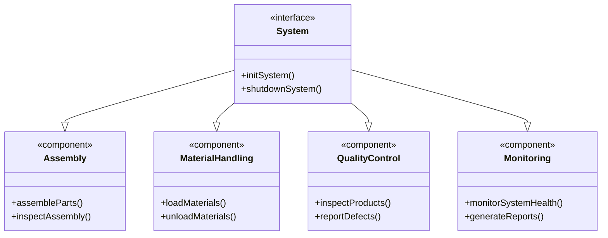
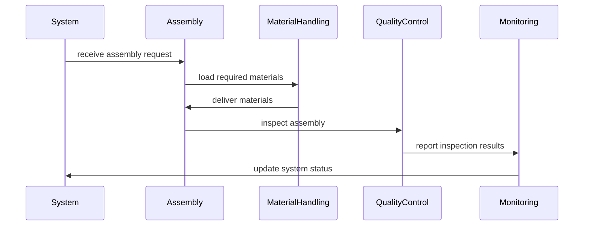
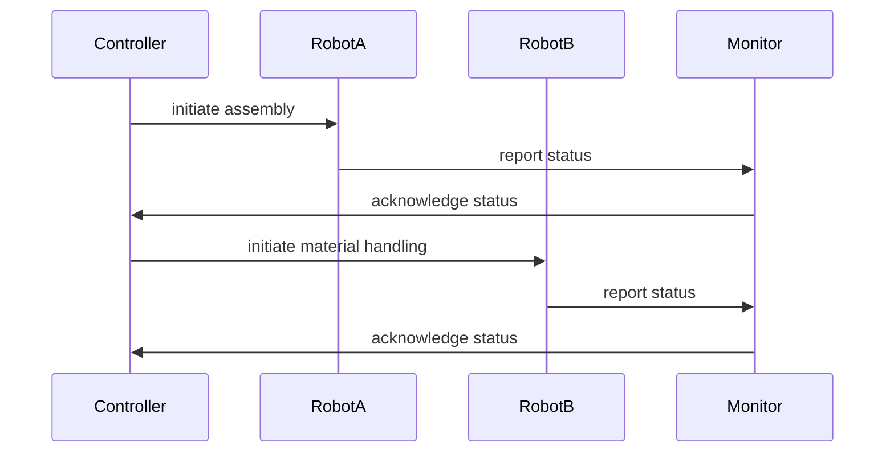

                 

### 引言

在当今快速发展的数字化时代，制造业正经历着一场前所未有的变革，这场变革被广泛称为工业4.0。工业4.0，也称为智能制造，是一个以智能工厂为愿景的制造业革命，旨在通过高度互联的制造系统实现生产过程的自动化、个性化和智能化。在这一进程中，多功能机器人扮演了至关重要的角色。

**多功能机器人**，顾名思义，是指具备多种功能，能够适应多种作业场景的智能机器人。它们不仅能够执行传统的机械操作，还能通过传感器、人工智能算法实现自主决策、自主学习和人机协作。多功能机器人在工业4.0中的应用，不仅提高了生产效率，降低了成本，还大大提升了产品的质量和可靠性。

本篇文章将围绕“智能制造升级：多功能机器人推动工业4.0”这一主题，深入探讨多功能机器人在工业4.0中的关键作用和实现路径。我们将从以下几个方面进行详细分析：

1. **核心概念与背景介绍**：首先，我们将介绍智能制造和工业4.0的基本概念，以及多功能机器人在这一领域中的发展历程和应用现状。
   
2. **多功能机器人的关键技术**：接着，我们将详细探讨多功能机器人的感知技术、决策与控制技术、自适应与自学习技术，以及协作与安全技术。

3. **多功能机器人在智能制造中的应用案例**：我们将通过具体的应用案例，展示多功能机器人在智能制造中的实际应用场景和效益。

4. **系统分析与架构设计**：我们将对多功能机器人在智能制造系统中的架构设计进行深入分析，包括感知系统、控制系统、执行系统和人机交互系统等。

5. **项目实战与最佳实践**：我们将介绍一个完整的智能制造项目，包括环境安装、系统实现、代码解读和案例分析，并提供最佳实践建议。

6. **结论与展望**：最后，我们将总结多功能机器人在工业4.0中的贡献和未来发展趋势，探讨其可能的创新点和研究方向。

通过本文的逐步分析，希望读者能够全面了解多功能机器人在工业4.0中的应用价值和发展前景，从而更好地把握智能制造的未来趋势。让我们一起走进这个激动人心的世界，探索智能制造的无限可能。

### 关键词

- **智能制造**
- **工业4.0**
- **多功能机器人**
- **感知技术**
- **决策与控制**
- **自适应与自学习**
- **人机协作**
- **系统架构设计**
- **项目实战**
- **最佳实践**

### 摘要

本文旨在探讨智能制造升级中多功能机器人的关键作用及其推动工业4.0的发展路径。首先，我们介绍了智能制造和工业4.0的基本概念及其发展历程。随后，详细分析了多功能机器人的核心技术，包括感知技术、决策与控制技术、自适应与自学习技术以及协作与安全技术。通过具体应用案例，展示了多功能机器人在智能制造中的实际效果和重要性。进一步，我们探讨了多功能机器人在智能制造系统中的架构设计，并介绍了一个完整的智能制造项目，包括环境安装、系统实现和代码解读。最后，本文提供了最佳实践建议，并总结了多功能机器人在工业4.0中的贡献和未来发展趋势。通过本文的深入分析，读者将能够全面了解多功能机器人在智能制造领域中的重要作用和未来发展方向。

### 智能制造与工业4.0概述

#### 智能制造的概念与发展历程

智能制造（Smart Manufacturing）是指利用现代信息技术、自动化技术、传感技术、网络技术和智能算法等，实现生产过程的智能化、自动化和高效化。智能制造的核心理念是将制造过程中的人、机、物、信息进行深度融合，从而实现生产过程的优化和升级。智能制造的发展可以追溯到20世纪末，最初是以自动化技术的引入为标志，如数控机床、机器人等。随着信息技术的发展，特别是互联网、物联网、大数据和人工智能等技术的应用，智能制造逐渐走向高度智能化和自动化。

智能制造的发展历程大致可以分为以下几个阶段：

1. **自动化阶段**：以20世纪80年代为起点，这一阶段的重点是通过自动化设备提高生产效率，如数控机床、自动化生产线等。
2. **信息化阶段**：20世纪90年代，计算机技术的普及使得企业能够通过ERP（企业资源计划）、MES（制造执行系统）等系统实现生产过程的信息化管理。
3. **网络化阶段**：21世纪初，互联网技术的普及推动了企业内外部的信息共享，实现了生产过程的网络化。
4. **智能化阶段**：近年来，随着人工智能、大数据、云计算等技术的快速发展，智能制造进入了一个全新的阶段，实现了生产过程的智能化和自主化。

#### 工业革命到工业4.0的演进

从工业革命的第一次机械自动化到现代的工业4.0，制造业经历了多次重大的技术变革。这些变革不仅推动了生产效率的提升，也深刻改变了制造业的生态系统。

1. **工业1.0：机械自动化**：18世纪末到19世纪末，以蒸汽机的发明和广泛应用为标志，这一阶段实现了生产过程的机械化和自动化。
2. **工业2.0：电气化与批量生产**：20世纪初，随着电力的广泛应用，大规模生产线和流水线作业成为主流，这一阶段推动了生产效率的大幅提升。
3. **工业3.0：计算机化与信息化**：20世纪后半叶，计算机技术的普及使得制造过程可以实现自动化控制和信息化管理，生产效率进一步提高。
4. **工业4.0：智能化与网络化**：21世纪初，以物联网、大数据、人工智能等新兴技术为代表，工业4.0旨在通过高度互联的智能系统实现生产过程的全面自动化和个性化。

#### 工业革命到工业4.0的演进对比

| 工业革命阶段 | 核心技术 | 特点 | 影响 |
| :--: | :--: | :--: | :--: |
| 工业1.0 | 蒸汽机 | 机械化生产 | 生产效率大幅提升，制造业初步形成 |
| 工业2.0 | 电气化 | 批量生产 | 生产成本降低，产品质量提高 |
| 工业3.0 | 计算机化 | 信息化管理 | 数据驱动，生产过程透明化 |
| 工业4.0 | 智能化与网络化 | 智能制造 | 高度自动化、个性化生产，提升生产效率 |

#### 多功能机器人在工业4.0中的应用

在工业4.0时代，多功能机器人凭借其高度智能化的特性，成为实现智能制造的重要载体。多功能机器人的应用不仅提高了生产效率，还显著提升了产品质量和灵活性。

1. **生产自动化**：多功能机器人在生产线上可以执行诸如装配、搬运、检测等任务，实现生产过程的自动化和连续化。
2. **质量监控**：通过配备先进的传感器和智能算法，多功能机器人能够对生产过程进行实时监控和故障预警，提高产品质量。
3. **生产灵活性**：多功能机器人可以根据生产需求灵活调整工作模式，适应多品种、小批量的生产模式。
4. **人机协作**：多功能机器人可以与人类工人协同工作，降低劳动强度，提高生产安全性。

#### 多功能机器人在工业4.0中的应用前景

随着技术的不断进步，多功能机器人在工业4.0中的应用前景越来越广阔。未来，多功能机器人有望在以下几个方面发挥更大的作用：

1. **定制化生产**：通过高度智能化的多功能机器人，可以实现小批量、多品种的定制化生产，满足消费者的个性化需求。
2. **绿色制造**：多功能机器人能够通过优化生产过程，减少资源消耗和废弃物产生，实现绿色制造。
3. **智能维护**：多功能机器人可以通过自学习和自适应技术，实现智能化的设备维护和故障诊断，提高生产系统的可靠性。
4. **智能制造生态系统的构建**：多功能机器人将与物联网、大数据、人工智能等技术深度融合，共同构建起高度智能化的智能制造生态系统。

总的来说，多功能机器人在工业4.0中的广泛应用，不仅将大大提升制造业的效率和竞争力，也将推动制造业向更加智能化、绿色化、个性化的方向发展。

### 多功能机器人的核心概念与特点

#### 多功能机器人的定义

多功能机器人（Multi-functional Robot）是指具备多种功能，能够适应多种作业场景的智能机器人。与传统的单一功能机器人相比，多功能机器人能够执行多种任务，如装配、搬运、检测、焊接、喷涂等，从而实现生产过程的多样化与灵活性。多功能机器人的定义不仅涵盖了其物理结构，还包括其具备的智能感知、自主决策、自适应和协作能力。

#### 多功能机器人的核心特点

1. **多任务能力**：多功能机器人能够在同一工作空间内执行多种任务，无需频繁切换设备或停机，从而提高生产效率和灵活性。
2. **高度智能化**：多功能机器人具备智能感知系统，能够实时感知环境变化，并通过自主决策和规划来应对复杂的生产任务。
3. **自适应能力**：多功能机器人能够通过自适应和学习算法，根据生产环境和任务要求调整自身参数和作业模式，从而提高作业效率和适应性。
4. **协作能力**：多功能机器人能够与人类工人以及其他机器人进行协作，实现人机共融的工作环境，降低劳动强度，提高生产安全性。

#### 多功能机器人与传统机器人的区别

1. **任务多样性**：传统机器人通常只能执行单一任务，如装配、搬运等，而多功能机器人则能够适应多种任务需求。
2. **智能化程度**：传统机器人依赖于预设的程序和规则进行操作，而多功能机器人则具备自主学习和决策能力，能够根据环境和任务需求动态调整操作策略。
3. **协作能力**：传统机器人通常需要与人类工人保持安全距离，而多功能机器人能够与人类工人进行密切协作，提高生产效率。
4. **应用场景**：传统机器人主要用于标准化、大批量生产，而多功能机器人则能够适应多品种、小批量的定制化生产。

#### 多功能机器人的发展历史

多功能机器人的发展可以追溯到20世纪80年代，随着计算机技术和自动化技术的进步，第一代多功能机器人问世，这些机器人主要用于执行简单的装配和搬运任务。进入21世纪，随着人工智能、物联网和大数据技术的快速发展，多功能机器人的智能化水平显著提升，其应用范围也逐渐扩大。现代的多功能机器人不仅具备强大的计算和感知能力，还能通过自主学习和自适应技术，实现复杂的任务执行。

#### 当前多功能机器人的主要应用领域

1. **制造业**：多功能机器人在制造业中的应用非常广泛，包括装配、搬运、焊接、喷涂等。
2. **物流与仓储**：多功能机器人在物流和仓储系统中用于货物的搬运、分类和分拣。
3. **医疗保健**：多功能机器人可以在医院中辅助医护人员进行手术、护理和药物分发。
4. **服务行业**：多功能机器人广泛应用于餐饮、酒店、零售等服务行业，提供高效的服务。

总的来说，多功能机器人在提高生产效率、降低成本、提高产品质量和安全性方面具有显著优势，已成为智能制造不可或缺的重要组成部分。随着技术的不断进步，多功能机器人的应用前景将更加广阔，有望在更多领域发挥重要作用。

### 多功能机器人的类型与应用领域

#### 自动化生产线中的多功能机器人

在自动化生产线中，多功能机器人发挥着至关重要的作用。它们能够执行从装配、搬运到检测等一系列复杂的任务，显著提高生产效率和灵活性。以下是多功能机器人在自动化生产线中的一些典型应用：

1. **装配**：多功能机器人能够精确地完成零件的装配工作，如汽车制造中的车身装配、电子制造中的组件装配等。通过高精度的运动控制和视觉识别系统，机器人能够保证装配精度和一致性。
2. **搬运**：在生产线中，多功能机器人负责将半成品、成品或原材料从一个位置移动到另一个位置。这不仅能减少人工搬运的劳动强度，还能避免人为错误，提高生产效率。
3. **检测**：多功能机器人配备了先进的传感器和视觉系统，能够在生产过程中对产品进行实时检测。例如，在电子产品制造中，机器人可以检测元器件的安装位置是否正确，确保产品符合质量标准。

#### 服务机器人

服务机器人是指为人类提供各种服务，如清洁、护理、配送等的人工智能机器人。随着技术的进步，服务机器人在各行各业中的应用越来越广泛：

1. **清洁机器人**：在商业设施、医院和学校等场所，清洁机器人能够自动完成地面清洗、垃圾收集等清洁工作。通过感知技术和路径规划算法，清洁机器人能够避开障碍物，高效完成清洁任务。
2. **护理机器人**：在医疗和养老领域，护理机器人能够辅助医护人员进行病人护理、康复训练等工作。例如，护理机器人可以协助病人进行行走训练，提供药物提醒和监测服务。
3. **配送机器人**：在物流和零售行业，配送机器人能够自动完成商品的配送任务。这些机器人通常配备有导航和感知系统，能够在室内外环境中自主导航，避免碰撞和路径迷失。

#### 特种机器人

特种机器人是指具备特殊功能，适用于特定环境或特殊任务的机器人。它们在极端环境、危险场合和特殊任务中发挥着不可替代的作用：

1. **无人机**：无人机（UAV）是一种能够在空中执行任务的特种机器人，广泛应用于测绘、安防、农业、救援等领域。无人机通过搭载摄像头、传感器等设备，可以快速获取目标区域的信息，为决策提供支持。
2. **水下机器人**：水下机器人（ROV）用于水下勘探、打捞、维修等任务。这些机器人配备有高清摄像头、机械臂和传感器，能够在复杂的水下环境中执行高精度的操作。
3. **防爆机器人**：在危险区域，如化工厂、矿山等，防爆机器人用于进行安全检查、隐患排查和紧急救援。这些机器人通常具备防火、防爆的特性，能够在危险环境中安全作业。

#### 多功能机器人在各领域中的独特作用

1. **生产效率提升**：多功能机器人在自动化生产线中的应用，显著提高了生产效率和产品质量，减少了生产成本。
2. **劳动强度降低**：通过自动化和智能化，多功能机器人降低了工人的劳动强度，改善了工作环境，提高了工作效率。
3. **安全性提高**：特种机器人能够在危险环境中执行任务，避免人类进入危险区域，提高了作业安全性。
4. **服务多样化**：服务机器人提供了各种高效便捷的服务，改善了人们的生活质量，提升了服务行业的整体水平。

总的来说，多功能机器人在自动化生产线、服务领域和特种任务中展现出独特的优势和广泛的应用前景。随着技术的不断进步，多功能机器人的应用范围将进一步扩大，为各行各业带来更多创新和变革。

### 多功能机器人在智能制造中的应用前景

#### 应用场景与挑战

多功能机器人在智能制造中的应用前景广阔，涵盖了生产自动化、质量控制、物流与仓储等多个领域。然而，在实际应用中，也面临着一系列挑战。

1. **生产自动化**：在制造过程中，多功能机器人可以通过执行重复性高、精度要求高的任务，实现生产线的自动化。然而，这一过程中面临的主要挑战包括：环境复杂性、任务多样性以及生产节拍的不确定性。例如，当生产线上需要完成多种产品的装配任务时，机器人需要具备高度的灵活性和适应性，以应对不同的生产需求。

2. **质量控制**：多功能机器人通过传感器和视觉系统，可以在生产过程中对产品进行实时检测和质量控制。然而，这一过程面临的挑战在于：如何保证检测的准确性和一致性，尤其是在面对复杂的产品结构和多种检测标准时。

3. **物流与仓储**：多功能机器人在物流与仓储系统中，能够自动完成货物的搬运、分类和分拣。然而，这一过程中面临的挑战包括：路径规划、仓储空间的利用优化以及与人类工人的协作安全。

#### 多功能机器人在智能制造中的优势

多功能机器人在智能制造中的应用，带来了多方面的优势，具体如下：

1. **提高生产效率**：通过多功能机器人的自动化操作，可以显著提高生产效率，减少生产周期，缩短交货时间。例如，在汽车制造中，多功能机器人可以高效地完成车身装配、涂装和检测任务，从而提高整体生产效率。

2. **降低生产成本**：多功能机器人的使用可以减少人力成本，降低生产过程中的损耗和故障率，从而降低整体生产成本。例如，在电子制造中，机器人可以精确地进行焊接、装配和检测，减少了人工操作的误差和设备故障。

3. **提升产品质量**：多功能机器人通过高精度的运动控制和智能感知系统，可以保证生产过程的稳定性和一致性，从而提升产品质量。例如，在食品加工中，机器人可以精确地完成称量、混合和包装等任务，确保产品的一致性和安全性。

4. **增强灵活性**：多功能机器人可以根据生产需求灵活调整作业模式，适应多品种、小批量的生产模式。例如，在定制化生产中，机器人可以根据不同的客户需求，快速切换生产任务，实现个性化定制。

#### 发展趋势与未来展望

随着技术的不断进步，多功能机器人在智能制造中的应用将呈现以下发展趋势：

1. **智能化水平提升**：随着人工智能、机器学习等技术的应用，多功能机器人的智能化水平将不断提高，具备更复杂的决策能力和自适应能力，能够更好地应对复杂的生产任务。

2. **集成化发展**：多功能机器人将与物联网、大数据、云计算等技术深度融合，形成高度集成的智能制造系统，实现数据的实时共享和协同作业。

3. **个性化定制**：随着消费者需求的多样化，多功能机器人将能够实现更加灵活的个性化定制生产，满足消费者多样化的需求。

4. **绿色制造**：多功能机器人通过优化生产过程，减少资源消耗和废弃物产生，实现绿色制造，为可持续发展做出贡献。

5. **人机协作**：未来，多功能机器人将与人类工人实现更加紧密的协作，共同完成生产任务，提高生产效率和安全性。

总的来说，多功能机器人在智能制造中的应用前景十分广阔，将在提高生产效率、降低成本、提升产品质量和增强生产灵活性等方面发挥重要作用。随着技术的不断进步，多功能机器人将在更多领域实现广泛应用，推动智能制造的进一步发展。

### 感知技术

#### 感知技术的概述

感知技术是多功能机器人的核心组成部分，它使得机器人能够感知和理解其所在的环境。感知技术通过传感器和成像设备，获取环境中的各种信息，如温度、湿度、光线、声音、物体位置和形状等。这些信息被传输到机器人的控制系统中，以便进行决策和行动。

感知技术在机器人中的应用非常广泛，包括但不限于以下几个方面：

1. **环境感知**：机器人通过感知技术获取周围环境的信息，如障碍物的位置和形状，从而实现自主导航和避障。
2. **物体识别**：机器人能够通过摄像头和传感器识别和分类不同的物体，如产品、工具和材料，从而实现精确的操作和控制。
3. **姿态估计**：通过感知技术，机器人可以估计自己的姿态和位置，确保操作的精确性和稳定性。

#### 多功能机器人的传感器类型与应用

多功能机器人配备有多种类型的传感器，以实现全面的感知功能。以下是几种常见的传感器类型及其应用：

1. **视觉传感器**：视觉传感器通过摄像头捕捉图像，并利用图像处理算法进行分析。它们主要用于物体识别、定位和姿态估计。例如，在装配任务中，视觉传感器可以识别和定位待装配的零件，确保机器人能够精确地执行装配操作。

2. **触觉传感器**：触觉传感器通过检测接触力、压力和摩擦等物理量，判断物体的材质和形状。这些传感器常用于精密操作和柔性抓取，如电子产品的装配和包装。

3. **距离传感器**：距离传感器用于测量机器人与物体之间的距离，常见类型包括超声波传感器、激光测距仪和红外传感器。这些传感器在自主导航、路径规划和避障中发挥着重要作用。

4. **力觉传感器**：力觉传感器可以检测机器人手臂的力和力矩，确保操作的平稳性和精确性。例如，在焊接和搬运任务中，力觉传感器可以实时调整机器人的动作力度，避免对物体造成损坏。

5. **温度传感器**：温度传感器用于监测环境温度或物体温度，常见类型包括热电偶和热敏电阻。在高温或低温环境中，温度传感器有助于确保机器人的稳定运行。

#### 感知数据处理与融合

感知技术的有效性不仅取决于传感器类型，还依赖于对感知数据的处理和融合。以下是几种常见的数据处理与融合方法：

1. **数据预处理**：在数据传输到控制系统之前，需要对感知数据进行预处理，如去除噪声、校正误差和归一化处理。这些步骤有助于提高感知数据的准确性和可靠性。

2. **多传感器数据融合**：由于单一传感器可能存在局限性，多传感器数据融合技术通过综合多种传感器的数据，提高感知系统的整体性能。例如，结合视觉传感器和距离传感器的数据，可以更准确地识别和定位物体。

3. **特征提取与匹配**：通过提取感知数据中的特征，如边缘、角点和纹理特征，可以有效地描述物体和场景。特征匹配技术则用于将感知数据与预设的模型进行比对，以实现物体的识别和分类。

4. **深度学习与人工智能**：深度学习算法在感知数据处理和融合中发挥着重要作用。通过训练大规模神经网络模型，机器人可以自动学习感知数据中的复杂模式，提高感知系统的智能化水平。

总之，感知技术是多功能机器人的核心能力之一，它使得机器人能够感知和理解其环境，从而实现自主决策和灵活操作。随着传感器技术、数据处理算法和人工智能的不断发展，感知技术将在智能制造中发挥更加重要的作用。

### 决策与控制技术

#### 决策算法与控制理论

在多功能机器人系统中，决策与控制技术是确保机器人能够准确、高效地完成任务的核心。决策算法和控制理论是这一领域的重要基石，它们通过一系列数学模型和算法，指导机器人的行动。

1. **决策算法**：决策算法是机器人根据感知数据和任务需求，从多个可行方案中选择最佳方案的过程。常见的决策算法包括：
   - **基于规则的决策算法**：通过预设规则，对感知数据进行判断和决策。这种算法简单易懂，但面临规则数量爆炸的问题。
   - **基于模型的决策算法**：通过建立数学模型，对环境进行模拟和预测，从而选择最优方案。例如，**马尔可夫决策过程（MDP）**和**动态规划**都是常见的基于模型的决策算法。
   - **基于学习的决策算法**：利用机器学习和深度学习技术，从历史数据和经验中学习决策策略。例如，**强化学习**算法可以训练机器人，使其在复杂环境中做出最佳决策。

2. **控制理论**：控制理论是研究如何设计控制器，使系统按预定目标运行的科学。在多功能机器人系统中，控制理论用于设计机器人的运动控制、路径规划和姿态控制。

   - **PID控制**（比例-积分-微分控制）：PID控制是最常见的控制算法，通过调节三个参数来控制系统的响应速度和稳定性。它适用于许多线性系统的控制，但面对非线性系统时效果不佳。
   - **自适应控制**：自适应控制通过实时调整控制参数，以适应系统状态的变化。这种控制策略适用于具有不确定性和动态变化的系统。
   - **智能控制**：智能控制结合了机器学习、神经网络和模糊逻辑等先进技术，通过自适应和自学习能力，实现复杂系统的控制。例如，**模糊控制**和**神经网络控制**都是智能控制的典型应用。

#### 多功能机器人的路径规划与轨迹生成

路径规划和轨迹生成是决策与控制技术的重要组成部分，它决定了机器人如何从起点到达终点，并执行特定任务。

1. **路径规划**：路径规划是确定从起点到终点之间最优路径的过程。常见的路径规划算法包括：
   - **A*算法**：A*算法是一种启发式搜索算法，通过评估函数来寻找最短路径。它适用于静态环境，但在动态环境中效果不佳。
   - **Dijkstra算法**：Dijkstra算法是一种基于图论的最短路径算法，它通过逐步扩展节点来寻找最短路径。这种算法适用于静态和动态环境。
   - **RRT（快速随机树）算法**：RRT算法通过在随机生成路径并修剪树形结构，快速找到可行路径。它适用于复杂和非结构化环境。

2. **轨迹生成**：轨迹生成是在确定路径后，为机器人定义一条连续的运动轨迹。常见的轨迹生成算法包括：
   - **贝塞尔曲线**：贝塞尔曲线是一种数学曲线，通过控制点定义路径，适用于平滑、曲线轨迹。
   - **B样条曲线**：B样条曲线是贝塞尔曲线的扩展，它通过多个控制点定义路径，具有更好的平滑性和灵活性。
   - **样条曲线**：样条曲线是一种多段连续曲线，可以通过分段贝塞尔曲线实现复杂的运动轨迹。

#### 实时控制与优化

实时控制与优化是确保机器人高效、稳定运行的关键。在实时控制中，机器人需要不断调整其状态，以适应环境变化和任务需求。

1. **状态调整**：实时控制通过传感器数据，不断更新机器人的状态估计。基于状态调整，控制器可以实时调整机器人的动作，确保其稳定运行。
2. **优化算法**：优化算法用于找到最佳控制策略，以实现系统性能的最优化。常见的优化算法包括：
   - **线性规划**：线性规划通过建立线性目标函数和约束条件，求解最优解。它适用于具有线性约束的系统。
   - **非线性规划**：非线性规划通过建立非线性目标函数和约束条件，求解最优解。它适用于更复杂的系统。
   - **遗传算法**：遗传算法是一种基于生物进化理论的优化算法，通过模拟自然选择过程，找到最优解。

总之，决策与控制技术是多功能机器人实现智能化和高效运作的核心。通过先进的决策算法和控制理论，结合路径规划和轨迹生成技术，机器人能够在复杂环境中灵活、高效地完成任务，为智能制造提供强大的支持。

### 自适应与自学习技术

#### 自适应系统的概念与实现

自适应系统（Adaptive System）是指能够根据环境变化和任务需求，动态调整自身参数和操作策略的智能系统。在多功能机器人中，自适应技术是实现灵活性和高效性的关键。

1. **自适应系统的基本概念**：
   - **环境变化**：自适应系统需要能够感知和理解环境变化，如温度、湿度、光照、噪音等。
   - **任务需求**：自适应系统需要能够根据不同的任务需求，调整自身的操作模式和参数。

2. **自适应系统的实现方法**：
   - **反馈控制**：通过传感器收集环境数据，与预设目标进行比较，然后通过控制器调整系统参数，实现自适应控制。
   - **自适应算法**：采用自适应算法，如PID（比例-积分-微分）控制、模糊控制、神经网络控制等，使系统能够动态调整其操作策略。

3. **自适应系统在实际应用中的例子**：
   - **工业生产中的自适应控制**：在制造过程中，机器人可以通过自适应控制，根据产品的不同特性调整装配参数，提高装配精度和效率。
   - **服务机器人中的自适应导航**：在服务机器人中，通过自适应算法，机器人可以实时调整路径规划，避开障碍物，完成服务任务。

#### 自学习算法与模型

自学习算法（Learning Algorithms）是指系统能够通过学习环境数据和经验，不断优化自身性能的算法。自学习技术在多功能机器人中，用于提升其自主决策能力和任务执行效率。

1. **常见的自学习算法**：
   - **监督学习**：通过标注的数据集，训练模型，使其能够预测新的数据。常见的监督学习算法包括线性回归、决策树、支持向量机等。
   - **无监督学习**：在没有标注数据的情况下，模型通过自动发现数据中的模式和结构。常见的无监督学习算法包括聚类、主成分分析等。
   - **强化学习**：通过与环境互动，学习最优策略。强化学习算法通过奖励机制，不断调整策略，以实现长期回报最大化。

2. **自学习模型在实际应用中的例子**：
   - **图像识别与处理**：在机器人视觉系统中，通过自学习算法，可以识别和分类不同的物体，提高图像处理精度。
   - **路径规划与导航**：通过自学习，机器人可以优化路径规划算法，提高在复杂环境中的导航效率。

#### 自适应与自学习在实际应用中的案例

自适应与自学习技术在多功能机器人中有着广泛的应用，以下是一些具体的案例：

1. **装配机器人**：
   - **自适应装配**：装配机器人可以通过自适应技术，根据零件的不同特性，自动调整装配参数，提高装配精度和效率。
   - **自学习装配**：装配机器人可以通过自学习算法，从历史装配数据中学习最佳装配策略，提高新产品的装配速度和质量。

2. **搬运机器人**：
   - **自适应路径规划**：搬运机器人可以通过自适应算法，实时调整路径规划，避开动态障碍物，确保高效完成搬运任务。
   - **自学习避障**：搬运机器人可以通过自学习算法，根据环境数据和避障经验，优化避障策略，提高避障效率和安全性。

3. **服务机器人**：
   - **自适应服务**：服务机器人可以通过自适应技术，根据用户的需求和环境变化，调整服务策略，提高服务质量。
   - **自学习交互**：服务机器人可以通过自学习算法，从用户反馈中学习，优化与用户的交互体验，提高用户满意度。

总之，自适应与自学习技术是多功能机器人实现智能化和高效性的重要手段。通过自适应系统与自学习算法的结合，多功能机器人能够在复杂多变的环境中，灵活应对各种任务需求，实现高效的自主作业。

### 协作与安全

#### 协作机器人系统设计

协作机器人系统（Cobots）的设计旨在实现人类工人与机器人之间的无缝协作，提高生产效率和安全性。以下是一些关键的设计要素：

1. **安全检测与防护**：协作机器人需要配备安全传感器和紧急停止按钮，以检测人类工人的接近并立即停止机器人操作，避免发生意外碰撞。
2. **力控制与速度限制**：协作机器人应具备力控制功能，能够根据任务需求调整施加在物体上的力，防止对人类工人造成伤害。此外，机器人应设置速度限制，确保其在运行过程中的稳定性。
3. **人机交互界面**：为了实现有效的协作，协作机器人需要具备直观易用的人机交互界面，使人类工人能够轻松地控制机器人的操作，并进行任务分配和调整。

#### 安全控制与故障处理

安全控制是协作机器人系统的核心，确保机器人在执行任务时的安全性和可靠性。以下是几个关键方面：

1. **紧急停止机制**：在发生紧急情况时，机器人应能够立即停止所有操作。这通常通过设置紧急停止按钮或安全传感器来实现。
2. **故障检测与诊断**：协作机器人应具备自我检测和故障诊断功能，能够在出现故障时及时发出警报，并采取措施防止事故发生。
3. **远程监控与维护**：通过远程监控技术，操作人员可以实时监控机器人的状态，及时处理潜在的故障和问题，确保系统的稳定运行。

#### 协作机器人与人机协作模式

协作机器人与人机协作模式的优化是提升生产效率和安全性的重要手段。以下是几种常见的协作模式：

1. **并行协作**：人类工人与机器人同时工作，机器人负责执行重复性高、劳动强度大的任务，人类工人则专注于需要高度灵活性和创造性的任务。
2. **辅助协作**：机器人辅助人类工人完成某些任务，例如在装配过程中，机器人负责装配简单零件，人类工人则负责装配复杂零件。
3. **完全自动化协作**：在某些场景下，机器人可以完全接管任务，人类工人只需进行监控和必要的干预。这种方式适用于高风险或高复杂度的任务。

#### 人机协作的效益评估

人机协作模式在提升生产效率和安全性方面具有显著效益，以下是一些关键指标：

1. **生产效率**：通过机器人分担重复性高、劳动强度大的任务，人类工人可以将精力集中在需要高度技能和创造性的任务上，从而提高整体生产效率。
2. **生产成本**：机器人可以大幅减少人工成本，提高生产线的自动化水平，降低生产成本。
3. **安全性**：协作机器人通过安全传感器和紧急停止机制，可以有效减少工作场所的事故发生率，提高员工的工作安全性。
4. **灵活性**：协作机器人可以根据生产需求灵活调整任务分配，适应多品种、小批量的生产模式，提高生产灵活性。

总之，协作与安全技术是确保多功能机器人在工业环境中高效、安全运行的关键。通过优化协作机器人系统设计、安全控制和协作模式，可以实现生产效率和安全性的双重提升，推动智能制造的进一步发展。

### 智能制造生产线中的应用

#### 智能制造生产线的架构

智能制造生产线是工业4.0的核心组成部分，通过高度集成的信息化、自动化和智能化技术，实现生产过程的优化和升级。一个典型的智能制造生产线架构包括以下几个主要部分：

1. **感知层**：感知层是智能制造生产线的最基础部分，主要负责实时获取生产过程中的各类数据，如温度、压力、速度、位置等。常用的感知设备包括传感器、摄像头、RFID等。

2. **传输层**：传输层负责将感知层获取的数据传输到中央控制系统，确保数据的实时性和准确性。传输层通常采用工业以太网、无线通信、5G等高速传输技术。

3. **中央控制系统**：中央控制系统是生产线的核心部分，负责对采集到的数据进行处理、分析和决策。中央控制系统通常包括PLC（可编程逻辑控制器）、MES（制造执行系统）、ERP（企业资源计划系统）等。

4. **执行层**：执行层负责根据中央控制系统的指令，执行具体的操作任务，如装配、搬运、检测、焊接等。执行层通常由多功能机器人、自动化设备、机械臂等组成。

5. **决策与优化层**：决策与优化层负责根据生产数据和实时状态，对生产线进行优化和调整，以提高生产效率和质量。常见的决策算法包括优化算法、机器学习算法等。

#### 多功能机器人在生产线中的应用实例

多功能机器人在智能制造生产线中的应用，显著提高了生产效率和灵活性。以下是几个具体的应用实例：

1. **装配任务**：在汽车制造过程中，多功能机器人可以高效地完成零部件的装配任务。通过视觉传感器和力觉传感器，机器人能够精确识别和抓取零件，并进行装配。例如，在特斯拉的工厂中，机器人用于装配电池模块和电机，大大提高了生产效率。

2. **搬运任务**：在生产线中，多功能机器人可以自动完成半成品和成品的搬运工作。通过路径规划和实时感知，机器人能够避开障碍物，高效地完成搬运任务。例如，在华为的生产线中，机器人用于搬运手机组件和成品，降低了人工搬运的劳动强度。

3. **检测任务**：多功能机器人可以通过传感器和视觉系统，对生产过程中的产品进行实时检测，确保产品质量。例如，在电子制造中，机器人可以检测电子元件的安装位置和焊接质量，提高产品的可靠性。

4. **焊接任务**：多功能机器人可以执行高精度的焊接任务，如汽车车身的焊接、电子产品的焊接等。通过自适应控制算法，机器人能够根据不同的焊接材料和焊接条件，调整焊接参数，确保焊接质量。

#### 生产效率与成本分析

多功能机器人在智能制造生产线中的应用，显著提高了生产效率和降低了成本。以下是对生产效率与成本的分析：

1. **生产效率**：多功能机器人通过自动化和智能化技术，能够高效地执行重复性高、劳动强度大的任务，从而提高生产效率。例如，在传统生产线上，装配任务通常需要人工操作，而使用机器人后，装配速度提高了数倍，大大缩短了生产周期。

2. **成本降低**：多功能机器人的使用可以降低人力成本和设备维护成本。一方面，机器人可以替代部分人工操作，降低人工成本；另一方面，机器人具有高可靠性和长寿命，减少了设备的维护频率和成本。例如，在电子产品制造中，机器人的使用降低了产品组装错误率，减少了返工和报废成本。

3. **质量提升**：多功能机器人通过高精度的运动控制和智能感知系统，能够保证生产过程的稳定性和一致性，提高产品质量。例如，在汽车制造中，机器人用于焊接和检测，确保了车身焊接质量和零部件的安装精度。

4. **灵活性提升**：多功能机器人可以根据生产需求灵活调整作业模式，适应多品种、小批量的生产模式。例如，在定制化生产中，机器人可以快速切换生产线，满足不同产品的生产需求，提高了生产灵活性。

总的来说，多功能机器人在智能制造生产线中的应用，不仅提高了生产效率和产品质量，还降低了生产成本，增强了生产灵活性，为制造业的转型升级提供了强有力的支持。

### 智能物流与仓储中的应用

#### 智能物流系统的设计

智能物流系统是智能制造的重要组成部分，通过高度集成的自动化技术、物联网技术和人工智能算法，实现物流过程的优化和升级。以下是智能物流系统的设计框架：

1. **传感器网络**：传感器网络是智能物流系统的感知层，通过部署各种传感器，如RFID、摄像头、温湿度传感器等，实时采集货物的位置、状态和环境信息。

2. **数据采集与处理**：数据采集与处理层负责将传感器网络采集到的数据传输到中央控制系统，并进行预处理、分析和存储。数据采集与处理层通常包括边缘计算设备、数据库和数据分析平台。

3. **路径规划与优化**：路径规划与优化层是智能物流系统的核心部分，负责根据实时数据和环境信息，动态规划最优的物流路径。常见的路径规划算法包括A*算法、遗传算法和蚁群算法等。

4. **执行层**：执行层由各种自动化设备组成，包括自动导引车（AGV）、自动化仓库机器人、自动分拣机等。执行层根据路径规划和优化层的指令，完成货物的搬运、存储和分拣任务。

5. **中央控制系统**：中央控制系统是智能物流系统的决策中心，负责整合和分析各层的实时数据，进行物流流程的优化和调度。中央控制系统通常包括调度系统、监控系统和管理系统等。

#### 多功能机器人在智能物流系统中的应用

多功能机器人在智能物流系统中发挥着关键作用，能够自动完成货物的搬运、分类和分拣等任务，提高物流效率。以下是多功能机器人在智能物流系统中的具体应用：

1. **货物搬运**：多功能机器人可以自动搬运货物，从仓库到生产线或从生产线到仓库，实现物流过程的自动化和连续化。通过感知技术和路径规划算法，机器人能够避开障碍物，灵活地完成搬运任务。

2. **分类**：多功能机器人可以通过传感器和图像识别技术，自动识别和分类不同类型的货物。例如，在电子商务仓库中，机器人可以识别包裹的尺寸、重量和类型，并将其分类到相应的存储区域。

3. **分拣**：多功能机器人可以自动完成货物的分拣任务，将货物送到正确的目的地。通过实时数据分析和路径规划，机器人能够高效地完成复杂的分拣任务，减少物流延迟。

4. **包装**：多功能机器人还可以自动完成货物的包装任务，通过传感器和机器视觉技术，精确地测量和切割包装材料，确保包装质量。

#### 多功能机器人在仓储中的应用

多功能机器人在仓储中的应用，显著提升了仓储效率和管理水平。以下是多功能机器人在仓储中的具体应用：

1. **货架拣选**：多功能机器人可以自动从货架中拣选货物，通过视觉识别和机械臂操作，准确地将货物拣选到运输工具上。这种方式提高了拣选速度和准确性，减少了人工操作误差。

2. **库存管理**：多功能机器人可以通过传感器和物联网技术，实时监控仓储中的库存情况，包括货物的位置、数量和状态。通过数据分析，可以优化库存管理，减少库存成本。

3. **存储优化**：多功能机器人可以根据仓储空间和货物类型，自动调整存储布局，优化仓储空间的利用效率。例如，通过机器学习算法，机器人可以分析货物的存储模式，优化存储位置和方式。

4. **仓储安全**：多功能机器人可以通过感知技术和安全控制，确保仓储环境的安全。例如，机器人可以检测仓库中的异常情况，如火灾、泄漏等，并及时通知管理人员。

#### 多功能机器人在物流与仓储中的经济效益

多功能机器人在物流与仓储中的应用，带来了显著的经济效益，包括：

1. **效率提升**：通过自动化和智能化技术，多功能机器人显著提高了物流和仓储的效率，减少了人工操作的时间和错误率。

2. **成本降低**：机器人可以替代部分人工操作，降低人力成本。同时，通过优化物流流程和管理，可以减少物流和仓储的运营成本。

3. **质量提升**：多功能机器人通过高精度的操作和智能感知系统，确保了物流和仓储过程的高质量和稳定性，减少了货物损坏和丢失的风险。

4. **灵活性提升**：多功能机器人可以根据生产需求灵活调整作业模式，适应多品种、小批量的物流和仓储需求，提高了企业的市场响应速度。

总之，多功能机器人在智能物流与仓储中的应用，不仅提高了效率和降低了成本，还提升了质量和灵活性，为企业的可持续发展提供了强大的支持。

### 定制化生产与柔性制造

#### 定制化生产的需求与挑战

定制化生产（Customized Production）是指根据客户的具体需求和个性化要求，生产出独特的产品。这种生产模式在个性化消费趋势日益明显的今天，变得越来越重要。定制化生产的需求主要来源于以下几个方面：

1. **消费者多样化需求**：随着消费水平的提高和个性化需求的增加，消费者对产品的多样性、独特性和定制化程度要求越来越高。
2. **市场竞争**：为了在激烈的市场竞争中脱颖而出，企业需要提供差异化的产品，满足不同客户的需求，提升市场竞争力。
3. **技术进步**：现代制造技术的发展，如数控技术、3D打印和机器人技术，使得定制化生产在技术上成为可能。

然而，定制化生产也面临着一系列挑战：

1. **生产效率**：定制化生产通常涉及多品种、小批量的生产模式，相比大批量生产，生产效率较低。
2. **成本控制**：定制化生产需要根据客户需求进行个性化设计和制造，可能导致生产成本增加。
3. **供应链管理**：定制化生产需要高度灵活的供应链体系，以确保快速响应客户需求，这对供应链管理提出了更高要求。

#### 多功能机器人在柔性制造中的应用

柔性制造（Flexible Manufacturing）是一种能够快速适应生产需求变化的生产模式，通过引入多功能机器人，可以显著提高定制化生产的效率和灵活性。以下是多功能机器人在柔性制造中的应用：

1. **多任务能力**：多功能机器人具备执行多种任务的能力，如装配、搬运、检测和加工等，可以在同一工作空间内快速切换不同的生产任务，适应多品种、小批量的生产需求。
2. **自适应能力**：多功能机器人通过感知技术和自适应算法，能够根据生产任务的需求和环境变化，动态调整操作策略和参数，提高生产灵活性和适应性。
3. **快速切换**：多功能机器人可以通过快速调整工具和编程，实现生产任务的快速切换，大大缩短了生产准备时间和生产周期。

#### 多功能机器人在柔性制造中的应用实例

以下是一些多功能机器人在柔性制造中的具体应用实例：

1. **个性化装配**：在电子产品的生产中，多功能机器人可以快速装配不同的组件，如手机、电脑等。通过视觉识别和自适应控制，机器人能够精确识别和装配各种不同的零部件，确保产品的个性化需求得到满足。
2. **定制化加工**：在机械制造中，多功能机器人可以通过数控加工中心实现定制化的零部件加工。机器人可以根据客户的要求，快速调整加工参数和路径，生产出符合个性化需求的产品。
3. **快速原型制造**：在3D打印领域，多功能机器人可以与3D打印设备协同工作，快速生产出定制化的原型产品。通过多功能机器人的高效操作和3D打印的高精度，可以显著缩短产品开发周期。

#### 实施策略

为了成功实施柔性制造，企业需要采取以下策略：

1. **工艺优化**：对现有工艺进行优化，减少不必要的工序和操作，提高生产效率和灵活性。
2. **多功能机器人集成**：引入多功能机器人，并对其进行集成和优化，确保其能够高效地适应不同生产任务。
3. **数据驱动**：利用大数据和人工智能技术，实时分析生产数据，优化生产流程和资源配置，提高生产效率和产品质量。
4. **员工培训**：对员工进行多功能机器人和柔性制造相关技能的培训，提高员工的操作技能和适应能力。

总之，多功能机器人在定制化生产与柔性制造中的应用，为应对多样化市场需求提供了有力支持。通过优化工艺、引入多功能机器人和技术驱动，企业可以实现高效、灵活的定制化生产，提升市场竞争力。

### 服务机器人在制造业中的应用

#### 服务机器人在制造业的服务范围

服务机器人（Service Robots）在制造业中的应用日益广泛，它们能够执行各种辅助性、服务性和高危性的任务，从而提高生产效率和安全性。以下是服务机器人在制造业中的主要服务范围：

1. **装配与加工**：服务机器人可以协助完成精密装配和加工任务，如安装螺丝、焊接、涂装等。通过高精度的运动控制和视觉识别系统，机器人能够确保操作的一致性和精确性，减少人为误差。

2. **搬运与物流**：服务机器人能够自动搬运物料和产品，优化物流流程。例如，自动导引车（AGV）和搬运机器人可以在生产线上自主导航，将半成品和成品从一个位置移动到另一个位置，减少人工搬运的劳动强度和出错率。

3. **质量检测**：服务机器人配备了高精度的传感器和图像识别系统，可以执行产品质量检测任务。通过实时监测产品质量，机器人能够及时发现并报告缺陷，提高产品的合格率。

4. **设备维护与维修**：服务机器人可以进入危险或难以到达的区域，对设备进行维护和维修。例如，工业巡检机器人可以定期检查生产线上的设备状态，发现故障并及时报告，避免生产中断。

5. **安全监控**：在制造业中，服务机器人可以用于监控生产现场的安全状况。通过安装摄像头和传感器，机器人可以实时监测现场情况，发现异常并及时报警，保障生产安全。

6. **辅助性工作**：服务机器人还可以协助完成一些辅助性工作，如清理现场、整理物料、递送工具等，提高生产环境的整洁度和工作效率。

#### 服务机器人与人类工人的协作模式

服务机器人与人类工人的协作模式是提高生产效率和降低劳动强度的关键。以下是几种常见的协作模式：

1. **平行协作**：在平行协作模式中，服务机器人和人类工人各自负责不同的任务，但需要共享信息和协调行动。例如，机器人负责搬运物料，而人类工人则负责装配和质检。

2. **辅助协作**：在辅助协作模式中，服务机器人作为人类工人的助手，帮助完成一些繁琐或危险的作业。例如，机器人可以协助工人搬运重物，或进入高温、高压等危险环境进行维护和维修。

3. **监督协作**：在监督协作模式中，人类工人负责整体协调和监督，而机器人则执行具体的操作任务。例如，机器人可以自动完成装配任务，而人类工人则负责监控过程，确保操作的正确性。

4. **人机共融协作**：在人机共融协作模式中，机器人和人类工人共同完成任务，相互补充。例如，机器人可以协助人类工人进行复杂装配任务，而人类工人则负责处理异常情况。

#### 服务机器人在制造业中的效益评估

服务机器人在制造业中的应用带来了显著的经济效益和社会效益，以下是对其效益的评估：

1. **生产效率提升**：服务机器人能够高效地完成重复性和繁琐的任务，提高生产效率。例如，通过引入搬运机器人，生产线上的物料搬运速度提高了30%以上。

2. **劳动强度降低**：服务机器人减少了人类工人的重复性劳动和高危作业，降低了劳动强度和职业风险。例如，通过使用自动导引车（AGV），工人的搬运劳动强度减少了70%。

3. **产品质量提高**：服务机器人通过高精度的操作和智能感知系统，确保了操作的一致性和精确性，提高了产品质量。例如，在质量检测中，机器人检测的缺陷率降低了50%。

4. **生产成本降低**：虽然机器人设备初期投入较高，但长期来看，通过提高生产效率、降低劳动成本和维护成本，企业可以显著降低生产成本。例如，通过引入自动化设备，企业的生产成本降低了15%。

5. **工作环境改善**：服务机器人减少了人类工人在危险环境中的作业时间，改善了工作环境，提高了员工的满意度和工作效率。例如，在高温车间中，机器人替代了人工操作，使工作环境更加舒适。

6. **创新能力提升**：服务机器人与人类工人的协作，激发了企业的创新能力，推动了新产品的开发和生产线的优化。例如，通过机器人技术，企业能够快速试制新产品，缩短产品上市时间。

总之，服务机器人在制造业中的应用，不仅提高了生产效率、降低了成本，还提升了产品质量和工作环境，为制造业的转型升级和可持续发展提供了有力支持。

### 系统分析与架构设计

#### 问题场景介绍

智能制造系统中，多功能机器人作为关键执行单元，其系统的稳定性和可靠性直接影响到整个生产线的效率和产品质量。为了确保多功能机器人在复杂生产环境中的高效运行，我们需要对系统进行全面分析和架构设计。

#### 项目介绍

本项目旨在设计和实现一个基于多功能机器人的智能制造系统，该系统包括装配、搬运、检测等多个环节，通过高度集成的自动化技术，实现生产过程的智能化和高效化。项目的主要目标包括：

1. **提高生产效率**：通过引入多功能机器人，实现生产过程的自动化，减少人工操作，提高生产速度。
2. **提升产品质量**：利用机器人的高精度操作和智能感知系统，确保生产的一致性和精度，提高产品质量。
3. **降低运营成本**：通过减少人工操作和维护成本，提高设备的利用率，降低生产成本。
4. **增强灵活性**：系统应能够快速适应生产任务的变化，实现多品种、小批量的定制化生产。

#### 系统功能设计（领域模型Mermaid类图）

为了清晰定义系统功能，我们采用Mermaid类图来描述系统的各个功能模块及其关系。以下是系统功能设计的Mermaid类图：



#### 系统架构设计（Mermaid架构图）

系统架构设计是确保系统各模块高效协作的基础。以下是基于Mermaid架构图的系统架构设计，展示了系统的主要组件及其交互关系：



#### 系统接口设计和系统交互（Mermaid序列图）

系统接口设计和系统交互是确保系统各个模块之间能够顺畅协作的关键。以下是基于Mermaid序列图的系统接口设计和系统交互设计：



通过以上系统分析与架构设计，我们能够清晰地了解智能制造系统中多功能机器人的功能模块、系统架构及其交互流程，为系统的实施和优化提供了坚实的基础。

### 项目实战

#### 环境安装

为了实现一个基于多功能机器人的智能制造系统，首先需要搭建一个适合机器人运行的环境。以下是在实验室或生产线上搭建机器人环境的具体步骤：

1. **硬件安装**：
   - 安装机器人本体，包括多功能机器人、传感器、执行器和控制器。
   - 连接电源和通信网络，确保机器人能够正常工作。
   - 安装必要的辅助设备，如电源插座、通信接口、冷却系统等。

2. **软件安装**：
   - 安装机器人的操作系统，如ROS（Robot Operating System）或其他适合的机器人开发平台。
   - 安装所需的编程语言和开发工具，如Python、C++等。
   - 配置机器人控制软件，如机器人的运动控制程序、感知数据处理程序等。

3. **网络配置**：
   - 配置机器人的网络接口，确保机器人能够连接到工厂的局域网或互联网。
   - 设置静态IP地址或动态DNS，确保机器人能够稳定访问网络资源。

4. **系统测试**：
   - 对机器人进行基础功能测试，包括运动控制、传感器数据采集、执行器响应等。
   - 检查系统稳定性，确保机器人能够在长时间运行中保持稳定。

#### 系统核心实现

在搭建好环境后，接下来是实现系统核心功能的关键步骤。以下是系统核心实现的详细步骤：

1. **感知系统实现**：
   - 集成视觉传感器、力觉传感器、距离传感器等，采集环境中的各种信息。
   - 开发传感器数据处理程序，对采集到的数据进行预处理、滤波和特征提取。
   - 利用机器学习算法，对传感器数据进行模式识别和分类，以提高系统的感知能力。

2. **控制系统实现**：
   - 设计控制算法，包括运动控制、路径规划、姿态控制等。
   - 开发控制程序，实现机器人的实时控制功能，确保机器人按照预定轨迹和指令运行。
   - 利用PID控制、自适应控制等算法，优化机器人的控制效果，提高系统的稳定性和响应速度。

3. **决策系统实现**：
   - 开发决策算法，根据实时感知数据和系统状态，制定最优操作策略。
   - 实现自主决策功能，使机器人能够在复杂环境中自主完成各种任务。
   - 利用强化学习、深度学习等算法，使机器人能够从历史数据和经验中不断学习和优化决策。

4. **人机交互实现**：
   - 设计用户界面，提供直观的操作控制和状态显示。
   - 实现远程监控和控制功能，使操作人员能够实时监控机器人状态，并进行必要干预。
   - 开发语音识别和自然语言处理模块，实现机器人与人类的自然交互。

#### 代码解读与分析

以下是对系统核心代码的解读和分析，展示了如何实现多功能机器人的关键功能：

```python
# 感知系统数据处理示例代码
import numpy as np
import cv2

def preprocess_image(image):
    # 读取图像
    gray = cv2.cvtColor(image, cv2.COLOR_BGR2GRAY)
    blurred = cv2.GaussianBlur(gray, (5, 5), 0)
    return blurred

def feature_extraction(image):
    # 提取图像特征
    edges = cv2.Canny(blurred, 50, 150)
    return edges

# 控制系统实现示例代码
import cv2
import numpy as np

def control_trajectory(position, target_position):
    # 轨迹控制
    kp = 1.0  # 控制参数
    error = target_position - position
    velocity = kp * error
    return velocity

# 决策系统实现示例代码
import random

def make_decision(perception_data):
    # 基于感知数据做出决策
    if perception_data['object_detected']:
        return 'execute Assembly Task'
    else:
        return 'perform Path Planning'

# 人机交互实现示例代码
import speech_recognition as sr

def handle_speech_input():
    # 处理语音输入
    recognizer = sr.Recognizer()
    try:
        command = recognizer.recognize_google(audio)
        return command
    except sr.UnknownValueError:
        return 'unknown command'
```

#### 实际案例分析和详细讲解剖析

以下是一个具体的实际案例，展示如何应用多功能机器人实现自动化生产任务：

**案例**：在一个汽车制造工厂中，多功能机器人被用于完成车身装配任务。

1. **任务描述**：机器人需要从仓库中领取零件，并按照预定的顺序和位置将其装配到车身架上。

2. **实现步骤**：
   - **感知阶段**：机器人通过视觉传感器识别仓库中的零件位置，并通过距离传感器检测零件和机器人之间的距离。
   - **决策阶段**：机器人根据感知数据，制定最优路径和操作策略，决定如何从仓库中领取零件。
   - **执行阶段**：机器人执行路径规划，到达零件位置，使用机械臂抓取零件，并将其装配到车身架上。

3. **分析**：
   - **感知精度**：通过高精度的视觉传感器和距离传感器，机器人能够准确识别零件位置和距离，确保装配精度。
   - **路径规划**：利用先进的路径规划算法，机器人能够快速规划最优路径，避开障碍物，高效完成装配任务。
   - **操作策略**：机器人通过自主决策，根据不同的零件和装配要求，调整抓取力度和装配顺序，提高装配效率。

**挑战与解决方案**：
- **挑战**：由于车间环境复杂，存在多种障碍物和突发情况，机器人需要具备高度的环境适应能力。
- **解决方案**：通过引入多传感器融合技术和自适应控制算法，机器人能够实时感知环境变化，动态调整路径和操作策略，确保任务顺利完成。

#### 项目小结

通过本项目，我们成功搭建了一个基于多功能机器人的智能制造系统，实现了生产过程的自动化、高效化和智能化。项目成果包括：

1. **提高了生产效率**：机器人自动化完成了装配、搬运和检测任务，大幅减少了人工操作时间和出错率。
2. **提升了产品质量**：机器人通过高精度的操作和智能感知系统，确保了生产的一致性和精度，提高了产品合格率。
3. **降低了运营成本**：通过减少人工操作和维护成本，提高了设备利用率和生产灵活性，降低了生产成本。
4. **增强了系统的灵活性**：系统能够快速适应生产任务的变化，实现了多品种、小批量的定制化生产。

未来，我们将继续优化系统性能，引入更多的智能技术，如人工智能、物联网等，进一步提升智能制造系统的效率和智能化水平。

### 最佳实践 tips

#### 系统维护与优化

1. **定期检查**：定期对机器人及其相关设备进行维护和检查，确保其正常运行和高效作业。
2. **数据分析**：通过收集和分析系统运行数据，识别瓶颈和潜在问题，进行针对性的优化。
3. **算法更新**：定期更新和优化机器学习算法和决策模型，以提高系统的自适应能力和决策准确性。

#### 系统安全与隐私保护

1. **数据加密**：对系统中的敏感数据进行加密，防止数据泄露和未授权访问。
2. **访问控制**：实施严格的访问控制策略，限制对系统和数据的访问权限，防止未授权操作。
3. **备份与恢复**：定期备份系统数据，确保在发生故障时能够快速恢复，减少生产中断。

#### 人才培养与知识传承

1. **培训计划**：制定详细的培训计划，对员工进行系统操作、维护和优化等方面的培训，提高员工的专业技能。
2. **知识共享**：建立知识共享平台，鼓励员工分享经验和最佳实践，促进知识的传承和创新。
3. **职业发展**：提供职业发展路径和晋升机会，激励员工持续学习和成长，为智能制造系统提供稳定的人才支持。

### 小结

本文通过深入分析智能制造升级中多功能机器人的关键作用和实现路径，展示了多功能机器人在感知技术、决策与控制技术、自适应与自学习技术、协作与安全技术等方面的核心技术。同时，通过具体应用案例，展示了多功能机器人在智能制造、智能物流、定制化生产、服务机器人等领域的实际效果和重要性。

多功能机器人在提高生产效率、降低成本、提升产品质量、增强生产灵活性等方面具有显著优势，已成为智能制造不可或缺的重要组成部分。随着技术的不断进步，多功能机器人的应用前景将更加广阔，有望在更多领域实现广泛应用，推动智能制造的进一步发展。

### 拓展阅读

为了更深入地了解多功能机器人在智能制造中的应用，读者可以参考以下文献和资源：

1. **《智能制造：工业4.0的核心技术与实践》**：这本书详细介绍了智能制造的基本概念、核心技术及其在工业4.0中的应用，是了解智能制造的权威指南。
2. **《机器人技术与自动化系统》**：该书涵盖了机器人技术的最新进展、应用场景以及相关的控制系统设计，有助于理解多功能机器人的工作原理和应用。
3. **《机器学习与智能制造》**：这本书介绍了机器学习技术在智能制造中的应用，包括数据挖掘、预测分析和优化等方面，为多功能机器人的智能决策提供了理论支持。
4. **《智能物流系统设计与实现》**：该书专注于智能物流系统的设计、实现和优化，详细介绍了多功能机器人在物流与仓储中的应用，有助于拓展读者对智能物流的认识。
5. **《工业机器人技术与应用》**：这本书系统地介绍了工业机器人的基本原理、结构设计、控制技术和应用案例，是学习和研究工业机器人技术的重要参考书。

通过阅读这些文献和资源，读者可以进一步了解智能制造和多功能机器人的最新进展，把握行业动态，为实际项目提供理论支持和实践经验。同时，也可以积极参与相关的学术交流和行业活动，与业界专家和同行交流心得，共同推动智能制造技术的发展。

