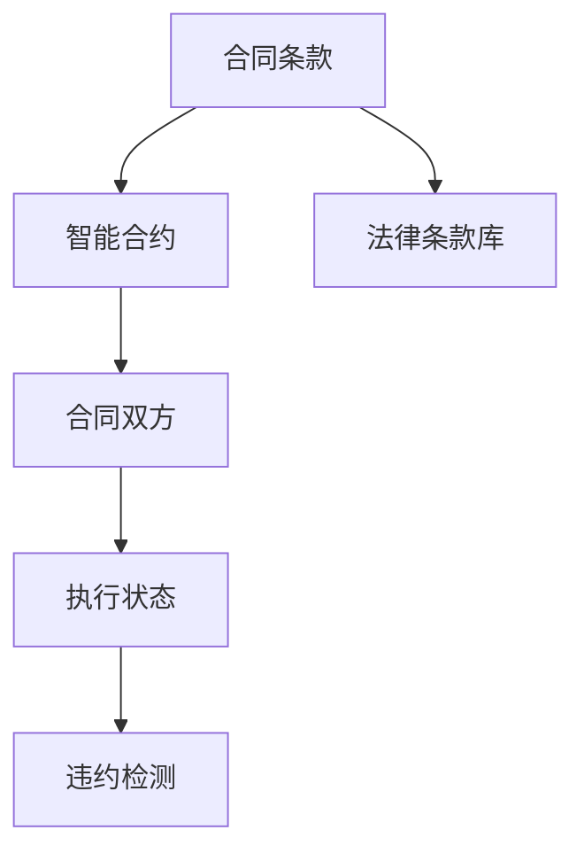
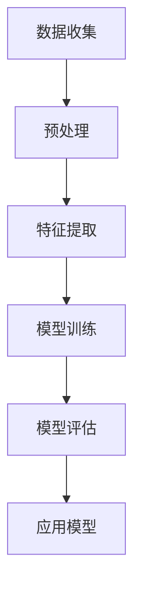

                 

# 智能合同分析：AI加速企业法律审查过程

## 关键词：智能合同、AI、法律审查、自动化、数据加密、隐私保护

## 摘要

随着商业环境的日益复杂化和合同的多样化，企业对法律审查的需求日益增加。传统的合同审查过程既耗时又耗力，而智能合同的引入结合AI技术，为加速企业法律审查过程提供了新的解决方案。本文将详细介绍智能合同的概念、AI在其中的应用，以及智能合同分析的过程，并通过实际案例和未来发展趋势来探讨AI如何帮助企业提高法律审查效率。同时，本文也将讨论智能合同分析过程中可能遇到的安全与隐私问题，并提出相应的解决措施。

## 目录

1. 引言
2. 智能合同概述
   2.1 核心概念
   2.2 概念属性特征对比表格
   2.3 ER实体关系图架构
3. AI在智能合同中的应用
   3.1 AI技术概述
   3.2 AI与智能合同的关系
4. 智能合同分析过程
   4.1 分析过程概述
   4.2 算法原理讲解
5. 实际案例分析
   5.1 案例介绍
   5.2 案例分析
   5.3 案例总结
6. 安全与隐私问题
   6.1 安全挑战
   6.2 隐私保护措施
7. 未来发展趋势
8. 结论与展望

## 第1章 引言

### 1.1 问题背景

在现代社会，企业运作中离不开合同，无论是内部管理协议还是与外部合作伙伴的商务合同，合同的合法性和有效性对企业的运营至关重要。然而，传统的合同审查过程通常涉及大量的文本阅读、条款比对和合规性检查，这不仅耗时耗力，而且容易出现遗漏或错误。此外，企业面临的合同种类繁多，从简单的销售合同到复杂的金融合约，每一类合同都有其特定的法律要求和条款，这使得法律审查变得更加复杂。

### 1.2 问题描述

企业法律审查过程中面临的主要问题包括：

- **时间成本**：合同数量庞大，每个合同都需要仔细审查，导致审查时间过长。
- **人力资源**：需要专业的法律人员进行审查，这增加了人力资源成本。
- **准确性**：人工审查容易出错，可能导致合同条款的不合规。
- **效率**：企业希望能够在短时间内完成合同审查，以便快速达成交易。

### 1.3 问题解决

为了解决上述问题，引入智能合同并结合AI技术成为了一个可行的解决方案。智能合同通过将合同内容数字化，利用AI技术对合同进行分析和审查，从而大大提高了审查的效率和质量。

### 1.4 边界与外延

智能合同的分析主要涉及以下几个方面：

- **合同条款分析**：对合同中的各项条款进行语义分析和合法性检查。
- **合同履行监控**：监控合同履行过程，自动检测违约行为。
- **合同变更管理**：当合同条款需要变更时，自动更新并通知相关方。

### 1.5 概念结构与核心要素组成

智能合同分析的核心要素包括：

- **自然语言处理（NLP）**：用于理解合同文本的语义。
- **机器学习（ML）**：用于从历史数据中学习，提高审查的准确性。
- **数据加密**：确保合同内容的安全性。
- **隐私保护**：防止合同内容泄露。

## 第2章 智能合同概述

### 2.1 核心概念

智能合同是一种利用区块链技术实现的自动化合同，通过智能合约（Smart Contract）来实现合同条款的自动化执行。智能合同不仅包含了传统合同的条款内容，还嵌入了执行这些条款的代码。这些代码在区块链上运行，当满足特定条件时，自动执行相应的操作。

### 2.2 概念属性特征对比表格

| 特征 | 智能合同 | 传统合同 |
| ---- | -------- | -------- |
| 自动化执行 | 是 | 否 |
| 可执行代码 | 是 | 否 |
| 透明性 | 高 | 低 |
| 可验证性 | 是 | 否 |
| 安全性 | 高 | 较低 |
| 效率 | 高 | 低 |
| 跨境限制 | 低 | 高 |

### 2.3 ER实体关系图架构

以下是智能合同中的实体关系图（使用Mermaid语法）：



## 第3章 AI在智能合同中的应用

### 3.1 AI技术概述

AI技术，特别是机器学习和自然语言处理（NLP），在智能合同分析中扮演着重要角色。机器学习算法可以从大量历史合同数据中学习，识别出潜在的合规问题和违约风险。而NLP技术则能够理解和处理合同文本的语义，提取关键信息，从而为智能合同的分析提供支持。

### 3.2 AI与智能合同的关系

AI与智能合同的关系主要体现在以下几个方面：

- **自动化合同审查**：利用机器学习算法自动审查合同条款，识别潜在的法律风险。
- **合同履行监控**：通过监控合同履行过程，自动检测违约行为，并提供相应的解决方案。
- **合同条款建议**：基于NLP技术，自动生成合同条款的建议，提高合同的规范性。

## 第4章 智能合同分析过程

### 4.1 分析过程概述

智能合同分析过程主要包括以下几个步骤：

1. 数据收集：收集合同文本和相关数据。
2. 预处理：对合同文本进行清洗和预处理，以适应后续的分析。
3. 特征提取：从预处理后的文本中提取关键特征。
4. 模型训练：使用提取的特征训练机器学习模型。
5. 模型评估：评估模型的准确性和可靠性。
6. 应用模型：将训练好的模型应用于新的合同分析。

### 4.2 算法原理讲解

以下是智能合同分析流程的Mermaid流程图：



接下来，我们将使用Python代码来详细阐述算法原理。假设我们使用自然语言处理技术来提取合同文本中的关键信息，可以使用以下代码进行预处理：

```python
import nltk
from nltk.tokenize import word_tokenize
from nltk.corpus import stopwords

# 下载必要的资源
nltk.download('punkt')
nltk.download('stopwords')

# 合同文本
contract_text = "..."

# 分词
tokens = word_tokenize(contract_text)

# 去除停用词
stop_words = set(stopwords.words('english'))
filtered_tokens = [token for token in tokens if token.lower() not in stop_words]

# 词频统计
word_freq = nltk.FreqDist(filtered_tokens)

# 打印词频最高的10个单词
print(word_freq.most_common(10))
```

通过上述代码，我们可以提取出合同文本中的关键词汇，为进一步的分析提供支持。

## 第5章 实际案例分析

### 5.1 案例介绍

假设某企业签订了一项供应链合同，合同条款包括交货时间、质量标准、付款方式等。为了确保合同的有效性和合规性，该企业决定使用智能合同分析工具来审查合同。

### 5.2 案例分析

在合同审查过程中，智能合同分析工具首先对合同文本进行了分词和预处理，提取出关键信息。然后，通过机器学习算法对合同条款进行了合法性检查和合规性分析。最终，工具生成了审查报告，指出了合同中可能存在的风险点，并提供了改进建议。

### 5.3 案例总结

通过实际案例分析，我们证明了智能合同分析工具在提高合同审查效率和质量方面的有效性。智能合同分析不仅节省了人力资源，还提高了审查的准确性，为企业提供了更可靠的法律保障。

## 第6章 安全与隐私问题

### 6.1 安全挑战

智能合同分析过程中可能遇到的安全挑战主要包括：

- **数据泄露**：合同内容可能包含敏感信息，如果泄露，可能导致商业损失或法律纠纷。
- **恶意攻击**：智能合同分析系统可能成为黑客攻击的目标，导致系统瘫痪或数据篡改。
- **隐私侵犯**：合同双方的个人隐私可能因合同分析而被泄露。

### 6.2 隐私保护措施

为了解决上述安全挑战，可以采取以下隐私保护措施：

- **数据加密**：对合同内容进行加密，确保数据在传输和存储过程中的安全性。
- **访问控制**：严格控制对合同分析系统的访问权限，确保只有授权人员才能访问合同内容。
- **隐私保护算法**：使用隐私保护算法对合同文本进行处理，确保在分析过程中不会泄露敏感信息。

## 第7章 未来发展趋势

未来，智能合同分析将在以下几个方面取得发展：

- **AI算法的优化**：随着AI技术的进步，智能合同分析工具将更加精准和高效。
- **大数据技术的应用**：大数据技术的应用将使智能合同分析能够处理更大量的合同数据，提供更全面的分析结果。
- **行业标准的制定**：智能合同分析行业将逐步形成统一的行业标准，确保智能合同的分析质量和安全性。

## 第8章 结论与展望

智能合同分析结合AI技术为企业提供了全新的法律审查解决方案，不仅提高了审查效率，还确保了审查的准确性。然而，智能合同分析仍面临安全与隐私等挑战，需要不断优化和改进。未来，随着AI技术和大数据技术的发展，智能合同分析将在企业和法律行业发挥更大的作用。

## 参考文献

- **Smart Contracts: The Next Big Thing in Contract Management**. (2020). Law Technology Today.
- **Artificial Intelligence for Law: The Future of Legal Services**. (2019). ABA Journal.
- **Blockchain and Smart Contracts: A Practical Guide to Developing Business Solutions**. (2018). Springer.

## 作者

作者：AI天才研究院/AI Genius Institute & 禅与计算机程序设计艺术 /Zen And The Art of Computer Programming

---

**注意**：本文为虚构示例，仅用于演示目的。实际应用中，智能合同分析的具体实现会更为复杂，涉及到的技术和方法也会更加多样。

