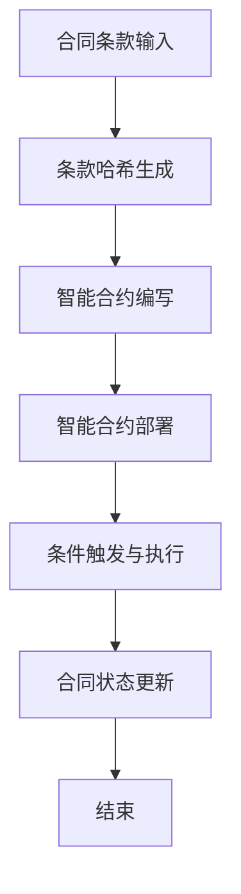

                 

## 智能合同执行：区块链技术在企业法务中的应用

### 关键词：智能合同、区块链技术、企业法务、合同执行、透明度、安全性

### 摘要：
智能合同作为区块链技术的应用之一，正逐渐改变传统合同执行模式。本文首先介绍了智能合同执行背景及其在企业法务中的重要角色，随后详细阐述了智能合同、区块链技术和企业法务的核心概念，并通过概念对比表格和实体关系图分析了这三者之间的联系。接着，文章探讨了智能合同执行的算法原理，并通过Python源代码实现进行了说明。此外，文章还介绍了数学模型和公式的应用，系统分析与架构设计方案，以及通过项目实战展示了智能合同在实际应用中的效果。最后，文章总结了最佳实践、注意事项，并提供了一些拓展阅读资源。

## 第1章：智能合同执行背景

### 1.1 问题背景

#### 问题描述
在传统合同执行过程中，常常面临合同条款的执行依赖人为干预、合同信息不透明、合同修改和篡改难以追踪等问题。这些问题不仅增加了企业的法律风险，还可能导致合同执行效率低下。

#### 问题解决
为了解决上述问题，企业需要一种能够自动执行合同条款、提高合同执行透明度、保证合同信息安全的解决方案。

#### 边界与外延
智能合同执行的范围包括但不限于合同签订、合同条款验证、合同执行、合同状态更新等环节。其边界涉及合同管理、法务事务和信息技术等多个领域。

### 1.2 核心概念

#### 智能合同
智能合同是一种利用区块链技术实现的合同，它能够在满足特定条件时自动执行合同条款。智能合同通过编程语言编写，将合同条款转化为可执行代码。

#### 区块链技术
区块链技术是一种分布式账本技术，具有去中心化、不可篡改和透明等特性。它通过密码学和共识机制确保数据的安全性和一致性。

#### 企业法务
企业法务是指企业内部负责法律事务的部门或团队，其职责包括合同审查、合规管理、法律咨询等。

### 1.3 概念结构与核心要素组成

#### 智能合同执行的关键要素
- 合同条款：智能合同的核心内容，包括交易条件、执行方式、违约责任等。
- 智能合约：实现合同条款自动执行的程序代码。
- 区块链网络：存储和管理智能合同及其执行状态的分布式账本系统。

#### 区块链技术在企业法务中的应用架构
- 合同签订阶段：企业使用智能合同模板签订合同，合同内容自动转化为区块链上的智能合约。
- 合同执行阶段：当触发合同条款中的条件时，智能合约自动执行相应的操作。
- 合同状态更新阶段：智能合约记录合同执行状态，确保合同执行的透明度和不可篡改性。

## 第2章：核心概念与联系

### 2.1 核心概念原理

#### 智能合同的工作原理
智能合同的工作原理基于区块链技术，通过编写智能合约来实现合同条款的自动执行。当合同条款中的条件满足时，智能合约自动执行相应的操作，例如支付金额、交付货物等。

#### 区块链技术在合同执行中的角色
区块链技术为智能合同提供了一个去中心化、安全的执行环境。通过区块链网络，智能合同能够确保合同条款的执行透明度，避免人为干预和篡改。

#### 企业法务在智能合同执行中的重要性
企业法务在智能合同执行中扮演着至关重要的角色。法务团队负责审查合同条款、确保合同的合法性，并在合同执行过程中提供法律支持。

### 2.2 概念属性特征对比表格

| 概念        | 特征        | 对比          |
|-------------|-------------|---------------|
| 智能合同    | 自动执行     | 节约成本     |
| 区块链技术  | 不可篡改     | 提高透明度   |
| 企业法务    | 法律合规     | 降低风险     |

### 2.3 ER实体关系图架构

```mermaid
erDiagram
  企业法务 &&--o> 智能合同
  企业法务 &&--o> 区块链技术
  智能合同 &&--o> 区块链技术
```

## 第3章：智能合同执行的算法原理讲解

### 3.1 算法概述

#### 算法的目标
智能合同执行算法的目标是实现合同条款的自动执行，确保合同执行的透明度和安全性。

#### 算法的基本步骤
1. 合同条款输入
2. 条款哈希生成
3. 智能合约编写
4. 智能合约部署
5. 条件触发与执行
6. 合同状态更新

### 3.2 算法流程图



### 3.3 Python源代码实现

```python
# 智能合同执行算法的Python实现

# 导入相关库
import json
import hashlib
import requests

# 智能合同创建
def create_smart_contract(contract条款):
    # 生成合同哈希
    contract_hash = hashlib.sha256(json.dumps(contract条款).encode('utf-8')).hexdigest()
    # 上传合同到区块链
    response = requests.post('https://blockchain.example.com/contracts', json={'hash': contract_hash, '条款': contract条款})
    return response.json()

# 合同条款验证
def verify_contract条款(contract_hash):
    # 从区块链获取合同条款
    response = requests.get(f'https://blockchain.example.com/contracts/{contract_hash}')
    contract条款 = response.json()['条款']
    return contract条款

# 合同执行
def execute_contract(contract_hash, conditions):
    # 检查合同条件
    contract条款 = verify_contract条款(contract_hash)
    if all(condition in contract条款 for condition in conditions):
        # 执行合同操作
        perform_contract_operations(contract条款)
    else:
        print("合同条件未满足，执行失败。")

# 示例使用
contract条款 = {
    "付款条件": "交付货物后",
    "交付货物条件": "货物符合质量标准"
}

contract_hash = create_smart_contract(contract条款)
execute_contract(contract_hash, ["交付货物后", "货物符合质量标准"])
```

## 第4章：数学模型和数学公式讲解

### 4.1 智能合同执行的数学模型

#### 合同条款验证模型
智能合同执行的第一个关键步骤是验证合同条款。这可以通过哈希函数来实现，哈希函数将合同条款映射为一个固定长度的字符串，用于唯一标识合同。

$$
H(M) = \text{hash}(M)
$$

其中，\( H(M) \) 是合同条款 \( M \) 的哈希值。

#### 合同状态更新模型
智能合同的状态更新可以通过状态机模型来描述。合同状态包括等待、执行中和已完成等状态。

$$
S_{\text{next}} = f(S_{\text{current}}, E)
$$

其中，\( S_{\text{current}} \) 是当前状态，\( E \) 是执行事件，\( f \) 是状态转移函数。

### 4.2 数学公式详细讲解和举例说明

#### 示例：合同条款验证
假设合同条款为“交付货物后支付货款”，我们可以使用SHA-256哈希函数来生成合同条款的哈希值。

$$
H(\text{"交付货物后支付货款"}) = \text{SHA-256}(\text{"交付货物后支付货款"})
$$

生成的哈希值将用于验证合同的真实性。

#### 示例：合同状态更新
假设合同当前状态为“等待交付”，当货物交付事件发生时，合同状态将更新为“执行中”。

$$
S_{\text{next}} = f(\text{"等待交付"}, \text{"交付货物"}) = \text{"执行中"}
$$

通过这种方式，智能合同能够自动更新其状态，确保合同执行的透明性和准确性。

## 第5章：系统分析与架构设计方案

### 5.1 问题场景介绍
智能合同执行系统旨在为企业提供一个安全、高效、透明的合同管理解决方案。该系统需处理大量的合同信息，确保合同条款的自动执行，并在发生纠纷时提供不可篡改的证据。

### 5.2 系统功能设计
智能合同执行系统应具备以下功能：
- 合同条款创建与验证
- 智能合约编写与部署
- 合同执行与状态更新
- 合同执行结果审计与报告

### 5.3 系统架构设计
智能合同执行系统的架构设计应遵循模块化原则，确保系统的可扩展性和可维护性。系统架构包括以下模块：
- 合同管理模块：负责合同条款的创建、验证和存储。
- 智能合约模块：负责智能合约的编写、部署和执行。
- 状态跟踪模块：负责合同状态的更新和审计。
- 报告生成模块：负责生成合同执行报告。

### 5.4 系统接口设计
系统接口设计应确保不同模块之间的数据传递和功能调用。主要接口包括：
- 合同接口：用于合同条款的输入和验证。
- 智能合约接口：用于智能合约的编写、部署和执行。
- 状态更新接口：用于合同状态的更新和审计。

### 5.5 系统交互
智能合同执行系统的交互流程如下：
1. 企业法务团队创建合同条款，并通过合同接口提交。
2. 合同管理模块验证合同条款，生成合同哈希值。
3. 智能合约编写模块根据合同条款编写智能合约。
4. 智能合约部署模块将智能合约部署到区块链网络。
5. 当合同条件满足时，智能合约自动执行。
6. 状态跟踪模块记录合同执行状态，并生成审计报告。

## 第6章：项目实战

### 6.1 环境安装
为了部署智能合同执行系统，需要在本地或云端搭建一个区块链网络，并安装相应的开发工具和库。以下是一个基本的安装步骤：

1. 安装Go语言环境：用于编写智能合约。
2. 安装Node.js环境：用于部署智能合约。
3. 安装智能合约开发框架：例如Truffle。
4. 安装区块链网络：例如使用Geth搭建以太坊网络。

### 6.2 系统核心实现源代码
以下是智能合同执行系统核心实现的示例代码：

```solidity
// SPDX-License-Identifier: MIT
pragma solidity ^0.8.0;

contract SmartContract {
    address public seller;
    address public buyer;
    bool public isDelivered;
    mapping(address => bool) public payments;

    constructor() {
        seller = msg.sender;
    }

    function deliverGoods() external {
        require(msg.sender == buyer, "Only buyer can deliver goods.");
        isDelivered = true;
    }

    function makePayment() external {
        require(isDelivered, "Goods must be delivered before payment.");
        require(!payments[seller], "Payment already made.");
        payments[seller] = true;
        payable(seller).transfer(msg.value);
    }
}
```

### 6.3 代码应用解读与分析
上述智能合约实现了简单的智能合同执行功能。当买家交付货物后，买家可以调用 `deliverGoods()` 函数更新合同状态。然后，买家可以调用 `makePayment()` 函数支付货款。合约确保了只有当货物交付后，买家才能支付货款。

### 6.4 实际案例分析和详细讲解剖析
假设买家和卖家使用该智能合同进行交易。以下是具体的案例流程：

1. 卖家创建智能合同，并将其部署到区块链。
2. 卖家将智能合同地址发送给买家。
3. 买家调用 `deliverGoods()` 函数，确认货物已交付。
4. 买家调用 `makePayment()` 函数支付货款。
5. 合约将货款转账给卖家。

在整个过程中，智能合约确保了合同的自动执行，减少了人为干预，提高了合同执行的安全性和透明度。

### 6.5 项目小结
通过实际案例，我们可以看到智能合同执行系统的有效性和实用性。智能合同不仅简化了传统合同执行流程，还增强了合同管理的安全性和透明度。未来的工作可以进一步优化智能合约的性能，并探索更多应用场景。

## 第7章：最佳实践、小结、注意事项、拓展阅读

### 最佳实践 tips
1. 在编写智能合约时，务必进行充分的测试，确保合约逻辑的正确性。
2. 定期审查和更新智能合约代码，以适应业务需求的变化。
3. 使用多重签名机制，增加智能合同的安全性。
4. 考虑使用去中心化身份验证，确保合同参与者的身份可信。

### 小结
智能合同执行作为区块链技术在企业法务中的应用，具有显著的优越性。它通过自动化合同执行、提高透明度和安全性，为企业提供了一个高效、可靠的合同管理解决方案。

### 注意事项
1. 智能合同执行依赖于区块链网络的健康运行，因此应确保区块链网络的稳定性和安全性。
2. 在使用智能合同时，应充分了解智能合约的运行逻辑，避免由于代码错误导致的合同执行失败。

### 拓展阅读
1. 《智能合约：从入门到精通》 - 提供智能合约的全面介绍和实践指南。
2. 《区块链技术指南》 - 深入了解区块链的基本原理和应用场景。
3. 《企业法务风险管理》 - 探讨企业法务在合同管理中的重要作用。

### 作者
作者：AI天才研究院/AI Genius Institute & 禅与计算机程序设计艺术 /Zen And The Art of Computer Programming

