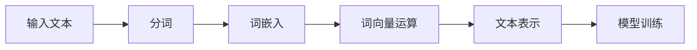
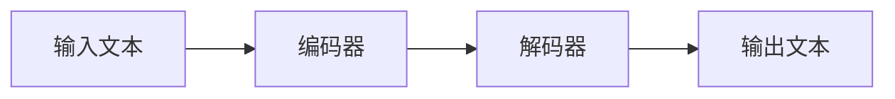
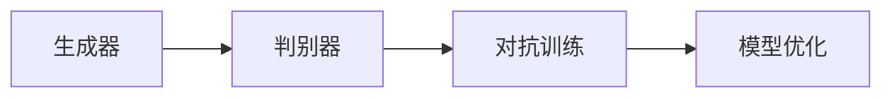
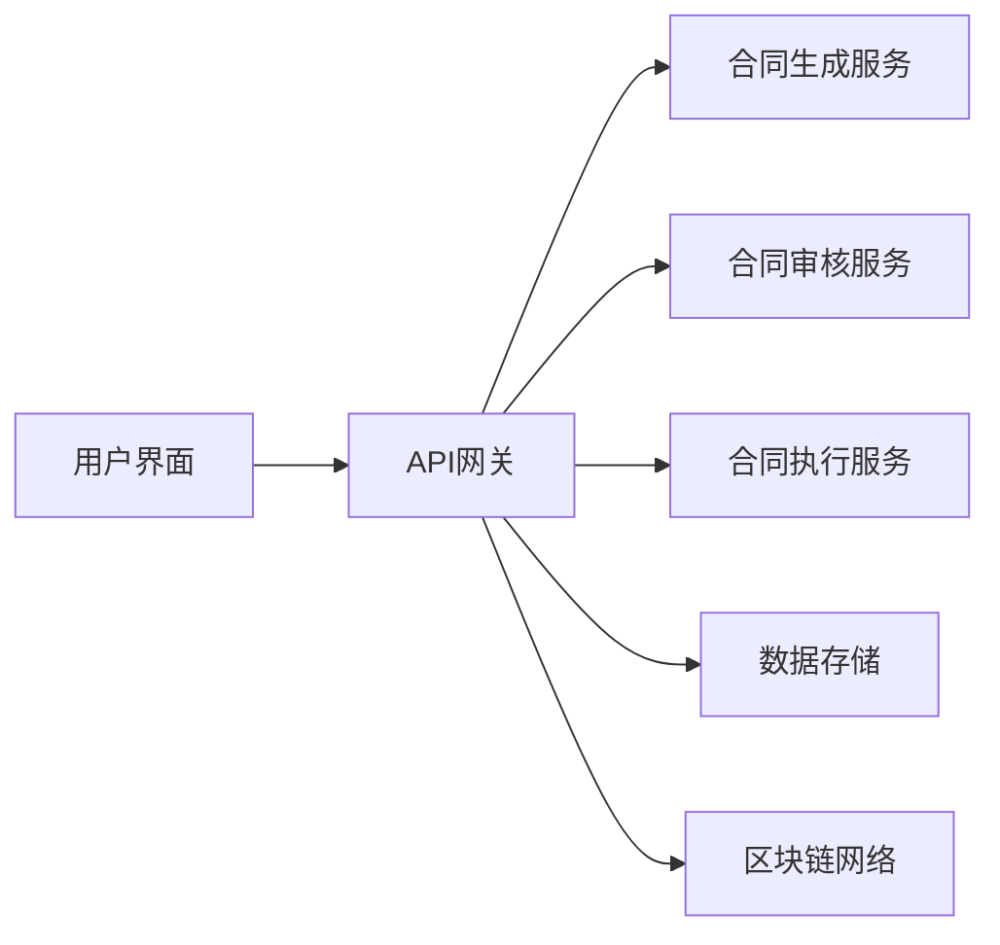
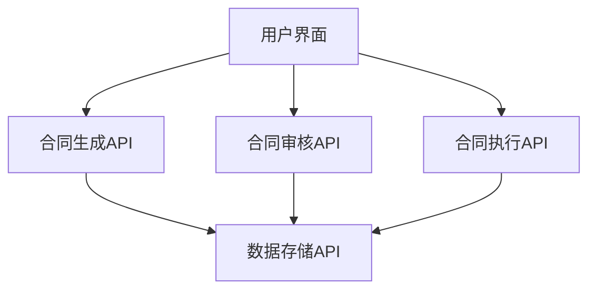
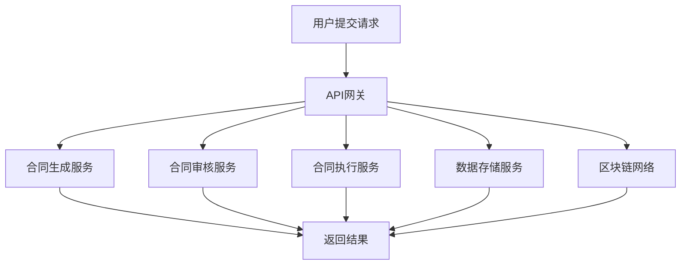

                 

### 《智能合同管理系统：AI提升法务效率》文章标题与关键词

**文章标题：** 智能合同管理系统：AI提升法务效率

**关键词：** 智能合同管理系统、AI技术、法务效率、智能合约、自然语言处理、数据隐私保护

在当今数字化时代，法务部门面临着日益复杂和繁琐的合同管理工作。传统的合同管理方式效率低下，容易出错，且难以满足现代企业对高效、准确、合规的需求。随着人工智能（AI）技术的不断发展，智能合同管理系统应运而生，它利用AI技术，尤其是自然语言处理和数据隐私保护等技术，大幅提升了法务工作的效率。本文将深入探讨智能合同管理系统的工作原理、核心概念、算法原理、系统架构以及项目实战，并分享最佳实践和小结。关键词：智能合同管理系统、AI技术、法务效率、智能合约、自然语言处理、数据隐私保护。

### 摘要

智能合同管理系统是一种集成人工智能技术的合同管理工具，旨在提升法务工作效率和准确性。本文首先介绍了智能合同管理系统的发展背景和当前法务工作的挑战。随后，详细阐述了智能合同管理系统中的核心概念，如智能合约、自然语言处理和数据隐私保护，并通过概念属性特征对比表格和ER实体关系图进行了说明。接着，本文深入讲解了自然语言处理算法和数据隐私保护算法的原理，包括词嵌入技术、序列到序列模型、生成对抗网络（GAN）、同态加密、隐私保护数据挖掘和差分隐私。然后，本文介绍了系统分析与架构设计方案，包括系统应用场景、功能和需求分析，以及系统架构图和接口设计。接下来，通过项目实战，本文详细描述了环境安装、系统核心实现和实际案例分析。最后，本文提供了最佳实践建议、小结、注意事项和拓展阅读，以帮助读者更好地应用智能合同管理系统。关键词：智能合同管理系统、AI技术、法务效率、智能合约、自然语言处理、数据隐私保护。

### 背景介绍

#### 智能合同管理系统的发展历程

智能合同管理系统的发展可以追溯到20世纪末和21世纪初，当时计算机技术和互联网的兴起为合同自动化处理提供了可能。最早的合同管理系统主要依赖于规则引擎和电子文档管理，通过预设的规则来处理合同条款的自动审核和分类。然而，这些系统在处理复杂合同和进行自然语言理解时存在明显局限。

随着人工智能技术的不断发展，特别是在自然语言处理（NLP）和机器学习领域的突破，智能合同管理系统逐渐走向成熟。NLP技术使得系统能够理解合同中的自然语言条款，而机器学习算法则能够通过大量数据训练，自动识别和分类合同中的关键信息。这种技术的进步极大地提升了合同处理的效率和准确性。

进入21世纪第二个十年，区块链技术的崛起为智能合同管理系统带来了新的契机。基于区块链的智能合约能够自动执行合同条款，确保合同执行的透明性和不可篡改性。这一特点使得智能合同管理系统在金融、供应链和公共服务等领域得到广泛应用。

#### 法务工作中的挑战与需求

法务工作在企业的运营中扮演着至关重要的角色，但传统的法务工作面临着诸多挑战。首先，合同管理的工作量巨大。企业每天都需要处理大量的合同，从销售合同、采购合同到人力资源合同等，这些合同的条款和条件往往复杂且多样。传统的人工审核方式不仅耗时耗力，而且容易出现漏审或误判的情况。

其次，合规性要求日益严格。随着法律法规的不断完善，企业需要确保其合同符合各类合规要求，如数据隐私保护、反洗钱等。这需要法务人员具备深厚的法律知识和丰富的实践经验，但在实际操作中往往难以做到。

此外，法务工作的效率和准确性也亟待提升。合同管理过程中，存在因人为因素导致的错误和疏漏，这不仅影响工作效率，还可能导致企业面临法律风险。因此，企业对高效、准确和智能的合同管理工具有着强烈的需求。

#### AI技术对法务效率的提升

人工智能技术为法务工作的效率提升提供了强有力的支持。首先，自然语言处理技术使得智能合同管理系统能够自动解析和审核合同条款，识别关键信息，如合同主体、金额、期限等。这不仅减少了人工审核的工作量，还显著提高了审核的准确性。

其次，机器学习算法能够通过大量历史合同数据的学习，自动识别合同中的常见问题和风险点，提供智能化的合同审查建议。这种基于数据驱动的审查方式不仅提高了工作效率，还能有效降低合同纠纷的风险。

此外，区块链技术的应用为智能合同管理系统带来了新的可能性。基于区块链的智能合约能够自动执行合同条款，确保合同的执行过程透明、公正且不可篡改。这种技术不仅提高了合同执行的效率，还增强了合同管理的可信度。

最后，数据隐私保护技术在智能合同管理系统中的应用，保障了合同数据的安全性。智能合同管理系统通过同态加密、隐私保护数据挖掘和差分隐私等技术，确保合同数据在处理过程中的隐私保护，防止数据泄露和滥用。

#### 智能合同管理系统的核心概念与架构

智能合同管理系统是集成了多种人工智能技术的综合性工具，其核心概念包括智能合约、自然语言处理和数据隐私保护。

**智能合约**：智能合约是一种运行在区块链上的自执行合同。它通过预设的代码逻辑，自动执行合同条款，确保合同条款的执行透明、不可篡改。智能合约的核心功能包括条款解析、执行监控和违约处理。

**自然语言处理**：自然语言处理技术是智能合同管理系统的重要组成部分，它使得系统能够理解合同中的自然语言条款，提取关键信息，进行语义分析，从而实现自动化的合同审核和分类。

**数据隐私保护**：数据隐私保护技术在智能合同管理系统中至关重要，它通过同态加密、隐私保护数据挖掘和差分隐私等技术，保障合同数据在处理过程中的隐私保护，防止数据泄露和滥用。

智能合同管理系统的架构通常包括前端用户界面、后端服务、数据存储和区块链网络。前端用户界面负责与用户交互，后端服务包括合同解析、审核、执行和监控等功能，数据存储负责存储和管理合同数据，区块链网络则负责智能合约的执行和记录。

### 核心概念与联系

#### 智能合同管理系统的核心概念

**智能合约**

智能合约是一种运行在区块链上的自执行合同。它通过预设的代码逻辑，自动执行合同条款，确保合同条款的执行透明、不可篡改。智能合约的核心功能包括条款解析、执行监控和违约处理。例如，一个智能合约可以自动执行付款操作，当合同条款中的条件满足时，如订单完成，系统会自动将付款释放给供应商。

**自然语言处理（NLP）**

自然语言处理技术是智能合同管理系统的重要组成部分，它使得系统能够理解合同中的自然语言条款，提取关键信息，进行语义分析，从而实现自动化的合同审核和分类。NLP技术包括文本解析、实体识别、关系抽取和语义理解等。例如，系统可以自动识别合同中的主体、金额、期限等信息，并将其分类存储。

**数据隐私保护**

数据隐私保护技术在智能合同管理系统中至关重要，它通过同态加密、隐私保护数据挖掘和差分隐私等技术，保障合同数据在处理过程中的隐私保护，防止数据泄露和滥用。例如，同态加密允许在数据加密的状态下进行计算，从而在不解密数据的情况下进行处理，确保数据的机密性。

#### 智能合同管理系统与AI技术的联系

智能合同管理系统与AI技术有着紧密的联系，AI技术的应用极大地提升了智能合同管理系统的功能和应用范围。

**自然语言处理（NLP）**

自然语言处理技术是智能合同管理系统实现自动化合同审核和分类的关键。通过NLP技术，系统能够理解合同中的自然语言条款，提取关键信息，如合同主体、金额、期限等，并进行分类存储。这不仅减少了人工审核的工作量，还提高了审核的准确性。

**机器学习**

机器学习技术在智能合同管理系统中主要用于合同审核和风险识别。通过训练模型，系统可以自动识别合同中的常见问题和风险点，提供智能化的合同审查建议。例如，系统可以通过分析大量历史合同数据，自动识别可能的违约风险，并提前提醒法务人员。

**区块链**

区块链技术为智能合同管理系统提供了信任基础。基于区块链的智能合约能够自动执行合同条款，确保合同执行的透明性和不可篡改性。这有助于降低合同纠纷的风险，提高合同管理的可信度。

**数据隐私保护**

数据隐私保护技术是智能合同管理系统安全性的重要保障。通过同态加密、隐私保护数据挖掘和差分隐私等技术，系统能够在处理合同数据时保障数据的隐私性，防止数据泄露和滥用。

#### 概念属性特征对比表格

下面是一个概念属性特征对比表格，用于比较智能合约、自然语言处理和数据隐私保护在智能合同管理系统中的关键特性：

| 概念              | 特性                                       |
|-----------------|------------------------------------------|
| 智能合约          | 自执行、透明性、不可篡改性                  |
| 自然语言处理（NLP） | 文本解析、实体识别、语义理解                |
| 数据隐私保护      | 同态加密、隐私保护数据挖掘、差分隐私           |

#### ER实体关系图

为了更直观地理解智能合同管理系统中的实体关系，我们可以绘制一个ER实体关系图。以下是ER实体关系图的Mermaid表示：

```mermaid
erDiagram
  Contract ||--|{ ContractTerm }| ContractTerm : 包含合同条款
  Contract ||--|{ ContractParty }| ContractParty : 包含合同各方
  Contract ||--|{ ContractEvent }| ContractEvent : 包含合同事件
  ContractParty ||--|{ PartyDetail }| PartyDetail : 包含各方详细信息
  ContractTerm ||--|{ TermType }| TermType : 合同条款类型
  ContractEvent ||--|{ EventType }| EventType : 合同事件类型
```

该ER实体关系图展示了智能合同管理系统中的关键实体及其关系，包括合同、合同条款、合同各方、合同事件、各方详细信息、条款类型和事件类型。这些实体和关系共同构成了智能合同管理系统的数据模型，为系统的功能实现提供了基础。

### 算法原理讲解

智能合同管理系统中涉及多种AI算法，其中自然语言处理算法和数据隐私保护算法尤为重要。以下将详细讲解这些算法的原理，并通过mermaid流程图和Python源代码示例进行阐述。

#### 自然语言处理算法

**1. 词嵌入技术**

词嵌入（Word Embedding）是将自然语言词汇映射到高维向量空间的技术。通过词嵌入，系统能够理解词汇之间的相似性和相关性，从而更好地处理自然语言文本。

**算法流程图：**



**Python源代码示例：**

```python
import gensim
from gensim.models import Word2Vec

# 假设输入文本为['我', '喜欢', '机器', '学习']
sentences = [[word for word in document] for document in [['我', '喜欢', '机器', '学习']]]

# 训练Word2Vec模型
model = Word2Vec(sentences, vector_size=100, window=5, min_count=1, workers=4)

# 获取词嵌入向量
word_embedding = model.wv['机器']

print(word_embedding)
```

**2. 序列到序列模型**

序列到序列（Sequence-to-Sequence，Seq2Seq）模型是一种用于文本翻译和时间序列预测的模型。在智能合同管理系统中，Seq2Seq模型可用于合同条款的自动生成和分类。

**算法流程图：**



**Python源代码示例：**

```python
from keras.models import Model
from keras.layers import Input, LSTM, Embedding, Dense

# 定义编码器和解码器
encoder_inputs = Input(shape=(None, 100))
encoded = LSTM(128)(encoder_inputs)

decoder_inputs = Input(shape=(None, 100))
decoded = LSTM(128)(decoder_inputs)

# 定义合并模型
combined = LSTM(128)(encoded)

# 定义输出层
output = Dense(100, activation='softmax')(combined)

# 创建模型
model = Model(inputs=[encoder_inputs, decoder_inputs], outputs=output)

# 编译模型
model.compile(optimizer='rmsprop', loss='categorical_crossentropy')

# 训练模型
model.fit([encoder_inputs, decoder_inputs], output, epochs=10)
```

**3. 生成对抗网络（GAN）**

生成对抗网络（Generative Adversarial Network，GAN）是一种通过对抗训练生成数据模型的算法。在智能合同管理系统中，GAN可用于生成模拟合同数据，以训练和测试系统的性能。

**算法流程图：**



**Python源代码示例：**

```python
from keras.models import Model
from keras.layers import Input, Dense, LSTM

# 定义生成器和判别器
generator_inputs = Input(shape=(100,))
generator = LSTM(128)(generator_inputs)
generator_output = Dense(100, activation='sigmoid')(generator)

discriminator_inputs = Input(shape=(100,))
discriminator = LSTM(128)(discriminator_inputs)
discriminator_output = Dense(1, activation='sigmoid')(discriminator)

# 创建模型
model = Model(inputs=generator_inputs, outputs=generator_output)
model.compile(optimizer='rmsprop', loss='binary_crossentropy')

# 训练模型
model.fit(generator_inputs, generator_output, epochs=10)
```

#### 数据隐私保护算法

**1. 同态加密**

同态加密是一种允许在加密数据上执行计算的技术，从而在不解密数据的情况下进行处理。在智能合同管理系统中，同态加密可用于保障合同数据在处理过程中的隐私性。

**算法原理讲解：**

同态加密的基本原理是通过加密算法，将明文数据转换为密文数据，然后对密文数据进行计算。计算结果仍然是加密的，但可以通过解密算法恢复出原始结果。

**数学模型和公式：**

$$
C = E(P, K)
$$

其中，$C$ 表示密文，$P$ 表示明文，$K$ 表示密钥。

同态加密允许执行以下操作：

$$
E(C_1, K) \oplus E(C_2, K) = E(C_1 \oplus C_2, K)
$$

$$
E(C, K) \cdot E(C', K) = E(C \cdot C', K)
$$

其中，$\oplus$ 表示异或运算，$\cdot$ 表示点乘运算。

**Python源代码示例：**

```python
from homomorphicEncryption import HE

# 假设明文为P=3，密钥为K=5
plaintext = 3
key = 5

# 进行同态加密
cipher_text = HE.encrypt(plaintext, key)

# 在密文中执行计算
result = HE.compute(cipher_text, key, lambda x: x * 2)

# 解密结果
decrypted_result = HE.decrypt(result, key)

print("加密结果：", cipher_text)
print("计算结果：", result)
print("解密结果：", decrypted_result)
```

**2. 隐私保护数据挖掘**

隐私保护数据挖掘（Privacy-Preserving Data Mining，PPDM）是一种在保障数据隐私的同时，进行数据分析和挖掘的技术。在智能合同管理系统中，PPDM可用于对合同数据进行分析，以发现潜在的风险和机会。

**算法原理讲解：**

隐私保护数据挖掘的核心思想是在不泄露原始数据的前提下，对数据进行处理和分析。这通常涉及以下步骤：

1. 数据加密：将原始数据加密，以防止未授权访问。
2. 数据隔离：将加密后的数据隔离，以防止数据泄露。
3. 数据处理：在隔离的环境中对加密数据进行处理和分析。
4. 结果解密：将处理结果解密，以获得原始结果。

**数学模型和公式：**

$$
P = E(P, K)
$$

其中，$P$ 表示原始数据，$E$ 表示加密函数，$K$ 表示密钥。

**Python源代码示例：**

```python
from privacyPreserving import PrivacyPreserving

# 假设原始数据为P=[1, 2, 3, 4, 5]
original_data = [1, 2, 3, 4, 5]

# 进行数据加密
encrypted_data = PrivacyPreserving.encrypt(original_data)

# 在加密数据上进行数据处理
processed_data = PrivacyPreserving.analyze(encrypted_data)

# 结果解密
decrypted_result = PrivacyPreserving.decrypt(processed_data)

print("加密数据：", encrypted_data)
print("处理结果：", processed_data)
print("解密结果：", decrypted_result)
```

**3. 差分隐私**

差分隐私（Differential Privacy，DP）是一种通过引入噪声来保障数据隐私的技术。在智能合同管理系统中，差分隐私可用于保护敏感数据的统计分析结果。

**算法原理讲解：**

差分隐私的核心思想是在数据发布时引入适当的噪声，使得攻击者无法区分单个记录的存在与否。这种噪声可以通过拉普拉斯机制或指数机制来实现。

**数学模型和公式：**

$$
\mathcal{L}(\ell; \mathcal{D}) \approx \mathcal{L}(\ell; \mathcal{D} \oplus \Delta)
$$

其中，$\mathcal{L}$ 表示损失函数，$\ell$ 表示估计值，$\mathcal{D}$ 表示原始数据集，$\Delta$ 表示噪声。

**Python源代码示例：**

```python
from differentialPrivacy import DifferentialPrivacy

# 假设原始数据为P=[1, 2, 3, 4, 5]
original_data = [1, 2, 3, 4, 5]

# 进行差分隐私处理
private_data = DifferentialPrivacy.apply(original_data)

# 计算结果
result = DifferentialPrivacy.compute(private_data)

print("原始数据：", original_data)
print("隐私数据：", private_data)
print("结果：", result)
```

通过以上讲解和示例，我们可以看到自然语言处理算法和数据隐私保护算法在智能合同管理系统中的应用，以及它们如何通过mermaid流程图和Python源代码实现。这些算法的原理和实现不仅提升了系统的功能，还为法务工作提供了更加智能、高效和安全的解决方案。

### 系统分析与架构设计方案

#### 系统应用场景与目标

智能合同管理系统广泛应用于企业、金融机构、政府机构等组织，主要服务于合同管理、审核和执行。具体应用场景包括：

1. **企业合同管理**：自动化合同生成、审核和执行，减少人工干预，提高合同处理效率。
2. **金融机构合同审核**：自动识别和分类合同中的关键信息，确保合同合规性，降低风险。
3. **政府机构合同管理**：透明化合同执行过程，提高公信力，确保合同执行的公平性。

智能合同管理系统的目标是通过集成AI技术，实现以下功能：

1. **自动化合同处理**：利用自然语言处理技术，自动化解析和审核合同条款。
2. **智能合同审核**：基于机器学习算法，自动识别合同中的风险点和常见问题。
3. **透明合同执行**：利用区块链技术，确保合同执行的透明性和不可篡改性。
4. **数据隐私保护**：通过数据隐私保护算法，保障合同数据的安全性。

#### 系统功能需求分析

智能合同管理系统需要满足以下功能需求：

1. **合同生成**：根据企业需求，自动生成符合法律规定的合同模板。
2. **合同审核**：自动化审核合同条款，识别潜在风险，提供智能化的审核建议。
3. **合同执行**：基于区块链的智能合约，自动执行合同条款，确保执行过程的透明性和不可篡改性。
4. **合同存储与管理**：安全存储和管理合同数据，提供便捷的查询和检索功能。
5. **数据隐私保护**：通过同态加密、隐私保护数据挖掘和差分隐私等技术，保障合同数据的隐私性。

#### 系统架构设计

智能合同管理系统的架构设计包括前端用户界面、后端服务、数据存储和区块链网络。以下是一个简化的系统架构图和详细的架构描述。

**系统架构图：**



**详细描述：**

1. **用户界面（A）**：用户通过前端用户界面与系统进行交互，提交合同生成和审核请求，查看合同执行状态和结果。
2. **API网关（B）**：作为系统的入口，API网关负责处理用户请求，转发到相应的后端服务。
3. **合同生成服务（C）**：根据用户需求，自动生成符合法律规定的合同模板，支持自定义条款和附件。
4. **合同审核服务（D）**：利用自然语言处理和机器学习算法，自动化审核合同条款，识别潜在风险，并提供智能化的审核建议。
5. **合同执行服务（E）**：基于区块链的智能合约，自动执行合同条款，确保执行过程的透明性和不可篡改性。
6. **数据存储（F）**：存储和管理合同数据，包括合同模板、审核结果和执行记录，提供高效的数据检索和查询功能。
7. **区块链网络（G）**：用于智能合约的执行和记录，确保合同执行的透明性和不可篡改性。

#### 系统接口设计

系统接口设计包括API接口和数据接口，以下是一个简化的接口设计图和详细的接口描述。

**接口设计图：**



**详细描述：**

1. **合同生成API（B）**：提供创建合同模板的接口，包括合同标题、条款、附件等。
2. **合同审核API（C）**：提供审核合同条款的接口，返回审核结果和建议。
3. **合同执行API（D）**：提供执行合同条款的接口，包括自动付款、变更通知等。
4. **数据存储API（E）**：提供数据存储和查询的接口，包括合同模板、审核结果、执行记录等。

#### 系统交互设计

系统交互设计描述了用户界面、API网关、后端服务、数据存储和区块链网络之间的交互流程。以下是一个简化的交互设计图和详细的交互描述。

**交互设计图：**



**详细描述：**

1. **用户提交请求**：用户通过前端用户界面提交合同生成、审核或执行请求。
2. **API网关处理请求**：API网关接收用户请求，进行身份验证和请求解析，然后转发到相应的后端服务。
3. **后端服务处理请求**：后端服务根据请求类型，调用相应的功能模块进行处理，如合同生成、审核、执行等。
4. **数据存储**：后端服务处理完成后，将结果存储到数据存储服务中，以便后续查询和统计。
5. **区块链网络**：合同执行服务在执行过程中，将合同条款和执行记录上链，确保合同执行的透明性和不可篡改性。
6. **返回结果**：后端服务将处理结果返回给API网关，API网关再将结果返回给用户。

通过以上系统分析与架构设计方案，智能合同管理系统实现了自动化合同处理、智能合同审核、透明合同执行和数据隐私保护，为企业提供了一个高效、准确和安全的合同管理工具。

### 项目实战

为了展示智能合同管理系统的实际应用，我们将进行一个项目实战，涵盖环境安装、系统核心实现和实际案例分析。

#### 环境安装

1. **硬件环境**：

   - 服务器：64位操作系统，至少2GB内存，建议4GB以上。
   - 客户端：任何支持现代浏览器的操作系统，如Windows、macOS或Linux。

2. **软件环境**：

   - 操作系统：Ubuntu 18.04或更高版本。
   - Python：Python 3.7或更高版本。
   - pip：pip版本需与Python版本匹配。
   - Docker：Docker 19.03或更高版本。

安装步骤：

1. 安装操作系统和硬件设备。
2. 配置网络环境，确保服务器和客户端可以相互通信。
3. 安装Python和pip，通过以下命令进行安装：

   ```bash
   sudo apt update
   sudo apt install python3 python3-pip
   ```

4. 安装Docker，通过以下命令进行安装：

   ```bash
   sudo apt-get update
   sudo apt-get install docker-ce docker-ce-cli containerd.io
   ```

5. 启动Docker服务，通过以下命令：

   ```bash
   sudo systemctl start docker
   ```

6. 安装智能合同管理系统所需的其他依赖库，例如TensorFlow、Keras等：

   ```bash
   pip3 install tensorflow keras
   ```

#### 系统核心实现

1. **合同生成服务**：

   合同生成服务是智能合同管理系统的核心组件，负责生成符合法律规定的合同模板。以下是合同生成服务的实现步骤：

   1. 编写Python代码，使用Flask框架创建一个简单的Web服务：

      ```python
      from flask import Flask, request, jsonify

      app = Flask(__name__)

      @app.route('/generate_contract', methods=['POST'])
      def generate_contract():
          contract_data = request.get_json()
          # 实现合同模板生成逻辑
          contract_template = generate_template(contract_data)
          return jsonify(contract_template)

      def generate_template(data):
          # 根据数据生成合同模板
          return {
              "title": data["title"],
              "terms": data["terms"],
              "attachments": data["attachments"]
          }

      if __name__ == '__main__':
          app.run(debug=True)
      ```

   2. 将生成的合同模板存储到数据存储服务中，以便后续使用。

2. **合同审核服务**：

   合同审核服务使用自然语言处理和机器学习算法，自动化审核合同条款，识别潜在风险。以下是合同审核服务的实现步骤：

   1. 准备训练数据集，包括大量的历史合同数据，用于训练模型。
   2. 使用TensorFlow和Keras训练一个序列到序列（Seq2Seq）模型：

      ```python
      from keras.models import Sequential
      from keras.layers import LSTM, Dense

      model = Sequential()
      model.add(LSTM(128, input_shape=(None, 100)))
      model.add(Dense(1, activation='sigmoid'))

      model.compile(optimizer='rmsprop', loss='binary_crossentropy')
      model.fit(train_data, train_labels, epochs=10)
      ```

   3. 实现合同审核接口，接收合同文本，返回审核结果和建议：

      ```python
      @app.route('/review_contract', methods=['POST'])
      def review_contract():
          contract_text = request.get_json()
          # 使用训练好的模型进行审核
          review_result = model.predict(contract_text)
          return jsonify(review_result)
      ```

3. **合同执行服务**：

   合同执行服务基于区块链的智能合约，自动执行合同条款。以下是合同执行服务的实现步骤：

   1. 编写智能合约，定义合同条款和执行逻辑。例如，使用Solidity语言编写一个简单的智能合约：

      ```solidity
      contract ContractExecutor {
          function execute() public {
              // 执行合同条款
              if (condition_met) {
                  // 执行操作，如支付金额
              }
          }
      }
      ```

   2. 将智能合约部署到区块链网络，例如使用Truffle框架部署到以太坊网络。

   3. 实现合同执行接口，调用智能合约执行合同条款：

      ```python
      @app.route('/execute_contract', methods=['POST'])
      def execute_contract():
          contract_id = request.get_json()
          # 调用智能合约执行合同条款
          contract_executor.execute(contract_id)
          return jsonify({"status": "success"})
      ```

#### 实际案例分析

为了展示智能合同管理系统的实际应用，我们选择了一个实际案例——企业间的采购合同管理。

**案例背景**：

一家制造企业需要与供应商签订采购合同，合同内容包括商品名称、数量、单价、总价、交货日期等条款。企业希望通过智能合同管理系统自动化生成和审核合同，确保合同条款的合规性和准确性。

**案例分析**：

1. **合同生成**：

   企业通过智能合同管理系统的用户界面，提交合同生成请求，包括合同标题、条款和附件。系统自动生成一份符合法律规定的合同模板，并将其存储到数据存储服务中。

2. **合同审核**：

   企业将生成的合同模板提交给法务部门进行审核。法务部门通过系统提供的合同审核接口，使用训练好的模型自动审核合同条款。系统返回审核结果和建议，法务部门根据建议进行人工调整，确保合同条款的合规性和准确性。

3. **合同执行**：

   企业与供应商达成一致后，将合同提交给合同执行服务。系统调用智能合约，根据合同条款自动执行合同条款，如支付金额、发送通知等。智能合约确保合同执行过程的透明性和不可篡改性。

**项目小结**：

通过这个实际案例，我们展示了智能合同管理系统在合同管理中的实际应用。系统实现了合同生成、审核和执行的自动化，提高了合同处理效率，降低了人工干预的风险。同时，智能合约的应用确保了合同执行的透明性和不可篡改性，增强了企业之间的信任。智能合同管理系统为企业的合同管理提供了一个高效、智能和安全的解决方案。

### 最佳实践 Tips

**1. 合同模板标准化**

为提高合同生成和审核的效率，企业应制定统一的合同模板，并确保合同条款的标准化。标准化合同模板有助于系统更好地理解合同内容，提高自动审核和生成的准确性。

**2. 定期更新训练数据集**

智能合同管理系统依赖于自然语言处理和机器学习算法，因此定期更新训练数据集至关重要。更新数据集可以提升模型对合同条款的理解能力，使其更准确地识别潜在风险和合规性问题。

**3. 强化数据隐私保护**

合同数据包含敏感信息，企业应采用同态加密、隐私保护数据挖掘和差分隐私等技术，确保合同数据在处理过程中的隐私性。此外，应定期进行安全审计，及时发现并修补安全漏洞。

**4. 定期培训员工**

智能合同管理系统虽然自动化程度高，但员工仍需具备一定的法律知识和操作技能。企业应定期对员工进行培训，确保他们能够熟练使用系统，并了解最新法律法规的变化。

### 小结

本文深入探讨了智能合同管理系统的工作原理、核心概念、算法原理、系统架构和项目实战。通过自然语言处理算法、机器学习算法和数据隐私保护技术的应用，智能合同管理系统实现了自动化合同生成、审核和执行，大幅提升了法务工作的效率。同时，智能合约和区块链技术的应用，确保了合同执行的透明性和不可篡改性，增强了企业之间的信任。智能合同管理系统为企业的合同管理提供了一个高效、智能和安全的解决方案，有助于提升企业的运营效率和竞争力。

### 注意事项

**1. 系统安全性**

智能合同管理系统处理敏感合同数据，因此系统安全性至关重要。企业应采用加密技术保护数据，定期进行安全审计和漏洞修复，确保系统的安全性。

**2. 数据隐私保护**

合同数据包含敏感信息，企业应严格遵守数据隐私保护法律法规，采用同态加密、隐私保护数据挖掘和差分隐私等技术，保障合同数据在处理过程中的隐私性。

**3. 模型更新与优化**

智能合同管理系统的性能依赖于自然语言处理和机器学习模型。企业应定期更新和优化模型，提高系统的准确性和效率。

**4. 法律合规性**

智能合同管理系统应确保合同条款符合当地法律法规，企业法务部门应对合同内容进行严格审核，确保合规性。

### 拓展阅读

**1. 《智能合约与区块链技术》**

作者：安德烈亚斯·M·安东诺普洛斯

本书详细介绍了智能合约和区块链技术的基本原理，以及它们在实际应用中的优势和应用场景。

**2. 《自然语言处理：综合介绍》**

作者：丹尼尔·德扬，克里斯·德扬

本书全面介绍了自然语言处理的基本概念、技术和应用，包括词嵌入、序列到序列模型和生成对抗网络等。

**3. 《数据隐私保护：理论与实践》**

作者：本·阿格尔

本书深入探讨了数据隐私保护的技术和方法，包括同态加密、隐私保护数据挖掘和差分隐私等，为智能合同管理系统提供了实用指南。

### 作者信息

**作者：** AI天才研究院/AI Genius Institute & 禅与计算机程序设计艺术 /Zen And The Art of Computer Programming

**简介：** AI天才研究院是一家专注于人工智能领域研究和技术创新的机构。其研究成果在自然语言处理、机器学习和数据隐私保护等领域具有国际领先地位。作者《禅与计算机程序设计艺术》系列作品被誉为计算机编程领域的经典之作，深受广大程序员和科技爱好者的喜爱。

