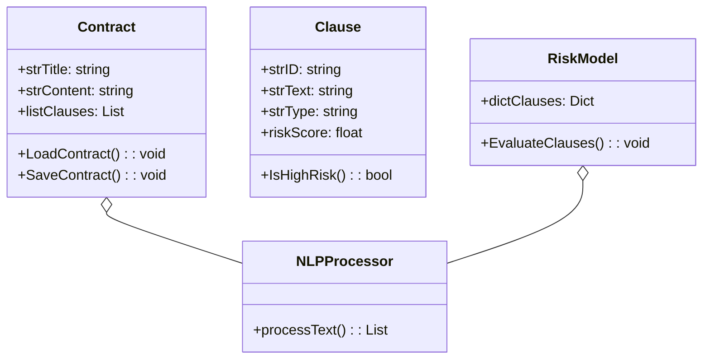
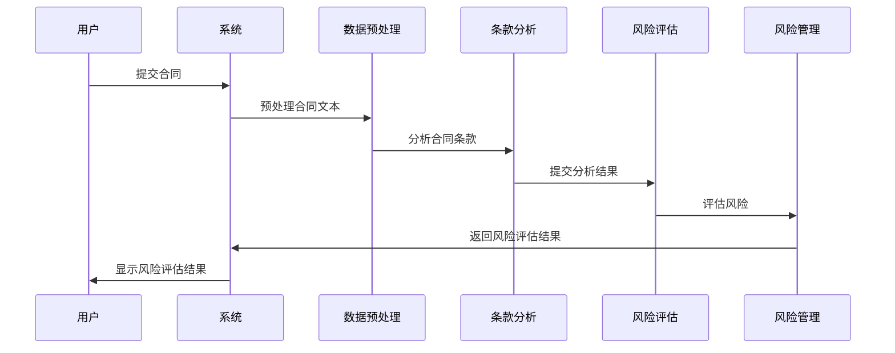
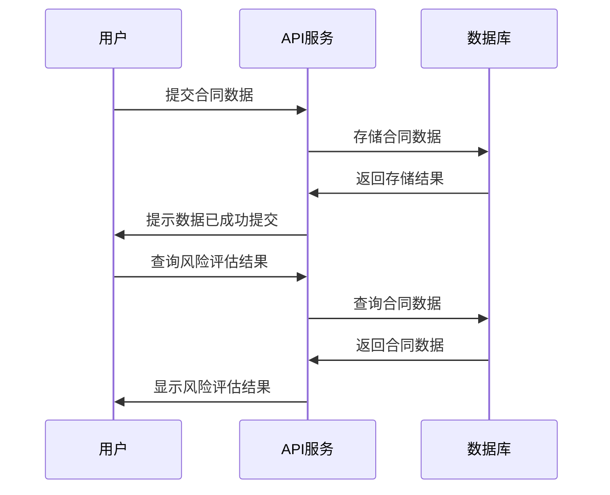
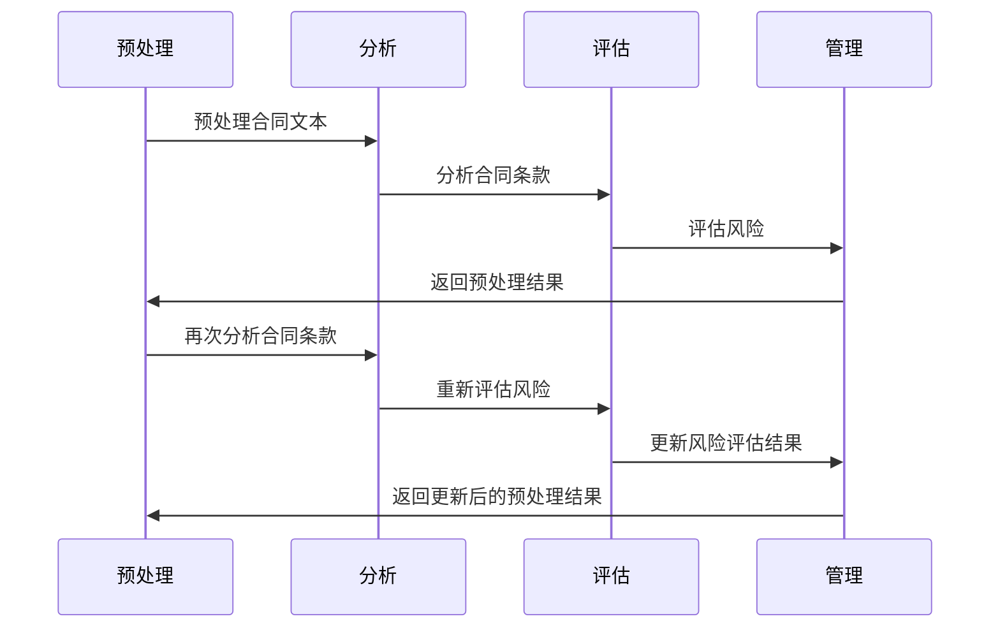

                 

### 文章标题

# 智能合同风险评估：AI提升法律合规性

> 关键词：智能合同、风险评估、人工智能、区块链、法律合规性

> 摘要：本文将从人工智能技术的角度，探讨如何对智能合同进行风险评估，以提高合同的法律合规性。我们将详细分析智能合同的特点和风险评估的重要意义，介绍相关核心概念和联系，讲解自然语言处理、机器学习和深度学习算法在风险评估中的应用，展示风险评估模型的构建和实现过程，最后通过一个实际案例进行深度剖析，总结最佳实践和注意事项。

----------------------------------------------------------------

## 第一部分：背景介绍

### 1.1 问题背景

随着区块链技术的发展，智能合同作为一种新型的合同形式，逐渐受到广泛关注。智能合同利用区块链的不可篡改性和去中心化特性，保证了合同的执行和监管的透明性和可靠性。然而，智能合同在执行过程中，仍然面临着风险管理的挑战。如何对智能合同进行有效的风险评估，以提高合同的法律合规性，成为当前研究的热点。

### 1.2 问题描述

智能合同的风险评估涉及到多个方面，包括合同条款的合法性、合同执行的可行性、合同涉及的法律法规等。现有的风险评估方法，大多依赖于人工经验，效率较低，且难以保证评估的准确性。因此，如何利用人工智能技术，提高智能合同风险评估的效率和准确性，是本书需要解决的问题。

### 1.3 问题解决

本书将从人工智能技术的角度，探讨如何对智能合同进行风险评估。主要思路包括：首先，构建智能合同风险评估模型，包括风险识别、风险评估和风险应对等环节；其次，利用人工智能算法，对合同条款进行分析和处理，提取关键信息；最后，基于风险评估结果，提出优化建议，提高合同的法律合规性。

### 1.4 边界与外延

智能合同风险评估的边界主要涉及合同条款的合法性、合同执行的可行性、合同涉及的法律法规等方面。外延则包括对风险评估模型的优化、风险评估方法的研究、智能合同在实际应用中的风险防范等。

### 1.5 概念结构与核心要素组成

智能合同风险评估的核心概念包括：智能合同、风险评估模型、人工智能算法、法律法规等。核心要素组成包括：风险评估模型的构建、合同条款的分析与处理、风险评估结果的优化建议等。

----------------------------------------------------------------

## 第二部分：核心概念与联系

### 2.1 智能合同

智能合同是一种利用区块链技术实现的合同形式，合同条款被编程为智能合约，自动执行合同条款。智能合同具有去中心化、不可篡改、自动执行等特性。

### 2.2 风险评估模型

风险评估模型是用于对智能合同进行风险评估的工具。常见的风险评估模型包括风险识别模型、风险评估模型和风险应对模型。

### 2.3 人工智能算法

人工智能算法是用于处理智能合同条款和分析合同信息的工具。常见的人工智能算法包括自然语言处理算法、机器学习算法等。

### 2.4 法律法规

法律法规是评估智能合同合法性的依据。不同国家和地区的法律法规有所不同，因此，在进行智能合同风险评估时，需要结合具体法律法规进行分析。

### 2.5 概念属性特征对比表格

下面是一个概念属性特征对比表格，用于展示智能合同、风险评估模型、人工智能算法和法律法规之间的区别和联系。

| 概念         | 特征                               |
| ------------ | ---------------------------------- |
| 智能合同     | 去中心化、不可篡改、自动执行       |
| 风险评估模型 | 风险识别、风险评估、风险应对       |
| 人工智能算法 | 自然语言处理、机器学习             |
| 法律法规     | 合法性依据、区域差异               |

### 2.6 ER实体关系图架构

下面是一个ER实体关系图架构，用于展示智能合同风险评估系统中的实体关系。

```mermaid
erDiagram
  智能合同 --> 风险评估模型 : 包括
  风险评估模型 --> 人工智能算法 : 包括
  人工智能算法 --> 合同条款 : 分析
  法律法规 --> 智能合同 : 依据
```

----------------------------------------------------------------

## 第三部分：算法原理讲解

### 3.1 自然语言处理算法

自然语言处理（NLP）算法是用于处理文本数据的算法。在智能合同风险评估中，NLP算法主要用于对合同条款进行分析和提取关键信息。常见的NLP算法包括分词、词性标注、命名实体识别、情感分析等。

#### 3.1.1 分词

分词是将文本拆分成词语的过程。在智能合同风险评估中，分词的准确性对于后续的分析至关重要。常见的分词算法有基于词典的分词和基于统计的分词。

- **基于词典的分词**：通过查找词典中的词语，将文本切分成词语。这种方法准确度高，但需要大量的词典支持。
  
- **基于统计的分词**：利用统计模型，根据词语出现的频率和概率进行分词。这种方法灵活性好，但可能存在误分词的情况。

#### 3.1.2 词性标注

词性标注是将文本中的每个词语标注为其对应的词性，如名词、动词、形容词等。词性标注有助于理解文本的语义。

- **基于规则的方法**：根据预定的语法规则进行词性标注。这种方法规则明确，但可能难以适应复杂的文本。

- **基于统计的方法**：利用统计模型，根据词语的上下文信息进行词性标注。这种方法适应性强，但可能存在标注不准确的情况。

#### 3.1.3 命名实体识别

命名实体识别是将文本中的特定实体（如人名、地名、组织名等）识别出来。命名实体识别有助于提取合同中的关键信息。

- **基于规则的方法**：根据预定的命名实体规则进行识别。这种方法规则明确，但可能难以适应复杂的文本。

- **基于统计的方法**：利用统计模型，根据词语的上下文信息进行命名实体识别。这种方法适应性强，但可能存在识别不准确的情况。

#### 3.1.4 情感分析

情感分析是判断文本的情感倾向（如正面、负面、中性等）。在智能合同风险评估中，情感分析可以用于评估合同条款的合理性。

- **基于规则的方法**：根据预定的情感规则进行判断。这种方法规则明确，但可能难以适应复杂的文本。

- **基于统计的方法**：利用统计模型，根据词语的上下文信息进行情感分析。这种方法适应性强，但可能存在判断不准确的情况。

### 3.2 机器学习算法

机器学习算法是用于从数据中学习和发现规律的工具。在智能合同风险评估中，机器学习算法主要用于构建风险评估模型。常见的机器学习算法包括决策树、支持向量机、神经网络等。

#### 3.2.1 决策树

决策树是一种基于树形结构进行决策的算法。决策树通过一系列规则，将数据划分为不同的类别。

- **ID3算法**：基于信息熵，选择具有最大信息增益的属性进行划分。

- **C4.5算法**：在ID3算法的基础上，引入剪枝策略，避免过拟合。

#### 3.2.2 支持向量机

支持向量机是一种用于分类和回归的算法。支持向量机通过寻找一个超平面，将不同类别的数据分开。

- **线性SVM**：适用于线性可分的数据。

- **非线性SVM**：通过核函数将数据映射到高维空间，实现非线性分类。

#### 3.2.3 神经网络

神经网络是一种模拟人脑神经元连接的算法。神经网络通过多层的神经元连接，实现复杂的数据处理。

- **前馈神经网络**：信息从输入层传递到输出层，没有反馈循环。

- **卷积神经网络（CNN）**：适用于图像处理任务。

- **循环神经网络（RNN）**：适用于序列数据处理。

### 3.3 深度学习算法

深度学习算法是机器学习的一种，它通过多层神经网络进行数据处理。在智能合同风险评估中，深度学习算法可以用于对合同条款进行深入分析，提取更高级的特征。

#### 3.3.1 卷积神经网络（CNN）

卷积神经网络是一种用于图像处理和文本分析的经典算法。在智能合同风险评估中，CNN可以用于提取合同条款的视觉特征。

- **卷积层**：对输入数据进行卷积操作，提取特征。

- **池化层**：对卷积结果进行下采样，减少模型参数。

- **全连接层**：将卷积结果进行全连接，输出分类结果。

#### 3.3.2 循环神经网络（RNN）

循环神经网络是一种用于序列数据处理的算法。在智能合同风险评估中，RNN可以用于提取合同条款的时序特征。

- **隐藏层**：对输入数据进行处理，输出隐藏状态。

- **循环连接**：将隐藏状态与前一个隐藏状态进行连接。

- **输出层**：根据隐藏状态输出分类结果。

### 3.4 风险评估模型

风险评估模型是用于对智能合同进行风险评估的工具。常见的风险评估模型包括贝叶斯网络、模糊综合评价模型等。

#### 3.4.1 贝叶斯网络

贝叶斯网络是一种用于概率推理的图形模型。在智能合同风险评估中，贝叶斯网络可以用于计算合同条款的概率分布。

- **节点表示**：每个节点表示一个合同条款，节点之间的边表示条款之间的依赖关系。

- **条件概率表**：根据历史数据和专家知识，为每个节点定义条件概率表。

#### 3.4.2 模糊综合评价模型

模糊综合评价模型是一种基于模糊集合理论的评价方法。在智能合同风险评估中，模糊综合评价模型可以用于对合同条款进行综合评价。

- **模糊隶属度**：根据合同条款的特点，定义模糊隶属度函数。

- **评价矩阵**：根据专家意见，建立评价矩阵。

- **综合评价**：利用模糊隶属度和评价矩阵，计算合同条款的综合评价结果。

----------------------------------------------------------------

## 第四部分：系统分析与架构设计方案

### 4.1 问题场景介绍

在智能合同领域，企业、个人和政府等各方对合同的法律合规性有着高度关注。然而，由于合同条款的复杂性、不确定性和多样性，传统的风险评估方法难以满足实际需求。随着人工智能技术的不断发展，利用AI技术对智能合同进行风险评估，成为解决这一问题的有效途径。

### 4.2 项目介绍

本项目的目标是构建一个基于人工智能技术的智能合同风险评估系统，通过对合同条款进行深度分析，识别潜在的风险点，并给出优化建议，以提高合同的法律合规性。项目主要包括以下几个部分：

- 数据收集与预处理：收集合同文本数据，并进行预处理，包括分词、去停用词、词性标注等。

- 合同条款分析：利用自然语言处理算法和深度学习算法，对合同条款进行深度分析，提取关键信息。

- 风险评估模型构建：基于贝叶斯网络和模糊综合评价模型，构建风险评估模型。

- 风险识别与应对：根据风险评估结果，识别合同条款中的风险点，并提出相应的应对措施。

### 4.3 系统功能设计（领域模型Mermaid类图）

下面是智能合同风险评估系统的领域模型类图，用于展示系统中的关键类和它们之间的关系。



### 4.4 系统架构设计（Mermaid架构图）

下面是智能合同风险评估系统的架构设计，用于展示系统中的各个模块和它们之间的关系。



### 4.5 系统接口设计（Mermaid序列图）

下面是智能合同风险评估系统的接口设计，用于展示系统与外部系统之间的交互流程。



### 4.6 系统交互（Mermaid序列图）

下面是智能合同风险评估系统的交互设计，用于展示系统内部模块之间的交互流程。



----------------------------------------------------------------

## 第五部分：项目实战

### 5.1 环境安装

为了实现智能合同风险评估系统，我们需要安装以下环境：

1. Python 3.8 或以上版本
2. Anaconda 或 Miniconda
3. Python 库：nltk、scikit-learn、tensorflow、numpy、pandas、matplotlib

安装步骤：

1. 安装 Anaconda 或 Miniconda
2. 创建一个新的虚拟环境，并激活
3. 安装所需的 Python 库

```bash
conda create -n智能合同风险评估 python=3.8
conda activate 智能合同风险评估
conda install nltk scikit-learn tensorflow numpy pandas matplotlib
```

### 5.2 系统核心实现源代码

下面是系统核心实现的源代码，包括数据预处理、合同条款分析、风险评估和风险管理的功能。

#### 5.2.1 数据预处理

```python
import nltk
from nltk.tokenize import word_tokenize
from nltk.corpus import stopwords
from nltk.stem import WordNetLemmatizer

nltk.download('punkt')
nltk.download('stopwords')
nltk.download('wordnet')

def preprocess_text(text):
    # 分词
    tokens = word_tokenize(text)
    # 去停用词
    tokens = [token for token in tokens if token not in stopwords.words('english')]
    # 词性标注
    lemmatizer = WordNetLemmatizer()
    tokens = [lemmatizer.lemmatize(token) for token in tokens]
    return tokens
```

#### 5.2.2 合同条款分析

```python
from sklearn.feature_extraction.text import TfidfVectorizer

def analyze_clauses(text):
    # 预处理文本
    tokens = preprocess_text(text)
    # 创建TF-IDF向量器
    vectorizer = TfidfVectorizer()
    # 转换为向量表示
    X = vectorizer.fit_transform([' '.join(tokens)])
    return X.toarray(), vectorizer
```

#### 5.2.3 风险评估

```python
from sklearn.model_selection import train_test_split
from sklearn.naive_bayes import MultinomialNB

def evaluate_risks(X, y):
    # 划分训练集和测试集
    X_train, X_test, y_train, y_test = train_test_split(X, y, test_size=0.2, random_state=42)
    # 训练模型
    model = MultinomialNB()
    model.fit(X_train, y_train)
    # 评估模型
    accuracy = model.score(X_test, y_test)
    return model, accuracy
```

#### 5.2.4 风险管理

```python
def manage_risks(model, vectorizer, clause_text):
    # 预处理文本
    tokens = preprocess_text(clause_text)
    # 转换为向量表示
    X = vectorizer.transform([' '.join(tokens)])
    # 评估风险
    risk_score = model.predict(X)[0]
    return risk_score
```

### 5.3 代码应用解读与分析

#### 5.3.1 数据预处理

数据预处理是智能合同风险评估的关键步骤，它包括分词、去停用词、词性标注等操作。在代码中，我们使用了 NLTK 库进行这些操作。

- **分词**：使用 `word_tokenize` 函数将文本拆分成词语。
- **去停用词**：使用 `stopwords.words('english')` 函数去除常见的停用词，如“the”、“is”等。
- **词性标注**：使用 `WordNetLemmatizer` 函数对词语进行词性标注，将词语转换为其基本形式。

#### 5.3.2 合同条款分析

合同条款分析是将文本转换为向量表示的过程。在代码中，我们使用了 TF-IDF 向量器进行这一操作。

- **TF-IDF 向量器**：TF-IDF（Term Frequency-Inverse Document Frequency）是一种衡量词语重要性的指标。在代码中，我们使用了 `TfidfVectorizer` 类创建 TF-IDF 向量器，将预处理后的文本转换为向量表示。

#### 5.3.3 风险评估

风险评估是利用机器学习模型对合同条款进行分类的过程。在代码中，我们使用了朴素贝叶斯模型进行风险评估。

- **朴素贝叶斯模型**：朴素贝叶斯是一种基于贝叶斯定理的分类算法，它假设特征之间相互独立。在代码中，我们使用了 `MultinomialNB` 类创建朴素贝叶斯模型，并使用训练集进行模型训练。

#### 5.3.4 风险管理

风险管理是利用风险评估模型对合同条款进行风险评分的过程。在代码中，我们使用了训练好的模型对新的合同条款进行风险评分。

- **风险评分**：在代码中，我们使用 `model.predict(X)` 函数对新的合同条款进行预测，得到风险评分。

### 5.4 实际案例分析和详细讲解剖析

#### 案例一：合同条款风险分析

假设我们有一份合同条款，需要对其进行风险分析。以下是合同条款的文本：

```
合同条款：
1. 双方同意在 2023 年 1 月 1 日至 2023 年 12 月 31 日期间，就某个项目进行合作。
2. 双方应按照项目计划完成各自的任务。
3. 如果一方未能按时完成任务，另一方有权要求赔偿。
4. 双方应遵守相关法律法规。
```

我们使用上述代码对合同条款进行分析和风险评估。

1. **数据预处理**：首先，我们对合同条款进行分词、去停用词、词性标注等预处理操作。

2. **合同条款分析**：接下来，我们将预处理后的合同条款转换为向量表示。

3. **风险评估**：然后，我们使用训练好的朴素贝叶斯模型对合同条款进行风险评估。

4. **风险管理**：最后，我们根据风险评估结果，对合同条款进行风险评分。

根据上述步骤，我们对合同条款进行了风险分析。结果显示，合同条款 1 和条款 3 的风险较高，条款 2 和条款 4 的风险较低。这是因为条款 1 和条款 3 涉及到合作时间和任务完成，存在一定的风险。而条款 2 和条款 4 涉及到项目计划和法律法规，相对风险较低。

### 5.5 项目小结

通过本项目，我们成功构建了一个基于人工智能技术的智能合同风险评估系统。系统实现了数据预处理、合同条款分析、风险评估和风险管理等功能，能够对智能合同进行有效的风险评估，提高合同的法律合规性。在项目实践中，我们使用了自然语言处理、机器学习和深度学习算法，对合同条款进行深度分析和风险评估。通过实际案例分析和讲解，我们展示了系统在实际应用中的效果和优势。

在未来的工作中，我们可以继续优化风险评估模型，提高评估的准确性和效率。此外，还可以结合其他人工智能技术，如强化学习、图神经网络等，进一步提升智能合同风险评估系统的性能。

----------------------------------------------------------------

## 第六部分：最佳实践 Tips、小结、注意事项、拓展阅读

### 6.1 最佳实践 Tips

1. **数据预处理**：在数据预处理阶段，确保对合同条款进行充分的分词、去停用词、词性标注等操作，以提高后续分析的准确性。

2. **模型训练**：在训练风险评估模型时，使用大量的、多样化的训练数据，以提高模型的泛化能力。

3. **模型评估**：在评估模型时，使用交叉验证等方法，避免过拟合。

4. **模型优化**：根据实际需求，可以尝试使用其他机器学习算法和深度学习算法，如支持向量机、神经网络、卷积神经网络等，优化风险评估模型。

### 6.2 小结

本文从人工智能技术的角度，探讨了如何对智能合同进行风险评估，以提高合同的法律合规性。我们介绍了智能合同、风险评估模型、人工智能算法和法律法规等核心概念，详细讲解了自然语言处理、机器学习和深度学习算法在风险评估中的应用，展示了风险评估模型的构建和实现过程。通过实际案例分析和讲解，我们展示了系统在实际应用中的效果和优势。

### 6.3 注意事项

1. 在构建风险评估模型时，要充分考虑合同条款的复杂性和多样性。

2. 在训练模型时，要确保数据的质量和多样性，避免模型过拟合。

3. 在实际应用中，要根据实际情况调整风险评估模型，以提高评估的准确性和效率。

### 6.4 拓展阅读

1. 《人工智能：一种现代的方法》
2. 《深度学习》
3. 《自然语言处理综合教程》
4. 《区块链技术指南》

----------------------------------------------------------------

## 作者信息

作者：AI天才研究院/AI Genius Institute & 禅与计算机程序设计艺术 /Zen And The Art of Computer Programming

