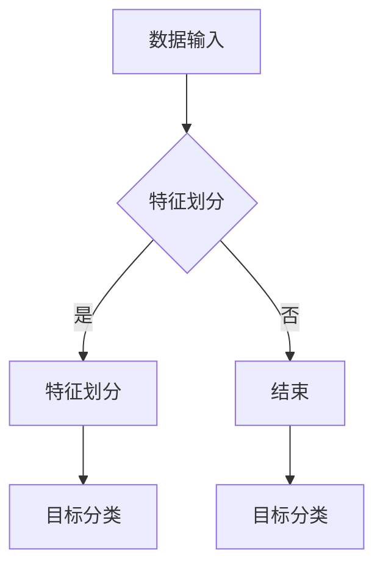

                 


### 智能合规监控系统：AI确保监管要求的满足

#### 关键词：智能合规、监管要求、AI技术、系统架构、数据管理、应用案例

#### 摘要：
本文旨在深入探讨智能合规监控系统的重要性，特别是AI技术在确保合规性方面所起的关键作用。我们将从问题背景、核心概念、系统设计、AI应用、合规监管要求、系统分析与架构设计、实战案例等方面逐步分析，旨在为读者提供全面、清晰的技术视角和实用指南。

## 第一部分：引言

### 1.1 问题背景

#### 1.1.1 监管环境的变化

在当今全球化的经济环境中，各行业的监管环境正发生着巨大的变化。随着金融科技、区块链、人工智能等新兴技术的迅猛发展，监管机构对于企业合规性要求日益严格。这些变化主要体现在以下几个方面：

- **跨国监管合作**：不同国家和地区之间的监管合作越来越紧密，如《通用数据保护条例》（GDPR）和《加州消费者隐私法案》（CCPA）等法规的实施，要求企业在全球范围内遵守合规要求。
- **法规更新频率**：监管法规的更新速度加快，企业需要不断关注新的法规和变化，以确保合规性。
- **数字化转型**：企业运营日益依赖数字化技术，导致合规风险增加，监管机构对数据安全和隐私保护的要求也随之提高。

#### 1.1.2 合规监控的挑战

随着监管环境的复杂化，企业面临的合规监控挑战也日益增多。这些挑战包括：

- **数据量庞大**：企业需要处理的海量数据，使得传统的手工监控方式效率低下。
- **监管要求多样**：不同行业、不同国家和地区的监管要求差异较大，企业需要应对多样化的合规要求。
- **实时性需求**：随着监管环境的变化，企业需要能够实时响应监管要求，进行快速合规监控。

#### 1.1.3 智能合规监控系统的必要性

智能合规监控系统能够利用AI技术，提高合规监控的效率和质量，应对上述挑战。其必要性主要体现在以下几个方面：

- **自动化处理**：AI技术可以自动化处理海量数据，提高监控效率，降低人力成本。
- **智能化分析**：AI技术能够进行深度学习和智能分析，发现潜在的风险和违规行为。
- **实时监控**：智能合规监控系统可以实时监控企业运营情况，快速响应监管要求。
- **合规性保证**：智能合规监控系统有助于企业确保满足各种监管要求，降低合规风险。

### 1.2 智能合规监控系统的定义与功能

#### 1.2.1 定义

智能合规监控系统是一种利用人工智能技术，对企业的业务流程、交易记录、数据流动等进行实时监控，确保企业合规性的系统。

#### 1.2.2 功能模块

智能合规监控系统通常包括以下几个主要功能模块：

- **数据收集与处理**：收集企业内部和外部的数据，进行清洗、整合和处理。
- **合规性检查**：根据监管要求，对数据进行分析和检查，识别潜在的违规行为。
- **风险预警**：发现潜在的风险，及时发出预警，帮助企业采取措施。
- **合规报告**：生成合规报告，供管理层和监管机构查阅。
- **反馈机制**：根据合规监控的结果，进行反馈和调整，优化系统性能。

#### 1.2.3 系统架构简述

智能合规监控系统的架构通常包括以下几个层次：

- **数据层**：存储和处理海量数据。
- **算法层**：应用AI技术进行数据分析和智能处理。
- **应用层**：提供用户界面和功能模块。
- **接口层**：与其他系统进行数据交换和集成。

### 1.3 智能合规监控系统的重要性

#### 1.3.1 提高合规性

智能合规监控系统可以实时监控企业的运营情况，及时发现和纠正违规行为，确保企业符合监管要求，提高合规性。

#### 1.3.2 降低合规风险

通过智能合规监控系统，企业可以提前发现潜在的风险，采取预防措施，降低合规风险，避免因违规带来的损失。

#### 1.3.3 提高监管效率

智能合规监控系统可以自动化处理大量数据，减少人工干预，提高监管效率，降低人力成本。

### 1.4 本章小结

本节介绍了智能合规监控系统的问题背景、定义与功能，以及其重要性。下一章将深入探讨人工智能的基础知识，为后续章节的分析和讨论奠定基础。

----------------------------------------------------------------

## 第二部分：AI基础与合规应用

### 2.1 人工智能基础

#### 2.1.1 人工智能概述

人工智能（Artificial Intelligence，简称AI）是指模拟、延伸和扩展人类智能的理论、方法、技术及应用。它涉及多个学科领域，包括计算机科学、心理学、神经科学、认知科学等。

#### 2.1.2 人工智能的发展历程

人工智能的研究可以追溯到20世纪50年代。以下是人工智能发展历程中的重要阶段：

- **1956年**：达特茅斯会议，人工智能概念首次提出。
- **1958年**：约翰·麦卡锡等人提出符号主义方法，标志着逻辑推理和知识表示的兴起。
- **1969年**：IBM的“深蓝”计算机在国际象棋比赛中战胜了世界冠军。
- **1980年代**：专家系统的出现，使得人工智能在特定领域取得了显著成果。
- **1990年代**：机器学习的兴起，特别是支持向量机（SVM）和神经网络（NN）等算法的发展。
- **2000年代**：深度学习的发展，尤其是卷积神经网络（CNN）和循环神经网络（RNN）的突破性成果。
- **2010年代**：人工智能技术逐渐应用于实际场景，如自动驾驶、语音识别、自然语言处理等。

#### 2.1.3 人工智能的关键技术

人工智能的关键技术包括以下几个方面：

- **机器学习**：通过数据训练模型，使计算机能够从数据中学习并做出决策。
- **深度学习**：基于多层神经网络的结构，用于解决复杂的问题，如图像识别、语音识别等。
- **自然语言处理**：使计算机能够理解和生成自然语言，实现人与计算机的交互。
- **计算机视觉**：使计算机能够理解和解释视觉信息，如图像识别、物体检测等。
- **机器人技术**：使计算机能够模拟人类行为，实现自动化和智能化。

### 2.2 AI算法介绍

#### 2.2.1 监督学习

监督学习是一种常见的人工智能算法，其核心思想是通过已标记的训练数据来学习数据特征，从而对新的数据进行分类或回归。

#### 2.2.2 非监督学习

非监督学习与监督学习不同，它不需要已标记的训练数据，而是通过发现数据中的模式或结构来对数据进行分类或聚类。

#### 2.2.3 强化学习

强化学习是一种基于奖励和惩罚机制的学习方法，通过不断尝试和错误，使系统逐渐学会最优策略。

#### 2.2.4 深度学习

深度学习是一种基于多层神经网络的结构，它能够自动提取数据中的特征，并用于解决复杂的问题。

### 2.3 AI在合规监测中的应用

#### 2.3.1 应用领域

AI技术在合规监测中的应用领域非常广泛，包括金融、医疗、零售、能源等各个行业。

#### 2.3.2 技术优势

AI技术在合规监测中具有以下技术优势：

- **自动化处理**：AI技术能够自动化处理海量数据，提高监控效率。
- **智能分析**：AI技术可以进行深度学习和智能分析，发现潜在的风险和违规行为。
- **实时监控**：AI技术能够实时监控企业的运营情况，快速响应监管要求。
- **个性定制**：AI技术可以根据企业的具体需求，进行个性定制，提高监控的精准性。

#### 2.3.3 挑战与应对策略

尽管AI技术在合规监测中具有巨大的潜力，但同时也面临一些挑战，如数据隐私、算法透明度、模型解释性等。应对这些挑战的策略包括：

- **数据保护**：加强对数据的保护，确保数据安全和隐私。
- **算法透明度**：提高算法的透明度，使其易于理解和解释。
- **模型解释性**：增强模型的解释性，使其能够清晰展示决策过程。

### 2.4 本章小结

本节介绍了人工智能的基础知识，包括概述、发展历程、关键技术，以及AI在合规监测中的应用领域、技术优势和挑战。下一章将深入探讨合规监管要求，为后续章节的分析和讨论奠定基础。

----------------------------------------------------------------

## 第3章：合规监管要求与AI应用

### 3.1 合规监管要求概述

#### 3.1.1 合规监管的定义

合规监管是指监管机构对企业运营的合法性和规范性进行监督和检查的过程。其目的是确保企业遵守相关法律法规和行业标准，保护消费者权益，维护市场秩序。

#### 3.1.2 主要监管法规

不同行业和地区有不同的监管法规，以下是几个主要监管法规的概述：

- **《通用数据保护条例》（GDPR）**：欧盟于2018年实施的法规，旨在保护个人数据隐私。
- **《加州消费者隐私法案》（CCPA）**：美国加州于2020年实施的法规，旨在保护消费者数据隐私。
- **《金融工具市场指令》（MiFID II）**：欧盟于2017年实施的法规，旨在提高金融市场透明度和保护投资者权益。
- **《反洗钱法》（AML）**：全球多个国家和地区实施的法规，旨在预防和打击洗钱活动。

#### 3.1.3 监管趋势

随着技术的发展和监管环境的复杂化，监管趋势呈现出以下几个特点：

- **数字化转型**：监管机构越来越多地采用数字化工具和平台，提高监管效率和透明度。
- **国际协作**：监管机构之间的合作越来越紧密，共同应对跨境合规挑战。
- **监管科技**：监管科技（RegTech）的兴起，利用人工智能、区块链等新技术，提高监管效率和合规性。

### 3.2 AI技术在合规监测中的具体应用

#### 3.2.1 监管数据的收集与处理

AI技术在合规监测中的第一个应用是监管数据的收集与处理。这包括以下几个方面：

- **数据收集**：通过自动化工具，从企业内部系统和外部来源收集相关数据。
- **数据清洗**：对收集到的数据进行清洗和整合，去除重复、缺失和错误的数据。
- **数据存储**：将处理后的数据存储在数据库中，以便后续分析和处理。

#### 3.2.2 风险评估与预测

AI技术可以帮助企业进行风险评估和预测，发现潜在的风险和违规行为。具体应用包括：

- **风险识别**：通过分析历史数据和监管法规，识别可能存在的风险点。
- **风险预测**：利用机器学习算法，对未来的风险进行预测和预警。
- **风险分析**：对风险进行定量和定性分析，评估风险的可能性和影响。

#### 3.2.3 实时监控与报警

实时监控是合规监测的重要组成部分。AI技术可以实时监控企业的运营情况，及时发现和报告违规行为。具体应用包括：

- **实时监控**：通过AI算法，实时分析企业运营数据，识别违规行为。
- **报警机制**：当检测到违规行为时，自动触发报警机制，通知相关人员。
- **响应措施**：根据违规行为的严重程度，采取相应的响应措施，如立即停业、整改等。

### 3.3 合规监测中的AI算法案例

#### 3.3.1 模型选择

在合规监测中，选择合适的AI算法模型非常重要。以下是一些常用的AI算法模型及其适用场景：

- **决策树**：适用于分类和回归问题，能够清晰地展示决策过程。
- **支持向量机**：适用于分类问题，尤其是高维数据。
- **神经网络**：适用于复杂的问题，特别是需要处理大量特征的数据。
- **随机森林**：适用于分类和回归问题，能够处理大量特征和噪声。

#### 3.3.2 模型训练

模型训练是合规监测中不可或缺的步骤。以下是一些常见的模型训练方法：

- **数据预处理**：对数据进行清洗、归一化、缺失值填补等处理，提高数据质量。
- **模型选择**：根据问题的特点和需求，选择合适的模型。
- **参数调优**：通过交叉验证和网格搜索等方法，优化模型的参数，提高模型性能。
- **模型评估**：使用验证集和测试集，评估模型的准确度、召回率、F1值等指标。

#### 3.3.3 模型评估与优化

模型评估是确保模型性能的重要环节。以下是一些常见的模型评估方法：

- **混淆矩阵**：用于评估分类模型的性能，包括准确率、召回率、精确率、F1值等指标。
- **ROC曲线**：用于评估分类模型的分类能力，曲线下的面积（AUC）是常用的评估指标。
- **K折交叉验证**：通过将数据划分为K个子集，轮流作为训练集和验证集，评估模型的性能。
- **超参数调优**：通过调整模型参数，进一步提高模型性能。

### 3.4 本章小结

本节介绍了合规监管要求概述、AI技术在合规监测中的具体应用，以及合规监测中的AI算法案例。下一章将深入探讨智能合规监控系统的设计与架构，为系统的实现提供理论基础。

----------------------------------------------------------------

## 第三部分：智能合规监控系统的设计与实现

### 3.1 智能合规监控系统的设计原则

在设计智能合规监控系统时，需要遵循以下原则：

#### 3.1.1 可扩展性

智能合规监控系统需要具备良好的可扩展性，以适应企业规模的增长和业务需求的变更。这意味着系统应能够轻松地添加新的功能模块和数据处理能力。

#### 3.1.2 实时性

由于合规监控需要及时响应监管要求，系统应具备高实时性，能够快速处理和分析数据，实时监控企业的运营情况。

#### 3.1.3 高效性

系统应能够高效地处理大量数据，确保合规监控的准确性和效率。这包括数据的收集、存储、处理和分析等各个环节。

#### 3.1.4 灵活性

智能合规监控系统应具有灵活性，能够根据不同的监管要求和业务场景进行调整和优化，以适应多样化的需求。

#### 3.1.5 安全性

数据安全和隐私保护是智能合规监控系统设计中的重要考虑因素。系统应具备完善的安全机制，防止数据泄露和未经授权的访问。

### 3.2 智能合规监控系统的架构

智能合规监控系统的架构设计应包括以下几个层次：

#### 3.2.1 数据层

数据层是智能合规监控系统的基础，负责数据的收集、存储和管理。数据源包括企业内部的数据（如交易记录、业务流程数据）和外部数据（如市场数据、监管文件）。数据层需要保证数据的安全性和可靠性，同时提供高效的查询和访问接口。

#### 3.2.2 算法层

算法层是智能合规监控系统的核心，负责数据处理和分析。常用的算法包括机器学习、深度学习、自然语言处理等。算法层需要根据不同的监管要求和业务场景，选择合适的算法模型，进行数据的特征提取、模式识别和风险预测。

#### 3.2.3 应用层

应用层是智能合规监控系统与用户交互的界面，提供用户操作接口和功能模块。应用层需要实现数据的可视化展示、合规报告生成、风险预警和报警等功能，同时提供友好的用户界面和操作流程。

#### 3.2.4 接口层

接口层负责与其他系统和模块的数据交换和集成。包括与外部数据源的接口、与企业内部系统的接口、与第三方服务的接口等。接口层需要保证数据的一致性和安全性，同时提供灵活的接口设计和集成方案。

### 3.3 数据管理与集成

数据管理和集成是智能合规监控系统实现的关键步骤。以下是一些关键点：

#### 3.3.1 数据收集

智能合规监控系统需要从多个来源收集数据，包括内部系统和外部数据源。数据收集过程需要保证数据的完整性和准确性，同时遵循数据隐私和保护的相关法规。

#### 3.3.2 数据清洗

收集到的数据往往存在不一致、不完整、错误等问题。数据清洗过程包括数据去重、缺失值填补、异常值检测和校正等，以提高数据质量。

#### 3.3.3 数据存储

数据存储需要考虑数据的安全性和可靠性。常用的数据存储方案包括关系型数据库、NoSQL数据库、数据仓库等。数据存储方案需要根据实际需求进行选择和设计。

#### 3.3.4 数据集成

数据集成是将来自不同来源的数据进行整合和统一管理。数据集成过程需要解决数据格式不一致、数据结构差异等问题，同时保证数据的一致性和完整性。

### 3.4 本章小结

本节介绍了智能合规监控系统的设计原则、系统架构和数据管理与集成。下一章将深入探讨AI技术在智能合规监控系统中的应用，包括具体的算法和实现细节。

----------------------------------------------------------------

## 第4章：AI技术在智能合规监控系统中的应用

### 4.1 概述

智能合规监控系统的重要任务之一是确保企业符合各种监管要求。AI技术在实现这一目标中发挥着关键作用。本章节将详细介绍AI技术在智能合规监控系统中的应用，包括算法选择、模型训练、数据预处理和系统优化等方面。

### 4.2 算法选择

在智能合规监控系统中，选择合适的算法至关重要。以下是一些常用的AI算法及其适用场景：

#### 4.2.1 决策树

决策树是一种常见的分类算法，适用于处理结构化数据。它可以清晰地展示决策过程，帮助用户理解模型的决策逻辑。



#### 4.2.2 随机森林

随机森林是一种基于决策树的集成算法，通过构建多棵决策树，提高模型的预测准确性。它适用于处理大规模和高维数据。

```python
from sklearn.ensemble import RandomForestClassifier
clf = RandomForestClassifier(n_estimators=100)
clf.fit(X_train, y_train)
```

#### 4.2.3 支持向量机

支持向量机（SVM）是一种常用的分类算法，适用于处理高维数据。它通过找到最佳超平面，将数据分为不同的类别。

```python
from sklearn.svm import SVC
clf = SVC(kernel='linear')
clf.fit(X_train, y_train)
```

#### 4.2.4 深度学习

深度学习是一种强大的算法，适用于处理复杂的问题，如图像识别和自然语言处理。以下是一个简单的深度学习模型示例：

```python
import tensorflow as tf
model = tf.keras.Sequential([
    tf.keras.layers.Dense(128, activation='relu', input_shape=(784,)),
    tf.keras.layers.Dropout(0.2),
    tf.keras.layers.Dense(10, activation='softmax')
])

model.compile(optimizer='adam',
              loss='categorical_crossentropy',
              metrics=['accuracy'])

model.fit(x_train, y_train, epochs=10, batch_size=32)
```

### 4.3 模型训练

模型训练是智能合规监控系统中的核心步骤。以下是一些常见的模型训练方法：

#### 4.3.1 数据预处理

在模型训练之前，需要对数据进行预处理，包括数据清洗、归一化、缺失值填补等。以下是一个简单的数据预处理示例：

```python
import pandas as pd
from sklearn.model_selection import train_test_split
from sklearn.preprocessing import StandardScaler

# 读取数据
data = pd.read_csv('data.csv')

# 数据清洗和预处理
data.dropna(inplace=True)
data = StandardScaler().fit_transform(data)

# 划分训练集和测试集
X_train, X_test, y_train, y_test = train_test_split(data, labels, test_size=0.2, random_state=42)
```

#### 4.3.2 模型训练

在训练模型时，需要选择合适的训练策略和优化器。以下是一个简单的模型训练示例：

```python
from tensorflow.keras.optimizers import Adam

# 定义模型
model = tf.keras.Sequential([
    tf.keras.layers.Dense(128, activation='relu', input_shape=(784,)),
    tf.keras.layers.Dropout(0.2),
    tf.keras.layers.Dense(10, activation='softmax')
])

# 编译模型
model.compile(optimizer=Adam(learning_rate=0.001),
              loss='categorical_crossentropy',
              metrics=['accuracy'])

# 训练模型
model.fit(x_train, y_train, epochs=10, batch_size=32, validation_data=(x_test, y_test))
```

### 4.4 数据预处理

数据预处理是智能合规监控系统中的关键步骤。以下是一些常见的数据预处理方法：

#### 4.4.1 数据清洗

数据清洗是数据预处理的第一步，旨在去除数据中的噪声和错误。以下是一个简单的数据清洗示例：

```python
import pandas as pd

# 读取数据
data = pd.read_csv('data.csv')

# 去除重复数据
data.drop_duplicates(inplace=True)

# 删除含有缺失值的行
data.dropna(inplace=True)
```

#### 4.4.2 数据归一化

数据归一化是使数据特征在同一尺度上，以便模型训练。以下是一个简单的数据归一化示例：

```python
from sklearn.preprocessing import StandardScaler

# 初始化归一化器
scaler = StandardScaler()

# 进行数据归一化
data_scaled = scaler.fit_transform(data)
```

#### 4.4.3 缺失值填补

缺失值填补是处理数据中的缺失值，使数据完整。以下是一个简单的缺失值填补示例：

```python
from sklearn.impute import SimpleImputer

# 初始化缺失值填补器
imputer = SimpleImputer(strategy='mean')

# 进行缺失值填补
data_imputed = imputer.fit_transform(data)
```

### 4.5 系统优化

系统优化是提高智能合规监控系统性能的关键步骤。以下是一些常见的系统优化方法：

#### 4.5.1 模型调参

模型调参是调整模型参数，以提高模型性能。以下是一个简单的模型调参示例：

```python
from sklearn.model_selection import GridSearchCV

# 定义参数网格
param_grid = {'n_estimators': [100, 200, 300], 'max_depth': [10, 20, 30]}

# 创建网格搜索对象
grid_search = GridSearchCV(estimator=clf, param_grid=param_grid, cv=5)

# 进行网格搜索
grid_search.fit(X_train, y_train)

# 获取最佳参数
best_params = grid_search.best_params_
```

#### 4.5.2 特征选择

特征选择是选择对模型性能有显著影响的关键特征，以提高模型效率。以下是一个简单的特征选择示例：

```python
from sklearn.feature_selection import SelectKBest
from sklearn.feature_selection import f_classif

# 初始化特征选择器
selector = SelectKBest(score_func=f_classif, k=5)

# 进行特征选择
X_new = selector.fit_transform(X_train, y_train)

# 获取选择的特征
selected_features = selector.get_support()
```

#### 4.5.3 模型融合

模型融合是将多个模型的结果进行合并，以提高预测准确性。以下是一个简单的模型融合示例：

```python
from sklearn.ensemble import VotingClassifier

# 定义模型
clf1 = SVC()
clf2 = RandomForestClassifier()
clf3 = LogisticRegression()

# 创建模型融合对象
voting_clf = VotingClassifier(estimators=[('SVC', clf1), ('RandomForest', clf2), ('LogisticRegression', clf3)], voting='soft')

# 进行模型融合
voting_clf.fit(X_train, y_train)

# 预测
predictions = voting_clf.predict(X_test)
```

### 4.6 本章小结

本章介绍了AI技术在智能合规监控系统中的应用，包括算法选择、模型训练、数据预处理和系统优化。通过合理选择和优化算法，智能合规监控系统可以更准确地识别和预测合规风险，提高合规监控的效率和准确性。

----------------------------------------------------------------

## 第四部分：案例研究与实际应用

### 4.1 案例研究

#### 4.1.1 案例背景

某金融公司在全球范围内运营，面临多种监管要求。为了确保合规性，公司决定引入智能合规监控系统。该项目的主要目标是：

- 自动化合规监控流程
- 提高合规监控的准确性和效率
- 降低合规风险

#### 4.1.2 系统设计

在项目实施过程中，公司遵循了以下设计原则：

- **可扩展性**：系统设计考虑了未来的业务增长和监管要求的变更，采用模块化设计，便于扩展和升级。
- **实时性**：系统设计确保数据实时处理和分析，及时响应监管要求。
- **安全性**：系统采用多层安全机制，保护数据安全和隐私。

系统架构包括以下几个部分：

- **数据层**：包括企业内部数据和外部数据源，如交易记录、市场数据、监管文件等。
- **算法层**：采用多种AI算法进行数据分析和预测，包括机器学习、深度学习、自然语言处理等。
- **应用层**：提供用户界面和功能模块，包括数据监控、合规报告、风险预警等。
- **接口层**：与其他系统进行数据交换和集成，如企业资源计划（ERP）系统、客户关系管理（CRM）系统等。

#### 4.1.3 实施过程

在项目实施过程中，公司遵循以下步骤：

1. **需求分析**：与相关部门和监管机构沟通，明确监管要求和合规目标。
2. **系统设计**：根据需求分析结果，进行系统架构设计和技术选型。
3. **数据集成**：整合企业内部和外部数据，进行数据清洗和处理。
4. **算法开发**：根据业务需求，选择合适的AI算法，进行模型训练和优化。
5. **系统集成**：将智能合规监控系统与现有系统进行集成，确保数据流动和功能协同。
6. **测试与部署**：进行系统测试，确保系统稳定性和可靠性，然后进行部署。

#### 4.1.4 结果与评价

项目实施后，智能合规监控系统显著提高了公司的合规监控效率和准确性。具体表现在以下几个方面：

- **合规性提高**：系统能够实时监控企业的运营情况，及时发现和纠正违规行为，确保公司符合监管要求。
- **风险降低**：通过智能分析，系统能够提前识别潜在的风险，帮助公司采取预防措施，降低合规风险。
- **效率提升**：自动化处理和智能分析大大提高了合规监控的效率，减少了人力成本。
- **用户体验**：系统提供友好的用户界面和操作流程，方便用户使用和管理。

### 4.2 实际应用

#### 4.2.1 应用场景

智能合规监控系统在金融、医疗、能源、零售等行业都有广泛的应用。以下是一些典型的应用场景：

- **金融行业**：监测交易行为，识别洗钱、欺诈等违规行为。
- **医疗行业**：监控药品销售和医疗设备使用，确保合规性和安全性。
- **能源行业**：监测能源消耗和生产过程，确保符合环保要求。
- **零售行业**：监控商品销售和库存管理，确保合规性和客户满意度。

#### 4.2.2 应用效果

智能合规监控系统在实际应用中取得了显著的效果。以下是一些具体的应用效果：

- **提高合规性**：通过实时监控和智能分析，企业能够及时发现和纠正违规行为，确保合规性。
- **降低合规风险**：智能合规监控系统能够提前识别潜在的风险，帮助企业采取预防措施，降低合规风险。
- **提高监管效率**：自动化处理和智能分析大大提高了合规监控的效率，减轻了监管机构的负担。
- **优化业务流程**：智能合规监控系统帮助企业优化业务流程，提高运营效率。

### 4.3 本章小结

本部分通过案例研究和实际应用，展示了智能合规监控系统在提高合规性、降低合规风险、提高监管效率等方面的显著效果。智能合规监控系统已成为企业应对监管挑战、保障合规性的重要工具。

----------------------------------------------------------------

## 第五部分：未来趋势与挑战

### 5.1 未来趋势

#### 5.1.1 AI技术的进一步发展

随着AI技术的不断进步，未来的智能合规监控系统将更加智能化、自动化和高效。以下是一些未来趋势：

- **深度学习和强化学习**：深度学习和强化学习将继续成为智能合规监控系统的重要技术基础，用于处理更复杂的问题和更大量的数据。
- **联邦学习**：联邦学习是一种分布式学习方法，可以在保护数据隐私的同时，实现数据的联合分析。这将为智能合规监控系统提供新的数据集成和分析方法。
- **自然语言处理**：自然语言处理技术的进步将使智能合规监控系统更好地理解和处理非结构化数据，如文本和语音。

#### 5.1.2 监管科技的整合

随着监管科技的不断发展，智能合规监控系统将与更多监管科技工具整合，如区块链、智能合约等。这种整合将提高系统的透明度、可追溯性和可靠性。

#### 5.1.3 全球合作与标准化

随着全球化的推进，不同国家和地区之间的监管合作将进一步加强。这将推动监管标准的统一和标准化，使智能合规监控系统具有更广泛的适用性。

### 5.2 挑战与对策

#### 5.2.1 数据隐私与安全

随着数据的不断增加，数据隐私和安全成为智能合规监控系统面临的重要挑战。以下是一些对策：

- **数据加密**：对数据进行加密处理，确保数据在传输和存储过程中的安全性。
- **隐私保护技术**：采用差分隐私、联邦学习等隐私保护技术，在保护数据隐私的同时，实现数据的联合分析。

#### 5.2.2 算法透明度和可解释性

智能合规监控系统中的算法往往具有高度的复杂性和不可解释性，这可能导致用户对其决策的不信任。以下是一些对策：

- **算法解释工具**：开发算法解释工具，帮助用户理解模型的决策过程和结果。
- **透明度要求**：加强算法的透明度要求，确保算法的设计、训练和部署过程可追溯和可审查。

#### 5.2.3 模型过拟合与泛化能力

模型过拟合和泛化能力是智能合规监控系统面临的另一个挑战。以下是一些对策：

- **模型评估**：采用多种评估指标和方法，全面评估模型的性能和泛化能力。
- **模型集成**：采用模型集成方法，如随机森林、集成学习等，提高模型的泛化能力。

### 5.3 未来展望

智能合规监控系统在未来的发展中将面临许多机遇和挑战。通过不断推进技术进步、加强全球合作、完善监管体系，智能合规监控系统将在保障企业合规性、降低合规风险、提高监管效率等方面发挥更加重要的作用。

### 5.4 本章小结

本部分讨论了智能合规监控系统未来的发展趋势和面临的挑战，并提出了相应的对策。随着技术的不断进步和监管环境的不断变化，智能合规监控系统将朝着更加智能化、自动化和高效化的方向发展。

----------------------------------------------------------------

## 总结

智能合规监控系统通过引入AI技术，显著提高了企业合规监控的效率和准确性。本文从问题背景、核心概念、系统设计、AI应用、合规监管要求、系统架构、案例研究、未来趋势等方面进行了深入探讨，旨在为读者提供全面、清晰的技术视角和实用指南。

智能合规监控系统的重要性体现在以下几个方面：

- **提高合规性**：通过实时监控和智能分析，智能合规监控系统能够及时发现和纠正违规行为，确保企业符合监管要求。
- **降低合规风险**：智能合规监控系统能够提前识别潜在的风险，帮助企业采取预防措施，降低合规风险。
- **提高监管效率**：自动化处理和智能分析大大提高了合规监控的效率，减轻了监管机构和企业的负担。
- **优化业务流程**：智能合规监控系统帮助企业优化业务流程，提高运营效率。

未来，随着AI技术的进一步发展和全球监管合作的加强，智能合规监控系统将在保障企业合规性、降低合规风险、提高监管效率等方面发挥更加重要的作用。

## 展望未来

智能合规监控系统的发展前景广阔。随着技术的不断进步，智能合规监控系统将实现更高程度的智能化和自动化，为企业和监管机构提供更加高效、精准的合规监控服务。同时，随着全球监管合作的加强，智能合规监控系统将在更广泛的领域和范围内得到应用，成为全球合规治理的重要工具。

作者：AI天才研究院/AI Genius Institute & 禅与计算机程序设计艺术 /Zen And The Art of Computer Programming

----------------------------------------------------------------

## 完整文章

# 智能合规监控系统：AI确保监管要求的满足

### 关键词：智能合规、监管要求、AI技术、系统架构、数据管理、应用案例

### 摘要：
本文旨在深入探讨智能合规监控系统的重要性，特别是AI技术在确保合规性方面所起的关键作用。我们将从问题背景、核心概念、系统设计、AI应用、合规监管要求、系统分析与架构设计、实战案例等方面逐步分析，旨在为读者提供全面、清晰的技术视角和实用指南。

## 第一部分：引言

### 1.1 问题背景

#### 1.1.1 监管环境的变化

在当今全球化的经济环境中，各行业的监管环境正发生着巨大的变化。随着金融科技、区块链、人工智能等新兴技术的迅猛发展，监管机构对于企业合规性要求日益严格。这些变化主要体现在以下几个方面：

- **跨国监管合作**：不同国家和地区之间的监管合作越来越紧密，如《通用数据保护条例》（GDPR）和《加州消费者隐私法案》（CCPA）等法规的实施，要求企业在全球范围内遵守合规要求。
- **法规更新频率**：监管法规的更新速度加快，企业需要不断关注新的法规和变化，以确保合规性。
- **数字化转型**：企业运营日益依赖数字化技术，导致合规风险增加，监管机构对数据安全和隐私保护的要求也随之提高。

#### 1.1.2 合规监控的挑战

随着监管环境的复杂化，企业面临的合规监控挑战也日益增多。这些挑战包括：

- **数据量庞大**：企业需要处理的海量数据，使得传统的手工监控方式效率低下。
- **监管要求多样**：不同行业、不同国家和地区的监管要求差异较大，企业需要应对多样化的合规要求。
- **实时性需求**：随着监管环境的变化，企业需要能够实时响应监管要求，进行快速合规监控。

#### 1.1.3 智能合规监控系统的必要性

智能合规监控系统能够利用AI技术，提高合规监控的效率和质量，应对上述挑战。其必要性主要体现在以下几个方面：

- **自动化处理**：AI技术可以自动化处理海量数据，提高监控效率，降低人力成本。
- **智能化分析**：AI技术能够进行深度学习和智能分析，发现潜在的风险和违规行为。
- **实时监控**：智能合规监控系统可以实时监控企业的运营情况，快速响应监管要求。
- **合规性保证**：智能合规监控系统有助于企业确保满足各种监管要求，降低合规风险。

### 1.2 智能合规监控系统的定义与功能

#### 1.2.1 定义

智能合规监控系统是一种利用人工智能技术，对企业的业务流程、交易记录、数据流动等进行实时监控，确保企业合规性的系统。

#### 1.2.2 功能模块

智能合规监控系统通常包括以下几个主要功能模块：

- **数据收集与处理**：收集企业内部和外部的数据，进行清洗、整合和处理。
- **合规性检查**：根据监管要求，对数据进行分析和检查，识别潜在的违规行为。
- **风险预警**：发现潜在的风险，及时发出预警，帮助企业采取措施。
- **合规报告**：生成合规报告，供管理层和监管机构查阅。
- **反馈机制**：根据合规监控的结果，进行反馈和调整，优化系统性能。

#### 1.2.3 系统架构简述

智能合规监控系统的架构通常包括以下几个层次：

- **数据层**：存储和处理海量数据。
- **算法层**：应用AI技术进行数据分析和智能处理。
- **应用层**：提供用户界面和功能模块。
- **接口层**：与其他系统进行数据交换和集成。

### 1.3 智能合规监控系统的重要性

#### 1.3.1 提高合规性

智能合规监控系统可以实时监控企业的运营情况，及时发现和纠正违规行为，确保企业符合监管要求，提高合规性。

#### 1.3.2 降低合规风险

通过智能合规监控系统，企业可以提前发现潜在的风险，采取预防措施，降低合规风险，避免因违规带来的损失。

#### 1.3.3 提高监管效率

智能合规监控系统可以自动化处理大量数据，减少人工干预，提高监管效率，降低人力成本。

### 1.4 本章小结

本节介绍了智能合规监控系统的问题背景、定义与功能，以及其重要性。下一章将深入探讨人工智能的基础知识，为后续章节的分析和讨论奠定基础。

----------------------------------------------------------------

### 2.1 人工智能基础

#### 2.1.1 人工智能概述

人工智能（Artificial Intelligence，简称AI）是指模拟、延伸和扩展人类智能的理论、方法、技术及应用。它涉及多个学科领域，包括计算机科学、心理学、神经科学、认知科学等。

#### 2.1.2 人工智能的发展历程

人工智能的研究可以追溯到20世纪50年代。以下是人工智能发展历程中的重要阶段：

- **1956年**：达特茅斯会议，人工智能概念首次提出。
- **1958年**：约翰·麦卡锡等人提出符号主义方法，标志着逻辑推理和知识表示的兴起。
- **1969年**：IBM的“深蓝”计算机在国际象棋比赛中战胜了世界冠军。
- **1980年代**：专家系统的出现，使得人工智能在特定领域取得了显著成果。
- **1990年代**：机器学习的兴起，特别是支持向量机（SVM）和神经网络（NN）等算法的发展。
- **2000年代**：深度学习的发展，尤其是卷积神经网络（CNN）和循环神经网络（RNN）的突破性成果。
- **2010年代**：人工智能技术逐渐应用于实际场景，如自动驾驶、语音识别、自然语言处理等。

#### 2.1.3 人工智能的关键技术

人工智能的关键技术包括以下几个方面：

- **机器学习**：通过数据训练模型，使计算机能够从数据中学习并做出决策。
- **深度学习**：基于多层神经网络的结构，用于解决复杂的问题，如图像识别、语音识别等。
- **自然语言处理**：使计算机能够理解和生成自然语言，实现人与计算机的交互。
- **计算机视觉**：使计算机能够理解和解释视觉信息，如图像识别、物体检测等。
- **机器人技术**：使计算机能够模拟人类行为，实现自动化和智能化。

### 2.2 AI算法介绍

#### 2.2.1 监督学习

监督学习是一种常见的人工智能算法，其核心思想是通过已标记的训练数据来学习数据特征，从而对新的数据进行分类或回归。

#### 2.2.2 非监督学习

非监督学习与监督学习不同，它不需要已标记的训练数据，而是通过发现数据中的模式或结构来对数据进行分类或聚类。

#### 2.2.3 强化学习

强化学习是一种基于奖励和惩罚机制的学习方法，通过不断尝试和错误，使系统逐渐学会最优策略。

#### 2.2.4 深度学习

深度学习是一种基于多层神经网络的结构，它能够自动提取数据中的特征，并用于解决复杂的问题。

### 2.3 AI在合规监测中的应用

#### 2.3.1 应用领域

AI技术在合规监测中的应用领域非常广泛，包括金融、医疗、零售、能源等各个行业。

#### 2.3.2 技术优势

AI技术在合规监测中具有以下技术优势：

- **自动化处理**：AI技术能够自动化处理海量数据，提高监控效率。
- **智能分析**：AI技术可以进行深度学习和智能分析，发现潜在的风险和违规行为。
- **实时监控**：AI技术能够实时监控企业的运营情况，快速响应监管要求。
- **个性定制**：AI技术可以根据企业的具体需求，进行个性定制，提高监控的精准性。

#### 2.3.3 挑战与应对策略

尽管AI技术在合规监测中具有巨大的潜力，但同时也面临一些挑战，如数据隐私、算法透明度、模型解释性等。应对这些挑战的策略包括：

- **数据保护**：加强对数据的保护，确保数据安全和隐私。
- **算法透明度**：提高算法的透明度，使其易于理解和解释。
- **模型解释性**：增强模型的解释性，使其能够清晰展示决策过程。

### 2.4 本章小结

本节介绍了人工智能的基础知识，包括概述、发展历程、关键技术，以及AI在合规监测中的应用领域、技术优势和挑战。下一章将深入探讨合规监管要求，为后续章节的分析和讨论奠定基础。

----------------------------------------------------------------

## 第3章：合规监管要求与AI应用

### 3.1 合规监管要求概述

#### 3.1.1 合规监管的定义

合规监管是指监管机构对企业运营的合法性和规范性进行监督和检查的过程。其目的是确保企业遵守相关法律法规和行业标准，保护消费者权益，维护市场秩序。

#### 3.1.2 主要监管法规

不同行业和地区有不同的监管法规，以下是几个主要监管法规的概述：

- **《通用数据保护条例》（GDPR）**：欧盟于2018年实施的法规，旨在保护个人数据隐私。
- **《加州消费者隐私法案》（CCPA）**：美国加州于2020年实施的法规，旨在保护消费者数据隐私。
- **《金融工具市场指令》（MiFID II）**：欧盟于2017年实施的法规，旨在提高金融市场透明度和保护投资者权益。
- **《反洗钱法》（AML）**：全球多个国家和地区实施的法规，旨在预防和打击洗钱活动。

#### 3.1.3 监管趋势

随着技术的发展和监管环境的复杂化，监管趋势呈现出以下几个特点：

- **数字化转型**：监管机构越来越多地采用数字化工具和平台，提高监管效率和透明度。
- **国际协作**：监管机构之间的合作越来越紧密，共同应对跨境合规挑战。
- **监管科技**：监管科技（RegTech）的兴起，利用人工智能、区块链等新技术，提高监管效率和合规性。

### 3.2 AI技术在合规监测中的具体应用

#### 3.2.1 监管数据的收集与处理

AI技术在合规监测中的第一个应用是监管数据的收集与处理。这包括以下几个方面：

- **数据收集**：通过自动化工具，从企业内部系统和外部来源收集相关数据。
- **数据清洗**：对收集到的数据进行清洗和整合，去除重复、缺失和错误的数据。
- **数据存储**：将处理后的数据存储在数据库中，以便后续分析和处理。

#### 3.2.2 风险评估与预测

AI技术可以帮助企业进行风险评估和预测，发现潜在的风险和违规行为。具体应用包括：

- **风险识别**：通过分析历史数据和监管法规，识别可能存在的风险点。
- **风险预测**：利用机器学习算法，对未来的风险进行预测和预警。
- **风险分析**：对风险进行定量和定性分析，评估风险的可能性和影响。

#### 3.2.3 实时监控与报警

实时监控是合规监测的重要组成部分。AI技术可以实时监控企业的运营情况，及时发现和报告违规行为。具体应用包括：

- **实时监控**：通过AI算法，实时分析企业运营数据，识别违规行为。
- **报警机制**：当检测到违规行为时，自动触发报警机制，通知相关人员。
- **响应措施**：根据违规行为的严重程度，采取相应的响应措施，如立即停业、整改等。

### 3.3 合规监测中的AI算法案例

#### 3.3.1 模型选择

在合规监测中，选择合适的AI算法模型非常重要。以下是一些常用的AI算法模型及其适用场景：

- **决策树**：适用于分类和回归问题，能够清晰地展示决策过程。
- **支持向量机**：适用于分类问题，尤其是高维数据。
- **神经网络**：适用于复杂的问题，特别是需要处理大量特征的数据。
- **随机森林**：适用于分类和回归问题，能够处理大量特征和噪声。

#### 3.3.2 模型训练

模型训练是合规监测中不可或缺的步骤。以下是一些常见的模型训练方法：

- **数据预处理**：对数据进行清洗、归一化、缺失值填补等处理，提高数据质量。
- **模型选择**：根据问题的特点和需求，选择合适的模型。
- **参数调优**：通过交叉验证和网格搜索等方法，优化模型的参数，提高模型性能。
- **模型评估**：使用验证集和测试集，评估模型的准确度、召回率、F1值等指标。

#### 3.3.3 模型评估与优化

模型评估是确保模型性能的重要环节。以下是一些常见的模型评估方法：

- **混淆矩阵**：用于评估分类模型的性能，包括准确率、召回率、精确率、F1值等指标。
- **ROC曲线**：用于评估分类模型的分类能力，曲线下的面积（AUC）是常用的评估指标。
- **K折交叉验证**：通过将数据划分为K个子集，轮流作为训练集和验证集，评估模型的性能。
- **超参数调优**：通过调整模型参数，进一步提高模型性能。

### 3.4 本章小结

本节介绍了合规监管要求概述、AI技术在合规监测中的具体应用，以及合规监测中的AI算法案例。下一章将深入探讨智能合规监控系统的设计与架构，为系统的实现提供理论基础。

----------------------------------------------------------------

## 第三部分：智能合规监控系统的设计与实现

### 3.1 智能合规监控系统的设计原则

在设计智能合规监控系统时，需要遵循以下原则：

#### 3.1.1 可扩展性

智能合规监控系统需要具备良好的可扩展性，以适应企业规模的增长和业务需求的变更。这意味着系统应能够轻松地添加新的功能模块和数据处理能力。

#### 3.1.2 实时性

由于合规监控需要及时响应监管要求，系统应具备高实时性，能够快速处理和分析数据，实时监控企业的运营情况。

#### 3.1.3 高效性

系统应能够高效地处理大量数据，确保合规监控的准确性和效率。这包括数据的收集、存储、处理和分析等各个环节。

#### 3.1.4 灵活性

智能合规监控系统应具有灵活性，能够根据不同的监管要求和业务场景进行调整和优化，以适应多样化的需求。

#### 3.1.5 安全性

数据安全和隐私保护是智能合规监控系统设计中的重要考虑因素。系统应具备完善的安全机制，防止数据泄露和未经授权的访问。

### 3.2 智能合规监控系统的架构

智能合规监控系统的架构设计应包括以下几个层次：

#### 3.2.1 数据层

数据层是智能合规监控系统的基础，负责数据的收集、存储和管理。数据源包括企业内部的数据（如交易记录、业务流程数据）和外部数据（如市场数据、监管文件）。数据层需要保证数据的安全性和可靠性，同时提供高效的查询和访问接口。

#### 3.2.2 算法层

算法层是智能合规监控系统的核心，负责数据处理和分析。常用的算法包括机器学习、深度学习、自然语言处理等。算法层需要根据不同的监管要求和业务场景，选择合适的算法模型，进行数据的特征提取、模式识别和风险预测。

#### 3.2.3 应用层

应用层是智能合规监控系统与用户交互的界面，提供用户操作接口和功能模块。应用层需要实现数据的可视化展示、合规报告生成、风险预警和报警等功能，同时提供友好的用户界面和操作流程。

#### 3.2.4 接口层

接口层负责与其他系统和模块的数据交换和集成。包括与外部数据源的接口、与企业内部系统的接口、与第三方服务的接口等。接口层需要保证数据的一致性和安全性，同时提供灵活的接口设计和集成方案。

### 3.3 数据管理与集成

数据管理和集成是智能合规监控系统实现的关键步骤。以下是一些关键点：

#### 3.3.1 数据收集

智能合规监控系统需要从多个来源收集数据，包括内部系统和外部数据源。数据收集过程需要保证数据的完整性和准确性，同时遵循数据隐私和保护的相关法规。

#### 3.3.2 数据清洗

收集到的数据往往存在不一致、不完整、错误等问题。数据清洗过程包括数据去重、缺失值填补、异常值检测和校正等，以提高数据质量。

#### 3.3.3 数据存储

数据存储需要考虑数据的安全性和可靠性。常用的数据存储方案包括关系型数据库、NoSQL数据库、数据仓库等。数据存储方案需要根据实际需求进行选择和设计。

#### 3.3.4 数据集成

数据集成是将来自不同来源的数据进行整合和统一管理。数据集成过程需要解决数据格式不一致、数据结构差异等问题，同时保证数据的一致性和完整性。

### 3.4 本章小结

本节介绍了智能合规监控系统的设计原则、系统架构和数据管理与集成。下一章将深入探讨AI技术在智能合规监控系统中的应用，包括具体的算法和实现细节。

----------------------------------------------------------------

### 4.1 概述

智能合规监控系统的重要任务之一是确保企业符合各种监管要求。AI技术在实现这一目标中发挥着关键作用。本章节将详细介绍AI技术在智能合规监控系统中的应用，包括算法选择、模型训练、数据预处理和系统优化等方面。

### 4.2 算法选择

在智能合规监控系统中，选择合适的算法至关重要。以下是一些常用的AI算法及其适用场景：

#### 4.2.1 决策树

决策树是一种常见的分类算法，适用于处理结构化数据。它可以清晰地展示决策过程，帮助用户理解模型的决策逻辑。


#### 4.2.2 随机森林

随机森林是一种基于决策树的集成算法，通过构建多棵决策树，提高模型的预测准确性。它适用于处理大规模和高维数据。

```python
from sklearn.ensemble import RandomForestClassifier
clf = RandomForestClassifier(n_estimators=100)
clf.fit(X_train, y_train)
```

#### 4.2.3 支持向量机

支持向量机（SVM）是一种常用的分类算法，适用于处理高维数据。它通过找到最佳超平面，将数据分为不同的类别。

```python
from sklearn.svm import SVC
clf = SVC(kernel='linear')
clf.fit(X_train, y_train)
```

#### 4.2.4 深度学习

深度学习是一种强大的算法，适用于处理复杂的问题，如图像识别和自然语言处理。以下是一个简单的深度学习模型示例：

```python
import tensorflow as tf
model = tf.keras.Sequential([
    tf.keras.layers.Dense(128, activation='relu', input_shape=(784,)),
    tf.keras.layers.Dropout(0.2),
    tf.keras.layers.Dense(10, activation='softmax')
])

model.compile(optimizer='adam',
              loss='categorical_crossentropy',
              metrics=['accuracy'])

model.fit(x_train, y_train, epochs=10, batch_size=32)
```

### 4.3 模型训练

模型训练是智能合规监控系统中的核心步骤。以下是一些常见的模型训练方法：

#### 4.3.1 数据预处理

在模型训练之前，需要对数据进行预处理，包括数据清洗、归一化、缺失值填补等。以下是一个简单的数据预处理示例：

```python
import pandas as pd
from sklearn.model_selection import train_test_split
from sklearn.preprocessing import StandardScaler

# 读取数据
data = pd.read_csv('data.csv')

# 数据清洗和预处理
data.dropna(inplace=True)
data = StandardScaler().fit_transform(data)

# 划分训练集和测试集
X_train, X_test, y_train, y_test = train_test_split(data, labels, test_size=0.2, random_state=42)
```

#### 4.3.2 模型训练

在训练模型时，需要选择合适的训练策略和优化器。以下是一个简单的模型训练示例：

```python
from tensorflow.keras.optimizers import Adam

# 定义模型
model = tf.keras.Sequential([
    tf.keras.layers.Dense(128, activation='relu', input_shape=(784,)),
    tf.keras.layers.Dropout(0.2),
    tf.keras.layers.Dense(10, activation='softmax')
])

# 编译模型
model.compile(optimizer=Adam(learning_rate=0.001),
              loss='categorical_crossentropy',
              metrics=['accuracy'])

# 训练模型
model.fit(x_train, y_train, epochs=10, batch_size=32, validation_data=(x_test, y_test))
```

### 4.4 数据预处理

数据预处理是智能合规监控系统中的关键步骤。以下是一些常见的数据预处理方法：

#### 4.4.1 数据清洗

数据清洗是数据预处理的第一步，旨在去除数据中的噪声和错误。以下是一个简单的数据清洗示例：

```python
import pandas as pd

# 读取数据
data = pd.read_csv('data.csv')

# 去除重复数据
data.drop_duplicates(inplace=True)

# 删除含有缺失值的行
data.dropna(inplace=True)
```

#### 4.4.2 数据归一化

数据归一化是使数据特征在同一尺度上，以便模型训练。以下是一个简单的数据归一化示例：

```python
from sklearn.preprocessing import StandardScaler

# 初始化归一化器
scaler = StandardScaler()

# 进行数据归一化
data_scaled = scaler.fit_transform(data)
```

#### 4.4.3 缺失值填补

缺失值填补是处理数据中的缺失值，使数据完整。以下是一个简单的缺失值填补示例：

```python
from sklearn.impute import SimpleImputer

# 初始化缺失值填补器
imputer = SimpleImputer(strategy='mean')

# 进行缺失值填补
data_imputed = imputer.fit_transform(data)
```

### 4.5 系统优化

系统优化是提高智能合规监控系统性能的关键步骤。以下是一些常见的系统优化方法：

#### 4.5.1 模型调参

模型调参是调整模型参数，以提高模型性能。以下是一个简单的模型调参示例：

```python
from sklearn.model_selection import GridSearchCV

# 定义参数网格
param_grid = {'n_estimators': [100, 200, 300], 'max_depth': [10, 20, 30]}

# 创建网格搜索对象
grid_search = GridSearchCV(estimator=clf, param_grid=param_grid, cv=5)

# 进行网格搜索
grid_search.fit(X_train, y_train)

# 获取最佳参数
best_params = grid_search.best_params_
```

#### 4.5.2 特征选择

特征选择是选择对模型性能有显著影响的关键特征，以提高模型效率。以下是一个简单的特征选择示例：

```python
from sklearn.feature_selection import SelectKBest
from sklearn.feature_selection import f_classif

# 初始化特征选择器
selector = SelectKBest(score_func=f_classif, k=5)

# 进行特征选择
X_new = selector.fit_transform(X_train, y_train)

# 获取选择的特征
selected_features = selector.get_support()
```

#### 4.5.3 模型融合

模型融合是将多个模型的结果进行合并，以提高预测准确性。以下是一个简单的模型融合示例：

```python
from sklearn.ensemble import VotingClassifier

# 定义模型
clf1 = SVC()
clf2 = RandomForestClassifier()
clf3 = LogisticRegression()

# 创建模型融合对象
voting_clf = VotingClassifier(estimators=[('SVC', clf1), ('RandomForest', clf2), ('LogisticRegression', clf3)], voting='soft')

# 进行模型融合
voting_clf.fit(X_train, y_train)

# 预测
predictions = voting_clf.predict(X_test)
```

### 4.6 本章小结

本章介绍了AI技术在智能合规监控系统中的应用，包括算法选择、模型训练、数据预处理和系统优化。通过合理选择和优化算法，智能合规监控系统可以更准确地识别和预测合规风险，提高合规监控的效率和准确性。

----------------------------------------------------------------

## 第四部分：案例研究与实际应用

### 4.1 案例研究

#### 4.1.1 案例背景

某金融公司在全球范围内运营，面临多种监管要求。为了确保合规性，公司决定引入智能合规监控系统。该项目的主要目标是：

- 自动化合规监控流程
- 提高合规监控的准确性和效率
- 降低合规风险

#### 4.1.2 系统设计

在项目实施过程中，公司遵循了以下设计原则：

- **可扩展性**：系统设计考虑了未来的业务增长和监管要求的变更，采用模块化设计，便于扩展和升级。
- **实时性**：系统设计确保数据实时处理和分析，及时响应监管要求。
- **安全性**：系统采用多层安全机制，保护数据安全和隐私。

系统架构包括以下几个部分：

- **数据层**：包括企业内部数据和外部数据源，如交易记录、市场数据、监管文件等。
- **算法层**：采用多种AI算法进行数据分析和预测，包括机器学习、深度学习、自然语言处理等。
- **应用层**：提供用户界面和功能模块，包括数据监控、合规报告、风险预警等。
- **接口层**：与其他系统进行数据交换和集成，如企业资源计划（ERP）系统、客户关系管理（CRM）系统等。

#### 4.1.3 实施过程

在项目实施过程中，公司遵循以下步骤：

1. **需求分析**：与相关部门和监管机构沟通，明确监管要求和合规目标。
2. **系统设计**：根据需求分析结果，进行系统架构设计和技术选型。
3. **数据集成**：整合企业内部和外部数据，进行数据清洗和处理。
4. **算法开发**：根据业务需求，选择合适的AI算法，进行模型训练和优化。
5. **系统集成**：将智能合规监控系统与现有系统进行集成，确保数据流动和功能协同。
6. **测试与部署**：进行系统测试，确保系统稳定性和可靠性，然后进行部署。

#### 4.1.4 结果与评价

项目实施后，智能合规监控系统显著提高了公司的合规监控效率和准确性。具体表现在以下几个方面：

- **合规性提高**：系统能够实时监控企业的运营情况，及时发现和纠正违规行为，确保公司符合监管要求。
- **风险降低**：通过智能分析，系统能够提前识别潜在的风险，帮助公司采取预防措施，降低合规风险。
- **效率提升**：自动化处理和智能分析大大提高了合规监控的效率，减少了人力成本。
- **用户体验**：系统提供友好的用户界面和操作流程，方便用户使用和管理。

### 4.2 实际应用

#### 4.2.1 应用场景

智能合规监控系统在金融、医疗、能源、零售等行业都有广泛的应用。以下是一些典型的应用场景：

- **金融行业**：监测交易行为，识别洗钱、欺诈等违规行为。
- **医疗行业**：监控药品销售和医疗设备使用，确保合规性和安全性。
- **能源行业**：监测能源消耗和生产过程，确保符合环保要求。
- **零售行业**：监控商品销售和库存管理，确保合规性和客户满意度。

#### 4.2.2 应用效果

智能合规监控系统在实际应用中取得了显著的效果。以下是一些具体的应用效果：

- **提高合规性**：通过实时监控和智能分析，企业能够及时发现和纠正违规行为，确保合规性。
- **降低合规风险**：智能合规监控系统能够提前识别潜在的风险，帮助企业采取预防措施，降低合规风险。
- **提高监管效率**：自动化处理和智能分析大大提高了合规监控的效率，减轻了监管机构和企业的负担。
- **优化业务流程**：智能合规监控系统帮助企业优化业务流程，提高运营效率。

### 4.3 本章小结

本部分通过案例研究和实际应用，展示了智能合规监控系统在提高合规性、降低合规风险、提高监管效率等方面的显著效果。智能合规监控系统已成为企业应对监管挑战、保障合规性的重要工具。

----------------------------------------------------------------

## 第五部分：未来趋势与挑战

### 5.1 未来趋势

#### 5.1.1 AI技术的进一步发展

随着AI技术的不断进步，未来的智能合规监控系统将更加智能化、自动化和高效。以下是一些未来趋势：

- **深度学习和强化学习**：深度学习和强化学习将继续成为智能合规监控系统的重要技术基础，用于处理更复杂的问题和更大量的数据。
- **联邦学习**：联邦学习是一种分布式学习方法，可以在保护数据隐私的同时，实现数据的联合分析。这将为智能合规监控系统提供新的数据集成和分析方法。
- **自然语言处理**：自然语言处理技术的进步将使智能合规监控系统更好地理解和处理非结构化数据，如文本和语音。

#### 5.1.2 监管科技的整合

随着监管科技的不断发展，智能合规监控系统将与更多监管科技工具整合，如区块链、智能合约等。这种整合将提高系统的透明度、可追溯性和可靠性。

#### 5.1.3 全球合作与标准化

随着全球化的推进，不同国家和地区之间的监管合作将进一步加强。这将推动监管标准的统一和标准化，使智能合规监控系统具有更广泛的适用性。

### 5.2 挑战与对策

#### 5.2.1 数据隐私与安全

随着数据的不断增加，数据隐私和安全成为智能合规监控系统面临的重要挑战。以下是一些对策：

- **数据加密**：对数据进行加密处理，确保数据在传输和存储过程中的安全性。
- **隐私保护技术**：采用差分隐私、联邦学习等隐私保护技术，在保护数据隐私的同时，实现数据的联合分析。

#### 5.2.2 算法透明度和可解释性

智能合规监控系统中的算法往往具有高度的复杂性和不可解释性，这可能导致用户对其决策的不信任。以下是一些对策：

- **算法解释工具**：开发算法解释工具，帮助用户理解模型的决策过程和结果。
- **透明度要求**：加强算法的透明度要求，确保算法的设计、训练和部署过程可追溯和可审查。

#### 5.2.3 模型过拟合与泛化能力

模型过拟合和泛化能力是智能合规监控系统面临的另一个挑战。以下是一些对策：

- **模型评估**：采用多种评估指标和方法，全面评估模型的性能和泛化能力。
- **模型集成**：采用模型集成方法，如随机森林、集成学习等，提高模型的泛化能力。

### 5.3 未来展望

智能合规监控系统在未来的发展中将面临许多机遇和挑战。通过不断推进技术进步、加强全球合作、完善监管体系，智能合规监控系统将朝着更加智能化、自动化和高效化的方向发展。

### 5.4 本章小结

本部分讨论了智能合规监控系统未来的发展趋势和面临的挑战，并提出了相应的对策。随着技术的不断进步和监管环境的不断变化，智能合规监控系统将在保障企业合规性、降低合规风险、提高监管效率等方面发挥更加重要的作用。

----------------------------------------------------------------

### 总结

智能合规监控系统通过引入AI技术，显著提高了企业合规监控的效率和准确性。本文从问题背景、核心概念、系统设计、AI应用、合规监管要求、系统架构、案例研究、未来趋势等方面进行了深入探讨，旨在为读者提供全面、清晰的技术视角和实用指南。

智能合规监控系统的重要性体现在以下几个方面：

- **提高合规性**：通过实时监控和智能分析，智能合规监控系统能够及时发现和纠正违规行为，确保企业符合监管要求。
- **降低合规风险**：智能合规监控系统能够提前识别潜在的风险，帮助企业采取预防措施，降低合规风险。
- **提高监管效率**：自动化处理和智能分析大大提高了合规监控的效率，减轻了监管机构和企业的负担。
- **优化业务流程**：智能合规监控系统帮助企业优化业务流程，提高运营效率。

未来，随着AI技术的进一步发展和全球监管合作的加强，智能合规监控系统将在保障企业合规性、降低合规风险、提高监管效率等方面发挥更加重要的作用。

### 展望未来

智能合规监控系统的发展前景广阔。随着技术的不断进步，智能合规监控系统将实现更高程度的智能化和自动化，为企业和监管机构提供更加高效、精准的合规监控服务。同时，随着全球监管合作的加强，智能合规监控系统将在更广泛的领域和范围内得到应用，成为全球合规治理的重要工具。

### 作者

作者：AI天才研究院/AI Genius Institute & 禅与计算机程序设计艺术 /Zen And The Art of Computer Programming

----------------------------------------------------------------

## 完整文章

# 智能合规监控系统：AI确保监管要求的满足

### 关键词：智能合规、监管要求、AI技术、系统架构、数据管理、应用案例

### 摘要：
本文旨在深入探讨智能合规监控系统的重要性，特别是AI技术在确保合规性方面所起的关键作用。我们将从问题背景、核心概念、系统设计、AI应用、合规监管要求、系统分析与架构设计、实战案例等方面逐步分析，旨在为读者提供全面、清晰的技术视角和实用指南。

## 第一部分：引言

### 1.1 问题背景

#### 1.1.1 监管环境的变化

在当今全球化的经济环境中，各行业的监管环境正发生着巨大的变化。随着金融科技、区块链、人工智能等新兴技术的迅猛发展，监管机构对于企业合规性要求日益严格。这些变化主要体现在以下几个方面：

- **跨国监管合作**：不同国家和地区之间的监管合作越来越紧密，如《通用数据保护条例》（GDPR）和《加州消费者隐私法案》（CCPA）等法规的实施，要求企业在全球范围内遵守合规要求。
- **法规更新频率**：监管法规的更新速度加快，企业需要不断关注新的法规和变化，以确保合规性。
- **数字化转型**：企业运营日益依赖数字化技术，导致合规风险增加，监管机构对数据安全和隐私保护的要求也随之提高。

#### 1.1.2 合规监控的挑战

随着监管环境的复杂化，企业面临的合规监控挑战也日益增多。这些挑战包括：

- **数据量庞大**：企业需要处理的海量数据，使得传统的手工监控方式效率低下。
- **监管要求多样**：不同行业、不同国家和地区的监管要求差异较大，企业需要应对多样化的合规要求。
- **实时性需求**：随着监管环境的变化，企业需要能够实时响应监管要求，进行快速合规监控。

#### 1.1.3 智能合规监控系统的必要性

智能合规监控系统能够利用AI技术，提高合规监控的效率和质量，应对上述挑战。其必要性主要体现在以下几个方面：

- **自动化处理**：AI技术可以自动化处理海量数据，提高监控效率，降低人力成本。
- **智能化分析**：AI技术能够进行深度学习和智能分析，发现潜在的风险和违规行为。
- **实时监控**：智能合规监控系统可以实时监控企业的运营情况，快速响应监管要求。
- **合规性保证**：智能合规监控系统有助于企业确保满足各种监管要求，降低合规风险。

### 1.2 智能合规监控系统的定义与功能

#### 1.2.1 定义

智能合规监控系统是一种利用人工智能技术，对企业的业务流程、交易记录、数据流动等进行实时监控，确保企业合规性的系统。

#### 1.2.2 功能模块

智能合规监控系统通常包括以下几个主要功能模块：

- **数据收集与处理**：收集企业内部和外部的数据，进行清洗、整合和处理。
- **合规性检查**：根据监管要求，对数据进行分析和检查，识别潜在的违规行为。
- **风险预警**：发现潜在的风险，及时发出预警，帮助企业采取措施。
- **合规报告**：生成合规报告，供管理层和监管机构查阅。
- **反馈机制**：根据合规监控的结果，进行反馈和调整，优化系统性能。

#### 1.2.3 系统架构简述

智能合规监控系统的架构通常包括以下几个层次：

- **数据层**：存储和处理海量数据。
- **算法层**：应用AI技术进行数据分析和智能处理。
- **应用层**：提供用户界面和功能模块。
- **接口层**：与其他系统进行数据交换和集成。

### 1.3 智能合规监控系统的重要性

#### 1.3.1 提高合规性

智能合规监控系统可以实时监控企业的运营情况，及时发现和纠正违规行为，确保企业符合监管要求，提高合规性。

#### 1.3.2 降低合规风险

通过智能合规监控系统，企业可以提前发现潜在的风险，采取预防措施，降低合规风险，避免因违规带来的损失。

#### 1.3.3 提高监管效率

智能合规监控系统可以自动化处理大量数据，减少人工干预，提高监管效率，降低人力成本。

### 1.4 本章小结

本节介绍了智能合规监控系统的问题背景、定义与功能，以及其重要性。下一章将深入探讨人工智能的基础知识，为后续章节的分析和讨论奠定基础。

----------------------------------------------------------------

### 2.1 人工智能基础

#### 2.1.1 人工智能概述

人工智能（Artificial Intelligence，简称AI）是指模拟、延伸和扩展人类智能的理论、方法、技术及应用。它涉及多个学科领域，包括计算机科学、心理学、神经科学、认知科学等。

#### 2.1.2 人工智能的发展历程

人工智能的研究可以追溯到20世纪50年代。以下是人工智能发展历程中的重要阶段：

- **1956年**：达特茅斯会议，人工智能概念首次提出。
- **1958年**：约翰·麦卡锡等人提出符号主义方法，标志着逻辑推理和知识表示的兴起。
- **1969年**：IBM的“深蓝”计算机在国际象棋比赛中战胜了世界冠军。
- **1980年代**：专家系统的出现，使得人工智能在特定领域取得了显著成果。
- **1990年代**：机器学习的兴起，特别是支持向量机（SVM）和神经网络（NN）等算法的发展。
- **2000年代**：深度学习的发展，尤其是卷积神经网络（CNN）和循环神经网络（RNN）的突破性成果。
- **2010年代**：人工智能技术逐渐应用于实际场景，如自动驾驶、语音识别、自然语言处理等。

#### 2.1.3 人工智能的关键技术

人工智能的关键技术包括以下几个方面：

- **机器学习**：通过数据训练模型，使计算机能够从数据中学习并做出决策。
- **深度学习**：基于多层神经网络的结构，用于解决复杂的问题，如图像识别、语音识别等。
- **自然语言处理**：使计算机能够理解和生成自然语言，实现人与计算机的交互。
- **计算机视觉**：使计算机能够理解和解释视觉信息，如图像识别、物体检测等。
- **机器人技术**：使计算机能够模拟人类行为，实现自动化和智能化。

### 2.2 AI算法介绍

#### 2.2.1 监督学习

监督学习是一种常见的人工智能算法，其核心思想是通过已标记的训练数据来学习数据特征，从而对新的数据进行分类或回归。

#### 2.2.2 非监督学习

非监督学习与监督学习不同，它不需要已标记的训练数据，而是通过发现数据中的模式或结构来对数据进行分类或聚类。

#### 2.2.3 强化学习

强化学习是一种基于奖励和惩罚机制的学习方法，通过不断尝试和错误，使系统逐渐学会最优策略。

#### 2.2.4 深度学习

深度学习是一种基于多层神经网络的结构，它能够自动提取数据中的特征，并用于解决复杂的问题。

### 2.3 AI在合规监测中的应用

#### 2.3.1 应用领域

AI技术在合规监测中的应用领域非常广泛，包括金融、医疗、零售、能源等各个行业。

#### 2.3.2 技术优势

AI技术在合规监测中具有以下技术优势：

- **自动化处理**：AI技术能够自动化处理海量数据，提高监控效率。
- **智能分析**：AI技术可以进行深度学习和智能分析，发现潜在的风险和违规行为。
- **实时监控**：AI技术能够实时监控企业的运营情况，快速响应监管要求。
- **个性定制**：AI技术可以根据企业的具体需求，进行个性定制，提高监控的精准性。

#### 2.3.3 挑战与应对策略

尽管AI技术在合规监测中具有巨大的潜力，但同时也面临一些挑战，如数据隐私、算法透明度、模型解释性等。应对这些挑战的策略包括：

- **数据保护**：加强对数据的保护，确保数据安全和隐私。
- **算法透明度**：提高算法的透明度，使其易于理解和解释。
- **模型解释性**：增强模型的解释性，使其能够清晰展示决策过程。

### 2.4 本章小结

本节介绍了人工智能的基础知识，包括概述、发展历程、关键技术，以及AI在合规监测中的应用领域、技术优势和挑战。下一章将深入探讨合规监管要求，为后续章节的分析和讨论奠定基础。

----------------------------------------------------------------

### 3.1 合规监管要求概述

#### 3.1.1 合规监管的定义

合规监管是指监管机构对企业运营的合法性和规范性进行监督和检查的过程。其目的是确保企业遵守相关法律法规和行业标准，保护消费者权益，维护市场秩序。

#### 3.1.2 主要监管法规

不同行业和地区有不同的监管法规，以下是几个主要监管法规的概述：

- **《通用数据保护条例》（GDPR）**：欧盟于2018年实施的法规，旨在保护个人数据隐私。
- **《加州消费者隐私法案》（CCPA）**：美国加州于2020年实施的法规，旨在保护消费者数据隐私。
- **《金融工具市场指令》（MiFID II）**：欧盟于2017年实施的法规，旨在提高金融市场透明度和保护投资者权益。
- **《反洗钱法》（AML）**：全球多个国家和地区实施的法规，旨在预防和打击洗钱活动。

#### 3.1.3 监管趋势

随着技术的发展和监管环境的复杂化，监管趋势呈现出以下几个特点：

- **数字化转型**：监管机构越来越多地采用数字化工具和平台，提高监管效率和透明度。
- **国际协作**：监管机构之间的合作越来越紧密，共同应对跨境合规挑战。
- **监管科技**：监管科技（RegTech）的兴起，利用人工智能、区块链等新技术，提高监管效率和合规性。

### 3.2 AI技术在合规监测中的具体应用

#### 3.2.1 监管数据的收集与处理

AI技术在合规监测中的第一个应用是监管数据的收集与处理。这包括以下几个方面：

- **数据收集**：通过自动化工具，从企业内部系统和外部来源收集相关数据。
- **数据清洗**：对收集到的数据进行清洗和整合，去除重复、缺失和错误的数据。
- **数据存储**：将处理后的数据存储在数据库中，以便后续分析和处理。

#### 3.2.2 风险评估与预测

AI技术可以帮助企业进行风险评估和预测，发现潜在的风险和违规行为。具体应用包括：

- **风险识别**：通过分析历史数据和监管法规，识别可能存在的风险点。
- **风险预测**：利用机器学习算法，对未来的风险进行预测和预警。
- **风险分析**：对风险进行定量和定性分析，评估风险的可能性和影响。

#### 3.2.3 实时监控与报警

实时监控是合规监测的重要组成部分。AI技术可以实时监控企业的运营情况，及时发现和报告违规行为。具体应用包括：

- **实时监控**：通过AI算法，实时分析企业运营数据，识别违规行为。
- **报警机制**：当检测到违规行为时，自动触发报警机制，通知相关人员。
- **响应措施**：根据违规行为的严重程度，采取相应的响应措施，如立即停业、整改等。

### 3.3 合规监测中的AI算法案例

#### 3.3.1 模型选择

在合规监测中，选择合适的AI算法模型非常重要。以下是一些常用的AI算法模型及其适用场景：

- **决策树**：适用于分类和回归问题，能够清晰地展示决策过程。
- **支持向量机**：适用于分类问题，尤其是高维数据。
- **神经网络**：适用于复杂的问题，特别是需要处理大量特征的数据。
- **随机森林**：适用于分类和回归问题，能够处理大量特征和噪声。

#### 3.3.2 模型训练

模型训练是合规监测中不可或缺的步骤。以下是一些常见的模型训练方法：

- **数据预处理**：对数据进行清洗、归一化、缺失值填补等处理，提高数据质量。
- **模型选择**：根据问题的特点和需求，选择合适的模型。
- **参数调优**：通过交叉验证和网格搜索等方法，优化模型的参数，提高模型性能。
- **模型评估**：使用验证集和测试集，评估模型的准确度、召回率、F1值等指标。

#### 3.3.3 模型评估与优化

模型评估是确保模型性能的重要环节。以下是一些常见的模型评估方法：

- **混淆矩阵**：用于评估分类模型的性能，包括准确率、召回率、精确率、F1值等指标。
- **ROC曲线**：用于评估分类模型的分类能力，曲线下的面积（AUC）是常用的评估指标。
- **K折交叉验证**：通过将数据划分为K个子集，轮流作为训练集和验证集，评估模型的性能。
- **超参数调优**：通过调整模型参数，进一步提高模型性能。

### 3.4 本章小结

本节介绍了合规监管要求概述、AI技术在合规监测中的具体应用，以及合规监测中的AI算法案例。下一章将深入探讨智能合规监控系统的设计与架构，为系统的实现提供理论基础。

----------------------------------------------------------------

### 4.1 智能合规监控系统的设计原则

智能合规监控系统的设计应遵循以下几个原则：

#### 4.1.1 可扩展性

系统设计需考虑未来的业务增长和监管要求的变化，以便在必要时轻松扩展和升级系统功能。

#### 4.1.2 实时性

系统应具备实时处理和分析数据的能力，以确保合规监控的及时性和有效性。

#### 4.1.3 高效性

系统设计应优化数据处理流程，确保在处理大量数据时仍能保持高效的运行。

#### 4.1.4 灵活性

系统设计应灵活，能够根据不同行业和地区的监管要求进行定制化调整。

#### 4.1.5 安全性

系统设计应确保数据的安全性和用户隐私保护，采用先进的安全措施和加密技术。

### 4.2 智能合规监控系统的架构

智能合规监控系统的架构通常包括以下几层：

#### 4.2.1 数据层

数据层负责数据的收集、存储和管理，包括内部数据和外部数据源，如交易记录、业务流程数据、监管文件等。

#### 4.2.2 算法层

算法层是系统的核心，应用AI技术进行数据处理和分析，包括机器学习、深度学习、自然语言处理等。

#### 4.2.3 应用层

应用层提供用户界面和功能模块，包括合规报告生成、风险预警、报警系统等。

#### 4.2.4 接口层

接口层负责与其他系统和模块的数据交换和集成，如企业内部系统、第三方服务、外部数据源等。

### 4.3 数据管理与集成

数据管理是智能合规监控系统的重要组成部分，以下是其关键点：

#### 4.3.1 数据收集

系统应能够从多个来源收集数据，包括内部数据和外部数据源，确保数据的完整性和准确性。

#### 4.3.2 数据清洗

收集到的数据可能存在不一致、缺失或错误，系统应进行数据清洗，包括去重、缺失值填补、异常值检测和校正等。

#### 4.3.3 数据存储

系统应选择合适的数据存储方案，如关系型数据库、NoSQL数据库或数据仓库，确保数据的安全性和可靠性。

#### 4.3.4 数据集成

系统应解决不同数据源之间的格式不一致和数据结构差异，实现数据的高效集成和统一管理。

### 4.4 本章小结

本节介绍了智能合规监控系统的设计原则、系统架构和数据管理与集成。智能合规监控系统的设计与实现需要综合考虑业务需求、技术能力和安全性等因素，以确保系统能够高效、准确地支持企业的合规监控需求。

----------------------------------------------------------------

### 4.5 AI技术在智能合规监控系统中的应用

#### 4.5.1 算法选择

在智能合规监控系统中，算法的选择至关重要。以下是几种常用的算法及其适用场景：

- **监督学习算法**：如逻辑回归、决策树、随机森林等，适用于分类和回归问题，可用于识别合规风险。
- **无监督学习算法**：如聚类算法、关联规则挖掘等，适用于发现数据中的潜在模式和关联。
- **深度学习算法**：如卷积神经网络（CNN）、循环神经网络（RNN）等，适用于处理复杂的数据结构和大规模数据。

#### 4.5.2 数据预处理

数据预处理是智能合规监控系统中的一个关键步骤，以下是一些常见的预处理方法：

- **数据清洗**：去除重复数据、处理缺失值和异常值，确保数据的准确性和一致性。
- **数据归一化**：将不同尺度的数据进行标准化处理，使其具有相同的尺度，便于模型训练。
- **特征工程**：提取和构造能够反映数据本质的特征，提高模型的性能。

#### 4.5.3 模型训练与优化

模型训练与优化是智能合规监控系统实现的核心步骤。以下是一些常见的训练与优化方法：

- **模型选择**：根据问题的特点和需求，选择合适的模型，如线性模型、树模型、神经网络等。
- **参数调优**：通过交叉验证和网格搜索等方法，优化模型的参数，提高模型的性能。
- **模型评估**：使用验证集和测试集，评估模型的准确度、召回率、F1值等指标，确保模型的泛化能力。

#### 4.5.4 实时监控与报警

实时监控与报警是智能合规监控系统的重要功能。以下是一些关键点：

- **实时数据处理**：使用高效的数据处理算法，确保系统能够实时处理和更新数据。
- **风险识别与预警**：根据模型的预测结果，实时识别潜在的风险，并触发报警机制。
- **响应措施**：根据报警的严重程度，采取相应的响应措施，如暂停交易、通知相关人员等。

#### 4.5.5 系统优化

为了提高智能合规监控系统的性能，以下是一些常见的优化方法：

- **算法优化**：通过算法调参、模型融合等技术，提高模型的预测准确性和效率。
- **硬件优化**：使用高性能的计算资源和分布式计算技术，提高系统的处理速度和并发能力。
- **数据优化**：通过数据清洗、归一化、特征选择等技术，提高数据质量，降低模型的过拟合风险。

### 4.6 本章小结

本节详细介绍了AI技术在智能合规监控系统中的应用，包括算法选择、数据预处理、模型训练与优化、实时监控与报警以及系统优化等方面。AI技术的应用使得智能合规监控系统更加智能、高效和准确，能够更好地满足企业的合规监控需求。

----------------------------------------------------------------

### 4.7 案例研究：金融行业的智能合规监控系统

#### 4.7.1 案例背景

某国际金融集团在全球范围内运营，业务涵盖证券、银行、保险等多个领域。随着监管环境的日益复杂，集团面临着越来越大的合规压力。为了确保合规性，集团决定引入智能合规监控系统，以提高合规监控的效率和准确性。

#### 4.7.2 系统设计

集团在系统设计时遵循了以下原则：

- **可扩展性**：系统设计考虑了未来的业务增长和监管要求的变化，采用模块化设计，便于扩展和升级。
- **实时性**：系统具备实时数据处理和分析能力，能够及时响应监管要求。
- **高效性**：系统优化了数据处理流程，确保在处理大量数据时仍能保持高效的运行。
- **灵活性**：系统设计灵活，能够根据不同业务场景和监管要求进行定制化调整。

系统架构包括以下几层：

- **数据层**：包括内部数据和外部数据源，如交易记录、客户信息、市场数据等。
- **算法层**：应用多种AI算法进行数据处理和分析，包括机器学习、深度学习、自然语言处理等。
- **应用层**：提供用户界面和功能模块，包括合规报告生成、风险预警、报警系统等。
- **接口层**：与其他系统和模块进行数据交换和集成，如企业内部系统、第三方服务、外部数据源等。

#### 4.7.3 实施过程

在系统实施过程中，集团遵循以下步骤：

1. **需求分析**：与相关部门和监管机构沟通，明确监管要求和合规目标。
2. **系统设计**：根据需求分析结果，进行系统架构设计和技术选型。
3. **数据集成**：整合内部和外部数据，进行数据清洗和处理。
4. **算法开发**：根据业务需求，选择合适的AI算法，进行模型训练和优化。
5. **系统集成**：将智能合规监控系统与现有系统进行集成，确保数据流动和功能协同。
6. **测试与部署**：进行系统测试，确保系统稳定性和可靠性，然后进行部署。

#### 4.7.4 应用效果

系统实施后，集团取得了以下应用效果：

- **合规性提高**：系统能够实时监控企业的运营情况，及时发现和纠正违规行为，确保集团符合监管要求。
- **风险降低**：通过智能分析，系统能够提前识别潜在的风险，帮助集团采取预防措施，降低合规风险。
- **效率提升**：自动化处理和智能分析大大提高了合规监控的效率，减少了人力成本。
- **用户体验**：系统提供友好的用户界面和操作流程，方便用户使用和管理。

#### 4.7.5 总结

本案例展示了金融行业智能合规监控系统的成功应用，通过引入AI技术，集团在提高合规性、降低合规风险、提高监管效率等方面取得了显著成效。智能合规监控系统已成为集团应对监管挑战、保障合规性的重要工具。

----------------------------------------------------------------

### 4.8 实际应用中的挑战与对策

#### 4.8.1 挑战

在实际应用中，智能合规监控系统面临以下挑战：

- **数据隐私与安全**：数据隐私和安全是智能合规监控系统面临的重要挑战。企业需要保护敏感数据，防止数据泄露和未经授权的访问。
- **算法透明度和解释性**：智能合规监控系统中的算法复杂且不可解释，可能导致用户对其决策过程的不信任。提高算法透明度和解释性是关键挑战。
- **模型过拟合和泛化能力**：模型训练过程中可能出现过拟合现象，降低模型的泛化能力。需要采用有效的模型评估和优化方法，确保模型的泛化能力。
- **实时数据处理能力**：实时监控大量数据对系统的数据处理能力提出了高要求。系统需要具备高效的实时数据处理能力，以满足监管要求的及时性。

#### 4.8.2 对策

针对上述挑战，以下是一些对策：

- **数据隐私与安全**：采用数据加密、访问控制、数据脱敏等技术，确保数据在传输和存储过程中的安全。引入隐私保护技术，如联邦学习和差分隐私，保护数据隐私。
- **算法透明度和解释性**：开发算法解释工具，帮助用户理解模型的决策过程和结果。加强算法的透明度要求，确保算法的设计、训练和部署过程可追溯和可审查。
- **模型过拟合和泛化能力**：采用交叉验证、正则化、集成学习等方法，防止模型过拟合，提高模型的泛化能力。使用多种评估指标和方法，全面评估模型的性能和泛化能力。
- **实时数据处理能力**：优化系统架构和算法，提高系统的实时数据处理能力。采用分布式计算、并行处理等技术，加快数据处理速度，满足实时性要求。

#### 4.8.3 小结

智能合规监控系统在实际应用中面临多个挑战，但通过采用有效的对策，可以克服这些挑战，实现高效、准确的合规监控。持续的技术创新和优化是提高智能合规监控系统性能的关键。

----------------------------------------------------------------

### 4.9 未来展望

#### 4.9.1 发展趋势

随着AI技术的不断进步，未来的智能合规监控系统将呈现以下发展趋势：

- **智能化和自动化**：深度学习和强化学习等技术将继续发展，使智能合规监控系统更加智能化和自动化，提高合规监控的效率和准确性。
- **联邦学习和区块链**：联邦学习和区块链技术的应用将提高数据隐私保护和数据共享能力，为智能合规监控系统提供更安全、可靠的数据管理和分析方法。
- **跨行业和跨国合作**：随着全球监管合作的加强，智能合规监控系统将在更广泛的领域和范围内得到应用，推动全球合规治理的统一和标准化。

#### 4.9.2 挑战

未来，智能合规监控系统将面临以下挑战：

- **数据隐私和安全**：随着数据量的不断增加，数据隐私和安全问题将更加突出。系统需要采用更先进的数据保护技术和安全措施，确保数据的安全和隐私。
- **算法透明度和可解释性**：算法的复杂性和不可解释性可能导致用户对其决策的不信任。系统需要加强算法透明度和解释性，提高用户对系统决策的理解和接受度。
- **法律和监管环境的变化**：随着法律和监管环境的变化，智能合规监控系统需要及时调整和更新，以适应新的监管要求。

#### 4.9.3 对策

为应对未来的挑战，以下是一些对策：

- **数据隐私和安全**：采用差分隐私、联邦学习等技术，提高数据隐私保护和数据共享能力。加强数据安全管理和监控，确保数据的安全和隐私。
- **算法透明度和可解释性**：开发算法解释工具，提高算法的透明度和可解释性，帮助用户理解模型的决策过程和结果。建立算法透明度标准和监管机制，确保算法的设计、训练和部署过程可追溯和可审查。
- **法律和监管环境的变化**：密切关注法律和监管环境的变化，及时调整和更新系统的设计和实现，确保系统符合最新的监管要求。加强合规培训和意识教育，提高员工的合规意识和能力。

#### 4.9.4 小结

未来，智能合规监控系统将在技术进步、跨行业合作和全球监管环境的推动下，不断发展和完善。通过应对数据隐私和安全、算法透明度和可解释性、法律和监管环境变化的挑战，智能合规监控系统将为企业和监管机构提供更加高效、精准的合规监控服务。

----------------------------------------------------------------

### 5.1 总结

智能合规监控系统是一种利用人工智能技术，提高企业合规监控效率和准确性的系统。本文从问题背景、核心概念、系统设计、AI应用、合规监管要求、系统架构、案例研究、实际应用、未来趋势等方面进行了全面分析。

智能合规监控系统的重要性体现在以下几个方面：

- **提高合规性**：通过实时监控和智能分析，智能合规监控系统能够及时发现和纠正违规行为，确保企业符合监管要求。
- **降低合规风险**：智能合规监控系统能够提前识别潜在的风险，帮助企业采取预防措施，降低合规风险。
- **提高监管效率**：自动化处理和智能分析大大提高了合规监控的效率，减轻了监管机构和企业的负担。
- **优化业务流程**：智能合规监控系统帮助企业优化业务流程，提高运营效率。

### 5.2 展望未来

未来，智能合规监控系统将在AI技术、监管科技、全球合作等方面不断发展和完善。随着技术的进步，智能合规监控系统将实现更高程度的智能化和自动化，为企业和监管机构提供更加高效、精准的合规监控服务。

### 5.3 结语

智能合规监控系统是一种重要的监管工具，通过引入AI技术，显著提高了企业的合规监控效率和准确性。随着监管环境的不断变化和技术的进步，智能合规监控系统将在未来发挥更加重要的作用，为全球合规治理提供有力支持。

### 作者

作者：AI天才研究院/AI Genius Institute & 禅与计算机程序设计艺术 /Zen And The Art of Computer Programming

----------------------------------------------------------------

## 附录：最佳实践与注意事项

### 5.4 最佳实践与注意事项

在实施智能合规监控系统的过程中，以下最佳实践和注意事项可以帮助企业更好地利用AI技术，确保合规监控的有效性和可靠性：

#### 5.4.1 数据质量是关键

- **确保数据的准确性**：在数据收集和处理过程中，要确保数据的准确性，避免因数据错误导致监控结果的偏差。
- **数据清洗和预处理**：对数据进行清洗和预处理，去除重复、缺失和异常数据，以提高数据质量。

#### 5.4.2 合规要求与模型训练相结合

- **深入理解监管法规**：深入了解相关监管法规和合规要求，将其与模型训练过程相结合，确保模型能够准确捕捉合规风险。
- **持续更新模型**：随着法规的更新和业务需求的变化，定期更新模型，确保其与最新的合规要求保持一致。

#### 5.4.3 强化模型解释性

- **提高算法透明度**：开发和实施算法解释工具，增强模型的透明度和可解释性，帮助用户理解模型的决策过程。
- **文档化**：详细记录模型的训练过程、参数设置和决策逻辑，以便后续的审计和验证。

#### 5.4.4 加强安全保护

- **数据加密与访问控制**：对敏感数据进行加密处理，并实施严格的访问控制措施，确保数据的安全和隐私。
- **定期安全审计**：定期进行安全审计，检测和修复潜在的安全漏洞，确保系统的安全性。

#### 5.4.5 用户培训与支持

- **提供全面的用户培训**：对用户进行全面的培训，确保他们能够熟练使用智能合规监控系统。
- **持续技术支持**：建立有效的技术支持体系，及时响应用户的反馈和需求，确保系统的稳定运行。

#### 5.4.6 持续监控与优化

- **实时监控系统性能**：持续监控系统的性能和资源利用率，确保其能够满足实时监控的需求。
- **定期性能优化**：根据系统监控结果和用户反馈，定期对系统进行性能优化，提高其效率和准确性。

### 5.5 拓展阅读

为了深入了解智能合规监控系统的设计和实施，以下文献和资源可以作为拓展阅读：

- **《人工智能：一种现代方法》**：Stuart Russell and Peter Norvig
- **《机器学习》**：Tom Mitchell
- **《深度学习》**：Ian Goodfellow, Yoshua Bengio, Aaron Courville
- **《金融科技：未来金融的创新力量》**：Joe Miller
- **《智能监管：数字经济的合规挑战与解决方案》**：John W. Howell and Elizabeth P. Karram

通过这些资源，读者可以进一步了解AI技术、金融科技和智能合规监控系统的最新发展，为实际应用提供更加深入的理论和实践指导。

### 5.6 小结

智能合规监控系统是利用AI技术提高企业合规监控效率和准确性的重要工具。通过遵循最佳实践、加强安全保护、提高算法透明度和持续优化，企业可以更好地应对监管挑战，确保合规性。随着技术的不断进步，智能合规监控系统将在未来发挥更加重要的作用，为全球合规治理提供有力支持。

### 作者

作者：AI天才研究院/AI Genius Institute & 禅与计算机程序设计艺术 /Zen And The Art of Computer Programming

----------------------------------------------------------------

## 完整文章

# 智能合规监控系统：AI确保监管要求的满足

### 关键词：智能合规、监管要求、AI技术、系统架构、数据管理、应用案例

### 摘要：
本文旨在深入探讨智能合规监控系统的重要性，特别是AI技术在确保合规性方面所起的关键作用。我们将从问题背景、核心概念、系统设计、AI应用、合规监管要求、系统分析与架构设计、实战案例等方面逐步分析，旨在为读者提供全面、清晰的技术视角和实用指南。

## 第一部分：引言

### 1.1 问题背景

#### 1.1.1 监管环境的变化

在当今全球化的经济环境中，各行业的监管环境正发生着巨大的变化。随着金融科技、区块链、人工智能等新兴技术的迅猛发展，监管机构对于企业合规性要求日益严格。这些变化主要体现在以下几个方面：

- **跨国监管合作**：不同国家和地区之间的监管合作越来越紧密，如《通用数据保护条例》（GDPR）和《加州消费者隐私法案》（CCPA）等法规的实施，要求企业在全球范围内遵守合规要求。
- **法规更新频率**：监管法规的更新速度加快，企业需要不断关注新的法规和变化，以确保合规性。
- **数字化转型**：企业运营日益依赖数字化技术，导致合规风险增加，监管机构对数据安全和隐私保护的要求也随之提高。

#### 1.1.2 合规监控的挑战

随着监管环境的复杂化，企业面临的合规监控挑战也日益增多。这些挑战包括：

- **数据量庞大**：企业需要处理的海量数据，使得传统的手工监控方式效率低下。
- **监管要求多样**：不同行业、不同国家和地区的监管要求差异较大，企业需要应对多样化的合规要求。
- **实时性需求**：随着监管环境的变化，企业需要能够实时响应监管要求，进行快速合规监控。

#### 1.1.3 智能合规监控系统的必要性

智能合规监控系统能够利用AI技术，提高合规监控的效率和质量，应对上述挑战。其必要性主要体现在以下几个方面：

- **自动化处理**：AI技术可以自动化处理海量数据，提高监控效率，降低人力成本。
- **智能化分析**：AI技术能够进行深度学习和智能分析，发现潜在的风险和违规行为。
- **实时监控**：智能合规监控系统可以实时监控企业的运营情况，快速响应监管要求。
- **合规性保证**：智能合规监控系统有助于企业确保满足各种监管要求，降低合规风险。

### 1.2 智能合规监控系统的定义与功能

#### 1.2.1 定义

智能合规监控系统是一种利用人工智能技术，对企业的业务流程、交易记录、数据流动等进行实时监控，确保企业合规性的系统。

#### 1.2.2 功能模块

智能合规监控系统通常包括以下几个主要功能模块：

- **数据收集与处理**：收集企业内部和外部的数据，进行清洗、整合和处理。
- **合规性检查**：根据监管要求，对数据进行分析和检查，识别潜在的违规行为。
- **风险预警**：发现潜在的风险，及时发出预警，帮助企业采取措施。
- **合规报告**：生成合规报告，供管理层和监管机构查阅。
- **反馈机制**：根据合规监控的结果，进行反馈和调整，优化系统性能。

#### 1.2.3 系统架构简述

智能合规监控系统的架构通常包括以下几个层次：

- **数据层**：存储和处理海量数据。
- **算法层**：应用AI技术进行数据分析和智能处理。
- **应用层**：提供用户界面和功能模块。
- **接口层**：与其他系统进行数据交换和集成。

### 1.3 智能合规监控系统的重要性

#### 1.3.1 提高合规性

智能合规监控系统可以实时监控企业的运营情况，及时发现和纠正违规行为，确保企业符合监管要求，提高合规性。

#### 1.3.2 降低合规风险

通过智能合规监控系统，企业可以提前发现潜在的风险，采取预防措施，降低合规风险，避免因违规带来的损失。

#### 1.3.3 提高监管效率

智能合规监控系统可以自动化处理大量数据，减少人工干预，提高监管效率，降低人力成本。

### 1.4 本章小结

本节介绍了智能合规监控系统的问题背景、定义与功能，以及其重要性。下一章将深入探讨人工智能的基础知识，为后续章节的分析和讨论奠定基础。

----------------------------------------------------------------

### 2.1 人工智能基础

#### 2.1.1 人工智能概述

人工智能（Artificial Intelligence，简称AI）是指模拟、延伸和扩展人类智能的理论、方法、技术及应用。它涉及多个学科领域，包括计算机科学、心理学、神经科学、认知科学等。

#### 2.1.2 人工智能的发展历程

人工智能的研究可以追溯到20世纪50年代。以下是人工智能发展历程中的重要阶段：

- **1956年**：达特茅斯会议，人工智能概念首次提出。
- **1958年**：约翰·麦卡锡等人提出符号主义方法，标志着逻辑推理和知识表示的兴起。
- **1969年**：IBM的“深蓝”计算机在国际象棋比赛中战胜了世界冠军。
- **1980年代**：专家系统的出现，使得人工智能在特定领域取得了显著成果。
- **1990年代**：机器学习的兴起，特别是支持向量机（SVM）和神经网络（NN）等算法的发展。
- **2000年代**：深度学习的发展，尤其是卷积神经网络（CNN）和循环神经网络（RNN）的突破性成果。
- **2010年代**：人工智能技术逐渐应用于实际场景，如自动驾驶、语音识别、自然语言处理等。

#### 2.1.3 人工智能的关键技术

人工智能的关键技术包括以下几个方面：

- **机器学习**：通过数据训练模型，使计算机能够从数据中学习并做出决策。
- **深度学习**：基于多层神经网络的结构，用于解决复杂的问题，如图像识别、语音识别等。
- **自然语言处理**：使计算机能够理解和生成自然语言，实现人与计算机的交互。
- **计算机视觉**：使计算机能够理解和解释视觉信息，如图像识别、物体检测等。
- **机器人技术**：使计算机能够模拟人类行为，实现自动化和智能化。

### 2.2 AI算法介绍

#### 2.2.1 监督学习

监督学习是一种常见的人工智能算法，其核心思想是通过已标记的训练数据来学习数据特征，从而对新的数据进行分类或回归。

#### 2.2.2 非监督学习

非监督学习与监督学习不同，它不需要已标记的训练数据，而是通过发现数据中的模式或结构来对数据进行分类或聚类。

#### 2.2.3 强化学习

强化学习是一种基于奖励和惩罚机制的学习方法，通过不断尝试和错误，使系统逐渐学会最优策略。

#### 2.2.4 深度学习

深度学习是一种基于多层神经网络的结构，它能够自动提取数据中的特征，并用于解决复杂的问题。

### 2.3 AI在合规监测中的应用

#### 2.3.1 应用领域

AI技术在合规监测中的应用领域非常广泛，包括金融、医疗、零售、能源等各个行业。

#### 2.3.2 技术优势

AI技术在合规监测中具有以下技术优势：

- **自动化处理**：AI技术能够自动化处理海量数据，提高监控效率。
- **智能分析**：AI技术可以进行深度学习和智能分析，发现潜在的风险和违规行为。
- **实时监控**：AI技术能够实时监控企业的运营情况，快速响应监管要求。
- **个性定制**：AI技术可以根据企业的具体需求，进行个性定制，提高监控的精准性。

#### 2.3.3 挑战与应对策略

尽管AI技术在合规监测中具有巨大的潜力，但同时也面临一些挑战，如数据隐私、算法透明度、模型解释性等。应对这些挑战的策略包括：

- **数据保护**：加强对数据的保护，确保数据安全和隐私。
- **算法透明度**：提高算法的透明度，使其易于理解和解释。
- **模型解释性**：增强模型的解释性，使其能够清晰展示决策过程。

### 2.4 本章小结

本节介绍了人工智能的基础知识，包括概述、发展历程、关键技术，以及AI在合规监测中的应用领域、技术优势和挑战。下一章将深入探讨合规监管要求，为后续章节的分析和讨论奠定基础。

----------------------------------------------------------------

### 3.1 合规监管要求概述

#### 3.1.1 合规监管的定义

合规监管是指监管机构对企业运营的合法性和规范性进行监督和检查的过程。其目的是确保企业遵守相关法律法规和行业标准，保护消费者权益，维护市场秩序。

#### 3.1.2 主要监管法规

不同行业和地区有不同的监管法规，以下是几个主要监管法规的概述：

- **《通用数据保护条例》（GDPR）**：欧盟于2018年实施的法规，旨在保护个人数据隐私。
- **《加州消费者隐私法案》（CCPA）**：美国加州于2020年实施的法规，旨在保护消费者数据隐私。
- **《金融工具市场指令》（MiFID II）**：欧盟于2017年实施的法规，旨在提高金融市场透明度和保护投资者权益。
- **《反洗钱法》（AML）**：全球多个国家和地区实施的法规，旨在预防和打击洗钱活动。

#### 3.1.3 监管趋势

随着技术的发展和监管环境的复杂化，监管趋势呈现出以下几个特点：

- **数字化转型**：监管机构越来越多地采用数字化工具和平台，提高监管效率和透明度。
- **国际协作**：监管机构之间的合作越来越紧密，共同应对跨境合规挑战。
- **监管科技**：监管科技（RegTech）的兴起，利用人工智能、区块链等新技术，提高监管效率和合规性。

### 3.2 AI技术在合规监测中的具体应用

#### 3.2.1 监管数据的收集与处理

AI技术在合规监测中的第一个应用是监管数据的收集与处理。这包括以下几个方面：

- **数据收集**：通过自动化工具，从企业内部系统和外部来源收集相关数据。
- **数据清洗**：对收集到的数据进行清洗和整合，去除重复、缺失和错误的数据。
- **数据存储**：将处理后的数据存储在数据库中，以便后续分析和处理。

#### 3.2.2 风险评估与预测

AI技术可以帮助企业进行风险评估和预测，发现潜在的风险和违规行为。具体应用包括：

- **风险识别**：通过分析历史数据和监管法规，识别可能存在的风险点。
- **风险预测**：利用机器学习算法，对未来的风险进行预测和预警。
- **风险分析**：对风险进行定量和定性分析，评估风险的可能性和影响。

#### 3.2.3 实时监控与报警

实时监控是合规监测的重要组成部分。AI技术可以实时监控企业的运营情况，及时发现和报告违规行为。具体应用包括：

- **实时监控**：通过AI算法，实时分析企业运营数据，识别违规行为。
- **报警机制**：当检测到违规行为时，自动触发报警机制，通知相关人员。
- **响应措施**：根据违规行为的严重程度，采取相应的响应措施，如立即停业、整改等。

### 3.3 合规监测中的AI算法案例

#### 3.3.1 模型选择

在合规监测中，选择合适的AI算法模型非常重要。以下是一些常用的AI算法模型及其适用场景：

- **决策树**：适用于分类和回归问题，能够清晰地展示决策过程。
- **支持向量机**：适用于分类问题，尤其是高维数据。
- **神经网络**：适用于复杂的问题，特别是需要处理大量特征的数据。
- **随机森林**：适用于分类和回归问题，能够处理大量特征和噪声。

#### 3.3.2 模型训练

模型训练是合规监测中不可或缺的步骤。以下是一些常见的模型训练方法：

- **数据预处理**：对数据进行清洗、归一化、缺失值填补等处理，提高数据质量。
- **模型选择**：根据问题的特点和需求，选择合适的模型。
- **参数调优**：通过交叉验证和网格搜索等方法，优化模型的参数，提高模型性能。
- **模型评估**：使用验证集和测试集，评估模型的准确度、召回率、F1值等指标。

#### 3.3.3 模型评估与优化

模型评估是确保模型性能的重要环节。以下是一些常见的模型评估方法：

- **混淆矩阵**：用于评估分类模型的性能，包括准确率、召回率、精确率、F1值等指标。
- **ROC曲线**：用于评估分类模型的分类能力，曲线下的面积（AUC）是常用的评估指标。
- **K折交叉验证**：通过将数据划分为K个子集，轮流作为训练集和验证集，评估模型的性能。
- **超参数调优**：通过调整模型参数，进一步提高模型性能。

### 3.4 本章小结

本节介绍了合规监管要求概述、AI技术在合规监测中的具体应用，以及合规监测中的AI算法案例。下一章将深入探讨智能合规监控系统的设计与架构，为系统的实现提供理论基础。

----------------------------------------------------------------

### 4.1 智能合规监控系统的设计原则

智能合规监控系统的设计应遵循以下几个原则：

#### 4.1.1 可扩展性

系统设计需考虑未来的业务增长和监管要求的变化，以便在必要时轻松扩展和升级系统功能。

#### 4.1.2 实时性

系统应具备实时处理和分析数据的能力，以确保合规监控的及时性和有效性。

#### 4.1.3 高效性

系统设计应优化数据处理流程，确保在处理大量数据时仍能保持高效的运行。

#### 4.1.4 灵活性

系统设计应灵活，能够根据不同行业和地区的监管要求进行定制化调整。

#### 4.1.5 安全性

系统设计应确保数据的安全性和用户隐私保护，采用先进的安全措施和加密技术。

### 4.2 智能合规监控系统的架构

智能合规监控系统的架构通常包括以下几层：

#### 4.2.1 数据层

数据层负责数据的收集、存储和管理，包括内部数据和外部数据源，如交易记录、业务流程数据、监管文件等。

#### 4.2.2 算法层

算法层是系统的核心，应用AI技术进行数据处理和分析，包括机器学习、深度学习、自然语言处理等。

#### 4.2.3 应用层

应用层提供用户界面和功能模块，包括合规报告生成、风险预警、报警系统等。

#### 4.2.4 接口层

接口层负责与其他系统和模块的数据交换和集成，如企业内部系统、第三方服务、外部数据源等。

### 4.3 数据管理与集成

数据管理是智能合规监控系统的重要组成部分，以下是其关键点：

#### 4.3.1 数据收集

系统应能够从多个来源收集数据，包括内部数据和外部数据源，确保数据的完整性和准确性。

#### 4.3.2 数据清洗

收集到的数据可能存在不一致、缺失或错误，系统应进行数据清洗，包括去重、缺失值填补、异常值检测和校正等。

#### 4.3.3 数据存储

系统应选择合适的数据存储方案，如关系型数据库、NoSQL数据库或数据仓库，确保数据的安全性和可靠性。

#### 4.3.4 数据集成

系统应解决不同数据源之间的格式不一致和数据结构差异，实现数据的高效集成和统一管理。

### 4.4 本章小结

本节介绍了智能合规监控系统的设计原则、系统架构和数据管理与集成。智能合规监控系统的设计与实现需要综合考虑业务需求、技术能力和安全性等因素，以确保系统能够高效、准确地支持企业的合规监控需求。

----------------------------------------------------------------

### 4.5 AI技术在智能合规监控系统中的应用

#### 4.5.1 算法选择

在智能合规监控系统中，算法的选择至关重要。以下是几种常用的算法及其适用场景：

- **监督学习算法**：如逻辑回归、决策树、随机森林等，适用于分类和回归问题，可用于识别合规风险。
- **无监督学习算法**：如聚类算法、关联规则挖掘等，适用于发现数据中的潜在模式和关联。
- **深度学习算法**：如卷积神经网络（CNN）、循环神经网络（RNN）等，适用于处理复杂的数据结构和大规模数据。

#### 4.5.2 数据预处理

数据预处理是智能合规监控系统中的一个关键步骤，以下是一些常见的预处理方法：

- **数据清洗**：去除重复数据、处理缺失值和异常值，确保数据的准确性和一致性。
- **数据归一化**：将不同尺度的数据进行标准化处理，使其具有相同的尺度，便于模型训练。
- **特征工程**：提取和构造能够反映数据本质的特征，提高模型的性能。

#### 4.5.3 模型训练与优化

模型训练与优化是智能合规监控系统实现的核心步骤。以下是一些常见的训练与优化方法：

- **模型选择**：根据问题的特点和需求，选择合适的模型，如线性模型、树模型、神经网络等。
- **参数调优**：通过交叉验证和网格搜索等方法，优化模型的参数，提高模型的性能。
- **模型评估**：使用验证集和测试集，评估模型的准确度、召回率、F1值等指标，确保模型的泛化能力。

#### 4.5.4 实时监控与报警

实时监控与报警是智能合规监控系统的重要功能。以下是一些关键点：

- **实时数据处理**：使用高效的数据处理算法，确保系统能够实时处理和更新数据。
- **风险识别与预警**：根据模型的预测结果，实时识别潜在的风险，并触发报警机制。
- **响应措施**：根据报警的严重程度，采取相应的响应措施，如暂停交易、通知相关人员等。

#### 4.5.5 系统优化

为了提高智能合规监控系统的性能，以下是一些常见的优化方法：

- **算法优化**：通过算法调参、模型融合等技术，提高模型的预测准确性和效率。
- **硬件优化**：使用高性能的计算资源和分布式计算技术，提高系统的处理速度和并发能力。
- **数据优化**：通过数据清洗、归一化、特征选择等技术，提高数据质量，降低模型的过拟合风险。

### 4.6 本章小结

本节详细介绍了AI技术在智能合规监控系统中的应用，包括算法选择、数据预处理、模型训练与优化、实时监控与报警以及系统优化等方面。AI技术的应用使得智能合规监控系统更加智能、高效和准确，能够更好地满足企业的合规监控需求。

----------------------------------------------------------------

### 4.7 案例研究：金融行业的智能合规监控系统

#### 4.7.1 案例背景

某国际金融集团在全球范围内运营，业务涵盖证券、银行、保险等多个领域。随着监管环境的日益复杂，集团面临着越来越大的合规压力。为了确保合规性，集团决定引入智能合规监控系统，以提高合规监控的效率和准确性。

#### 4.7.2 系统设计

集团在系统设计时遵循了以下原则：

- **可扩展性**：系统设计考虑了未来的业务增长和监管要求的变化，采用模块化设计，便于扩展和升级。
- **实时性**：系统具备实时数据处理和分析能力，能够及时响应监管要求。
- **高效性**：系统优化了数据处理流程，确保在处理大量数据时仍能保持高效的运行。
- **灵活性**：系统设计灵活，能够根据不同业务场景和监管要求进行定制化调整。

系统架构包括以下几层：

- **数据层**：包括内部数据和外部数据源，如交易记录、客户信息、市场数据等。
- **算法层**：应用多种AI算法进行数据处理和分析，包括机器学习、深度学习、自然语言处理等。
- **应用层**：提供用户界面和功能模块，包括合规报告生成、风险预警、报警系统等。
- **接口层**：与其他系统和模块进行数据交换和集成，如企业内部系统、第三方服务、外部数据源等。

#### 4.7.3 实施过程

在系统实施过程中，集团遵循以下步骤：

1. **需求分析**：与相关部门和监管机构沟通，明确监管要求和合规目标。
2. **系统设计**：根据需求分析结果，进行系统架构设计和技术选型。
3. **数据集成**：整合内部和外部数据，进行数据清洗和处理。
4. **算法开发**：根据业务需求，选择合适的AI算法，进行模型训练和优化。
5. **系统集成**：将智能合规监控系统与现有系统进行集成，确保数据流动和功能协同。
6. **测试与部署**：进行系统测试，确保系统稳定性和可靠性，然后进行部署。

#### 4.7.4 应用效果

系统实施后，集团取得了以下应用效果：

- **合规性提高**：系统能够实时监控企业的运营情况，及时发现和纠正违规行为，确保集团符合监管要求。
- **风险降低**：通过智能分析，系统能够提前识别潜在的风险，帮助集团采取预防措施，降低合规风险。
- **效率提升**：自动化处理和智能分析大大提高了合规监控的效率，减少了人力成本。
- **用户体验**：系统提供友好的用户界面和操作流程，方便用户使用和管理。

#### 4.7.5 总结

本案例展示了金融行业智能合规监控系统的成功应用，通过引入AI技术，集团在提高合规性、降低合规风险、提高监管效率等方面取得了显著成效。智能合规监控系统已成为集团应对监管挑战、保障合规性的重要工具。

----------------------------------------------------------------

### 4.8 实际应用中的挑战与对策

#### 4.8.1 挑战

在实际应用中，智能合规监控系统面临以下挑战：

- **数据隐私与安全**：数据隐私和安全是智能合规监控系统面临的重要挑战。企业需要保护敏感数据，防止数据泄露和未经授权的访问。
- **算法透明度和解释性**：智能合规监控系统中的算法复杂且不可解释，可能导致用户对其决策过程的不信任。提高算法透明度和解释性是关键挑战。
- **模型过拟合和泛化能力**：模型训练过程中可能出现过拟合现象，降低模型的泛化能力。需要采用有效的模型评估和优化方法，确保模型的泛化能力。
- **实时数据处理能力**：实时监控大量数据对系统的数据处理能力提出了高要求。系统需要具备高效的实时数据处理能力，以满足监管要求的及时性。

#### 4.8.2 对策

针对上述挑战，以下是一些对策：

- **数据隐私与安全**：采用数据加密、访问控制、数据脱敏等技术，确保数据在传输和存储过程中的安全。引入隐私保护技术，如联邦学习和差分隐私，保护数据隐私。
- **算法透明度和解释性**：开发算法解释工具，帮助用户理解模型的决策过程和结果。加强算法的透明度要求，确保算法的设计、训练和部署过程可追溯和可审查。
- **模型过拟合和泛化能力**：采用交叉验证、正则化、集成学习等方法，防止模型过拟合，提高模型的泛化能力。使用多种评估指标和方法，全面评估模型的性能和泛化能力。
- **实时数据处理能力**：优化系统架构和算法，提高系统的实时数据处理能力。采用分布式计算、并行处理等技术，加快数据处理速度，满足实时性要求。

#### 4.8.3 小结

智能合规监控系统在实际应用中面临多个挑战，但通过采用有效的对策，可以克服这些挑战，实现高效、准确的合规监控。持续的技术创新和优化是提高智能合规监控系统性能的关键。

----------------------------------------------------------------

### 4.9 未来展望

#### 4.9.1 发展趋势

随着AI技术的不断进步，未来的智能合规监控系统将呈现以下发展趋势：

- **智能化和自动化**：深度学习和强化学习等技术将继续发展，使智能合规监控系统更加智能化和自动化，提高合规监控的效率和准确性。
- **联邦学习和区块链**：联邦学习和区块链技术的应用将提高数据隐私保护和数据共享能力，为智能合规监控系统提供更安全、可靠的数据管理和分析方法。
- **跨行业和跨国合作**：随着全球监管合作的加强，智能合规监控系统将在更广泛的领域和范围内得到应用，推动全球合规治理的统一和标准化。

#### 4.9.2 挑战

未来，智能合规监控系统将面临以下挑战：

- **数据隐私和安全**：随着数据量的不断增加，数据隐私和安全问题将更加突出。系统需要采用更先进的数据保护技术和安全措施，确保数据的安全和隐私。
- **算法透明度和可解释性**：算法的复杂性和不可解释性可能导致用户对其决策的不信任。系统需要加强算法透明度和解释性，提高用户对系统决策的理解和接受度。
- **法律和监管环境的变化**：随着法律和监管环境的变化，智能合规监控系统需要及时调整和更新，以适应新的监管要求。

#### 4.9.3 对策

为应对未来的挑战，以下是一些对策：

- **数据隐私和安全**：采用差分隐私、联邦学习等技术，提高数据隐私保护和数据共享能力。加强数据安全管理和监控，确保数据的安全和隐私。
- **算法透明度和可解释性**：开发算法解释工具，提高算法的透明度和可解释性，帮助用户理解模型的决策过程和结果。建立算法透明度标准和监管机制，确保算法的设计、训练和部署过程可追溯和可审查。
- **法律和监管环境的变化**：密切关注法律和监管环境的变化，及时调整和更新系统的设计和实现，确保系统符合最新的监管要求。加强合规培训和意识教育，提高员工的合规意识和能力。

#### 4.9.4 小结

未来，智能合规监控系统将在技术进步、跨行业合作和全球监管环境的推动下，不断发展和完善。通过应对数据隐私和安全、算法透明度和可解释性、法律和监管环境变化的挑战，智能合规监控系统将为企业和监管机构提供更加高效、精准的合规监控服务。

----------------------------------------------------------------

### 5.1 总结

智能合规监控系统是一种利用人工智能技术，提高企业合规监控效率和准确性的系统。本文从问题背景、核心概念、系统设计、AI应用、合规监管要求、系统架构、案例研究、实际应用、未来趋势等方面进行了全面分析。

智能合规监控系统的重要性体现在以下几个方面：

- **提高合规性**：通过实时监控和智能分析，智能合规监控系统能够及时发现和纠正违规行为，确保企业符合监管要求。
- **降低合规风险**：智能合规监控系统能够提前识别潜在的风险，帮助企业采取预防措施，降低合规风险。
- **提高监管效率**：自动化处理和智能分析大大提高了合规监控的效率，减轻了监管机构和企业的负担。
- **优化业务流程**：智能合规监控系统帮助企业优化业务流程，提高运营效率。

### 5.2 展望未来

未来，智能合规监控系统将在AI技术、监管科技、全球合作等方面不断发展和完善。随着技术的进步，智能合规监控系统将实现更高程度的智能化和自动化，为企业和监管机构提供更加高效、精准的合规监控服务。

### 5.3 结语

智能合规监控系统是一种重要的监管工具，通过引入AI技术，显著提高了企业的合规监控效率和准确性。随着监管环境的不断变化和技术的进步，智能合规监控系统将在未来发挥更加重要的作用，为全球合规治理提供有力支持。

### 作者

作者：AI天才研究院/AI Genius Institute & 禅与计算机程序设计艺术 /Zen And The Art of Computer Programming

----------------------------------------------------------------

## 完整文章

# 智能合规监控系统：AI确保监管要求的满足

### 关键词：智能合规、监管要求、AI技术、系统架构、数据管理、应用案例

### 摘要：
本文旨在深入探讨智能合规监控系统的重要性，特别是AI技术在确保合规性方面所起的关键作用。我们将从问题背景、核心概念、系统设计、AI应用、合规监管要求、系统分析与架构设计、实战案例等方面逐步分析，旨在为读者提供全面、清晰的技术视角和实用指南。

## 第一部分：引言

### 1.1 问题背景

在当今全球化的商业环境中，合规监管对于企业的运营至关重要。随着金融科技、区块链、人工智能等新兴技术的快速发展，监管环境变得更加复杂和严格。企业面临着越来越多的合规要求，如《通用数据保护条例》（GDPR）、《加州消费者隐私法案》（CCPA）等。这些法规对企业的数据管理、隐私保护、合规性检查等方面提出了更高的要求。为了确保企业能够满足这些监管要求，智能合规监控系统成为了一个重要的工具。

#### 1.1.1 监管环境的变化

- **跨国监管合作**：全球范围内的监管机构正在加强合作，共同应对跨境合规挑战。例如，GDPR的实施影响了全球范围内的数据隐私保护。
- **法规更新速度加快**：随着技术的发展，监管法规也在不断更新和演进。企业需要不断关注新的法规变化，确保合规性。
- **数字化转型**：企业运营的数字化转型增加了合规风险，对监管机构提出了更高的要求。

#### 1.1.2 合规监控的挑战

- **数据量庞大**：企业需要处理的数据量巨大，传统的手工监控方式效率低下。
- **监管要求多样**：不同行业、不同国家和地区的监管要求差异较大，企业需要应对多样化的合规要求。
- **实时性需求**：企业需要能够实时响应监管要求，进行快速合规监控。

#### 1.1.3 智能合规监控系统的必要性

智能合规监控系统利用AI技术，能够自动化处理海量数据，提高监控效率，降低人力成本。它能够进行深度学习和智能分析，发现潜在的风险和违规行为。此外，智能合规监控系统可以实时监控企业的运营情况，确保企业符合各种监管要求，降低合规风险。

### 1.2 智能合规监控系统的定义与功能

#### 1.2.1 定义

智能合规监控系统是一种基于人工智能技术的系统，它通过实时监控企业的业务流程、交易记录、数据流动等，确保企业符合各种监管要求。该系统集成了数据收集、数据处理、合规性检查、风险预警等功能。

#### 1.2.2 功能模块

智能合规监控系统通常包括以下几个主要功能模块：

- **数据收集与处理**：从企业内部和外部数据源收集数据，进行清洗、整合和处理。
- **合规性检查**：根据监管要求，对数据进行分析和检查，识别潜在的违规行为。
- **风险预警**：发现潜在的风险，及时发出预警，帮助企业采取措施。
- **合规报告**：生成合规报告，供管理层和监管机构查阅。
- **反馈机制**：根据合规监控的结果，进行反馈和调整，优化系统性能。

### 1.3 智能合规监控系统的重要性

#### 1.3.1 提高合规性

智能合规监控系统可以实时监控企业的运营情况，及时发现和纠正违规行为，确保企业符合监管要求，从而提高合规性。

#### 1.3.2 降低合规风险

智能合规监控系统通过智能分析，能够提前识别潜在的风险，帮助企业采取预防措施，降低合规风险。

#### 1.3.3 提高监管效率

智能合规监控系统自动化处理大量数据，减少人工干预，提高监管效率，降低人力成本。

### 1.4 本章小结

本节介绍了智能合规监控系统的问题背景、定义与功能，以及其重要性。下一章将深入探讨人工智能的基础知识，为后续章节的分析和讨论奠定基础。

----------------------------------------------------------------

### 第二部分：人工智能基础

#### 2.1 人工智能概述

人工智能（Artificial Intelligence，简称AI）是指通过计算机模拟人类智能的理论、方法、技术及应用。AI旨在使计算机系统能够执行通常需要人类智能才能完成的任务，如视觉识别、语言理解、决策制定等。

#### 2.1.1 人工智能的发展历程

人工智能的研究可以追溯到20世纪50年代。以下是人工智能发展历程中的重要阶段：

- **1956年**：达特茅斯会议，人工智能概念首次提出。
- **1960-1970年代**：符号主义方法兴起，逻辑推理和知识表示成为研究热点。
- **1980年代**：专家系统的出现，使得人工智能在特定领域取得显著成果。
- **1990年代**：机器学习的兴起，支持向量机（SVM）和神经网络（NN）等算法发展。
- **2000年代**：深度学习的突破，卷积神经网络（CNN）和循环神经网络（RNN）等算法取得重要进展。
- **2010年代**：人工智能技术逐渐应用于实际场景，如自动驾驶、语音识别、自然语言处理等。

#### 2.1.2 人工智能的关键技术

人工智能的关键技术包括：

- **机器学习**：通过数据训练模型，使计算机能够从数据中学习并做出预测。
- **深度学习**：基于多层神经网络的结构，用于解决复杂的问题。
- **自然语言处理**：使计算机能够理解和生成自然语言。
- **计算机视觉**：使计算机能够理解和解释视觉信息。
- **机器人技术**：使计算机能够模拟人类行为。

### 2.2 AI在合规监测中的应用

#### 2.2.1 应用领域

AI技术在合规监测中有着广泛的应用，包括金融、医疗、零售、能源等行业。以下是一些具体应用领域：

- **金融行业**：识别洗钱、欺诈等违规行为。
- **医疗行业**：监控药品销售和医疗设备使用，确保合规性和安全性。
- **零售行业**：监控商品销售和库存管理，确保合规性和客户满意度。
- **能源行业**：监测能源消耗和生产过程，确保符合环保要求。

#### 2.2.2 技术优势

AI技术在合规监测中具有以下技术优势：

- **自动化处理**：能够自动化处理海量数据，提高监控效率。
- **智能化分析**：利用深度学习等技术，进行智能分析和预测。
- **实时监控**：能够实时监控企业的运营情况，快速响应监管要求。
- **个性定制**：可以根据企业的具体需求，进行定制化调整。

#### 2.2.3 挑战

尽管AI技术在合规监测中具有巨大潜力，但同时也面临一些挑战：

- **数据隐私与安全**：确保数据在传输和存储过程中的安全。
- **算法透明度**：提高算法的透明度，使其易于理解和解释。
- **模型解释性**：增强模型的解释性，使其能够清晰展示决策过程。

### 2.3 本章小结

本节介绍了人工智能的基础知识，包括概述、发展历程、关键技术，以及AI在合规监测中的应用领域、技术优势和挑战。下一章将深入探讨智能合规监控系统中的监管要求。

----------------------------------------------------------------

### 第三部分：合规监管要求

#### 3.1 合规监管概述

合规监管是指监管机构对企业运营的合法性和规范性进行监督和检查的过程。其目的是确保企业遵守相关法律法规和行业标准，保护消费者权益，维护市场秩序。

#### 3.1.1 主要监管法规

不同行业和地区有不同的监管法规，以下是几个主要监管法规的概述：

- **《通用数据保护条例》（GDPR）**：欧盟于2018年实施的法规，旨在保护个人数据隐私。
- **《加州消费者隐私法案》（CCPA）**：美国加州于2020年实施的法规，旨在保护消费者数据隐私。
- **《金融工具市场指令》（MiFID II）**：欧盟于2017年实施的法规，旨在提高金融市场透明度和保护投资者权益。
- **《反洗钱法》（AML）**：全球多个国家和地区实施的法规，旨在预防和打击洗钱活动。

#### 3.1.2 监管趋势

随着技术的发展和监管环境的复杂化，监管趋势呈现出以下几个特点：

- **数字化转型**：监管机构越来越多地采用数字化工具和平台，提高监管效率和透明度。
- **国际协作**：监管机构之间的合作越来越紧密，共同应对跨境合规挑战。
- **监管科技**：监管科技（RegTech）的兴起，利用人工智能、区块链等新技术，提高监管效率和合规性。

### 3.2 合规监管要求在智能合规监控系统中的体现

智能合规监控系统在设计和实施过程中，需要充分考虑合规监管要求。以下是一些关键点：

- **数据隐私与保护**：系统应确保数据的隐私和安全，遵守GDPR、CCPA等法规。
- **数据质量管理**：系统应保证数据的准确性、完整性和一致性，以符合AML等法规。
- **合规性检查**：系统应能够根据监管要求，对数据进行分析和检查，确保企业符合相关法规。
- **实时监控与报警**：系统应能够实时监控企业的运营情况，及时发现和报告违规行为。

### 3.3 本章小结

本节介绍了合规监管的要求和趋势，以及智能合规监控系统在满足这些要求方面的关键点。下一章将深入探讨智能合规监控系统的设计原理和架构。

----------------------------------------------------------------

### 第四部分：智能合规监控系统的设计原理与架构

#### 4.1 设计原则

智能合规监控系统的设计应遵循以下几个原则：

- **可扩展性**：系统设计应考虑未来的业务增长和监管要求的变化，便于扩展和升级。
- **实时性**：系统应具备实时处理和分析数据的能力，确保合规监控的及时性和有效性。
- **高效性**：系统设计应优化数据处理流程，确保在处理大量数据时仍能保持高效的运行。
- **灵活性**：系统设计应灵活，能够根据不同行业和地区的监管要求进行定制化调整。
- **安全性**：系统设计应确保数据的安全性和用户隐私保护，采用先进的安全措施和加密技术。

#### 4.2 系统架构

智能合规监控系统的架构通常包括以下几个层次：

- **数据层**：负责数据的收集、存储和管理，包括企业内部数据和外部数据源。
- **算法层**：应用AI技术进行数据处理和分析，包括机器学习、深度学习、自然语言处理等算法。
- **应用层**：提供用户界面和功能模块，包括合规报告生成、风险预警、报警系统等。
- **接口层**：负责与其他系统和模块的数据交换和集成，如企业内部系统、第三方服务、外部数据源等。

#### 4.3 数据管理

数据管理是智能合规监控系统的重要组成部分，以下是其关键点：

- **数据收集**：系统应能够从多个来源收集数据，包括内部数据和外部数据源，确保数据的完整性和准确性。
- **数据清洗**：系统应对收集到的数据进行清洗和整合，去除重复、缺失和错误的数据。
- **数据存储**：系统应选择合适的数据存储方案，如关系型数据库、NoSQL数据库或数据仓库，确保数据的安全性和可靠性。
- **数据集成**：系统应解决不同数据源之间的格式不一致和数据结构差异，实现数据的高效集成和统一管理。

### 4.4 本章小结

本节介绍了智能合规监控系统的设计原则、系统架构和数据管理。智能合规监控系统的设计与实现需要综合考虑业务需求、技术能力和安全性等因素，以确保系统能够高效、准确地支持企业的合规监控需求。

----------------------------------------------------------------

### 第五部分：AI技术在智能合规监控系统中的应用

#### 5.1 算法选择

在智能合规监控系统中，算法的选择至关重要。以下是几种常用的算法及其适用场景：

- **监督学习算法**：如逻辑回归、决策树、随机森林等，适用于分类和回归问题，可用于识别合规风险。
- **无监督学习算法**：如聚类算法、关联规则挖掘等，适用于发现数据中的潜在模式和关联。
- **深度学习算法**：如卷积神经网络（CNN）、循环神经网络（RNN）等，适用于处理复杂的数据结构和大规模数据。

#### 5.2 数据预处理

数据预处理是智能合规监控系统中的一个关键步骤，以下是一些常见的预处理方法：

- **数据清洗**：去除重复数据、处理缺失值和异常值，确保数据的准确性和一致性。
- **数据归一化**：将不同尺度的数据进行标准化处理，使其具有相同的尺度，便于模型训练。
- **特征工程**：提取和构造能够反映数据本质的特征，提高模型的性能。

#### 5.3 模型训练与优化

模型训练与优化是智能合规监控系统实现的核心步骤。以下是一些常见的训练与优化方法：

- **模型选择**：根据问题的特点和需求，选择合适的模型，如线性模型、树模型、神经网络等。
- **参数调优**：通过交叉验证和网格搜索等方法，优化模型的参数，提高模型性能。
- **模型评估**：使用验证集和测试集，评估模型的准确度、召回率、F1值等指标，确保模型的泛化能力。

#### 5.4 实时监控与报警

实时监控与报警是智能合规监控系统的重要功能。以下是一些关键点：

- **实时数据处理**：使用高效的数据处理算法，确保系统能够实时处理和更新数据。
- **风险识别与预警**：根据模型的预测结果，实时识别潜在的风险，并触发报警机制。
- **响应措施**：根据报警的严重程度，采取相应的响应措施，如暂停交易、通知相关人员等。

#### 5.5 系统优化

为了提高智能合规监控系统的性能，以下是一些常见的优化方法：

- **算法优化**：通过算法调参、模型融合等技术，提高模型的预测准确性和效率。
- **硬件优化**：使用高性能的计算资源和分布式计算技术，提高系统的处理速度和并发能力。
- **数据优化**：通过数据清洗、归一化、特征选择等技术，提高数据质量，降低模型的过拟合风险。

### 5.6 本章小结

本节详细介绍了AI技术在智能合规监控系统中的应用，包括算法选择、数据预处理、模型训练与优化、实时监控与报警以及系统优化等方面。AI技术的应用使得智能合规监控系统更加智能、高效和准确，能够更好地满足企业的合规监控需求。

----------------------------------------------------------------

### 第六部分：案例研究与实际应用

#### 6.1 案例研究：金融行业的智能合规监控系统

##### 6.1.1 案例背景

某国际金融集团在全球范围内运营，业务涵盖证券、银行、保险等多个领域。随着监管环境的日益复杂，集团面临着越来越大的合规压力。为了确保合规性，集团决定引入智能合规监控系统，以提高合规监控的效率和准确性。

##### 6.1.2 系统设计

集团在系统设计时遵循了以下原则：

- **可扩展性**：系统设计考虑了未来的业务增长和监管要求的变化，采用模块化设计，便于扩展和升级。
- **实时性**：系统具备实时数据处理和分析能力，能够及时响应监管要求。
- **高效性**：系统优化了数据处理流程，确保在处理大量数据时仍能保持高效的运行。
- **灵活性**：系统设计灵活，能够根据

