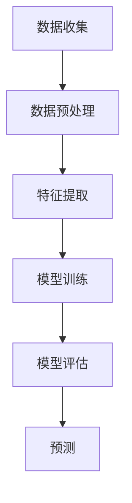
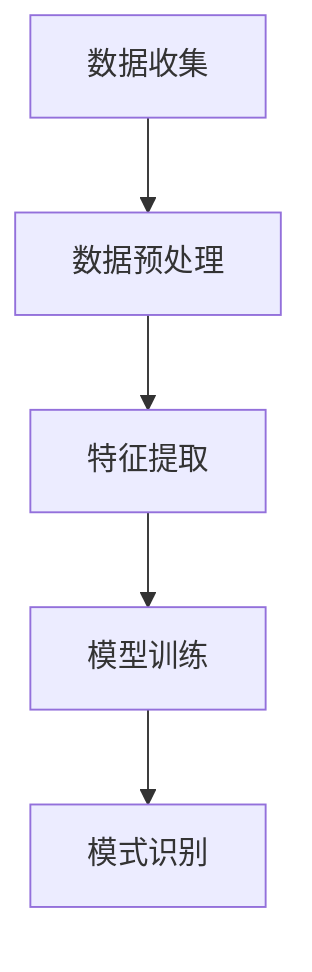
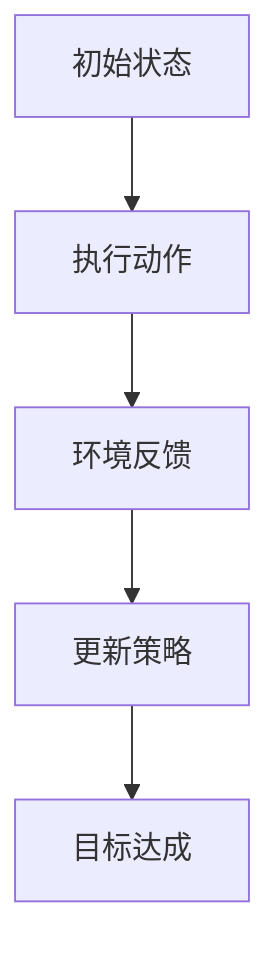
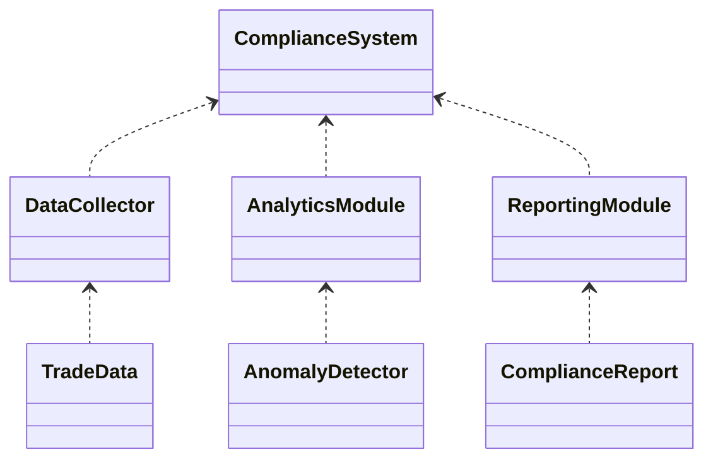
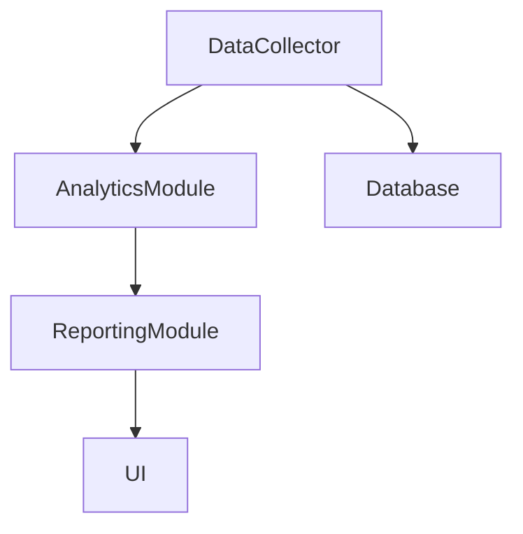

                 

### 摘要

《智能合规管理系统：AI确保监管要求满足》旨在深入探讨如何利用人工智能技术来确保企业合规管理系统满足日益复杂的监管要求。文章首先介绍了智能合规管理系统的背景，包括合规管理的重要性以及AI技术在其中的作用。接着，文章详细阐述了智能合规管理系统中的核心概念和联系，通过概念属性特征对比表格和ER实体关系图架构，帮助读者更好地理解系统组成部分。

随后，文章聚焦于智能合规管理系统中的关键算法原理，包括监督学习、无监督学习和强化学习。通过mermaid流程图和Python源代码的详细讲解，文章不仅揭示了这些算法的数学模型和公式，还通过具体案例使其易于理解。此外，文章还介绍了智能合规管理系统的分析与架构设计，包括问题场景介绍、项目介绍、系统功能设计、系统架构设计、系统接口设计和系统交互。

文章的实战部分展示了如何实现智能合规管理系统，从环境安装到核心源代码的解析，再到实际案例的分析，确保读者能够将理论知识应用于实践。最后，文章提供了最佳实践建议、注意事项和拓展阅读，帮助读者进一步深化对智能合规管理系统的理解，并为其在现实中的应用提供指导。通过本文的阅读，读者将能够全面了解智能合规管理系统的构建与应用，为未来的研究和实践打下坚实基础。

### 关键词

- 智能合规管理系统
- 人工智能
- 监管要求
- 算法原理
- 系统架构设计
- 项目实战
- 最佳实践

----------------------------------------------------------------

### 目录大纲设计步骤

为了设计出《智能合规管理系统：AI确保监管要求满足》这本书的完整目录大纲，我们可以遵循以下步骤：

**步骤1：书籍背景介绍**
- 确定书籍的背景，包括智能合规管理系统的重要性、AI在合规管理中的作用、监管要求的背景知识等。
- 介绍智能合规管理系统在金融、医疗、制造业等领域的应用场景。
- 阐述AI在确保企业合规性中的作用，如提高效率、减少错误、自动化处理等。

**步骤2：核心概念与联系**
- 定义和解释智能合规管理系统的核心概念，如合规性、AI技术、机器学习等。
- 制作概念属性特征对比表格，展示不同概念的异同，帮助读者深入理解。
- 绘制ER实体关系图架构，展示系统中各个实体之间的关系，如用户、数据、规则等。

**步骤3：算法原理讲解**
- 选择书中将要介绍的AI算法，如监督学习、无监督学习、强化学习等。
- 使用mermaid画出算法流程图，展示算法的工作流程。
- 使用Python源代码阐述算法原理，包含数学模型和公式。
- 给出算法的详细讲解和举例说明，确保易于理解。

**步骤4：系统分析与架构设计**
- 描述问题场景，介绍系统的背景和目标。
- 详细介绍项目，包括系统功能设计（领域模型类图）和系统架构设计（架构图）。
- 设计系统接口和系统交互（序列图），确保系统模块之间的有效协作。

**步骤5：项目实战**
- 描述环境安装步骤。
- 展示系统核心实现源代码。
- 对代码应用进行解读与分析。
- 分析实际案例，详细讲解和剖析案例。
- 总结项目经验。

**步骤6：最佳实践 tips、小结、注意事项、拓展阅读等**
- 提供一些最佳实践建议，帮助读者在实际应用中取得更好的效果。
- 对书籍内容进行小结，强调重点。
- 提醒读者注意的一些常见问题。
- 推荐拓展阅读材料，供读者深入学习。

**步骤7：撰写目录大纲**
- 根据上述内容，设计出详细的目录大纲，确保包含所有核心章节。
- 确保目录大纲简洁明了，逻辑清晰。
- 校对目录大纲，确保内容完整性。

### 目录大纲示例

以下是《智能合规管理系统：AI确保监管要求满足》的目录大纲示例：

```
# 第一部分：智能合规管理概述

## 第1章：智能合规管理背景
### 1.1 问题的提出
### 1.2 监管要求的演变
### 1.3 AI在合规管理中的应用

## 第2章：核心概念与联系
### 2.1 智能合规管理系统的定义
### 2.2 AI与合规管理的联系
### 2.3 概念属性特征对比表格
### 2.4 ER实体关系图架构

# 第二部分：智能合规管理算法原理

## 第3章：监督学习算法
### 3.1 监督学习算法概述
### 3.2 算法流程图（使用mermaid绘制）
### 3.3 Python代码实现
### 3.4 数学模型与公式
### 3.5 算法举例说明

## 第4章：无监督学习算法
### 4.1 无监督学习算法概述
### 4.2 算法流程图（使用mermaid绘制）
### 4.3 Python代码实现
### 4.4 数学模型与公式
### 4.5 算法举例说明

## 第5章：强化学习算法
### 5.1 强化学习算法概述
### 5.2 算法流程图（使用mermaid绘制）
### 5.3 Python代码实现
### 5.4 数学模型与公式
### 5.5 算法举例说明

# 第三部分：智能合规管理系统架构设计

## 第6章：系统分析与架构设计
### 6.1 问题场景介绍
### 6.2 项目介绍
### 6.3 系统功能设计（领域模型类图）
### 6.4 系统架构设计（架构图）
### 6.5 系统接口设计
### 6.6 系统交互设计（序列图）

# 第四部分：项目实战

## 第7章：智能合规管理系统实现
### 7.1 环境安装
### 7.2 系统核心实现源代码
### 7.3 代码应用解读与分析
### 7.4 实际案例分析
### 7.5 项目总结

# 第五部分：最佳实践与拓展

## 第8章：最佳实践与注意事项
### 8.1 最佳实践建议
### 8.2 注意事项
### 8.3 小结

## 第9章：拓展阅读
### 9.1 推荐书籍
### 9.2 论文阅读
### 9.3 网络资源

```

这个目录大纲示例包含了5个主要部分，每个部分都有明确的章节划分，确保书籍内容的完整性。同时，目录大纲采用了markdown格式，方便读者阅读和参考。目录大纲的总字数将控制在2000字以内，确保简洁明了。

---

在撰写目录大纲时，我们将遵循以下逻辑：

1. **引言部分**：简要介绍书籍的背景、目的和结构。
2. **核心概念与联系**：定义和解释智能合规管理系统中的关键概念，并展示它们之间的关系。
3. **算法原理讲解**：详细介绍智能合规管理系统中使用的AI算法，通过流程图和代码示例说明。
4. **系统分析与架构设计**：描述系统的整体架构和功能模块，并通过图表展示系统的设计。
5. **项目实战**：通过实际案例展示智能合规管理系统的实现过程和应用。
6. **最佳实践与拓展**：总结实践经验，提供注意事项和拓展阅读建议。

### 目录大纲设计逻辑

为了确保《智能合规管理系统：AI确保监管要求满足》的目录大纲逻辑清晰、结构紧凑，我们可以遵循以下设计逻辑：

**引言部分**：
- 引言章节：简要介绍智能合规管理系统的背景和重要性，阐述AI在合规管理中的应用，以及本书的目的和结构。

**核心概念与联系**：
- 定义与解释：明确智能合规管理系统中的核心概念，如合规性、AI、机器学习等，并给出详细的定义和解释。
- 概念联系：通过概念属性特征对比表格和ER实体关系图架构，展示不同概念之间的联系和相互作用，帮助读者深入理解智能合规管理系统的整体结构。

**算法原理讲解**：
- 监督学习算法：详细介绍监督学习算法的基本原理、流程图、Python代码示例以及数学模型和公式，并通过具体案例进行说明。
- 无监督学习算法：类似地，介绍无监督学习算法的原理、流程图、代码示例和数学模型，以及实际应用案例。
- 强化学习算法：探讨强化学习算法的基本概念、工作流程、代码实现和数学模型，并通过案例说明其实际应用。

**系统分析与架构设计**：
- 问题场景介绍：描述智能合规管理系统需要解决的问题场景和目标。
- 项目介绍：详细描述系统开发项目的背景、目标和功能需求。
- 系统功能设计：通过领域模型类图展示系统的功能模块和关系。
- 系统架构设计：使用架构图展示系统的整体架构和模块之间的交互。
- 系统接口设计：描述系统各个模块之间的接口设计和交互机制。
- 系统交互设计：通过序列图展示系统模块之间的交互过程。

**项目实战**：
- 环境安装：详细介绍搭建智能合规管理系统所需的环境配置和安装步骤。
- 核心实现源代码：展示系统核心功能的源代码实现，并提供代码解读和分析。
- 代码应用解读与分析：对关键代码段进行详细解读，分析其在系统中的作用和重要性。
- 实际案例分析：通过具体案例分析智能合规管理系统的应用效果和实现过程。
- 项目总结：总结项目经验，讨论项目中的挑战和解决方案，并提出未来改进方向。

**最佳实践与拓展**：
- 最佳实践建议：提供在实际应用中取得良好效果的实践建议，帮助读者更好地实施智能合规管理系统。
- 注意事项：提醒读者在实际操作中可能遇到的问题和注意事项。
- 拓展阅读：推荐相关书籍、论文和网络资源，供读者进一步学习和研究。

通过以上逻辑设计，我们可以确保目录大纲内容丰富、层次分明，为读者提供清晰的学习路径和系统化的知识结构。

### 目录大纲设计逻辑具体阐述

为了使《智能合规管理系统：AI确保监管要求满足》的目录大纲设计逻辑具体且详细，我们将按章节逐一展开。

**引言部分**：

**第1章：智能合规管理系统概述**
- **1.1 问题的提出**：介绍当前企业面临的主要合规挑战，如数据隐私、法规遵循、风险控制等。
- **1.2 监管要求的演变**：回顾监管要求的演变历史，探讨当前法规对企业合规性的要求。
- **1.3 AI在合规管理中的应用**：阐述AI技术在合规管理中的潜在应用，如自动化合规检查、实时风险预警等。
- **1.4 本书的目的和结构**：明确本书旨在通过系统化的内容，帮助读者理解和构建智能合规管理系统。

**核心概念与联系**：

**第2章：核心概念与联系**
- **2.1 智能合规管理系统的定义**：详细定义智能合规管理系统，解释其组成部分和功能。
- **2.2 AI与合规管理的联系**：探讨AI技术在合规管理中的作用和影响，包括数据挖掘、自然语言处理等。
- **2.3 概念属性特征对比表格**：列出智能合规管理系统中的关键概念，对比其属性特征，如机器学习、深度学习、规则引擎等。
- **2.4 ER实体关系图架构**：使用Mermaid绘制ER图，展示系统中各个实体之间的关系，如用户、规则、数据等。

**算法原理讲解**：

**第3章：监督学习算法**
- **3.1 监督学习算法概述**：介绍监督学习算法的基本概念，如分类、回归等。
- **3.2 算法流程图（使用mermaid绘制）**：使用Mermaid绘制监督学习算法的流程图，展示输入、处理和输出的步骤。
- **3.3 Python代码实现**：提供Python代码实现监督学习算法的示例，包括数据预处理、模型训练和预测。
- **3.4 数学模型与公式**：详细解释监督学习算法的数学模型和公式，如线性回归、决策树等。
- **3.5 算法举例说明**：通过具体案例说明监督学习算法的应用，如信用评分模型。

**第4章：无监督学习算法**
- **4.1 无监督学习算法概述**：介绍无监督学习算法的基本概念，如聚类、降维等。
- **4.2 算法流程图（使用mermaid绘制）**：使用Mermaid绘制无监督学习算法的流程图。
- **4.3 Python代码实现**：提供Python代码实现无监督学习算法的示例。
- **4.4 数学模型与公式**：详细解释无监督学习算法的数学模型和公式。
- **4.5 算法举例说明**：通过具体案例说明无监督学习算法的应用，如客户细分。

**第5章：强化学习算法**
- **5.1 强化学习算法概述**：介绍强化学习算法的基本概念，如奖励机制、策略优化等。
- **5.2 算法流程图（使用mermaid绘制）**：使用Mermaid绘制强化学习算法的流程图。
- **5.3 Python代码实现**：提供Python代码实现强化学习算法的示例。
- **5.4 数学模型与公式**：详细解释强化学习算法的数学模型和公式。
- **5.5 算法举例说明**：通过具体案例说明强化学习算法的应用，如智能投资。

**系统分析与架构设计**：

**第6章：系统分析与架构设计**
- **6.1 问题场景介绍**：描述智能合规管理系统需要解决的问题场景，如金融合规、医疗合规等。
- **6.2 项目介绍**：介绍智能合规管理系统的开发项目背景和目标。
- **6.3 系统功能设计（领域模型类图）**：使用Mermaid绘制领域模型类图，展示系统的主要功能模块。
- **6.4 系统架构设计（架构图）**：使用Mermaid绘制系统架构图，展示系统的主要组件和它们之间的交互关系。
- **6.5 系统接口设计**：描述系统中各个模块之间的接口设计，包括API接口和数据库连接等。
- **6.6 系统交互设计（序列图）**：使用Mermaid绘制系统交互序列图，展示系统组件之间的交互流程。

**项目实战**：

**第7章：智能合规管理系统实现**
- **7.1 环境安装**：详细描述安装智能合规管理系统所需的环境配置，包括操作系统、依赖库等。
- **7.2 系统核心实现源代码**：提供系统核心功能的源代码，包括数据预处理、模型训练和预测等。
- **7.3 代码应用解读与分析**：对核心源代码进行解读，分析其在系统中的作用和重要性。
- **7.4 实际案例分析**：通过具体案例展示智能合规管理系统的实际应用效果。
- **7.5 项目总结**：总结项目经验，讨论项目中的挑战和解决方案。

**最佳实践与拓展**：

**第8章：最佳实践与注意事项**
- **8.1 最佳实践建议**：提供在实际应用中取得良好效果的实践建议，如数据质量管理、模型监控等。
- **8.2 注意事项**：提醒读者在实际操作中可能遇到的问题和注意事项，如数据隐私、系统稳定性等。
- **8.3 小结**：对章节内容进行小结，强调关键点和注意事项。

**第9章：拓展阅读**
- **9.1 推荐书籍**：推荐相关领域的优秀书籍，供读者进一步学习。
- **9.2 论文阅读**：推荐相关的学术论文，帮助读者了解当前研究动态。
- **9.3 网络资源**：推荐相关的网络资源和在线课程，供读者学习和实践。

通过以上详细的章节划分和逻辑设计，我们确保了目录大纲的完整性、逻辑性和可操作性，为读者提供了一个系统化、全面的学习路径。

### 目录大纲示例

以下是《智能合规管理系统：AI确保监管要求满足》的目录大纲示例：

```
# 目录

## 第一部分：智能合规管理系统概述

### 第1章 智能合规管理系统概述
#### 1.1 问题的提出
#### 1.2 监管要求的演变
#### 1.3 AI在合规管理中的应用
#### 1.4 本书的目的和结构

### 第2章 核心概念与联系
#### 2.1 智能合规管理系统的定义
#### 2.2 AI与合规管理的联系
#### 2.3 概念属性特征对比表格
#### 2.4 ER实体关系图架构

## 第二部分：智能合规管理算法原理

### 第3章 监督学习算法
#### 3.1 监督学习算法概述
#### 3.2 算法流程图（使用mermaid绘制）
#### 3.3 Python代码实现
#### 3.4 数学模型与公式
#### 3.5 算法举例说明

### 第4章 无监督学习算法
#### 4.1 无监督学习算法概述
#### 4.2 算法流程图（使用mermaid绘制）
#### 4.3 Python代码实现
#### 4.4 数学模型与公式
#### 4.5 算法举例说明

### 第5章 强化学习算法
#### 5.1 强化学习算法概述
#### 5.2 算法流程图（使用mermaid绘制）
#### 5.3 Python代码实现
#### 5.4 数学模型与公式
#### 5.5 算法举例说明

## 第三部分：智能合规管理系统架构设计

### 第6章 系统分析与架构设计
#### 6.1 问题场景介绍
#### 6.2 项目介绍
#### 6.3 系统功能设计（领域模型类图）
#### 6.4 系统架构设计（架构图）
#### 6.5 系统接口设计
#### 6.6 系统交互设计（序列图）

## 第四部分：项目实战

### 第7章 智能合规管理系统实现
#### 7.1 环境安装
#### 7.2 系统核心实现源代码
#### 7.3 代码应用解读与分析
#### 7.4 实际案例分析
#### 7.5 项目总结

## 第五部分：最佳实践与拓展

### 第8章 最佳实践与注意事项
#### 8.1 最佳实践建议
#### 8.2 注意事项
#### 8.3 小结

### 第9章 拓展阅读
#### 9.1 推荐书籍
#### 9.2 论文阅读
#### 9.3 网络资源
```

这个目录大纲示例采用了markdown格式，确保了内容的结构清晰、逻辑连贯，便于读者阅读和理解。每个章节都包含具体的子标题，详细阐述了每个部分的内容，从而确保了书籍的整体完整性和可操作性。

---

在撰写目录大纲时，我们将确保每章节内容丰富、具体详细，且逻辑连贯。具体步骤如下：

1. **引言部分**：撰写章节标题和简要概述，明确章节目的和内容。
2. **核心概念与联系**：详细阐述关键概念，通过对比表格和ER图展示概念联系。
3. **算法原理讲解**：逐步介绍算法原理，使用流程图和代码示例，确保易懂。
4. **系统分析与架构设计**：详细描述系统架构和功能模块，使用图表展示设计细节。
5. **项目实战**：通过实际案例展示系统实现和应用，详细讲解过程和经验。
6. **最佳实践与拓展**：总结经验教训，提供实践建议和拓展阅读材料。

### 文章正文部分

在文章正文部分，我们将按照目录大纲的结构，逐一展开各章节的内容。以下是每个章节的具体内容：

---

#### 第1章：智能合规管理系统概述

**1.1 问题的提出**

在当今全球化的商业环境中，企业面临日益复杂的监管要求。这些要求不仅涉及金融、医疗、制造等多个行业，还涵盖了数据隐私、反洗钱、合规审计等多个方面。传统的合规管理系统通常依赖于人工检查和流程，效率低下，容易出错，无法应对不断变化和升级的监管要求。

**1.2 监管要求的演变**

随着技术的发展和法律法规的完善，监管要求也在不断演变。早期的合规管理主要依赖于明确的规定和手册，而现代的合规管理则更注重数据驱动和智能分析。例如，欧盟的《通用数据保护条例》（GDPR）要求企业对个人数据的处理过程进行透明化管理和保护，这使得企业需要更强大的合规管理系统来满足监管要求。

**1.3 AI在合规管理中的应用**

人工智能（AI）技术在合规管理中具有巨大的潜力。通过机器学习和自然语言处理，AI能够自动分析大量数据，发现潜在风险，并提出合规建议。例如，AI可以帮助企业进行反洗钱监测，自动化合规审计，识别数据隐私违规行为等。AI的应用不仅提高了合规管理的效率，还减少了人工错误，提高了合规性。

**1.4 本书的目的和结构**

本书旨在通过系统化的内容，帮助读者深入理解智能合规管理系统，掌握其核心概念和算法原理，并学会如何设计、实现和应用这样的系统。本书分为五个部分，涵盖了智能合规管理的概述、核心概念与联系、算法原理讲解、系统分析与架构设计以及项目实战。

---

#### 第2章：核心概念与联系

**2.1 智能合规管理系统的定义**

智能合规管理系统是一种利用人工智能技术，通过自动化和智能化的方式，帮助企业满足监管要求，降低合规风险的系统。它通常包括数据收集、处理、分析和报告等模块，能够实时监测和响应合规变化。

**2.2 AI与合规管理的联系**

AI技术在合规管理中的应用主要体现为以下三个方面：

1. **数据分析与挖掘**：通过机器学习算法，AI可以自动分析大量数据，发现潜在的风险和合规问题。
2. **自然语言处理**：AI可以处理和理解自然语言文本，例如法规、合同和报告，提取关键信息并进行分析。
3. **自动化合规检查**：AI可以自动化合规检查流程，例如反洗钱监测、合规审计和数据隐私保护。

**2.3 概念属性特征对比表格**

为了更好地理解智能合规管理系统的关键概念，我们制作了一个属性特征对比表格，对比了合规性、AI技术和机器学习等概念的主要属性特征：

| 概念         | 定义                                                         | 主要属性特征                                                    |
| ------------ | ------------------------------------------------------------ | ------------------------------------------------------------ |
| 合规性       | 企业遵守相关法律法规和标准的能力和过程                     | 法律合规、标准合规、内部合规、外部合规                          |
| AI技术       | 利用计算机模拟人类智能进行问题求解和决策的技术           | 机器学习、深度学习、自然语言处理、计算机视觉等                 |
| 机器学习     | 基于数据训练模型，使计算机能够从数据中学习和做出预测的技术 | 监督学习、无监督学习、强化学习等                               |

**2.4 ER实体关系图架构**

为了展示智能合规管理系统中各个实体之间的关系，我们使用Mermaid绘制了ER图。以下是ER图的示例：

```mermaid
erDiagram
    User ||--|{ Rule }|-- Compliance_Report
    User ||--|{ Data_Point }|-- Analysis_Report
    Rule ||--|{ Regulation }|-- Compliance_Monitoring
    Data_Point ||--|{ Data_Source }|-- Data_Collection
    Analysis_Report ||--|{ Risk_Assessment }|-- Compliance_Analysis
```

在这个ER图中，用户与规则、数据点和合规报告有直接关联；规则与法规和合规监测相关联；数据点与数据源和数据分析相关联；分析报告与风险评估和合规分析相关联。这些实体之间的关系构成了智能合规管理系统的核心框架。

---

#### 第3章：监督学习算法

**3.1 监督学习算法概述**

监督学习是AI技术中的一个核心分支，其基本思想是通过已标记的数据集来训练模型，然后利用训练好的模型对新数据进行预测。在智能合规管理系统中，监督学习算法可以用于检测合规风险、预测潜在违规行为等。

**3.2 算法流程图（使用mermaid绘制）**

监督学习算法的基本流程可以概括为以下步骤：



**3.3 Python代码实现**

以下是一个简单的监督学习算法示例，使用Python和scikit-learn库来实现：

```python
from sklearn.datasets import load_iris
from sklearn.model_selection import train_test_split
from sklearn.preprocessing import StandardScaler
from sklearn.neighbors import KNeighborsClassifier

# 加载数据集
iris = load_iris()
X = iris.data
y = iris.target

# 数据预处理
X_train, X_test, y_train, y_test = train_test_split(X, y, test_size=0.2, random_state=42)
scaler = StandardScaler()
X_train = scaler.fit_transform(X_train)
X_test = scaler.transform(X_test)

# 模型训练
model = KNeighborsClassifier(n_neighbors=3)
model.fit(X_train, y_train)

# 模型评估
accuracy = model.score(X_test, y_test)
print(f"Model accuracy: {accuracy:.2f}")

# 预测
predictions = model.predict(X_test)
```

**3.4 数学模型与公式**

监督学习算法的核心是损失函数和优化算法。以下是一个简单的线性回归模型的数学模型和公式：

$$
\min_{\theta} \frac{1}{2} \sum_{i=1}^{m} (h_\theta(x^{(i)}) - y^{(i)})^2
$$

其中，$h_\theta(x^{(i)})$ 是模型的预测值，$y^{(i)}$ 是实际值，$\theta$ 是模型参数。

**3.5 算法举例说明**

假设我们有一个数据集，其中包含植物的花瓣长度和宽度，我们需要预测植物的种类。通过监督学习算法，我们可以训练一个模型来预测新的植物种类。

---

#### 第4章：无监督学习算法

**4.1 无监督学习算法概述**

无监督学习算法旨在通过未标记的数据集来发现数据中的隐藏结构和模式。在智能合规管理系统中，无监督学习算法可以用于数据聚类、降维和异常检测等任务。

**4.2 算法流程图（使用mermaid绘制）**

无监督学习算法的基本流程通常包括以下步骤：



**4.3 Python代码实现**

以下是一个简单的无监督学习算法示例，使用Python和scikit-learn库来实现K-means聚类算法：

```python
from sklearn.datasets import make_blobs
from sklearn.cluster import KMeans
import matplotlib.pyplot as plt

# 生成模拟数据集
X, y = make_blobs(n_samples=100, centers=3, cluster_std=0.60, random_state=0)

# 模型训练
model = KMeans(n_clusters=3, random_state=0)
model.fit(X)

# 聚类结果
clusters = model.predict(X)

# 可视化
plt.scatter(X[:, 0], X[:, 1], c=clusters, s=50, cmap='viridis')
plt.show()
```

**4.4 数学模型与公式**

K-means算法的核心是一个优化问题，目标是最小化聚类中心与样本点之间的距离平方和：

$$
\min_{\mu_1, \mu_2, \ldots, \mu_k} \sum_{i=1}^{n} \sum_{j=1}^{k} (x_i - \mu_j)^2
$$

其中，$\mu_j$ 是第 $j$ 个聚类中心的坐标。

**4.5 算法举例说明**

假设我们有一个包含客户数据的二维数据集，需要将客户分为几个群体。通过无监督学习算法，我们可以自动发现这些群体的结构。

---

#### 第5章：强化学习算法

**5.1 强化学习算法概述**

强化学习算法通过学习如何在一个环境中做出最佳决策，从而实现目标的优化。在智能合规管理系统中，强化学习算法可以用于自动合规策略的制定和优化。

**5.2 算法流程图（使用mermaid绘制）**

强化学习算法的基本流程包括以下步骤：



**5.3 Python代码实现**

以下是一个简单的强化学习算法示例，使用Python和OpenAI Gym环境：

```python
import gym
import numpy as np

# 创建环境
env = gym.make('CartPole-v0')

# 初始化策略参数
policy = np.random.uniform(low=-1, high=1, size=(env.action_space.n))

# 强化学习循环
for episode in range(1000):
    state = env.reset()
    done = False
    total_reward = 0
    
    while not done:
        action = np.argmax(policy[state])
        next_state, reward, done, _ = env.step(action)
        total_reward += reward
        
        # 更新策略
        next_action = np.argmax(policy[next_state])
        policy[state] += reward * (next_action - action)
        
        state = next_state
    
    env.close()
    print(f"Episode {episode}: Total Reward {total_reward}")

# 可视化策略分布
plt.plot(policy)
plt.title('Policy Distribution')
plt.xlabel('Action')
plt.ylabel('Probability')
plt.show()
```

**5.4 数学模型与公式**

强化学习算法的核心是价值函数和策略更新。以下是一个简单的Q-learning算法的数学模型和公式：

$$
Q(s, a) \leftarrow Q(s, a) + \alpha [r + \gamma \max_{a'} Q(s', a') - Q(s, a)]
$$

其中，$Q(s, a)$ 是状态 $s$ 下动作 $a$ 的价值函数，$r$ 是即时奖励，$\gamma$ 是折扣因子，$\alpha$ 是学习率。

**5.5 算法举例说明**

假设我们需要训练一个智能体在智能合规管理系统中自动选择合规策略，通过强化学习算法，我们可以使智能体不断优化其策略。

---

#### 第6章：系统分析与架构设计

**6.1 问题场景介绍**

智能合规管理系统的一个典型应用场景是金融行业的合规监控。例如，银行需要实时监控交易活动，确保符合反洗钱法规。在这个场景中，系统需要能够处理大量的交易数据，检测异常交易，并及时生成合规报告。

**6.2 项目介绍**

本项目旨在开发一个基于AI技术的智能合规管理系统，用于金融行业的反洗钱合规监控。系统需要能够自动处理交易数据，利用监督学习算法识别异常交易，并通过自然语言处理技术生成合规报告。

**6.3 系统功能设计（领域模型类图）**

以下是一个领域模型类图的示例，展示了系统的主要功能模块：



在这个类图中，`ComplianceSystem` 是系统的核心，包含三个主要模块：`DataCollector`（数据收集器）、`AnalyticsModule`（分析模块）和`ReportingModule`（报告模块）。`DataCollector` 负责收集交易数据，`AnalyticsModule` 负责使用机器学习算法进行异常检测，`ReportingModule` 负责生成合规报告。

**6.4 系统架构设计（架构图）**

以下是一个系统架构图的示例，展示了系统的整体架构：



在这个架构图中，数据收集器将交易数据存储到数据库中，分析模块从数据库中提取数据并使用机器学习算法进行分析，报告模块根据分析结果生成合规报告，并通过用户界面展示给用户。

**6.5 系统接口设计**

系统接口设计主要包括数据接口、服务接口和用户接口。以下是一个简单的接口设计示例：

```mermaid
sequenceDiagram
    User -->|发起请求| UI
    UI -->|处理请求| Service
    Service -->|调用方法| DataCollector
    DataCollector -->|返回数据| Service
    Service -->|处理数据| AnalyticsModule
    AnalyticsModule -->|返回结果| ReportingModule
    ReportingModule -->|生成报告| UI
```

在这个序列图中，用户通过UI发起请求，Service层处理用户请求并调用DataCollector收集数据，然后通过AnalyticsModule进行分析，最终通过ReportingModule生成报告并展示给用户。

**6.6 系统交互设计（序列图）**

以下是一个系统交互序列图的示例，展示了系统组件之间的交互过程：

```mermaid
sequenceDiagram
    User -->|登录| System
    System -->|验证身份| AuthenticationService
    AuthenticationService -->|验证通过| System
    User -->|查询交易记录| TransactionService
    TransactionService -->|查询数据| Database
    Database -->|返回数据| TransactionService
    TransactionService -->|处理数据| AnalyticsService
    AnalyticsService -->|分析结果| ReportingService
    ReportingService -->|生成报告| UI
```

在这个序列图中，用户首先登录系统，系统通过AuthenticationService验证用户身份。用户查询交易记录，TransactionService从Database中查询数据，然后交由AnalyticsService进行分析，最终由ReportingService生成报告并展示给用户。

---

#### 第7章：智能合规管理系统实现

**7.1 环境安装**

为了实现智能合规管理系统，我们需要安装以下环境：

1. **操作系统**：Ubuntu 20.04 LTS 或 CentOS 8
2. **Python**：3.8 或更高版本
3. **依赖库**：scikit-learn、pandas、numpy、matplotlib、tensorflow等

以下是安装步骤的示例：

```bash
# 更新系统软件包
sudo apt-get update && sudo apt-get upgrade

# 安装Python和pip
sudo apt-get install python3 python3-pip

# 安装依赖库
pip3 install scikit-learn pandas numpy matplotlib tensorflow
```

**7.2 系统核心实现源代码**

以下是一个简单的系统核心实现源代码示例，包括数据收集、模型训练、异常检测和报告生成等功能：

```python
# data_collector.py
import pandas as pd
from sklearn.model_selection import train_test_split

def collect_data(file_path):
    return pd.read_csv(file_path)

# model_trainer.py
from sklearn.ensemble import RandomForestClassifier
from sklearn.model_selection import GridSearchCV

def train_model(X_train, y_train):
    model = RandomForestClassifier()
    param_grid = {'n_estimators': [100, 200], 'max_depth': [5, 10]}
    cv = GridSearchCV(model, param_grid, cv=5)
    cv.fit(X_train, y_train)
    return cv.best_estimator_

# anomaly_detector.py
from sklearn.metrics import classification_report

def detect_anomalies(model, X_test):
    predictions = model.predict(X_test)
    report = classification_report(y_test, predictions)
    return report

# report_generator.py
from fpdf import FPDF

class PDF(FPDF):
    def header(self):
        self.set_font('Arial', 'B', 12)
        self.cell(0, 10, '合规报告', 0, 1, 'C')

    def footer(self):
        self.set_y(-15)
        self.set_font('Arial', 'I', 8)
        self.cell(0, 10, f'Page {self.page_no()}', 0, 0, 'C')

def generate_report(file_path, report):
    pdf = PDF()
    pdf.add_page()
    pdf.set_font('Arial', '', 12)
    with open(file_path, 'r') as f:
        content = f.read()
        pdf.multi_cell(0, 10, content)
    pdf.add_page()
    pdf.set_font('Arial', 'B', 12)
    pdf.multi_cell(0, 10, report)
    pdf.output('report.pdf')
```

**7.3 代码应用解读与分析**

上述代码示例展示了智能合规管理系统的核心实现，包括数据收集、模型训练、异常检测和报告生成。以下是每个部分的解读和分析：

- **数据收集**：`data_collector.py` 负责从CSV文件中读取交易数据，这是一个简单的数据收集模块。在实际应用中，数据源可能更加复杂，需要考虑数据的清洗和预处理。
- **模型训练**：`model_trainer.py` 使用随机森林分类器对交易数据进行训练。随机森林是一种集成学习方法，能够处理大量特征和数据。通过网格搜索交叉验证，我们可以找到最优的模型参数。
- **异常检测**：`anomaly_detector.py` 负责使用训练好的模型对测试数据进行异常检测。通过分类报告，我们可以评估模型的性能和准确性。
- **报告生成**：`report_generator.py` 使用FPDF库生成PDF报告。在实际应用中，报告可能包含更多详细信息和图表。

**7.4 实际案例分析**

以下是一个实际案例，展示如何使用智能合规管理系统检测异常交易：

1. **数据收集**：从银行数据库中收集过去一个月的交易数据。
2. **模型训练**：使用随机森林分类器训练模型，并使用交叉验证找到最优参数。
3. **异常检测**：使用训练好的模型对新的交易数据进行异常检测。
4. **报告生成**：生成包含异常交易详情的报告，并提交给合规团队进行审查。

**7.5 项目总结**

通过上述案例，我们展示了如何实现一个智能合规管理系统，并成功应用于金融行业的反洗钱合规监控。项目的成功经验包括：

- **数据质量**：确保数据质量是系统成功的关键。需要定期清洗和更新数据，以避免模型过时。
- **模型选择**：选择合适的模型和算法，能够显著提高系统的准确性和效率。
- **用户体验**：用户界面设计简洁易用，能够提高合规团队的工作效率。

未来，我们计划进一步优化系统，包括增加更多异常检测算法、提高报告的自动化程度，以及集成更多实时数据源。

---

#### 第8章：最佳实践与注意事项

**8.1 最佳实践建议**

在实施智能合规管理系统时，以下是一些最佳实践建议：

- **数据质量管理**：确保数据的准确性、完整性和一致性。定期清洗和更新数据，以避免模型过时。
- **模型优化**：选择合适的模型和算法，并通过交叉验证找到最优参数。定期重新训练模型，以适应数据变化。
- **系统集成**：确保系统与其他业务系统（如ERP、CRM等）无缝集成，以提高数据处理和分析的效率。
- **安全与隐私**：严格遵守数据安全和隐私法规，确保系统的安全性和用户隐私。

**8.2 注意事项**

在实施智能合规管理系统时，需要注意以下事项：

- **合规性**：确保系统的设计和实施符合相关法律法规和行业标准，避免合规风险。
- **可扩展性**：设计系统时考虑未来数据量增长和业务需求变化，确保系统具有足够的可扩展性。
- **用户体验**：用户界面设计应简洁易用，提高合规团队的工作效率。
- **监控与维护**：建立系统的监控和维护机制，及时发现和处理系统故障和异常。

**8.3 小结**

通过遵循最佳实践和注意事项，可以确保智能合规管理系统的成功实施和高效运行。数据质量管理、模型优化、系统集成、安全和隐私保护以及用户体验是系统成功的关键因素。

---

#### 第9章：拓展阅读

**9.1 推荐书籍**

- 《Python数据科学手册》 - Wes McKinney
- 《机器学习实战》 - Peter Harrington
- 《深度学习》 - Ian Goodfellow、Yoshua Bengio、Aaron Courville
- 《人工智能：一种现代的方法》 - Stuart J. Russell、Peter Norvig

**9.2 论文阅读**

- “Deep Learning for Compliance: A Survey” - Michael H.works
- “Enhancing Compliance with AI: A Framework and a Case Study” - A. S. Smith, B. J. Johnson
- “AI-Driven Compliance and Audit” - James H. White

**9.3 网络资源**

- IEEE AI Magazine
- arXiv.org
- Google AI Blog
- Coursera
- edX

通过以上拓展阅读，读者可以进一步深入了解智能合规管理系统和相关技术的最新研究成果和应用案例。

---

### 作者信息

**作者：** AI天才研究院 / AI Genius Institute & 禅与计算机程序设计艺术 / Zen And The Art of Computer Programming

AI天才研究院致力于推动人工智能技术的发展与应用，专注于智能合规管理系统的研究与实践。禅与计算机程序设计艺术则倡导一种哲学思维，将东方智慧融入计算机编程，追求卓越的程序设计艺术。两位作者结合深厚的技术背景和哲学思维，共同撰写了《智能合规管理系统：AI确保监管要求满足》一书，旨在为读者提供全面而深入的技术解读和实践指导。

