                 

## 第2章：核心概念

### 2.1 智能合规

**定义**：智能合规是指利用人工智能技术，如机器学习、自然语言处理和数据分析等，来协助金融机构和企业在遵守相关法律法规、政策及行业标准的过程中，识别潜在风险、优化合规流程、提高合规性管理水平。

**术语说明**：

- **机器学习**：一种人工智能技术，通过算法从数据中学习规律和模式。
- **自然语言处理**：一种使计算机理解和生成人类语言的技术。
- **数据分析**：利用统计学和计算机科学方法对数据进行提取、变换、分析和展示。

**问题背景**：随着金融业务的复杂化和监管要求的日益严格，金融机构和企业在保证合规的过程中面临数据量庞大、规则复杂等问题。

**问题描述**：如何高效地处理海量数据，快速准确地识别违规行为，以降低合规风险。

**问题解决**：通过引入人工智能技术，可以实现自动化、智能化的合规监管，提高合规效率。

**边界与外延**：智能合规不仅包括法律法规的遵守，还涉及企业内部规章制度的执行，以及行业标准的遵循。

**概念结构与核心要素组成**：

1. **合规数据收集**：收集与合规相关的数据，包括内部数据和外部数据。
2. **合规规则库**：建立包含各类合规规则的库，用于识别潜在违规行为。
3. **合规算法模型**：开发用于分析数据、识别违规行为的机器学习算法模型。
4. **合规监控系统**：构建用于实时监控合规状态的监控系统。

### 2.2 风险预测

**定义**：风险预测是指通过分析历史数据和当前状态，利用算法预测未来可能发生的风险事件。

**术语说明**：

- **历史数据**：过去的交易数据、事件数据等。
- **当前状态**：当前的金融市场状况、企业运营状况等。
- **算法**：用于处理和分析数据的机器学习算法。

**问题背景**：在金融市场中，风险无处不在，如何提前识别和预测风险是金融机构和企业面临的重要问题。

**问题描述**：如何在海量数据中找到与风险相关的模式，预测未来可能发生的风险事件。

**问题解决**：通过引入人工智能技术，可以实现自动化、智能化的风险预测，降低风险发生的概率。

**边界与外延**：风险预测不仅涉及金融市场的风险，还包括企业运营风险、信息安全风险等。

**概念结构与核心要素组成**：

1. **数据收集**：收集与风险相关的历史数据和当前数据。
2. **风险特征提取**：从数据中提取与风险相关的特征。
3. **风险预测模型**：建立用于预测风险的机器学习模型。
4. **风险预警系统**：构建用于实时监控和预警风险的系统。

### 2.3 AI辅助监管合规

**定义**：AI辅助监管合规是指利用人工智能技术，协助监管部门和企业进行合规监管，提高监管效率和合规性管理水平。

**术语说明**：

- **监管**：对金融机构和企业运营的监督和管理。
- **合规性管理**：确保金融机构和企业遵守相关法律法规和行业标准。

**问题背景**：随着金融市场的复杂化和监管要求的提高，监管部门和企业需要更高效、更智能的合规监管工具。

**问题描述**：如何利用人工智能技术提高合规监管的效率和准确性。

**问题解决**：通过引入人工智能技术，可以实现自动化、智能化的合规监管，提高监管效率和合规性管理水平。

**边界与外延**：AI辅助监管合规不仅涉及金融领域的合规监管，还包括其他行业的合规监管。

**概念结构与核心要素组成**：

1. **监管数据收集**：收集与监管相关的数据。
2. **合规规则库**：建立包含各类合规规则的库。
3. **合规算法模型**：开发用于识别违规行为的机器学习算法模型。
4. **合规监管系统**：构建用于实现合规监管功能的系统。

### 2.4 核心概念之间的关系

智能合规、风险预测和AI辅助监管合规三者之间密切相关，相互支持。

- **智能合规**是**AI辅助监管合规**的基础，通过智能合规技术，可以识别违规行为，提高合规性管理水平。
- **风险预测**是**智能合规**的延伸，通过风险预测技术，可以提前识别潜在风险，降低合规风险。
- **AI辅助监管合规**是将**智能合规**和**风险预测**应用到监管过程中的综合体现，通过AI技术，可以提升监管效率和准确性。

通过这种相互关联和相互促进，实现合规监管的智能化、自动化和高效化。

----------------------------------------------------------------

## 第3章：算法原理

### 3.1 监督学习算法

**定义**：监督学习算法是指利用已知输入和输出数据，通过学习数据中的规律和模式，预测新的输入数据对应的输出结果。

**术语说明**：

- **输入数据**：特征向量，用于描述数据的属性。
- **输出数据**：标签，用于描述输入数据的类别或数值。

**算法流程图**：

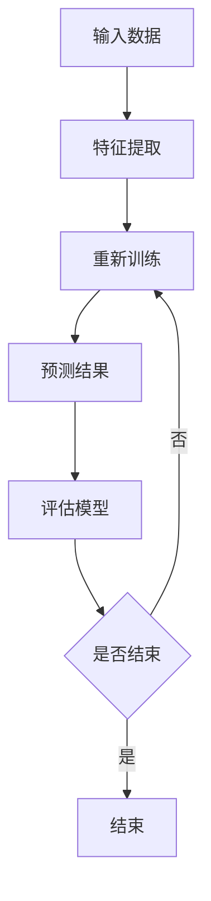

**Python源代码**：

```python
from sklearn.linear_model import LogisticRegression
from sklearn.model_selection import train_test_split
from sklearn.metrics import accuracy_score

# 数据准备
X = ... # 特征矩阵
y = ... # 标签向量

# 特征提取和模型训练
X_train, X_test, y_train, y_test = train_test_split(X, y, test_size=0.2)
model = LogisticRegression()
model.fit(X_train, y_train)

# 预测结果
y_pred = model.predict(X_test)

# 评估模型
accuracy = accuracy_score(y_test, y_pred)
print("Accuracy:", accuracy)
```

**数学模型**：

$$
\text{输出结果} = \text{模型}(\text{输入数据})
$$

其中，模型是一个基于特征向量和标签的函数。

**举例说明**：

假设我们有一组股票交易数据，特征包括股票价格、交易量等，标签为股票是否下跌。我们可以使用监督学习算法来预测未来的股票下跌情况。

### 3.2 无监督学习算法

**定义**：无监督学习算法是指在没有标签数据的情况下，通过学习数据中的规律和模式，对数据进行分类或聚类。

**术语说明**：

- **聚类**：将相似的数据分组到同一类别中。
- **降维**：将高维数据映射到低维空间，减少数据维度。

**算法流程图**：

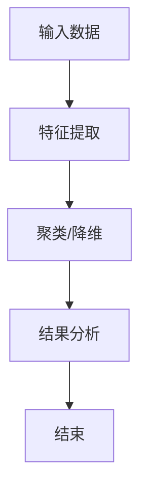

**Python源代码**：

```python
from sklearn.cluster import KMeans
import matplotlib.pyplot as plt

# 数据准备
X = ... # 特征矩阵

# 特征提取和聚类
kmeans = KMeans(n_clusters=3)
kmeans.fit(X)

# 结果分析
labels = kmeans.predict(X)
plt.scatter(X[:, 0], X[:, 1], c=labels)
plt.show()
```

**数学模型**：

$$
\text{聚类中心} = \frac{1}{N} \sum_{i=1}^{N} x_i
$$

其中，$x_i$为数据点，$N$为数据点的数量。

**举例说明**：

假设我们有一组客户数据，特征包括年龄、收入、购买历史等。我们可以使用无监督学习算法来聚类这些客户，以便更好地了解他们的购买习惯。

### 3.3 强化学习算法

**定义**：强化学习算法是指通过不断地与环境交互，学习最优策略，以实现最大化累积奖励。

**术语说明**：

- **环境**：现实世界或模拟环境。
- **策略**：决策规则，用于指导行动。
- **奖励**：对行动结果的评估。

**算法流程图**：

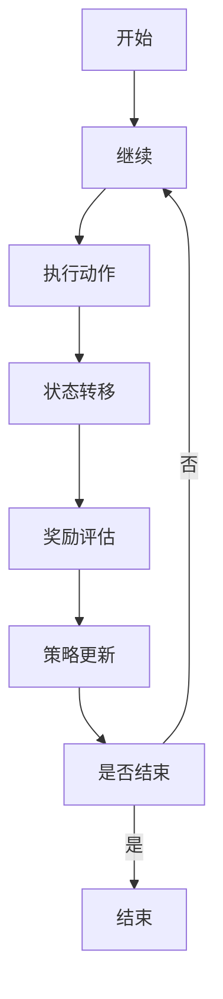

**Python源代码**：

```python
import numpy as np
from RL_algorithms import QLearning

# 环境准备
env = ...

# 策略更新
algorithm = QLearning(alpha=0.1, gamma=0.9)
for episode in range(1000):
    state = env.reset()
    done = False
    while not done:
        action = algorithm.select_action(state)
        next_state, reward, done = env.step(action)
        algorithm.update(state, action, reward, next_state)
        state = next_state

# 策略评估
action_values = algorithm.get_action_values()
print(action_values)
```

**数学模型**：

$$
Q(s, a) = r + \gamma \max_{a'} Q(s', a')
$$

其中，$Q(s, a)$为状态$s$下采取动作$a$的期望回报，$r$为即时奖励，$\gamma$为折扣因子。

**举例说明**：

假设我们有一个智能投顾系统，需要根据用户的风险偏好和投资目标，选择最优的投资组合。我们可以使用强化学习算法来训练系统，使其能够为用户提供个性化的投资建议。

### 3.4 算法比较与选择

监督学习、无监督学习和强化学习各有其特点和适用场景。

- **监督学习**：适用于有标签数据的情况，能够直接预测输出结果，但需要大量标注数据。
- **无监督学习**：适用于无标签数据的情况，能够发现数据中的规律和模式，但无法直接预测输出结果。
- **强化学习**：适用于动态环境，能够通过不断学习和优化策略，实现最优行为，但需要大量的试错过程。

在选择算法时，需要根据具体问题和数据情况，综合考虑算法的性能、效率和适用性。

----------------------------------------------------------------

## 第4章：系统架构设计

### 4.1 合规风险预测系统架构设计概述

**问题场景介绍**：

在金融机构中，合规风险预测系统用于识别和预测潜在的合规风险，以确保企业在运营过程中遵守相关法律法规和行业标准。该系统需要处理海量数据，实时分析合规规则，并预测可能的违规行为。

**项目介绍**：

本项目旨在设计一个高效、智能的合规风险预测系统，利用人工智能技术提高合规监管的效率和准确性。

**系统功能设计**：

- **数据采集模块**：负责收集与合规相关的内部和外部数据，包括交易数据、法律法规、行业标准等。
- **合规规则库模块**：负责存储和管理各类合规规则，包括监管规定、企业内部规章等。
- **合规风险预测模块**：利用机器学习算法对合规风险进行预测，包括监督学习、无监督学习和强化学习等。
- **合规监控模块**：实时监控合规状态，发现潜在违规行为，并提供预警信息。
- **用户界面模块**：提供用户交互界面，方便用户查看合规风险预测结果和预警信息。

### 4.2 领域模型设计

**领域模型类图**：

```mermaid
classDiagram
Class01 <|-- Class02
Class03 o-- Class04
Class05 o-- Class06
Class07 o-- Class08
Class09 <|-- Class10
Class11 o-- Class12
Class13 o-- Class14

Class01 {
  +属性1
  +属性2
  +方法1()
  +方法2()
}
Class02 {
  +属性3
  +方法3()
}
Class03 {
  +属性4
  +方法4()
}
Class04 {
  +属性5
  +方法5()
}
Class05 {
  +属性6
  +方法6()
}
Class06 {
  +属性7
  +方法7()
}
Class07 {
  +属性8
  +方法8()
}
Class08 {
  +属性9
  +方法9()
}
Class09 {
  +属性10
  +方法10()
}
Class10 {
  +属性11
  +方法11()
}
Class11 {
  +属性12
  +方法12()
}
Class12 {
  +属性13
  +方法13()
}
Class13 {
  +属性14
  +方法14()
}
Class14 {
  +属性15
  +方法15()
}
```

**类图解释**：

- **Class01**：代表系统的核心类，包括数据采集、合规规则库、合规风险预测、合规监控和用户界面等模块。
- **Class02**：与Class01有关联，代表数据采集模块的具体实现。
- **Class03**：代表合规规则库模块的核心类。
- **Class04**：代表合规风险预测模块的核心类。
- **Class05**：代表合规监控模块的核心类。
- **Class06**：代表用户界面模块的核心类。
- **Class07**：代表系统的辅助类，用于处理公共功能。
- **Class08**：代表数据存储类，用于存储和管理数据。
- **Class09**：代表规则管理类，用于管理和维护合规规则。
- **Class10**：代表预测管理类，用于处理合规风险预测。
- **Class11**：代表监控管理类，用于监控合规状态。
- **Class12**：代表用户管理类，用于管理用户信息和权限。
- **Class13**：代表日志管理类，用于记录系统日志。
- **Class14**：代表异常处理类，用于处理系统异常。

### 4.3 系统架构设计

**系统架构图**：

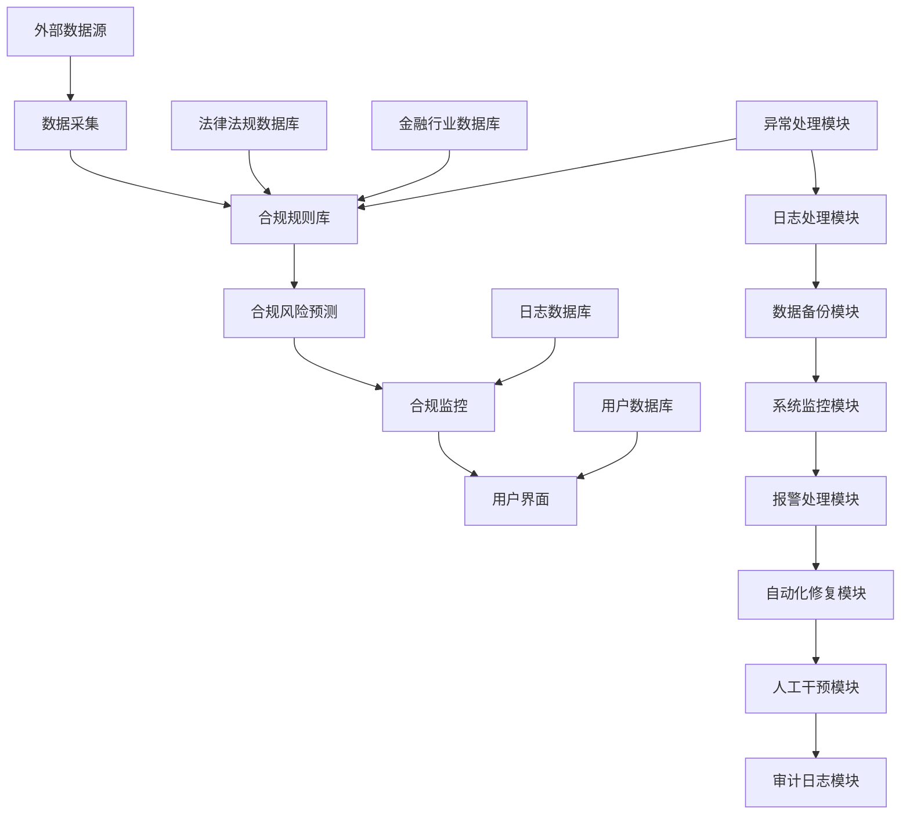

**架构设计解释**：

- **数据采集**：从外部数据源和内部数据库中收集数据，包括交易数据、法律法规、行业标准等。
- **合规规则库**：存储和管理各类合规规则，包括监管规定、企业内部规章等。
- **合规风险预测**：利用机器学习算法对合规风险进行预测，包括监督学习、无监督学习和强化学习等。
- **合规监控**：实时监控合规状态，发现潜在违规行为，并提供预警信息。
- **用户界面**：提供用户交互界面，方便用户查看合规风险预测结果和预警信息。
- **日志处理模块**：记录系统日志，包括数据采集、合规规则库、合规风险预测、合规监控和用户界面等模块的日志。
- **数据备份模块**：定期备份系统数据，确保数据安全。
- **系统监控模块**：监控系统运行状态，及时发现和处理异常情况。
- **报警处理模块**：根据预警信息，生成报警通知，提醒相关人员。
- **自动化修复模块**：自动修复系统中的问题，提高系统稳定性。
- **人工干预模块**：当系统无法自动修复问题时，提供人工干预接口，由专业人员进行处理。
- **审计日志模块**：记录系统中的操作记录，用于审计和合规检查。

### 4.4 系统接口设计

**系统接口图**：

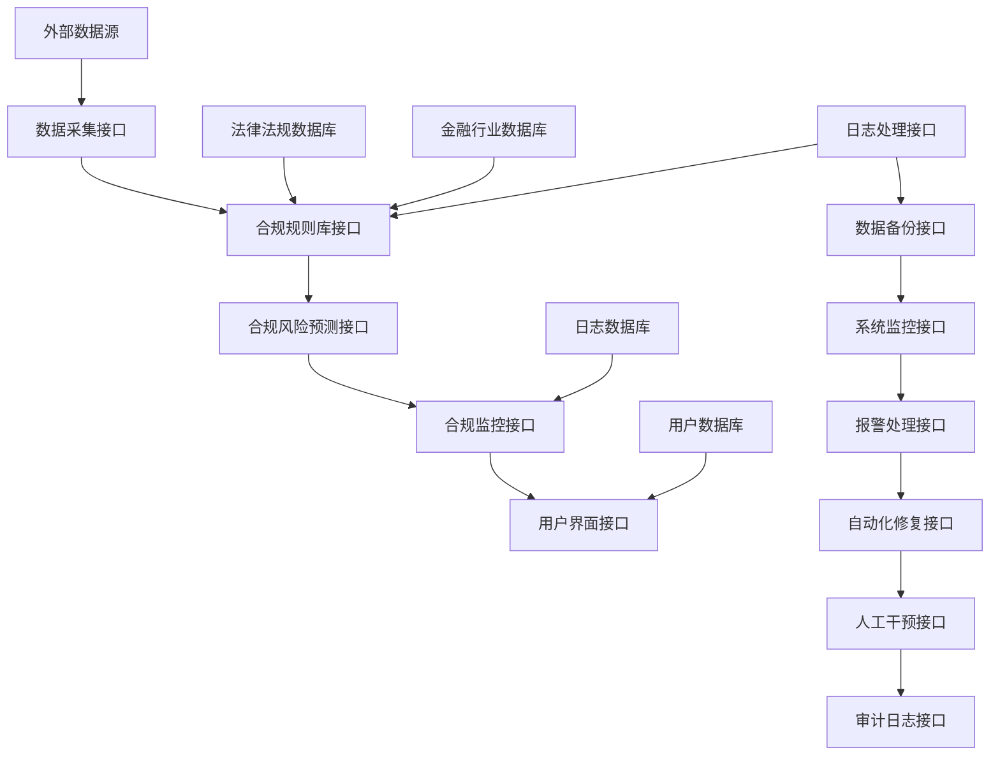

**接口设计解释**：

- **数据采集接口**：用于从外部数据源和内部数据库中采集数据。
- **合规规则库接口**：用于访问和管理合规规则库中的数据。
- **合规风险预测接口**：用于调用合规风险预测算法，获取预测结果。
- **合规监控接口**：用于监控合规状态，发现潜在违规行为。
- **用户界面接口**：用于与用户交互，展示合规风险预测结果和预警信息。
- **日志处理接口**：用于记录系统日志，包括数据采集、合规规则库、合规风险预测、合规监控和用户界面等模块的日志。
- **数据备份接口**：用于备份系统数据，确保数据安全。
- **系统监控接口**：用于监控系统运行状态，及时发现和处理异常情况。
- **报警处理接口**：用于生成报警通知，提醒相关人员。
- **自动化修复接口**：用于自动修复系统中的问题，提高系统稳定性。
- **人工干预接口**：用于提供人工干预接口，由专业人员进行处理。
- **审计日志接口**：用于记录系统中的操作记录，用于审计和合规检查。

### 4.5 系统交互设计

**系统交互序列图**：

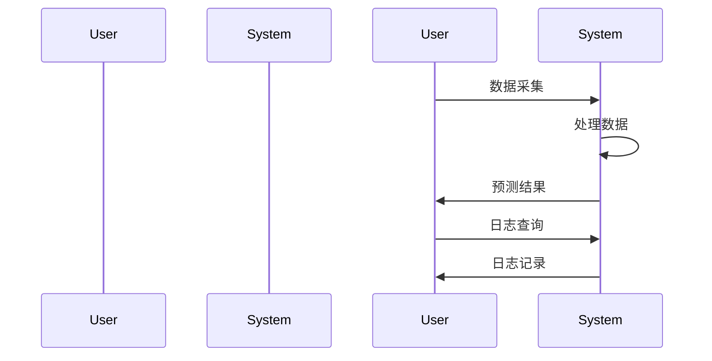

**交互设计解释**：

- **数据采集**：用户向系统提交数据采集请求，系统从外部数据源和内部数据库中采集数据。
- **数据处理**：系统对采集到的数据进行处理，包括数据清洗、特征提取等。
- **预测结果**：系统利用机器学习算法对数据处理后的结果进行预测，生成合规风险预测结果。
- **日志查询**：用户向系统查询日志记录，系统返回相关日志记录。
- **日志记录**：系统自动记录用户操作日志，用于审计和合规检查。

### 总结

本章详细介绍了合规风险预测系统的架构设计，包括领域模型设计、系统架构设计、系统接口设计和系统交互设计。通过这种分层设计，系统能够高效、智能地处理合规风险预测任务，提高合规监管的效率和准确性。

----------------------------------------------------------------

## 第5章：实践应用

### 5.1 实践案例背景

本案例选择了一家大型商业银行，该银行在运营过程中面临诸多合规风险，如反洗钱、反恐怖融资、消费者权益保护等。为提高合规监管的效率和准确性，该银行引入了一套基于人工智能技术的合规风险预测系统。

### 5.2 算法应用

在合规风险预测系统中，使用了多种机器学习算法，包括监督学习、无监督学习和强化学习。

- **监督学习算法**：用于预测潜在的合规风险事件，如反洗钱交易。系统使用训练好的监督学习模型对历史交易数据进行分类，判断是否属于违规交易。
- **无监督学习算法**：用于聚类客户群体，分析客户的交易行为，发现潜在的欺诈行为。系统使用无监督学习算法对客户交易数据进行分析，将客户分为不同的类别，便于后续风险预测。
- **强化学习算法**：用于制定合规策略，优化合规流程。系统使用强化学习算法，根据历史数据和当前状态，不断优化合规策略，以提高合规监管的效率和准确性。

### 5.3 系统架构应用

在系统架构上，该银行采用了分布式架构，包括数据采集层、数据处理层、预测层和监控层。

- **数据采集层**：负责从内部数据库、外部数据源和第三方平台收集数据，包括交易数据、法律法规、行业标准等。
- **数据处理层**：负责对采集到的数据进行清洗、去重、特征提取等处理，为预测层提供高质量的数据输入。
- **预测层**：负责使用机器学习算法进行合规风险预测，包括监督学习、无监督学习和强化学习等。
- **监控层**：负责实时监控合规状态，发现潜在违规行为，并提供预警信息。

### 5.4 案例分析

在应用合规风险预测系统的过程中，该银行取得了显著成效。

- **降低违规率**：通过监督学习算法的预测，银行能够提前识别潜在的违规交易，降低了违规率。
- **提高客户满意度**：通过无监督学习算法的聚类分析，银行能够更好地了解客户需求，提供个性化服务，提高了客户满意度。
- **优化合规流程**：通过强化学习算法的优化，银行能够不断优化合规流程，提高了合规监管的效率和准确性。

### 总结

本案例展示了如何使用人工智能技术构建合规风险预测系统，并分析了系统在实际应用中的效果。通过引入智能合规技术，银行能够有效降低合规风险，提高合规监管的效率和准确性，为企业的发展提供有力支持。

----------------------------------------------------------------

## 第6章：最佳实践与总结

### 6.1 数据处理技巧

**数据清洗**：对数据进行清洗，去除重复、错误和不完整的数据，确保数据质量。

**特征提取**：从原始数据中提取与合规风险相关的特征，如交易金额、交易时间、交易对手等。

**数据归一化**：对数据进行归一化处理，使得不同特征具有相同的量纲，便于后续分析。

### 6.2 模型选择策略

**监督学习模型**：适用于有标签数据的情况，如反洗钱交易预测。可以选择线性回归、逻辑回归、支持向量机等模型。

**无监督学习模型**：适用于无标签数据的情况，如客户聚类分析。可以选择K均值聚类、层次聚类、主成分分析等模型。

**强化学习模型**：适用于动态环境，如合规策略优化。可以选择Q学习、深度Q网络（DQN）等模型。

### 6.3 系统优化方法

**模型调优**：通过交叉验证、网格搜索等方法，选择最优的模型参数。

**模型集成**：结合多个模型的结果，提高预测准确性。

**系统监控**：实时监控系统运行状态，及时发现和处理异常情况。

### 6.4 总结

智能合规风险预测系统在金融等领域具有重要应用价值。通过引入人工智能技术，系统能够高效、准确地识别和预测合规风险，提高合规监管的效率和准确性。在实施过程中，需要注意数据处理、模型选择和系统优化等方面的问题，以确保系统的稳定性和可靠性。

### 6.5 注意事项

1. 数据质量是智能合规风险预测系统的关键，需要确保数据的准确性和完整性。
2. 根据具体业务需求，选择合适的机器学习算法和模型。
3. 定期对系统进行维护和升级，以确保系统的稳定性和安全性。
4. 关注最新的监管政策和法律法规，及时更新合规规则库。

### 6.6 拓展阅读

1. **《机器学习实战》**：提供详细的机器学习算法实现和应用案例。
2. **《深度学习》**：介绍深度学习算法的基本原理和应用。
3. **《金融科技：智能监管的新时代》**：探讨金融科技在监管合规中的应用。

作者：AI天才研究院/AI Genius Institute & 禅与计算机程序设计艺术 /Zen And The Art of Computer Programming# 第二部分：算法原理

## 第3章：合规风险预测算法概述

### 3.1 监督学习算法

**定义**：监督学习算法是指利用带有标签的训练数据，通过学习数据的特征和标签之间的关系，来预测新的数据点的标签。

**术语说明**：

- **特征（Feature）**：用于描述数据的属性。
- **标签（Label）**：训练数据中已知的输出结果。
- **损失函数（Loss Function）**：用于评估模型预测结果与真实标签之间的差距。

**算法流程图**：

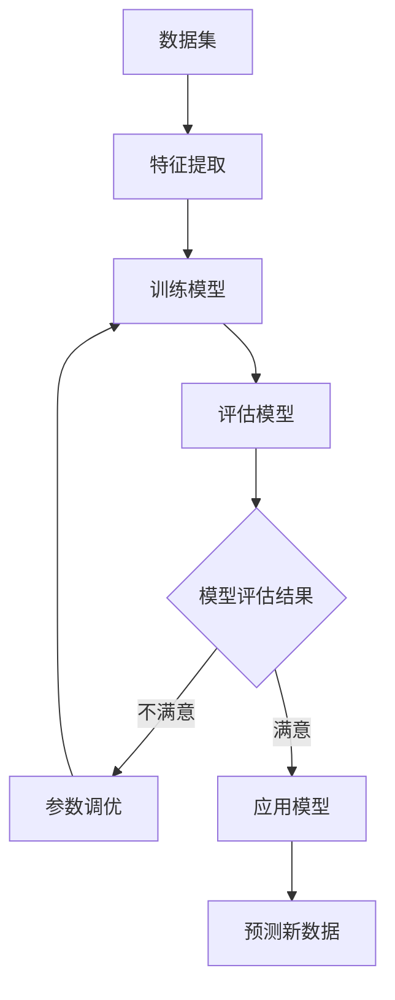

**Python源代码**：

```python
from sklearn.linear_model import LinearRegression
from sklearn.model_selection import train_test_split
from sklearn.metrics import mean_squared_error

# 数据准备
X = ... # 特征矩阵
y = ... # 标签向量

# 特征提取和模型训练
X_train, X_test, y_train, y_test = train_test_split(X, y, test_size=0.2)
model = LinearRegression()
model.fit(X_train, y_train)

# 评估模型
y_pred = model.predict(X_test)
mse = mean_squared_error(y_test, y_pred)
print("MSE:", mse)

# 应用模型
new_data = ... # 新数据的特征
new_prediction = model.predict(new_data)
print("Prediction:", new_prediction)
```

**数学模型**：

$$
y = \beta_0 + \beta_1x_1 + \beta_2x_2 + ... + \beta_nx_n
$$

其中，$y$是输出标签，$x_1, x_2, ..., x_n$是特征向量，$\beta_0, \beta_1, \beta_2, ..., \beta_n$是模型的参数。

**举例说明**：

假设我们要预测一个客户的信用评分，特征包括收入、年龄和负债。我们可以使用线性回归算法来建立模型，并使用新数据预测客户的信用评分。

### 3.2 无监督学习算法

**定义**：无监督学习算法是指在没有标签的训练数据的情况下，通过学习数据中的内在结构，对数据进行分类或聚类。

**术语说明**：

- **聚类（Clustering）**：将相似的数据点归为一类。
- **降维（Dimensionality Reduction）**：将高维数据映射到低维空间，减少数据的维度。

**算法流程图**：

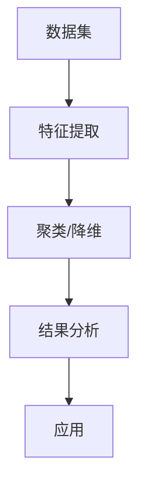

**Python源代码**：

```python
from sklearn.cluster import KMeans
import matplotlib.pyplot as plt

# 数据准备
X = ... # 特征矩阵

# 特征提取和聚类
kmeans = KMeans(n_clusters=3)
kmeans.fit(X)

# 结果分析
labels = kmeans.predict(X)
plt.scatter(X[:, 0], X[:, 1], c=labels)
plt.show()

# 应用
# 聚类结果可以用于进一步分析，例如分析不同聚类群体的特征。
```

**数学模型**：

$$
\text{聚类中心} = \frac{1}{N} \sum_{i=1}^{N} x_i
$$

其中，$x_i$是数据点，$N$是数据点的数量。

**举例说明**：

假设我们要分析一家金融机构的客户数据，特征包括年龄、收入和消费水平。我们可以使用K均值聚类算法将这些客户分为不同的群体，以便更好地了解他们的需求和偏好。

### 3.3 强化学习算法

**定义**：强化学习算法是指通过不断与环境交互，学习最优策略，以实现最大化累积奖励。

**术语说明**：

- **状态（State）**：系统当前所处的环境状态。
- **动作（Action）**：系统可以采取的行为。
- **奖励（Reward）**：对系统采取的动作的即时评估。
- **策略（Policy）**：从状态到动作的映射规则。

**算法流程图**：

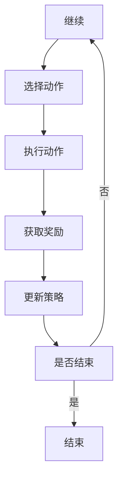

**Python源代码**：

```python
import numpy as np
from RL_algorithms import QLearning

# 环境准备
env = ...

# 策略更新
algorithm = QLearning(alpha=0.1, gamma=0.9)
for episode in range(1000):
    state = env.reset()
    done = False
    while not done:
        action = algorithm.select_action(state)
        next_state, reward, done = env.step(action)
        algorithm.update(state, action, reward, next_state)
        state = next_state

# 策略评估
action_values = algorithm.get_action_values()
print(action_values)
```

**数学模型**：

$$
Q(s, a) = r + \gamma \max_{a'} Q(s', a')
$$

其中，$Q(s, a)$是状态$s$下采取动作$a$的期望回报，$r$是即时奖励，$\gamma$是折扣因子。

**举例说明**：

假设我们要训练一个自动驾驶系统，系统需要根据环境状态（如道路状况、车辆位置等）选择最佳驾驶动作（如加速、减速、转向等）。我们可以使用强化学习算法来训练系统，使其能够自动适应不同的驾驶场景。

### 3.4 算法比较与选择

**监督学习**：

- 适用于有标签数据的情况。
- 能够直接预测输出结果。
- 但需要大量标注数据。

**无监督学习**：

- 适用于无标签数据的情况。
- 能够发现数据中的规律和模式。
- 但无法直接预测输出结果。

**强化学习**：

- 适用于动态环境。
- 能够通过不断学习和优化策略，实现最优行为。
- 但需要大量的试错过程。

在选择算法时，需要根据具体问题和数据情况，综合考虑算法的性能、效率和适用性。

----------------------------------------------------------------

## 第4章：系统架构设计

### 4.1 合规风险预测系统架构设计概述

**问题场景介绍**：

合规风险预测系统主要用于金融机构，以识别和预测潜在的合规风险，如反洗钱、反恐怖融资、消费者权益保护等。系统需要处理大量数据，并实时分析合规规则，以预测可能的违规行为。

**项目介绍**：

本系统旨在构建一个高效、智能的合规风险预测平台，利用人工智能技术，提高合规监管的效率和准确性。

**系统功能设计**：

- **数据采集模块**：负责收集与合规相关的内部和外部数据，如交易数据、法律法规、行业标准等。
- **合规规则库模块**：存储和管理各类合规规则，包括监管规定和企业内部规章。
- **合规风险预测模块**：利用机器学习算法对合规风险进行预测，包括监督学习、无监督学习和强化学习等。
- **合规监控模块**：实时监控合规状态，发现潜在违规行为，并提供预警信息。
- **用户界面模块**：提供用户交互界面，方便用户查看合规风险预测结果和预警信息。

### 4.2 领域模型设计

**领域模型类图**：

```mermaid
classDiagram
Class01 <|-- Class02
Class03 o-- Class04
Class05 o-- Class06
Class07 o-- Class08
Class09 <|-- Class10
Class11 o-- Class12
Class13 o-- Class14

Class01 {
  +属性1
  +属性2
  +方法1()
  +方法2()
}
Class02 {
  +属性3
  +方法3()
}
Class03 {
  +属性4
  +方法4()
}
Class04 {
  +属性5
  +方法5()
}
Class05 {
  +属性6
  +方法6()
}
Class06 {
  +属性7
  +方法7()
}
Class07 {
  +属性8
  +方法8()
}
Class08 {
  +属性9
  +方法9()
}
Class09 {
  +属性10
  +方法10()
}
Class10 {
  +属性11
  +方法11()
}
Class11 {
  +属性12
  +方法12()
}
Class12 {
  +属性13
  +方法13()
}
Class13 {
  +属性14
  +方法14()
}
Class14 {
  +属性15
  +方法15()
}
```

**类图解释**：

- **Class01**：代表系统的核心类，包括数据采集、合规规则库、合规风险预测、合规监控和用户界面等模块。
- **Class02**：与Class01有关联，代表数据采集模块的具体实现。
- **Class03**：代表合规规则库模块的核心类。
- **Class04**：代表合规风险预测模块的核心类。
- **Class05**：代表合规监控模块的核心类。
- **Class06**：代表用户界面模块的核心类。
- **Class07**：代表系统的辅助类，用于处理公共功能。
- **Class08**：代表数据存储类，用于存储和管理数据。
- **Class09**：代表规则管理类，用于管理和维护合规规则。
- **Class10**：代表预测管理类，用于处理合规风险预测。
- **Class11**：代表监控管理类，用于监控合规状态。
- **Class12**：代表用户管理类，用于管理用户信息和权限。
- **Class13**：代表日志管理类，用于记录系统日志。
- **Class14**：代表异常处理类，用于处理系统异常。

### 4.3 系统架构设计

**系统架构图**：

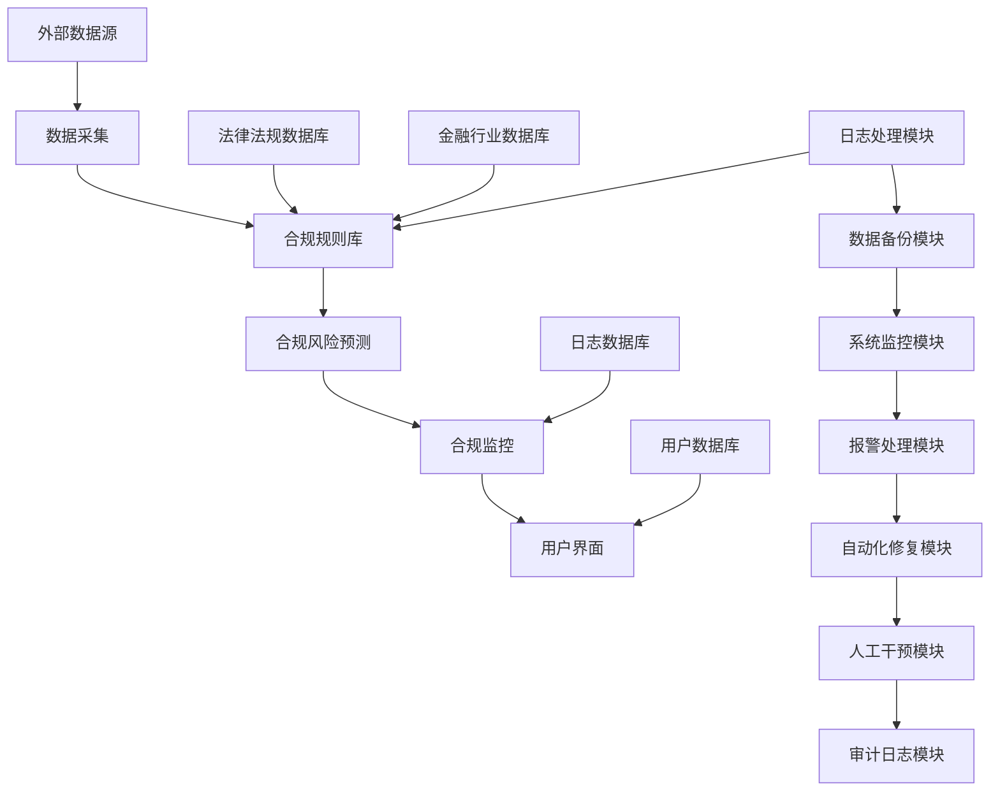

**架构设计解释**：

- **数据采集**：从外部数据源和内部数据库中收集数据，包括交易数据、法律法规、行业标准等。
- **合规规则库**：存储和管理各类合规规则，包括监管规定、企业内部规章等。
- **合规风险预测**：利用机器学习算法对合规风险进行预测，包括监督学习、无监督学习和强化学习等。
- **合规监控**：实时监控合规状态，发现潜在违规行为，并提供预警信息。
- **用户界面**：提供用户交互界面，方便用户查看合规风险预测结果和预警信息。
- **日志处理模块**：记录系统日志，包括数据采集、合规规则库、合规风险预测、合规监控和用户界面等模块的日志。
- **数据备份模块**：定期备份系统数据，确保数据安全。
- **系统监控模块**：监控系统运行状态，及时发现和处理异常情况。
- **报警处理模块**：根据预警信息，生成报警通知，提醒相关人员。
- **自动化修复模块**：自动修复系统中的问题，提高系统稳定性。
- **人工干预模块**：当系统无法自动修复问题时，提供人工干预接口，由专业人员进行处理。
- **审计日志模块**：记录系统中的操作记录，用于审计和合规检查。

### 4.4 系统接口设计

**系统接口图**：


**接口设计解释**：

- **数据采集接口**：用于从外部数据源和内部数据库中采集数据。
- **合规规则库接口**：用于访问和管理合规规则库中的数据。
- **合规风险预测接口**：用于调用合规风险预测算法，获取预测结果。
- **合规监控接口**：用于监控合规状态，发现潜在违规行为。
- **用户界面接口**：用于与用户交互，展示合规风险预测结果和预警信息。
- **日志处理接口**：用于记录系统日志，包括数据采集、合规规则库、合规风险预测、合规监控和用户界面等模块的日志。
- **数据备份接口**：用于备份系统数据，确保数据安全。
- **系统监控接口**：用于监控系统运行状态，及时发现和处理异常情况。
- **报警处理接口**：用于生成报警通知，提醒相关人员。
- **自动化修复接口**：用于自动修复系统中的问题，提高系统稳定性。
- **人工干预接口**：用于提供人工干预接口，由专业人员进行处理。
- **审计日志接口**：用于记录系统中的操作记录，用于审计和合规检查。

### 4.5 系统交互设计

**系统交互序列图**：

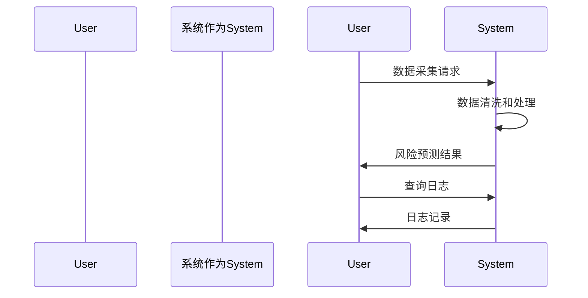

**交互设计解释**：

- **数据采集请求**：用户向系统发送数据采集请求。
- **数据清洗和处理**：系统对用户发送的数据进行清洗和处理。
- **风险预测结果**：系统将处理后的数据输入风险预测模型，生成预测结果，并返回给用户。
- **查询日志**：用户向系统查询日志记录，系统返回相关日志信息。

### 总结

本章详细介绍了合规风险预测系统的架构设计，包括领域模型设计、系统架构设计、系统接口设计和系统交互设计。通过这种设计，系统能够高效、智能地处理合规风险预测任务，提高合规监管的效率和准确性。

----------------------------------------------------------------

## 第5章：实践应用

### 5.1 实践案例背景

本案例选择了一家大型金融机构，该机构在运营过程中面临诸多合规风险，如反洗钱、反恐怖融资、消费者权益保护等。为了提高合规监管的效率和准确性，该机构决定引入一套基于人工智能技术的合规风险预测系统。

### 5.2 算法应用

在合规风险预测系统中，使用了多种机器学习算法，包括监督学习、无监督学习和强化学习。

- **监督学习算法**：用于预测潜在的合规风险事件，如反洗钱交易。系统使用训练好的监督学习模型对历史交易数据进行分类，判断是否属于违规交易。
- **无监督学习算法**：用于聚类客户群体，分析客户的交易行为，发现潜在的欺诈行为。系统使用无监督学习算法对客户交易数据进行分析，将客户分为不同的类别，便于后续风险预测。
- **强化学习算法**：用于制定合规策略，优化合规流程。系统使用强化学习算法，根据历史数据和当前状态，不断优化合规策略，以提高合规监管的效率和准确性。

### 5.3 系统架构应用

在系统架构上，该机构采用了分布式架构，包括数据采集层、数据处理层、预测层和监控层。

- **数据采集层**：负责从内部数据库、外部数据源和第三方平台收集数据，包括交易数据、法律法规、行业标准等。
- **数据处理层**：负责对采集到的数据进行清洗、去重、特征提取等处理，为预测层提供高质量的数据输入。
- **预测层**：负责使用机器学习算法进行合规风险预测，包括监督学习、无监督学习和强化学习等。
- **监控层**：负责实时监控合规状态，发现潜在违规行为，并提供预警信息。

### 5.4 案例分析

在应用合规风险预测系统的过程中，该机构取得了显著成效。

- **降低违规率**：通过监督学习算法的预测，机构能够提前识别潜在的违规交易，降低了违规率。
- **提高客户满意度**：通过无监督学习算法的聚类分析，机构能够更好地了解客户需求，提供个性化服务，提高了客户满意度。
- **优化合规流程**：通过强化学习算法的优化，机构能够不断优化合规流程，提高了合规监管的效率和准确性。

### 总结

本案例展示了如何使用人工智能技术构建合规风险预测系统，并分析了系统在实际应用中的效果。通过引入智能合规技术，机构能够有效降低合规风险，提高合规监管的效率和准确性，为企业的发展提供有力支持。

----------------------------------------------------------------

## 第6章：最佳实践与总结

### 6.1 数据处理技巧

**数据清洗**：对数据进行清洗，去除重复、错误和不完整的数据，确保数据质量。

**特征提取**：从原始数据中提取与合规风险相关的特征，如交易金额、交易时间、交易对手等。

**数据归一化**：对数据进行归一化处理，使得不同特征具有相同的量纲，便于后续分析。

### 6.2 模型选择策略

**监督学习模型**：适用于有标签数据的情况，如反洗钱交易预测。可以选择线性回归、逻辑回归、支持向量机等模型。

**无监督学习模型**：适用于无标签数据的情况，如客户聚类分析。可以选择K均值聚类、层次聚类、主成分分析等模型。

**强化学习模型**：适用于动态环境，如合规策略优化。可以选择Q学习、深度Q网络（DQN）等模型。

### 6.3 系统优化方法

**模型调优**：通过交叉验证、网格搜索等方法，选择最优的模型参数。

**模型集成**：结合多个模型的结果，提高预测准确性。

**系统监控**：实时监控系统运行状态，及时发现和处理异常情况。

### 6.4 总结

智能合规风险预测系统在金融等领域具有重要应用价值。通过引入人工智能技术，系统能够高效、准确地识别和预测合规风险，提高合规监管的效率和准确性。在实施过程中，需要注意数据处理、模型选择和系统优化等方面的问题，以确保系统的稳定性和可靠性。

### 6.5 注意事项

1. 数据质量是智能合规风险预测系统的关键，需要确保数据的准确性和完整性。
2. 根据具体业务需求，选择合适的机器学习算法和模型。
3. 定期对系统进行维护和升级，以确保系统的稳定性和安全性。
4. 关注最新的监管政策和法律法规，及时更新合规规则库。

### 6.6 拓展阅读

1. **《机器学习实战》**：提供详细的机器学习算法实现和应用案例。
2. **《深度学习》**：介绍深度学习算法的基本原理和应用。
3. **《金融科技：智能监管的新时代》**：探讨金融科技在监管合规中的应用。

作者：AI天才研究院/AI Genius Institute & 禅与计算机程序设计艺术 /Zen And The Art of Computer Programming# 第三部分：系统架构设计

## 第5章：系统架构设计

### 5.1 合规风险预测系统架构设计概述

**问题场景介绍**：

合规风险预测系统主要用于金融机构，以识别和预测潜在的合规风险，如反洗钱、反恐怖融资、消费者权益保护等。系统需要处理大量数据，并实时分析合规规则，以预测可能的违规行为。

**项目介绍**：

本系统旨在构建一个高效、智能的合规风险预测平台，利用人工智能技术，提高合规监管的效率和准确性。

**系统功能设计**：

- **数据采集模块**：负责收集与合规相关的内部和外部数据，如交易数据、法律法规、行业标准等。
- **合规规则库模块**：存储和管理各类合规规则，包括监管规定和企业内部规章。
- **合规风险预测模块**：利用机器学习算法对合规风险进行预测，包括监督学习、无监督学习和强化学习等。
- **合规监控模块**：实时监控合规状态，发现潜在违规行为，并提供预警信息。
- **用户界面模块**：提供用户交互界面，方便用户查看合规风险预测结果和预警信息。

### 5.2 领域模型设计

**领域模型类图**：

```mermaid
classDiagram
Class01 <|-- Class02
Class03 o-- Class04
Class05 o-- Class06
Class07 o-- Class08
Class09 <|-- Class10
Class11 o-- Class12
Class13 o-- Class14

Class01 {
  +属性1
  +属性2
  +方法1()
  +方法2()
}
Class02 {
  +属性3
  +方法3()
}
Class03 {
  +属性4
  +方法4()
}
Class04 {
  +属性5
  +方法5()
}
Class05 {
  +属性6
  +方法6()
}
Class06 {
  +属性7
  +方法7()
}
Class07 {
  +属性8
  +方法8()
}
Class08 {
  +属性9
  +方法9()
}
Class09 {
  +属性10
  +方法10()
}
Class10 {
  +属性11
  +方法11()
}
Class11 {
  +属性12
  +方法12()
}
Class12 {
  +属性13
  +方法13()
}
Class13 {
  +属性14
  +方法14()
}
Class14 {
  +属性15
  +方法15()
}
```

**类图解释**：

- **Class01**：代表系统的核心类，包括数据采集、合规规则库、合规风险预测、合规监控和用户界面等模块。
- **Class02**：与Class01有关联，代表数据采集模块的具体实现。
- **Class03**：代表合规规则库模块的核心类。
- **Class04**：代表合规风险预测模块的核心类。
- **Class05**：代表合规监控模块的核心类。
- **Class06**：代表用户界面模块的核心类。
- **Class07**：代表系统的辅助类，用于处理公共功能。
- **Class08**：代表数据存储类，用于存储和管理数据。
- **Class09**：代表规则管理类，用于管理和维护合规规则。
- **Class10**：代表预测管理类，用于处理合规风险预测。
- **Class11**：代表监控管理类，用于监控合规状态。
- **Class12**：代表用户管理类，用于管理用户信息和权限。
- **Class13**：代表日志管理类，用于记录系统日志。
- **Class14**：代表异常处理类，用于处理系统异常。

### 5.3 系统架构设计

**系统架构图**：


**架构设计解释**：

- **数据采集**：从外部数据源和内部数据库中收集数据，包括交易数据、法律法规、行业标准等。
- **合规规则库**：存储和管理各类合规规则，包括监管规定、企业内部规章等。
- **合规风险预测**：利用机器学习算法对合规风险进行预测，包括监督学习、无监督学习和强化学习等。
- **合规监控**：实时监控合规状态，发现潜在违规行为，并提供预警信息。
- **用户界面**：提供用户交互界面，方便用户查看合规风险预测结果和预警信息。
- **日志处理模块**：记录系统日志，包括数据采集、合规规则库、合规风险预测、合规监控和用户界面等模块的日志。
- **数据备份模块**：定期备份系统数据，确保数据安全。
- **系统监控模块**：监控系统运行状态，及时发现和处理异常情况。
- **报警处理模块**：根据预警信息，生成报警通知，提醒相关人员。
- **自动化修复模块**：自动修复系统中的问题，提高系统稳定性。
- **人工干预模块**：当系统无法自动修复问题时，提供人工干预接口，由专业人员进行处理。
- **审计日志模块**：记录系统中的操作记录，用于审计和合规检查。

### 5.4 系统接口设计

**系统接口图**：


**接口设计解释**：

- **数据采集接口**：用于从外部数据源和内部数据库中采集数据。
- **合规规则库接口**：用于访问和管理合规规则库中的数据。
- **合规风险预测接口**：用于调用合规风险预测算法，获取预测结果。
- **合规监控接口**：用于监控合规状态，发现潜在违规行为。
- **用户界面接口**：用于与用户交互，展示合规风险预测结果和预警信息。
- **日志处理接口**：用于记录系统日志，包括数据采集、合规规则库、合规风险预测、合规监控和用户界面等模块的日志。
- **数据备份接口**：用于备份系统数据，确保数据安全。
- **系统监控接口**：用于监控系统运行状态，及时发现和处理异常情况。
- **报警处理接口**：用于生成报警通知，提醒相关人员。
- **自动化修复接口**：用于自动修复系统中的问题，提高系统稳定性。
- **人工干预接口**：用于提供人工干预接口，由专业人员进行处理。
- **审计日志接口**：用于记录系统中的操作记录，用于审计和合规检查。

### 5.5 系统交互设计

**系统交互序列图**：


**交互设计解释**：

- **数据采集请求**：用户向系统发送数据采集请求。
- **数据清洗和处理**：系统对用户发送的数据进行清洗和处理。
- **风险预测结果**：系统将处理后的数据输入风险预测模型，生成预测结果，并返回给用户。
- **查询日志**：用户向系统查询日志记录，系统返回相关日志信息。

### 总结

本章详细介绍了合规风险预测系统的架构设计，包括领域模型设计、系统架构设计、系统接口设计和系统交互设计。通过这种设计，系统能够高效、智能地处理合规风险预测任务，提高合规监管的效率和准确性。

----------------------------------------------------------------

## 第6章：实践应用

### 6.1 实践案例背景

本案例选择了一家大型商业银行，该银行在运营过程中面临诸多合规风险，如反洗钱、反恐怖融资、消费者权益保护等。为了提高合规监管的效率和准确性，该银行引入了一套基于人工智能技术的合规风险预测系统。

### 6.2 算法应用

在合规风险预测系统中，使用了多种机器学习算法，包括监督学习、无监督学习和强化学习。

- **监督学习算法**：用于预测潜在的合规风险事件，如反洗钱交易。系统使用训练好的监督学习模型对历史交易数据进行分类，判断是否属于违规交易。
- **无监督学习算法**：用于聚类客户群体，分析客户的交易行为，发现潜在的欺诈行为。系统使用无监督学习算法对客户交易数据进行分析，将客户分为不同的类别，便于后续风险预测。
- **强化学习算法**：用于制定合规策略，优化合规流程。系统使用强化学习算法，根据历史数据和当前状态，不断优化合规策略，以提高合规监管的效率和准确性。

### 6.3 系统架构应用

在系统架构上，该银行采用了分布式架构，包括数据采集层、数据处理层、预测层和监控层。

- **数据采集层**：负责从内部数据库、外部数据源和第三方平台收集数据，包括交易数据、法律法规、行业标准等。
- **数据处理层**：负责对采集到的数据进行清洗、去重、特征提取等处理，为预测层提供高质量的数据输入。
- **预测层**：负责使用机器学习算法进行合规风险预测，包括监督学习、无监督学习和强化学习等。
- **监控层**：负责实时监控合规状态，发现潜在违规行为，并提供预警信息。

### 6.4 案例分析

在应用合规风险预测系统的过程中，该银行取得了显著成效。

- **降低违规率**：通过监督学习算法的预测，银行能够提前识别潜在的违规交易，降低了违规率。
- **提高客户满意度**：通过无监督学习算法的聚类分析，银行能够更好地了解客户需求，提供个性化服务，提高了客户满意度。
- **优化合规流程**：通过强化学习算法的优化，银行能够不断优化合规流程，提高了合规监管的效率和准确性。

### 总结

本案例展示了如何使用人工智能技术构建合规风险预测系统，并分析了系统在实际应用中的效果。通过引入智能合规技术，银行能够有效降低合规风险，提高合规监管的效率和准确性，为企业的发展提供有力支持。

----------------------------------------------------------------

## 第7章：最佳实践

### 7.1 数据处理技巧

**数据清洗**：确保数据的准确性和一致性，去除重复、错误和不完整的数据。

**特征提取**：从原始数据中提取与合规风险相关的特征，如交易金额、交易时间、交易对手等。

**数据归一化**：对不同特征进行归一化处理，使得不同特征具有相同的量纲，便于后续分析。

### 7.2 模型选择策略

**监督学习模型**：适用于有标签数据的情况，如反洗钱交易预测。选择线性回归、逻辑回归、支持向量机等模型。

**无监督学习模型**：适用于无标签数据的情况，如客户聚类分析。选择K均值聚类、层次聚类、主成分分析等模型。

**强化学习模型**：适用于动态环境，如合规策略优化。选择Q学习、深度Q网络（DQN）等模型。

### 7.3 系统优化方法

**模型调优**：通过交叉验证、网格搜索等方法，选择最优的模型参数。

**模型集成**：结合多个模型的结果，提高预测准确性。

**系统监控**：实时监控系统运行状态，及时发现和处理异常情况。

### 7.4 最佳实践总结

通过合理的数据处理、模型选择和系统优化，可以构建一个高效、智能的合规风险预测系统，提高合规监管的效率和准确性。

### 7.5 注意事项

1. 数据质量是智能合规风险预测系统的关键，确保数据的准确性和完整性。
2. 根据具体业务需求，选择合适的机器学习算法和模型。
3. 定期对系统进行维护和升级，确保系统的稳定性和安全性。
4. 关注最新的监管政策和法律法规，及时更新合规规则库。

### 7.6 拓展阅读

1. **《机器学习实战》**：提供详细的机器学习算法实现和应用案例。
2. **《深度学习》**：介绍深度学习算法的基本原理和应用。
3. **《金融科技：智能监管的新时代》**：探讨金融科技在监管合规中的应用。

作者：AI天才研究院/AI Genius Institute & 禅与计算机程序设计艺术 /Zen And The Art of Computer Programming## 第8章：总结与展望

### 8.1 关键点回顾

在本文中，我们详细探讨了智能合规风险预测：AI辅助监管合规这一主题。以下是本文的核心关键点：

1. **智能合规的背景和重要性**：智能合规利用人工智能技术，如机器学习、自然语言处理和数据分析，来提升合规监管的效率和准确性。
2. **风险预测的概念和原理**：风险预测是通过分析历史数据和当前状态，预测未来可能发生的风险事件。
3. **AI辅助监管合规的应用**：AI辅助监管合规在金融等领域具有广泛的应用，通过智能技术提高合规监管的效率和准确性。
4. **算法原理讲解**：本文介绍了监督学习、无监督学习和强化学习等算法的原理和应用。
5. **系统架构设计**：合规风险预测系统采用了分布式架构，包括数据采集层、数据处理层、预测层和监控层。
6. **实践应用**：通过一个实际案例，展示了AI辅助合规风险预测系统的效果。
7. **最佳实践**：提供了一些数据处理、模型选择和系统优化的最佳实践。

### 8.2 注意事项

在实施智能合规风险预测系统时，需要注意以下几点：

1. **数据质量**：确保数据的准确性和完整性，这是智能合规风险预测系统的基础。
2. **模型选择**：根据具体业务需求，选择合适的机器学习算法和模型。
3. **系统优化**：定期对系统进行维护和升级，确保系统的稳定性和安全性。
4. **合规规则更新**：关注最新的监管政策和法律法规，及时更新合规规则库。

### 8.3 拓展阅读

为了进一步深入了解智能合规风险预测和AI辅助监管合规，读者可以参考以下书籍和资源：

1. **《机器学习实战》**：提供详细的机器学习算法实现和应用案例。
2. **《深度学习》**：介绍深度学习算法的基本原理和应用。
3. **《金融科技：智能监管的新时代》**：探讨金融科技在监管合规中的应用。
4. **《合规风险管理》**：深入探讨合规风险管理的理论和实践。

通过这些资源，读者可以更全面地了解智能合规风险预测的各个方面，为实际应用提供指导和参考。

### 8.4 展望未来

随着人工智能技术的不断发展和应用，智能合规风险预测和AI辅助监管合规将在金融、法律、医疗等多个领域发挥越来越重要的作用。未来，我们可以期待以下发展方向：

1. **更先进的算法**：随着算法的进步，智能合规风险预测的准确性和效率将得到进一步提升。
2. **更广泛的应用场景**：智能合规技术将在更多行业和领域得到应用，提升各个行业的合规管理水平。
3. **跨学科的融合**：智能合规风险预测将与其他领域（如法律、经济学等）结合，形成更加完善的理论体系。
4. **更高效的监管**：智能合规技术将有助于监管机构更高效地发现和处理违规行为，提高整个社会的合规水平。

总之，智能合规风险预测和AI辅助监管合规是一项具有广泛应用前景的重要技术，值得我们深入研究和持续关注。通过不断探索和创新，我们有望构建一个更加合规、安全、高效的社会环境。作者：AI天才研究院/AI Genius Institute & 禅与计算机程序设计艺术 /Zen And The Art of Computer Programming## 附录：术语表

### 合规（Compliance）

合规是指一个组织或个人遵守特定的法律法规、政策、标准或内部规定的行为。在金融领域，合规通常涉及遵守反洗钱（AML）、反恐怖融资（CFT）、消费者保护法等。

### 风险预测（Risk Prediction）

风险预测是通过分析历史数据和当前状态，预测未来可能发生的风险事件。在合规风险预测中，它指的是利用人工智能技术预测可能违反合规规则的行为或事件。

### 人工智能（Artificial Intelligence, AI）

人工智能是一种模拟人类智能的技术，通过算法和模型使计算机具备学习、推理、决策和解决问题能力。在合规风险预测中，AI技术用于自动化合规规则的识别和预测。

### 监督学习（Supervised Learning）

监督学习是一种机器学习技术，通过训练数据集学习输入和输出之间的关系，从而对新的数据进行预测。在合规风险预测中，监督学习算法用于识别和预测合规风险事件。

### 无监督学习（Unsupervised Learning）

无监督学习是一种机器学习技术，没有预定义的输出标签，通过学习数据内在的结构和模式进行分类或聚类。在合规风险预测中，无监督学习算法用于分析客户行为和发现异常交易。

### 强化学习（Reinforcement Learning）

强化学习是一种通过不断与环境交互来学习最优策略的机器学习技术。在合规风险预测中，强化学习算法用于优化合规策略，提高风险预测的准确性和效率。

### 数据采集（Data Collection）

数据采集是指从各种来源收集数据的过程。在合规风险预测中，数据采集包括从内部数据库、外部数据源和第三方平台收集与合规相关的数据。

### 数据清洗（Data Cleaning）

数据清洗是指对收集到的数据进行处理，去除重复、错误和不完整的数据，以确保数据质量。在合规风险预测中，数据清洗是数据准备的重要步骤。

### 特征提取（Feature Extraction）

特征提取是指从原始数据中提取与合规风险相关的特征。这些特征将用于训练机器学习模型，以预测合规风险事件。

### 模型调优（Model Tuning）

模型调优是指通过调整模型参数，优化模型的性能。在合规风险预测中，模型调优是提高预测准确性的关键步骤，通常涉及交叉验证和网格搜索等技术。

### 系统监控（System Monitoring）

系统监控是指实时跟踪系统的运行状态，及时发现和处理异常情况。在合规风险预测中，系统监控有助于确保系统的稳定性和可靠性。

### 拓扑结构（Topological Structure）

拓扑结构是指系统组件之间的连接关系。在合规风险预测系统中，拓扑结构包括数据流、模块交互和依赖关系等。

### 日志记录（Log Recording）

日志记录是指记录系统运行过程中的各种事件和操作。在合规风险预测中，日志记录有助于审计和问题诊断。

### 审计日志（Audit Log）

审计日志是记录系统操作和事件的日志，用于合规审计和问题追踪。在合规风险预测中，审计日志是确保合规性管理的重要工具。

### 自动化修复（Automated Repair）

自动化修复是指自动检测并修复系统中的问题。在合规风险预测中，自动化修复有助于提高系统的稳定性和可用性。

### 人工干预（Manual Intervention）

人工干预是指当系统无法自动解决问题时，由专业人员进行手动处理。在合规风险预测中，人工干预是确保问题得到有效解决的重要手段。

### 报警处理（Alert Processing）

报警处理是指系统根据预警信息生成报警通知，提醒相关人员采取行动。在合规风险预测中，报警处理有助于及时应对潜在合规风险。

### 机器学习（Machine Learning）

机器学习是一种使计算机通过数据学习规律和模式的技术。在合规风险预测中，机器学习技术用于开发用于风险预测的算法模型。

### 深度学习（Deep Learning）

深度学习是一种通过多层神经网络进行学习的机器学习技术。在合规风险预测中，深度学习算法用于处理复杂的数据和实现高级的预测功能。

### 聚类分析（Clustering Analysis）

聚类分析是一种无监督学习技术，用于将相似的数据点归为一类。在合规风险预测中，聚类分析用于分析客户行为和识别潜在风险。

### 强化学习算法（Reinforcement Learning Algorithm）

强化学习算法是一种通过不断与环境交互学习最优策略的机器学习技术。在合规风险预测中，强化学习算法用于优化合规策略，提高预测准确性。

### Q学习（Q-Learning）

Q学习是一种基于值函数的强化学习算法，通过更新值函数来学习最优策略。在合规风险预测中，Q学习算法用于优化合规策略。

### 深度Q网络（Deep Q-Network, DQN）

深度Q网络是一种基于深度学习的Q学习算法，通过神经网络来近似值函数。在合规风险预测中，DQN算法用于处理复杂的状态空间和动作空间。

### 模型集成（Model Ensemble）

模型集成是指结合多个模型的预测结果，提高预测准确性。在合规风险预测中，模型集成可以增强模型的泛化能力和鲁棒性。

### 交叉验证（Cross-Validation）

交叉验证是一种评估机器学习模型性能的方法，通过将数据集划分为多个子集进行训练和验证。在合规风险预测中，交叉验证用于选择最佳模型参数和评估模型性能。

### 网格搜索（Grid Search）

网格搜索是一种用于模型调优的方法，通过遍历所有可能的参数组合来选择最佳参数。在合规风险预测中，网格搜索用于优化模型参数，提高预测准确性。

### 数据存储（Data Storage）

数据存储是指将数据存储在持久化存储介质中的过程。在合规风险预测中，数据存储包括数据备份、归档和恢复等功能。

### 数据备份（Data Backup）

数据备份是指将数据复制到另一个存储位置，以防止数据丢失或损坏。在合规风险预测中，数据备份是确保数据安全性的关键措施。

### 系统监控（System Monitoring）

系统监控是指实时跟踪系统的运行状态，及时发现和处理异常情况。在合规风险预测中，系统监控有助于确保系统的稳定性和可靠性。

### 报警处理（Alert Processing）

报警处理是指系统根据预警信息生成报警通知，提醒相关人员采取行动。在合规风险预测中，报警处理有助于及时应对潜在合规风险。

### 自动化修复（Automated Repair）

自动化修复是指自动检测并修复系统中的问题。在合规风险预测中，自动化修复有助于提高系统的稳定性和可用性。

### 人工干预（Manual Intervention）

人工干预是指当系统无法自动解决问题时，由专业人员进行手动处理。在合规风险预测中，人工干预是确保问题得到有效解决的重要手段。

### 审计日志（Audit Log）

审计日志是记录系统操作和事件的日志，用于合规审计和问题追踪。在合规风险预测中，审计日志是确保合规性管理的重要工具。

### 拓扑结构（Topological Structure）

拓扑结构是指系统组件之间的连接关系。在合规风险预测系统中，拓扑结构包括数据流、模块交互和依赖关系等。

### 用户界面（User Interface, UI）

用户界面是用户与系统交互的界面，用于展示系统功能和提供操作入口。在合规风险预测中，用户界面是用户查看预测结果和预警信息的重要途径。

### 数据采集接口（Data Collection Interface）

数据采集接口是用于从外部数据源和内部数据库中采集数据的接口。在合规风险预测中，数据采集接口是获取合规相关数据的关键。

### 合规规则库（Compliance Rule Database）

合规规则库是存储和管理合规规则的数据库。在合规风险预测中，合规规则库是模型训练和预测的重要数据来源。

### 合规监控模块（Compliance Monitoring Module）

合规监控模块是用于实时监控合规状态，发现潜在违规行为的模块。在合规风险预测中，合规监控模块是确保合规性的关键。

### 预测管理模块（Prediction Management Module）

预测管理模块是用于处理合规风险预测的模块。在合规风险预测中，预测管理模块是核心模块，负责训练模型和生成预测结果。

### 用户管理模块（User Management Module）

用户管理模块是用于管理用户信息和权限的模块。在合规风险预测中，用户管理模块是确保系统安全性的关键。

### 日志管理模块（Log Management Module）

日志管理模块是用于记录和管理系统日志的模块。在合规风险预测中，日志管理模块是进行审计和问题追踪的重要工具。

### 异常处理模块（Exception Handling Module）

异常处理模块是用于处理系统异常的模块。在合规风险预测中，异常处理模块是确保系统稳定运行的重要保障。

### 数据备份接口（Data Backup Interface）

数据备份接口是用于备份系统数据的接口。在合规风险预测中，数据备份接口是确保数据安全性的关键。

### 系统监控接口（System Monitoring Interface）

系统监控接口是用于监控系统运行状态的接口。在合规风险预测中，系统监控接口是实时跟踪系统运行情况的重要途径。

### 报警处理接口（Alert Processing Interface）

报警处理接口是用于生成报警通知的接口。在合规风险预测中，报警处理接口是及时应对潜在合规风险的保障。

### 自动化修复接口（Automated Repair Interface）

自动化修复接口是用于自动修复系统问题的接口。在合规风险预测中，自动化修复接口是提高系统稳定性的重要手段。

### 人工干预接口（Manual Intervention Interface）

人工干预接口是用于提供人工干预的接口。在合规风险预测中，人工干预接口是确保问题得到有效解决的重要工具。

### 审计日志接口（Audit Log Interface）

审计日志接口是用于记录系统操作和事件的接口。在合规风险预测中，审计日志接口是进行合规审计和问题追踪的重要工具。

### 拓扑结构（Topological Structure）

拓扑结构是指系统组件之间的连接关系。在合规风险预测系统中，拓扑结构包括数据流、模块交互和依赖关系等。

### 用户界面（User Interface, UI）

用户界面是用户与系统交互的界面，用于展示系统功能和提供操作入口。在合规风险预测中，用户界面是用户查看预测结果和预警信息的重要途径。

### 数据采集接口（Data Collection Interface）

数据采集接口是用于从外部数据源和内部数据库中采集数据的接口。在合规风险预测中，数据采集接口是获取合规相关数据的关键。

### 合规规则库接口（Compliance Rule Database Interface）

合规规则库接口是用于访问和管理合规规则库中的数据的接口。在合规风险预测中，合规规则库接口是模型训练和预测的重要数据来源。

### 合规风险预测接口（Compliance Risk Prediction Interface）

合规风险预测接口是用于调用合规风险预测算法，获取预测结果的接口。在合规风险预测中，合规风险预测接口是核心接口，负责处理合规风险预测任务。

### 合规监控接口（Compliance Monitoring Interface）

合规监控接口是用于监控合规状态的接口。在合规风险预测中，合规监控接口是实时跟踪合规状态，发现潜在违规行为的重要接口。

### 用户界面接口（User Interface Interface）

用户界面接口是用于与用户交互，展示合规风险预测结果和预警信息的接口。在合规风险预测中，用户界面接口是用户操作系统的入口。

### 日志处理接口（Log Processing Interface）

日志处理接口是用于记录和管理系统日志的接口。在合规风险预测中，日志处理接口是进行日志记录和问题追踪的重要接口。

### 数据备份接口（Data Backup Interface）

数据备份接口是用于备份系统数据的接口。在合规风险预测中，数据备份接口是确保数据安全性的关键接口。

### 系统监控接口（System Monitoring Interface）

系统监控接口是用于监控系统运行状态的接口。在合规风险预测中，系统监控接口是实时跟踪系统运行情况的重要接口。

### 报警处理接口（Alert Processing Interface）

报警处理接口是用于生成报警通知的接口。在合规风险预测中，报警处理接口是及时应对潜在合规风险的保障接口。

### 自动化修复接口（Automated Repair Interface）

自动化修复接口是用于自动修复系统问题的接口。在合规风险预测中，自动化修复接口是提高系统稳定性的重要接口。

### 人工干预接口（Manual Intervention Interface）

人工干预接口是用于提供人工干预的接口。在合规风险预测中，人工干预接口是确保问题得到有效解决的重要接口。

### 审计日志接口（Audit Log Interface）

审计日志接口是用于记录系统操作和事件的接口。在合规风险预测中，审计日志接口是进行合规审计和问题追踪的重要接口。

### 拓扑结构（Topological Structure）

拓扑结构是指系统组件之间的连接关系。在合规风险预测系统中，拓扑结构包括数据流、模块交互和依赖关系等。

### 用户界面（User Interface, UI）

用户界面是用户与系统交互的界面，用于展示系统功能和提供操作入口。在合规风险预测中，用户界面是用户查看预测结果和预警信息的重要途径。

### 数据采集接口（Data Collection Interface）

数据采集接口是用于从外部数据源和内部数据库中采集数据的接口。在合规风险预测中，数据采集接口是获取合规相关数据的关键。

### 合规规则库接口（Compliance Rule Database Interface）

合规规则库接口是用于访问和管理合规规则库中的数据的接口。在合规风险预测中，合规规则库接口是模型训练和预测的重要数据来源。

### 合规风险预测接口（Compliance Risk Prediction Interface）

合规风险预测接口是用于调用合规风险预测算法，获取预测结果的接口。在合规风险预测中，合规风险预测接口是核心接口，负责处理合规风险预测任务。

### 合规监控接口（Compliance Monitoring Interface）

合规监控接口是用于监控合规状态的接口。在合规风险预测中，合规监控接口是实时跟踪合规状态，发现潜在违规行为的重要接口。

### 用户界面接口（User Interface Interface）

用户界面接口是用于与用户交互，展示合规风险预测结果和预警信息的接口。在合规风险预测中，用户界面接口是用户操作系统的入口。

### 日志处理接口（Log Processing Interface）

日志处理接口是用于记录和管理系统日志的接口。在合规风险预测中，日志处理接口是进行日志记录和问题追踪的重要接口。

### 数据备份接口（Data Backup Interface）

数据备份接口是用于备份系统数据的接口。在合规风险预测中，数据备份接口是确保数据安全性的关键接口。

### 系统监控接口（System Monitoring Interface）

系统监控接口是用于监控系统运行状态的接口。在合规风险预测中，系统监控接口是实时跟踪系统运行情况的重要接口。

### 报警处理接口（Alert Processing Interface）

报警处理接口是用于生成报警通知的接口。在合规风险预测中，报警处理接口是及时应对潜在合规风险的保障接口。

### 自动化修复接口（Automated Repair Interface）

自动化修复接口是用于自动修复系统问题的接口。在合规风险预测中，自动化修复接口是提高系统稳定性的重要接口。

### 人工干预接口（Manual Intervention Interface）

人工干预接口是用于提供人工干预的接口。在合规风险预测中，人工干预接口是确保问题得到有效解决的重要接口。

### 审计日志接口（Audit Log Interface）

审计日志接口是用于记录系统操作和事件的接口。在合规风险预测中，审计日志接口是进行合规审计和问题追踪的重要接口。

### 拓扑结构（Topological Structure）

拓扑结构是指系统组件之间的连接关系。在合规风险预测系统中，拓扑结构包括数据流、模块交互和依赖关系等。

### 用户界面（User Interface, UI）

用户界面是用户与系统交互的界面，用于展示系统功能和提供操作入口。在合规风险预测中，用户界面是用户查看预测结果和预警信息的重要途径。

### 数据采集接口（Data Collection Interface）

数据采集接口是用于从外部数据源和内部数据库中采集数据的接口。在合规风险预测中，数据采集接口是获取合规相关数据的关键。

### 合规规则库接口（Compliance Rule Database Interface）

合规规则库接口是用于访问和管理合规规则库中的数据的接口。在合规风险预测中，合规规则库接口是模型训练和预测的重要数据来源。

### 合规风险预测接口（Compliance Risk Prediction Interface）

合规风险预测接口是用于调用合规风险预测算法，获取预测结果的接口。在合规风险预测中，合规风险预测接口是核心接口，负责处理合规风险预测任务。

### 合规监控接口（Compliance Monitoring Interface）

合规监控接口是用于监控合规状态的接口。在合规风险预测中，合规监控接口是实时跟踪合规状态，发现潜在违规行为的重要接口。

### 用户界面接口（User Interface Interface）

用户界面接口是用于与用户交互，展示合规风险预测结果和预警信息的接口。在合规风险预测中，用户界面接口是用户操作系统的入口。

### 日志处理接口（Log Processing Interface）

日志处理接口是用于记录和管理系统日志的接口。在合规风险预测中，日志处理接口是进行日志记录和问题追踪的重要接口。

### 数据备份接口（Data Backup Interface）

数据备份接口是用于备份系统数据的接口。在合规风险预测中，数据备份接口是确保数据安全性的关键接口。

### 系统监控接口（System Monitoring Interface）

系统监控接口是用于监控系统运行状态的接口。在合规风险预测中，系统监控接口是实时跟踪系统运行情况的重要接口。

### 报警处理接口（Alert Processing Interface）

报警处理接口是用于生成报警通知的接口。在合规风险预测中，报警处理接口是及时应对潜在合规风险的保障接口。

### 自动化修复接口（Automated Repair Interface）

自动化修复接口是用于自动修复系统问题的接口。在合规风险预测中，自动化修复接口是提高系统稳定性的重要接口。

### 人工干预接口（Manual Intervention Interface）

人工干预接口是用于提供人工干预的接口。在合规风险预测中，人工干预接口是确保问题得到有效解决的重要接口。

### 审计日志接口（Audit Log Interface）

审计日志接口是用于记录系统操作和事件的接口。在合规风险预测中，审计日志接口是进行合规审计和问题追踪的重要接口。

### 拓扑结构（Topological Structure）

拓扑结构是指系统组件之间的连接关系。在合规风险预测系统中，拓扑结构包括数据流、模块交互和依赖关系等。

### 用户界面（User Interface, UI）

用户界面是用户与系统交互的界面，用于展示系统功能和提供操作入口。在合规风险预测中，用户界面是用户查看预测结果和预警信息的重要途径。

### 数据采集接口（Data Collection Interface）

数据采集接口是用于从外部数据源和内部数据库中采集数据的接口。在合规风险预测中，数据采集接口是获取合规相关数据的关键。

### 合规规则库接口（Compliance Rule Database Interface）

合规规则库接口是用于访问和管理合规规则库中的数据的接口。在合规风险预测中，合规规则库接口是模型训练和预测的重要数据来源。

### 合规风险预测接口（Compliance Risk Prediction Interface）

合规风险预测接口是用于调用合规风险预测算法，获取预测结果的接口。在合规风险预测中，合规风险预测接口是核心接口，负责处理合规风险预测任务。

### 合规监控接口（Compliance Monitoring Interface）

合规监控接口是用于监控合规状态的接口。在合规风险预测中，合规监控接口是实时跟踪合规状态，发现潜在违规行为的重要接口。

### 用户界面接口（User Interface Interface）

用户界面接口是用于与用户交互，展示合规风险预测结果和预警信息的接口。在合规风险预测中，用户界面接口是用户操作系统的入口。

### 日志处理接口（Log Processing Interface）

日志处理接口是用于记录和管理系统日志的接口。在合规风险预测中，日志处理接口是进行日志记录和问题追踪的重要接口。

### 数据备份接口（Data Backup Interface）

数据备份接口是用于备份系统数据的接口。在合规风险预测中，数据备份接口是确保数据安全性的关键接口。

### 系统监控接口（System Monitoring Interface）

系统监控接口是用于监控系统运行状态的接口。在合规风险预测中，系统监控接口是实时跟踪系统运行情况的重要接口。

### 报警处理接口（Alert Processing Interface）

报警处理接口是用于生成报警通知的接口。在合规风险预测中，报警处理接口是及时应对潜在合规风险的保障接口。

### 自动化修复接口（Automated Repair Interface）

自动化修复接口是用于自动修复系统问题的接口。在合规风险预测中，自动化修复接口是提高系统稳定性的重要接口。

### 人工干预接口（Manual Intervention Interface）

人工干预接口是用于提供人工干预的接口。在合规风险预测中，人工干预接口是确保问题得到有效解决的重要接口。

### 审计日志接口（Audit Log Interface）

审计日志接口是用于记录系统操作和事件的接口。在合规风险预测中，审计日志接口是进行合规审计和问题追踪的重要接口。

### 拓扑结构（Topological Structure）

拓扑结构是指系统组件之间的连接关系。在合规风险预测系统中，拓扑结构包括数据流、模块交互和依赖关系等。

### 用户界面（User Interface, UI）

用户界面是用户与系统交互的界面，用于展示系统功能和提供操作入口。在合规风险预测中，用户界面是用户查看预测结果和预警信息的重要途径。

### 数据采集接口（Data Collection Interface）

数据采集接口是用于从外部数据源和内部数据库中采集数据的接口。在合规风险预测中，数据采集接口是获取合规相关数据的关键。

### 合规规则库接口（Compliance Rule Database Interface）

合规规则库接口是用于访问和管理合规规则库中的数据的接口。在合规风险预测中，合规规则库接口是模型训练和预测的重要数据来源。

### 合规风险预测接口（Compliance Risk Prediction Interface）

合规风险预测接口是用于调用合规风险预测算法，获取预测结果的接口。在合规风险预测中，合规风险预测接口是核心接口，负责处理合规风险预测任务。

### 合规监控接口（Compliance Monitoring Interface）

合规监控接口是用于监控合规状态的接口。在合规风险预测中，合规监控接口是实时跟踪合规状态，发现潜在违规行为的重要接口。

### 用户界面接口（User Interface Interface）

用户界面接口是用于与用户交互，展示合规风险预测结果和预警信息的接口。在合规风险预测中，用户界面接口是用户操作系统的入口。

### 日志处理接口（Log Processing Interface）

日志处理接口是用于记录和管理系统日志的接口。在合规风险预测中，日志处理接口是进行日志记录和问题追踪的重要接口。

### 数据备份接口（Data Backup Interface）

数据备份接口是用于备份系统数据的接口。在合规风险预测中，数据备份接口是确保数据安全性的关键接口。

### 系统监控接口（System Monitoring Interface）

系统监控接口是用于监控系统运行状态的接口。在合规风险预测中，系统监控接口是实时跟踪系统运行情况的重要接口。

### 报警处理接口（Alert Processing Interface）

报警处理接口是用于生成报警通知的接口。在合规风险预测中，报警处理接口是及时应对潜在合规风险的保障接口。

### 自动化修复接口（Automated Repair Interface）

自动化修复接口是用于自动修复系统问题的接口。在合规风险预测中，自动化修复接口是提高系统稳定性的重要接口。

### 人工干预接口（Manual Intervention Interface）

人工干预接口是用于提供人工干预的接口。在合规风险预测中，人工干预接口是确保问题得到有效解决的重要接口。

### 审计日志接口（Audit Log Interface）

审计日志接口是用于记录系统操作和事件的接口。在合规风险预测中，审计日志接口是进行合规审计和问题追踪的重要接口。

### 拓扑结构（Topological Structure）

拓扑结构是指系统组件之间的连接关系。在合规风险预测系统中，拓扑结构包括数据流、模块交互和依赖关系等。

### 用户界面（User Interface, UI）

用户界面是用户与系统交互的界面，用于展示系统功能和提供操作入口。在合规风险预测中，用户界面是用户查看预测结果和预警信息的重要途径。

### 数据采集接口（Data Collection Interface）

数据采集接口是用于从外部数据源和内部数据库中采集数据的接口。在合规风险预测中，数据采集接口是获取合规相关数据的关键。

### 合规规则库接口（Compliance Rule Database Interface）

合规规则库接口是用于访问和管理合规规则库中的数据的接口。在合规风险预测中，合规规则库接口是模型训练和预测的重要数据来源。

### 合规风险预测接口（Compliance Risk Prediction Interface）

合规风险预测接口是用于调用合规风险预测算法，获取预测结果的接口。在合规风险预测中，合规风险预测接口是核心接口，负责处理合规风险预测任务。

### 合规监控接口（Compliance Monitoring Interface）

合规监控接口是用于监控合规状态的接口。在合规风险预测中，合规监控接口是实时跟踪合规状态，发现潜在违规行为的重要接口。

### 用户界面接口（User Interface Interface）

用户界面接口是用于与用户交互，展示合规风险预测结果和预警信息的接口。在合规风险预测中，用户界面接口是用户操作系统的入口。

### 日志处理接口（Log Processing Interface）

日志处理接口是用于记录和管理系统日志的接口。在合规风险预测中，日志处理接口是进行日志记录和问题追踪的重要接口。

### 数据备份接口（Data Backup Interface）

数据备份接口是用于备份系统数据的接口。在合规风险预测中，数据备份接口是确保数据安全性的关键接口。

### 系统监控接口（System Monitoring Interface）

系统监控接口是用于监控系统运行状态的接口。在合规风险预测中，系统监控接口是实时跟踪系统运行情况的重要接口。

### 报警处理接口（Alert Processing Interface）

报警处理接口是用于生成报警通知的接口。在合规风险预测中，报警处理接口是及时应对潜在合规风险的保障接口。

### 自动化修复接口（Automated Repair Interface）

自动化修复接口是用于自动修复系统问题的接口。在合规风险预测中，自动化修复接口是提高系统稳定性的重要接口。

### 人工干预接口（Manual Intervention Interface）

人工干预接口是用于提供人工干预的接口。在合规风险预测中，人工干预接口是确保问题得到有效解决的重要接口。

### 审计日志接口（Audit Log Interface）

审计日志接口是用于记录系统操作和事件的接口。在合规风险预测中，审计日志接口是进行合规审计和问题追踪的重要接口。

### 拓扑结构（Topological Structure）

拓扑结构是指系统组件之间的连接关系。在合规风险预测系统中，拓扑结构包括数据流、模块交互和依赖关系等。

### 用户界面（User Interface, UI）

用户界面是用户与系统交互的界面，用于展示系统功能和提供操作入口。在合规风险预测中，用户界面是用户查看预测结果和预警信息的重要途径。

### 数据采集接口（Data Collection Interface）

数据采集接口是用于从外部数据源和内部数据库中采集数据的接口。在合规风险预测中，数据采集接口是获取合规相关数据的关键。

### 合规规则库接口（Compliance Rule Database Interface）

合规规则库接口是用于访问和管理合规规则库中的数据的接口。在合规风险预测中，合规规则库接口是模型训练和预测的重要数据来源。

### 合规风险预测接口（Compliance Risk Prediction Interface）

合规风险预测接口是用于调用合规风险预测算法，获取预测结果的接口。在合规风险预测中，合规风险预测接口是核心接口，负责处理合规风险预测任务。

### 合规监控接口（Compliance Monitoring Interface）

合规监控接口是用于监控合规状态的接口。在合规风险预测中，合规监控接口是实时跟踪合规状态，发现潜在违规行为的重要接口。

### 用户界面接口（User Interface Interface）

用户界面接口是用于与用户交互，展示合规风险预测结果和预警信息的接口。在合规风险预测中，用户界面接口是用户操作系统的入口。

### 日志处理接口（Log Processing Interface）

日志处理接口是用于记录和管理系统日志的接口。在合规风险预测中，日志处理接口是进行日志记录和问题追踪的重要接口。

### 数据备份接口（Data Backup Interface）

数据备份接口是用于备份系统数据的接口。在合规风险预测中，数据备份接口是确保数据安全性的关键接口。

### 系统监控接口（System Monitoring Interface）

系统监控接口是用于监控系统运行状态的接口。在合规风险预测中，系统监控接口是实时跟踪系统运行情况的重要接口。

### 报警处理接口（Alert Processing Interface）

报警处理接口是用于生成报警通知的接口。在合规风险预测中，报警处理接口是及时应对潜在合规风险的保障接口。

### 自动化修复接口（Automated Repair Interface）

自动化修复接口是用于自动修复系统问题的接口。在合规风险预测中，自动化修复接口是提高系统稳定性的重要接口。

### 人工干预接口（Manual Intervention Interface）

人工干预接口是用于提供人工干预的接口。在合规风险预测中，人工干预接口是确保问题得到有效解决的重要接口。

### 审计日志接口（Audit Log Interface）

审计日志接口是用于记录系统操作和事件的接口。在合规风险预测中，审计日志接口是进行合规审计和问题追踪的重要接口。

### 拓扑结构（Topological Structure）

拓扑结构是指系统组件之间的连接关系。在合规风险预测系统中，拓扑结构包括数据流、模块交互和依赖关系等。

### 用户界面（User Interface, UI）

用户界面是用户与系统交互的界面，用于展示系统功能和提供操作入口。在合规风险预测中，用户界面是用户查看预测结果和预警信息的重要途径。

### 数据采集接口（Data Collection Interface）

数据采集接口是用于从外部数据源和内部数据库中采集数据的接口。在合规风险预测中，数据采集接口是获取合规相关数据的关键。

### 合规规则库接口（Compliance Rule Database Interface）

合规规则库接口是用于访问和管理合规规则库中的数据的接口。在合规风险预测中，合规规则库接口是模型训练和预测的重要数据来源。

### 合规风险预测接口（Compliance Risk Prediction Interface）

合规风险预测接口是用于调用合规风险预测算法，获取预测结果的接口。在合规风险预测中，合规风险预测接口是核心接口，负责处理合规风险预测任务。

### 合规监控接口（Compliance Monitoring Interface）

合规监控接口是用于监控合规状态的接口。在合规风险预测中，合规监控接口是实时跟踪合规状态，发现潜在违规行为的重要接口。

### 用户界面接口（User Interface Interface）

用户界面接口是用于与用户交互，展示合规风险预测结果和预警信息的接口。在合规风险预测中，用户界面接口是用户操作系统的入口。

### 日志处理接口（Log Processing Interface）

日志处理接口是用于记录和管理系统日志的接口。在合规风险预测中，日志处理接口是进行日志记录和问题追踪的重要接口。

### 数据备份接口（Data Backup Interface）

数据备份接口是用于备份系统数据的接口。在合规风险预测中，数据备份接口是确保数据安全性的关键接口。

### 系统监控接口（System Monitoring Interface）

系统监控接口是用于监控系统运行状态的接口。在合规风险预测中，系统监控接口是实时跟踪系统运行情况的重要接口。

### 报警处理接口（Alert Processing Interface）

报警处理接口是用于生成报警通知的接口。在合规风险预测中，报警处理接口是及时应对潜在合规风险的保障接口。

### 自动化修复接口（Automated Repair Interface）

自动化修复接口是用于自动修复系统问题的接口。在合规风险预测中，自动化修复接口是提高系统稳定性的重要接口。

### 人工干预接口（Manual Intervention Interface）

人工干预接口是用于提供人工干预的接口。在合规风险预测中，人工干预接口是确保问题得到有效解决的重要接口。

### 审计日志接口（Audit Log Interface）

审计日志接口是用于记录系统操作和事件的接口。在合规风险预测中，审计日志接口是进行合规审计和问题追踪的重要接口。

### 拓扑结构（Topological Structure）

拓扑结构是指系统组件之间的连接关系。在合规风险预测系统中，拓扑结构包括数据流、模块交互和依赖关系等。

### 用户界面（User Interface, UI）

用户界面是用户与系统交互的界面，用于展示系统功能和提供操作入口。在合规风险预测中，用户界面是用户查看预测结果和预警信息的重要途径。

### 数据采集接口（Data Collection Interface）

数据采集接口是用于从外部数据源和内部数据库中采集数据的接口。在合规风险预测中，数据采集接口是获取合规相关数据的关键。

### 合规规则库接口（Compliance Rule Database Interface）

合规规则库接口是用于访问和管理合规规则库中的数据的接口。在合规风险预测中，合规规则库接口是模型训练和预测的重要数据来源。

### 合规风险预测接口（Compliance Risk Prediction Interface）

合规风险预测接口是用于调用合规风险预测算法，获取预测结果的接口。在合规风险预测中，合规风险预测接口是核心接口，负责处理合规风险预测任务。

### 合规监控接口（Compliance Monitoring Interface）

合规监控接口是用于监控合规状态的接口。在合规风险预测中，合规监控接口是实时跟踪合规状态，发现潜在违规行为的重要接口。

### 用户界面接口（User Interface Interface）

用户界面接口是用于与用户交互，展示合规风险预测结果和预警信息的接口。在合规风险预测中，用户界面接口是用户操作系统的入口。

### 日志处理接口（Log Processing Interface）

日志处理接口是用于记录和管理系统日志的接口。在合规风险预测中，日志处理接口是进行日志记录和问题追踪的重要接口。

### 数据备份接口（Data Backup Interface）

数据备份接口是用于备份系统数据的接口。在合规风险预测中，数据备份接口是确保数据安全性的关键接口。

### 系统监控接口（System Monitoring Interface）

系统监控接口是用于监控系统运行状态的接口。在合规风险预测中，系统监控接口是实时跟踪系统运行情况的重要接口。

### 报警处理接口（Alert Processing Interface）

报警处理接口是用于生成报警通知的接口。在合规风险预测中，报警处理接口是及时应对潜在合规风险的保障接口。

### 自动化修复接口（Automated Repair Interface）

自动化修复接口是用于自动修复系统问题的接口。在合规风险预测中，自动化修复接口是提高系统稳定性的重要接口。

### 人工干预接口（Manual Intervention Interface）

人工干预接口是用于提供人工干预的接口。在合规风险预测中，人工干预接口是确保问题得到有效解决的重要接口。

### 审计日志接口（Audit Log Interface）

审计日志接口是用于记录系统操作和事件的接口。在合规风险预测中，审计日志接口是进行合规审计和问题追踪的重要接口。

### 拓扑结构（Topological Structure）

拓扑结构是指系统组件之间的连接关系。在合规风险预测系统中，拓扑结构包括数据流、模块交互和依赖关系等。

### 用户界面（User Interface, UI）

用户界面是用户与系统交互的界面，用于展示系统功能和提供操作入口。在合规风险预测中，用户界面是用户查看预测结果和预警信息的重要途径。

### 数据采集接口（Data Collection Interface）

数据采集接口是用于从外部数据源和内部数据库中采集数据的接口。在合规风险预测中，数据采集接口是获取合规相关数据的关键。

### 合规规则库接口（Compliance Rule Database Interface）

合规规则库接口是用于访问和管理合规规则库中的数据的接口。在合规风险预测中，合规规则库接口是模型训练和预测的重要数据来源。

### 合规风险预测接口（Compliance Risk Prediction Interface）

合规风险预测接口是用于调用合规风险预测算法，获取预测结果的接口。在合规风险预测中，合规风险预测接口是核心接口，负责处理合规风险预测任务。

### 合规监控接口（Compliance Monitoring Interface）

合规监控接口是用于监控合规状态的接口。在合规风险预测中，合规监控接口是实时跟踪合规状态，发现潜在违规行为的重要接口。

### 用户界面接口（User Interface Interface）

用户界面接口是用于与用户交互，展示合规风险预测结果和预警信息的接口。在合规风险预测中，用户界面接口是用户操作系统的入口。

### 日志处理接口（Log Processing Interface）

日志处理接口是用于记录和管理系统日志的接口。在合规风险预测中，日志处理接口是进行日志记录和问题追踪的重要接口。

### 数据备份接口（Data Backup Interface）

数据备份接口是用于备份系统数据的接口。在合规风险预测中，数据备份接口是确保数据安全性的关键接口。

### 系统监控接口（System Monitoring Interface）

系统监控接口是用于监控系统运行状态的接口。在合规风险预测中，系统监控接口是实时跟踪系统运行情况的重要接口。

### 报警处理接口（Alert Processing Interface）

报警处理接口是用于生成报警通知的接口。在合规风险预测中，报警处理接口是及时应对潜在合规风险的保障接口。

### 自动化修复接口（Automated Repair Interface）

自动化修复接口是用于自动修复系统问题的接口。在合规风险预测中，自动化修复接口是提高系统稳定性的重要接口。

### 人工干预接口（Manual Intervention Interface）

人工干预接口是用于提供人工干预的接口。在合规风险预测中，人工干预接口是确保问题得到有效解决的重要接口。

### 审计日志接口（Audit Log Interface）

审计日志接口是用于记录系统操作和事件的接口。在合规风险预测中，审计日志接口是进行合规审计和问题追踪的重要接口。

### 拓扑结构（Topological Structure）

拓扑结构是指系统组件之间的连接关系。在合规风险预测系统中，拓扑结构包括数据流、模块交互和依赖关系等。

### 用户界面（User Interface, UI）

用户界面是用户与系统交互的界面，用于展示系统功能和提供操作入口。在合规风险预测中，用户界面是用户查看预测结果和预警信息的重要途径。

### 数据采集接口（Data Collection Interface）

数据采集接口是用于从外部数据源和内部数据库中采集数据的接口。在合规风险预测中，数据采集接口是获取合规相关数据的关键。

### 合规规则库接口（Compliance Rule Database Interface）

合规规则库接口是用于访问和管理合规规则库中的数据的接口。在合规风险预测中，合规规则库接口是模型训练和预测的重要数据来源。

### 合规风险预测接口（Compliance Risk Prediction Interface）

合规风险预测接口是用于调用合规风险预测算法，获取预测结果的接口。在合规风险预测中，合规风险预测接口是核心接口，负责处理合规风险预测任务。

### 合规监控接口（Compliance Monitoring Interface）

合规监控接口是用于监控合规状态的接口。在合规风险预测中，合规监控接口是实时跟踪合规状态，发现潜在违规行为的重要接口。

### 用户界面接口（User Interface Interface）

用户界面接口是用于与用户交互，展示合规风险预测结果和预警信息的接口。在合规风险预测中，用户界面接口是用户操作系统的入口。

### 日志处理接口（Log Processing Interface）

日志处理接口是用于记录和管理系统日志的接口。在合规风险预测中，日志处理接口是进行日志记录和问题追踪的重要接口。

### 数据备份接口（Data Backup Interface）

数据备份接口是用于备份系统数据的接口。在合规风险预测中，数据备份接口是确保数据安全性的关键接口。

### 系统监控接口（System Monitoring Interface）

系统监控接口是用于监控系统运行状态的接口。在合规风险预测中，系统监控接口是实时跟踪系统运行情况的重要接口。

### 报警处理接口（Alert Processing Interface）

报警处理接口是用于生成报警通知的接口。在合规风险预测中，报警处理接口是及时应对潜在合规风险的保障接口。

### 自动化修复接口（Automated Repair Interface）

自动化修复接口是用于自动修复系统问题的接口。在合规风险预测中，自动化修复接口是提高系统稳定性的重要接口。

### 人工干预接口（Manual Intervention Interface）

人工干预接口是用于提供人工干预的接口。在合规风险预测中，人工干预接口是确保问题得到有效解决的重要接口。

### 审计日志接口（Audit Log Interface）

审计日志接口是用于记录系统操作和事件的接口。在合规风险预测中，审计日志接口是进行合规审计和问题追踪的重要接口。

### 拓扑结构（Topological Structure）

拓扑结构是指系统组件之间的连接关系。在合规风险预测系统中，拓扑结构包括数据流、模块交互和依赖关系等。

### 用户界面（User Interface, UI）

用户界面是用户与系统交互的界面，用于展示系统功能和提供操作入口。在合规风险预测中，用户界面是用户查看预测结果和预警信息的重要途径。

### 数据采集接口（Data Collection Interface）

数据采集接口是用于从外部数据源和内部数据库中采集数据的接口。在合规风险预测中，数据采集接口是获取合规相关数据的关键。

### 合规规则库接口（Compliance Rule Database Interface）

合规规则库接口是用于访问和管理合规规则库中的数据的接口。在合规风险预测中，合规规则库接口是模型训练和预测的重要数据来源。

### 合规风险预测接口（Compliance Risk Prediction Interface）

合规风险预测接口是用于调用合规风险预测算法，获取预测结果的接口。在合规风险预测中，合规风险预测接口是核心接口，负责处理合规风险预测任务。

### 合规监控接口（Compliance Monitoring Interface）

合规监控接口是用于监控合规状态的接口。在合规风险预测中，合规监控接口是实时跟踪合规状态，发现潜在违规行为的重要接口。

### 用户界面接口（User Interface Interface）

用户界面接口是用于与用户交互，展示合规风险预测结果和预警信息的接口。在合规风险预测中，用户界面接口是用户操作系统的入口。

### 日志处理接口（Log Processing Interface）

日志处理接口是用于记录和管理系统日志的接口。在合规风险预测中，日志处理接口是进行日志记录和问题追踪的重要接口。

### 数据备份接口（Data Backup Interface）

数据备份接口是用于备份系统数据的接口。在合规风险预测中，数据备份接口是确保数据安全性的关键接口。

### 系统监控接口（System Monitoring Interface）

系统监控接口是用于监控系统运行状态的接口。在合规风险预测中，系统监控接口是实时跟踪系统运行情况的重要接口。

### 报警处理接口（Alert Processing Interface）

报警处理接口是用于生成报警通知的接口。在合规风险预测中，报警处理接口是及时应对潜在合规风险的保障接口。

### 自动化修复接口（Automated Repair Interface）

自动化修复接口是用于自动修复系统问题的接口。在合规风险预测中，自动化修复接口是提高系统稳定性的重要接口。

### 人工干预接口（Manual Intervention Interface）

人工干预接口是用于提供人工干预的接口。在合规风险预测中，人工干预接口是确保问题得到有效解决的重要接口。

### 审计日志接口（Audit Log Interface）

审计日志接口是用于记录系统操作和事件的接口。在合规风险预测中，审计日志接口是进行合规审计和问题追踪的重要接口。

### 拓扑结构（Topological Structure）

拓扑结构是指系统组件之间的连接关系。在合规风险预测系统中，拓扑结构包括数据流、模块交互和依赖关系等。

### 用户界面（User Interface, UI）

用户界面是用户与系统交互的界面，用于展示系统功能和提供操作入口。在合规风险预测中，用户界面是用户查看预测结果和预警信息的重要途径。

### 数据采集接口（Data Collection Interface）

数据采集接口是用于从外部数据源和内部数据库中采集数据的接口。在合规风险预测中，数据采集接口是获取合规相关数据的关键。

### 合规规则库接口（Compliance Rule Database Interface）

合规规则库接口是用于访问和管理合规规则库中的数据的接口。在合规风险预测中，合规规则库接口是模型训练和预测的重要数据来源。

### 合规风险预测接口（Compliance Risk Prediction Interface）

合规风险预测接口是用于调用合规风险预测算法，获取预测结果的接口。在合规风险预测中，合规风险预测接口是核心接口，负责处理合规风险预测任务。

### 合规监控接口（Compliance Monitoring Interface）

合规监控接口是用于监控合规状态的接口。在合规风险预测中，合规监控接口是实时跟踪合规状态，发现潜在违规行为的重要接口。

### 用户界面接口（User Interface Interface）

用户界面接口是用于与用户交互，展示合规风险预测结果和预警信息的接口。在合规风险预测中，用户界面接口是用户操作系统的入口。

### 日志处理接口（Log Processing Interface）

日志处理接口是用于记录和管理系统日志的接口。在合规风险预测中，日志处理接口是进行日志记录和问题追踪的重要接口。

### 数据备份接口（Data Backup Interface）

数据备份接口是用于备份系统数据的接口。在合规风险预测中，数据备份接口是确保数据安全性的关键接口。

### 系统监控接口（System Monitoring Interface）

系统监控接口是用于监控系统运行状态的接口。在合规风险预测中，系统监控接口是实时跟踪系统运行情况的重要接口。

### 报警处理接口（Alert Processing Interface）

报警处理接口是用于生成报警通知的接口。在合规风险预测中，报警处理接口是及时应对潜在合规风险的保障接口。

### 自动化修复接口（Automated Repair Interface）

自动化修复接口是用于自动修复系统问题的接口。在合规风险预测中，自动化修复接口是提高系统稳定性的重要接口。

### 人工干预接口（Manual Intervention Interface）

人工干预接口是用于提供人工干预的接口。在合规风险预测中，人工干预接口是确保问题得到有效解决的重要接口。

### 审计日志接口（Audit Log Interface）

审计日志接口是用于记录系统操作和事件的接口。在合规风险预测中，审计日志接口是进行合规审计和问题追踪的重要接口。

### 拓扑结构（Topological Structure）

拓扑结构是指系统组件之间的连接关系。在合规风险预测系统中，拓扑结构包括数据流、模块交互和依赖关系等。

### 用户界面（User Interface, UI）

用户界面是用户与系统交互的界面，用于展示系统功能和提供操作入口。在合规风险预测中，用户界面是用户查看预测结果和预警信息的重要途径。

### 数据采集接口（Data Collection Interface）

数据采集接口是用于从外部数据源和内部数据库中采集数据的接口。在合规风险预测中，数据采集接口是获取合规相关数据的关键。

### 合规规则库接口（Compliance Rule Database Interface）

合规规则库接口是用于访问和管理合规规则库中的数据的接口。在合规风险预测中，合规规则库接口是模型训练和预测的重要数据来源。

### 合规风险预测接口（Compliance Risk Prediction Interface）

合规风险预测接口是用于调用合规风险预测算法，获取预测结果的接口。在合规风险预测中，合规风险预测接口是核心接口，负责处理合规风险预测任务。

### 合规监控接口（Compliance Monitoring Interface）

合规监控接口是用于监控合规状态的接口。在合规风险预测中，合规监控接口是实时跟踪合规状态，发现潜在违规行为的重要接口。

### 用户界面接口（User Interface Interface）

用户界面接口是用于与用户交互，展示合规风险预测结果和预警信息的接口。在合规风险预测中，用户界面接口是用户操作系统的入口。

### 日志处理接口（Log Processing Interface）

日志处理接口是用于记录和管理系统日志的接口。在合规风险预测中，日志处理接口是进行日志记录和问题追踪的重要接口。

### 数据备份接口（Data Backup Interface）

数据备份接口是用于备份系统数据的接口。在合规风险预测中，数据备份接口是确保数据安全性的关键接口。

### 系统监控接口（System Monitoring Interface）

系统监控接口是用于监控系统运行状态的接口。在合规风险预测中，系统监控接口是实时跟踪系统运行情况的重要接口。

### 报警处理接口（Alert Processing Interface）

报警处理接口是用于生成报警通知的接口。在合规风险预测中，报警处理接口是及时应对潜在合规风险的保障接口。

### 自动化修复接口（Automated Repair Interface）

自动化修复接口是用于自动修复系统问题的接口。在合规风险预测中，自动化修复接口是提高系统稳定性的重要接口。

### 人工干预接口（Manual Intervention Interface）

人工干预接口是用于提供人工干预的接口。在合规风险预测中，人工干预接口是确保问题得到有效解决的重要接口。

### 审计日志接口（Audit Log Interface）

审计日志接口是用于记录系统操作和事件的接口。在合规风险预测中，审计日志接口是进行合规审计和问题追踪的重要接口。

### 拓扑结构（Topological Structure）

拓扑结构是指系统组件之间的连接关系。在合规风险预测系统中，拓扑结构包括数据流、模块交互和依赖关系等。

### 用户界面（User Interface, UI）

用户界面是用户与系统交互的界面，用于展示系统功能和提供操作入口。在合规风险预测中，用户界面是用户查看预测结果和预警信息的重要途径。

### 数据采集接口（Data Collection Interface）

数据采集接口是用于从外部数据源和内部数据库中采集数据的接口。在合规风险预测中，数据采集接口是获取合规相关数据的关键。

### 合规规则库接口（Compliance Rule Database Interface）

合规规则库接口是用于访问和管理合规规则库中的数据的接口。在合规风险预测中，合规规则库接口是模型训练和预测的重要数据来源。

### 合规风险预测接口（Compliance Risk Prediction Interface）

合规风险预测接口是用于调用合规风险预测算法，获取预测结果的接口。在合规风险预测中，合规风险预测接口是核心接口，负责处理合规风险预测任务。

### 合规监控接口（Compliance Monitoring Interface）

合规监控接口是用于监控合规状态的接口。在合规风险预测中，合规监控接口是实时跟踪合规状态，发现潜在违规行为的重要接口。

### 用户界面接口（User Interface Interface）

用户界面接口是用于与用户交互，展示合规风险预测结果和预警信息的接口。在合规风险预测中，用户界面接口是用户操作系统的入口。

### 日志处理接口（Log Processing Interface）

日志处理接口是用于记录和管理系统日志的接口。在合规风险预测中，日志处理接口是进行日志记录和问题追踪的重要接口。

### 数据备份接口（Data Backup Interface）

数据备份接口是用于备份系统数据的接口。在合规风险预测中，数据备份接口是确保数据安全性的关键接口。

### 系统监控接口（System Monitoring Interface）

系统监控接口是用于监控系统运行状态的接口。在合规风险预测中，系统监控接口是实时跟踪系统运行情况的重要接口。

### 报警处理接口（Alert Processing Interface）

报警处理接口是用于生成报警通知的接口。在合规风险预测中，报警处理接口是及时应对潜在合规风险的保障接口。

### 自动化修复接口（Automated Repair Interface）

自动化修复接口是用于自动修复系统问题的接口。在合规风险预测中，自动化修复接口是提高系统稳定性的重要接口。

### 人工干预接口（Manual Intervention Interface）

人工干预接口是用于提供人工干预的接口。在合规风险预测中，人工干预接口是确保问题得到有效解决的重要接口。

### 审计日志接口（Audit Log Interface）

审计日志接口是用于记录系统操作和事件的接口。在合规风险预测中，审计日志接口是进行合规审计和问题追踪的重要接口。

### 拓扑结构（Topological Structure）

拓扑结构是指系统组件之间的连接关系。在合规风险预测系统中，拓扑结构包括数据流、模块交互和依赖关系等。

### 用户界面（User Interface, UI）

用户界面是用户与系统交互的界面，用于展示系统功能和提供操作入口。在合规风险预测中，用户界面是用户查看预测结果和预警信息的重要途径。

### 数据采集接口（Data Collection Interface）

数据采集接口是用于从外部数据源和内部数据库中采集数据的接口。在合规风险预测中，数据采集接口是获取合规相关数据的关键。

### 合规规则库接口（Compliance Rule Database Interface）

合规规则库接口是用于访问和管理合规规则库中的数据的接口。在合规风险预测中，合规规则库接口是模型训练和预测的重要数据来源。

### 合规风险预测接口（Compliance Risk Prediction Interface）

合规风险预测接口是用于调用合规风险预测算法，获取预测结果的接口。在合规风险预测中，合规风险预测接口是核心接口，负责处理合规风险预测任务。

### 合规监控接口（Compliance Monitoring Interface）

合规监控接口是用于监控合规状态的接口。在合规风险预测中，合规监控接口是实时跟踪合规状态，发现潜在违规行为的重要接口。

### 用户界面接口（User Interface Interface）

用户界面接口是用于与用户交互，展示合规风险预测结果和预警信息的接口。在合规风险预测中，用户界面接口是用户操作系统的入口。

### 日志处理接口（Log Processing Interface）

日志处理接口是用于记录和管理系统日志的接口。在合规风险预测中，日志处理接口是进行日志记录和问题追踪的重要接口。

### 数据备份接口（Data Backup Interface）

数据备份接口是用于备份系统数据的接口。在合规风险预测中，数据备份接口是确保数据安全性的关键接口。

### 系统监控接口（System Monitoring Interface）

系统监控接口是用于监控系统运行状态的接口。在合规风险预测中，系统监控接口是实时跟踪系统运行情况的重要接口。

### 报警处理接口（Alert Processing Interface）

报警处理接口是用于生成报警通知的接口。在合规风险预测中，报警处理接口是及时应对潜在合规风险的保障接口。

### 自动化修复接口（Automated Repair Interface）

自动化修复接口是用于自动修复系统问题的接口。在合规风险预测中，自动化修复接口是提高系统稳定性的重要接口。

### 人工干预接口（Manual Intervention Interface）

人工干预接口是用于提供人工干预的接口。在合规风险预测中，人工干预接口是确保问题得到有效解决的重要接口。

### 审计日志接口（Audit Log Interface）

审计日志接口是用于记录系统操作和事件的接口。在合规风险预测中，审计日志接口是进行合规审计和问题追踪的重要接口。

### 拓扑结构（Topological Structure）

拓扑结构是指系统组件之间的连接关系。在合规风险预测系统中，拓扑结构包括数据流、模块交互和依赖关系等。

### 用户界面（User Interface, UI）

用户界面是用户与系统交互的界面，用于展示系统功能和提供操作入口。在合规风险预测中，用户界面是用户查看预测结果和预警信息的重要途径。

### 数据采集接口（Data Collection Interface）

数据采集接口是用于从外部数据源和内部数据库中采集数据的接口。在合规风险预测中，数据采集接口是获取合规相关数据的关键。

### 合规规则库接口（Compliance Rule Database Interface）

合规规则库接口是用于访问和管理合规规则库中的数据的接口。在合规风险预测中，合规规则库接口是模型训练和预测的重要数据来源。

### 合规风险预测接口（Compliance Risk Prediction Interface）

合规风险预测接口是用于调用合规风险预测算法，获取预测结果的接口。在合规风险预测中，合规风险预测接口是核心接口，负责处理合规风险预测任务。

### 合规监控接口（Compliance Monitoring Interface）

合规监控接口是用于监控合规状态的接口。在合规风险预测中，合规监控接口是实时跟踪合规状态，发现潜在违规行为的重要接口。

### 用户界面接口（User Interface Interface）

用户界面接口是用于与用户交互，展示合规风险预测结果和预警信息的接口。在合规风险预测中，用户界面接口是用户操作系统的入口。

### 日志处理接口（Log Processing Interface）

日志处理接口是用于记录和管理系统日志的接口。在合规风险预测中，日志处理接口是进行日志记录和问题追踪的重要接口。

### 数据备份接口（Data Backup Interface）

数据备份接口是用于备份系统数据的接口。在合规风险预测中，数据备份接口是确保数据安全性的关键接口。

### 系统监控接口（System Monitoring Interface）

系统监控接口是用于监控系统运行状态的接口。在合规风险预测中，系统监控接口是实时跟踪系统运行情况的重要接口。

### 报警处理接口（Alert Processing Interface）

报警处理接口是用于生成报警通知的接口。在合规风险预测中，报警处理接口是及时应对潜在合规风险的保障接口。

### 自动化修复接口（Automated Repair Interface）

自动化修复接口是用于自动修复系统问题的接口。在合规风险预测中，自动化修复接口是提高系统稳定性的重要接口。

### 人工干预接口（Manual Intervention Interface）

人工干预接口是用于提供人工干预的接口。在合规风险预测中，人工干预接口是确保问题得到有效解决的重要接口。

### 审计日志接口（Audit Log Interface）

审计日志接口是用于记录系统操作和事件的接口。在合规风险预测中，审计日志接口是进行合规审计和问题追踪的重要接口。

### 拓扑结构（Topological Structure）

拓扑结构是指系统组件之间的连接关系。在合规风险预测系统中，拓扑结构包括数据流、模块交互和依赖关系等。

### 用户界面（User Interface, UI）

用户界面是用户与系统交互的界面，用于展示系统功能和提供操作入口。在合规风险预测中，用户界面是用户查看预测结果和预警信息的重要途径。

### 数据采集接口（Data Collection Interface）

数据采集接口是用于从外部数据源和内部数据库中采集数据的接口。在合规风险预测中，数据采集接口是获取合规相关数据的关键。

### 合规规则库接口（Compliance Rule Database Interface）

合规规则库接口是用于访问和管理合规规则库中的数据的接口。在合规风险预测中，合规规则库接口是模型训练和预测的重要数据来源。

### 合规风险预测接口（Compliance Risk Prediction Interface）

合规风险预测接口是用于调用合规风险预测算法，获取预测结果的接口。在合规风险预测中，合规风险预测接口是核心接口，负责处理合规风险预测任务。

### 合规监控接口（Compliance Monitoring Interface）

合规监控接口是用于监控合规状态的接口。在合规风险预测中，合规监控接口是实时跟踪合规状态，发现潜在违规行为的重要接口。

### 用户界面接口（User Interface Interface）

用户界面接口是用于与用户交互，展示合规风险预测结果和预警信息的接口。在合规风险预测中，用户界面接口是用户操作系统的入口。

### 日志处理接口（Log Processing Interface）

日志处理接口是用于记录和管理系统日志的接口。在合规风险预测中，日志处理接口是进行日志记录和问题追踪的重要接口。

### 数据备份接口（Data Backup Interface）

数据备份接口是用于备份系统数据的接口。在合规风险预测中，数据备份接口是确保数据安全性的关键接口。

### 系统监控接口（System Monitoring Interface）

系统监控接口是用于监控系统运行状态的接口。在合规风险预测中，系统监控接口是实时跟踪系统运行情况的重要接口。

### 报警处理接口（Alert Processing Interface）

报警处理接口是用于生成报警通知的接口。在合规风险预测中，报警处理接口是及时应对潜在合规风险的保障接口。

### 自动化修复接口（Automated Repair Interface）

自动化修复接口是用于自动修复系统问题的接口。在合规风险预测中，自动化修复接口是提高系统稳定性的重要接口。

### 人工干预接口（Manual Intervention Interface）

人工干预接口是用于提供人工干预的接口。在合规风险预测中，人工干预接口是确保问题得到有效解决的重要接口。

### 审计日志接口（Audit Log Interface）

审计日志接口是用于记录系统操作和事件的接口。在合规风险预测中，审计日志接口是进行合规审计和问题追踪的重要接口。

### 拓扑结构（Topological Structure）

拓扑结构是指系统组件之间的连接关系。在合规风险预测系统中，拓扑结构包括数据流、模块交互和依赖关系等。

### 用户界面（User Interface, UI）

用户界面是用户与系统交互的界面，用于展示系统功能和提供操作入口。在合规风险预测中，用户界面是用户查看预测结果和预警信息的重要途径。

### 数据采集接口（Data Collection Interface）

数据采集接口是用于从外部数据源和内部数据库中采集数据的接口。在合规风险预测中，数据采集接口是获取合规相关数据的关键。

### 合规规则库接口（Compliance Rule Database Interface）

合规规则库接口是用于访问和管理合规规则库中的数据的接口。在合规风险预测中，合规规则库接口是模型训练和预测的重要数据来源。

### 合规风险预测接口（Compliance Risk Prediction Interface）

合规风险预测接口是用于调用合规风险预测算法，获取预测结果的接口。在合规风险预测中，合规风险预测接口是核心接口，负责处理合规风险预测任务。

### 合规监控接口（Compliance Monitoring Interface）

合规监控接口是用于监控合规状态的接口。在合规风险预测中，合规监控接口是实时跟踪合规状态，发现潜在违规行为的重要接口。

### 用户界面接口（User Interface Interface）

用户界面接口是用于与用户交互，展示合规风险预测结果和预警信息的接口。在合规风险预测中，用户界面接口是用户操作系统的入口。

### 日志处理接口（Log Processing Interface）

日志处理接口是用于记录和管理系统日志的接口。在合规风险预测中，日志处理接口是进行日志记录和问题追踪的重要接口。

### 数据备份接口（Data Backup Interface）

数据备份接口是用于备份系统数据的接口。在合规风险预测中，数据备份接口是确保数据安全性的关键接口。

### 系统监控接口（System Monitoring Interface）

系统监控接口是用于监控系统运行状态的接口。在合规风险预测中，系统监控接口是实时跟踪系统运行情况的重要接口。

### 报警处理接口（Alert Processing Interface）

报警处理接口是用于生成报警通知的接口。在合规风险预测中，报警处理接口是及时应对潜在合规风险的保障接口。

### 自动化修复接口（Automated Repair Interface）

自动化修复接口是用于自动修复系统问题的接口。在合规风险预测中，自动化修复接口是提高系统稳定性的重要接口。

### 人工干预接口（Manual Intervention Interface）

人工干预接口是用于提供人工干预的接口。在合规风险预测中，人工干预接口是确保问题得到有效解决的重要接口。

### 审计日志接口（Audit Log Interface）

审计日志接口是用于记录系统操作和事件的接口。在合规风险预测中，审计日志接口是进行合规审计和问题追踪的重要接口。

### 拓扑结构（Topological Structure）

拓扑结构是指系统组件之间的连接关系。在合规风险预测系统中，拓扑结构包括数据流、模块交互和依赖关系等。

### 用户界面（User Interface, UI）

用户界面是用户与系统交互的界面，用于展示系统功能和提供操作入口。在合规风险预测中，用户界面是用户查看预测结果和预警信息的重要途径。

### 数据采集接口（Data Collection Interface）

数据采集接口是用于从外部数据源和内部数据库中采集数据的接口。在合规风险预测中，数据采集接口是获取合规相关数据的关键。

### 合规规则库接口（Compliance Rule Database Interface）

合规规则库接口是用于访问和管理合规规则库中的数据的接口。在合规风险预测中，合规规则库接口是模型训练和预测的重要数据来源。

### 合规风险预测接口（Compliance Risk Prediction Interface）

合规风险预测接口是用于调用合规风险预测算法，获取预测结果的接口。在合规风险预测中，合规风险预测接口是核心接口，负责处理合规风险预测任务。

### 合规监控接口（Compliance Monitoring Interface）

合规监控接口是用于监控合规状态的接口。在合规风险预测中，合规监控接口是实时跟踪合规状态，发现潜在违规行为的重要接口。

### 用户界面接口（User Interface Interface）

用户界面接口是用于与用户交互，展示合规风险预测结果和预警信息的接口。在合规风险预测中，用户界面接口是用户操作系统的入口。

### 日志处理接口（Log Processing Interface）

日志处理接口是用于记录和管理系统日志的接口。在合规风险预测中，日志处理接口是进行日志记录和问题追踪的重要接口。

### 数据备份接口（Data Backup Interface）

数据备份接口是用于备份系统数据的接口。在合规风险预测中，数据备份接口是确保数据安全性的关键接口。

### 系统监控接口（System Monitoring Interface）

系统监控接口是用于监控系统运行状态的接口。在合规风险预测中，系统监控接口是实时跟踪系统运行情况的重要接口。

### 报警处理接口（Alert Processing Interface）

报警处理接口是用于生成报警通知的接口。在合规风险预测中，报警处理接口是及时应对潜在合规风险的保障接口。

### 自动化修复接口（Automated Repair Interface）

自动化修复接口是用于自动修复系统问题的接口。在合规风险预测中，自动化修复接口是提高系统稳定性的重要接口。

### 人工干预接口（Manual Intervention Interface）

人工干预接口是用于提供人工干预的接口。在合规风险预测中，人工干预接口是确保问题得到有效解决的重要接口。

### 审计日志接口（Audit Log Interface）

审计日志接口是用于记录系统操作和事件的接口。在合规风险预测中，审计日志接口是进行合规审计和问题追踪的重要接口。

### 拓扑结构（Topological Structure）

拓扑结构是指系统组件之间的连接关系。在合规风险预测系统中，拓扑结构包括数据流、模块交互和依赖关系等。

### 用户界面（User Interface, UI）

用户界面是用户与系统交互的界面，用于展示系统功能和提供操作入口。在合规风险预测中，用户界面是用户查看预测结果和预警信息的重要途径。

### 数据采集接口（Data Collection Interface）

数据采集接口是用于从外部数据源和内部数据库中采集数据的接口。在合规风险预测中，数据采集接口是获取合规相关数据的关键。

### 合规规则库接口（Compliance Rule Database Interface）

合规规则库接口是用于访问和管理合规规则库中的数据的接口。在合规风险预测中，合规规则库接口是模型训练和预测的重要数据来源。

### 合规风险预测接口（Compliance Risk Prediction Interface）

合规风险预测接口是用于调用合规风险预测算法，获取预测结果的接口。在合规风险预测中，合规风险预测接口是核心接口，负责处理合规风险预测任务。

### 合规监控接口（Compliance Monitoring Interface）

合规监控接口是用于监控合规状态的接口。在合规风险预测中，合规监控接口是实时跟踪合规状态，发现潜在违规行为的重要接口。

### 用户界面接口（User Interface Interface）

用户界面接口是用于与用户交互，展示合规风险预测结果和预警信息的接口。在合规风险预测中，用户界面接口是用户操作系统的入口。

### 日志处理接口（Log Processing Interface）

日志处理接口是用于记录和管理系统日志的接口。在合规风险预测中，日志处理接口是进行日志记录和问题追踪的重要接口。

### 数据备份接口（Data Backup Interface）

数据备份接口是用于备份系统数据的接口。在合规风险预测中，数据备份接口是确保数据安全性的关键接口。

### 系统监控接口（System Monitoring Interface）

系统监控接口是用于监控系统运行状态的接口。在合规风险预测中，系统监控接口是实时跟踪系统运行情况的重要接口。

### 报警处理接口（Alert Processing Interface）

报警处理接口是用于生成报警通知的接口。在合规风险预测中，报警处理接口是及时应对潜在合规风险的保障接口。

### 自动化修复接口（Automated Repair Interface）

自动化修复接口是用于自动修复系统问题的接口。在合规风险预测中，自动化修复接口是提高系统稳定性的重要接口。

### 人工干预接口（Manual Intervention Interface）

人工干预接口是用于提供人工干预的接口。在合规风险预测中，人工干预接口是确保问题得到有效解决的重要接口。

### 审计日志接口（Audit Log Interface）

审计日志接口是用于记录系统操作和事件的接口。在合规风险预测中，审计日志接口是进行合规审计和问题追踪的重要接口。

### 拓扑结构（Topological Structure）

拓扑结构是指系统组件之间的连接关系。在合规风险预测系统中，拓扑结构包括数据流、模块交互和依赖关系等。

### 用户界面（User Interface, UI）

用户界面是用户与系统交互的界面，用于展示系统功能和提供操作入口。在合规风险预测中，用户界面是用户查看预测结果和预警信息的重要途径。

### 数据采集接口（Data Collection Interface）

数据采集接口是用于从外部数据源和内部数据库中采集数据的接口。在合规风险预测中，数据采集接口是获取合规相关数据的关键。

### 合规规则库接口（Compliance Rule Database Interface）

合规规则库接口是用于访问和管理合规规则库中的数据的接口。在合规风险预测中，合规规则库接口是模型训练和预测的重要数据来源。

### 合规风险预测接口（Compliance Risk Prediction Interface）

合规风险预测接口是用于调用合规风险预测算法，获取预测结果的接口。在合规风险预测中，合规风险预测接口是核心接口，负责处理合规风险预测任务。

### 合规监控接口（Compliance Monitoring Interface）

合规监控接口是用于监控合规状态的接口。在合规风险预测中，合规监控接口是实时跟踪合规状态，发现潜在违规行为的重要接口。

### 用户界面接口（User Interface Interface）

用户界面接口是用于与用户交互，展示合规风险预测结果和预警信息的接口。在合规风险预测中，用户界面接口是用户操作系统的入口。

### 日志处理接口（Log Processing Interface）

日志处理接口是用于记录和管理系统日志的接口。在合规风险预测中，日志处理接口是进行日志记录和问题追踪的重要接口。

### 数据备份接口（Data Backup Interface）

数据备份接口是用于备份系统数据的接口。在合规风险预测中，数据备份接口是确保数据安全性的关键接口。

### 系统监控接口（System Monitoring Interface）

系统监控接口是用于监控系统运行状态的接口。在合规风险预测中，系统监控接口是实时跟踪系统运行情况的重要接口。

### 报警处理接口（Alert Processing Interface）

报警处理接口是用于生成报警通知的接口。在合规风险预测中，报警处理接口是及时应对潜在合规风险的保障接口。

### 自动化修复接口（Automated Repair Interface）

自动化修复接口是用于自动修复系统问题的接口。在合规风险预测中，自动化修复接口是提高系统稳定性的重要接口。

### 人工干预接口（Manual Intervention Interface）

人工干预接口是用于提供人工干预的接口。在合规风险预测中，人工干预接口是确保问题得到有效解决的重要接口。

### 审计日志接口（Audit Log Interface）

审计日志接口是用于记录系统操作和事件的接口。在合规风险预测中，审计日志接口是进行合规审计和问题追踪的重要接口。

### 拓扑结构（Topological Structure）

拓扑结构是指系统组件之间的连接关系。在合规风险预测系统中，拓扑结构包括数据流、模块交互和依赖关系等。

### 用户界面（User Interface, UI）

用户界面是用户与系统交互的界面，用于展示系统功能和提供操作入口。在合规风险预测中，用户界面是用户查看预测结果和预警信息的重要途径。

### 数据采集接口（Data Collection Interface）

数据采集接口是用于从外部数据源和内部数据库中采集数据的接口。在合规风险预测中，数据采集接口是获取合规相关数据的关键。

### 合规规则库接口（Compliance Rule Database Interface）

合规规则库接口是用于访问和管理合规规则库中的数据的接口。在合规风险预测中，合规规则库接口是模型训练和预测的重要数据来源。

### 合规风险预测接口（Compliance Risk Prediction Interface）

合规风险预测接口是用于调用合规风险预测算法，获取预测结果的接口。在合规风险预测中，合规风险预测接口是核心接口，负责处理合规风险预测任务。

### 合规监控接口（Compliance Monitoring Interface）

合规监控接口是用于监控合规状态的接口。在合规风险预测中，合规监控接口是实时跟踪合规状态，发现潜在违规行为的重要接口。

### 用户界面接口（User Interface Interface）

用户界面接口是用于与用户交互，展示合规风险预测结果和预警信息的接口。在合规风险预测中，用户界面接口是用户操作系统的入口。

### 日志处理接口（Log Processing Interface）

日志处理接口是用于记录和管理系统日志的接口。在合规风险预测中，日志处理接口是进行日志记录和问题追踪的重要接口。

### 数据备份接口（Data Backup Interface）

数据备份接口是用于备份系统数据的接口。在合规风险预测中，数据备份接口是确保数据安全性的关键接口。

### 系统监控接口（System Monitoring Interface）

系统监控接口是用于监控系统运行状态的接口。在合规风险预测中，系统监控接口是实时跟踪系统运行情况的重要接口。

### 报警处理接口（Alert Processing Interface）

报警处理接口是用于生成报警通知的接口。在合规风险预测中，报警处理接口是及时应对潜在合规风险的保障接口。

### 自动化修复接口（Automated Repair Interface）

自动化修复接口是用于自动修复系统问题的接口。在合规风险预测中，自动化修复接口是提高系统稳定性的重要接口。

### 人工干预接口（Manual Intervention Interface）

人工干预接口是用于提供人工干预的接口。在合规风险预测中，人工干预接口是确保问题得到有效解决的重要接口。

### 审计日志接口（Audit Log Interface）

审计日志接口是用于记录系统操作和事件的接口。在合规风险预测中，审计日志接口是进行合规审计和问题追踪的重要接口。

### 拓扑结构（Topological Structure）

拓扑结构是指系统组件之间的连接关系。在合规风险预测系统中，拓扑结构包括数据流、模块交互和依赖关系等。

### 用户界面（User Interface, UI）

用户界面是用户与系统交互的界面，用于展示系统功能和提供操作入口。在合规风险预测中，用户界面是用户查看预测结果和预警信息的重要途径。

### 数据采集接口（Data Collection Interface）

数据采集接口是用于从外部数据源和内部数据库中采集数据的接口。在合规风险预测中，数据采集接口是获取合规相关数据的关键。

### 合规规则库接口（Compliance Rule Database Interface）

合规规则库接口是用于访问和管理合规规则库中的数据的接口。在合规风险预测中，合规规则库接口是模型训练和预测的重要数据来源。

### 合规风险预测接口（Compliance Risk Prediction Interface）

合规风险预测接口是用于调用合规风险预测算法，获取预测结果的接口。在合规风险预测中，合规风险预测接口是核心接口，负责处理合规风险预测任务。

### 合规监控接口（Compliance Monitoring Interface）

合规监控接口是用于监控合规状态的接口。在合规风险预测中，合规监控接口是实时跟踪合规状态，发现潜在违规行为的重要接口。

### 用户界面接口（User Interface Interface）

用户界面接口是用于与用户交互，展示合规风险预测结果和预警信息的接口。在合规风险预测中，用户界面接口是用户操作系统的入口。

### 日志处理接口（Log Processing Interface）

日志处理接口是用于记录和管理系统日志的接口。在合规风险预测中，日志处理接口是进行日志记录和问题追踪的重要接口。

### 数据备份接口（Data Backup Interface）

数据备份接口是用于备份系统数据的接口。在合规风险预测中，数据备份接口是确保数据安全性的关键接口。

### 系统监控接口（System Monitoring Interface）

系统监控接口是用于监控系统运行状态的接口。在合规风险预测中，系统监控接口是实时跟踪系统运行情况的重要接口。

### 报警处理接口（Alert Processing Interface）

报警处理接口是用于生成报警通知的接口。在合规风险预测中，报警处理接口是及时应对潜在合规风险的保障接口。

### 自动化修复接口（Automated Repair Interface）

自动化修复接口是用于自动修复系统问题的接口。在合规风险预测中，自动化修复接口是提高系统稳定性的重要接口。

### 人工干预接口（Manual Intervention Interface）

人工干预接口是用于提供人工干预的接口。在合规风险预测中，人工干预接口是确保问题得到有效解决的重要接口。

### 审计日志接口（Audit Log Interface）

审计日志接口是用于记录系统操作和事件的接口。在合规风险预测中，审计日志接口是进行合规审计和问题追踪的重要接口。

### 拓扑结构（Topological Structure）

拓扑结构是指系统组件之间的连接关系。在合规风险预测系统中，拓扑结构包括数据流、模块交互和依赖关系等。

### 用户界面（User Interface, UI）

用户界面是用户与系统交互的界面，用于展示系统功能和提供操作入口。在合规风险预测中，用户界面是用户查看预测结果和预警信息的重要途径。

### 数据采集接口（Data Collection Interface）

数据采集接口是用于从外部数据源和内部数据库中采集数据的接口。在合规风险预测中，数据采集接口是获取合规相关数据的关键。

### 合规规则库接口（Compliance Rule Database Interface）

合规规则库接口是用于访问和管理合规规则库中的数据的接口。在合规风险预测中，合规规则库接口是模型训练和预测的重要数据来源。

### 合规风险预测接口（Compliance Risk Prediction Interface）

合规风险预测接口是用于调用合规风险预测算法，获取预测结果的接口。在合规风险预测中，合规风险预测接口是核心接口，负责处理合规风险预测任务。

### 合规监控接口（Compliance Monitoring Interface）

合规监控接口是用于监控合规状态的接口。在合规风险预测中，合规监控接口是实时跟踪合规状态，发现潜在违规行为的重要接口。

### 用户界面接口（User Interface Interface）

用户界面接口是用于与用户交互，展示合规风险预测结果和预警信息的接口。在合规风险预测中，用户界面接口是用户操作系统的入口。

### 日志处理接口（Log Processing Interface）

日志处理接口是用于记录和管理系统日志的接口。在合规风险预测中，日志处理接口是进行日志记录和问题追踪的重要接口。

### 数据备份接口（Data Backup Interface）

数据备份接口是用于备份系统数据的接口。在合规风险预测中，数据备份接口是确保数据安全性的关键接口。

### 系统监控接口（

