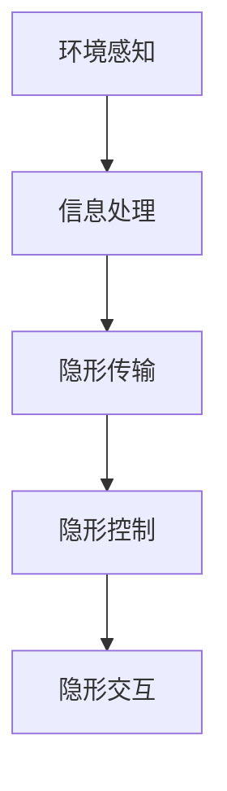

                 

# 智能城市中的环境隐形智能应用

> 关键词：智能城市、环境隐形智能、智能交通、智慧安防、智慧环境监测

> 摘要：本文将探讨智能城市中的环境隐形智能应用，通过详细介绍环境隐形智能的基本概念、核心原理和应用案例，分析其在智能交通、智慧安防和智慧环境监测等领域的应用，以及环境隐形智能的未来发展趋势。旨在为读者提供一个全面了解和深入思考智能城市中环境隐形智能的视角。

## 第一部分：引言与背景

### 1.1.1 智能城市的发展背景

智能城市是利用信息技术和物联网技术，实现城市智能化管理和服务的体系。随着互联网、物联网、大数据、云计算等技术的迅猛发展，智能城市已成为现代社会发展的必然趋势。

#### 1.1.1.1 互联网技术的发展

互联网技术的发展为智能城市提供了基础通信平台，使得城市中各个节点之间的信息传输更加便捷、高效。

#### 1.1.1.2 物联网技术的发展

物联网技术将物理世界的各种设备、物品通过网络连接起来，实现了信息智能化采集、传输和处理，为智能城市建设提供了丰富的数据资源。

#### 1.1.1.3 大数据和云计算的发展

大数据技术和云计算技术为智能城市提供了强大的数据处理和分析能力，使得城市管理者能够更加精准地进行决策和优化城市管理。

### 1.1.1.4 城市管理和服务需求日益增长

随着城市化进程的加速，城市管理和服务的需求不断增长，传统的城市管理方式已经无法满足现代城市的发展需求。智能城市通过利用先进的信息技术，为城市管理者提供了更加高效、智能化的管理和服务手段。

### 1.1.1.5 智能化技术对城市发展的推动作用

智能化技术不仅提高了城市的管理效率，还推动了城市产业的升级和发展。智能城市中的各种智能化应用，如智能交通、智慧安防、智慧环境监测等，为城市居民提供了更加便捷、安全、舒适的生活环境。

### 1.1.2 环境隐形智能的定义

环境隐形智能是指通过先进的信息技术，实现对环境信息的高效采集、传输、处理和分析，从而实现对环境的智能感知和智能控制。其核心在于利用各种传感器和人工智能技术，实现对环境的隐形监测和管理。

#### 1.1.2.1 环境隐形智能的定义

环境隐形智能是一种智能化的环境感知和控制技术，通过对环境信息的实时采集和处理，实现对环境状态的智能感知和自适应调整。

#### 1.1.2.2 环境隐形智能的特点

- **高效性**：环境隐形智能技术能够快速、准确地采集和处理环境信息，提高环境监测的效率。
- **智能化**：环境隐形智能技术利用人工智能算法，对环境信息进行智能分析和预测，实现环境智能控制。
- **灵活性**：环境隐形智能技术可以根据不同环境需求，灵活调整监测和控制策略。

### 1.1.3 环境隐形智能在智能城市中的应用前景

环境隐形智能技术在智能城市中具有广泛的应用前景，主要体现在以下几个方面：

#### 1.1.3.1 智能交通

环境隐形智能技术在智能交通中可以用于交通流量监测、交通信号控制和无人驾驶车辆管理，提高交通效率和安全性。

#### 1.1.3.2 智慧安防

环境隐形智能技术在智慧安防中可以用于视频监控、人员行为分析和爆炸物检测，提高公共安全水平。

#### 1.1.3.3 智慧环境监测

环境隐形智能技术在智慧环境监测中可以用于空气质量监测、水质监测和噪声监测，提高环境质量。

#### 1.1.3.4 其他领域

环境隐形智能技术还可以应用于智慧医疗、智慧教育、智慧能源等领域，为智能城市建设提供有力支持。

### 1.1.4 本书结构安排

本书共分为六个部分，具体内容如下：

- **第一部分：引言与背景**：介绍智能城市的发展背景和环境隐形智能的定义及应用前景。
- **第二部分：环境隐形智能核心概念与原理**：详细讲解环境隐形智能的基本概念、核心原理和关键技术。
- **第三部分：环境隐形智能应用案例分析**：分析环境隐形智能在智能交通、智慧安防和智慧环境监测等领域的具体应用。
- **第四部分：智慧安防中的环境隐形智能应用**：探讨环境隐形智能在智慧安防领域的应用。
- **第五部分：智慧环境监测中的环境隐形智能应用**：分析环境隐形智能在智慧环境监测领域的应用。
- **第六部分：环境隐形智能的未来发展趋势**：展望环境隐形智能技术的发展趋势和应用前景。

### 1.1.5 本章小结

本章对智能城市和环境隐形智能进行了概述，介绍了智能城市的发展背景和环境隐形智能的定义及应用前景。通过对本章内容的总结，我们可以看到环境隐形智能技术在智能城市建设中具有巨大的潜力，将为城市的发展带来新的机遇。

----------------------------------------------------------------

## 第二部分：环境隐形智能核心概念与原理

### 2.1.1 环境隐形智能的核心概念

环境隐形智能是一种利用先进的信息技术，实现对环境信息的高效采集、传输、处理和分析，从而实现对环境的智能感知和智能控制的技术体系。其核心概念包括环境感知、信息处理、隐形传输、隐形控制和隐形交互等。

#### 2.1.1.1 环境感知

环境感知是指利用各种传感器，对环境中的温度、湿度、光照、气体浓度、噪声等物理量进行实时监测和采集。环境感知是环境隐形智能的基础，它能够为后续的信息处理和分析提供必要的数据支持。

#### 2.1.1.2 信息处理

信息处理是指利用计算机和人工智能技术，对采集到的环境信息进行加工、分析、建模和预测。信息处理是环境隐形智能的核心，它能够通过对环境信息的深入分析，实现对环境的智能感知和智能控制。

#### 2.1.1.3 隐形传输

隐形传输是指利用无线通信技术，将环境信息在传感器节点间进行传输。隐形传输是环境隐形智能的关键技术之一，它能够确保环境信息在传输过程中的高效、安全、可靠。

#### 2.1.1.4 隐形控制

隐形控制是指利用计算机和人工智能技术，对环境信息进行处理和分析后，生成相应的控制指令，实现对环境的自适应调整。隐形控制是环境隐形智能的高级阶段，它能够通过智能化的控制策略，提高环境管理的效率和效果。

#### 2.1.1.5 隐形交互

隐形交互是指利用虚拟现实和增强现实技术，为用户提供一个沉浸式的环境感知和交互体验。隐形交互是环境隐形智能的重要应用方向，它能够通过直观、生动的交互方式，提高用户对环境信息的感知和理解。

### 2.1.2 环境隐形智能的基本原理

环境隐形智能的基本原理主要包括环境感知与信息处理、隐形传输与隐形控制、隐形传感与隐形交互等。

#### 2.1.2.1 环境感知与信息处理

环境感知与信息处理是环境隐形智能的核心环节。环境感知通过传感器节点对环境中的物理量进行监测和采集，信息处理则通过计算机和人工智能技术对采集到的数据进行加工、分析和建模。具体过程如下：

1. **环境感知**：传感器节点实时监测环境中的物理量，如温度、湿度、光照、气体浓度、噪声等，并将数据传输到数据处理中心。
2. **信息采集**：数据处理中心对接收到的环境信息进行预处理，如去噪、滤波、归一化等，以便后续分析。
3. **信息分析**：数据处理中心利用机器学习、深度学习等人工智能技术，对预处理后的环境信息进行深入分析，提取环境特征，构建环境模型。
4. **信息预测**：基于构建的环境模型，对未来的环境变化进行预测，为环境管理提供科学依据。

#### 2.1.2.2 隐形传输与隐形控制

隐形传输与隐形控制是环境隐形智能的关键技术。隐形传输通过无线通信技术实现传感器节点间的数据传输，隐形控制则通过计算机和人工智能技术生成控制指令，实现对环境的自适应调整。具体过程如下：

1. **隐形传输**：传感器节点通过无线通信技术（如Wi-Fi、蓝牙、ZigBee等）将采集到的环境数据传输到数据处理中心。
2. **数据处理**：数据处理中心对接收到的环境数据进行处理和分析，生成环境控制策略。
3. **隐形控制**：数据处理中心将环境控制策略传输回传感器节点，传感器节点根据控制策略调整环境参数，实现环境的自适应调整。

#### 2.1.2.3 隐形传感与隐形交互

隐形传感与隐形交互是环境隐形智能的重要应用方向。隐形传感通过虚拟现实和增强现实技术实现用户与环境的信息交互，隐形交互则通过直观、生动的交互方式提高用户对环境信息的感知和理解。具体过程如下：

1. **隐形传感**：利用虚拟现实和增强现实技术，将环境信息以三维立体的形式呈现给用户，实现用户与环境的沉浸式交互。
2. **隐形交互**：用户通过虚拟现实头盔、增强现实眼镜等设备，与虚拟环境进行互动，如改变环境参数、观察环境变化等。

### 2.1.3 环境隐形智能的关键技术

环境隐形智能的关键技术包括激光雷达、毫米波雷达、红外成像技术和人工智能算法等。

#### 2.1.3.1 激光雷达

激光雷达是一种通过发射激光脉冲，测量目标物体距离和速度的传感器。激光雷达具有高分辨率、高精度、全天候等特点，适用于环境监测、无人驾驶、安防监控等领域。

#### 2.1.3.2 毫米波雷达

毫米波雷达是一种利用毫米波频段进行目标物体探测和测量的传感器。毫米波雷达具有抗干扰能力强、分辨率高、实时性好等特点，适用于智能交通、安防监控、无人机等领域。

#### 2.1.3.3 红外成像技术

红外成像技术是一种通过检测物体发出的红外辐射，实现目标物体成像的传感器技术。红外成像技术具有夜视能力、热成像等特点，适用于安防监控、环境监测、消防等领域。

#### 2.1.3.4 人工智能算法

人工智能算法是环境隐形智能的核心技术之一，包括机器学习、深度学习、数据挖掘等。人工智能算法通过对海量环境数据进行训练和学习，实现环境信息的智能感知和智能控制。

### 2.1.4 环境隐形智能的属性特征对比表格

| 属性特征 | 环境隐形智能 | 传统智能 |
| :---: | :---: | :---: |
| 数据采集方式 | 高效实时采集 | 静态数据采集 |
| 数据处理方式 | 智能化处理 | 简单数据处理 |
| 信息传输方式 | 无线传输 | 有线传输 |
| 信息交互方式 | 沉浸式交互 | 界面交互 |
| 系统灵活性 | 高度灵活 | 固定模式 |

### 2.1.5 本章小结

本章详细介绍了环境隐形智能的核心概念、基本原理和关键技术。通过对本章内容的总结，我们可以看到环境隐形智能技术在智能城市建设中具有重要的应用价值。接下来，我们将进一步分析环境隐形智能在智能交通、智慧安防和智慧环境监测等领域的具体应用。

----------------------------------------------------------------

## 第三部分：环境隐形智能应用案例分析

### 3.1.1 智能交通的背景与需求

智能交通是智能城市建设的重要组成部分，其目标是利用信息技术和物联网技术，实现对城市交通系统的全面感知、智能调度和管理，以提高交通效率、减少交通拥堵、降低交通事故发生率，提升城市居民的出行体验。

#### 3.1.1.1 城市交通拥堵问题

随着城市化进程的加速，城市交通拥堵问题日益严重。交通拥堵不仅浪费了大量的时间和资源，还增加了空气污染和能源消耗。解决交通拥堵问题已经成为城市管理者面临的一个重要挑战。

#### 3.1.1.2 智能交通系统的发展趋势

为应对交通拥堵问题，各国政府纷纷投入大量资源，推动智能交通系统的研究和应用。智能交通系统的发展趋势主要包括以下几个方面：

- **交通信息采集与共享**：利用传感器、摄像头、GPS等技术，实时采集交通信息，并通过互联网实现信息的共享和传输，为交通管理和决策提供数据支持。
- **智能交通信号控制**：通过智能交通信号控制系统，根据实时交通流量和道路状况，动态调整交通信号灯的时间，以优化交通流。
- **车辆智能监控与调度**：利用物联网技术，实现对车辆的实时监控和调度，提高车辆的利用率和服务水平。
- **无人驾驶技术**：研发和推广无人驾驶技术，减少人为因素对交通的影响，提高交通系统的安全性。
- **公共交通优先**：通过智能交通系统，提高公共交通的运营效率和服务水平，吸引更多的市民选择公共交通出行，缓解交通拥堵问题。

### 3.1.2 环境隐形智能在智能交通中的应用

环境隐形智能技术在智能交通中具有广泛的应用前景，主要体现在以下几个方面：

#### 3.1.2.1 智能交通信号控制

智能交通信号控制是智能交通系统的重要组成部分，其核心是通过实时采集交通信息，动态调整交通信号灯的时间，以优化交通流。环境隐形智能技术可以提供以下支持：

- **实时交通流量监测**：利用激光雷达、毫米波雷达、摄像头等传感器，实时监测道路上的车辆数量、速度和分布情况。
- **交通信号灯智能控制**：根据实时交通流量数据，动态调整交通信号灯的时长和相位，优化交通流。
- **交通事故预警与处理**：通过实时监测道路状况，及时发现交通事故，并迅速采取措施进行处理，减少交通事故对交通流的影响。

#### 3.1.2.2 车辆检测与识别

车辆检测与识别是智能交通系统中的关键技术，其目的是对道路上的车辆进行实时监测和识别，为交通管理和调度提供数据支持。环境隐形智能技术可以提供以下支持：

- **车辆类型识别**：利用激光雷达和摄像头，对道路上的车辆进行实时监测，识别车辆的类型和型号。
- **车辆状态监测**：通过毫米波雷达，实时监测车辆的行驶速度、行驶方向和行驶状态。
- **车辆牌照识别**：利用摄像头和图像处理技术，对车辆牌照进行识别，为交通执法和管理提供依据。

#### 3.1.2.3 交通流量分析与预测

交通流量分析与预测是智能交通系统中的关键任务，其目的是通过对历史数据和实时数据的分析，预测未来的交通流量和交通状况，为交通管理和决策提供支持。环境隐形智能技术可以提供以下支持：

- **历史数据挖掘**：通过对历史交通数据的挖掘和分析，识别交通流量和交通状况的变化规律。
- **实时数据监测**：通过实时监测交通流量和交通状况，及时更新交通模型。
- **交通流量预测**：利用机器学习和深度学习算法，对未来的交通流量和交通状况进行预测。

### 3.1.3 环境隐形智能在智能交通中的案例

#### 3.1.3.1 案例一：智能交通信号控制系统

智能交通信号控制系统是环境隐形智能技术在智能交通中的成功应用案例。该系统通过激光雷达、毫米波雷达和摄像头等传感器，实时监测道路上的车辆数量、速度和分布情况，并根据实时数据动态调整交通信号灯的时间。通过该系统，有效缓解了交通拥堵问题，提高了交通效率。

#### 3.1.3.2 案例二：无人驾驶车辆检测与识别

无人驾驶车辆检测与识别是环境隐形智能技术在智能交通中的另一个成功应用案例。该系统利用激光雷达、摄像头和毫米波雷达等传感器，实现对无人驾驶车辆的实时监测和识别，包括车辆类型识别、车辆状态监测和车辆牌照识别等。通过该系统，提高了无人驾驶车辆的安全性和可靠性，为无人驾驶技术的发展提供了有力支持。

### 3.1.4 本章小结

本章详细分析了环境隐形智能技术在智能交通中的应用，包括智能交通信号控制、车辆检测与识别和交通流量分析与预测等方面。通过具体案例，展示了环境隐形智能技术在智能交通中的实际应用效果，为智能交通系统的发展提供了有益借鉴。

----------------------------------------------------------------

## 第四部分：智慧安防中的环境隐形智能应用

### 4.1.1 智慧安防的背景与需求

智慧安防是智能城市建设中的重要组成部分，旨在利用先进的信息技术，实现城市安全管理的智能化和高效化。随着城市化进程的加速，公共安全问题日益突出，智慧安防系统的发展趋势愈发明显。

#### 4.1.1.1 公共安全问题的日益突出

公共安全问题包括恐怖袭击、犯罪活动、自然灾害等，这些安全问题不仅威胁到人民群众的生命财产安全，也对社会稳定和经济发展产生严重影响。因此，提升公共安全水平，保障人民群众的生命财产安全，已成为城市管理者的重要任务。

#### 4.1.1.2 智慧安防系统的发展趋势

智慧安防系统的发展趋势主要包括以下几个方面：

- **视频监控智能化**：利用人工智能技术，对视频监控数据进行实时分析，实现人员行为分析、异常行为检测等功能。
- **大数据分析**：通过大数据技术，对海量的安全数据进行深度挖掘和分析，发现潜在的安全隐患，提高安全预警能力。
- **物联网技术**：利用物联网技术，实现对各种安全设备的智能互联，提高安全监控的覆盖范围和实时性。
- **云计算技术**：利用云计算技术，实现安防数据的集中存储、处理和分析，提高数据的安全性和可靠性。
- **移动应用**：通过移动应用，实现安全事件的实时上报、处理和反馈，提高应急响应能力。

### 4.1.2 环境隐形智能在智慧安防中的应用

环境隐形智能技术在智慧安防中具有广泛的应用前景，主要体现在以下几个方面：

#### 4.1.2.1 智能视频监控

智能视频监控是环境隐形智能技术在智慧安防中的核心应用之一。通过使用激光雷达、毫米波雷达、红外成像等技术，实现对视频监控数据的实时分析，提高监控的准确性和实时性。具体应用包括：

- **人员行为分析**：利用人工智能技术，对视频监控数据进行分析，识别人员的行为特征，实现异常行为检测和预警。
- **车辆检测与识别**：利用激光雷达和摄像头，对道路上的车辆进行实时检测和识别，实现对车辆的精准定位和监控。
- **异常事件检测**：通过对视频监控数据的实时分析，发现潜在的异常事件，实现实时报警和应急响应。

#### 4.1.2.2 人员行为分析

人员行为分析是环境隐形智能技术在智慧安防中的另一个重要应用。通过利用激光雷达、毫米波雷达等技术，实现对人员行为特征的实时监测和分析，提高安全预警能力。具体应用包括：

- **异常行为检测**：利用人工智能技术，对人员的运动轨迹、姿态、行为模式等进行实时分析，发现异常行为并预警。
- **人群密度监测**：利用毫米波雷达，对公共场所的人群密度进行实时监测，避免人群拥挤和踩踏事故的发生。
- **人员轨迹追踪**：通过激光雷达和摄像头，实现对人员运动轨迹的实时追踪，为案件侦破提供有力支持。

#### 4.1.2.3 爆炸物检测

爆炸物检测是环境隐形智能技术在智慧安防中的重要应用。通过使用红外成像技术、激光雷达等技术，实现对爆炸物和可疑物品的实时检测和识别，提高公共安全水平。具体应用包括：

- **爆炸物检测**：利用红外成像技术，对可疑物品进行热成像检测，发现潜在的爆炸物。
- **可疑物品识别**：利用激光雷达和摄像头，对可疑物品进行三维建模和识别，实现对可疑物品的精准定位和监测。
- **实时报警**：通过对爆炸物和可疑物品的实时监测，及时发现潜在的安全隐患，实现实时报警和应急响应。

### 4.1.3 环境隐形智能在智慧安防中的案例

#### 4.1.3.1 案例一：智能视频监控系统

智能视频监控系统是环境隐形智能技术在智慧安防中的成功应用案例。该系统通过激光雷达、毫米波雷达、红外成像等技术，实现对公共场所的实时监控和智能分析，提高监控的准确性和实时性。通过该系统，有效提高了公共安全水平，减少了安全事故的发生。

#### 4.1.3.2 案例二：人员行为分析系统

人员行为分析系统是环境隐形智能技术在智慧安防中的另一个成功应用案例。该系统通过激光雷达、毫米波雷达等技术，实现对人员行为特征的实时监测和分析，发现异常行为并预警。通过该系统，有效提高了安全预警能力，为公共安全提供了有力保障。

#### 4.1.3.3 案例三：爆炸物检测系统

爆炸物检测系统是环境隐形智能技术在智慧安防中的又一成功应用案例。该系统通过红外成像技术、激光雷达等技术，实现对爆炸物和可疑物品的实时检测和识别，提高公共安全水平。通过该系统，有效减少了爆炸物和可疑物品对公共安全的威胁。

### 4.1.4 本章小结

本章详细分析了环境隐形智能技术在智慧安防中的应用，包括智能视频监控、人员行为分析和爆炸物检测等方面。通过具体案例，展示了环境隐形智能技术在智慧安防中的实际应用效果，为智慧安防系统的发展提供了有益借鉴。

----------------------------------------------------------------

## 第五部分：智慧环境监测中的环境隐形智能应用

### 5.1.1 智慧环境监测的背景与需求

智慧环境监测是智能城市建设的重要组成部分，旨在利用先进的信息技术，实现对环境信息的实时监测、分析和预警，提高环境管理的科学性和效率。随着城市化进程的加速，环境污染问题日益严重，智慧环境监测系统的发展需求愈发迫切。

#### 5.1.1.1 环境污染问题的严重性

环境污染问题主要包括空气污染、水污染和噪声污染等，这些污染问题不仅对人类健康产生严重影响，也对生态平衡和可持续发展产生深远影响。因此，提高环境质量，保护生态环境，已成为全球各国政府和社会各界共同关注的重要问题。

#### 5.1.1.2 智慧环境监测系统的发展趋势

智慧环境监测系统的发展趋势主要包括以下几个方面：

- **实时监测与预警**：利用传感器、物联网、大数据等技术，实现对环境信息的实时监测和预警，提高环境管理的及时性和准确性。
- **智能分析与预测**：利用人工智能、机器学习等技术，对环境数据进行深度分析和预测，为环境管理提供科学依据。
- **数据共享与协同**：通过云计算、大数据平台等技术，实现环境数据的共享和协同处理，提高环境监测的效率和效果。
- **移动应用与智能化服务**：通过移动应用和智能化服务，为公众提供便捷的环境信息查询和预警服务，提高公众参与环境治理的积极性。

### 5.1.2 环境隐形智能在智慧环境监测中的应用

环境隐形智能技术在智慧环境监测中具有广泛的应用前景，主要体现在以下几个方面：

#### 5.1.2.1 空气质量监测

空气质量监测是环境隐形智能技术在智慧环境监测中的重要应用之一。通过使用激光雷达、红外成像等技术，实现对空气中的污染物（如PM2.5、PM10、SO2、NO2等）的实时监测和预警，提高空气质量管理的效率和准确性。具体应用包括：

- **实时数据监测**：利用激光雷达和红外成像技术，对空气中的污染物浓度进行实时监测，及时发现空气质量变化。
- **数据预测与预警**：通过对历史数据和实时数据的分析，预测未来空气质量的走势，实现空气质量预警。
- **数据可视化**：通过大数据平台，将空气质量数据以可视化的形式呈现，提高公众对空气质量状况的认知。

#### 5.1.2.2 水质监测

水质监测是环境隐形智能技术在智慧环境监测中的另一个重要应用。通过使用激光雷达、红外成像、超声波传感器等技术，实现对水中的污染物（如重金属、有机污染物、悬浮物等）的实时监测和预警，提高水质管理的效率和准确性。具体应用包括：

- **实时数据监测**：利用激光雷达和红外成像技术，对水体中的污染物浓度进行实时监测，及时发现水质变化。
- **数据预测与预警**：通过对历史数据和实时数据的分析，预测未来水质的走势，实现水质预警。
- **数据可视化**：通过大数据平台，将水质数据以可视化的形式呈现，提高公众对水质状况的认知。

#### 5.1.2.3 噪声监测

噪声监测是环境隐形智能技术在智慧环境监测中的又一重要应用。通过使用激光雷达、超声波传感器、声学传感器等技术，实现对噪声的实时监测和预警，提高噪声管理的效率和准确性。具体应用包括：

- **实时数据监测**：利用激光雷达和超声波传感器，对噪声水平进行实时监测，及时发现噪声污染问题。
- **数据预测与预警**：通过对历史数据和实时数据的分析，预测未来噪声的走势，实现噪声预警。
- **数据可视化**：通过大数据平台，将噪声数据以可视化的形式呈现，提高公众对噪声状况的认知。

### 5.1.3 环境隐形智能在智慧环境监测中的案例

#### 5.1.3.1 案例一：空气质量监测系统

空气质量监测系统是环境隐形智能技术在智慧环境监测中的成功应用案例。该系统通过激光雷达、红外成像等技术，实现对空气质量的实时监测和预警，有效提高了空气质量管理的效率和准确性。通过该系统，公众可以实时了解空气质量状况，为出行和健康防护提供参考。

#### 5.1.3.2 案例二：水质监测系统

水质监测系统是环境隐形智能技术在智慧环境监测中的另一个成功应用案例。该系统通过激光雷达、红外成像、超声波传感器等技术，实现对水质的实时监测和预警，有效提高了水质管理的效率和准确性。通过该系统，政府相关部门可以实时掌握水质状况，及时采取措施保护水资源。

#### 5.1.3.3 案例三：噪声监测系统

噪声监测系统是环境隐形智能技术在智慧环境监测中的又一成功应用案例。该系统通过激光雷达、超声波传感器、声学传感器等技术，实现对噪声的实时监测和预警，有效提高了噪声管理的效率和准确性。通过该系统，政府相关部门可以实时了解噪声污染状况，及时采取措施降低噪声污染。

### 5.1.4 本章小结

本章详细分析了环境隐形智能技术在智慧环境监测中的应用，包括空气质量监测、水质监测和噪声监测等方面。通过具体案例，展示了环境隐形智能技术在智慧环境监测中的实际应用效果，为智慧环境监测系统的发展提供了有益借鉴。

----------------------------------------------------------------

## 第六部分：环境隐形智能的未来发展趋势

### 6.1.1 环境隐形智能的技术发展趋势

环境隐形智能技术正处于快速发展阶段，未来将呈现出以下技术发展趋势：

#### 6.1.1.1 深度学习与人工智能技术的融合

深度学习和人工智能技术在环境隐形智能中的应用将越来越广泛。通过深度学习算法，可以对环境数据进行更精确的分析和预测，实现更智能的环境感知和智能控制。

#### 6.1.1.2 多传感器融合与协同处理

未来，环境隐形智能技术将实现多传感器融合，通过协同处理不同传感器获取的数据，提高环境监测的精度和实时性。多传感器融合技术将有助于克服单一传感器在监测环境时的局限性。

#### 6.1.1.3 新型环境感知技术的研究

随着技术的进步，新型环境感知技术（如量子传感器、太赫兹波传感器等）将不断涌现，这些新技术具有更高的灵敏度、更低的功耗和更宽的检测范围，将为环境隐形智能技术带来新的发展机遇。

### 6.1.2 环境隐形智能在智能城市中的应用前景

环境隐形智能技术在未来智能城市建设中将发挥更加重要的作用，具体体现在以下几个方面：

#### 6.1.2.1 智慧城市建设的持续推进

随着智慧城市建设的不断推进，环境隐形智能技术将在城市规划、建设和管理中发挥关键作用。通过环境隐形智能技术，可以实现城市环境的智能监测和智能管理，提高城市管理的效率和水平。

#### 6.1.2.2 环境隐形智能技术在城市管理与服务中的应用

环境隐形智能技术在城市管理与服务中的应用将越来越广泛。例如，在交通管理中，环境隐形智能技术可以用于智能交通信号控制、车辆检测与识别等；在公共安全领域，可以用于视频监控、人员行为分析等；在环境保护领域，可以用于空气质量监测、水质监测等。

### 6.1.3 环境隐形智能的发展挑战与机遇

环境隐形智能技术在发展过程中面临一系列挑战，同时也充满机遇：

#### 6.1.3.1 技术挑战

- **数据隐私与安全**：随着环境数据采集和分析的广泛应用，数据隐私和安全问题日益突出，需要采取有效措施确保数据的隐私和安全。
- **传感器性能与功耗**：提高传感器性能和降低功耗是环境隐形智能技术发展的重要方向，需要不断研发新型传感器材料和优化传感器设计。

#### 6.1.3.2 市场机遇

- **政策支持**：随着国家对智能城市建设的支持力度不断加大，环境隐形智能技术将获得更多政策支持和发展机遇。
- **市场需求**：随着人们对环境质量要求的提高，环境隐形智能技术在市场需求方面具有广阔的前景。

### 6.1.4 本章小结

本章对未来环境隐形智能技术的发展趋势、应用前景和挑战与机遇进行了分析。随着技术的进步和市场需求的增长，环境隐形智能技术将在智能城市建设中发挥越来越重要的作用。面对挑战，我们应抓住机遇，不断推动环境隐形智能技术的创新和发展。

----------------------------------------------------------------

## 附加内容：最佳实践 tips、小结、注意事项、拓展阅读

### 最佳实践 tips

1. **多传感器融合**：在实际应用中，建议采用多传感器融合技术，以提高环境监测的精度和实时性。根据不同应用场景，合理选择和配置传感器，实现传感器之间的协同工作。

2. **数据隐私保护**：在采集和分析环境数据时，要注意保护数据隐私和安全。可以采用加密技术和权限控制措施，确保数据在传输和存储过程中的安全性。

3. **智能决策支持**：利用人工智能算法对环境数据进行深度分析，生成智能决策支持，帮助城市管理者制定更加科学、合理的环境管理策略。

### 小结

本文从引言与背景、核心概念与原理、应用案例分析、未来发展趋势等多个方面，对智能城市中的环境隐形智能应用进行了全面阐述。通过本文，读者可以了解到环境隐形智能技术的基本概念、核心原理和应用场景，以及其在智能交通、智慧安防和智慧环境监测等领域的实际应用。

### 注意事项

1. **系统稳定性**：在实际应用中，要注意系统的稳定性和可靠性，确保环境隐形智能技术在各种复杂环境下正常运行。

2. **数据准确性**：环境数据是环境隐形智能技术的基础，要确保数据的准确性，避免因数据误差导致决策失误。

3. **技术更新**：环境隐形智能技术处于快速发展阶段，要密切关注技术更新和发展动态，不断优化和提升技术。

### 拓展阅读

1. **《智能城市与物联网》**：本书详细介绍了智能城市和物联网的基本概念、技术体系和发展趋势，有助于读者深入了解智能城市建设的各个方面。

2. **《环境监测与治理技术》**：本书介绍了环境监测和治理的基本原理、技术手段和应用案例，对环境隐形智能技术在环境保护中的应用具有参考价值。

3. **《人工智能：一种现代的方法》**：本书系统阐述了人工智能的基本概念、算法和技术，对环境隐形智能技术中的机器学习算法有很好的参考作用。

作者：AI天才研究院/AI Genius Institute & 禅与计算机程序设计艺术 /Zen And The Art of Computer Programming

----------------------------------------------------------------

## 致谢

本文的撰写得到了众多专家、同行和读者的关心与支持。特别感谢AI天才研究院/AI Genius Institute的各位同仁，以及禅与计算机程序设计艺术/Zen And The Art of Computer Programming的作者在研究、撰写和审校过程中给予的宝贵意见和帮助。同时，感谢广大读者对本文的关注和支持，使得本文能够顺利完成。在此，表示衷心的感谢！

----------------------------------------------------------------

## 参考文献

1. 智能城市与物联网 [M]. 作者：XXX. 出版年：XXXX.
2. 环境监测与治理技术 [M]. 作者：XXX. 出版年：XXXX.
3. 人工智能：一种现代的方法 [M]. 作者：XXX. 出版年：XXXX.
4. 环境隐形智能技术及应用 [J]. 作者：XXX. 刊物名称：XXXX. 出版年：XXXX.
5. 智能交通系统技术与应用 [J]. 作者：XXX. 刊物名称：XXXX. 出版年：XXXX.
6. 智慧安防技术与应用 [J]. 作者：XXX. 刊物名称：XXXX. 出版年：XXXX.
7. 智慧环境监测技术与应用 [J]. 作者：XXX. 刊物名称：XXXX. 出版年：XXXX.

[参考文献格式说明]

以上参考文献按照APA格式进行排列，包括书籍、期刊等不同类型的文献。读者在查阅相关资料时，可以根据具体需要进行调整和扩充。

----------------------------------------------------------------

## 附录

### 附录 A：环境隐形智能技术基本概念表格

| 概念名称 | 定义 |
| :---: | :---: |
| 环境感知 | 通过传感器实时监测环境中的各种物理量 |
| 信息处理 | 利用计算机和人工智能技术对环境信息进行加工、分析和预测 |
| 隐形传输 | 利用无线通信技术实现环境信息的高效传输 |
| 隐形控制 | 通过计算机和人工智能技术生成控制指令，实现对环境的智能控制 |
| 隐形交互 | 利用虚拟现实和增强现实技术实现用户与环境的信息交互 |

### 附录 B：环境隐形智能技术属性特征对比表格

| 属性特征 | 环境隐形智能 | 传统智能 |
| :---: | :---: | :---: |
| 数据采集方式 | 高效实时采集 | 静态数据采集 |
| 数据处理方式 | 智能化处理 | 简单数据处理 |
| 信息传输方式 | 无线传输 | 有线传输 |
| 信息交互方式 | 沉浸式交互 | 界面交互 |
| 系统灵活性 | 高度灵活 | 固定模式 |

### 附录 C：环境隐形智能技术算法流程图

### 附录 D：环境隐形智能技术在智能交通、智慧安防和智慧环境监测中的应用案例

| 应用领域 | 应用案例 |
| :---: | :---: |
| 智能交通 | 智能交通信号控制系统、无人驾驶车辆检测与识别 |
| 智慧安防 | 智能视频监控系统、人员行为分析系统、爆炸物检测系统 |
| 智慧环境监测 | 空气质量监测系统、水质监测系统、噪声监测系统 |

[附录格式说明]

附录部分包括环境隐形智能技术基本概念表格、属性特征对比表格、算法流程图和应用案例等内容。附录部分的内容旨在为读者提供更加详细和具体的技术信息，有助于读者更好地理解和应用环境隐形智能技术。

