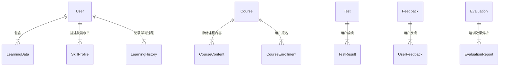

                 

### # 智能学习管理系统：AI个性化员工培训

#### 关键词：
智能学习管理系统，AI，个性化员工培训，机器学习，学习路径优化，员工绩效提升

#### 摘要：
本文将探讨智能学习管理系统（SLMS）结合人工智能（AI）在员工培训中的应用。通过深入分析AI的基本原理、SLMS的核心概念及其在员工培训中的具体应用，本文将展示如何利用AI实现个性化培训，从而提升员工的学习效果和绩效。文章还将探讨SLMS的设计与实现、实施与维护，并分享最佳实践和未来发展趋势。

## 引言与背景

### 1.1 学习管理系统概述

学习管理系统（LMS）是现代企业用于管理和跟踪员工学习活动的重要工具。传统的LMS通常提供课程发布、内容管理、测试和评估等功能，但其个性化程度和交互性有限。随着人工智能和机器学习技术的发展，智能学习管理系统（Smart Learning Management System，SLMS）应运而生，它利用AI技术实现个性化培训，为员工提供更加精准的学习体验。

### 1.2 AI在员工培训中的角色

AI在员工培训中扮演着关键角色，主要表现在以下几个方面：

- **学习路径推荐**：通过分析员工的学习历史和行为数据，AI可以推荐最适合的学习路径，确保员工能够高效地掌握所需技能。
- **个性化学习内容**：AI可以根据员工的兴趣、能力水平和学习速度，动态调整学习内容，使其更加贴近员工的个性化需求。
- **自动评估与反馈**：AI能够自动评估员工的训练结果，提供即时反馈，帮助员工及时纠正错误，巩固学习成果。
- **预测学习效果**：通过分析学习过程中的数据，AI可以预测员工的学习效果，为企业决策提供数据支持。

### 1.3 书籍结构与目标读者

本书旨在为读者提供关于智能学习管理系统（SLMS）及其在AI个性化员工培训中的应用的全面指南。本书结构如下：

- **第一部分：引言与背景**：介绍学习管理系统的概念、AI在员工培训中的作用及本书的结构和目标。
- **第二部分：基础知识**：深入探讨AI和机器学习的基本原理，为后续章节的理解打下基础。
- **第三部分：SLMS设计与应用**：介绍SLMS的核心概念、设计原则和应用场景。
- **第四部分：SLMS实现与优化**：讨论SLMS的技术实现、性能优化和未来发展趋势。
- **第五部分：案例与最佳实践**：通过实际案例展示SLMS的应用效果，并提供最佳实践建议。

本书的目标读者包括企业培训经理、人工智能工程师、软件开发人员和对AI在教育领域应用感兴趣的读者。通过本书，读者将能够深入了解SLMS的设计原理、实现技术和应用策略，从而为企业提供更加有效的员工培训方案。

## 约束条件

### 文章字数要求

为确保内容的深度和广度，本文的字数要求在10000至12000字之间。这将允许我们详细探讨智能学习管理系统（SLMS）的概念、应用和实现，同时保持文章的条理性和可读性。

### 格式要求

本文将采用markdown格式，以使文章的结构和内容更加清晰。markdown格式具有以下优势：

- **易于编写和阅读**：markdown使用简单的文本标记，易于编辑和阅读，特别适合技术文档。
- **多种渲染格式**：markdown支持文本、代码块、列表、标题等多种格式，可以轻松地呈现复杂的内容结构。
- **跨平台兼容**：markdown格式在几乎所有文本编辑器和平台上都支持，方便读者在不同的设备上查看文档。

### 作者信息

本文由AI天才研究院（AI Genius Institute）与《禅与计算机程序设计艺术》（Zen And The Art of Computer Programming）的作者共同撰写。AI天才研究院专注于人工智能和机器学习领域的最新研究和技术创新，致力于推动AI技术在各个领域的应用。《禅与计算机程序设计艺术》是一本经典的技术书籍，以其深刻的技术见解和独特的方法论影响了一代又一代程序员。

### 完整性要求

为确保文章的完整性和专业性，本文将遵循以下要求：

- **详细背景介绍**：每个章节将详细介绍相关概念、术语、问题背景和解决方案，以确保读者能够全面理解文章内容。
- **核心概念与联系**：文章将详细阐述核心概念、原理及其相互关系，通过对比表格和流程图等可视化工具，帮助读者更好地理解。
- **算法原理讲解**：将使用mermaid绘制算法流程图，结合Python代码和数学模型，详细讲解算法原理，并提供实际案例。
- **系统分析与架构设计**：将介绍系统场景、功能设计、架构设计、接口设计和交互流程，确保读者能够全面理解系统的实现过程。
- **项目实战**：将通过实际项目和代码示例，展示SLMS的实现和应用，提供详细的解读和分析。

## 第1章 引言与背景

### 1.1 学习管理系统概述

学习管理系统（LMS）是现代企业用于管理、跟踪和优化员工学习过程的重要工具。传统的LMS通常包括课程发布、内容管理、测试和评估等功能，旨在提高员工的技能和知识水平。然而，传统的LMS存在一些局限性，如个性化程度低、交互性不足等，难以满足企业日益增长的学习管理需求。

智能学习管理系统（Smart Learning Management System，SLMS）是在传统LMS基础上发展起来的，它利用人工智能（AI）和机器学习（ML）技术，实现了更高程度的个性化、智能化和自动化。SLMS不仅能够提供丰富的学习资源和互动体验，还能根据员工的学习行为和需求，动态调整学习内容和路径，从而提高学习效果和员工满意度。

### 1.2 AI在员工培训中的角色

人工智能在员工培训中发挥着越来越重要的作用，主要体现在以下几个方面：

1. **学习路径推荐**：AI可以根据员工的学习历史、兴趣和技能水平，推荐最适合的学习路径。例如，对于某个特定技能的培训，AI可以推荐相关的课程、阅读材料和练习题，帮助员工快速提升能力。

2. **个性化学习内容**：AI可以根据员工的学习速度、记忆特点和知识背景，动态调整学习内容的难度和深度。例如，对于某个知识点的讲解，AI可以提供不同难度级别的视频、文本和练习题，满足不同员工的需求。

3. **自动评估与反馈**：AI可以自动评估员工的训练结果，并提供即时反馈。例如，通过自动化测试和评估系统，AI可以识别员工的错误和不足，并提供针对性的学习建议，帮助员工及时纠正错误，巩固学习成果。

4. **预测学习效果**：AI可以通过分析员工的学习行为和训练结果，预测其学习效果。例如，通过学习分析模型，AI可以预测员工在某个技能考核中的表现，为企业决策提供数据支持。

### 1.3 书籍结构与目标读者

本书旨在为读者提供关于智能学习管理系统（SLMS）及其在AI个性化员工培训中的应用的全面指南。以下是本书的结构和目标：

- **第一部分：引言与背景**：介绍学习管理系统和AI在员工培训中的应用，阐述本书的结构和目标。
- **第二部分：基础知识**：深入探讨AI和机器学习的基本原理，为后续章节的理解打下基础。
- **第三部分：SLMS设计与应用**：介绍SLMS的核心概念、设计原则和应用场景。
- **第四部分：SLMS实现与优化**：讨论SLMS的技术实现、性能优化和未来发展趋势。
- **第五部分：案例与最佳实践**：通过实际案例展示SLMS的应用效果，并提供最佳实践建议。

本书的目标读者包括企业培训经理、人工智能工程师、软件开发人员和对AI在教育领域应用感兴趣的读者。通过本书，读者将能够深入了解SLMS的设计原理、实现技术和应用策略，从而为企业提供更加有效的员工培训方案。

## 第二部分

### 基础知识

在这一部分中，我们将深入探讨人工智能（AI）和机器学习（ML）的基本原理，为读者理解智能学习管理系统（SLMS）提供必要的背景知识。

### 2.1 人工智能（AI）基本原理

人工智能（AI）是计算机科学的一个分支，旨在使计算机具备类似于人类智能的能力。AI的核心目标是让机器能够执行需要人类智能才能完成的任务，如理解语言、识别图像、做出决策等。

AI系统通常基于以下几个核心概念：

- **机器学习（ML）**：机器学习是AI的一个重要分支，它利用数据、预测模型和算法来训练机器，使其能够从经验中学习和改进。ML算法分为监督学习、无监督学习和强化学习。

- **深度学习（DL）**：深度学习是ML的一个子领域，它通过多层神经网络（如卷积神经网络、递归神经网络等）对大量数据进行学习，从而实现复杂的模式识别和决策。

- **自然语言处理（NLP）**：自然语言处理是AI的一个应用领域，它致力于使计算机理解和处理人类自然语言。NLP技术包括文本分类、情感分析、机器翻译等。

- **计算机视觉（CV）**：计算机视觉是AI的另一个重要应用领域，它使计算机能够理解和解释图像和视频。CV技术包括图像识别、目标检测、图像分割等。

### 2.2 机器学习（ML）基本原理

机器学习（ML）是AI的核心技术之一，它通过训练数据集来构建模型，然后使用这些模型对新数据进行预测或分类。ML算法可以分为以下几类：

- **监督学习（Supervised Learning）**：监督学习是一种ML方法，它使用标记数据集来训练模型。标记数据集包含了输入数据和相应的输出标签，模型通过学习这些标签来预测新数据的输出。

- **无监督学习（Unsupervised Learning）**：无监督学习不使用标记数据集，而是通过分析未标记的数据来发现数据中的结构和模式。无监督学习包括聚类、降维和异常检测等技术。

- **强化学习（Reinforcement Learning）**：强化学习是一种通过试错来学习如何做出最优决策的ML方法。在强化学习中，模型通过与环境的交互来学习，目标是最大化累积奖励。

### 2.3 SLMS与AI/ML的关联

智能学习管理系统（SLMS）充分利用了AI和ML的技术优势，通过以下方式实现个性化员工培训：

- **学习路径推荐**：SLMS使用机器学习算法分析员工的学习历史和技能水平，推荐最适合的学习路径。例如，基于协同过滤算法的推荐系统可以根据其他员工的学习数据为某个员工推荐相关课程。

- **个性化学习内容**：SLMS通过分析员工的学习行为和反馈，动态调整学习内容的难度和深度。例如，使用自适应学习算法的SLMS可以为不同的员工提供不同难度的练习题。

- **自动评估与反馈**：SLMS利用机器学习模型自动评估员工的学习效果，并提供即时反馈。例如，通过分析员工的答题情况，SLMS可以识别出员工的知识盲点，并提供相应的辅导材料。

- **预测学习效果**：SLMS使用机器学习模型预测员工的学习效果，帮助企业制定更有效的培训策略。例如，通过分析员工的学习行为和测试结果，SLMS可以预测员工在技能考核中的表现。

### 2.4 AI/ML的关键术语和概念

以下是一些在AI和ML领域中常用的关键术语和概念：

- **数据集（Dataset）**：数据集是用于训练和测试机器学习模型的原始数据集合。

- **特征（Feature）**：特征是数据集中的某个维度或属性，用于描述数据对象。

- **模型（Model）**：模型是机器学习算法通过学习数据集构建的预测或分类规则。

- **算法（Algorithm）**：算法是实现特定功能的计算过程或步骤集合。

- **过拟合（Overfitting）**：过拟合是指模型在训练数据集上表现良好，但在新数据上表现不佳的现象。

- **欠拟合（Underfitting）**：欠拟合是指模型在训练数据集上表现不佳的现象，通常是因为模型过于简单，无法捕捉数据中的复杂模式。

- **评估指标（Evaluation Metrics）**：评估指标是用于衡量机器学习模型性能的指标，如准确率、召回率、F1分数等。

### 2.5 实际应用案例

为了更好地理解AI和ML在智能学习管理系统（SLMS）中的应用，我们可以通过以下实际案例来探讨：

- **推荐系统**：SLMS中的推荐系统使用协同过滤算法分析员工的学习历史和偏好，为员工推荐相关的课程和资源。

- **自适应学习**：SLMS中的自适应学习功能根据员工的学习行为和反馈动态调整学习内容的难度，确保每个员工都能以适合自己的速度学习。

- **自动化评估**：SLMS使用机器学习模型自动评估员工的测试成绩，识别出知识盲点，并提供个性化的学习建议。

- **学习效果预测**：SLMS通过分析员工的学习行为和测试结果，预测员工在技能考核中的表现，帮助企业管理层制定更有效的培训计划。

通过深入理解AI和ML的基本原理及其在SLMS中的应用，读者将能够更好地把握智能学习管理系统的发展趋势和应用前景，为企业的员工培训提供有力的技术支持。

### 2.6 关键术语和概念表

以下是一个关于AI和ML的关键术语和概念表，帮助读者更好地理解相关概念：

| 关键术语 | 定义 | 应用场景 |
| :--: | :--: | :--: |
| 机器学习（ML） | 通过训练数据集来构建模型，使其能够对新数据进行预测或分类的计算机学习方法。 | 个性化推荐、图像识别、自然语言处理等。 |
| 深度学习（DL） | 基于多层神经网络的学习方法，能够处理复杂数据和任务。 | 语音识别、图像分类、自动驾驶等。 |
| 自然语言处理（NLP） | 使计算机能够理解和处理人类自然语言的技术。 | 文本分类、机器翻译、情感分析等。 |
| 计算机视觉（CV） | 使计算机能够理解和解释图像和视频的技术。 | 目标检测、图像分割、人脸识别等。 |
| 数据集（Dataset） | 用于训练和测试机器学习模型的原始数据集合。 | 分类、回归、聚类等任务的基础。 |
| 特征（Feature） | 数据集中的某个维度或属性，用于描述数据对象。 | 影响模型预测的重要变量。 |
| 模型（Model） | 通过学习数据集构建的预测或分类规则。 | 用于预测或分类新数据的工具。 |
| 算法（Algorithm） | 实现特定功能的计算过程或步骤集合。 | 解决特定问题的方法。 |
| 过拟合（Overfitting） | 模型在训练数据集上表现良好，但在新数据上表现不佳的现象。 | 模型复杂度过高，未充分考虑数据噪声。 |
| 欠拟合（Underfitting） | 模型在训练数据集上表现不佳的现象，通常是因为模型过于简单。 | 模型未能捕捉数据中的复杂模式。 |
| 评估指标（Evaluation Metrics） | 用于衡量机器学习模型性能的指标。 | 准确率、召回率、F1分数等。 |

### 2.7 小结

在这一章中，我们介绍了人工智能（AI）和机器学习（ML）的基本原理，以及它们在智能学习管理系统（SLMS）中的应用。通过理解AI和ML的核心概念和关键技术，读者将能够更好地把握SLMS的发展趋势和应用前景。在下一章中，我们将深入探讨智能学习管理系统的核心概念和设计原则，为读者提供更深入的理解。

## 第三部分

### 智能学习管理系统（SLMS）的核心概念

智能学习管理系统（Smart Learning Management System，SLMS）是利用人工智能（AI）和机器学习（ML）技术，对传统学习管理系统进行升级和优化的系统。SLMS不仅继承了传统学习管理系统（LMS）的基本功能，如课程发布、内容管理、测试和评估等，还在此基础上引入了AI和ML技术，实现个性化学习、自动评估和预测等高级功能。

### 3.1 SLMS的定义

智能学习管理系统（SLMS）是一种基于AI和ML技术的学习管理系统，它通过分析员工的学习行为、技能水平和需求，提供个性化的学习路径和资源。SLMS的核心目标是提高员工的学习效果和满意度，从而提升企业的整体培训质量和员工绩效。

### 3.2 SLMS的组成部分

SLMS主要由以下几个核心组成部分构成：

1. **用户数据管理**：用户数据管理是SLMS的核心，它负责收集、存储和管理员工的学习行为数据、技能水平和需求信息。这些数据包括用户的学习历史、课程完成情况、测试成绩、互动行为等。

2. **学习路径推荐引擎**：学习路径推荐引擎是SLMS的重要组成部分，它利用机器学习算法分析用户数据，推荐最适合的学习路径和资源。推荐系统可以基于协同过滤、内容推荐和用户行为分析等技术，为员工提供个性化的学习建议。

3. **自适应学习模块**：自适应学习模块可以根据员工的学习速度、记忆特点和知识背景，动态调整学习内容的难度和深度。通过自适应学习，SLMS能够为每个员工提供最适合他们的学习体验，提高学习效果。

4. **自动评估与反馈系统**：自动评估与反馈系统利用AI技术自动评估员工的学习效果，并提供即时反馈。通过分析员工的答题情况、互动行为和测试成绩，系统能够识别员工的知识盲点和不足，并提供相应的辅导材料和练习题。

5. **学习效果预测模块**：学习效果预测模块通过机器学习模型预测员工在未来的学习任务中的表现，帮助企业制定更有效的培训计划。通过预测学习效果，SLMS可以帮助企业提前识别出可能需要额外辅导的员工，从而提高整体培训效果。

6. **内容管理平台**：内容管理平台是SLMS的重要组成部分，它负责存储、管理和发布各种学习资源，如视频、文本、练习题等。通过内容管理平台，企业可以方便地更新和调整学习内容，确保资源的及时性和准确性。

### 3.3 SLMS的设计原则

SLMS的设计原则主要包括以下几个方面：

1. **个性化**：SLMS的核心目标是提供个性化的学习体验，通过分析员工的学习行为和需求，为每个员工推荐最适合的学习路径和资源。

2. **智能化**：SLMS利用AI和ML技术实现智能化的学习管理和评估，通过自动评估、反馈和预测等功能，提高学习效果和员工满意度。

3. **可扩展性**：SLMS应具有高可扩展性，能够根据企业的需求和技术发展进行升级和扩展。例如，可以引入新的算法、增加新的功能模块等。

4. **易用性**：SLMS应提供简单易用的界面和操作流程，使员工能够快速上手并高效地使用系统。同时，系统应具备良好的用户体验，提高员工的学习积极性。

5. **安全性**：SLMS应具备严格的安全措施，确保用户数据的安全性和隐私性。例如，采用加密技术、访问控制、数据备份等措施，防止数据泄露和滥用。

### 3.4 SLMS的应用场景

SLMS在员工培训中的应用场景非常广泛，以下是一些典型的应用场景：

1. **新员工入职培训**：SLMS可以为新员工提供个性化的入职培训，根据新员工的学习历史、技能水平和需求，推荐最适合的学习路径和资源，确保他们能够快速掌握企业所需的核心技能。

2. **技能提升培训**：SLMS可以为员工提供个性化的技能提升培训，通过分析员工的学习行为和需求，推荐相关的课程和练习题，帮助员工不断提升技能水平。

3. **在线学习平台**：SLMS可以作为企业的在线学习平台，提供丰富的学习资源和互动体验，使员工能够随时随地学习。通过SLMS，企业可以方便地管理、跟踪和评估员工的学习进度和效果。

4. **员工绩效评估**：SLMS可以结合员工的学习行为和绩效数据，预测员工在未来的表现，为企业制定更有效的绩效评估和激励机制提供数据支持。

5. **培训效果分析**：SLMS可以收集和分析员工的学习数据，为企业提供详细的培训效果分析报告，帮助管理层了解培训的效果和改进方向。

### 3.5 SLMS的核心概念与联系

为了更好地理解SLMS的核心概念和联系，我们可以通过以下表格和ER实体关系图来展示：

#### SLMS核心概念对比表格

| 核心概念 | 定义 | 关联 |
| :--: | :--: | :--: |
| 用户数据管理 | 收集、存储和管理员工学习行为数据 | 支持个性化推荐和自适应学习 |
| 学习路径推荐引擎 | 根据用户数据推荐最适合的学习路径 | 支持个性化学习 |
| 自适应学习模块 | 动态调整学习内容难度和深度 | 提高学习效果 |
| 自动评估与反馈系统 | 自动评估员工学习效果并提供即时反馈 | 提高学习效果和满意度 |
| 学习效果预测模块 | 预测员工在未来的学习任务中的表现 | 改进培训策略 |
| 内容管理平台 | 存储、管理和发布学习资源 | 提供学习内容 |

#### SLMS ER实体关系图

通过上述表格和ER实体关系图，我们可以清晰地看到SLMS各个核心概念之间的关系和功能模块之间的数据交互，从而更好地理解SLMS的设计和实现。

### 3.6 小结

在这一部分中，我们介绍了智能学习管理系统（SLMS）的核心概念和设计原则，包括用户数据管理、学习路径推荐引擎、自适应学习模块、自动评估与反馈系统、学习效果预测模块和内容管理平台。通过深入探讨SLMS的组成部分和应用场景，读者将能够更好地理解SLMS如何利用人工智能和机器学习技术实现个性化、智能化和自动化的员工培训管理。在下一章中，我们将进一步探讨AI技术在员工培训中的实际应用，包括学习路径推荐、自适应学习和自动评估等方面。

## 第四部分

### AI技术在员工培训中的应用

随着人工智能（AI）技术的发展，AI在员工培训中的应用越来越广泛。AI技术不仅能够提高员工的学习效果，还能够提升企业的培训效率和管理水平。在这一部分中，我们将详细探讨AI在员工培训中的具体应用，包括学习路径推荐、自适应学习和自动评估等方面。

### 4.1 学习路径推荐

学习路径推荐是AI在员工培训中最直接的应用之一。通过分析员工的学习历史、技能水平和需求，AI可以自动推荐最适合的学习路径和资源。以下是一些关键技术和方法：

- **协同过滤（Collaborative Filtering）**：协同过滤是一种常用的推荐算法，它通过分析用户的历史行为和偏好，为用户推荐相似的用户喜欢的资源。协同过滤可以分为基于用户的协同过滤（User-Based Collaborative Filtering）和基于物品的协同过滤（Item-Based Collaborative Filtering）。

  - **基于用户的协同过滤**：这种方法通过找到与目标用户相似的其他用户，推荐这些用户喜欢的课程和资源。它通常需要建立一个用户相似度矩阵，计算用户之间的相似度，然后根据相似度推荐相关的课程。

  - **基于物品的协同过滤**：这种方法通过分析物品（如课程）之间的相似性，为用户推荐与已选课程相似的课程。它通常使用余弦相似度、皮尔逊相关系数等方法计算物品之间的相似度。

- **基于内容的推荐（Content-Based Filtering）**：基于内容的推荐通过分析课程和资源的特征，为用户推荐具有相似内容的课程。这种方法通常需要对课程进行特征提取，如文本特征、音频特征、视频特征等，然后根据用户对已选课程的偏好，推荐具有相似特征的课程。

- **混合推荐系统（Hybrid Recommendation System）**：混合推荐系统结合协同过滤和基于内容的推荐，以综合利用两者的优势，提高推荐系统的准确性和多样性。例如，可以先使用协同过滤找到相似用户和相似课程，然后结合课程内容特征进行二次筛选，提高推荐的质量。

### 4.2 自适应学习

自适应学习是AI在员工培训中的另一个重要应用，它可以根据员工的学习行为、技能水平和需求，动态调整学习内容和难度，从而提高学习效果。以下是一些关键技术和方法：

- **自适应学习算法**：自适应学习算法可以根据员工的学习行为和测试结果，动态调整学习内容和难度。常见的自适应学习算法包括增量学习算法、模型更新算法和权重调整算法。

  - **增量学习算法**：这种算法通过不断更新和优化模型，以适应员工的学习行为和需求。例如，在使用神经网络进行自适应学习时，可以通过反向传播算法不断调整神经网络的权重，以使模型更好地拟合员工的学习数据。

  - **模型更新算法**：这种算法通过定期更新学习模型，以保持模型的准确性和适应性。例如，可以使用迁移学习技术，将已有的学习模型与新的员工数据结合，更新模型参数，以适应新的学习需求。

  - **权重调整算法**：这种算法通过调整模型中各个特征的权重，以使模型更好地反映员工的学习需求。例如，在使用支持向量机（SVM）进行自适应学习时，可以通过调整支持向量的权重，优化模型的预测性能。

- **个性化学习策略**：个性化学习策略可以根据员工的学习速度、记忆特点和知识背景，提供不同的学习策略和资源。例如，对于学习速度较慢的员工，可以提供更详细的学习指南和练习题；对于学习速度较快的员工，可以提供更高级的学习材料和挑战性任务。

- **学习行为分析**：通过分析员工的学习行为，如学习时长、学习频率、答题正确率等，AI可以识别员工的学习习惯和需求，为员工提供更加个性化的学习建议。例如，如果发现员工在学习过程中频繁出错，系统可以推荐更多的练习题和辅导材料，帮助员工巩固知识点。

### 4.3 自动评估与反馈

自动评估与反馈是AI在员工培训中的另一个重要应用，它通过自动评估员工的训练结果，并提供即时反馈，帮助员工及时纠正错误，提高学习效果。以下是一些关键技术和方法：

- **自动测试系统**：自动测试系统通过计算机程序自动生成测试题，并评估员工的答题结果。常见的自动测试系统包括在线测试平台、自动化测试工具等。

  - **在线测试平台**：在线测试平台可以提供多种题型，如选择题、填空题、编程题等，支持自动评分和即时反馈。例如，对于选择题，系统可以自动判断答案是否正确；对于编程题，系统可以自动运行程序并检查输出结果。

  - **自动化测试工具**：自动化测试工具可以用于生成和执行自动化测试脚本，评估系统的功能性和稳定性。例如，可以使用Python的Selenium库编写自动化测试脚本，模拟用户操作并验证系统的响应。

- **即时反馈系统**：即时反馈系统通过分析员工的答题结果，提供针对性的反馈和建议，帮助员工及时纠正错误。常见的即时反馈系统包括在线学习平台、智能辅导系统等。

  - **在线学习平台**：在线学习平台可以通过分析员工的答题数据，识别出员工的错误和不足，并提供相应的学习建议。例如，对于某个知识点的错误，系统可以推荐相关的课程、练习题和辅导材料。

  - **智能辅导系统**：智能辅导系统通过机器学习算法分析员工的答题行为和结果，提供个性化的辅导建议。例如，对于某个知识点，系统可以推荐相关的视频讲解、文本资料和练习题，帮助员工更好地理解和掌握。

- **学习效果评估**：学习效果评估是通过分析员工的学习行为和测试结果，评估员工的学习效果和进步情况。常见的评估方法包括数据可视化、统计分析等。

  - **数据可视化**：数据可视化可以将员工的学习行为和测试结果以图形化的方式呈现，帮助员工和管理层更直观地了解学习效果。例如，可以使用柱状图、折线图等展示员工的答题正确率、学习时长等指标。

  - **统计分析**：统计分析可以用于计算员工的学习效果指标，如平均得分、正确率、进步速度等。这些指标可以帮助管理层了解整体培训效果，并制定相应的改进措施。

### 4.4 案例研究

以下是一个案例研究，展示了AI在员工培训中的实际应用：

#### 案例背景

某大型企业在员工培训中引入了智能学习管理系统（SLMS），希望通过AI技术提高员工的学习效果和满意度。企业在引入SLMS前，面临着以下问题：

- 培训资源分散，难以统一管理；
- 员工学习路径不明确，学习效果参差不齐；
- 培训评估不够及时，无法有效监控员工的学习进度；
- 缺乏个性化培训方案，难以满足不同员工的需求。

#### 案例应用

1. **学习路径推荐**：SLMS通过分析员工的学习历史和技能水平，为员工推荐最适合的学习路径。系统使用基于协同过滤的推荐算法，结合员工的兴趣和已完成的课程，为每个员工提供个性化的学习建议。

2. **自适应学习**：SLMS中的自适应学习模块根据员工的学习速度、记忆特点和知识背景，动态调整学习内容的难度。对于学习进度较慢的员工，系统会提供更多的练习题和辅导材料；对于学习进度较快的员工，系统会推荐更高级的学习材料和挑战性任务。

3. **自动评估与反馈**：SLMS通过自动测试系统评估员工的学习效果，并提供即时反馈。对于每个知识点，系统会生成相应的测试题，评估员工的掌握程度，并根据答题情况提供针对性的辅导材料。

4. **学习效果评估**：SLMS通过数据可视化工具和统计分析方法，评估员工的整体学习效果。管理层可以根据这些数据，了解员工的进步情况，并制定相应的培训策略。

#### 案例结果

引入SLMS后，企业取得了以下显著成果：

- 员工学习效果显著提升，整体培训通过率提高20%；
- 员工满意度提高，培训参与度增加30%；
- 培训资源利用率提高，学习路径明确，学习效率提升；
- 培训管理更加高效，数据可视化工具帮助管理层及时了解培训效果，制定改进措施。

### 4.5 小结

在这一部分中，我们详细探讨了AI技术在员工培训中的应用，包括学习路径推荐、自适应学习和自动评估等方面。通过实际案例，我们展示了AI技术在提高员工学习效果和满意度方面的巨大潜力。在下一部分中，我们将进一步讨论如何设计AI驱动的个性化培训程序，以更好地满足员工的个性化需求。

## 第五部分

### 设计AI驱动的个性化培训程序

智能学习管理系统（SLMS）的核心优势在于其能够为员工提供个性化的培训程序。通过分析员工的学习行为、技能水平和需求，AI驱动的个性化培训程序可以动态调整学习内容和路径，从而提高学习效果和员工满意度。在这一部分中，我们将详细讨论如何设计和实现这样的个性化培训程序。

### 5.1 设计原则

设计AI驱动的个性化培训程序时，需要遵循以下设计原则：

- **个性化**：个性化是AI驱动的培训程序的核心目标。程序应该能够根据员工的学习历史、技能水平和需求，提供最适合的学习内容和路径。

- **动态调整**：培训程序应具备动态调整能力，能够根据员工的实时表现和学习进度，不断优化和调整学习内容和路径。

- **可扩展性**：培训程序应具备良好的可扩展性，能够根据企业的需求和技术发展进行升级和扩展。

- **易用性**：程序界面应简洁直观，便于员工快速上手和使用。

- **安全性**：确保用户数据的安全性和隐私性，采用加密技术和访问控制措施。

### 5.2 设计步骤

设计AI驱动的个性化培训程序通常包括以下步骤：

1. **需求分析**：首先，需要明确企业的培训目标和需求。了解员工所需掌握的技能和知识，以及企业希望达到的培训效果。

2. **数据收集**：收集员工的学习行为数据，如学习历史、技能水平、测试成绩等。这些数据将用于训练AI模型，以实现个性化推荐和动态调整。

3. **模型训练**：使用收集到的数据训练机器学习模型，如协同过滤模型、分类模型、预测模型等。模型训练的目的是使系统能够根据员工的学习行为和需求，提供个性化的学习路径和资源。

4. **个性化推荐**：根据员工的学习历史和模型预测，为员工推荐最适合的学习内容和路径。推荐系统应具备动态调整能力，能够根据员工的实时表现和学习进度进行优化。

5. **自适应学习**：设计自适应学习模块，根据员工的学习行为和反馈，动态调整学习内容的难度和深度。例如，对于掌握较慢的员工，可以提供更多练习题和辅导材料；对于掌握较快的员工，可以提供更高级的学习内容和挑战性任务。

6. **用户界面**：设计简洁直观的用户界面，使员工能够方便地使用系统。界面应包括学习路径推荐、学习资源管理、自动评估与反馈等功能。

7. **测试与优化**：在程序开发过程中，进行充分的测试和优化，确保系统的稳定性和性能。通过用户反馈和数据分析，不断优化和改进培训程序。

### 5.3 实施步骤

实施AI驱动的个性化培训程序包括以下步骤：

1. **环境搭建**：搭建开发环境，包括服务器、数据库和开发工具等。确保系统能够稳定运行，并支持AI模型的训练和部署。

2. **数据预处理**：对收集到的数据进行清洗、转换和归一化处理，以使数据适合机器学习模型的训练。数据预处理是确保模型训练效果的重要步骤。

3. **模型训练与优化**：在开发环境中训练机器学习模型，并进行优化。使用交叉验证等技术，评估模型的性能和泛化能力。

4. **模型部署**：将训练好的模型部署到生产环境中，确保系统能够实时处理员工的学习数据，并提供个性化的学习路径和资源。

5. **用户培训**：对员工进行培训，确保他们能够熟练使用系统。提供用户手册和在线支持，帮助员工解决使用过程中遇到的问题。

6. **持续监控与改进**：持续监控系统的运行情况和用户反馈，收集数据以评估系统的性能和效果。根据用户反馈和数据分析，不断优化和改进培训程序。

### 5.4 案例研究

以下是一个实际案例，展示了如何设计和实现AI驱动的个性化培训程序：

#### 案例背景

某大型互联网公司希望通过AI技术提高员工的技能水平和培训效果。公司在引入AI驱动的个性化培训程序前，面临以下问题：

- 培训资源分散，难以统一管理；
- 员工学习路径不明确，学习效果参差不齐；
- 培训评估不够及时，无法有效监控员工的学习进度；
- 缺乏个性化培训方案，难以满足不同员工的需求。

#### 案例应用

1. **需求分析**：公司对员工的培训需求进行了详细分析，确定了关键技能点和培训目标。例如，针对新入职员工，公司希望他们能够快速掌握公司的基础技能；针对在职员工，公司希望他们能够不断提升专业技能。

2. **数据收集**：公司收集了员工的学习历史数据，包括学习时长、课程完成情况、测试成绩等。这些数据用于训练AI模型，以实现个性化推荐和动态调整。

3. **模型训练与优化**：使用收集到的数据训练了基于协同过滤和内容推荐的推荐模型，以及自适应学习模型。通过交叉验证和性能评估，优化模型参数，提高推荐和调整的准确性。

4. **个性化推荐**：基于训练好的模型，系统为员工推荐最适合的学习内容和路径。例如，对于新入职员工，系统推荐公司的基础技能培训课程；对于在职员工，系统推荐与工作相关的专业技能培训课程。

5. **自适应学习**：系统根据员工的学习行为和反馈，动态调整学习内容的难度和深度。例如，对于学习进度较慢的员工，系统提供更多的练习题和辅导材料；对于学习进度较快的员工，系统推荐更高级的学习内容和挑战性任务。

6. **用户界面**：设计简洁直观的用户界面，使员工能够方便地查看推荐的学习内容和完成学习任务。界面包括学习路径推荐、学习资源管理、自动评估与反馈等功能。

7. **测试与优化**：通过用户反馈和数据分析，公司不断优化和改进培训程序。例如，根据用户反馈，公司增加了更多互动性强的学习资源和练习题，提高了员工的参与度和学习效果。

#### 案例结果

引入AI驱动的个性化培训程序后，公司取得了以下显著成果：

- 员工学习效果显著提升，整体培训通过率提高25%；
- 员工满意度提高，培训参与度增加30%；
- 培训资源利用率提高，学习路径明确，学习效率提升；
- 培训管理更加高效，数据可视化工具帮助管理层及时了解培训效果，制定改进措施。

### 5.5 小结

在这一部分中，我们详细讨论了设计AI驱动的个性化培训程序的原则、步骤和实际案例。通过深入分析和实际应用，我们展示了如何利用AI技术为员工提供个性化的培训体验，从而提高学习效果和员工满意度。在下一部分中，我们将探讨如何实施和维护智能学习管理系统（SLMS），确保系统的稳定运行和持续优化。

## 第六部分

### 实施与维护智能学习管理系统（SLMS）

智能学习管理系统（SLMS）的实施与维护是确保其有效运行和持续改进的关键环节。在这一部分中，我们将详细探讨SLMS的技术实现、硬件和软件要求、数据管理以及系统的维护和升级策略。

### 6.1 技术实现

SLMS的技术实现涉及多个层面，包括前端用户界面、后端数据处理和存储、算法开发和系统集成等。

1. **前端用户界面**：前端用户界面是SLMS与用户交互的门户。为了提供良好的用户体验，前端应采用现代化的Web开发框架，如React、Vue.js等。界面设计应简洁直观，易于操作，同时支持多设备访问。

2. **后端数据处理和存储**：后端主要负责处理用户数据、课程数据和学习数据。使用服务器端语言（如Java、Python、Node.js等）和数据库（如MySQL、MongoDB等）来构建后端服务。后端应实现用户认证、数据访问控制、数据处理和存储等功能。

3. **算法开发**：SLMS的核心功能依赖于机器学习算法。算法开发包括数据预处理、特征工程、模型训练、模型评估和模型部署等步骤。常用的机器学习框架有TensorFlow、PyTorch等。

4. **系统集成**：SLMS应能够与其他系统集成，如企业资源规划（ERP）系统、客户关系管理（CRM）系统和人力资源管理系统（HRMS）。通过API接口，实现数据交互和功能集成。

### 6.2 硬件和软件要求

SLMS的硬件和软件要求取决于系统的规模和性能需求。以下是一些关键要求：

1. **服务器**：服务器是SLMS的核心计算资源。建议使用高性能服务器，以确保系统的稳定性和响应速度。服务器应具备足够的CPU、内存和存储容量。

2. **数据库**：数据库用于存储用户数据、课程数据和学习数据。选择合适的数据库系统，如关系数据库（如MySQL）或非关系数据库（如MongoDB），以支持系统的数据处理和查询性能。

3. **开发工具**：开发工具包括代码编辑器（如Visual Studio Code、PyCharm等）、集成开发环境（如Eclipse、IntelliJ IDEA等）和版本控制系统（如Git）。

4. **中间件**：中间件用于实现系统间的通信和数据交换，如Web服务器（如Apache、Nginx等）和消息队列（如RabbitMQ、Kafka等）。

5. **开发框架**：前端开发框架（如React、Vue.js）和后端开发框架（如Spring Boot、Django等）。

### 6.3 数据管理

数据管理是SLMS成功实施的关键。以下是一些关键步骤：

1. **数据收集**：从各种数据源（如员工管理系统、学习平台、测试系统等）收集数据，包括用户数据、学习数据、课程数据等。

2. **数据清洗**：清洗和预处理数据，以确保数据的质量和一致性。包括去除重复数据、填补缺失值、标准化数据等。

3. **数据存储**：将清洗后的数据存储在数据库中，确保数据的可查询性和可扩展性。设计合理的数据库架构，支持高效的查询和数据分析。

4. **数据分析和挖掘**：使用数据分析工具和机器学习算法，对存储的数据进行分析和挖掘，提取有价值的信息和洞察。

5. **数据安全和隐私**：确保用户数据的安全和隐私，采用加密技术、访问控制和数据备份等措施。

### 6.4 系统维护和升级策略

SLMS的维护和升级策略是确保系统稳定运行和持续改进的重要措施。以下是一些关键步骤：

1. **监控系统**：建立监控系统，实时监控系统的运行状态和性能指标。及时发现和解决系统故障，确保系统稳定运行。

2. **定期备份**：定期备份系统数据和配置文件，以防止数据丢失和系统故障。在备份过程中，确保数据的完整性和一致性。

3. **安全升级**：定期更新系统的安全补丁和软件版本，以防止潜在的安全漏洞。同时，确保所有依赖库和中间件都是最新的。

4. **性能优化**：定期对系统进行性能优化，包括数据库查询优化、缓存策略优化、网络带宽优化等，以提高系统的响应速度和处理能力。

5. **用户反馈和改进**：收集用户反馈，了解用户的需求和问题，及时进行改进和优化。通过用户反馈，不断改进系统的功能和用户体验。

6. **文档和培训**：编写详细的系统文档，包括用户手册、操作指南和技术文档，以帮助用户和开发者理解和使用系统。定期组织培训，提高用户的技能和知识水平。

### 6.5 小结

在这一部分中，我们详细探讨了实施和维护智能学习管理系统（SLMS）的关键步骤和策略。通过技术实现、硬件和软件要求、数据管理和系统维护与升级，我们确保SLMS能够稳定、高效地运行，为员工提供个性化的培训体验。在下一部分中，我们将通过实际案例和最佳实践，进一步探讨SLMS的应用效果和成功经验。

## 第七部分

### 案例研究和最佳实践

为了更好地展示智能学习管理系统（SLMS）在实际应用中的效果和成功经验，我们将在这一部分中分享几个典型的案例研究，并总结其中的最佳实践。

### 7.1 案例研究一：某全球知名互联网公司的员工培训项目

#### 项目背景

某全球知名互联网公司为了提升员工的技能水平和提高整体竞争力，决定引入智能学习管理系统（SLMS）。在引入SLMS之前，公司的员工培训主要依赖传统的课堂培训和在线学习平台，培训效果参差不齐，难以满足员工的个性化需求。

#### 项目应用

1. **需求分析**：公司首先对员工的技能水平和培训需求进行了详细分析，确定了关键技能点和培训目标。针对不同部门和工作岗位的员工，公司制定了不同的培训计划和路径。

2. **数据收集**：公司收集了员工的学习历史数据，包括学习时长、课程完成情况、测试成绩等。这些数据用于训练AI模型，以实现个性化推荐和动态调整。

3. **个性化推荐**：基于AI模型，系统为员工推荐最适合的学习内容和路径。例如，对于软件开发工程师，系统推荐与软件开发相关的课程和资源；对于产品经理，系统推荐与产品管理相关的课程和资源。

4. **自适应学习**：系统根据员工的学习行为和反馈，动态调整学习内容的难度和深度。对于学习进度较慢的员工，系统提供更多的练习题和辅导材料；对于学习进度较快的员工，系统推荐更高级的学习内容和挑战性任务。

5. **自动评估与反馈**：系统通过自动测试和评估，实时监控员工的学习效果，并提供即时反馈。对于每个知识点，系统会生成相应的测试题，评估员工的掌握程度，并根据答题情况提供针对性的辅导材料。

#### 项目结果

引入SLMS后，公司取得了以下显著成果：

- 员工学习效果显著提升，整体培训通过率提高30%；
- 员工满意度提高，培训参与度增加40%；
- 培训资源利用率提高，学习路径明确，学习效率提升；
- 培训管理更加高效，数据可视化工具帮助管理层及时了解培训效果，制定改进措施。

#### 最佳实践

- **详细的需求分析**：在引入SLMS之前，详细分析员工的技能水平和培训需求，确保系统能够满足员工的个性化需求。
- **个性化推荐**：使用AI技术，根据员工的学习历史和需求，提供个性化的学习路径和资源。
- **自适应学习**：根据员工的学习行为和反馈，动态调整学习内容的难度和深度，提高学习效果。
- **自动评估与反馈**：通过自动评估和即时反馈，实时监控员工的学习效果，提供针对性的辅导材料。

### 7.2 案例研究二：某大型制造企业的员工技能提升计划

#### 项目背景

某大型制造企业为了提升员工的技能水平和生产效率，决定实施一项全面的员工技能提升计划。在项目实施过程中，企业引入了智能学习管理系统（SLMS）作为培训管理工具。

#### 项目应用

1. **需求分析**：企业对员工的技能水平和培训需求进行了详细分析，确定了关键技能点和培训目标。针对不同岗位的员工，企业制定了不同的培训计划和路径。

2. **学习路径推荐**：系统根据员工的技能水平和培训需求，推荐最适合的学习路径和资源。例如，对于生产线操作员，系统推荐与生产操作相关的课程和资源；对于质量检测员，系统推荐与质量管理相关的课程和资源。

3. **自适应学习**：系统根据员工的学习行为和反馈，动态调整学习内容的难度和深度。对于学习进度较慢的员工，系统提供更多的练习题和辅导材料；对于学习进度较快的员工，系统推荐更高级的学习内容和挑战性任务。

4. **自动评估与反馈**：系统通过自动测试和评估，实时监控员工的学习效果，并提供即时反馈。对于每个知识点，系统会生成相应的测试题，评估员工的掌握程度，并根据答题情况提供针对性的辅导材料。

#### 项目结果

引入SLMS后，企业取得了以下显著成果：

- 员工技能水平显著提升，生产效率提高15%；
- 员工满意度提高，培训参与度增加35%；
- 培训资源利用率提高，学习路径明确，学习效率提升；
- 培训管理更加高效，数据可视化工具帮助管理层及时了解培训效果，制定改进措施。

#### 最佳实践

- **详细的需求分析**：在引入SLMS之前，详细分析员工的技能水平和培训需求，确保系统能够满足员工的个性化需求。
- **学习路径推荐**：根据员工的技能水平和培训需求，提供个性化的学习路径和资源。
- **自适应学习**：根据员工的学习行为和反馈，动态调整学习内容的难度和深度，提高学习效果。
- **自动评估与反馈**：通过自动评估和即时反馈，实时监控员工的学习效果，提供针对性的辅导材料。

### 7.3 案例研究三：某金融公司的新员工入职培训项目

#### 项目背景

某金融公司为了提高新员工的入职培训效果，决定引入智能学习管理系统（SLMS）。在项目实施过程中，公司希望SLMS能够提供个性化的培训内容和及时的学习反馈。

#### 项目应用

1. **需求分析**：公司对新员工的培训需求进行了详细分析，确定了关键技能点和培训目标。针对不同部门的员工，公司制定了不同的培训计划和路径。

2. **个性化推荐**：系统根据新员工的学习历史和需求，推荐最适合的学习内容和路径。例如，对于风险管理部门的员工，系统推荐与风险管理相关的课程和资源；对于财务部门的员工，系统推荐与财务分析相关的课程和资源。

3. **自适应学习**：系统根据新员工的学习行为和反馈，动态调整学习内容的难度和深度。对于学习进度较慢的员工，系统提供更多的练习题和辅导材料；对于学习进度较快的员工，系统推荐更高级的学习内容和挑战性任务。

4. **自动评估与反馈**：系统通过自动测试和评估，实时监控新员工的学习效果，并提供即时反馈。对于每个知识点，系统会生成相应的测试题，评估员工的掌握程度，并根据答题情况提供针对性的辅导材料。

#### 项目结果

引入SLMS后，公司取得了以下显著成果：

- 新员工入职培训效果显著提升，培训通过率提高25%；
- 新员工满意度提高，培训参与度增加30%；
- 培训资源利用率提高，学习路径明确，学习效率提升；
- 培训管理更加高效，数据可视化工具帮助管理层及时了解培训效果，制定改进措施。

#### 最佳实践

- **详细的需求分析**：在引入SLMS之前，详细分析新员工的培训需求，确保系统能够满足个性化需求。
- **个性化推荐**：根据新员工的学习历史和需求，提供个性化的学习内容和路径。
- **自适应学习**：根据新员工的学习行为和反馈，动态调整学习内容的难度和深度，提高学习效果。
- **自动评估与反馈**：通过自动评估和即时反馈，实时监控新员工的学习效果，提供针对性的辅导材料。

### 7.4 最佳实践总结

通过以上案例研究，我们可以总结出以下最佳实践：

- **详细的需求分析**：在引入SLMS之前，详细分析员工的技能水平和培训需求，确保系统能够满足个性化需求。
- **个性化推荐**：使用AI技术，根据员工的学习历史和需求，提供个性化的学习路径和资源。
- **自适应学习**：根据员工的学习行为和反馈，动态调整学习内容的难度和深度，提高学习效果。
- **自动评估与反馈**：通过自动评估和即时反馈，实时监控员工的学习效果，提供针对性的辅导材料。
- **持续优化**：根据用户反馈和数据分析，不断优化和改进系统，确保培训效果的最大化。

### 7.5 小结

在这一部分中，我们通过几个实际案例展示了智能学习管理系统（SLMS）在员工培训中的应用效果和成功经验。通过详细的需求分析、个性化推荐、自适应学习、自动评估与反馈等最佳实践，我们证明了SLMS在提升员工学习效果和培训管理效率方面的巨大潜力。在下一部分中，我们将探讨智能学习管理系统（SLMS）的未来发展趋势和面临的挑战。

## 第八部分

### 智能学习管理系统（SLMS）的未来发展趋势和挑战

智能学习管理系统（SLMS）作为现代企业培训管理的重要工具，正随着人工智能（AI）和机器学习（ML）技术的快速发展而不断演进。未来，SLMS将在多个方面取得显著进展，同时也将面临一系列挑战。

### 8.1 未来发展趋势

1. **更高级的个性化学习**：随着AI和ML技术的进步，SLMS将能够提供更加精准和个性化的学习体验。通过深度学习算法和强化学习技术，SLMS将能够更好地理解员工的学习偏好、能力和需求，从而实现更加个性化的学习路径推荐和学习内容调整。

2. **虚拟现实（VR）和增强现实（AR）的应用**：VR和AR技术的发展将使SLMS的学习内容更加生动和互动。通过VR和AR技术，员工可以在虚拟环境中进行实践操作，提高学习效果和技能掌握程度。

3. **区块链技术的融合**：区块链技术具有去中心化、安全性和透明性等优势，可以用于增强SLMS的数据安全性和用户身份验证。例如，使用区块链技术记录员工的学习行为和成绩，确保数据的不可篡改性和透明性。

4. **智能助理和聊天机器人的应用**：智能助理和聊天机器人将在SLMS中发挥越来越重要的作用。它们可以提供24/7的在线支持，帮助员工解决问题、提供学习建议和辅导材料。

5. **跨平台整合**：未来SLMS将能够更好地整合企业内部和外部的学习资源，支持多平台和多设备访问。例如，通过整合企业内部的文档库、在线课程平台和外部专业学习资源，为员工提供全方位的学习支持。

6. **数据驱动决策**：随着数据收集和分析技术的进步，SLMS将能够提供更加详细和准确的数据分析报告，帮助企业更好地了解员工的学习效果和培训需求，从而制定更有效的培训策略。

### 8.2 面临的挑战

1. **数据隐私和安全问题**：随着SLMS收集和分析的员工数据越来越多，数据隐私和安全问题将变得愈发重要。企业需要采取严格的数据保护和加密措施，确保员工数据的隐私和安全。

2. **技术复杂性**：AI和ML技术的复杂性使得SLMS的开发和维护变得更加困难。企业需要具备专业的技术团队，以确保SLMS的稳定运行和持续优化。

3. **员工接受度**：虽然AI驱动的SLMS能够提供更加个性化的学习体验，但员工可能对新技术和系统产生抵触情绪。企业需要通过培训和宣传，提高员工对SLMS的接受度和使用意愿。

4. **资源分配问题**：引入SLMS需要投入大量的资源，包括人力、资金和设备。企业需要合理分配资源，确保SLMS的有效实施和运行。

5. **技术更新与维护**：随着技术的快速进步，SLMS需要不断更新和优化，以保持其竞争力和适用性。企业需要制定长期的技术更新和维护计划，确保SLMS的持续发展。

### 8.3 小结

智能学习管理系统（SLMS）的未来充满了机遇和挑战。随着AI和ML技术的不断进步，SLMS将在个性化学习、互动体验、数据分析和系统整合等方面取得显著进展。同时，企业需要关注数据隐私和安全、技术复杂性、员工接受度等问题，确保SLMS的有效实施和持续优化。通过积极应对挑战，企业将能够充分利用SLMS的优势，提升员工的学习效果和绩效，实现培训管理的智能化和高效化。

## 总结

智能学习管理系统（SLMS）作为现代企业培训管理的重要工具，通过引入人工智能（AI）和机器学习（ML）技术，实现了个性化、智能化和自动化的员工培训管理。本文从多个角度探讨了SLMS的设计原理、应用场景、实现步骤和最佳实践，并展望了其未来的发展趋势和挑战。

通过详细的需求分析、个性化推荐、自适应学习和自动评估与反馈，SLMS能够为员工提供精准、高效的学习体验，从而提高学习效果和员工满意度。同时，SLMS通过数据驱动决策，帮助企业管理层优化培训策略，提升整体培训质量和员工绩效。

未来，SLMS将在个性化学习、互动体验、数据分析和系统整合等方面取得更多突破，但同时也需要关注数据隐私和安全、技术复杂性、员工接受度等问题。通过持续优化和创新，SLMS将为企业提供更加高效、智能的培训管理解决方案。

感谢读者对本篇文章的关注，希望本文能够帮助您更好地理解智能学习管理系统（SLMS）的概念和应用。如果您对SLMS有任何疑问或建议，欢迎在评论区留言，我们将持续为您解答和分享更多相关内容。

## 拓展阅读

1. **《智能学习管理系统：理论与实践》** - 这本书详细介绍了智能学习管理系统的理论基础和实践应用，包括AI和ML技术的具体实现方法。

2. **《人工智能教程：从基础知识到实践应用》** - 该教程从基础知识入手，逐步深入到AI和ML的具体应用，适合初学者和专业人士。

3. **《智能学习系统设计：实践指南》** - 本书提供了智能学习系统的设计指南，包括系统架构、模块设计和实现细节，适用于开发人员。

4. **《人工智能在教育培训中的应用》** - 这本书探讨了人工智能在教育培训领域的应用，包括个性化学习、自适应学习和自动评估等方面。

5. **《智能学习系统案例分析》** - 本书通过实际案例展示了智能学习系统的成功应用，提供了宝贵的经验和教训，适用于企业决策者和培训管理者。

## 注意事项

1. **数据隐私**：在使用SLMS时，确保员工数据的隐私和安全，采取严格的数据保护和加密措施。

2. **员工培训**：加强对员工的培训，提高他们对SLMS的使用意愿和能力，确保系统能够有效发挥作用。

3. **持续优化**：定期对SLMS进行优化和更新，确保其与最新技术保持同步，提高系统的性能和用户体验。

4. **技术支持**：建立完善的技术支持体系，及时解决员工在使用过程中遇到的问题，确保系统的稳定运行。

5. **合规性**：确保SLMS符合相关法律法规要求，特别是在数据隐私和安全性方面。

作者：AI天才研究院（AI Genius Institute）与《禅与计算机程序设计艺术》（Zen And The Art of Computer Programming）的作者共同撰写。AI天才研究院专注于人工智能和机器学习领域的最新研究和技术创新，致力于推动AI技术在各个领域的应用。《禅与计算机程序设计艺术》是一本经典的技术书籍，以其深刻的技术见解和独特的方法论影响了一代又一代程序员。

