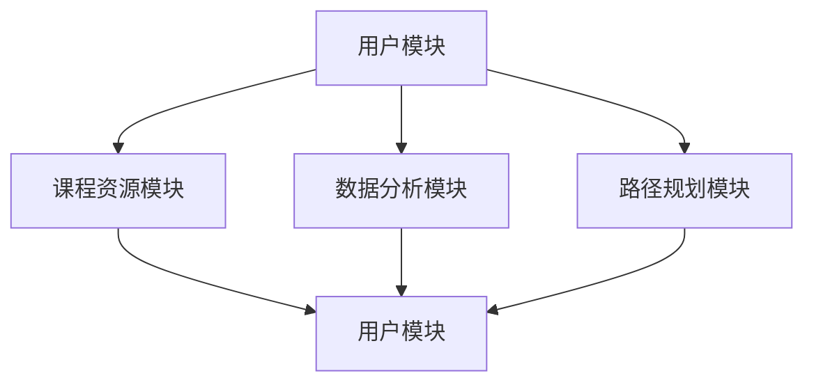
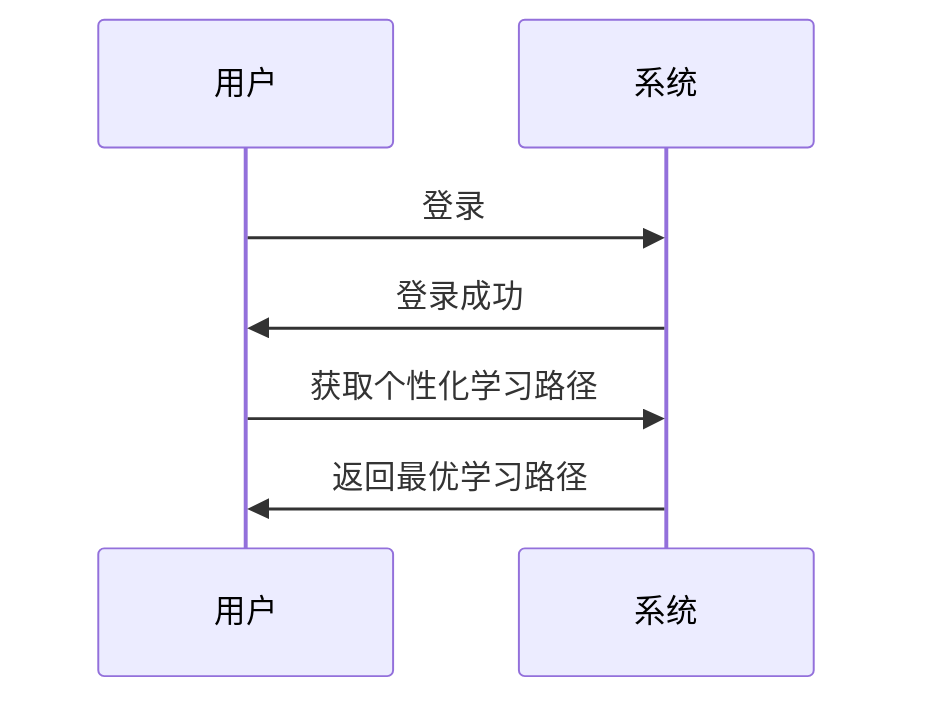
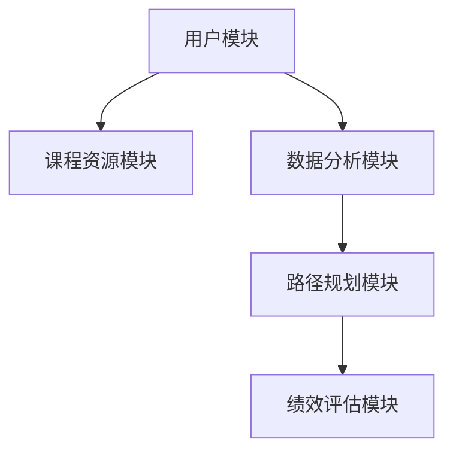
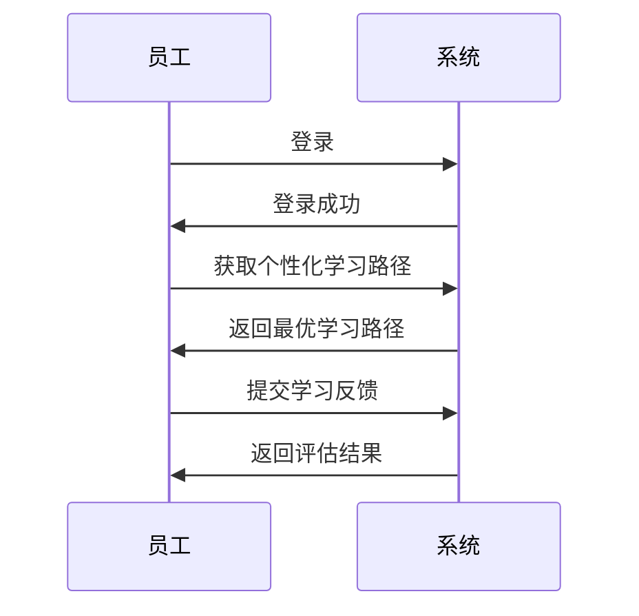

                 

### 摘要

本文章以“智能学习路径规划：AI个性化员工发展”为题，深入探讨了人工智能（AI）在员工个性化发展中的应用。随着数字化和智能化时代的到来，传统员工发展模式逐渐暴露出无法满足个性化需求的弊端。本文首先介绍了智能学习路径规划的基本概念和原理，分析了AI在路径规划中的关键作用。接着，本文详细探讨了AI如何通过数据分析和机器学习算法，实现个性化学习路径的规划。此外，文章还深入解析了智能学习路径规划的算法原理、系统架构和实际应用案例。通过这些分析，本文旨在为企业和教育机构提供智能学习路径规划的理论基础和实践指导，推动AI在员工发展领域的创新应用。最终，本文总结了智能学习路径规划的前景和挑战，为未来的研究方向提出了建设性建议。

### 关键词

1. 智能学习路径规划
2. 人工智能
3. 员工发展
4. 个性化学习
5. 数据分析
6. 机器学习
7. 算法原理
8. 系统架构
9. 实际应用

### 1. 引言

#### 1.1 智能学习路径规划的概念

智能学习路径规划是一种利用人工智能技术，根据学习者的个人需求和特点，为其设计出最优学习路径的方法。这种方法突破了传统教育模式中的固定化、一刀切的限制，更加注重个性化、灵活化的学习体验。智能学习路径规划的核心在于利用大数据和机器学习算法，对学习者的学习行为、兴趣、能力和需求进行深入分析，从而生成定制化的学习计划。

#### 1.2 AI个性化员工发展的背景

在数字化和智能化时代，员工的发展面临着前所未有的挑战和机遇。一方面，企业需要不断适应快速变化的市场需求，提高员工的技能和素质；另一方面，员工也希望能够在职业生涯中实现个人成长和价值提升。然而，传统的员工发展模式往往存在一些问题，如缺乏个性化、无法满足不同员工的多样化需求等。这种情况下，AI个性化员工发展应运而生。

AI个性化员工发展利用人工智能技术，通过对员工的学习行为、工作表现、职业兴趣等多方面数据的分析，为员工提供个性化的培训和发展建议。这不仅能够帮助员工更好地实现自我提升，也能为企业带来更高的生产力和竞争力。

#### 1.3 智能学习路径规划与AI个性化员工发展的关系

智能学习路径规划和AI个性化员工发展有着密切的关系。智能学习路径规划是AI个性化员工发展的基础，通过智能学习路径规划，可以为企业提供科学、有效的员工发展方案。而AI个性化员工发展则是智能学习路径规划的具体应用，通过AI技术，实现员工发展过程中的个性化、精准化和智能化。

总的来说，智能学习路径规划与AI个性化员工发展共同构建了一个闭环系统，前者为后者提供数据支持和算法基础，后者则将前者的理论应用到实际中，实现员工发展的持续优化。

### 1.4 文章结构概述

本文将分为八个章节，系统性地探讨智能学习路径规划与AI个性化员工发展的理论和方法。

- **第一章：引言**：介绍智能学习路径规划和AI个性化员工发展的概念、背景及其关系。
- **第二章：智能学习路径规划的基础**：讲解智能学习路径规划的基本原理、方法和应用。
- **第三章：AI在员工发展中的应用**：探讨AI如何通过个性化学习、提升生产力等方式推动员工发展。
- **第四章：数据与智能路径规划**：分析数据在智能路径规划中的重要性，以及如何利用数据分析实现智能路径规划。
- **第五章：路径规划算法与模型**：介绍常用的路径规划算法和模型，包括机器学习算法、优化技术和神经网络。
- **第六章：智能学习路径的实施**：讨论智能学习路径的实施过程，包括系统架构、技术栈和最佳实践。
- **第七章：案例分析与应用**：通过具体案例，展示智能学习路径在不同领域的应用和效果。
- **第八章：未来方向与挑战**：探讨智能学习路径规划与AI个性化员工发展的未来趋势、挑战和机遇。

通过以上章节的详细探讨，本文旨在为读者提供一个全面、系统的智能学习路径规划与AI个性化员工发展指南。

### 2. 基础知识

#### 2.1 智能学习路径规划的定义

智能学习路径规划是一种利用人工智能技术，通过对学习者行为数据进行分析，为其设计出个性化学习路径的方法。具体来说，智能学习路径规划包括以下几个关键组成部分：

1. **学习数据收集**：收集学习者在学习过程中的行为数据，如学习时间、学习内容、学习方式、学习成果等。
2. **数据预处理**：对收集到的学习数据进行清洗、整合和转换，使其符合分析和建模的要求。
3. **学习需求分析**：利用机器学习算法，分析学习者的学习需求、兴趣和能力，从而识别其个性化特征。
4. **路径规划算法**：根据学习需求分析结果，应用优化算法和路径规划模型，生成最优学习路径。
5. **路径实施与调整**：将生成的学习路径应用于实际学习过程中，并根据学习者的反馈进行调整和优化。

#### 2.2 AI在智能学习路径规划中的作用

人工智能在智能学习路径规划中发挥着核心作用，主要体现在以下几个方面：

1. **个性化学习**：AI技术可以通过分析学习者的学习行为数据，了解其个性化需求，从而为其推荐最适合的学习内容和学习方法。例如，利用协同过滤算法，可以基于学习者的历史学习记录，为其推荐相关的学习资源。

2. **路径优化**：AI技术可以帮助学习路径规划系统识别出最优的学习路径。通过应用优化算法，如遗传算法、模拟退火算法等，可以找到满足学习者需求的最优路径，从而提高学习效果。

3. **智能调整**：AI技术可以实时监测学习者的学习进度和效果，根据其反馈和学习表现，自动调整学习路径。例如，当学习者遇到学习瓶颈时，AI系统可以自动调整学习内容，提供更具针对性的辅助材料。

4. **风险评估**：AI技术可以帮助识别学习过程中可能出现的问题和风险，从而提前采取预防措施。例如，通过分析学习者的行为数据，可以预测其可能出现的厌学情绪，并及时提供干预措施。

#### 2.3 学习路径的类型

根据学习目标和需求的不同，智能学习路径规划可以分为以下几种类型：

1. **基础学习路径**：适用于初学者，通过逐步引导，帮助其掌握基本知识和技能。
2. **进阶学习路径**：适用于有一定基础的学习者，通过深入学习，提高其专业能力和技术水平。
3. **专项学习路径**：针对特定的学习目标和需求，设计定制化的学习路径，帮助学习者快速提升特定领域的技能。
4. **个性化学习路径**：根据学习者的个人需求和特点，为其量身定制的学习路径，实现个性化学习。

#### 2.4 智能学习路径规划的过程

智能学习路径规划的过程可以分为以下几个步骤：

1. **需求分析**：通过对学习者进行问卷调查、访谈等方式，了解其学习需求、兴趣和能力。
2. **数据收集**：利用传感器、日志记录等技术手段，收集学习者的学习行为数据。
3. **数据预处理**：对收集到的数据进行清洗、整合和转换，确保数据质量。
4. **需求分析**：利用机器学习算法，分析学习者的学习行为数据，识别其个性化特征。
5. **路径规划**：根据学习需求分析结果，应用优化算法和路径规划模型，生成最优学习路径。
6. **路径实施**：将生成的学习路径应用于实际学习过程中，并根据学习者反馈进行实时调整。

通过以上步骤，智能学习路径规划可以有效地帮助学习者实现个性化学习，提高学习效果和效率。

### 3. AI在员工发展中的应用

#### 3.1 个性化学习

AI技术在员工发展中最显著的应用之一是个性化学习。传统的员工培训往往采用一刀切的方法，难以满足不同员工的需求和兴趣。而AI技术可以根据员工的个性化数据，如学习历史、职业目标、技能水平等，生成定制化的学习路径。以下是一个具体的例子：

- **场景**：一家大型企业的销售团队需要提升销售技能。
- **解决方案**：企业可以利用AI技术，分析每位销售人员的销售记录、客户反馈和学习历史，识别其擅长和需要提升的领域。例如，有些销售人员可能在客户沟通方面表现优秀，但产品知识有待加强。基于这些数据，AI系统可以推荐特定的培训课程和练习材料，帮助其提升弱项。

通过个性化学习，员工不仅能够更高效地提升技能，还能保持对学习的兴趣和动力，从而提高整体培训效果。

#### 3.2 提升生产力

AI技术在提升员工生产力方面也有显著作用。通过自动化工具和智能系统，员工可以更有效地完成日常工作，减少不必要的耗时任务。以下是一个应用实例：

- **场景**：一家制造企业希望提高生产效率。
- **解决方案**：企业可以利用AI技术，优化生产流程，减少浪费。例如，AI系统可以通过分析生产数据，识别生产瓶颈，提出改进建议。此外，AI还可以帮助企业预测设备故障，提前进行维护，从而避免生产中断。

通过这些措施，企业不仅能够提高生产效率，还能降低运营成本，提高市场竞争力。

#### 3.3 技能发展

AI技术在技能发展方面的应用，可以帮助员工快速掌握新技能，适应不断变化的工作环境。以下是一个应用实例：

- **场景**：一家科技公司的研发团队需要掌握新的编程语言。
- **解决方案**：企业可以利用AI技术，为研发团队提供个性化的学习资源。例如，AI系统可以根据每位研发人员的编程经验和学习速度，推荐适合的学习路径和练习题目。同时，AI还可以实时监测学习效果，根据反馈调整学习方案，确保每位员工都能有效地掌握新技能。

通过这种方式，企业能够快速提升员工的技能水平，适应快速变化的市场需求。

#### 3.4 绩效评估

AI技术在绩效评估方面也有重要作用。传统的绩效评估往往依赖于主观评价，存在一定的不确定性和偏差。而AI技术可以通过分析员工的工作数据，提供客观、全面的绩效评估。以下是一个应用实例：

- **场景**：一家金融公司需要对员工的工作绩效进行评估。
- **解决方案**：企业可以利用AI技术，收集和分析员工的工作数据，如任务完成情况、客户反馈、工作时长等，生成详细的绩效评估报告。AI系统还可以根据这些数据，预测员工的潜在绩效表现，为管理层提供决策支持。

通过这种方式，企业能够更科学、公正地进行绩效评估，激励员工发挥最佳水平。

#### 3.5 持续学习

AI技术不仅可以帮助员工在短时间内提升技能，还能推动持续学习。通过AI系统，企业可以创建一个持续学习的环境，鼓励员工不断学习和成长。以下是一个应用实例：

- **场景**：一家咨询公司的员工需要不断更新知识和技能。
- **解决方案**：企业可以利用AI技术，为员工提供个性化的学习资源，如在线课程、研讨会、实践项目等。AI系统可以根据员工的学习进度和兴趣，推荐相关的学习内容，确保员工能够持续成长。

通过这种方式，企业能够建立一个持续学习的文化，提高员工的职业满意度和忠诚度。

总的来说，AI技术在员工发展中的应用，不仅能够提高员工的工作效率和专业技能，还能推动企业的创新和竞争力。通过个性化学习、提升生产力、技能发展、绩效评估和持续学习，AI技术为员工发展提供了全面的解决方案。

### 4. 数据和智能路径规划

#### 4.1 数据的重要性

在智能学习路径规划中，数据是整个系统的基石。数据的质量和数量直接影响路径规划的准确性和有效性。以下是从几个方面解释数据的重要性：

1. **个性化需求识别**：通过收集和分析学习者的行为数据，可以更准确地了解其个性化需求。例如，分析学习者在过去的学习过程中最喜欢的课程类型、学习时长和学习方式，可以帮助AI系统为学习者推荐更合适的学习路径。

2. **学习效果评估**：通过收集学习者的学习成果数据，可以评估学习路径的有效性。例如，通过对比学习者在学习前后的技能水平和知识掌握情况，可以评估智能学习路径规划的效果，并据此进行调整和优化。

3. **动态调整**：数据还可以帮助智能系统实时监测学习者的学习进度和效果，根据反馈进行动态调整。例如，当发现某位学习者出现学习瓶颈时，AI系统可以及时提供额外的辅导材料或调整学习路径，确保学习者能够顺利通过。

4. **预测分析**：通过历史数据，AI系统可以预测学习者的未来学习趋势和需求。例如，通过分析学习者在某个阶段的学习行为和成果，可以预测其下一个阶段的学习需求和难点，从而提前做好准备。

#### 4.2 数据的收集方法

智能学习路径规划的数据收集方法包括以下几个方面：

1. **自动采集**：利用传感器、日志记录等技术手段，自动收集学习者在学习过程中的行为数据。例如，通过学习平台记录学习者的学习时间、学习内容、学习进度等。

2. **用户输入**：鼓励学习者主动输入自己的学习需求和反馈。例如，通过问卷调查、访谈等方式，收集学习者的学习偏好、职业目标等信息。

3. **外部数据**：利用外部数据源，如职业数据库、行业报告等，获取与学习者相关的背景信息。例如，通过分析某个行业的最新发展趋势，为学习者提供有针对性的学习路径。

4. **多方合作**：与教育机构、企业等合作伙伴共享数据，获取更多维度的信息。例如，与某家科技公司合作，获取其员工的工作表现和技能需求数据，为智能学习路径规划提供更全面的参考。

#### 4.3 数据分析的应用

数据分析在智能学习路径规划中具有重要作用，主要体现在以下几个方面：

1. **需求分析**：通过数据分析，可以深入了解学习者的个性化需求。例如，通过分析学习者的学习记录和反馈，识别其最喜欢的学习类型、学习强度和学习方式。

2. **路径优化**：通过数据分析，可以识别现有学习路径中的不足和瓶颈。例如，通过分析学习者的学习进度和成果，发现某些学习内容过于复杂或过于简单，从而对学习路径进行调整和优化。

3. **效果评估**：通过数据分析，可以评估智能学习路径规划的效果。例如，通过分析学习者在学习前后的技能水平和知识掌握情况，评估学习路径对学习者的影响。

4. **预测分析**：通过数据分析，可以预测学习者的未来学习趋势和需求。例如，通过分析学习者在某个阶段的学习行为和成果，预测其下一个阶段的学习需求和难点。

#### 4.4 数据隐私与伦理

在智能学习路径规划中，数据隐私和伦理问题是一个不可忽视的重要方面。以下是从几个方面讨论数据隐私和伦理问题：

1. **数据安全**：确保收集、存储和处理学习者的数据时，采取严格的安全措施，防止数据泄露和滥用。

2. **用户同意**：在收集学习者数据之前，应明确告知其数据将被用于何种目的，并征求其同意。

3. **透明度**：确保数据收集、处理和使用的整个过程对学习者透明，使其了解自己的数据将如何被使用。

4. **数据匿名化**：在分析数据时，对学习者的个人信息进行匿名化处理，确保其隐私不被泄露。

5. **伦理审查**：在设计和实施智能学习路径规划时，进行伦理审查，确保不会侵犯学习者的权益。

通过以上措施，可以确保智能学习路径规划在数据隐私和伦理方面得到妥善处理，为学习者提供安全、可靠的学习环境。

### 5. 算法原理

#### 5.1 路径规划算法的分类

路径规划算法是智能学习路径规划的核心组成部分，根据算法原理和应用场景，可以分为以下几种类型：

1. **最短路径算法**：最短路径算法（如迪杰斯特拉算法和贝尔曼-福特算法）用于找到从起点到终点的最短路径。这些算法在路径规划中常用于寻找最佳的学习路径，使得学习者能够在最短的时间内完成学习目标。

2. **遗传算法**：遗传算法是一种基于自然选择和遗传学原理的优化算法，适用于解决复杂的多维优化问题。遗传算法可以通过迭代优化，找到接近最优的学习路径，特别适用于需要平衡多个目标的路径规划问题。

3. **模拟退火算法**：模拟退火算法是一种基于物理退火过程的优化算法，通过逐步降低搜索温度，避免陷入局部最优解。模拟退火算法适用于路径规划中的复杂问题，能够在全局搜索和局部搜索之间取得平衡。

4. **神经网络算法**：神经网络算法（如深度神经网络）通过模拟人脑神经元的工作原理，处理复杂的非线性问题。神经网络算法在路径规划中可用于学习学习者的行为模式，生成个性化的学习路径。

5. **蚁群算法**：蚁群算法是一种基于蚂蚁觅食行为的分布式优化算法，通过模拟蚂蚁的路径选择过程，找到最优路径。蚁群算法适用于路径规划中的大规模问题，能够在复杂环境中找到高效的解决方案。

#### 5.2 算法原理的详细解释

为了更好地理解路径规划算法的原理，我们以下详细解释几种常见的算法：

1. **迪杰斯特拉算法**：迪杰斯特拉算法（Dijkstra's Algorithm）是一种基于贪心策略的单源最短路径算法。其基本思想是从起点开始，逐步扩展到未访问的邻接节点，并计算到达每个节点的最短路径。具体步骤如下：

   - 初始化：设置一个集合`S`，初始时只包含起点节点，其余节点属于集合`U`。
   - 对于集合`U`中的每个节点`u`，设置一个初始距离`d(u) = ∞`，除了起点节点`d(s) = 0`。
   - 对于集合`S`中的每个节点`s`，找到与`s`相邻的节点`u`，并更新`d(u)`：`d(u) = d(s) + w(s, u)`，其中`w(s, u)`是节点`s`到节点`u`的权重。
   - 将节点`u`加入集合`S`，并将其距离值更新为`d(u)`。
   - 重复步骤3和4，直到集合`S`包含所有节点。

   通过这个算法，我们可以找到从起点到其他所有节点的最短路径。

2. **遗传算法**：遗传算法（Genetic Algorithm，GA）通过模拟自然选择和遗传过程，逐步优化路径规划问题。遗传算法的基本步骤如下：

   - **初始化种群**：随机生成多个初始解（称为个体），每个个体代表一个可能的路径。
   - **适应度评估**：对每个个体进行适应度评估，适应度值反映了个体路径的优劣。
   - **选择**：根据适应度值，选择适应度较高的个体进行交叉和变异操作，生成新的后代。
   - **交叉**：将两个个体进行交叉操作，产生新的子代。交叉操作模拟了基因重组过程，有助于产生更优的路径。
   - **变异**：对个体进行随机变异操作，引入新的基因变异，增加种群的多样性。
   - **迭代**：重复选择、交叉和变异操作，不断优化路径。
   - **收敛**：当适应度达到一定阈值或达到最大迭代次数时，算法停止，输出最优路径。

3. **神经网络算法**：神经网络算法，特别是深度神经网络（Deep Neural Network，DNN），通过多层神经元的组合，学习复杂的非线性关系。在路径规划中，DNN可用于预测学习者的行为模式，从而生成个性化的学习路径。DNN的基本步骤如下：

   - **初始化权重**：随机初始化神经网络中的权重和偏置。
   - **前向传播**：输入学习者的行为数据，通过多层神经元进行前向传播，得到输出结果。
   - **反向传播**：计算输出结果与真实结果之间的误差，通过反向传播算法，更新神经网络的权重和偏置。
   - **迭代训练**：重复前向传播和反向传播过程，不断优化网络参数，直至达到预设的收敛条件。

通过上述算法，我们可以生成最优或接近最优的学习路径，满足学习者的个性化需求。这些算法在路径规划中的应用，不仅提高了学习路径的准确性，还为智能学习路径规划提供了强大的技术支持。

#### 5.3 算法应用实例

为了更直观地理解算法原理，我们通过一个实际案例来展示算法在路径规划中的应用。

**案例**：某企业需要为其员工设计一个个性化的学习路径，以便提升其专业技能。企业提供了以下数据：

- 员工A的学习历史：已经完成了编程语言、数据库管理和项目管理等课程。
- 员工A的职业目标：成为一名全栈开发工程师。
- 员工A的学习偏好：喜欢通过在线课程和编程实践进行学习。

**解决方案**：

1. **数据预处理**：首先，对员工A的学习历史进行数据预处理，提取关键信息，如已完成的课程、学习时长、课程评分等。

2. **路径规划算法**：利用遗传算法，根据员工A的学习历史和职业目标，生成一个最优的学习路径。具体步骤如下：

   - **初始化种群**：随机生成多个初始路径，每个路径代表一个可能的培训方案。
   - **适应度评估**：根据员工A的职业目标和学习偏好，计算每个路径的适应度值。适应度值较高的路径表示更接近最优解。
   - **选择**：根据适应度值，选择适应度较高的路径进行交叉和变异操作，生成新的后代。
   - **交叉**：将两个路径进行交叉操作，产生新的子路径。交叉操作模拟了基因重组过程，有助于产生更优的路径。
   - **变异**：对路径进行随机变异操作，引入新的基因变异，增加路径的多样性。
   - **迭代**：重复选择、交叉和变异操作，不断优化路径。
   - **收敛**：当适应度达到一定阈值或达到最大迭代次数时，算法停止，输出最优路径。

3. **路径实施与调整**：根据遗传算法生成的最优路径，为员工A制定一个个性化的学习计划。在实施过程中，通过实时监测员工A的学习进度和效果，根据反馈进行调整，确保学习计划的实施效果。

通过上述案例，我们可以看到遗传算法在路径规划中的应用。遗传算法通过迭代优化，生成了符合员工A职业目标和学习偏好的最优学习路径，为企业提供了有效的培训方案。

### 6. 智能学习路径的实施

#### 6.1 系统架构设计

智能学习路径的实施需要一个全面而高效的系统架构。以下是一个典型的智能学习路径系统架构设计，包括核心组件和相互关系：

1. **用户模块**：用户模块是系统的入口，包括用户注册、登录、个人信息管理等功能。用户可以通过该模块访问自己的学习数据、学习路径和课程资源。

2. **数据采集模块**：数据采集模块负责收集用户在学习过程中的各种数据，包括学习行为数据（如学习时间、学习内容、学习方式等）和学习成果数据（如考试成绩、项目完成情况等）。这些数据将用于后续的数据分析和路径规划。

3. **数据预处理模块**：数据预处理模块负责对采集到的原始数据进行清洗、去噪、格式转换等处理，确保数据质量，为数据分析和路径规划提供可靠的数据基础。

4. **数据分析模块**：数据分析模块利用机器学习算法和统计分析方法，对用户的学习行为数据和学习成果数据进行深度分析，提取出用户的个性化特征和需求，为路径规划提供依据。

5. **路径规划模块**：路径规划模块根据数据分析模块生成的个性化特征和需求，利用优化算法和路径规划模型，生成最优的学习路径。路径规划模块包括多个子模块，如需求分析、路径生成、路径优化等。

6. **课程资源模块**：课程资源模块提供各种学习资源和课程，包括视频教程、文档资料、在线实验等。这些资源可以根据学习路径的推荐进行动态更新，确保学习者能够及时获取所需的学习材料。

7. **学习路径实施模块**：学习路径实施模块负责将生成的学习路径应用于实际学习过程中，包括课程选择、学习任务分配、学习进度监控等。该模块还提供学习反馈机制，允许学习者对学习路径和课程资源提出反馈和建议。

8. **用户反馈模块**：用户反馈模块收集用户在学习过程中的反馈信息，包括学习体验、学习效果、课程满意度等。这些反馈将用于改进学习路径和课程资源，提高系统整体质量。

#### 6.2 技术栈选择

在选择技术栈时，需要考虑系统的性能、可扩展性和易维护性。以下是一个适合智能学习路径系统的技术栈：

1. **前端技术**：采用React或Vue.js等前端框架，构建用户友好的界面，实现交互式学习体验。

2. **后端技术**：使用Spring Boot或Django等框架，构建后端服务，实现用户管理、数据采集、数据预处理、数据分析、路径规划等功能。

3. **数据库**：采用关系型数据库（如MySQL或PostgreSQL）和非关系型数据库（如MongoDB），分别存储用户数据和学习行为数据，确保数据存储的高效性和灵活性。

4. **机器学习库**：使用Scikit-learn、TensorFlow或PyTorch等机器学习库，进行数据分析和路径规划。

5. **消息队列**：使用Kafka或RabbitMQ等消息队列技术，实现系统模块间的异步通信，提高系统性能和稳定性。

6. **缓存**：使用Redis等缓存技术，提高数据读取速度，减轻数据库压力。

7. **容器化**：使用Docker等技术，实现系统的容器化部署，提高部署和运维的灵活性。

#### 6.3 最佳实践

在智能学习路径系统的实施过程中，以下最佳实践可以帮助提高系统的质量和效率：

1. **模块化设计**：将系统划分为多个模块，每个模块负责特定的功能，实现高内聚、低耦合的设计，便于后续维护和扩展。

2. **API设计**：采用RESTful API设计原则，实现模块间的接口，确保接口的一致性和易用性。

3. **自动化测试**：编写自动化测试脚本，对系统功能进行自动化测试，确保系统稳定性和可靠性。

4. **持续集成/持续部署（CI/CD）**：采用Jenkins或GitLab CI等工具，实现代码的持续集成和持续部署，提高开发效率和系统质量。

5. **性能监控**：使用Prometheus或Grafana等工具，对系统性能进行实时监控，及时发现和解决性能瓶颈。

6. **用户反馈机制**：建立用户反馈机制，收集用户意见和建议，不断优化系统功能和用户体验。

通过上述架构设计、技术栈选择和最佳实践，可以构建一个高效、稳定、易维护的智能学习路径系统，为用户提供个性化的学习体验。

### 7. 案例分析与应用

#### 7.1 案例一：某科技公司的智能学习路径规划实践

**背景介绍**：
某科技公司拥有一支技术实力强大的研发团队，但在员工职业发展和技能提升方面遇到了瓶颈。公司希望利用智能学习路径规划，为员工提供个性化的学习方案，提升整体研发能力和工作效率。

**系统设计**：
- **需求分析**：公司利用问卷调查和访谈，收集员工的学习需求、职业目标和技能水平。数据分析显示，员工们普遍对前端开发和人工智能技术表现出浓厚的兴趣，但在深度学习和项目管理方面存在明显不足。
- **路径规划**：基于需求分析结果，公司采用遗传算法生成最优学习路径。路径规划包括基础技能培训、进阶技术学习和专项技能提升三个阶段。
- **系统架构**：公司采用了前后端分离的架构，前端使用Vue.js框架，后端采用Spring Boot框架，数据库使用MySQL。

**系统功能设计**：
- **用户模块**：实现用户注册、登录和权限管理。
- **课程资源模块**：提供丰富的在线课程资源和实践项目。
- **数据分析模块**：利用TensorFlow进行学习数据分析和路径规划。
- **路径规划模块**：基于遗传算法，生成个性化学习路径。

**系统架构图**：

**系统接口设计和交互流程**：

**实际应用**：
公司上线智能学习路径系统后，员工可以方便地登录系统，查看自己的学习路径和课程资源。系统根据员工的反馈和学习进度，实时调整学习路径，确保员工能够高效提升技能。

**效果评估**：
通过系统的应用，公司的员工技能水平显著提升，项目完成效率提高，员工对职业发展的满意度也显著提升。

**项目小结**：
该案例展示了智能学习路径规划在实际应用中的效果。通过个性化学习路径，员工能够更加高效地提升技能，公司也能够更好地满足员工的发展和需求，实现双赢。

#### 7.2 案例二：某金融公司的智能员工发展项目

**背景介绍**：
某金融公司希望提高员工的专业技能和业务能力，但在传统的培训模式中，难以满足不同员工的需求。公司决定引入AI智能学习路径规划，为员工提供个性化的培训方案。

**系统设计**：
- **需求分析**：公司通过问卷调查和员工访谈，了解员工的学习需求和职业目标。数据分析发现，员工们普遍希望在风险管理、财务分析和客户服务等方面提升技能。
- **路径规划**：公司采用神经网络算法，根据员工的个性化需求，生成学习路径。路径规划包括基础培训、专业技能培训和实战演练三个阶段。
- **系统架构**：系统采用微服务架构，包括用户管理、课程资源、数据分析、路径规划和绩效评估等多个模块。

**系统功能设计**：
- **用户模块**：实现员工注册、登录和学习记录管理。
- **课程资源模块**：提供在线课程、文档资料和实践项目。
- **数据分析模块**：利用TensorFlow进行学习数据分析，生成个性化学习路径。
- **路径规划模块**：基于神经网络算法，生成最优学习路径。
- **绩效评估模块**：对员工的学习效果进行实时评估，提供反馈和建议。

**系统架构图**：

**系统接口设计和交互流程**：

**实际应用**：
公司上线智能学习路径系统后，员工可以根据自己的职业目标和学习需求，选择合适的课程和学习路径。系统还会根据员工的反馈和学习进度，动态调整学习路径，确保员工能够持续提升技能。

**效果评估**：
通过智能学习路径系统的应用，公司的员工专业技能和业务能力显著提升，客户满意度和业务绩效也得到提高。

**项目小结**：
该案例展示了AI智能学习路径规划在金融行业中的实际应用。通过个性化学习路径，员工能够更高效地提升技能，公司也能够更好地满足员工的发展和需求，实现企业效益的最大化。

### 8. 未来方向与挑战

#### 8.1 未来发展趋势

随着人工智能技术的不断进步和应用的深入，智能学习路径规划在未来将呈现以下几个发展趋势：

1. **深度学习与个性化推荐**：深度学习技术的不断发展，将为智能学习路径规划带来更多可能。通过深度学习模型，可以更加精准地分析学习者的行为数据和需求，实现个性化的学习路径推荐。

2. **多模态数据融合**：未来智能学习路径规划将不仅依赖于文本数据，还会融合语音、图像、视频等多种类型的数据，从而提供更全面、细致的学习分析和路径规划。

3. **区块链技术的应用**：区块链技术可以提供可靠的数据存储和传输机制，确保学习者的数据隐私和安全。未来智能学习路径规划可能会与区块链技术相结合，构建一个去中心化的学习生态系统。

4. **虚拟现实与增强现实**：虚拟现实（VR）和增强现实（AR）技术的发展，将为智能学习路径规划带来全新的学习体验。通过VR和AR技术，可以模拟真实的学习场景，提供沉浸式的学习环境。

#### 8.2 面临的挑战

尽管智能学习路径规划有着广阔的发展前景，但在实际应用中仍面临以下几个挑战：

1. **数据隐私与安全**：智能学习路径规划依赖于大量学习者的数据，如何确保这些数据的隐私和安全，是一个重要的挑战。未来需要制定更加严格的数据保护法规，并采用先进的加密和隐私保护技术。

2. **技术复杂性**：智能学习路径规划涉及多种人工智能技术和算法，如何高效地集成和管理这些技术，是一个技术难题。未来需要进一步简化技术实现，提高系统的可维护性和扩展性。

3. **用户体验**：智能学习路径规划需要提供良好的用户体验，否则可能会引起学习者的抵触。如何设计出既智能又直观的用户界面，是一个需要持续优化的问题。

4. **持续更新与迭代**：智能学习路径规划需要不断更新和学习，以适应不断变化的学习需求和技能要求。如何确保系统能够持续迭代，保持其先进性和实用性，是一个持续的挑战。

#### 8.3 解决方案与建议

为了应对上述挑战，提出以下解决方案和建议：

1. **加强数据隐私保护**：在数据收集、存储和处理过程中，采用先进的数据加密和匿名化技术，确保学习者数据的安全和隐私。

2. **简化技术实现**：通过模块化和组件化设计，简化系统的技术实现，提高系统的可维护性和扩展性。

3. **优化用户体验**：通过用户研究和反馈，持续改进用户界面和交互设计，提供更加友好和便捷的用户体验。

4. **持续迭代与优化**：建立持续迭代和优化的机制，定期更新系统算法和模型，确保智能学习路径规划能够持续适应变化的学习需求。

通过上述解决方案和建议，可以为智能学习路径规划的发展提供有力支持，推动其在各个领域的广泛应用。

### 9. 结论

本文系统性地探讨了智能学习路径规划与AI个性化员工发展的理论和方法。从引言到算法原理，再到实际应用和未来展望，本文详细阐述了智能学习路径规划的基本概念、关键作用和实施过程。通过案例分析，我们看到了智能学习路径规划在提高员工技能和生产力方面的显著效果。同时，我们也认识到智能学习路径规划在数据隐私、技术复杂性和用户体验方面存在的挑战。

智能学习路径规划不仅为员工提供了个性化的学习体验，也为企业带来了持续的创新和发展动力。在未来，随着人工智能技术的不断进步，智能学习路径规划将变得更加智能和高效，为员工发展和企业发展提供更加坚实的支持。

为了进一步推动智能学习路径规划的研究和应用，我们建议在以下方面进行深入探索：

1. **数据隐私保护**：研究更加有效的数据隐私保护技术，确保学习者数据的安全和隐私。
2. **多模态数据融合**：探索多模态数据融合方法，提高学习路径规划的精准性和可靠性。
3. **用户体验优化**：通过用户研究和反馈，持续改进用户体验，提供更加友好和便捷的学习环境。
4. **持续迭代与优化**：建立持续迭代和优化的机制，确保智能学习路径规划能够不断适应变化的学习需求。

我们期待更多的研究和实践，能够推动智能学习路径规划在员工发展和企业创新中的广泛应用，为数字化和智能化时代的人才培养和企业管理提供有力支持。

### 拓展阅读

1. **《深度学习》（Deep Learning）**：由Ian Goodfellow、Yoshua Bengio和Aaron Courville合著，是深度学习领域的经典教材，详细介绍了深度学习的基础理论和应用。

2. **《智能学习系统：理论与实践》（Intelligent Learning Systems: Theory and Practice）**：由刘铁岩等著，系统介绍了智能学习系统的基本理论、方法和技术。

3. **《机器学习：概率视角》（Machine Learning: A Probabilistic Perspective）**：由Kevin P. Murphy著，从概率论的角度讲解了机器学习的基本概念和方法。

4. **《区块链技术指南》（Blockchain: Guide to Understanding the Technology Behind Bitcoin and Cryptocurrencies）**：由Antonopoulos和King合著，详细介绍了区块链技术的原理和应用。

5. **《虚拟现实与增强现实技术》（Virtual Reality and Augmented Reality: Theory, Applications, and Design）**：由Michael K. Marcus和Jae-Pil Lee合著，探讨了VR和AR技术的理论基础和实际应用。

通过阅读这些书籍，读者可以更深入地了解智能学习路径规划与AI个性化员工发展的相关技术和方法，为实践和研究提供有益的参考。

