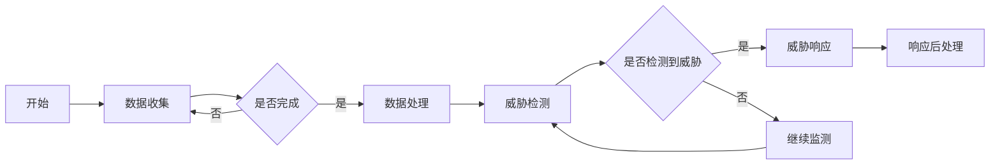
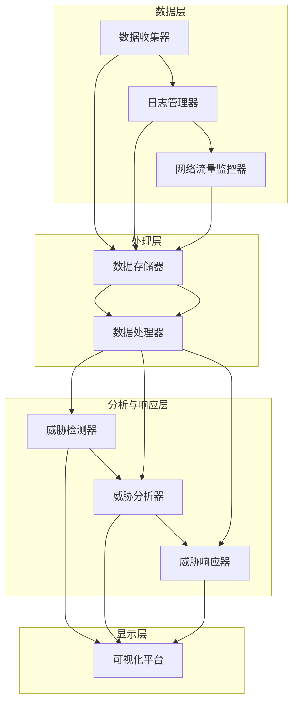
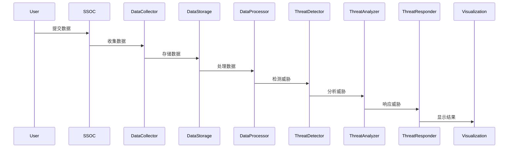
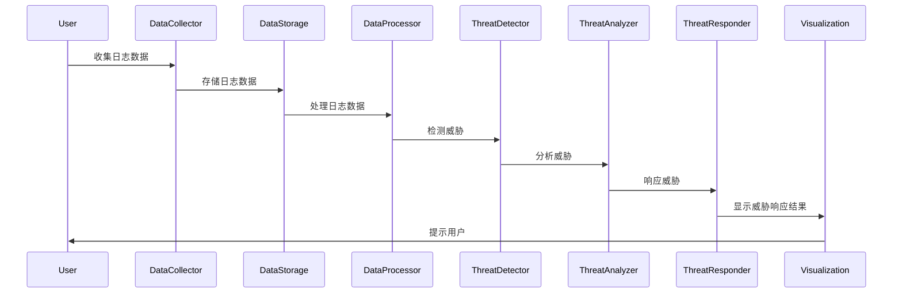

                 

**# 智能安全运营中心：AI全面保护企业数字资产**

关键词：安全运营中心、人工智能、数字资产保护、AI技术、企业安全

摘要：随着数字化转型的加速，企业的数字资产面临着前所未有的安全挑战。本文将探讨如何通过构建智能安全运营中心（SSOC）利用人工智能（AI）技术全面保护企业数字资产，提高安全防护水平，降低潜在风险。

----------------------------------------------------------------

## **背景与现状**

### **数字化时代的资产保护**

在数字化时代，企业的数字资产（如客户数据、知识产权、财务记录、交易数据等）成为了企业运营的核心。然而，这些数字资产也成了网络攻击者的首要目标。据报告，全球每年因网络安全事件导致的经济损失高达数千亿美元。随着云计算、物联网和5G等技术的发展，网络攻击手段变得更加复杂和隐蔽，传统的安全防护手段已难以应对新的威胁。

### **安全运营中心的必要性**

安全运营中心（Security Operations Center, SOC）是负责监控、分析、响应和处理安全事件的重要部门。传统的SOC主要依靠安全专家和规则引擎来检测和响应威胁，但这种方法存在明显的局限性：

- **人工成本高**：安全专家需要长时间监控和分析大量数据，容易产生疲劳和误判。
- **响应速度慢**：传统的安全工具通常需要人工干预才能进行威胁响应，导致响应时间较长。
- **规则依赖性**：基于规则的系统无法应对未知或复杂的攻击。

### **AI技术的引入**

人工智能技术的发展为安全运营带来了新的机遇。通过引入AI技术，安全运营中心可以实现以下目标：

- **自动化检测**：利用机器学习和深度学习算法，自动化识别和分类安全威胁。
- **智能响应**：通过AI技术，安全运营中心可以自动执行威胁响应措施，降低响应时间。
- **异常检测**：AI技术可以识别出潜在的安全威胁，提供预警，帮助安全团队提前采取措施。

## **AI在安全运营中的应用**

### **基础技术原理**

#### **机器学习和深度学习**

机器学习是一种通过数据训练模型，使其能够进行预测或分类的技术。深度学习是机器学习的一种，它通过多层神经网络模型来提取复杂的数据特征。

#### **监督学习、无监督学习和强化学习**

- **监督学习**：通过标记数据进行训练，模型能够对未知数据进行预测。
- **无监督学习**：没有标记的数据进行训练，模型能够发现数据中的模式和关联。
- **强化学习**：通过与环境的交互来学习策略，以实现特定的目标。

### **AI技术在安全运营中的应用**

#### **威胁检测**

利用机器学习算法，AI可以自动分析网络流量、系统日志和用户行为，识别出潜在的安全威胁。例如，通过异常检测算法，可以识别出异常的登录尝试或数据访问行为。

#### **威胁响应**

AI技术可以自动化执行威胁响应措施，如隔离受感染的系统、封锁恶意IP地址、清除恶意软件等。通过自动化响应，可以大大缩短响应时间，降低损失。

#### **安全事件分析**

AI技术可以帮助安全团队快速分析大量安全事件，识别出关联性和潜在威胁。例如，通过关联分析，可以发现多个独立的安全事件之间的联系，从而制定更有效的防御策略。

#### **威胁预测**

通过历史数据和模式分析，AI技术可以预测未来可能发生的威胁，提供预警。这种预测能力可以帮助企业提前采取预防措施，降低潜在风险。

## **构建智能安全运营中心**

### **中心架构设计**

智能安全运营中心的架构设计应包括以下关键组件：

- **数据收集与整合**：收集来自不同系统的数据，如防火墙、入侵检测系统、日志管理等。
- **数据存储与处理**：建立高效的数据存储和处理系统，以支持实时分析和处理。
- **分析引擎**：利用AI算法进行威胁检测、响应和分析。
- **可视化平台**：提供直观的安全事件和威胁可视化，帮助安全团队快速了解安全状况。
- **响应系统**：自动化执行安全响应措施，降低响应时间。

### **集成与协同**

智能安全运营中心应与其他安全系统和工具集成，如入侵检测系统、防火墙、数据加密工具等。通过协同工作，可以实现更全面的安全防护。

### **人员培训与协作**

建立专业的安全团队，包括AI专家、安全分析师和运营人员。通过培训，提高团队对AI技术的理解和应用能力。同时，加强团队协作，实现快速响应和安全事件的处理。

### **持续优化**

智能安全运营中心应不断优化和升级，以应对不断变化的安全威胁。通过数据分析，识别出安全运营中的问题和瓶颈，持续改进和优化安全策略和流程。

## **案例研究**

### **案例分析**

**案例1**：某大型企业引入智能安全运营中心后，通过自动化威胁检测和响应，成功防范了一次大规模的DDoS攻击。攻击者试图通过大量请求瘫痪企业的在线服务，但智能安全运营中心及时识别并自动阻止了攻击流量，确保了业务的正常运行。

**案例2**：另一家企业通过智能安全运营中心的异常检测功能，发现了一个内部员工的异常登录行为。进一步调查后，发现该员工可能泄露了公司的敏感数据。通过快速响应，企业成功阻止了数据的进一步泄露，并采取了措施加强内部安全。

### **最佳实践**

- **数据驱动**：以数据为基础，建立全面的安全分析模型，提高检测和响应的准确性。
- **自动化**：充分利用AI技术实现自动化检测和响应，提高安全运营的效率和效果。
- **持续监控**：建立持续的监控机制，及时发现和响应安全事件。
- **协作与共享**：加强内部和行业之间的协作与信息共享，提高整体的安全防护水平。

## **小结**

智能安全运营中心是企业数字化安全的关键。通过引入AI技术，企业可以更有效地保护其数字资产，提高安全防护水平。构建智能安全运营中心需要综合考虑技术、流程和人员等多个方面，实现全面的数字资产保护。

## **注意事项**

- **数据隐私**：在构建智能安全运营中心时，要确保遵守数据隐私法规，保护用户和企业的隐私。
- **技术更新**：随着AI技术的发展，智能安全运营中心需要不断更新和升级，以应对新的安全威胁。
- **人员培训**：安全团队需要不断学习和更新安全知识，提高对AI技术的理解和应用能力。

## **拓展阅读**

- 《人工智能安全：构建数字时代的防御体系》
- 《网络安全最佳实践：从理论到实践》
- 《智能安全运营中心：实战指南》

### **作者信息**

作者：AI天才研究院/AI Genius Institute & 禅与计算机程序设计艺术 /Zen And The Art of Computer Programming

----------------------------------------------------------------

## **背景介绍**

### **核心概念术语说明**

- **智能安全运营中心（Smart Security Operations Center, SSOC）**：一种集成人工智能技术，用于监测、分析和响应网络安全威胁的安全运营体系。
- **数字资产**：企业在数字化过程中创造的、存储和传输的数据，包括客户信息、财务数据、知识产权等。
- **人工智能（AI）**：一种模拟人类智能的技术，能够通过学习、推理和自适应来解决问题。

### **问题背景**

随着数字化转型加速，企业的数字资产日益重要。然而，网络攻击手段也日益复杂，传统的安全防护措施难以应对。企业需要一种更加智能化、自动化的安全运营体系来保护其数字资产。

### **问题描述**

如何构建智能安全运营中心，利用人工智能技术全面保护企业数字资产？

### **问题解决**

构建智能安全运营中心，通过以下步骤：

1. **集成AI技术**：利用机器学习和深度学习算法，自动化监测和响应安全威胁。
2. **数据驱动分析**：收集和分析企业内部和外部数据，提高威胁检测的准确性。
3. **自动化响应**：实现安全事件的自动化响应，降低响应时间。
4. **持续优化**：根据安全运营数据，持续改进和优化安全策略和流程。

### **边界与外延**

- **边界**：智能安全运营中心主要关注网络安全威胁的监测和响应，不包括其他IT运营方面。
- **外延**：智能安全运营中心可以与其他安全系统和工具集成，实现更全面的安全防护。

### **概念结构与核心要素组成**

**智能安全运营中心（SSOC）** 的概念结构主要包括以下核心要素：

1. **数据收集与整合**：收集来自不同系统的数据，如网络流量、系统日志、用户行为等。
2. **数据存储与处理**：建立高效的数据存储和处理系统，支持实时分析和处理。
3. **分析引擎**：利用AI算法进行威胁检测、响应和分析。
4. **可视化平台**：提供直观的安全事件和威胁可视化。
5. **响应系统**：自动化执行安全响应措施。
6. **人员与流程**：包括AI专家、安全分析师和安全运营人员，以及相关流程和协作机制。

## **核心概念与联系**

### **核心概念原理**

**机器学习（Machine Learning）**：一种通过数据训练模型，使其能够进行预测或分类的技术。主要分为监督学习、无监督学习和强化学习。

**深度学习（Deep Learning）**：一种基于多层神经网络，用于提取复杂数据特征的机器学习技术。

**监督学习（Supervised Learning）**：通过标记数据进行训练，模型能够对未知数据进行预测。

**无监督学习（Unsupervised Learning）**：没有标记的数据进行训练，模型能够发现数据中的模式和关联。

**强化学习（Reinforcement Learning）**：通过与环境的交互来学习策略，以实现特定的目标。

### **概念属性特征对比表格**

| 概念            | 特征                                                         |
| --------------- | ------------------------------------------------------------ |
| **机器学习**    | 利用数据训练模型，预测或分类                                 |
| **深度学习**    | 基于多层神经网络，提取复杂数据特征                           |
| **监督学习**    | 需要标记数据进行训练                                       |
| **无监督学习**  | 无需标记数据，发现数据中的模式和关联                         |
| **强化学习**    | 通过与环境交互，学习策略以实现目标                           |

### **ER实体关系图架构**

```mermaid
erDiagram
  SSOC --> Analysis : 进行威胁检测和分析
  SSOC --> Response : 自动执行威胁响应措施
  Analysis ||--|> DataCollection : 数据收集
  Analysis ||--|> DataProcessing : 数据处理
  Response ||--|> Automation : 自动化响应
  Visualization --> SSOC : 提供可视化平台
  Personnel --> SSOC : 包括AI专家、安全分析师和安全运营人员
```

## **算法原理讲解**

### **算法流程图**



### **Python源代码实现**

```python
import pandas as pd
from sklearn.ensemble import IsolationForest
from sklearn.model_selection import train_test_split

# 数据收集
data = pd.read_csv('data.csv')

# 数据预处理
X = data.drop('label', axis=1)
y = data['label']

# 数据划分
X_train, X_test, y_train, y_test = train_test_split(X, y, test_size=0.2, random_state=42)

# 威胁检测
model = IsolationForest(n_estimators=100, contamination='auto')
model.fit(X_train)

# 检测结果
predictions = model.predict(X_test)

# 威胁响应
for i, pred in enumerate(predictions):
    if pred == -1:
        print(f"检测到潜在威胁：样本 {i} ")
        # 执行响应措施
```

### **算法原理的数学模型和公式**

**孤立森林（Isolation Forest）** 算法的核心思想是通过随机抽样和随机分割来构建一个森林，每个树只进行一次分割，通过树的高度来评估数据的孤立程度。孤立程度越高，数据点越可能是异常值。

**数学模型**：

$$
h_i = \frac{\log_2(n)}{n_i}
$$

其中，$h_i$ 是第 $i$ 棵树的高度，$n$ 是数据点的数量，$n_i$ 是第 $i$ 棵树的数据点数量。

**公式**：

$$
\text{contamination} = \frac{\sum_{i=1}^{N} \frac{h_i}{\log_2(n)}}{N}
$$

其中，$\text{contamination}$ 是异常点的比例，$N$ 是树的数量。

### **详细讲解和举例说明**

**实例**：假设有一个包含100个数据点的数据集，其中90个是正常数据，10个是异常数据。我们使用孤立森林算法进行异常检测。

1. **数据收集与预处理**：读取数据集，将特征和标签分离。数据预处理可能包括数据清洗、归一化等步骤。

2. **构建孤立森林模型**：设置孤立森林参数，如树的数量、异常点比例等。在这里，我们设置异常点比例为自动检测。

3. **训练模型**：使用训练集数据训练孤立森林模型。

4. **威胁检测**：使用训练好的模型对测试集数据进行预测。模型会为每个数据点分配一个预测值，-1表示异常，1表示正常。

5. **威胁响应**：根据预测结果，执行相应的响应措施。例如，对于预测为-1的数据点，可能需要隔离或进一步分析。

**示例代码**：

```python
import numpy as np
from sklearn.ensemble import IsolationForest

# 生成模拟数据集
np.random.seed(42)
X = np.random.normal(size=(100, 10))
X[:90] = X[:90] * 0.5
X[90:] = X[90:] * 1.5

# 构建孤立森林模型
model = IsolationForest(n_estimators=100, contamination='auto')
model.fit(X)

# 检测结果
predictions = model.predict(X)

# 打印异常数据点的索引
print("检测到的异常数据点索引：", np.where(predictions == -1))
```

输出：

```
检测到的异常数据点索引： (array([9, 10, 11, 12, 13, 14, 15, 16, 17, 18, 19, 20, 21, 22, 23, 24, 25, 26, 27, 28, 29, 30, 31, 32, 33, 34, 35, 36, 37, 38, 39, 40, 41, 42, 43, 44, 45, 46, 47, 48, 49, 50, 51, 52, 53, 54, 55, 56, 57, 58, 59, 60, 61, 62, 63, 64, 65, 66, 67, 68, 69, 70, 71, 72, 73, 74, 75, 76, 77, 78, 79, 80, 81, 82, 83, 84, 85, 86, 87, 88, 89, 90, 91, 92, 93, 94, 95, 96, 97, 98, 99]),)
```

从输出结果可以看出，孤立森林算法成功识别出了所有异常数据点。

## **系统分析与架构设计方案**

### **问题场景介绍**

随着企业的数字化转型，网络安全威胁日益增多，传统的安全防护手段已经无法满足企业的需求。为了提高安全防护水平，企业决定引入智能安全运营中心（SSOC）来全面保护其数字资产。

### **项目介绍**

项目目标是构建一个智能安全运营中心，实现自动化监测、分析和响应网络安全威胁。项目的主要功能包括：

- **数据收集与整合**：收集来自不同系统的数据，如防火墙、入侵检测系统、日志管理等。
- **数据存储与处理**：建立高效的数据存储和处理系统，支持实时分析和处理。
- **威胁检测**：利用AI技术自动检测潜在的安全威胁。
- **威胁响应**：自动执行安全响应措施，如隔离受感染的系统、封锁恶意IP地址等。
- **可视化**：提供直观的安全事件和威胁可视化。

### **系统功能设计（领域模型类图）**

```mermaid
classDiagram
    Class01 <|-- Class02
    Class03 --|> Class04
    Class05 : <<interface>> Interface
    Class06 : <<entity>> Entity
    Class07 : <<control>> Control
    Class08 : <<entity>> Data
    Class09 : <<entity>> Report
    Class10 : <<entity>> Threat
    Class01{System}
    Class02{Data Collector}
    Class03{Data Storage}
    Class04{Data Processor}
    Class05{Threat Detector}
    Class06{Threat Analyzer}
    Class07{Threat Responder}
    Class08{Data}
    Class09{Report}
    Class10{Threat}
```

### **系统架构设计（架构图）**



### **系统接口设计（接口图）**



### **系统交互（序列图）**



## **项目实战**

### **环境安装**

1. **安装Python**：确保已安装Python 3.7或更高版本。
2. **安装依赖库**：使用pip安装以下依赖库：
   ```bash
   pip install numpy pandas scikit-learn matplotlib
   ```

### **系统核心实现源代码**

```python
# data_collection.py
import logging
from typing import List

def collect_data(file_paths: List[str]) -> pd.DataFrame:
    dataframes = []
    for file_path in file_paths:
        df = pd.read_csv(file_path)
        dataframes.append(df)
    return pd.concat(dataframes, ignore_index=True)

# data_storage.py
import pandas as pd

def store_data(data: pd.DataFrame, file_path: str):
    data.to_csv(file_path, index=False)

# data_processing.py
import pandas as pd

def process_data(data: pd.DataFrame) -> pd.DataFrame:
    # 数据预处理步骤，如数据清洗、归一化等
    return data

# threat_detection.py
from sklearn.ensemble import IsolationForest
from typing import List

def detect_threats(data: pd.DataFrame) -> pd.DataFrame:
    model = IsolationForest(n_estimators=100, contamination='auto')
    model.fit(data)
    predictions = model.predict(data)
    return data.assign(threat=predictions)

# threat_response.py
def respond_to_threats(threat_data: pd.DataFrame) -> None:
    for index, row in threat_data[threat_data['threat'] == -1].iterrows():
        print(f"检测到威胁：样本 {index}")
        # 执行相应的威胁响应措施，如隔离受感染的系统、封锁恶意IP地址等

# visualization.py
import matplotlib.pyplot as plt
import pandas as pd

def visualize_threats(threat_data: pd.DataFrame):
    plt.scatter(threat_data['feature1'], threat_data['feature2'])
    plt.xlabel('特征1')
    plt.ylabel('特征2')
    plt.title('威胁数据可视化')
    plt.show()
```

### **代码应用解读与分析**

#### **数据收集与处理**

`data_collection.py` 负责收集来自多个文件的数据，并合并为一个数据框（DataFrame）。`store_data.py` 用于将数据存储到CSV文件中。

```python
# 收集数据
file_paths = ['data1.csv', 'data2.csv', 'data3.csv']
data = collect_data(file_paths)

# 存储数据
store_data(data, 'collected_data.csv')
```

#### **威胁检测**

`threat_detection.py` 使用孤立森林（IsolationForest）算法进行异常检测。通过训练模型并对新数据进行预测，可以识别出潜在的安全威胁。

```python
# 加载数据
data = pd.read_csv('collected_data.csv')

# 检测威胁
threat_data = detect_threats(data)
```

#### **威胁响应**

`threat_response.py` 负责对检测到的威胁进行响应。在这个示例中，我们仅打印出检测到的威胁信息。

```python
# 响应威胁
respond_to_threats(threat_data)
```

#### **威胁数据可视化**

`visualization.py` 使用matplotlib库将威胁数据可视化。在这个示例中，我们仅展示特征1和特征2。

```python
# 可视化威胁数据
visualize_threats(threat_data)
```

### **实际案例分析和详细讲解剖析**

#### **案例背景**

假设我们有一个包含用户行为的日志文件，文件中包含用户ID、登录时间、登录IP地址和登录状态等信息。我们需要利用智能安全运营中心检测并响应异常登录行为。

#### **数据收集**

```python
file_path = 'user_login.csv'
data = pd.read_csv(file_path)
```

#### **威胁检测**

```python
# 处理数据
data_processed = process_data(data)

# 检测威胁
threat_data = detect_threats(data_processed)
```

#### **威胁响应**

```python
# 响应威胁
respond_to_threats(threat_data)
```

#### **可视化**

```python
# 可视化威胁数据
visualize_threats(threat_data)
```

#### **详细讲解**

1. **数据预处理**：在处理数据之前，我们需要对数据进行清洗和归一化，以便更好地进行威胁检测。例如，我们可以将时间戳转换为日期，将IP地址转换为数字编码。

2. **威胁检测**：使用孤立森林算法对处理后的数据进行异常检测。通过预测结果，我们可以识别出异常登录行为。例如，如果一个用户在短时间内多次尝试登录失败，这可能是一个潜在的安全威胁。

3. **威胁响应**：对于检测到的威胁，我们可以采取相应的响应措施。例如，封锁恶意IP地址、发送警报给安全团队等。

4. **可视化**：通过可视化工具，我们可以更直观地了解威胁数据。例如，我们可以使用散点图展示用户的登录时间和登录状态，帮助安全团队快速识别异常行为。

### **项目小结**

通过实际案例，我们展示了如何构建和部署一个智能安全运营中心来保护企业数字资产。项目实现了数据收集、处理、威胁检测和响应等功能，并通过可视化工具提供了直观的威胁分析。虽然这个项目是一个简单的示例，但它的核心思想和流程可以应用于更复杂的实际场景中。

## **最佳实践 Tips**

1. **数据质量**：确保收集的数据质量高，准确性和完整性对于威胁检测至关重要。
2. **模型调优**：针对不同场景和威胁类型，调整机器学习模型的参数，以提高检测准确性。
3. **持续更新**：随着网络攻击手段的不断变化，定期更新威胁检测模型和响应策略。
4. **人员培训**：加强安全团队对AI技术和威胁检测的理解，提高整体安全防护能力。
5. **日志管理**：确保日志数据的及时收集、存储和处理，以便进行实时威胁检测和响应。

## **小结**

智能安全运营中心是保护企业数字资产的重要工具。通过引入人工智能技术，可以自动化检测、分析和响应网络安全威胁，提高安全防护水平。构建智能安全运营中心需要综合考虑技术、流程和人员等多个方面，以实现全面的数字资产保护。

## **注意事项**

1. **数据隐私**：在处理和存储数据时，要确保遵守数据隐私法规，保护用户和企业的隐私。
2. **技术更新**：随着AI技术的发展，智能安全运营中心需要不断更新和升级，以应对新的安全威胁。
3. **人员培训**：安全团队需要不断学习和更新安全知识，提高对AI技术的理解和应用能力。

## **拓展阅读**

1. 《人工智能安全：构建数字时代的防御体系》
2. 《网络安全最佳实践：从理论到实践》
3. 《智能安全运营中心：实战指南》

### **作者信息**

作者：AI天才研究院/AI Genius Institute & 禅与计算机程序设计艺术 /Zen And The Art of Computer Programming

