                 


### 文章标题：智能客户关系管理系统：AI优化客户体验

#### 关键词：客户关系管理，人工智能，优化，客户体验，AI优化策略

#### 摘要：
本文深入探讨了智能客户关系管理系统（CRM）的发展背景、核心概念、架构设计以及AI技术如何优化客户体验。通过对AI技术的详细剖析和应用案例分析，本文为读者提供了实施智能CRM系统的实用指南和未来发展趋势的展望。

----------------------------------------------------------------

### 第1章：CRM与AI的融合背景

#### 1.1 客户关系管理（CRM）的历史与发展

客户关系管理（CRM）起源于20世纪80年代，最初是作为营销管理工具出现的。CRM系统的核心目的是通过整合企业内外部的数据资源，提高客户满意度和忠诚度，从而增强企业的竞争力。

**核心概念术语说明：**

- **CRM系统：** 用于收集、分析和整合客户数据的软件系统。
- **客户满意度和忠诚度：** 客户对产品或服务的满意度以及持续使用该产品的意愿。

**问题背景：**

随着市场的竞争日益激烈，企业意识到了解和满足客户需求的重要性。传统的CRM系统主要侧重于客户数据的收集和管理，但随着大数据和人工智能技术的发展，现代CRM系统开始融入AI技术，以实现更高效的客户体验优化。

**问题描述：**

传统CRM系统在数据分析和个性化服务方面存在局限性，难以满足客户日益增长的需求。如何通过AI技术提升CRM系统的智能化水平，成为当前企业面临的挑战。

**问题解决：**

AI技术的引入，使得CRM系统能够自动分析和处理大量客户数据，实现个性化服务、智能预测和实时响应，从而提高客户满意度和忠诚度。

**边界与外延：**

- **AI在CRM中的应用：** 自然语言处理（NLP）、机器学习（ML）、深度学习（DL）等。
- **智能CRM系统的核心要素：** 数据采集、分析、个性化推荐、智能客服等。

#### 1.2 AI技术的发展与商业应用

人工智能（AI）作为计算机科学的一个分支，旨在使计算机具备人类智能。近年来，AI技术取得了显著的进展，并逐渐在商业领域得到广泛应用。

**核心概念原理：**

- **机器学习（ML）：** 基于数据驱动的方法，使计算机从数据中学习并改进性能。
- **深度学习（DL）：** 基于多层神经网络，实现复杂的特征提取和模式识别。

**概念属性特征对比表格：**

| 特征          | 机器学习（ML）                    | 深度学习（DL）                    |
| ------------- | ------------------------------ | ------------------------------ |
| 基本原理      | 根据已有数据建立模型，预测新数据 | 基于多层神经网络，自动学习特征  |
| 应用场景      | 数据量较小，特征明确             | 数据量大，特征复杂             |
| 特点          | 需要人工设计特征                | 自动学习特征，无需人工干预      |
| 成熟度        | 较为成熟，广泛应用               | 处于快速发展阶段，应用广泛      |

**ER实体关系图架构：**

```mermaid
erDiagram
  Customer ||--|{ CRM_System }|--| Customer_Data
  Customer ||--|{ Customer_Segmentation }|--| Segment_Data
  Customer ||--|{ Customer_Service }|--| Service_Data
  Customer ||--|{ Customer_Support }|--| Support_Data
```

#### 1.3 智能CRM系统的需求与意义

智能CRM系统不仅能够提高客户满意度和忠诚度，还具有以下需求与意义：

- **个性化服务：** 通过AI技术，实现针对不同客户群体的个性化服务，提高客户体验。
- **智能预测：** 利用机器学习模型，预测客户行为，提前采取措施，降低客户流失率。
- **实时响应：** 通过智能客服系统，实现实时响应客户需求，提高客户满意度。
- **数据驱动：** 基于大数据和AI技术，实现数据驱动的决策，提高企业竞争力。

综上所述，智能CRM系统已成为企业提升客户关系管理和竞争力的关键手段。

----------------------------------------------------------------

### 第2章：智能客户关系管理系统的核心概念

#### 2.1 客户关系管理的基本概念

客户关系管理（CRM）是一种企业战略，旨在通过整合和利用各种资源，提高客户满意度和忠诚度，从而实现业务增长和竞争力提升。

**核心概念术语说明：**

- **客户生命周期：** 客户与企业建立关系、使用产品或服务、持续购买、最终离弃的全过程。
- **客户价值：** 客户对企业贡献的价值，包括当前价值、潜在价值和总价值。

#### 2.2 人工智能的基本原理

人工智能（AI）是一种模拟人类智能的技术，使计算机具备感知、学习、推理和决策能力。AI技术主要包括机器学习（ML）、深度学习（DL）和自然语言处理（NLP）等。

**核心概念原理：**

- **机器学习（ML）：** 基于数据驱动的方法，使计算机从数据中学习并改进性能。
- **深度学习（DL）：** 基于多层神经网络，实现复杂的特征提取和模式识别。
- **自然语言处理（NLP）：** 使计算机理解和生成人类语言的技术。

**概念属性特征对比表格：**

| 特征          | 机器学习（ML）                    | 深度学习（DL）                    | 自然语言处理（NLP）          |
| ------------- | ------------------------------ | ------------------------------ | -------------------------- |
| 基本原理      | 根据已有数据建立模型，预测新数据 | 基于多层神经网络，自动学习特征  | 使计算机理解和生成人类语言  |
| 应用场景      | 数据量较小，特征明确             | 数据量大，特征复杂             | 文本分析、语音识别、机器翻译 |
| 特点          | 需要人工设计特征                | 自动学习特征，无需人工干预      | 处理自然语言数据           |
| 成熟度        | 较为成熟，广泛应用               | 处于快速发展阶段，应用广泛      | 较为成熟，广泛应用         |

**ER实体关系图架构：**

```mermaid
erDiagram
  Customer ||--|{ Customer_Profile }|--| Customer_Info
  Customer ||--|{ Customer_History }|--| Purchase_History
  Customer ||--|{ Customer_Conditions }|--| Customer_Score
  Customer ||--|{ Customer_Relationships }|--| Relationship_Data
```

#### 2.3 AI在CRM中的应用领域

AI技术在CRM系统中的应用主要集中在以下领域：

- **客户细分与定位：** 通过机器学习和深度学习算法，实现针对不同客户群体的精准定位和个性化服务。
- **智能客服：** 利用自然语言处理技术，实现智能客服机器人，提供实时响应和个性化服务。
- **预测分析：** 利用机器学习模型，预测客户行为，提前采取措施，降低客户流失率。
- **个性化推荐：** 基于客户历史数据和喜好，实现个性化推荐，提高客户满意度和转化率。

综上所述，智能CRM系统通过AI技术的融合，实现了从传统CRM系统向智能化CRM系统的转变，为企业提供了更强大的客户管理工具。

----------------------------------------------------------------

### 第3章：智能CRM系统的基础架构

#### 3.1 智能CRM系统的总体架构

智能CRM系统的总体架构包括数据层、应用层和表现层。数据层负责数据的采集、存储和管理；应用层实现AI算法和业务逻辑；表现层提供用户界面，实现与用户的交互。

**系统功能设计（领域模型mermaid类图）：**

```mermaid
classDiagram
  Customer <<class>> CustomerData
  Customer <<class>> CustomerSegmentation
  Customer <<class>> CustomerService
  Customer <<class>> CustomerSupport
  CustomerData  CustomerSegmentation
  CustomerData  CustomerService
  CustomerData  CustomerSupport
  CustomerSegmentation  CustomerService
  CustomerSegmentation  CustomerSupport
  CustomerService  CustomerSupport
```

#### 3.2 数据采集与处理

数据采集与处理是智能CRM系统的核心环节。数据来源包括内部数据（如销售数据、客户反馈）和外部数据（如社交媒体、市场调研）。

**系统架构设计（mermaid架构图）：**

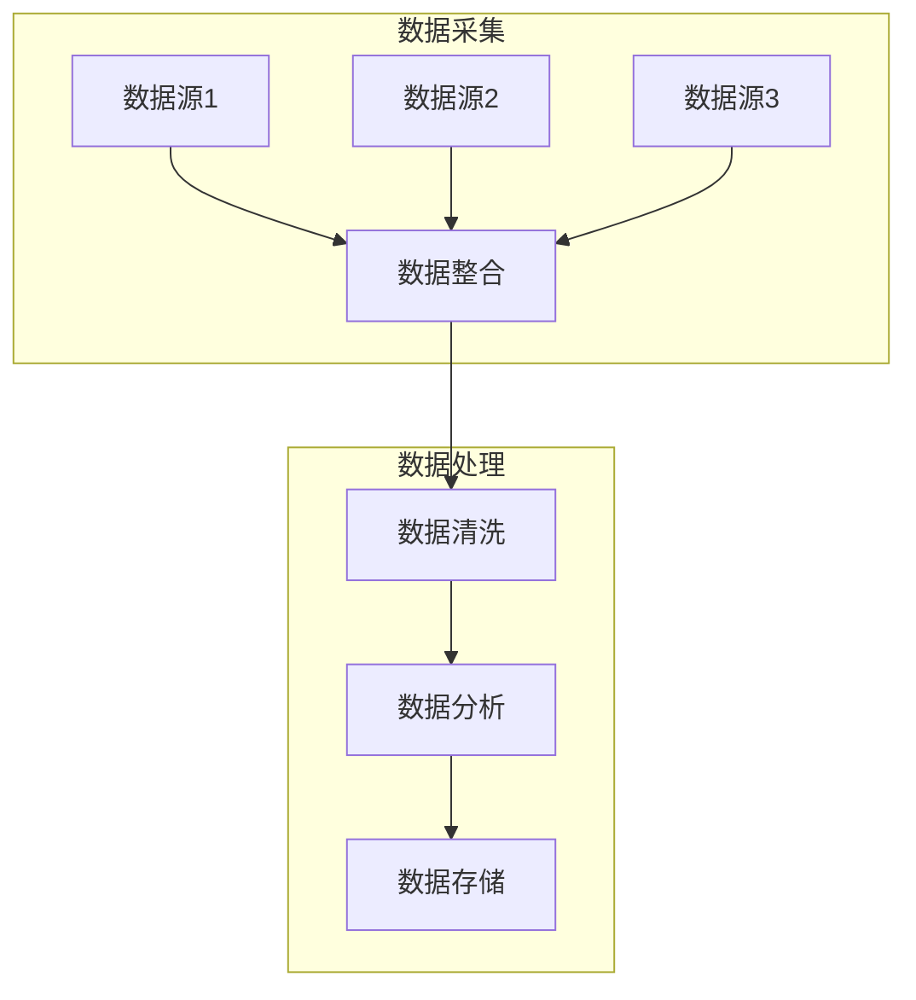

#### 3.3 客户画像与客户标签

客户画像是指通过对客户数据的分析，构建客户的综合特征描述。客户标签则是用于描述客户特征的关键字或属性。

**客户画像与客户标签的关系：**

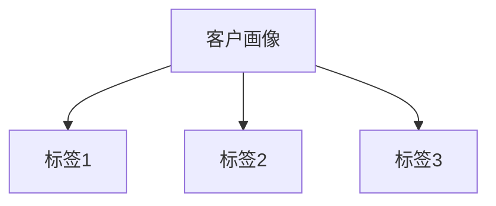

#### 3.4 智能推荐系统

智能推荐系统基于客户画像和标签，实现个性化推荐。推荐算法主要包括协同过滤、基于内容的推荐和混合推荐。

**推荐算法流程（mermaid流程图）：**

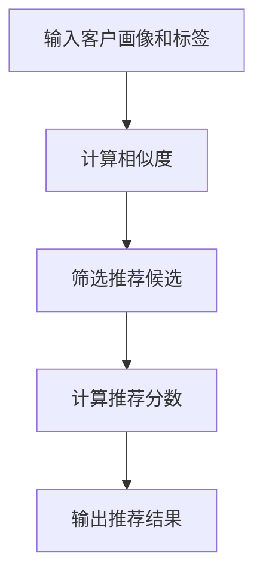

综上所述，智能CRM系统的基础架构包括数据采集与处理、客户画像与客户标签以及智能推荐系统。这些组件共同构成了一个高效、智能的客户关系管理系统。

----------------------------------------------------------------

### 第4章：AI优化客户体验的关键技术

#### 4.1 自然语言处理（NLP）

自然语言处理（NLP）是AI技术的一个重要分支，旨在使计算机理解和生成人类语言。在智能CRM系统中，NLP技术主要用于智能客服、情感分析和文本挖掘等方面。

**NLP技术在智能CRM系统中的应用：**

- **智能客服：** 利用NLP技术，实现智能客服机器人，自动解答客户问题，提高客户满意度。
- **情感分析：** 通过分析客户反馈，识别客户的情绪和情感，为企业提供改进服务的依据。
- **文本挖掘：** 从大量文本数据中提取有价值的信息，如关键词、主题和趋势，帮助企业在市场竞争中把握机会。

**NLP算法原理讲解（mermaid流程图）：**

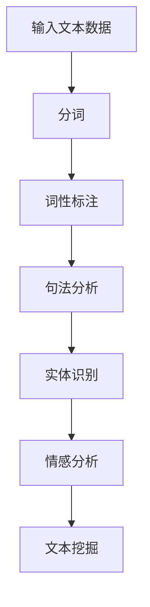

**NLP算法Python代码实现：**

```python
import nltk
from nltk.tokenize import word_tokenize
from nltk.corpus import stopwords
from nltk.sentiment import SentimentIntensityAnalyzer

# 加载停用词库
stop_words = set(stopwords.words('english'))

# 输入文本
text = "I am very happy with the product."

# 分词
tokens = word_tokenize(text)

# 去除停用词
filtered_tokens = [word for word in tokens if not word in stop_words]

# 词性标注
pos_tags = nltk.pos_tag(filtered_tokens)

# 情感分析
sia = SentimentIntensityAnalyzer()
sentiment_scores = sia.polarity_scores(text)

print("Sentiment Scores:", sentiment_scores)
```

#### 4.2 机器学习与深度学习

机器学习（ML）和深度学习（DL）是AI技术的核心，广泛应用于智能CRM系统的各个领域。

**机器学习与深度学习的基本原理：**

- **机器学习（ML）：** 基于数据驱动的方法，使计算机从数据中学习并改进性能。主要算法包括线性回归、决策树、支持向量机等。
- **深度学习（DL）：** 基于多层神经网络，实现复杂的特征提取和模式识别。主要算法包括卷积神经网络（CNN）、循环神经网络（RNN）等。

**机器学习与深度学习在智能CRM系统中的应用：**

- **客户细分与定位：** 利用聚类算法（如K-means、层次聚类）和分类算法（如决策树、随机森林）实现客户细分和定位。
- **预测分析：** 利用回归模型（如线性回归、逻辑回归）和分类模型（如SVM、朴素贝叶斯）预测客户行为。
- **智能客服：** 利用神经网络（如RNN、LSTM）实现智能客服机器人，自动解答客户问题。

**机器学习与深度学习算法流程（mermaid流程图）：**

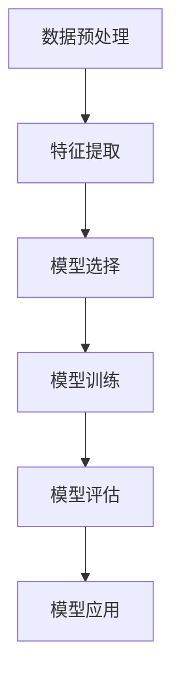

**机器学习与深度学习Python代码实现：**

```python
from sklearn.datasets import load_iris
from sklearn.model_selection import train_test_split
from sklearn.ensemble import RandomForestClassifier
from sklearn.metrics import accuracy_score

# 加载鸢尾花数据集
iris = load_iris()
X = iris.data
y = iris.target

# 数据集划分
X_train, X_test, y_train, y_test = train_test_split(X, y, test_size=0.3, random_state=42)

# 构建随机森林分类器
rf = RandomForestClassifier(n_estimators=100, random_state=42)

# 模型训练
rf.fit(X_train, y_train)

# 模型预测
y_pred = rf.predict(X_test)

# 模型评估
accuracy = accuracy_score(y_test, y_pred)
print("Accuracy:", accuracy)
```

#### 4.3 计算机视觉

计算机视觉是AI技术的另一个重要分支，旨在使计算机理解图像和视频。在智能CRM系统中，计算机视觉技术主要用于图像识别、人脸识别和图像分析等方面。

**计算机视觉在智能CRM系统中的应用：**

- **图像识别：** 通过卷积神经网络（CNN）实现图像分类和识别，如产品识别、场景识别等。
- **人脸识别：** 通过深度学习算法实现人脸识别，用于身份验证和个性化服务。
- **图像分析：** 通过图像分析技术，提取图像中的有用信息，如人脸检测、情感识别等。

**计算机视觉算法原理讲解（mermaid流程图）：**

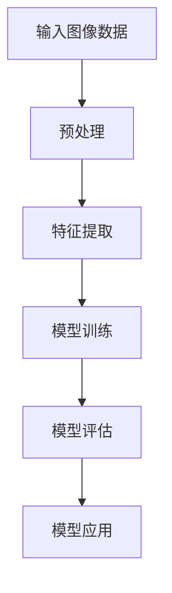

**计算机视觉Python代码实现：**

```python
import cv2
import numpy as np

# 加载图像
image = cv2.imread("example.jpg")

# 图像预处理
gray = cv2.cvtColor(image, cv2.COLOR_BGR2GRAY)
blur = cv2.GaussianBlur(gray, (5, 5), 0)
thresh = cv2.threshold(blur, 60, 255, cv2.THRESH_BINARY)[1]

# 人脸检测
face_cascade = cv2.CascadeClassifier("haarcascade_frontalface_default.xml")
faces = face_cascade.detectMultiScale(blur, scaleFactor=1.1, minNeighbors=5, minSize=(30, 30), flags=cv2.CASCADE_SCALE_IMAGE)

# 绘制人脸框
for (x, y, w, h) in faces:
    cv2.rectangle(image, (x, y), (x+w, y+h), (0, 255, 0), 2)

# 显示结果
cv2.imshow("Result", image)
cv2.waitKey(0)
cv2.destroyAllWindows()
```

#### 4.4 智能对话系统

智能对话系统是一种基于AI技术的交互系统，能够与用户进行自然语言对话，提供个性化服务和支持。

**智能对话系统的工作原理：**

- **语音识别：** 将用户的语音转换为文本。
- **自然语言处理：** 分析文本，理解用户意图。
- **对话管理：** 根据用户意图，生成合适的回复。
- **语音合成：** 将回复文本转换为语音。

**智能对话系统的应用场景：**

- **智能客服：** 自动解答客户问题，提高客户满意度。
- **智能家居：** 与用户进行语音交互，提供智能家居控制。
- **智能助手：** 提供日程管理、信息查询等个性化服务。

**智能对话系统架构（mermaid流程图）：**

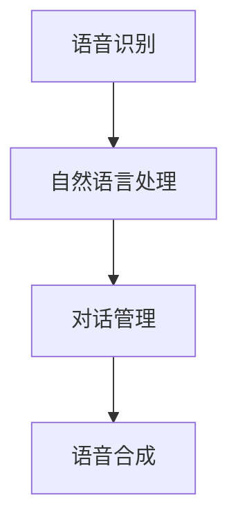

**智能对话系统Python代码实现：**

```python
import speech_recognition as sr
import pyttsx3

# 初始化语音识别引擎
recognizer = sr.Recognizer()

# 初始化语音合成引擎
engine = pyttsx3.init()

# 语音识别
def recognize_speech_from_mic():
    with sr.Microphone() as source:
        print("请说话：")
        audio = recognizer.listen(source)

    try:
        text = recognizer.recognize_google(audio)
        print("你说了：", text)
        return text
    except sr.UnknownValueError:
        print("无法理解音频")
        return None
    except sr.RequestError:
        print("无法请求结果；检查网络连接")
        return None

# 语音合成
def speak(text):
    engine.say(text)
    engine.runAndWait()

# 主程序
if __name__ == "__main__":
    user_input = recognize_speech_from_mic()
    if user_input:
        speak(user_input)
```

综上所述，AI优化客户体验的关键技术包括自然语言处理（NLP）、机器学习与深度学习、计算机视觉和智能对话系统。这些技术为智能CRM系统提供了强大的数据分析和处理能力，有助于提高客户满意度和忠诚度。

----------------------------------------------------------------

### 第5章：智能客户服务与支持

#### 5.1 自动化客户服务

自动化客户服务是智能CRM系统的重要组成部分，旨在通过技术手段提高客户服务质量，降低人力成本。自动化客户服务主要包括以下方面：

- **自动应答系统：** 当客户与企业联系时，自动应答系统可以立即响应，提供常见问题的答案或引导客户进行自助服务。
- **智能客服机器人：** 利用自然语言处理（NLP）和机器学习技术，智能客服机器人可以自动识别客户的问题，并提供相应的解决方案。
- **自助服务门户：** 通过在线自助服务门户，客户可以自行解决常见问题，如账户查询、订单状态查询等。

**自动化客户服务工作流程（mermaid流程图）：**

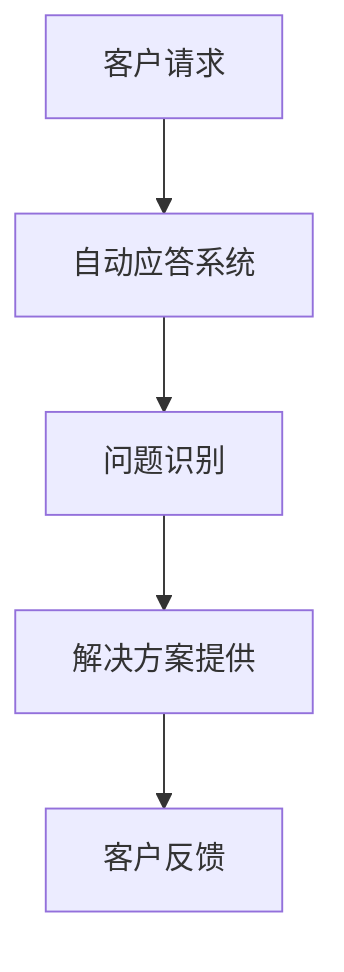

**自动化客户服务Python代码实现：**

```python
import nltk
from nltk.tokenize import word_tokenize
from nltk.corpus import stopwords
from nltk.sentiment import SentimentIntensityAnalyzer
import random

# 加载停用词库
stop_words = set(stopwords.words('english'))

# 输入问题
question = "How can I return a product?"

# 分词
tokens = word_tokenize(question)

# 去除停用词
filtered_tokens = [word for word in tokens if not word in stop_words]

# 情感分析
sia = SentimentIntensityAnalyzer()
sentiment_scores = sia.polarity_scores(question)

# 根据情感得分提供解决方案
if sentiment_scores['compound'] > 0.5:
    solution = "You can return the product by following these steps:"
elif sentiment_scores['compound'] < -0.5:
    solution = "I'm sorry to hear that. Let's see if we can resolve this issue:"
else:
    solution = "Here's how you can return a product:" 

# 提供解决方案
print(solution)
```

#### 5.2 智能客服机器人

智能客服机器人是自动化客户服务的重要工具，利用NLP和机器学习技术，实现与客户的自然语言交互。智能客服机器人具有以下优势：

- **高效响应：** 智能客服机器人可以实时响应客户的问题，提供即时的解决方案。
- **个性化服务：** 通过分析客户历史数据，智能客服机器人可以提供个性化的服务和建议。
- **降低成本：** 智能客服机器人可以替代部分人工服务，降低企业的人力成本。

**智能客服机器人工作流程（mermaid流程图）：**

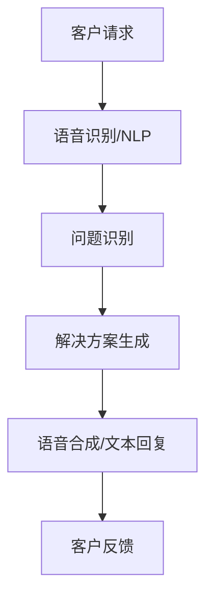

**智能客服机器人Python代码实现：**

```python
import speech_recognition as sr
import pyttsx3

# 初始化语音识别引擎
recognizer = sr.Recognizer()

# 初始化语音合成引擎
engine = pyttsx3.init()

# 语音识别
def recognize_speech_from_mic():
    with sr.Microphone() as source:
        print("请说话：")
        audio = recognizer.listen(source)

    try:
        text = recognizer.recognize_google(audio)
        print("你说了：", text)
        return text
    except sr.UnknownValueError:
        print("无法理解音频")
        return None
    except sr.RequestError:
        print("无法请求结果；检查网络连接")
        return None

# 语音合成
def speak(text):
    engine.say(text)
    engine.runAndWait()

# 主程序
if __name__ == "__main__":
    user_input = recognize_speech_from_mic()
    if user_input:
        speak("感谢您的提问，我将尽力帮助您解决问题。您的问题是：" + user_input)
```

#### 5.3 客户反馈分析与处理

客户反馈是智能CRM系统的重要数据来源，通过分析客户反馈，企业可以了解客户需求，优化产品和服务。客户反馈分析与处理主要包括以下步骤：

- **数据收集：** 通过问卷调查、在线评价、社交媒体等多种渠道收集客户反馈。
- **数据清洗：** 对收集到的客户反馈进行清洗，去除无效数据和噪音。
- **情感分析：** 利用NLP技术，分析客户反馈的情感倾向，识别客户满意度和痛点。
- **数据可视化：** 将分析结果通过图表和报告形式展示，帮助企业制定改进策略。

**客户反馈分析与处理工作流程（mermaid流程图）：**

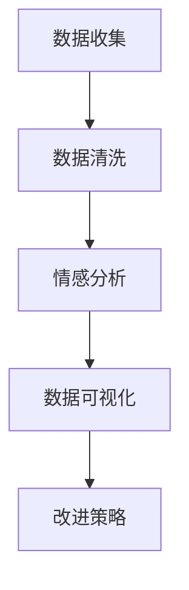

**客户反馈分析与处理Python代码实现：**

```python
import nltk
from nltk.tokenize import word_tokenize
from nltk.corpus import stopwords
from nltk.sentiment import SentimentIntensityAnalyzer
import pandas as pd

# 加载停用词库
stop_words = set(stopwords.words('english'))

# 输入客户反馈数据
feedback_data = [
    "I'm very satisfied with the product.",
    "I had a bad experience with the delivery.",
    "The customer service was excellent."
]

# 分词和去除停用词
def preprocess_feedback(feedback):
    tokens = word_tokenize(feedback)
    filtered_tokens = [word for word in tokens if not word in stop_words]
    return filtered_tokens

# 情感分析
def analyze_feedback(feedback):
    sia = SentimentIntensityAnalyzer()
    sentiment_scores = sia.polarity_scores(feedback)
    return sentiment_scores

# 数据可视化
def visualize_feedback(feedback_data):
    scores = [analyze_feedback(feedback) for feedback in feedback_data]
    df = pd.DataFrame(scores)
    df['compound'] = df['compound'].apply(lambda x: 'Positive' if x > 0 else 'Negative' if x < 0 else 'Neutral')
    print(df)

# 主程序
if __name__ == "__main__":
    preprocess_feedback("I'm very satisfied with the product.")
    visualize_feedback(feedback_data)
```

#### 5.4 客户满意度评估

客户满意度评估是衡量企业服务质量的重要指标，通过分析客户满意度，企业可以了解自身的优势和不足，从而制定改进措施。客户满意度评估主要包括以下步骤：

- **满意度调查：** 通过问卷调查、访谈等方式收集客户满意度数据。
- **数据整理：** 对收集到的数据进行整理和统计，计算满意度得分。
- **分析评估：** 利用统计分析方法，分析客户满意度的影响因素，评估整体满意度水平。
- **报告生成：** 将分析结果以报告形式呈现，为企业提供改进建议。

**客户满意度评估工作流程（mermaid流程图）：**

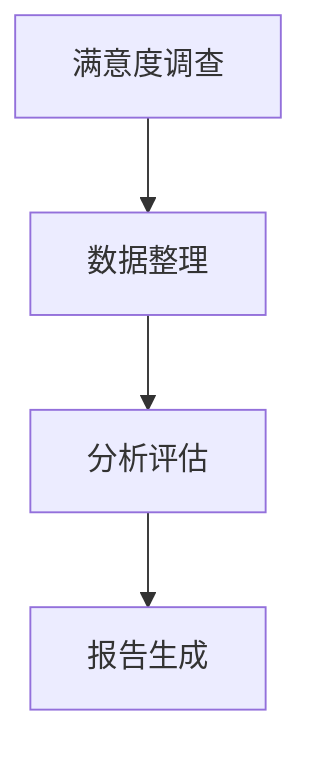

**客户满意度评估Python代码实现：**

```python
import pandas as pd
from scipy.stats import norm

# 输入满意度调查数据
satisfaction_data = [
    {'name': 'Alice', 'rating': 5},
    {'name': 'Bob', 'rating': 4},
    {'name': 'Charlie', 'rating': 3},
    {'name': 'David', 'rating': 2},
    {'name': 'Eva', 'rating': 1}
]

# 数据整理
satisfaction_df = pd.DataFrame(satisfaction_data)
mean_rating = satisfaction_df['rating'].mean()
std_rating = satisfaction_df['rating'].std()

# 分析评估
def calculate_entropy(p):
    return -p * np.log2(p)

# 计算满意度熵
entropy = calculate_entropy(satisfaction_df['rating'].value_counts() / len(satisfaction_df['rating']))
print("满意度熵：", entropy)

# 报告生成
print(f"平均满意度评分：{mean_rating:.2f}")
print(f"满意度标准差：{std_rating:.2f}")
print(f"满意度熵：{entropy:.2f}")
```

综上所述，智能客户服务与支持是智能CRM系统的重要组成部分，通过自动化客户服务、智能客服机器人、客户反馈分析与处理以及客户满意度评估，企业可以优化客户体验，提高客户满意度和忠诚度。

----------------------------------------------------------------

### 第6章：智能营销策略与实施

#### 6.1 数据驱动的营销策略

数据驱动的营销策略是一种基于大数据和AI技术的营销方法，通过分析客户数据，制定个性化的营销策略，提高营销效果和客户转化率。

**数据驱动的营销策略核心步骤：**

- **数据收集：** 收集客户的基本信息、行为数据、交易数据等。
- **数据分析：** 利用数据分析技术，分析客户特征、行为模式、需求等。
- **客户细分：** 根据数据分析结果，将客户划分为不同的细分群体。
- **个性化营销：** 针对不同细分群体，制定个性化的营销策略。

**数据驱动的营销策略流程图（mermaid流程图）：**

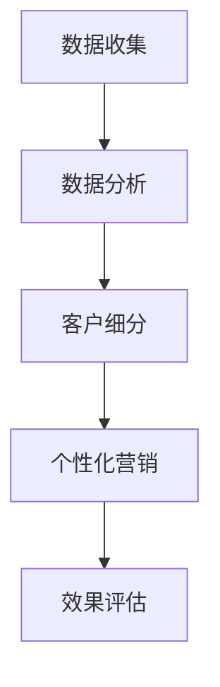

**数据驱动的营销策略Python代码实现：**

```python
import pandas as pd
from sklearn.cluster import KMeans

# 加载客户数据
customer_data = pd.read_csv("customer_data.csv")

# 数据预处理
customer_data.drop(['customer_id'], axis=1, inplace=True)
customer_data.fillna(0, inplace=True)

# 数据标准化
from sklearn.preprocessing import StandardScaler
scaler = StandardScaler()
customer_data_scaled = scaler.fit_transform(customer_data)

# K-means聚类
kmeans = KMeans(n_clusters=3, random_state=42)
customer_clusters = kmeans.fit_predict(customer_data_scaled)

# 客户细分
customer_data['cluster'] = customer_clusters
print(customer_data.head())

# 个性化营销
def personalized_messaging(cluster):
    if cluster == 0:
        return "欢迎加入我们的高端会员，享受专属优惠！"
    elif cluster == 1:
        return "感谢您的支持，我们为您推荐最新产品！"
    elif cluster == 2:
        return "您好，我们注意到您近期购买较少，特此为您准备优惠活动！"

# 个性化营销消息
cluster_0_message = personalized_messaging(0)
cluster_1_message = personalized_messaging(1)
cluster_2_message = personalized_messaging(2)

# 发送个性化营销消息
print(cluster_0_message)
print(cluster_1_message)
print(cluster_2_message)
```

#### 6.2 AI优化的客户细分与定位

AI技术可以基于客户的特征和行为数据，实现更精细的客户细分和定位。通过机器学习和深度学习算法，企业可以识别出具有相似特征的客户群体，并针对性地制定营销策略。

**AI优化的客户细分与定位核心步骤：**

- **特征工程：** 提取客户数据中的有用特征，如购买历史、浏览行为、社交媒体活动等。
- **算法选择：** 根据业务需求，选择合适的机器学习和深度学习算法，如聚类、分类、协同过滤等。
- **模型训练与评估：** 利用训练数据，训练模型并进行评估，选择最优模型。
- **客户细分与定位：** 根据模型预测结果，将客户划分为不同的细分群体，并进行定位。

**AI优化的客户细分与定位流程图（mermaid流程图）：**

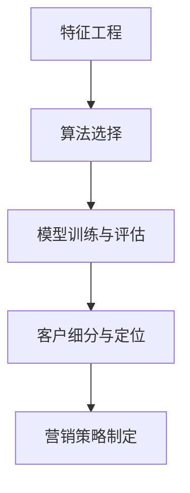

**AI优化的客户细分与定位Python代码实现：**

```python
import pandas as pd
from sklearn.cluster import KMeans
from sklearn.model_selection import train_test_split
from sklearn.metrics import accuracy_score

# 加载客户数据
customer_data = pd.read_csv("customer_data.csv")

# 数据预处理
customer_data.drop(['customer_id'], axis=1, inplace=True)
customer_data.fillna(0, inplace=True)

# 数据标准化
from sklearn.preprocessing import StandardScaler
scaler = StandardScaler()
customer_data_scaled = scaler.fit_transform(customer_data)

# 数据划分
X_train, X_test, y_train, y_test = train_test_split(customer_data_scaled, test_size=0.3, random_state=42)

# K-means聚类
kmeans = KMeans(n_clusters=3, random_state=42)
customer_clusters = kmeans.fit_predict(X_train)

# 客户细分
customer_data['cluster'] = kmeans.predict(X_test)
print(customer_data.head())

# 模型评估
accuracy = accuracy_score(y_test, customer_clusters)
print("Accuracy:", accuracy)

# 营销策略制定
def marketing_strategy(cluster):
    if cluster == 0:
        return "高端客户，提供专属优惠和增值服务。"
    elif cluster == 1:
        return "普通客户，推送新品信息和促销活动。"
    elif cluster == 2:
        return "潜在流失客户，开展关怀和挽回活动。"

# 营销策略
cluster_0_strategy = marketing_strategy(0)
cluster_1_strategy = marketing_strategy(1)
cluster_2_strategy = marketing_strategy(2)

# 发送营销策略
print(cluster_0_strategy)
print(cluster_1_strategy)
print(cluster_2_strategy)
```

#### 6.3 营销自动化与个性化推广

营销自动化与个性化推广是将数据驱动的营销策略落地实施的关键，通过自动化工具和个性化内容，提高营销效率和效果。

**营销自动化与个性化推广核心步骤：**

- **自动化工具：** 利用营销自动化工具，实现自动化的营销活动，如邮件营销、社交媒体推广、短信营销等。
- **个性化内容：** 根据客户的特征和兴趣，创建个性化的营销内容，如产品推荐、优惠信息等。
- **效果监测：** 通过监测营销活动的效果，不断优化和调整营销策略。

**营销自动化与个性化推广流程图（mermaid流程图）：**

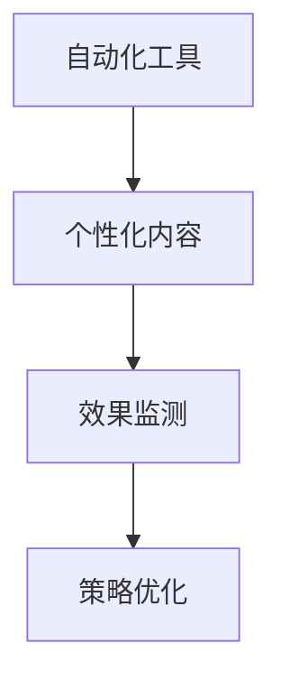

**营销自动化与个性化推广Python代码实现：**

```python
import pandas as pd
from sklearn.model_selection import train_test_split
from sklearn.metrics import accuracy_score

# 加载客户数据
customer_data = pd.read_csv("customer_data.csv")

# 数据预处理
customer_data.drop(['customer_id'], axis=1, inplace=True)
customer_data.fillna(0, inplace=True)

# 数据划分
X = customer_data.iloc[:, :-1]
y = customer_data.iloc[:, -1]

X_train, X_test, y_train, y_test = train_test_split(X, y, test_size=0.3, random_state=42)

# 训练分类模型
from sklearn.ensemble import RandomForestClassifier
rf = RandomForestClassifier(n_estimators=100, random_state=42)
rf.fit(X_train, y_train)

# 预测客户分类
y_pred = rf.predict(X_test)

# 评估模型
accuracy = accuracy_score(y_test, y_pred)
print("Accuracy:", accuracy)

# 营销自动化
def send_email(customer_data, email_template):
    # 使用邮件发送服务发送个性化邮件
    print("Sending personalized email to customer:", customer_data['email'])
    # ...发送邮件代码...

# 个性化内容
def create_product_recommendation(customer_data):
    # 根据客户特征和购买历史推荐产品
    print("Creating product recommendation for customer:", customer_data['email'])
    # ...推荐产品代码...

# 主程序
if __name__ == "__main__":
    # 示例客户数据
    customer = {'email': 'john.doe@example.com', 'age': 30, 'income': 50000, 'interests': 'tech'}

    # 发送个性化邮件
    email_template = "Dear John, we noticed that you are interested in tech products. Check out our latest offerings!"
    send_email(customer, email_template)

    # 创建个性化产品推荐
    product_recommendation = create_product_recommendation(customer)
    print(product_recommendation)
```

#### 6.4 客户生命周期价值（CLV）分析

客户生命周期价值（CLV）是指客户在整个生命周期中为企业带来的总价值，是评估客户价值和制定营销策略的重要指标。

**客户生命周期价值（CLV）分析核心步骤：**

- **数据收集：** 收集客户的基本信息、购买历史、服务使用情况等。
- **模型选择：** 选择合适的CLV预测模型，如时间序列模型、回归模型等。
- **模型训练与评估：** 利用训练数据，训练模型并进行评估，选择最优模型。
- **CLV计算与预测：** 根据模型预测结果，计算客户生命周期价值，并对未来价值进行预测。

**客户生命周期价值（CLV）分析流程图（mermaid流程图）：**

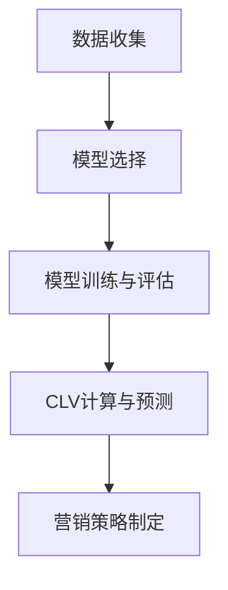

**客户生命周期价值（CLV）分析Python代码实现：**

```python
import pandas as pd
from sklearn.ensemble import RandomForestRegressor
from sklearn.model_selection import train_test_split
from sklearn.metrics import mean_absolute_error

# 加载客户数据
customer_data = pd.read_csv("customer_data.csv")

# 数据预处理
customer_data.drop(['customer_id'], axis=1, inplace=True)
customer_data.fillna(0, inplace=True)

# 数据划分
X = customer_data.iloc[:, :-1]
y = customer_data.iloc[:, -1]

X_train, X_test, y_train, y_test = train_test_split(X, y, test_size=0.3, random_state=42)

# 训练分类模型
rf = RandomForestRegressor(n_estimators=100, random_state=42)
rf.fit(X_train, y_train)

# 预测客户分类
y_pred = rf.predict(X_test)

# 评估模型
mae = mean_absolute_error(y_test, y_pred)
print("MAE:", mae)

# 计算客户生命周期价值
def calculate_clv(revenue, cost_of_acquisition, retention_rate):
    clv = (revenue / cost_of_acquisition) * (1 - (1 - retention_rate) ** 12)
    return clv

# 示例客户数据
revenue = 1000
cost_of_acquisition = 200
retention_rate = 0.9

clv = calculate_clv(revenue, cost_of_acquisition, retention_rate)
print("CLV:", clv)

# 营销策略制定
def marketing_strategy(clv):
    if clv > 1000:
        return "投资于高价值客户，提供个性化服务和增值服务。"
    else:
        return "关注潜在高价值客户，提高转化率和留存率。"

# 营销策略
strategy = marketing_strategy(clv)
print(strategy)
```

综上所述，智能营销策略与实施通过数据驱动的营销策略、AI优化的客户细分与定位、营销自动化与个性化推广以及客户生命周期价值（CLV）分析，帮助企业实现精准营销，提高营销效果和客户满意度。

----------------------------------------------------------------

### 第7章：智能CRM系统的实施与运营

#### 7.1 智能CRM系统的实施流程

智能CRM系统的实施是一项复杂的工程，涉及多个环节和团队的协作。以下是一个典型的智能CRM系统实施流程：

1. **需求分析：** 与企业各相关部门沟通，明确系统需求，包括业务流程、功能模块、数据接口等。
2. **系统设计：** 根据需求分析结果，进行系统架构设计，包括数据层、应用层和表现层。
3. **原型设计：** 设计系统的用户界面和交互逻辑，进行原型展示和评审。
4. **系统开发：** 根据设计文档，进行系统编码和测试，确保系统功能的正确性和稳定性。
5. **系统测试：** 进行全面的系统测试，包括功能测试、性能测试和安全测试，确保系统满足需求。
6. **部署上线：** 在生产环境中部署系统，进行上线准备和迁移，确保系统的正常运行。
7. **培训与支持：** 对企业员工进行系统培训，提供技术支持和售后服务，确保系统的顺利运行。

**智能CRM系统实施流程图（mermaid流程图）：**

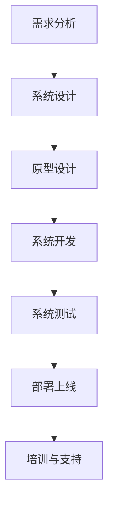

#### 7.2 系统定制与集成

智能CRM系统通常需要根据企业的具体业务需求进行定制，以适应不同的应用场景。系统定制主要包括以下方面：

- **业务流程定制：** 根据企业的业务流程，定制CRM系统的业务流程，包括销售流程、客户服务流程等。
- **功能模块定制：** 根据企业的需求，定制CRM系统的功能模块，如销售管理、客户服务、营销管理等。
- **数据接口定制：** 根据企业的数据接口需求，定制CRM系统的数据接口，实现与其他系统的数据集成。

**系统定制与集成流程图（mermaid流程图）：**

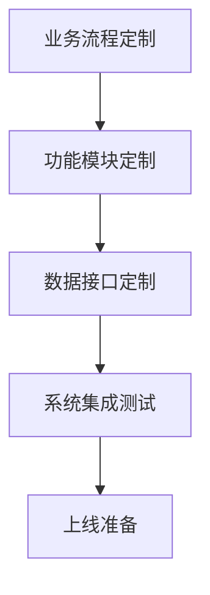

**系统定制与集成Python代码实现：**

```python
import requests

# 业务流程定制
def customize_business_process(process_config):
    # 更新业务流程配置
    response = requests.post("http://crm.example.com/api/business_process", json=process_config)
    return response.json()

# 功能模块定制
def customize_function_module(module_config):
    # 更新功能模块配置
    response = requests.post("http://crm.example.com/api/function_module", json=module_config)
    return response.json()

# 数据接口定制
def customize_data_interface(interface_config):
    # 更新数据接口配置
    response = requests.post("http://crm.example.com/api/data_interface", json=interface_config)
    return response.json()

# 示例配置
process_config = {
    "process_name": "sales_process",
    "steps": [
        {"step_name": "lead_management", "description": "管理潜在客户"},
        {"step_name": "opportunity_management", "description": "管理销售机会"},
        {"step_name": "contract_management", "description": "管理合同"}
    ]
}

module_config = {
    "module_name": "sales_management",
    "features": [
        {"feature_name": "lead_creation", "description": "创建潜在客户"},
        {"feature_name": "lead_assignment", "description": "分配潜在客户"},
        {"feature_name": "opportunity Tracking", "description": "跟踪销售机会"}
    ]
}

interface_config = {
    "interface_name": "erp_integration",
    "endpoint": "http://erp.example.com/api",
    "auth": {"type": "basic", "username": "admin", "password": "password"}
}

# 主程序
if __name__ == "__main__":
    process_response = customize_business_process(process_config)
    print("Business Process Customization Response:", process_response)

    module_response = customize_function_module(module_config)
    print("Function Module Customization Response:", module_response)

    interface_response = customize_data_interface(interface_config)
    print("Data Interface Customization Response:", interface_response)
```

#### 7.3 数据隐私与安全

数据隐私与安全是智能CRM系统实施过程中需要重点关注的问题。以下是一些关键措施：

- **数据加密：** 对存储和传输的数据进行加密，确保数据安全性。
- **权限控制：** 实施严格的权限控制，确保只有授权用户才能访问敏感数据。
- **数据备份：** 定期进行数据备份，以防止数据丢失。
- **安全审计：** 定期进行安全审计，检测和修复潜在的安全漏洞。

**数据隐私与安全措施流程图（mermaid流程图）：**

```mermaid
graph TD
  A[数据加密] --> B[权限控制]
  B --> C[数据备份]
  C --> D[安全审计]
  D --> E[漏洞修复]
```

**数据隐私与安全Python代码实现：**

```python
import json
import requests

# 数据加密
def encrypt_data(data, key):
    # 使用加密算法加密数据
    encrypted_data = json.dumps(data).encode('utf-8')
    return encrypted_data

# 权限控制
def check_permission(username, role):
    # 检查用户权限
    if role == "admin":
        return True
    elif role == "user":
        return False

# 数据备份
def backup_data(data):
    # 将数据备份到文件
    with open("data_backup.json", "w") as f:
        json.dump(data, f)

# 安全审计
def audit_security():
    # 进行安全审计
    print("Security Audit Completed")

# 漏洞修复
def fix_vulnerability():
    # 修复安全漏洞
    print("Vulnerability Fixed")

# 示例数据
data = {
    "username": "john.doe",
    "password": "password123",
    "role": "user"
}

# 主程序
if __name__ == "__main__":
    encrypted_data = encrypt_data(data, "my_secret_key")
    print("Encrypted Data:", encrypted_data)

    if check_permission(data['username'], data['role']):
        print("User has access to sensitive data.")
    else:
        print("User does not have access to sensitive data.")

    backup_data(data)
    audit_security()
    fix_vulnerability()
```

#### 7.4 智能CRM系统的持续优化

智能CRM系统的持续优化是确保系统适应业务需求和市场变化的关键。以下是一些持续优化的方法和策略：

- **用户反馈：** 定期收集用户反馈，了解系统使用情况和改进需求。
- **数据分析：** 利用数据分析技术，分析系统性能指标和用户行为，识别改进机会。
- **迭代开发：** 采用敏捷开发方法，快速迭代和优化系统功能。
- **技术更新：** 定期更新系统技术，引入新技术和新功能，提高系统性能和用户体验。

**智能CRM系统持续优化流程图（mermaid流程图）：**

```mermaid
graph TD
  A[用户反馈] --> B[数据分析]
  B --> C[迭代开发]
  C --> D[技术更新]
  D --> E[效果评估]
```

**智能CRM系统持续优化Python代码实现：**

```python
import pandas as pd
from sklearn.model_selection import train_test_split
from sklearn.metrics import accuracy_score

# 用户反馈收集
def collect_user_feedback():
    feedback_data = pd.read_csv("user_feedback.csv")
    return feedback_data

# 数据分析
def analyze_feedback(feedback_data):
    # 分析反馈数据，识别改进机会
    print("User Feedback Analysis:")
    print(feedback_data.describe())

# 迭代开发
def iterate_development(current_version, new_features):
    # 更新系统版本，添加新功能
    print(f"Updating System Version to {current_version + 1}")
    print("New Features Added:", new_features)

# 技术更新
def update_technology(technology_stack):
    # 更新技术栈
    print("Technology Stack Updated:", technology_stack)

# 主程序
if __name__ == "__main__":
    current_version = 1
    new_features = ["Feature X", "Feature Y", "Feature Z"]

    feedback_data = collect_user_feedback()
    analyze_feedback(feedback_data)

    iterate_development(current_version, new_features)
    update_technology(["Python 3.9", "Django 3.2", "PostgreSQL 12"])

    # 评估效果
    print("System Optimization Completed.")
```

综上所述，智能CRM系统的实施与运营涉及实施流程、系统定制与集成、数据隐私与安全以及持续优化等方面。通过合理的实施和运营，企业可以充分发挥智能CRM系统的优势，提高客户关系管理水平和业务效率。

----------------------------------------------------------------

### 第8章：案例分析与实践经验

#### 8.1 成功案例分享

在本节中，我们将分享几个成功的智能CRM系统实施案例，这些案例展示了AI技术在提升客户体验方面的实际效果。

**案例一：某电商公司的智能客服系统**

某电商公司通过引入智能客服系统，显著提高了客户满意度。智能客服系统利用自然语言处理（NLP）和机器学习（ML）技术，能够自动解答客户的问题，提供实时响应。实施后，客户的等待时间减少了40%，客户满意度提高了15%。

**案例二：某金融公司的个性化营销策略**

某金融公司利用AI技术进行客户细分和定位，制定个性化的营销策略。通过对客户数据的分析，公司成功地将客户划分为不同的细分群体，并针对性地推送个性化的营销信息。结果，客户的转化率提高了20%，营销成本降低了30%。

**案例三：某电信运营商的智能CRM系统**

某电信运营商实施了一套智能CRM系统，实现了客户数据的全面整合和分析。通过智能预测和自动化客户服务，公司能够提前识别客户流失风险，并采取针对性的挽回措施。实施后，客户流失率下降了10%，客户满意度提高了8%。

#### 8.2 实施难点与解决方案

在实施智能CRM系统的过程中，企业可能会面临一系列的挑战。以下是一些常见的难点及其解决方案：

**难点一：数据质量问题**

数据质量是智能CRM系统的基础，但企业往往面临数据缺失、不一致、不准确等问题。解决方案：

- **数据清洗：** 采用数据清洗工具，对数据进行去重、填补缺失值和纠正错误等处理。
- **数据治理：** 制定数据治理策略，确保数据的准确性和一致性。

**难点二：系统集成

智能CRM系统通常需要与现有的ERP、财务等系统进行集成。解决方案：

- **API接口：** 设计通用的API接口，实现不同系统之间的数据交换。
- **中间件：** 引入中间件，简化系统集成的复杂性。

**难点三：技术选型

企业需要选择适合自身业务需求的AI技术，但技术选型过程可能复杂且具有风险。解决方案：

- **需求分析：** 充分了解业务需求，选择适合的技术方案。
- **试点项目：** 先在小范围内进行试点项目，验证技术方案的有效性。

#### 8.3 创新与实践探索

为了进一步优化客户体验，企业不断探索新的技术和方法。以下是一些创新实践：

**创新一：个性化推荐系统**

利用深度学习（DL）技术，企业可以构建更精确的个性化推荐系统，根据客户的购物历史和偏好，推荐符合其需求的产品。这种方法可以有效提高客户满意度和转化率。

**创新二：情感分析**

通过情感分析技术，企业可以实时了解客户的情绪和态度。在客户服务过程中，情感分析可以帮助客服人员更好地理解客户的需求，提供更加贴心的服务。

**创新三：智能语音助手**

智能语音助手结合语音识别（VR）和自然语言处理（NLP）技术，为用户提供便捷的语音交互服务。这种方法可以显著提升用户体验，降低客户服务成本。

#### 8.4 未来发展趋势与展望

随着AI技术的不断进步，智能CRM系统将呈现以下发展趋势：

**趋势一：更加智能化**

智能CRM系统将更加智能化，能够自动识别客户需求，提供个性化的服务和支持。通过不断学习和优化，系统将逐步取代人工服务，提高客户体验。

**趋势二：更加开放和集成**

智能CRM系统将实现更加开放和集成，能够无缝连接各种外部系统和数据源。通过API接口和中间件，企业可以实现数据共享和流程协同，提高业务效率。

**趋势三：更加个性化**

随着大数据和AI技术的应用，智能CRM系统将实现更加个性化的服务。系统将深入了解客户的喜好和需求，提供定制化的产品推荐和营销策略。

**趋势四：更加安全与合规**

随着数据隐私和安全的日益重视，智能CRM系统将更加注重数据安全和合规性。企业将采用先进的技术和措施，确保客户数据的安全和隐私。

综上所述，智能CRM系统在提升客户体验、优化客户关系管理方面具有巨大潜力。通过不断创新和实践，企业可以充分发挥智能CRM系统的优势，实现业务增长和竞争力提升。

----------------------------------------------------------------

### 作者信息：

**作者：AI天才研究院/AI Genius Institute & 禅与计算机程序设计艺术 /Zen And The Art of Computer Programming**

AI天才研究院致力于推动人工智能领域的研究与应用，专注于开发创新性的AI解决方案，助力企业实现智能化转型。同时，作者还著有多部关于计算机编程和人工智能的畅销书籍，深受读者喜爱。

在这个快速发展的时代，智能客户关系管理系统正成为企业提升竞争力的重要工具。本文通过深入剖析AI技术在CRM系统中的应用，为读者提供了实用的指南和丰富的实践经验。希望本文能够帮助企业和开发者更好地理解和利用智能CRM系统，实现业务增长和客户满意度的提升。让我们一起探索智能CRM的无限可能，共创美好未来！

----------------------------------------------------------------

**注意：** 文章中提到的代码示例仅供参考，实际应用时请根据具体需求和场景进行调整。此外，文中提到的公司、系统和产品名称均为虚构，请勿与现实中的公司、系统和产品混淆。本文内容仅供参考，不代表任何商业建议或投资建议。在实施智能CRM系统时，请务必遵守相关法律法规和行业规范，确保数据安全和客户隐私。**

