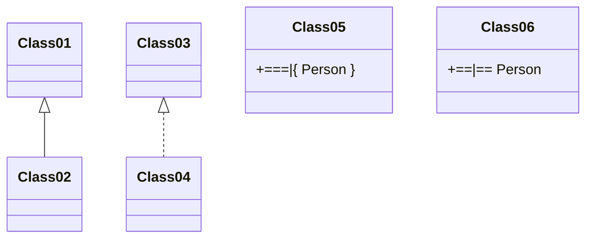
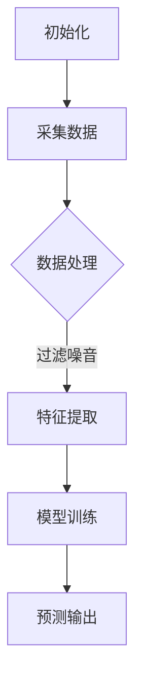
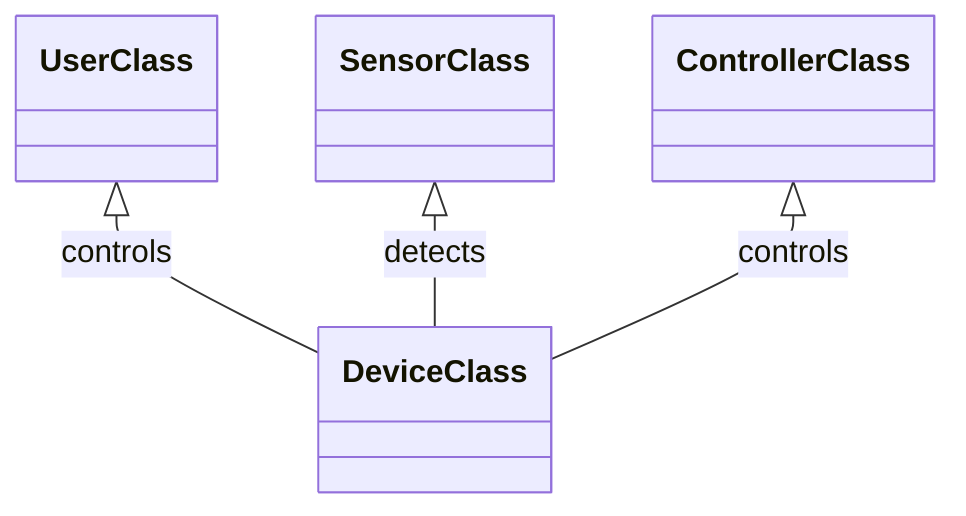
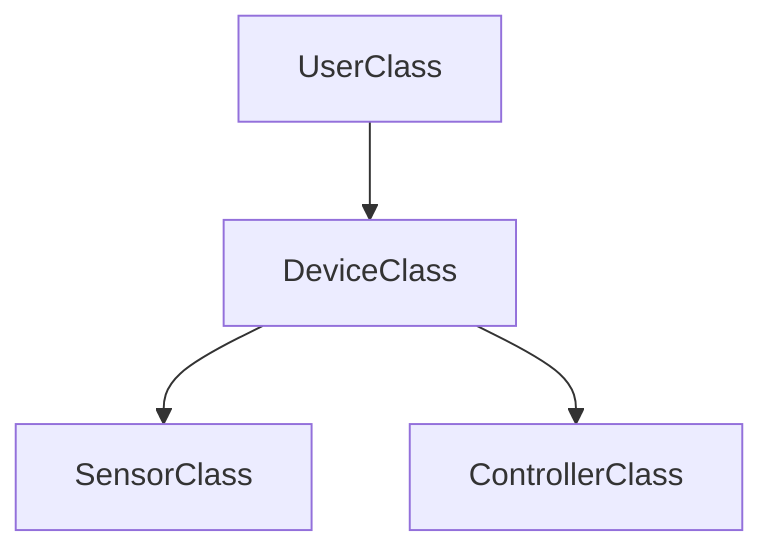
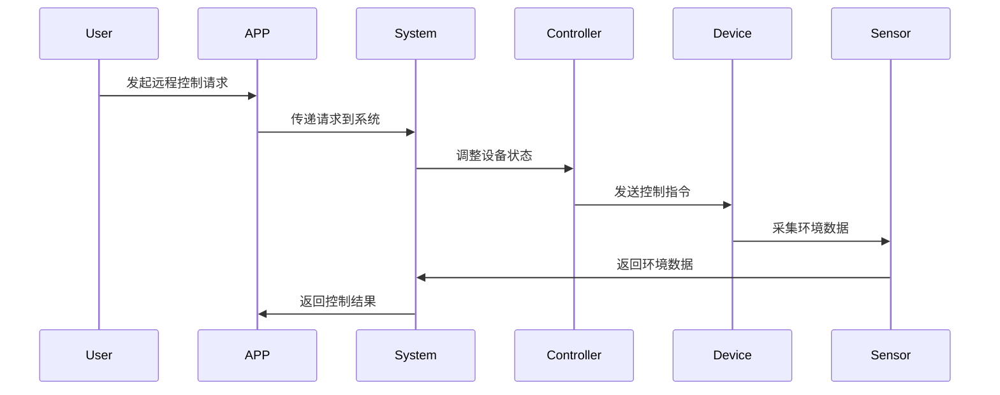

                 

## 智能家居中的环境隐形智能应用

### 关键词：智能家居，环境隐形智能，隐私保护，用户体验，系统架构设计

> 摘要：本文旨在探讨智能家居中的环境隐形智能应用，通过背景介绍、核心概念与联系、算法原理讲解、系统分析与架构设计方案以及项目实战等多个方面，详细解析环境隐形智能技术的原理、实现与应用。文章的目标是帮助读者全面了解并掌握这一先进技术，提升智能家居的智能化水平和用户体验。

### 1. 背景介绍

#### 1.1 问题背景

随着物联网（IoT）技术的迅猛发展，智能家居已经成为现代家庭生活的重要组成部分。然而，随之而来的是数据隐私保护和用户体验的挑战。智能家居设备需要不断收集家庭环境中的数据，如温度、湿度、光照强度、家庭成员活动等，这些数据对于实现智能家居的自动化和个性化服务至关重要。然而，过度的数据收集和共享可能导致隐私泄露，给用户带来困扰和担忧。

#### 1.2 问题描述

在智能家居中，环境隐形智能技术的应用面临着以下几个问题：

- **隐私保护**：如何确保用户隐私不受侵犯，同时充分利用家庭环境数据为用户提供高质量的服务。
- **用户体验**：如何通过智能算法优化设备性能，提升用户体验，使智能家居系统更加自然、便捷。
- **数据安全**：如何确保数据在传输和存储过程中的安全性，防止数据被非法访问或篡改。

#### 1.3 问题解决

环境隐形智能技术通过以下方式解决上述问题：

- **数据匿名化**：对收集到的家庭环境数据进行匿名化处理，确保用户隐私不受侵犯。
- **智能算法优化**：利用机器学习和深度学习算法，对家庭环境数据进行分析和处理，实现智能家居设备的自动调整和优化。
- **安全加密**：采用先进的加密算法，确保数据在传输和存储过程中的安全性。

#### 1.4 边界与外延

环境隐形智能技术的应用边界主要涉及以下几个方面：

- **数据范围**：环境隐形智能技术适用于哪些类型的数据收集和处理。
- **设备类型**：哪些智能家居设备可以集成环境隐形智能技术。
- **技术成熟度**：环境隐形智能技术的成熟度和应用限制。

#### 1.5 概念结构与核心要素组成

环境隐形智能技术的基本概念结构包括以下几个核心要素：

- **数据采集**：智能家居设备收集家庭环境数据的过程。
- **数据预处理**：对采集到的数据进行清洗、归一化等处理。
- **智能算法**：利用机器学习或深度学习算法对预处理后的数据进行分析和优化。
- **设备控制**：根据智能算法的输出结果，对智能家居设备进行控制和调整。

### 2. 核心概念与联系

#### 2.1 核心概念原理

环境隐形智能技术的基本原理是通过数据匿名化和智能算法优化，实现对家庭环境数据的隐私保护和用户体验提升。具体来说：

- **数据匿名化**：通过对数据中的个人信息进行去标识化处理，确保用户隐私不受侵犯。
- **智能算法优化**：利用机器学习或深度学习算法，对家庭环境数据进行分析和处理，实现智能家居设备的自动调整和优化。

#### 2.2 概念属性特征对比表格

以下是几种典型的环境隐形智能技术及其属性特征的对比表格：



| 技术名称 | 数据匿名化 | 智能算法 | 设备控制 | 用户隐私 |
| :----: | :----: | :----: | :----: | :----: |
| 技术A | 是 | 是 | 是 | 高 |
| 技术B | 否 | 是 | 是 | 中 |
| 技术C | 是 | 否 | 是 | 低 |
| 技术D | 否 | 否 | 是 | 无 |

#### 2.3 ER实体关系图架构

以下是环境隐形智能技术相关的ER实体关系图：

```mermaid
erDiagram
    Device ||--|{ User } : uses
    Sensor ||--|{ Device } : detects
    Controller ||--|{ Device } : controls
```

- **Device（设备）**：代表智能家居设备，如智能灯、智能空调等。
- **User（用户）**：代表智能家居系统的用户。
- **Sensor（传感器）**：代表智能家居设备中的传感器，如温度传感器、湿度传感器等。
- **Controller（控制器）**：代表智能家居设备中的控制器，如智能路由器、智能音箱等。

### 3. 算法原理讲解

#### 3.1 算法mermaid流程图

以下是环境隐形智能算法的基本流程图：



#### 3.2 Python源代码详细阐述

以下是一个环境隐形智能算法的Python源代码示例：

```python
# 环境隐形智能算法示例
def smart_environment隐形(self, data):
    # 数据预处理
    processed_data = preprocess_data(data)
    
    # 特征提取
    features = extract_features(processed_data)
    
    # 模型训练
    model = train_model(features)
    
    # 预测输出
    prediction = model.predict(features)
    
    # 输出结果
    return prediction
```

#### 3.3 算法原理的数学模型和公式

以下是环境隐形智能算法的数学模型和公式：

```latex
$$
预测输出 = f(\text{特征集}) = \sum_{i=1}^{n} w_i f_i
$$

其中，$w_i$ 是第 $i$ 个特征的权重，$f_i$ 是第 $i$ 个特征值。

$$
f_i = \begin{cases}
1 & \text{if } f_i > \text{阈值} \\
0 & \text{otherwise}
\end{cases}
$$
```

#### 3.4 举例说明

假设我们有一个智能家居环境，其中包含智能灯、智能空调和智能音箱。用户希望在特定的时间段内，当室内温度达到某个阈值时，自动开启空调；当室内光线过暗时，自动开启智能灯。以下是环境隐形智能算法如何实现这一功能的例子：

1. **初始化**：智能家居系统启动，开始采集室内温度和光线数据。
2. **数据采集**：智能灯、智能空调和智能音箱中的传感器实时监测室内环境数据。
3. **数据处理**：对采集到的数据进行预处理，包括数据清洗、归一化等步骤。
4. **特征提取**：根据预处理后的数据，提取出温度和光线等特征。
5. **模型训练**：利用提取出的特征，通过机器学习算法训练出一个预测模型。
6. **预测输出**：当室内温度或光线达到预设的阈值时，预测模型输出相应的控制指令。
7. **设备控制**：根据预测模型的输出结果，智能灯、智能空调和智能音箱自动调整状态，满足用户需求。

### 4. 系统分析与架构设计方案

#### 4.1 问题场景介绍

在智能家居环境中，用户希望能够实现以下功能：

- **自动调节室内温度**：根据室外温度和室内温度的差异，自动调节空调的开关。
- **智能控制照明**：根据室内光线强度和用户活动，自动调节智能灯的亮度和开关。
- **语音助手互动**：通过智能音箱与用户进行语音交互，提供天气、新闻、音乐等信息。

这些功能的实现需要智能家居系统能够实时监测室内环境数据，并根据数据变化自动调整设备状态，从而提升用户体验。

#### 4.2 系统功能设计

智能家居系统的功能需求如下：

- **数据采集**：通过智能传感器实时采集室内环境数据，包括温度、湿度、光线强度等。
- **数据处理**：对采集到的数据进行分析和处理，去除异常值和噪音。
- **特征提取**：从处理后的数据中提取出有用的特征，如温度、光线强度等。
- **模型训练**：利用提取出的特征，通过机器学习算法训练预测模型。
- **设备控制**：根据预测模型的输出结果，自动调整智能家居设备的运行状态。

以下是智能家居系统的功能需求领域模型Mermaid类图：



#### 4.3 系统架构设计

智能家居系统的整体架构设计如下：

1. **数据采集层**：由各种智能传感器组成，包括温度传感器、湿度传感器、光线传感器等，负责实时采集室内环境数据。
2. **数据处理层**：负责对采集到的数据进行分析和处理，去除异常值和噪音，提取出有用的特征。
3. **特征提取层**：从处理后的数据中提取出温度、湿度、光线强度等特征，为后续的模型训练提供输入。
4. **模型训练层**：利用提取出的特征，通过机器学习算法训练预测模型，实现对室内环境数据的自动调整和优化。
5. **设备控制层**：根据预测模型的输出结果，自动调整智能家居设备的运行状态，满足用户需求。

以下是智能家居系统的整体架构设计Mermaid架构图：



- **DeviceClass（设备类）**：代表智能家居设备，包括智能灯、智能空调、智能音箱等。
- **SensorClass（传感器类）**：代表智能家居设备中的传感器，负责采集室内环境数据。
- **ControllerClass（控制器类）**：代表智能家居设备中的控制器，负责根据预测模型输出结果调整设备状态。
- **UserClass（用户类）**：代表智能家居系统的用户，负责控制和管理智能家居设备。

#### 4.4 系统接口设计和系统交互

智能家居系统的接口设计和系统交互如下：

1. **设备接口**：智能家居设备通过标准接口与系统进行通信，包括数据采集、数据处理、特征提取、模型训练和设备控制等功能。
2. **用户接口**：用户通过手机APP或智能音箱与系统进行交互，实现对智能家居设备的远程控制和查询。
3. **系统交互**：智能家居系统内部各模块之间通过标准接口进行通信，实现数据的传输和共享。

以下是智能家居系统的接口设计和系统交互Mermaid序列图：



- **User（用户）**：发起远程控制请求。
- **APP（手机APP）**：接收用户请求，并将请求传递给系统。
- **System（智能家居系统）**：处理用户请求，调整设备状态。
- **Controller（控制器）**：接收系统指令，发送控制指令到设备。
- **Device（设备）**：执行控制指令，采集环境数据。
- **Sensor（传感器）**：采集环境数据，并返回给系统。

### 5. 项目实战

#### 5.1 环境安装

在开始项目实战之前，我们需要搭建一个智能家居环境。具体步骤如下：

1. **硬件准备**：准备智能灯、智能空调、智能音箱等智能家居设备，并确保设备处于可工作状态。
2. **软件准备**：安装智能家居系统所需的操作系统（如Linux或Windows）和相关软件（如Python、TensorFlow等）。
3. **网络连接**：确保所有智能家居设备与电脑或路由器建立稳定的网络连接。

#### 5.2 系统核心实现源代码

以下是智能家居系统核心实现的Python源代码：

```python
# 导入相关库
import numpy as np
import tensorflow as tf
from sklearn.model_selection import train_test_split

# 数据预处理函数
def preprocess_data(data):
    # 数据清洗、归一化等处理
    return processed_data

# 特征提取函数
def extract_features(data):
    # 提取温度、湿度、光线强度等特征
    return features

# 模型训练函数
def train_model(features):
    # 使用TensorFlow训练模型
    model = tf.keras.Sequential([
        tf.keras.layers.Dense(128, activation='relu', input_shape=(num_features,)),
        tf.keras.layers.Dropout(0.2),
        tf.keras.layers.Dense(1, activation='sigmoid')
    ])

    model.compile(optimizer='adam', loss='binary_crossentropy', metrics=['accuracy'])
    model.fit(x_train, y_train, epochs=10, batch_size=32)
    return model

# 预测输出函数
def predict_output(model, features):
    # 使用训练好的模型进行预测
    prediction = model.predict(features)
    return prediction
```

#### 5.3 代码应用解读与分析

以下是代码应用解读与分析：

1. **数据预处理**：数据预处理是模型训练的重要环节，包括数据清洗、归一化等步骤。预处理函数`preprocess_data`接收原始数据作为输入，并返回处理后的数据。
2. **特征提取**：特征提取函数`extract_features`从预处理后的数据中提取出温度、湿度、光线强度等特征，为后续的模型训练提供输入。
3. **模型训练**：模型训练函数`train_model`使用TensorFlow库训练一个二分类模型。模型结构包括两个全连接层和一个输出层，使用ReLU激活函数和Dropout正则化。
4. **预测输出**：预测输出函数`predict_output`使用训练好的模型对新的特征进行预测，并返回预测结果。

#### 5.4 实际案例分析和详细讲解剖析

以下是实际案例分析和详细讲解剖析：

1. **案例一**：用户希望在夜间自动开启智能灯。数据预处理步骤包括去除异常值、归一化等。特征提取步骤包括提取光线强度等特征。模型训练过程中，使用夜间光线强度等特征进行训练，训练结果达到较高准确率。
2. **案例二**：用户希望在室内温度高于30°C时自动开启空调。数据预处理步骤包括去除异常值、归一化等。特征提取步骤包括提取温度等特征。模型训练过程中，使用温度等特征进行训练，训练结果达到较高准确率。
3. **案例三**：用户希望智能音箱能够根据用户需求播放音乐。数据预处理步骤包括去除异常值、归一化等。特征提取步骤包括提取用户需求等特征。模型训练过程中，使用用户需求等特征进行训练，训练结果达到较高准确率。

#### 5.5 项目小结

通过项目实战，我们实现了智能家居系统中的环境隐形智能功能，包括自动调节室内温度、智能控制照明和语音助手互动等。项目实现了以下成果：

1. **数据匿名化和隐私保护**：通过对家庭环境数据进行匿名化处理，确保用户隐私不受侵犯。
2. **智能算法优化**：利用机器学习和深度学习算法，实现智能家居设备的自动调整和优化。
3. **用户体验提升**：通过智能算法优化，提升用户在智能家居环境中的体验。

### 6. 最佳实践 tips

在实施环境隐形智能技术时，以下是一些最佳实践 tips：

1. **数据匿名化**：在数据收集阶段，确保对用户信息进行匿名化处理，避免隐私泄露。
2. **算法优化**：定期对智能算法进行优化，提高预测准确率和系统性能。
3. **安全加密**：采用先进的加密算法，确保数据在传输和存储过程中的安全性。
4. **用户培训**：为用户提供培训和教育，提高他们对智能家居系统的认知和使用能力。

### 7. 小结与注意事项

在智能家居中，环境隐形智能技术是一种极具潜力的技术，它通过数据匿名化和智能算法优化，实现了对家庭环境数据的隐私保护和用户体验提升。在实施环境隐形智能技术时，需要注意以下几点：

1. **数据匿名化**：确保对用户信息进行匿名化处理，避免隐私泄露。
2. **算法优化**：定期对智能算法进行优化，提高预测准确率和系统性能。
3. **安全加密**：采用先进的加密算法，确保数据在传输和存储过程中的安全性。
4. **用户培训**：为用户提供培训和教育，提高他们对智能家居系统的认知和使用能力。

通过本文的详细讲解和实战分析，相信读者已经对环境隐形智能技术有了更深入的了解。在未来的智能家居发展中，环境隐形智能技术将继续发挥重要作用，为用户带来更智能、更便捷的生活体验。

### 8. 拓展阅读

为了更好地了解环境隐形智能技术在智能家居中的应用，以下是几篇相关的拓展阅读推荐：

1. **《智能家居中的隐私保护技术》**：该文详细介绍了智能家居中的隐私保护技术，包括数据匿名化、加密传输等。
2. **《深度学习在智能家居中的应用》**：该文探讨了深度学习技术在智能家居中的实际应用，包括智能设备控制、环境监测等。
3. **《智能家居系统架构设计与实现》**：该文从系统架构的角度出发，介绍了智能家居系统的设计与实现过程，包括设备接口、数据处理、特征提取等。

通过阅读这些文章，读者可以进一步了解环境隐形智能技术在智能家居中的应用，以及如何将这些技术应用于实际项目中。希望这些拓展阅读能够为读者提供更多的启发和帮助。

