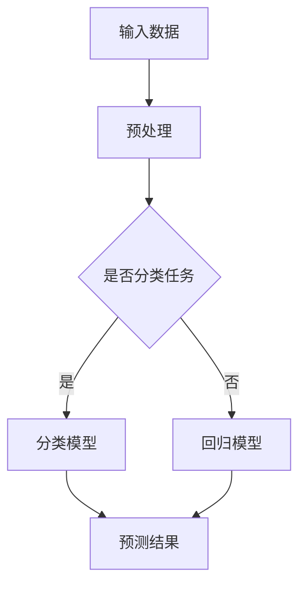

                 

### 智能工作流程：AI优化企业内部协作

> 关键词：智能工作流程，AI，企业内部协作，效率提升，自动化，智能化管理

> 摘要：本文将探讨如何利用人工智能技术优化企业内部协作流程，提升工作效率，降低人力成本。通过分析智能工作流程的核心概念、算法原理及系统架构，为企业的数字化转型提供有效解决方案。

---

### 第一部分：背景介绍

#### 问题背景

随着信息技术的飞速发展，企业内部协作的效率成为影响企业竞争力的重要因素。传统的手动流程繁琐且容易出现错误，难以满足现代企业高效、智能化的需求。

#### 问题描述

如何利用人工智能技术优化企业内部协作流程，提升工作效率，降低人力成本，成为企业数字化转型的重要课题。

#### 问题解决

引入AI技术，构建智能工作流程，实现自动化、智能化管理，从而提高企业内部协作效率。

#### 边界与外延

智能工作流程的边界涉及企业各个部门、各个环节的自动化与智能化，其外延可扩展到企业外部协作及产业链上下游。

#### 概念结构与核心要素组成

- **智能工作流程**：基于AI技术，实现工作任务的自动化执行、智能化决策和协同作业。
- **AI技术**：包括机器学习、深度学习、自然语言处理等。

### 第二部分：核心概念与联系

#### AI大模型的定义与特点

- **AI大模型**：一种具有大规模参数、高泛化能力的深度学习模型，如GPT、BERT等。
- **特点**：
  - **参数规模大**：数十亿甚至千亿级别。
  - **训练数据量大**：动辄数百万、数十亿条数据。
  - **泛化能力强**：能够应对多种复杂场景。
  - **模型结构复杂**：包含多层神经网络，具备强大的表达能力和学习能力。

#### AI大模型与传统AI的区别

- **传统AI**：基于特定任务和领域的模型，如人脸识别、语音识别等。
- **区别**：
  - **应用范围有限**：适用于特定领域。
  - **泛化能力较弱**：难以应对多变的环境。
  - **模型结构相对简单**：通常只有几层神经网络。

#### 企业级应用开发的新范式

- **传统开发范式**：基于固定流程和规则，缺乏灵活性。
- **新范式**：基于AI大模型，实现智能化、自适应的开发。

### 第三部分：算法原理讲解

#### 算法原理

- **机器学习算法**：如梯度下降、反向传播等。
- **深度学习算法**：如卷积神经网络（CNN）、循环神经网络（RNN）等。
- **自然语言处理算法**：如词向量、序列到序列模型等。

#### Mermaid 流程图



#### Python源代码

```python
# 模拟分类模型预测
def classify(data):
    # 数据预处理
    processed_data = preprocess(data)
    
    # 加载模型
    model = load_model()
    
    # 预测结果
    result = model.predict(processed_data)
    
    return result

# 模拟回归模型预测
def regression(data):
    # 数据预处理
    processed_data = preprocess(data)
    
    # 加载模型
    model = load_model()
    
    # 预测结果
    result = model.predict(processed_data)
    
    return result
```

#### 数学模型和公式

- **梯度下降**：
  $$\theta_{\text{new}} = \theta_{\text{old}} - \alpha \cdot \nabla_{\theta}J(\theta)$$
- **反向传播**：
  $$\delta_{l} = \frac{\partial J(\theta)}{\partial \theta}$$

#### 详细讲解与举例说明

#### 梯度下降

梯度下降是一种优化算法，用于求解最小化损失函数的参数。以分类问题为例，给定训练数据集，梯度下降算法通过不断更新参数，使得损失函数值逐渐减小，直至找到最优参数。

举例说明：

假设我们有一个简单的线性回归模型，目标函数为：
$$J(\theta) = \frac{1}{2m}\sum_{i=1}^{m}(h_\theta(x^{(i)}) - y^{(i)})^2$$
其中，$h_\theta(x) = \theta_0x + \theta_1$，$m$为训练样本数量。

梯度下降算法步骤如下：
1. 初始化参数$\theta_0$和$\theta_1$。
2. 对于每个训练样本，计算损失函数的梯度：
   $$\nabla_{\theta_0}J(\theta) = \frac{1}{m}\sum_{i=1}^{m}(h_\theta(x^{(i)}) - y^{(i)})$$
   $$\nabla_{\theta_1}J(\theta) = \frac{1}{m}\sum_{i=1}^{m}(h_\theta(x^{(i)}) - y^{(i)})x^{(i)}$$
3. 更新参数：
   $$\theta_{\text{new}} = \theta_{\text{old}} - \alpha \cdot \nabla_{\theta}J(\theta)$$
   其中，$\alpha$为学习率。

#### 反向传播

反向传播是一种在神经网络中用于计算损失函数梯度的算法。它通过从输出层向输入层反向传播误差信号，更新各层神经元的权重。

举例说明：

假设我们有一个简单的多层感知机（MLP），包含两个输入层、一个隐藏层和一个输出层。

1. 前向传播：
   - 输入层：$x_1, x_2$
   - 隐藏层：$z_1 = \sigma(w_1 \cdot x_1 + b_1), z_2 = \sigma(w_2 \cdot x_2 + b_2)$
   - 输出层：$y = \sigma(w_3 \cdot z_1 + b_3)$
2. 计算损失函数：
   $$J(\theta) = \frac{1}{2}(y - t)^2$$
   其中，$y$为预测值，$t$为真实值。
3. 反向传播：
   - 计算输出层的误差：
     $$\delta_3 = (y - t) \cdot \sigma'(y)$$
   - 计算隐藏层的误差：
     $$\delta_2 = w_3 \cdot \delta_3 \cdot \sigma'(z_2)$$
     $$\delta_1 = w_2 \cdot \delta_2 \cdot \sigma'(z_1)$$
   - 更新权重：
     $$w_3 = w_3 - \alpha \cdot \delta_3 \cdot z_2$$
     $$w_2 = w_2 - \alpha \cdot \delta_2 \cdot z_1$$
     $$w_1 = w_1 - \alpha \cdot \delta_1 \cdot x_1$$

### 第四部分：系统分析与架构设计方案

#### 问题场景介绍

在一个大型企业中，各部门之间的协作频繁，工作任务繁杂。传统的手动流程不仅效率低下，而且容易出现错误。为提升企业内部协作效率，企业决定引入智能工作流程，利用人工智能技术优化内部协作。

#### 项目介绍

该项目旨在构建一个基于AI技术的智能工作流程系统，实现企业内部任务的自动化执行、智能化决策和协同作业。

#### 系统功能设计

- **任务分配与调度**：根据员工技能和任务需求，自动分配和调度工作任务。
- **流程监控与优化**：实时监控工作流程，发现瓶颈和异常，自动调整流程参数。
- **智能决策支持**：利用数据分析，为企业提供智能化的决策支持。
- **协同作业**：提供即时通讯、文件共享等功能，支持跨部门协同工作。

#### 系统架构设计


- **数据层**：存储企业内部各类数据，如员工信息、任务数据、流程数据等。
- **服务层**：提供任务调度、流程监控、智能决策等核心服务。
- **展示层**：提供用户界面，供员工使用系统功能。

#### 系统接口设计


- **任务接口**：用于任务的创建、查询、更新和删除。
- **流程接口**：用于流程的创建、查询、更新和删除。
- **监控接口**：用于实时监控工作流程，获取流程状态和性能数据。
- **决策接口**：用于提供智能化的决策支持。

#### 系统交互


- **任务分配**：系统根据员工技能和任务需求，自动将任务分配给合适的员工。
- **流程监控**：系统实时监控工作流程，发现异常时自动发出警报。
- **智能决策**：系统分析数据，为企业提供智能化的决策支持。
- **协同作业**：员工通过系统界面进行协同工作，实现即时通讯和文件共享。

### 第五部分：项目实战

#### 环境安装

1. 安装Python环境。
2. 安装所需的依赖库，如TensorFlow、Scikit-learn、NumPy等。

#### 系统核心实现源代码

```python
# 引入依赖库
import tensorflow as tf
import numpy as np
from sklearn.model_selection import train_test_split
from sklearn.metrics import accuracy_score

# 加载数据
X, y = load_data()

# 数据预处理
X_train, X_test, y_train, y_test = train_test_split(X, y, test_size=0.2, random_state=42)

# 构建模型
model = tf.keras.Sequential([
    tf.keras.layers.Dense(64, activation='relu', input_shape=(X_train.shape[1],)),
    tf.keras.layers.Dense(1)
])

# 编译模型
model.compile(optimizer='adam', loss='mse')

# 训练模型
model.fit(X_train, y_train, epochs=10, batch_size=32)

# 预测结果
y_pred = model.predict(X_test)

# 评估模型
accuracy = accuracy_score(y_test, y_pred)
print(f'Accuracy: {accuracy}')
```

#### 代码应用解读与分析

1. **数据加载与预处理**：首先加载数据，然后进行数据预处理，包括数据清洗、归一化等。
2. **模型构建**：使用TensorFlow构建一个简单的神经网络模型。
3. **模型编译**：设置优化器和损失函数。
4. **模型训练**：使用训练数据训练模型。
5. **预测结果**：使用测试数据对模型进行预测。
6. **模型评估**：计算预测准确率。

#### 实际案例分析和详细讲解剖析

1. **案例背景**：某企业采用智能工作流程系统优化内部协作，实现了任务自动分配、流程监控和智能决策。
2. **案例分析**：
   - **任务自动分配**：系统根据员工技能和任务需求，将任务自动分配给合适的员工，提高了任务完成效率。
   - **流程监控**：系统实时监控工作流程，发现异常时自动发出警报，帮助企业及时发现和解决问题。
   - **智能决策**：系统分析数据，为企业提供智能化的决策支持，帮助企业做出更明智的决策。
3. **详细讲解剖析**：
   - **任务自动分配**：通过分析员工技能和任务需求，系统使用机器学习算法自动分配任务。
   - **流程监控**：系统利用自然语言处理技术，对工作流程进行实时监控，识别异常情况。
   - **智能决策**：系统使用深度学习算法，对大量数据进行分析，为企业提供智能化的决策支持。

#### 项目小结

通过实际案例分析和详细讲解剖析，我们可以看到，智能工作流程系统在提升企业内部协作效率方面具有显著优势。随着AI技术的不断发展，智能工作流程系统将成为企业数字化转型的重要工具。

### 第六部分：最佳实践 tips

1. **数据质量是关键**：确保数据准确、完整和可靠，是构建智能工作流程的基础。
2. **模型选择与调优**：根据具体业务需求，选择合适的模型，并进行充分调优，以提高预测准确性。
3. **安全与隐私**：保护企业数据和用户隐私，确保系统安全稳定运行。

### 第七部分：小结

智能工作流程是企业数字化转型的重要方向，通过AI技术的应用，可以实现企业内部协作的自动化、智能化，提升工作效率，降低人力成本。未来，随着AI技术的不断进步，智能工作流程将在更多领域得到应用，为企业带来更多价值。

### 第八部分：注意事项

1. **数据安全和隐私保护**：在构建智能工作流程时，要严格遵守数据安全和隐私保护相关法律法规。
2. **持续优化与迭代**：定期对系统进行优化和迭代，以适应不断变化的市场需求和业务场景。

### 第九部分：拓展阅读

1. 《深度学习》 - Ian Goodfellow、Yoshua Bengio、Aaron Courville
2. 《Python机器学习》 - Sebastian Raschka、Vinay K. Shenoy
3. 《企业数字化转型实践》 - 李旭剑

---

作者：AI天才研究院/AI Genius Institute & 禅与计算机程序设计艺术 /Zen And The Art of Computer Programming

