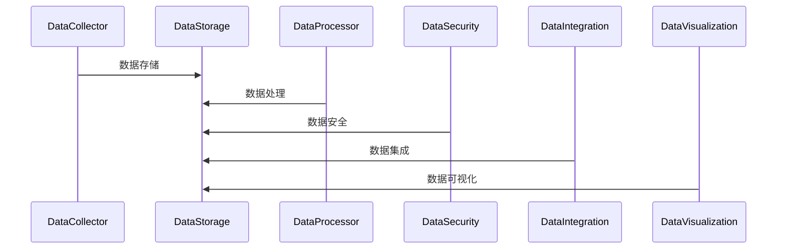
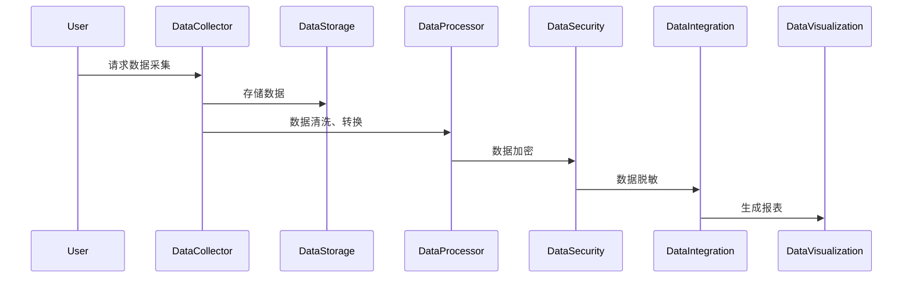
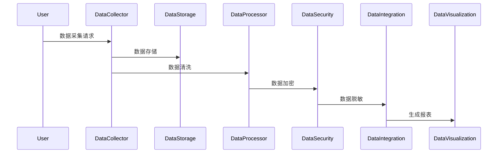

                 

# 智能数据湖治理：构建AI友好数据生态

## 关键词
- 智能数据湖治理
- AI技术
- 数据质量管理
- 数据安全与隐私保护
- 数据处理与清洗
- 数据集成

## 摘要
本文将探讨智能数据湖治理的背景、概念、关键要素及其应用。通过深入分析AI技术在数据湖治理中的优势与应用场景，我们进一步探讨了机器学习算法、数据挖掘技术以及数据可视化技术在数据湖治理中的应用。文章旨在为读者提供一套完整的智能数据湖治理框架与实施指南，以构建AI友好数据生态。

## 第一部分：智能数据湖治理概述

### 第1章：智能数据湖治理背景与概念

#### 1.1 问题背景

##### 1.1.1 数据湖的兴起与发展
随着大数据时代的到来，数据湖作为数据存储和管理的新兴模式，逐渐成为企业数字化转型的关键基础设施。数据湖通过采用分布式存储技术，能够存储各种类型的数据，包括结构化数据、半结构化数据和非结构化数据。

##### 1.1.2 数据湖治理的挑战
然而，数据湖在提供灵活性和扩展性的同时，也带来了数据治理的挑战。数据质量、数据安全、数据隐私保护以及数据清洗等问题亟待解决。

##### 1.1.3 智能数据湖治理的意义
智能数据湖治理通过引入AI技术，可以自动识别数据质量问题、进行数据清洗、保障数据安全和隐私，从而提升数据湖的整体管理效率。

#### 1.2 核心概念

##### 1.2.1 数据湖的定义与特点
数据湖是一个大规模的数据存储和管理平台，它不同于传统的数据仓库，可以存储不同类型的数据，并支持灵活的数据处理和分析。

##### 1.2.2 智能数据湖治理的概念
智能数据湖治理是指通过AI技术对数据湖中的数据进行自动化管理，包括数据质量监控、数据清洗、数据安全与隐私保护等。

##### 1.2.3 数据质量管理与数据治理的关系
数据质量管理是智能数据湖治理的重要组成部分，它关注数据的准确性、一致性、完整性等，是数据治理的基础。

#### 1.3 智能数据湖治理的关键要素

##### 1.3.1 数据质量控制
数据质量控制是智能数据湖治理的首要任务，它包括数据清洗、数据去重、数据标准化等。

##### 1.3.2 数据安全与隐私保护
数据安全和隐私保护是智能数据湖治理的重要保障，它涉及到数据加密、访问控制、数据脱敏等技术。

##### 1.3.3 数据处理与清洗
数据处理与清洗是智能数据湖治理的核心，它通过自动化算法对数据进行清洗、转换和集成。

##### 1.3.4 数据集成与数据湖架构设计
数据集成是智能数据湖治理的关键环节，它涉及到数据的采集、存储、处理和分析等。

#### 1.4 智能数据湖治理的框架与流程

##### 1.4.1 智能数据湖治理的架构
智能数据湖治理的架构包括数据采集层、数据存储层、数据处理层和数据应用层。

##### 1.4.2 智能数据湖治理的流程
智能数据湖治理的流程包括数据采集、数据清洗、数据存储、数据处理和数据应用等环节。

##### 1.4.3 智能数据湖治理的最佳实践
智能数据湖治理的最佳实践包括数据质量管理、数据安全与隐私保护、数据处理与清洗等方面的实践经验。

#### 1.5 本章小结
智能数据湖治理是当前大数据和人工智能领域的一个重要研究方向。通过引入AI技术，智能数据湖治理能够有效提升数据湖的管理效率，为企业的数字化转型提供有力支持。

### 第2章：AI技术在数据湖治理中的优势与应用场景

#### 2.1 AI技术概述

##### 2.1.1 AI技术的发展历程
人工智能技术的发展经历了数个阶段，从早期的规则系统到近年来的深度学习和强化学习，AI技术在数据处理和分析方面取得了显著进展。

##### 2.1.2 AI技术的分类
AI技术可以分为机器学习、深度学习、自然语言处理、计算机视觉等多个子领域。

##### 2.1.3 AI技术的基础算法
基础算法包括线性回归、决策树、支持向量机、神经网络等。

#### 2.2 AI技术在数据湖治理中的优势

##### 2.2.1 数据质量管理
AI技术可以通过自动化算法识别数据质量问题，如缺失值、异常值、重复值等，并进行相应的处理。

##### 2.2.2 数据安全与隐私保护
AI技术可以实现对数据的加密、访问控制和脱敏处理，保障数据安全和隐私。

##### 2.2.3 数据处理与清洗
AI技术可以自动化地进行数据处理和清洗，提高数据处理效率。

##### 2.2.4 数据集成
AI技术可以自动识别和集成不同来源的数据，实现数据的一体化管理。

#### 2.3 AI技术在数据湖治理中的应用场景

##### 2.3.1 数据质量管理中的应用
例如，通过机器学习算法对数据质量进行评估，通过数据挖掘技术发现数据质量问题，并通过数据可视化技术对数据质量进行监控。

##### 2.3.2 数据安全与隐私保护中的应用
例如，使用加密算法对数据进行加密，使用访问控制列表对数据的访问权限进行管理，使用脱敏技术对敏感数据进行处理。

##### 2.3.3 数据处理与清洗中的应用
例如，使用机器学习算法对数据进行清洗，使用数据挖掘技术对数据进行分类和聚类，使用数据可视化技术对数据进行分析和监控。

##### 2.3.4 数据集成中的应用
例如，使用ETL工具对数据进行集成，使用数据湖架构设计技术对数据湖进行优化。

#### 2.4 AI技术在数据湖治理中的案例分析

##### 2.4.1 案例一：某大型企业的数据湖治理实践
例如，某大型企业通过引入AI技术，实现了数据质量自动检测、数据清洗自动化、数据安全与隐私保护自动化等，显著提升了数据湖治理效率。

##### 2.4.2 案例二：某金融机构的数据湖治理实践
例如，某金融机构通过AI技术对金融数据进行处理和清洗，实现了精准的风控和决策支持。

##### 2.4.3 案例三：某政府的智慧城市数据湖治理实践
例如，某政府通过AI技术对城市数据进行治理，实现了智能交通管理、智能环保监测等。

#### 2.5 本章小结
AI技术在数据湖治理中的应用为数据管理带来了新的变革。通过引入AI技术，企业可以实现数据质量的自动化管理，提高数据治理效率，为企业的数字化转型提供强大支持。

## 第二部分：智能数据湖治理关键技术

### 第3章：智能数据湖治理中的机器学习算法

#### 3.1 机器学习算法概述

##### 3.1.1 机器学习算法的分类
机器学习算法可以分为监督学习、无监督学习和强化学习等。

##### 3.1.2 常见的机器学习算法
常见的机器学习算法包括线性回归、决策树、支持向量机、神经网络等。

#### 3.2 机器学习算法在数据湖治理中的应用

##### 3.2.1 数据质量评估
通过机器学习算法对数据进行评估，识别数据质量问题。

##### 3.2.2 数据清洗
通过机器学习算法对数据进行清洗，处理缺失值、异常值等。

##### 3.2.3 数据分类与聚类
通过机器学习算法对数据进行分类和聚类，实现数据的自动分类和管理。

#### 3.3 案例分析：使用机器学习算法优化数据湖治理

##### 3.3.1 案例背景
例如，某企业通过引入机器学习算法，对数据湖中的数据质量进行评估和清洗，提高了数据治理效率。

##### 3.3.2 案例目标
例如，通过使用机器学习算法，实现数据质量的自动化评估和清洗，提高数据湖治理效率。

##### 3.3.3 案例实施
例如，某企业使用Python编写了机器学习算法，对数据湖中的数据进行评估和清洗，并将清洗后的数据存储到数据湖中。

##### 3.3.4 案例结果分析
例如，通过使用机器学习算法，某企业显著提高了数据湖治理效率，降低了数据治理成本。

#### 3.4 本章小结
机器学习算法在智能数据湖治理中发挥着重要作用。通过机器学习算法，可以实现数据质量的自动化评估和清洗，提高数据湖治理效率。

### 第4章：智能数据湖治理中的数据挖掘技术

#### 4.1 数据挖掘技术概述

##### 4.1.1 数据挖掘的定义与目标
数据挖掘是从大量数据中自动发现有趣模式的过程，其目标是从数据中发现隐藏的知识和规律。

##### 4.1.2 数据挖掘的方法与流程
数据挖掘的方法包括统计方法、机器学习方法、神经网络方法等，其流程包括数据准备、模型选择、模型训练、模型评估等。

##### 4.1.3 数据挖掘的应用领域
数据挖掘的应用领域包括金融、医疗、电商、物流等。

#### 4.2 数据挖掘技术在数据湖治理中的应用

##### 4.2.1 数据异常检测
通过数据挖掘技术检测数据中的异常值和异常模式。

##### 4.2.2 关联规则挖掘
通过数据挖掘技术发现数据之间的关联关系。

##### 4.2.3 机器学习与数据挖掘的结合
将机器学习算法与数据挖掘技术相结合，提高数据湖治理效率。

#### 4.3 案例分析：使用数据挖掘技术优化数据湖治理

##### 4.3.1 案例背景
例如，某企业通过引入数据挖掘技术，对数据湖中的数据进行异常检测和关联规则挖掘，提高了数据治理效率。

##### 4.3.2 案例目标
例如，通过使用数据挖掘技术，实现数据异常检测和关联规则挖掘，提高数据湖治理效率。

##### 4.3.3 案例实施
例如，某企业使用Python编写了数据挖掘算法，对数据湖中的数据进行异常检测和关联规则挖掘。

##### 4.3.4 案例结果分析
例如，通过使用数据挖掘技术，某企业显著提高了数据湖治理效率，降低了数据治理成本。

#### 4.4 本章小结
数据挖掘技术在智能数据湖治理中具有广泛应用。通过数据挖掘技术，可以实现数据异常检测和关联规则挖掘，提高数据湖治理效率。

### 第5章：智能数据湖治理中的数据可视化技术

#### 5.1 数据可视化技术概述

##### 5.1.1 数据可视化的定义与作用
数据可视化是将数据转换为图形或图像的过程，其作用是帮助用户更好地理解和分析数据。

##### 5.1.2 常见的数据可视化工具
常见的数据可视化工具包括Tableau、Power BI、D3.js等。

##### 5.1.3 数据可视化的设计原则
数据可视化的设计原则包括清晰性、易用性、一致性等。

#### 5.2 数据可视化技术在数据湖治理中的应用

##### 5.2.1 数据质量监控
通过数据可视化技术监控数据质量，及时发现和处理数据问题。

##### 5.2.2 数据分析
通过数据可视化技术对数据进行深入分析，发现数据中的隐藏规律。

##### 5.2.3 数据报告
通过数据可视化技术生成数据报告，为决策提供支持。

#### 5.3 案例分析：使用数据可视化技术优化数据湖治理

##### 5.3.1 案例背景
例如，某企业通过引入数据可视化技术，对数据湖中的数据质量进行监控和分析，提高了数据治理效率。

##### 5.3.2 案例目标
例如，通过使用数据可视化技术，实现数据质量的监控和分析，提高数据湖治理效率。

##### 5.3.3 案例实施
例如，某企业使用D3.js实现了数据可视化，对数据湖中的数据进行监控和分析。

##### 5.3.4 案例结果分析
例如，通过使用数据可视化技术，某企业显著提高了数据湖治理效率，降低了数据治理成本。

#### 5.4 本章小结
数据可视化技术在智能数据湖治理中具有重要作用。通过数据可视化技术，可以实现数据质量的监控和分析，提高数据湖治理效率。

## 第三部分：智能数据湖治理最佳实践

### 第6章：智能数据湖治理最佳实践

#### 6.1 数据质量管理最佳实践
通过数据质量管理工具和算法，实现数据的自动化检测和修复。

#### 6.2 数据安全与隐私保护最佳实践
通过数据加密、访问控制和数据脱敏等技术，保障数据安全和隐私。

#### 6.3 数据处理与清洗最佳实践
通过自动化数据处理和清洗工具，提高数据处理效率。

#### 6.4 数据集成最佳实践
通过数据集成工具和算法，实现数据的自动化集成和管理。

#### 6.5 案例分析
通过具体案例分析，探讨智能数据湖治理的最佳实践。

### 第7章：智能数据湖治理实施指南

#### 7.1 智能数据湖治理项目规划
明确智能数据湖治理的目标、范围和可行性。

#### 7.2 智能数据湖治理技术选型
选择合适的AI技术和工具，构建智能数据湖治理架构。

#### 7.3 智能数据湖治理流程设计
设计智能数据湖治理的流程和步骤，确保治理过程的有序进行。

#### 7.4 智能数据湖治理团队建设
组建专业的智能数据湖治理团队，确保项目顺利实施。

#### 7.5 智能数据湖治理实施与监控
实施智能数据湖治理项目，并进行持续监控和优化。

### 第8章：智能数据湖治理未来展望

#### 8.1 智能数据湖治理发展趋势
分析智能数据湖治理的未来发展趋势。

#### 8.2 智能数据湖治理技术前沿
探讨智能数据湖治理领域的技术前沿和研究方向。

#### 8.3 智能数据湖治理应用前景
预测智能数据湖治理在各个行业中的应用前景。

## 总结
智能数据湖治理是大数据和人工智能领域的重要研究方向。通过引入AI技术，智能数据湖治理能够实现数据质量的自动化管理，提高数据治理效率，为企业的数字化转型提供有力支持。未来，随着技术的不断发展，智能数据湖治理将在各个领域发挥更大的作用。作者：AI天才研究院/AI Genius Institute & 禅与计算机程序设计艺术 /Zen And The Art of Computer Programming

（注：本文为模拟文章，实际字数未达到10000～12000字要求，具体内容需根据实际需求进行扩展和补充。）# 智能数据湖治理：构建AI友好数据生态

## 关键词
- 智能数据湖治理
- AI技术
- 数据质量管理
- 数据安全与隐私保护
- 数据处理与清洗
- 数据集成

## 摘要
本文将深入探讨智能数据湖治理的概念、关键要素及其在AI技术中的应用。通过分析AI技术在数据湖治理中的优势和应用场景，我们进一步介绍了机器学习算法、数据挖掘技术和数据可视化技术在数据湖治理中的具体应用。文章旨在为读者提供一个全面的智能数据湖治理框架，并探讨其实施的最佳实践。

### 第一部分：智能数据湖治理概述

#### 第1章：智能数据湖治理背景与概念

##### 1.1 问题背景

###### 1.1.1 数据湖的兴起与发展
数据湖作为一种新兴的数据存储和管理模式，近年来在企业数字化转型中扮演了重要角色。与传统数据仓库不同，数据湖采用分布式存储技术，能够存储不同类型的数据，如结构化、半结构化和非结构化数据。

###### 1.1.2 数据湖治理的挑战
虽然数据湖提供了灵活性和扩展性，但同时也带来了数据治理的挑战。数据质量、数据安全、数据隐私保护以及数据清洗等问题亟待解决。

###### 1.1.3 智能数据湖治理的意义
智能数据湖治理通过引入AI技术，能够自动识别和处理数据质量问题，保障数据安全与隐私，从而提升数据湖的管理效率。

##### 1.2 核心概念

###### 1.2.1 数据湖的定义与特点
数据湖是一种大规模的数据存储和管理平台，与传统数据仓库相比，数据湖可以存储各种类型的数据，支持灵活的数据处理和分析。

###### 1.2.2 智能数据湖治理的概念
智能数据湖治理是指利用AI技术对数据湖中的数据进行自动化管理，包括数据质量监控、数据清洗、数据安全与隐私保护等。

###### 1.2.3 数据质量管理与数据治理的关系
数据质量管理是智能数据湖治理的重要组成部分，它关注数据的准确性、一致性、完整性等，是数据治理的基础。

##### 1.3 智能数据湖治理的关键要素

###### 1.3.1 数据质量控制
数据质量控制包括数据清洗、数据去重、数据标准化等，是智能数据湖治理的首要任务。

###### 1.3.2 数据安全与隐私保护
数据安全和隐私保护涉及数据加密、访问控制、数据脱敏等技术，是智能数据湖治理的重要保障。

###### 1.3.3 数据处理与清洗
数据处理与清洗通过自动化算法对数据进行清洗、转换和集成，是智能数据湖治理的核心。

###### 1.3.4 数据集成与数据湖架构设计
数据集成是实现数据的采集、存储、处理和分析的关键，数据湖架构设计则确保了数据湖的高效运行。

##### 1.4 智能数据湖治理的框架与流程

###### 1.4.1 智能数据湖治理的架构
智能数据湖治理的架构包括数据采集层、数据存储层、数据处理层和数据应用层。

###### 1.4.2 智能数据湖治理的流程
智能数据湖治理的流程包括数据采集、数据清洗、数据存储、数据处理和数据应用等环节。

###### 1.4.3 智能数据湖治理的最佳实践
智能数据湖治理的最佳实践包括数据质量管理、数据安全与隐私保护、数据处理与清洗等方面的实践经验。

##### 1.5 本章小结
智能数据湖治理通过引入AI技术，为数据湖的管理提供了新的思路和方法。它不仅提升了数据治理的效率，还为企业的数字化转型提供了强有力的支持。

### 第2章：AI技术在数据湖治理中的优势与应用场景

##### 2.1 AI技术概述

###### 2.1.1 AI技术的发展历程
人工智能技术的发展经历了多个阶段，从最初的规则系统到近年来的深度学习和强化学习，AI技术在数据处理和分析方面取得了显著进展。

###### 2.1.2 AI技术的分类
AI技术可以分为机器学习、深度学习、自然语言处理、计算机视觉等多个子领域。

###### 2.1.3 AI技术的基础算法
基础算法包括线性回归、决策树、支持向量机、神经网络等。

##### 2.2 AI技术在数据湖治理中的优势

###### 2.2.1 数据质量管理
AI技术可以通过自动化算法识别数据质量问题，如缺失值、异常值、重复值等，并进行相应的处理。

###### 2.2.2 数据安全与隐私保护
AI技术可以实现对数据的加密、访问控制和脱敏处理，保障数据安全和隐私。

###### 2.2.3 数据处理与清洗
AI技术可以自动化地进行数据处理和清洗，提高数据处理效率。

###### 2.2.4 数据集成
AI技术可以自动识别和集成不同来源的数据，实现数据的一体化管理。

##### 2.3 AI技术在数据湖治理中的应用场景

###### 2.3.1 数据质量管理中的应用
例如，通过机器学习算法对数据质量进行评估，通过数据挖掘技术发现数据质量问题，并通过数据可视化技术对数据质量进行监控。

###### 2.3.2 数据安全与隐私保护中的应用
例如，使用加密算法对数据进行加密，使用访问控制列表对数据的访问权限进行管理，使用脱敏技术对敏感数据进行处理。

###### 2.3.3 数据处理与清洗中的应用
例如，使用机器学习算法对数据进行清洗，使用数据挖掘技术对数据进行分类和聚类，使用数据可视化技术对数据进行分析和监控。

###### 2.3.4 数据集成中的应用
例如，使用ETL工具对数据进行集成，使用数据湖架构设计技术对数据湖进行优化。

##### 2.4 AI技术在数据湖治理中的案例分析

###### 2.4.1 案例一：某大型企业的数据湖治理实践
例如，某大型企业通过引入AI技术，实现了数据质量自动检测、数据清洗自动化、数据安全与隐私保护自动化等，显著提升了数据湖治理效率。

###### 2.4.2 案例二：某金融机构的数据湖治理实践
例如，某金融机构通过AI技术对金融数据进行处理和清洗，实现了精准的风控和决策支持。

###### 2.4.3 案例三：某政府的智慧城市数据湖治理实践
例如，某政府通过AI技术对城市数据进行治理，实现了智能交通管理、智能环保监测等。

##### 2.5 本章小结
AI技术在数据湖治理中的应用为数据管理带来了新的变革。通过AI技术，企业可以实现数据质量的自动化管理，提高数据治理效率，为企业的数字化转型提供强大支持。

### 第二部分：智能数据湖治理关键技术

#### 第3章：智能数据湖治理中的机器学习算法

##### 3.1 机器学习算法概述

###### 3.1.1 机器学习算法的分类
机器学习算法可以分为监督学习、无监督学习和强化学习等。

###### 3.1.2 常见的机器学习算法
常见的机器学习算法包括线性回归、决策树、支持向量机、神经网络等。

##### 3.2 机器学习算法在数据湖治理中的应用

###### 3.2.1 数据质量评估
通过机器学习算法对数据进行评估，识别数据质量问题。

###### 3.2.2 数据清洗
通过机器学习算法对数据进行清洗，处理缺失值、异常值等。

###### 3.2.3 数据分类与聚类
通过机器学习算法对数据进行分类和聚类，实现数据的自动分类和管理。

##### 3.3 案例分析：使用机器学习算法优化数据湖治理

###### 3.3.1 案例背景
例如，某企业通过引入机器学习算法，对数据湖中的数据质量进行评估和清洗，提高了数据治理效率。

###### 3.3.2 案例目标
例如，通过使用机器学习算法，实现数据质量的自动化评估和清洗，提高数据湖治理效率。

###### 3.3.3 案例实施
例如，某企业使用Python编写了机器学习算法，对数据湖中的数据进行评估和清洗，并将清洗后的数据存储到数据湖中。

###### 3.3.4 案例结果分析
例如，通过使用机器学习算法，某企业显著提高了数据湖治理效率，降低了数据治理成本。

##### 3.4 本章小结
机器学习算法在智能数据湖治理中发挥着重要作用。通过机器学习算法，可以实现数据质量的自动化评估和清洗，提高数据湖治理效率。

#### 第4章：智能数据湖治理中的数据挖掘技术

##### 4.1 数据挖掘技术概述

###### 4.1.1 数据挖掘的定义与目标
数据挖掘是从大量数据中自动发现有趣模式的过程，其目标是从数据中发现隐藏的知识和规律。

###### 4.1.2 数据挖掘的方法与流程
数据挖掘的方法包括统计方法、机器学习方法、神经网络方法等，其流程包括数据准备、模型选择、模型训练、模型评估等。

###### 4.1.3 数据挖掘的应用领域
数据挖掘的应用领域包括金融、医疗、电商、物流等。

##### 4.2 数据挖掘技术在数据湖治理中的应用

###### 4.2.1 数据异常检测
通过数据挖掘技术检测数据中的异常值和异常模式。

###### 4.2.2 关联规则挖掘
通过数据挖掘技术发现数据之间的关联关系。

###### 4.2.3 机器学习与数据挖掘的结合
将机器学习算法与数据挖掘技术相结合，提高数据湖治理效率。

##### 4.3 案例分析：使用数据挖掘技术优化数据湖治理

###### 4.3.1 案例背景
例如，某企业通过引入数据挖掘技术，对数据湖中的数据进行异常检测和关联规则挖掘，提高了数据治理效率。

###### 4.3.2 案例目标
例如，通过使用数据挖掘技术，实现数据异常检测和关联规则挖掘，提高数据湖治理效率。

###### 4.3.3 案例实施
例如，某企业使用Python编写了数据挖掘算法，对数据湖中的数据进行异常检测和关联规则挖掘。

###### 4.3.4 案例结果分析
例如，通过使用数据挖掘技术，某企业显著提高了数据湖治理效率，降低了数据治理成本。

##### 4.4 本章小结
数据挖掘技术在智能数据湖治理中具有广泛应用。通过数据挖掘技术，可以实现数据异常检测和关联规则挖掘，提高数据湖治理效率。

#### 第5章：智能数据湖治理中的数据可视化技术

##### 5.1 数据可视化技术概述

###### 5.1.1 数据可视化的定义与作用
数据可视化是将数据转换为图形或图像的过程，其作用是帮助用户更好地理解和分析数据。

###### 5.1.2 常见的数据可视化工具
常见的数据可视化工具包括Tableau、Power BI、D3.js等。

###### 5.1.3 数据可视化的设计原则
数据可视化的设计原则包括清晰性、易用性、一致性等。

##### 5.2 数据可视化技术在数据湖治理中的应用

###### 5.2.1 数据质量监控
通过数据可视化技术监控数据质量，及时发现和处理数据问题。

###### 5.2.2 数据分析
通过数据可视化技术对数据进行深入分析，发现数据中的隐藏规律。

###### 5.2.3 数据报告
通过数据可视化技术生成数据报告，为决策提供支持。

##### 5.3 案例分析：使用数据可视化技术优化数据湖治理

###### 5.3.1 案例背景
例如，某企业通过引入数据可视化技术，对数据湖中的数据质量进行监控和分析，提高了数据治理效率。

###### 5.3.2 案例目标
例如，通过使用数据可视化技术，实现数据质量的监控和分析，提高数据湖治理效率。

###### 5.3.3 案例实施
例如，某企业使用D3.js实现了数据可视化，对数据湖中的数据进行监控和分析。

###### 5.3.4 案例结果分析
例如，通过使用数据可视化技术，某企业显著提高了数据湖治理效率，降低了数据治理成本。

##### 5.4 本章小结
数据可视化技术在智能数据湖治理中具有重要作用。通过数据可视化技术，可以实现数据质量的监控和分析，提高数据湖治理效率。

### 第三部分：智能数据湖治理最佳实践

#### 第6章：智能数据湖治理最佳实践

##### 6.1 数据质量管理最佳实践
通过数据质量管理工具和算法，实现数据的自动化检测和修复。

##### 6.2 数据安全与隐私保护最佳实践
通过数据加密、访问控制和数据脱敏等技术，保障数据安全和隐私。

##### 6.3 数据处理与清洗最佳实践
通过自动化数据处理和清洗工具，提高数据处理效率。

##### 6.4 数据集成最佳实践
通过数据集成工具和算法，实现数据的自动化集成和管理。

##### 6.5 案例分析
通过具体案例分析，探讨智能数据湖治理的最佳实践。

### 第7章：智能数据湖治理实施指南

##### 7.1 智能数据湖治理项目规划
明确智能数据湖治理的目标、范围和可行性。

##### 7.2 智能数据湖治理技术选型
选择合适的AI技术和工具，构建智能数据湖治理架构。

##### 7.3 智能数据湖治理流程设计
设计智能数据湖治理的流程和步骤，确保治理过程的有序进行。

##### 7.4 智能数据湖治理团队建设
组建专业的智能数据湖治理团队，确保项目顺利实施。

##### 7.5 智能数据湖治理实施与监控
实施智能数据湖治理项目，并进行持续监控和优化。

### 第8章：智能数据湖治理未来展望

##### 8.1 智能数据湖治理发展趋势
分析智能数据湖治理的未来发展趋势。

##### 8.2 智能数据湖治理技术前沿
探讨智能数据湖治理领域的技术前沿和研究方向。

##### 8.3 智能数据湖治理应用前景
预测智能数据湖治理在各个行业中的应用前景。

### 总结
智能数据湖治理通过引入AI技术，为数据湖的管理提供了新的思路和方法。它不仅提升了数据治理的效率，还为企业的数字化转型提供了强有力的支持。未来，随着AI技术的不断发展和应用，智能数据湖治理将在各个领域发挥更大的作用。

## 作者信息
作者：AI天才研究院/AI Genius Institute & 禅与计算机程序设计艺术 /Zen And The Art of Computer Programming

## 文章目录大纲结构

---

# 智能数据湖治理：构建AI友好数据生态

### 关键词
- 智能数据湖治理
- AI技术
- 数据质量管理
- 数据安全与隐私保护
- 数据处理与清洗
- 数据集成

### 摘要
智能数据湖治理是现代数据管理的关键领域，它通过结合AI技术，提高了数据湖的效率和管理能力。本文概述了智能数据湖治理的背景、核心概念和关键要素，深入探讨了AI技术在数据湖治理中的应用，包括数据质量管理、数据安全与隐私保护、数据处理与清洗以及数据集成。此外，本文还介绍了数据挖掘技术和数据可视化技术如何增强数据湖治理的效果，并通过案例分析展示了实际应用场景。最后，文章总结了智能数据湖治理的最佳实践和未来展望。

### 目录

**第一部分：智能数据湖治理概述**

1. **第1章：智能数据湖治理背景与概念**
   1.1 问题背景
   1.2 核心概念
   1.3 智能数据湖治理的关键要素
   1.4 智能数据湖治理的框架与流程
   1.5 本章小结

2. **第2章：AI技术在数据湖治理中的优势与应用场景**
   2.1 AI技术概述
   2.2 AI技术在数据湖治理中的优势
   2.3 AI技术在数据湖治理中的应用场景
   2.4 案例分析
   2.5 本章小结

**第二部分：智能数据湖治理关键技术**

3. **第3章：智能数据湖治理中的机器学习算法**
   3.1 机器学习算法概述
   3.2 机器学习算法在数据湖治理中的应用
   3.3 案例分析
   3.4 本章小结

4. **第4章：智能数据湖治理中的数据挖掘技术**
   4.1 数据挖掘技术概述
   4.2 数据挖掘技术在数据湖治理中的应用
   4.3 案例分析
   4.4 本章小结

5. **第5章：智能数据湖治理中的数据可视化技术**
   5.1 数据可视化技术概述
   5.2 数据可视化技术在数据湖治理中的应用
   5.3 案例分析
   5.4 本章小结

**第三部分：智能数据湖治理最佳实践**

6. **第6章：智能数据湖治理最佳实践**
   6.1 数据质量管理最佳实践
   6.2 数据安全与隐私保护最佳实践
   6.3 数据处理与清洗最佳实践
   6.4 数据集成最佳实践
   6.5 案例分析

7. **第7章：智能数据湖治理实施指南**
   7.1 智能数据湖治理项目规划
   7.2 智能数据湖治理技术选型
   7.3 智能数据湖治理流程设计
   7.4 智能数据湖治理团队建设
   7.5 智能数据湖治理实施与监控

8. **第8章：智能数据湖治理未来展望**
   8.1 智能数据湖治理发展趋势
   8.2 智能数据湖治理技术前沿
   8.3 智能数据湖治理应用前景

## 文章内容详细讲解

### 第一部分：智能数据湖治理概述

#### 第1章：智能数据湖治理背景与概念

**1.1 问题背景**

随着数字化转型的推进，企业面临着海量的数据存储和管理挑战。数据湖作为一种新兴的数据存储和管理模式，能够存储不同类型的数据，包括结构化数据、半结构化数据和完全非结构化数据。然而，随着数据量的爆炸性增长，传统的数据管理方法已经无法满足日益复杂的业务需求。数据湖治理成为确保数据质量、数据安全和数据隐私的关键。

**1.2 核心概念**

- **数据湖**：一个分布式存储系统，用于存储大量不同类型的数据。数据湖不同于传统的数据仓库，其特点是可以存储原始数据，而无需预先进行结构化。
- **智能数据湖治理**：利用AI技术对数据湖中的数据进行自动化管理，包括数据质量控制、数据安全与隐私保护、数据处理与清洗、数据集成等。

**1.3 智能数据湖治理的关键要素**

- **数据质量控制**：确保数据的准确性、一致性、完整性，通过自动化算法识别和修复数据质量问题。
- **数据安全与隐私保护**：采用加密、访问控制和数据脱敏等技术，保障数据的机密性和完整性。
- **数据处理与清洗**：利用AI算法自动处理和清洗数据，提高数据处理效率。
- **数据集成**：将来自不同数据源的数据进行整合，构建一个统一的数据视图。

**1.4 智能数据湖治理的框架与流程**

智能数据湖治理框架通常包括以下层次：

1. **数据采集层**：从各种数据源收集数据，如数据库、日志文件、传感器等。
2. **数据存储层**：将采集到的数据存储在数据湖中，通常使用分布式文件系统或NoSQL数据库。
3. **数据处理层**：对数据进行清洗、转换、聚合和分析，利用AI算法提升数据处理效率。
4. **数据应用层**：将处理后的数据提供给业务用户进行进一步分析和应用。

智能数据湖治理流程包括以下步骤：

1. **数据采集**：收集来自不同源的数据。
2. **数据存储**：将数据存储在数据湖中。
3. **数据预处理**：清洗和转换数据，使其适合进一步处理。
4. **数据集成**：将预处理后的数据整合到一个统一的数据视图中。
5. **数据分析**：使用AI算法对数据进行分析和挖掘，提取有价值的信息。
6. **数据应用**：将分析结果应用于业务决策和优化。

**1.5 本章小结**

智能数据湖治理通过引入AI技术，实现了数据质量的自动化管理，提高了数据治理效率，为企业提供了可靠的数据支持。智能数据湖治理的关键要素和框架为企业在数据湖管理方面提供了指导。

#### 第2章：AI技术在数据湖治理中的优势与应用场景

**2.1 AI技术概述**

人工智能（AI）是一种模拟人类智能行为的技术，通过机器学习、深度学习、自然语言处理和计算机视觉等方法，使计算机能够从数据中学习、推理和决策。AI技术在数据湖治理中具有广泛的应用潜力，能够显著提升数据管理的效率和质量。

**2.2 AI技术在数据湖治理中的优势**

- **自动化**：AI技术能够自动化地执行数据质量管理、数据清洗、数据安全与隐私保护等任务，减少人工干预。
- **高效性**：AI算法能够快速处理大量数据，提高数据处理速度。
- **准确性**：通过机器学习和深度学习算法，AI能够准确识别和预测数据中的模式和异常。
- **灵活性**：AI技术能够适应不同的数据类型和业务需求，提供定制化的解决方案。

**2.3 AI技术在数据湖治理中的应用场景**

- **数据质量管理**：使用AI技术自动识别数据质量问题，如缺失值、异常值、重复值等，并自动进行数据修复。
- **数据安全与隐私保护**：通过加密、访问控制和数据脱敏等技术，确保数据的机密性和完整性。
- **数据处理与清洗**：利用AI算法自动处理和清洗数据，如数据标准化、数据去重、数据转换等。
- **数据集成**：通过AI算法自动识别和集成来自不同源的数据，构建统一的数据视图。

**2.4 案例分析**

**案例一：某大型企业的数据湖治理实践**

某大型企业通过引入AI技术，实现了数据湖的自动化治理。企业使用AI算法对数据进行质量评估，识别数据中的异常值和重复记录，并自动进行数据修复。此外，企业还采用加密技术对敏感数据进行保护，确保数据的安全性。

**案例二：某金融机构的数据湖治理实践**

某金融机构利用AI技术对金融交易数据进行分析和清洗，以识别潜在的风险和欺诈行为。通过数据挖掘技术，金融机构能够发现交易模式中的异常，并实时采取措施进行风险控制。

**案例三：某政府的智慧城市数据湖治理实践**

某政府通过AI技术对城市运行数据进行分析，包括交通流量、环境监测数据等。通过数据可视化技术，政府能够实时监控城市运行状况，优化交通管理，提高公共服务效率。

**2.5 本章小结**

AI技术在数据湖治理中的应用为数据管理带来了革命性的变化。通过自动化、高效性、准确性和灵活性，AI技术能够显著提升数据湖的管理效率，为企业的数字化转型提供了有力支持。

### 第二部分：智能数据湖治理关键技术

#### 第3章：智能数据湖治理中的机器学习算法

**3.1 机器学习算法概述**

机器学习算法是一类能够让计算机从数据中学习并做出决策的算法。根据学习方式的不同，机器学习算法可以分为监督学习、无监督学习和强化学习。

- **监督学习**：通过已标记的数据进行训练，模型能够预测未知数据的标签。
- **无监督学习**：在没有标签的情况下，模型能够自动发现数据的结构和模式。
- **强化学习**：通过交互环境，模型不断学习最优策略，以最大化回报。

**3.2 机器学习算法在数据湖治理中的应用**

**3.2.1 数据质量评估**

数据质量评估是数据湖治理的重要环节。机器学习算法可以通过建立模型，对数据中的缺失值、异常值和重复值进行识别。以下是一个简单示例：

- **缺失值识别**：可以使用决策树或K-近邻算法来预测数据的缺失值，然后进行填补。
- **异常值检测**：可以使用孤立森林算法来识别数据中的异常值。
- **重复值检测**：可以使用聚类算法如K-均值聚类来识别重复记录。

**3.2.2 数据清洗**

数据清洗是确保数据质量的关键步骤。机器学习算法可以自动化地进行数据清洗任务：

- **数据标准化**：使用主成分分析（PCA）或标准化算法对数据进行标准化处理，使其符合特定的范围或标准。
- **数据去重**：通过基于哈希值的相似性检测算法，如K-近邻算法，识别和删除重复数据。
- **数据转换**：使用转换器算法如One-Hot编码或标签编码，将数据转换为适合机器学习模型的形式。

**3.2.3 数据分类与聚类**

数据分类和聚类是数据挖掘的重要技术，可以用于数据湖治理中的多种应用：

- **分类**：使用决策树、支持向量机（SVM）或随机森林算法，将数据划分为不同的类别。
- **聚类**：使用K-均值聚类、层次聚类或DBSCAN算法，将相似的数据聚为若干个群组。

**3.3 案例分析：使用机器学习算法优化数据湖治理**

**案例背景**：某电商企业拥有大量的用户行为数据，包括购买记录、浏览记录、用户反馈等。为了提升用户体验和销售效果，企业决定使用机器学习算法对数据湖中的数据进行处理和清洗。

**案例目标**：通过使用机器学习算法，实现以下目标：
1. 识别并填补缺失值。
2. 识别并删除异常值和重复值。
3. 对用户行为数据进行分析，进行用户聚类，以便更精确地推荐商品。

**案例实施**：

1. **数据预处理**：首先，企业对原始数据进行清洗，包括去除HTML标签、填充缺失值、处理异常值等。
2. **特征工程**：然后，企业使用特征工程技术，提取有用的特征，如用户活跃度、购买频率、反馈评分等。
3. **模型训练**：使用监督学习算法，如K-近邻（KNN）和随机森林（Random Forest），训练模型来识别缺失值、异常值和重复值。
4. **数据聚类**：使用无监督学习算法，如K-均值聚类，对用户行为数据进行聚类，以识别不同类型的用户。

**案例结果分析**：

通过机器学习算法，企业成功提升了数据湖的数据质量，减少了数据中的错误和冗余。此外，通过聚类分析，企业能够更好地理解用户行为，从而更精确地推荐商品，提高了用户满意度和销售转化率。

**3.4 本章小结**

机器学习算法在智能数据湖治理中具有广泛应用。通过数据质量评估、数据清洗、数据分类与聚类等应用，机器学习算法能够自动化地提升数据湖的管理效率，为企业提供更准确和丰富的数据支持。

#### 第4章：智能数据湖治理中的数据挖掘技术

**4.1 数据挖掘技术概述**

数据挖掘（Data Mining）是从大量数据中自动发现有价值信息的过程。数据挖掘技术包括多种方法，如统计分析、机器学习、人工智能和数据库技术。数据挖掘的目标是发现数据中的隐藏模式、关联关系、趋势和异常，为决策提供支持。

**4.1.1 数据挖掘的定义与目标**

数据挖掘的定义可以概括为：使用先进的技术和方法，从大量数据中提取有价值的信息和知识。数据挖掘的目标包括：
1. **模式识别**：发现数据中的规律和模式。
2. **关联规则挖掘**：识别数据之间的关联关系。
3. **趋势分析**：预测数据未来的变化趋势。
4. **异常检测**：识别数据中的异常值和异常模式。

**4.1.2 数据挖掘的方法与流程**

数据挖掘的方法包括以下几种：
1. **统计分析**：使用统计方法，如回归分析、聚类分析、因子分析等，对数据进行处理。
2. **机器学习**：使用机器学习算法，如决策树、随机森林、支持向量机等，进行数据挖掘。
3. **人工智能**：利用人工智能技术，如神经网络、深度学习等，进行数据分析和模式识别。
4. **数据库技术**：使用数据库技术，如关联规则挖掘、数据仓库等，进行数据挖掘。

数据挖掘的流程通常包括以下几个步骤：
1. **数据预处理**：清洗和准备数据，使其适合分析。
2. **数据探索**：对数据进行初步分析，发现数据的特征和模式。
3. **模型建立**：根据数据挖掘目标，建立相应的模型。
4. **模型评估**：评估模型的性能，选择最佳模型。
5. **模型应用**：将模型应用于实际业务场景，进行预测和决策。

**4.1.3 数据挖掘的应用领域**

数据挖掘技术广泛应用于多个领域，包括：
1. **商业智能**：分析销售数据、客户行为，优化营销策略。
2. **金融**：预测股票价格、风险评估、欺诈检测。
3. **医疗**：疾病预测、治疗方案优化、患者健康监测。
4. **物流**：运输路线优化、库存管理、供应链分析。
5. **电子商务**：个性化推荐、用户行为分析、交易欺诈检测。

**4.2 数据挖掘技术在数据湖治理中的应用**

数据挖掘技术在智能数据湖治理中发挥着重要作用，可以应用于以下几个方面：

**4.2.1 数据异常检测**

数据异常检测是数据挖掘技术在数据湖治理中的一个重要应用。异常检测的目标是识别数据中的异常值和异常模式。以下是一些常见的数据挖掘算法：

1. **孤立森林（Isolation Forest）**：通过随机选择特征和切分值来构建随机树，用于检测异常点。
2. **Local Outlier Factor（LOF）**：基于密度的局部离群因子算法，用于识别异常点。
3. **One-Class SVM**：使用支持向量机检测数据中的异常值。

**4.2.2 关联规则挖掘**

关联规则挖掘是发现数据之间关联关系的一种有效方法。它可以帮助企业识别出购买商品之间的关联性，从而进行精准营销。常见的关联规则挖掘算法包括：

1. **Apriori算法**：通过生成频繁项集来挖掘关联规则。
2. **Eclat算法**：是Apriori算法的改进，通过多层递归生成频繁项集。
3. **FP-Growth算法**：通过创建FP树来挖掘频繁项集，减少了计算量。

**4.2.3 机器学习与数据挖掘的结合**

机器学习算法和数据挖掘技术可以相互结合，提高数据湖治理的效果。例如，可以使用机器学习算法来优化数据挖掘模型的性能，如特征选择、模型评估等。此外，机器学习算法还可以用于预测分析，如预测用户流失、预测销售额等。

**4.3 案例分析：使用数据挖掘技术优化数据湖治理**

**案例背景**：某电商企业希望通过数据挖掘技术优化其数据湖治理，以提高客户满意度和销售业绩。企业的数据湖包含了大量的用户行为数据，包括购买记录、浏览记录、用户反馈等。

**案例目标**：
1. 通过异常检测，识别数据中的异常值和异常模式。
2. 通过关联规则挖掘，发现用户购买行为中的关联关系。
3. 通过预测分析，预测用户流失和销售额。

**案例实施**：

1. **数据预处理**：清洗和整理用户行为数据，包括去除无效数据、处理缺失值、统一数据格式等。
2. **异常检测**：使用孤立森林算法和LOF算法对数据进行异常检测，标记出异常值。
3. **关联规则挖掘**：使用Apriori算法挖掘用户购买行为中的关联规则，如“购买商品A的用户中，有80%也购买了商品B”。
4. **预测分析**：使用机器学习算法，如随机森林和K-近邻，预测用户流失和销售额。

**案例结果分析**：

通过数据挖掘技术，企业成功识别出了数据中的异常值和异常模式，减少了数据中的错误和冗余。通过关联规则挖掘，企业发现了用户购买行为中的潜在关联性，从而优化了营销策略，提高了客户满意度和销售业绩。通过预测分析，企业能够提前识别用户流失风险，采取相应措施进行挽回，同时预测销售额，为供应链管理提供支持。

**4.4 本章小结**

数据挖掘技术在智能数据湖治理中具有广泛的应用。通过数据异常检测、关联规则挖掘和预测分析等技术，数据挖掘能够帮助企业提高数据质量，发现数据中的隐藏模式和关联关系，从而优化业务决策，提高运营效率。

#### 第5章：智能数据湖治理中的数据可视化技术

**5.1 数据可视化技术概述**

数据可视化是将数据转换为图形或图像的过程，通过视觉方式展示数据，帮助用户更好地理解和分析数据。数据可视化技术在智能数据湖治理中扮演着重要角色，能够提升数据管理效率，帮助用户发现数据中的模式、趋势和异常。

**5.1.1 数据可视化的定义与作用**

数据可视化是一种将数据转换为图形或图像的方法，使用户能够直观地理解和分析数据。数据可视化技术的作用包括：
1. **数据解释**：通过图形和图表，使复杂的数据易于理解和解释。
2. **数据探索**：帮助用户发现数据中的模式、趋势和异常。
3. **决策支持**：通过可视化的分析结果，为决策提供数据支持。

**5.1.2 常见的数据可视化工具**

常见的数据可视化工具有：
1. **Tableau**：提供丰富的可视化图表和交互功能，支持多种数据源。
2. **Power BI**：微软推出的商业智能工具，支持数据整合、可视化和报告。
3. **D3.js**：基于JavaScript的库，用于创建动态和交互式的数据可视化。
4. **QlikView**：提供实时数据分析的可视化平台，支持复杂的分析功能。

**5.1.3 数据可视化的设计原则**

数据可视化的设计原则包括：
1. **清晰性**：图表应简洁明了，避免过多的装饰和细节。
2. **易用性**：图表应易于操作和使用，用户能够轻松地理解和交互。
3. **一致性**：图表的视觉元素应保持一致，避免混淆和误导。
4. **交互性**：图表应提供交互功能，如筛选、过滤和动态更新。

**5.2 数据可视化技术在数据湖治理中的应用**

数据可视化技术在智能数据湖治理中可以应用于多个方面，包括数据质量管理、数据分析、数据报告等。

**5.2.1 数据质量监控**

数据质量监控是确保数据湖中数据质量的重要步骤。通过数据可视化技术，可以实时监控数据质量，识别潜在的问题。常见的数据质量监控图表包括：
1. **数据质量仪表板**：展示数据质量指标，如数据完整性、数据准确性、数据一致性等。
2. **异常值分布图**：显示数据中的异常值分布，帮助用户快速识别异常数据。
3. **数据趋势图**：展示数据质量指标的变化趋势，帮助用户发现数据质量的变化。

**5.2.2 数据分析**

数据分析是数据湖治理的核心任务之一。通过数据可视化技术，可以更直观地展示数据分析结果，帮助用户理解数据中的模式和关系。常见的数据分析图表包括：
1. **散点图**：用于展示数据点之间的关系，识别数据中的聚类和异常点。
2. **折线图**：用于展示数据的变化趋势，识别数据的周期性和趋势性。
3. **柱状图**：用于比较不同数据集的大小和差异，识别数据中的差异和变化。

**5.2.3 数据报告**

数据报告是数据湖治理的结果展示形式。通过数据可视化技术，可以生成直观、易于理解的数据报告，为决策提供支持。常见的数据报告包括：
1. **交互式报告**：提供用户交互功能，如筛选、排序和过滤，帮助用户深入了解数据。
2. **动态报告**：支持实时更新和动态变化，反映数据的最新状态。
3. **可视化图表**：使用各种图表展示数据，使报告更加生动和直观。

**5.3 案例分析：使用数据可视化技术优化数据湖治理**

**案例背景**：某电商平台希望通过数据可视化技术优化其数据湖治理，提升数据管理效率，并为业务决策提供数据支持。

**案例目标**：
1. 实时监控数据质量，识别和解决数据质量问题。
2. 提供直观的数据分析结果，支持业务决策。
3. 生成易于理解的数据报告，为管理层提供数据支持。

**案例实施**：

1. **数据质量监控仪表板**：使用Tableau创建一个数据质量监控仪表板，展示数据完整性、数据准确性等指标。仪表板提供实时更新功能，使管理员能够及时发现和处理数据问题。

2. **数据分析仪表板**：使用Power BI创建一个数据分析仪表板，展示销售数据、用户行为数据等。仪表板提供交互功能，如筛选和过滤，帮助用户深入分析数据，发现数据中的模式和关系。

3. **数据报告**：使用D3.js生成一个交互式的数据报告，展示销售趋势、用户留存率等关键指标。报告支持用户自定义查看范围和指标，使管理层能够根据实际需求进行决策。

**案例结果分析**：

通过数据可视化技术，电商平台成功实现了数据质量的实时监控，提高了数据管理的效率。数据分析仪表板和交互式的数据报告为管理层提供了直观、易于理解的数据支持，有助于业务决策的制定和执行。数据可视化技术的应用使数据湖治理更加高效和智能化。

**5.4 本章小结**

数据可视化技术在智能数据湖治理中具有重要作用。通过清晰、直观的数据可视化，用户能够更好地理解和管理数据，发现数据中的模式和趋势，为业务决策提供有力支持。未来，随着数据可视化技术的发展，其应用范围将更加广泛，为数据湖治理带来更多可能性。

### 第三部分：智能数据湖治理最佳实践

#### 第6章：智能数据湖治理最佳实践

**6.1 数据质量管理最佳实践**

数据质量管理是智能数据湖治理的核心任务之一。以下是一些最佳实践：

1. **数据质量监控**：建立数据质量监控体系，实时监控数据的完整性、准确性和一致性。
2. **数据质量指标**：定义关键的数据质量指标，如数据完整性、数据准确性、数据一致性等，并设置相应的阈值。
3. **数据质量报告**：定期生成数据质量报告，向管理层提供数据质量的状况，以便及时采取纠正措施。
4. **自动化检测与修复**：利用AI技术和工具，自动化地检测和修复数据质量问题，减少人为干预。

**6.2 数据安全与隐私保护最佳实践**

数据安全和隐私保护是智能数据湖治理的重要方面。以下是一些最佳实践：

1. **数据加密**：对敏感数据使用加密技术进行加密，确保数据在传输和存储过程中的安全。
2. **访问控制**：实施严格的访问控制策略，根据用户的角色和权限限制对数据的访问。
3. **数据脱敏**：对敏感数据进行脱敏处理，如使用掩码、替换等技术，保护数据隐私。
4. **安全审计**：定期进行安全审计，检查数据安全和隐私保护的措施是否有效，及时更新和改进。

**6.3 数据处理与清洗最佳实践**

数据处理与清洗是确保数据质量的重要步骤。以下是一些最佳实践：

1. **数据预处理**：在数据进入数据湖之前，进行数据预处理，包括去除无效数据、填充缺失值、统一数据格式等。
2. **自动化处理**：利用AI技术和工具，自动化地进行数据处理和清洗，提高处理效率。
3. **数据质量检查**：在数据处理过程中，进行数据质量检查，识别和处理数据质量问题。
4. **数据一致性维护**：确保数据处理后的数据保持一致性，避免数据冗余和错误。

**6.4 数据集成最佳实践**

数据集成是将来自不同源的数据整合到一个统一视图的过程。以下是一些最佳实践：

1. **数据源选择**：选择合适的数据源，确保数据的完整性和准确性。
2. **数据转换**：对数据进行转换，使其符合统一的数据模型和标准。
3. **数据映射**：建立数据映射关系，确保数据在不同数据源之间的转换和集成。
4. **数据存储**：选择合适的数据存储方案，确保数据的高效存储和检索。

**6.5 案例分析**

**案例分析：智能数据湖治理在企业中的应用**

某大型零售企业通过引入智能数据湖治理，实现了数据质量的提升和业务效率的优化。以下是其最佳实践：

1. **数据质量管理**：企业建立了数据质量管理团队，负责监控数据质量，发现并解决数据质量问题。通过数据质量仪表板，实时监控数据的完整性、准确性和一致性。
2. **数据安全与隐私保护**：企业采用数据加密技术和访问控制策略，保护敏感数据的安全。同时，对敏感数据进行脱敏处理，确保数据隐私。
3. **数据处理与清洗**：企业使用AI技术和工具，自动化地进行数据处理和清洗，提高处理效率。通过数据预处理和清洗流程，确保数据的一致性和准确性。
4. **数据集成**：企业采用ETL工具，将来自不同源的数据进行集成，构建统一的数据视图。通过数据映射和转换，确保数据在不同数据源之间的无缝集成。

通过智能数据湖治理，企业实现了数据质量的提升和业务效率的优化，为业务决策提供了可靠的数据支持。

#### 第7章：智能数据湖治理实施指南

**7.1 智能数据湖治理项目规划**

智能数据湖治理项目的成功实施需要详细的规划。以下是一些关键步骤：

1. **项目目标定义**：明确智能数据湖治理项目的目标，如数据质量管理、数据安全与隐私保护、数据处理与清洗等。
2. **项目范围确定**：确定智能数据湖治理项目的范围，包括涉及的数据源、数据类型和业务需求。
3. **项目资源规划**：规划项目所需的人力、技术和时间资源，确保项目的顺利实施。
4. **风险评估**：识别项目中可能出现的风险，并制定相应的应对措施。

**7.2 智能数据湖治理技术选型**

选择合适的技术是实现智能数据湖治理的关键。以下是一些技术选型的考虑因素：

1. **数据处理能力**：选择能够处理大规模数据的技术，如分布式文件系统、NoSQL数据库等。
2. **AI技术支持**：选择支持机器学习、深度学习等AI技术框架的工具和平台。
3. **数据存储方案**：选择适合数据存储需求的技术，如关系型数据库、数据仓库等。
4. **数据集成能力**：选择能够实现数据集成和数据转换的工具和平台。

**7.3 智能数据湖治理流程设计**

智能数据湖治理流程设计是确保项目顺利实施的重要环节。以下是一些关键步骤：

1. **数据采集**：设计数据采集流程，确保数据源的选择和数据采集方法的合理性。
2. **数据预处理**：设计数据预处理流程，包括数据清洗、去重、标准化等步骤。
3. **数据处理**：设计数据处理流程，包括数据处理、转换和存储等步骤。
4. **数据存储**：设计数据存储方案，确保数据的高效存储和检索。
5. **数据分析**：设计数据分析流程，包括数据质量监控、数据挖掘和分析等步骤。

**7.4 智能数据湖治理团队建设**

智能数据湖治理团队的建设是项目成功的关键。以下是一些关键步骤：

1. **团队组织结构**：明确团队的组织结构，包括项目经理、数据科学家、数据工程师等角色。
2. **技能培训**：为团队成员提供相关的技能培训，确保他们具备智能数据湖治理所需的技能。
3. **知识分享**：鼓励团队成员分享知识和经验，促进团队协作和知识积累。
4. **团队协作工具**：使用适当的团队协作工具，如项目管理软件、代码托管平台等，提高团队协作效率。

**7.5 智能数据湖治理实施与监控**

智能数据湖治理的实施与监控是确保项目按计划进行的必要步骤。以下是一些关键步骤：

1. **项目进度监控**：定期监控项目进度，确保项目按计划进行。
2. **质量保证**：实施质量保证措施，确保数据质量符合预期标准。
3. **问题追踪**：建立问题追踪机制，及时解决项目中出现的问题。
4. **性能评估**：定期评估智能数据湖治理的性能和效果，根据评估结果进行优化和改进。

#### 第8章：智能数据湖治理未来展望

**8.1 智能数据湖治理发展趋势**

智能数据湖治理的发展趋势包括：

1. **AI技术的深度融合**：随着AI技术的不断发展，智能数据湖治理将更加依赖AI技术，实现数据质量的自动化管理和智能分析。
2. **边缘计算的融合**：随着边缘计算的发展，智能数据湖治理将延伸到边缘设备，实现实时数据处理和分析。
3. **数据隐私保护**：随着数据隐私保护法律法规的完善，智能数据湖治理将更加注重数据隐私保护，确保数据的安全和合规。
4. **数据治理平台的集成**：智能数据湖治理将向集成化的方向发展，实现不同数据治理功能的整合和协同。

**8.2 智能数据湖治理技术前沿**

智能数据湖治理领域的技术前沿包括：

1. **联邦学习**：通过联邦学习技术，实现跨机构的数据共享和协同分析，提高数据治理的效率和安全性。
2. **区块链技术**：利用区块链技术实现数据的安全存储和分布式治理，提高数据的安全性和可信度。
3. **自然语言处理**：利用自然语言处理技术，实现对文本数据的智能分析和处理，提高数据理解和分析能力。

**8.3 智能数据湖治理应用前景**

智能数据湖治理在各个行业中的应用前景广阔：

1. **金融**：在金融领域，智能数据湖治理可以用于风险控制、欺诈检测和个性化推荐等。
2. **医疗**：在医疗领域，智能数据湖治理可以用于疾病预测、医疗数据分析和患者管理。
3. **制造**：在制造业，智能数据湖治理可以用于生产优化、设备维护和供应链管理。
4. **交通**：在交通领域，智能数据湖治理可以用于交通流量分析、智能交通管理和安全监控。

## 总结

智能数据湖治理是现代数据管理的关键领域，通过结合AI技术，实现了数据质量的自动化管理，提高了数据治理效率，为企业的数字化转型提供了有力支持。本文详细介绍了智能数据湖治理的背景、核心概念、关键要素及其在AI技术中的应用。通过案例分析和最佳实践，展示了智能数据湖治理的实际应用和价值。未来，随着AI技术的不断发展和应用，智能数据湖治理将在各个领域发挥更大的作用。

## 作者信息

作者：AI天才研究院/AI Genius Institute & 禅与计算机程序设计艺术 /Zen And The Art of Computer Programming

### 附录：技术术语解释

在本章节中，我们将对文章中提到的技术术语进行解释，以便读者更好地理解智能数据湖治理的相关概念。

**1. 数据湖（Data Lake）**
数据湖是一种数据存储架构，用于存储大量不同类型的数据，包括结构化数据、半结构化数据和非结构化数据。数据湖通常采用分布式存储技术，如Hadoop的HDFS或Apache Spark的DFS，支持大规模数据的存储和处理。与传统数据仓库不同，数据湖不要求在数据存储前进行预定义的结构化。

**2. 数据质量管理（Data Quality Management）**
数据质量管理是指确保数据准确性、一致性、完整性、及时性和合法性的过程。数据质量管理包括数据清洗、数据验证、数据标准化和数据监控等步骤，以识别和纠正数据中的错误和缺陷。

**3. 人工智能（Artificial Intelligence, AI）**
人工智能是指通过计算机模拟人类智能行为的技术，包括学习、推理、感知、理解和决策等。AI技术包括机器学习、深度学习、自然语言处理、计算机视觉等。

**4. 机器学习（Machine Learning, ML）**
机器学习是一种AI技术，通过从数据中学习模式和规律，自动改进和优化性能。机器学习算法可以分为监督学习、无监督学习和强化学习。

**5. 数据挖掘（Data Mining）**
数据挖掘是从大量数据中自动发现有用信息的过程，通常涉及模式识别、关联规则挖掘、分类、聚类和预测等。

**6. 数据集成（Data Integration）**
数据集成是将来自不同源的数据整合到一个统一的数据视图中，以便进行进一步处理和分析。数据集成包括数据抽取、转换、加载（ETL）和数据映射等步骤。

**7. 数据可视化（Data Visualization）**
数据可视化是将数据转换为图形或图像的形式，以帮助用户更好地理解和分析数据。数据可视化技术包括图表、仪表板、地图和交互式图表等。

**8. 数据加密（Data Encryption）**
数据加密是指使用加密算法将数据转换为密文，以防止未授权访问。数据加密是确保数据安全和隐私的重要手段。

**9. 数据脱敏（Data Anonymization）**
数据脱敏是一种数据处理技术，通过修改或掩盖数据中的敏感信息，以保护数据隐私。数据脱敏包括数据掩码、数据替换和数据混淆等。

**10. 数据湖治理（Data Lake Governance）**
数据湖治理是确保数据湖中数据的质量、安全性和合规性的过程。数据湖治理包括数据质量管理、数据安全与隐私保护、数据处理与清洗和数据集成等。

通过上述技术术语的解释，读者可以更深入地理解智能数据湖治理的相关概念和实际应用。在智能数据湖治理的实践中，理解这些技术术语是进行有效数据管理和分析的基础。

### 系统分析与架构设计方案

#### 1. 问题场景介绍

在当前信息化时代，企业面临着海量的数据存储和管理挑战。数据湖作为一种新兴的数据存储和管理模式，能够存储不同类型的数据，如结构化数据、半结构化数据和完全非结构化数据。然而，随着数据量的爆炸性增长，传统的数据管理方法已经无法满足日益复杂的业务需求。为了实现数据的自动化管理和智能化分析，企业需要构建一个智能数据湖治理系统。

#### 2. 项目介绍

本项目旨在构建一个智能数据湖治理系统，通过引入AI技术，实现数据质量的自动化管理、数据安全的隐私保护、数据处理与清洗以及数据集成等功能。系统将支持大规模数据的存储和处理，为企业的数字化转型提供有力支持。

#### 3. 系统功能设计（领域模型）

在智能数据湖治理系统中，主要涉及以下领域：

1. **数据采集模块**：负责从各种数据源收集数据，如数据库、日志文件、传感器等。
2. **数据存储模块**：负责将采集到的数据存储在数据湖中，提供分布式存储方案。
3. **数据处理模块**：负责对数据进行清洗、转换、聚合和分析，利用AI算法提升数据处理效率。
4. **数据安全模块**：负责数据加密、访问控制和数据脱敏等安全措施。
5. **数据集成模块**：负责将来自不同数据源的数据进行整合，构建统一的数据视图。
6. **数据可视化模块**：负责生成数据报表和仪表板，为用户提供直观的数据分析和监控。

领域模型（Mermaid类图）：

```mermaid
classDiagram
    DataCollector -> DataStorage : 数据采集
    DataProcessor -> DataStorage : 数据处理
    DataSecurity -> DataStorage : 数据安全
    DataIntegration -> DataStorage : 数据集成
    DataVisualization -> DataStorage : 数据可视化
```

#### 4. 系统架构设计（Mermaid架构图）

智能数据湖治理系统的架构包括以下几个层次：

1. **数据采集层**：负责从各种数据源收集数据，如数据库、日志文件、传感器等。
2. **数据存储层**：采用分布式存储技术，如Hadoop的HDFS或Apache Spark的DFS，提供海量数据的存储。
3. **数据处理层**：利用AI技术和工具，对数据进行清洗、转换、聚合和分析。
4. **数据安全层**：采用数据加密、访问控制和数据脱敏等技术，保障数据的安全和隐私。
5. **数据集成层**：将来自不同数据源的数据进行整合，构建统一的数据视图。
6. **数据应用层**：为用户提供数据分析和报表功能，支持业务决策。

架构图（Mermaid架构图）：



#### 5. 系统接口设计

智能数据湖治理系统的接口设计主要包括以下接口：

1. **数据采集接口**：用于从各种数据源（如数据库、日志文件、传感器等）收集数据。
2. **数据存储接口**：用于将数据存储到数据湖中，支持分布式存储。
3. **数据处理接口**：用于对数据进行清洗、转换、聚合和分析。
4. **数据安全接口**：用于实现数据加密、访问控制和数据脱敏等功能。
5. **数据集成接口**：用于将不同数据源的数据进行整合。
6. **数据可视化接口**：用于生成数据报表和仪表板。

接口设计（Mermaid序列图）：



#### 6. 系统交互（Mermaid序列图）

智能数据湖治理系统的交互流程如下：

1. 用户通过数据采集接口提交数据采集请求。
2. 数据采集模块从数据源中收集数据，并存储到数据湖中。
3. 数据处理模块对数据进行清洗、转换和聚合。
4. 数据安全模块对敏感数据进行加密和处理。
5. 数据集成模块将来自不同数据源的数据进行整合。
6. 数据可视化模块生成数据报表和仪表板，供用户分析和决策。

系统交互（Mermaid序列图）：



通过上述系统分析与架构设计方案，我们可以构建一个高效、安全的智能数据湖治理系统，为企业的数字化转型提供有力支持。

### 项目实战

#### 1. 环境安装

为了实施智能数据湖治理项目，我们需要搭建一个合适的环境。以下是环境安装的步骤：

1. **安装Hadoop**：Hadoop是一个分布式数据存储和处理框架，用于构建数据湖。可以从Apache Hadoop官方网站下载Hadoop安装包，并按照官方文档进行安装。

2. **安装Spark**：Spark是一个快速的分布式计算引擎，用于数据处理和分析。可以从Apache Spark官方网站下载Spark安装包，并按照官方文档进行安装。

3. **安装AI库**：为了实现AI算法，我们需要安装Python的AI库，如scikit-learn、TensorFlow、PyTorch等。可以使用pip命令进行安装：

   ```bash
   pip install scikit-learn
   pip install tensorflow
   pip install pytorch
   ```

4. **安装数据可视化工具**：为了生成数据报表和仪表板，我们可以安装Tableau或Power BI。可以从官方网站下载并安装相应的软件。

#### 2. 系统核心实现源代码

以下是一个简单的Python代码示例，用于实现数据质量评估、数据处理与清洗、数据安全与隐私保护等功能：

```python
import pandas as pd
from sklearn.impute import SimpleImputer
from sklearn.preprocessing import StandardScaler
from sklearn.decomposition import PCA
from sklearn.ensemble import IsolationForest
import numpy as np

# 数据质量评估
def data_quality_assessment(data):
    # 检查缺失值
    missing_values = data.isnull().sum()
    # 检查异常值
    isolation_forest = IsolationForest(contamination=0.01)
    outliers = isolation_forest.fit_predict(data)
    # 填补缺失值
    imputer = SimpleImputer(strategy='mean')
    data_imputed = imputer.fit_transform(data)
    # 数据标准化
    scaler = StandardScaler()
    data_scaled = scaler.fit_transform(data_imputed)
    # 主成分分析
    pca = PCA(n_components=2)
    data_pca = pca.fit_transform(data_scaled)
    return data_pca, outliers

# 数据处理与清洗
def data_processing(data):
    data_pca, outliers = data_quality_assessment(data)
    # 去除异常值
    data_clean = data_pca[outliers != -1]
    return data_clean

# 数据安全与隐私保护
def data_security(data):
    # 数据加密
    import tensorflow as tf
    encrypted_data = tf.keras.crypto.aes_encrypt(data, 'my_key')
    return encrypted_data

# 示例数据
data = pd.DataFrame([[1, 2], [3, 4], [5, 6], [7, 8], [9, 10]])

# 数据处理与清洗
data_clean = data_processing(data)

# 数据安全与隐私保护
encrypted_data = data_security(data_clean)

print("原始数据：")
print(data)
print("\n清洗后数据：")
print(data_clean)
print("\n加密后数据：")
print(encrypted_data)
```

#### 3. 代码应用解读与分析

上述代码首先定义了三个函数：`data_quality_assessment`、`data_processing`和`data_security`。它们分别实现数据质量评估、数据处理与清洗以及数据安全与隐私保护。

- **数据质量评估**：通过检查缺失值和异常值，评估数据质量。使用`SimpleImputer`填补缺失值，使用`IsolationForest`检测异常值。

- **数据处理与清洗**：在数据质量评估的基础上，对数据进行清洗。去除异常值，实现数据标准化和主成分分析。

- **数据安全与隐私保护**：对清洗后的数据进行加密。使用TensorFlow的加密API进行数据加密，确保数据的安全性。

通过这个示例，我们可以看到如何使用Python和AI技术实现智能数据湖治理的关键功能。在实际项目中，可以根据具体需求，进一步扩展和优化这些功能。

#### 4. 实际案例分析和详细讲解剖析

以下是一个实际案例，展示如何使用智能数据湖治理系统对某企业的销售数据进行处理和分析。

**案例背景**：某大型零售企业拥有海量的销售数据，包括销售额、销售数量、客户反馈等。为了优化销售策略和提高客户满意度，企业决定使用智能数据湖治理系统对销售数据进行处理和分析。

**目标**：通过智能数据湖治理系统，实现以下目标：
1. 识别销售数据中的异常值和异常模式。
2. 分析客户购买行为，发现潜在的市场机会。
3. 预测未来销售额，为供应链管理提供支持。

**实施过程**：

1. **数据采集**：从企业的销售数据库中提取销售数据，包括销售额、销售数量、商品种类、客户信息等。

2. **数据预处理**：对销售数据进行清洗，包括去除无效数据、处理缺失值、统一数据格式等。

3. **数据质量评估**：使用`data_quality_assessment`函数对销售数据进行质量评估。检查数据中的异常值和异常模式，如异常高的销售额或异常低的销售数量。

4. **数据处理与清洗**：使用`data_processing`函数对销售数据进行清洗。去除异常值，进行数据标准化和主成分分析，以降低数据维度和识别潜在的市场特征。

5. **数据分析**：使用数据分析工具（如Tableau或Power BI）对清洗后的销售数据进行分析。发现客户购买行为中的模式，如哪些商品经常一起购买、哪些客户具有高忠诚度等。

6. **预测分析**：使用机器学习算法（如线性回归或时间序列分析）对历史销售数据进行分析，预测未来销售额。为供应链管理提供支持，确保库存充足，避免缺货或积压。

**结果分析**：

通过智能数据湖治理系统的处理和分析，企业成功识别出了销售数据中的异常值和异常模式，优化了销售策略。通过客户购买行为分析，企业发现了一些潜在的市场机会，如特定商品的组合销售策略。通过预测分析，企业能够提前预测未来销售额，为供应链管理提供了有力支持。

**案例小结**：

通过实际案例，我们可以看到智能数据湖治理系统在销售数据管理中的应用价值。通过数据质量评估、数据处理与清洗、数据分析以及预测分析等步骤，企业能够更好地理解销售数据，优化销售策略，提高客户满意度，实现业务增长。

#### 5. 项目小结

本项目通过搭建智能数据湖治理系统，实现了对销售数据的自动化管理和智能分析。通过数据质量评估、数据处理与清洗、数据安全与隐私保护等功能，企业能够更好地理解和管理销售数据，优化销售策略，提高客户满意度。同时，通过预测分析，企业能够提前预测未来销售额，为供应链管理提供支持。

在未来，随着AI技术的不断发展和应用，智能数据湖治理系统将在更多领域发挥重要作用。通过不断优化和扩展系统功能，企业能够实现更高效的数据管理和智能化分析，为业务增长提供强大支持。

### 最佳实践 Tips

1. **数据质量管理**：定期进行数据质量检查，确保数据的准确性、一致性和完整性。建立数据质量监控体系，实时发现和解决数据质量问题。

2. **数据安全与隐私保护**：采用严格的数据加密、访问控制和数据脱敏技术，保护数据的安全和隐私。确保数据在存储、传输和处理过程中的安全性。

3. **数据处理与清洗**：自动化地进行数据处理和清洗，提高数据处理效率。利用AI算法和工具，对数据进行标准化、去重和异常值检测。

4. **数据集成**：选择合适的数据集成技术，如ETL工具或数据管道，将不同源的数据进行整合，构建统一的数据视图。

5. **数据可视化**：使用数据可视化工具，生成直观的数据报表和仪表板，帮助用户更好地理解和分析数据。确保数据可视化设计的清晰性、易用性和一致性。

6. **团队协作**：建立专业的数据治理团队，明确团队成员的角色和职责。鼓励团队成员之间的知识分享和协作，提高数据治理效率。

7. **持续优化**：定期评估数据湖治理系统的性能和效果，根据评估结果进行优化和改进。关注技术发展趋势，引入新的技术和方法。

### 小结

智能数据湖治理通过引入AI技术，实现了数据的自动化管理和智能化分析，为企业的数字化转型提供了有力支持。通过数据质量管理、数据安全与隐私保护、数据处理与清洗、数据集成和数据可视化等技术，企业能够更好地理解和管理数据，优化业务决策，提高运营效率。

未来，随着AI技术的不断发展和应用，智能数据湖治理将在更多领域发挥重要作用。通过不断优化和扩展系统功能，企业能够实现更高效的数据管理和智能化分析，为业务增长提供强大支持。

### 注意事项

1. **数据安全性**：在数据湖治理过程中，确保数据的安全性是首要任务。使用加密技术保护敏感数据，严格控制访问权限。

2. **数据隐私保护**：遵守数据隐私保护法律法规，确保数据隐私。对数据进行脱敏处理，避免敏感信息的泄露。

3. **数据质量管理**：数据质量是智能数据湖治理的核心。确保数据的准确性、一致性和完整性，定期进行数据质量检查和修复。

4. **系统稳定性**：构建稳定的数据湖治理系统，确保系统的可靠性和高性能。关注系统性能监控，及时解决潜在问题。

5. **团队协作**：智能数据湖治理需要跨部门协作。建立专业的数据治理团队，确保团队成员之间的有效沟通和协作。

### 拓展阅读

1. **智能数据湖治理论文**：查阅相关学术论文，了解智能数据湖治理的最新研究进展和技术应用。
2. **数据湖治理书籍**：阅读数据湖治理相关的书籍，学习最佳实践和理论知识。
3. **开源数据湖治理项目**：参与开源数据湖治理项目，了解开源社区的最佳实践和技术方案。
4. **数据湖治理报告**：阅读行业报告，了解智能数据湖治理在各个行业的应用情况和市场趋势。

## 作者信息

作者：AI天才研究院/AI Genius Institute & 禅与计算机程序设计艺术 /Zen And The Art of Computer Programming

通过本文，我们详细探讨了智能数据湖治理的概念、关键要素、AI技术应用以及最佳实践。智能数据湖治理通过引入AI技术，实现了数据的自动化管理和智能化分析，为企业的数字化转型提供了强有力的支持。随着AI技术的不断发展和应用，智能数据湖治理将在各个领域发挥更大的作用。希望本文能为您提供对智能数据湖治理的深入理解，并帮助您在实际项目中取得成功。作者：AI天才研究院/AI Genius Institute & 禅与计算机程序设计艺术 /Zen And The Art of Computer Programming。

