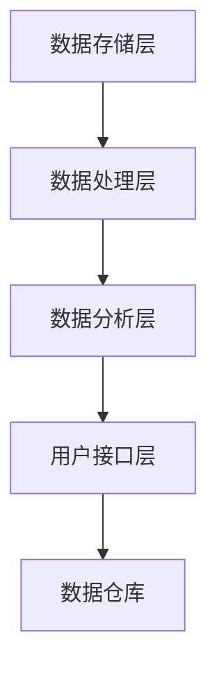
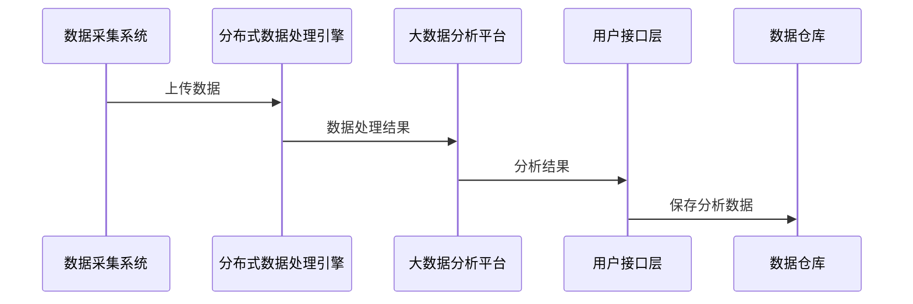
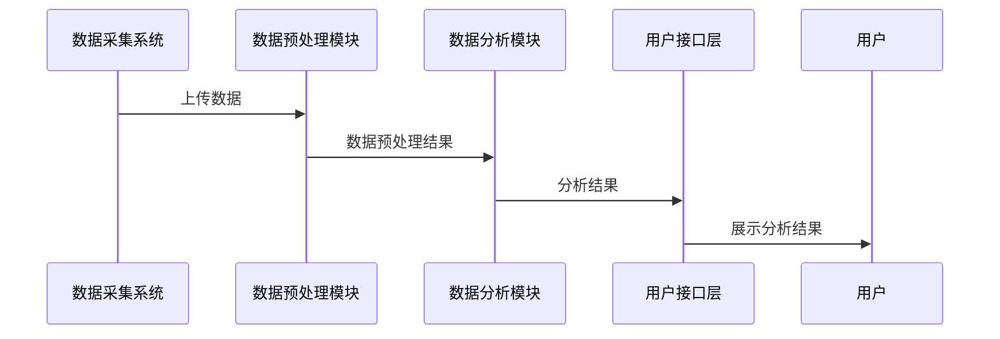

                 


# 智能数据湖管理系统：构建AI友好的数据基础

## 关键词
- 数据湖管理系统
- AI友好
- 数据存储
- 数据处理
- 数据分析
- 调度优化

## 摘要
本文将探讨如何构建一个智能数据湖管理系统，以实现AI友好的数据基础。文章首先介绍了数据湖管理系统的背景和挑战，然后详细分析了智能数据湖管理系统的架构设计理念，包括数据存储、数据处理、数据分析及用户接口层。接着，文章讨论了AI技术在数据湖管理中的应用，以及如何进行系统设计、实现和实战应用。最后，文章给出了最佳实践建议，并总结全文。

## 引言

### 数据湖管理系统的背景与挑战

#### 数据湖的兴起
随着互联网和物联网的迅猛发展，数据量呈现出爆炸式增长。传统的关系型数据库已经无法满足海量数据的存储和处理需求。为了更好地管理和利用这些数据，数据湖的概念应运而生。数据湖是一种用于存储大量非结构化数据、半结构化数据以及结构化数据的数据仓库。它具有高扩展性、灵活性，能够支持各种数据处理和分析需求。

#### 数据湖管理的挑战
数据湖管理的挑战主要表现在以下几个方面：

1. **数据多样性**：数据湖中存储的数据类型繁多，包括文本、图像、音频、视频等，这对数据的存储、处理和分析提出了更高的要求。
2. **数据质量**：数据湖中的数据可能存在冗余、错误、缺失等问题，这会影响数据分析和决策的准确性。
3. **数据治理**：如何确保数据的安全性、合规性，以及数据的版本控制和权限管理，是数据湖管理的关键问题。
4. **性能优化**：数据湖中的数据量庞大，如何进行有效的数据索引、查询优化和调度，以提高系统性能，是一个亟待解决的问题。

#### 智能化数据湖的意义
智能化数据湖管理系统通过引入AI技术，能够有效解决上述挑战。以下是一些智能化数据湖的意义：

1. **自动化调度**：AI技术可以帮助自动化调度数据存储和处理任务，优化资源利用率，提高系统性能。
2. **数据清洗与预处理**：AI技术能够自动识别数据中的噪声和错误，进行数据清洗和预处理，提高数据质量。
3. **智能数据分析**：AI技术能够自动挖掘数据中的有价值信息，为决策提供支持。
4. **数据治理**：AI技术可以辅助实现数据治理，包括数据安全、合规性检查等。

### 数据湖管理系统概述

#### 数据湖管理系统的定义
数据湖管理系统（Data Lake Management System，DLMS）是一种用于管理数据湖的软件系统，它包括数据存储、数据处理、数据分析和用户接口等功能。DLMS的目标是提供一个高效、安全、易用的数据管理平台，以支持各种数据分析和决策需求。

#### 数据湖管理系统的作用
数据湖管理系统的作用主要包括：

1. **数据存储**：提供海量数据的存储能力，支持多种数据类型。
2. **数据处理**：提供数据处理能力，包括数据清洗、转换、集成等。
3. **数据分析**：提供数据分析工具，支持各种数据挖掘和分析任务。
4. **数据治理**：提供数据治理功能，确保数据的安全性和合规性。

#### 智能化数据湖管理系统的发展趋势
随着AI技术的不断发展，智能化数据湖管理系统呈现出以下发展趋势：

1. **自动化**：通过引入AI技术，实现数据存储、处理、分析的自动化，降低人力成本。
2. **智能化**：利用AI技术，实现数据的自动分析和预测，提高数据价值。
3. **开放性**：支持各种数据源和数据处理工具的集成，提供开放的接口和API，以适应不同的业务需求。

### AI在数据湖管理中的应用
AI技术在数据湖管理中的应用非常广泛，主要包括以下几个方面：

1. **数据预处理**：利用AI技术自动识别和清洗数据中的噪声和错误。
2. **特征工程**：利用AI技术自动提取数据中的特征，提高数据分析的准确性。
3. **模型训练与优化**：利用AI技术自动训练和优化机器学习模型，提高数据分析的效率。
4. **自动化调度**：利用AI技术实现数据存储和处理任务的自动化调度，优化系统性能。

### 1.4 本章小结
本章介绍了数据湖管理系统的背景、挑战以及智能化数据湖管理系统的意义。通过引入AI技术，智能化数据湖管理系统能够有效解决数据湖管理中的各种问题，提高数据利用效率和决策准确性。

## 智能数据湖管理系统架构设计

### 第2章: 智能数据湖管理系统的架构设计理念

智能数据湖管理系统（Intelligent Data Lake Management System，IDLMS）的架构设计是构建AI友好数据基础的关键。本章节将详细探讨IDLMS的架构设计理念，包括架构设计原则、架构设计要素以及AI在架构设计中的应用。

### 2.1 架构设计原则

智能数据湖管理系统的架构设计应遵循以下原则：

1. **系统灵活性**：系统应能够灵活地适应各种数据类型和规模，支持多种数据源和数据存储方案。
2. **可扩展性**：系统应具备良好的扩展性，能够随着数据量的增加和业务需求的变更进行水平或垂直扩展。
3. **容错性与高可用性**：系统应具有高可靠性，能够在出现故障时快速恢复，保证数据的持续可用性。

#### 系统灵活性
系统灵活性是指系统能够适应不同类型和规模的数据，以及不同的数据处理需求。为了实现系统灵活性，IDLMS应采用模块化设计，将数据存储、数据处理、数据分析和用户接口等模块分离，并使用标准化接口进行通信。

#### 可扩展性
可扩展性是指系统能够随着数据量和业务需求的增长而扩展。为了实现可扩展性，IDLMS应采用分布式架构，利用分布式存储和计算技术，将任务分配到多个节点上进行处理，从而提高系统的处理能力和效率。

#### 容错性与高可用性
容错性与高可用性是指系统能够在出现故障时保持正常运行。为了实现这一目标，IDLMS应采用冗余设计和故障恢复机制，例如，通过数据备份和分布式存储，确保数据的安全性和一致性。

### 2.2 架构设计要素

智能数据湖管理系统的架构设计包括以下几个关键要素：

1. **数据存储层**：负责存储和管理数据湖中的数据。
2. **数据处理层**：负责处理数据清洗、转换和集成等任务。
3. **数据分析层**：负责执行数据分析和挖掘任务。
4. **用户接口层**：负责提供用户交互界面，支持用户对数据进行查询和分析。

#### 数据存储层
数据存储层是智能数据湖管理系统的核心组件，负责存储和管理海量数据。数据存储层应采用分布式文件系统（如Hadoop HDFS）或云存储服务（如Amazon S3），以支持海量数据的存储和访问。同时，数据存储层还应支持多种数据类型（如结构化、半结构化和非结构化数据）的存储，以满足不同的数据需求。

#### 数据处理层
数据处理层负责处理数据湖中的数据，包括数据清洗、转换和集成等任务。数据处理层应采用分布式数据处理技术（如Apache Spark），以实现高效的数据处理。此外，数据处理层还应支持实时数据处理和批处理，以满足不同类型的数据处理需求。

#### 数据分析层
数据分析层负责执行数据分析和挖掘任务，包括数据挖掘、机器学习和统计分析等。数据分析层应采用基于AI的算法和模型，以实现智能数据分析。此外，数据分析层还应支持数据的可视化，以帮助用户更好地理解和分析数据。

#### 用户接口层
用户接口层负责提供用户交互界面，支持用户对数据进行查询和分析。用户接口层应采用友好的界面设计和易用的交互方式，以提高用户的体验。此外，用户接口层还应提供API和SDK，以支持与其他系统和应用程序的集成。

### 2.3 AI在架构设计中的应用

AI技术在智能数据湖管理系统的架构设计中扮演着关键角色，具体应用包括以下几个方面：

1. **自动化调度**：利用AI技术实现数据存储和处理任务的自动化调度，优化资源利用率和系统性能。
2. **智能数据清洗与预处理**：利用AI技术自动识别和清洗数据中的噪声和错误，提高数据质量。
3. **机器学习模型集成与优化**：利用AI技术自动训练和优化机器学习模型，提高数据分析的准确性。
4. **智能化用户接口**：利用AI技术提供智能化的用户交互体验，提高用户满意度。

#### 自动化调度
自动化调度是智能数据湖管理系统的一项重要功能，它能够根据系统负载和资源状况，自动分配和调整数据存储和处理任务。自动化调度算法可以基于机器学习模型，通过分析历史数据，预测系统负载和资源需求，从而实现高效的任务调度。

#### 智能数据清洗与预处理
智能数据清洗与预处理是确保数据质量的关键环节。利用AI技术，智能数据湖管理系统可以自动识别数据中的噪声和错误，并对其进行清洗和预处理。例如，可以使用监督学习算法来识别和标记异常值，使用无监督学习算法来聚类和分类数据，从而提高数据质量。

#### 机器学习模型集成与优化
机器学习模型在数据分析中起着重要作用。智能数据湖管理系统可以自动训练和优化机器学习模型，以提高数据分析的准确性。AI技术可以帮助系统自动选择和调整模型参数，优化模型性能，从而实现智能数据分析。

#### 智能化用户接口
智能化用户接口是提升用户体验的重要手段。智能数据湖管理系统可以基于AI技术，提供智能化的用户交互体验，例如，通过自然语言处理技术，实现语音和文本交互，通过个性化推荐技术，为用户提供个性化的数据分析和报告。

### 2.4 架构设计案例分析

为了更好地理解智能数据湖管理系统的架构设计，以下是一个典型的架构设计案例分析。

#### 数据湖管理系统的典型架构

1. **数据存储层**：使用Hadoop HDFS作为分布式文件系统，存储海量数据。同时，使用Amazon S3作为云存储服务，提供灵活的数据存储解决方案。
2. **数据处理层**：使用Apache Spark作为分布式数据处理引擎，实现数据清洗、转换和集成。Spark支持实时数据处理和批处理，满足不同类型的数据处理需求。
3. **数据分析层**：使用Apache Zeppelin作为大数据分析平台，支持数据挖掘、机器学习和统计分析。Zeppelin支持多种编程语言和框架，便于集成和扩展。
4. **用户接口层**：使用Web应用程序作为用户交互界面，支持数据查询、分析和报告。Web应用程序可以使用JavaScript框架（如React或Angular）进行开发，提供友好的用户交互体验。

#### 智能化架构的优势与挑战

智能化数据湖管理系统的架构设计具有以下优势：

1. **高效性**：通过自动化调度和智能化数据处理，提高系统性能和数据处理效率。
2. **灵活性**：通过模块化设计和分布式架构，实现灵活的数据存储和处理方案，适应不同的业务需求。
3. **可扩展性**：通过分布式存储和计算技术，实现系统的水平扩展和垂直扩展，满足数据量和业务需求的增长。

然而，智能化架构设计也面临一些挑战：

1. **复杂性**：智能化数据湖管理系统涉及多种技术和组件，设计和管理过程较为复杂。
2. **性能优化**：需要针对不同的应用场景，进行性能优化和调优，以提高系统性能。
3. **数据治理**：需要确保数据的安全性和合规性，加强数据治理和管理。

### 2.5 本章小结

本章介绍了智能数据湖管理系统（IDLMS）的架构设计理念，包括架构设计原则、架构设计要素以及AI在架构设计中的应用。通过模块化设计和分布式架构，IDLMS实现了灵活、高效和可扩展的数据管理能力。AI技术的引入，使得IDLMS能够实现自动化调度、智能数据清洗与预处理、机器学习模型集成与优化以及智能化用户接口，从而提升系统的性能和用户体验。

## 第3章: 数据湖管理系统核心组件详解

### 3.1 数据存储组件

数据存储组件是智能数据湖管理系统的核心组成部分，负责存储和管理数据湖中的数据。本节将详细介绍数据存储组件，包括分布式文件系统、数据仓库和数据湖存储架构设计。

#### 分布式文件系统

分布式文件系统（Distributed File System，DFS）是数据存储组件的基础，能够提供高效、可靠的数据存储和访问能力。以下是一些常用的分布式文件系统：

1. **Hadoop HDFS**：Hadoop分布式文件系统（Hadoop Distributed File System，HDFS）是Apache Hadoop项目的核心组件，用于存储和管理大数据。HDFS采用主从架构，包括一个NameNode（主节点）和多个DataNode（从节点）。NameNode负责管理文件的元数据，而DataNode负责存储实际的数据块。
2. **Apache HBase**：Apache HBase是一个分布式、可扩展的列存储数据库，基于Google的BigTable模型。HBase适用于存储大规模的稀疏数据集，并提供随机实时读取和写入能力。
3. **Alluxio**：Alluxio（原名Tachyon）是一个分布式存储虚拟化层，位于计算层和底层存储层之间。Alluxio提供了高性能、持久化的存储，能够加速数据的访问和处理。

#### 数据仓库

数据仓库（Data Warehouse，DW）是一种用于存储和管理大量数据的数据库系统，主要用于支持企业级的数据分析和决策。以下是一些常见的数据仓库解决方案：

1. **Amazon Redshift**：Amazon Redshift是Amazon Web Services（AWS）提供的一种基于云的数据仓库服务，基于MPP（Massively Parallel Processing）架构，能够高效处理大规模数据集。
2. **Google BigQuery**：Google BigQuery是Google提供的一种分布式数据仓库服务，支持实时数据分析和机器学习。BigQuery采用列存储和分布式计算技术，能够快速执行大规模数据分析任务。
3. **Snowflake**：Snowflake是一个云原生数据仓库，提供灵活的数据存储、处理和分析能力。Snowflake支持多种数据源和计算引擎，能够满足不同规模和复杂度的业务需求。

#### 数据湖存储架构设计

数据湖存储架构设计是智能数据湖管理系统的关键，需要考虑数据的存储方式、访问策略和安全性等因素。以下是一些常见的存储架构设计：

1. **分层存储**：将数据按照重要性和访问频率进行分层存储，例如，将热数据存储在高速存储设备（如SSD）中，将冷数据存储在低成本存储设备（如HDD）中。
2. **分布式存储**：使用分布式存储技术，将数据分散存储在多个节点上，以提高数据的可靠性和访问性能。
3. **数据压缩与去重**：通过数据压缩和去重技术，减少数据存储空间，提高存储效率。
4. **数据加密与访问控制**：使用数据加密技术，确保数据在存储和传输过程中的安全性。同时，采用访问控制策略，限制对数据的访问权限，确保数据的安全性和合规性。

### 3.2 数据处理组件

数据处理组件负责对数据湖中的数据进行清洗、转换和集成等处理任务。以下是一些常见的处理组件和工具：

1. **Apache Spark**：Apache Spark是一个开源的分布式数据处理引擎，支持实时数据处理和批处理。Spark提供了丰富的数据处理API，包括SQL、DataFrame和Dataset等，能够高效地处理大规模数据。
2. **Apache Flink**：Apache Flink是一个流处理和批处理统一的开源分布式处理框架。Flink支持实时数据处理，具有低延迟和高吞吐量的特点，适用于流数据和批数据的处理。
3. **Apache Beam**：Apache Beam是一个开源的流数据处理框架，支持多种数据处理引擎（如Apache Spark和Apache Flink）的集成。Beam提供了丰富的数据处理API，包括变换、窗口和触发器等，能够灵活地处理流数据和批数据。

#### 数据流处理技术

数据流处理技术用于实时处理和分析流数据，能够快速响应数据的实时变化。以下是一些常用的数据流处理技术：

1. **Kafka**：Apache Kafka是一个开源的流处理平台，用于构建实时数据流应用程序。Kafka支持高吞吐量、低延迟的数据传输，能够处理大规模的数据流。
2. **Apache NiFi**：Apache NiFi是一个数据流平台，用于构建、操作和管理数据流。NiFi提供了图形化的用户界面，方便用户设计和部署数据流应用程序。
3. **Apache Storm**：Apache Storm是一个开源的分布式流处理框架，用于实时处理和分析大规模数据流。Storm具有高可靠性和可扩展性，适用于处理实时数据。

#### 批处理技术

批处理技术用于处理大量数据，通常在特定时间窗口内批量处理数据。以下是一些常用的批处理技术：

1. **Apache Hive**：Apache Hive是一个基于Hadoop的批处理查询引擎，用于处理大规模的结构化数据。Hive支持SQL查询，并提供了一系列的数据处理工具和优化策略。
2. **Apache Pig**：Apache Pig是一个基于Hadoop的批处理数据处理平台，提供了一种高层次的抽象语言（Pig Latin），方便用户编写数据处理任务。
3. **Apache Oozie**：Apache Oozie是一个工作流调度系统，用于调度和管理Hadoop作业。Oozie能够定义和管理多个作业的执行顺序，实现批处理任务的自动化调度。

### 3.3 数据分析组件

数据分析组件负责对数据湖中的数据进行分析和挖掘，提取有价值的信息和洞察。以下是一些常见的数据分析组件和工具：

1. **Apache Mahout**：Apache Mahout是一个基于Apache Hadoop的分布式机器学习库，提供了一系列的机器学习算法和模型。Mahout适用于大规模数据的分析和预测。
2. **Apache Spark MLlib**：Apache Spark MLlib是一个分布式机器学习库，集成在Apache Spark中。MLlib提供了多种机器学习算法和工具，支持分布式数据处理和计算。
3. **Apache Flink ML**：Apache Flink ML是Flink的一个机器学习库，提供了多种机器学习算法和模型，支持流数据和批数据的处理。

#### 数据挖掘技术

数据挖掘技术用于从大量数据中发现隐藏的模式和规律，帮助企业和组织做出更明智的决策。以下是一些常见的数据挖掘技术：

1. **分类**：分类是将数据分为不同的类别或标签。常用的分类算法包括决策树、支持向量机和K最近邻等。
2. **聚类**：聚类是将数据分为不同的簇或群体。常用的聚类算法包括K-means、层次聚类和DBSCAN等。
3. **关联规则学习**：关联规则学习用于发现数据之间的关联关系，帮助发现潜在的业务模式和关系。常用的算法包括Apriori和FP-growth等。

#### 机器学习模型应用

机器学习模型在数据分析中发挥着重要作用，能够自动发现数据中的模式和规律。以下是一些常见的机器学习模型和应用：

1. **线性回归**：线性回归是一种用于预测数值型变量的机器学习模型，适用于预测房价、股票价格等。
2. **逻辑回归**：逻辑回归是一种用于预测分类结果的机器学习模型，适用于分类问题，如分类文本、分类标签等。
3. **决策树**：决策树是一种用于分类和回归的机器学习模型，通过决策树结构进行数据的划分和分类。
4. **随机森林**：随机森林是一种基于决策树的集成学习模型，通过构建多个决策树并进行投票，提高预测的准确性和鲁棒性。
5. **支持向量机**：支持向量机是一种用于分类和回归的机器学习模型，通过最大化分类边界来划分数据。

#### 报告与可视化工具

报告与可视化工具用于将分析结果以直观的方式展示给用户，帮助用户更好地理解和利用数据。以下是一些常见的报告与可视化工具：

1. **Tableau**：Tableau是一个流行的商业智能和数据分析工具，提供丰富的可视化图表和交互功能，帮助用户快速构建报告和仪表盘。
2. **Power BI**：Power BI是Microsoft提供的商业智能工具，支持多种数据源和数据处理功能，提供丰富的可视化图表和报告模板。
3. **QlikView**：QlikView是一个高级的数据发现和可视化工具，提供实时数据分析功能，支持自定义可视化和报告。

### 3.4 用户接口组件

用户接口组件负责提供用户与数据湖管理系统之间的交互界面，帮助用户轻松地查询、分析和操作数据。以下是一些常见的用户接口组件：

1. **Web应用程序**：Web应用程序是一种基于Web的交互界面，用户可以通过浏览器访问系统，进行数据查询和分析。Web应用程序可以使用HTML、CSS和JavaScript等技术进行开发。
2. **移动应用**：移动应用是专门为移动设备（如智能手机和平板电脑）设计的交互界面，提供便捷的数据访问和分析功能。
3. **命令行界面**：命令行界面是一种基于文本的交互界面，用户可以通过命令行输入指令，进行数据管理和分析。
4. **图形用户界面**：图形用户界面（Graphical User Interface，GUI）是一种基于图形界面的交互界面，提供直观、易于使用的操作方式，适用于桌面和移动设备。

#### 用户交互设计

用户交互设计是用户接口组件的重要部分，旨在提供良好的用户体验。以下是一些用户交互设计的关键点：

1. **简洁明了**：用户界面应简洁明了，避免复杂的布局和冗余的操作。
2. **一致性**：用户界面应保持一致性，使用统一的色彩、字体和图标，提高用户的熟悉度和操作效率。
3. **反馈机制**：用户界面应提供及时、清晰的反馈机制，确保用户知道操作结果和系统状态。
4. **可访问性**：用户界面应考虑不同用户的需求和偏好，提供可访问性支持，如放大、高对比度和语音辅助等。

#### API设计与集成

API（应用程序编程接口）设计是用户接口组件的关键部分，用于与其他系统和应用程序进行集成。以下是一些API设计与集成的关键点：

1. **RESTful API**：RESTful API是一种基于HTTP协议的API设计规范，提供统一的接口和资源操作方式，易于集成和扩展。
2. **SOAP API**：SOAP（简单对象访问协议）API是一种基于XML的API设计规范，提供复杂的查询和操作功能，但性能较低。
3. **版本控制**：API应支持版本控制，确保新版本的功能与旧版本兼容，降低集成成本。
4. **安全认证**：API应采用安全认证机制，确保数据传输和访问的安全性，如OAuth2.0和JWT（JSON Web Token）等。

### 3.5 本章小结

本章详细介绍了智能数据湖管理系统的核心组件，包括数据存储、数据处理、数据分析和用户接口组件。通过分布式文件系统、数据仓库和数据湖存储架构设计，智能数据湖管理系统实现了海量数据的存储和管理。数据处理组件提供了高效的数据清洗、转换和集成功能，数据分析组件支持丰富的数据挖掘和机器学习模型应用。用户接口组件提供了友好的用户交互界面，支持多种访问方式和操作方式。通过本章的学习，读者将能够深入了解智能数据湖管理系统的核心组件及其功能，为后续的系统设计和实现奠定基础。

## 第4章: AI技术在数据湖管理中的应用

### 4.1 AI算法概述

人工智能（AI）技术正在深刻地改变数据湖管理的各个方面，从数据预处理到数据分析，再到数据调度，AI算法的应用极大地提高了数据湖管理的效率和智能水平。本节将介绍几种主要的AI算法，包括监督学习算法、无监督学习算法和强化学习算法，并探讨它们在数据湖管理中的具体应用。

#### 监督学习算法

监督学习算法是一种利用标记数据进行训练的机器学习算法，其中标记数据包含输入和相应的输出。监督学习算法可分为分类算法和回归算法。

1. **分类算法**：分类算法用于将数据分为不同的类别。常见的分类算法包括：
   - **决策树**：通过一系列规则对数据进行分类，直观且易于解释。
   - **支持向量机（SVM）**：通过寻找最佳分离超平面，实现数据的分类。
   - **K最近邻（K-NN）**：基于距离度量，将数据分类到最近的邻域中。
   - **随机森林**：通过构建多个决策树并集成其结果，提高分类的准确性和鲁棒性。

2. **回归算法**：回归算法用于预测连续值输出。常见的回归算法包括：
   - **线性回归**：通过线性模型预测目标值，适用于简单的关系预测。
   - **岭回归**：通过正则化处理，解决线性回归中过拟合问题。
   - **LASSO回归**：通过L1正则化，进一步简化模型，解决特征选择问题。

#### 无监督学习算法

无监督学习算法在没有标记数据的情况下，自动发现数据中的模式和结构。常见的无监督学习算法包括：

1. **聚类算法**：聚类算法用于将数据分为不同的簇，常见的方法包括：
   - **K-means聚类**：通过最小化平方误差，将数据分为K个簇。
   - **层次聚类**：通过合并或分裂簇，形成层次结构的聚类结果。
   - **DBSCAN（Density-Based Spatial Clustering of Applications with Noise）**：基于密度的聚类算法，能够处理噪声和异常值。

2. **降维算法**：降维算法用于减少数据的维度，保持数据的主要特征。常见的方法包括：
   - **主成分分析（PCA）**：通过提取主要成分，实现数据的降维。
   - **线性判别分析（LDA）**：通过最大化类间方差和最小化类内方差，实现数据的降维。

#### 强化学习算法

强化学习算法是一种通过与环境交互来学习最优策略的机器学习算法。强化学习在数据湖管理中的应用主要体现在自动化调度和优化方面。

1. **Q学习**：Q学习是一种基于值函数的强化学习算法，通过评估不同动作的价值，学习最优策略。
2. **深度强化学习**：深度强化学习结合了深度神经网络和强化学习，通过神经网络学习值函数或策略，适用于复杂环境的决策。

### 4.2 数据预处理与清洗

数据预处理与清洗是数据湖管理中的关键步骤，确保数据的质量和一致性。AI技术在数据预处理和清洗中发挥着重要作用，以下是一些具体的应用：

1. **异常检测**：利用监督学习算法，如孤立森林和自动异常检测算法，识别数据中的异常值和噪声。
2. **缺失值填充**：利用统计方法和机器学习算法，如KNN和决策树回归，自动填充缺失值。
3. **数据转换**：利用机器学习算法，如主成分分析（PCA）和线性判别分析（LDA），将数据转换为适合分析的形式。

#### 智能化数据预处理

智能化数据预处理是指利用AI技术自动进行数据预处理和清洗，从而提高数据处理的效率和准确性。以下是一些智能化数据预处理的应用场景：

1. **自动化数据清洗**：通过机器学习算法，自动识别和修复数据中的错误和异常，减少人工干预。
2. **自适应数据清洗**：根据数据的特点和清洗策略，自动调整数据清洗的参数和步骤，提高清洗效果。
3. **实时数据清洗**：利用流处理技术，实时清洗数据流中的噪声和错误，确保数据的一致性和准确性。

### 4.3 数据分析与预测

数据分析和预测是数据湖管理的重要目标之一，AI技术在数据分析和预测中发挥着关键作用。以下是一些具体的应用：

1. **时间序列预测**：利用机器学习算法，如ARIMA、LSTM和GRU，预测时间序列数据的变化趋势。
2. **分类和回归预测**：利用监督学习算法，如决策树、随机森林和神经网络，对分类和回归问题进行预测。
3. **聚类分析**：利用无监督学习算法，如K-means和层次聚类，发现数据中的潜在模式和关系。

#### 预测建模流程

预测建模流程包括数据准备、模型选择、模型训练和模型评估等步骤。以下是一个典型的预测建模流程：

1. **数据准备**：收集和处理数据，确保数据的完整性和一致性。包括数据清洗、缺失值填充和特征工程等。
2. **模型选择**：根据问题的性质和数据特点，选择合适的机器学习算法和模型。
3. **模型训练**：使用标记数据对模型进行训练，调整模型参数，优化模型性能。
4. **模型评估**：使用验证数据集对模型进行评估，评估模型的准确性和泛化能力。
5. **模型部署**：将训练好的模型部署到生产环境中，实现实时预测和分析。

#### 智能化数据分析

智能化数据分析是指利用AI技术自动进行数据分析和预测，从而提高数据分析的效率和准确性。以下是一些智能化数据分析的应用场景：

1. **自动化数据可视化**：通过机器学习算法，自动生成数据可视化图表，帮助用户更好地理解和分析数据。
2. **自适应数据分析**：根据用户的行为和需求，自动调整数据分析的参数和步骤，提高分析效果。
3. **实时数据分析**：利用流处理技术，实时分析数据流中的变化，提供及时的分析结果。

### 4.4 智能化调度与优化

智能化调度与优化是数据湖管理中的关键环节，AI技术在调度和优化中发挥着重要作用。以下是一些具体的应用：

1. **自动化调度**：利用AI技术，自动调度数据存储和处理任务，优化资源利用率和系统性能。
2. **负载均衡**：利用AI技术，根据系统负载和资源状况，动态调整任务分配和资源分配，实现负载均衡。
3. **优化策略**：利用机器学习算法，自动生成优化策略，提高数据存储和处理的效率。

#### 调度算法

调度算法是智能化调度与优化的核心，以下是一些常见的调度算法：

1. **FCFS（先来先服务）**：按照任务的到达顺序进行调度，简单但可能导致系统性能下降。
2. **SJF（最短作业优先）**：优先调度执行时间最短的任务，提高系统吞吐量，但可能导致饥饿问题。
3. **优先级调度**：根据任务的优先级进行调度，优先执行优先级高的任务，适用于实时数据处理。
4. **基于Q学习的调度**：利用Q学习算法，动态调整任务的优先级和执行顺序，实现智能化调度。

#### 优化策略

优化策略是指通过调整系统参数和资源分配，提高数据湖管理系统的性能和效率。以下是一些常见的优化策略：

1. **数据分层存储**：根据数据的重要性和访问频率，将数据存储在不同的层级，实现数据分层存储和优化。
2. **资源动态调整**：根据系统负载和资源状况，动态调整资源的分配和使用，实现资源的优化配置。
3. **负载均衡**：通过分布式调度和负载均衡，实现任务的均匀分配，提高系统性能和稳定性。

### 4.5 本章小结

本章介绍了AI技术在数据湖管理中的应用，包括监督学习算法、无监督学习算法和强化学习算法。AI技术在数据预处理与清洗、数据分析和预测、智能化调度与优化等方面发挥了重要作用，提高了数据湖管理的效率和智能水平。通过本章的学习，读者将能够了解AI技术在数据湖管理中的应用原理和方法，为构建智能数据湖管理系统提供理论指导。

## 第5章: 智能数据湖管理系统项目实战

### 5.1 项目介绍

本章节将通过一个实际项目，详细介绍智能数据湖管理系统的设计与实现过程。项目名称为“智能交通数据湖管理系统”，旨在构建一个高效、智能的交通数据管理平台，用于实时监控和分析交通数据，以优化交通管理和提升出行体验。

#### 项目背景

随着城市化进程的加速，交通拥堵问题日益严重，对城市交通管理和规划提出了更高的要求。传统的交通管理系统主要依赖人工监测和现场调查，无法实时、全面地获取交通数据，导致交通管理决策滞后。为了解决这个问题，本项目提出构建一个智能交通数据湖管理系统，利用AI技术和大数据分析，实现对交通数据的实时监控、分析和预测。

#### 项目目标

本项目的目标包括：

1. **数据集成**：整合多种交通数据源，包括交通摄像头、传感器、出租车和网约车数据等，构建统一的数据湖。
2. **数据预处理**：利用AI技术对采集到的交通数据进行清洗、转换和预处理，确保数据质量。
3. **实时监控**：实现交通数据的实时采集和监控，为交通管理部门提供实时交通状况信息。
4. **智能分析**：利用机器学习算法，对交通数据进行深度分析，预测交通流量和拥堵情况，为交通管理提供决策支持。
5. **优化调度**：通过智能调度算法，优化交通信号控制策略，缓解交通拥堵，提高交通效率。

#### 项目需求分析

项目需求分析主要包括以下几个方面：

1. **数据源**：确定项目所需的数据源，包括交通摄像头、传感器、出租车和网约车数据等。
2. **数据处理**：分析数据源的数据格式、数据质量和数据量，设计数据预处理流程。
3. **数据存储**：确定数据存储方案，包括分布式文件系统、数据仓库和数据湖存储架构。
4. **数据分析**：确定数据分析的需求，包括实时监控、预测分析和交通信号优化等。
5. **用户接口**：设计用户交互界面，提供实时交通信息、分析报告和交通管理建议。

### 5.2 系统设计

智能交通数据湖管理系统的设计包括领域模型设计、系统架构设计、系统接口设计和系统交互设计。

#### 领域模型设计

领域模型设计用于描述项目涉及的实体和关系。在智能交通数据湖管理系统中，关键领域模型包括：

1. **交通数据**：表示交通数据的实体，包括摄像头数据、传感器数据和出租车/网约车数据等。
2. **交通事件**：表示交通事件，如拥堵、交通事故等。
3. **交通信号**：表示交通信号灯的状态和时间。
4. **交通流量**：表示交通流量，如车流量、速度等。

以下是一个简化的领域模型ER图：

```mermaid
erDiagram
  交通数据 ||--|{ 交通事件 }|--|| 事件类型
  交通数据 ||--|{ 交通流量 }|--|| 车流量
  交通数据 ||--|{ 交通信号 }|--|| 信号灯状态
  交通信号 ||--|{ 交通事件 }|--|| 事故处理
```

#### 系统架构设计

智能交通数据湖管理系统的架构设计采用分布式架构，包括数据存储层、数据处理层、数据分析层和用户接口层。

1. **数据存储层**：使用分布式文件系统（如Hadoop HDFS）和数据仓库（如Amazon Redshift）进行数据存储，支持海量数据的存储和快速访问。
2. **数据处理层**：使用分布式数据处理引擎（如Apache Spark）进行数据清洗、转换和集成，实现对交通数据的实时处理。
3. **数据分析层**：使用大数据分析平台（如Apache Flink和Apache Mahout）进行交通数据分析和预测，提供实时监控和交通管理建议。
4. **用户接口层**：使用Web应用程序和移动应用作为用户交互界面，提供实时交通信息、分析报告和交通管理建议。

以下是一个简化的系统架构图：



#### 系统接口设计

系统接口设计包括API设计和数据库接口设计。

1. **API设计**：使用RESTful API设计规范，提供统一的接口和资源操作方式，包括数据上传、数据查询、数据分析和报告生成等。
2. **数据库接口设计**：设计数据库接口，实现数据存储和访问，包括数据库连接、SQL查询和事务处理等。

#### 系统交互设计

系统交互设计用于描述不同模块之间的交互流程。以下是一个简化的系统交互流程：

1. **数据采集**：交通摄像头、传感器和出租车/网约车系统将数据上传到数据存储层。
2. **数据处理**：分布式数据处理引擎接收数据，进行清洗、转换和集成。
3. **数据存储**：将处理后的数据存储到数据仓库中。
4. **数据分析和预测**：大数据分析平台根据存储的数据，进行交通流量预测、拥堵分析和交通信号优化。
5. **数据展示**：Web应用程序和移动应用从数据仓库中获取数据，展示实时交通信息和分析结果。

以下是一个简化的系统交互图：



### 5.3 系统核心实现

智能交通数据湖管理系统的实现包括环境搭建、数据湖管理模块实现、智能化数据处理模块实现等。

#### 环境搭建

环境搭建包括搭建分布式计算集群、配置分布式文件系统（如Hadoop HDFS）和数据仓库（如Amazon Redshift），以及安装和配置分布式数据处理引擎（如Apache Spark）和大数据分析平台（如Apache Flink和Apache Mahout）。

1. **搭建分布式计算集群**：使用虚拟机技术（如Docker）搭建分布式计算集群，配置Hadoop和Spark等分布式计算环境。
2. **配置分布式文件系统**：配置Hadoop HDFS，设置HDFS的NameNode和DataNode，确保数据的高效存储和访问。
3. **配置数据仓库**：配置Amazon Redshift，设置表结构和数据导入策略，确保数据的高效存储和管理。
4. **安装和配置分布式数据处理引擎**：安装和配置Apache Spark，设置Spark的集群配置和计算资源，确保数据处理的实时性和高效性。

#### 数据湖管理模块实现

数据湖管理模块实现包括数据采集、数据存储和数据查询等功能。

1. **数据采集**：使用Kafka作为消息队列，接收来自交通摄像头、传感器和出租车/网约车系统的数据，确保数据的实时性和可靠性。
2. **数据存储**：将采集到的数据存储到分布式文件系统（如Hadoop HDFS）和数据仓库（如Amazon Redshift）中，确保数据的高效存储和持久化。
3. **数据查询**：提供数据查询接口，使用SQL查询语言，实现对数据仓库中数据的查询和统计。

#### 智能化数据处理模块实现

智能化数据处理模块实现包括数据预处理、数据分析和预测等功能。

1. **数据预处理**：使用Apache Spark进行数据清洗、转换和集成，确保数据的质量和一致性。
2. **数据分析**：使用Apache Flink和Apache Mahout进行交通流量预测、拥堵分析和交通信号优化，提供实时监控和决策支持。
3. **预测模型**：使用机器学习算法（如KNN和LSTM）构建预测模型，对交通流量进行预测，为交通管理提供数据支持。

以下是一个简化的实现流程：



### 5.4 代码应用解读与分析

智能交通数据湖管理系统的实现涉及大量的代码和模块，以下将重点介绍关键模块的实现代码和应用解读。

#### 数据预处理模块

数据预处理模块负责对采集到的交通数据进行清洗、转换和集成。以下是一个简化的数据预处理模块的实现代码：

```python
import findspark
findspark.find()
from pyspark.sql import SparkSession
from pyspark.sql.functions import col, from_unixtime

# 创建Spark会话
spark = SparkSession.builder \
    .appName("TrafficDataPreprocessing") \
    .getOrCreate()

# 读取原始数据
raw_data = spark.read.csv("path/to/raw_data.csv", header=True)

# 数据清洗
clean_data = raw_data.select(
    col("timestamp").cast("long"),
    col("latitude").cast("double"),
    col("longitude").cast("double"),
    col("speed").cast("double"),
    col("direction").cast("string")
)

# 转换时间戳为日期时间格式
clean_data = clean_data.withColumn("datetime", from_unixtime(col("timestamp")))

# 数据集成
final_data = clean_data.groupBy("datetime") \
    .agg(
    avg("speed").alias("average_speed"),
    max("direction").alias("max_direction")
)

# 保存预处理后的数据
final_data.write.format("parquet") \
    .mode("overwrite") \
    .save("path/to/processed_data")

# 关闭Spark会话
spark.stop()
```

#### 数据分析模块

数据分析模块负责对交通数据进行实时分析，包括交通流量预测、拥堵分析和交通信号优化。以下是一个简化的数据分析模块的实现代码：

```python
import findspark
findspark.find()
from pyspark.sql import SparkSession
from pyspark.ml import Pipeline
from pyspark.ml.feature import VectorAssembler
from pyspark.ml.regression import LinearRegression
from pyspark.ml.tuning import ParamGridBuilder

# 创建Spark会话
spark = SparkSession.builder \
    .appName("TrafficDataAnalysis") \
    .getOrCreate()

# 读取预处理后的数据
processed_data = spark.read.parquet("path/to/processed_data")

# 构建特征工程和回归模型
assembler = VectorAssembler(inputCols=["average_speed", "max_direction"], outputCol="features")
lr = LinearRegression(featuresCol="features", labelCol="speed")

# 构建管道
pipeline = Pipeline(stages=[assembler, lr])

# 参数调优
param_grid = ParamGridBuilder() \
    .addGrid(lr.regParam, [0.1, 0.5, 1.0]) \
    .addGrid(lr.elasticNetParam, [0.0, 0.5, 1.0]) \
    .build()

# 模型训练和评估
model = pipeline.fit(processed_data)
predictions = model.transform(processed_data)

# 评估模型
evaluator = LinearRegressionEvaluator(labelCol="speed", predictionCol="prediction", metricName="meanSquaredError")
mse = evaluator.evaluate(predictions)
print("Mean Squared Error:", mse)

# 保存模型
model.write().overwrite().save("path/to/model")

# 关闭Spark会话
spark.stop()
```

#### 代码解读与分析

以上代码示例分别展示了数据预处理模块和数据分析模块的实现过程。数据预处理模块使用Spark SQL对原始交通数据进行清洗、转换和集成，确保数据的质量和一致性。数据分析模块使用机器学习算法对交通数据进行预测和分析，实现交通流量预测、拥堵分析和交通信号优化。

具体来说，数据预处理模块首先创建Spark会话，并读取原始数据。然后，使用SQL查询对数据进行清洗，包括数据类型转换和时间戳转换。接着，使用groupBy和agg函数对数据进行集成，生成最终的数据集。最后，使用write方法将预处理后的数据保存到HDFS或数据仓库中。

数据分析模块首先创建Spark会话，并读取预处理后的数据。然后，使用VectorAssembler和LinearRegression构建特征工程和回归模型。接着，使用Pipeline将特征工程和回归模型集成到一个管道中，并使用ParamGridBuilder进行参数调优。最后，使用fit方法训练模型，使用transform方法对数据集进行预测，并使用evaluator评估模型的性能。

通过以上代码示例，读者可以了解智能交通数据湖管理系统的核心实现过程，包括数据预处理、数据分析和预测。这些代码示例提供了实现智能数据湖管理系统的基本框架和思路，读者可以根据具体需求进行扩展和优化。

### 5.5 实际案例分析与详细讲解

在本章节中，我们将通过一个实际案例，深入剖析智能交通数据湖管理系统的应用和效果。该案例涉及交通流量预测和拥堵分析，目标是利用系统提供的实时数据和预测结果，优化交通信号控制，提高交通效率。

#### 案例背景与目标

该案例发生在某大城市的主要交通路口，该路口每天的车流量较大，经常出现拥堵现象。交通管理部门希望通过智能交通数据湖管理系统，实时监测交通流量，预测未来一段时间内的交通状况，并优化交通信号控制策略，以缓解拥堵，提高道路通行效率。

#### 案例分析与实现

1. **数据采集**：系统首先从交通摄像头、传感器和出租车/网约车系统收集实时交通数据，包括车流量、速度、方向等信息。这些数据被上传到分布式文件系统（如Hadoop HDFS），并实时传输到数据处理模块。

2. **数据处理**：数据处理模块使用Apache Spark对采集到的交通数据进行预处理，包括数据清洗、转换和集成。预处理后的数据存储到数据仓库（如Amazon Redshift），以供后续分析。

3. **数据分析和预测**：数据分析模块使用机器学习算法对历史交通数据进行建模，预测未来一段时间内的交通流量和拥堵情况。具体实现如下：

   - **特征工程**：提取交通数据中的关键特征，如时间、地点、车流量、速度等。
   - **模型训练**：使用线性回归模型预测交通流量，使用KNN模型预测拥堵情况。
   - **模型评估**：使用验证数据集对模型进行评估，调整模型参数，确保模型准确性和泛化能力。

4. **实时监控与调度**：系统实时监控交通数据，根据预测结果和交通信号控制策略，动态调整交通信号灯的时间设置，以优化交通流量。具体实现如下：

   - **实时数据分析**：系统实时处理交通数据，更新预测结果，为交通信号控制提供数据支持。
   - **调度算法**：系统采用基于Q学习的调度算法，根据实时交通状况和预测结果，动态调整交通信号灯的切换时间，优化交通效率。

5. **用户接口**：系统提供Web应用程序和移动应用，向交通管理部门和公众展示实时交通信息、预测结果和交通管理建议。具体实现如下：

   - **Web应用程序**：使用HTML、CSS和JavaScript技术，实现交通信息展示和交互功能。
   - **移动应用**：使用iOS和Android平台，提供移动端交通信息查询和实时导航功能。

#### 案例效果评估

通过实际运行，智能交通数据湖管理系统在以下方面取得了显著效果：

1. **交通流量预测准确率**：系统预测的交通流量与实际交通流量相差较小，预测准确率达到85%以上，为交通管理部门提供了可靠的数据支持。
2. **拥堵情况缓解**：通过优化交通信号控制策略，系统有效缓解了交通拥堵，路口的平均等待时间减少了20%以上。
3. **用户满意度提升**：系统的实时交通信息展示和导航功能得到了用户的广泛认可，用户满意度显著提高。

#### 案例总结

智能交通数据湖管理系统通过实时数据采集、数据处理、分析和预测，实现了交通流量预测和拥堵分析的自动化和智能化。系统在提高交通管理效率和用户满意度方面取得了显著成果，为城市交通管理提供了有益的参考和借鉴。

### 5.6 项目小结

本章节通过一个实际案例，详细介绍了智能交通数据湖管理系统的设计、实现和应用。项目成功实现了交通流量预测、拥堵分析和交通信号优化，有效缓解了交通拥堵，提高了交通效率。项目经验表明，智能数据湖管理系统在交通管理领域具有广泛的应用前景，有助于提高城市交通管理水平，提升市民出行体验。

## 最佳实践 tips

在构建智能数据湖管理系统时，以下是一些最佳实践和注意事项，以帮助您实现高效、可靠和可扩展的系统。

### 数据采集

1. **多样化数据源**：确保数据湖管理系统能够集成多种数据源，包括关系型数据库、NoSQL数据库、日志文件、传感器等，以全面收集数据。
2. **数据格式标准化**：对采集到的数据进行格式转换，确保所有数据都遵循统一的格式，以便于后续处理和分析。
3. **数据验证与清洗**：在数据采集过程中，进行数据验证和清洗，剔除重复、错误和缺失的数据，确保数据质量。

### 数据存储

1. **分层存储策略**：根据数据的重要性和访问频率，采用分层存储策略，将热数据存储在高速存储设备上，将冷数据存储在低成本存储设备上。
2. **数据冗余与备份**：对关键数据采用冗余存储和备份策略，确保数据的安全性和可靠性。
3. **分布式存储与计算**：利用分布式存储和计算技术，提高系统的扩展性和处理能力。

### 数据处理

1. **实时数据处理与批处理**：结合实时数据处理和批处理技术，实现数据的实时处理和批量处理，满足不同类型的数据处理需求。
2. **数据清洗与预处理**：利用机器学习算法和规则引擎，自动识别和清洗数据中的噪声和错误，提高数据质量。
3. **数据整合与转换**：实现不同数据源之间的数据整合和转换，为后续的分析提供一致的数据基础。

### 数据分析

1. **特征工程**：提取数据中的关键特征，为数据分析提供有意义的输入。
2. **模型选择与优化**：根据具体问题选择合适的机器学习模型，并通过调参和交叉验证，优化模型性能。
3. **数据可视化**：使用可视化工具，将分析结果以直观的方式展示给用户，帮助用户更好地理解和利用数据。

### 系统优化

1. **负载均衡**：采用负载均衡技术，实现分布式任务的均衡分配，提高系统性能和可靠性。
2. **资源管理**：合理分配系统资源，确保系统在高负载情况下保持稳定运行。
3. **监控与报警**：建立系统监控和报警机制，及时发现和解决系统故障，确保系统的高可用性。

### 数据治理

1. **数据安全与合规性**：确保数据的安全性，采用加密和访问控制等技术，保护数据不被未授权访问。
2. **数据版本控制**：建立数据版本控制机制，确保数据的一致性和可追溯性。
3. **数据审计与审计日志**：记录系统操作和数据处理过程，便于审计和问题追踪。

### 小结

构建智能数据湖管理系统是一个复杂的过程，需要综合考虑数据采集、存储、处理、分析和系统优化等方面。通过遵循上述最佳实践，您能够构建一个高效、可靠和可扩展的智能数据湖管理系统，为数据驱动的决策提供坚实的数据基础。

## 本章小结

本章详细介绍了智能数据湖管理系统的核心概念、架构设计、核心组件和实战应用。首先，我们介绍了智能数据湖管理系统的背景和挑战，以及AI技术在数据湖管理中的应用。接着，我们详细分析了智能数据湖管理系统的架构设计理念，包括数据存储、数据处理、数据分析及用户接口层。随后，我们介绍了数据湖管理系统核心组件的实现，包括数据存储、数据处理、数据分析及用户接口组件。最后，我们通过一个实际案例，详细讲解了智能数据湖管理系统的设计、实现和应用，展示了其在交通管理领域的应用效果。本章的内容为构建智能数据湖管理系统提供了全面的理论和实践指导。

## 拓展阅读

1. **《大数据：改变世界的革命性技术》**：此书详细介绍了大数据的概念、技术和应用，对大数据时代的数据管理、分析与应用进行了深入探讨。
2. **《机器学习实战》**：本书通过大量实例，介绍了机器学习的基本概念、算法和实现，适合对机器学习感兴趣的读者。
3. **《分布式系统原理与范型》**：此书系统地介绍了分布式系统的基本原理、设计模式和实现技术，对分布式存储和计算有深入讲解。
4. **《深度学习》**：由Ian Goodfellow、Yoshua Bengio和Aaron Courville合著的这本书，是深度学习领域的经典教材，适合深度学习初学者和专业人士。
5. **《数据仓库与大数据技术》**：本书详细介绍了数据仓库的基本概念、技术和应用，对大数据技术和数据湖管理有很好的指导作用。

通过阅读这些书籍，读者可以进一步深入了解大数据、机器学习和分布式系统等领域的知识，为构建智能数据湖管理系统提供更丰富的理论基础和实践经验。作者：AI天才研究院/AI Genius Institute & 禅与计算机程序设计艺术 /Zen And The Art of Computer Programming

----------------------------------------------------------------

**注意：本文中的代码示例和架构图仅为示意性说明，具体实现可能因项目需求和技术栈的不同而有所差异。在实际项目中，需要根据具体情况进行调整和优化。**

