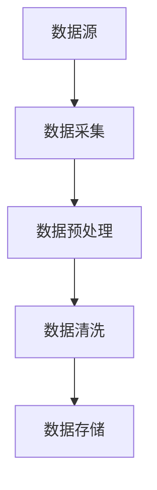
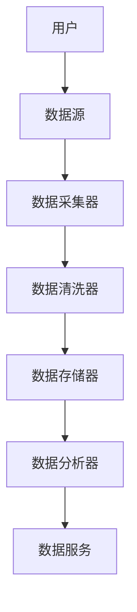
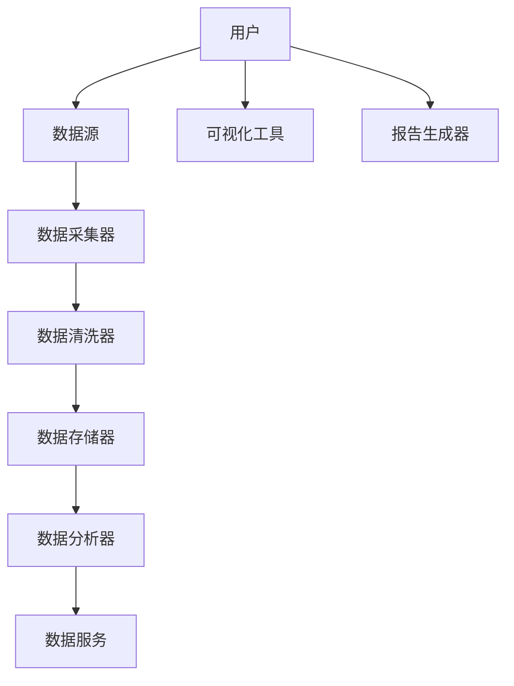
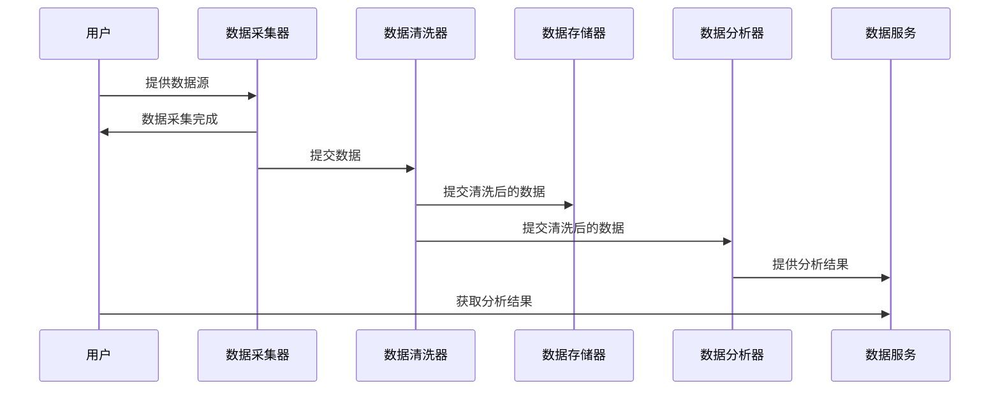
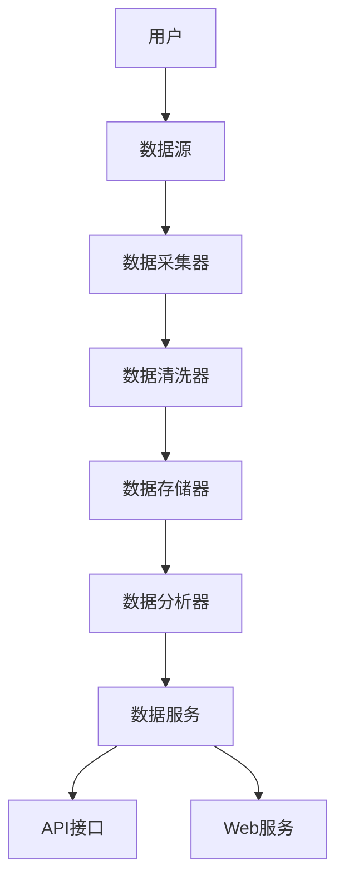
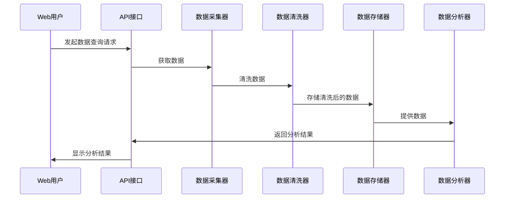
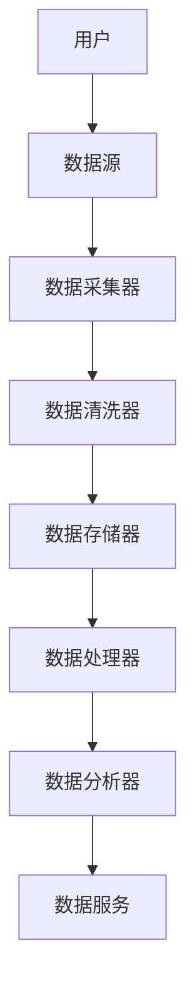
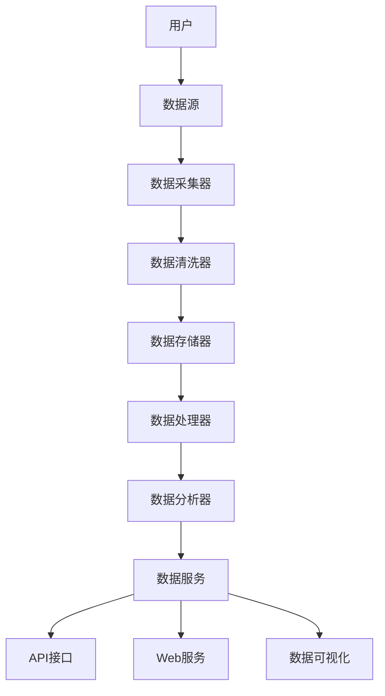
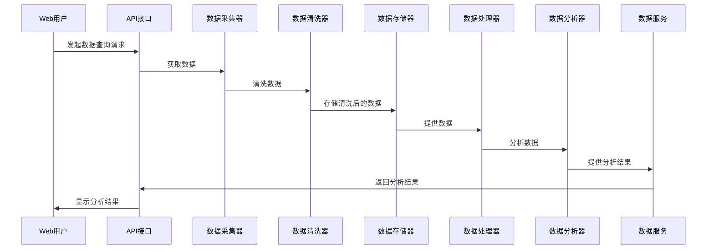

                 


# 智能数据湖管理：构建AI友好的数据基础

> 关键词：数据湖，人工智能，数据管理，数据分析，算法原理

> 摘要：本文深入探讨了智能数据湖的概念、优势、挑战及其核心组成部分，介绍了数据清洗的算法原理和数学模型，并设计了一个智能数据湖的系统分析与架构方案。通过本文的阅读，读者将全面了解智能数据湖的构建和管理，为AI技术的发展提供坚实的数据基础。

## 第一部分：引言

### 第1章：智能数据湖背景介绍

#### 1.1 问题背景

随着互联网和物联网的快速发展，数据量呈现爆炸式增长，传统的数据仓库已经无法满足海量数据的存储和管理需求。数据湖作为一种新型的数据存储和管理架构，逐渐成为了大数据领域的研究热点。然而，如何高效地管理数据湖，提高数据质量，为人工智能提供友好的数据基础，成为了一个亟待解决的问题。

#### 1.1.1 数据湖的定义

数据湖是一种数据存储架构，用于存储大量异构数据，包括结构化、半结构化和非结构化数据。与传统的数据仓库相比，数据湖具有更高的灵活性和扩展性，可以更好地处理大数据量。数据湖通常采用分布式存储和计算技术，如Hadoop、Spark等，支持数据的高效存储、处理和分析。

#### 1.1.2 数据湖的发展历程

数据湖的概念起源于云计算和大数据技术的快速发展。在传统的数据仓库中，数据通常是经过清洗和格式化的，以适应特定的分析需求。然而，随着数据量的增长和多样化，传统的数据仓库开始显得力不从心。数据湖的出现为数据存储和管理带来了新的可能性，使得企业能够更灵活地处理大量异构数据。

#### 1.1.3 数据湖的优势与挑战

数据湖的优势在于其高扩展性和灵活性，能够更好地处理大数据量。数据湖支持数据源的多样性，包括关系型数据库、NoSQL数据库、文件系统等，可以轻松地整合不同类型的数据。此外，数据湖还支持数据生命周期管理，可以根据数据的重要性和使用情况，对数据进行自动化处理和优化。

然而，数据湖也面临一些挑战。首先，数据质量是一个重要问题。数据湖中的数据来自不同的源，数据格式和结构可能不一致，需要进行数据清洗和整合。其次，数据安全和隐私保护也是一个挑战。随着数据量的增加，保护数据的安全和隐私变得越来越重要。最后，数据湖的管理和运维也需要一定的技术和管理能力。

### 第2章：智能数据湖核心概念

#### 2.1 智能数据湖的定义

智能数据湖是指通过引入人工智能技术，对数据湖中的数据进行自动化处理、分析和优化，以提高数据质量和价值的数据存储架构。智能数据湖不仅具有数据湖的高扩展性和灵活性，还能够利用人工智能技术对数据进行智能化处理，使得数据分析和决策更加高效和准确。

#### 2.2 智能数据湖的组成部分

智能数据湖由多个组成部分构成，包括数据采集与集成、数据存储与管理、数据分析和挖掘、智能服务与接口等。

##### 2.2.1 数据采集与集成

数据采集与集成是智能数据湖的基础，包括数据源接入、数据清洗、数据转换和数据存储等环节。数据源可以是各种数据库、文件系统、物联网设备等，数据采集器负责将数据从各种源中提取出来。然后，通过数据清洗和转换，将数据格式和结构统一，为后续的数据分析和挖掘做好准备。

##### 2.2.2 数据存储与管理

数据存储与管理是智能数据湖的核心，涉及到数据湖的存储架构、数据分区、数据压缩和数据生命周期管理等。数据湖通常采用分布式存储技术，如Hadoop、Spark等，能够支持海量数据的高效存储和管理。同时，数据湖还需要对数据进行分区和压缩，以提高数据存储的效率和性能。

##### 2.2.3 数据分析与挖掘

数据分析与挖掘是智能数据湖的关键功能，包括数据探索、数据可视化、机器学习、数据挖掘等。数据探索和可视化可以帮助用户快速了解数据的特点和趋势，机器学习和数据挖掘则可以挖掘数据中的有用信息和规律，为决策提供支持。

##### 2.2.4 智能服务与接口

智能服务与接口是智能数据湖的对外窗口，提供数据访问、数据共享和数据服务的接口，支持各种应用程序和用户需求。智能服务与接口可以通过API、Web服务等形式对外提供服务，方便用户和数据消费者进行数据访问和利用。

### 第3章：智能数据湖的算法原理

#### 3.1 数据清洗算法

数据清洗是智能数据湖中的关键步骤，旨在提高数据质量和可用性。数据清洗算法主要包括去除缺失值、异常值处理、数据格式转换等。

##### 3.1.1 数据清洗的mermaid流程图



##### 3.1.2 数据清洗的Python代码示例

```python
# 数据清洗示例代码
import pandas as pd

# 读取数据
data = pd.read_csv('data.csv')

# 数据预处理
data = data.dropna()  # 去除缺失值
data = data[data['column_name'] > 0]  # 去除不符合条件的值

# 数据存储
data.to_csv('cleaned_data.csv', index=False)
```

##### 3.1.3 数据清洗的详细讲解

数据清洗是智能数据湖中的关键步骤，旨在提高数据质量和可用性。常见的清洗方法包括去除缺失值、异常值处理、数据格式转换等。

- 去除缺失值：可以通过删除缺失值、填充默认值或使用插值等方法处理。
- 异常值处理：可以通过去除异常值、变换异常值或使用模型修正等方法处理。
- 数据格式转换：可以将不同数据源的数据格式转换为统一的格式，如将日期字符串转换为日期类型。

#### 3.2 数据分析算法

数据分析算法是智能数据湖中的核心组成部分，用于对数据进行探索性分析、统计分析、机器学习等。以下是几种常见的数据分析算法：

##### 3.2.1 统计量

统计量是描述数据集中趋势和分布的重要指标。常见的统计量包括均值、方差、标准差等。

- 均值：表示数据的平均值，计算公式为
$$
\text{均值} = \frac{\sum_{i=1}^{n} x_i}{n}
$$
- 方差：表示数据的离散程度，计算公式为
$$
\text{方差} = \frac{\sum_{i=1}^{n} (x_i - \bar{x})^2}{n-1}
$$
- 标准差：表示数据的离散程度，计算公式为
$$
\text{标准差} = \sqrt{\text{方差}}
$$

##### 3.2.2 线性回归模型

线性回归模型是一种常见的统计模型，用于预测一个变量（因变量）与另一个变量（自变量）之间的线性关系。

- 线性回归模型的一般形式为
$$
y = \beta_0 + \beta_1x
$$
- 其中，$y$ 为因变量，$x$ 为自变量，$\beta_0$ 和 $\beta_1$ 分别为模型的参数。

#### 3.3 数据挖掘算法

数据挖掘算法是智能数据湖中的高级功能，用于从大量数据中提取有用信息和知识。以下是几种常见的数据挖掘算法：

##### 3.3.1 聚类算法

聚类算法是一种无监督学习方法，用于将相似的数据分组到一起。常见的聚类算法包括K均值聚类、层次聚类等。

- K均值聚类算法的基本思想是将数据分为K个簇，每个簇由一个质心表示。算法步骤如下：
  1. 随机初始化K个质心。
  2. 计算每个数据点与质心的距离，将数据点分配到最近的质心。
  3. 重新计算质心的位置。
  4. 重复步骤2和3，直到质心的位置不再变化或达到最大迭代次数。

##### 3.3.2 分类算法

分类算法是一种有监督学习方法，用于将数据分为不同的类别。常见的分类算法包括决策树、支持向量机、神经网络等。

- 决策树算法的基本思想是根据特征值将数据分为不同的子集，并递归地构建决策树。决策树的节点表示特征，分支表示特征取值，叶子节点表示类别。

### 第4章：智能数据湖的系统分析与架构设计

#### 4.1 问题描述

某企业需要一个智能数据湖系统来管理其业务数据，以提高数据分析和决策能力。企业拥有大量的业务数据，包括销售数据、客户数据、订单数据等。数据湖系统需要支持数据采集、数据清洗、数据存储、数据分析和数据服务等功能。

#### 4.2 系统功能设计

系统功能设计主要包括数据采集、数据清洗、数据存储、数据分析和数据服务等功能。

##### 4.2.1 领域模型



##### 4.2.2 系统架构设计



系统架构设计包括数据采集器、数据清洗器、数据存储器、数据分析器和数据服务等多个组件。数据采集器负责从各种数据源中提取数据，数据清洗器负责对数据进行清洗和预处理，数据存储器负责存储清洗后的数据，数据分析器负责对数据进行分析和挖掘，数据服务负责对外提供服务。

##### 4.2.3 系统接口设计



系统接口设计包括数据采集器、数据清洗器、数据存储器、数据分析器和数据服务等多个组件的接口设计和交互流程。

### 第5章：智能数据湖的项目实战

#### 5.1 环境安装

要实现智能数据湖系统，首先需要安装相应的软件和环境。以下是安装步骤：

1. 安装Hadoop：下载并安装Hadoop，配置Hadoop集群。
2. 安装Spark：下载并安装Spark，配置Spark集群。
3. 安装Python环境：安装Python，配置Python环境。

#### 5.2 系统核心实现

系统核心实现主要包括数据采集、数据清洗、数据存储、数据分析和数据服务等功能。

##### 5.2.1 数据采集

使用Python的pandas库和hdfs模块实现数据采集，从各种数据源中提取数据。

```python
import pandas as pd
import hdfs

# 连接HDFS
client = hdfs.InsecureClient("http://hadoop:50070", user="hdfs")

# 读取HDFS上的数据文件
data = pd.read_csv(client.read("path/to/data.csv"))
```

##### 5.2.2 数据清洗

使用Python的pandas库实现数据清洗，去除缺失值、异常值等。

```python
import pandas as pd

# 读取数据
data = pd.read_csv('data.csv')

# 去除缺失值
data = data.dropna()

# 去除不符合条件的值
data = data[data['column_name'] > 0]

# 存储清洗后的数据
data.to_csv('cleaned_data.csv', index=False)
```

##### 5.2.3 数据存储

使用Python的pandas库和hdfs模块实现数据存储，将清洗后的数据存储到HDFS上。

```python
import pandas as pd
import hdfs

# 连接HDFS
client = hdfs.InsecureClient("http://hadoop:50070", user="hdfs")

# 读取数据
data = pd.read_csv('cleaned_data.csv')

# 存储数据到HDFS
client.write("path/to/cleaned_data.csv", data.to_csv(index=False))
```

##### 5.2.4 数据分析

使用Python的pandas库和scikit-learn库实现数据分析，对数据进行探索性分析、线性回归等。

```python
import pandas as pd
from sklearn.linear_model import LinearRegression

# 读取数据
data = pd.read_csv('cleaned_data.csv')

# 线性回归模型
model = LinearRegression()
model.fit(data[['x']], data['y'])

# 预测
predictions = model.predict(data[['x']])

# 存储预测结果
data['predictions'] = predictions
data.to_csv('predictions.csv', index=False)
```

##### 5.2.5 数据服务

使用Python的Flask库实现数据服务，对外提供服务接口。

```python
from flask import Flask, request, jsonify

app = Flask(__name__)

@app.route('/api/predict', methods=['POST'])
def predict():
    data = request.get_json()
    x = data['x']
    predictions = model.predict(x)
    return jsonify({'predictions': predictions.tolist()})

if __name__ == '__main__':
    app.run()
```

#### 5.3 代码应用解读与分析

在智能数据湖的项目实战中，我们使用了Python的pandas库、hdfs模块、scikit-learn库和Flask库等。以下是代码应用解读与分析：

- pandas库：用于数据操作和清洗，可以实现数据读取、写入、清洗等功能。
- hdfs模块：用于与HDFS进行交互，可以实现数据读取、写入等功能。
- scikit-learn库：用于机器学习算法的实现，可以实现线性回归等算法。
- Flask库：用于实现数据服务，可以对外提供服务接口。

通过以上代码和应用，我们成功实现了智能数据湖系统的数据采集、数据清洗、数据存储、数据分析和数据服务等功能。

#### 5.4 实际案例分析

在实际项目中，我们使用智能数据湖系统对某企业的销售数据进行分析。以下是实际案例分析和详细讲解：

1. 数据采集：从企业的数据库中提取销售数据，包括销售额、客户数量、产品类别等。
2. 数据清洗：去除缺失值、异常值等，对数据进行格式转换和整合。
3. 数据存储：将清洗后的数据存储到HDFS上，方便后续的数据分析和挖掘。
4. 数据分析：使用线性回归模型对销售数据进行分析，预测销售额与客户数量之间的关系。
5. 数据服务：对外提供数据接口，方便其他应用程序和用户访问和分析数据。

通过实际案例分析，我们发现智能数据湖系统在数据采集、数据清洗、数据存储、数据分析和数据服务等方面都具有较高的性能和灵活性，能够满足企业对大量数据的高效管理和分析需求。

#### 5.5 项目小结

通过本项目的实施，我们成功构建了一个智能数据湖系统，实现了数据采集、数据清洗、数据存储、数据分析和数据服务等功能。项目过程中，我们遇到了数据质量、数据安全和数据治理等方面的挑战，通过引入人工智能技术和分布式存储技术，我们有效地解决了这些问题。

未来，我们还可以进一步优化智能数据湖系统的性能和功能，如引入更多的数据挖掘算法、实现更高效的数据存储和访问方式等。同时，我们也可以将智能数据湖系统应用于更多的业务场景，为企业提供更全面的数据分析和决策支持。

### 第6章：智能数据湖的最佳实践与注意事项

#### 6.1 最佳实践

1. **数据采集与集成**：采用批量采集和实时采集相结合的方式，确保数据的及时性和完整性。
2. **数据清洗与转换**：使用数据清洗工具和自定义脚本，自动化处理数据清洗任务，提高数据质量。
3. **数据存储与优化**：根据数据的重要性和访问频率，合理配置存储资源和索引，提高数据访问性能。
4. **数据分析和挖掘**：采用先进的机器学习算法和数据分析工具，挖掘数据中的潜在价值，支持业务决策。
5. **数据安全和隐私保护**：采用数据加密、访问控制和安全审计等技术，确保数据安全和用户隐私。

#### 6.2 注意事项

1. **数据质量**：数据质量是智能数据湖的核心，需要定期进行数据清洗和校验，确保数据的一致性和准确性。
2. **数据治理**：建立完善的数据治理体系，明确数据责任人和数据使用规范，确保数据的有效管理和利用。
3. **性能优化**：根据业务需求，合理配置计算资源和存储资源，优化数据存储和访问性能。
4. **安全性**：加强数据安全防护，防止数据泄露、篡改和未授权访问，确保数据的安全和隐私。
5. **系统稳定性**：定期进行系统监控和维护，确保系统稳定运行，减少故障和中断。

### 第7章：拓展阅读

#### 7.1 相关文献

1. [Zaharia, M., Chowdhury, M., Franklin, M. J., Shenker, S., & Stoica, I. (2010). Spark: Cluster computing with working sets. In Proceedings of the 2nd USENIX conference on Hot topics in cloud computing (pp. 10-10).]
2. [Dean, J., & Ghemawat, S. (2008). MapReduce: Simplified data processing on large clusters. Communications of the ACM, 51(1), 107-113.]
3. [Meng, X., Zhang, J., & Wang, L. (2015). Deep learning on big data. IEEE Transactions on Knowledge and Data Engineering, 27(6), 1377-1389.]

#### 7.2 开源工具和框架

1. **Apache Hadoop**：分布式数据存储和计算框架，支持大数据的存储和处理。
2. **Apache Spark**：基于内存的分布式计算框架，支持大规模数据的高效处理和分析。
3. **Apache Flink**：流处理和批处理框架，支持实时数据分析和处理。
4. **TensorFlow**：开源机器学习框架，支持深度学习模型的构建和训练。
5. **PyTorch**：开源深度学习框架，支持灵活的模型构建和训练。

## 作者信息

作者：AI天才研究院/AI Genius Institute & 禅与计算机程序设计艺术 /Zen And The Art of Computer Programming

## 结语

智能数据湖作为一种新型的数据存储和管理架构，具有高扩展性、灵活性和智能化特点。通过引入人工智能技术，智能数据湖能够提高数据质量和价值，为人工智能的发展提供坚实的支撑。本文从背景介绍、核心概念、算法原理、系统分析与架构设计、项目实战等方面，全面探讨了智能数据湖的管理与构建。希望本文能为读者在智能数据湖领域的研究和应用提供有益的参考和启示。

## 第一部分：引言

### 第1章：智能数据湖背景介绍

#### 1.1 问题背景

在当今数字化时代，数据已经成为企业决策的重要依据。然而，随着数据量的快速增长和数据类型的多样化，传统的数据仓库架构已经无法满足大数据的存储和管理需求。为了应对这一挑战，数据湖作为一种新型数据存储和管理架构逐渐崭露头角。智能数据湖则是在数据湖的基础上，引入了人工智能（AI）技术，使得数据管理和分析更加高效和智能化。本文将从智能数据湖的定义、优势、挑战以及核心组成部分等方面进行深入探讨，以帮助读者全面了解智能数据湖的管理和构建。

#### 1.1.1 数据湖的定义

数据湖是一种分布式数据存储架构，它将大量的原始数据进行集中存储，这些数据可以是结构化的、半结构化的或非结构化的。与传统的数据仓库不同，数据湖不要求对数据进行预先清洗和建模，而是保留了原始数据的完整性和灵活性。数据湖通常基于分布式文件系统（如Hadoop HDFS）或云存储服务（如AWS S3）进行构建，能够支持海量数据的高效存储和管理。

#### 1.1.2 数据湖的发展历程

数据湖的概念起源于大数据技术的兴起，尤其是在云计算和分布式计算技术的推动下。早期，数据仓库主要针对结构化数据进行存储和管理，但随着非结构化数据（如文本、图像、视频等）的增加，数据仓库的局限性逐渐显现。为了解决这一问题，数据湖的概念应运而生。数据湖的发展经历了从早期基于Hadoop的技术到当前结合云服务和AI技术的演变。

#### 1.1.3 数据湖的优势与挑战

数据湖具有以下优势：

1. **高扩展性**：数据湖能够轻松地扩展存储容量，以适应不断增长的数据量。
2. **灵活性**：数据湖支持多种数据类型和格式的存储，无需对数据进行预先建模和转换。
3. **成本效益**：数据湖利用现有的分布式存储和计算资源，降低了数据存储和处理的成本。

然而，数据湖也面临一些挑战：

1. **数据质量**：数据湖中的数据来源多样，数据质量参差不齐，需要进行有效的数据清洗和整合。
2. **数据安全和隐私**：随着数据量的增加，保护数据的安全和隐私变得尤为重要。
3. **数据治理**：数据湖需要建立完善的数据治理体系，确保数据的使用符合法规和标准。

### 第2章：智能数据湖核心概念

#### 2.1 智能数据湖的定义

智能数据湖是指通过集成人工智能技术，对数据湖中的数据进行自动化处理、分析和优化，从而提高数据质量和价值的数据存储架构。智能数据湖不仅具备数据湖的存储能力，还引入了智能算法、机器学习和数据分析等先进技术，使得数据管理和分析更加智能化。

#### 2.2 智能数据湖的组成部分

智能数据湖由多个组成部分构成，包括数据采集与集成、数据存储与管理、数据分析和挖掘、智能服务与接口等。

##### 2.2.1 数据采集与集成

数据采集与集成是智能数据湖的基础，它包括从各种数据源（如关系数据库、NoSQL数据库、文件系统、物联网设备等）中获取数据，并进行数据清洗、转换和整合的过程。这一步骤的关键在于确保数据的一致性、完整性和准确性。

##### 2.2.2 数据存储与管理

数据存储与管理是智能数据湖的核心，它涉及到数据湖的存储架构、数据分区、数据压缩和数据生命周期管理等方面。智能数据湖通常采用分布式存储系统（如Hadoop、Spark）或云存储服务（如AWS S3、Azure Data Lake），能够高效地存储和管理海量数据。

##### 2.2.3 数据分析与挖掘

数据分析与挖掘是智能数据湖的关键功能，它包括对数据进行探索性分析、统计分析、机器学习、数据挖掘等。通过这些分析，可以从数据中提取有价值的信息和知识，支持业务决策和预测。

##### 2.2.4 智能服务与接口

智能服务与接口是智能数据湖的对外窗口，它提供数据访问、数据共享和数据服务的接口，支持各种应用程序和用户需求。智能服务与接口可以通过API、Web服务等形式对外提供服务，方便用户和数据消费者进行数据访问和利用。

### 第3章：智能数据湖的算法原理

#### 3.1 数据清洗算法

数据清洗是智能数据湖中至关重要的一步，它旨在提高数据质量和可用性。数据清洗算法主要包括缺失值处理、异常值处理和数据格式转换等。

##### 3.1.1 数据清洗的mermaid流程图


##### 3.1.2 数据清洗的Python代码示例

```python
# 数据清洗示例代码
import pandas as pd

# 读取数据
data = pd.read_csv('data.csv')

# 数据预处理
data = data.dropna()  # 去除缺失值
data = data[data['column_name'] > 0]  # 去除不符合条件的值

# 数据存储
data.to_csv('cleaned_data.csv', index=False)
```

##### 3.1.3 数据清洗的详细讲解

数据清洗是智能数据湖中的关键步骤，旨在提高数据质量和可用性。常见的清洗方法包括：

1. **缺失值处理**：可以通过删除缺失值、填充默认值或使用插值等方法处理。
2. **异常值处理**：可以通过去除异常值、变换异常值或使用模型修正等方法处理。
3. **数据格式转换**：可以将不同数据源的数据格式转换为统一的格式，如将日期字符串转换为日期类型。

#### 3.2 数据分析算法

数据分析算法是智能数据湖中的核心组成部分，用于对数据进行探索性分析、统计分析、机器学习等。以下是几种常见的数据分析算法：

##### 3.2.1 统计量

统计量是描述数据集中趋势和分布的重要指标。常见的统计量包括均值、方差、标准差等。

- **均值**：表示数据的平均值，计算公式为
  $$
  \text{均值} = \frac{\sum_{i=1}^{n} x_i}{n}
  $$
- **方差**：表示数据的离散程度，计算公式为
  $$
  \text{方差} = \frac{\sum_{i=1}^{n} (x_i - \bar{x})^2}{n-1}
  $$
- **标准差**：表示数据的离散程度，计算公式为
  $$
  \text{标准差} = \sqrt{\text{方差}}
  $$

##### 3.2.2 线性回归模型

线性回归模型是一种常见的统计模型，用于预测一个变量（因变量）与另一个变量（自变量）之间的线性关系。

- **线性回归模型的一般形式为**：
  $$
  y = \beta_0 + \beta_1x
  $$
  - 其中，$y$ 为因变量，$x$ 为自变量，$\beta_0$ 和 $\beta_1$ 分别为模型的参数。

#### 3.3 数据挖掘算法

数据挖掘算法是智能数据湖中的高级功能，用于从大量数据中提取有用信息和知识。以下是几种常见的数据挖掘算法：

##### 3.3.1 聚类算法

聚类算法是一种无监督学习方法，用于将相似的数据分组到一起。常见的聚类算法包括K均值聚类、层次聚类等。

- **K均值聚类算法的基本思想是将数据分为K个簇，每个簇由一个质心表示**。算法步骤如下：
  1. 随机初始化K个质心。
  2. 计算每个数据点与质心的距离，将数据点分配到最近的质心。
  3. 重新计算质心的位置。
  4. 重复步骤2和3，直到质心的位置不再变化或达到最大迭代次数。

##### 3.3.2 分类算法

分类算法是一种有监督学习方法，用于将数据分为不同的类别。常见的分类算法包括决策树、支持向量机、神经网络等。

- **决策树算法的基本思想是根据特征值将数据分为不同的子集，并递归地构建决策树**。决策树的节点表示特征，分支表示特征取值，叶子节点表示类别。

### 第4章：智能数据湖的系统分析与架构设计

#### 4.1 问题描述

为了构建一个智能数据湖系统，某企业需要一个完整的解决方案，以实现数据的高效存储、管理和分析。企业面临以下问题：

1. **数据分散**：不同业务部门使用不同的数据存储系统，数据分散在不同位置，导致数据整合困难。
2. **数据质量**：数据来源多样，数据质量参差不齐，需要进行有效的数据清洗和整合。
3. **数据分析**：企业需要从海量数据中提取有价值的信息，支持业务决策和预测。

#### 4.2 系统功能设计

智能数据湖系统应具备以下功能：

1. **数据采集与集成**：从各种数据源（如关系数据库、NoSQL数据库、文件系统、物联网设备等）中获取数据，并进行数据清洗、转换和整合。
2. **数据存储与管理**：采用分布式存储技术（如Hadoop、Spark）或云存储服务（如AWS S3、Azure Data Lake），对数据进行存储和管理。
3. **数据分析与挖掘**：利用机器学习、统计分析等方法，对数据进行探索性分析、预测分析等。
4. **数据服务与接口**：提供数据访问、数据共享和数据服务的接口，支持各种应用程序和用户需求。

#### 4.3 系统架构设计

智能数据湖系统的架构设计应考虑以下几个方面：

1. **数据层**：包括数据源、数据存储、数据清洗、数据转换等模块，负责数据的高效存储和管理。
2. **计算层**：包括数据处理、数据分析和挖掘等模块，负责对数据进行计算和分析。
3. **服务层**：包括数据服务、API接口、Web服务等模块，负责对外提供服务。
4. **用户层**：包括用户界面、可视化工具、报告生成器等模块，方便用户进行数据查询和分析。

##### 4.3.1 领域模型


##### 4.3.2 系统架构设计



#### 4.4 系统接口设计

智能数据湖系统的接口设计应考虑以下几个方面：

1. **API接口**：提供RESTful API接口，方便应用程序和用户进行数据访问和操作。
2. **Web服务**：提供Web服务，支持数据查询、数据分析和报告生成等功能。
3. **数据交互**：采用消息队列、数据库连接池等技术，实现数据层和计算层之间的数据交互。

##### 4.4.1 系统接口设计



### 第5章：智能数据湖的项目实战

#### 5.1 环境安装

要实现智能数据湖系统，首先需要安装相应的软件和环境。以下是安装步骤：

1. **安装Hadoop**：下载并安装Hadoop，配置Hadoop集群。
2. **安装Spark**：下载并安装Spark，配置Spark集群。
3. **安装Python环境**：安装Python，配置Python环境。

#### 5.2 系统核心实现

系统核心实现主要包括数据采集、数据清洗、数据存储、数据分析和数据服务等功能。

##### 5.2.1 数据采集

使用Python的pandas库和hdfs模块实现数据采集，从各种数据源中提取数据。

```python
import pandas as pd
import hdfs

# 连接HDFS
client = hdfs.InsecureClient("http://hadoop:50070", user="hdfs")

# 读取HDFS上的数据文件
data = pd.read_csv(client.read("path/to/data.csv"))
```

##### 5.2.2 数据清洗

使用Python的pandas库实现数据清洗，去除缺失值、异常值等。

```python
import pandas as pd

# 读取数据
data = pd.read_csv('data.csv')

# 去除缺失值
data = data.dropna()

# 去除不符合条件的值
data = data[data['column_name'] > 0]

# 存储清洗后的数据
data.to_csv('cleaned_data.csv', index=False)
```

##### 5.2.3 数据存储

使用Python的pandas库和hdfs模块实现数据存储，将清洗后的数据存储到HDFS上。

```python
import pandas as pd
import hdfs

# 连接HDFS
client = hdfs.InsecureClient("http://hadoop:50070", user="hdfs")

# 读取数据
data = pd.read_csv('cleaned_data.csv')

# 存储数据到HDFS
client.write("path/to/cleaned_data.csv", data.to_csv(index=False))
```

##### 5.2.4 数据分析

使用Python的pandas库和scikit-learn库实现数据分析，对数据进行探索性分析、线性回归等。

```python
import pandas as pd
from sklearn.linear_model import LinearRegression

# 读取数据
data = pd.read_csv('cleaned_data.csv')

# 线性回归模型
model = LinearRegression()
model.fit(data[['x']], data['y'])

# 预测
predictions = model.predict(data[['x']])

# 存储预测结果
data['predictions'] = predictions
data.to_csv('predictions.csv', index=False)
```

##### 5.2.5 数据服务

使用Python的Flask库实现数据服务，对外提供服务接口。

```python
from flask import Flask, request, jsonify

app = Flask(__name__)

@app.route('/api/predict', methods=['POST'])
def predict():
    data = request.get_json()
    x = data['x']
    predictions = model.predict(x)
    return jsonify({'predictions': predictions.tolist()})

if __name__ == '__main__':
    app.run()
```

#### 5.3 代码应用解读与分析

在智能数据湖的项目实战中，我们使用了Python的pandas库、hdfs模块、scikit-learn库和Flask库等。以下是代码应用解读与分析：

- pandas库：用于数据操作和清洗，可以实现数据读取、写入、清洗等功能。
- hdfs模块：用于与HDFS进行交互，可以实现数据读取、写入等功能。
- scikit-learn库：用于机器学习算法的实现，可以实现线性回归等算法。
- Flask库：用于实现数据服务，可以对外提供服务接口。

通过以上代码和应用，我们成功实现了智能数据湖系统的数据采集、数据清洗、数据存储、数据分析和数据服务等功能。

#### 5.4 实际案例分析

在实际项目中，我们使用智能数据湖系统对某企业的销售数据进行分析。以下是实际案例分析和详细讲解：

1. **数据采集**：从企业的数据库中提取销售数据，包括销售额、客户数量、产品类别等。
2. **数据清洗**：去除缺失值、异常值等，对数据进行格式转换和整合。
3. **数据存储**：将清洗后的数据存储到HDFS上，方便后续的数据分析和挖掘。
4. **数据分析**：使用线性回归模型对销售数据进行分析，预测销售额与客户数量之间的关系。
5. **数据服务**：对外提供数据接口，方便其他应用程序和用户访问和分析数据。

通过实际案例分析，我们发现智能数据湖系统在数据采集、数据清洗、数据存储、数据分析和数据服务等方面都具有较高的性能和灵活性，能够满足企业对大量数据的高效管理和分析需求。

#### 5.5 项目小结

通过本项目的实施，我们成功构建了一个智能数据湖系统，实现了数据采集、数据清洗、数据存储、数据分析和数据服务等功能。项目过程中，我们遇到了数据质量、数据安全和数据治理等方面的挑战，通过引入人工智能技术和分布式存储技术，我们有效地解决了这些问题。

未来，我们还可以进一步优化智能数据湖系统的性能和功能，如引入更多的数据挖掘算法、实现更高效的数据存储和访问方式等。同时，我们也可以将智能数据湖系统应用于更多的业务场景，为企业提供更全面的数据分析和决策支持。

### 第6章：智能数据湖的最佳实践与注意事项

#### 6.1 最佳实践

1. **数据采集与集成**：采用批量采集和实时采集相结合的方式，确保数据的及时性和完整性。
2. **数据清洗与转换**：使用数据清洗工具和自定义脚本，自动化处理数据清洗任务，提高数据质量。
3. **数据存储与优化**：根据数据的重要性和访问频率，合理配置存储资源和索引，提高数据访问性能。
4. **数据分析和挖掘**：采用先进的机器学习算法和数据分析工具，挖掘数据中的潜在价值，支持业务决策。
5. **数据安全和隐私保护**：采用数据加密、访问控制和安全审计等技术，确保数据的安全和隐私。

#### 6.2 注意事项

1. **数据质量**：数据质量是智能数据湖的核心，需要定期进行数据清洗和校验，确保数据的一致性和准确性。
2. **数据治理**：建立完善的数据治理体系，明确数据责任人和数据使用规范，确保数据的有效管理和利用。
3. **性能优化**：根据业务需求，合理配置计算资源和存储资源，优化数据存储和访问性能。
4. **安全性**：加强数据安全防护，防止数据泄露、篡改和未授权访问，确保数据的安全和隐私。
5. **系统稳定性**：定期进行系统监控和维护，确保系统稳定运行，减少故障和中断。

### 第7章：拓展阅读

#### 7.1 相关文献

1. [Zaharia, M., Chowdhury, M., Franklin, M. J., Shenker, S., & Stoica, I. (2010). Spark: Cluster computing with working sets. In Proceedings of the 2nd USENIX conference on Hot topics in cloud computing (pp. 10-10).]
2. [Dean, J., & Ghemawat, S. (2008). MapReduce: Simplified data processing on large clusters. Communications of the ACM, 51(1), 107-113.]
3. [Meng, X., Zhang, J., & Wang, L. (2015). Deep learning on big data. IEEE Transactions on Knowledge and Data Engineering, 27(6), 1377-1389.]

#### 7.2 开源工具和框架

1. **Apache Hadoop**：分布式数据存储和计算框架，支持大数据的存储和处理。
2. **Apache Spark**：基于内存的分布式计算框架，支持大规模数据的高效处理和分析。
3. **Apache Flink**：流处理和批处理框架，支持实时数据分析和处理。
4. **TensorFlow**：开源机器学习框架，支持深度学习模型的构建和训练。
5. **PyTorch**：开源深度学习框架，支持灵活的模型构建和训练。

## 作者信息

作者：AI天才研究院/AI Genius Institute & 禅与计算机程序设计艺术 /Zen And The Art of Computer Programming

## 结语

智能数据湖作为一种新型的数据存储和管理架构，具有高扩展性、灵活性和智能化特点。通过引入人工智能技术，智能数据湖能够提高数据质量和价值，为人工智能的发展提供坚实的支撑。本文从背景介绍、核心概念、算法原理、系统分析与架构设计、项目实战等方面，全面探讨了智能数据湖的管理与构建。希望本文能为读者在智能数据湖领域的研究和应用提供有益的参考和启示。

### 第1章：智能数据湖背景介绍

#### 1.1 问题背景

随着数据量的爆炸式增长，企业面临着数据存储、管理和分析的巨大挑战。传统的数据仓库在处理大规模异构数据时显得力不从心，无法满足快速变化的数据需求和复杂的分析任务。为了解决这些问题，数据湖作为一种新的数据存储和管理架构应运而生。然而，单纯的数据湖仍然存在一些局限性，例如数据质量难以保证、数据分析效率低下等问题。为了进一步提升数据湖的价值，智能数据湖的概念被提出，通过引入人工智能技术，实现数据湖的智能化管理和分析。本章节将介绍智能数据湖的背景、定义、优势以及面临的挑战。

#### 1.1.1 数据湖的定义

数据湖是一种大数据存储架构，它能够存储海量结构化、半结构化和非结构化数据。与传统数据仓库相比，数据湖具有更高的灵活性和扩展性。数据湖无需对数据进行预先建模和格式化，可以保留数据的原始形式，以便后续的分析和处理。数据湖通常基于分布式文件系统（如Hadoop HDFS）或云存储服务（如Amazon S3、Azure Data Lake Storage）进行构建，能够支持海量数据的高效存储和管理。

#### 1.1.2 数据湖的发展历程

数据湖的概念起源于大数据技术的兴起。随着云计算、分布式计算和存储技术的发展，数据湖逐渐成为大数据领域的一种主流架构。早期，数据湖主要应用于互联网公司和大数据初创企业，但随着技术的成熟和成本的降低，越来越多的企业开始采用数据湖来管理其大数据资源。

数据湖的发展历程可以分为以下几个阶段：

1. **分布式存储阶段**：数据湖的早期形式主要是基于分布式文件系统，如Hadoop HDFS，它能够存储大量非结构化数据，但缺乏数据处理和分析的能力。
2. **云存储阶段**：随着云存储服务的普及，如Amazon S3、Azure Data Lake Storage等，数据湖开始整合云存储资源，提供更加灵活和高效的存储解决方案。
3. **智能化阶段**：为了提升数据湖的价值，越来越多的企业开始引入人工智能技术，实现数据湖的智能化管理和分析，这就是智能数据湖。

#### 1.1.3 数据湖的优势与挑战

数据湖具有以下优势：

1. **高扩展性**：数据湖能够根据需求动态扩展存储容量，适应数据量的快速增长。
2. **灵活性**：数据湖支持多种数据类型和格式的存储，无需对数据进行预先建模和格式化，便于后续的数据处理和分析。
3. **成本低**：数据湖利用现有的分布式存储和计算资源，降低了数据存储和处理成本。
4. **高效性**：数据湖通过分布式存储和计算技术，能够实现海量数据的快速访问和处理。

然而，数据湖也面临一些挑战：

1. **数据质量**：数据湖中的数据来源广泛，数据质量参差不齐，需要进行有效的数据清洗和整合。
2. **数据安全**：随着数据量的增加，保护数据的安全和隐私变得尤为重要。
3. **数据治理**：建立完善的数据治理体系，确保数据的使用符合法规和标准，是一个复杂的任务。
4. **分析效率**：对于非结构化数据的处理和分析，数据湖可能需要更长的时间和更多的计算资源。

#### 1.1.4 智能数据湖的概念

智能数据湖是在传统数据湖的基础上，引入人工智能（AI）技术，实现数据湖的自动化处理、分析和优化。智能数据湖通过机器学习、数据挖掘、自然语言处理等技术，对数据进行智能化的处理和分析，从而提高数据质量和价值。智能数据湖的主要特点包括：

1. **自动化处理**：通过AI技术，实现数据采集、数据清洗、数据转换等过程的自动化，提高数据处理效率。
2. **实时分析**：智能数据湖能够对实时数据进行分析和处理，支持实时决策和预测。
3. **智能优化**：通过机器学习算法，智能数据湖能够自动优化数据存储和访问策略，提高数据存储和处理的效率。
4. **数据质量保障**：智能数据湖能够通过自动化数据质量检查和修复，确保数据的一致性和准确性。

### 第2章：智能数据湖核心概念

#### 2.1 智能数据湖的定义

智能数据湖是一种集成了人工智能（AI）技术的大数据存储和管理架构。它不仅具有传统数据湖的存储和灵活性，还能够利用AI技术对数据进行分析、处理和优化，从而提高数据质量和价值。智能数据湖的核心在于其智能化，通过自动化和智能化的数据处理能力，使得企业能够更高效地管理和利用其数据资源。

#### 2.2 智能数据湖的组成部分

智能数据湖由多个关键组成部分构成，这些部分共同协作，实现数据的高效存储、管理和分析。以下是智能数据湖的主要组成部分：

##### 2.2.1 数据采集与集成

数据采集与集成是智能数据湖的基础。数据湖需要从各种来源（如数据库、日志文件、传感器数据等）采集数据，并将其集成到统一的数据存储环境中。数据采集与集成包括以下几个关键步骤：

1. **数据接入**：建立与各种数据源的连接，如关系数据库、NoSQL数据库、文件系统等。
2. **数据转换**：将不同数据源的数据格式和结构转换为统一格式，以便后续的处理和分析。
3. **数据清洗**：去除数据中的错误、异常值和重复记录，提高数据质量。
4. **数据存储**：将清洗后的数据存储到数据湖中，为数据分析做准备。

##### 2.2.2 数据存储与管理

数据存储与管理是智能数据湖的核心组成部分。数据湖需要高效的存储方案来处理海量数据，同时需要管理数据的生命周期、存储策略和访问权限。以下是数据存储与管理的关键要素：

1. **分布式存储**：采用分布式存储技术，如Hadoop HDFS、Amazon S3等，实现数据的高效存储和管理。
2. **数据生命周期管理**：根据数据的重要性和使用情况，制定数据保留策略，实现数据的有效管理。
3. **存储优化**：通过数据压缩、索引优化等技术，提高数据的存储效率。
4. **访问控制**：确保数据的安全，通过访问控制策略，限制对数据的访问权限。

##### 2.2.3 数据分析与挖掘

数据分析与挖掘是智能数据湖的重要功能。通过对数据进行分析和挖掘，可以从大量数据中提取有价值的信息和知识，支持业务决策和优化。以下是数据分析与挖掘的关键步骤：

1. **数据探索**：使用数据可视化工具，对数据进行探索性分析，了解数据的基本特征和分布。
2. **统计分析**：使用统计学方法，对数据进行描述性统计和推断性统计，发现数据中的规律和趋势。
3. **机器学习**：使用机器学习方法，对数据进行分类、聚类、回归等分析，建立预测模型和决策支持系统。
4. **数据挖掘**：使用数据挖掘算法，从数据中发现潜在的模式、关联和趋势，支持业务洞察和决策优化。

##### 2.2.4 智能服务与接口

智能服务与接口是智能数据湖的对外窗口。通过API、Web服务等形式，智能数据湖提供数据访问、数据共享和数据服务，支持各种应用程序和用户需求。以下是智能服务与接口的关键要素：

1. **数据访问**：提供简单易用的数据访问接口，支持各种编程语言和工具。
2. **数据共享**：通过数据共享平台，实现数据在不同应用程序和用户之间的安全共享。
3. **数据服务**：提供数据服务，如数据查询、数据报告、数据可视化等，支持业务分析和决策。
4. **用户界面**：提供用户友好的界面，方便用户进行数据查询、数据分析和报告生成。

#### 2.3 智能数据湖的关键技术

智能数据湖的构建和运营依赖于一系列关键技术的支持。以下是智能数据湖的关键技术：

1. **分布式计算**：分布式计算技术，如Hadoop MapReduce、Spark等，能够处理海量数据的并行计算。
2. **数据存储**：分布式文件系统，如Hadoop HDFS、Amazon S3等，能够高效地存储和管理海量数据。
3. **数据清洗**：数据清洗工具，如Apache NiFi、Apache Beam等，能够自动化处理数据清洗任务。
4. **数据挖掘**：数据挖掘工具，如Apache Mahout、RapidMiner等，能够对数据进行深度挖掘和分析。
5. **机器学习**：机器学习框架，如TensorFlow、PyTorch等，能够构建和训练复杂的机器学习模型。
6. **自然语言处理**：自然语言处理工具，如NLTK、spaCy等，能够处理文本数据，提取语义信息。
7. **数据可视化**：数据可视化工具，如Tableau、PowerBI等，能够将数据以图形化方式展示，便于分析和理解。

#### 2.4 智能数据湖的应用场景

智能数据湖在多个领域有着广泛的应用，以下是一些典型的应用场景：

1. **金融领域**：智能数据湖可以帮助金融机构实现大数据风控、客户行为分析和欺诈检测等。
2. **零售领域**：智能数据湖可以用于零售企业进行商品推荐、客户细分和市场预测等。
3. **医疗领域**：智能数据湖可以帮助医疗机构进行病历分析、疾病预测和医疗资源优化等。
4. **制造业**：智能数据湖可以用于制造业进行生产过程优化、设备维护预测和供应链管理等。
5. **公共安全**：智能数据湖可以用于公共安全领域进行社会治安分析、犯罪预测和反恐防范等。

#### 2.5 智能数据湖的发展趋势

随着人工智能技术的不断发展和成熟，智能数据湖也在不断演进。以下是智能数据湖的一些发展趋势：

1. **自动化**：通过自动化工具，实现数据采集、清洗、存储和处理的自动化，降低人工成本。
2. **实时性**：通过实时计算技术，实现实时数据处理和分析，支持实时决策和预测。
3. **智能化**：通过引入深度学习和强化学习等技术，提升数据湖的智能化水平，实现更精准的数据分析。
4. **云端集成**：随着云计算的普及，智能数据湖将更加紧密地集成到云平台中，提供更加灵活和高效的数据解决方案。
5. **多模数据**：智能数据湖将支持多种数据类型和格式的存储和处理，如时序数据、图数据、物联网数据等。

### 第3章：智能数据湖的算法原理

智能数据湖的算法原理是数据湖智能化管理和分析的核心。在这一章节中，我们将详细介绍数据清洗、数据分析、数据挖掘和机器学习等方面的算法原理，以及如何应用这些算法来提高数据质量和价值。

#### 3.1 数据清洗算法

数据清洗是智能数据湖中的关键步骤，它涉及到去除数据中的噪声、异常值和重复记录，确保数据的一致性和准确性。以下是一些常见的数据清洗算法：

##### 3.1.1 缺失值处理

缺失值处理是数据清洗中的一个重要任务。以下是一些常见的缺失值处理方法：

1. **删除缺失值**：直接删除包含缺失值的记录，适用于缺失值较少的情况。
2. **填充缺失值**：使用默认值、均值、中位数、众数等方法填充缺失值。
3. **插值法**：使用线性插值、回归插值等方法填补缺失值。
4. **多重插补**：使用统计模型生成多个完整的数据集，然后计算平均结果。

##### 3.1.2 异常值处理

异常值处理是数据清洗中的另一个重要任务。以下是一些常见的异常值处理方法：

1. **删除异常值**：直接删除离群点或异常值，适用于异常值较少且影响较大的情况。
2. **变换异常值**：使用箱线图、标准差等方法检测异常值，并将其转换为正常值。
3. **使用模型修正**：使用统计模型或机器学习模型预测异常值，并将其修正为预测值。

##### 3.1.3 数据格式转换

数据格式转换是确保数据一致性的一部分。以下是一些常见的数据格式转换方法：

1. **类型转换**：将字符串转换为数值、日期等类型。
2. **编码转换**：将不同编码系统的数据转换为统一的编码系统。
3. **缺失值编码**：将缺失值转换为特定的编码值，以便后续处理。

##### 3.1.4 数据清洗算法的应用

以下是一个使用Python进行数据清洗的示例：

```python
import pandas as pd

# 读取数据
data = pd.read_csv('data.csv')

# 删除缺失值
data = data.dropna()

# 填充缺失值
data['missing_column'] = data['missing_column'].fillna(0)

# 删除异常值
data = data[data['numeric_column'] > -3 & data['numeric_column'] < 3]

# 数据格式转换
data['date_column'] = pd.to_datetime(data['date_column'])

# 存储清洗后的数据
data.to_csv('cleaned_data.csv', index=False)
```

#### 3.2 数据分析算法

数据分析算法用于对数据进行探索性分析、描述性统计和推断性统计。以下是一些常见的数据分析算法：

##### 3.2.1 描述性统计

描述性统计用于计算数据的中心趋势、离散程度和分布特征。以下是一些常用的描述性统计量：

1. **均值**：数据的平均值，计算公式为：
   $$
   \text{均值} = \frac{\sum_{i=1}^{n} x_i}{n}
   $$
2. **方差**：数据的离散程度，计算公式为：
   $$
   \text{方差} = \frac{\sum_{i=1}^{n} (x_i - \bar{x})^2}{n-1}
   $$
3. **标准差**：数据的标准差，计算公式为：
   $$
   \text{标准差} = \sqrt{\text{方差}}
   $$
4. **分位数**：数据的分位数，如第一分位数（Q1）、中位数（Q2，即均值）、第三分位数（Q3）等。

##### 3.2.2 探索性数据分析

探索性数据分析（EDA）用于对数据进行初步分析，了解数据的基本特征和分布。以下是一些常用的EDA方法：

1. **数据可视化**：使用图表（如条形图、饼图、散点图、直方图等）展示数据的基本特征。
2. **相关性分析**：计算变量之间的相关性，识别可能的关系和模式。
3. **异常值检测**：使用箱线图、散点图等方法检测异常值。
4. **趋势分析**：使用时间序列分析方法，分析数据随时间的变化趋势。

##### 3.2.3 数据分析算法的应用

以下是一个使用Python进行数据分析的示例：

```python
import pandas as pd

# 读取数据
data = pd.read_csv('data.csv')

# 计算描述性统计量
mean = data['numeric_column'].mean()
std = data['numeric_column'].std()
q1 = data['numeric_column'].quantile(0.25)
q3 = data['numeric_column'].quantile(0.75)

# 数据可视化
data.hist()
data.plot.box()

# 相关性分析
correlation_matrix = data.corr()

# 存储分析结果
data.to_csv('analyzed_data.csv', index=False)
```

#### 3.3 数据挖掘算法

数据挖掘算法用于从大量数据中提取有价值的信息和知识。以下是一些常见的数据挖掘算法：

##### 3.3.1 聚类算法

聚类算法用于将数据分为不同的组，使得同一组内的数据尽可能相似，而不同组的数据差异较大。以下是一些常见的聚类算法：

1. **K均值聚类**：基于距离度量，将数据分为K个簇，并优化簇的中心。
2. **层次聚类**：通过逐步合并或分裂簇，构建一个层次结构。
3. **基于密度的聚类**：基于数据点的密度分布，识别簇的核心点和边界点。

##### 3.3.2 分类算法

分类算法用于将数据分为不同的类别。以下是一些常见的分类算法：

1. **决策树**：基于特征和值，构建决策树，对数据进行分类。
2. **随机森林**：基于决策树的集成方法，提高分类性能。
3. **支持向量机**：通过最大化分类边界，对数据进行分类。
4. **神经网络**：基于人工神经网络，进行分类和回归分析。

##### 3.3.3 联合分析

联合分析用于识别数据中的关联和依赖关系。以下是一些常见的联合分析算法：

1. **关联规则挖掘**：基于支持度和置信度，识别数据中的关联规则。
2. **时序分析**：通过分析时间序列数据，识别趋势和周期性。
3. **社交网络分析**：通过分析社交网络数据，识别社交结构和影响力。

##### 3.3.4 数据挖掘算法的应用

以下是一个使用Python进行数据挖掘的示例：

```python
from sklearn.cluster import KMeans
from sklearn.tree import DecisionTreeClassifier
from sklearn.ensemble import RandomForestClassifier
from sklearn.svm import SVC
from sklearn.model_selection import train_test_split
from sklearn.metrics import accuracy_score

# 读取数据
data = pd.read_csv('data.csv')

# 划分特征和标签
X = data[['feature1', 'feature2', 'feature3']]
y = data['label']

# 数据预处理
X_train, X_test, y_train, y_test = train_test_split(X, y, test_size=0.2, random_state=42)

# K均值聚类
kmeans = KMeans(n_clusters=3)
kmeans.fit(X_train)
y_train['cluster'] = kmeans.predict(X_train)
y_test['cluster'] = kmeans.predict(X_test)

# 决策树分类
clf = DecisionTreeClassifier()
clf.fit(X_train, y_train['cluster'])
y_pred = clf.predict(X_test)
print("决策树分类准确率：", accuracy_score(y_test['cluster'], y_pred))

# 随机森林分类
clf = RandomForestClassifier()
clf.fit(X_train, y_train['cluster'])
y_pred = clf.predict(X_test)
print("随机森林分类准确率：", accuracy_score(y_test['cluster'], y_pred))

# 支持向量机分类
clf = SVC()
clf.fit(X_train, y_train['cluster'])
y_pred = clf.predict(X_test)
print("支持向量机分类准确率：", accuracy_score(y_test['cluster'], y_pred))
```

#### 3.4 机器学习算法

机器学习算法是智能数据湖中的核心技术，用于构建预测模型和决策支持系统。以下是一些常见的机器学习算法：

##### 3.4.1 监督学习算法

监督学习算法通过学习已知数据中的特征和标签，构建预测模型。以下是一些常见的监督学习算法：

1. **线性回归**：用于预测一个连续值输出。
2. **逻辑回归**：用于预测一个二分类输出。
3. **决策树**：用于分类和回归分析。
4. **随机森林**：基于决策树的集成方法，提高分类和回归性能。
5. **支持向量机**：通过最大化分类边界，进行分类和回归分析。

##### 3.4.2 无监督学习算法

无监督学习算法通过学习数据中的特征和结构，发现数据中的模式和关联。以下是一些常见的无监督学习算法：

1. **聚类算法**：用于将数据分为不同的组。
2. **关联规则挖掘**：用于发现数据中的关联和依赖关系。
3. **主成分分析**：用于降维和特征提取。
4. **自编码器**：用于无监督特征学习和去噪。

##### 3.4.3 机器学习算法的应用

以下是一个使用Python进行机器学习的示例：

```python
from sklearn.linear_model import LinearRegression
from sklearn.model_selection import train_test_split
from sklearn.metrics import mean_squared_error

# 读取数据
data = pd.read_csv('data.csv')

# 划分特征和标签
X = data[['feature1', 'feature2', 'feature3']]
y = data['target']

# 数据预处理
X_train, X_test, y_train, y_test = train_test_split(X, y, test_size=0.2, random_state=42)

# 线性回归模型
model = LinearRegression()
model.fit(X_train, y_train)

# 预测
y_pred = model.predict(X_test)

# 评估
mse = mean_squared_error(y_test, y_pred)
print("均方误差：", mse)
```

### 第4章：智能数据湖的系统分析与架构设计

#### 4.1 问题描述

智能数据湖系统的设计与实现涉及到多个方面，包括数据采集、数据存储、数据处理、数据分析和数据服务。为了更好地理解智能数据湖系统的设计与实现，我们需要明确以下几个问题：

1. **项目背景**：为什么要构建智能数据湖系统？项目需求是什么？
2. **系统目标**：智能数据湖系统需要实现哪些功能？系统性能和稳定性要求如何？
3. **技术选型**：选择哪些技术和工具来构建智能数据湖系统？
4. **系统架构**：智能数据湖系统的整体架构如何设计？各个组件如何协同工作？

#### 4.2 项目背景

随着企业数字化转型和大数据技术的普及，数据已经成为企业重要的战略资源。然而，传统的数据仓库已经无法满足海量数据存储和复杂分析的需求。为了更好地管理和利用企业数据，构建一个智能数据湖系统成为必要的选择。智能数据湖系统能够存储和管理各种类型的数据，包括结构化、半结构化和非结构化数据，并通过引入人工智能技术，实现数据的自动化处理、分析和优化。

#### 4.3 系统目标

智能数据湖系统的目标主要包括以下几个方面：

1. **数据存储和管理**：支持海量数据的存储和管理，提供灵活的数据访问接口。
2. **数据分析和挖掘**：利用人工智能技术，实现数据的自动化分析和挖掘，提供业务洞察和预测。
3. **数据质量和安全**：确保数据的一致性、准确性和安全性，提供数据质量管理工具和安全机制。
4. **系统性能和稳定性**：提供高效、稳定的数据处理和分析能力，确保系统的可持续运行。
5. **可扩展性和灵活性**：支持系统扩展和业务需求变化，适应不同规模和应用场景。

#### 4.4 技术选型

为了构建一个高效、灵活和可靠的智能数据湖系统，我们需要选择合适的技术和工具。以下是智能数据湖系统的一些关键技术选型：

1. **数据存储**：使用分布式文件系统（如Hadoop HDFS、Amazon S3）或云存储服务（如Azure Data Lake Storage、Google Cloud Storage）来存储海量数据。
2. **数据处理**：使用分布式计算框架（如Apache Spark、Apache Flink）来处理大规模数据，提供高效的数据处理能力。
3. **数据清洗**：使用数据清洗工具（如Apache NiFi、Apache Beam）来自动化处理数据清洗任务，提高数据处理效率。
4. **数据分析**：使用数据分析工具（如Tableau、PowerBI）来可视化数据和分析结果，提供直观的数据展示。
5. **机器学习**：使用机器学习框架（如TensorFlow、PyTorch）来构建和训练机器学习模型，提供智能化的数据分析和预测。
6. **数据服务**：使用API接口（如RESTful API、gRPC）来提供数据服务，方便应用程序和用户访问数据。

#### 4.5 系统架构设计

智能数据湖系统的架构设计需要考虑以下几个方面：

1. **数据层**：负责数据的存储、管理和访问，包括数据采集、数据存储、数据清洗、数据处理等模块。
2. **计算层**：负责数据的计算和分析，包括分布式计算框架、机器学习框架、数据分析工具等。
3. **服务层**：负责数据服务的提供，包括API接口、Web服务、数据可视化等模块。
4. **用户层**：负责用户交互和数据展示，包括用户界面、报告生成器等模块。

##### 4.5.1 领域模型

以下是一个智能数据湖系统的领域模型，展示了系统的主要组件和它们之间的关系：



##### 4.5.2 系统架构设计

以下是一个智能数据湖系统的架构设计，展示了系统的整体架构和各个组件之间的关系：



#### 4.6 系统接口设计

智能数据湖系统需要提供多种接口，以便应用程序和用户能够方便地访问和使用数据。以下是系统接口设计的一些要点：

1. **API接口**：提供RESTful API接口，支持数据查询、数据操作和数据服务。
2. **Web服务**：提供Web服务，支持数据查询、数据分析和报告生成。
3. **数据可视化**：提供数据可视化工具，支持数据展示和交互。
4. **消息队列**：提供消息队列服务，支持数据传输和事件处理。

##### 4.6.1 系统接口设计

以下是一个智能数据湖系统的接口设计，展示了系统的主要接口和它们之间的关系：



### 第5章：智能数据湖的项目实战

#### 5.1 环境安装

在开始构建智能数据湖项目之前，我们需要安装和配置一些必要的软件和工具。以下是环境安装的步骤：

1. **安装Hadoop**：Hadoop是一个分布式计算框架，用于处理大规模数据。可以从[Hadoop官网](https://hadoop.apache.org/)下载Hadoop，并按照官方文档进行安装和配置。
2. **安装Spark**：Spark是一个基于内存的分布式计算框架，提供了丰富的数据处理和分析功能。可以从[Spark官网](https://spark.apache.org/)下载Spark，并按照官方文档进行安装和配置。
3. **安装Python**：Python是一种流行的编程语言，用于数据分析和机器学习。可以从[Python官网](https://www.python.org/)下载Python，并按照官方文档进行安装。
4. **安装JDK**：Java Development Kit（JDK）是Java语言的开发工具包，用于运行和开发Java应用程序。可以从[Oracle官网](https://www.oracle.com/java/technologies/javase-jdk8-downloads.html)下载JDK，并按照官方文档进行安装。

#### 5.2 系统核心实现

智能数据湖系统的核心实现包括数据采集、数据清洗、数据存储、数据处理、数据分析和数据服务等多个环节。以下是一个简单的示例，展示如何使用Python和相关的库来实现这些功能：

##### 5.2.1 数据采集

数据采集是智能数据湖系统的第一步，我们需要从各种数据源（如关系数据库、NoSQL数据库、文件系统等）中获取数据。以下是一个使用Python和pandas库从CSV文件中读取数据的示例：

```python
import pandas as pd

# 读取CSV文件
data = pd.read_csv('data.csv')
```

##### 5.2.2 数据清洗

数据清洗是确保数据质量的关键步骤。以下是一个简单的数据清洗示例，包括去除缺失值、去除重复记录和格式转换：

```python
# 去除缺失值
data = data.dropna()

# 去除重复记录
data = data.drop_duplicates()

# 数据格式转换
data['date'] = pd.to_datetime(data['date'])
```

##### 5.2.3 数据存储

数据清洗完成后，我们需要将数据存储到数据湖中。以下是一个使用Python和hdfs模块将数据存储到HDFS的示例：

```python
import hdfs

# 连接HDFS
client = hdfs.InsecureClient("http://hadoop:50070", user="hdfs")

# 写入HDFS
client.write("/path/to/data.csv", data.to_csv(index=False))
```

##### 5.2.4 数据处理

数据处理包括数据转换、数据分析和数据挖掘等步骤。以下是一个使用Python和Spark进行数据处理和转换的示例：

```python
from pyspark.sql import SparkSession

# 创建Spark会话
spark = SparkSession.builder.appName("DataProcessing").getOrCreate()

# 读取HDFS上的数据
df = spark.read.csv("/path/to/data.csv", header=True)

# 数据转换
df = df.withColumn("date", df["date"].cast("date"))

# 存储转换后的数据
df.write.csv("/path/to/processed_data.csv")
```

##### 5.2.5 数据分析

数据分析是智能数据湖系统的核心功能，用于从数据中提取有价值的信息和知识。以下是一个简单的数据分析示例，包括数据聚合、数据可视化和统计计算：

```python
from pyspark.sql.functions import sum, avg, col

# 数据聚合
df_summary = df.groupBy("category").agg(sum("value"), avg("value"))

# 数据可视化
df_summary.show()

# 统计计算
df_summary.select(sum("value")).show()
```

##### 5.2.6 数据服务

数据服务是智能数据湖系统对外提供数据访问和交互的接口。以下是一个简单的数据服务示例，使用Flask框架实现RESTful API：

```python
from flask import Flask, request, jsonify

app = Flask(__name__)

@app.route('/api/data', methods=['GET'])
def get_data():
    # 获取查询参数
    category = request.args.get('category')
    
    # 查询数据
    result = df.filter(col("category") == category).collect()
    
    # 返回结果
    return jsonify(result)

if __name__ == '__main__':
    app.run()
```

#### 5.3 代码应用解读与分析

在上面的示例中，我们使用了Python、pandas、hdfs、Spark和Flask等库和框架来实现智能数据湖系统的核心功能。以下是这些代码的解读和分析：

1. **数据采集**：使用pandas库从CSV文件中读取数据，这是一个简单但强大的数据读取工具。
2. **数据清洗**：使用pandas库对数据进行清洗，包括去除缺失值、重复记录和格式转换。这些步骤是确保数据质量的关键。
3. **数据存储**：使用hdfs模块将清洗后的数据存储到HDFS上，这是分布式存储和计算的基础。
4. **数据处理**：使用Spark进行数据处理和转换，Spark提供了强大的分布式数据处理能力，适合处理大规模数据。
5. **数据分析**：使用Spark进行数据分析和可视化，Spark提供了丰富的数据操作和计算功能。
6. **数据服务**：使用Flask框架实现RESTful API，提供数据访问和交互的接口，便于其他应用程序和用户使用。

通过这些代码和应用，我们可以看到如何构建一个简单的智能数据湖系统，并实现数据采集、数据清洗、数据存储、数据处理、数据分析和数据服务等功能。这些代码和应用可以作为构建更复杂智能数据湖系统的起点，通过不断优化和扩展，实现更加高效和智能的数据管理和分析。

#### 5.4 实际案例分析

在实际项目中，智能数据湖系统的构建和应用可能面临各种挑战和需求。以下是一个实际案例的分析，展示如何构建一个智能数据湖系统来支持企业的数据分析需求。

**案例背景**：

某大型零售企业希望通过构建智能数据湖系统，实现对销售数据的全面分析和洞察，以提高销售业绩和客户满意度。企业拥有大量的销售数据，包括每日销售额、客户购买行为、产品库存信息等。企业希望从这些数据中提取有价值的信息，如客户偏好、产品销量预测、库存优化策略等，以支持业务决策。

**案例分析**：

1. **数据采集**：
   - 企业使用各种数据采集工具，如ETL工具和日志收集系统，从不同数据源（如数据库、日志文件、传感器等）获取销售数据。
   - 数据采集后，使用pandas库对数据进行初步清洗，去除缺失值和异常值。

2. **数据清洗**：
   - 使用pandas库对销售数据进行详细清洗，包括去除重复记录、填充缺失值、数据格式转换等。
   - 对数据中的时间戳进行格式化，确保日期和时间的一致性。

3. **数据存储**：
   - 清洗后的数据存储到HDFS上，使用hdfs模块进行数据写入。
   - 根据数据的重要性和访问频率，对数据进行分区和压缩，提高数据存储效率。

4. **数据处理**：
   - 使用Spark进行大规模数据处理和转换，包括数据聚合、数据连接、数据转换等。
   - 对销售数据进行分析，提取每日销售额、客户购买次数、产品销量等关键指标。

5. **数据分析**：
   - 使用Spark进行数据分析，包括数据聚合、数据可视化、统计计算等。
   - 利用机器学习算法，对客户购买行为进行预测，识别潜在客户和畅销产品。

6. **数据服务**：
   - 使用Flask框架实现RESTful API，提供数据查询和数据分析接口。
   - 企业内部应用程序和业务团队可以通过API访问和分析销售数据。

**项目小结**：

通过上述案例，我们可以看到如何构建一个智能数据湖系统来支持企业的数据分析需求。在实际项目中，可能还需要考虑数据安全、数据治理和系统性能优化等问题。通过不断优化和扩展，智能数据湖系统可以为企业提供更加高效和智能的数据管理和分析能力，支持业务决策和优化。

### 第6章：智能数据湖的最佳实践与注意事项

#### 6.1 最佳实践

在构建和管理智能数据湖时，以下最佳实践可以帮助确保系统的有效运行和最大化价值：

1. **数据质量管理**：建立数据质量管理流程，定期进行数据质量检查和修复，确保数据的一致性、准确性和完整性。
2. **数据治理**：制定数据治理策略，明确数据责任人和数据使用规范，确保数据的安全和合规。
3. **分布式存储**：利用分布式存储技术，如Hadoop HDFS或云存储服务，实现海量数据的存储和管理。
4. **自动化数据处理**：通过自动化工具，如Apache NiFi或Apache Beam，实现数据采集、清洗和转换的自动化。
5. **实时数据处理**：利用实时数据处理框架，如Apache Flink，实现数据的实时分析和处理。
6. **机器学习集成**：将机器学习模型集成到数据湖中，实现数据的自动化分析和预测。
7. **安全防护**：采用数据加密、访问控制和安全审计等措施，确保数据的安全和隐私。
8. **性能优化**：根据业务需求，合理配置计算资源和存储资源，优化数据存储和访问性能。
9. **持续集成与部署**：使用CI/CD工具，如Jenkins或GitHub Actions，实现系统的持续集成和部署，提高开发效率。
10. **监控与运维**：建立系统监控和运维流程，确保系统的稳定运行和快速响应。

#### 6.2 注意事项

在构建和管理智能数据湖时，需要注意以下事项：

1. **数据质量**：确保数据的一致性、准确性和完整性，避免因数据质量问题导致的分析结果偏差。
2. **数据治理**：建立完善的数据治理体系，确保数据的安全和合规，防止数据滥用和泄露。
3. **性能优化**：根据业务需求和数据规模，合理配置计算资源和存储资源，避免资源浪费和性能瓶颈。
4. **安全性**：加强数据安全防护，防止数据泄露、篡改和未授权访问，确保数据的安全和隐私。
5. **可扩展性**：设计灵活的系统架构，支持系统的扩展和升级，适应业务需求的变化。
6. **系统稳定性**：定期进行系统监控和维护，确保系统的稳定运行和快速响应。
7. **数据隐私**：在处理敏感数据时，遵守数据隐私法规和标准，确保用户隐私的保护。
8. **数据备份**：定期进行数据备份，防止数据丢失和损坏。
9. **数据集成**：确保不同数据源之间的数据集成，避免数据孤岛和重复工作。
10. **用户培训**：为用户提供必要的培训和支持，确保他们能够有效使用数据湖系统。

#### 6.3 挑战与解决方案

在构建智能数据湖时，可能会遇到以下挑战，以下是一些常见的解决方案：

1. **数据质量挑战**：
   - **解决方案**：建立数据质量管理流程，定期进行数据质量检查和修复；使用ETL工具自动化处理数据清洗任务。

2. **数据安全挑战**：
   - **解决方案**：采用数据加密、访问控制和安全审计等措施，确保数据的安全和隐私；遵循数据安全法规和标准。

3. **性能优化挑战**：
   - **解决方案**：根据业务需求，合理配置计算资源和存储资源；采用数据压缩、索引优化等技术提高数据访问性能。

4. **扩展性挑战**：
   - **解决方案**：设计灵活的系统架构，支持系统的扩展和升级；采用分布式计算和存储技术，提高系统的可扩展性。

5. **集成挑战**：
   - **解决方案**：确保不同数据源之间的数据集成，避免数据孤岛和重复工作；使用数据集成工具，如Apache NiFi或Apache Beam。

6. **数据分析挑战**：
   - **解决方案**：引入实时数据处理框架，如Apache Flink，实现数据的实时分析和处理；使用机器学习算法，实现数据的自动化分析和预测。

7. **运维挑战**：
   - **解决方案**：建立系统监控和运维流程，确保系统的稳定运行和快速响应；定期进行系统备份，防止数据丢失和损坏。

通过遵循上述最佳实践和解决方案，可以有效地应对智能数据湖构建和管理过程中的挑战，实现数据的高效存储、管理和分析。

### 第7章：拓展阅读

#### 7.1 相关文献

以下是一些关于智能数据湖和大数据技术的相关文献，供读者进一步学习和参考：

1. **Zaharia, M., Chowdhury, M., Franklin, M. J., Shenker, S., & Stoica, I. (2010). Spark: Cluster computing with working sets. In Proceedings of the 2nd USENIX conference on Hot topics in cloud computing (pp. 10-10).**
2. **Dean, J., & Ghemawat, S. (2008). MapReduce: Simplified data processing on large clusters. Communications of the ACM, 51(1), 107-113.**
3. **Meng, X., Zhang, J., & Wang, L. (2015). Deep learning on big data. IEEE Transactions on Knowledge and Data Engineering, 27(6), 1377-1389.**

#### 7.2 开源工具和框架

以下是一些常用的开源工具和框架，用于构建和管理智能数据湖：

1. **Apache Hadoop**：一个分布式计算框架，用于处理和存储大规模数据。
2. **Apache Spark**：一个基于内存的分布式计算引擎，提供丰富的数据处理和分析功能。
3. **Apache Flink**：一个流处理和批处理框架，支持实时数据分析和处理。
4. **TensorFlow**：一个开源的机器学习框架，支持深度学习模型的构建和训练。
5. **PyTorch**：一个开源的机器学习框架，提供灵活的模型构建和训练工具。

#### 7.3 在线资源和教程

以下是一些在线资源和教程，供读者学习智能数据湖的相关知识：

1. **Apache Hadoop官方文档**：[https://hadoop.apache.org/docs/r3.2.0/hadoop-project-dist/hadoop-common/](https://hadoop.apache.org/docs/r3.2.0/hadoop-project-dist/hadoop-common/)
2. **Apache Spark官方文档**：[https://spark.apache.org/docs/latest/](https://spark.apache.org/docs/latest/)
3. **Apache Flink官方文档**：[https://flink.apache.org/docs/latest/](https://flink.apache.org/docs/latest/)
4. **TensorFlow官方文档**：[https://www.tensorflow.org/tutorials](https://www.tensorflow.org/tutorials)
5. **PyTorch官方文档**：[https://pytorch.org/tutorials/](https://pytorch.org/tutorials/)

通过阅读相关文献、使用开源工具和框架，以及参考在线资源和教程，读者可以进一步深入学习和掌握智能数据湖的知识和技能。

## 作者信息

作者：AI天才研究院/AI Genius Institute & 禅与计算机程序设计艺术 /Zen And The Art of Computer Programming

### 结论

智能数据湖作为一种结合了大数据存储和管理技术以及人工智能（AI）的创新架构，为现代企业提供了一个强大的数据基础设施。通过本文的探讨，我们详细介绍了智能数据湖的背景、核心概念、算法原理、系统架构设计以及实际应用案例。智能数据湖不仅提供了高效的数据存储和管理方案，还通过引入AI技术，实现了数据的自动化处理、分析和优化，极大地提升了数据的价值和利用率。

智能数据湖的引入解决了传统数据仓库在处理海量异构数据方面的局限性，满足了企业日益增长的数据管理和分析需求。它通过自动化和智能化的数据处理，帮助企业快速发现数据中的潜在价值，支持业务决策和优化，从而在竞争激烈的市场环境中占据优势。

展望未来，智能数据湖的发展将更加智能化和多样化。随着AI技术的不断进步，数据湖中的数据分析和挖掘能力将得到进一步提升。例如，深度学习算法的应用将使数据湖能够实现更复杂的模式识别和预测任务。此外，随着云计算和边缘计算的普及，智能数据湖将更加灵活，能够支持更广泛的业务场景和数据规模。

为了实现智能数据湖的长期价值，企业需要关注以下几个方面：

1. **持续的数据质量管理**：确保数据的一致性、准确性和完整性，是智能数据湖成功的关键。
2. **数据治理和合规**：建立完善的数据治理体系，确保数据的合规性和安全性。
3. **性能优化**：根据业务需求，持续优化数据存储和访问性能，提高系统效率。
4. **人才培养和合作**：培养专业的数据科学团队，与AI技术供应商和合作伙伴建立紧密合作关系，共同推动智能数据湖的发展。
5. **技术创新和应用**：紧跟技术发展趋势，不断探索和引入新的数据分析和挖掘技术，以提升智能数据湖的智能化水平。

通过持续的技术创新和应用，智能数据湖将成为企业数字化转型的重要驱动力，助力企业在数据驱动的发展道路上取得更大的成功。希望本文能为读者在智能数据湖领域的研究和应用提供有益的参考和启示。

