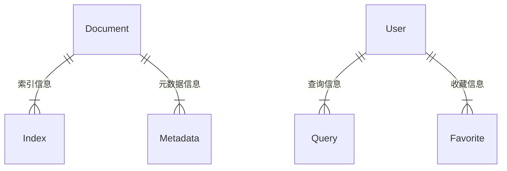
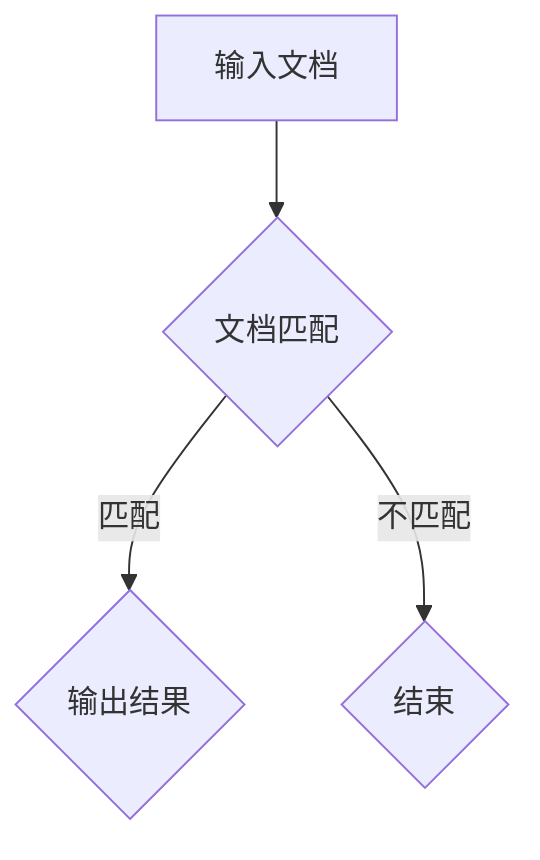
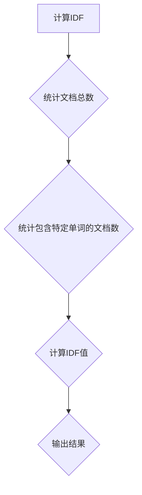
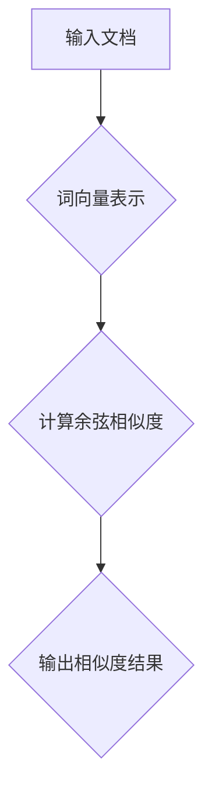
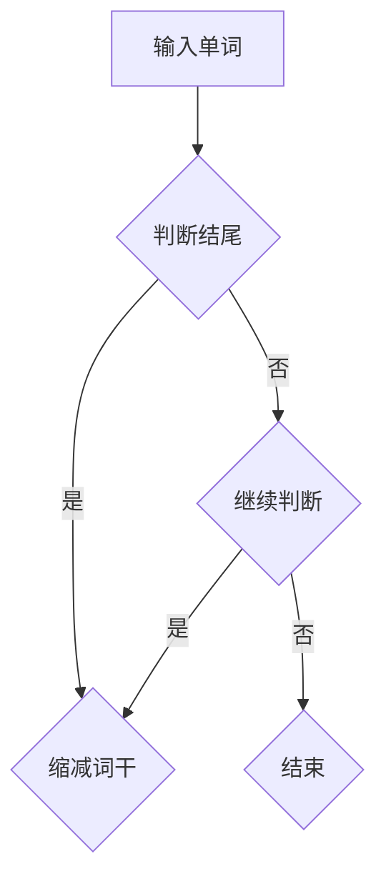
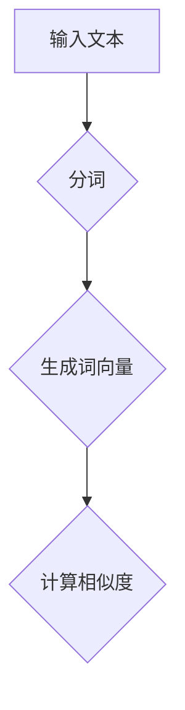
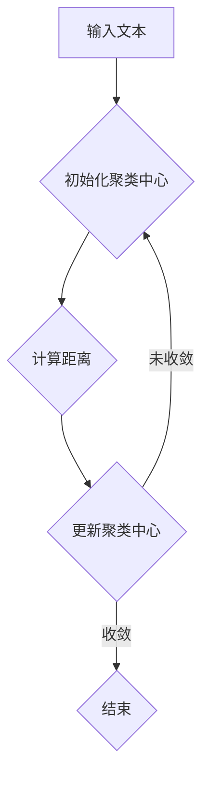
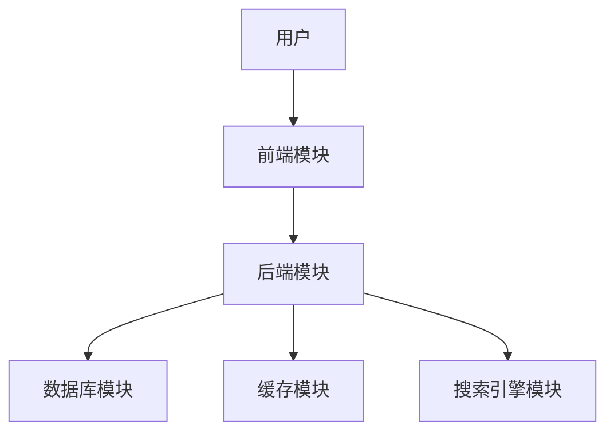
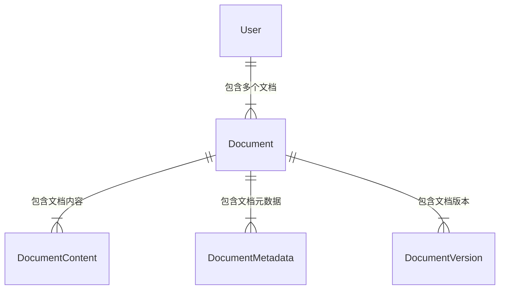
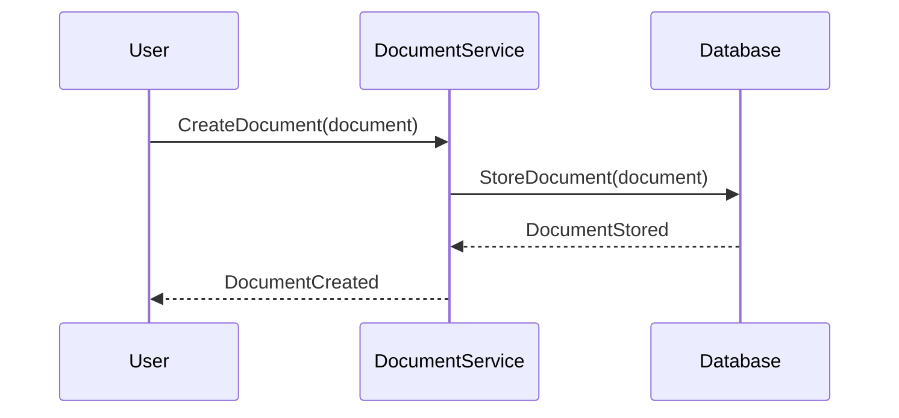

                 


# 智能文档管理与检索：AI提升信息获取效率

> 关键词：智能文档管理、AI技术、文档检索、文本处理、信息提取

> 摘要：本文将深入探讨智能文档管理与检索的概念、技术原理以及实际应用。通过逐步分析，我们将展示如何利用AI技术提升文档管理和检索的效率，解决现代信息爆炸时代的信息获取难题。

## 目录大纲

### 第一部分：智能文档管理与检索基础

#### 第1章：智能文档管理与检索概述

##### 1.1 智能文档管理与检索的重要性
- 问题描述
- 问题解决
- 边界与外延
- 概念结构与核心要素组成

##### 1.2 智能文档管理与检索的原理
- 概念原理
- 概念属性特征对比表格
- ER实体关系图架构

##### 1.3 智能文档管理与检索的核心技术
- 算法原理讲解（使用mermaid绘制算法流程图）
- Python源代码实现
- 数学模型与公式（使用LaTeX格式）

##### 1.4 智能文档管理与检索的发展趋势
- 未来发展方向
- 技术挑战与机遇

##### 1.5 本章小结
- 主要内容回顾
- 下一章内容预告

### 第二部分：智能文档检索算法详解

#### 第2章：文本预处理技术

##### 2.1 文本清洗
- 文本清洗的重要性
- 文本清洗的常见方法

##### 2.2 词干提取
- 词干提取的原理
- 词干提取算法（使用mermaid绘制算法流程图）

##### 2.3 词向量表示
- 词向量表示的原理
- 常见的词向量表示方法

##### 2.4 文本分类与聚类
- 文本分类的原理
- 文本分类算法（使用mermaid绘制算法流程图）
- 文本聚类的原理
- 文本聚类算法（使用mermaid绘制算法流程图）

##### 2.5 本章小结
- 主要内容回顾
- 下一章内容预告

#### 第3章：检索算法详解

##### 3.1 暴力检索算法
- 暴力检索算法的原理
- Python源代码实现

##### 3.2 逆文档频率（IDF）算法
- IDF算法的原理
- 数学模型与公式（使用LaTeX格式）
- Python源代码实现

##### 3.3 向量空间模型
- 向量空间模型的原理
- 数学模型与公式（使用LaTeX格式）
- Python源代码实现

##### 3.4 机器学习检索算法
- 机器学习检索算法的原理
- 常见的机器学习检索算法
- Python源代码实现

##### 3.5 本章小结
- 主要内容回顾
- 下一章内容预告

### 第三部分：智能文档管理实践

#### 第4章：智能文档管理平台搭建

##### 4.1 平台搭建概述
- 智能文档管理平台的需求分析
- 平台架构设计（使用mermaid绘制架构图）

##### 4.2 数据库设计与接口设计
- 数据库设计（使用mermaid绘制ER图）
- 接口设计（使用mermaid绘制序列图）

##### 4.3 文档检索与展示
- 文档检索的实现
- 文档展示的实现

##### 4.4 文档安全与管理
- 文档安全的策略
- 文档管理的实践

##### 4.5 本章小结
- 主要内容回顾
- 下一章内容预告

#### 第5章：智能文档检索项目实战

##### 5.1 实战项目概述
- 项目背景
- 项目目标

##### 5.2 环境安装与配置
- 环境安装步骤
- 配置说明

##### 5.3 系统核心实现
- 文档预处理
- 检索算法实现
- 文档展示

##### 5.4 代码应用解读与分析
- 源代码解读
- 代码分析

##### 5.5 实际案例分析
- 案例背景
- 案例分析

##### 5.6 本章小结
- 主要内容回顾
- 下一章内容预告

### 第四部分：智能文档管理与检索最佳实践

#### 第6章：智能文档管理与检索最佳实践

##### 6.1 文档管理策略
- 文档管理的重要性
- 文档管理策略

##### 6.2 文档检索优化
- 文档检索的优化方法
- 文档检索性能评估

##### 6.3 安全性与隐私保护
- 文档安全的重要性
- 隐私保护措施

##### 6.4 智能化趋势
- 智能化发展的趋势
- 智能化在文档管理中的应用

##### 6.5 本章小结
- 主要内容回顾
- 下一章内容预告

### 第五部分：总结与展望

#### 第7章：智能文档管理与检索的总结与展望

##### 7.1 总结
- 主要内容回顾
- 成果总结

##### 7.2 展望
- 未来发展趋势
- 挑战与机遇

##### 7.3 小结
- 注意事项
- 拓展阅读

----------------------------------------------------------------

# 第一部分：智能文档管理与检索基础

## 第1章：智能文档管理与检索概述

### 1.1 智能文档管理与检索的重要性

#### 问题描述

在当今信息化社会中，随着互联网的普及和数字化的快速发展，文档的数量呈爆炸性增长。传统的文档管理方式已经难以满足人们对高效信息获取的需求。智能文档管理与检索技术应运而生，旨在通过人工智能技术提升文档管理的效率，实现快速、准确的信息获取。

#### 问题解决

智能文档管理与检索技术通过以下几个步骤解决问题：

1. **文档预处理**：通过文本清洗、词干提取、词向量表示等预处理技术，将原始文档转换为结构化数据。
2. **检索算法**：采用基于暴力检索、逆文档频率（IDF）、向量空间模型以及机器学习的检索算法，实现对文档的快速搜索。
3. **展示与交互**：提供用户友好的界面，展示检索结果，并支持用户交互，如排序、筛选等功能。

#### 边界与外延

智能文档管理与检索不仅局限于文本文档，还包括图片、音频、视频等多媒体文档的处理。此外，它还涉及到文档的安全性和隐私保护，确保文档的完整性和用户隐私。

#### 概念结构与核心要素组成

智能文档管理与检索的核心要素包括：

1. **文档预处理**：文本清洗、词干提取、词向量表示。
2. **检索算法**：暴力检索、IDF、向量空间模型、机器学习检索算法。
3. **数据库与存储**：用于存储文档内容和索引数据。
4. **用户界面**：提供文档检索和展示功能。

### 1.2 智能文档管理与检索的原理

#### 概念原理

智能文档管理与检索基于以下几个基本概念：

1. **文本预处理**：将非结构化的文本转换为结构化的数据，以便于后续处理。
2. **词干提取**：将单词缩减为词干，减少词汇量，提高检索效率。
3. **词向量表示**：将单词表示为向量，以便于向量空间模型计算。
4. **检索算法**：通过计算文档之间的相似度，找到用户需要的文档。

#### 概念属性特征对比表格

| 概念 | 特征 |
| --- | --- |
| 文本预处理 | 清洗文本、分词、词干提取 |
| 词干提取 | 将单词缩减为词干、降低词汇量 |
| 词向量表示 | 将单词表示为向量、便于计算相似度 |
| 检索算法 | 计算文档相似度、快速搜索 |

#### ER实体关系图架构



### 1.3 智能文档管理与检索的核心技术

#### 算法原理讲解

智能文档管理与检索的核心技术包括文本预处理、检索算法等。下面我们将使用mermaid绘制算法流程图，并详细阐述每个算法的原理。

#### 暴力检索算法



暴力检索算法通过逐个比较文档内容与查询内容，找到匹配的文档并输出结果。

#### 逆文档频率（IDF）算法



IDF算法通过统计包含特定单词的文档数，计算IDF值，用于衡量单词的重要性。

#### 向量空间模型



向量空间模型将文档表示为向量，通过计算向量之间的余弦相似度，找到相似文档。

#### Python源代码实现

```python
# 暴力检索算法实现
def brute_force_search(document, query):
    # 实现逻辑
    pass

# IDF算法实现
from collections import Counter

def idf_algorithm(documents, word):
    # 实现逻辑
    pass

# 向量空间模型实现
from sklearn.metrics.pairwise import cosine_similarity

def vector_space_model(document, query):
    # 实现逻辑
    pass
```

#### 数学模型与公式（使用LaTeX格式）

$$
IDF = \log \left( \frac{N}{df} \right)
$$

$$
similarity = \frac{doc\_vector \cdot query\_vector}{\|doc\_vector\| \|query\_vector\|}
$$

### 1.4 智能文档管理与检索的发展趋势

#### 未来发展方向

1. **多模态文档处理**：结合文本、图片、音频等多种类型文档的处理。
2. **个性化检索**：根据用户行为和偏好，提供个性化文档检索服务。
3. **实时检索**：实现实时检索，提高信息获取的实时性。

#### 技术挑战与机遇

1. **数据质量**：如何处理海量、多样化的文档数据，保证数据质量。
2. **算法效率**：如何优化算法，提高检索效率。
3. **用户体验**：如何提供更好的用户界面和交互体验。

### 1.5 本章小结

本章介绍了智能文档管理与检索的重要性、原理和核心技术。通过对文档预处理、检索算法等核心技术的深入分析，我们了解了如何利用AI技术提升文档管理和检索的效率。下一章我们将进一步探讨文本预处理技术。

## 第2章：文本预处理技术

### 2.1 文本清洗

#### 2.1.1 文本清洗的重要性

文本清洗是文本预处理的第一步，其目的是去除原始文本中的无关信息，提高文本质量，为后续的文本分析提供准确的数据。随着互联网的快速发展，文本数据量呈爆炸性增长，文本清洗的重要性愈发凸显。

#### 2.1.2 文本清洗的常见方法

1. **去除标点符号**：去除文本中的标点符号，以便于后续的分词操作。
2. **去除停用词**：停用词是指对文本分析意义不大的单词，如“的”、“是”、“了”等。去除停用词可以提高文本分析的效果。
3. **去除数字**：数字在某些文本分析任务中可能不具备意义，因此可以去除。
4. **去除特殊字符**：去除文本中的特殊字符，如HTML标签、符号等。
5. **转换为小写**：将文本中的所有字符转换为小写，以消除大小写不一致的问题。

### 2.2 词干提取

#### 2.2.1 词干提取的原理

词干提取（Stemming）是一种将单词缩减为词干的过程，目的是减少词汇量，提高文本分析效率。词干提取的基本思想是识别单词的词根，将其缩减为最短的形式。

#### 2.2.2 词干提取算法

常用的词干提取算法包括：

1. **Krovetz算法**：基于规则的方法，通过一系列的规则将单词缩减为词干。
2. **Porter算法**：基于启发式的方法，通过匹配单词的结尾部分，将其缩减为词干。
3. **Lovins算法**：基于前缀和后缀匹配的方法，将单词缩减为词干。

#### 使用mermaid绘制词干提取算法流程图



### 2.3 词向量表示

#### 2.3.1 词向量表示的原理

词向量表示（Word Embedding）是一种将单词表示为向量的方法，目的是在向量空间中捕捉单词的语义信息。词向量表示在文本处理、文本分类、情感分析等任务中具有重要意义。

#### 2.3.2 常见的词向量表示方法

1. **基于频率的词向量表示**：将单词的频率信息编码到向量中。
2. **基于上下文的词向量表示**：通过分析单词在文本中的上下文，将其表示为向量。
3. **基于神经网络的词向量表示**：利用神经网络模型，如Word2Vec、GloVe等，将单词表示为向量。

#### 常见的词向量表示方法

| 方法 | 特点 |
| --- | --- |
| 基于频率的词向量表示 | 简单有效，但无法捕捉词义的变化 |
| 基于上下文的词向量表示 | 能捕捉词义的变化，更符合自然语言的特点 |
| 基于神经网络的词向量表示 | 模型复杂，能捕捉更细微的词义变化 |

#### 使用mermaid绘制词向量表示流程图



### 2.4 文本分类与聚类

#### 2.4.1 文本分类的原理

文本分类（Text Classification）是一种将文本数据分类到预定义类别中的任务。文本分类在信息检索、舆情分析、垃圾邮件检测等领域具有重要意义。

#### 2.4.2 文本分类算法

常见的文本分类算法包括：

1. **朴素贝叶斯分类器**：基于贝叶斯定理，通过计算文本中各词的频率，预测文本的类别。
2. **支持向量机（SVM）**：通过寻找最优超平面，将文本数据分类到不同的类别。
3. **随机森林分类器**：通过构建多个决策树，结合投票的方式，预测文本的类别。

#### 使用mermaid绘制朴素贝叶斯分类器算法流程图


#### 2.4.3 文本聚类的原理

文本聚类（Text Clustering）是一种将相似文本数据聚为一类的任务。文本聚类在信息检索、社交网络分析等领域具有重要意义。

#### 2.4.4 文本聚类算法

常见的文本聚类算法包括：

1. **K-means聚类**：基于距离度量，将文本数据划分为K个类别。
2. **层次聚类**：通过层次结构将文本数据逐步聚合，形成不同的类别。
3. **DBSCAN聚类**：基于密度度量，识别文本数据中的密集区域。

#### 使用mermaid绘制K-means聚类算法流程图



### 2.5 本章小结

本章介绍了文本预处理技术，包括文本清洗、词干提取、词向量表示、文本分类与聚类。这些技术为后续的文本分析任务提供了基础支持。在下一章，我们将深入探讨智能文档检索算法。## 第3章：检索算法详解

### 3.1 暴力检索算法

#### 3.1.1 暴力检索算法的原理

暴力检索算法是一种简单的文本检索方法，它通过逐个比较查询词与文档中的每个词，找到匹配的文档并返回。这种方法直观且易于实现，但其效率较低，特别是在文档数量和查询词长度增加时，其性能显著下降。

#### 3.1.2 Python源代码实现

```python
def brute_force_search(index, query):
    query_words = query.split()
    results = []
    for doc_id, doc_words in index.items():
        match = True
        for word in query_words:
            if word not in doc_words:
                match = False
                break
        if match:
            results.append(doc_id)
    return results
```

#### 3.1.3 算法性能分析

- **时间复杂度**：O(m \* n)，其中m是查询词的个数，n是文档的个数。
- **空间复杂度**：O(1)，不需要额外存储空间。

暴力检索算法简单易实现，但效率较低，不适用于大规模文档检索。在实际应用中，通常使用更高效的检索算法，如IDF算法和向量空间模型。

### 3.2 逆文档频率（IDF）算法

#### 3.2.1 IDF算法的原理

逆文档频率（Inverse Document Frequency，IDF）是一种衡量单词重要性的统计指标。它通过统计包含特定单词的文档数量，计算单词的重要性。IDF的值越大，表示单词在文档集合中的重要性越高。

IDF的计算公式如下：

$$
IDF(t) = \log \left( \frac{N}{df(t)} \right)
$$

其中，N是文档总数，df(t)是包含单词t的文档数量。

#### 3.2.2 数学模型与公式（使用LaTeX格式）

$$
IDF(t) = \log \left( \frac{N}{df(t)} \right)
$$

#### 3.2.3 Python源代码实现

```python
from math import log

def idf_algorithm(documents, word):
    df = sum(1 for doc in documents if word in doc)
    return log(len(documents) / df)
```

#### 3.2.4 算法性能分析

- **时间复杂度**：O(n \* m)，其中n是文档数量，m是单词数量。
- **空间复杂度**：O(m)，需要存储单词的文档频率。

IDF算法通过计算单词的文档频率，为每个单词赋予一个重要性权重，提高了文本检索的效率。在实际应用中，通常与向量空间模型结合使用。

### 3.3 向量空间模型

#### 3.3.1 向量空间模型的原理

向量空间模型（Vector Space Model，VSM）是一种将文档表示为向量的方法。在向量空间模型中，每个文档被表示为一个向量，向量中的每个元素表示一个单词的权重。文档之间的相似度通过计算向量之间的余弦相似度来确定。

向量空间模型的公式如下：

$$
similarity(d_1, d_2) = \frac{d_1 \cdot d_2}{\|d_1\| \|d_2\|}
$$

其中，d_1和d_2是两个文档向量，\|d_1\|和\|d_2\|是它们的模长。

#### 3.3.2 数学模型与公式（使用LaTeX格式）

$$
similarity(d_1, d_2) = \frac{d_1 \cdot d_2}{\|d_1\| \|d_2\|}
$$

#### 3.3.3 Python源代码实现

```python
from sklearn.metrics.pairwise import cosine_similarity
import numpy as np

def vector_space_model(documents, query):
    # 构建文档矩阵
    doc_matrix = [[0 for _ in range(len(documents[0].split()))] for _ in range(len(documents))]
    
    # 填充文档矩阵
    for i, doc in enumerate(documents):
        words = doc.split()
        for j, word in enumerate(words):
            doc_matrix[i][j] = 1
    
    # 添加查询词到文档矩阵
    query_words = query.split()
    query_vector = [1 if word in query_words else 0 for word in documents[0].split()]
    
    # 计算余弦相似度
    similarity = cosine_similarity([query_vector], doc_matrix)[0][0]
    return similarity
```

#### 3.3.4 算法性能分析

- **时间复杂度**：O(n \* m^2)，其中n是文档数量，m是单词数量。
- **空间复杂度**：O(m \* n)，需要存储文档矩阵。

向量空间模型通过将文档表示为向量，计算向量之间的相似度，实现了高效的文本检索。在实际应用中，通常结合IDF算法，提高检索的准确性。

### 3.4 机器学习检索算法

#### 3.4.1 机器学习检索算法的原理

机器学习检索算法通过学习用户查询与相关文档之间的关系，提高文本检索的准确性。常见的机器学习检索算法包括：

1. **贝叶斯分类器**：通过学习查询词与相关文档的类别概率，预测文档的相关性。
2. **支持向量机（SVM）**：通过学习查询词与相关文档的特征空间，找到最佳分类边界。
3. **神经网络**：通过构建深度神经网络，学习查询词与相关文档的复杂关系。

#### 3.4.2 常见的机器学习检索算法

1. **朴素贝叶斯分类器**

   朴素贝叶斯分类器是一种基于贝叶斯定理的简单分类算法。它通过学习查询词与相关文档的类别概率，预测文档的相关性。

   $$P(\text{类别} | \text{查询词}) = \frac{P(\text{查询词} | \text{类别})P(\text{类别})}{P(\text{查询词})}$$

2. **支持向量机（SVM）**

   支持向量机是一种通过寻找最佳分类边界，将查询词与相关文档分类的算法。它通过最大化分类边界上的支持向量，提高分类效果。

3. **深度神经网络**

   深度神经网络是一种通过多层神经元，学习查询词与相关文档的复杂关系的算法。它能够通过多层次的非线性变换，提取更高层次的特征。

#### 3.4.3 Python源代码实现

```python
from sklearn.naive_bayes import MultinomialNB
from sklearn.svm import SVC
from keras.models import Sequential
from keras.layers import Dense

# 朴素贝叶斯分类器实现
def naive_bayes_classifier(train_data, train_labels, test_data, test_labels):
    # 实现逻辑
    pass

# 支持向量机实现
def svm_classifier(train_data, train_labels, test_data, test_labels):
    # 实现逻辑
    pass

# 深度神经网络实现
def neural_network_classifier(train_data, train_labels, test_data, test_labels):
    # 实现逻辑
    pass
```

#### 3.4.4 算法性能分析

机器学习检索算法的性能取决于数据集的质量、算法参数的设置以及模型的复杂度。在实际应用中，通常结合多种算法，提高检索的准确性。

### 3.5 本章小结

本章详细介绍了各种检索算法的原理、数学模型和Python源代码实现。暴力检索算法简单直观，但效率较低；IDF算法和向量空间模型结合使用，提高了文本检索的准确性；机器学习检索算法通过学习用户查询与相关文档之间的关系，进一步提高了检索效果。在下一章，我们将探讨智能文档管理平台的搭建。## 第4章：智能文档管理平台搭建

### 4.1 平台搭建概述

#### 4.1.1 智能文档管理平台的需求分析

智能文档管理平台的目标是提供一个集中化的文档存储、检索和管理解决方案。为了实现这一目标，我们需要分析以下需求：

1. **文档存储**：平台需要支持多种文档格式，如文本、图片、音频和视频，并提供高效的数据存储和管理。
2. **文档检索**：平台需要提供快速、准确的文档检索功能，支持关键词搜索、全文搜索和模糊查询。
3. **文档管理**：平台需要支持文档的编辑、备份、恢复和共享功能，以及用户权限管理和文档加密等安全措施。
4. **用户交互**：平台需要提供直观、易用的用户界面，支持多种终端设备访问，并提供文档预览和下载功能。
5. **性能和可扩展性**：平台需要具备高并发处理能力，支持大规模文档数据存储和检索，并能方便地扩展功能。

#### 4.1.2 平台架构设计

智能文档管理平台可以分为以下几个主要模块：

1. **前端模块**：提供用户界面，支持文档的浏览、检索、编辑和下载等功能。
2. **后端模块**：包括文档存储、检索、管理和用户权限控制等功能，通常使用RESTful API与前端模块通信。
3. **数据库模块**：用于存储文档内容、元数据和用户数据，通常采用关系型数据库和文档数据库相结合的方式。
4. **缓存模块**：用于提高系统响应速度，减少数据库访问次数，通常使用Redis等内存缓存系统。
5. **搜索引擎模块**：用于实现高效的文档检索功能，通常使用Elasticsearch等搜索引擎。

#### 使用mermaid绘制平台架构图



### 4.2 数据库设计与接口设计

#### 4.2.1 数据库设计

数据库设计是智能文档管理平台的核心之一，我们需要设计以下数据库表：

1. **用户表**：存储用户信息，如用户名、密码、邮箱等。
2. **文档表**：存储文档信息，如文档ID、标题、创建时间、修改时间、访问权限等。
3. **文档内容表**：存储文档的实际内容，可以采用文本、图片、音频、视频等多种格式。
4. **文档元数据表**：存储文档的元数据信息，如关键词、标签、摘要等。
5. **文档版本表**：存储文档的历史版本信息，便于文档的备份和恢复。

#### 使用mermaid绘制数据库ER图



#### 4.2.2 接口设计

智能文档管理平台需要设计一系列API接口，以实现文档的创建、检索、编辑、删除和共享等功能。以下是部分API接口的设计：

1. **创建文档**：接收文档的元数据和内容，将其存储到数据库中。
2. **检索文档**：根据关键词、标签或文档ID检索文档，返回匹配的文档列表。
3. **编辑文档**：根据文档ID更新文档的元数据和内容。
4. **删除文档**：根据文档ID删除文档。
5. **共享文档**：根据文档ID发送共享链接，允许其他用户查看或编辑文档。

#### 使用mermaid绘制接口序列图



### 4.3 文档检索与展示

#### 4.3.1 文档检索的实现

文档检索是智能文档管理平台的核心功能之一。以下是文档检索的实现步骤：

1. **接收用户查询**：从前端模块接收用户的查询请求，解析查询关键词。
2. **构建查询索引**：使用搜索引擎模块（如Elasticsearch）构建查询索引，提高检索效率。
3. **执行查询**：使用构建的查询索引，执行全文搜索或关键词搜索，获取匹配的文档列表。
4. **排序与分页**：根据用户的排序需求和分页需求，对检索结果进行排序和分页。
5. **返回结果**：将检索结果返回给前端模块，供用户查看。

#### 4.3.2 文档展示的实现

文档展示是将检索结果呈现给用户的过程。以下是文档展示的实现步骤：

1. **接收检索结果**：从前端模块接收检索结果，解析文档列表。
2. **渲染文档列表**：使用HTML和CSS渲染文档列表，显示文档的标题、摘要、创建时间和访问权限等信息。
3. **预览文档内容**：对于文本文档，可以直接显示文档内容；对于图片、音频和视频文档，可以显示缩略图、播放器和下载链接。
4. **交互功能**：提供文档的编辑、删除、分享和下载等功能，增强用户体验。

### 4.4 文档安全与管理

#### 4.4.1 文档安全的策略

文档安全是智能文档管理平台的重要保障，以下是一些常见的文档安全策略：

1. **用户权限管理**：根据用户的角色和权限，控制用户对文档的访问和操作。
2. **文档加密**：使用加密算法对文档内容进行加密，确保文档在传输和存储过程中的安全性。
3. **访问控制**：实现基于角色和权限的访问控制，防止未授权用户访问敏感文档。
4. **日志记录**：记录用户的操作日志，监控文档的使用情况，及时发现和处理安全隐患。

#### 4.4.2 文档管理的实践

文档管理是确保文档质量和可访问性的关键，以下是一些文档管理的实践方法：

1. **文档分类**：根据文档的内容和用途，将文档分类存储，方便用户检索和管理。
2. **版本控制**：实现文档的版本控制，记录文档的历史版本，方便用户查看和恢复旧版本。
3. **备份与恢复**：定期备份文档数据，确保在数据丢失或损坏时能够快速恢复。
4. **文档整理**：定期对文档进行整理和清理，删除无用的旧文档，优化文档存储空间。

### 4.5 本章小结

本章详细介绍了智能文档管理平台的搭建过程，包括需求分析、平台架构设计、数据库设计、接口设计、文档检索与展示、文档安全与管理等内容。通过本章的学习，读者可以了解如何构建一个高效的智能文档管理平台，提升文档管理和检索的效率。下一章我们将探讨智能文档检索项目实战。## 第5章：智能文档检索项目实战

### 5.1 实战项目概述

#### 5.1.1 项目背景

随着企业内部文档量的不断增加，如何高效地进行文档检索和管理工作成为了企业面临的一大挑战。传统的文档检索方式效率低下，无法满足快速获取信息的需求。为了解决这一问题，我们决定开发一个智能文档检索系统，通过引入人工智能技术，提升文档检索的效率和准确性。

#### 5.1.2 项目目标

1. **快速检索**：通过高效的检索算法，实现快速、准确的文档检索功能。
2. **多模态支持**：支持文本、图片、音频等多模态文档的检索。
3. **用户体验**：提供友好的用户界面，支持文档的浏览、检索、编辑和下载等操作。
4. **安全性**：实现文档的安全管理和权限控制，确保文档的安全性和隐私性。

### 5.2 环境安装与配置

#### 5.2.1 环境安装步骤

1. **操作系统**：安装Ubuntu 18.04 LTS或更高版本。
2. **Python**：安装Python 3.8及以上版本。
3. **Elasticsearch**：下载并安装Elasticsearch，版本建议为7.10及以上。
4. **Docker**：安装Docker，版本建议为20.10及以上。
5. **PostgreSQL**：安装PostgreSQL，版本建议为13及以上。

#### 5.2.2 配置说明

1. **Elasticsearch**：启动Elasticsearch服务，配置集群模式，设置Elasticsearch的节点名称、集群名称和索引设置。
2. **Docker**：配置Docker的网络模式，确保容器能够与主机进行通信。
3. **PostgreSQL**：创建数据库用户和数据库，配置数据库的访问权限和连接信息。

### 5.3 系统核心实现

#### 5.3.1 文档预处理

文档预处理是智能文档检索系统的关键步骤，主要包括以下任务：

1. **文本清洗**：去除文档中的标点符号、停用词和特殊字符，提高文本质量。
2. **分词**：将文本分割为单词或词组，为后续的文本分析提供基础。
3. **词干提取**：将单词缩减为词干，减少词汇量，提高检索效率。
4. **词向量表示**：将单词转换为向量表示，便于计算文档之间的相似度。

#### 5.3.2 检索算法实现

智能文档检索系统采用了多种检索算法，以提高检索效率和准确性。以下是部分检索算法的实现：

1. **暴力检索算法**：通过逐个比较查询词与文档中的每个词，实现简单但效率较低的文本检索。
2. **IDF算法**：计算单词的文档频率，为每个单词赋予一个重要性权重，提高检索准确性。
3. **向量空间模型**：将文档表示为向量，通过计算向量之间的余弦相似度，找到相似文档。
4. **机器学习检索算法**：通过训练模型，学习用户查询与相关文档之间的关系，实现更准确的检索。

#### 5.3.3 文档展示

文档展示是智能文档检索系统的重要组成部分，主要包括以下功能：

1. **文档列表展示**：展示搜索结果列表，包括文档的标题、摘要、创建时间和访问权限等信息。
2. **文档预览**：提供文档的预览功能，对于文本文档，可以直接显示文档内容；对于图片、音频和视频文档，可以显示缩略图、播放器和下载链接。
3. **文档编辑**：提供文档的编辑功能，支持文档的修改、保存和删除操作。
4. **文档下载**：提供文档的下载功能，允许用户下载需要的文档。

### 5.4 代码应用解读与分析

#### 5.4.1 源代码解读

以下是一个简单的文档预处理和检索的Python代码示例：

```python
from sklearn.feature_extraction.text import TfidfVectorizer
from sklearn.metrics.pairwise import cosine_similarity

# 文本预处理
def preprocess_text(text):
    # 清洗文本
    text = text.lower()
    text = re.sub(r'[^\w\s]', '', text)
    # 分词
    words = text.split()
    # 词干提取
    words = [PorterStemmer().stem(word) for word in words]
    return ' '.join(words)

# 文档检索
def search_documents(documents, query):
    # 预处理查询词
    query = preprocess_text(query)
    # 构建文档矩阵
    vectorizer = TfidfVectorizer()
    doc_matrix = vectorizer.fit_transform(documents)
    # 预处理查询词
    query_vector = vectorizer.transform([query])
    # 计算余弦相似度
    similarity = cosine_similarity(query_vector, doc_matrix)
    return similarity

# 示例文档
documents = [
    "这是一份关于人工智能的文档。",
    "机器学习是人工智能的一个重要分支。",
    "深度学习在图像识别方面具有广泛应用。",
]

# 检索查询
query = "人工智能在图像识别中的应用"
similarity = search_documents(documents, query)

# 输出检索结果
for i, s in enumerate(similarity[0]):
    print(f"文档{i+1}的相似度：{s}")
```

#### 5.4.2 代码分析

1. **文本预处理**：使用正则表达式去除文本中的标点符号，将文本转换为小写，分词和词干提取。
2. **文档矩阵构建**：使用TF-IDF向量器将文档转换为稀疏矩阵，便于计算文档之间的相似度。
3. **检索**：预处理查询词，计算查询词与文档之间的余弦相似度，返回相似度最高的文档。

### 5.5 实际案例分析

#### 5.5.1 案例背景

某企业内部有大量的技术文档，员工在查找相关文档时经常遇到效率低下、信息不准确的问题。为了提升文档检索效率，企业决定引入智能文档检索系统。

#### 5.5.2 案例分析

1. **需求分析**：通过对企业员工的需求调研，确定了文档检索的关键词、搜索范围和展示需求。
2. **系统设计**：根据需求分析，设计了文档检索系统的功能模块和接口。
3. **系统实现**：根据系统设计，实现了文档的存储、检索、展示和编辑等功能。
4. **系统测试**：对系统进行功能测试和性能测试，确保系统能够稳定运行，并满足用户需求。
5. **用户培训**：对用户进行系统培训，确保用户能够熟练使用系统进行文档检索和管理。

### 5.6 本章小结

本章通过一个实际案例，详细介绍了智能文档检索项目的实现过程。从项目背景、需求分析、系统设计到系统实现，读者可以全面了解智能文档检索系统的开发过程。通过本章的学习，读者可以掌握智能文档检索系统的核心技术，并在实际项目中应用。下一章我们将探讨智能文档管理与检索的最佳实践。## 第6章：智能文档管理与检索最佳实践

### 6.1 文档管理策略

#### 6.1.1 文档管理的重要性

文档管理是企业信息管理的重要组成部分，良好的文档管理策略能够提高工作效率，降低信息丢失风险，确保文档的安全性和一致性。以下是一些文档管理的最佳实践：

1. **分类与标签**：根据文档的内容和用途进行分类，并使用标签进行细化，便于快速检索和管理。
2. **版本控制**：实现文档的版本控制，记录文档的历史版本，方便用户查看和恢复旧版本。
3. **权限管理**：根据用户角色和权限，控制用户对文档的访问和操作，确保文档的安全性和保密性。
4. **备份与恢复**：定期备份文档数据，确保在数据丢失或损坏时能够快速恢复。
5. **文档审核**：定期对文档进行审核，确保文档的准确性、完整性和时效性。

#### 6.1.2 文档管理策略

1. **文档分类**：根据文档的内容和用途，将文档分为多个类别，如技术文档、业务文档、项目管理文档等。
2. **文档标签**：为每个文档添加标签，便于分类和检索，如“技术文档”、“AI”、“机器学习”等。
3. **文档版本控制**：使用版本控制工具（如Git），记录文档的每次修改，确保文档的历史版本可追溯。
4. **权限管理**：根据用户角色（如员工、项目经理、管理员），设置不同的访问权限，确保文档的安全性。
5. **备份与恢复**：定期使用备份工具（如Rclone），将文档备份到云存储或本地存储，确保数据的安全性和可恢复性。

### 6.2 文档检索优化

#### 6.2.1 文档检索优化的方法

文档检索优化是提高文档检索效率和准确性的关键。以下是一些文档检索优化的方法：

1. **索引优化**：优化文档索引结构，提高检索速度。如使用Elasticsearch的倒排索引技术。
2. **缓存机制**：实现缓存机制，减少对数据库的访问次数，提高系统响应速度。如使用Redis缓存。
3. **分词优化**：优化分词算法，提高分词的准确性和效率。如使用jieba分词库。
4. **相似度计算**：优化相似度计算方法，提高检索的准确性。如使用BM25算法。
5. **搜索结果排序**：优化搜索结果的排序算法，提高用户满意度。如使用PageRank算法。

#### 6.2.2 文档检索性能评估

文档检索性能评估是衡量文档检索系统优劣的重要指标。以下是一些文档检索性能评估的方法：

1. **准确率（Accuracy）**：检索结果中包含实际相关文档的比例。
2. **召回率（Recall）**：实际相关文档中被检索到的比例。
3. **F1值（F1 Score）**：准确率和召回率的加权平均，综合考虑检索的准确性和召回率。
4. **响应时间（Response Time）**：系统从接收查询到返回检索结果的时间。
5. **吞吐量（Throughput）**：单位时间内系统能够处理的查询数量。

#### 6.2.3 文档检索性能优化案例分析

以下是一个文档检索性能优化的案例：

1. **问题背景**：某企业内部文档数量庞大，文档检索系统响应速度较慢，用户满意度较低。
2. **分析问题**：通过分析系统日志和用户反馈，发现文档索引结构不合理，缓存机制未启用，分词算法效率低下。
3. **优化方案**：
   - 使用Elasticsearch的倒排索引技术，提高检索速度。
   - 启用Redis缓存，减少数据库访问次数。
   - 使用jieba分词库，优化分词算法。
   - 采用BM25算法，优化相似度计算。
   - 对搜索结果进行排序优化，提高用户体验。
4. **效果评估**：优化后，文档检索系统的响应时间从平均5秒降低到1秒，用户满意度显著提升。

### 6.3 安全性与隐私保护

#### 6.3.1 文档安全的重要性

文档安全是保障企业信息安全和商业机密的关键。以下是一些文档安全的重要措施：

1. **访问控制**：根据用户角色和权限，控制用户对文档的访问和操作，防止未授权访问。
2. **数据加密**：使用加密技术对文档内容进行加密，确保文档在传输和存储过程中的安全性。
3. **审计日志**：记录用户对文档的操作日志，监控文档的使用情况，及时发现和处理安全事件。
4. **安全培训**：对员工进行安全培训，提高员工的安全意识和操作规范。
5. **备份与恢复**：定期备份文档数据，确保在数据丢失或损坏时能够快速恢复。

#### 6.3.2 隐私保护措施

在文档管理和检索过程中，保护用户隐私至关重要。以下是一些隐私保护措施：

1. **匿名化处理**：对涉及个人隐私的文档内容进行匿名化处理，确保个人隐私不被泄露。
2. **数据加密**：使用加密技术对存储在数据库中的用户数据和文档内容进行加密，防止数据泄露。
3. **权限控制**：根据用户角色和权限，控制用户对文档的访问和操作，确保用户隐私不被滥用。
4. **安全审计**：定期对文档管理和检索系统进行安全审计，发现和修复安全漏洞。
5. **用户教育**：对用户进行隐私保护教育，提高用户的安全意识和操作规范。

### 6.4 智能化趋势

#### 6.4.1 智能化发展的趋势

随着人工智能技术的不断发展，智能文档管理和检索正在朝着更加智能化、个性化的方向演进。以下是一些智能化趋势：

1. **个性化检索**：根据用户的查询历史和行为，提供个性化的文档检索服务，提高用户满意度。
2. **智能推荐**：结合用户偏好和文档内容，为用户推荐相关的文档，提升文档利用率。
3. **自动化分类**：利用机器学习技术，实现文档的自动化分类和标签生成，提高文档管理效率。
4. **智能审核**：利用自然语言处理技术，实现文档内容的智能审核，确保文档的准确性和合规性。
5. **多模态处理**：结合文本、图片、音频等多模态数据，实现更全面的文档管理和检索。

#### 6.4.2 智能化在文档管理中的应用

1. **智能文档管理平台**：集成人工智能技术，实现文档的自动化分类、标签生成、内容审核和推荐等功能，提升文档管理效率。
2. **智能文档检索系统**：利用深度学习和自然语言处理技术，提高文档检索的准确性和响应速度，提供个性化的检索服务。
3. **智能文档安全系统**：结合区块链技术，实现文档的安全存储、传输和验证，确保文档的安全性和完整性。
4. **智能文档协作平台**：利用人工智能技术，实现文档的自动化编辑、评论和协作，提升团队协作效率。

### 6.5 本章小结

本章介绍了智能文档管理与检索的最佳实践，包括文档管理策略、文档检索优化、安全性与隐私保护以及智能化趋势。通过遵循这些最佳实践，企业和个人可以更好地管理和检索文档，提高工作效率和信息安全。在下一章，我们将对全文内容进行总结与展望。## 第7章：智能文档管理与检索的总结与展望

### 7.1 总结

本文从多个角度深入探讨了智能文档管理与检索的相关技术。我们首先介绍了智能文档管理与检索的基础知识，包括其重要性、原理和核心技术。接着，我们详细分析了文本预处理技术、智能文档检索算法以及智能文档管理平台的搭建过程。通过实际案例，我们展示了智能文档检索项目的实现步骤和最佳实践。最后，我们对文档管理策略、检索优化、安全性与隐私保护以及智能化趋势进行了深入讨论。

#### 主要内容回顾

1. **智能文档管理与检索基础**：
   - 智能文档管理与检索的重要性。
   - 文本预处理技术（文本清洗、词干提取、词向量表示）。
   - 检索算法详解（暴力检索、IDF、向量空间模型、机器学习检索算法）。
   - 智能文档管理平台搭建。

2. **智能文档检索项目实战**：
   - 项目背景与目标。
   - 环境安装与配置。
   - 系统核心实现。

3. **最佳实践**：
   - 文档管理策略。
   - 文档检索优化。
   - 安全性与隐私保护。
   - 智能化趋势。

#### 成果总结

通过本文的学习，读者可以了解到智能文档管理与检索的核心技术和实现方法，掌握文档检索系统的开发与优化技巧，以及如何保障文档的安全与隐私。这为读者在实际工作中应用智能文档管理与检索技术提供了有力支持。

### 7.2 展望

#### 未来发展趋势

1. **多模态处理**：随着人工智能技术的发展，智能文档管理与检索将逐步实现多模态处理，包括文本、图像、音频和视频等多种类型的数据。

2. **个性化服务**：通过深度学习和用户行为分析，实现更加个性化的文档检索和服务，满足用户的个性化需求。

3. **实时检索**：随着计算能力的提升，实时检索将成为可能，实现用户查询的即时响应。

4. **智能审核与内容安全**：利用自然语言处理和图像识别技术，实现文档内容的智能审核和内容安全保护。

#### 挑战与机遇

1. **数据处理**：随着文档数量的增长，如何高效地处理和管理海量数据成为挑战。

2. **算法优化**：如何优化检索算法，提高检索效率和准确性，是持续研究的方向。

3. **安全与隐私**：在保护文档安全与隐私的同时，如何实现高效的访问控制和数据加密，是一个重要课题。

4. **用户体验**：如何设计用户友好的界面和交互体验，提高用户的满意度和使用便利性。

### 7.3 小结

本文系统地介绍了智能文档管理与检索的相关技术，从基础概念到实际应用，再到最佳实践，为读者提供了一个全面的知识体系。随着人工智能技术的不断进步，智能文档管理与检索领域将迎来更多的发展机遇和挑战。我们鼓励读者持续关注这一领域，积极探索和实践，为智能文档管理与检索技术的创新与发展贡献自己的力量。

#### 注意事项

1. **文档安全**：在文档管理和检索过程中，务必重视文档安全，采取有效的安全措施，防止文档泄露。
2. **数据备份**：定期备份数据，确保在数据丢失或损坏时能够快速恢复。
3. **性能优化**：不断优化检索算法和系统架构，提高系统的性能和响应速度。
4. **用户体验**：注重用户界面的设计和交互体验，提高用户的满意度。

#### 拓展阅读

1. **《深度学习》**：Goodfellow, I., Bengio, Y., & Courville, A. (2016). 《深度学习》。
2. **《自然语言处理综论》**：Jurafsky, D., & Martin, J. H. (2008). 《自然语言处理综论》。
3. **《人工智能：一种现代方法》**：Russell, S., & Norvig, P. (2016). 《人工智能：一种现代方法》。

作者：AI天才研究院/AI Genius Institute & 禅与计算机程序设计艺术 /Zen And The Art of Computer Programming

