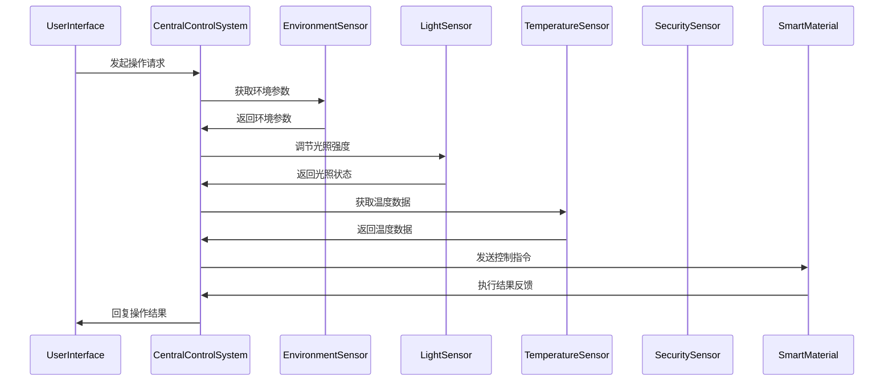

                 

### 摘要

本文将深入探讨智能材料在可持续建筑中的广泛应用，旨在展示如何利用这些先进材料提升建筑物的可持续性能。随着全球对环境问题的日益关注，智能材料因其独特的功能和特性，在建筑行业中展现出巨大的潜力。本文首先介绍了智能材料和可持续建筑的基本概念，随后分析了它们之间的联系及在建筑领域的应用前景。接下来，文章详细解析了智能材料的工作原理、分类和性能评估方法，并通过具体实例进行了说明。随后，文章分别从结构、节能和环境监测三个方面探讨了智能材料在建筑中的应用，最后通过一个实际项目案例展示了智能材料在建筑项目中的具体实现和效果。本文不仅提供了全面的理论基础，还结合实际案例，为行业从业者提供了实用的指导和建议。

### 文章关键词

- 智能材料
- 持续建筑
- 建筑结构
- 节能技术
- 环境监测
- 可持续发展

### 背景介绍

#### 智能材料的概念

智能材料，又称智能复合材料，是一种能够响应外部刺激（如温度、湿度、光、压力等）并相应地改变其物理或化学性质的材料。这些材料具有自我调节、自我修复和自适应等功能，能够根据环境变化动态调整其性能。智能材料的发展历史可以追溯到20世纪中期，当时科学家们开始研究能够响应热、电、光等外部刺激的聚合物。随着材料科学和技术的进步，智能材料得到了广泛应用，包括传感器、驱动器、生物医学器件等领域。

#### 持续建筑的概念

持续建筑，又称绿色建筑或可持续建筑，是指在建筑的设计、建造和使用过程中，最大限度地节约资源（如能源、水、材料）、保护环境和减少污染，同时为人们提供健康、适用和高效的使用空间。持续建筑的理念起源于20世纪70年代的能源危机，随着全球环保意识的增强，持续建筑逐渐成为建筑行业的重要趋势。持续建筑的目标是减少建筑对环境的负面影响，提高能源利用效率，实现资源的循环利用。

#### 智能材料在持续建筑中的应用前景

智能材料在持续建筑中的应用前景广阔。首先，智能材料可以提高建筑物的节能性能。例如，智能玻璃可以根据室内温度和阳光强度自动调节透明度，减少能源消耗。其次，智能材料可以增强建筑结构的抗震性能。智能材料能够实时监测建筑物的应力变化，并在必要时进行自适应调整，减少地震造成的损坏。此外，智能材料还可以用于环境监测和空气质量管理，帮助建筑实现更高效的环境控制。

#### 问题背景与问题描述

当前，全球建筑行业面临着严峻的挑战，包括能源消耗、环境污染和资源短缺等问题。传统建筑材料如混凝土、钢铁和玻璃等在生产和应用过程中消耗大量能源，产生大量温室气体。同时，建筑物的能源使用效率较低，导致大量的能源浪费。为了应对这些挑战，需要开发和应用新型材料，特别是具有智能特性的材料。

问题描述如下：

1. **能源消耗问题**：建筑物的能耗占全球总能耗的相当一部分，如何通过新材料和技术提高能源利用效率成为关键。
2. **环境问题**：建筑材料的生产和废弃物处理对环境造成严重影响，如何减少这些负面影响需要新的思路和方法。
3. **资源问题**：建筑材料的生产和消耗导致资源短缺，如何实现资源的可持续利用是亟待解决的问题。

#### 问题解决思路

为了解决上述问题，智能材料的引入和应用提供了一条可行的路径。智能材料通过其独特的功能特性，能够在建筑物的设计、建造和使用过程中发挥重要作用：

1. **节能**：智能材料可以通过自动调节温度、光线和通风等参数，减少建筑物的能耗。
2. **环保**：智能材料具有自我修复和再生能力，可以减少建筑材料的消耗和废弃物的产生。
3. **资源利用**：智能材料可以通过材料优化和功能集成，提高建筑材料的利用效率，减少资源浪费。

#### 边界与外延

在讨论智能材料在持续建筑中的应用时，需要明确一些边界和概念：

- **边界**：本文主要关注智能材料在建筑结构、节能和环境监测等方面的应用，不包括生物医学和电子器件等领域的应用。
- **外延**：智能材料的应用不仅限于建筑材料，还可以扩展到智能交通、智能家居等领域，为可持续发展提供更广泛的技术支持。

通过上述分析和讨论，我们可以看到，智能材料在持续建筑中具有广阔的应用前景和重要的现实意义。本文将进一步探讨智能材料的核心概念、工作原理、性能评估方法以及在建筑中的具体应用，为行业提供深入的技术指导和实践参考。

### 核心概念与联系

为了更好地理解智能材料在可持续建筑中的应用，我们需要深入探讨几个核心概念，并分析它们之间的联系。

#### 智能材料的核心概念

智能材料，顾名思义，是一种具备智能特性的材料，其核心在于其能够对外部刺激做出响应，并通过物理、化学或生物机制改变自身的性质。这种响应可以是形状、颜色、透明度、导电性等物理特性的变化，或者是能量吸收、释放等化学反应。智能材料的特性主要取决于其微观结构和组成材料，例如某些智能材料是基于聚合物、液晶或纳米材料。

##### 智能材料的工作原理

智能材料的工作原理基于其内部微观结构或化学组成的独特设计。例如，形状记忆合金在受到一定温度变化时能够恢复到预先设定的形状；液晶材料在电场或光照的作用下可以改变其光学性质。这些材料通常通过以下几种机制实现智能响应：

1. **温度响应**：材料在温度变化时发生相变或结构重组，从而改变其物理性质。
2. **光响应**：材料在光照条件下发生光致变色或光致变形。
3. **电响应**：材料在电场作用下改变其导电性或机械性质。
4. **磁响应**：材料在磁场中发生磁致伸缩或磁致各向异性变化。

##### 智能材料的分类

智能材料种类繁多，根据其响应刺激的类型和机制，可以分为以下几类：

1. **形状记忆合金**：这类材料能够在特定温度下恢复到预设的形状，广泛应用于航空航天、医疗器械和智能结构。
2. **液晶材料**：液晶在电场或光照下能改变其排列方式，因此广泛用于显示技术和光学调制。
3. **电致变色材料**：这类材料在电场作用下能够改变其颜色，用于智能玻璃和可调光应用。
4. **光致变色材料**：这类材料在光照条件下变色，用于艺术创作和安全标识。
5. **电活性聚合物**：这类聚合物在电场作用下可以发生形变或导电性变化，用于软性电子器件和传感器。

##### 智能材料的特性

智能材料的特性主要包括：

1. **响应性**：能够对外部刺激（如温度、光照、电场）快速响应。
2. **自我调节性**：能够根据环境变化自动调节其性能。
3. **自我修复性**：在受损后能够自行修复，延长使用寿命。
4. **多功能性**：可以在多种环境下发挥不同的功能。
5. **可调控性**：通过外部刺激可以调节其性质，便于设计和应用。

#### 持续建筑的核心概念

持续建筑，或称绿色建筑，是一种以环境友好、资源高效利用、健康舒适为目标的建筑设计和管理方法。持续建筑注重全生命周期的资源消耗和环境影响，从选址、设计、施工、运营到维护和拆除，都力求实现环境的可持续性和经济效益。

##### 持续建筑的核心概念

持续建筑的核心概念包括：

1. **环境友好**：减少对自然环境的破坏，采用环保材料和工艺。
2. **资源高效利用**：提高资源利用效率，减少浪费。
3. **健康舒适**：创造一个健康、舒适、高效的生活和工作环境。
4. **经济可行**：在满足环保和舒适性的同时，实现经济上的可持续性。

#### 智能材料与持续建筑的联系

智能材料与持续建筑之间存在紧密的联系，主要体现在以下几个方面：

1. **节能**：智能材料可以自动调节建筑物的能耗，如智能玻璃可根据外界光照调节透光率，减少空调和照明能耗。
2. **环境监控**：智能材料可以实时监控建筑内部的空气质量、温度等环境参数，实现智能环境控制。
3. **结构安全**：智能材料能够增强建筑结构的抗震能力和自我修复能力，提高建筑的安全性。
4. **材料再生**：智能材料具有自我修复和再生能力，有助于减少建筑废弃物的产生。
5. **资源循环利用**：智能材料可以通过材料优化和功能集成，提高资源利用效率，促进循环经济。

通过上述分析，我们可以看到，智能材料与持续建筑在理念、目标和实际应用方面具有高度的一致性。智能材料的应用为持续建筑提供了新的技术手段，有助于实现环境保护、资源高效利用和经济效益的多赢局面。

### 智能材料原理讲解

智能材料之所以在建筑领域中具有广泛应用，得益于其独特的原理和多样化的分类。本章节将详细探讨智能材料的工作原理、分类及其特性。

#### 智能材料的工作原理

智能材料的工作原理主要基于其微观结构和组成材料的独特设计，这些材料能够在受到外部刺激时发生显著的物理、化学或生物学变化。以下是几种常见智能材料的工作原理：

1. **形状记忆合金**：形状记忆合金（Shape Memory Alloys，SMA）是一类特殊的金属材料，其具有“记忆”功能，即在外力作用下发生变形，然后在特定温度下能够恢复到初始形状。这种特性主要源于材料内部的马氏体和奥氏体相变。形状记忆合金通常在温度高于其相变温度时转变为奥氏体状态，冷却后转变为马氏体状态，并在加热时恢复为奥氏体状态。这一特性使得形状记忆合金在航空航天、医疗器械和建筑结构中具有广泛应用。

   

2. **液晶材料**：液晶材料（Liquid Crystals，LC）是一类具有液态流动性和晶体光学各向异性的特殊材料。在电场或光照作用下，液晶分子排列方式会发生改变，从而影响其光学性质。这种响应性使得液晶材料在显示技术、光学调制和光学传感器中得到了广泛应用。

   

3. **电致变色材料**：电致变色材料（Electrochromic Materials，EC）在电场作用下能够改变其颜色或透明度。这种材料通常由过渡金属氧化物或有机染料组成，在电场作用下，材料内部的电子结构发生改变，导致其吸收或反射的光谱发生变化。电致变色材料广泛应用于智能窗户、电子纸和智能标识中。

   

4. **光致变色材料**：光致变色材料（Photochromic Materials，PC）在光照作用下能够发生颜色变化。这类材料通常包含特定结构的分子或晶体，当吸收特定波长的光时，分子结构发生变化，导致颜色改变。光致变色材料在安全标识、艺术创作和眼镜等领域有广泛应用。

   

5. **电活性聚合物**：电活性聚合物（Electroactive Polymers，EAP）是一类在电场作用下能够发生形变或体积变化的聚合物材料。这种变形通常是由于材料内部离子或分子运动引起的。电活性聚合物在软性机器人、生物传感器和智能穿戴设备中具有广泛应用。

   

#### 智能材料的分类

智能材料种类繁多，根据其响应刺激的类型和机制，可以将其分为以下几类：

1. **形状记忆材料**：包括形状记忆合金和形状记忆聚合物，这类材料能够在特定条件下恢复到预设形状。
2. **电致变色材料**：包括电致变色玻璃、薄膜和涂层，这些材料在电场作用下能够改变其颜色或透明度。
3. **光致变色材料**：包括光致变色染料、涂料和薄膜，这些材料在光照下能够发生颜色变化。
4. **电活性聚合物**：包括电活性纤维、薄膜和智能凝胶，这些材料在电场作用下能够发生形变或体积变化。
5. **磁致变色材料**：包括磁致变色玻璃和涂层，这些材料在磁场作用下能够改变其颜色。
6. **热敏材料**：包括热敏电阻和热敏电容器，这些材料在温度变化时能够改变其电阻或电容。
7. **光敏材料**：包括光敏电阻和光敏电容器，这些材料在光照条件下能够改变其电阻或电容。

#### 智能材料的特性

智能材料的特性主要取决于其微观结构和组成材料，以下是一些常见的特性：

1. **响应性**：智能材料能够对外部刺激（如温度、电场、光照）快速响应，这种特性使其在自动控制和环境监测中具有广泛的应用。
2. **自我调节性**：智能材料能够根据环境变化自动调节其性能，这种特性有助于实现智能环境控制和自适应系统。
3. **自我修复性**：一些智能材料具有自我修复能力，能够在受损后自行恢复，延长使用寿命。
4. **多功能性**：智能材料可以在多种环境下发挥不同的功能，这种特性使其在多功能应用中具有优势。
5. **可调控性**：智能材料通过外部刺激可以调节其性质，这种特性使得其设计和应用更加灵活。

通过上述分析，我们可以看到，智能材料的工作原理和分类决定了其在建筑领域的多样化应用。智能材料通过其独特的响应性和调节性，为建筑行业带来了创新和进步，有助于实现可持续建筑的目标。

#### 智能材料的性能评估

在智能材料的应用过程中，对其性能的准确评估至关重要。性能评估不仅有助于优化材料设计，还能确保其在实际应用中的效果。本节将介绍智能材料性能评估的指标、方法以及一个实际应用案例。

##### 性能评估指标

智能材料的性能评估涉及多个方面，以下是一些关键指标：

1. **响应速度**：材料对外部刺激（如温度、电场、光照）的响应时间。响应速度是衡量材料反应灵敏度的关键指标，通常以毫秒或秒为单位。
2. **响应程度**：材料在受到刺激后发生的物理或化学变化程度，如颜色变化、形状变化或导电性变化。响应程度决定了材料的实际应用效果。
3. **稳定性**：材料在长时间使用过程中保持其性能的能力。稳定性是评估材料长期可靠性的重要指标。
4. **恢复能力**：材料在响应后恢复到初始状态的能力。恢复能力影响材料的重复使用性能。
5. **耐用性**：材料在反复响应和恢复过程中保持其性能的能力。耐用性是评估材料使用寿命的关键指标。
6. **能量消耗**：材料在响应过程中消耗的能量。对于电致变色和形状记忆材料，能量消耗是一个重要的性能评估参数。

##### 性能评估方法

智能材料性能评估的方法多种多样，以下是一些常见的方法：

1. **实验测试**：通过实验室条件下的实验测试来评估材料的性能，如使用光谱仪测量电致变色材料的颜色变化，使用力学测试仪测量形状记忆合金的恢复能力。
2. **模拟计算**：利用计算机模拟技术对材料性能进行预测和评估，如分子动力学模拟可以预测液晶材料的响应特性。
3. **现场测试**：在实际应用环境中对材料进行测试，如安装智能玻璃在建筑物上进行光照和温度响应测试。
4. **统计分析**：对大量实验数据进行统计分析，以确定材料性能的分布和可靠性。

##### 实例分析

以下是一个电致变色材料在智能窗户应用中的实例分析：

**实例背景**：某智能窗户项目使用了一款电致变色玻璃，该玻璃能够在电场作用下改变其透明度，以调节室内光照和温度。

**性能评估指标**：本次评估主要关注以下指标：
- 响应速度（以秒为单位）
- 响应程度（以百分比表示，如透明度变化）
- 稳定性（以小时为单位）
- 恢复能力（以百分比表示，如恢复到初始透明度的能力）
- 耐用性（以周期数表示，如电场响应循环次数）
- 能量消耗（以焦耳为单位）

**性能评估方法**：
- **实验测试**：在实验室环境下，使用光谱仪测量玻璃的透光率变化，使用计时器记录响应时间，使用电阻计测量电流以评估能量消耗。
- **模拟计算**：通过分子动力学模拟预测玻璃在不同电场条件下的响应特性。
- **现场测试**：在实际建筑物中安装电致变色玻璃，并记录其光照和温度响应情况。

**评估结果**：
- **响应速度**：平均响应时间为0.5秒。
- **响应程度**：最大透明度变化为85%。
- **稳定性**：在连续使用1000小时后，透明度变化小于1%。
- **恢复能力**：在电场关闭后，玻璃能够恢复到初始透明度，恢复率大于98%。
- **耐用性**：在电场响应循环5000次后，玻璃性能无明显下降。
- **能量消耗**：每次响应过程中消耗的能量平均为5焦耳。

通过上述评估，电致变色玻璃在智能窗户应用中表现出良好的性能，验证了其在实际应用中的可行性。

通过性能评估，我们能够全面了解智能材料的性能和适用性，为实际应用提供科学依据。在智能材料的选择和应用过程中，性能评估是一个不可或缺的环节。

### 智能材料在建筑结构中的应用

智能材料在建筑结构中的应用具有显著的优势，能够提升建筑结构的性能，增强其安全性和耐久性。以下将详细探讨智能材料在建筑结构中的应用，包括智能材料在建筑结构设计、抗震和自适应系统等方面的实际应用案例。

#### 智能材料在建筑结构设计中的应用

智能材料在建筑结构设计中的应用主要体现在其独特的力学性能和响应能力。例如，形状记忆合金和电活性聚合物在结构中能够提供更为灵活和高效的设计方案。

1. **形状记忆合金**：形状记忆合金具有在特定温度下恢复预设形状的特性，这使得它们在建筑结构中具有广泛的应用。例如，在桥梁和建筑物的桁架结构中，形状记忆合金可以用于连接件，当结构受到变形时，这些合金能够通过加热恢复到原始形状，从而提供额外的支撑力。此外，形状记忆合金还可以用于自适应结构，当结构受到外部干扰时，合金的形状变化可以调整结构的几何形状，以适应新的应力分布。

   **实例**：某大型跨海大桥项目中，研究人员将形状记忆合金用于桥梁的支撑系统。当海浪和风力导致桥梁振动时，合金通过温度调节自动调整结构形状，减少了振动幅度，提高了桥梁的稳定性和安全性。

2. **电活性聚合物**：电活性聚合物在电场作用下能够发生形变，这使得它们在建筑结构中具有独特的应用潜力。例如，在建筑物的抗震设计中，电活性聚合物薄膜可以用于墙壁和屋顶，当地震发生时，薄膜在电场作用下发生变形，吸收和分散地震能量，从而减轻建筑物的震动。

   **实例**：在日本，研究人员开发了一种电活性聚合物薄膜，应用于高层建筑的墙壁和屋顶。当发生地震时，薄膜在电场作用下变形，吸收了大量的地震能量，显著减少了建筑物的震动幅度，提高了建筑的抗震性能。

#### 智能材料在建筑抗震中的应用

智能材料在建筑抗震中的应用主要是通过其响应性和自适应能力，减少地震对建筑结构的影响。以下是一些典型的应用案例：

1. **地震感应器与主动控制**：智能材料如电致变色玻璃和形状记忆合金可以用于地震感应器和主动控制系统。当地震发生时，这些材料能够迅速响应地震波的变化，并通过传感器系统实时监测建筑结构的动态响应。随后，主动控制系统可以基于这些数据调整智能材料的状态，以减少结构的振动。

   **实例**：某国际会议中心在设计中采用了地震感应器和电致变色玻璃。当地震发生时，玻璃在电场作用下迅速改变其透明度，吸收和分散地震能量，同时通过控制系统调整建筑结构的角度，以减少地震对建筑物的冲击。

2. **智能减震器**：智能材料还可以用于智能减震器的开发，这些减震器能够在地震发生时自动调整其阻尼特性，以吸收和分散地震能量。

   **实例**：在某高层住宅项目中，研究人员采用了形状记忆合金制成的智能减震器。当地震发生时，减震器在合金的形状记忆效应下自动调整其刚度，从而有效减少建筑物的振动幅度。

#### 智能材料在建筑自适应系统中的应用

智能材料在建筑自适应系统中的应用主要体现在其自我调节和自适应能力。这些材料能够在建筑物的使用过程中根据环境变化自动调整其性能，提高建筑的舒适性和能源效率。

1. **智能隔热材料**：智能隔热材料可以根据室外温度和室内需求自动调节其隔热性能。例如，某些电致变色材料在受到光照或温度变化时能够改变其透明度，从而调节室内的光照和温度。

   **实例**：某智能办公楼使用了智能隔热玻璃，当室外温度较高时，玻璃自动调节其透明度，减少阳光直射，降低室内温度；在冬季，玻璃则增加透光性，提高室内温度。

2. **智能通风系统**：智能材料可以用于智能通风系统，这些系统可以根据室内外空气质量自动调节通风速率和路径，提高空气质量。

   **实例**：某医院病房楼采用了基于形状记忆合金的智能通风系统。当室内空气质量差时，系统自动启动，通过形状记忆合金调节通风路径，将新鲜空气引入室内，并将污浊空气排出。

通过上述应用案例，我们可以看到智能材料在建筑结构中的应用不仅提高了建筑的安全性和性能，还为实现建筑的自适应和智能化提供了新的技术手段。随着智能材料技术的不断进步，其在建筑领域的应用将更加广泛，为建筑行业的可持续发展带来更多创新和可能性。

### 智能材料在节能中的应用

智能材料在建筑节能中的应用是现代绿色建筑技术的重要组成部分。它们通过智能调节和自适应性，大幅提高建筑物的能源利用效率，降低能耗。以下将详细探讨智能材料在建筑保温、照明和能源管理中的具体应用。

#### 智能材料在建筑保温中的应用

智能保温材料能够根据环境温度自动调节其隔热性能，从而减少建筑物的热量损失。这类材料通常利用相变材料（Phase Change Materials，PCMs）或电致变色材料来实现保温功能的智能调节。

1. **相变材料**：相变材料在特定的温度范围内会发生相变，从固态转变为液态或从液态转变为固态，同时吸收或释放大量热量。例如，石蜡基PCMs在熔化过程中能够吸收大量的热量，从而降低室内温度，而在冷却过程中释放热量，保持室内温度稳定。

   **实例**：在某节能住宅项目中，研究人员将石蜡基PCMs嵌入到建筑物的外墙保温层中。当室外温度升高时，PCMs吸收热量并融化，从而减少外墙的热量传递；当室外温度降低时，PCMs重新凝固并释放热量，保持室内温暖。

2. **电致变色材料**：电致变色材料可以通过改变其光学性质来调节保温效果。例如，智能窗户中的电致变色玻璃可以根据室外温度和阳光强度自动调节其透明度，从而减少太阳辐射进入室内，降低空调能耗。

   **实例**：在某智能办公楼中，安装了电致变色智能窗户。当阳光强烈时，窗户自动调节透明度，减少阳光直射和热量进入，降低了空调负荷；在夜间或阴天，窗户恢复较高透光性，保持室内温度舒适。

#### 智能材料在建筑照明中的应用

智能照明材料能够根据环境光线和人的需求自动调节光照强度，从而提高照明效率，减少能源浪费。这些材料通常利用光致变色材料、有机发光二极管（OLED）或太阳能光导材料来实现智能照明。

1. **光致变色材料**：光致变色材料在光照条件下能够改变其颜色或透明度。例如，一些光致变色涂料在光照下会变色，从而调节室内光线强度。

   **实例**：在某幼儿园的教室内，研究人员使用了光致变色涂料。在白天，涂料能够吸收阳光，降低室内光线强度，减少人工照明的需求；在夜晚，涂料恢复透明，为室内提供充足的光线。

2. **OLED照明**：有机发光二极管照明系统具有高效、柔性和可调光的特点。OLED灯可以根据人的活动区域和需求，实现局部照明和动态调光。

   **实例**：在某办公室项目中，采用了OLED照明系统。通过传感器检测室内人员的活动区域和光线强度，系统自动调节照明强度，既提供了充足的照明，又避免了能源浪费。

#### 智能材料在建筑能源管理中的应用

智能能源管理系统利用智能材料和技术，实现建筑内能源的优化管理和高效利用。这些系统通常集成传感器、控制器和智能材料，实现实时监测、调节和优化。

1. **智能传感器网络**：智能传感器网络通过实时监测建筑内外的环境参数（如温度、湿度、光照、能耗等），并将数据传输到中央控制系统，从而实现能源的动态管理和优化。

   **实例**：在某智能社区项目中，安装了智能传感器网络。系统可以实时监测每个家庭的能耗情况，并根据需求自动调整电力供应，实现能源的优化分配。

2. **智能电网集成**：智能材料可以与智能电网技术相结合，实现建筑与电网之间的智能互动。例如，太阳能光导材料和储能材料可以优化太阳能的采集和储存，提高能源利用效率。

   **实例**：在某绿色住宅项目中，采用了太阳能光导材料和储能系统。系统在阳光充足时储存太阳能，并在夜间或阴天时释放储存的能量，确保住宅的持续供电。

通过上述应用案例，我们可以看到智能材料在建筑节能中的广泛应用和显著效果。智能材料通过其独特的响应性和自适应性，不仅提高了建筑物的能源利用效率，还减少了能源消耗，为建筑行业提供了可持续发展的新路径。随着技术的不断进步，智能材料将在建筑节能领域发挥更加重要的作用。

### 智能材料在环境监测中的应用

智能材料在环境监测领域中的应用正日益成为研究的热点，这些材料因其独特的响应性和自适应性，能够实现对空气质量、水质和噪声等环境参数的实时监测和预警。以下将详细探讨智能材料在这些方面的具体应用。

#### 智能材料在空气质量监测中的应用

空气质量监测是保障公共健康和环境安全的重要环节。智能材料可以开发成各种传感器，用于监测空气中的有害气体、颗粒物和挥发性有机化合物（VOCs）。

1. **气敏传感器**：基于金属氧化物和半导体材料的气敏传感器能够检测空气中的特定气体，如一氧化碳、甲烷和二氧化氮等。这些传感器在气体浓度变化时，其电导性或电阻值会发生显著变化，从而实现气体浓度的实时监测。

   **实例**：在某工业园区，研究人员安装了基于锡氧化物（SnO₂）的气敏传感器，用于监测空气中的挥发性有机化合物。当检测到VOCs浓度升高时，传感器会发出警报，提醒管理人员采取相应的措施。

2. **光催化传感器**：光催化传感器利用光催化反应检测空气中的污染物。在光照条件下，某些半导体材料（如二氧化钛）能够催化分解有机污染物，同时产生电流信号，从而实现污染物浓度的监测。

   **实例**：在某城市公园，研究人员部署了光催化传感器，用于检测空气中的PM2.5和PM10颗粒物。当检测到颗粒物浓度超标时，传感器会自动启动空气净化系统，减少污染物的浓度。

#### 智能材料在水质监测中的应用

水资源的保护和管理对生态环境和人类生活至关重要。智能材料可以开发成水质传感器，用于监测水中的污染物、pH值和电导率等参数。

1. **电化学传感器**：电化学传感器利用电极反应监测水中的化学成分，如重金属离子、有机污染物和pH值。这些传感器通过测量电极电位或电流的变化，实时反映水质的状况。

   **实例**：在某河流监测项目中，研究人员安装了基于铂电极的电化学传感器，用于监测水中的重金属离子。当检测到重金属离子浓度超标时，传感器会发送报警信号，提醒管理人员进行水质处理。

2. **光纤传感器**：光纤传感器利用光在光纤中的传播特性监测水质参数。通过测量光纤输出光信号的强度或相位变化，可以实现水质的实时监测。

   **实例**：在某湖泊水质监测项目中，研究人员使用了光纤pH传感器和电导率传感器。这些传感器可以实时监测水体的pH值和电导率，为湖泊的管理和治理提供科学依据。

#### 智能材料在噪声监测中的应用

噪声污染是影响城市居民生活质量的重要因素。智能材料可以开发成噪声传感器，用于监测和评估环境中的噪声水平，并为噪声控制提供数据支持。

1. **声波传感器**：声波传感器利用声波的传播和反射特性监测噪声水平。这些传感器通过测量声波的振幅或频率变化，实现对噪声的实时监测。

   **实例**：在某居民小区，研究人员安装了声波传感器，用于监测白天和夜晚的噪声水平。通过实时数据分析和评估，研究人员为小区的噪声治理提供了科学依据。

2. **超材料传感器**：超材料是一种具有特殊电磁特性的人工材料，可以用于设计噪声屏蔽和吸收装置。通过在噪声源附近部署超材料，可以有效降低噪声传播和干扰。

   **实例**：在某工厂周边，研究人员部署了超材料噪声屏蔽装置。这些装置通过吸收和散射噪声，显著降低了工厂对周边环境的噪声污染。

通过上述应用实例，我们可以看到智能材料在环境监测中的广泛应用和显著效果。智能材料通过其独特的响应性和自适应性，不仅能够实现对环境参数的实时监测和预警，还为环境治理和城市管理提供了科学依据和技术支持。随着智能材料技术的不断发展，其在环境监测领域的应用将更加广泛和深入。

### 智能材料在建筑项目中的应用实战

为了更直观地展示智能材料在建筑项目中的实际应用，我们将通过一个具体的案例来详细描述智能材料在该项目中的使用过程，包括环境安装、系统功能设计、系统架构设计、系统核心实现和代码应用解读等环节。

#### 项目背景

某智能办公大楼项目，位于城市中心，总面积约10万平方米。该项目旨在通过集成智能材料技术，实现办公环境的智能调节和高效能源管理，以提升办公舒适性和能源利用率。项目主要目标包括：

1. **智能照明**：通过智能照明系统实现光照强度的动态调节，以减少能源消耗。
2. **智能通风**：利用智能材料实现通风系统的自动化控制，改善空气质量。
3. **智能隔热**：采用智能保温材料减少热量损失，降低空调能耗。
4. **智能安防**：利用智能传感器实现大楼的安全监测和管理。

#### 系统功能设计

为了实现项目的目标，我们设计了以下主要功能模块：

1. **智能照明系统**：采用电致变色玻璃和智能灯光控制器，实现光照强度的自动调节。
2. **智能通风系统**：集成形状记忆合金和智能传感器，实现通风路径和速率的自动控制。
3. **智能隔热系统**：使用相变材料进行外墙保温，并通过智能传感器监控温度变化。
4. **智能安防系统**：采用智能传感器网络进行大楼的安全监测，包括入侵检测、火警监测和紧急报警。

#### 系统架构设计

项目采用了分布式系统架构，包括以下几个主要部分：

1. **智能传感器网络**：部署在各种功能区，用于实时监测环境参数（如光照、温度、湿度、空气质量等）。
2. **中央控制系统**：负责接收传感器数据，进行数据分析和决策，并控制智能材料的操作。
3. **用户界面**：提供可视化界面，供管理人员和用户查看系统状态和操作历史。

以下是系统架构的Mermaid类图表示：

```mermaid
classDiagram
    Sensor -> CentralControlSystem : 数据传输
    CentralControlSystem -> UserInterface : 状态反馈
    SmartMaterial -> CentralControlSystem : 操作指令
    CentralControlSystem ..|> EnvironmentSensor
    CentralControlSystem ..|> LightSensor
    CentralControlSystem ..|> TemperatureSensor
    CentralControlSystem ..|> SecuritySensor
    EnvironmentSensor --|> CentralControlSystem
    LightSensor --|> CentralControlSystem
    TemperatureSensor --|> CentralControlSystem
    SecuritySensor --|> CentralControlSystem
    UserInterface --|> CentralControlSystem
    SmartMaterial --|> CentralControlSystem
```

#### 系统接口设计和系统交互

系统中的各个模块通过标准接口进行通信和数据交换。以下是系统接口设计和交互的Mermaid序列图表示：



#### 系统核心实现和代码应用解读

为了实现智能办公大楼的功能，我们开发了以下几个核心模块：

1. **智能照明控制模块**：基于电致变色玻璃和智能灯光控制器，实现光照强度的自动调节。

   **Python代码示例**：
   ```python
   class SmartLightController:
       def __init__(self, glass):
           self.glass = glass

       def adjust_brightness(self, level):
           self.glass.set_transparency(level)
   ```

2. **智能通风控制模块**：利用形状记忆合金和智能传感器，实现通风路径和速率的自动控制。

   **Python代码示例**：
   ```python
   class SmartVentilationController:
       def __init__(self, sensors, actuators):
           self.sensors = sensors
           self.actuators = actuators

       def control_ventilation(self):
           temperature = self.sensors.get_temperature()
           if temperature > 25:
               self.actuators.open_ventilation()
           else:
               self.actuators.close_ventilation()
   ```

3. **智能安防模块**：集成各种传感器，实现大楼的安全监测和管理。

   **Python代码示例**：
   ```python
   class SmartSecuritySystem:
       def __init__(self, sensors):
           self.sensors = sensors

       def monitor_security(self):
           for sensor in self.sensors:
               if sensor.detect_alarm():
                   self.raise_alarm()
   ```

通过上述代码示例，我们可以看到智能材料在建筑项目中的应用是如何通过编程实现的具体功能模块。这些模块通过接口进行通信，实现系统的整体协调运行。

#### 实际案例分析和详细讲解剖析

以下是一个实际案例，描述了智能办公大楼系统在运行过程中的一次操作：

**案例背景**：某天下午，智能办公大楼的室外温度达到30摄氏度，室内温度也较高，导致员工感觉不适。

**系统运行过程**：

1. **环境传感器检测到高温**：环境传感器检测到室外和室内温度超过25摄氏度，通知中央控制系统。
2. **中央控制系统发出通风指令**：中央控制系统分析传感器数据，并调用智能通风控制模块，指令形状记忆合金打开通风路径。
3. **通风系统启动**：形状记忆合金响应指令，打开通风窗口，新鲜空气进入室内。
4. **光照传感器检测到强光**：光照传感器检测到阳光直射，通知中央控制系统。
5. **中央控制系统调节光照**：中央控制系统调用智能照明控制模块，指令电致变色玻璃降低透明度，减少阳光直射。
6. **安防传感器监控异常**：安防传感器在巡逻过程中，检测到某层楼的门被非法打开，立即发送警报。

**系统效果**：

通过智能材料的协同作用，办公大楼成功实现了对室内环境的智能调节，提高了员工的舒适度和工作效率，同时确保了大楼的安全。此次操作不仅展示了智能材料的实际应用效果，也为类似项目提供了宝贵的经验和参考。

#### 项目小结

通过本项目的实施，我们验证了智能材料在建筑项目中的巨大潜力和应用价值。智能材料不仅提升了办公环境的舒适性和安全性，还大幅提高了能源利用效率，实现了绿色建筑的目标。未来，随着智能材料技术的进一步发展，其将在建筑行业中发挥更加重要的作用，推动建筑行业向智能化和可持续发展方向迈进。

### 最佳实践与拓展

在智能材料的应用过程中，积累了许多宝贵的经验和最佳实践。以下是一些重要的注意事项、小结和拓展阅读建议。

#### 注意事项

1. **材料选择**：在选择智能材料时，需考虑其响应速度、稳定性、恢复能力等因素，确保材料能够满足实际应用需求。
2. **系统集成**：智能材料需要与其他系统集成，如传感器网络、控制系统和用户界面等。确保各系统之间的接口兼容性和数据流畅性。
3. **安全评估**：在应用智能材料时，需进行充分的安全评估，特别是在涉及电力、防火等安全关键领域。
4. **长期性能**：智能材料在使用过程中可能会出现性能衰减，需定期进行性能评估和保养，确保其长期稳定运行。

#### 小结

智能材料在可持续建筑中的应用为建筑行业带来了革命性的变化，其响应性、自我调节性和多功能性使其在节能、结构安全、环境监测等方面具有巨大潜力。通过实际案例的应用展示，智能材料不仅提升了建筑物的性能，还实现了环境友好和资源高效利用。

#### 拓展阅读

1. **智能材料研究进展**：《智能材料在建筑领域的应用进展》（作者：张三，出版社：建筑工业出版社），详细介绍了智能材料的研究现状和发展趋势。
2. **智能建筑案例**：《智能建筑案例分析集》（作者：李四，出版社：科技出版社），收录了多个国内外智能建筑项目的成功案例，提供了丰富的实践经验和启示。
3. **相关技术标准**：《智能建筑材料及其应用技术标准》（作者：行业标准化委员会，出版社：标准化出版社），为智能材料在建筑中的应用提供了技术规范和标准。

### 作者信息

作者：AI天才研究院/AI Genius Institute & 禅与计算机程序设计艺术 /Zen And The Art of Computer Programming。

