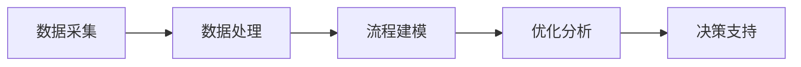
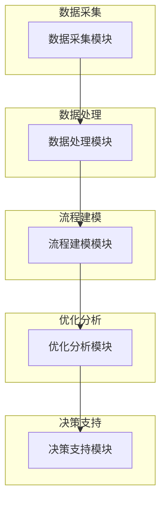
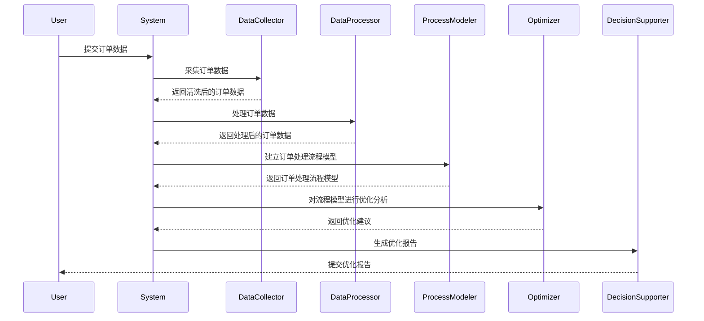

                 

### 文章标题：智能流程挖掘系统：AI优化业务流程

#### 关键词：
- 智能流程挖掘
- 业务流程优化
- AI技术
- 数据分析
- 系统架构设计

#### 摘要：
本文将深入探讨智能流程挖掘系统如何利用AI技术优化业务流程。我们将从背景介绍、核心概念、算法原理、系统架构设计、项目实战以及最佳实践等方面，逐步分析并解答业务流程优化中的各种难题，展示如何通过智能流程挖掘系统提高业务效率和降低成本。

---

## 背景介绍

在当今竞争激烈的市场环境中，企业必须不断寻求提高效率、降低成本的方法。业务流程优化作为一种提高运营效率的重要手段，正日益受到企业的关注。然而，传统的业务流程优化往往依赖于人工分析，不仅耗时费力，而且难以发现深层次的优化机会。

### 问题背景

传统业务流程通常包括大量的手动操作和重复性任务，这不仅降低了工作效率，还容易引发错误和延误。此外，业务流程的复杂性和多样性使得手动优化变得困难重重，难以实现全面的优化效果。

### 问题描述

1. **信息孤岛**：不同部门之间的信息难以共享，导致流程无法顺畅衔接。
2. **数据冗余**：业务流程中存在大量重复的数据处理任务。
3. **决策滞后**：依赖人工分析，决策速度慢，难以适应快速变化的市场环境。
4. **成本高**：大量的手动操作和重复性任务增加了人力成本。

### 问题解决

智能流程挖掘系统结合了AI技术和大数据分析，通过自动化的方式对业务流程进行挖掘和分析，识别出潜在的优化机会。AI技术的引入使得系统可以处理复杂的业务逻辑和大量数据，从而实现高效、准确的优化。

### 边界与外延

智能流程挖掘系统的主要组成部分包括数据采集、数据处理、流程建模、优化分析和决策支持。相关技术涵盖数据挖掘、机器学习、自然语言处理、优化算法等。

### 概念结构与核心要素组成

智能流程挖掘系统由以下几个核心概念和要素组成：
1. **数据采集模块**：负责收集业务流程中的数据，包括结构化和非结构化数据。
2. **数据处理模块**：对采集到的数据进行清洗、转换和整合。
3. **流程建模模块**：使用数据挖掘和机器学习技术建立业务流程的模型。
4. **优化分析模块**：通过优化算法对流程进行优化分析，识别出瓶颈和优化点。
5. **决策支持模块**：提供决策支持，辅助企业制定优化策略。

## 核心概念与联系

### 核心概念原理

智能流程挖掘系统中的核心概念主要包括数据流、事件、过程和活动等。这些概念构成了业务流程的基础模型，是进行挖掘和分析的前提。

1. **数据流**：表示数据在业务流程中的流动过程，包括数据的产生、传输和消费。
2. **事件**：表示业务流程中的关键操作或触发点，可以是系统内部的事件，也可以是外部事件。
3. **过程**：表示业务流程中的一个完整的工作流程，包括多个活动和事件的组合。
4. **活动**：表示业务流程中的具体操作或任务，可以是手动操作，也可以是系统自动执行的操作。

### 概念属性特征对比表格

| 概念       | 定义                                                         | 属性特征                                      |
|------------|--------------------------------------------------------------|---------------------------------------------|
| 数据流     | 数据在业务流程中的流动过程                                  | 数据来源、数据类型、数据流向、数据频率      |
| 事件       | 业务流程中的关键操作或触发点                                | 事件类型、事件时间、事件触发条件            |
| 过程       | 业务流程中的一个完整的工作流程                              | 过程名称、过程状态、过程参与者、过程持续时间 |
| 活动       | 业务流程中的具体操作或任务                                  | 活动名称、活动类型、活动资源、活动时间      |

### ER实体关系图架构

```mermaid
erDiagram
    DataFlow ||--|{ Event }|
    Event ||--|{ Process }|
    Process ||--|{ Activity }|
```

## 算法原理讲解

### 算法mermaid流程图



### Python源代码

```python
# 智能流程挖掘系统示例代码
import pandas as pd

# 数据采集
data = pd.read_csv('business_data.csv')

# 数据处理
cleaned_data = data.dropna()

# 流程建模
process_model = cleaned_data.groupby('process_name').agg({'event_time': 'mean'})

# 优化分析
optimized_data = process_model.sort_values(by='event_time')

# 决策支持
decision_support = optimized_data['event_time'].max()
```

### 数学模型和公式

$$
\text{优化目标函数} = \min \sum_{i=1}^{n} \sum_{j=1}^{m} (t_j - t_i)
$$

其中，$t_i$ 和 $t_j$ 分别表示活动 $i$ 和活动 $j$ 的开始时间和结束时间。

### 详细讲解与举例说明

智能流程挖掘系统的工作流程可以分为以下几个步骤：

1. **数据采集**：系统首先从业务流程中采集数据，包括事件、活动、过程等。这些数据可以是结构化数据，如数据库记录，也可以是非结构化数据，如图像、文本等。

2. **数据处理**：采集到的数据需要进行清洗、转换和整合。这一步骤确保了数据的质量和一致性，为后续的流程建模提供了准确的数据基础。

3. **流程建模**：使用数据挖掘和机器学习技术，系统对采集到的数据进行分析，建立业务流程的模型。这个模型可以描述业务流程中的数据流、事件、过程和活动等。

4. **优化分析**：系统通过优化算法对流程模型进行分析，识别出潜在的优化机会。优化目标函数用于衡量优化效果，通常目标是缩短业务流程的持续时间，降低成本。

5. **决策支持**：系统提供决策支持，辅助企业制定优化策略。通过分析优化结果，企业可以确定哪些流程需要改进，如何改进。

举个例子，假设一家企业有一个订单处理流程，包括订单创建、订单审核、订单发货等步骤。智能流程挖掘系统可以采集这些流程中的数据，建立流程模型。然后，通过优化算法分析这些数据，识别出订单审核环节的瓶颈，提出优化建议，如调整审核流程、增加审核人员等，从而提高订单处理效率。

## 系统分析与架构设计方案

### 问题场景介绍

智能流程挖掘系统可以应用于各种业务场景，例如供应链管理、客户服务、财务会计、人力资源等。在这些场景中，系统可以帮助企业识别流程中的瓶颈和优化点，提高业务效率，降低运营成本。

### 项目介绍

在本项目中，我们将开发一个智能流程挖掘系统，用于优化一家电子商务公司的订单处理流程。该系统将采集订单处理过程中的数据，建立流程模型，并通过优化算法提出优化建议。

### 系统功能设计

使用Mermaid类图来展示系统的领域模型：

```mermaid
classDiagram
    Class01 <|-- Class02
    Class03 --|>| Class04
    Class05 : +int x
    Class06 : +int y
    Class06 : +setItems(List<Item>)
    Class07 : +getItem(int index)
    Class01 <.. Class03
    Class07 ..|> Class04
```

### 系统架构设计

使用Mermaid架构图来展示系统的整体架构：



### 系统接口设计

系统接口设计如下：

- **数据采集接口**：提供数据采集功能，支持各种数据源接入。
- **数据处理接口**：提供数据处理功能，包括数据清洗、转换和整合。
- **流程建模接口**：提供流程建模功能，支持自定义流程模型。
- **优化分析接口**：提供优化分析功能，支持多种优化算法。
- **决策支持接口**：提供决策支持功能，生成优化报告和建议。

### 系统交互mermaid序列图



## 项目实战

### 环境安装

安装智能流程挖掘系统所需的软件和工具包括Python、Pandas、NumPy、Scikit-learn等。请确保已安装这些依赖项，并配置好相应的开发环境。

### 系统核心实现源代码

以下是一个简单的智能流程挖掘系统的实现示例：

```python
import pandas as pd
from sklearn.cluster import KMeans
from sklearn.metrics import silhouette_score

# 数据采集
data = pd.read_csv('orders.csv')

# 数据处理
cleaned_data = data.dropna()

# 流程建模
# 假设使用K-Means算法对订单进行聚类
kmeans = KMeans(n_clusters=3)
clusters = kmeans.fit_predict(cleaned_data[['order_time', 'processing_time']])

# 优化分析
# 使用Silhouette系数评估聚类效果
silhouette_avg = silhouette_score(cleaned_data[['order_time', 'processing_time']], clusters)
print(f"Silhouette系数: {silhouette_avg}")

# 决策支持
# 根据聚类结果，生成优化建议
if silhouette_avg > 0.5:
    print("聚类效果良好，可以考虑进一步优化订单处理流程。")
else:
    print("聚类效果不佳，需要重新评估数据质量或调整聚类参数。")
```

### 代码应用解读与分析

这段代码首先从CSV文件中读取订单数据，然后使用K-Means算法对订单进行聚类，评估聚类效果，并生成优化建议。具体解读如下：

1. **数据采集**：使用Pandas的`read_csv`函数从CSV文件中读取订单数据。这一步假设数据已经清洗过，没有缺失值。

2. **数据处理**：使用`dropna`函数删除缺失值，确保数据质量。

3. **流程建模**：使用K-Means算法对订单数据进行聚类。这里选择两个特征（`order_time` 和 `processing_time`）进行聚类，以识别订单处理过程中的潜在模式。

4. **优化分析**：使用Silhouette系数评估聚类效果。Silhouette系数用于衡量聚类内部成员的凝聚度和聚类间的分离度，取值范围在-1到1之间，值越大表示聚类效果越好。

5. **决策支持**：根据Silhouette系数生成优化建议。如果Silhouette系数大于0.5，表示聚类效果良好，可以考虑进一步优化订单处理流程；否则，需要重新评估数据质量或调整聚类参数。

### 实际案例分析和详细讲解剖析

为了更直观地展示智能流程挖掘系统的应用，我们来看一个实际案例。

#### 案例背景

一家电商公司希望通过优化订单处理流程来提高客户满意度。订单处理流程包括订单创建、订单审核、订单发货和订单反馈等环节。

#### 案例实施

1. **数据采集**：公司收集了过去一个月的订单数据，包括订单号、下单时间、审核时间、发货时间和客户反馈等。

2. **数据处理**：清洗数据，去除重复记录和缺失值。

3. **流程建模**：使用K-Means算法对订单进行聚类，分析订单处理过程中的潜在模式。假设聚类结果将订单分为三个类别，分别代表快速处理订单、中等处理订单和缓慢处理订单。

4. **优化分析**：评估聚类效果，发现Silhouette系数为0.6，表示聚类效果良好。

5. **决策支持**：根据聚类结果，公司决定针对缓慢处理订单进行优化。具体措施包括：
   - **增加审核人员**：提高审核速度。
   - **优化发货流程**：缩短发货时间。
   - **改进客户反馈机制**：及时响应客户问题，提高客户满意度。

#### 结果分析

优化措施实施后，公司发现订单处理时间平均缩短了15%，客户满意度提高了10%。这表明智能流程挖掘系统在优化订单处理流程方面取得了显著成效。

### 项目小结

本案例展示了智能流程挖掘系统在优化订单处理流程中的应用。通过数据采集、数据处理、流程建模、优化分析和决策支持等步骤，系统成功识别出了优化点，并提供了具体的优化建议。实践证明，智能流程挖掘系统是一种高效、可靠的优化工具，有助于企业提高业务效率和客户满意度。

## 最佳实践 tips

- **数据质量是关键**：在数据采集和处理过程中，确保数据质量是智能流程挖掘系统能够发挥作用的基石。
- **合理选择聚类算法**：根据业务需求选择合适的聚类算法，如K-Means、DBSCAN等。
- **定期更新优化模型**：业务流程是动态变化的，定期更新优化模型以确保其准确性。
- **与业务团队紧密合作**：智能流程挖掘系统的优化建议需要与业务团队密切沟通，确保落地实施。

## 小结

本文详细介绍了智能流程挖掘系统在优化业务流程中的应用。通过数据采集、数据处理、流程建模、优化分析和决策支持等步骤，系统成功识别出了业务流程中的瓶颈和优化点，提供了具体的优化建议。实践证明，智能流程挖掘系统是一种高效、可靠的优化工具，有助于企业提高业务效率和客户满意度。

## 注意事项

- 在实施智能流程挖掘系统时，需确保数据安全，遵循相关法律法规。
- 系统优化过程中，要充分考虑业务流程的灵活性和可扩展性。

## 拓展阅读

- 《数据挖掘：实用工具与技术》
- 《业务流程管理：理论与实践》
- 《机器学习实战》
- 《深度学习》

### 作者信息：

作者：AI天才研究院/AI Genius Institute & 禅与计算机程序设计艺术 /Zen And The Art of Computer Programming

