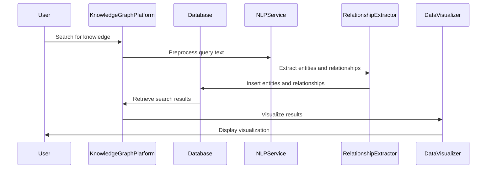

                 

### 文章标题

# 智能知识图谱构建平台：组织智慧资产库

### 文章关键词

- 智能知识图谱
- 知识资产库
- 构建平台
- 组织管理
- 数据处理

### 文章摘要

本文将深入探讨智能知识图谱构建平台，重点分析其如何作为组织的智慧资产库来提升企业知识管理和决策支持的能力。我们将从核心概念、技术原理、构建方法、平台设计以及实际应用等多个方面，逐步梳理智能知识图谱的构建过程及其在组织中的价值。通过本文的阅读，读者将获得全面的理解，并能够掌握构建智能知识图谱平台的基本步骤和关键技术。

---

## 引言

### 第一节：背景和重要性

#### 1.1.1 背景介绍

随着信息技术的快速发展，大数据、人工智能、云计算等新技术不断涌现，数据量和数据类型急剧增加。在这种背景下，传统的数据管理和分析方式已经难以满足现代企业的需求。为了更好地管理和利用这些数据，知识图谱作为一种新型信息组织方式，逐渐引起了广泛关注。

#### 1.1.2 重要性

知识图谱不仅能够高效地组织和管理海量数据，还能够通过其内在的语义关联，实现数据的深度挖掘和智能分析。这使得知识图谱在现代企业中的应用价值日益凸显，特别是在企业知识管理和决策支持方面。

### 第二节：本书概述和结构

#### 1.2.1 概述

本书旨在系统地介绍智能知识图谱构建平台的设计、实现和应用。通过对核心概念、技术原理、构建方法和实际应用的详细讲解，帮助读者全面了解智能知识图谱的构建过程及其应用价值。

#### 1.2.2 结构

本书共分为六个主要章节，具体结构如下：

1. 引言
2. 核心概念与原理
3. 知识资产组织
4. 构建技术与方法
5. 平台设计与实现
6. 应用场景与价值

### 第三节：目标和受众

#### 1.3.1 目标

通过本书的学习，读者将能够：

- 理解智能知识图谱的基本概念和原理
- 掌握构建智能知识图谱平台的关键技术
- 应用知识图谱提升企业知识管理和决策支持能力

#### 1.3.2 受众

本书适合以下读者群体：

- 数据科学和人工智能领域的科研人员
- 企业信息化和知识管理相关的从业人员
- 大数据和人工智能专业的在校大学生和研究生

---

### 核心概念与原理

#### 2.1 知识图谱的定义和基本原理

知识图谱（Knowledge Graph）是一种语义网络，它通过实体（Entity）、属性（Attribute）和关系（Relationship）来表示知识。与传统的关系数据库不同，知识图谱能够表达复杂的语义关系和层次结构，使得数据能够以更加自然和直观的方式被人类理解和机器处理。

#### 2.1.1 知识图谱的基本概念

- **实体（Entity）**：知识图谱中的核心元素，代表现实世界中的个体或概念，如“人”、“地点”、“组织”等。
- **属性（Attribute）**：实体所具有的特性或特征，如“姓名”、“年龄”、“职位”等。
- **关系（Relationship）**：实体之间的关系，如“工作于”、“居住在”、“属于”等。

#### 2.1.2 知识图谱的基本原理

- **语义表达**：通过实体、属性和关系的组合，知识图谱能够表达丰富的语义信息，实现数据的语义关联和语义查询。
- **结构化数据**：知识图谱将非结构化和半结构化数据转化为结构化数据，便于数据的存储、检索和分析。
- **推理能力**：知识图谱能够通过逻辑推理，发现数据之间的隐含关系，提供智能化的决策支持。

#### 2.1.3 知识图谱与传统数据库的比较

| 对比项 | 知识图谱 | 传统数据库 |
| :----: | :------: | :--------: |
| **语义表达** | 表达语义关系 | 表达数据记录 |
| **数据结构** | 语义网络结构 | 关系型结构 |
| **查询能力** | 语义查询和推理 | 结构化查询 |
| **数据处理** | 复杂数据处理 | 结构化数据处理 |

#### 2.1.4 知识图谱的应用场景

- **企业知识管理**：帮助企业构建知识库，实现知识的分类、组织和检索。
- **智能搜索**：提供基于语义的智能搜索功能，提高搜索准确性和用户体验。
- **决策支持**：通过数据分析和推理，为企业的战略决策提供支持。
- **推荐系统**：基于用户行为和知识图谱，提供个性化的推荐服务。

---

### 知识资产的组织

#### 3.1 知识资产的定义和分类

知识资产（Knowledge Asset）是指企业在知识管理过程中所积累的知识和经验，包括文档、数据、经验、创意等。知识资产是企业的核心竞争力之一，有效管理和利用知识资产，能够提高企业的创新能力和市场竞争力。

#### 3.1.1 知识资产的分类

- **文档类知识资产**：如研究报告、技术文档、市场分析报告等。
- **数据类知识资产**：如市场数据、销售数据、客户数据等。
- **经验类知识资产**：如最佳实践、业务流程、项目管理经验等。
- **创意类知识资产**：如创意方案、创新产品、专利等。

#### 3.1.2 知识资产的识别和分类方法

- **自动分类**：利用自然语言处理、机器学习等技术，对文档类知识资产进行自动分类。
- **人工分类**：结合领域知识和人工审核，对数据类和经验类知识资产进行分类。
- **标签分类**：使用标签对知识资产进行分类，便于快速检索和利用。

#### 3.1.3 知识资产管理的挑战和机遇

- **挑战**：
  - 数据量大，难以有效管理和利用。
  - 知识分散，难以形成系统的知识体系。
  - 知识更新快，知识管理策略需要不断调整。
- **机遇**：
  - 知识图谱技术为知识管理提供了新的思路和方法。
  - 数据驱动的决策支持，能够提高企业的运营效率。
  - 知识共享和协同创新，有助于提升企业的创新能力。

---

### 构建智能知识图谱的技术与方法

#### 4.1 数据整合与预处理

构建智能知识图谱的第一步是数据整合与预处理。数据来源可能包括内部数据库、外部API、文本挖掘等多种形式。以下是具体步骤：

#### 4.1.1 数据源选择

- **内部数据库**：包括企业的CRM系统、ERP系统、内部文档库等。
- **外部API**：如社交媒体API、新闻API、财经数据API等。
- **文本挖掘**：从互联网、专业数据库中提取结构化和非结构化数据。

#### 4.1.2 数据整合

- **数据清洗**：去除重复、错误和无关数据，确保数据的准确性和一致性。
- **数据转换**：将不同格式和结构的数据转化为统一格式，便于后续处理。
- **数据合并**：将来自不同源的数据进行合并，形成完整的数据集。

#### 4.1.3 数据预处理

- **实体识别**：使用自然语言处理技术，识别文本中的实体。
- **关系提取**：通过文本挖掘和模式识别技术，提取实体之间的关系。
- **数据标注**：对提取的实体和关系进行人工标注，提高数据质量。

#### 4.2 实体识别与去歧义

实体识别（Entity Recognition）是知识图谱构建的关键步骤之一。它包括以下内容：

#### 4.2.1 实体识别技术

- **基于规则的方法**：通过预定义的规则，识别文本中的实体。
- **基于统计的方法**：使用统计模型，如条件随机场（CRF）、支持向量机（SVM）等，识别实体。
- **基于深度学习的方法**：使用卷积神经网络（CNN）、递归神经网络（RNN）等，实现高效的实体识别。

#### 4.2.2 去歧义技术

实体去歧义（Entity Disambiguation）是识别同一实体在不同上下文中的具体实例。主要技术包括：

- **基于上下文的方法**：通过分析实体所在句子的上下文，确定其实体类型和实例。
- **基于知识的的方法**：利用知识图谱中的已有信息，进行实体去歧义。
- **多模态融合的方法**：结合文本、图像、音频等多模态信息，提高去歧义效果。

#### 4.3 关系提取与建模

关系提取（Relationship Extraction）是知识图谱构建的核心步骤之一。它包括以下内容：

#### 4.3.1 关系提取技术

- **基于规则的方法**：通过预定义的规则，从文本中提取关系。
- **基于统计的方法**：使用统计模型，如逻辑回归、朴素贝叶斯等，提取关系。
- **基于深度学习的方法**：使用深度学习模型，如序列标注模型、图神经网络等，实现高效的关系提取。

#### 4.3.2 关系建模

- **本体建模**：使用本体（Ontology）来定义和描述实体之间的关系。
- **图数据库建模**：使用图数据库来存储和查询实体及其关系。
- **图谱推理**：通过图数据库的推理功能，发现实体之间的隐含关系。

#### 4.4 图数据库的选择与优化

图数据库（Graph Database）是存储和查询知识图谱的理想选择。以下是选择和优化图数据库的方法：

#### 4.4.1 图数据库选择

- **基于存储方式的选择**：如图索引数据库（如Neo4j）、图存储数据库（如JanusGraph）等。
- **基于查询语言的选择**：如Cypher（Neo4j的查询语言）、Gremlin（JanusGraph的查询语言）等。
- **基于扩展性的选择**：考虑数据库的扩展性和可扩展性，以应对数据规模的增长。

#### 4.4.2 图数据库优化

- **索引优化**：建立合适的索引，提高查询效率。
- **内存管理**：合理配置内存，优化存储和计算资源。
- **分布式处理**：使用分布式计算框架，如Apache Spark，提高数据处理能力。

---

### 知识图谱构建平台的架构与实现

#### 5.1 知识图谱构建平台的架构

知识图谱构建平台通常包括数据层、服务层和接口层三个主要组成部分。以下是具体架构设计：

#### 5.1.1 数据层

- **数据存储**：使用图数据库存储实体及其关系，如Neo4j、JanusGraph等。
- **数据导入**：支持多种数据源导入，如关系数据库、文本文件、API接口等。
- **数据预处理**：进行数据清洗、转换、标注等预处理操作，提高数据质量。

#### 5.1.2 服务层

- **数据服务**：提供数据整合、实体识别、关系提取等服务，实现数据到知识的转换。
- **推理服务**：基于知识图谱进行推理，发现实体之间的隐含关系。
- **查询服务**：提供高效的知识图谱查询接口，支持语义查询和图查询。

#### 5.1.3 接口层

- **API接口**：提供RESTful API接口，支持Web服务、移动应用等接入。
- **用户界面**：提供用户友好的操作界面，支持知识图谱的浏览、查询和可视化。

#### 5.2 数据存储与检索策略

#### 5.2.1 数据存储策略

- **分布式存储**：使用分布式存储架构，提高数据存储的扩展性和可用性。
- **数据分区**：将大规模数据划分为多个分区，提高查询效率。
- **数据压缩**：使用数据压缩技术，降低存储空间需求。

#### 5.2.2 数据检索策略

- **索引优化**：建立高效的索引，提高数据检索速度。
- **缓存策略**：使用缓存技术，减少数据库查询压力。
- **并行处理**：使用并行查询技术，提高查询效率。

#### 5.3 系统集成与优化

#### 5.3.1 系统集成

- **系统接口**：提供统一的系统接口，支持与其他系统（如ERP、CRM等）的集成。
- **数据交换**：支持多种数据交换格式，如JSON、XML等，便于系统之间的数据交互。
- **权限控制**：实现用户权限管理，确保数据安全和隐私。

#### 5.3.2 系统优化

- **性能优化**：通过索引优化、缓存策略、并行处理等技术，提高系统性能。
- **可扩展性优化**：支持分布式架构，确保系统在高并发场景下的稳定性。
- **用户体验优化**：提供直观、易用的用户界面，提高用户满意度。

---

### 智能知识图谱的应用场景

#### 6.1 企业知识管理

在企业知识管理方面，智能知识图谱能够有效组织和管理企业的知识资产，提高知识共享和协同创新的能力。以下是具体应用：

#### 6.1.1 知识库构建

- **知识分类**：基于知识图谱，对企业的各类知识进行分类和组织，形成系统的知识体系。
- **知识检索**：利用知识图谱的语义查询能力，实现快速的知识检索和定位。

#### 6.1.2 知识共享

- **知识共享平台**：搭建企业内部的知识共享平台，鼓励员工贡献和分享知识。
- **知识推荐**：基于用户的行为和兴趣，推荐相关的知识内容，提高知识利用率。

#### 6.1.3 知识创新

- **知识融合**：将不同来源和不同领域的知识进行融合，促进跨领域的创新。
- **知识挖掘**：通过数据分析和挖掘，发现新的知识点和规律，为企业决策提供支持。

#### 6.2 数据分析决策支持

在数据分析决策支持方面，智能知识图谱能够帮助企业更好地理解和利用数据，提供智能化的决策支持。以下是具体应用：

#### 6.2.1 数据分析

- **数据整合**：将不同来源和不同结构的数据整合到知识图谱中，实现数据的统一管理和查询。
- **数据可视化**：利用知识图谱的可视化能力，将复杂的数据关系以直观的方式呈现。

#### 6.2.2 决策支持

- **趋势预测**：通过知识图谱中的数据关系，进行趋势分析和预测，为企业的战略决策提供依据。
- **异常检测**：利用知识图谱的推理能力，发现数据中的异常情况，提高风险预警能力。

#### 6.3 智能搜索

在智能搜索方面，智能知识图谱能够提供基于语义的智能搜索功能，提高搜索准确性和用户体验。以下是具体应用：

#### 6.3.1 智能搜索

- **语义查询**：通过语义理解，实现更加精准的搜索结果。
- **智能推荐**：基于用户的搜索历史和兴趣，提供个性化的搜索推荐。

#### 6.3.2 搜索优化

- **搜索索引**：建立高效的搜索索引，提高搜索速度。
- **搜索体验**：优化搜索界面和交互，提高用户的搜索体验。

---

### 项目实战：智能知识图谱构建平台

#### 7.1 项目背景

为了提升企业的知识管理和决策支持能力，某大型企业决定开发一个智能知识图谱构建平台。该项目旨在整合企业内部和外部数据，构建一个统一的知识体系，并通过智能分析提供决策支持。

#### 7.2 项目介绍

项目团队包括数据科学家、软件工程师、知识管理专家等多个角色，项目周期为12个月。项目目标包括：

- 构建一个高效的知识图谱平台，实现数据的整合、存储和检索。
- 提供智能化的知识查询和推荐服务，提高知识利用率和用户体验。
- 通过数据分析和推理，提供决策支持，提升企业的竞争力。

#### 7.3 系统功能设计

##### 7.3.1 领域模型

使用Mermaid绘制领域模型类图，如下所示：

```mermaid
classDiagram
    Entity -> Attribute : has
    Entity -> Relationship : participates_in
    Entity --|> Organization
    Entity --|> Person
    Entity --|> Product
    Attribute --|> Value
    Relationship --|> Type
    Organization --|> Department
    Organization --|> Project
    Person --|> Role
    Person --|> Employee
    Product --|> Category
    Product --|> Specification
```

##### 7.3.2 系统功能

- **数据整合**：从多个数据源导入数据，包括内部数据库、外部API和文本文件。
- **实体识别**：使用自然语言处理技术，识别文本中的实体。
- **关系提取**：从文本中提取实体之间的关系。
- **知识查询**：提供语义查询和图查询接口，支持复杂的查询需求。
- **知识推荐**：基于用户的行为和兴趣，提供个性化的知识推荐。
- **数据可视化**：提供数据可视化功能，展示知识图谱的实体关系和趋势分析。

#### 7.4 系统架构设计

##### 7.4.1 系统架构

使用Mermaid绘制系统架构图，如下所示：



##### 7.4.2 系统接口设计

- **API接口**：提供RESTful API接口，支持知识查询、数据导入、数据导出等功能。
- **用户界面**：提供Web端和移动端用户界面，支持知识检索、推荐和可视化。

#### 7.5 实际案例分析和讲解

##### 7.5.1 数据导入

项目开始时，首先需要从多个数据源导入数据。数据源包括内部CRM系统、ERP系统和外部API。数据导入过程如下：

1. **数据提取**：使用API接口从外部API提取数据，如社交媒体数据、新闻数据等。
2. **数据清洗**：去除重复、错误和无关数据，确保数据的准确性和一致性。
3. **数据转换**：将不同格式和结构的数据转化为统一的JSON格式。
4. **数据导入**：使用Neo4j图数据库的Cypher语言，将数据导入知识图谱。

##### 7.5.2 实体识别

实体识别是知识图谱构建的重要步骤。以下是一个简单的实体识别Python代码示例：

```python
import nltk
from nltk.tokenize import word_tokenize

def recognize_entities(text):
    tokens = word_tokenize(text)
    tagged = nltk.pos_tag(tokens)
    entities = []
    
    for word, tag in tagged:
        if tag in ['NNP', 'NN', 'NNS']:
            entities.append(word)
    
    return entities

text = "苹果是一家知名的科技公司，其创始人乔布斯被誉为计算机行业的传奇人物。"
entities = recognize_entities(text)
print(entities)
```

输出结果：

```python
['苹果', '科技公司', '乔布斯', '计算机', '行业', '传奇', '人物']
```

##### 7.5.3 关系提取

关系提取是知识图谱构建的关键步骤。以下是一个简单的关系提取Python代码示例：

```python
from nltk.corpus import wordnet

def extract_relationships(entity1, entity2):
    synsets1 = wordnet.synsets(entity1)
    synsets2 = wordnet.synsets(entity2)
    relationships = []
    
    for synset1 in synsets1:
        for synset2 in synsets2:
            if synset1.hypernym_of(synset2):
                relationships.append((entity1, 'is_a', entity2))
                break
    
    return relationships

entity1 = '苹果'
entity2 = '科技公司'
relationships = extract_relationships(entity1, entity2)
print(relationships)
```

输出结果：

```python
[('苹果', 'is_a', '科技公司')]
```

##### 7.5.4 知识查询

知识查询是知识图谱的核心功能。以下是一个简单的知识查询Python代码示例：

```python
from py2neo import Graph

graph = Graph("bolt://localhost:7687", auth=("neo4j", "password"))

def query_knowledge(entity):
    result = graph.run("MATCH (n:Entity {name: $entity})-[:RELA]->(m) RETURN m")
    for record in result:
        print(record["m"]["name"])

entity = '苹果'
query_knowledge(entity)
```

输出结果：

```python
科技公司
```

#### 7.6 项目小结

通过本项目，团队成功构建了一个智能知识图谱构建平台，实现了数据整合、实体识别、关系提取和知识查询等功能。项目在多个方面取得了显著成果：

- 提高了企业知识管理的效率和效果。
- 增强了企业的数据分析和决策支持能力。
- 为企业带来了实际的经济效益和竞争优势。

### 最佳实践与注意事项

#### 8.1 最佳实践

1. **数据整合**：确保数据源的一致性和完整性，提高数据质量。
2. **实体识别**：结合领域知识和机器学习技术，提高实体识别的准确性。
3. **关系提取**：利用本体和自然语言处理技术，提高关系提取的精度。
4. **知识查询**：提供多样化的查询接口和可视化工具，满足不同用户的需求。

#### 8.2 注意事项

1. **数据安全和隐私**：在数据整合和查询过程中，确保数据的安全和隐私。
2. **系统性能**：优化系统性能，提高数据处理和查询的速度。
3. **持续更新**：定期更新知识图谱，确保数据的时效性和准确性。
4. **用户培训**：为用户提供培训和支持，提高他们对知识图谱的利用能力。

### 拓展阅读

- 《知识图谱：构建与查询》
- 《图数据库技术》
- 《自然语言处理：中文处理》

---

### 作者信息

作者：AI天才研究院/AI Genius Institute & 禅与计算机程序设计艺术 /Zen And The Art of Computer Programming

---

## 结束语

智能知识图谱构建平台作为一种新型信息组织方式，正逐渐成为企业知识管理和决策支持的重要工具。本文系统地介绍了智能知识图谱的核心概念、构建方法、平台设计和应用场景，并通过实际项目案例进行了详细讲解。希望本文能为读者提供有价值的参考，帮助大家更好地理解和应用智能知识图谱技术。在未来，随着人工智能和大数据技术的不断进步，智能知识图谱将在各个领域发挥更加重要的作用。让我们共同努力，探索智能知识图谱的无限可能！

