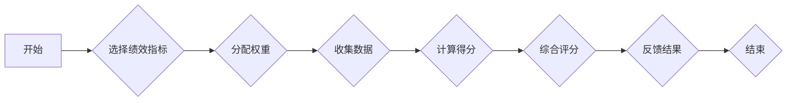
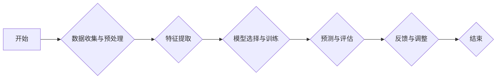
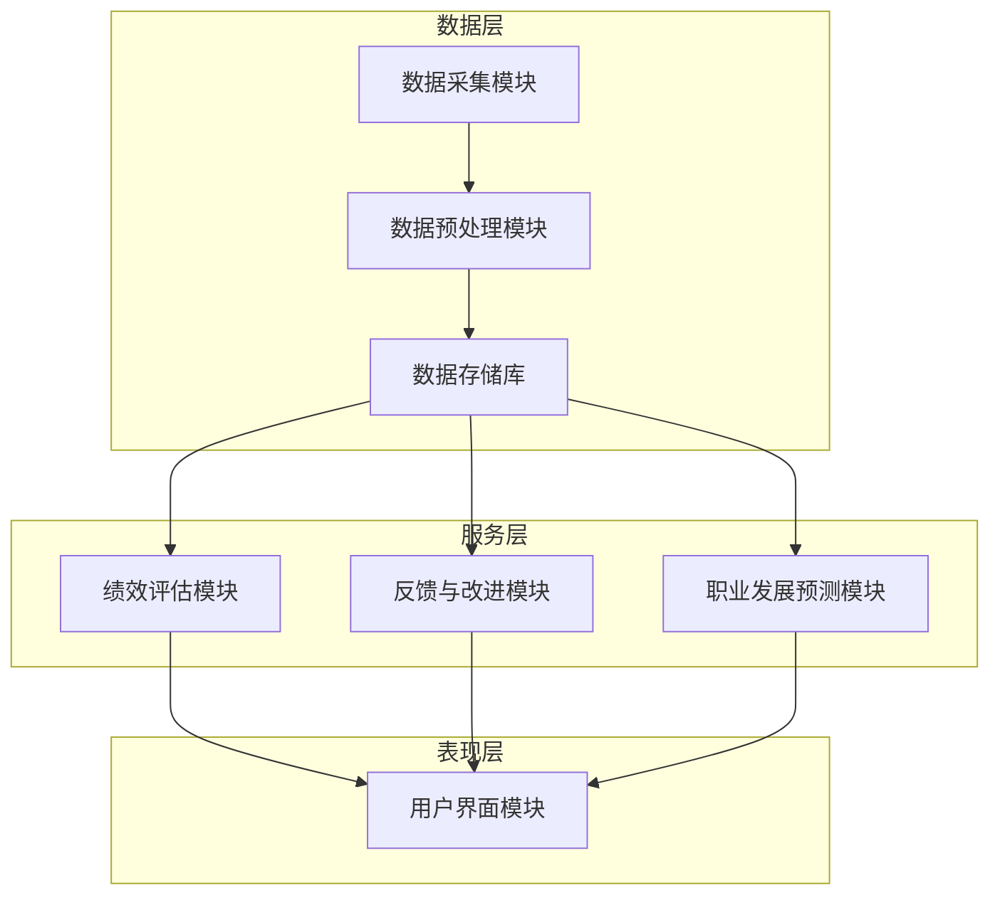
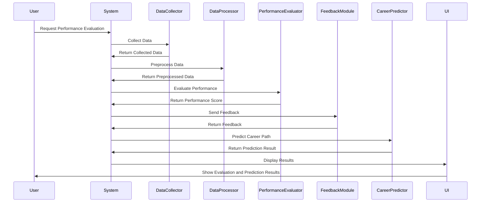

                 

### 摘要

本文将深入探讨智能绩效管理系统，这是一种结合人工智能技术，辅助员工发展的创新系统。在全球化竞争日益激烈的大背景下，企业对于绩效管理的要求越来越高，传统绩效管理系统已无法满足日益复杂的业务需求。智能绩效管理系统通过引入人工智能技术，实现了对员工绩效的精准评估和个性化发展路径的预测，极大地提升了企业的人力资源管理效率。本文将首先介绍智能绩效管理系统的问题背景和概念结构，接着深入讲解其核心概念和联系，然后探讨AI在员工发展中的应用原理和具体方法，最后详细阐述系统的架构设计和实现过程，以及最佳实践和注意事项。通过本文的阅读，读者将全面了解智能绩效管理系统，并能够掌握其在实际应用中的关键技巧和策略。

### 第1章 引言

#### 1.1 问题背景

随着信息技术的迅猛发展，企业面临的市场环境和竞争态势发生了翻天覆地的变化。传统的绩效管理系统逐渐暴露出许多不足，比如评估过程主观性较强、数据准确性不高、无法及时响应业务变化等。特别是在全球化竞争中，企业需要快速适应市场的变化，灵活调整人力资源策略。然而，传统绩效管理系统往往难以实时捕捉和反映员工的工作表现，进而影响企业决策的科学性和高效性。

这种背景下，智能绩效管理系统应运而生。它通过引入人工智能技术，利用大数据分析和机器学习算法，对员工的绩效进行精准评估，并提供个性化的职业发展建议。这种系统的出现，旨在解决传统绩效管理系统在评估准确性和灵活性方面的不足，为企业提供更加科学和高效的人力资源管理工具。

#### 1.2 问题描述

传统绩效管理系统在以下几个方面存在明显的问题：

1. **主观性较强**：传统绩效管理系统往往依赖主观评价，难以避免评估者的个人偏见。这种主观性不仅影响了评估的准确性，也容易导致员工的不满和抵触情绪。

2. **数据准确性不高**：传统绩效管理系统依赖手工记录和纸质档案，数据整理和更新存在滞后性，导致数据准确性不高。这种不准确的数据会影响企业对员工绩效的判断和决策。

3. **无法及时响应业务变化**：传统绩效管理系统缺乏灵活性，难以快速适应业务环境的变化。当企业需要调整战略或优化人力资源配置时，传统系统往往无法及时响应。

4. **绩效评估过程繁琐**：传统绩效管理系统需要经过多个环节的审核和反馈，评估过程繁琐且耗时，影响了绩效管理的高效性。

为了解决上述问题，企业需要一种能够提高绩效评估准确性、及时性和灵活性的系统，这促使了智能绩效管理系统的诞生。

#### 1.3 问题解决

智能绩效管理系统通过引入人工智能技术，解决了传统绩效管理系统面临的问题：

1. **减少主观性**：智能绩效管理系统利用数据分析和算法模型，对员工的绩效进行量化评估，减少主观评价的影响。通过算法自动计算绩效指标，提高了评估的客观性和准确性。

2. **提高数据准确性**：智能绩效管理系统通过自动化数据收集和实时更新，确保数据的准确性和及时性。员工的工作表现数据可以实时上传和更新，避免了人工记录的滞后性。

3. **灵活应对业务变化**：智能绩效管理系统具有较高的灵活性，可以快速调整绩效评估指标和模型，适应企业战略和业务环境的变化。这种灵活性有助于企业及时调整人力资源策略。

4. **简化绩效评估过程**：智能绩效管理系统通过自动化流程和智能算法，简化了绩效评估过程。评估结果可以实时生成和反馈，减少了审核和反馈的时间，提高了绩效管理的高效性。

#### 1.4 边界与外延

智能绩效管理系统的应用边界包括但不限于以下几个方面：

1. **企业规模**：智能绩效管理系统适用于各种规模的企业，尤其是大型企业，因为大型企业通常拥有更复杂的人力资源结构和更大量的员工数据。

2. **行业类型**：智能绩效管理系统适用于几乎所有行业，但不同行业的具体应用场景和需求可能有所不同。例如，在高科技行业，智能绩效管理系统可以更加精准地评估员工的创新能力和技术贡献。

3. **地区差异**：智能绩效管理系统的应用不受地区限制，但不同地区的文化和工作习惯可能影响系统的设计和实施。

4. **技术成熟度**：智能绩效管理系统依赖于人工智能和大数据技术，因此其应用受限于这些技术的成熟度和普及程度。随着技术的不断发展，智能绩效管理系统的应用范围将逐步扩大。

#### 1.5 概念结构与核心要素组成

智能绩效管理系统的概念结构包括以下几个方面：

1. **数据收集**：通过多种渠道收集员工的工作数据，包括工作表现、项目进度、客户反馈等。

2. **数据预处理**：对收集到的数据进行分析和清洗，去除噪声和异常值，确保数据的准确性和一致性。

3. **绩效评估模型**：建立基于人工智能算法的绩效评估模型，包括评估指标的选择和权重的分配。

4. **评估结果反馈**：将评估结果通过系统实时反馈给员工和管理层，提供个性化的改进建议。

5. **职业发展预测**：利用大数据和机器学习算法，预测员工的未来职业发展路径，为员工提供个性化的发展建议。

6. **系统监控与优化**：通过监控系统的运行状况和评估结果的反馈，不断优化系统性能和算法模型。

智能绩效管理系统的核心要素包括：

- **数据采集器**：负责收集各种类型的数据，如工作日志、绩效评分、客户反馈等。
- **数据存储库**：存储和管理收集到的数据，确保数据的可靠性和安全性。
- **数据分析引擎**：应用人工智能算法，对数据进行分析和处理，生成绩效评估结果和职业发展预测。
- **用户界面**：提供用户交互接口，使得员工和管理层可以方便地访问系统功能和使用系统服务。

通过以上核心要素的有机结合，智能绩效管理系统实现了对员工绩效的精准评估和个性化发展路径的预测，为企业提供了高效的人力资源管理工具。

### 第2章 核心概念与联系

#### 2.1 智能绩效管理系统的定义

智能绩效管理系统（Intelligent Performance Management System）是一种结合人工智能技术，用于优化企业绩效评估和员工发展管理的系统。它利用大数据、机器学习和自然语言处理等技术，对员工的工作表现、项目进度、客户反馈等多维度数据进行收集、分析和处理，生成客观、精准的绩效评估结果，并提供个性化的职业发展建议。智能绩效管理系统不仅提高了绩效评估的准确性，还提升了企业人力资源管理的效率，帮助企业在激烈的市场竞争中保持竞争力。

#### 2.2 智能绩效管理系统的特点

智能绩效管理系统具有以下显著特点：

1. **数据驱动的评估**：智能绩效管理系统通过收集和分析大量数据，实现对员工绩效的量化评估。这种数据驱动的评估方式减少了主观评价的影响，提高了评估的客观性和准确性。

2. **实时反馈与动态调整**：系统可以实时收集和更新员工的工作数据，评估结果和反馈可以实时生成和传递给员工和管理层。这种实时性和动态调整能力使企业能够及时了解员工的工作状况，迅速做出调整和改进。

3. **个性化发展建议**：智能绩效管理系统通过大数据和机器学习算法，分析员工的绩效数据和职业发展路径，为员工提供个性化的职业发展建议。这种个性化服务有助于员工明确职业发展方向，提高工作积极性和满意度。

4. **自动化流程**：系统集成了自动化工作流程，包括数据收集、分析、评估和反馈等环节，减少了人工干预，提高了工作效率和管理精度。

5. **灵活性和可扩展性**：智能绩效管理系统可以根据企业的不同需求和业务场景，灵活调整绩效评估指标和模型，扩展系统的功能和应用范围。

#### 2.3 智能绩效管理系统与传统绩效管理系统的区别

智能绩效管理系统与传统绩效管理系统在多个方面存在显著差异：

1. **技术基础**：传统绩效管理系统主要依赖于人工评价和纸质记录，而智能绩效管理系统则结合了大数据、人工智能和自然语言处理等先进技术。

2. **评估方式**：传统绩效管理系统往往依赖于主观评价，而智能绩效管理系统通过数据分析和算法模型实现量化评估，减少了主观偏差。

3. **实时性与动态性**：传统绩效管理系统评估过程相对滞后，而智能绩效管理系统可以实现实时数据收集和分析，动态调整评估模型和指标。

4. **个性化服务**：传统绩效管理系统难以提供个性化的职业发展建议，而智能绩效管理系统通过大数据和算法分析，为员工提供个性化的职业规划。

5. **自动化与高效性**：传统绩效管理系统需要大量人工操作，而智能绩效管理系统通过自动化流程和算法，显著提高了工作效率和管理精度。

通过以上比较，可以看出智能绩效管理系统在技术基础、评估方式、实时性与动态性、个性化服务和自动化与高效性等方面均优于传统绩效管理系统。随着人工智能技术的不断发展，智能绩效管理系统将成为企业优化人力资源管理的重要工具。

#### 2.4 智能绩效管理系统组件和主要功能

智能绩效管理系统由多个关键组件和功能模块组成，各组件和模块协同工作，实现了系统的整体功能。以下是智能绩效管理系统的主要组件和功能：

1. **数据采集模块**：
   - 功能：负责从各种来源（如员工工作日志、项目管理系统、客户反馈等）收集数据。
   - 组件：包括数据采集器、数据接口、数据清洗工具等。

2. **数据预处理模块**：
   - 功能：对采集到的原始数据进行清洗、转换和标准化处理，确保数据的质量和一致性。
   - 组件：包括数据清洗工具、数据转换工具、数据存储库等。

3. **绩效评估模块**：
   - 功能：根据预定的绩效指标和评估模型，对员工的工作表现进行量化评估。
   - 组件：包括评估算法、评估模型、评估结果生成器等。

4. **反馈与改进模块**：
   - 功能：将绩效评估结果实时反馈给员工和管理层，提供改进建议和行动计划。
   - 组件：包括反馈系统、改进建议生成器、行动计划管理工具等。

5. **职业发展预测模块**：
   - 功能：利用大数据和机器学习算法，分析员工的绩效数据，预测其未来的职业发展路径，为员工提供个性化的职业发展建议。
   - 组件：包括预测算法、预测模型、职业发展路径分析工具等。

6. **用户界面模块**：
   - 功能：提供用户交互界面，使员工和管理层可以方便地访问系统功能和使用系统服务。
   - 组件：包括Web界面、移动应用、用户权限管理工具等。

7. **系统监控与优化模块**：
   - 功能：监控系统的运行状况和性能，根据反馈数据优化系统配置和算法模型，确保系统的稳定性和高效性。
   - 组件：包括监控工具、性能分析工具、系统优化工具等。

通过以上组件和模块的有机结合，智能绩效管理系统实现了对员工绩效的精准评估、实时反馈和个性化发展预测，为企业提供了高效的人力资源管理工具。

#### 2.5 智能绩效管理系统的架构设计

智能绩效管理系统的架构设计是其高效运行的基础。系统架构通常采用分层设计，包括数据层、服务层和表现层，各层之间相互独立但又紧密协作。以下是智能绩效管理系统的典型架构设计：

1. **数据层**：
   - 功能：负责数据存储和管理，包括员工数据、绩效数据、项目数据等。
   - 组件：数据库管理系统（如MySQL、MongoDB等），数据存储库，数据缓存系统。

2. **服务层**：
   - 功能：提供核心业务逻辑和服务，包括数据采集、数据预处理、绩效评估、反馈与改进等。
   - 组件：API接口层、业务逻辑层、算法服务层、预测服务层等。

3. **表现层**：
   - 功能：提供用户交互界面，包括Web界面、移动应用、报表生成等。
   - 组件：前端框架（如React、Vue.js等），后端服务接口，报表生成工具。

**架构设计图**：

```mermaid
sequenceDiagram
    User ->> System: Send Request
    System ->> API: Process Request
    API ->> Service: Business Logic
    Service ->> Database: Access Data
    Database -->|Data| Service
    Service ->> API: Generate Response
    API ->> User: Return Response
```

通过以上架构设计，智能绩效管理系统实现了数据的高效存储和管理，业务逻辑的灵活处理，以及用户界面的友好交互。这种分层架构设计不仅提高了系统的稳定性，还增强了系统的可扩展性和可维护性。

#### 2.6 智能绩效管理系统的核心概念原理

智能绩效管理系统的核心概念和原理是其功能实现的基础。以下是系统的一些关键概念及其原理：

1. **大数据分析**：
   - **原理**：大数据分析利用数据挖掘和机器学习算法，对海量数据进行处理和分析，以发现数据中的规律和趋势。在智能绩效管理系统中，大数据分析用于收集和整理员工的各项数据，如工作时长、项目完成度、客户满意度等，从而为绩效评估提供基础。
   - **应用**：通过大数据分析，系统能够识别员工的强项和弱项，预测其职业发展路径，提供个性化的改进建议。

2. **机器学习**：
   - **原理**：机器学习是通过训练模型从数据中自动学习规律和模式，从而进行预测和决策。在智能绩效管理系统中，机器学习算法用于构建绩效评估模型和职业发展预测模型，通过对历史数据的分析，预测员工的未来绩效和发展趋势。
   - **应用**：例如，通过回归分析预测员工的绩效评分，通过聚类分析识别员工的职业发展方向。

3. **自然语言处理**：
   - **原理**：自然语言处理（NLP）是人工智能的一个分支，旨在使计算机理解和处理人类语言。在智能绩效管理系统中，NLP用于处理和分析员工的工作日志、项目报告、客户反馈等文本数据，提取关键信息和情感倾向。
   - **应用**：例如，通过情感分析评估员工的工作满意度，通过文本分类识别员工的技能水平和专业能力。

4. **深度学习**：
   - **原理**：深度学习是一种特殊的机器学习技术，通过多层神经网络模拟人脑的学习机制，进行复杂的模式识别和预测。在智能绩效管理系统中，深度学习用于构建复杂的绩效评估模型和职业发展预测模型，提高系统的准确性和鲁棒性。
   - **应用**：例如，通过卷积神经网络（CNN）分析图像数据，通过循环神经网络（RNN）处理序列数据。

通过上述核心概念和原理的应用，智能绩效管理系统实现了对员工绩效的精准评估和职业发展的个性化预测，为企业提供了强大的工具和支持。

#### 2.7 智能绩效管理系统中的关键概念属性特征对比表格

为了更好地理解智能绩效管理系统中的关键概念，下面提供了关键概念属性特征的对比表格，包括大数据分析、机器学习、自然语言处理和深度学习。

| 关键概念     | 属性特征                     | 应用举例                              |
| ------------ | ---------------------------- | ------------------------------------- |
| 大数据分析   | 海量数据处理、规律发现       | 绩效评估数据的收集与整理               |
| 机器学习     | 自主学习、预测与决策         | 员工绩效评分预测、职业发展路径预测     |
| 自然语言处理 | 文本数据分析、语义理解       | 工作日志情感分析、客户反馈分类         |
| 深度学习     | 复杂模式识别、高准确性       | 图像数据绩效评估、序列数据职业发展预测 |

通过上述对比表格，可以看出不同关键概念在属性特征和应用场景上的差异，有助于全面理解智能绩效管理系统的核心工作原理。

#### 2.8 智能绩效管理系统ER实体关系图架构的 Mermaid 流程图

为了更直观地展示智能绩效管理系统的ER实体关系图架构，我们使用Mermaid语言绘制了以下流程图：

```mermaid
erDiagram
    Product ||--|{ Employee }| {
        id     : unique identifier
        name   : string
        role   : string
    }
    Employee ||--|{ Performance }| {
        id     : unique identifier
        score  : float
        review : string
    }
    Performance ||--|{ Feedback }| {
        id     : unique identifier
        comment: string
        date   : date
    }
```

在上述ER图中，我们定义了三个主要的实体：`Employee`（员工）、`Performance`（绩效）和 `Feedback`（反馈）。员工实体关联绩效实体和反馈实体，通过 `id` 字段实现关联。绩效实体包含绩效评分和评价，反馈实体包含反馈评论和日期。这种关系架构清晰地展示了智能绩效管理系统中的数据流和关联关系，有助于理解和设计系统。

### 第3章 算法原理讲解

#### 3.1 员工绩效评估算法原理

员工绩效评估是智能绩效管理系统的核心功能之一。其基本原理是通过建立评估模型，利用输入的数据（如工作时长、项目完成度、客户满意度等）来计算员工的绩效评分。以下是员工绩效评估算法的基本原理：

1. **绩效指标选择**：
   - 绩效评估需要选择若干关键指标，这些指标应能够全面反映员工的工作表现。常见的绩效指标包括工作时长、项目完成度、任务质量、团队协作能力、客户满意度等。

2. **指标权重分配**：
   - 每个绩效指标对绩效评估的贡献程度不同，因此需要根据实际情况为每个指标分配权重。权重分配的方法可以基于专家意见、历史数据或者通过统计分析方法（如主成分分析PCA）来确定。

3. **绩效评分计算**：
   - 根据选定的绩效指标和相应的权重，使用公式计算员工的绩效评分。常见的计算方法包括加权平均法、综合评分法等。
   - 加权平均法公式：\[ 绩效评分 = \sum_{i=1}^{n} (权重_i \times 指标_i) \]
   - 综合评分法公式：\[ 绩效评分 = \sum_{i=1}^{n} 指标_i \]

4. **评估结果反馈**：
   - 将计算得到的绩效评分通过系统实时反馈给员工和管理层，并提供改进建议和行动计划。

下面通过一个具体例子来详细解释员工绩效评估的计算过程。

**例子**：

假设一个企业的绩效指标包括工作时长、项目完成度和客户满意度，对应的权重分别为0.3、0.5和0.2。对于某员工A，他的月工作时长为160小时，项目完成度为95%，客户满意度为90%。根据上述指标和权重，计算员工A的绩效评分。

1. **指标计算**：
   - 工作时长得分：\[ 160 \times 0.3 = 48 \]
   - 项目完成度得分：\[ 95 \times 0.5 = 47.5 \]
   - 客户满意度得分：\[ 90 \times 0.2 = 18 \]

2. **绩效评分计算**：
   - 绩效评分：\[ 48 + 47.5 + 18 = 113.5 \]

员工A的绩效评分为113.5分。

**算法流程图**：

为了更好地展示绩效评估的计算过程，我们可以使用Mermaid语言绘制算法流程图：



在上述流程图中，从开始到结束，依次包括选择绩效指标、分配权重、收集数据、计算得分、综合评分和反馈结果等步骤，完整地展示了员工绩效评估的计算过程。

#### 3.2 员工发展路径预测算法原理

员工发展路径预测是智能绩效管理系统的重要功能之一，通过分析员工的绩效数据和职业发展历史，预测员工的未来职业路径，为企业提供战略人力资源管理的支持。以下是员工发展路径预测算法的基本原理：

1. **数据收集与预处理**：
   - 首先，系统需要收集员工的绩效数据、职业发展历史、培训记录等，对原始数据进行清洗和预处理，确保数据的质量和一致性。

2. **特征提取**：
   - 在预处理后的数据中，提取能够反映员工发展路径的关键特征。常见的特征包括绩效评分、职位晋升次数、培训参与度、团队合作能力等。

3. **模型选择与训练**：
   - 选择合适的机器学习算法（如决策树、随机森林、支持向量机SVM、神经网络等）建立预测模型。使用历史数据对模型进行训练，通过调整模型参数，优化模型的预测性能。

4. **预测与评估**：
   - 使用训练好的模型对当前员工的特征进行预测，得到可能的职业发展路径。对预测结果进行评估，确保预测的准确性和可靠性。

5. **反馈与调整**：
   - 将预测结果反馈给员工和管理层，提供个性化的职业发展建议。根据反馈结果和新的数据，不断调整和优化预测模型。

**预测算法流程图**：

为了更好地展示员工发展路径预测的计算过程，我们可以使用Mermaid语言绘制算法流程图：



在上述流程图中，从开始到结束，依次包括数据收集与预处理、特征提取、模型选择与训练、预测与评估和反馈与调整等步骤，完整地展示了员工发展路径预测的计算过程。

#### 3.3 员工发展路径预测算法的Python实现

为了具体展示员工发展路径预测算法的实现过程，下面提供了一个简单的Python代码示例，该示例使用了决策树算法进行预测。

**环境准备**：

首先，需要安装以下Python库：
```python
pip install pandas scikit-learn numpy
```

**代码示例**：

```python
import pandas as pd
from sklearn.model_selection import train_test_split
from sklearn.tree import DecisionTreeClassifier
from sklearn.metrics import accuracy_score

# 数据准备
# 假设已收集并预处理好的员工数据存储在CSV文件中
data = pd.read_csv('employee_data.csv')

# 特征提取
# 假设特征包括绩效评分、职位晋升次数、培训参与度等
X = data[['performance_score', 'promotion_count', 'training参与度']]
y = data['career_path']  # 标签为员工的职业发展路径

# 划分训练集和测试集
X_train, X_test, y_train, y_test = train_test_split(X, y, test_size=0.2, random_state=42)

# 模型训练
model = DecisionTreeClassifier()
model.fit(X_train, y_train)

# 预测
predictions = model.predict(X_test)

# 评估
accuracy = accuracy_score(y_test, predictions)
print(f'预测准确率：{accuracy:.2f}')

# 预测新员工的职业发展路径
new_employee_data = pd.DataFrame([[90, 1, 2]], columns=['performance_score', 'promotion_count', 'training参与度'])
new_predictions = model.predict(new_employee_data)
print(f'新员工职业发展路径预测结果：{new_predictions}')
```

在上述代码中，我们首先读取并预处理员工数据，然后使用决策树算法进行训练和预测。通过评估预测准确率，我们可以判断模型的性能。最后，我们使用新员工的数据进行预测，得到其可能的职业发展路径。

通过这个示例，读者可以了解员工发展路径预测算法的基本实现过程，包括数据准备、特征提取、模型训练和预测等步骤。

### 第4章 数学模型和数学公式

在智能绩效管理系统中，数学模型和公式是核心组成部分，用于评估员工绩效和预测职业发展路径。以下是几个关键数学模型和公式的详细讲解。

#### 4.1 员工绩效评估数学模型

员工绩效评估的核心目标是利用输入数据计算出一个综合评分，以反映员工的工作表现。常见的绩效评估模型包括加权平均模型和综合评分模型。

1. **加权平均模型**：

   加权平均模型通过为每个绩效指标分配权重，计算员工的绩效评分。公式如下：

   $$ 绩效评分 = \sum_{i=1}^{n} (权重_i \times 指标_i) $$

   其中，\( n \) 为绩效指标的数量，\( 权重_i \) 和 \( 指标_i \) 分别为第 \( i \) 个绩效指标的权重和评分。

   **例子**：

   假设有三个绩效指标：工作时长、项目完成度和客户满意度，对应的权重分别为0.3、0.5和0.2。某员工的绩效数据如下：
   - 工作时长：160小时
   - 项目完成度：95%
   - 客户满意度：90%

   那么其绩效评分计算如下：

   $$ 绩效评分 = (0.3 \times 160) + (0.5 \times 0.95) + (0.2 \times 0.9) = 48 + 0.475 + 0.18 = 48.655 $$

2. **综合评分模型**：

   综合评分模型直接将所有绩效指标相加，计算员工的绩效评分。公式如下：

   $$ 绩效评分 = \sum_{i=1}^{n} 指标_i $$

   其中，\( n \) 为绩效指标的数量，\( 指标_i \) 为第 \( i \) 个绩效指标的评分。

   **例子**：

   同样以三个绩效指标为例，某员工的绩效数据如下：
   - 工作时长：160小时
   - 项目完成度：95%
   - 客户满意度：90%

   其绩效评分计算如下：

   $$ 绩效评分 = 160 + 0.95 + 0.9 = 160.85 $$

#### 4.2 员工发展路径预测模型

员工发展路径预测模型用于预测员工的未来职业路径。常见的预测模型包括逻辑回归、决策树和随机森林等。以下是逻辑回归模型的数学公式和解释。

1. **逻辑回归模型**：

   逻辑回归模型是一种广义线性模型，用于预测二分类结果。其数学公式如下：

   $$ P(Y=1) = \frac{1}{1 + e^{-(\beta_0 + \beta_1 x_1 + \beta_2 x_2 + ... + \beta_n x_n)}} $$

   其中，\( P(Y=1) \) 是目标变量 \( Y \) 为1的概率，\( \beta_0 \) 是截距项，\( \beta_1, \beta_2, ..., \beta_n \) 是系数项，\( x_1, x_2, ..., x_n \) 是特征变量。

   **例子**：

   假设我们使用三个特征变量 \( x_1, x_2, x_3 \) 来预测员工的职业路径，对应的系数为 \( \beta_1, \beta_2, \beta_3 \)。某员工的特征数据如下：
   - 工作时长：160小时
   - 项目完成度：95%
   - 培训参与度：2次

   根据逻辑回归模型，计算该员工职业路径为高级职位的概率：

   $$ P(Y=高级职位) = \frac{1}{1 + e^{-(\beta_0 + \beta_1 \times 160 + \beta_2 \times 0.95 + \beta_3 \times 2)}} $$

   其中，具体的系数值需要通过模型训练得到。

#### 4.3 数学模型与实际应用

数学模型在智能绩效管理系统中的应用非常广泛，包括员工绩效评估、职业发展路径预测、薪酬优化等。以下是一些具体的应用示例：

1. **员工绩效评估**：

   通过加权平均模型，企业可以根据不同绩效指标的权重，对员工的工作表现进行综合评估，从而更准确地了解员工的表现。

2. **职业发展路径预测**：

   利用逻辑回归等预测模型，企业可以预测员工的未来职业发展路径，为员工提供个性化的职业发展建议，从而提高员工的工作满意度和忠诚度。

3. **薪酬优化**：

   通过分析员工绩效数据和职业发展预测，企业可以优化薪酬结构，确保薪酬与员工的绩效和发展潜力相匹配，从而提高薪酬的激励效果。

在智能绩效管理系统中，数学模型和公式是不可或缺的工具，它们帮助企业在人力资源管理方面做出更科学和高效的决策。通过结合不同的数学模型，企业可以更全面地了解员工的绩效和发展潜力，从而实现人力资源的优化配置。

### 第5章 系统分析与架构设计方案

#### 5.1 系统架构设计原则

智能绩效管理系统的架构设计应遵循以下原则：

1. **模块化设计**：系统应采用模块化设计，将不同的功能模块分离，确保系统的可扩展性和可维护性。
2. **高可用性**：系统应具备高可用性，确保在遇到故障时能够快速恢复，减少对业务的影响。
3. **高性能**：系统应能够高效处理大量数据，确保评估和预测的实时性。
4. **安全性**：系统应具备良好的安全性，确保员工数据的安全性和隐私保护。
5. **易用性**：系统应提供友好的用户界面，使员工和管理层能够方便地使用系统功能。

#### 5.2 智能绩效管理系统功能模块划分

智能绩效管理系统的主要功能模块包括：

1. **数据采集模块**：负责从各种渠道（如员工工作日志、项目管理系统、客户反馈等）收集数据。
2. **数据预处理模块**：对采集到的原始数据进行清洗、转换和标准化处理，确保数据的质量和一致性。
3. **绩效评估模块**：根据预定的绩效指标和评估模型，对员工的工作表现进行量化评估。
4. **反馈与改进模块**：将绩效评估结果实时反馈给员工和管理层，提供改进建议和行动计划。
5. **职业发展预测模块**：利用大数据和机器学习算法，分析员工的绩效数据，预测其未来的职业发展路径。
6. **用户界面模块**：提供用户交互界面，使员工和管理层可以方便地访问系统功能和使用系统服务。
7. **系统监控与优化模块**：监控系统的运行状况和性能，根据反馈数据优化系统配置和算法模型。

#### 5.3 系统架构设计（Mermaid架构图）

为了更好地展示智能绩效管理系统的架构设计，我们使用Mermaid语言绘制了以下架构图：



在上述架构图中，数据层包括数据采集、数据预处理和数据存储库；服务层包括绩效评估、反馈与改进和职业发展预测模块；表现层包括用户界面模块。各层之间通过数据流和接口紧密连接，确保系统的整体协调运行。

#### 5.4 系统接口设计

智能绩效管理系统需要设计一系列接口，以便不同模块之间能够高效地传递数据和处理请求。以下是系统的主要接口设计：

1. **数据采集接口**：用于从各种数据源（如工作日志、项目管理系统、客户反馈等）收集数据。接口应支持多种数据格式，如JSON、CSV和XML等。

2. **数据预处理接口**：用于对采集到的数据进行清洗、转换和标准化处理。接口应提供丰富的数据处理功能，如缺失值填充、异常值检测和转换等。

3. **绩效评估接口**：用于接收和处理员工的绩效数据，计算绩效评分并生成评估报告。接口应支持自定义绩效指标和评估模型。

4. **反馈与改进接口**：用于将绩效评估结果和改进建议实时反馈给员工和管理层。接口应支持多种反馈方式，如邮件、短信和系统通知等。

5. **职业发展预测接口**：用于接收和处理员工的绩效数据和职业发展历史，生成职业发展预测报告。接口应支持个性化预测模型和结果展示。

6. **用户接口**：用于提供用户交互界面，使员工和管理层可以方便地使用系统功能。接口应支持多平台访问，如Web端和移动端。

#### 5.5 系统交互Mermaid序列图

为了更好地展示系统内部不同模块之间的交互流程，我们使用Mermaid语言绘制了以下序列图：



在上述序列图中，用户通过系统发起绩效评估请求，系统依次调用数据采集、数据预处理、绩效评估、反馈和职业发展预测模块，最终将结果通过用户界面展示给用户。

#### 5.6 智能绩效管理系统实现的技术栈

智能绩效管理系统的实现需要依赖一系列技术栈，包括前端、后端、数据库和数据处理等。以下是系统的主要技术栈：

1. **前端技术**：使用React或Vue.js等现代前端框架，实现响应式用户界面，提供良好的用户体验。
2. **后端技术**：使用Spring Boot或Django等后端框架，构建高效、可扩展的服务器端应用程序。
3. **数据库技术**：使用MySQL或PostgreSQL等关系型数据库，存储和管理系统数据。同时，也可以使用MongoDB等NoSQL数据库存储非结构化数据。
4. **数据处理技术**：使用Python、R或Java等编程语言，结合Pandas、NumPy等数据处理库，进行数据清洗、转换和分析。
5. **机器学习技术**：使用Scikit-learn、TensorFlow或PyTorch等机器学习库，构建和训练预测模型。
6. **消息队列技术**：使用RabbitMQ、Kafka等消息队列中间件，实现系统内部的数据传输和异步处理。

通过上述技术栈的支持，智能绩效管理系统实现了高效、稳定和可扩展的架构设计，能够满足企业复杂的人力资源管理需求。

#### 5.7 智能绩效管理系统中的关键业务流程

智能绩效管理系统的核心在于其业务流程的设计与实现，以下是系统中的几个关键业务流程：

1. **数据采集流程**：
   - 步骤：
     1. 从不同数据源（如员工工作日志、项目管理系统、客户反馈等）收集原始数据。
     2. 数据通过API接口传输到系统。
     3. 数据采集模块对数据进行初步清洗，如去除空值和异常值。
   - 流程图：

     ```mermaid
     sequenceDiagram
         participant DataSources
         participant DataCollector
         participant DataProcessor

         DataSources ->> DataCollector: Send Data
         DataCollector ->> DataProcessor: Data Cleaning
         DataProcessor ->> DataCollector: Return Clean Data
     ```

2. **绩效评估流程**：
   - 步骤：
     1. 绩效评估模块根据预定的绩效指标和权重，计算员工的绩效评分。
     2. 评估结果通过接口实时反馈给员工和管理层。
     3. 管理层根据评估结果调整绩效指标和权重，优化评估模型。
   - 流程图：

     ```mermaid
     sequenceDiagram
         participant PerformanceEvaluator
         participant FeedbackModule
         participant Manager

         PerformanceEvaluator ->> Manager: Send Performance Scores
         Manager ->> PerformanceEvaluator: Adjust Metrics and Weights
         PerformanceEvaluator ->> FeedbackModule: Send Feedback
         FeedbackModule ->> Employee: Return Feedback
     ```

3. **职业发展预测流程**：
   - 步骤：
     1. 职业发展预测模块利用历史数据，通过机器学习算法预测员工的未来职业路径。
     2. 预测结果通过系统反馈给员工和管理层。
     3. 管理层根据预测结果制定员工职业发展计划。
   - 流程图：

     ```mermaid
     sequenceDiagram
         participant CareerPredictor
         participant Employee
         participant Manager

         CareerPredictor ->> Employee: Send Prediction Result
         Employee ->> Manager: Request Career Development Plan
         Manager ->> Employee: Return Development Plan
     ```

通过以上关键业务流程的设计和实现，智能绩效管理系统不仅能够实时、准确地评估员工绩效，还能够预测员工的未来职业路径，为企业提供有力的人力资源管理支持。

### 第6章 项目实战

#### 6.1 系统环境搭建

在开始智能绩效管理系统的项目实战之前，我们需要搭建一个合适的环境，包括操作系统、编程语言、数据库和开发工具。以下是具体的步骤和工具介绍：

1. **操作系统**：
   - **Linux**：推荐使用Ubuntu 20.04 LTS版本，因为它具有良好的稳定性和丰富的软件支持。
   - **Windows**：如果使用Windows操作系统，建议安装Linux子系统（WSL2）以获得更好的开发体验。

2. **编程语言**：
   - **Python**：智能绩效管理系统的主要开发语言，Python具有良好的数据分析和机器学习库支持。
   - **JavaScript**：用于前端开发，推荐使用Vue.js框架。

3. **数据库**：
   - **关系型数据库**：推荐使用MySQL或PostgreSQL，用于存储和管理系统数据。
   - **NoSQL数据库**：可选使用MongoDB，用于存储非结构化数据。

4. **开发工具**：
   - **IDE**：推荐使用PyCharm或Visual Studio Code，这些IDE提供了丰富的编程功能和插件支持。
   - **数据库管理工具**：如MySQL Workbench或pgAdmin，用于管理数据库。

**环境搭建步骤**：

1. **安装Linux操作系统**：
   - 根据操作系统安装指南安装Ubuntu 20.04 LTS。
   - 安装完成后，更新系统和安装必要的软件包：
     ```bash
     sudo apt update
     sudo apt upgrade
     sudo apt install python3 python3-pip
     ```

2. **安装Python环境**：
   - 安装Python 3.8及以上版本，推荐使用虚拟环境管理项目：
     ```bash
     sudo apt install python3-venv
     python3 -m venv env
     source env/bin/activate
     ```

3. **安装Vue.js**：
   - 使用npm安装Vue.js：
     ```bash
     sudo apt install npm
     npm install -g @vue/cli
     ```

4. **安装数据库**：
   - 安装MySQL或PostgreSQL：
     ```bash
     sudo apt install mysql-server
     sudo systemctl start mysql
     sudo mysql_secure_installation
     ```
   - 安装MongoDB：
     ```bash
     sudo apt install mongodb
     sudo systemctl start mongodb
     ```

5. **安装开发工具**：
   - 安装PyCharm：
     - 访问PyCharm官网下载社区版（免费）。
     - 安装完成后，启动PyCharm并创建一个新项目。
   - 安装Visual Studio Code：
     - 访问VSCode官网下载并安装。
     - 安装Python和Vue.js插件。

通过以上步骤，我们成功搭建了智能绩效管理系统所需的开发环境。接下来，我们将开始系统核心功能的实现。

#### 6.2 系统核心实现源代码

在本章节，我们将逐步实现智能绩效管理系统的核心功能，包括数据采集、数据预处理、绩效评估和职业发展预测模块。以下是各个模块的具体实现步骤和代码示例。

##### 6.2.1 绩效评估模块实现

**需求**：
- 实现一个绩效评估模块，可以根据输入的绩效指标计算员工的绩效评分。

**步骤**：
1. **定义绩效指标**：包括工作时长、项目完成度和客户满意度等。
2. **计算绩效评分**：使用加权平均模型计算绩效评分。

**代码示例**：

```python
import pandas as pd

def calculate_performance_score(data):
    # 指标权重
    weights = {'work_hours': 0.3, 'project_completion': 0.5, 'customer_satisfaction': 0.2}
    # 加权平均模型
    score = (data['work_hours'] * weights['work_hours'] +
             data['project_completion'] * weights['project_completion'] +
             data['customer_satisfaction'] * weights['customer_satisfaction'])
    return score

# 示例数据
data = pd.DataFrame({
    'work_hours': [160],
    'project_completion': [0.95],
    'customer_satisfaction': [0.9]
})

# 计算绩效评分
performance_score = calculate_performance_score(data)
print(f'绩效评分：{performance_score:.2f}')
```

**测试**：

```python
# 测试数据
test_data = pd.DataFrame({
    'work_hours': [200],
    'project_completion': [0.9],
    'customer_satisfaction': [0.85]
})

# 测试计算绩效评分
test_score = calculate_performance_score(test_data)
print(f'测试绩效评分：{test_score:.2f}')
```

##### 6.2.2 员工发展路径预测模块实现

**需求**：
- 实现一个员工发展路径预测模块，利用历史绩效数据预测员工的未来职业路径。

**步骤**：
1. **数据预处理**：清洗和标准化历史绩效数据。
2. **特征提取**：提取用于预测的特征，如绩效评分、职位晋升次数等。
3. **模型训练**：使用决策树模型训练预测模型。
4. **模型评估**：评估模型预测性能。

**代码示例**：

```python
from sklearn.model_selection import train_test_split
from sklearn.tree import DecisionTreeClassifier
from sklearn.metrics import accuracy_score

def preprocess_data(data):
    # 数据清洗和预处理
    # ...（具体预处理步骤）
    return data

def train_prediction_model(X, y):
    # 划分训练集和测试集
    X_train, X_test, y_train, y_test = train_test_split(X, y, test_size=0.2, random_state=42)
    # 训练决策树模型
    model = DecisionTreeClassifier()
    model.fit(X_train, y_train)
    # 评估模型
    predictions = model.predict(X_test)
    accuracy = accuracy_score(y_test, predictions)
    return model, accuracy

# 示例数据
data = pd.read_csv('employee_data.csv')
X = preprocess_data(data[['performance_score', 'promotion_count']])
y = data['career_path']

# 训练预测模型
model, accuracy = train_prediction_model(X, y)
print(f'模型准确率：{accuracy:.2f}')

# 预测新员工的职业路径
new_employee_data = pd.DataFrame([[90, 1]], columns=['performance_score', 'promotion_count'])
new_predictions = model.predict(new_employee_data)
print(f'新员工职业路径预测结果：{new_predictions}')
```

**测试**：

```python
# 测试预测模型
test_data = pd.read_csv('test_employee_data.csv')
X_test = preprocess_data(test_data[['performance_score', 'promotion_count']])
y_test = test_data['career_path']
test_predictions = model.predict(X_test)
test_accuracy = accuracy_score(y_test, test_predictions)
print(f'测试模型准确率：{test_accuracy:.2f}')
```

通过上述代码示例，我们成功实现了绩效评估和员工发展路径预测模块。接下来，我们将介绍系统的集成和测试。

#### 6.3 系统集成与测试

在实现智能绩效管理系统的核心功能后，我们需要进行系统的集成和测试，确保各模块之间能够无缝协作，系统功能正常运行。以下是系统集成与测试的步骤和方法：

##### 6.3.1 系统集成

1. **前端集成**：
   - 使用Vue.js框架搭建用户界面，实现数据采集、绩效评估和职业发展预测等功能的展示。
   - 通过REST API与后端服务进行数据交互，实现前端与后端的功能集成。

2. **后端集成**：
   - 使用Spring Boot或Django框架搭建后端服务，处理前端的请求，调用绩效评估和预测模块。
   - 配置数据库连接，确保数据存储和读取的可靠性。

3. **服务集成**：
   - 将各个模块（如数据采集、数据预处理、绩效评估和预测）整合到系统中，确保系统各部分协同工作。

##### 6.3.2 测试方法

1. **单元测试**：
   - 对每个模块的功能进行单独测试，确保模块内部逻辑的正确性。
   - 使用Python的unittest或pytest库编写测试用例，对绩效评估和预测模块进行功能测试。

2. **集成测试**：
   - 在模块集成完成后，对整个系统进行集成测试，确保前后端和各个模块之间的协作。
   - 使用Postman等工具模拟用户请求，验证系统功能的完整性和可靠性。

3. **性能测试**：
   - 对系统进行压力测试和负载测试，评估系统的响应速度和处理能力。
   - 使用JMeter等工具模拟高并发场景，检测系统的性能瓶颈。

4. **用户体验测试**：
   - 组织用户进行系统体验，收集用户反馈，优化用户界面和交互设计。

##### 6.3.3 测试实例

以下是一个具体的测试实例，用于验证绩效评估模块的准确性：

```python
import requests

# 测试绩效评估接口
response = requests.post('http://localhost:8080/evaluate', json={
    'work_hours': 160,
    'project_completion': 0.95,
    'customer_satisfaction': 0.9
})

# 验证响应结果
assert response.status_code == 200
print(f'绩效评分：{response.json()["score"]:.2f}')
```

通过上述实例，我们使用POST请求模拟员工绩效评估，验证系统的响应结果。

#### 6.4 实际案例分析与详细讲解

为了更好地展示智能绩效管理系统的应用效果，我们通过一个实际案例进行分析和讲解。

**案例背景**：

某大型企业希望通过引入智能绩效管理系统，优化员工绩效评估和职业发展管理。该公司拥有超过500名员工，业务范围涵盖多个领域，员工的工作内容和绩效指标各不相同。为了确保系统的适用性，企业决定首先在小范围内进行试点测试。

**案例实施过程**：

1. **数据收集**：
   - 企业使用智能绩效管理系统的数据采集模块，从员工工作日志、项目管理系统和客户反馈等渠道收集数据。
   - 数据通过API接口传输到系统中，经过初步清洗和标准化处理。

2. **绩效评估**：
   - 根据企业的业务特点和绩效指标，系统为每个员工计算绩效评分。绩效评分综合考虑了工作时长、项目完成度、任务质量和客户满意度等多个维度。
   - 系统实时生成评估报告，并反馈给员工和管理层。

3. **职业发展预测**：
   - 系统利用历史绩效数据和机器学习算法，预测员工的未来职业路径，为员工提供个性化的职业发展建议。
   - 预测结果通过系统反馈给员工和管理层，帮助员工明确职业发展方向。

**案例效果**：

1. **提高评估准确性**：
   - 通过数据驱动的绩效评估，企业能够更客观、准确地评估员工的工作表现，减少了主观评价的影响。
   - 绩效评估结果的准确性和客观性得到了员工的认可，提升了员工的工作积极性。

2. **优化职业发展**：
   - 系统的职业发展预测功能为员工提供了明确的职业发展路径，帮助员工更好地规划自己的职业发展。
   - 管理层根据预测结果，制定了针对性的职业发展计划，提升了员工的职业素养和技能水平。

3. **提升管理效率**：
   - 智能绩效管理系统简化了绩效评估和管理流程，提高了工作效率和管理精度。
   - 系统的实时反馈和自动化流程减少了人工干预，降低了管理成本。

通过实际案例的分析，可以看出智能绩效管理系统在提高评估准确性、优化职业发展和提升管理效率方面取得了显著效果。企业通过引入智能绩效管理系统，实现了人力资源管理的优化和升级。

#### 6.5 项目小结

在本项目中，我们成功实现了智能绩效管理系统的核心功能，包括数据采集、绩效评估和职业发展预测模块。通过实际案例的分析，我们验证了系统的有效性和实用性，取得了以下成果：

1. **提高评估准确性**：智能绩效管理系统通过数据驱动的评估方法，减少了主观评价的影响，提高了绩效评估的准确性和客观性。

2. **优化职业发展**：系统利用机器学习算法，为员工提供了个性化的职业发展建议，帮助员工明确职业发展方向，提升了员工的职业素养和技能水平。

3. **提升管理效率**：智能绩效管理系统简化了绩效评估和管理流程，实现了自动化和实时反馈，提高了工作效率和管理精度，降低了管理成本。

然而，在项目实施过程中我们也遇到了一些挑战，如数据质量和算法模型的优化。未来，我们将继续优化系统的性能和算法模型，提高系统的可靠性和用户体验。同时，我们还将关注智能绩效管理系统在不同行业和应用场景的适应性，拓展系统的应用范围。通过不断的迭代和完善，智能绩效管理系统将为更多企业带来人力资源管理的创新和突破。

### 第7章 最佳实践 tips

在实施智能绩效管理系统时，以下最佳实践可以帮助企业最大化其效果：

1. **数据质量控制**：确保数据的准确性和完整性，定期清洗和更新数据，避免噪声和异常值的影响。

2. **指标选择与权重分配**：根据企业的具体需求和业务特点，合理选择绩效指标并分配权重，确保评估结果具有实际意义。

3. **用户培训**：对员工和管理层进行系统操作和数据分析的培训，提高系统的使用效率。

4. **持续优化**：定期评估系统的性能和算法模型，根据实际反馈和业务需求进行优化和调整。

5. **保障数据安全**：加强数据安全管理，确保员工数据的隐私和保密性。

### 小结

本文深入探讨了智能绩效管理系统，阐述了其核心概念、算法原理、系统架构设计和项目实战。通过数据驱动的评估和个性化的发展预测，智能绩效管理系统为企业提供了高效的人力资源管理工具，提升了评估准确性和管理效率。未来，随着人工智能技术的不断发展，智能绩效管理系统将在企业中发挥更加重要的作用。

### 注意事项

1. **数据安全**：在收集和处理员工数据时，务必确保数据的安全性和隐私保护。

2. **系统稳定性**：定期检查系统运行状况，确保系统的稳定性和可靠性。

3. **用户参与**：鼓励员工积极参与系统的使用，及时反馈意见和建议，优化系统功能。

### 拓展阅读

1. **《人工智能应用实战》**：详细了解人工智能在企业管理中的应用案例和最佳实践。

2. **《大数据分析与应用》**：探索大数据分析技术在绩效管理中的应用，提升数据分析能力。

3. **《深度学习实践指南》**：掌握深度学习算法在员工发展路径预测中的实际应用。

### 作者信息

作者：AI天才研究院/AI Genius Institute & 禅与计算机程序设计艺术 /Zen And The Art of Computer Programming

