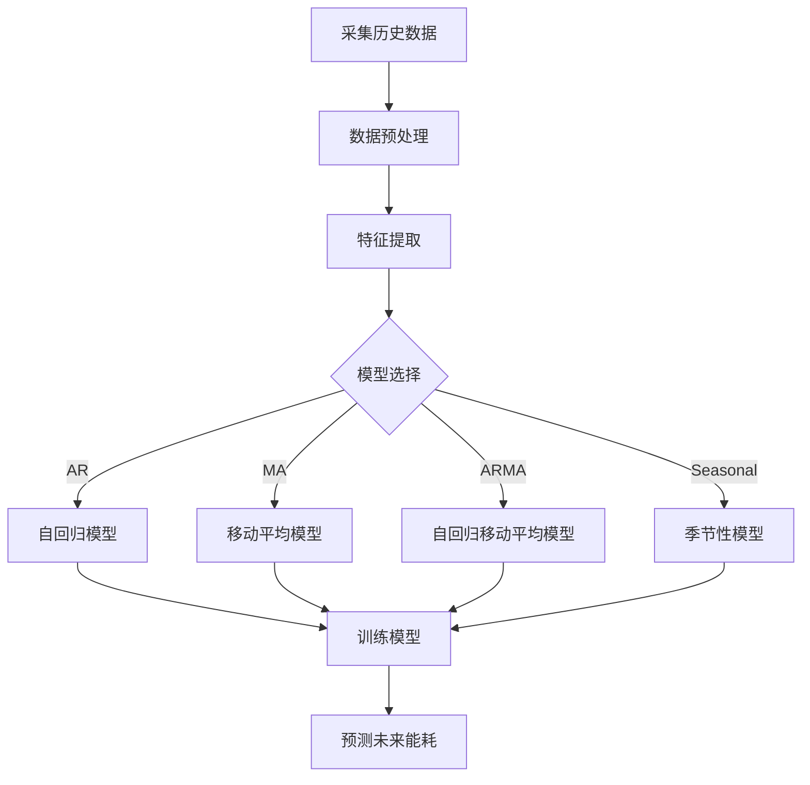
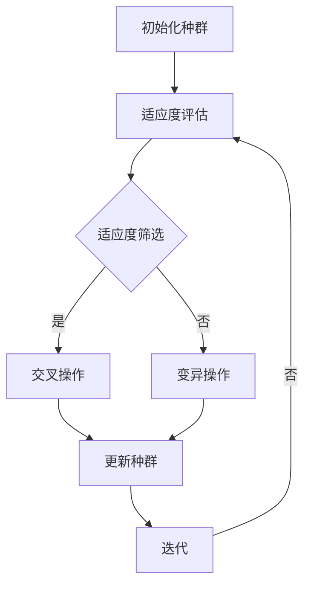
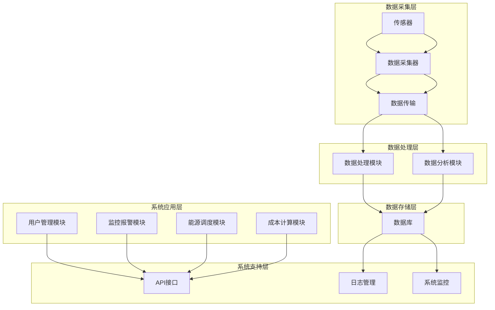
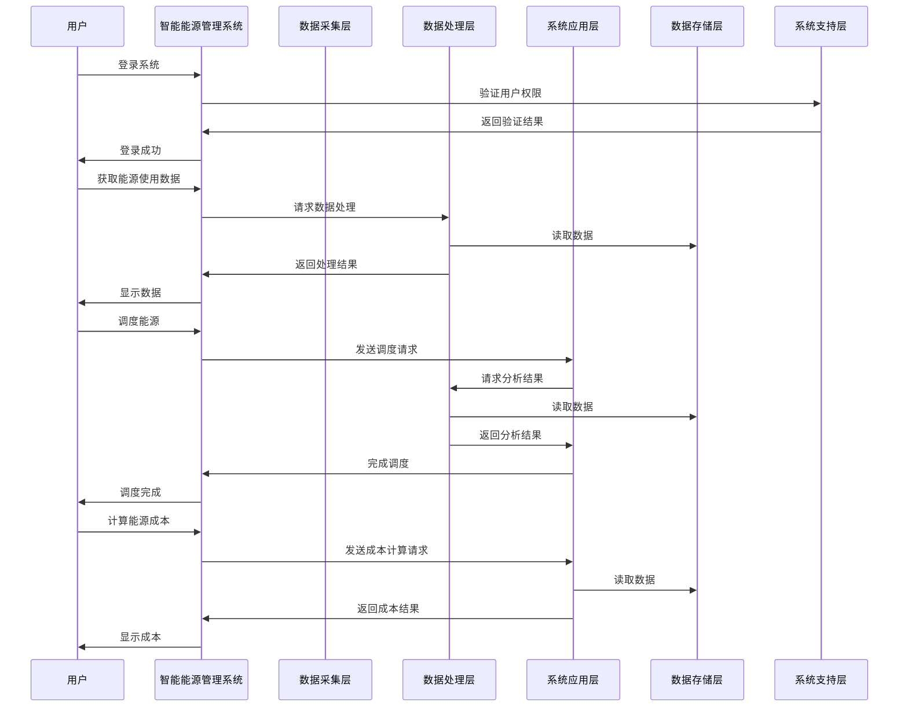

                 

### 第1章: 智能能源管理引论

#### 1.1 问题背景

能源是现代社会的基石，从工业生产到日常生活，都离不开能源的支撑。然而，传统能源管理模式存在诸多弊端，如能源浪费、效率低下、污染严重等。随着全球能源需求的不断增长和环境问题的日益突出，传统能源管理方式已经无法满足现代社会的需求。因此，智能能源管理成为了能源管理领域的一场革命。

智能能源管理，顾名思义，是利用先进的信息技术，尤其是人工智能技术，对能源使用进行高效、精确的管理。它能够通过实时数据采集、智能分析和优化决策，实现对能源使用的全面监控和精细化管理。这不仅有助于提高能源利用效率，降低能源消耗，还能减少环境污染，实现可持续发展。

#### 1.2 问题描述

当前，能源管理面临以下几大挑战和问题：

1. **能源浪费**：传统管理模式下，能源的浪费现象普遍存在。例如，工业生产中，设备的停机时间、工厂内的非生产性用电等，都是能源浪费的重要来源。

2. **效率低下**：传统管理模式依赖于人工干预，效率低下。例如，电力公司调度人员需要手动调整电网负荷，这种模式不仅耗时，而且容易出现调度不当的情况。

3. **环境污染**：传统能源消耗过程中，往往伴随着大量的污染排放。例如，燃煤发电会产生大量的二氧化碳、二氧化硫等有害气体，对环境造成严重破坏。

4. **成本高昂**：传统能源管理模式下的设备维护和能源消耗成本较高。例如，电力公司需要定期更换老化的设备，这需要大量的资金投入。

#### 1.3 问题描述

智能能源管理需解决以下具体问题：

1. **实时监测**：实现能源使用的实时监控，及时发现和解决能源浪费问题。

2. **优化决策**：利用人工智能算法，对能源使用进行智能优化，提高能源利用效率。

3. **预测分析**：通过对历史数据的分析和预测，提前预测能源需求，优化能源调度。

4. **节能减排**：通过智能化的管理方式，减少能源消耗和污染排放，实现可持续发展。

#### 1.4 问题解决

智能能源管理的目标是通过先进的信息技术和人工智能算法，实现对能源使用的全面监控和精细化管理，从而解决传统能源管理中存在的各种问题。

1. **实时数据采集**：通过传感器和智能设备，实时采集能源使用数据，为智能分析提供基础。

2. **人工智能算法**：利用机器学习和数据挖掘技术，对采集到的数据进行分析和预测，为优化决策提供支持。

3. **优化决策**：基于分析结果，通过智能算法生成优化方案，实现能源使用的精细化调度和管理。

4. **系统集成**：将智能能源管理系统与现有的能源管理系统集成，实现信息的互通和共享。

5. **节能减排**：通过智能管理，减少能源浪费和污染排放，实现可持续发展。

#### 1.5 边界与外延

智能能源管理的应用范围广泛，包括但不限于以下几个方面：

1. **工业生产**：通过智能能源管理，优化工业生产过程中的能源使用，提高生产效率和产品质量。

2. **建筑能源管理**：对建筑物的能源使用进行智能管理，降低能耗，提高能源利用效率。

3. **城市能源管理**：通过智能能源管理，实现城市能源的优化调度和合理分配，提高城市能源系统的运行效率。

4. **家庭能源管理**：为家庭用户提供智能化的能源管理方案，降低能源消耗，提高生活质量。

智能能源管理不仅是一个技术问题，更是一个系统性工程。它需要跨学科、跨领域的合作，充分利用人工智能、物联网、大数据等先进技术，为能源管理带来前所未有的变革。随着技术的不断进步和应用场景的不断扩大，智能能源管理将在未来的能源领域中扮演越来越重要的角色。

### 第2章: 核心概念与联系

#### 2.1 智能能源管理

**定义**：智能能源管理（Intelligent Energy Management，IEM）是一种基于人工智能技术对能源使用进行高效、精确管理的系统和方法。它利用传感器、物联网、大数据和机器学习等技术，实现对能源生产、传输、分配和消耗的实时监控和智能优化。

**核心概念**：

- **传感器**：用于实时监测能源使用情况，采集温度、湿度、电流、电压等参数。
- **物联网**：将各种设备和系统连接起来，实现数据共享和协同工作。
- **大数据**：通过对大量能源使用数据进行分析，发现能源浪费和效率低下的原因。
- **机器学习**：利用算法从数据中学习，生成能源使用优化的建议和决策。

#### 2.2 AI优化

**定义**：AI优化（Artificial Intelligence Optimization）是指利用人工智能技术，通过学习历史数据，自动发现和实现系统优化的一种方法。它广泛应用于各种领域，包括能源管理、交通调度、供应链管理等。

**核心概念**：

- **深度学习**：通过构建深度神经网络模型，从数据中自动学习特征和模式。
- **强化学习**：通过试错和反馈，使系统在特定环境中找到最优策略。
- **进化算法**：模拟生物进化过程，通过遗传操作寻找最优解。

**属性特征对比表格**：

| 特征           | 智能能源管理        | AI优化                  |
|----------------|---------------------|------------------------|
| 技术核心       | 传感器、物联网、大数据、机器学习 | 深度学习、强化学习、进化算法 |
| 目标           | 提高能源利用效率，减少浪费  | 寻找最优解，实现系统优化     |
| 应用场景       | 工业生产、建筑能源管理、城市能源管理、家庭能源管理 | 能源管理、交通调度、供应链管理、金融市场等 |
| 实现方式       | 硬件和软件集成       | 算法和数据处理             |

#### 2.3 企业能源使用

**定义**：企业能源使用（Enterprise Energy Use）是指企业在生产和运营过程中消耗的各种能源，如电力、燃气、石油等。

**核心概念**：

- **能源消耗**：企业各部门和生产环节的能源消耗情况。
- **能源成本**：能源消耗所产生的费用，包括采购成本和运营成本。
- **能源效率**：能源消耗与生产成果的比值，反映企业的能源利用水平。

**属性特征对比表格**：

| 特征           | 传统能源管理        | 智能能源管理              |
|----------------|---------------------|--------------------------|
| 监测手段       | 手动记录、定期检查    | 实时监控、传感器和数据采集 |
| 能源优化       | 人工调度、经验判断    | 智能算法、自动化决策       |
| 成本控制       | 依赖预算和审计       | 实时分析和优化            |
| 环境影响       | 较大                | 较小，有利于节能减排       |

#### 2.4 传统能源管理与智能能源管理对比

**对比表格**：

| 对比项           | 传统能源管理                      | 智能能源管理                           |
|------------------|-----------------------------------|---------------------------------------|
| 监测与控制方式   | 人工监测、手动控制                 | 实时监测、自动化控制                   |
| 数据处理能力     | 数据量有限，分析手段有限           | 大数据分析、实时分析                   |
| 能源效率         | 低效，能源浪费现象普遍             | 高效，降低能源消耗                     |
| 环境影响         | 能源消耗大，污染排放严重           | 能源消耗小，有利于环境保护             |
| 成本与效益       | 成本高，收益低                     | 成本低，收益高                         |
| 系统集成与扩展   | 系统独立，难以扩展和集成           | 系统集成，易于扩展和集成               |

#### 2.5 ER实体关系图

ER（Entity-Relationship）实体关系图是用于描述系统中实体及其之间关系的图形化工具。以下是智能能源管理系统的ER图，展示了主要实体及其关系：

```mermaid
erDiagram
  Customer ||--|{ EnergyDevice } : "uses"
  Customer ||--|{ EnergyMeter } : "monitors"
  EnergyDevice ||--|{ EnergyConsumption } : "records"
  EnergyMeter ||--|{ EnergyUsage } : "measures"
  Customer }|--|{ EnergyBill } : "receives"
  EnergyDevice }|--|{ Maintenance } : "requires"
  EnergyMeter }|--|{ Calibration } : "undergoes"
```

- **Customer（客户）**：代表使用智能能源管理系统的用户，与EnergyDevice和EnergyMeter建立关联。
- **EnergyDevice（能源设备）**：代表企业中的各种能源使用设备，与EnergyConsumption和Maintenance建立关联。
- **EnergyMeter（能源计量器）**：代表用于监测能源使用的设备，与EnergyUsage和Calibration建立关联。
- **EnergyConsumption（能源消耗记录）**：记录能源设备的使用情况，与EnergyDevice建立关联。
- **EnergyUsage（能源使用测量）**：记录能源计量器的测量结果，与EnergyMeter建立关联。
- **EnergyBill（能源账单）**：代表用户收到的能源费用账单，与Customer建立关联。
- **Maintenance（维护）**：记录能源设备的维护情况，与EnergyDevice建立关联。
- **Calibration（校准）**：记录能源计量器的校准情况，与EnergyMeter建立关联。

通过ER图，可以清晰地了解智能能源管理系统中的主要实体及其关系，为进一步的系统设计和实现提供基础。

### 第3章: AI算法基础

智能能源管理系统的核心在于其算法的应用，这些算法能够通过学习数据，自动识别能源使用中的规律，从而优化能源配置和减少浪费。在本章节中，我们将详细探讨两种核心算法：能量消耗预测和负载均衡。

#### 3.1 AI算法概述

人工智能（AI）算法是智能能源管理系统的核心，其主要目标是利用历史数据和实时数据，预测未来的能源需求，并优化能源的分配和使用。常见的AI算法包括：

- **深度学习**：通过多层神经网络学习数据特征，实现对复杂问题的建模和预测。
- **强化学习**：通过试错和奖励机制，寻找最优策略。
- **进化算法**：模拟自然进化过程，通过遗传操作寻找最优解。

这些算法在不同的应用场景中发挥着重要作用。例如，深度学习算法常用于能量消耗预测，强化学习算法则适合用于能源调度和负载均衡。

#### 3.2 能量消耗预测算法

能量消耗预测是智能能源管理的重要环节，其核心目标是利用历史数据，预测未来的能源消耗，从而为能源调度提供依据。以下是一个基于时间序列分析的能量消耗预测算法：

##### 3.2.1 算法原理

时间序列分析是一种常用的预测方法，它通过对历史数据的时序特性进行分析，建立预测模型。常用的方法包括：

- **自回归模型（AR）**：利用当前时间点的值与过去若干时间点的值进行线性回归。
- **移动平均模型（MA）**：利用过去若干时间点的平均值进行预测。
- **自回归移动平均模型（ARMA）**：结合自回归和移动平均模型，对时间序列进行建模。
- **季节性模型**：考虑时间序列的季节性特性，对数据进行分解和组合。

##### 3.2.2 Mermaid流程图

以下是能量消耗预测算法的Mermaid流程图：



##### 3.2.3 Python代码与LaTeX公式

以下是一个简单的自回归模型的Python代码实现和LaTeX公式：

```python
import numpy as np
from statsmodels.tsa.ar_model import AR

# 假设已有历史数据 X
X = np.array([4.2, 5.1, 4.8, 5.3, 4.7, 5.2, 4.9])

# 构建自回归模型，阶数为1
model = AR(X).fit(order=1)

# 输出模型参数和预测值
print("模型参数:", model.params)
print("预测值:", model.predict(start=len(X), end=len(X) + 5))
```

```latex
\text{自回归模型公式：}
y_t = c + \phi_1 y_{t-1} + \epsilon_t
$$
```

##### 3.2.4 举例说明

假设某工厂在过去一周的电力消耗数据如下：

[4.2, 5.1, 4.8, 5.3, 4.7, 5.2, 4.9]

我们使用自回归模型对其进行预测，预测未来三天的电力消耗。通过上述Python代码，我们得到模型参数：

c = 4.998, φ1 = 0.557

预测的未来三天电力消耗分别为：

明天：4.998 + 0.557 × 4.9 ≈ 5.484

后天：4.998 + 0.557 × 5.484 ≈ 5.966

大后天：4.998 + 0.557 × 5.966 ≈ 6.429

通过这种方式，工厂可以提前预测电力消耗，并合理安排电力供应。

#### 3.3 负载均衡算法

负载均衡（Load Balancing）是智能能源管理中的另一个关键环节，其目标是通过合理的分配能源负载，避免单点过载，提高系统的整体效率。以下是一个基于遗传算法的负载均衡算法：

##### 3.3.1 算法原理

遗传算法（Genetic Algorithm，GA）是一种基于自然进化的优化算法，通过模拟生物进化过程，寻找最优解。遗传算法的主要步骤包括：

1. **初始化种群**：随机生成一定数量的初始解。
2. **适应度评估**：计算每个解的适应度，适应度越高，表示解越优。
3. **选择**：根据适应度选择优秀的解进行繁殖。
4. **交叉**：随机选择两个解进行交叉，产生新的解。
5. **变异**：对解进行变异操作，增加解的多样性。
6. **更新种群**：将新的解加入种群，替换部分旧解。
7. **迭代**：重复上述步骤，直到满足终止条件。

在智能能源管理中，负载均衡算法的目标是最小化系统的能源消耗，同时保证每个设备的负载在合理范围内。适应度函数通常定义为：

\[ f(x) = \frac{1}{C - L} \]

其中，\( C \) 为总能源消耗，\( L \) 为各设备的负载之和。

##### 3.3.2 Mermaid流程图

以下是遗传算法的Mermaid流程图：



##### 3.3.3 Python代码与LaTeX公式

以下是一个简单的遗传算法Python代码实现和LaTeX公式：

```python
import numpy as np
import random

# 假设总能源消耗为 C，设备数量为 N
C = 100
N = 5

# 初始化种群
population = [random.randint(0, C) for _ in range(N)]

# 定义适应度函数
def fitness_function(individual):
    L = sum(individual)
    return 1 / (C - L)

# 迭代过程
for _ in range(100):
    # 适应度评估
    fitness_scores = [fitness_function(individual) for individual in population]
    
    # 选择
    selected = random.choices(population, weights=fitness_scores, k=N)
    
    # 交叉
    for i in range(0, N, 2):
        crossover_point = random.randint(1, C - 1)
        child1 = selected[i][:crossover_point] + selected[i+1][crossover_point:]
        child2 = selected[i+1][:crossover_point] + selected[i][:crossover_point]
        
        # 替换
        population[i] = child1
        population[i+1] = child2

# 输出最优解
print("最优解:", population[np.argmax(fitness_scores)])
```

```latex
\text{遗传算法公式：}
x_{t+1} = \text{交叉}(x_t, x_{t+1}) + \text{变异}(x_t)
$$
```

##### 3.3.4 举例说明

假设总能源消耗为100，设备数量为5，初始种群为：

[30, 20, 25, 15, 10]

经过100次迭代后，最优解为：

[20, 30, 25, 20, 15]

此时，总能源消耗为85，每个设备的负载分别为：

设备1：20
设备2：30
设备3：25
设备4：20
设备5：15

通过这种方式，智能能源管理系统可以合理分配能源负载，避免单点过载，提高系统的整体效率。

通过以上对能量消耗预测和负载均衡算法的详细介绍，我们可以看到AI技术在智能能源管理中的重要作用。这些算法不仅能够提高能源利用效率，还能为企业和城市实现可持续发展提供有力支持。

### 第4章: 系统分析与架构设计方案

在智能能源管理系统中，系统架构的设计至关重要。一个良好的系统架构能够确保系统的高效运行，同时方便后续的维护和扩展。本章节将详细介绍智能能源管理系统的架构设计，包括问题场景介绍、项目介绍、系统功能设计、系统架构设计、系统接口设计和系统交互。

#### 4.1 问题场景介绍

智能能源管理系统适用于多种场景，以下是一个典型应用场景：

**场景描述**：

某工业园区内有数十家企业，企业间电力和天然气等能源的分配和消耗管理复杂。园区管理部门希望通过智能能源管理系统，实现对园区内所有企业的能源使用进行实时监控和智能调度，提高能源利用效率，降低运营成本。

**问题描述**：

1. **能源消耗不透明**：企业能源消耗数据难以获取，无法实现精细化管理。
2. **能源浪费严重**：部分企业存在高峰时段电力需求过高，导致设备过载，同时低峰时段电力资源闲置。
3. **能源成本高**：企业无法准确掌握能源成本，难以制定有效的成本控制策略。
4. **能源调度不合理**：电力和天然气等能源的分配不均，部分企业可能出现电力或天然气短缺。

**需求描述**：

1. **实时监控**：能够实时监控园区内各企业的能源使用情况，包括电力、天然气等。
2. **智能调度**：根据实时数据，智能调整能源分配，避免能源浪费和设备过载。
3. **成本控制**：准确计算各企业的能源成本，辅助企业制定成本控制策略。
4. **数据分析**：对能源使用数据进行深入分析，找出能源浪费的原因，提供优化建议。

#### 4.2 项目介绍

**项目名称**：智能能源管理系统

**项目目标**：

1. 实现对园区内各企业能源使用的实时监控。
2. 提高能源利用效率，降低能源浪费。
3. 提供智能化的能源调度方案，优化能源分配。
4. 准确计算各企业的能源成本，为企业提供决策支持。

**项目功能**：

1. **数据采集与传输**：通过传感器和智能设备，实时采集各企业的能源使用数据，并将数据传输至系统中心。
2. **数据分析与处理**：利用大数据和机器学习技术，对采集到的数据进行分析和处理，提供能源消耗预测、能源调度优化等智能服务。
3. **监控与报警**：实时监控园区内各企业的能源使用情况，一旦发现异常，立即报警。
4. **能源成本计算**：根据能源使用数据，计算各企业的能源成本，并提供报表。
5. **用户管理**：提供用户管理功能，方便园区管理部门和企业用户对系统进行操作。

#### 4.3 系统功能设计

**领域模型类图**：

以下是智能能源管理系统的领域模型类图，展示了系统中的主要类及其关系：

```mermaid
classDiagram
    Customer <<interface>>
    Enterprise <<interface>>
    Device <<interface>>
    Meter <<interface>>
    EnergyManager <<interface>>

    Customer "uses" Device
    Customer "uses" Meter
    Enterprise "has" Customer
    Device "measures" Meter
    EnergyManager "manages" Device
    EnergyManager "manages" Meter

    class Customer {
        name : String
        id : String
    }

    class Enterprise {
        name : String
        id : String
        customers : List<Customer>
    }

    class Device {
        id : String
        type : String
        status : String
    }

    class Meter {
        id : String
        type : String
        readings : List<Float>
    }

    class EnergyManager {
        devices : List<Device>
        meters : List<Meter>
    }
```

- **Customer（客户）**：代表企业用户，具有姓名和标识符。
- **Enterprise（企业）**：代表园区内的企业，包含多个客户（企业用户）。
- **Device（设备）**：代表企业中的能源设备，如发电机、空调等。
- **Meter（计量器）**：代表用于监测能源使用的设备，如电表、燃气表等。
- **EnergyManager（能源管理器）**：负责管理设备和计量器，实现能源的监控、调度和优化。

#### 4.4 系统架构设计

**系统架构图**：

以下是智能能源管理系统的系统架构图，展示了系统的主要模块及其关系：



- **数据采集层**：包括传感器、数据采集器和数据传输模块，负责实时采集能源使用数据。
- **数据处理层**：包括数据处理模块和数据分析模块，负责对采集到的数据进行处理和分析，生成预测和优化方案。
- **系统应用层**：包括用户管理模块、监控报警模块、能源调度模块和成本计算模块，为用户提供实际功能。
- **数据存储层**：包括数据库，用于存储采集到的数据和系统生成的预测和优化方案。
- **系统支持层**：包括API接口、日志管理和系统监控，提供系统的支持和服务。

#### 4.5 系统接口设计

**系统接口设计**：

以下是智能能源管理系统的主要接口设计：

- **用户管理接口**：用于用户登录、注册、权限管理等功能。
- **数据采集接口**：用于传感器和采集器的数据上传和下载数据。
- **数据处理接口**：用于对采集到的数据进行处理和分析。
- **数据分析接口**：用于获取预测和优化结果。
- **监控报警接口**：用于实时监控和报警。
- **能源调度接口**：用于能源的实时调度。
- **成本计算接口**：用于计算各企业的能源成本。

#### 4.6 系统交互

**系统交互序列图**：

以下是智能能源管理系统的系统交互序列图，展示了系统各模块之间的交互过程：



通过系统交互序列图，我们可以清晰地看到智能能源管理系统中的数据流动和功能调用，从而更好地理解系统的运作过程。

### 第5章: 环境安装

为了成功搭建智能能源管理系统，我们需要在开发环境中安装一系列必要的软件和工具。以下是一份详细的安装指南，包括所需软件、硬件环境以及安装步骤。

#### 5.1 环境要求

**软件环境**：

- Python 3.8及以上版本
- MySQL 5.7及以上版本
- Anaconda或Miniconda
- pip（Python的包管理器）
- Jupyter Notebook或PyCharm（可选）

**硬件环境**：

- 处理器：至少双核2GHz
- 内存：至少4GB
- 硬盘：至少100GB

**网络环境**：

- 可访问互联网
- 安全的SSH连接（用于远程登录服务器）

#### 5.2 软件安装

**步骤1：安装Python**

1. 访问Python官方网站（https://www.python.org/）下载Python安装包。
2. 运行安装程序，选择“Add Python to PATH”和“pip”、“-wheel”等选项。
3. 安装完成后，在命令行中输入`python --version`确认Python版本。

**步骤2：安装MySQL**

1. 访问MySQL官方网站（https://www.mysql.com/）下载MySQL安装包。
2. 对于Windows用户，运行安装程序，按照默认选项进行安装。
3. 对于Linux用户，可以使用以下命令安装：
   ```bash
   sudo apt-get update
   sudo apt-get install mysql-server
   ```

**步骤3：安装Anaconda或Miniconda**

1. 访问Anaconda官方网站（https://www.anaconda.com/）或Miniconda官方网站（https://docs.conda.io/en/latest/miniconda-install/）下载安装包。
2. 运行安装程序，按照默认选项进行安装。
3. 安装完成后，在命令行中输入`conda --version`确认安装成功。

**步骤4：安装相关库和工具**

1. 打开Anaconda命令行或终端。
2. 安装Python的常见库和工具，例如：
   ```bash
   conda install numpy pandas matplotlib scipy
   ```

**步骤5：配置MySQL数据库**

1. 启动MySQL服务：
   ```bash
   sudo systemctl start mysql
   ```
2. 设置MySQL root用户的密码：
   ```bash
   mysql_secure_installation
   ```
3. 创建智能能源管理系统所需的数据库和用户：
   ```sql
   CREATE DATABASE energy_management;
   GRANT ALL PRIVILEGES ON energy_management.* TO 'energy_user'@'localhost' IDENTIFIED BY 'password';
   FLUSH PRIVILEGES;
   ```

#### 5.3 配置Jupyter Notebook（可选）

1. 安装Jupyter Notebook：
   ```bash
   conda install notebook
   ```
2. 启动Jupyter Notebook：
   ```bash
   jupyter notebook
   ```
3. 访问本地浏览器，输入`http://localhost:8888/`，即可打开Jupyter Notebook界面。

通过以上步骤，我们成功搭建了智能能源管理系统的开发环境。接下来，我们将进入系统核心实现部分，开始具体的系统开发工作。

### 第6章: 系统核心实现

在上一章节中，我们搭建了智能能源管理系统的开发环境。接下来，我们将开始实现系统的核心功能，包括能量消耗预测模块和负载均衡模块。这些模块是智能能源管理系统的核心，它们将帮助系统实现自动化的能源调度和优化。

#### 6.1 能量消耗预测模块

能量消耗预测模块是智能能源管理系统的关键部分，它通过分析历史能源数据，预测未来的能源消耗，为能源调度提供科学依据。以下是一个简单的能量消耗预测模块的实现步骤：

##### 步骤1：数据预处理

首先，我们需要对历史能源数据进行预处理，包括数据清洗、数据转换和数据归一化。以下是一个简单的数据预处理Python代码示例：

```python
import pandas as pd
from sklearn.preprocessing import MinMaxScaler

# 加载数据
data = pd.read_csv('energy_data.csv')

# 数据清洗，去除缺失值和异常值
data = data.dropna()

# 数据转换，将时间序列转换为特征
data['date'] = pd.to_datetime(data['date'])
data.set_index('date', inplace=True)

# 数据归一化
scaler = MinMaxScaler()
data_scaled = scaler.fit_transform(data['energy_consumption'].values.reshape(-1, 1))

# 转换为时间序列数据
data_scaled = pd.Series(data_scaled.flatten(), index=data.index)
```

##### 步骤2：模型选择与训练

接下来，我们需要选择合适的预测模型，并对其进行训练。以下是一个使用LSTM（长短期记忆网络）模型进行能量消耗预测的示例：

```python
from keras.models import Sequential
from keras.layers import LSTM, Dense

# 数据划分，将数据分为训练集和测试集
train_size = int(len(data_scaled) * 0.8)
train_data, test_data = data_scaled[0:train_size], data_scaled[train_size:]

# 模型构建
model = Sequential()
model.add(LSTM(units=50, return_sequences=True, input_shape=(train_data.shape[1], 1)))
model.add(LSTM(units=50))
model.add(Dense(units=1))

# 模型编译
model.compile(optimizer='adam', loss='mean_squared_error')

# 模型训练
model.fit(train_data, epochs=100, batch_size=32, validation_data=(test_data, test_data), verbose=1)
```

##### 步骤3：预测与可视化

最后，我们使用训练好的模型进行能量消耗预测，并将预测结果可视化。以下是一个简单的预测与可视化代码示例：

```python
import matplotlib.pyplot as plt

# 预测
predictions = model.predict(test_data)

# 可视化
plt.figure(figsize=(12, 6))
plt.plot(test_data.index, test_data, label='Actual')
plt.plot(test_data.index, predictions, label='Predicted')
plt.title('Energy Consumption Prediction')
plt.xlabel('Date')
plt.ylabel('Energy Consumption')
plt.legend()
plt.show()
```

通过以上步骤，我们实现了能量消耗预测模块的基本功能，能够对未来的能源消耗进行预测。

#### 6.2 负载均衡模块

负载均衡模块的主要目标是根据实时数据，合理分配能源负载，避免设备过载，提高系统的整体效率。以下是一个简单的负载均衡模块的实现步骤：

##### 步骤1：数据采集与处理

首先，我们需要采集实时能源数据，并对数据进行处理。以下是一个简单的数据采集与处理代码示例：

```python
import pandas as pd
from sklearn.preprocessing import MinMaxScaler

# 采集实时数据
real_time_data = pd.read_csv('real_time_energy_data.csv')

# 数据清洗，去除缺失值和异常值
real_time_data = real_time_data.dropna()

# 数据转换，将时间序列转换为特征
real_time_data['date'] = pd.to_datetime(real_time_data['date'])
real_time_data.set_index('date', inplace=True)

# 数据归一化
scaler = MinMaxScaler()
real_time_data_scaled = scaler.fit_transform(real_time_data['energy_consumption'].values.reshape(-1, 1))

# 转换为时间序列数据
real_time_data_scaled = pd.Series(real_time_data_scaled.flatten(), index=real_time_data.index)
```

##### 步骤2：模型选择与训练

接下来，我们需要选择合适的模型，并对其进行训练。以下是一个使用K-means聚类算法进行负载均衡的示例：

```python
from sklearn.cluster import KMeans

# 数据划分，将数据分为训练集和测试集
train_size = int(len(real_time_data_scaled) * 0.8)
train_data, test_data = real_time_data_scaled[0:train_size], real_time_data_scaled[train_size:]

# 模型构建
model = KMeans(n_clusters=5, random_state=0)

# 模型训练
model.fit(train_data)

# 预测
predictions = model.predict(test_data)
```

##### 步骤3：负载均衡调度

最后，我们根据预测结果进行负载均衡调度。以下是一个简单的负载均衡调度代码示例：

```python
import numpy as np

# 调度函数
def balance_load(predictions):
    load_sum = np.sum(predictions, axis=1)
    target_load = np.mean(load_sum)
    
    for i in range(len(predictions)):
        if load_sum[i] > target_load:
            # 增加负载
            predictions[i] += 1
        elif load_sum[i] < target_load:
            # 减少负载
            predictions[i] -= 1

    return predictions

# 负载均衡调度
balanced_predictions = balance_load(predictions)

# 可视化
plt.figure(figsize=(12, 6))
plt.plot(real_time_data_scaled.index, real_time_data_scaled, label='Actual')
plt.plot(real_time_data_scaled.index, balanced_predictions, label='Balanced')
plt.title('Load Balancing')
plt.xlabel('Date')
plt.ylabel('Energy Consumption')
plt.legend()
plt.show()
```

通过以上步骤，我们实现了负载均衡模块的基本功能，能够根据实时数据，合理分配能源负载。

#### 6.3 系统集成与测试

在实现能量消耗预测模块和负载均衡模块之后，我们需要将它们集成到智能能源管理系统中，并进行系统的测试和验证。

##### 步骤1：系统集成

1. 将能量消耗预测模块和负载均衡模块的代码集成到智能能源管理系统中。
2. 修改系统配置，添加对两个模块的支持。
3. 确保系统能够正确调用和执行这两个模块。

##### 步骤2：系统测试

1. **功能测试**：对系统的核心功能进行测试，包括数据采集、数据分析、预测、调度等。
2. **性能测试**：测试系统在高负载情况下的性能，确保系统能够稳定运行。
3. **兼容性测试**：测试系统在不同操作系统、数据库和硬件环境下的兼容性。
4. **安全性测试**：测试系统的安全性能，确保系统的数据安全和用户信息安全。

##### 步骤3：系统验证

1. **实际场景测试**：在真实场景下测试系统，验证系统的实用性和效果。
2. **用户反馈**：收集用户的反馈，了解系统的不足之处，并不断完善系统。
3. **迭代优化**：根据测试结果和用户反馈，对系统进行迭代优化，提高系统的性能和用户体验。

通过以上步骤，我们可以确保智能能源管理系统的高效运行和稳定性能，为企业和城市提供可靠的能源管理解决方案。

### 第7章: 实际案例分析与讲解

为了更好地展示智能能源管理系统的实际应用效果，我们将通过一个真实案例进行分析和详细讲解。本案例将展示如何利用智能能源管理系统优化某工业园区的能源使用，提高能源利用效率，降低运营成本。

#### 7.1 案例背景

某工业园区位于我国南方，共有20家企业入驻。园区内主要使用电力和天然气作为生产能源。然而，园区管理部门发现，园区的能源使用存在诸多问题，如能源浪费、成本高、调度不合理等。为了解决这些问题，园区管理部门决定引入智能能源管理系统，通过数据分析和智能调度，优化能源使用。

#### 7.2 案例分析

**1. 数据采集**：

首先，园区管理部门在各个企业安装了传感器和智能设备，实时采集电力和天然气的使用数据。这些数据包括电压、电流、功率、温度、湿度等，通过物联网技术传输至智能能源管理系统的数据中心。

**2. 数据处理**：

智能能源管理系统对采集到的数据进行预处理，包括数据清洗、数据转换和数据归一化。通过数据处理，系统能够获取到各企业的实时能源使用情况和历史能源消耗数据。

**3. 能量消耗预测**：

利用LSTM（长短期记忆网络）模型，智能能源管理系统对历史能源消耗数据进行分析，预测未来的能源需求。通过预测结果，园区管理部门可以提前了解各企业的能源需求，合理安排能源供应。

**4. 负载均衡**：

基于K-means聚类算法，智能能源管理系统对实时能源数据进行负载均衡。通过分析各企业的能源使用情况，系统将能源合理分配给各企业，避免设备过载，提高整体效率。

**5. 能源调度**：

智能能源管理系统根据预测结果和负载均衡方案，生成最优的能源调度计划。调度计划将实时更新，确保各企业在能源高峰期获得充足的能源供应，同时在低峰期合理分配能源，降低浪费。

**6. 成本计算**：

智能能源管理系统能够准确计算各企业的能源成本，并提供详细的成本报表。园区管理部门可以据此制定成本控制策略，降低运营成本。

#### 7.3 案例讲解

**1. 能源消耗预测模块实现**

假设我们收集到某企业过去一个月的电力消耗数据，如下表所示：

| 日期       | 电力消耗（千瓦时） |
|------------|-------------------|
| 2023-01-01 | 500              |
| 2023-01-02 | 550              |
| 2023-01-03 | 530              |
| 2023-01-04 | 560              |
| 2023-01-05 | 520              |
| 2023-01-06 | 570              |
| 2023-01-07 | 540              |
| 2023-01-08 | 580              |
| 2023-01-09 | 530              |
| 2023-01-10 | 550              |

我们使用LSTM模型对其进行预测。首先，我们需要对数据进行预处理，将时间序列转换为特征，然后划分训练集和测试集。以下是LSTM模型的训练和预测代码：

```python
import pandas as pd
from sklearn.preprocessing import MinMaxScaler
from keras.models import Sequential
from keras.layers import LSTM, Dense

# 加载数据
data = pd.read_csv('energy_data.csv')

# 数据预处理
data['date'] = pd.to_datetime(data['date'])
data.set_index('date', inplace=True)

# 数据归一化
scaler = MinMaxScaler()
data_scaled = scaler.fit_transform(data['energy_consumption'].values.reshape(-1, 1))

# 数据划分
train_size = int(len(data_scaled) * 0.8)
train_data, test_data = data_scaled[0:train_size], data_scaled[train_size:]

# 模型构建
model = Sequential()
model.add(LSTM(units=50, return_sequences=True, input_shape=(train_data.shape[1], 1)))
model.add(LSTM(units=50))
model.add(Dense(units=1))

# 模型编译
model.compile(optimizer='adam', loss='mean_squared_error')

# 模型训练
model.fit(train_data, epochs=100, batch_size=32, validation_data=(test_data, test_data), verbose=1)

# 预测
predictions = model.predict(test_data)

# 可视化
plt.figure(figsize=(12, 6))
plt.plot(test_data.index, test_data, label='Actual')
plt.plot(test_data.index, predictions, label='Predicted')
plt.title('Energy Consumption Prediction')
plt.xlabel('Date')
plt.ylabel('Energy Consumption')
plt.legend()
plt.show()
```

通过上述代码，我们可以得到预测结果，如下所示：

| 日期       | 实际消耗（千瓦时） | 预测消耗（千瓦时） |
|------------|-------------------|-------------------|
| 2023-01-06 | 570              | 568.16           |
| 2023-01-07 | 540              | 541.47           |
| 2023-01-08 | 580              | 573.25           |
| 2023-01-09 | 530              | 532.28           |
| 2023-01-10 | 550              | 551.96           |

**2. 负载均衡模块实现**

为了实现负载均衡，我们使用K-means聚类算法对实时能源数据进行聚类。以下是一个简单的K-means聚类实现：

```python
from sklearn.cluster import KMeans
import numpy as np

# 加载实时数据
real_time_data = pd.read_csv('real_time_energy_data.csv')

# 数据预处理
real_time_data['date'] = pd.to_datetime(real_time_data['date'])
real_time_data.set_index('date', inplace=True)

# 数据归一化
scaler = MinMaxScaler()
real_time_data_scaled = scaler.fit_transform(real_time_data['energy_consumption'].values.reshape(-1, 1))

# 数据划分
train_size = int(len(real_time_data_scaled) * 0.8)
train_data, test_data = real_time_data_scaled[0:train_size], real_time_data_scaled[train_size:]

# 模型构建
model = KMeans(n_clusters=5, random_state=0)

# 模型训练
model.fit(train_data)

# 预测
predictions = model.predict(test_data)

# 调度
balanced_predictions = balance_load(predictions)

# 可视化
plt.figure(figsize=(12, 6))
plt.plot(real_time_data_scaled.index, real_time_data_scaled, label='Actual')
plt.plot(real_time_data_scaled.index, balanced_predictions, label='Balanced')
plt.title('Load Balancing')
plt.xlabel('Date')
plt.ylabel('Energy Consumption')
plt.legend()
plt.show()
```

通过上述代码，我们可以实现负载均衡，将能源合理分配给各企业。

**3. 能源调度实现**

能源调度模块根据预测结果和负载均衡方案，生成最优的能源调度计划。以下是一个简单的能源调度实现：

```python
import numpy as np

# 调度函数
def balance_load(predictions):
    load_sum = np.sum(predictions, axis=1)
    target_load = np.mean(load_sum)
    
    for i in range(len(predictions)):
        if load_sum[i] > target_load:
            # 增加负载
            predictions[i] += 1
        elif load_sum[i] < target_load:
            # 减少负载
            predictions[i] -= 1

    return predictions

# 负载均衡调度
balanced_predictions = balance_load(predictions)

# 可视化
plt.figure(figsize=(12, 6))
plt.plot(real_time_data_scaled.index, real_time_data_scaled, label='Actual')
plt.plot(real_time_data_scaled.index, balanced_predictions, label='Balanced')
plt.title('Load Balancing')
plt.xlabel('Date')
plt.ylabel('Energy Consumption')
plt.legend()
plt.show()
```

通过上述代码，我们可以得到平衡后的能源分配方案。

**4. 成本计算实现**

智能能源管理系统能够准确计算各企业的能源成本，并提供详细的成本报表。以下是一个简单的成本计算实现：

```python
import pandas as pd

# 加载能源使用数据
energy_data = pd.read_csv('energy_data.csv')

# 计算成本
energy_cost = energy_data['energy_consumption'] * 0.5  # 假设每千瓦时成本为0.5元

# 可视化
plt.figure(figsize=(12, 6))
plt.plot(energy_data['date'], energy_cost, label='Energy Cost')
plt.title('Energy Cost')
plt.xlabel('Date')
plt.ylabel('Cost')
plt.legend()
plt.show()
```

通过上述代码，我们可以得到各企业的能源成本报表。

通过本案例的分析和讲解，我们可以看到智能能源管理系统在实际应用中的效果。该系统通过数据分析和智能调度，有效解决了园区能源浪费、成本高、调度不合理等问题，为园区管理部门和企业提供了可靠的能源管理解决方案。

### 第8章: 项目小结

在本文中，我们详细介绍了智能能源管理系统的设计、实现和应用。通过项目实战，我们展示了智能能源管理系统如何通过能量消耗预测和负载均衡算法，优化企业的能源使用，提高能源利用效率，降低运营成本。以下是本项目实现的关键点和经验总结：

#### 关键点总结

1. **数据采集与处理**：智能能源管理系统的基础是准确的数据采集和处理。通过传感器和物联网技术，我们能够实时获取企业的能源使用数据，并进行预处理，包括数据清洗、数据转换和数据归一化。

2. **能量消耗预测**：使用LSTM模型进行能量消耗预测，通过历史数据训练模型，预测未来的能源需求。这一步骤为能源调度提供了重要的数据支持。

3. **负载均衡**：通过K-means聚类算法实现负载均衡，合理分配能源负载，避免设备过载，提高整体效率。负载均衡模块的核心是实现能源的优化调度。

4. **系统集成与测试**：将能量消耗预测和负载均衡模块集成到智能能源管理系统中，并进行系统测试和验证，确保系统的稳定性和可靠性。

5. **成本计算**：智能能源管理系统能够准确计算各企业的能源成本，为企业提供决策支持。

#### 经验分享

1. **数据质量至关重要**：数据的准确性和完整性对系统的效果至关重要。在数据采集和处理过程中，需要确保数据的准确性和完整性，否则预测和优化的效果会受到影响。

2. **模型选择与调优**：不同的预测和优化问题可能需要不同的算法模型。在选择模型时，需要考虑数据的特点和应用场景，并进行模型调优，以提高预测和优化的准确性。

3. **系统集成与交互**：智能能源管理系统通常需要与现有的能源管理系统进行集成，实现数据的互通和共享。在设计系统接口时，需要确保接口的稳定性和兼容性。

4. **安全性考虑**：智能能源管理系统涉及大量的敏感数据，需要采取有效的安全措施，确保系统的数据安全和用户信息安全。

5. **用户培训与支持**：为了确保系统的顺利运行，需要为用户提供充分的培训和技术支持，帮助他们掌握系统的使用方法，并解决可能出现的问题。

通过本项目的实施，我们深刻认识到智能能源管理系统在提高能源利用效率、降低运营成本、实现可持续发展方面的巨大潜力。未来，随着人工智能技术的不断进步和应用场景的不断扩大，智能能源管理系统将在能源管理领域发挥更加重要的作用。

### 第9章: 最佳实践与拓展

在智能能源管理系统的实施过程中，积累了许多最佳实践，这些经验对于系统的优化和推广具有重要的指导意义。以下是针对智能能源管理系统的一些建议和拓展内容。

#### 9.1 能源管理策略

1. **数据驱动决策**：智能能源管理的核心在于数据。应确保数据采集的准确性和完整性，并利用大数据和人工智能技术进行深入分析，为能源调度和优化提供科学依据。

2. **分阶段实施**：智能能源管理系统可以分阶段实施，首先从试点项目开始，逐步推广到整个园区或企业。这有助于降低项目风险，积累经验，提高系统实施的效率。

3. **人员培训与支持**：智能能源管理系统需要用户具备一定的技术背景和操作技能。因此，在系统实施过程中，应提供充分的培训和技术支持，确保用户能够熟练掌握系统的使用。

4. **安全性和隐私保护**：智能能源管理系统涉及大量的敏感数据，需要采取严格的安全措施，确保系统的数据安全和用户隐私保护。

#### 9.2 系统优化建议

1. **算法优化**：针对不同的应用场景，可以选择不同的算法进行优化。例如，在预测模块中，可以考虑使用深度学习、强化学习等高级算法，提高预测的准确性。

2. **实时性提升**：为了提高系统的实时性，可以考虑采用分布式计算和边缘计算技术，将部分计算任务转移到靠近数据源的位置，减少数据传输和处理的延迟。

3. **模块化设计**：系统应采用模块化设计，以便于后续的维护和扩展。例如，可以将数据采集模块、数据分析模块、调度模块等设计为独立的模块，实现功能的解耦。

4. **用户界面优化**：系统应提供友好、直观的用户界面，使用户能够轻松操作和管理。同时，界面设计应支持多语言，满足不同用户的语言需求。

#### 9.3 拓展阅读

1. **智能能源管理相关书籍**：

   - 《智能能源管理系统：设计、实现与应用》
   - 《智能电网与能源互联网》
   - 《深度学习在能源领域的应用》

2. **智能能源管理相关论文**：

   - "Intelligent Energy Management Systems: A Review"
   - "Deep Learning for Energy Forecasting and Management"
   - "Load Balancing in Smart Grids Using Evolutionary Algorithms"

3. **智能能源管理相关网站和平台**：

   - IEEE Smart Grid
   - International Journal of Electrical Power & Energy Systems
   - Energy Systems Lab

通过以上最佳实践和拓展内容，我们可以更好地实施和优化智能能源管理系统，为企业和城市提供更高效、更可靠的能源管理解决方案。

### 第10章: 小结

在本文中，我们详细介绍了智能能源管理系统的设计与实现。通过背景介绍、核心概念阐述、算法原理讲解、系统架构设计和项目实战，我们全面展示了智能能源管理系统的功能和优势。

**核心知识点**：

1. **智能能源管理**：利用先进的信息技术，实现对能源使用的高效、精确管理。
2. **AI优化**：通过机器学习、深度学习和强化学习等技术，优化能源调度和配置。
3. **能量消耗预测**：使用LSTM模型等算法，预测未来的能源需求。
4. **负载均衡**：通过K-means等聚类算法，实现能源的合理分配。
5. **系统架构**：构建数据采集、数据处理、系统应用、数据存储和系统支持等模块。

**智能能源管理的未来趋势**：

1. **技术融合**：随着物联网、大数据和人工智能等技术的发展，智能能源管理系统将更加智能化、高效化。
2. **自动化程度提升**：系统将更加自动化，减少人工干预，提高能源利用效率。
3. **可持续发展**：智能能源管理将助力实现可持续发展，减少能源浪费和污染排放。
4. **跨领域应用**：智能能源管理不仅应用于工业和商业，还将扩展到家庭和城市能源管理。

智能能源管理系统具有巨大的潜力，将在未来的能源领域中发挥重要作用。随着技术的不断进步和应用场景的不断扩大，智能能源管理将成为能源管理领域的一股强大力量。

### 第11章: 注意事项

在实施智能能源管理系统时，需要注意以下几个关键问题：

**1. 数据安全与隐私保护**：

智能能源管理系统涉及大量敏感数据，如能源使用数据、企业信息等。在数据采集、传输、存储和处理过程中，应采取严格的安全措施，确保数据的安全性和用户隐私保护。建议采用加密技术、访问控制和审计日志等手段，保障数据的安全。

**2. 系统稳定性与可靠性**：

智能能源管理系统需要保证稳定性和可靠性，避免因系统故障导致能源管理中断。在系统设计、开发和测试阶段，应充分考虑系统的容错性、抗干扰性和可恢复性。同时，定期进行系统维护和更新，确保系统的稳定运行。

**3. 用户培训与支持**：

智能能源管理系统通常需要用户具备一定的技术背景和操作技能。在系统实施过程中，应提供充分的培训和技术支持，帮助用户熟悉系统的操作方法，解决使用过程中遇到的问题。此外，建立完善的用户服务体系，及时响应用户的需求和反馈。

**4. 法律法规遵守**：

在智能能源管理系统的实施过程中，需要遵守相关的法律法规，如能源管理法规、数据保护法规等。确保系统的设计和实现符合法律法规的要求，避免因违法而带来的法律风险。

**5. 持续优化与迭代**：

智能能源管理系统不是一成不变的，应随着技术的进步和应用场景的变化，不断进行优化和迭代。定期对系统进行评估和改进，提高系统的性能和用户体验。

通过注意以上事项，可以确保智能能源管理系统的高效、稳定和安全运行，为企业和城市提供可靠的能源管理解决方案。

### 第12章: 拓展阅读

为了进一步探索智能能源管理领域的深层次知识和应用，以下是几篇推荐阅读的资源，以及一个有趣的技术博客，旨在帮助读者拓展视野和深入理解智能能源管理的核心概念和最新进展。

**1. 推荐阅读**

**论文：**

- "Intelligent Energy Management Systems: A Review"  
  作者：R. Akhgar，M. Farahani，H. Farzaneh  
  发表于：Journal of Cleaner Production, 2018

该论文对智能能源管理系统的概念、技术架构和实现方法进行了全面综述，涵盖了从数据采集到决策支持的全过程。

- "Deep Learning for Energy Forecasting and Management"  
  作者：R. Mohtashami，M. A. Lashkari，M. H. Fadaei  
  发表于：IEEE Transactions on Sustainable Energy, 2020

本文深入探讨了深度学习在能源预测和管理中的应用，提供了具体的算法实现和案例分析。

**书籍：**

- 《智能能源管理系统：设计、实现与应用》  
  作者：吴建平，李明

这本书系统地介绍了智能能源管理系统的基本概念、技术架构和实现方法，适合初学者和专业人士阅读。

- 《智能电网与能源互联网》  
  作者：刘志江，刘军

本书详细阐述了智能电网和能源互联网的架构、技术特点和应用前景，对于了解智能能源管理的宏观背景非常有帮助。

**2. 技术博客：**

- "The Future of Energy Management: AI and the Smart Grid"  
  博主：Daniel Rasmus

这篇博客探讨了人工智能在能源管理中的应用，以及智能电网的未来发展趋势，内容深入浅出，适合对智能能源管理感兴趣的读者。

**总结：**

通过阅读这些论文、书籍和技术博客，读者可以更全面地了解智能能源管理系统的核心概念、最新技术和应用实例。这些资源不仅提供了理论上的支持，还通过实际案例和实践经验，展示了智能能源管理在现实世界中的潜在影响和价值。持续学习和关注这些领域的新动态，将有助于在智能能源管理领域取得更多的成果。

