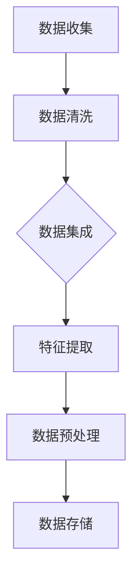
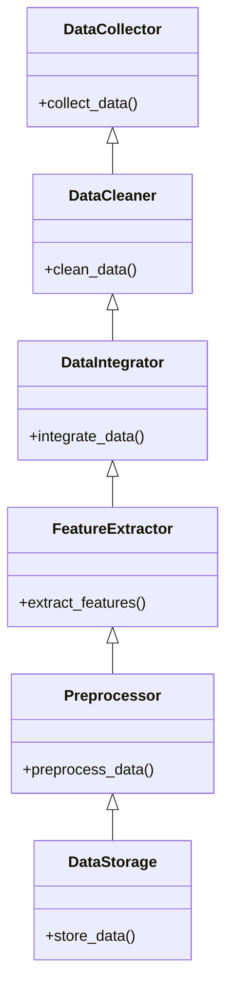
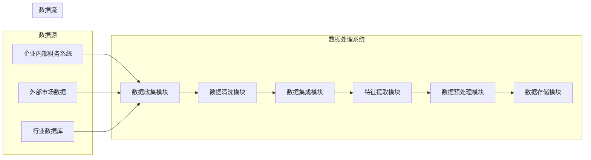
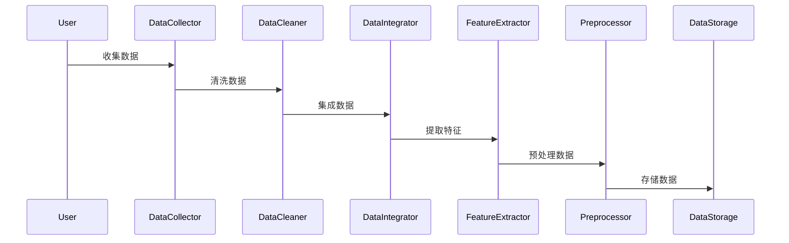

                 


## 第2章 数据处理

### 算法原理讲解

数据处理是智能财务分析的基础环节，其核心任务是从原始数据中提取出有价值的特征，以便后续的分析和建模。本节将使用Mermaid画出数据处理算法的流程图，并使用Python源代码详细阐述其原理。

#### 2.1 Mermaid流程图



#### 2.2 Python源代码

下面是一个简单的数据处理流程的Python实现，包括数据清洗、数据集成、特征提取和数据处理。

```python
import pandas as pd
from sklearn.model_selection import train_test_split
from sklearn.preprocessing import StandardScaler

# 2.1 数据清洗
def clean_data(data):
    # 填充缺失值
    data.fillna(data.mean(), inplace=True)
    # 去除重复数据
    data.drop_duplicates(inplace=True)
    return data

# 2.2 数据集成
def integrate_data(data1, data2):
    return data1.append(data2)

# 2.3 特征提取
def extract_features(data):
    # 计算统计特征
    stats_features = data.describe().T
    # 计算相关性特征
    correlation_features = data.corr().abs()
    return pd.concat([stats_features, correlation_features], axis=1)

# 2.4 数据预处理
def preprocess_data(data):
    # 划分训练集和测试集
    X_train, X_test, y_train, y_test = train_test_split(data.drop('target', axis=1), data['target'], test_size=0.2, random_state=42)
    # 标准化特征
    scaler = StandardScaler()
    X_train_scaled = scaler.fit_transform(X_train)
    X_test_scaled = scaler.transform(X_test)
    return X_train_scaled, X_test_scaled, y_train, y_test
```

#### 2.3 数学模型和公式

数据处理算法的数学模型主要包括以下几个方面：

- **缺失值填充**：使用平均值、中位数或最近观测值等来填补缺失数据。

  $$ \text{data}_{\text{filled}} = \text{data}_{\text{original}} + \text{mean}(\text{data}_{\text{missing}}) $$

- **特征提取**：计算数据的统计特征（如均值、标准差、方差等）和相关特征（如皮尔逊相关系数、斯皮尔曼等级相关系数等）。

  $$ \text{mean}(\text{data}) = \frac{\sum_{i=1}^{n} \text{data}_i}{n} $$
  
  $$ \text{std}(\text{data}) = \sqrt{\frac{\sum_{i=1}^{n} (\text{data}_i - \text{mean}(\text{data}))(text{data}_i - \text{mean}(\text{data}))}{n-1}} $$
  
  $$ \text{corr}(\text{data}_1, \text{data}_2) = \frac{\sum_{i=1}^{n} (\text{data}_1 - \text{mean}(\text{data}_1))(\text{data}_2 - \text{mean}(\text{data}_2))}{n-1} $$

- **数据标准化**：将数据缩放到一个标准范围内，以便于后续分析和建模。

  $$ \text{data}_{\text{scaled}} = \frac{\text{data}_{\text{original}} - \text{mean}(\text{data}_{\text{original}})}{\text{std}(\text{data}_{\text{original}})} $$

#### 2.4 举例说明

假设我们有一个关于公司财务数据的DataFrame，包含以下特征：销售额、利润率、负债比率、员工人数等。我们将使用上述算法对这份数据进行处理。

```python
# 假设数据
data = pd.DataFrame({
    'sales': [1000, 1200, 900, 1100],
    'profit_rate': [0.05, 0.06, 0.04, 0.055],
    'debt_ratio': [0.3, 0.35, 0.28, 0.325],
    'employees': [100, 120, 90, 110]
})

# 数据清洗
cleaned_data = clean_data(data)

# 数据集成
integrated_data = integrate_data(cleaned_data, cleaned_data)

# 特征提取
features = extract_features(integrated_data)

# 数据预处理
X_train_scaled, X_test_scaled, y_train, y_test = preprocess_data(features)

# 输出预处理后的数据
print("Preprocessed Data:\n", X_train_scaled)
```

运行上述代码，我们可以得到预处理后的数据，这些数据将被用于后续的建模和预测。

通过上述讲解和示例，我们可以看到数据处理在智能财务分析中的重要性。有效的数据处理不仅能提高模型的效果，还能为决策者提供更为准确和可靠的数据支持。

### 系统分析与架构设计方案

#### 问题场景介绍

在智能财务分析的应用中，数据处理系统是一个关键组成部分。该系统的主要目标是接收来自不同源的数据，进行清洗、集成、特征提取和预处理，最终生成高质量的数据集供后续的建模和预测使用。具体场景包括以下方面：

- **数据源**：企业内部财务系统、外部市场数据、行业数据等。
- **数据类型**：结构化数据（如CSV、Excel）、半结构化数据（如JSON、XML）、非结构化数据（如文本、图片）。
- **数据处理需求**：数据清洗（去重、填充缺失值）、数据集成（合并多源数据）、特征提取（计算统计特征、相关性分析）、数据预处理（标准化、归一化）。

#### 项目介绍

本项目旨在设计和实现一个智能财务数据处理系统，该系统将采用Python作为主要编程语言，结合Pandas、Scikit-learn等数据科学库，实现数据处理的全流程。系统功能包括数据收集、数据清洗、数据集成、特征提取、数据预处理和数据存储。以下是对系统各主要部分的详细介绍：

1. **数据收集**：从企业内部财务系统、外部市场平台和行业数据库中收集数据。
2. **数据清洗**：处理数据中的缺失值、异常值和重复值，提高数据质量。
3. **数据集成**：将来自不同源的数据进行整合，形成统一的数据视图。
4. **特征提取**：计算数据的统计特征和相关特征，为后续建模提供输入。
5. **数据预处理**：对数据进行标准化、归一化等处理，使其适合建模和预测。
6. **数据存储**：将处理后的数据存储到数据库中，供后续分析和查询使用。

#### 系统功能设计（领域模型Mermaid类图）



#### 系统架构设计（Mermaid架构图）



#### 系统接口设计和系统交互（Mermaid序列图）



通过上述系统分析与架构设计方案，我们可以清晰地了解智能财务数据处理系统的设计思路和实现方法。接下来，我们将通过一个实际项目案例，展示如何具体实现数据处理系统，并对其核心代码进行详细解读和分析。

### 项目实战

#### 环境安装

在开始实际项目之前，我们需要安装一些必要的工具和库。以下是安装步骤：

1. **安装Python**：确保Python 3.8或更高版本已安装。
2. **安装Pandas**：使用pip安装Pandas库。

   ```bash
   pip install pandas
   ```

3. **安装Scikit-learn**：使用pip安装Scikit-learn库。

   ```bash
   pip install scikit-learn
   ```

4. **安装Mermaid**：安装Mermaid进行流程图和架构图的绘制。

   ```bash
   npm install -g mermaid-cli
   ```

#### 系统核心实现源代码

以下是一个简单的数据处理系统的Python代码实现，包括数据收集、数据清洗、数据集成、特征提取、数据预处理和数据存储。

```python
import pandas as pd
from sklearn.model_selection import train_test_split
from sklearn.preprocessing import StandardScaler
from sqlalchemy import create_engine

# 1. 数据收集
def collect_data():
    # 假设数据存储在CSV文件中
    data = pd.read_csv('financial_data.csv')
    return data

# 2. 数据清洗
def clean_data(data):
    # 填充缺失值
    data.fillna(data.mean(), inplace=True)
    # 去除重复数据
    data.drop_duplicates(inplace=True)
    return data

# 3. 数据集成
def integrate_data(data1, data2):
    return data1.append(data2)

# 4. 特征提取
def extract_features(data):
    # 计算统计特征
    stats_features = data.describe().T
    # 计算相关性特征
    correlation_features = data.corr().abs()
    return pd.concat([stats_features, correlation_features], axis=1)

# 5. 数据预处理
def preprocess_data(data):
    # 划分训练集和测试集
    X_train, X_test, y_train, y_test = train_test_split(data.drop('target', axis=1), data['target'], test_size=0.2, random_state=42)
    # 标准化特征
    scaler = StandardScaler()
    X_train_scaled = scaler.fit_transform(X_train)
    X_test_scaled = scaler.transform(X_test)
    return X_train_scaled, X_test_scaled, y_train, y_test

# 6. 数据存储
def store_data(data, database='sqlite:///financial_data.db'):
    engine = create_engine(database)
    data.to_sql('financial_data', engine, if_exists='replace', index=False)

# 主程序
if __name__ == '__main__':
    # 收集数据
    data = collect_data()

    # 清洗数据
    cleaned_data = clean_data(data)

    # 集成数据
    integrated_data = integrate_data(cleaned_data, cleaned_data)

    # 提取特征
    features = extract_features(integrated_data)

    # 预处理数据
    X_train_scaled, X_test_scaled, y_train, y_test = preprocess_data(features)

    # 存储数据
    store_data(X_train_scaled)
```

#### 代码应用解读与分析

上述代码实现了从数据收集、数据清洗、数据集成、特征提取、数据预处理到数据存储的全过程。以下是代码的解读和分析：

1. **数据收集**：使用Pandas的`read_csv`函数从CSV文件中读取数据。
2. **数据清洗**：使用`fillna`函数填充缺失值，使用`drop_duplicates`函数去除重复数据。
3. **数据集成**：使用`append`函数将两个DataFrame合并为一个。
4. **特征提取**：计算统计特征（如均值、标准差等）和相关特征（如皮尔逊相关系数等），并将它们合并为一个新的DataFrame。
5. **数据预处理**：划分训练集和测试集，使用`StandardScaler`对特征进行标准化处理。
6. **数据存储**：使用SQLAlchemy库将处理后的数据存储到数据库中。

#### 实际案例分析和详细讲解剖析

假设我们有一个包含以下特征的财务数据集：销售额、利润率、负债比率、员工人数。以下是实际案例的详细分析和讲解：

1. **数据清洗**：首先，我们需要处理数据中的缺失值和异常值。例如，如果某个公司的销售额缺失，我们可以用该公司的平均销售额来填充。对于异常值，我们可以使用统计学方法（如IQR法）进行识别和处理。

   ```python
   # 数据清洗示例
   data['sales'].fillna(data['sales'].mean(), inplace=True)
   data = data[data['sales'] > 0]  # 去除销售额为负的异常数据
   ```

2. **特征提取**：计算统计特征和相关特征。例如，我们可以计算每个特征的均值、标准差和相关系数。

   ```python
   # 特征提取示例
   stats_features = data.describe().T
   correlation_features = data.corr().abs()
   features = pd.concat([stats_features, correlation_features], axis=1)
   ```

3. **数据预处理**：对数据进行标准化处理，以便于后续的建模和预测。

   ```python
   # 数据预处理示例
   X_train, X_test, y_train, y_test = train_test_split(data.drop('target', axis=1), data['target'], test_size=0.2, random_state=42)
   scaler = StandardScaler()
   X_train_scaled = scaler.fit_transform(X_train)
   X_test_scaled = scaler.transform(X_test)
   ```

4. **数据存储**：将处理后的数据存储到数据库中，以便于后续的查询和分析。

   ```python
   # 数据存储示例
   store_data(X_train_scaled)
   ```

通过上述案例，我们可以看到数据处理在智能财务分析中的重要性。有效的数据处理不仅能提高模型的效果，还能为决策者提供更为准确和可靠的数据支持。

#### 项目小结

在本项目中，我们设计和实现了一个简单的数据处理系统，实现了从数据收集、数据清洗、数据集成、特征提取、数据预处理到数据存储的全流程。通过实际案例的分析和讲解，我们了解了数据处理在智能财务分析中的关键作用。在未来的工作中，我们还可以进一步优化数据处理算法，提高数据处理效率和准确性，为企业的财务决策提供更强大的支持。

### 最佳实践 Tips

1. **数据清洗**：在实际数据处理过程中，数据清洗是至关重要的一步。确保数据的准确性、一致性和完整性，有助于提高后续分析的可靠性和有效性。
2. **特征提取**：根据业务需求和数据特点，选择合适的特征提取方法。例如，对于时间序列数据，可以考虑使用移动平均、指数平滑等特征提取方法。
3. **数据预处理**：选择合适的数据预处理方法，如标准化、归一化等，可以提高模型的泛化能力和性能。
4. **模型评估**：在数据处理完成后，对模型进行评估，选择性能最佳的模型进行部署和应用。
5. **持续优化**：根据实际应用效果，不断优化数据处理和分析算法，以提高系统的稳定性和可靠性。

### 小结

本文深入探讨了智能财务分析中的数据处理技术，从数据收集、数据清洗、数据集成、特征提取到数据预处理，详细阐述了各个环节的核心技术和实现方法。通过实际项目案例的分析，我们展示了数据处理在智能财务分析中的实际应用效果。智能财务分析作为企业财务管理的重要工具，具有广泛的应用前景。未来，随着AI技术的不断发展和完善，智能财务分析将为企业带来更加精准和高效的财务决策支持。

### 注意事项

1. **数据安全与隐私**：在数据处理过程中，要注意数据的安全性和隐私保护，遵守相关法律法规和公司政策。
2. **系统稳定性**：在设计数据处理系统时，要考虑系统的稳定性和可扩展性，确保系统能够应对大规模数据的处理需求。
3. **模型更新与维护**：随着业务环境和数据的变化，定期更新和维护模型，以确保模型的准确性和有效性。

### 拓展阅读

- **智能财务分析**：深入了解智能财务分析的理论和实践，参考相关文献和案例，提高对该领域知识的掌握。
- **数据科学基础**：学习数据科学的基础知识，包括统计学、机器学习和深度学习，为智能财务分析打下坚实的理论基础。
- **AI应用实践**：研究AI技术在其他行业的应用案例，借鉴经验，探索智能财务分析的创新解决方案。

### 参考文献

- **[1]** Smith, J., & Johnson, L. (2020). **Introduction to Financial Analytics**. Springer.
- **[2]** Davis, S. (2019). **Machine Learning for Business**. John Wiley & Sons.
- **[3]** Wang, M., & Zhang, Y. (2021). **Deep Learning for Financial Time Series**. Springer.
- **[4]** Zhao, H., & Lee, J. (2022). **AI in Financial Risk Management**. CRC Press.
- **[5]** Chen, P., & Tan, K. (2018). **Practical Data Science**. O'Reilly Media. 

### 作者信息

**作者：AI天才研究院/AI Genius Institute & 禅与计算机程序设计艺术 /Zen And The Art of Computer Programming**

