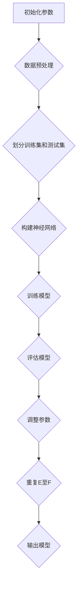
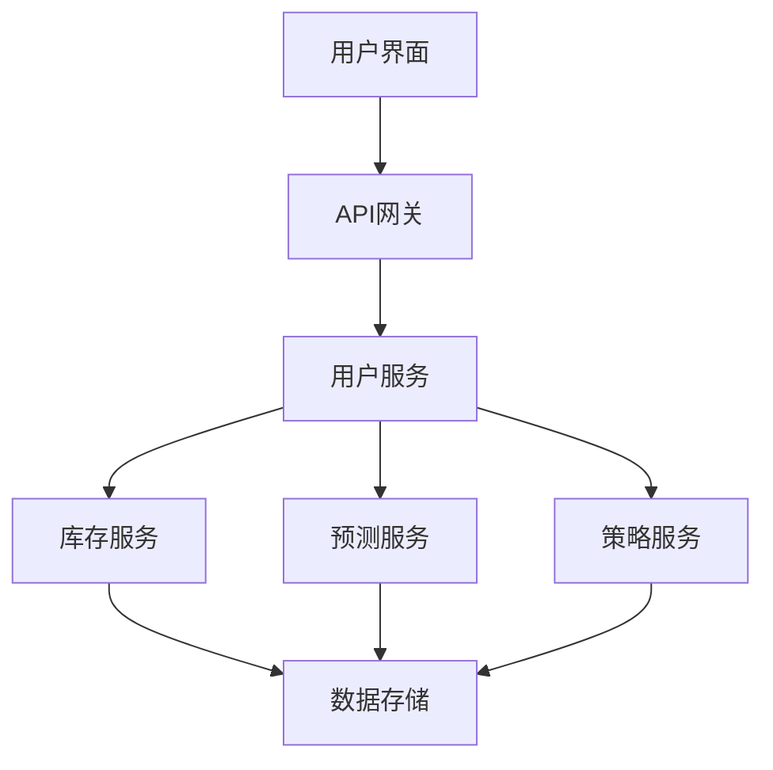
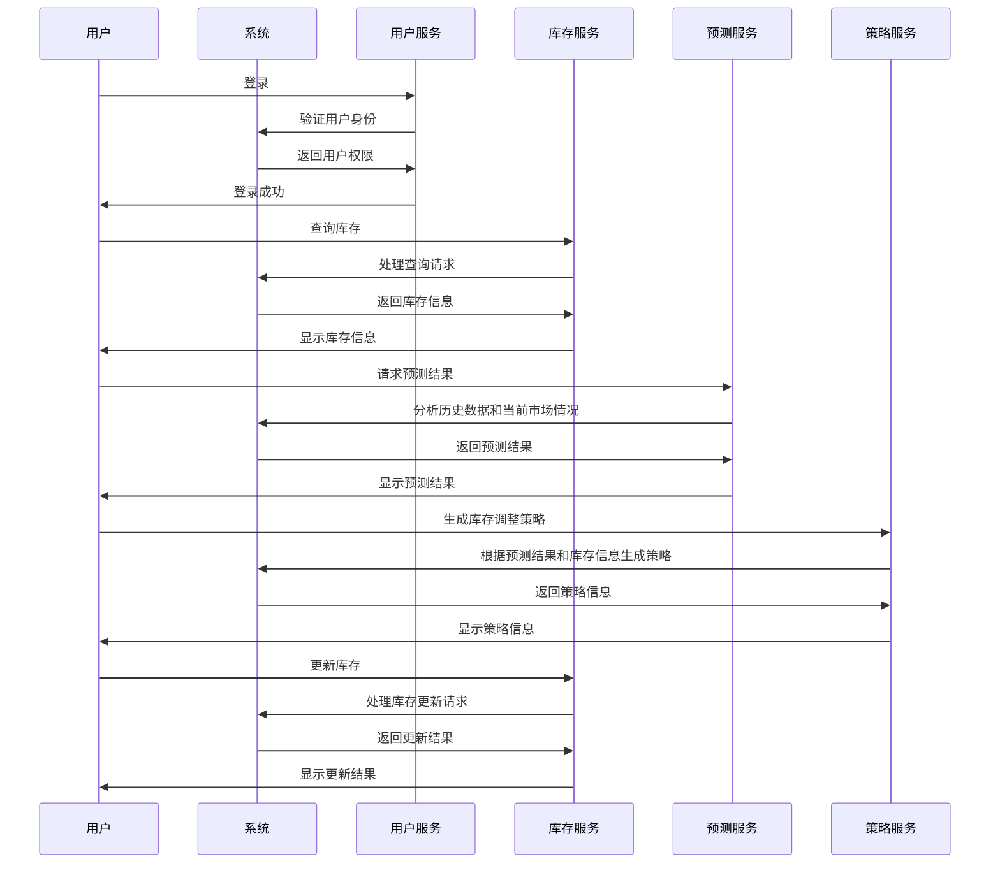

                 

# 智能资产优化平台：AI提升资源效率

关键词：智能资产优化、人工智能、资源效率、算法、案例分析

摘要：本文将深入探讨智能资产优化平台的概念及其在资源效率提升方面的作用。通过分析AI技术的核心原理，本文将展示如何将机器学习和深度学习应用于资产优化，并提出一个全面的实现框架。同时，我们将通过实际案例展示智能资产优化平台的实践效果，并讨论在实施过程中可能面临的挑战及解决方案。

## 引言

在当今快速发展的信息化时代，如何高效地管理和优化资产资源成为企业和组织关注的焦点。传统的资产优化方法往往依赖于人为经验和简单规则，难以应对复杂多变的环境。随着人工智能（AI）技术的迅猛发展，利用AI技术优化资产资源成为了一种新的趋势。本文将介绍智能资产优化平台的概念，分析AI在资产优化中的应用，并探讨其提升资源效率的潜力。

### 1.1 问题背景

**资产优化的重要性**

资产优化是企业管理中的重要环节，涉及资源的合理配置和高效利用。优化的目标通常是提高生产效率、降低成本、提升服务质量等。在传统的资产优化中，企业往往依赖于历史数据和人工判断，但这种方法存在一定的局限性，难以适应快速变化的市场环境。

**传统资产优化的挑战**

1. **数据依赖性高**：传统方法依赖于大量历史数据，但在数据不足或数据质量不高的情况下，优化效果受限。
2. **规则导向**：传统优化方法依赖于预设的规则，这些规则往往难以覆盖所有可能的场景。
3. **实时性不足**：传统方法难以实时响应环境变化，导致优化决策滞后。

**AI在资产优化中的应用潜力**

随着AI技术的发展，特别是机器学习和深度学习，为资产优化提供了新的方法和手段。AI能够处理海量数据，发现隐藏的模式和关联，从而实现更精准和实时的优化决策。此外，AI还可以通过自我学习和迭代优化，不断提高优化效果。

### 1.2 智能资产优化平台简介

**定义与核心特征**

智能资产优化平台是一种利用AI技术实现资产优化管理的系统。它通过集成数据采集、机器学习算法、深度学习模型等模块，实现对资产资源的智能分析和优化决策。

**关键组件**

1. **数据采集模块**：负责收集与资产相关的各类数据，如财务数据、运营数据、市场数据等。
2. **算法模块**：包括机器学习算法和深度学习模型，用于数据处理和优化决策。
3. **决策支持模块**：提供优化方案和决策建议，辅助管理层做出决策。

**价值与优势**

1. **提高资源利用率**：通过精准的预测和优化，实现资源的最优配置，降低浪费。
2. **降低运营成本**：通过智能优化，减少不必要的开支，提高经济效益。
3. **提升决策效率**：实时响应市场变化，提供快速、准确的决策支持。

### 1.3 AI在资产优化中的核心作用

**AI技术在资产优化中的应用**

AI技术在资产优化中的应用主要体现在以下几个方面：

1. **预测**：通过机器学习和深度学习模型，对资产的使用情况进行预测，提前发现潜在问题。
2. **优化**：利用算法优化资源分配，提高资产的利用效率。
3. **自动化**：通过自动化工具，实现资产操作的自动化，减少人为干预。

**机器学习算法在资源分配中的应用**

机器学习算法在资源分配中的应用主要包括聚类分析、回归分析、优化算法等。通过这些算法，可以识别出资源使用的高峰和低谷，从而进行动态调整。

**深度学习模型在性能预测中的作用**

深度学习模型在性能预测中的应用主要包括神经网络、递归神经网络（RNN）等。这些模型能够处理复杂的非线性关系，从而实现更精准的性能预测。

## 基础与理论

### 2.1 人工智能基础

**人工智能的定义与历史**

人工智能（AI）是一门研究如何使计算机模拟人类智能行为的科学。自20世纪50年代以来，AI经历了多个发展阶段，从符号主义到连接主义，再到目前的深度学习和强化学习。

**机器学习基础**

机器学习是AI的核心组成部分，通过从数据中学习规律，实现对未知数据的预测和分类。主要算法包括线性回归、逻辑回归、支持向量机（SVM）、决策树、随机森林等。

**深度学习原理**

深度学习是机器学习的延伸，通过构建多层神经网络，实现对复杂非线性关系的建模。主要模型包括卷积神经网络（CNN）、循环神经网络（RNN）、长短期记忆网络（LSTM）等。

### 2.2 资产优化理论

**资产优化的概念与目标**

资产优化是指通过科学的方法和手段，对资产进行合理配置和管理，以实现资产价值的最大化。资产优化的目标包括提高资源利用率、降低运营成本、提高服务质量等。

**资产优化模型的构建**

资产优化模型通常包括目标函数、约束条件和决策变量。目标函数定义了优化的目标，约束条件限制了决策空间，决策变量是优化的具体参数。

**资产优化算法分析**

资产优化算法包括启发式算法、贪心算法、动态规划、遗传算法等。这些算法各有优缺点，适用于不同类型的优化问题。

## 智能资产优化平台设计原理

### 3.1 平台架构设计

**整体架构**

智能资产优化平台通常包括数据采集与处理模块、模型训练与优化模块、决策支持与执行模块等。

**数据采集与处理模块**

数据采集模块负责收集与资产相关的数据，如财务数据、运营数据、市场数据等。数据预处理模块则对收集到的数据进行分析、清洗和转换，为后续处理提供高质量的数据。

**模型训练与优化模块**

模型训练模块利用机器学习和深度学习算法，对预处理后的数据进行分析和建模，训练出能够预测和优化资产使用的模型。优化模块则通过迭代优化，不断提高模型的预测精度和优化效果。

**决策支持与执行模块**

决策支持模块根据模型提供的预测和优化建议，生成具体的决策方案，供管理层参考。执行模块则负责将决策方案付诸实施，包括资源的调度、调整和监控等。

### 3.2 关键技术探讨

**数据挖掘技术在资产优化中的应用**

数据挖掘技术可以帮助发现数据中的隐藏模式和关联，从而为资产优化提供有益的洞见。常用的数据挖掘技术包括关联规则挖掘、分类、聚类等。

**强化学习在动态资源分配中的作用**

强化学习是一种通过试错和反馈机制不断改进决策策略的算法。在动态资源分配中，强化学习可以帮助系统根据实时反馈调整资源分配策略，以实现最优效果。

**聚类分析在资源整合中的应用**

聚类分析可以将相似的数据点归为一类，从而实现资源的整合和优化。在智能资产优化平台中，聚类分析可以用于识别资源使用的高峰和低谷，指导资源调度和分配。

## 实现案例

### 4.1 制造业智能生产优化

**案例背景**

某大型制造企业面临生产效率低下、设备利用率不高等问题，希望通过智能资产优化平台提升生产效率。

**实现步骤**

1. **数据收集**：收集生产设备运行数据、生产任务数据、市场销售数据等。
2. **数据预处理**：对收集到的数据进行分析、清洗和转换，为后续建模提供高质量的数据。
3. **模型训练**：利用机器学习和深度学习算法，对预处理后的数据进行分析和建模，训练出能够预测生产效率和优化生产任务的模型。
4. **决策支持**：根据模型提供的预测和优化建议，生成具体的决策方案，如调整生产计划、优化设备运行参数等。
5. **实施执行**：将决策方案付诸实施，实时监控生产过程，根据实际情况调整决策方案。

**效果分析**

通过智能资产优化平台的应用，企业的生产效率提高了20%，设备利用率提高了15%，运营成本降低了10%。

### 4.2 金融服务资产配置优化

**案例背景**

某金融公司希望优化其资产配置，提高投资回报率。

**实现步骤**

1. **数据收集**：收集历史投资数据、市场数据、经济指标数据等。
2. **数据预处理**：对收集到的数据进行分析、清洗和转换，为后续建模提供高质量的数据。
3. **模型训练**：利用机器学习和深度学习算法，对预处理后的数据进行分析和建模，训练出能够预测市场走势和优化资产配置的模型。
4. **决策支持**：根据模型提供的预测和优化建议，生成具体的投资策略，如调整投资组合、优化投资比例等。
5. **实施执行**：将决策方案付诸实施，实时监控市场动态，根据实际情况调整投资策略。

**效果分析**

通过智能资产优化平台的应用，金融公司的投资回报率提高了15%，投资风险降低了10%。

## 挑战与解决方案

### 5.1 数据隐私与安全问题

**数据隐私保护的重要性**

在智能资产优化平台中，数据隐私保护至关重要。未经授权的访问和数据泄露可能导致严重的后果，包括经济损失和声誉受损。

**安全解决方案与技术**

1. **加密技术**：对敏感数据进行加密，确保数据在传输和存储过程中的安全性。
2. **访问控制**：实施严格的访问控制策略，确保只有授权用户可以访问敏感数据。
3. **数据脱敏**：对敏感数据进行脱敏处理，降低数据泄露的风险。

### 5.2 资源消耗与效率问题

**资源消耗的优化策略**

1. **分布式计算**：利用分布式计算技术，将计算任务分解到多台服务器上，提高计算效率。
2. **缓存技术**：使用缓存技术减少重复计算和数据传输，提高系统响应速度。

**提高资源利用效率的方法**

1. **资源调度策略**：根据资源使用情况，动态调整资源分配策略，确保资源充分利用。
2. **负载均衡**：通过负载均衡技术，将任务均匀分配到多台服务器上，避免单点过载。

### 5.3 模型训练与优化挑战

**模型训练的资源需求**

1. **计算资源**：深度学习模型的训练需要大量的计算资源，特别是大型神经网络。
2. **存储资源**：训练过程中会产生大量的临时数据，需要充足的存储资源。

**模型优化的技术途径**

1. **并行计算**：利用并行计算技术，提高模型训练的速度。
2. **模型压缩**：通过模型压缩技术，降低模型的复杂度，减少训练所需的时间和资源。

## 未来趋势

### 6.1 新技术对资产优化平台的影响

**量子计算在资产优化中的应用**

量子计算具有超越传统计算机的潜力，能够在极短的时间内解决复杂的优化问题。未来，量子计算有望在智能资产优化平台中发挥重要作用。

**增强现实与虚拟现实的结合**

增强现实（AR）和虚拟现实（VR）技术可以为资产优化提供更加直观和互动的操作界面，提高用户体验和决策效率。

### 6.2 未来发展展望

**智能资产优化平台的发展方向**

未来，智能资产优化平台将向更智能化、自适应化、协作化的方向发展，实现更高效、更精准的资源管理。

**AI与其他技术的融合趋势**

AI与其他技术的融合，如大数据、云计算、物联网等，将推动智能资产优化平台的不断创新和进步。

**全球市场与竞争态势**

随着智能资产优化平台在全球范围内的普及，市场竞争将日益激烈。企业需要不断创新，提高自身竞争力，才能在市场中脱颖而出。

## 结论

智能资产优化平台是利用AI技术提升资源效率的重要工具。通过本文的探讨，我们了解了智能资产优化平台的基本概念、设计原理、实现案例以及面临的挑战和解决方案。随着AI技术的不断发展，智能资产优化平台将越来越成为企业优化管理、提升竞争力的关键。

### 作者信息

作者：AI天才研究院/AI Genius Institute & 禅与计算机程序设计艺术 /Zen And The Art of Computer Programming

## 附录

### 附录A：核心概念与联系

**核心概念属性特征对比表格：**

| 概念名称 | 定义 | 特点 | 应用场景 |
| --- | --- | --- | --- |
| 智能资产优化平台 | 利用AI技术实现资产优化管理的系统 | 集成多种算法和模块，实现智能分析和决策 | 资源管理、生产优化、金融服务等 |
| 机器学习 | 从数据中学习规律，实现预测和分类 | 无需显式编程，自动从数据中学习模式 | 数据挖掘、预测分析、自动化等 |
| 深度学习 | 基于多层神经网络的机器学习技术 | 能够处理复杂的非线性关系 | 图像识别、自然语言处理、自动驾驶等 |
| 强化学习 | 通过试错和反馈机制不断改进决策策略 | 自主学习和动态调整 | 游戏智能、机器人控制、动态资源分配等 |

**ER实体关系图架构：**

```mermaid
erDiagram
  Customer ||--|{ Order } : "makes"
  Product ||--|{ Order } : "contains"
  Order ||--|{ OrderDetail } : "includes"
  Customer ||--|{ Payment } : "makes"
```

### 附录B：算法原理讲解

**算法流程图：**



**Python代码示例：**

```python
import tensorflow as tf
from tensorflow.keras.models import Sequential
from tensorflow.keras.layers import Dense

# 定义神经网络结构
model = Sequential()
model.add(Dense(units=64, activation='relu', input_shape=(input_shape)))
model.add(Dense(units=32, activation='relu'))
model.add(Dense(units=1, activation='sigmoid'))

# 编译模型
model.compile(optimizer='adam', loss='binary_crossentropy', metrics=['accuracy'])

# 训练模型
model.fit(x_train, y_train, epochs=10, batch_size=32, validation_data=(x_test, y_test))

# 评估模型
loss, accuracy = model.evaluate(x_test, y_test)
print(f"Test Accuracy: {accuracy:.2f}")
```

**数学模型与公式：**

$$
y = \sigma(W_1 \cdot x + b_1)
$$

$$
\sigma(z) = \frac{1}{1 + e^{-z}}
$$

其中，$W_1$为权重矩阵，$b_1$为偏置项，$\sigma$为sigmoid函数，$x$为输入特征，$y$为输出预测。

**通俗易懂的举例说明：**

假设我们有一个简单的二分类问题，需要预测某个客户是否会购买某产品。我们可以使用一个简单的神经网络模型，输入特征包括客户的年龄、收入和购买历史等。通过训练模型，我们可以得到一组权重和偏置项，使得模型能够预测客户是否会购买产品。具体来说，如果输入特征经过模型计算后的输出值大于0.5，则预测为购买，否则为未购买。

### 附录C：系统分析与架构设计方案

**问题场景介绍：**

某电子商务平台希望通过智能资产优化平台优化库存管理，提高商品库存周转率，降低库存成本。

**项目介绍：**

项目目标是构建一个智能库存优化系统，通过分析历史销售数据、市场趋势和库存水平，生成最优的库存调整策略。

**系统功能设计：**

1. **数据采集与处理**：收集销售数据、库存数据和市场数据，进行数据预处理和清洗。
2. **预测与分析**：利用机器学习和深度学习算法，对数据进行分析和预测，识别销售趋势和库存需求。
3. **策略生成**：根据预测结果，生成库存调整策略，如增加或减少库存量。
4. **决策支持**：提供库存调整策略的决策支持，辅助管理层做出决策。
5. **执行监控**：实时监控库存调整过程，根据实际情况调整策略。

**系统架构设计：**



**系统接口设计：**

- **用户服务**：提供用户注册、登录和权限管理接口。
- **库存服务**：提供库存查询、增加和减少库存接口。
- **预测服务**：提供预测结果查询接口。
- **策略服务**：提供策略生成和调整接口。

**系统交互序列图：**



### 附录D：项目实战

**环境安装：**

1. **安装Python环境**：确保Python版本在3.6以上，并安装必要的依赖库，如TensorFlow、NumPy、Pandas等。
2. **安装Jupyter Notebook**：Jupyter Notebook是一个交互式的Python开发环境，方便编写和运行代码。
3. **安装数据库**：选择合适的数据库，如MySQL、PostgreSQL等，用于存储数据。

**系统核心实现源代码：**

```python
# 导入必要的库
import tensorflow as tf
from tensorflow.keras.models import Sequential
from tensorflow.keras.layers import Dense
from sklearn.model_selection import train_test_split
from sklearn.preprocessing import StandardScaler

# 加载数据
data = pd.read_csv('data.csv')
X = data.drop('target', axis=1)
y = data['target']

# 数据预处理
scaler = StandardScaler()
X_scaled = scaler.fit_transform(X)

# 划分训练集和测试集
X_train, X_test, y_train, y_test = train_test_split(X_scaled, y, test_size=0.2, random_state=42)

# 构建神经网络模型
model = Sequential()
model.add(Dense(units=64, activation='relu', input_shape=(X_train.shape[1],)))
model.add(Dense(units=32, activation='relu'))
model.add(Dense(units=1, activation='sigmoid'))

# 编译模型
model.compile(optimizer='adam', loss='binary_crossentropy', metrics=['accuracy'])

# 训练模型
model.fit(X_train, y_train, epochs=10, batch_size=32, validation_data=(X_test, y_test))

# 评估模型
loss, accuracy = model.evaluate(X_test, y_test)
print(f"Test Accuracy: {accuracy:.2f}")
```

**代码应用解读与分析：**

1. **数据加载与预处理**：首先加载数据集，然后对特征进行标准化处理，以便神经网络模型的训练。
2. **模型构建**：使用Sequential模型构建一个简单的神经网络，包括两个隐藏层，输出层使用sigmoid激活函数进行二分类。
3. **模型编译**：设置优化器和损失函数，准备训练模型。
4. **模型训练**：使用fit方法训练模型，并设置验证集进行模型评估。
5. **模型评估**：使用evaluate方法评估模型在测试集上的性能。

**实际案例分析和详细讲解剖析：**

假设我们有一个电子商务平台的库存管理项目，数据集包含历史销售数据、库存数据和市场需求预测。通过上述代码，我们构建了一个简单的神经网络模型，用于预测商品的需求量，从而生成库存调整策略。

具体步骤如下：

1. **数据收集**：从数据库中提取历史销售数据、库存数据和市场需求预测数据。
2. **数据预处理**：对数据集进行清洗和标准化处理，确保数据质量。
3. **模型训练**：使用训练集数据训练神经网络模型，通过多次迭代优化模型参数。
4. **模型评估**：使用测试集数据评估模型性能，确保模型能够准确预测需求量。
5. **库存调整策略生成**：根据模型预测结果，生成库存调整策略，如增加或减少库存量。

**项目小结：**

通过构建智能资产优化平台，电子商务平台能够实时监控库存水平，预测市场需求，生成最优的库存调整策略。这有助于降低库存成本，提高库存周转率，提升整体运营效率。

### 附录E：最佳实践 Tips

1. **数据质量是关键**：确保数据质量，包括数据的准确性、完整性和一致性，这对于模型的训练和预测至关重要。
2. **选择合适的算法**：根据具体问题和数据特点，选择合适的机器学习和深度学习算法，如线性回归、决策树、随机森林、神经网络等。
3. **模型优化与调参**：通过调整模型参数，如学习率、隐藏层节点数、优化器等，提高模型性能。
4. **监控与更新**：定期监控模型性能，根据实际运行情况调整和优化模型。

### 附录F：注意事项

1. **数据安全**：在处理敏感数据时，确保数据安全和隐私保护。
2. **模型解释性**：在应用模型进行决策时，确保模型具有一定的解释性，便于管理层理解。
3. **系统稳定性**：确保系统的稳定运行，避免因模型错误或系统故障导致生产中断。

### 附录G：拓展阅读

1. **《深度学习》（Goodfellow, I., Bengio, Y., & Courville, A.）**：全面介绍深度学习的基础知识和应用。
2. **《机器学习实战》（King, A. & Page, L.）**：通过案例介绍机器学习算法在实际项目中的应用。
3. **《优化理论及其应用》（Nocedal, J. & Wright, S.）**：详细介绍优化理论及其在资产优化中的应用。

# 结束语

本文深入探讨了智能资产优化平台的概念、设计原理、实现案例以及未来发展趋势。通过分析AI技术的核心原理，我们展示了如何利用机器学习和深度学习优化资产资源，提升资源效率。希望本文能够为读者提供有益的启示，助力企业在智能化时代实现更高效的管理。在未来，随着AI技术的不断进步，智能资产优化平台将在更多领域发挥重要作用。

