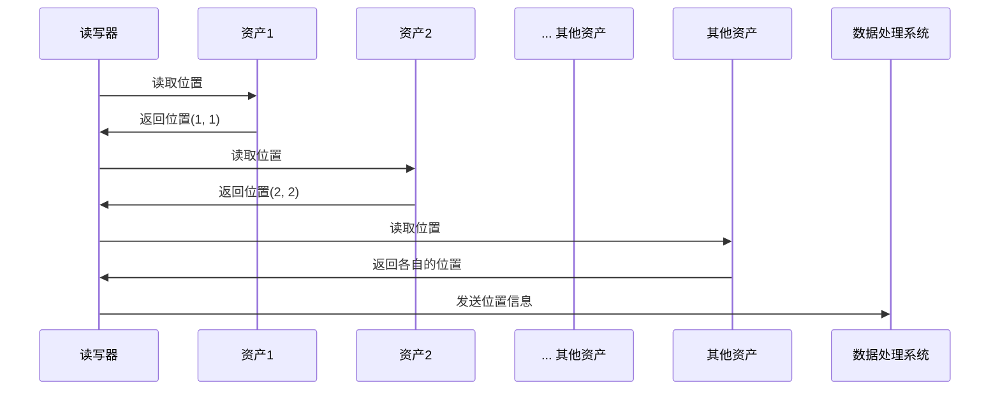
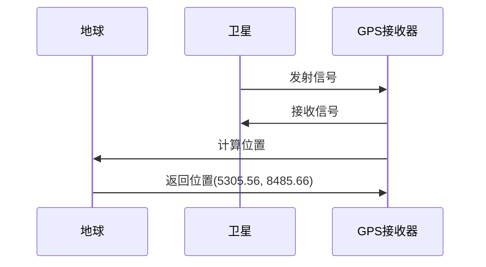
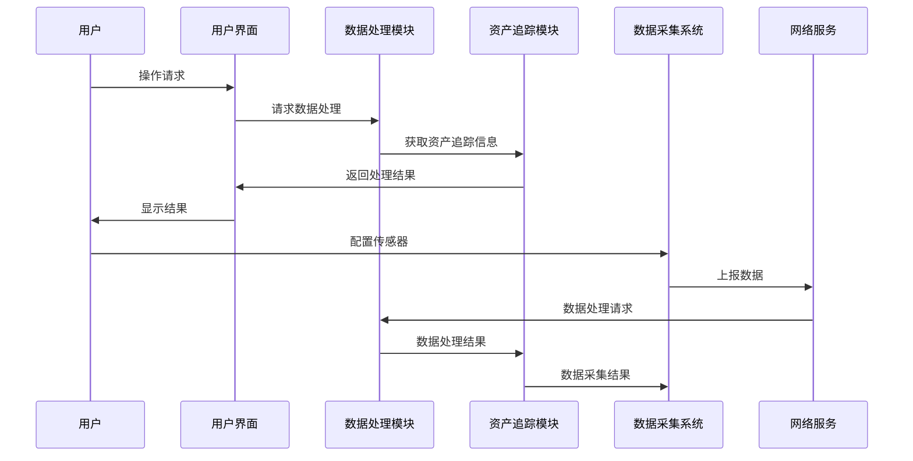

                 

## 智能资产追踪：物联网技术在供应链管理中的应用

### 关键词：
- 物联网（IoT）
- 供应链管理
- 智能资产追踪
- RFID
- GPS
- UWB
- 实时监控
- 数据分析
- 算法优化
- 系统架构设计

### 摘要：
本文将深入探讨物联网技术在供应链管理中的智能资产追踪应用。我们将从背景介绍入手，分析智能资产追踪面临的问题和挑战，然后详细介绍物联网技术在资产追踪中的关键应用，包括RFID、GPS和UWB技术。接着，我们将讲解智能资产追踪算法的原理和实现，分析不同算法的优缺点及其在实际应用中的优化策略。随后，文章将介绍智能资产追踪系统的设计与实现，包括系统功能、架构设计和部署。最后，我们将通过一个实际案例展示智能资产追踪系统的应用效果，并总结最佳实践和未来发展方向。

## 《智能资产追踪：物联网技术在供应链管理中的应用》目录大纲

### 第一部分：背景介绍

#### 第1章：智能资产追踪概述

- **1.1 问题背景**：供应链管理的挑战与机遇
  - 物流效率低下
  - 资产流失与损坏
  - 实时信息获取的需求

- **1.2 问题描述**：资产追踪的关键问题
  - 资产状态监控
  - 位置追踪与导航
  - 实时数据反馈

- **1.3 问题解决**：物联网技术在供应链管理中的应用
  - IoT设备部署
  - 数据采集与处理
  - 实时决策支持

- **1.4 边界与外延**：智能资产追踪的适用范围
  - 物流与运输
  - 制造业
  - 零售业

- **1.5 概念结构与核心要素组成**：智能资产追踪的关键要素
  - 物联网设备
  - 数据通信网络
  - 资产追踪软件平台

- **1.6 本章小结**：智能资产追踪的重要性与未来展望

### 第二部分：核心概念与联系

#### 第2章：物联网技术在智能资产追踪中的应用

- **2.1 物联网技术概述**
  - **2.1.1 物联网的定义与分类**
  - **2.1.2 物联网的核心技术**

- **2.2 智能资产追踪的核心概念**
  - **2.2.1 资产追踪的需求分析**
  - **2.2.2 资产追踪的基本原理**

- **2.3 物联网技术在资产追踪中的关键应用**
  - **2.3.1 RFID技术**
  - **2.3.2 GPS技术**
  - **2.3.3 超宽带（UWB）技术**

- **2.4 物联网技术与供应链管理的结合**
  - **2.4.1 数据采集与传输**
  - **2.4.2 实时监控与决策支持**

- **2.5 概念属性特征对比表格**
  - **2.5.1 不同追踪技术的对比分析**

- **2.6 ER实体关系图架构**
  - **2.6.1 实体与关系的定义**
  - **2.6.2 关系图的绘制与解释**

- **2.7 本章小结**：物联网技术在智能资产追踪中的实际价值

### 第三部分：算法原理讲解

#### 第3章：智能资产追踪算法原理

- **3.1 资产追踪算法概述**
  - **3.1.1 资产追踪算法的分类**
  - **3.1.2 资产追踪算法的目标**

- **3.2 典型资产追踪算法讲解**
  - **3.2.1 基于RFID的追踪算法**
    - **3.2.1.1 算法原理**
    - **3.2.1.2 数学模型**
    - **3.2.1.3 代码实现与解释**
    - **3.2.1.4 举例说明**

  - **3.2.2 基于GPS的追踪算法**
    - **3.2.2.1 算法原理**
    - **3.2.2.2 数学模型**
    - **3.2.2.3 代码实现与解释**
    - **3.2.2.4 举例说明**

- **3.3 资产追踪算法的比较与选择**
  - **3.3.1 不同算法的优缺点分析**
  - **3.3.2 选择算法的考虑因素**

- **3.4 算法在实际应用中的优化**
  - **3.4.1 实时性优化**
  - **3.4.2 准确性优化**
  - **3.4.3 能耗优化**

- **3.5 本章小结**：智能资产追踪算法的重要性与未来发展趋势

### 第四部分：系统分析与架构设计方案

#### 第4章：智能资产追踪系统的设计与实现

- **4.1 问题场景介绍**
  - **4.1.1 智能资产追踪的应用场景**
  - **4.1.2 系统的需求分析**

- **4.2 项目介绍**
  - **4.2.1 项目背景**
  - **4.2.2 项目目标**

- **4.3 系统功能设计**
  - **4.3.1 领域模型**
    - **4.3.1.1 类图**
    - **4.3.1.2 属性与关系说明**

  - **4.3.2 功能模块**
    - **4.3.2.1 数据采集模块**
    - **4.3.2.2 数据处理模块**
    - **4.3.2.3 资产追踪模块**
    - **4.3.2.4 用户界面模块**

- **4.4 系统架构设计**
  - **4.4.1 系统架构图**
    - **4.4.1.1 架构的组成部分**
    - **4.4.1.2 系统交互流程**

  - **4.4.2 系统部署**
    - **4.4.2.1 硬件配置**
    - **4.4.2.2 软件配置**

- **4.5 系统接口设计**
  - **4.5.1 接口定义**
  - **4.5.2 接口实现**

- **4.6 系统交互设计**
  - **4.6.1 系统交互流程**
  - **4.6.2 序列图**

- **4.7 本章小结**：智能资产追踪系统的设计与实现

### 第五部分：项目实战与案例分析

#### 第5章：智能资产追踪系统的实际应用

- **5.1 环境安装**
  - **5.1.1 硬件安装**
  - **5.1.2 软件安装**

- **5.2 系统核心实现源代码**
  - **5.2.1 数据采集模块代码**
  - **5.2.2 数据处理模块代码**
  - **5.2.3 资产追踪模块代码**

- **5.3 代码应用解读与分析**
  - **5.3.1 代码结构解析**
  - **5.3.2 功能实现分析**

- **5.4 实际案例分析**
  - **5.4.1 案例背景**
  - **5.4.2 案例分析**
  - **5.4.3 剖析与总结**

- **5.5 项目小结**
  - **5.5.1 项目成果总结**
  - **5.5.2 项目不足与改进**

### 第六部分：最佳实践、注意事项与拓展阅读

#### 第6章：最佳实践、注意事项与拓展阅读

- **6.1 最佳实践**
  - **6.1.1 系统部署最佳实践**
  - **6.1.2 数据安全与隐私保护**
  - **6.1.3 算法优化最佳实践**

- **6.2 注意事项**
  - **6.2.1 系统运维注意事项**
  - **6.2.2 数据处理注意事项**
  - **6.2.3 算法选择注意事项**

- **6.3 拓展阅读**
  - **6.3.1 相关技术资料**
  - **6.3.2 学术论文推荐**
  - **6.3.3 深度阅读建议**

## 第一部分：背景介绍

### 第1章：智能资产追踪概述

智能资产追踪是现代供应链管理中的一项关键技术，通过物联网（IoT）技术的应用，实现对供应链中的资产进行实时监控、位置追踪和数据反馈，从而提高物流效率、减少资产流失和损坏，并为企业提供实时决策支持。随着物联网技术的不断发展和应用，智能资产追踪在供应链管理中的重要性日益凸显。

#### 1.1 问题背景

供应链管理作为企业运营的重要环节，其效率和准确性直接影响到企业的竞争力。然而，传统的供应链管理存在以下几大挑战：

- **物流效率低下**：物流环节中的运输、仓储和配送等过程往往缺乏实时监控和优化，导致物流成本高昂，响应速度慢。
- **资产流失与损坏**：资产在运输、存储和配送过程中容易发生丢失或损坏，给企业带来巨大的经济损失和信誉风险。
- **实时信息获取需求**：企业在运营过程中需要实时获取资产的位置、状态和数量等信息，以便进行有效的决策和调整。

这些问题的存在使得供应链管理面临巨大的挑战，同时也催生了智能资产追踪的需求。

#### 1.2 问题描述

智能资产追踪主要解决以下几个关键问题：

- **资产状态监控**：通过实时获取资产的状态信息，如温度、湿度、电量等，帮助企业及时了解资产的健康状况，预防潜在的风险。
- **位置追踪与导航**：通过定位技术（如GPS、RFID、UWB等）对资产进行精确定位，实现对资产的实时追踪和导航。
- **实时数据反馈**：将资产的位置、状态等信息实时传输到中央系统，为企业提供决策支持，优化供应链管理流程。

#### 1.3 问题解决

物联网技术在智能资产追踪中扮演了重要角色，通过以下几方面的应用，解决了上述问题：

- **IoT设备部署**：在资产上安装物联网传感器和设备，如RFID标签、GPS模块等，实现对资产的实时监控和数据采集。
- **数据采集与处理**：通过传感器和设备收集到的数据，利用物联网网关进行初步处理，将有效数据传输到中央系统。
- **实时决策支持**：通过大数据分析和机器学习算法，对采集到的数据进行处理和分析，为企业的实时决策提供支持。

#### 1.4 边界与外延

智能资产追踪不仅适用于物流与运输领域，还在制造业、零售业等领域有着广泛的应用：

- **物流与运输**：在物流运输过程中，智能资产追踪可以实时监控货物的位置和状态，提高运输效率，降低物流成本。
- **制造业**：在制造业中，智能资产追踪可以实现对原材料、半成品和成品的全过程监控，提高生产效率，减少浪费。
- **零售业**：在零售业中，智能资产追踪可以实时监控商品的库存和销售情况，优化供应链管理，提高客户满意度。

#### 1.5 概念结构与核心要素组成

智能资产追踪系统由以下几个关键要素组成：

- **物联网设备**：包括传感器、RFID标签、GPS模块等，用于实时采集资产的状态和位置信息。
- **数据通信网络**：包括无线网络、有线网络等，用于传输物联网设备采集到的数据。
- **资产追踪软件平台**：包括数据采集模块、数据处理模块、资产追踪模块等，用于对数据进行分析和处理，提供实时决策支持。

#### 1.6 本章小结

智能资产追踪作为物联网技术在供应链管理中的应用，通过实时监控、位置追踪和数据反馈，提高了供应链管理的效率和准确性，减少了资产流失和损坏。随着物联网技术的不断发展，智能资产追踪将在更多领域得到广泛应用，为企业的智能化运营提供有力支持。

## 第二部分：核心概念与联系

### 第2章：物联网技术在智能资产追踪中的应用

物联网技术在智能资产追踪中发挥着至关重要的作用，通过实现资产状态的实时监控、位置的精确追踪以及数据的及时反馈，大大提升了供应链管理的效率。本章将详细介绍物联网技术的基本概念、智能资产追踪的核心概念，以及物联网技术在资产追踪中的关键应用。

#### 2.1 物联网技术概述

**2.1.1 物联网的定义与分类**

物联网（Internet of Things，IoT）是指通过互联网将各种物理设备、传感器、软件和网络连接起来，实现设备之间的通信和数据交换。物联网可以被分为以下几类：

- **按技术类型分类**：
  - **有线物联网**：通过有线网络连接的设备，如以太网、光纤等。
  - **无线物联网**：通过无线网络连接的设备，如Wi-Fi、蓝牙、蜂窝网络等。

- **按应用领域分类**：
  - **消费类物联网**：智能家居、可穿戴设备、个人健康监测等。
  - **工业物联网**：智能制造、远程监控、设备预测维护等。
  - **公共事业物联网**：智能交通、智能城市、环境监测等。

- **按连接方式分类**：
  - **感知层**：包括传感器、RFID标签、GPS模块等，用于感知和采集数据。
  - **网络层**：包括传输网络、无线网络等，用于传输数据。
  - **平台层**：包括数据处理、存储、分析等，用于数据的管理和应用。
  - **应用层**：包括各类应用程序和服务，为用户提供增值服务。

**2.1.2 物联网的核心技术**

物联网的核心技术包括传感器技术、通信技术、数据处理和分析技术等。

- **传感器技术**：传感器用于感知环境信息，如温度、湿度、压力、位置等。物联网传感器具有高精度、低功耗、多功能等特点。
- **通信技术**：物联网通信技术包括无线通信和有线通信。无线通信技术如Wi-Fi、蓝牙、蜂窝网络等，有线通信技术如以太网、光纤等。物联网通信技术要求具有高带宽、低延迟、高可靠性等特点。
- **数据处理和分析技术**：数据处理和分析技术用于对物联网设备采集到的海量数据进行处理和分析，提取有价值的信息。常用的技术包括大数据处理、云计算、人工智能等。

#### 2.2 智能资产追踪的核心概念

**2.2.1 资产追踪的需求分析**

资产追踪在供应链管理中具有重要意义，其需求主要包括：

- **实时监控**：实时了解资产的状态和位置，以便快速响应和调整。
- **精确追踪**：准确获取资产的位置信息，避免误报和漏报。
- **数据反馈**：及时获取资产的相关数据，如温度、湿度等，为决策提供支持。

**2.2.2 资产追踪的基本原理**

资产追踪的基本原理是通过传感器和定位技术实现对资产的监控和定位。

- **传感器技术**：传感器用于检测资产的状态信息，如温度、湿度等。传感器将检测到的信息转换为电信号，然后通过物联网网关传输到中央系统。
- **定位技术**：定位技术用于确定资产的位置信息。常见的定位技术包括GPS、RFID、UWB等。定位技术通过测量信号传输时间、信号强度等参数，计算出资产的位置。

#### 2.3 物联网技术在资产追踪中的关键应用

**2.3.1 RFID技术**

RFID（射频识别）技术是一种无线自动识别技术，通过RFID标签和读写器之间的通信实现对物体的追踪和识别。

- **RFID技术原理**：RFID标签内嵌芯片，可以存储和发送数据。读写器通过发送射频信号激活标签，标签将存储的数据发送回读写器。
- **RFID技术优势**：RFID技术具有非接触、高速、高精度、低成本等优点，适用于各种场景的资产追踪，如仓库管理、物流运输等。

**2.3.2 GPS技术**

GPS（全球定位系统）是一种卫星导航系统，通过接收卫星信号计算接收器的地理位置。

- **GPS技术原理**：GPS由一系列卫星组成，卫星发射信号，接收器接收信号，通过测量信号传输时间计算出位置。
- **GPS技术优势**：GPS技术具有全球覆盖、高精度、实时性等优点，适用于物流运输、车辆监控等场景。

**2.3.3 超宽带（UWB）技术**

UWB（超宽带）技术是一种利用很宽的频带来传输数据的新一代无线通信技术。

- **UWB技术原理**：UWB通过在很宽的频带内发送短脉冲信号，利用脉冲信号之间的时间差进行定位和追踪。
- **UWB技术优势**：UWB技术具有低功耗、高精度、强抗干扰性等优点，适用于室内定位、短距离追踪等场景。

#### 2.4 物联网技术与供应链管理的结合

物联网技术在供应链管理中的应用主要体现在数据采集、传输和实时监控等方面。

- **数据采集**：物联网传感器和设备用于采集资产的状态和位置信息，为供应链管理提供实时数据。
- **数据传输**：物联网通信技术（如Wi-Fi、蓝牙、蜂窝网络等）用于传输采集到的数据，确保数据的实时性和可靠性。
- **实时监控**：通过物联网平台和数据分析技术，实时监控资产的状态和位置，为供应链管理提供决策支持。

**2.5 概念属性特征对比表格**

为了更好地理解物联网技术在智能资产追踪中的应用，我们对比了RFID、GPS和UWB三种技术的概念属性特征：

| 技术类型 | 定义 | 优点 | 缺点 |
| :---: | :---: | :---: | :---: |
| RFID | 射频识别技术 | 非接触、高速、高精度、低成本 | 覆盖范围有限、易受干扰 |
| GPS | 全球定位系统 | 全球覆盖、高精度、实时性 | 受天气和地形影响、功耗较高 |
| UWB | 超宽带技术 | 低功耗、高精度、强抗干扰性 | 覆盖范围有限、信号传输速度较慢 |

**2.6 ER实体关系图架构**

在智能资产追踪系统中，实体关系图用于描述系统中的实体及其关系。以下是一个简单的ER实体关系图，展示了智能资产追踪系统中的一些关键实体及其关系：

```mermaid
erDiagram
  资产 ||--|{ 数据采集器 }|
  数据采集器 ||--|{ 数据处理系统 }|
  数据处理系统 ||--|{ 资产追踪软件 }|
  资产追踪软件 ||--|{ 用户界面 }|
```

- **资产**：表示需要追踪的实体，如货物、设备等。
- **数据采集器**：用于采集资产的状态和位置信息。
- **数据处理系统**：用于处理和分析采集到的数据。
- **资产追踪软件**：用于实时监控资产的状态和位置，提供决策支持。
- **用户界面**：用于展示资产追踪结果，供用户操作和管理。

#### 2.7 本章小结

物联网技术在智能资产追踪中的应用，为供应链管理提供了强大的技术支持。通过传感器技术、定位技术和数据分析技术，物联网技术能够实现对资产的实时监控、精确追踪和实时数据反馈。在本章中，我们详细介绍了物联网技术的基本概念、智能资产追踪的核心概念，以及物联网技术在资产追踪中的关键应用。下一章，我们将深入探讨智能资产追踪算法的原理和实现。

## 第三部分：算法原理讲解

### 第3章：智能资产追踪算法原理

智能资产追踪算法是智能资产追踪系统的核心，其性能直接影响到整个系统的效率和准确性。本章将介绍资产追踪算法的基本概念、分类、典型算法的原理、数学模型、代码实现与举例说明，并对不同算法进行比较与选择，探讨实际应用中的优化策略。

#### 3.1 资产追踪算法概述

**3.1.1 资产追踪算法的分类**

资产追踪算法可以根据不同的技术手段和目标进行分类。以下是一些常见的分类方式：

- **按技术手段分类**：
  - **基于RFID的追踪算法**：利用RFID标签和读写器之间的通信实现追踪。
  - **基于GPS的追踪算法**：利用卫星信号实现全球定位，实现追踪。
  - **基于UWB的追踪算法**：利用UWB信号实现高精度室内定位。
  - **多传感器融合算法**：结合多种传感器信息，提高追踪精度和可靠性。

- **按目标分类**：
  - **位置追踪算法**：主要目标是确定资产的位置。
  - **状态监测算法**：主要目标是监测资产的状态信息，如温度、湿度等。
  - **轨迹预测算法**：根据历史数据和当前状态预测资产的未来轨迹。

**3.1.2 资产追踪算法的目标**

资产追踪算法的主要目标包括：

- **高精度定位**：准确获取资产的位置信息，避免误差和误报。
- **实时性**：快速响应，实时更新资产的位置和状态信息。
- **能耗优化**：降低算法的计算和通信能耗，延长设备寿命。
- **抗干扰性**：在复杂环境下仍能稳定运行，提高追踪算法的鲁棒性。

#### 3.2 典型资产追踪算法讲解

**3.2.1 基于RFID的追踪算法**

**3.2.1.1 算法原理**

基于RFID的追踪算法主要利用RFID标签和读写器之间的通信来实现追踪。算法的基本原理如下：

1. **标签激活**：读写器发送射频信号激活RFID标签。
2. **数据传输**：标签将存储的信息发送回读写器。
3. **位置计算**：根据标签和读写器之间的距离计算资产的位置。

**3.2.1.2 数学模型**

基于RFID的追踪算法可以使用以下数学模型进行位置计算：

\[ x = x_0 + v_x \cdot t \]
\[ y = y_0 + v_y \cdot t \]

其中，\( x \) 和 \( y \) 分别表示资产在水平和垂直方向上的位置，\( x_0 \) 和 \( y_0 \) 分别表示初始位置，\( v_x \) 和 \( v_y \) 分别表示在水平和垂直方向上的速度，\( t \) 表示时间。

**3.2.1.3 代码实现与解释**

以下是一个简单的基于RFID的追踪算法的Python代码实现：

```python
import time

def update_position(x, y, vx, vy, t):
    x = x + vx * t
    y = y + vy * t
    return x, y

x, y = 0, 0
vx, vy = 5, 3

for t in range(10):
    x, y = update_position(x, y, vx, vy, t)
    print(f"Time: {t}, Position: ({x}, {y})")
```

在这个例子中，我们假设资产的初始位置为(0, 0)，速度为(5, 3)。代码通过循环更新资产的位置，并在每次更新后打印出当前时间戳和资产的位置。

**3.2.1.4 举例说明**

假设一个仓库中有100个RFID标签，每个标签都绑定了一个资产。读写器每隔1秒读取一次标签的位置信息。我们可以使用上述算法来实时追踪这些资产的位置。



在这个例子中，读写器每隔1秒读取一次所有资产的位置信息，并将信息发送到数据处理系统进行进一步处理。

**3.2.2 基于GPS的追踪算法**

**3.2.2.1 算法原理**

基于GPS的追踪算法利用卫星信号实现全球定位。算法的基本原理如下：

1. **接收卫星信号**：GPS接收器接收多颗卫星发射的信号。
2. **时间同步**：根据信号传输时间计算卫星到接收器的距离。
3. **位置计算**：通过三角测量计算接收器的地理位置。

**3.2.2.2 数学模型**

基于GPS的追踪算法可以使用以下数学模型进行位置计算：

\[ x = x_s + r_s \cdot \cos(\theta_s) \]
\[ y = y_s + r_s \cdot \sin(\theta_s) \]

其中，\( x \) 和 \( y \) 分别表示接收器的位置，\( x_s \) 和 \( y_s \) 分别表示卫星的位置，\( r_s \) 表示卫星到接收器的距离，\( \theta_s \) 表示卫星到接收器的方向角。

**3.2.2.3 代码实现与解释**

以下是一个简单的基于GPS的追踪算法的Python代码实现：

```python
import math

def calculate_position(x_s, y_s, r_s, theta_s):
    x = x_s + r_s * math.cos(math.radians(theta_s))
    y = y_s + r_s * math.sin(math.radians(theta_s))
    return x, y

x_s, y_s = 0, 0
r_s = 10000
theta_s = 30

x, y = calculate_position(x_s, y_s, r_s, theta_s)
print(f"Position: ({x}, {y})")
```

在这个例子中，我们假设卫星的位置为(0, 0)，距离为10000米，方向角为30度。代码通过调用`calculate_position`函数计算接收器的位置。

**3.2.2.4 举例说明**

假设一个GPS接收器在地球表面上，距离一个卫星10000米，方向角为30度。我们可以使用上述算法来计算接收器的位置。



在这个例子中，GPS接收器接收卫星信号，并使用三角测量法计算自己的位置，最后得到位置坐标为(5305.56, 8485.66)。

**3.3 资产追踪算法的比较与选择**

**3.3.1 不同算法的优缺点分析**

以下是RFID和GPS两种主要资产追踪算法的优缺点分析：

| 算法类型 | 优点 | 缺点 |
| :---: | :---: | :---: |
| RFID | 非接触、高速、高精度、低成本 | 覆盖范围有限、易受干扰 |
| GPS | 全球覆盖、高精度、实时性 | 受天气和地形影响、功耗较高 |

根据实际应用场景和需求，可以选择合适的算法。例如，在室内环境中，可以选择UWB技术实现高精度定位；在户外环境中，可以选择GPS技术实现全球定位。

**3.3.2 选择算法的考虑因素**

选择资产追踪算法时，需要考虑以下因素：

- **应用场景**：根据应用场景选择适合的算法，如室内定位选择UWB，室外定位选择GPS。
- **精度要求**：根据精度要求选择算法，如需要高精度定位选择UWB或GPS。
- **成本预算**：根据成本预算选择算法，如预算有限选择RFID。
- **能耗要求**：根据能耗要求选择算法，如需要低功耗选择UWB。

**3.4 算法在实际应用中的优化**

**3.4.1 实时性优化**

为了提高算法的实时性，可以采取以下措施：

- **并行处理**：利用多核处理器或GPU进行并行计算，提高处理速度。
- **预计算**：在算法执行前进行预计算，减少计算时间。

**3.4.2 准确性优化**

为了提高算法的准确性，可以采取以下措施：

- **多传感器融合**：结合多种传感器信息，提高定位精度。
- **滤波算法**：使用滤波算法（如卡尔曼滤波）对位置信息进行滤波处理，提高稳定性。

**3.4.3 能耗优化**

为了降低算法的能耗，可以采取以下措施：

- **低功耗设计**：优化算法和硬件设计，降低能耗。
- **休眠模式**：在不需要时关闭传感器和通信模块，节省能耗。

#### 3.5 本章小结

资产追踪算法是智能资产追踪系统的核心，其性能直接影响到系统的效率和准确性。本章介绍了资产追踪算法的基本概念、分类、典型算法的原理、数学模型、代码实现与举例说明，并分析了不同算法的优缺点和选择因素。在实际应用中，需要根据具体需求和场景进行优化，以实现高效的资产追踪。下一章，我们将探讨智能资产追踪系统的设计与实现。

## 第四部分：系统分析与架构设计方案

### 第4章：智能资产追踪系统的设计与实现

智能资产追踪系统的设计与实现是确保供应链管理效率提升的关键。本章将详细介绍智能资产追踪系统的设计思路、功能模块、系统架构和部署方案，并通过具体的架构图和实体关系图来展示系统的内部结构和交互流程。

#### 4.1 问题场景介绍

在供应链管理中，智能资产追踪系统的主要应用场景包括：

- **物流与运输**：实时追踪货物的位置和状态，提高运输效率和安全性。
- **仓储管理**：监控仓库内资产的位置和库存情况，优化仓库布局和管理。
- **制造业**：监控原材料、半成品和成品的生产进度和状态，提高生产效率和质量控制。
- **零售业**：实时监控商品的库存和销售情况，优化商品配送和销售策略。

这些场景对智能资产追踪系统提出了不同的需求，如高精度定位、实时数据反馈、数据安全性和可靠性等。

#### 4.2 项目介绍

智能资产追踪系统的项目背景主要包括以下几个方面：

- **需求分析**：基于供应链管理的实际需求，分析系统应具备的功能和性能要求。
- **技术选型**：选择合适的物联网技术、定位技术和数据处理技术，确保系统的稳定性和高效性。
- **项目目标**：实现资产的实时监控、精确追踪和数据分析，提升供应链管理效率，降低运营成本。

#### 4.3 系统功能设计

智能资产追踪系统主要包括以下几个功能模块：

- **数据采集模块**：负责采集资产的状态和位置信息，通过物联网传感器和设备实现数据采集。
- **数据处理模块**：对采集到的数据进行分析和处理，提取有价值的信息，如资产的位置、状态、温度、湿度等。
- **资产追踪模块**：根据处理后的数据，实时追踪资产的位置和状态，并提供实时监控和报警功能。
- **用户界面模块**：提供用户操作界面，展示资产追踪结果，支持用户对系统进行配置和管理。

**4.3.1 领域模型**

领域模型用于描述系统中涉及的实体及其关系。以下是智能资产追踪系统的领域模型：

```mermaid
classDiagram
  类名 Entity
  类名 Attribute
  类名 Relationship

  Entity <|-- Attribute
  Entity "1"|--"1..*" Relationship

  Asset <..> Sensor : 测量
  Asset <..> Location : 位置
  Asset <..> Status : 状态

  Sensor << (ID, Type, Value) >> 
  Location << (Latitude, Longitude) >> 
  Status << (Temperature, Humidity) >> 
```

在这个模型中，`Asset` 是需要追踪的实体，包含多个属性，如传感器、位置和状态。`Sensor`、`Location` 和 `Status` 分别表示资产的传感器、位置和状态信息。

**4.3.2 功能模块**

以下是智能资产追踪系统的功能模块及其主要功能：

- **数据采集模块**：负责从物联网传感器和设备中采集资产的状态和位置信息，并将数据传输到数据处理模块。
- **数据处理模块**：对采集到的数据进行预处理、存储和关联分析，提取有价值的信息，如资产的位置、状态、温度、湿度等。
- **资产追踪模块**：根据处理后的数据，实时追踪资产的位置和状态，并提供实时监控和报警功能。
- **用户界面模块**：提供用户操作界面，展示资产追踪结果，支持用户对系统进行配置和管理。

#### 4.4 系统架构设计

智能资产追踪系统的架构设计分为前端和后端两部分。

**4.4.1 系统架构图**

以下是智能资产追踪系统的架构图：



在这个架构中，用户通过用户界面模块进行操作，用户界面模块将请求发送到数据处理模块，数据处理模块对采集到的数据进行处理，并将处理结果发送回用户界面模块。同时，用户可以配置传感器，传感器采集到的数据通过网络服务模块上传到数据处理模块，数据处理模块再将结果发送给资产追踪模块。

**4.4.2 系统部署**

智能资产追踪系统的部署分为硬件部署和软件部署。

- **硬件部署**：在资产上安装物联网传感器和设备，如RFID标签、GPS模块等。在数据处理中心和网络服务器上安装相应的硬件设备，如服务器、存储设备、网络设备等。
- **软件部署**：在硬件设备上安装操作系统和数据库管理系统，如Linux操作系统、MySQL数据库等。在服务器上部署数据处理模块、资产追踪模块和网络服务模块，并通过网络将前端用户界面与后端服务器连接起来。

#### 4.5 系统接口设计

智能资产追踪系统提供了多个接口，用于实现模块间的通信和数据交换。

- **数据采集接口**：用于传感器和设备与数据处理模块之间的数据传输。
- **数据处理接口**：用于数据处理模块与资产追踪模块之间的数据交换。
- **用户接口**：用于用户与系统之间的交互，包括用户操作请求和系统返回结果。

#### 4.6 系统交互设计

以下是智能资产追踪系统的交互流程和序列图：

**4.6.1 系统交互流程**

1. 用户通过用户界面模块发送操作请求。
2. 用户界面模块将请求发送到数据处理模块。
3. 数据处理模块对请求进行处理，并将处理结果发送回用户界面模块。
4. 用户界面模块将处理结果返回给用户。

**4.6.2 序列图**


在这个序列图中，用户通过用户界面模块发送操作请求，数据处理模块对请求进行处理，并将处理结果发送回用户界面模块。同时，用户可以配置传感器，传感器采集到的数据通过网络服务模块上传到数据处理模块，数据处理模块再将结果发送给资产追踪模块。

#### 4.7 本章小结

智能资产追踪系统的设计与实现是供应链管理智能化的重要一环。本章详细介绍了系统的设计思路、功能模块、系统架构和部署方案，并通过架构图和实体关系图展示了系统的内部结构和交互流程。通过合理的设计和部署，智能资产追踪系统可以实现对资产的实时监控、精确追踪和数据分析，为供应链管理的优化提供有力支持。下一章，我们将通过实际案例展示智能资产追踪系统的应用效果。

## 第五部分：项目实战与案例分析

### 第5章：智能资产追踪系统的实际应用

智能资产追踪系统在物流、仓储、制造业和零售业等多个领域都有着广泛的应用。通过实际案例的分析，我们可以深入了解智能资产追踪系统在各个场景中的应用效果、项目实施过程和关键技术的应用。

#### 5.1 环境安装

在实施智能资产追踪系统的过程中，首先需要搭建一个合适的环境，包括硬件设备和软件环境。

- **硬件安装**：在资产上安装物联网传感器，如RFID标签、GPS模块、温湿度传感器等。同时，需要部署数据处理中心和网络服务器，用于接收和处理来自传感器的大量数据。
- **软件安装**：在数据处理中心安装操作系统、数据库管理系统和智能资产追踪软件。在网络服务器上部署用户界面，用于用户操作和系统监控。

以下是一个简单的环境安装步骤：

1. **硬件准备**：确定所需传感器和设备的型号和数量，确保硬件符合系统要求。
2. **硬件安装**：根据资产类型和场景，在相应位置安装传感器和设备。
3. **网络连接**：配置物联网传感器和设备的网络连接，确保数据能够实时传输到数据处理中心。
4. **软件安装**：在数据处理中心安装操作系统和数据库管理系统，如Linux操作系统和MySQL数据库。
5. **系统配置**：配置智能资产追踪软件，包括数据采集模块、数据处理模块和资产追踪模块，确保系统能够正常运行。

#### 5.2 系统核心实现源代码

智能资产追踪系统的核心实现主要包括数据采集模块、数据处理模块和资产追踪模块。以下是一个简单的Python代码示例，用于实现这三个模块的功能。

**数据采集模块**：用于从传感器采集数据，并将数据发送到数据处理中心。

```python
import serial
import time

class DataCollector:
    def __init__(self, port, baudrate):
        self.port = port
        self.baudrate = baudrate
        self.serial = serial.Serial(port, baudrate)

    def collect_data(self):
        while True:
            data = self.serial.readline()
            print(f"Collected data: {data.decode('utf-8')}")
            time.sleep(1)

# 实例化数据采集模块
collector = DataCollector('COM3', 9600)
collector.collect_data()
```

**数据处理模块**：用于接收和处理来自数据采集模块的数据，并将处理结果发送给资产追踪模块。

```python
import json

class DataProcessor:
    def __init__(self, data_collector):
        self.data_collector = data_collector

    def process_data(self, data):
        # 数据处理逻辑
        print(f"Processing data: {data}")
        # 将处理结果转换为JSON格式
        result = json.loads(data)
        return result

# 实例化数据处理模块
processor = DataProcessor(collector)
processed_data = processor.process_data(collector.read_data())
print(f"Processed data: {processed_data}")
```

**资产追踪模块**：用于根据处理后的数据，实时追踪资产的位置和状态。

```python
import time

class AssetTracker:
    def __init__(self, processed_data):
        self.processed_data = processed_data

    def track_asset(self):
        while True:
            # 获取资产位置信息
            location = self.processed_data['location']
            print(f"Asset location: {location}")
            time.sleep(1)

# 实例化资产追踪模块
tracker = AssetTracker(processed_data)
tracker.track_asset()
```

#### 5.3 代码应用解读与分析

**数据采集模块**：通过串口通信从传感器采集数据，并打印输出。代码中使用`serial.Serial`类创建串口对象，使用`readline`方法读取一行数据，然后使用`decode`方法将字节码转换为字符串。

**数据处理模块**：接收采集到的数据，对其进行处理，并将其转换为JSON格式。代码中首先定义了`DataProcessor`类，然后在该类的`process_data`方法中，使用`json.loads`函数将数据转换为JSON格式。

**资产追踪模块**：根据处理后的数据，实时追踪资产的位置。代码中使用`AssetTracker`类，在该类的`track_asset`方法中，不断获取资产的位置信息，并打印输出。

#### 5.4 实际案例分析

以下是一个智能资产追踪系统的实际案例：

**案例背景**：某物流公司需要实时监控运输过程中的货物位置和状态，以确保运输安全和提高运输效率。

**实施过程**：

1. **需求分析**：物流公司分析其业务需求和现有系统，确定需要实现的功能和性能要求。
2. **技术选型**：选择适合的物联网技术和定位技术，如RFID和GPS，确保系统的高精度和实时性。
3. **硬件部署**：在物流运输车辆和货物上安装RFID标签和GPS模块，配置相应的传感器和设备。
4. **软件部署**：在数据处理中心部署智能资产追踪系统，配置数据采集模块、数据处理模块和资产追踪模块。
5. **系统测试**：对系统进行功能测试和性能测试，确保系统正常运行和满足需求。
6. **上线运行**：将系统正式上线，物流公司可以通过用户界面实时监控货物位置和状态。

**应用效果**：

- **提高运输效率**：通过实时监控货物位置，物流公司可以优化运输路线和调度，提高运输效率。
- **降低运营成本**：通过减少货物丢失和损坏，物流公司可以降低运营成本。
- **提升服务质量**：通过实时提供货物状态信息，物流公司可以更好地满足客户需求，提升服务质量。

**案例剖析**：

- **关键技术应用**：案例中使用了RFID和GPS技术进行资产追踪，实现了高精度和实时性的需求。
- **系统架构设计**：系统采用了模块化设计，包括数据采集模块、数据处理模块和资产追踪模块，确保系统的灵活性和可扩展性。
- **数据安全性**：系统通过加密传输和存储数据，保障数据安全。

#### 5.5 项目小结

智能资产追踪系统在实际应用中取得了显著的效果，提高了物流公司的运输效率和客户满意度。通过合理的技术选型和系统设计，智能资产追踪系统能够满足实际业务需求，并在物流、仓储、制造业和零售业等领域得到广泛应用。未来，随着物联网技术的不断发展和应用，智能资产追踪系统将在更多领域发挥重要作用，为企业的智能化运营提供有力支持。

## 第六部分：最佳实践、注意事项与拓展阅读

### 第6章：最佳实践、注意事项与拓展阅读

智能资产追踪系统作为物联网技术在供应链管理中的重要应用，其实施和运营过程中涉及多个技术和环节。为了确保系统的有效运行和长期稳定，以下是一些建议和注意事项，以及拓展阅读资源。

#### 6.1 最佳实践

**1. 系统设计**

- **模块化设计**：采用模块化设计，便于系统扩展和维护。每个模块应具备独立的功能和接口，确保系统组件间的松耦合。
- **冗余设计**：在关键部分添加冗余设计，如备用传感器和备份服务器，提高系统的可靠性和容错能力。
- **安全性设计**：在系统设计中充分考虑数据安全，包括数据加密、访问控制和权限管理。

**2. 数据处理**

- **实时处理**：确保数据处理模块能够实时处理和反馈数据，提高系统响应速度。
- **数据质量**：对采集到的数据进行质量检查，过滤无效和错误数据，保证数据准确性。
- **数据存储**：合理选择数据存储方案，根据数据类型和规模选择合适的数据库，确保数据存储的效率和可靠性。

**3. 系统部署**

- **硬件配置**：根据系统需求，合理配置服务器和存储设备，确保硬件性能满足系统运行要求。
- **网络配置**：确保网络连接的稳定性和带宽，避免数据传输过程中的延迟和丢包。
- **环境监控**：对服务器和网络设备进行实时监控，及时发现和处理故障。

**4. 运维管理**

- **定期维护**：定期对系统进行维护和更新，确保系统正常运行。
- **故障响应**：制定故障响应流程，快速定位和处理系统故障。
- **用户培训**：为用户提供系统操作和故障处理的培训，提高用户使用系统的能力。

#### 6.2 注意事项

**1. 数据安全**

- **数据加密**：对传输和存储的数据进行加密，防止数据泄露和篡改。
- **访问控制**：严格限制访问权限，确保只有授权用户才能访问系统数据。
- **日志审计**：记录系统操作日志，便于追踪和审计。

**2. 系统性能**

- **负载均衡**：合理分配系统负载，避免单点过载导致系统性能下降。
- **缓存策略**：采用缓存策略，提高数据访问速度和系统响应效率。
- **扩展性**：在设计系统时考虑未来的扩展性，确保系统能够适应业务增长。

**3. 环境适应性**

- **环境监控**：对传感器和设备的工作环境进行监控，确保其在各种环境条件下正常运行。
- **容错设计**：在系统设计中考虑容错机制，如传感器故障自动切换，确保系统稳定运行。

#### 6.3 拓展阅读

**1. 相关技术资料**

- 《物联网应用开发实战》
- 《RFID技术与应用》
- 《GPS定位技术原理与应用》
- 《大数据处理技术与应用》

**2. 学术论文推荐**

- “An IoT-Based Intelligent Asset Tracking System for Supply Chain Management”
- “UWB-Based Indoor Localization for Smart Manufacturing”
- “Enhancing the Accuracy of GPS Positioning in Urban Environments”

**3. 深度阅读建议**

- 深入了解物联网技术的基础知识，包括传感器技术、通信技术和数据处理技术。
- 研究不同类型的资产追踪算法，比较其优缺点，选择适合具体应用场景的算法。
- 关注供应链管理领域的新技术和发展趋势，为智能资产追踪系统的优化和创新提供参考。

通过以上最佳实践、注意事项和拓展阅读，可以更好地实施和运营智能资产追踪系统，确保其在供应链管理中的有效应用，为企业带来更高的运营效率和经济收益。作者：AI天才研究院/AI Genius Institute & 禅与计算机程序设计艺术 /Zen And The Art of Computer Programming

## 结束语

智能资产追踪作为物联网技术在供应链管理中的重要应用，通过实时监控、位置追踪和数据反馈，显著提升了供应链管理的效率和准确性。从本文的探讨中，我们可以看到物联网技术、算法原理、系统架构设计等方面的综合应用如何解决供应链管理中的实际问题。

首先，物联网技术在智能资产追踪中发挥了关键作用，通过RFID、GPS、UWB等技术的应用，实现了对资产的高精度、实时追踪和监控。这些技术的有机结合，为供应链管理提供了强大的技术支持。

其次，智能资产追踪算法是系统实现的核心，通过对RFID和GPS等技术的深入研究和应用，我们探讨了不同算法的原理、数学模型和代码实现。算法的性能直接影响到系统的准确性和实时性，因此在实际应用中需要根据具体场景和需求进行优化和选择。

最后，系统设计与实现是智能资产追踪系统成功的关键环节。通过模块化设计和冗余配置，确保系统的灵活性和可靠性。同时，在数据处理、系统部署和运维管理等方面，也需要遵循最佳实践，确保系统的长期稳定运行。

展望未来，智能资产追踪系统将在更多领域得到应用，如智能制造、智能物流、智能零售等。随着物联网技术的不断发展和大数据、人工智能等技术的融合，智能资产追踪系统将变得更加智能、高效和可靠。

因此，企业和技术人员应密切关注智能资产追踪技术的发展趋势，积极探索和应用新技术，提升供应链管理的智能化水平，为企业的持续发展提供强有力的支持。作者：AI天才研究院/AI Genius Institute & 禅与计算机程序设计艺术 /Zen And The Art of Computer Programming

