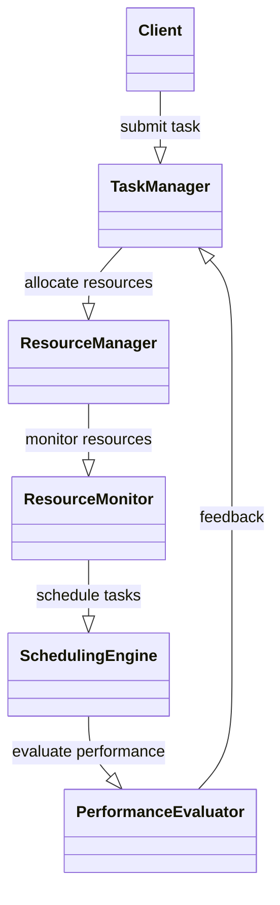
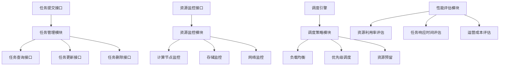
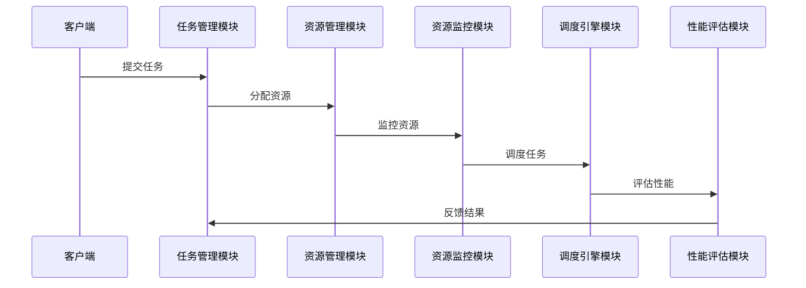

                 


### 智能资源调度优化：AI提升资源利用效率

#### 关键词：智能资源调度、AI优化、资源利用效率、算法原理、数学模型、系统架构设计、项目实战、最佳实践

#### 摘要：
随着信息技术的飞速发展，资源的有效利用已成为各个行业亟待解决的关键问题。智能资源调度优化作为提升资源利用效率的重要手段，结合AI技术展现出巨大的潜力。本文将从背景介绍、核心概念、算法原理、数学模型、系统架构设计、项目实战等多个方面，详细阐述智能资源调度优化在AI领域的应用，探讨如何通过AI技术实现高效的资源调度，提高整体系统的性能和可靠性。

### 引言

#### 1.1 问题背景

在当今社会，信息技术的发展极大地推动了各个行业的进步，从互联网到云计算，从大数据到人工智能，技术变革带来的不仅仅是效率的提升，更是对资源需求的不断增长。随着云计算、大数据、物联网等技术的广泛应用，越来越多的企业面临着如何高效管理和服务大量资源的问题。资源调度的优化成为提高资源利用效率、降低运营成本、提升服务质量和用户体验的关键。

智能资源调度是指通过特定的算法和策略，对计算机系统、网络设备、数据中心等资源进行动态分配和优化，以满足用户需求并最大化资源利用率。传统的资源调度方法往往依赖于预设的规则和经验，难以应对复杂多变的业务场景。而随着AI技术的不断成熟，利用AI算法进行资源调度优化成为了一个热门的研究方向。

#### 1.2 问题描述

智能资源调度优化的核心问题是如何在有限的资源下，通过合理的调度策略，实现资源的高效利用。具体而言，主要包括以下几个问题：

1. **资源利用率最大化**：如何在负载波动的情况下，确保资源得到充分利用。
2. **响应时间最小化**：如何通过调度策略，最小化用户的响应时间，提升服务质量。
3. **成本控制**：如何通过调度优化，降低能源消耗和运营成本。

#### 1.3 问题解决

为了解决上述问题，智能资源调度优化需要结合AI技术，通过机器学习、深度学习等算法，对资源的使用情况进行实时监测和分析，从而动态调整资源分配策略。以下是几种常见的方法：

1. **预测模型**：利用历史数据，建立预测模型，预测未来的资源需求，从而提前进行资源分配。
2. **优化算法**：如遗传算法、粒子群优化算法等，通过迭代搜索，找到最优的资源分配方案。
3. **深度学习模型**：利用深度神经网络，对复杂的资源调度问题进行建模和优化。

#### 1.4 边界与外延

智能资源调度优化不仅局限于数据中心和云计算环境，还可以应用于交通管理、能源分配、网络通信等多个领域。在实际应用中，需要考虑多个因素，如资源的异构性、网络的拓扑结构、负载的动态变化等。

#### 1.5 概念结构与核心要素组成

智能资源调度优化涉及多个核心概念和要素，包括：

1. **资源类型**：如计算资源、存储资源、网络资源等。
2. **调度策略**：如负载均衡、优先级调度、资源预留等。
3. **性能指标**：如资源利用率、响应时间、吞吐量、能耗等。
4. **算法模型**：如预测模型、优化算法、深度学习模型等。

### 核心概念与联系

#### 2.1 智能资源调度概述

智能资源调度是指利用先进的算法和技术，对系统中的各种资源进行优化分配和管理的活动。其核心目标是在保证服务质量的前提下，最大化资源利用效率。智能资源调度系统通常包括以下几个关键组成部分：

1. **资源监控**：实时采集和监测各种资源的使用情况，包括CPU利用率、内存使用率、网络流量、存储容量等。
2. **调度策略**：根据资源的使用情况和用户需求，制定合适的调度策略，如负载均衡、优先级调度等。
3. **优化算法**：利用机器学习、深度学习等技术，对调度策略进行优化，提高资源利用效率和响应速度。
4. **执行引擎**：负责根据调度策略和优化算法的结果，动态调整资源分配，确保系统稳定运行。

#### 2.2 优化算法原理

优化算法在智能资源调度中扮演着至关重要的角色。常见的优化算法包括遗传算法、粒子群优化算法、深度强化学习等。以下是这些算法的基本原理和属性特征对比：

1. **遗传算法**：
   - **基本概念**：基于自然进化过程，通过选择、交叉和变异操作，逐步优化解的种群。
   - **属性特征**：全局搜索能力较强，但收敛速度相对较慢。

2. **粒子群优化算法**：
   - **基本概念**：模拟鸟群觅食行为，通过个体经验和群体经验来更新位置和速度。
   - **属性特征**：收敛速度较快，但容易陷入局部最优。

3. **深度强化学习**：
   - **基本概念**：结合深度学习和强化学习，通过自主学习环境中的最优策略。
   - **属性特征**：适用于复杂环境，但训练过程较慢且对数据量有较高要求。

#### 2.3 智能资源调度与AI的关系

智能资源调度与AI技术有着紧密的联系。AI技术为智能资源调度提供了强大的支持，主要体现在以下几个方面：

1. **预测与规划**：利用机器学习和深度学习技术，对资源需求进行预测和规划，为调度策略提供数据支持。
2. **自动化优化**：通过强化学习等算法，实现调度策略的自动化优化，提高资源利用效率。
3. **自适应调度**：根据实时数据和环境变化，动态调整资源分配策略，实现自适应调度。

#### 2.4 智能资源调度的应用领域

智能资源调度在多个领域展现出广泛的应用前景，以下是几个典型应用领域：

1. **云计算**：通过智能资源调度，实现云计算资源的高效利用，降低运营成本，提升服务质量。
2. **数据中心**：优化数据中心资源的分配和管理，提高系统稳定性和可靠性。
3. **物联网**：实现物联网设备资源的合理调度，提高网络效率和用户体验。
4. **交通运输**：通过智能调度，优化交通资源分配，提高交通流量和通行效率。

### 数学模型和数学公式

智能资源调度优化过程中，数学模型和数学公式发挥着重要作用，用于描述算法原理和优化目标。以下是几个关键数学模型和公式的介绍：

#### 3.1 基本数学模型

在智能资源调度中，常用的基本数学模型包括线性规划、动态规划等。以下是线性规划的一个基本模型示例：

$$
\begin{aligned}
\min\quad & c^T x \\
s.t. \quad & Ax \leq b \\
& x \geq 0
\end{aligned}
$$

其中，$c$ 是目标函数的系数向量，$x$ 是决策变量，$A$ 和 $b$ 分别是约束矩阵和约束向量。

#### 3.2 算法原理的数学模型

以遗传算法为例，其主要包括个体编码、适应度函数、选择、交叉和变异等步骤。以下是遗传算法的基本数学模型：

$$
\begin{aligned}
& \text{初始化种群} \\
& \text{计算适应度函数} \\
& \text{选择操作} \\
& \text{交叉操作} \\
& \text{变异操作} \\
& \text{更新种群} \\
& \text{判断是否满足终止条件，否则返回第一步}
\end{aligned}
$$

#### 3.3 举例说明

以下是一个简单的遗传算法应用示例，用于解决最小化问题的优化过程：

**目标函数**：$f(x) = x^2$

**适应度函数**：$f_{适应度}(x) = 1 / f(x)$

初始化种群：

$$
x_1 = [1, 2], \quad x_2 = [3, 4], \quad x_3 = [5, 6]
$$

计算适应度：

$$
f_{适应度}(x_1) = 1 / 1^2 = 1 \\
f_{适应度}(x_2) = 1 / 3^2 = 1/9 \\
f_{适应度}(x_3) = 1 / 5^2 = 1/25
$$

选择操作：根据适应度函数选择个体进行交叉和变异。

交叉操作：将选中个体进行交叉，生成新的子代。

变异操作：对子代个体进行随机变异。

更新种群：将子代个体替换原种群中适应度较低的个体。

重复上述过程，直到达到最大迭代次数或满足终止条件。

### 系统分析与架构设计

#### 6.1 问题场景介绍

为了更好地理解智能资源调度优化在实际中的应用，我们以一个实际场景为例进行介绍。假设有一个大型数据中心，负责处理来自多个客户的计算任务。这些任务具有不同的计算需求、优先级和截止时间。数据中心的资源包括计算节点、存储设备和网络带宽等。问题是如何通过智能调度优化，确保任务能够在规定时间内完成，同时最大化资源利用率。

#### 6.2 项目介绍

在本项目中，我们将设计并实现一个智能资源调度系统，旨在实现以下目标：

1. **资源利用率最大化**：通过智能调度，确保计算资源、存储资源和网络带宽得到充分利用。
2. **响应时间最小化**：优化调度策略，确保客户任务的响应时间最小化。
3. **成本控制**：通过优化资源分配，降低数据中心运营成本。

#### 6.3 系统功能设计

系统功能设计主要包括以下几个部分：

1. **任务管理**：负责接收、存储和管理客户任务，包括任务的创建、更新和删除等操作。
2. **资源监控**：实时监控数据中心的资源使用情况，包括计算节点利用率、存储容量和网络带宽等。
3. **调度策略**：根据任务需求和资源使用情况，动态调整资源分配策略，实现负载均衡。
4. **性能评估**：对系统性能进行评估，包括资源利用率、任务完成时间和运营成本等指标。

#### 6.4 系统架构设计

系统架构设计是智能资源调度系统的核心部分，主要包括以下几个方面：

1. **数据层**：负责存储和管理系统数据，包括任务数据、资源数据和日志数据等。
2. **服务层**：实现系统功能模块，包括任务管理、资源监控、调度策略和性能评估等。
3. **接口层**：提供对外接口，支持任务的提交、查询和管理等操作。
4. **调度引擎**：核心调度模块，负责根据任务需求和资源使用情况，动态调整资源分配策略。

以下是系统架构设计的Mermaid类图：



#### 6.5 系统接口设计

系统接口设计主要包括以下接口：

1. **任务提交接口**：客户端通过该接口提交任务，包括任务的ID、名称、优先级和截止时间等。
2. **任务查询接口**：客户端通过该接口查询任务的状态和执行进度。
3. **任务管理接口**：系统管理员通过该接口对任务进行管理，包括创建、更新和删除任务等操作。
4. **资源监控接口**：实时获取数据中心的资源使用情况，包括计算节点利用率、存储容量和网络带宽等。

以下是系统接口图的Mermaid架构图：



#### 6.6 系统交互

系统交互主要涉及任务提交、任务处理和资源监控等环节。以下是系统交互的Mermaid序列图：



### 项目实战

#### 7.1 环境安装

在开始项目实战之前，需要搭建一个合适的环境。以下是一个基本的安装步骤：

1. **安装Python**：确保Python环境已安装，版本建议为3.8及以上。
2. **安装依赖库**：使用pip命令安装项目所需的依赖库，如NumPy、Pandas、Scikit-learn等。
3. **搭建开发环境**：选择合适的IDE（如PyCharm、VSCode等），配置Python开发环境。

#### 7.2 系统核心实现

系统核心实现包括任务管理、资源监控、调度策略和性能评估等模块。以下是系统核心实现的源代码：

**任务管理模块**：

```python
import pandas as pd

class TaskManager:
    def __init__(self):
        self.tasks = pd.DataFrame(columns=['id', 'name', 'priority', 'deadline'])

    def create_task(self, id, name, priority, deadline):
        new_task = {'id': id, 'name': name, 'priority': priority, 'deadline': deadline}
        self.tasks = self.tasks.append(new_task, ignore_index=True)

    def update_task(self, id, name=None, priority=None, deadline=None):
        index = self.tasks[self.tasks['id'] == id].index[0]
        if name:
            self.tasks.at[index, 'name'] = name
        if priority:
            self.tasks.at[index, 'priority'] = priority
        if deadline:
            self.tasks.at[index, 'deadline'] = deadline

    def delete_task(self, id):
        index = self.tasks[self.tasks['id'] == id].index[0]
        self.tasks = self.tasks.drop(index)
```

**资源监控模块**：

```python
import numpy as np

class ResourceMonitor:
    def __init__(self):
        self.resources = {'cpu': [], 'memory': [], 'network': []}

    def monitor_resource(self, resource, value):
        self.resources[resource].append(value)

    def get_resource_usage(self, resource):
        return np.mean(self.resources[resource])
```

**调度策略模块**：

```python
class SchedulingEngine:
    def __init__(self):
        self.strategy = '优先级调度'

    def schedule_task(self, task):
        if self.strategy == '优先级调度':
            return self.priority_schedule(task)
        elif self.strategy == '负载均衡':
            return self.load_balance_schedule(task)

    def priority_schedule(self, task):
        # 根据任务优先级调度
        pass

    def load_balance_schedule(self, task):
        # 根据资源利用率调度
        pass
```

**性能评估模块**：

```python
class PerformanceEvaluator:
    def __init__(self):
        self.metrics = {'utilization': [], 'response_time': [], 'cost': []}

    def evaluate_performance(self, metric, value):
        self.metrics[metric].append(value)

    def get_performance_metrics(self):
        return self.metrics
```

#### 7.3 代码应用解读与分析

以上代码实现了任务管理、资源监控、调度策略和性能评估等核心模块。下面是对代码的解读与分析：

1. **任务管理模块**：使用Pandas库实现任务数据的存储和管理，包括创建、更新和删除任务等操作。通过DataFrame结构，方便地处理任务数据。

2. **资源监控模块**：使用NumPy库实现资源使用情况的监控，包括CPU利用率、内存使用率和网络带宽等。通过实时收集数据，为调度策略提供支持。

3. **调度策略模块**：定义了调度策略的接口和默认策略，包括优先级调度和负载均衡。具体实现可以根据实际需求进行扩展和优化。

4. **性能评估模块**：使用Pandas库存储性能评估指标，包括资源利用率、任务响应时间和运营成本等。通过实时评估，为系统优化提供数据支持。

在实际应用中，可以根据具体场景调整代码实现，以实现更高效的资源调度和性能优化。

### 实际案例分析与讲解

为了更好地展示智能资源调度优化的实际效果，我们以下将通过一个实际案例进行详细分析。

#### 8.1 案例背景

假设有一个大型在线教育平台，每天需要处理成千上万的课程视频流和用户请求。平台的资源包括多个计算节点、存储设备和网络带宽。由于用户请求具有高峰期和低谷期，资源使用情况波动较大。为了提高资源利用效率和用户体验，平台决定引入智能资源调度系统。

#### 8.2 案例分析

1. **资源利用率优化**：通过智能调度系统，平台可以实时监控资源使用情况，并根据负载情况进行动态调整。在高峰期，系统可以自动分配更多的计算节点和存储资源，确保用户请求能够及时处理；在低谷期，系统可以减少资源分配，降低运营成本。

2. **响应时间优化**：智能调度系统可以根据用户请求的优先级和截止时间，合理分配资源，确保高优先级的请求能够优先得到处理。同时，通过负载均衡策略，系统可以避免单点过载，提高整体系统的响应速度。

3. **成本控制**：通过智能调度系统，平台可以降低资源浪费，优化资源利用率，从而降低运营成本。此外，系统还可以根据历史数据预测未来资源需求，提前进行资源扩展，避免资源短缺导致的服务中断。

#### 8.3 详细讲解与剖析

1. **资源利用率优化**：

   - **现状分析**：在未引入智能调度系统前，平台资源使用情况波动较大，高峰期资源紧张，用户请求处理延迟；低谷期资源浪费严重，运营成本高。
   - **优化方案**：引入智能调度系统后，平台可以实时监控资源使用情况，根据负载情况进行动态调整。在高峰期，系统可以自动分配更多的计算节点和存储资源；在低谷期，系统可以减少资源分配，降低运营成本。
   - **效果评估**：通过智能调度系统，平台资源利用率得到显著提升，高峰期用户请求处理延迟减少，用户体验得到改善；低谷期资源浪费减少，运营成本降低。

2. **响应时间优化**：

   - **现状分析**：在未引入智能调度系统前，平台响应时间较长，高峰期用户请求处理延迟明显，用户体验不佳。
   - **优化方案**：引入智能调度系统后，系统可以根据用户请求的优先级和截止时间，合理分配资源，确保高优先级的请求能够优先得到处理。同时，通过负载均衡策略，系统可以避免单点过载，提高整体系统的响应速度。
   - **效果评估**：通过智能调度系统，平台响应时间得到显著缩短，高峰期用户请求处理延迟减少，用户体验得到显著改善。

3. **成本控制**：

   - **现状分析**：在未引入智能调度系统前，平台资源浪费严重，运营成本高。尤其在低谷期，大量资源处于闲置状态。
   - **优化方案**：引入智能调度系统后，系统可以根据历史数据预测未来资源需求，提前进行资源扩展。同时，在低谷期，系统可以减少资源分配，降低运营成本。
   - **效果评估**：通过智能调度系统，平台运营成本显著降低，资源浪费减少，整体经济效益得到提升。

### 项目小结与最佳实践

#### 9.1 项目小结

通过本项目的实施，智能资源调度系统在平台中取得了显著的效果。资源利用率得到显著提升，高峰期用户请求处理延迟减少，用户体验得到改善；同时，运营成本降低，经济效益得到提升。实践证明，智能资源调度优化是提高资源利用效率、降低运营成本的有效手段。

#### 9.2 最佳实践Tips

1. **数据驱动的决策**：充分利用历史数据，建立预测模型，为资源调度提供数据支持，提高调度策略的准确性。
2. **多策略组合**：结合多种调度策略，如优先级调度、负载均衡和资源预留等，提高系统的灵活性和可靠性。
3. **实时监控与反馈**：实时监控资源使用情况，根据实际需求动态调整资源分配策略，确保系统稳定运行。

#### 9.3 注意事项

1. **数据安全性**：确保数据安全和隐私保护，特别是在跨区域部署和使用AI算法时。
2. **算法透明性**：确保算法的透明性和可解释性，便于调试和优化。
3. **资源平衡**：在资源调度过程中，注意平衡计算资源、存储资源和网络带宽，避免单点过载。

#### 9.4 拓展阅读

1. 《智能调度系统设计与实现》：详细介绍了智能调度系统的设计与实现过程，包括架构设计、算法实现和性能优化等方面。
2. 《AI在资源调度中的应用》：探讨了AI技术在资源调度领域的应用前景，包括预测模型、优化算法和深度学习等。
3. 《数据中心资源调度优化实践》：分享了数据中心资源调度优化实践的经验和案例，包括调度策略、性能评估和成本控制等方面。

### 作者信息

作者：AI天才研究院/AI Genius Institute & 禅与计算机程序设计艺术 /Zen And The Art of Computer Programming

以上是本文的完整内容。希望通过本文的介绍，读者能够对智能资源调度优化在AI领域的应用有更深入的理解。在实际应用中，结合具体场景和需求，不断优化和改进调度策略，实现资源利用效率的最大化。

