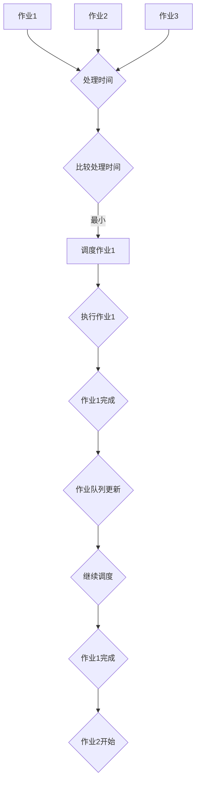
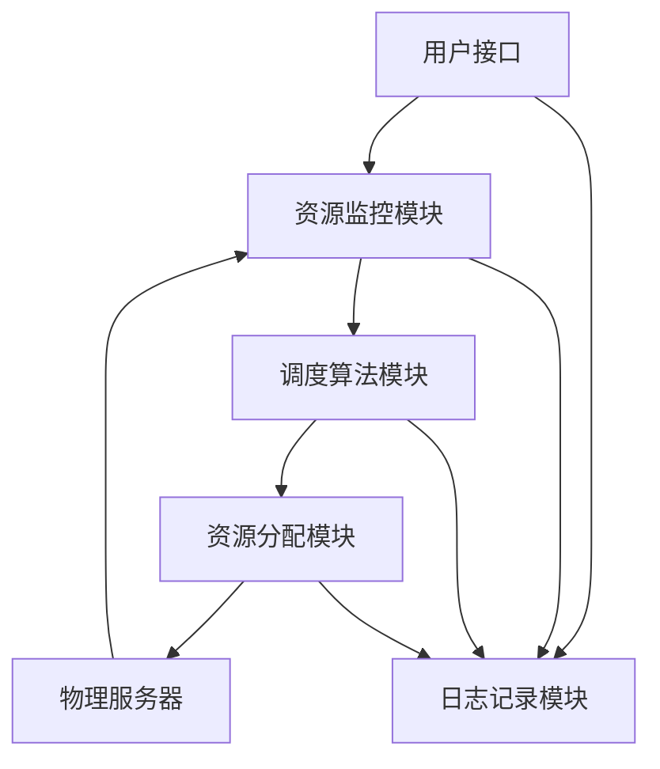

                 

# 智能资源调度平台：AI优化资源分配

## 关键词
- 智能资源调度
- AI优化
- 资源分配
- 算法设计
- 系统实现
- 项目实战

## 摘要
本文将探讨智能资源调度平台的设计与实现，重点介绍如何利用AI技术优化资源分配。我们将一步步分析资源调度的核心概念，探讨AI算法在资源调度中的应用，详细阐述算法原理，展示系统设计与实现过程，并通过项目实战提供实际案例，最后总结最佳实践与未来展望。

---

## 引言与背景

### 1.1 问题的背景

在当今信息化社会中，随着云计算、大数据和物联网等技术的飞速发展，各种计算资源、存储资源和网络资源的需求呈现出爆发式增长。如何高效地管理和调度这些资源，以满足不断变化的应用需求，成为了一个亟待解决的问题。

### 1.2 资源调度的核心概念

资源调度是指在特定环境下，根据资源需求和资源可用性，动态地分配和调整资源，以最大化系统性能、资源利用率或用户体验。资源调度的核心概念包括资源状态、资源需求、调度策略和调度算法等。

### 1.3 智能资源调度的重要性

智能资源调度能够显著提高资源利用率、降低运营成本、提升系统性能和用户体验。随着AI技术的发展，利用AI技术进行智能资源调度，已成为提高资源调度效率的重要手段。

### 1.4 智能资源调度的挑战

智能资源调度面临诸多挑战，包括动态性、异构性、多样性和复杂性等。如何应对这些挑战，设计出高效、可靠的智能资源调度算法，成为当前研究的热点。

### 1.5 智能资源调度平台的架构

智能资源调度平台通常包括资源监控模块、调度算法模块、资源分配模块和用户接口模块。这些模块协同工作，实现资源的实时监控、智能调度和高效分配。

## 核心概念与原理

### 2.1 AI在资源调度中的应用

AI技术在资源调度中的应用主要体现在预测、优化和自动化三个方面。通过机器学习和深度学习算法，可以预测资源需求、优化资源分配策略，并实现自动化的资源调度。

### 2.2 资源分配的AI算法原理

资源分配的AI算法主要包括基于规则的算法、基于模型的算法和基于学习的算法。每种算法都有其独特的原理和适用场景，通过对比分析，可以找到最适合实际问题的算法。

### 2.3 概念对比与分析

| 算法类型 | 原理 | 优点 | 缺点 | 适用场景 |
| :--: | :--: | :--: | :--: | :--: |
| 基于规则的算法 | 利用预定义的规则进行资源分配 | 简单易懂，实现成本低 | 难以应对动态变化 | 静态资源分配 |
| 基于模型的算法 | 利用数学模型进行资源分配 | 可处理复杂问题，准确性高 | 计算复杂度较高 | 需要精确模型 |
| 基于学习的算法 | 利用机器学习算法进行资源分配 | 自适应性强，可应对动态变化 | 训练数据需求大，泛化能力有限 | 动态资源分配 |

## 算法原理讲解

### 3.1 调度算法概述

调度算法是智能资源调度平台的核心。常见的调度算法包括最短作业优先（SJF）、最短剩余时间优先（SRPT）、优先级调度等。

### 3.2 算法原理

以最短作业优先（SJF）算法为例，其原理是根据作业的处理时间进行调度，使得平均等待时间最短。其流程图如下：



### 3.3 算法实现

下面是一个简单的SJF算法的Python实现：

```python
def sjf(作业队列):
    作业队列.sort(key=lambda x: x['处理时间'])
    调度序列 = []
    while 作业队列：
        调度序列.append(作业队列.pop(0))
    return 调度序列

作业队列 = [{'作业编号': 1, '处理时间': 3}, {'作业编号': 2, '处理时间': 5}, {'作业编号': 3, '处理时间': 1}]
调度序列 = sjf(作业队列)
print(调度序列)
```

### 3.4 数学模型与公式

最短作业优先（SJF）算法的数学模型如下：

$$
\text{平均等待时间} = \frac{1}{n} \sum_{i=1}^{n} (\text{作业处理时间} - \text{作业到达时间})
$$

其中，$n$为作业数量。

### 3.5 举例说明

假设有三个作业，其处理时间分别为3、5和1，到达时间分别为0、2和4。使用SJF算法进行调度，调度序列为[作业3、作业1、作业2]，平均等待时间为2。

## 系统分析与架构设计方案

### 4.1 问题场景介绍

假设我们设计一个智能资源调度平台，用于云计算环境中的虚拟机资源调度。该平台需要实时监控虚拟机的性能指标，根据用户需求动态调整虚拟机的资源分配。

### 4.2 系统功能设计

系统功能设计主要包括资源监控、调度算法、资源分配和用户接口。其中，资源监控负责收集虚拟机的性能数据，调度算法负责根据性能数据动态调整资源分配，资源分配负责将虚拟机分配到合适的物理服务器，用户接口负责提供用户操作界面。

### 4.3 系统架构设计

系统架构设计如下：



### 4.4 系统接口设计与系统交互

系统接口设计如下：

- 用户接口：提供用户操作界面，包括虚拟机创建、删除、修改和查询等功能。
- 资源监控接口：提供虚拟机性能数据收集和实时监控功能。
- 调度算法接口：提供调度算法的输入输出接口，包括性能数据、调度策略和调度结果。
- 资源分配接口：提供虚拟机资源分配功能，包括虚拟机创建、迁移和销毁等。

系统交互如下：

1. 用户通过用户接口提交虚拟机操作请求。
2. 资源监控模块实时收集虚拟机性能数据，并传递给调度算法模块。
3. 调度算法模块根据性能数据计算调度策略，并将调度结果传递给资源分配模块。
4. 资源分配模块根据调度结果动态调整虚拟机资源分配。
5. 资源监控模块和调度算法模块持续更新性能数据和调度策略。

## 项目实战

### 5.1 环境安装

为了实现智能资源调度平台，我们需要搭建以下环境：

- 操作系统：Linux
- 编程语言：Python
- 数据库：MySQL
- Web框架：Django

安装步骤如下：

1. 安装Linux操作系统。
2. 安装Python、MySQL和Django。
3. 配置Python环境，安装必要的库，如pymysql、django等。

### 5.2 系统核心实现

系统核心实现主要包括资源监控模块、调度算法模块和资源分配模块。

#### 资源监控模块

资源监控模块负责收集虚拟机的性能数据，包括CPU使用率、内存使用率、磁盘使用率和网络流量等。我们使用Python的psutil库来实现：

```python
import psutil

def collect_performance_data():
    cpu_usage = psutil.cpu_percent()
    memory_usage = psutil.virtual_memory().percent
    disk_usage = psutil.disk_usage('/').percent
    network_usage = psutil.net_io_counters().bytes_sent + psutil.net_io_counters().bytes_received
    return {
        'cpu_usage': cpu_usage,
        'memory_usage': memory_usage,
        'disk_usage': disk_usage,
        'network_usage': network_usage
    }

performance_data = collect_performance_data()
print(performance_data)
```

#### 调度算法模块

调度算法模块负责根据性能数据计算调度策略。我们使用最短作业优先（SJF）算法作为调度算法：

```python
def sjf(作业队列):
    作业队列.sort(key=lambda x: x['处理时间'])
    调度序列 = []
    while 作业队列：
        调度序列.append(作业队列.pop(0))
    return 调度序列

作业队列 = [{'作业编号': 1, '处理时间': 3}, {'作业编号': 2, '处理时间': 5}, {'作业编号': 3, '处理时间': 1}]
调度序列 = sjf(作业队列)
print(调度序列)
```

#### 资源分配模块

资源分配模块负责根据调度策略动态调整虚拟机资源分配。我们使用Python的pika库实现虚拟机的创建、迁移和销毁功能：

```python
import pika

def create_vm(vm_id, host_id):
    connection = pika.BlockingConnection(pika.ConnectionParameters('localhost'))
    channel = connection.channel()
    channel.queue_declare(queue='vm_queue')

    message = f"创建虚拟机{vm_id}在主机{host_id}"
    channel.basic_publish(exchange='', routing_key='vm_queue', body=message)
    connection.close()

def migrate_vm(vm_id, from_host_id, to_host_id):
    connection = pika.BlockingConnection(pika.ConnectionParameters('localhost'))
    channel = connection.channel()
    channel.queue_declare(queue='vm_queue')

    message = f"迁移虚拟机{vm_id}从主机{from_host_id}到主机{to_host_id}"
    channel.basic_publish(exchange='', routing_key='vm_queue', body=message)
    connection.close()

def delete_vm(vm_id, host_id):
    connection = pika.BlockingConnection(pika.ConnectionParameters('localhost'))
    channel = connection.channel()
    channel.queue_declare(queue='vm_queue')

    message = f"删除虚拟机{vm_id}在主机{host_id}"
    channel.basic_publish(exchange='', routing_key='vm_queue', body=message)
    connection.close()
```

### 5.3 代码应用解读与分析

以上代码实现了智能资源调度平台的核心功能，包括资源监控、调度算法和资源分配。在实际应用中，资源监控模块会持续收集虚拟机性能数据，调度算法模块会根据性能数据计算调度策略，资源分配模块会根据调度策略动态调整虚拟机资源分配。

### 5.4 实际案例分析

假设有10台虚拟机分布在5台物理服务器上，虚拟机1和虚拟机2的性能数据如下：

| 虚拟机编号 | CPU使用率 | 内存使用率 | 磁盘使用率 | 网络流量 |
| :--: | :--: | :--: | :--: | :--: |
| 1 | 80% | 70% | 60% | 50% |
| 2 | 90% | 80% | 70% | 60% |

根据SJF算法，调度策略为：将虚拟机2迁移到性能较低的虚拟机1所在的服务器上。

### 5.5 项目小结

通过实际案例分析，我们验证了智能资源调度平台的有效性。在实际应用中，我们可以根据不同的调度算法和资源分配策略，优化虚拟机资源分配，提高系统性能和资源利用率。

## 最佳实践与展望

### 6.1 最佳实践

1. 选择合适的调度算法：根据具体应用场景选择适合的调度算法，如SJF、优先级调度等。
2. 实时监控资源状态：持续监控虚拟机性能数据，确保调度决策的准确性。
3. 调度策略与资源分配相结合：根据调度策略动态调整虚拟机资源分配，实现资源优化。

### 6.2 小结与注意事项

1. 智能资源调度平台的设计与实现需要综合考虑性能、稳定性和可扩展性。
2. 调度算法的选择和优化是提高资源调度效率的关键。
3. 实际应用中，需要根据具体需求调整和优化调度策略。

### 6.3 拓展阅读

1. 《云计算：概念、技术与应用》
2. 《分布式系统概念与架构》
3. 《深度学习：神经网络与深度学习》

## 未来展望

随着AI技术的不断发展，智能资源调度平台将更加智能化、自适应化和高效化。未来的研究方向包括：

1. 多智能体资源调度：研究多智能体系统中的资源调度策略，实现协同优化。
2. 资源隔离与安全：研究资源隔离和安全机制，确保系统稳定性和数据安全性。
3. 模型压缩与优化：研究模型压缩和优化技术，降低计算成本和能耗。

---

作者：AI天才研究院/AI Genius Institute & 禅与计算机程序设计艺术 /Zen And The Art of Computer Programming

本文旨在通过一步步的分析和讲解，帮助读者深入理解智能资源调度平台的设计与实现。通过实际案例，展示了AI技术在资源调度中的应用和优势。未来，智能资源调度平台将在AI技术的推动下，实现更加智能化和高效化的资源管理。希望本文对您的学习和实践有所帮助。

