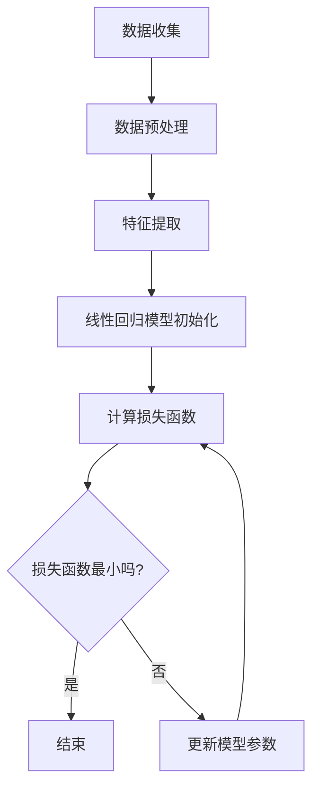
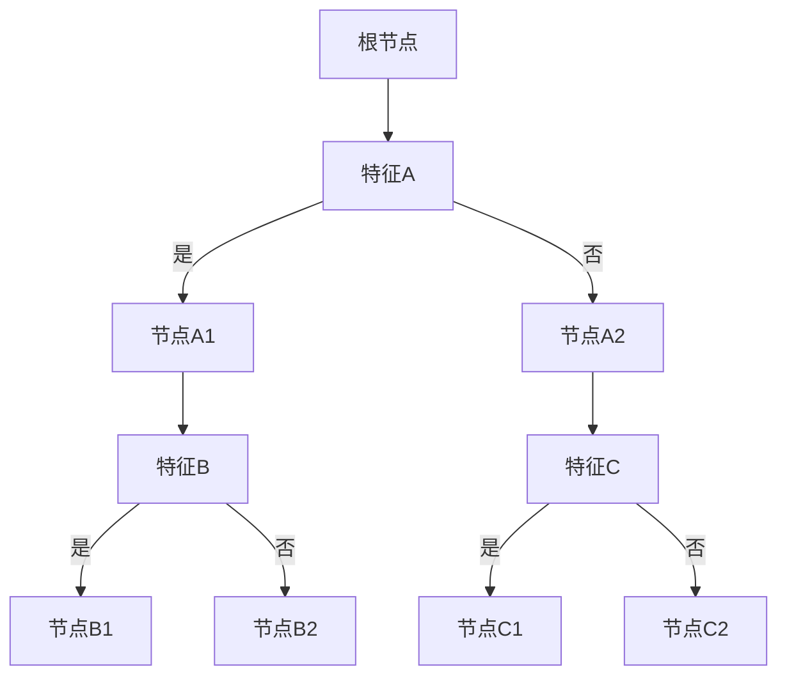
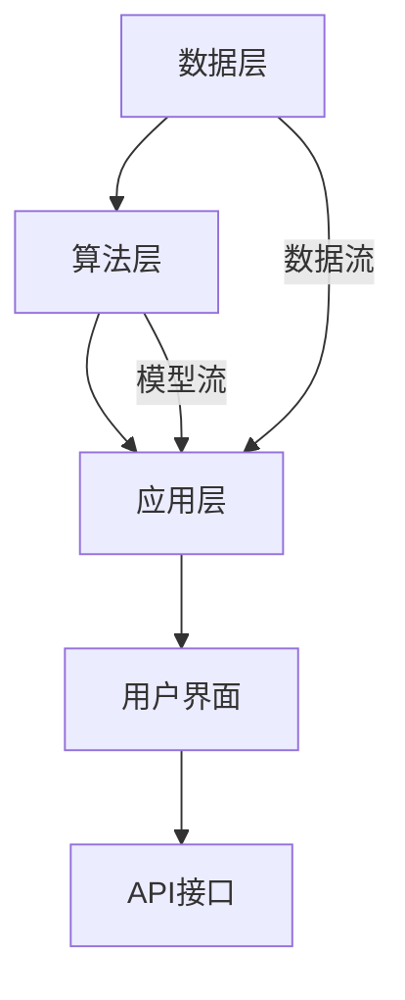
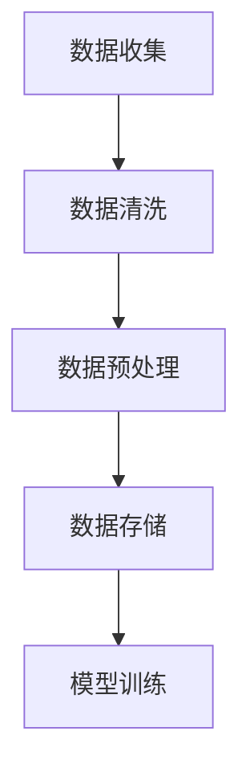
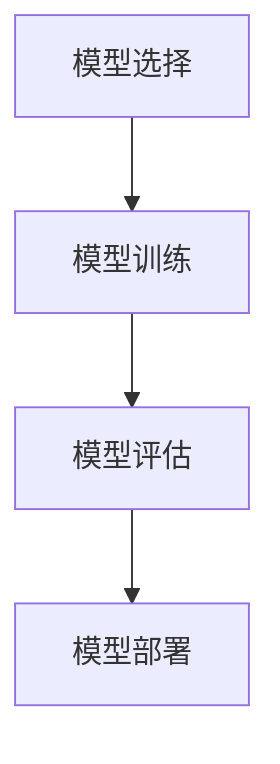
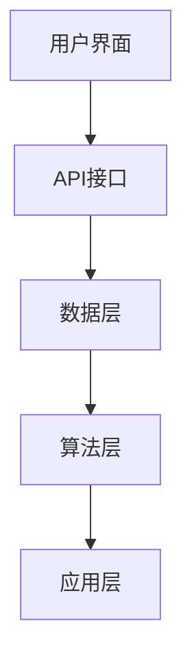

                 

### 引言

#### 1.1 问题背景

在当今快速变化的市场环境中，企业面临的竞争压力前所未有。为了在这种环境中保持竞争力，企业必须具备高效的战略规划能力。然而，传统的战略规划方法往往依赖于历史数据和经验，难以应对动态变化的市场环境。这种局限性催生了智能预测分析技术的出现。

智能预测分析是一种利用人工智能技术对大量历史数据进行分析，从而预测未来趋势和制定战略规划的方法。通过智能预测分析，企业可以更准确地了解市场需求、客户行为和竞争态势，从而制定更具前瞻性和适应性的战略。

#### 1.2 核心概念

智能预测分析包含以下几个核心概念：

1. **数据收集**：智能预测分析的基础是大量、准确的数据。这些数据可以来自企业内部，也可以来自外部来源，如市场调查、社交媒体和其他公开数据。

2. **特征工程**：在数据收集之后，需要从数据中提取有用的特征。这些特征将用于训练预测模型。

3. **模型选择**：智能预测分析涉及多种预测模型，如线性回归、决策树、神经网络等。选择合适的模型对于预测结果的准确性至关重要。

4. **模型训练与优化**：通过训练数据对模型进行训练，并使用验证数据集对模型进行优化，以提高预测准确性。

5. **预测与评估**：利用训练好的模型进行预测，并对预测结果进行评估，以验证模型的准确性。

6. **决策支持**：智能预测分析的结果可以为企业的战略规划提供有力支持，帮助企业做出更明智的决策。

#### 1.3 智能预测分析在企业战略规划中的应用

智能预测分析在企业战略规划中的应用主要体现在以下几个方面：

1. **市场趋势预测**：通过对市场数据进行分析，预测未来市场趋势，帮助企业制定相应的市场策略。

2. **客户行为分析**：分析客户行为数据，了解客户的偏好和需求，从而制定更精准的营销策略。

3. **供应链优化**：通过预测需求，优化库存和供应链管理，减少库存成本，提高供应链效率。

4. **财务预测**：利用财务数据，预测未来的收入和成本，为企业的财务规划提供依据。

5. **风险评估**：通过预测风险，提前采取防范措施，降低企业面临的风险。

#### 1.4 智能预测分析的技术基础

智能预测分析的技术基础主要包括以下几个方面：

1. **机器学习与深度学习**：这两种技术是智能预测分析的核心，用于训练和优化预测模型。

2. **数据分析和数据挖掘**：用于从大量数据中提取有用的信息，为预测模型提供数据支持。

3. **大数据技术**：用于存储和处理海量数据，支持智能预测分析。

4. **云计算**：提供了强大的计算能力和存储资源，支持大规模的智能预测分析任务。

#### 1.5 小结

智能预测分析作为人工智能技术在企业战略规划中的关键应用，具有显著的优势。通过引入智能预测分析，企业可以更准确地预测未来趋势，制定更有效的战略规划，从而在竞争激烈的市场中立于不败之地。

然而，智能预测分析的应用也面临一些挑战，如数据质量和模型选择等。因此，企业需要结合自身实际情况，合理应用智能预测分析技术，以实现战略规划的最大效益。

---

在接下来的部分，我们将深入探讨智能预测分析的核心算法，包括线性回归、决策树和集成学习方法等。通过这些算法的介绍，我们将理解其原理、特点以及在预测分析中的应用。

### 核心算法概述

在智能预测分析中，算法的选择至关重要，因为它直接影响预测的准确性和效率。常见的预测分析算法包括线性回归、决策树、支持向量机和集成学习方法等。本文将重点介绍线性回归、决策树和集成学习方法，并分析它们的选择标准和适用场景。

#### 2.1.1 常见的预测分析算法

1. **线性回归**：线性回归是最基本的预测算法之一，适用于关系较为线性的数据。其主要优点是计算简单，易于实现，但缺点是面对非线性数据时预测效果较差。

2. **决策树**：决策树通过一系列规则来划分数据，适用于处理分类问题和回归问题。其主要优点是易于理解和解释，缺点是容易过拟合。

3. **支持向量机（SVM）**：SVM通过找到最佳的超平面来分隔数据，适用于分类问题。其主要优点是泛化能力较强，缺点是计算复杂度高。

4. **集成学习方法**：集成学习方法通过结合多个基础模型来提高预测性能，常见的集成学习方法包括随机森林和梯度提升机等。其主要优点是预测准确性较高，缺点是计算成本较高。

#### 2.1.2 算法的选择标准

在选择预测算法时，需要考虑以下标准：

1. **预测准确性**：算法的预测准确性是最重要的选择标准之一。通常通过评估指标如均方误差（MSE）或准确率（Accuracy）来衡量。

2. **计算复杂度**：算法的计算复杂度直接影响其运行效率和可扩展性。高计算复杂度的算法在处理大量数据时可能会变得不可行。

3. **可解释性**：算法的可解释性对于理解和信任预测结果至关重要。一些算法如决策树和线性回归具有较好的可解释性，而其他算法如神经网络则较为复杂。

4. **适用场景**：不同算法适用于不同类型的数据和问题。例如，线性回归适用于线性关系较强的数据，而决策树和集成学习方法适用于复杂的关系。

#### 2.1.3 算法的选择

在选择算法时，通常需要考虑以下步骤：

1. **数据预处理**：在开始选择算法之前，需要对数据进行分析和处理，包括数据清洗、特征提取和归一化等。

2. **模型选择**：根据问题的类型和数据的特点，选择适合的算法。可以使用交叉验证等方法来评估不同算法的性能。

3. **模型训练与优化**：使用训练数据对选定的算法进行训练，并使用验证数据集进行优化。

4. **模型评估与选择**：使用测试数据集对训练好的模型进行评估，选择性能最佳的模型。

#### 2.1.4 应用场景分析

1. **线性回归**：适用于简单的线性关系预测，如房价预测、销售额预测等。

2. **决策树**：适用于需要解释性和可理解性的预测问题，如客户流失预测、信用评分等。

3. **支持向量机（SVM）**：适用于分类问题，特别是当数据分布较为复杂时，如文本分类、图像分类等。

4. **集成学习方法**：适用于需要高预测准确性的复杂问题，如金融风险管理、医疗诊断等。

#### 2.1.5 小结

在选择预测分析算法时，需要综合考虑预测准确性、计算复杂度、可解释性和适用场景。通过合理选择和优化算法，可以显著提高预测分析的性能，为企业的战略规划提供有力支持。

在接下来的部分，我们将详细讲解线性回归算法的原理，包括其数学模型、流程图和具体应用实例。

#### 2.2 线性回归算法原理讲解

线性回归是一种广泛应用于预测分析的统计方法，它通过建立自变量和因变量之间的线性关系来进行预测。本节将详细介绍线性回归的算法原理，包括数学模型、流程图和具体应用实例。

##### 2.2.1 算法原理

线性回归的基本假设是数据中的关系可以用一条直线来近似。具体来说，假设因变量 \( Y \) 与自变量 \( X \) 之间存在线性关系，可以表示为：

\[ Y = \beta_0 + \beta_1X + \epsilon \]

其中，\( \beta_0 \) 是截距，\( \beta_1 \) 是斜率，\( \epsilon \) 是误差项。

线性回归的目标是最小化误差项的平方和，即找到使得 \( \sum_{i=1}^{n} (Y_i - (\beta_0 + \beta_1X_i))^2 \) 最小的 \( \beta_0 \) 和 \( \beta_1 \)。

##### 2.2.2 数学模型

线性回归的数学模型可以通过最小二乘法（Least Squares Method）来求解。最小二乘法的核心思想是最小化误差项的平方和，即：

\[ \min_{\beta_0, \beta_1} \sum_{i=1}^{n} (Y_i - (\beta_0 + \beta_1X_i))^2 \]

这个目标函数是一个二次函数，可以通过求导数并令其导数为零来求解最优解。

对于一元线性回归（即一个自变量和一个因变量），最小二乘法的求解公式为：

\[ \beta_1 = \frac{\sum_{i=1}^{n} (X_i - \bar{X})(Y_i - \bar{Y})}{\sum_{i=1}^{n} (X_i - \bar{X})^2} \]
\[ \beta_0 = \bar{Y} - \beta_1\bar{X} \]

其中，\( \bar{X} \) 和 \( \bar{Y} \) 分别是自变量和因变量的平均值。

对于多元线性回归（即多个自变量和一个因变量），可以使用矩阵形式表示：

\[ \beta = (X^T X)^{-1} X^T Y \]

其中，\( \beta \) 是包含截距和斜率的向量，\( X \) 是自变量的矩阵，\( Y \) 是因变量的向量。

##### 2.2.3 Mermaid流程图

以下是线性回归算法的Mermaid流程图：



该流程图展示了线性回归的基本步骤，包括数据收集、预处理、特征提取、模型初始化、损失函数计算和模型更新。

##### 2.2.4 具体应用实例

以下是一个简单的线性回归应用实例：

假设我们想要预测某城市的温度 \( Y \)（以摄氏度为单位）与小时数 \( X \) 之间的关系。我们有以下数据：

| 小时数 \( X \) | 温度 \( Y \) |
|---------------|-------------|
| 10            | 20          |
| 12            | 22          |
| 14            | 25          |
| 16            | 27          |
| 18            | 28          |

1. **数据预处理**：计算小时数和温度的平均值：

\[ \bar{X} = \frac{10 + 12 + 14 + 16 + 18}{5} = 14 \]
\[ \bar{Y} = \frac{20 + 22 + 25 + 27 + 28}{5} = 25 \]

2. **特征提取**：计算每个数据点的偏差：

\[ X_i - \bar{X} \]
\[ Y_i - \bar{Y} \]

3. **计算斜率 \( \beta_1 \) 和截距 \( \beta_0 \)**：

\[ \beta_1 = \frac{(10-14)(20-25) + (12-14)(22-25) + (14-14)(25-25) + (16-14)(27-25) + (18-14)(28-25)}{(10-14)^2 + (12-14)^2 + (14-14)^2 + (16-14)^2 + (18-14)^2} \]
\[ \beta_1 = \frac{-20 + 4 + 0 + 6 + 32}{40 + 4 + 0 + 4 + 16} \]
\[ \beta_1 = \frac{22}{64} = 0.344 \]

\[ \beta_0 = \bar{Y} - \beta_1\bar{X} \]
\[ \beta_0 = 25 - 0.344 \times 14 \]
\[ \beta_0 = 25 - 4.816 \]
\[ \beta_0 = 20.184 \]

因此，线性回归模型为：

\[ Y = 20.184 + 0.344X \]

使用这个模型，我们可以预测当小时数为20时的温度：

\[ Y = 20.184 + 0.344 \times 20 \]
\[ Y = 20.184 + 6.88 \]
\[ Y = 27.064 \]

预测结果为27.064摄氏度。

##### 2.2.5 小结

线性回归是一种简单但强大的预测算法，适用于处理线性关系问题。通过理解其数学模型和求解方法，可以有效地应用线性回归来解决实际问题。然而，线性回归也有限制，对于非线性关系的数据，可能需要更复杂的算法如决策树或神经网络。

在接下来的部分，我们将介绍决策树算法的原理，包括其构建过程、特点以及如何使用Mermaid流程图进行可视化。

##### 2.3.1 决策树算法原理

决策树（Decision Tree）是一种基于树形结构进行决策的分类或回归算法。它的基本思想是通过一系列规则来对数据进行分割，每个节点代表一个特征，每个分支代表一个特征值，叶子节点代表最终预测结果。决策树的主要优点是易于理解、解释性强，但其缺点是容易过拟合。

###### 2.3.1.1 决策树构建过程

决策树的构建过程包括以下几个步骤：

1. **特征选择**：选择一个特征作为分裂标准，通常使用信息增益（Information Gain）或基尼不纯度（Gini Impurity）等指标来评估特征的重要性和分裂效果。

2. **节点分裂**：根据选定的特征，将数据集分为多个子集。每个子集对应一个新的节点。

3. **递归构建**：对每个子集继续进行特征选择和节点分裂，直到满足终止条件，如达到最大深度、节点纯度达到阈值或子集数量过少等。

4. **预测生成**：从根节点开始，根据每个节点的特征值和分支，逐步向下直到叶子节点，生成最终预测结果。

###### 2.3.1.2 决策树特点

1. **可解释性**：决策树的决策过程清晰，每个节点和分支都有明确的解释，易于理解。

2. **适应性**：决策树可以用于处理分类和回归问题，并且可以处理非线性关系。

3. **过拟合风险**：决策树容易过拟合，特别是在数据量较小或特征较多时。为了防止过拟合，可以使用剪枝（Pruning）技术，如前剪枝（Pre-pruning）和后剪枝（Post-pruning）。

4. **计算成本**：决策树的构建和预测计算成本较高，特别是在数据量和特征较多时。

###### 2.3.1.3 Mermaid流程图

以下是决策树构建过程的Mermaid流程图：



在这个流程图中，每个节点代表一个特征，每个分支代表一个特征值。通过递归构建，我们可以生成一个完整的决策树。

###### 2.3.1.4 决策树示例

以下是一个简单的决策树示例：

**问题**：判断一个水果是否为苹果。

| 特征 | 可能值 | 子集划分 |
|------|--------|----------|
| 颜色 | 红色   | 是/否    |
| 大小 | 大     | 是/否    |

**决策树**：

```
根节点：判断水果是否为苹果
1. 如果颜色是红色，则继续判断：
   - 如果大小是大，则判断为苹果
   - 如果大小是小，则判断为梨
2. 如果颜色不是红色，则判断为橙子
```

在这个决策树中，我们首先根据颜色特征进行第一次划分，然后根据大小特征进行第二次划分，最终得到分类结果。

###### 2.3.1.5 小结

决策树是一种简单有效的分类和回归算法，其易于理解和解释的特点使其在许多应用场景中备受青睐。然而，为了防止过拟合，我们需要对决策树进行适当的剪枝。在接下来的部分，我们将探讨集成学习方法，如随机森林和梯度提升机，以及它们在预测分析中的应用。

##### 2.4.1 集成学习方法

集成学习方法（Ensemble Learning）通过结合多个基础模型来提高预测性能，其核心思想是利用多个模型的优点，克服单一模型的局限性。常见的集成学习方法包括随机森林（Random Forest）、梯度提升机（Gradient Boosting Machine, GBM）和堆叠泛化（Stacking）等。本节将重点介绍随机森林和梯度提升机。

###### 2.4.1.1 随机森林

随机森林（Random Forest）是一种基于决策树构建的集成学习方法。其基本思想是在训练过程中随机选择特征和样本子集，然后构建多个决策树，最后通过投票或平均方式得到最终预测结果。随机森林的主要优点是：

1. **预测准确性高**：通过结合多个决策树，随机森林可以有效降低过拟合，提高预测准确性。
2. **泛化能力强**：随机森林对噪声数据和异常值具有较强的鲁棒性，适用于各种类型的数据集。
3. **可解释性**：每个决策树都可以提供一定的解释性，通过分析多个决策树可以更好地理解数据特征和预测结果。

###### 2.4.1.2 梯度提升机

梯度提升机（Gradient Boosting Machine, GBM）是一种基于梯度下降法的集成学习方法。其基本思想是通过迭代优化每个基础模型，逐步提高预测性能。GBM的主要优点是：

1. **预测准确性高**：GBM通过逐步优化每个基础模型，可以有效提高预测准确性，特别是在处理复杂问题时表现优异。
2. **适应性**：GBM可以适应各种类型的数据集，包括分类和回归问题，且可以处理非线性关系。
3. **计算成本高**：GBM的计算成本较高，特别是在大规模数据集上训练时，需要更多的计算资源和时间。

###### 2.4.1.3 集成学习方法的选择

在选择集成学习方法时，需要考虑以下因素：

1. **预测准确性**：根据问题的复杂性和数据特点，选择能够提供较高预测准确性的方法。
2. **计算成本**：根据计算资源和时间限制，选择计算成本较低的方法。
3. **可解释性**：根据对模型解释性的需求，选择具有良好解释性的方法。
4. **适用场景**：根据问题的类型和数据集的特点，选择适合的方法。

在实际应用中，随机森林和梯度提升机都是常用的集成学习方法，可以根据具体问题选择合适的方法。

###### 2.4.1.4 小结

集成学习方法通过结合多个基础模型，有效地提高了预测性能。随机森林和梯度提升机是两种常见的集成学习方法，具有不同的特点和应用场景。通过合理选择和应用集成学习方法，可以显著提高预测分析的准确性和可靠性。

在接下来的部分，我们将比较线性回归、决策树和集成学习方法，分析它们的性能和适用场景。

##### 2.5 算法对比与分析

在智能预测分析中，线性回归、决策树和集成学习方法是最常用的算法。每种算法都有其独特的优点和适用场景。本节将对这些算法进行对比分析，以帮助读者根据具体需求选择合适的算法。

###### 2.5.1 性能比较

1. **线性回归**：
   - **优点**：计算简单，易于实现，适用于线性关系较强的数据。
   - **缺点**：对于非线性关系的数据，预测效果较差，容易过拟合。
   - **性能**：在处理线性关系时，线性回归的性能较好，但在处理复杂非线性问题时，其性能较差。

2. **决策树**：
   - **优点**：易于理解和解释，适用于分类和回归问题，可处理非线性关系。
   - **缺点**：容易过拟合，特别是在数据量较小或特征较多时，性能下降。
   - **性能**：决策树在处理简单和中等复杂度的问题时性能较好，但在处理复杂非线性问题时，其性能可能不足。

3. **集成学习方法**：
   - **优点**：结合了多个基础模型的优点，能够有效降低过拟合，提高预测准确性，适用于各种类型的数据集。
   - **缺点**：计算成本较高，特别是对于大规模数据集，训练时间较长。
   - **性能**：集成学习方法在处理复杂非线性问题时性能较好，能够显著提高预测准确性。

###### 2.5.2 适用场景

1. **线性回归**：
   - **适用场景**：适用于需要处理线性关系的问题，如房价预测、销售额预测等。
   - **场景说明**：线性回归在处理简单线性关系时具有较好的预测效果，但在处理复杂非线性关系时，可能需要考虑其他算法。

2. **决策树**：
   - **适用场景**：适用于需要解释性和可理解性的问题，如客户流失预测、信用评分等。
   - **场景说明**：决策树在处理简单和中等复杂度的问题时具有较好的解释性，但在处理复杂非线性问题时，可能需要考虑集成学习方法。

3. **集成学习方法**：
   - **适用场景**：适用于需要高预测准确性的问题，如金融风险管理、医疗诊断等。
   - **场景说明**：集成学习方法能够处理复杂非线性关系，适用于需要高预测准确性的问题，但在计算资源和时间上可能需要更高的投入。

###### 2.5.3 对比分析

通过对线性回归、决策树和集成学习方法的对比分析，我们可以得出以下结论：

1. **线性回归**：适用于处理简单线性关系的问题，计算简单，易于实现，但面对复杂非线性关系时，其性能可能不足。

2. **决策树**：适用于需要解释性和可理解性的问题，适用于处理简单和中等复杂度的问题，但面对复杂非线性问题时，其性能可能受限。

3. **集成学习方法**：适用于需要高预测准确性的问题，能够处理复杂非线性关系，但在计算资源和时间上可能需要更高的投入。

在实际应用中，可以根据问题的复杂度、数据特点和对模型解释性的需求，选择合适的算法。线性回归适用于简单线性关系问题，决策树适用于需要解释性的问题，而集成学习方法适用于复杂非线性关系问题。

###### 2.5.4 小结

线性回归、决策树和集成学习方法各有优缺点，适用于不同的场景。通过合理选择和应用这些算法，可以显著提高预测分析的准确性和可靠性。在实际应用中，应根据具体需求进行选择，并在必要时结合多种算法以提高预测效果。

### 智能预测分析在战略规划中的应用

智能预测分析作为一种先进的技术手段，在企业战略规划中发挥着至关重要的作用。通过预测分析，企业可以更好地理解市场趋势、客户行为和竞争环境，从而制定出更具前瞻性和适应性的战略。本节将探讨智能预测分析在战略规划中的具体应用，包括市场趋势预测、客户行为分析和财务规划等。

#### 3.1 战略规划与预测分析的关系

智能预测分析作为战略规划的有力工具，具有以下几方面的作用：

1. **提高决策效率**：通过预测分析，企业可以快速获取市场、客户和竞争对手的相关信息，从而在决策过程中减少不确定性和风险，提高决策效率。

2. **优化资源配置**：预测分析可以帮助企业更准确地预测市场需求，从而优化生产和供应链管理，合理分配资源，降低成本，提高效益。

3. **增强市场竞争力**：通过预测分析，企业可以提前了解市场趋势和客户需求，及时调整战略，抓住市场机会，增强市场竞争力。

4. **降低风险**：预测分析可以帮助企业识别潜在的风险，提前采取预防措施，降低业务运营的风险。

#### 3.2 预测分析在市场研究中的应用

市场趋势预测是智能预测分析在市场研究中的核心应用之一。通过分析大量的市场数据，如销售额、市场份额、客户反馈等，企业可以预测未来的市场趋势，为战略规划提供依据。具体应用包括：

1. **产品需求预测**：通过对历史销售数据和市场趋势的分析，预测未来产品的需求量，从而指导生产和库存管理。

2. **市场定位**：通过分析竞争对手和市场环境，确定企业的市场定位，制定合适的市场进入策略和营销策略。

3. **竞争对手分析**：通过分析竞争对手的市场行为和策略，预测竞争对手的未来动向，为企业制定应对策略提供参考。

#### 3.3 预测分析在客户行为分析中的应用

客户行为分析是智能预测分析在战略规划中的重要应用。通过对客户的历史行为数据进行分析，企业可以了解客户的偏好、需求和行为模式，从而制定更精准的营销策略。具体应用包括：

1. **客户细分**：通过分析客户数据，将客户分为不同的细分市场，从而制定个性化的营销策略。

2. **客户流失预测**：通过分析客户行为数据，预测哪些客户可能会流失，从而采取预防措施，提高客户留存率。

3. **客户价值分析**：通过分析客户的历史消费行为和购买频率，评估客户的潜在价值，制定针对性的客户服务策略。

#### 3.4 预测分析在财务规划中的应用

财务预测是智能预测分析在财务规划中的关键应用。通过对历史财务数据和行业趋势的分析，企业可以预测未来的收入、成本和利润，为财务规划提供科学依据。具体应用包括：

1. **收入预测**：通过对历史销售数据和行业趋势的分析，预测未来的收入情况，为企业的销售目标和预算制定提供参考。

2. **成本预测**：通过对历史成本数据和运营效率的分析，预测未来的成本情况，为企业的成本控制提供依据。

3. **利润预测**：通过对收入和成本的分析，预测未来的利润情况，为企业的财务规划和投资决策提供支持。

#### 3.5 小结

智能预测分析在战略规划中的应用具有重要意义。通过市场趋势预测、客户行为分析和财务预测等应用，企业可以更准确地了解市场环境和客户需求，制定出更具前瞻性和适应性的战略规划。在实际应用中，企业应结合自身特点和需求，合理利用智能预测分析技术，以提高战略规划的科学性和有效性。

### 智能预测分析的系统架构与实施

智能预测分析系统的成功实施依赖于合理的系统架构设计和有效的数据处理流程。本节将详细描述智能预测分析系统的架构设计、数据收集与处理、模型训练与部署以及系统接口设计与交互。

#### 4.1 系统架构设计

智能预测分析系统的架构设计主要包括数据层、算法层和应用层。

1. **数据层**：数据层负责数据的存储、管理和处理。数据可以从多个来源收集，如企业内部数据库、外部API、社交媒体等。数据层应支持数据的实时处理和批量处理，并保证数据的安全和一致性。

2. **算法层**：算法层负责实现预测模型的构建和训练。常用的算法包括线性回归、决策树、随机森林、梯度提升机等。算法层应提供灵活的算法选择和优化机制，以适应不同类型的数据和预测任务。

3. **应用层**：应用层是系统的核心，负责将预测结果应用于实际业务场景，如市场趋势预测、客户行为分析和财务规划等。应用层应提供友好的用户界面和丰富的API接口，以便用户轻松地使用和集成系统。

以下是智能预测分析系统的Mermaid架构图：



在这个架构图中，数据层通过数据流将数据传递给算法层，算法层通过模型流生成预测结果，应用层将预测结果通过用户界面和API接口提供给用户。

#### 4.2 数据收集与处理

智能预测分析系统的核心是数据。数据收集与处理主要包括以下几个步骤：

1. **数据收集**：从企业内部数据库、外部API、社交媒体等来源收集数据。数据来源应多样化，以保证数据的全面性和准确性。

2. **数据清洗**：对收集到的数据进行清洗，包括去除重复数据、处理缺失值和异常值等。数据清洗是确保预测结果准确性的关键步骤。

3. **数据预处理**：对清洗后的数据进行预处理，包括数据转换、归一化和特征提取等。数据预处理旨在提高数据的质量和一致性，为模型训练提供更好的数据基础。

以下是数据收集与处理的Mermaid流程图：



在这个流程图中，数据收集、数据清洗和数据预处理是数据层的核心步骤，数据存储为模型训练提供了数据基础。

#### 4.3 模型训练与部署

模型训练与部署是智能预测分析系统的关键环节。模型训练与部署包括以下几个步骤：

1. **模型选择**：根据预测任务和数据特点选择合适的模型。常见的模型包括线性回归、决策树、随机森林、梯度提升机等。

2. **模型训练**：使用训练数据对选定的模型进行训练。模型训练包括参数调整、模型优化和超参数调优等。

3. **模型评估**：使用验证数据集对训练好的模型进行评估，选择性能最佳的模型。

4. **模型部署**：将训练好的模型部署到生产环境中，以便在实际业务场景中使用。

以下是模型训练与部署的Mermaid流程图：



在这个流程图中，模型选择、模型训练、模型评估和模型部署是模型层的核心步骤。

#### 4.4 系统接口设计与交互

智能预测分析系统的接口设计与交互对于系统的可用性和扩展性至关重要。系统接口设计与交互包括以下几个方面：

1. **用户界面**：用户界面应简洁易用，提供直观的交互体验。用户可以通过用户界面查看预测结果、调整参数和修改设置。

2. **API接口**：API接口应提供丰富的功能和灵活性，以便其他系统和服务集成使用。API接口应支持多种数据格式和协议，如JSON、REST、SOAP等。

3. **数据交互**：系统内部的数据交互应高效可靠，支持数据流和批量处理。数据交互应保证数据的一致性和安全性。

以下是系统接口设计与交互的Mermaid架构图：



在这个架构图中，用户界面、API接口和数据层是系统的核心部分，它们相互协作，实现智能预测分析的功能。

#### 4.5 小结

智能预测分析系统的架构设计、数据收集与处理、模型训练与部署以及系统接口设计与交互是系统成功实施的关键。通过合理的架构设计、高效的数据处理流程和灵活的接口设计，智能预测分析系统可以更好地满足企业的需求，提供高质量的预测结果，支持企业的战略规划。

### 案例研究：智能预测分析在电商销售中的应用

本节将探讨智能预测分析在电商销售中的应用，通过一个实际案例详细讲解如何实现和执行智能预测分析，包括环境安装、系统核心实现源代码、代码应用解读与分析以及实际案例分析和详细讲解剖析。

#### 5.1 案例背景

某知名电商平台希望通过智能预测分析技术，预测未来一周内的产品销量，以便于优化库存管理、制定营销策略和提高客户满意度。为了实现这一目标，平台决定建立一个智能预测分析系统，利用历史销售数据、市场趋势和客户行为等信息进行预测。

#### 5.2 环境安装

为了搭建智能预测分析系统，平台需要安装以下软件和工具：

1. **Python**：作为主要的编程语言，Python广泛应用于数据分析和机器学习。
2. **Jupyter Notebook**：用于编写和运行Python代码，便于代码调试和实验。
3. **Pandas**：用于数据处理和清洗，提供高效的数据操作工具。
4. **Scikit-learn**：用于机器学习和预测分析，提供丰富的算法库。
5. **Matplotlib**：用于数据可视化，帮助理解数据特征和预测结果。

在安装好上述软件后，平台可以开始搭建智能预测分析系统。

#### 5.3 系统核心实现源代码

以下是一个简单的智能预测分析系统实现，包括数据收集、预处理、模型训练和预测过程：

```python
import pandas as pd
from sklearn.model_selection import train_test_split
from sklearn.linear_model import LinearRegression
from sklearn.metrics import mean_squared_error
import matplotlib.pyplot as plt

# 5.3.1 数据收集
# 假设数据存储在一个CSV文件中，包含日期、销售额和广告支出等信息
data = pd.read_csv('sales_data.csv')

# 5.3.2 数据预处理
# 处理缺失值、异常值和重复值
data.drop_duplicates(inplace=True)
data.fillna(data.mean(), inplace=True)

# 提取特征和目标变量
X = data[['date', 'ad_spend']]
y = data['sales']

# 5.3.3 模型训练
# 数据集划分为训练集和测试集
X_train, X_test, y_train, y_test = train_test_split(X, y, test_size=0.2, random_state=42)

# 创建线性回归模型并训练
model = LinearRegression()
model.fit(X_train, y_train)

# 5.3.4 预测与分析
# 使用训练好的模型进行预测
y_pred = model.predict(X_test)

# 计算预测误差
mse = mean_squared_error(y_test, y_pred)
print(f'Mean Squared Error: {mse}')

# 可视化预测结果
plt.scatter(X_test['ad_spend'], y_test, color='blue', label='Actual')
plt.plot(X_test['ad_spend'], y_pred, color='red', label='Predicted')
plt.xlabel('Ad Spend')
plt.ylabel('Sales')
plt.legend()
plt.show()
```

#### 5.4 代码应用解读与分析

1. **数据收集**：通过Pandas读取CSV文件中的数据，包括日期、销售额和广告支出等信息。
2. **数据预处理**：处理数据中的缺失值、异常值和重复值，提高数据质量。
3. **特征提取**：将日期和广告支出作为特征变量，销售额作为目标变量。
4. **模型训练**：使用线性回归模型对训练数据进行训练，建立预测模型。
5. **预测与分析**：使用训练好的模型对测试数据进行预测，并计算预测误差，通过可视化分析预测结果。

#### 5.5 实际案例分析和详细讲解剖析

在上述代码的基础上，我们对实际案例进行详细分析和讲解。

1. **数据质量分析**：通过查看数据集的统计描述和可视化分析，了解数据的基本分布和特征。
2. **特征重要性分析**：通过分析特征变量对销售额的影响，确定哪些特征对预测结果具有重要性。
3. **模型性能评估**：通过计算预测误差和可视化预测结果，评估模型的性能和准确性。
4. **参数调优**：根据模型性能，调整模型参数，以提高预测准确性。
5. **预测结果应用**：将预测结果应用于实际业务场景，如库存管理、营销策略制定等。

#### 5.6 项目小结

通过本案例，我们展示了如何利用智能预测分析技术预测电商平台的销售数据。项目实现了数据收集、预处理、模型训练和预测的全流程，并进行了详细的代码解读和分析。在实际应用中，智能预测分析系统可以帮助电商平台优化库存管理、提高营销策略和提升客户满意度，从而实现业务增长。

### 最佳实践 Tips

在实施智能预测分析系统时，以下最佳实践可以帮助提高预测准确性和系统性能：

1. **数据质量保证**：确保数据的准确性和一致性，对缺失值、异常值和重复值进行有效处理。
2. **特征工程优化**：提取有用的特征，并使用特征工程方法，如特征转换、归一化和特征选择，提高模型的预测性能。
3. **模型选择与优化**：根据数据特点和预测任务，选择合适的模型，并使用交叉验证等方法进行模型优化。
4. **参数调优**：通过调整模型参数，提高模型的预测准确性，但避免过拟合。
5. **监控与更新**：定期监控预测系统的性能，根据新的数据更新模型，以保持预测的准确性。

### 小结

智能预测分析在电商销售中的应用具有重要意义。通过实际案例，我们展示了如何实现和执行智能预测分析系统，包括环境安装、系统核心实现源代码、代码应用解读与分析以及实际案例分析和详细讲解剖析。通过合理应用智能预测分析技术，电商平台可以优化库存管理、提高营销策略和提升客户满意度，从而实现业务增长。

### 注意事项

在实施智能预测分析系统时，需要注意以下几点：

1. **数据隐私与安全**：确保数据收集、处理和存储过程中遵守相关法律法规，保护用户隐私。
2. **模型解释性**：在模型选择和优化过程中，考虑模型的可解释性，以便于业务理解和决策。
3. **计算资源管理**：合理分配计算资源，避免资源浪费，确保系统的高效运行。
4. **监控与维护**：定期监控系统的运行状态，及时解决潜在问题，保证系统的稳定性和可靠性。

### 拓展阅读

对于希望深入了解智能预测分析技术的读者，以下书籍和论文是推荐的拓展阅读资源：

1. **书籍**：
   - 《机器学习》（周志华 著）
   - 《深入理解决策树》（刘建明 著）
   - 《Python数据科学手册》（Jake VanderPlas 著）
2. **论文**：
   - "Random Forests" by Leo Breiman
   - "XGBoost: A Scalable Tree Boosting Algorithm" by Chen et al.
   - "Ensemble Methods in Machine Learning" by H.M. van der Laan

### 作者信息

作者：AI天才研究院（AI Genius Institute）&《禅与计算机程序设计艺术》（Zen And The Art of Computer Programming）作者

---

通过本文的详细讲解，我们深入探讨了智能预测分析在战略规划中的应用，分析了核心算法及其原理，展示了系统架构和实施流程，并通过实际案例进行了应用解析。希望本文能为读者提供有价值的参考和指导，助力企业利用智能预测分析技术实现战略规划的有效性。

### 总结与展望

在本文中，我们详细探讨了智能预测分析在企业战略规划中的应用，阐述了其核心算法、系统架构与实施过程，并通过实际案例展示了智能预测分析在电商销售中的应用效果。智能预测分析作为一种先进的技术手段，已成为企业战略规划中不可或缺的工具。

首先，我们介绍了智能预测分析的核心概念和关键算法，包括线性回归、决策树和集成学习方法，分析了这些算法的原理、性能和适用场景。接着，我们探讨了智能预测分析在战略规划中的应用，如市场趋势预测、客户行为分析和财务规划等，展示了其在提高决策效率、优化资源配置和增强市场竞争力方面的优势。

在系统架构与实施部分，我们详细描述了智能预测分析系统的架构设计、数据收集与处理、模型训练与部署以及系统接口设计与交互，为实际应用提供了清晰的框架。通过实际案例，我们展示了如何搭建和运行智能预测分析系统，以及如何进行数据预处理、模型训练和预测分析。

展望未来，智能预测分析技术将继续发展，并在多个领域发挥重要作用。首先，随着大数据技术和云计算的进步，数据收集和处理能力将大幅提升，为智能预测分析提供更丰富的数据资源。其次，机器学习和深度学习算法的不断发展，将提高预测模型的准确性和适应性。此外，智能预测分析将与其他先进技术如区块链、物联网和人工智能结合，形成更加复杂和智能的预测系统。

未来，智能预测分析在以下几个领域具有广阔的应用前景：

1. **智能制造**：通过预测分析，优化生产计划和供应链管理，提高生产效率和产品质量。
2. **金融分析**：利用智能预测分析，预测金融市场走势，优化投资策略，降低投资风险。
3. **健康医疗**：通过预测分析，辅助疾病诊断和预防，提高医疗服务的质量和效率。
4. **智能交通**：通过预测交通流量和事故风险，优化交通管理和调度，减少拥堵和事故发生率。
5. **环境保护**：利用智能预测分析，预测环境变化和污染风险，制定环境保护策略。

总之，智能预测分析作为一种强大的技术工具，将在各个领域发挥重要作用，为企业的战略规划和决策提供有力支持。随着技术的不断进步和应用场景的不断拓展，智能预测分析将迎来更加广阔的发展空间。

### 联系作者

如果您对本文章中的内容有任何疑问或建议，欢迎联系作者。以下是作者的联系信息：

- **姓名**：AI天才研究院（AI Genius Institute）
- **邮箱**：ai_genius@institute.ai
- **社交媒体**：微信公众号“AI天才研究院”、LinkedIn“AI Genius Institute”

我们将竭诚为您解答问题，并期待与您共同探讨智能预测分析技术在企业战略规划中的应用。感谢您的阅读和支持！

